# 二、深度学习基础

深度学习一般被认为是机器学习的子集，涉及到**人工神经网络** ( **ANNs** )的训练。人工神经网络处于机器学习的前沿。他们有能力解决涉及大量数据的复杂问题。机器学习的许多原则通常在深度学习中也很重要，因此我们将在这里花一些时间来回顾这些原则。

在本章中，我们将讨论以下主题:

*   机器学习的方法
*   学习任务
*   特征
*   模型
*   人工神经网络

# 机器学习的方法

在一般的机器学习之前，如果我们想要，例如，建立一个垃圾邮件过滤器，我们可以从编辑一个经常出现在垃圾邮件中的单词列表开始。垃圾邮件检测器然后扫描每封电子邮件，当黑名单中的单词数量达到阈值时，该电子邮件将被分类为垃圾邮件。这称为基于规则的方法，如下图所示:

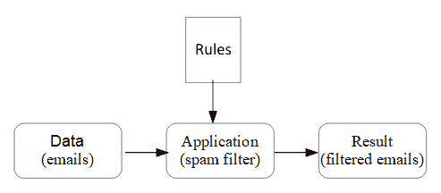

这种方法的问题是，一旦垃圾邮件的作者知道了规则，他们就能够编写电子邮件来避开这个过滤器。负责维护垃圾邮件过滤器的人将不得不不断更新规则列表。有了机器学习，我们可以有效地自动化这个规则更新过程。我们建立并训练一个模型，而不是写一个规则列表。作为垃圾邮件检测器，它将更加准确，因为它可以分析大量的数据。它能够检测数据中的模式，这是人类在有意义的时间范围内不可能做到的。下图说明了这种方法:

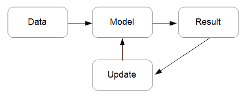

有许多方法可以实现机器学习，这些方法的主要特征在于以下因素:

*   模型是否使用带标签的训练数据进行训练。这里有几种可能性，包括完全监督、半监督、基于强化或完全无监督。
*   无论是在线**(即在新数据出现时即时学习)，还是使用已有数据学习。这被称为批量学习。**
***   无论它们是基于实例的，简单地将新数据与已知数据进行比较，还是基于模型的，包括模式检测和建立预测模型。**

 **这些方法并不相互排斥，大多数算法是这些方法的组合。例如，构建垃圾邮件检测器的典型方法是使用在线的、基于模型的监督学习算法。

# 学习任务

有几种不同类型的学习任务，部分由它们处理的数据类型定义。基于此，我们可以将学习任务分为两大类:

*   **无监督学习**:数据是无标签的，因此算法必须推断变量之间的关系，或者通过找到相似变量的聚类
*   **监督学习**:使用一个带标签的数据集来构建一个推断函数，该函数可以用来预测一个无标签样本的标签

数据是否被标记对构建学习算法的方式具有预先确定的影响。

# 无监督学习

监督学习的一个主要缺点是它需要精确标记的数据。大多数真实世界的数据由未标记和非结构化的数据组成，这是对机器学习和更广泛的人工智能努力的主要挑战。无监督学习在发现非结构化数据中的结构方面起着重要的作用。监督学习和非监督学习之间的划分不是绝对的。许多无监督算法被用来与监督学习相结合；例如，当数据仅被部分标记时，或者当我们试图找到深度学习模型的最重要特征时。

# 使聚集

这是最简单的无监督方法。在许多情况下，数据未被标记并不重要；我们感兴趣的是数据围绕特定点聚集的事实。比如说，推荐在线商店的电影或书籍的推荐系统经常使用聚类技术。这里的方法是让算法分析客户的购买历史，将其与其他客户进行比较，并基于相似性提出建议。算法*将*客户的使用模式分组。该算法在任何时候都不知道这些组是什么；它能够自己解决这个问题。最常用的聚类算法之一是 **k-means** 。该算法通过基于观察样本的平均值建立聚类中心来工作。

# 主成分分析

另一种无监督的方法，通常与监督学习结合使用，是**主成分分析** ( **PCA** )。当我们有大量可能相关的特征，并且我们不确定每个特征对确定结果的影响时，使用这种方法。例如，在天气预报中，我们可以将每个气象观测作为一个特征，并将它们直接提供给模型。这意味着该模型将不得不分析大量数据，其中许多是不相关的。此外，数据可能是相关的，因此我们不仅需要考虑单个特征，还需要考虑这些特征如何相互作用。我们需要的是一种工具，它将把大量可能相关和冗余的特征减少到少量的主要成分中。PCA 属于一种叫做**降维**的算法，因为它减少了输入数据集中的维数。

# 强化学习

强化学习与其他方法有些不同，通常被归类为无监督方法，因为它使用的数据在监督意义上没有标记。强化学习可能比其他方法更接近人类与世界互动和学习的方式。在强化学习中，学习系统被称为**代理**，这个代理通过观察和执行**动作与**环境**交互。**每一个动作都会导致**奖励**或**惩罚**。随着时间的推移，代理必须制定一个策略或**政策**来最大化回报和最小化惩罚。强化学习在许多领域都有应用，例如博弈论和机器人学，其中算法必须在没有直接人类提示的情况下学习其环境。

# 监督学习

在监督学习中，机器学习模型是在标记数据集上训练的。迄今为止，大多数成功的深度学习模型都专注于监督学习任务。在监督学习中，每个数据实例(比如一张图片或一封电子邮件)都有两个元素:一组特征，通常用大写字母 *X* 表示，以及一个标签，用小写字母 *y* 表示。有时，标签被称为目标或答案。

监督学习通常分两个阶段进行:模型学习数据特征的训练阶段，以及对未标记数据进行预测的测试阶段。在单独的数据集上对模型进行训练和测试是很重要的，因为目标是对新数据进行归纳，而不是精确地了解单个数据集的特征。这可能导致训练集过拟合**和测试数据集欠拟合**的常见问题。

# 分类

分类可能是最常见的监督机器学习任务。基于输入和输出标签的数量，有几种类型的分类问题。分类模型的任务是在输入要素中查找模式，并将该模式与标注相关联。模型应该学习数据的区别特征，然后能够预测未标记样本的标记。该模型本质上是根据训练数据构建一个推断函数。我们很快就会看到这个函数是如何构建的。我们可以区分三种类型的分类模型:

*   **二进制分类**:在我们的玩具——没有玩具的例子中，这涉及到区分两个标签。
*   多标签分类:涉及区分两个以上的类别。例如，如果玩具示例被扩展以区分图像中的玩具类型(汽车、卡车、飞机等等)。解决多标签分类问题的一种常用方法是将问题分成多个二元问题。
*   **多输出分类**:每个样本可能有多个输出标签。例如，也许任务是分析场景的图像并确定其中有什么类型的玩具。每个图像可以有多种类型的玩具，因此有多个标签。

# 评估分类器

您可能认为衡量分类器性能的最佳方式是计算成功预测占总预测的比例。然而，考虑一个对手写数字数据集的分类任务，其中目标是所有不是 7 的数字。假设数据是均匀分布的，仅仅猜测每个样本不是 7 将给出 90%的成功率。评估分类器时，我们必须考虑四个变量:

*   **TP 真阳性**:正确识别目标的预测
*   **TN true negative** :正确识别非目标的预测
*   **FP 假阳性**:错误识别目标的预测
*   **FN 假阴性**:错误识别非目标的预测

两个度量标准，*精度*和*召回*，通常一起用于测量分类器的性能。*精度*由以下等式定义:

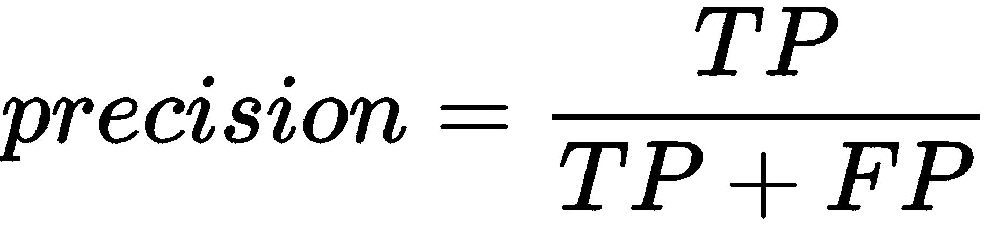

*召回*由以下等式定义:

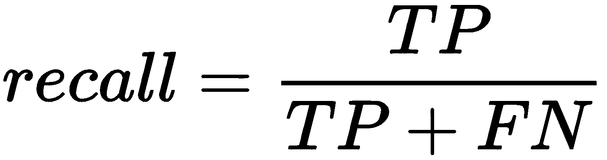

我们可以把这些想法组合成一个混乱矩阵。它被称为混淆矩阵，不是因为它很难理解，而是因为它列出了分类器混淆目标的实例。下图应该会使这一点更加清楚:

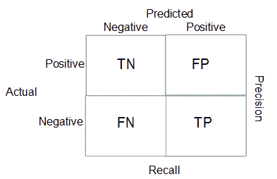

在决定一个分类器的成功与否时，我们使用哪种度量，或者给予多大的权重，实际上取决于应用。在精确度和召回率之间有一个权衡。提高精确度通常会导致召回率的降低。例如，增加真阳性的数量通常意味着增加假阳性率。精确度和召回率的适当平衡取决于应用程序的需求。例如，在癌症的医学测试中，我们可能需要更高的精确度，因为假阴性意味着癌症实例仍未被诊断，具有潜在的致命后果。

# 特征

重要的是要记住，图像检测模型看到的不是图像，而是一组像素颜色值，或者在垃圾邮件过滤器的情况下，是电子邮件中的一组字符。这些是模型的原始特征。机器学习的一个重要部分就是特征转换。我们已经讨论过的一种特征变换是关于主成分分析的维数减少。以下是常见功能转换列表:

*   使用 PCA 等技术降低维数以减少特征的数量
*   将要素缩放或归一化到特定数值范围内
*   转换要素数据类型(例如，为数字指定类别)
*   添加随机或生成的数据以增强特征

每个特征都被编码到我们的输入张量的一个维度上， *X* ，因此为了使学习模型尽可能高效，需要最小化特征的数量。这就是主成分分析和其他降维技术发挥作用的地方。

另一个重要的特征转换是缩放。当特征具有不同尺度时，大多数机器学习模型表现不佳。有两种用于特征缩放的常用技术:

*   **标准化或最小-最大缩放**:数值被移动并重新缩放到零和一之间。这是神经网络最常用的缩放方法。
*   **标准化**:减去平均值，除以方差。这并没有将变量限制在一个特定的范围内，但是最终的分布具有单位方差。

# 处理文本和类别

当一个特征是一组类别而不是一个数字时，我们该怎么办？假设我们正在建立一个预测房价的模型。该模型的一个特征可以是房屋的覆层材料，可能的值有木材、铁和水泥。我们如何对这一特征进行编码，以便对深度学习模型有用？显而易见的解决方案是简单地给每个类别分配一个实数:比如，1 代表木材，2 代表铁，3 代表水泥。这种表示的问题是，它推断类别值是有序的。也就是说，木材和铁在某种程度上比木材和水泥更接近。

避免这种情况的解决方案是**一键编码**。特征值编码为二进制向量，如下表所示:

| **木材** | 一 | 0 | 0 |
| **铁** | 0 | 一 | 0 |
| **水泥** | 0 | 0 | 一 |

当类别值的数量很少时，这种解决方案效果很好。例如，如果数据是文本的语料库，而我们的任务是自然语言处理，那么使用一键编码是不实际的。类别值的数量以及特征向量的长度就是词汇表中的单词数量。在这种情况下，特征向量变得很大并且难以管理。

独热编码使用所谓的稀疏表示。大部分值都是 0。除了不能很好地扩展之外，对于自然语言处理来说，一键编码还有一个严重的缺点。它不编码一个单词的意思，或它与其他单词的关系。我们可以使用的一种方法叫做密集词嵌入。词汇表中的每个单词都由一个实数向量表示，代表特定属性的分数。总的想法是，这个向量编码与手头任务相关的语义信息。例如，如果任务是分析电影评论并根据评论确定电影的类型，我们可以创建词嵌入，如下表所示:

| **字** | **剧情** | **喜剧** | **纪录片** |
| 有趣的 | -4 | 4.5 | 0 |
| 行动 | 3.5 | 2.5 | 2 |
| 焦虑 | 4.5 | 1.5 | 3 |

这里，最左边的列列出了可能出现在电影评论中的单词。每个单词都有一个相对于它在各自流派的评论中出现频率的分数。我们可以从监督学习任务中构建这样一个表，结合电影评论及其标记的流派来分析电影评论。然后，这个经过训练的模型可以应用于未标记的评论，以确定最可能的风格。

模型

# 选择模型表示是机器学习中的一项重要任务。到目前为止，我们一直把模型称为黑盒。输入一些数据，然后基于训练，模型做出预测。在我们深入了解这个黑盒之前，让我们回顾一下理解深度学习模型所需的一些线性代数。

线性代数评论

# 线性代数通过使用矩阵来表示线性方程。在高中教的代数中，我们关心的是标量，也就是单个数值。我们有方程，和操作这些方程的规则，所以它们可以被评估。当我们使用矩阵而不是标量值时，情况也是如此。让我们回顾一下其中涉及的一些概念。

矩阵就是一个简单的矩形数字阵列。我们看到，我们简单地通过添加每个相应的元素来添加两个矩阵。矩阵可以乘以标量，只需将数组中的每个元素乘以标量即可，如下例所示:

这是矩阵加法的一个例子，正如你所预料的，你可以用同样的方式执行矩阵减法，当然，除了不是增加相应的元素，而是减去它们。请注意，我们只能增加或减少相同大小的矩阵。

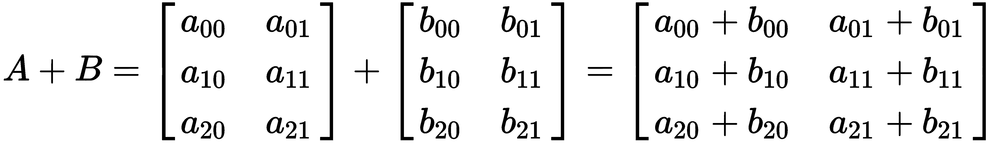

另一种常见的矩阵运算是乘以标量:

注意我们使用的索引样式: *X* [*ij*] ，其中 *i* 指行， *j* 指列。说到索引，有两个约定。在这里，我使用零索引；也就是说，索引从零开始。这是为了与我们在 PyTorch 中索引张量的方式保持一致。请注意，在一些数学文本中，根据您使用的编程语言，索引可能从 1 开始。此外，我们将矩阵的大小或维度称为 *m* 乘 *n，*，其中 *m* 是行数， *n* 是列数。比如 *A* 和 *B* 都是 3×2 矩阵。

矩阵有一种特殊情况叫做向量。这只是一个 *n* 乘 1 的矩阵，因此它有一列和任意数量的行，如下例所示:

现在让我们看看如何用一个矩阵乘以一个向量。在以下示例中，我们将一个 3 x 2 矩阵乘以一个大小为 2 的向量:

一个具体的例子可以使这一点更加清楚:

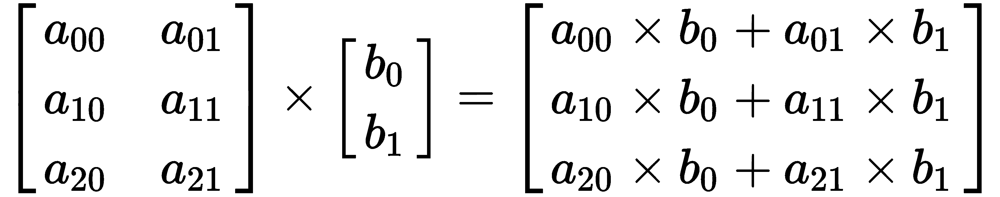

注意，在这里，3×2 矩阵产生一个 3 向量，一般来说， *m* 行矩阵乘以一个向量将产生一个 *m-* 大小的向量。

我们还可以通过组合矩阵向量乘法将矩阵与其他矩阵相乘，如下例所示:

这里:

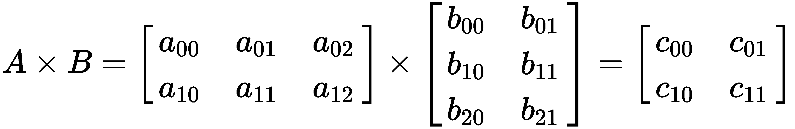

另一种理解方式是，我们通过将矩阵 *A* 乘以由矩阵 *B* 的第一列组成的向量来获得矩阵 *C* 的第一列。通过将矩阵 *A* 乘以从矩阵 *B* 的第二列获得的向量，我们获得矩阵 *C* 的第二列。

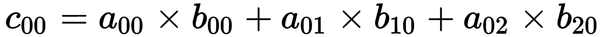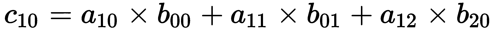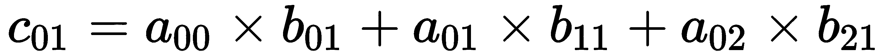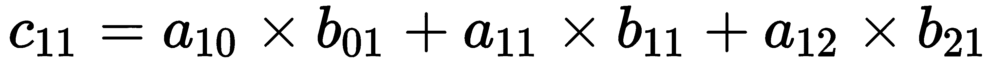

让我们看一个具体的例子:

重要的是要明白，如果 *A* 中的行数等于 *B* 中的列数，我们只能将两个矩阵相乘。结果矩阵将始终具有与 *A* 相同的行数和与 *B* 相同的列数。注意，矩阵乘法是不可交换的；如下所示:

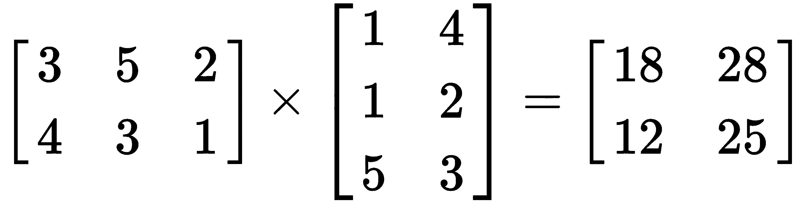

但是，矩阵乘法是关联的，如下例所示:

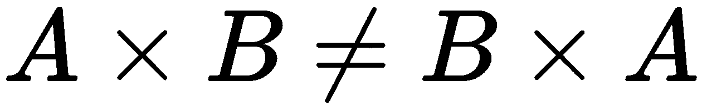

矩阵很有用，因为我们可以用相对简单的方程来表示大量的运算。有两种矩阵运算对机器学习特别重要:

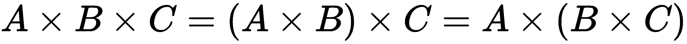

移项

*   相反的
*   要转置矩阵，我们只需交换列和行，如下例所示:

求矩阵的逆矩阵稍微复杂一点。在这组实数中，数字 1 起着**身份**的作用。也就是说，数字 1 乘以等于该数字的任何其他数字。同样，几乎每个数字都有一个倒数；也就是说，一个数与自身相乘时等于 1。例如，2 的倒数是 0.5，因为 2 乘以 0.5 等于 1。事实证明，对于矩阵和张量来说，一个等价的概念也成立。单位矩阵沿主对角线由 1 组成，其他地方由 0 组成，如以下 3 x 3 示例所示:

单位矩阵是我们乘以一个逆矩阵的结果。我们这样写:

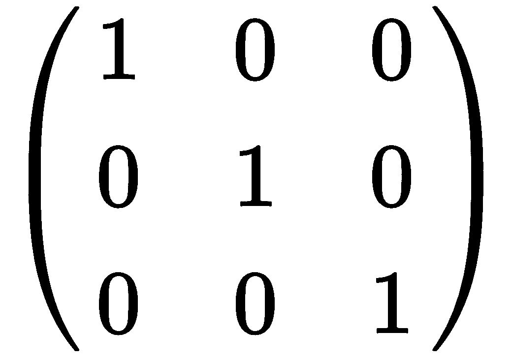

重要的是，我们只能找到方阵的逆矩阵。不期望手工计算逆矩阵或任何矩阵运算。这是计算机擅长的。矩阵求逆是一项重要的操作，即使对计算机来说，计算量也很大。

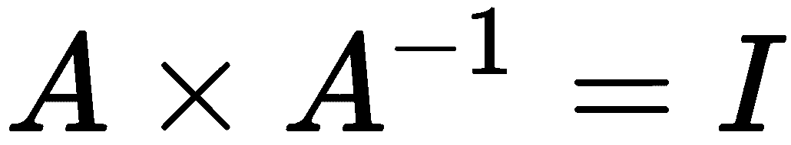

线性模型

# 我们在机器学习中会遇到的最简单的模型就是线性模型。求解线性模型在许多不同的环境中都很重要，它们构成了许多非线性技术的基础。对于线性模型，我们试图将训练数据拟合到一个线性函数，有时称为**假设函数**。这是通过一个叫做线性回归的过程来完成的。

单变量线性回归的假设函数具有以下形式:

这里， *θ [0]* 和 *θ [1]* 为模型**参数**和 *x* 为单个自变量。对于我们的房价示例， *x* 可以表示建筑面积的大小，而 *h(x)* 可以表示预测的房价。

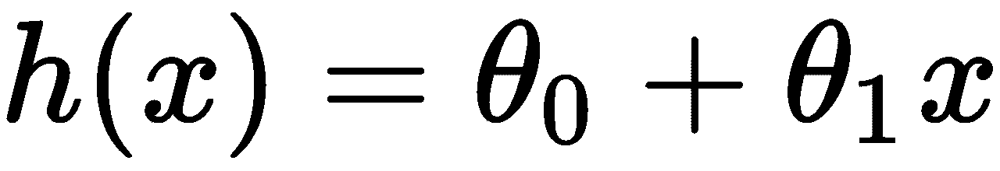

为简单起见，我们将从单个变量或单个特征的情况开始。

在下图中，我们显示了一些代表训练数据的点，并尝试用直线拟合这些点:

这里， *x* 为单一特征， **θ *[0]*** 和 **θ *[1]*** 分别代表假设函数的截距和斜率。我们的目标是找到模型参数 **θ *[0]*** 和 **θ *[1]*** 的值，这将为我们提供上图中的最佳拟合线。在此图中，**θ***[**0**]*设置为 **1** 和**θ***[**1**]*设置为 **0.5** 。因此，其截距为 **1** ，直线斜率为 **0.5** 。我们可以看到，大多数训练点位于直线之上，少数低值点位于直线之下。我们可以猜测**θ***[**1**]*可能略低，因为训练点看起来具有略陡的斜率。另外， **θ *[0]*** 太高，因为在左边的线下有两个数据点，截距似乎略小于 1。

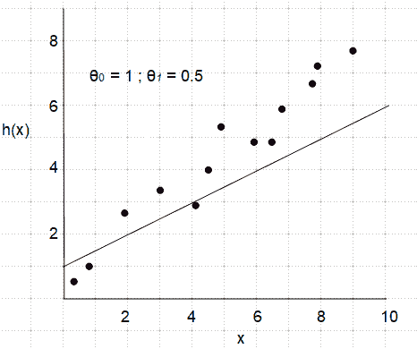

很明显，我们需要一个正式的方法来找出假设函数中的错误。这是通过所谓的**成本函数**来完成的。成本函数测量假设函数给出的值和数据中的实际值之间的总误差。本质上，损失函数将每个点与假设的距离相加。成本函数有时被称为**均方误差** ( **MSE** )。这由以下等式表示:

这里，*h[θ](x^I**)*是假设为第 *i* 个训练样本计算出的值， *y ^i* 是其实际值。为了统计上的方便，差值被平方，因为它确保结果总是正的。平方也增加了较大差异的权重；也就是说，它更重视离群值。然后将该总和除以训练样本的数量 *m* ，以计算平均值。这里，总和也被除以 2，以使随后的数学更简单。

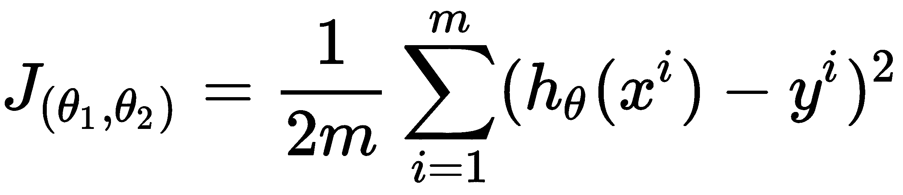

最后一部分是调整参数值，以便假设函数尽可能接近地拟合训练数据。我们需要找到使误差最小的参数值。

有两种方法可以做到这一点:

使用梯度下降迭代训练集并调整参数以最小化成本函数

*   使用*闭式*方程直接计算模型参数
*   梯度下降

# 梯度下降是一种具有广泛应用的通用优化算法。梯度下降通过迭代调整模型参数来最小化成本函数。梯度下降通过对成本函数取偏导数来工作。如果我们根据参数值绘制成本函数，它会形成一个凸函数，如下图所示:

你可以看到，随着我们改变 *θ* ，在上图中从右到左，成本*J[θ]降低到最小，然后上升。目标是在梯度下降的每次迭代中，成本向最小值移动，然后一旦达到该最小值就停止。这是使用以下更新规则实现的:*

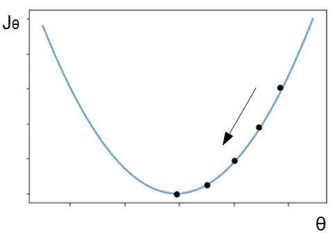

这里， *α* 是**学习率，**是可设置的**超参数**。它被称为超参数，以区别于模型参数θ。偏导数项是成本函数的斜率，这需要针对θ*0*和θ*1*进行计算。你可以看到，当导数为正时，斜率也为正时，从之前的θ值中减去一个正值，在上图中从右向左移动。或者，如果斜率为负，则θ增加，从右向左移动。此外，在最小值，斜率为零，所以梯度下降将停止。这正是我们想要的，因为无论我们从哪里开始梯度下降，更新规则都保证将θ移向最小值。

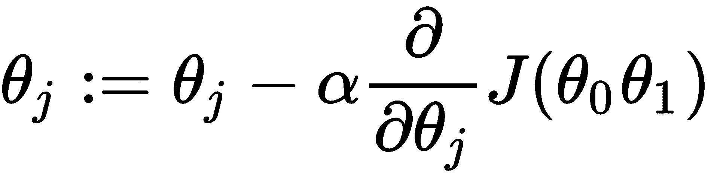

将成本函数代入前面的等式，然后对θ的两个值求导，得到以下两个更新规则，得到以下等式:

在迭代和随后的更新中，θ将收敛到使成本函数最小化的值，从而产生与训练数据最佳拟合的直线。有两件事需要考虑。首先，θ的初始化值；也就是我们开始梯度下降的地方。在大多数情况下，随机初始化效果最好。我们需要考虑的另一件事是设置学习率，alpha ( *α* )。这是一个介于零和一之间的数字。如果学习率设置得太高，那么它可能会超过最小值。如果设置得太低，那么收敛的时间会太长。可能需要对所使用的特定模型进行一些实验；在深度学习中，自适应学习速率通常用于获得最佳结果。这是学习率变化的地方，通常在梯度下降的每次迭代中变小。

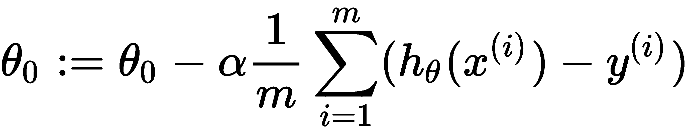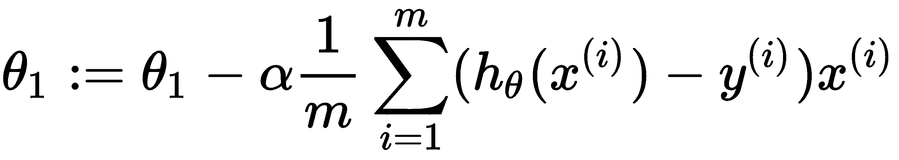

我们到目前为止讨论的梯度下降类型被称为**批量梯度下降** ( **BGD** )。这是指在每次更新时，使用整个训练集。这意味着随着训练集变大，批量梯度下降变得越来越慢。另一方面，当有大量要素时，批量梯度下降的伸缩性更好，因此它最常用于具有大量要素的较小训练集。

批量梯度下降的替代方法是**随机梯度下降** ( **SGD** )。SGD 不是使用整个训练集来计算梯度，而是使用每次迭代中随机选择的单个样本来计算梯度。SGD 的优点是整个训练集不必驻留在内存中，因为在每次迭代中它只处理一个实例。因为随机梯度下降随机选择样本，它的行为比 BGD 稍微不那么规则。使用批量梯度下降，每次迭代都将误差( *J [θ]* )平滑地移向最小值。使用 SGD，每一次迭代不一定使成本接近最小值。它倾向于跳跃一点，仅仅在多次迭代后平均向最小值移动。这意味着它可能会在最小值附近跳跃，但在完成迭代时永远不会真正到达最小值。当存在一个以上的最小值时，可以利用 SGD 的随机特性，因为它可以跳出这个局部最小值并找到全局最小值。例如，考虑以下成本函数:

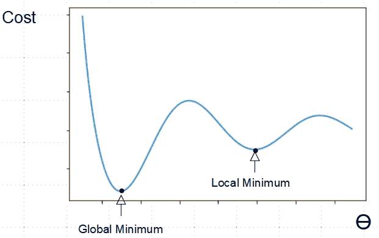

如果批量梯度下降开始于**局部最小值**的右侧，将无法找到**全局最小值**。幸运的是，线性回归的成本函数总是具有单一最小值的凸函数。然而，情况并非总是如此，特别是对于神经网络，其中成本函数可能具有多个局部最小值。

多重特征

# 在一个实际的例子中，我们会有多个特征，每个特征都有一个需要拟合的相关参数值。我们为多个特征写出假设函数如下:

这里， *x [0]* 称为偏置变量，设置为 1， *x* *[1]* 到 *x* *[n]* 为特征值， *n* 为特征总数。注意，我们可以写出假设函数的矢量化版本。这里， *θ* 是**参数向量**，而 *x* 是**特征向量。**

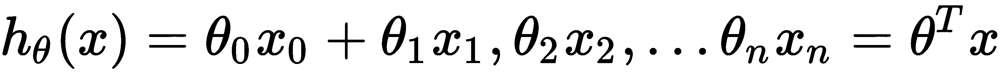

代价函数仍然与单特征情况基本相同；我们只是对误差求和。然而，我们确实需要调整梯度下降规则，并明确所需的符号。在单个特征的梯度下降的更新规则中，我们使用参数值*θ[0]和*θ[1]的符号。对于多特征版本，我们简单地将这些参数的值和它们相关的特征打包成向量。参数向量表示为*θ[j]，其中下标 *j* 表示特征，是介于 *1* 和 *n* 之间的整数，其中 *n* 是特征的个数。***

每个参数需要有一个单独的更新规则。我们可以将这些规则归纳如下:

每个参数都有一个更新规则；因此，例如，特征 *j = 1* 的参数的更新规则如下:

变量 *x ^((i))* 和 *y ^((i))* 如在单特征例子中，分别指的是第 *i ^(th)* 训练样本的预测值和实际值。然而，在多要素的情况下，它们不再是单个值，而是矢量。值*x[j]^((I))*是指训练样本 *i* 的特征 *j* ， *m* 是训练集中样本的总数。

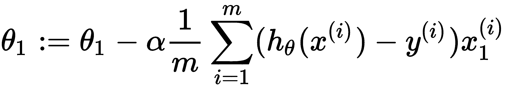

正规方程

# 对于一些线性回归问题，封闭形式的解，也称为**正规方程**，是找到θ最佳值的更好方法。如果你懂微积分，那么为了最小化成本函数，你可以找到成本函数的偏导数，关于θ的每一个值，把每一个导数设为零，然后求解θ的每一个值。不熟悉微积分也不用担心；结果是，我们可以从这些偏导数中推导出正规方程，并得到以下方程:

你可能会想，既然正规方程允许我们一步就能计算出参数，为什么我们需要为梯度下降和由此带来的额外复杂性而烦恼。原因是求矩阵逆所需的计算量相当大。当一个特征矩阵 *X* 变大时(记住 *X* 是一个保存每个训练样本的所有特征值的矩阵)，那么寻找这个矩阵的逆矩阵会花费很长时间。即使梯度下降涉及许多迭代，它仍然比大型数据集的正常方程更快。

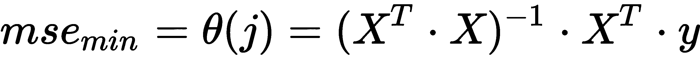

法线方程的一个优点是，与梯度下降不同，它不期望要素具有相同的比例。法线方程的另一个优点是没有必要选择学习率。

逻辑回归

# 我们可以使用线性回归模型，通过找到划分两个预测类的决策边界来执行二元分类。一种常见的方法是使用`sigmoid`函数，定义如下:

`sigmoid`函数的曲线如下所示:

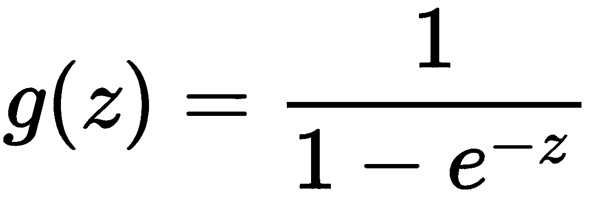

可以在假设函数中使用`sigmoid`函数来输出概率，如下所示:

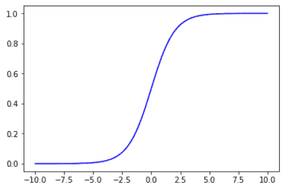

这里，假设函数的输出是给定由θ参数化的 *x* 的概率 *y = 1* 。为了决定何时预测 *y = 0* 或 *y = 1* ，我们可以使用以下两条规则:

`sigmoid`函数的特征(即在 *0* 和 *1* 处具有渐近线，并且在 *z = 0* 处具有值 *0.5* )对于逻辑回归问题的使用具有一些吸引人的性质。请注意，决策边界是模型参数的属性，而不是训练集。我们仍然需要拟合参数，以使成本或误差最小化。要做到这一点，我们需要形式化我们已经知道的东西。

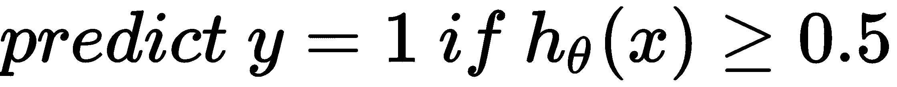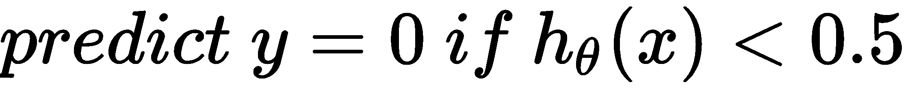

我们有一个带有 *m* 个样本的训练集，写成如下等式:

每个训练样本包括向量 *x* ，大小为*n*，其中 *n* 是特征的数量:

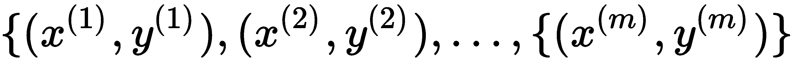

每个训练样本也由值 *y* 组成，并且对于逻辑回归，该值是零或一。我们还有一个逻辑回归的假设函数，可以改写为以下等式:

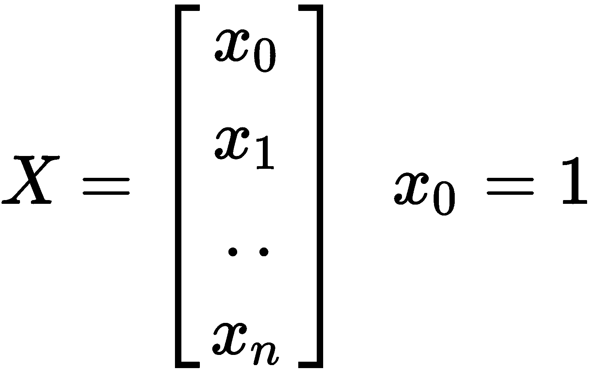

对于线性回归使用相同的成本函数，对于逻辑回归使用假设，我们通过`sigmoid`函数引入非线性。这意味着成本函数不再是凸的，并且作为结果，它可能具有多个局部最小值，这对于梯度下降可能是一个问题。事实证明，对于逻辑回归来说效果很好并产生凸成本函数的函数如下:

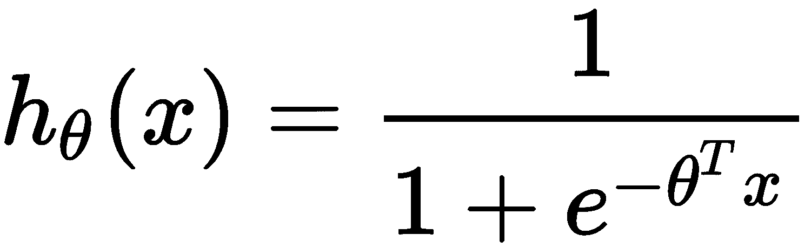

我们可以为两种情况绘制这些函数:

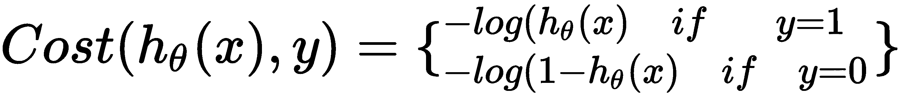

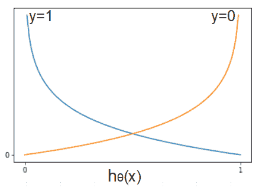

从前面的图可以看出，当标号 **y** 等于 **1** 且假设预测 **0** 时，成本趋近于无穷大。还有，当 **y** 的实际值是 **0** ，而假设预测的是 **1** 时，同样，成本向着无穷大上升。或者，当假设预测到正确的值时，无论是 **0** 还是 **1** ，成本都会下降到 **0** 。这正是我们想要的逻辑回归。

现在我们需要应用梯度下降来最小化成本。我们可以将二元分类的逻辑回归成本函数重写为更紧凑的形式，使用以下等式对多个训练样本求和:

最后，我们可以用这个更新规则更新参数值:

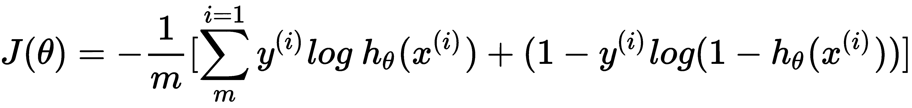

从表面上看，这与线性回归的更新规则相同；然而，假设是`sigmoid`函数的一个函数，所以它实际上表现得非常不同。

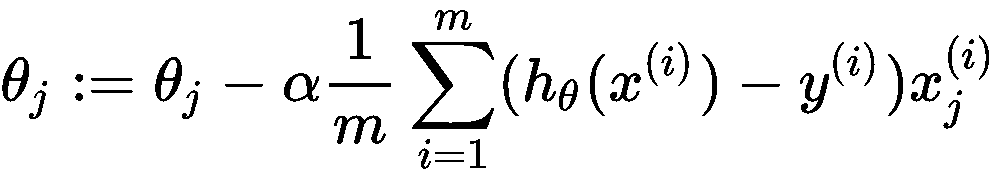

非线性模型

# 我们已经看到，线性模型本身无法代表非线性真实世界的数据。一种可能的解决方案是向假设函数添加多项式特征。例如，立方模型可以由以下等式表示:

这里，我们需要选择两个派生特征来添加到我们的模型中。在房屋示例中，这些添加的术语可能只是尺寸特征的正方形和立方体。

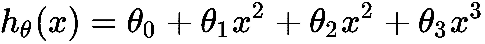

添加多项式项时，一个重要的考虑因素是特征缩放。这个模型中的平方项和立方项的尺度将会非常不同。为了使梯度下降正确工作，有必要对这些增加的多项式项进行缩放。

选择多项式项是将知识注入模型的一种方式。例如，简单地知道随着建筑面积变大，房价相对于建筑面积趋于平缓，这意味着增加平方和立方项，给我们提供我们期望的数据形状。然而，在逻辑回归中，当我们试图预测一个复杂的多维决策边界时，特征选择可能意味着成千上万的多项式项。在这种情况下，线性回归的机制就会停止运转。我们将看到神经网络为复杂的非线性问题提供了一个更加自动化和强大的解决方案。

人工神经网络

# 顾名思义，人工神经网络的灵感来自于它们的生物对应物，尽管原因可能被误解了。与生物神经元相比，人工神经元，或者我们称之为**单元**，在功能和结构方面都非常简单。生物学的灵感更多地来自于这样一种认识，即大脑中的每个神经元都执行相同的功能，不管它是处理声音、视觉还是思考复杂的数学问题。从根本上说，这种单一算法方法是人工神经网络的灵感来源。

一个人工神经元，一个单元，执行一个简单的功能。它将其输入相加，并根据激活函数给出一个输出。人工神经网络的主要好处之一是它们具有高度的可扩展性。由于人工神经网络是由基本单元组成的，只需在正确的配置中添加更多的单元，就可以轻松地扩展到大量复杂的数据。

人工神经网络的理论已经存在了很长一段时间，最初是在 20 世纪 40 年代初提出的。然而，直到最近，它们才能够胜过更传统的机器学习技术。这有三个主要原因:

算法的改进，特别是**反向传播**的实现，允许人工神经网络将输出端的误差分配到输入层，并相应地调整激活权重

*   训练人工神经网络的大规模数据集的可用性
*   处理能力的提高，允许大规模的人工神经网络
*   感知器

# 最简单的人工神经网络模型之一是感知器，由单个逻辑单元组成。我们可以在下图中表示感知器:

每个输入都与一个重量相关联，并被输入到逻辑单元中。注意，我们添加了一个偏置特性， **x [0] = 1** 。这个逻辑单元由两个部分组成:一个输入求和功能和一个激活功能。如果我们使用`sigmoid`作为激活函数，那么我们可以写出下面的等式:

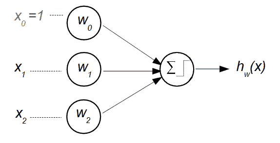

请注意，这正是我们用于逻辑回归的假设；我们简单地将 *θ* 替换为 *w，*来表示物流单位中的重量。这些权重完全等同于逻辑回归模型的参数。

为了创建神经网络，我们将这些逻辑单元连接成层。下图表示一个三层神经网络。注意，为了清楚起见，我们省略了偏置单元:

这个简单的人工神经网络由三个单元的输入层组成；一个隐藏层，也有三个单元；最后，输出中的一个单元。我们使用符号 *ai(j)* 来表示层 *j* 中单元 *i* 的激活，并且用 *W* ^((j)) 来表示将层 *j* 映射到层 *j+1* 的权重矩阵。使用这种符号，我们可以用下面的等式来表示三个隐藏单元的激活:

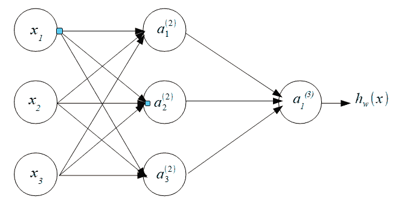

输出单元的激活可以用下面的等式表示:

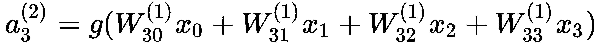

这里，*W*^(*(1)*)是一个 3×4 的矩阵，控制输入，第一层，和单个隐藏层，第二层之间的函数映射。大小为 1×4 的权重矩阵*W^(^(2))*控制隐藏层和输出层 h 之间的映射。更一般地，在层 *j* 中具有*s[j]单元并且在层 *j+1* 中具有 *s [k] 单元的网络将具有 *s 的大小*例如，对于具有五个输入单元并且在下一个前向层(第二层)中具有三个单元的网络，相关联的权重矩阵 *W ^((1))* 的大小将为 3×6。**

建立了假设函数后，下一步是制定一个成本函数来测量并最终最小化模型的误差。对于分类，成本函数几乎与用于逻辑回归的成本函数相同。重要的区别是，使用神经网络，我们可以添加输出单元，以允许多类分类。我们可以将多个输出的成本函数写为:

这里， *K* 是表示输出类别数的输出单位数。

最后，我们需要最小化成本函数，这是使用反向传播算法完成的。本质上，这是将误差，即成本函数的梯度，从输出单位反向传播到输入单位。为此，我们需要计算偏导数。也就是说，我们需要计算以下内容:

这里， *l* 是层， *j* 是单元， *i* 是样本。换句话说，对于每层中的每个单元，对于每个样本，我们需要计算成本函数相对于每个参数的偏导数，即梯度。例如，假设我们有一个四层网络。还要考虑我们正在处理一个单一的样本。我们需要找出每一层的误差，从输出开始。输出端的误差就是假设的误差:

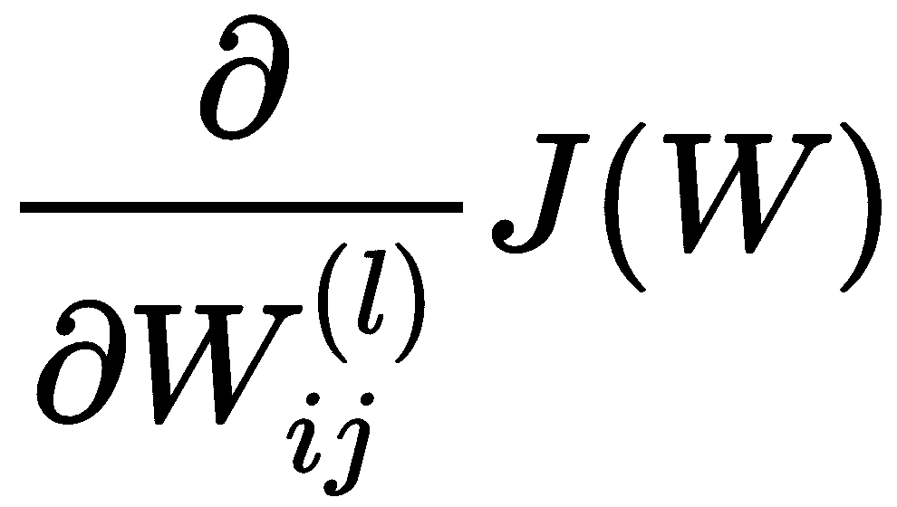

这是每个单元的误差向量， *j* 。上标 *(4)* 表示这是第四层；也就是输出层。事实证明，通过一些复杂的数学，我们不需要在这里担心，两个隐藏层的误差可以用下面的等式来计算:

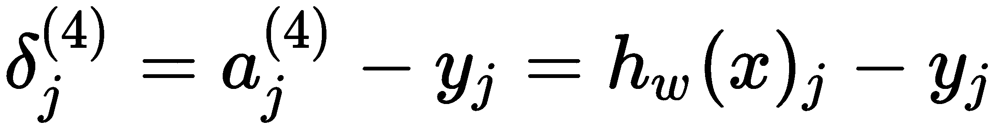

这里的`.*`操作符是基于元素的向量乘法。注意，在这些等式的每一个中，需要下一个前向层的误差向量。也就是说，为了计算第三层中的误差，需要输出层的误差向量。类似地，计算第二层的误差需要第三层的误差矢量。

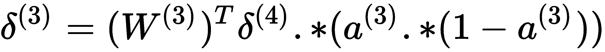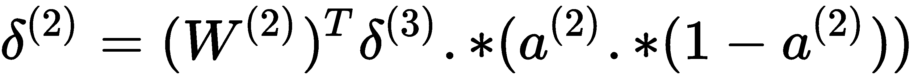

这就是反向传播处理单个样本的方式。为了遍历整个数据集，我们需要累积每个单元和每个样本的梯度。因此，对于训练集中的每个样本，神经网络执行前向传播来计算隐藏层和输出层的激活。然后，对于同一样本，即同一环路内的样本，可以计算输出误差。因此，我们能够依次计算每个先前层的误差，而神经网络正是这样做的，在矩阵中累积每个梯度。该循环再次开始对下一个样本执行相同的一组操作，并且这些梯度也被累积在误差矩阵中。我们可以编写如下更新规则:

大写 delta 是存储累积梯度的矩阵，其通过将层 *l、*单元 *j* 和样本 *i* 的激活相加，然后将其与该相同样本的下一个正向层 *i* 的相关误差相乘。最后，一旦我们通过了整个训练集(一个时期)，我们就可以计算成本函数相对于每个参数的导数:

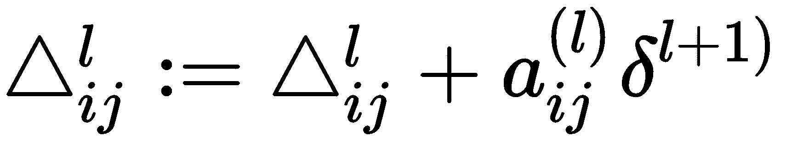

同样，没有必要知道这方面的正式证明；只是让你对反向传播的机制有一些直观的理解。

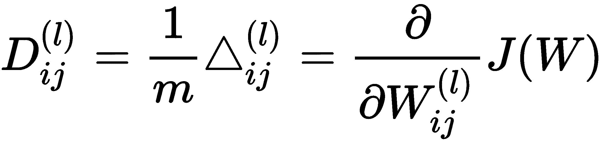

摘要

# 我们在这一章中已经讲了很多内容。如果您不理解这里介绍的一些数学知识，请不要担心。目的是让你对一些常见的机器学习算法如何工作有一些直觉，而不是对这些算法背后的理论有一个完整的理解。阅读完本章后，您应该对以下内容有所了解:

机器学习的一般方法，包括了解监督和非监督方法之间的区别、在线和批量学习，以及基于规则而非基于模型的学习

*   一些无监督方法及其应用，如聚类和主成分分析
*   分类问题的类型，如二元、多类和多输出分类
*   功能和功能转换
*   线性回归和梯度下降的机制
*   神经网络和反向传播算法综述
*   在[第 3 章](77e1b6da-e5d6-46a4-8a2c-ee1cfa686cc6.xhtml)、*计算图和线性模型*中，我们将使用 PyTorch 应用其中一些概念。具体来说，我们将展示如何通过建立一个简单的线性模型来寻找函数的梯度。您还将通过实现一个简单的神经网络来获得对反向传播的实际理解。

In [Chapter 3](77e1b6da-e5d6-46a4-8a2c-ee1cfa686cc6.xhtml), *Computational Graphs and Linear Models*, we will apply some of these concepts using PyTorch. Specifically, we will show how to find the gradients of functions by building a simple linear model. You will also gain a practical understanding of backpropagation by implementing a simple neural network.**