# 三、计算图和线性模型

到目前为止，您应该已经了解了线性模型和神经网络的理论，以及 PyTorch 的基础知识。在这一章中，我们将通过在 PyTorch 中实现一些人工神经网络来把所有这些放在一起。我们将关注线性模型的实现，并展示它们如何适用于执行多类分类。我们将讨论与 PyTorch 相关的以下主题:

*   亲笔签名
*   计算图
*   线性回归
*   逻辑回归
*   多类分类

# 亲笔签名

正如我们在上一章中看到的，人工神经网络的大部分计算工作涉及计算导数，以找到成本函数的梯度。PyTorch 使用`autograd`包对 PyTorch 张量执行自动微分运算。为了了解这是如何工作的，让我们看一个例子:

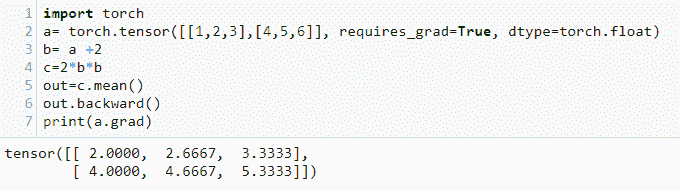

在前面的代码中，我们创建了一个 2 x 3 的火炬张量，重要的是，将`requires_grad`属性设置为`True`。这使得能够在后续操作中计算梯度。还要注意，我们将`dtype`设置为`torch.float`，因为这是 PyTorch 用于自动微分的数据类型。我们执行一系列操作，然后取结果的平均值。这将返回一个包含单个标量的张量。这通常是`autograd`计算前面操作的梯度所需要的。这可以是任何操作序列；重要的一点是，所有这些操作都有记录。输入张量`a`正在跟踪这些操作，尽管有两个中间变量。为了了解这是如何工作的，让我们写下在前面的代码中针对输入张量`a`执行的操作序列:

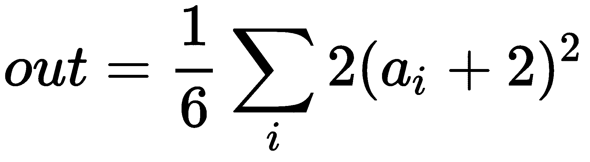

这里，求和并除以 6 表示取张量`a` *的六个元素的平均值。*对于每个元素， *ai* ，分配给张量`b`的运算，二的加法，`c`，平方并乘以二，求和并除以六。

在 *out* 张量上调用`backward()`计算前一次运算的导数。这个导数可以写成如下，如果你懂一点微积分，你就能很容易地确认这一点:

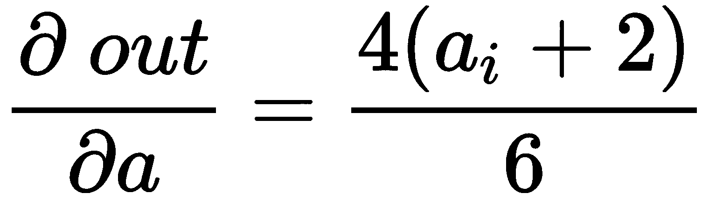

当我们将 *a* 的值代入前面等式的右边时，我们确实得到了包含在`a.grad`张量中的值，在前面的代码中打印出来。

有时需要在有`requires_grad=True`的张量上执行不需要跟踪的操作。为了节省内存和计算工作量，可以将这些操作封装在`with torch.no_grad():`块中。例如，观察下面的代码:

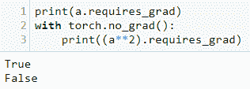

要停止张量上的 PyTorch 跟踪操作，使用`.detach()`方法。这将阻止将来对操作的跟踪，并将张量从跟踪历史中分离出来:

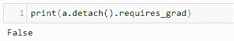

请注意，如果我们试图第二次计算梯度，例如通过调用`out.backward()`，我们将再次产生一个错误。如果我们需要再次计算梯度，我们需要保留计算图。这通过将`retain_graph`参数设置为`True`来完成。例如，观察下面的代码:

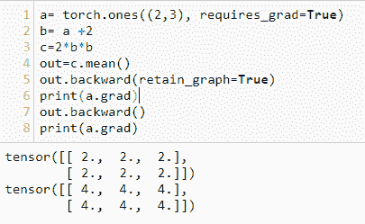

注意，第二次调用`backward`会将渐变添加到已经存储在`a.grad`变量中的渐变中。请注意，一旦调用了`backward()`而没有将`retain_graph`参数设置为`True`，缓冲区`grad`就会被释放。

# 计算图

为了更好地理解这一点，让我们看看什么是精确的计算图。我们可以为迄今为止一直在使用的函数绘制如下图:

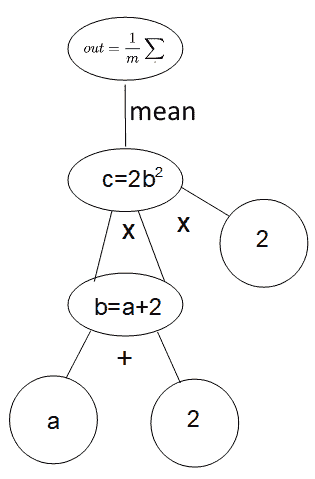

这里，图形的叶子代表每一层的输入和参数，输出代表损耗。

通常，除非`retain_graph`被设置为`True`，否则 PyTorch 将在一个时期的每次迭代中创建一个新的计算图。

# 线性模型

线性模型是理解人工神经网络机制的基本方法。线性回归既用于预测连续变量，也用于预测分类的逻辑回归。神经网络对于多类分类非常有用，因为它们的结构可以自然地适应多种输入和输出。

# PyTorch 中的线性回归

让我们看看 PyTorch 是如何实现一个简单的线性网络的。我们可以使用`autograd`和`backward`手动迭代梯度下降。这种不必要的低级方法给我们带来了大量难以维护、理解和升级的代码。幸运的是，PyTorch 有一个非常直接的对象方法来构建 ann，使用类来表示模型。我们定制的模型类继承了使用超类`torch.nn.Module`构建 ann 所需的所有基础机制。以下代码演示了在 PyTorch 中实现模块(在本例中是一个`linearModel`)的标准方法:

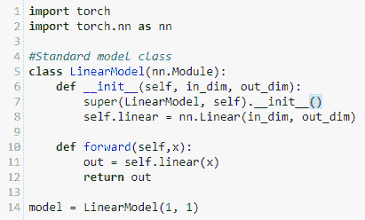

`nn.Module`是基类，在初始化时通过超级函数调用。这确保了它继承了封装在`nn.Module`中的所有功能。我们为`nn.Linear`类设置了一个变量`self.Linear`，反映了我们正在构建一个线性模型的事实。记住，带有一个独立变量的线性函数，也就是一个特征，`x`，可以写成如下方式:

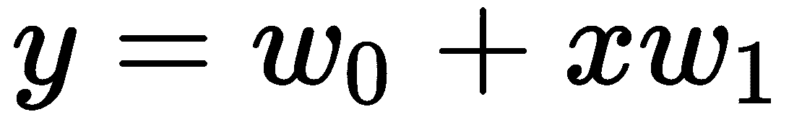

`nn.linear`类包含两个可学习的变量:`bias`和`weight`。在我们的单特征模型中，这是两个参数，*w[0]和 *w [1]* ，。当我们训练一个模型时，这些变量被更新，理想地更新到接近数据的最佳拟合线的值。最后，在前面的代码中，我们通过创建变量`model`，并将其设置为我们的`LinearModel`类来实例化模型。*

在运行模型之前，我们需要设置学习率、要使用的优化器类型以及衡量损失的标准。这是通过以下代码完成的:

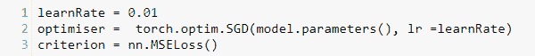

如你所见，我们将学习速率设置为`0.01`。这往往是一个很好的起点；任何更高的值，优化器都可能超过最优值，任何更低的值，都可能需要很长时间才能找到。我们将`optimiser`设置为随机梯度下降，向其传递我们需要优化的项目(在本例中是模型参数)，以及梯度下降的每一步使用的学习率。最后，我们设定损失标准；也就是说，标准梯度下降将用于测量损失，这里我们将其设置为均方误差。

为了测试这个线性模型，我们需要向它提供一些数据，为了测试的目的，我们创建了一个简单的数据集`x`，由从`1`到`10`的数字组成。我们通过对输入值应用线性变换来创建输出或目标数据。这里，我们使用线性函数，`y= 3*x + 5`。这编码如下:

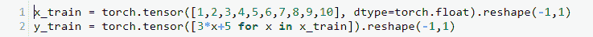

注意，我们需要改变这些张量的形状，使输入端`x`和目标端`y`具有相同的形状。还要注意，我们不需要设置`autograd`，因为这都是由模型类处理的。然而，我们确实需要告诉 PyTorch，输入张量的数据类型是`torch.float`，因为默认情况下，它会将列表视为整数。

现在我们准备运行线性模型，为此我们在每个时期循环运行它。该培训周期由以下三个步骤组成:

1.  在训练场上向前传球
2.  计算损失的反向传递
3.  根据损失函数的梯度更新参数

这是通过以下代码完成的:

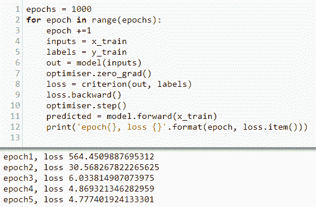

我们设置`epoch`到`1000.`记住，每个`epoch`都是训练集上的一次完整传递。模型输入被设置为数据集的`x`值；在这种情况下，它只是从 1 到 10 的数字序列。我们将标签设置为`y`值；在这种情况下，由我们的函数`2*x + 5`计算的值。

重要的是，我们需要清除梯度，这样它们就不会随着时间的推移而累积并扭曲模型。这是通过在每个时期调用优化器上的`zero_grad()`函数实现的。输出张量被设置为线性模型输出，调用`LinearModel`类的 forward 函数。该模型利用参数的当前估计值应用线性函数，并给出预测输出。

一旦有了输出，我们就可以使用均方差计算损耗，将实际的`y`值与模型计算的值进行比较。接下来，可以通过调用`loss`函数上的`backwards()`来计算梯度。这决定了梯度下降的下一步，使`step()`功能能够更新参数值。我们还创建了一个`predicted`变量来存储`x`的预测值。当我们绘制`x`的预测值和实际值时，我们将很快用到它。

为了了解我们的模型是否有效，我们打印每个时期的损失。请注意，损耗每次都在减少，表明它在按预期工作。事实上，当模型完成`1000`时代时，损失相当小。我们可以通过运行以下代码来打印模型的状态(即参数值):

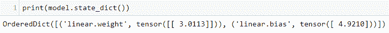

这里，`linear.weight`张量由值为`3.0113`的单个元素组成，而`linear.bias`张量包含值`4.9210`。这与我们用来通过`y=3x + 5`函数创建线性数据集的 *w [0]* (5)和 *w [1]* (3)的值非常接近。

为了让这个变得有趣一点，让我们看看当我们不使用线性函数来创建标签，而是给函数添加一个平方项时会发生什么(例如，`y= 3x² + 5`)。我们可以通过绘制预测值与实际值的对比来可视化模型的结果。我们可以看到以下代码的结果:

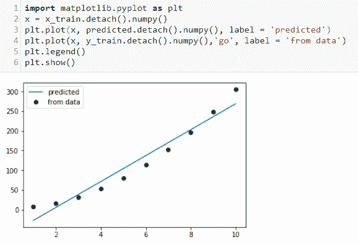

我们已经使用了`y = 3x2 + 5`函数来生成标签。平方项给出了训练集的特征曲线，并且线性模型的预测是最佳拟合直线。你可以看到在 1000 个时代之后，这个模型在拟合曲线方面做得相当好。

# 保存模型

一旦模型被建立和训练，通常想要保存模型的状态。这在这种情况下并不重要，因为训练只需要很少的时间。然而，对于大型数据集和许多参数，训练可能需要几个小时甚至几天才能完成。显然，我们不希望在每次需要对新数据进行预测时都重新训练模型。要保存已训练模型的参数，我们只需运行以下代码:

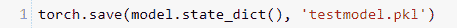

前面的代码使用 Python 内置的对象序列化模块`pickle`保存模型。当我们需要恢复模型时，我们可以执行以下操作:

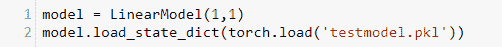

注意，我们需要内存中的`LinearModel`类来完成这项工作，因为我们只保存模型的状态；即模型参数，而不是整个模型。为了在恢复后重新训练模型，我们需要重新加载数据并设置模型超参数(在本例中是优化器、学习率和标准)。

# 逻辑回归

一个简单的逻辑回归模型看起来与线性回归模型没有太大的不同。以下是逻辑模型的典型类别定义:

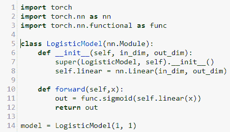

注意，当我们初始化`model`类时，我们仍然使用线性函数。然而，对于逻辑回归，我们需要一个激活函数。在这里，当`forward`被调用时应用。像往常一样，我们将模型实例化到我们的`model`变量中。

接下来，我们设置标准和优化器:

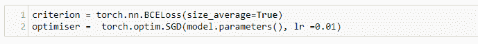

我们还是用随机梯度下降；然而，我们需要改变损失函数的标准。

对于线性回归，我们使用`MSELoss`函数来计算均方差。对于逻辑回归，我们用 0 到 1 之间的值来表示概率。计算一个概率的均方差没有太大意义；相反，一种常见的技术是使用交叉熵损失或对数损失。这里，我们使用`BCELoss`函数，或者说**二进制交叉熵损失**。这背后的理论有点复杂。重要的是要理解，它本质上是一个对数函数，更好地捕捉了概率的概念。因为它是对数的，当预测的概率接近 1 时，在给出正确预测的情况下，对数损失向零缓慢减少。记住，我们试图计算一个错误预测的惩罚。随着预测偏离真实值，损失必然增加。交叉熵损失惩罚具有高置信度的预测(即，它们接近 1，并且是不正确的),相反，奖励具有较低置信度但是正确的预测。

我们可以使用用于线性回归的相同代码来训练模型，在一个`for`循环中运行每个时期，其中我们向前传递以计算输出，向后传递以计算损耗梯度，最后更新参数。

让我们通过创建一个实践示例来使这一点更具体一些。假设我们试图用一些数字来对一种昆虫进行分类，比如说它翅膀的长度。我们有一些训练数据如下:

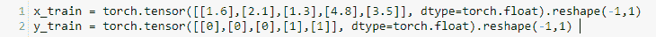

这里，`x_train`值可以代表以毫米为单位的机翼长度，`y_train`值代表每个样品的标签；一份表明样本属于目标物种。一旦我们实例化了`LogisticModel`类，我们就可以使用标准的运行代码来运行它。

一旦我们训练了模型，我们就可以使用一些新数据来测试它:

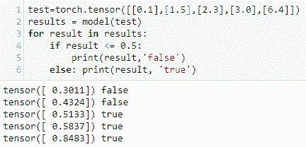

# PyTorch 中的激活函数

使人工神经网络表现良好的部分诀窍是使用非线性激活函数。首先想到的是简单地使用阶跃函数。在这种情况下，只有当输入超过零时，特定的才会输出。阶跃函数的问题是它不能微分，因为它没有一个确定的梯度。它只由平截面组成，在零点是不连续的。

另一种方法是使用线性激活函数；然而，这也将我们的输出限制为线性函数。这不是我们想要的，因为我们需要对高度非线性的真实世界数据进行建模。事实证明，我们可以通过使用非线性激活函数将非线性注入我们的网络。以下是常用激活函数的曲线图:

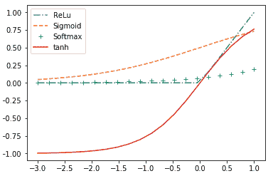

`ReLU`或**整流线性单元**，通常被认为是最受欢迎的激活功能。尽管它在零点是不可微的，但它有一个特征肘，可以让梯度下降跳跃，而且在实践中，它确实工作得很好。`ReLU`函数的一个优点是计算速度非常快。而且，它没有最大值；随着输入的增加，它继续上升到无穷大。这在某些情况下可能是有利的。

我们已经遇到了`sigmoid`功能；它的主要优点是在所有输入值下都是可微的。这在`ReLU`功能在梯度下降过程中导致不稳定行为的情况下会有所帮助。与`ReLU`不同的是，`sigmoid`函数受到渐近线的约束。这也可以用于一些有益的人工神经网络。

`softmax`函数通常用于多类分类的输出图层。请记住，与多标签分类相比，多类分类只有一个真实输出。在这种情况下，我们需要预测目标尽可能接近 1，所有其他输出接近 0。`softmax`函数是归一化的非线性形式。我们需要归一化输出，以确保我们逼近输入数据的概率分布。`softmax`不是通过简单地将所有输出除以它们的总和来使用线性归一化，而是应用非线性指数函数来增加外围数据点的影响。这往往会通过增加网络对低刺激的反应来增加网络的敏感性。它在计算上比其他激活函数更复杂；然而，它被证明是对多类分类的`sigmoid`函数的有效推广。

`tanh` 激活函数，或双曲正切函数，主要用于二值分类。它在`-1`和`1`处有 asmpotopes，通常用作`sigmoid`功能的替代功能，其中强负输入值导致`sigmoid`输出非常接近零的值，从而导致梯度下降停滞。在这种情况下，`tanh`功能将输出负值，允许计算有意义的参数。

# 多类分类示例

到目前为止，我们一直使用琐碎的例子来演示 PyTorch 中的核心概念。我们现在准备探索一个更真实的例子。我们将使用的数据集是从 0 到 9 的手写数字的`MNIST`数据集。任务是用正确的数字正确地识别每个样本图像。

我们将要构建的分类模型由几个层组成，这些层在下图中进行了概述:

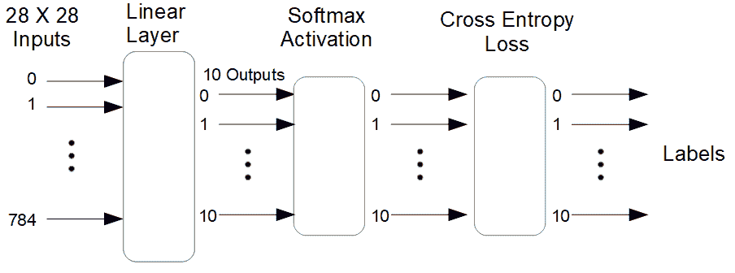

我们正在处理的图像大小为 28 x 28 像素，每个图像中的每个像素都由一个数字来表征，指示其灰度。这就是为什么我们需要 28 x 28 或 784 个输入到模型中。第一层是具有 10 个输出的线性层，每个标签一个输出。这些输出被输入到`softmax`激活层和交叉熵损失层。10 个输出维度代表 10 个可能的类别，数字从 0 到 9。具有最高值的输出指示给定图像的预测标签。

我们首先导入所需的库，以及`MNIST`数据集:

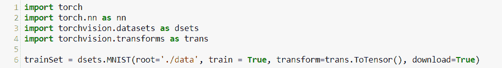

现在让我们打印出一些关于`MNIST`数据集的信息:

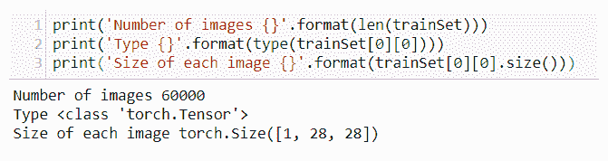

`len`函数返回数据集中独立项目的数量(在本例中是单个图像)。这些图像中的每一个都被编码为类型张量，并且每一个图像的大小是 28×28 像素。图像中的每个像素都被分配了一个数字，表示其灰度。

为了定义我们的多类分类模型，我们将使用与线性回归完全相同的模型定义:

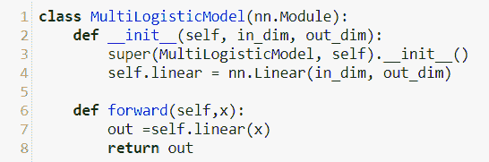

尽管最终我们需要执行逻辑回归，但我们以与二进制情况略有不同的方式实现了所需的激活和非线性。您会注意到，在模型定义中，forward 函数返回的输出只是一个线性函数。我们没有使用前面二进制分类示例中的`sigmoid`函数，而是使用了`softmax`函数，该函数被赋予了损失标准。以下代码设置了这些变量并实例化了模型:

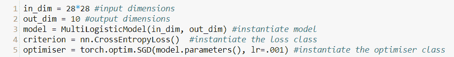

`CrossEntropyLoss()`函数本质上给网络增加了两层:一个`softmax`激活函数和一个交叉熵损失函数。网络的每个输入取图像的一个像素，所以我们的输入维数是 28 x 28 = 784。优化器使用随机梯度下降和学习率`.0001`。

接下来，我们设置一个批处理大小，即运行模型的`epochs`的数量，并创建一个数据加载器对象，以便模型可以迭代数据:

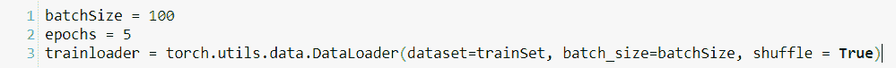

设置批处理大小会将数据以特定大小的块的形式提供给模型。在这里，我们成批地向模型提供`100`图像。迭代次数(即网络的前向-后向遍历总数)可以通过将数据集的长度除以批量大小，然后乘以`epochs`的数量来计算。在这个例子中，我们总共有 5 x 60，000/100 = 3，000 次迭代。事实证明，这是处理中型到大型数据集的一种更加高效和有效的方式，因为在内存有限的情况下，加载整个数据可能是不可能的。此外，该模型往往会做出更好的预测，因为它是在每批数据的不同子集上训练的。将`shuffle`设置为`True`会打乱每个`epoch`上的数据。

为了运行这个模型，我们需要创建一个循环通过`epochs`的外部循环和一个循环通过每个批次的内部循环。这是通过以下代码实现的:

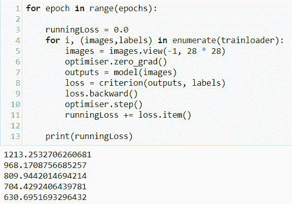

这类似于迄今为止我们用来运行所有模型的代码。这里唯一的区别是模型枚举了`trainloader`中的每一批，而不是一次迭代整个数据集。这里，我们打印出每个时期的损失，正如所料，这种损失正在减少。

我们可以通过向前传递来使用该模型进行预测:

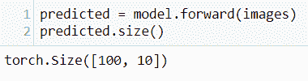

预测变量的大小是`100`乘`10`。这代表批次中`100`图像的预测。对于每个图像，模型输出一个`10`元素预测张量，包含一个表示每个标签在其每个`10`输出处的相对强度的值。以下代码打印出第一个预测张量和实际标签:

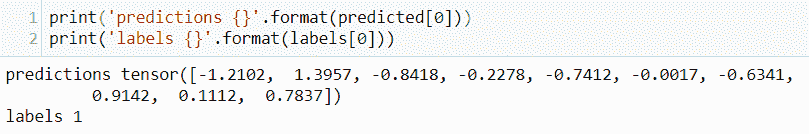

如果我们仔细观察前面的输出，我们会发现模型正确地预测了标签，因为代表数字`1`的第二个元素包含了`1.3957`的最大值。通过与张量中的其他值进行比较，我们可以看到这个预测的相对强度。例如，我们可以看到下一个最强的预测是针对数字`7`，值为`0.9142`。

你会发现这个模型并不是对每张图片都是正确的，为了开始评估和改进我们的模型，我们需要能够测量它的性能。最直接的方法是衡量它的成功率；也就是正确结果的比例。为此，我们创建以下函数:

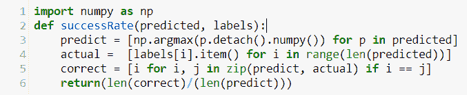

这里，我们使用字符串理解，首先通过找到每个输出的最大值来创建一个预测列表。接下来，我们创建一个标签列表来比较预测。我们通过比较`predict`列表中的每个元素和`actual`列表中相应的元素来创建一个正确值的列表。最后，我们通过将正确值的数量除以预测的总数来返回成功率。我们可以通过使用输出预测和标签调用此函数来计算模型的成功率:

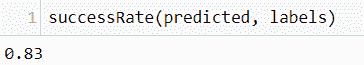

在这里，我们得到 83%的成功率。请注意，这是使用模型已经训练过的图像计算的。为了真正测试模型的性能，我们需要在它以前没有见过的图像上测试它。我们使用以下代码来实现这一点:

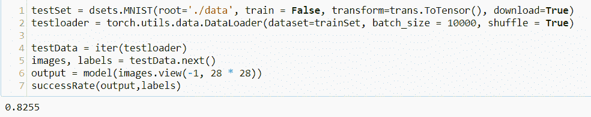

在这里，我们使用`MNIST`测试集中的全部 10，000 张图像测试了该模型。我们从数据加载器对象创建一个迭代器，然后将它们加载到两个张量中，`images`和`labels`。接下来，通过传递模型测试图像，我们得到一个输出(这里是 10 乘 10，000 的预测张量)。最后，我们使用输出和标签运行`SuccessRate`函数。该值仅略低于训练集的成功率，因此我们有理由相信这是模型性能的准确度量。

# 摘要

在本章中，我们探讨了线性模型，并将其应用于线性回归、逻辑回归和多类分类任务。我们已经看到了 autograd 如何计算梯度以及 PyTorch 如何处理计算图。我们建立的多类分类模型在预测手写数字方面做得很好；然而，它的性能远非最佳。最好的深度学习模型能够在这个数据集上获得接近 100%的准确率。

我们将在[第四章](a3ca526e-1be7-4891-b763-a77141073ba8.xhtml)、*卷积网络*中看到，增加更多层和使用卷积网络如何提高性能。