# 在云中运行深度学习模型

到目前为止，我们只简单讨论了训练深度学习模型的硬件要求，因为本书中几乎所有的例子都可以在任何现代计算机上运行。虽然你不需要基于 **GPU** ( **图形处理单元**)的计算机来运行本书中的示例，但无法回避的事实是，训练复杂的深度学习模型需要一台带有 GPU 的计算机。即使你的机器上有合适的 GPU，安装必要的软件来使用 GPU 训练深度学习模型也不是一件小事。本节将简要讨论如何安装必要的软件以在 GPU 上运行深度学习模型，并讨论使用云计算进行深度学习的优势和劣势。我们将使用各种云提供商来创建虚拟实例或访问服务，这将允许我们在云中训练深度学习模型。

本章涵盖以下主题:

*   设置用于深度学习的本地计算机
*   使用亚马逊网络服务(AWS)进行深度学习
*   使用 Azure 进行深度学习
*   使用谷歌云进行深度学习
*   使用 Paperspace 进行深度学习


# 设置用于深度学习的本地计算机

在写这本书的时候，有可能以低于 1000 美元的价格购买一台带有适合深度学习的 GPU 卡的计算机。目前 AWS 上最便宜的 GPU 电脑的点播费用是每小时 0.90 美元，相当于连续 46 天不停地使用机器。所以，如果你刚刚开始深度学习，云资源是最便宜的开始方式。一旦你学会了基础知识，那么你可能会决定获得一台基于 GPU 的计算机，但即使这样，你也可能会继续使用云资源进行深度学习。您在云中拥有更大的灵活性。例如，在 AWS 中，你可以以每小时 24.48 美元的按需价格获得 8 块特斯拉 V100 GPU 卡的 p 3.16 x 大型机器。一个相当的盒子是英伟达(【https://www.nvidia.com/en-us/data-center/dgx-1/】)的 DGX-1，它有 8 个特斯拉 V100 GPU 卡，价格为 14.9 万美元！

如果你正在考虑使用自己的计算机进行深度学习，那么以下其中一种方法适用于你:

*   您已经有了一台配有合适 GPU 处理器的计算机
*   你会买一台电脑来建立深度学习模型
*   您将构建一台计算机来构建深度学习模型

如果想用本地电脑进行深度学习，需要合适的 GPU 卡，必须是英伟达的。最好的检查方法是去 NVIDIA 网站，检查你的显卡是否与 CUDA 兼容。CUDA 是一个应用编程接口(API)，允许程序使用 GPU 进行计算。你需要安装 CUDA 才能使用 GPU 进行深度学习。当前检查你的显卡是否兼容 CUDA 的链接是[https://developer.nvidia.com/cuda-gpus](https://developer.nvidia.com/cuda-gpus)。

虽然一些公司出售专门为深度学习设计的机器，但它们非常昂贵。如果你刚刚开始学习深度学习，我不建议你去买一本。相反，我建议考虑购买一台高端电脑游戏电脑。这台电脑应该有合适的 GPU 卡用于深度学习。同样，首先检查卡是否与 CUDA(【https://developer.nvidia.com/cuda-gpus】)兼容。

用于深度学习的游戏电脑？这并不像看起来那么奇怪。开发 GPU 是为了在电脑上玩高端游戏，而不是为了深度学习。但是为游戏设计的机器可能会有比通常更高的规格，例如，SSD 驱动器，大量(快速)RAM，以及最重要的 GPU 卡。早期的深度学习实践者意识到，计算 3D 空间所涉及的矩阵运算与神经网络中使用的矩阵运算非常相似。NVIDIA 将 CUDA 作为 API 发布，以便其他应用程序可以将 GPU 用作协处理器。无论是运气还是远见，NVIDIA 成为深度学习 GPU 卡的事实上的标准，并在过去 3 年里股价增长了 10 倍，很大程度上是因为人工智能对 GPU 卡的巨大需求。

第三种选择是构建自己的深度学习计算机。如果您正在考虑这个选项，那么除了 GPU 卡、内存和 SSD 驱动器之外，您还需要考虑电源和主板。由于 GPU 卡和风扇，您可能需要比标准计算机更大容量的电源。对于主板，你需要考虑主板和 GPU 卡之间的硬件接口是否会限制数据传输——这些是 PCIe 车道。一个 GPU 可以满负荷使用 16 个 PCIe 通道。出于扩展目的，您可能需要一个支持 40 个 PCIe 通道的主板，以便您可以同时支持两个 GPU 卡和一个 SSD 驱动器。

在我们继续讨论使用云计算进行深度学习的本章剩余部分之前，我们应该简要讨论一下本书使用的云中 GPU 卡的性能。对于这本书，我使用了 GTX 1050 Ti，它有 768 个内核和 4 GB 内存。以我的经验来看，这个卡的性能和 AWS 上的一个 **p2.xlarge** 实例差不多。我通过在本地 CPU (i5 处理器)、本地 GPU (GTX 1050 Ti)和 AWS GPU ( **p2.xlarge** )上运行两个模型来检查这一点。我在两个模型上运行了测试:来自第四章、*训练深度预测模型*的二元预测任务，以及来自第五章、*使用卷积神经网络进行图像分类*的 LeNet 卷积神经网络。这两个模型都是使用 MXNet 构建的，运行了 50 个时期:


图 10.1:两个深度学习网络在 CPU、本地 GPU 和 AWS GPU 上的执行时间(秒)

在我的本地机器上，在 GPU 上运行二进制预测任务的深度学习模型比在 CPU 上运行快 20%左右，AWS GPU 机器比本地 GPU 快大约 13%。然而，当运行卷积神经网络时，有一个更大的区别，在本地 CPU 上训练它几乎比在本地 GPU 上训练它慢 16 倍。反过来，AWS GPU 比本地 GPU 快大约 16%。这些结果是意料之中的，反映了我在实践和网络上其他基准测试中看到的情况，并最终表明，对于深度学习计算机视觉任务，GPU 是必要的。我的本地机器(GTX 1050 Ti)上的 GPU 卡可能是你应该用于深度学习的最低规格的 GPU 卡。目前它的价格不到 200 美元。作为比较，一个高端 GPU 卡(GTX 1080 Ti)有 3584 个内核和 11 GB 的内存，目前价格约为 700 美元。GTX 1080 Ti 大约比 GTX 1050 Ti 快 4-5 倍。

为什么前面的图只看 AWS 而不看 Azure、Google Cloud、Paperspace？为什么我没有根据性能和/或成本对它们进行基准测试？我决定不这样做有几个原因。首先，也是最重要的，任何建议在几个月后都会过时——深度学习非常受欢迎，各种云提供商不断改变他们的产品和价格。另一个原因是，本书中的例子相对较小，我们使用的是最便宜的 GPU 实例。因此，任何与生产用例的比较都会产生误导。最后，当你开始时，易用性可能比原始成本更重要。无论您使用哪个提供商，本书中的所有示例都应该在 1 小时之内在云中运行，因此争论一个提供商每小时花费 0.55 美元而另一个提供商每小时花费 0.45 美元并不重要。


# 如何知道我的模型是否在 GPU 上训练？

很多刚开始深度学习的人都会问的一个问题是，*我怎么知道我的模型是不是在 GPU 上训练？*幸运的是，无论你使用的是云实例还是本地机器，你都可以检查深度学习模型是在 GPU 上训练还是在 CPU 上训练。实例上有一个实用程序显示 GPU 的活动。在 Linux 中，您可以键入以下命令:

```
watch -n0.5 nvidia-smi
```

在 Windows 中，您可以在命令提示符下使用以下命令:

```
nvidia-smi -l 1
```

这将运行一个脚本，输出关于计算机上 GPU 的诊断消息。如果您的模型当前正在 GPU 上训练，GPU 效用将会很高。在下面的例子中，我们可以看到它是 75-78%。我们还可以看到，名为`rsession.exe`的文件正在使用 GPU 内存。这证实了模型正在 GPU 上接受训练:

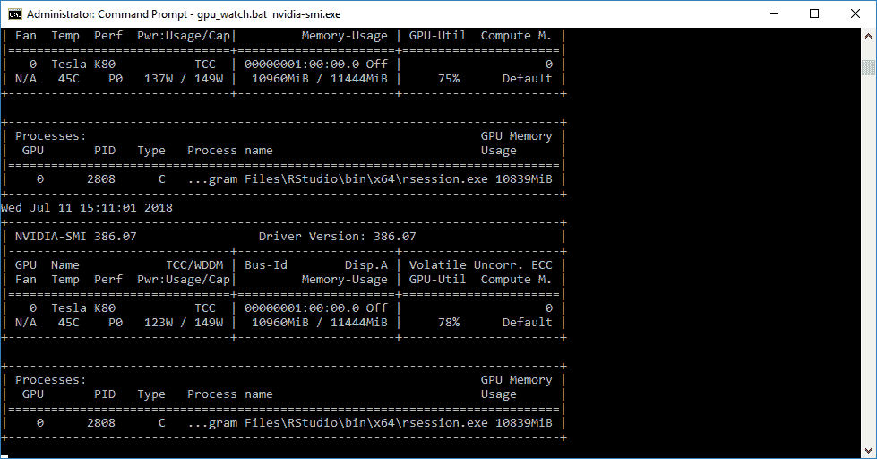

图 10.2: nvidia-smi 实用程序显示 GPU 卡的利用率为 75-85%


# 使用 AWS 进行深度学习

**AWS** 是最大的云提供商，因此值得我们关注。如果你知道如何使用 AWS，特别是如果你熟悉 spot 请求，这可能是一种非常经济有效的方法来训练复杂的深度学习模型。


# 自动气象站简介

本节简要介绍 AWS 的工作原理。它描述了 EC2、AMIs 以及如何在云中创建虚拟机。这不会是对 AWS 的详尽介绍——网上有很多教程可以指导你。

AWS 是一套云资源。它的另一个术语是**基础设施即服务** ( **IaaS** ，相对于**软件即服务** ( **SaaS** )或**平台即服务** ( **PaaS** )。与 SaaS 或 PaaS 不同，IaaS 为您提供了基础设施(硬件)，您可以根据自己的意愿使用它。这包括安装软件和管理安全和网络，尽管 AWS 负责安全和网络的某些方面。AWS 有许多服务，但对于深度学习，您将使用的是 EC2，这是一个虚拟计算环境，以便您可以启动实例(虚拟计算机)。您可以通过 web 界面控制这些虚拟计算机，也可以通过远程登录它们来从 shell 运行命令。当您启动 EC2 实例时，您可以选择您想要的操作系统(Ubuntu、Linux、Windows 等等)和机器类型。

你也可以选择使用一个**亚马逊机器镜像** ( **AMI** )，上面已经预装了软件应用和库。对于深度学习来说，这是一个很好的选择，因为这意味着你可以启动一个已经安装了深度学习库的 EC2 实例，并直接进入深度学习。

您应该熟悉的另一项服务是 S3，它是一种持久存储的形式。我建议您采用的一个非常有用的做法是，将您的虚拟机视为临时资源，并将您的数据和临时结果保存在 S3。我们不会在本章中讨论这个问题，因为这是一个高级话题。

在上一节中，我们说明了 AWS 上最便宜的 GPU 计算机的当前按需成本是每小时 0.90 美元。*按需*是在 AWS 中使用虚拟机的一种方式，但在 AWS 中租赁虚拟机有三种不同的方式:

*   **按需实例**:根据需要租用实例时。
*   **保留实例**:当您承诺租赁机器一段时间(通常为 1-3 年)时。这比按需实例便宜 50%左右。然而，你必须为这段时间内的资源付费。
*   **现货实例**:为了应对波动的需求，亚马逊大部分时间都有备用的计算能力。您可以对这种未使用的容量进行投标，根据对该类型机器的需求，您通常可以获得比按需和预留实例更便宜的价格。然而，一旦你有了这台机器，并不能保证你会保留它，只要你需要-如果对计算机的需求上升，你的计算机可能会被终止。

储备实例对深度学习没用。租用最便宜的 GPU 机器 1 年的成本将超过 5000 美元，而你可以花更少的钱购买性能更好的深度学习机器。按需实例保证您将拥有所需的资源，但代价昂贵。如果您知道如何正确使用 Spot 实例，并为计算机被终止的可能性做好准备，那么 spot 实例是一种有趣且经济的方法。

通常情况下，现货价格是按需价格的 30%左右，因此可以节省大量成本。您的出价是您愿意为现货实例支付的最高金额，实际价格取决于市场价格，而市场价格是基于需求的。

因此，你应该把你的出价定得高一些；我建议将其设置为按需价格的 51%、76%或 101%。50%、75%和 100%中额外的 1%是因为，与任何竞价市场类似，人类将他们的竞价固定在整数上，因此通过额外的 1%来避免这一点，它可以产生影响。

spot 实例最初的用例是用于低优先级的批处理作业。公司使用 spot 实例来利用更便宜的计算资源来完成长时间运行的任务，如果任务没有完成，可以重新启动。例如，对运营不重要的数据运行辅助数据接收流程。然而，基于 GPU 的实例的需求模式是不同的，可能是因为在线数据挖掘竞争，如 Kaggle。因为 GPU 实例不是很常见，所以对 GPU 实例的需求会增加很多。这导致了现货定价中的一些奇怪行为，人们为现货实例出价的价格可能是按需价格的 10 倍。人们这样做是因为他们相信这样就不太可能有人出价比他们高。有些情况下，p2.16xlarge 的现货价格为每小时 144 美元，而点播价格为 14.40 美元。设定这些出价的人不希望他们的机器被终止，并且相信他们为即时实例支付的平均费用仍然低于按需实例。如果你使用 spot 实例，我不鼓励这样做，因为如果需求上升，你会得到一个非常令人讨厌的惊喜！但是，您应该意识到这种定价怪癖——不要认为将投标价格设置为略高于按需价格就能保证您的机器不会被终止。

AWS 通过提供定价历史图表来帮助您设置现货请求出价，这些图表会为您提供按需价格和出价价格方面的建议。在下面的截图中，我们可以看到特定地区(美国东部)的价格在过去 3 个月中的变化。有 6 个可用区域(us-east-1a 到 us-east-1f)，此实例类型的当前现货价格( **p2.16xlarge** )从 4.32 美元到 14.40 美元不等，而按需价格为 14.40 美元:


图 10.3:p 2.16 大型实例类型现货报价的定价历史

查看该资源的上图，我会考虑以下几点:

*   如果可能的话，我会使用可用区 **us-east-1a** ，因为它的价格波动性最低。
*   我会将价格设置为每小时 7.21 美元，这只是按需价格的 50%多一点。我可能只会支付每小时 4.32 美元，因为它已经 1 个月以来，美国东部 1a 的投标价格已经超过每小时 4.32 美元。将它设置为较高的价格会降低我的 spot 实例被终止的可能性。

**Regions and availability zones:** AWS arranges its services in regions (**us-east1**, **eu-west1**, and so on). Currently, there are 18 different regions and in each region, there are multiple availability zones, which you can consider as physical data centers. For some use cases (for example, websites, disaster recovery, and so on) and regulatory requirements, regions and availability zones are important. For deep learning, they are not so important, as you can usually run your deep learning models at any location. The bid price for spot instances is different for regions/availability zones, and some resources are more expensive in some regions. You also need to be aware that there is a cost in transferring data between regions, so keep your data and instances in the same region.

# 在 AWS 中创建深度学习 GPU 实例

本节将使用 AWS 来训练来自[第 9 章](d6a250f7-f19b-4c5c-9b89-2f3b684d915c.xhtml)、*异常检测和推荐系统*的深度学习模型。这将包括设置机器、访问机器、下载数据和运行模型。我们将使用来自 RStudio 的预构建的 AWS AMI，它已经安装了 TensorFlow 和 Keras。关于这个 AMI 的细节，请点击这个链接:[https://aws.amazon.com/marketplace/pp/B0785SXYB2](https://aws.amazon.com/marketplace/pp/B0785SXYB2)。如果你还没有在[https://portal.aws.amazon.com/billing/signup](https://portal.aws.amazon.com/billing/signup)注册 AWS 账户，你需要注册一个。注册后，按照以下步骤在 AWS 上创建一个具有 GPU 的虚拟机:

请注意，当您在 AWS 中设置一个实例时，只要它还在运行，您就需要付费！请务必关闭您的实例，否则您将继续被收费。使用完虚拟实例后，检查 AWS 控制台以确保没有正在运行的实例。

1.  登录 AWS 控制台并选择 EC2。您应该会看到类似下面的屏幕。这是用于创建新虚拟机的 web 界面:


图 10.4: AWS EC2 仪表板

2.  单击启动实例按钮，将加载以下页面。
3.  点击左边的 **AWS Marketplace** ，在搜索框中输入`rstudio`(见以下截图)。
4.  选择**带 Tensorflow-GPU 的 RStudio 服务器用于 AWS** 。请注意，还有另一个带有单词 **Pro** 的选项–这是一个需要额外费用的付费订阅，因此不要选择此 AMI:

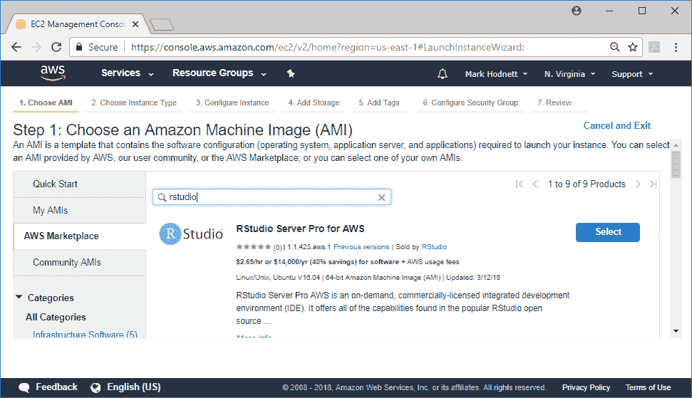

图 10.5: AWS 启动实例向导，步骤 1

5.  单击**选择**后，可能会出现以下屏幕，显示一些关于访问实例的附加信息。请仔细阅读说明，因为它们可能与以下屏幕截图中显示的内容有所不同:

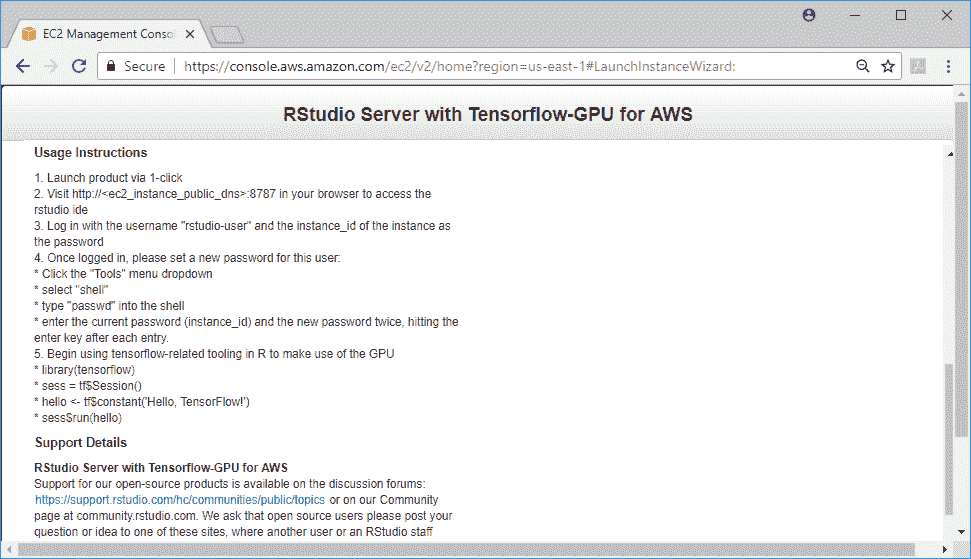

图 10.6: RStudio AMI 信息

6.  当您点击**继续**时，将出现以下机器类型屏幕。选择配有 GPU 的机器至关重要，因此从**筛选依据:**选项中，选择 GPU 计算，然后从列表中选择 **p2.xlarge** 。您的选项应该类似于下面的屏幕截图:

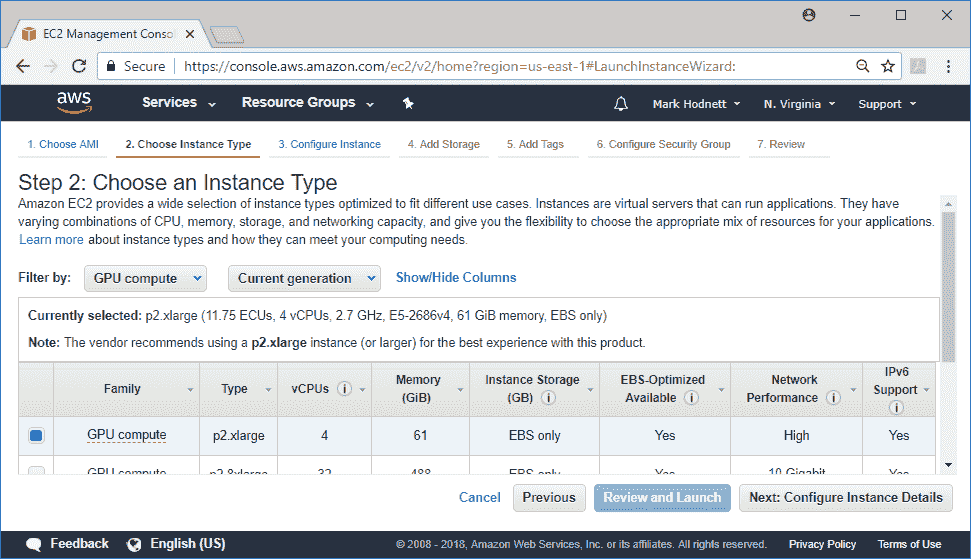

图 10.7: AWS 启动实例向导，步骤 2

7.  当您单击“下一步”时，您将进入具有各种配置选项的以下屏幕。默认选项是 OK，所以只需再次按下 Next:

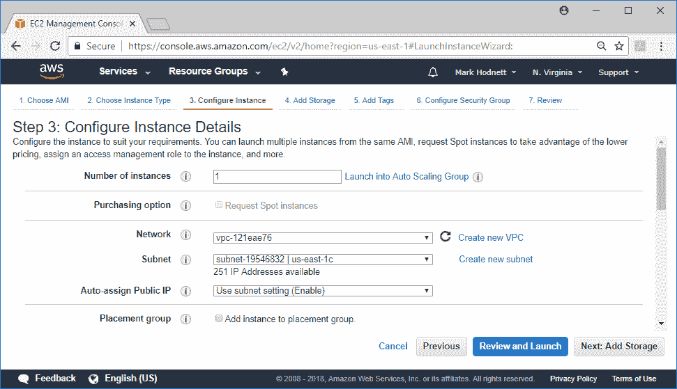

图 10.8: AWS 启动实例向导，步骤 3

8.  此屏幕允许您更改存储选项。根据数据的大小，您可能需要添加额外的存储空间。存储相对便宜，所以我建议使用 3-5 倍大小的输入数据。
9.  点击**下一步**进入以下截图:


图 10.9: AWS 启动实例向导，步骤 4

10.  下面的屏幕并不重要——标签用于跟踪 AWS 中的资源，但我们并不需要它们。单击“下一步”转到以下屏幕截图:


图 10.10: AWS 启动实例向导，步骤 5

11.  下面的屏幕截图显示了安全选项。AWS 限制对实例的访问，因此您必须打开任何需要的端口。这里提供的默认值允许访问端口`22` (SSH)来访问 shell，也允许访问端口`8787`，这是 RStudio 使用的 web 端口。单击“查看并启动”继续:


图 10.11: AWS 启动实例向导，步骤 6

会出现下面的截图。请注意关于安全性的警告消息——在生产环境中，您可能希望解决这些问题。

12.  点击**发射**按钮继续:

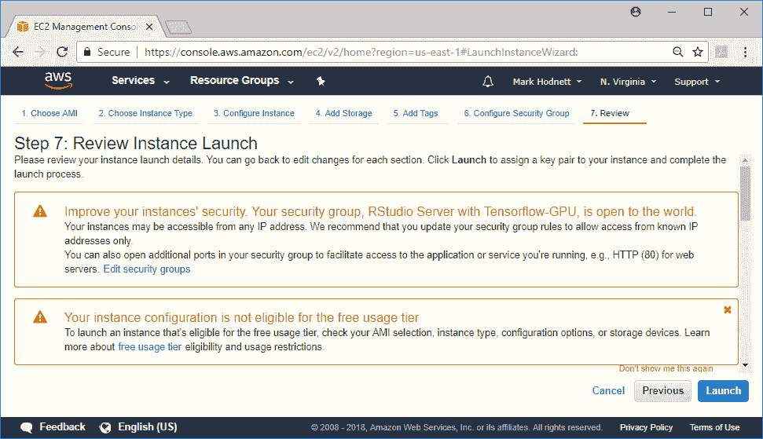

图 10.12: AWS 启动实例向导，步骤 7

13.  您将被要求提供一对密钥。如果您尚未创建密钥对，请选择创建密钥对的选项。给它一个描述性的名称，然后按下载密钥对按钮。然后，单击启动实例:

密钥对用于通过 SSH 访问实例。您应该非常小心地保护这一点，就好像有人设法获得了您的私钥，那么他们将能够登录到您的任何实例。您应该偶尔删除您的密钥对并创建一个新的。

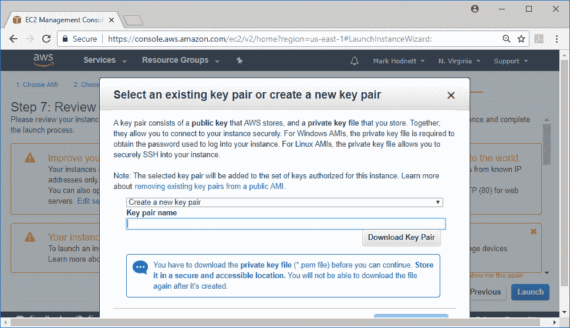

图 10.13: AWS 启动实例向导，选择密钥对

14.  一旦您完成了这些，您可以返回到 EC2 仪表板，您将看到您有 1 个正在运行的实例。单击该链接，转到实例的详细信息:

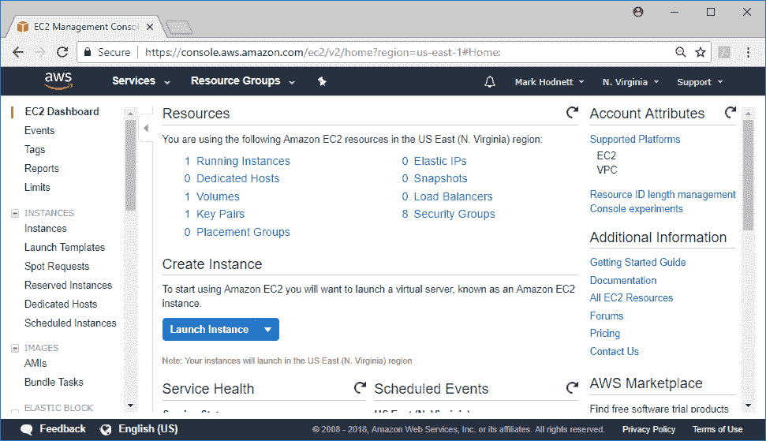

图 10.14: AWS EC2 仪表板

15.  在这里，您将看到实例的详细信息。在这种情况下，IP 地址是`34.227.109.123`。还要记下突出显示的实例 ID，因为这是用于连接到 RStudio 实例的密码:


图 10.15: AWS EC2 仪表板，实例详细信息

16.  打开另一个网页，浏览至您机器的 IP 地址，并添加`:8787`以访问该链接。在我的例子中，链接是`http://34.227.109.123:8787/`。登录的说明在*图 10.6* 中，即使用 rstudio-user 作为用户名，实例 ID 作为密码。您还应该考虑按照说明更改密码。

17.  当你登录时，你会看到一个熟悉的界面——它类似于 RStudio 桌面程序。一个不同之处是右下角的**上传**按钮，它允许你上传文件。在以下示例中，我已经上传了来自[第 9 章](d6a250f7-f19b-4c5c-9b89-2f3b684d915c.xhtml)、*异常检测和推荐系统*的数据和脚本，用于 Keras 推荐器示例，并成功运行了它:

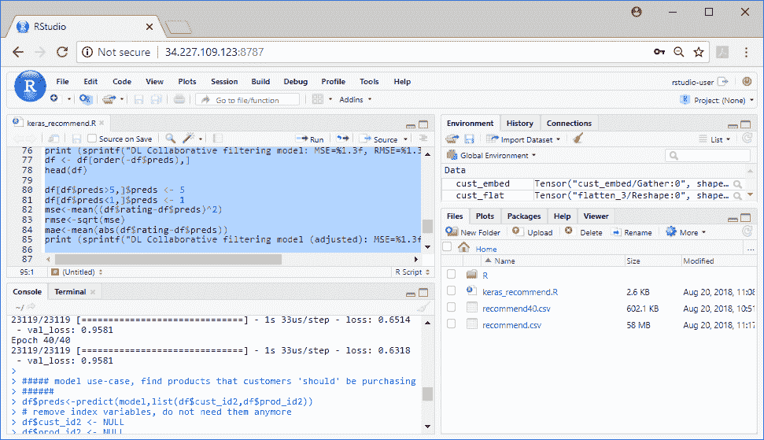

图 10.16:使用 RStudio 服务器访问云中的深度学习实例

RStudio 中的 web 界面类似于在本地计算机上使用 RStudio。在*图 10.16* 中，您可以看到我上传的数据文件(`recomend.csv`、`recomend40.csv`)以及左下方窗口文件中的 R 脚本。我们还可以在左下方的控制台窗口中看到执行的代码。

这完成了我们关于如何在 AWS 中设置深度学习机器的例子。再次提醒你，只要电脑还在运行，你就要付费。确保您的实例被终止，否则您将继续被收费。为此，返回 EC2 仪表板，找到实例，并单击**动作**按钮。弹出菜单，选择**实例状态**，然后选择**终止**:

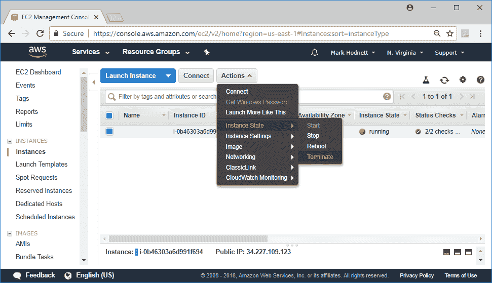

图 10.17:终止 AWS 实例


# 在 AWS 中创建深度学习 AMI

在前面的例子中，我们使用了一个由 RStudio 构建的**亚马逊机器映像** ( **AMI** )。在 AWS 中，您还可以创建自己的 AMI。当您创建一个 AMI 时，您可以安装您想要的软件，将数据加载到它上面，并按照您的意愿设置它。本节将向您展示如何使用 AMI 在 AWS 上使用 MXNet。

1.  创建 AMI 的第一步是选择将要使用的基础映像。我们可以从安装了操作系统的基本映像开始，但我们将使用之前使用的带有 Tensorflow-GPU for AWS 的 **RStudio 服务器，并向其中添加 MXNet 包。**
2.  安装 MXNet 的说明改编自[https://mxnet.incubator.apache.org/install/index.html](https://mxnet.incubator.apache.org/install/index.html)。第一步是根据上一节，使用 Tensorflow-GPU for AWS AMI 从 **RStudio 服务器创建实例。**
3.  一旦你完成了这些，你需要 SSH 进入机器。如何操作取决于您自己计算机上的操作系统。对于 Linux 和 macOS，可以在 shell 上执行本地命令，在 Windows 中可以使用 Putty。
4.  登录到计算机后，运行以下命令:

```
vi ~/.profile
```

5.  将下面一行添加到该文件的末尾，并保存该文件:

```
export CUDA_HOME=/usr/local/cuda
```

6.  回到 shell 后，逐一运行以下代码行:

```
sudo apt-get update
sudo dpkg --configure -a
sudo apt-get install -y build-essential git
export CUDA_HOME=/usr/local/cuda
git clone --recursive https://github.com/apache/incubator-mxnet
cd incubator-mxnet
make -j $(nproc) USE_OPENCV=1 USE_CUDA=1 USE_CUDA_PATH=/usr/local/cuda USE_CUDNN=1
```

7.  最后一个命令可能需要 2 个小时才能完成。完成后，运行最后几行:

```
sudo ldconfig /usr/local/cuda/lib64
sudo make rpkg
sudo R CMD INSTALL mxnet_current_r.tar.gz
```

第二行可能需要 30 分钟。最后一行可能会返回一个关于丢失文件的警告，这可以忽略。

8.  要测试所有安装是否正确，请转到实例的 RStudio 页面，并键入以下代码:

```
library(mxnet)

a <- mx.nd.ones(c(2,3), ctx = mx.gpu())

b <- a * 2 + 1

b
```

9.  您应该得到以下输出:

```
 [,1] [,2] [,3]
[1,]    3    3    3
[2,]    3    3    3
```

10.  现在回到 EC2 仪表板，点击**运行实例**，并在列表中选择机器。点击**动作**按钮，从下拉菜单中选择**图像**，并选择**创建图像**。如下图所示:


图 10.18:创建一个 AMI

11.  该图像可能需要 15-20 分钟才能完成。完成后，单击左侧菜单选项中的 ami 以显示与您的帐户相关的 ami 列表。您应该会看到您刚刚创建的 AMI。然后，这个 AMI 可以用于创建新的按需实例或新的 spot 实例。下面的屏幕截图显示了为 AMI 创建一个 spot 实例的菜单选项:


图 10.19:使用现有的 AMI 进行 spot 请求

这个 AMI 现在是可用的，以便您可以创建新的深度学习实例。您应该意识到，即使您不使用 AMI，存储它也是有持续成本的。


# 使用 Azure 进行深度学习

Azure 是微软云服务的品牌名称。你可以使用 Azure 进行深度学习，与 AWS 类似，它提供了预配置有深度学习库的深度学习虚拟机。在本例中，我们将创建一个可用于 Keras 或 MXNet 的 Windows 实例。这里假设您的本地计算机也是一台 Windows 计算机，因为您将使用**远程桌面协议** ( **RDP** )来访问云实例。

1.  第一步是在 Azure 中创建一个帐户，然后在[https://portal.azure.com](https://portal.azure.com)登录 Azure。你会看到一个类似下面的截图。点击**创建资源**并搜索**深度学习虚拟机**:


图 10.20: Azure 门户网站

2.  当您选择**深度学习虚拟机**时，会出现以下画面。点击**创建**:


图 10.21:在 Azure 上提供深度学习实例，步骤 0

3.  现在，您将启动一个 4 步向导来创建新实例。

第一步(基础)，询问一些基本细节。可以输入与我相同的值，但请仔细填写用户名和密码，因为您稍后会用到它们:

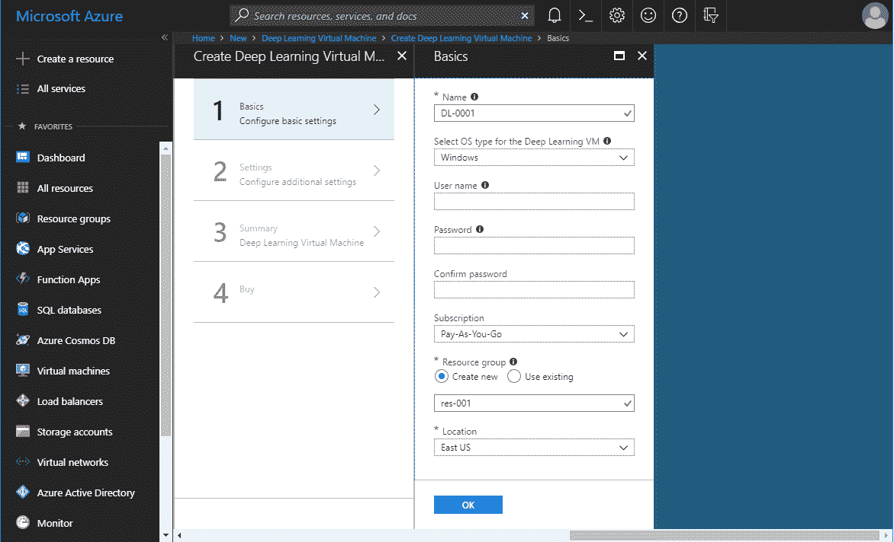

图 10.22:在 Azure 上提供深度学习实例，步骤 1

对于步骤 2(设置)，确保虚拟机大小为 1 x 标准 NC6 (1 个 GPU)，然后单击**确定**继续:


图 10.23:在 Azure 上提供深度学习实例，步骤 2

对于步骤 3(总结)，有一个简短的验证检查。您可能会被告知，您的帐户没有足够的可用计算/虚拟机(核心/虚拟 CPU)资源，这是因为 Microsoft 可能在您的帐户首次创建时对其进行了限制。创建支持票证以增加您的资源，然后重试。如果您已经通过了这一步，点击 **OK** 继续。您现在处于最后一步，只需点击**创建**:


图 10.24:在 Azure 上提供深度学习实例，步骤 4

在创建资源之前，您可能需要等待 30-40 分钟。完成后，选择左侧的 **All resources** ，您将看到所有对象都已创建。下面的截图显示了一个例子。点击类型为**的虚拟机**:


图 10.25:Azure 上当前提供的资源列表

4.  然后你会看到下面的截图。点击屏幕顶部的**连接**按钮。
5.  右边会打开一个窗格，让你选择**下载 RDP 文件**。点击它，当文件下载后，双击它:


图 10.26:下载 RDP 文件以连接到 Azure 中的云实例

6.  这应该会弹出一个登录窗口来连接到云实例。输入您在步骤 1 中创建的用户名和密码，以连接到实例。当您连接时，您将看到类似于以下屏幕截图的桌面:


图 10.27:深度学习实例(Azure)的远程桌面

太好了！RStudio 已经安装。已经安装了 Keras，所以您拥有的任何 Keras 深度学习代码都将运行。让我们试着运行一些 MXNet 代码。打开 RStudio 并运行以下命令来安装 MXNet:

```
cran <- getOption("repos")
cran["dmlc"] <- "https://apache-mxnet.s3-accelerate.dualstack.amazonaws.com/R/CRAN/GPU/cu90"
options(repos = cran)
install.packages("mxnet")

# validate install
library(mxnet)
a <- mx.nd.ones(c(2,3), ctx = mx.gpu())
b <- a * 2 + 1
b
```

这在安装的 R 版本上不起作用。如果要使用 MXNet，必须下载最新版本的 R(编写时为 3.5.1)并安装。不幸的是，这将禁用 Keras，所以只有当您想使用 MXNet 而不是 Keras 时才这样做。一旦你从 https://cran.r-project.org/,下载了 R，然后重新运行上面的代码来安装 MXNet。

注意:安装在这些 AMI 上的软件变化非常频繁。在安装任何深度学习库之前，请检查安装的 CUDA 版本。你需要确保他们的深度学习库与机器上安装的 CUDA 版本兼容。


# 使用谷歌云进行深度学习

谷歌云也有 GPU 实例。在写这本书的时候，NVIDIA Tesla K80 GPU 卡(也是 AWS p2.xlarge 实例中的 GPU 卡)的实例价格是按需每小时 0.45 美元。这比 AWS 按需价格要便宜得多。谷歌云的 GPU 实例的进一步细节在[https://cloud.google.com/gpu/](https://cloud.google.com/gpu/)。但是，对于 Google Cloud，我们不打算使用实例。相反，我们将使用 Google Cloud 机器学习引擎 API 向云提交机器学习作业。与配置虚拟机相比，这种方法的一大优势是您只需为使用的硬件资源付费，而不必担心实例的设置和终止。更多细节和价格可以在 https://cloud.google.com/ml-engine/pricing 的[找到。](https://cloud.google.com/ml-engine/pricing)

通过以下步骤注册 Google Cloud 并启用 API:

1.  注册一个 Google Cloud 帐户。
2.  你需要在 https://console.cloud.google.com[登录门户](https://console.cloud.google.com)，启用**云机器学习引擎** API。
3.  从主菜单中选择**API&服务**并点击**启用 API 和服务**按钮。
4.  API 包含在组中。为**机器学习**组选择**查看全部**，然后选择**云机器学习引擎**并确保 API 已启用。

启用 API 后，从 RStudio 执行以下代码:

```
devtools::install_github("rstudio/cloudml")
library(cloudml)
gcloud_init()
```

这将安装 Google Cloud SDK，并要求您将您的 Google 帐户连接到 SDK。然后，您将在终端窗口中浏览选项菜单。第一种选择如下:


图 10.28:从 RStudio 访问 Google Cloud SDK

现在，不要创建任何新的项目或配置，只需选择已经存在的项目或配置。一旦你将你的 Google 帐户链接到你机器上的 Google SDK 并启用了服务，你就可以开始了。云机器学习引擎允许您向 Google Cloud 提交作业，而无需创建任何实例。工作文件夹中的所有文件(R 脚本和数据)将被压缩并打包发送到 Google Cloud。

对于这个例子，我从第八章的项目中取了一个推荐文件，在 R*中使用 TensorFlow 的深度学习模型。我将这个文件和`keras_recommend.R`脚本复制到一个新目录中，并在该目录中创建了一个新的 RStudio 项目。然后我在 RStudio 中打开了这个项目。在前面的截图中可以看到这两个文件和 RStudio 项目文件。然后，我在 RStudio 中执行下面一行来提交深度学习作业:*

```
cloudml_train("keras_recommend.R", master_type = "standard_gpu")
```

这将收集当前工作目录中的文件，并将它们发送到云机器学习引擎。随着作业的执行，一些进度信息将被发送回 RStudio。您还可以通过选择 **ML Engine** | **Jobs** 在[https://console.cloud.google.com](https://console.cloud.google.com)的控制台页面上监控活动。以下是此网页的屏幕截图，显示了两个已完成的作业和一个已取消的作业:

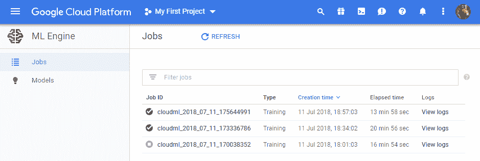

图 10.29:谷歌云平台网页上的 ML 引擎/作业页面

作业完成后，日志将下载到您的本地计算机上。将自动创建一个漂亮的摘要网页，显示该作业的统计信息，如下面的屏幕截图所示:

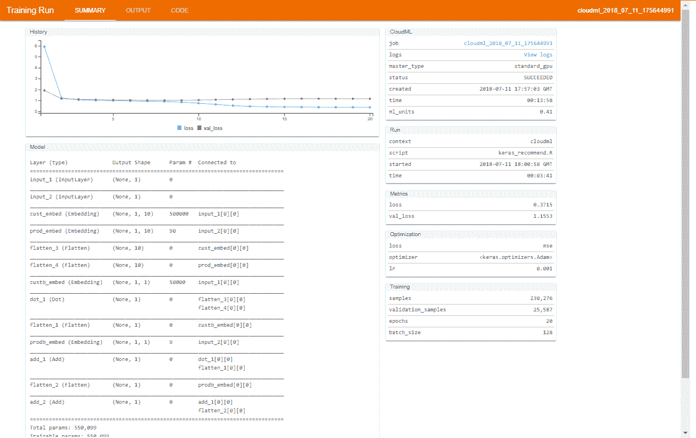

图 10.30:机器学习作业的 Web 摘要页面

我们可以看到显示模型在训练期间的进度、模型摘要、一些超参数( **epochs** 、 **batch_size** 等等)以及成本( **ml_units** )。web 页面还包含 R 脚本的输出。从菜单中选择**输出**进行查看。在下面的屏幕截图中，我们可以看到 R 代码和该代码的输出:

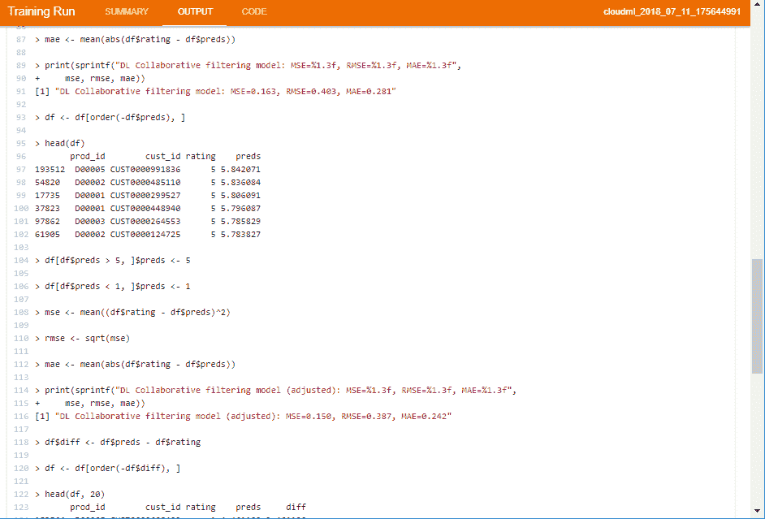

图 10.31:显示 R 代码和输出的机器学习作业的 Web 摘要页面

这只是对使用谷歌云机器学习引擎的简单介绍。在[https://tensor flow . r studio . com/tools/cloudml/articles/tuning . html](https://tensorflow.rstudio.com/tools/cloudml/articles/tuning.html)有一个很好的教程，解释了如何使用这个服务进行超参数训练。使用这种服务而不是云实例进行超参数训练比使用虚拟实例自己管理更简单，可能也更便宜。您不必监控它并协调模型训练的不同运行。有关使用该服务的更多信息，请访问[https://tensor flow . r studio . com/tools/cloudml/articles/getting _ started . html](https://tensorflow.rstudio.com/tools/cloudml/articles/getting_started.html)。


# 使用 Paperspace 进行深度学习

**Paperspace** 是在云中执行深度学习的另一种有趣方式。这可能是在云中训练深度学习模型的最简单的方法。要使用 Paperspace 设置云实例，您可以登录到他们的控制台，配置一台新机器，并从您的 web 浏览器连接到该机器:

1.  首先注册一个 Paperspace 帐户，登录到控制台，然后通过选择 Core 或 Compute 进入虚拟机部分。Paperspace 有一个 RStudio TensorFlow 模板，其中已经安装了 NVIDIA GPU 库(CUDA 8.0 和 cuDNN 6.0)，以及 TensorFlow 和 Keras for R 的 GPU 版本。当您选择**公共模板**时，您将看到此机器类型，如以下截图所示:


图 10.32:图纸空间门户

2.  你可以选择三个 GPU 实例，并选择按小时或按月付费。选择最便宜的选项(目前为每小时 0.40 美元的 P4000)和每小时定价。向下滚动到页面底部，并按下**创建**按钮。几分钟后，您的计算机将被设置，您将能够通过浏览器访问它。RStudio 图纸空间实例的示例如下所示:

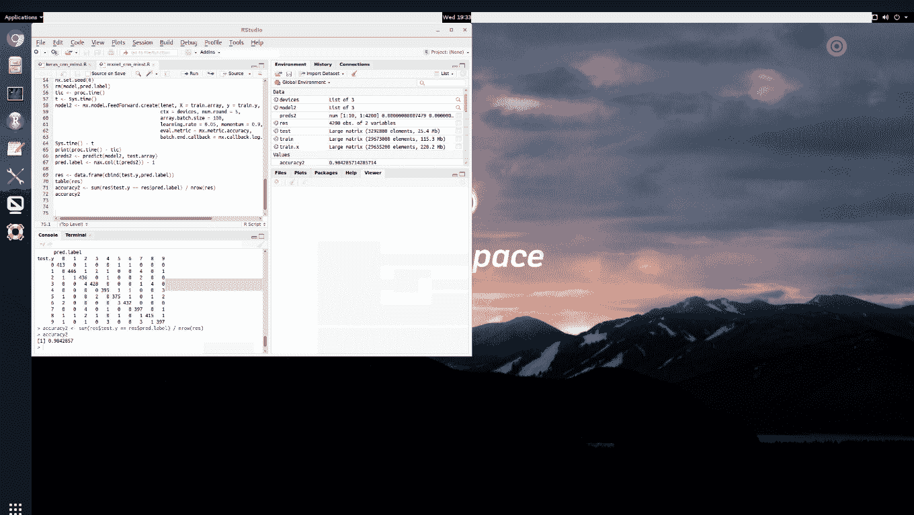

图 10.33:从网页访问虚拟机的桌面并为 Paperspace 实例运行 RStudio

默认情况下，已经安装了 Keras，因此您可以继续使用 Keras 训练深度学习模型。但是，我们还将在我们的实例上安装 MXNet:

1.  第一步是打开 RStudio 并安装几个包。从 RStudio 执行以下命令:

```
install.packages("devtools")
install.packages(c("imager","DiagrammeR","influenceR","rgexf"))
```

2.  下一步是访问刚刚创建的实例的终端(或 shell)。您可以返回控制台页面，从那里开始操作。或者，点击桌面右上角的圆形目标(见前面的截图)。这也为您提供了其他选项，例如在本地计算机和虚拟机之间同步复制和粘贴。
3.  登录到实例的终端后，运行以下命令将安装 MXNet:

```
sudo apt-get update
sudo dpkg --configure -a
sudo apt-get install -y build-essential git
export CUDA_HOME=/usr/local/cuda
git clone --recursive https://github.com/apache/incubator-mxnet
cd incubator-mxnet
make -j $(nproc) USE_OPENCV=1 USE_BLAS=blas USE_CUDA=1 USE_CUDA_PATH=/usr/local/cuda USE_CUDNN=1

sudo ldconfig /usr/local/cuda/lib64
sudo make rpkg
```

4.  您还需要将下面一行添加到`.profile`文件的末尾:

```
export CUDA_HOME=/usr/local/cuda
```

完成后，重新启动实例。你现在有了一台可以在云端训练 Keras 和 MXNet 深度学习模型的机器。有关在 Paperspace 中使用 RStudio 的更多详细信息，请参见[https://tensorflow.rstudio.com/tools/cloud_desktop_gpu.html](https://tensorflow.rstudio.com/tools/cloud_desktop_gpu.html)。


# 摘要

我们在这一章已经涵盖了很多训练深度学习模型的选项！我们讨论了在本地运行它的选项，并展示了拥有 GPU 卡的重要性。我们使用三个主要的云提供商在云上的 R 中训练深度学习模型。云计算是一种奇妙的资源——我们举了一个超级计算机的例子，价值 149，000 美元。几年前，这样的资源对几乎每个人来说都是遥不可及的，但现在多亏了云计算，你可以按小时租用这样的机器。

对于 AWS、Azure 和 Paperspace，我们在云资源上安装了 MXNet，让我们可以选择使用哪个深度学习库。我鼓励你使用本书其他章节中的例子，并尝试这里所有不同的云提供商。令人惊讶的是，你可以这样做，你的总成本可能不到 10 美元！

在下一章中，我们将从图像文件中构建一个图像分类解决方案。我们将演示如何应用迁移学习，它允许您使现有的模型适应新的数据集。我们将展示如何使用 REST API 将模型部署到产品中，并简要讨论生成性对抗网络、强化学习。