# 理解神经网络和深度神经网络

深度学习已经改变了许多传统业务，如网络搜索、广告等。传统机器学习方法的一个主要挑战是，在建模之前，我们需要花费相当多的时间来选择最合适的特征选择过程。除此之外，这些传统技术在一定程度的人为干预和指导下运行。然而，通过深度学习算法，我们可以摆脱显式特征选择的开销，因为它由模型本身负责。这些深度学习算法能够对数据中复杂的非线性关系进行建模。在本书中，我们将向您介绍如何在 r 中建立深度学习生态系统。深度神经网络使用复杂的数学建模技术以复杂的方式处理数据。在本书中，我们将展示各种深度学习库的使用，如`keras`和`MXNet`，以便您可以利用它们丰富的功能和能力来构建和执行深度学习模型，尽管我们将主要关注与`keras`库的合作。这些库带有 CPU 和 GPU 支持，并且用户友好，以便您可以快速原型化深度学习模型。

在本章中，我们将演示如何在 r 中设置深度学习环境。您还将熟悉各种 TensorFlow APIs，以及如何使用它们实现神经网络。您还将学习如何调整神经网络的各种参数，并了解各种激活函数及其在不同类型问题陈述中的用法。

在本章中，我们将介绍以下配方:

*   设置环境
*   用 Keras 实现神经网络
*   张量流估计器 API
*   TensorFlow 核心 API
*   实现单层神经网络
*   训练你的第一个深度神经网络


# 设置环境

在实现深度神经网络之前，我们需要设置并配置我们的系统，以便我们可以应用各种深度学习技术。这个菜谱假设您的系统上已经安装了 Anaconda 发行版。


# 做好准备

让我们为深度学习配置我们的系统。建议您在 Anaconda 中创建一个深度学习环境。如果你在 conda 环境下有较旧版本的 R，你需要将你的 R 版本更新到 3.5.x 或以上。

您还需要安装 CUDA 和 cuDNN 库来支持 GPU。你可以在[https://tensor flow . r studio . com/tools/local _ GPU . html # prerequisites](https://tensorflow.rstudio.com/tools/local_gpu.html#prerequisties)了解更多关于先决条件的信息。

请注意，如果您的系统没有 NVIDIA 图形支持，那么 GPU 处理无法完成。


# 怎么做...

让我们在 Anaconda 中创建一个环境(确保您安装了 R 和 Python):

1.  从开始菜单进入 Anaconda Navigator。
2.  点击环境。
3.  创建一个新环境并命名。确保 Python 和 R 选项都被选中，如下面的屏幕截图所示:


4.  在 RStudio 中使用以下命令或使用上一步中创建的 conda 环境的终端在 R 中安装`keras`库:

```
install.packages("keras")
```

5.  用`tensorflow`后端安装`keras`。

`keras`库支持 TensorFlow 作为默认后端。Theano 和 CNTK 是可以用来代替 TensorFlow 的其他备选后端。

要安装 CPU 版本，请参考以下代码:

```
install_keras(method = c("auto", "virtualenv", "conda"),  conda = "auto", version = "default", tensorflow = "default",  extra_packages = c("tensorflow-hub"))
```

有关此功能的更多详情，请访问[https://keras.rstudio.com/reference/install_keras.html](https://keras.rstudio.com/reference/install_keras.html)。

要安装 GPU 版本，请参考以下步骤:

1.  确保您已经满足了所有的安装先决条件，包括安装 CUDA 和 cuDNN 库。
2.  在`install_keras()`函数中将`tensorflow`参数的值设置为`gpu`:

```
install_keras(tensorflow = "gpu")
```

前面的命令将在 r 中安装 GPU 版本的`keras`。


# 它是如何工作的...

Keras 和 TensorFlow 程序可以在 CPU 和 GPU 上执行，尽管这些程序通常在 GPU 上运行更快。如果您的系统不支持 NVIDIA GPU，您只需要安装 CPU 版本。但是，如果您的系统具有满足所有先决条件的 NVIDIA GPU，并且您需要运行性能关键型应用程序，则应该安装 GPU 版本。要运行 TensorFlow 的 GPU 版本，我们需要一个 NVIDIA GPU，然后需要在系统上安装各种软件组件(CUDA Toolkit v9.0、NVIDIA 驱动程序、cuDNN v7.0)。

在*步骤* *1* 到 *3* 中，我们创建了一个新的`conda`环境，同时安装了 R 和 Python 内核。在*步骤* *4* 和 *5* 中，我们在自己创建的环境中安装了`keras`库。


# 还有更多...

Windows 上唯一支持的安装方法是`conda`。所以在安装`keras`之前应该先安装 Anaconda 3.x for Windows。默认情况下，`keras`包使用 TensorFlow 后端。如果要切换到 Theano 或 CNTK，加载`keras`库后调用`use_backend()`函数。

对于 Theano 后端，使用以下命令:

```
library(keras)
use_backend("theano")
```

对于 CNTK 后端，使用以下命令:

```
library(keras)
use_backend("cntk")
```

现在，你的系统已经可以训练深度学习模型了。


# 请参见

你可以在这里找到更多关于`keras`的 GPU 版本安装及其先决条件:[https://tensorflow.rstudio.com/tools/local_gpu.html](https://tensorflow.rstudio.com/tools/local_gpu.html)。


# 用 Keras 实现神经网络

TensorFlow 是 Google 开发的一个开源软件库，用于使用数据流图进行数值计算。TensorFlow 的 R 接口由 RStudio 开发，它为三个 TensorFlow APIs 提供了接口:

*   克拉斯
*   估计量
*   核心

`keras`、`tfestimators`和`tensorflow`包分别提供了上述 API 的 R 接口。Keras 和 Estimator 是高级 API，而 Core 是低级 API，提供对 TensorFlow 核心的完全访问。在这个食谱中，我们将演示如何使用 Keras 建立和训练深度学习模型。

Keras 是一种高级神经网络 API，用 Python 编写，能够在 TensorFlow、CNTK 或 Theano 之上运行。Keras 的 R 接口使用 TensorFlow 作为默认的后端引擎。`keras`包为 TensorFlow Keras API 提供了一个 R 接口。它让你以两种方式建立深度学习模型，顺序和功能，这两种方式都将在下面的章节中描述。


# 顺序 API

Keras 的顺序 API 易于理解和实现。它让我们线性地创建一个神经网络；也就是说，我们可以逐层构建一个神经网络，其中我们初始化一个序列模型，然后在其上堆叠一系列隐藏和输出层。


# 做好准备

在使用顺序 API 创建神经网络之前，让我们将`keras`库加载到我们的环境中，并生成一些虚拟数据:

```
library(keras)
```

现在，让我们为这个练习模拟一些虚拟数据:

```
x_data <- matrix(rnorm(1000*784), nrow = 1000, ncol = 784)
y_data <- matrix(rnorm(1000), nrow = 1000, ncol = 1)
```

我们可以通过执行以下命令来检查 x 和 y 数据的尺寸:

```
dim(x_data)
dim(y_data)
```

`x_data`数据尺寸为 1000×784，而`y_data`数据尺寸为 1000×1。


# 怎么做...

现在，我们可以构建我们的第一个序列`keras`模型并训练它:

1.  让我们首先定义一个顺序模型:

```
model_sequential <- keras_model_sequential()
```

2.  我们需要向前面代码块中定义的模型添加层:

```
model_sequential %>% 
layer_dense(units = 16,batch_size = ,input_shape = c(784)) %>% 
layer_activation('relu') %>% 
layer_dense(units = 1)
```

3.  将这些层添加到我们的模型之后，我们需要编译它:

```
model_sequential %>% compile(
 loss = "mse",
 optimizer = optimizer_sgd(),
 metrics = list("mean_absolute_error")
)
```

4.  现在，让我们想象一下我们创建的模型的概要:

```
model_sequential %>% summary()
```

该模型的摘要如下:


5.  现在，让我们训练模型并将训练统计数据存储在一个变量中，以便绘制模型的指标:

```
history <- model_sequential %>% fit(
 x_data, 
 y_data,
 epochs = 30,
 batch_size = 128, 
 validation_split = 0.2
)

# Plotting model metrics
plot(history)
```

上述代码生成了以下图形:

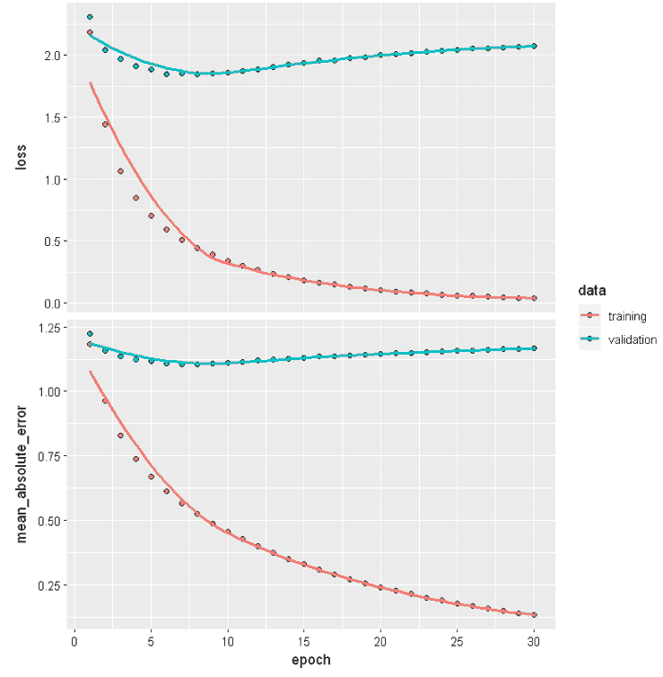

前面的图显示了训练和验证数据的损失和平均绝对误差。


# 它是如何工作的...

在*步骤 1* 中，我们通过调用`keras_model_sequential()`函数初始化了一个顺序模型。在下一步中，我们通过使用一系列图层函数来堆叠隐藏和输出图层。`layer_dense()`函数将密集连接的层添加到定义的模型中。顺序模型的第一层需要知道它应该期望什么样的输入形状，所以我们将一个值传递给第一层的`input_shape`参数。在我们的示例中，输入形状等于数据集中的要素数量。当我们向`keras`顺序模型添加层时，模型对象被就地修改，我们不需要将更新的对象分配回原始对象。`keras`对象的行为不同于大多数 R 对象(R 对象通常是不可变的)。对于我们的模型，我们使用了`relu` 激活功能。`layer_activation()`函数创建一个激活层，它从前面的隐藏层获取输入，并将激活应用到我们前面的隐藏层的输出。我们也可以使用不同的函数，比如 leaky ReLU、softmax 等等(激活函数将在*实现单层神经网络*配方中讨论)。在我们模型的输出层，没有应用激活。

我们还可以通过向`layer_dense()`函数中的`activation`参数传递一个值来为每一层实现不同的激活函数，而不是显式地添加一个激活层。它应用以下操作:

*输出=激活(点(输入，内核)+偏置)*

这里，*激活*参数指的是传递的元素激活函数，而*内核*是由层创建的权重矩阵。*偏置*是由该层产生的偏置矢量。

为了训练一个模型，我们需要配置学习过程。我们在*步骤 3* 中使用了`compile()`功能。在我们的训练过程中，我们应用随机梯度下降优化器来寻找最小化我们的目标损失函数的权重和偏差；即均方误差。`metrics`参数计算模型在训练和测试期间要评估的指标。

在*步骤 4* 中，我们看了模型的总结；它向我们展示了每一层的信息，如每一层的输出形状和每一层的参数。

在最后一步中，我们针对数据集上的固定迭代次数来训练我们的模型。这里，`epochs`参数定义了迭代次数。`validation_split`参数可以取 0 到 1 之间的浮点值。它指定一部分训练数据用作验证数据。最后，`batch_size`定义了通过网络传播的样本数量。


# 还有更多...

训练深度学习模型是一项耗时的任务。如果训练意外停止，我们可能会丢失大量工作。R 中的`keras`库为我们提供了在训练期间和之后保存模型进度的功能。保存的模型包含权重值、模型配置和优化器配置。如果训练过程因某种原因中断，我们可以从那里重新开始训练。

下面的代码块显示了我们如何在训练后保存模型:

```
# Save model
model_sequential %>% save_model_hdf5("my_model.h5")
```

如果我们想在每次迭代后保存模型，我们需要创建一个检查点对象。为了执行这个任务，我们使用了`callback_model_checkpoint()`函数。`filepath` 参数的值定义了我们想要在每次迭代结束时保存的模型的名称。例如，如果`filepath`是`{epoch:02d}-{val_loss:.2f}.hdf5`，该模型将被保存，文件名中带有纪元编号和验证损失。

以下代码块演示了如何在每个时期后保存模型:

```
checkpoint_dir <- "checkpoints"
dir.create(checkpoint_dir, showWarnings = FALSE)
filepath <- file.path(checkpoint_dir, "{epoch:02d}.hdf5")

# Create checkpoint callback
cp_callback <- callback_model_checkpoint(
 filepath = filepath,
 verbose = 1
)

# Fit model and save model after each check point 
model_sequential %>% fit(
 x_data, 
 y_data,
 epochs = 30,
 batch_size = 128, 
 validation_split = 0.2,
 callbacks = list(cp_callback)
)
```

通过这样做，您已经学会了如何用适当的检查点和回调来保存模型。


# 请参见

*   要了解有关在 Keras 中编写自定义图层的更多信息，请访问[https://tensor flow . r studio . com/Keras/articles/custom _ layers . html](https://keras.rstudio.com/articles/custom_layers.html)。


# 功能 API

在构建复杂模型时，Keras 的函数式 API 给了我们更多的灵活性。我们可以在层、多输入/输出模型、具有共享层的模型或重用层的模型之间创建非顺序连接。


# 怎么做...

在本节中，我们将使用我们在本菜谱的上一节中创建的相同模拟数据集，*顺序 API* 。在这里，我们将创建一个多输出功能模型:

1.  让我们首先导入所需的库并创建一个输入层:

```
library(keras)

# input layer
inputs <- layer_input(shape = c(784))
```

2.  接下来，我们需要定义两个输出:

```
predictions1 <- inputs %>%
 layer_dense(units = 8)%>%
 layer_activation('relu') %>%
 layer_dense(units = 1,name = "pred_1")

predictions2 <- inputs %>%
 layer_dense(units = 16)%>%
 layer_activation('tanh') %>%
 layer_dense(units = 1,name = "pred_2")
```

3.  现在，我们需要定义一个功能性的 Keras 模型:

```
model_functional = keras_model(inputs = inputs,outputs = c(predictions1,predictions2))
```

我们来看一下模型的总结:

```
summary(model_functional)
```

下面的屏幕截图显示了模型的摘要:

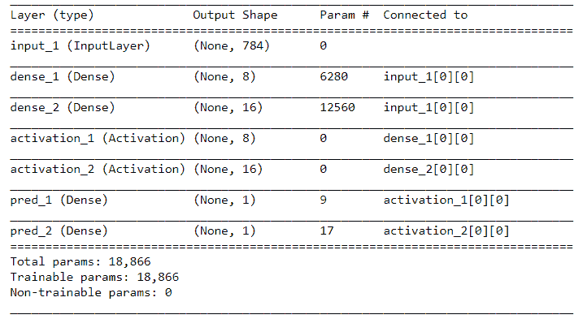

4.  现在，我们编译我们的模型:

```
model_functional %>% compile(
 loss = "mse",
 optimizer = optimizer_rmsprop(),
 metrics = list("mean_absolute_error")
)
```

5.  接下来，我们需要训练模型并可视化模型的参数:

```
history_functional <- model_functional %>% fit(
 x_data,
 list(y_data,y_data),
 epochs = 30,
 batch_size = 128,
 validation_split = 0.2
 )
```

现在，让我们绘制预测 1 和预测 2 的训练和验证数据的模型损失:

```
# Plot the model loss of the prediction 1 training data
plot(history_functional$metrics$pred_1_loss, main="Model Loss", xlab = "epoch", ylab="loss", col="blue", type="l")

# Plot the model loss of the prediction 1 validation data
lines(history_functional$metrics$val_pred_1_loss, col="green")

# Plot the model loss of the prediction 2 training data
lines(history_functional$metrics$pred_2_loss, col="red")

# Plot the model loss of the prediction 2 validation data
lines(history_functional$metrics$val_pred_2_loss, col="black")

# Add legend
legend("topright", c("training loss prediction 1","validation loss prediction 1","training loss prediction 2","validation loss prediction 2"), col=c("blue", "green","red","black"), lty=c(1,1))
```

下图显示了预测 1 和预测 2 的训练和验证损失:

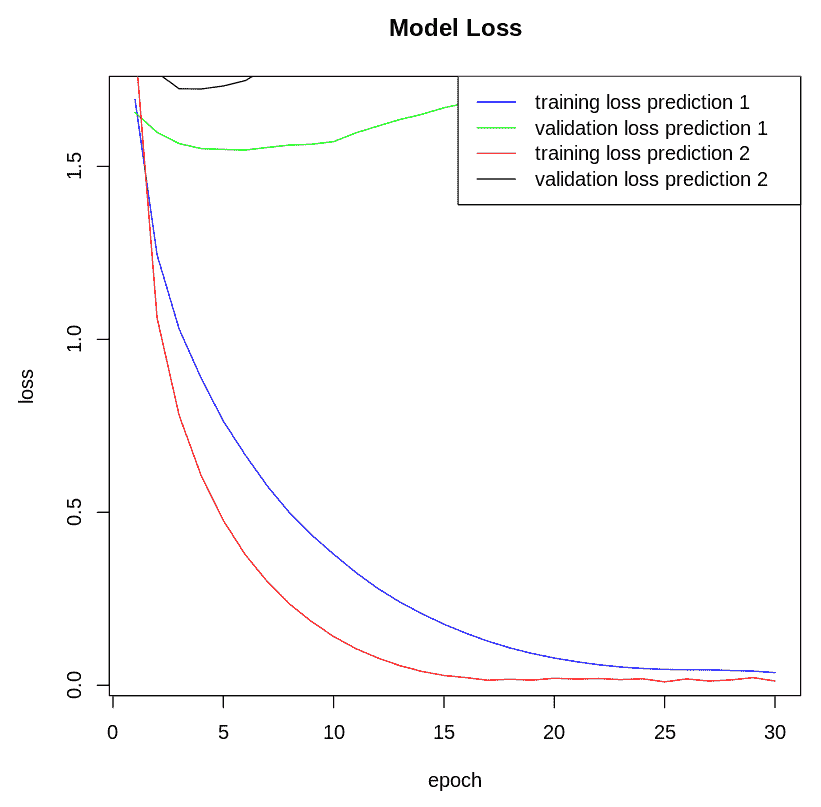

现在，让我们绘制预测 1 和预测 2 的训练和验证数据的平均绝对误差:

```
# Plot the model mean absolute error of the prediction 1 training data
plot(history_functional$metrics$pred_1_mean_absolute_error, main="Mean Absolute Error", xlab = "epoch", ylab="error", col="blue", type="l")

# Plot the model mean squared error of the prediction 1 validation data
lines(history_functional$metrics$val_pred_1_mean_absolute_error, col="green")

# Plot the model mean squared error of the prediction 2 training data
lines(history_functional$metrics$pred_2_mean_absolute_error, col="red")

# Plot the model mean squared error of the prediction 2 validation data
lines(history_functional$metrics$val_pred_2_mean_absolute_error, col="black")

# Add legend
legend("topright", c("training mean absolute error prediction 1","validation mean absolute error prediction 1","training mean absolute error prediction 2","validation mean absolute error prediction 2"), col=c("blue", "green","red","black"), lty=c(1,1))

```

下图显示了预测 1 和预测 2 的平均绝对误差:

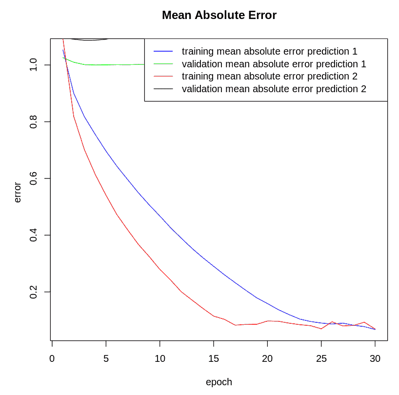


# 它是如何工作的...

为了使用函数式 API 创建模型，我们需要独立地创建输入和输出层，然后将它们传递给`keras_model()`函数，以便定义完整的模型。在上一节中，我们创建了一个模型，其中两个不同的输出层共享一个输入层/张量。

在 s *步骤 1* 中，我们使用`layer_input()`函数创建了一个输入张量，它是进入由`keras`模型生成的计算图的入口点。在*步骤 2* 中，我们定义了两个不同的输出层。这些输出层具有不同的配置；即激活函数和感知器单元的数量。输入张量流经这些并产生两个不同的输出。

在*步骤 3* 中，我们使用`keras_model()`函数定义了我们的模型。它需要两个参数:`inputs` 和`outputs`。这些参数指定哪些层作为模型的输入和输出层。对于多输入或多输出模型，可以使用输入图层和输出图层的向量，如下所示:

*keras_model(输入= c(输入 _ 层 _1，输入 _ 层 _2)，输出= c(输出 _ 层 _1，输出 _ 层 _2))*

在我们配置了我们的模型之后，我们定义了学习过程，训练了我们的模型，并且可视化了损失和准确性度量。我们在*步骤 4* 和 *5* 中使用的`compile()`和`fit()`功能在*顺序 API* 配方的*工作原理*部分有详细描述。


# 还有更多...

您会遇到这样的场景，您需要一个模型的输出，以便将其与另一个输入一起输入到另一个模型中。可以使用`layer_concatenate()`功能来完成此操作。让我们定义一个新的输入，我们将把它与我们在本菜谱的*如何做*部分中定义的`predictions1`输出层连接起来，并构建一个模型:

```
# Define new input of the model 
new_input <- layer_input(shape = c(5), name = "new_input")

# Define output layer of new model
main_output <- layer_concatenate(c(predictions1, new_input)) %>% 
  layer_dense(units = 64, activation = 'relu') %>%
  layer_dense(units = 1, activation = 'sigmoid', name = 'main_output')

# We define a multi input and multi output model
model <- keras_model(
  inputs = c(inputs, new_input), 
  outputs = c(predictions1, main_output)
)
```

我们可以使用`summary()`函数来可视化模型的概要。

在处理复杂模型时，为不同的层指定唯一的名称是一个很好的做法。


# 张量流估计器 API

Estimator 是一个高级 TensorFlow API，它使开发深度学习模型变得更加易于管理，因为您可以使用它们来编写具有高级直观代码的模型。它构建了一个计算图，并提供了一个我们可以初始化变量、加载数据、处理异常和创建检查点的环境。

`tfestimators`包是 TensorFlow Estimator API 的 R 接口。它在 R 中实现了 TensorFlow Estimator API 的各种组件，以及许多预先构建的固定模型，如线性模型和深度神经网络(DNN 分类器和回归器)。这些被称为**预** - **制造估计器**。Estimator API 没有递归神经网络或卷积神经网络的直接实现，但支持用于定义任意新模型类型的灵活框架。这就是所谓的定制评估框架。


# 做好准备

在这个菜谱中，我们将演示如何使用 Estimator API 来构建和拟合深度学习模型。为了在 R 中使用 Estimator API，我们需要安装`tfestimators`包。

首先，让我们安装库，然后将其导入到我们的环境中:

```
install.packages("tfestimators")
library(tfestimators)
```

接下来，我们需要为这个练习模拟一些虚拟数据:

```
x_data_df <- as.data.frame( matrix(rnorm(1000*784), nrow = 1000, ncol = 784))
y_data_df <- as.data.frame(matrix(rnorm(1000), nrow = 1000, ncol = 1))
```

让我们将响应变量重命名为`target`:

```
colnames(y_data_df)<- c("target")
```

现在，让我们将 x 和 y 数据绑定在一起，以准备训练数据:

```
dummy_data_estimator <- cbind(x_data_df,y_data_df)
```

这样，我们就创建了输入数据集。


# 怎么做...

在这个食谱中，我们将使用一个预制的`dnn_regressor`估算器。让我们开始构建和训练一个深度学习评估器模型:

1.  在建立估计器神经网络之前，我们需要执行一些步骤。首先，我们需要创建一个特性名称的向量:

```
features_set <- setdiff(names(dummy_data_estimator), "target")
```

这里，我们根据估计器 API 构造特性列。`feature_columns()`函数是特征列的构造函数，它定义了模型输入的预期形状:

```
feature_cols <- feature_columns(
 column_numeric(features_set)
)
```

2.  接下来，我们定义一个输入函数，以便我们可以选择特征和响应变量:

```
estimator_input_fn <- function(data_,num_epochs = 1) {
 input_fn(data_, features = features_set, response = "target",num_epochs = num_epochs )
}
```

3.  让我们构建一个估计回归模型:

```
regressor <- dnn_regressor(
 feature_columns = feature_cols,
 hidden_units = c(5, 10, 8),
 label_dimension = 1L,
 activation_fn = "relu"
)
```

4.  接下来，我们需要训练我们在上一步中构建的回归器:

```
train(regressor, input_fn = estimator_input_fn(data_ = dummy_data_estimator))
```

5.  与我们对训练数据所做的类似，我们需要模拟一些测试数据并评估模型的性能:

```
x_data_test_df <- as.data.frame( matrix(rnorm(100*784), nrow = 100, ncol = 784))
y_data_test_df <- as.data.frame(matrix(rnorm(100), nrow = 100, ncol = 1))
```

我们需要更改响应变量的列名，就像我们对训练数据所做的那样:

```
colnames(y_data_test_df)<- c("target")
```

我们将 x 和 y 数据绑定在一起作为测试数据:

```
dummy_data_test_df <- cbind(x_data_test_df,y_data_test_df)
```

现在，我们使用之前构建的回归模型为测试数据集生成预测:

```
predictions <- predict(regressor, input_fn = estimator_input_fn(dummy_data_test_df), predict_keys = c("predictions"))
```

接下来，我们在测试数据集上评估模型的性能:

```
evaluation <- evaluate(regressor, input_fn = estimator_input_fn(dummy_data_test_df))
evaluation
```

在下一节中，您将全面了解我们在这里实现的步骤。


# 它是如何工作的...

在这个配方中，我们使用一个预制的估计器实现了一个 DNN 回归器；前面的程序可以分为多个子部分，如下所示:

*   **定义特性列**:在*步骤 1* 中，我们创建了一个字符串向量，其中包含我们的数字特性列的名称。接下来，我们调用了`feature_columns()`函数，它定义了输入张量的预期`shape`值，以及在对要素进行建模时应如何对其进行转换(数值或分类)。在我们的例子中，输入张量的形状是 784，输入张量的所有值都是数字。我们通过向`feature_columns()`中的`column_numeric()`函数提供数字列的名称来转换数字特性。如果数据中的分类列具有诸如`category_x`、`category_y`之类的值，并且您想要将整数值(0，1)赋给这些值，您可以使用`column_categorical_with_identity()`函数来实现。
*   **编写数据集导入函数**:在*第二步*中，我们定义了一个预制的估算器如何接收数据。它由`input_fn()`功能定义。它将原始数据源转换为张量，并选择特征和响应列。它还配置在训练期间如何绘制数据；即洗牌、批量大小、纪元等等。
*   **实例化相关的预制估计器**:在*步骤 3* 中，我们通过调用`dnn_regressor()`实例化了一个预制的**深度神经网络** ( **DNN** )估计器。函数的`hidden_units`参数值定义了我们的网络；即网络中的隐层和每层中的感知器数量。它由密集的前馈神经网络层组成。它将整数向量作为参数值。在我们的模型中，我们有三层，分别有 5、10 和 8 个感知器。我们使用`relu`作为我们的激活函数。`dnn_regrssor`函数的`label_dimension`参数定义了每个示例的回归目标的形状。
*   **调用一个训练**，**评估方法**:在*步骤 4* 中，我们训练了我们的模型，在下一步中，我们预测了测试数据集的值，并评估了模型的性能。


# 还有更多...

评估者提供了一个叫做 run hooks 的工具，这样我们就可以跟踪训练、报告进度、请求提前停止等等。其中一个实用程序是`hook_history_saver()`函数，它让我们保存每个训练步骤的训练历史。在训练估计器时，我们将运行钩子的定义传递给`train()`函数的钩子参数，如下面的代码块所示。它在每两次训练迭代后保存模型进度，并返回保存的训练指标。

下面的代码块显示了如何实现运行挂钩:

```
training_history <- train(regressor,
 input_fn = estimator_input_fn(data_ = dummy_data_estimator),
 hooks = list(hook_history_saver(every_n_step = 2))
 )
```

其他预构建的运行挂钩由 Estimator API 提供。要了解更多信息，请参考本食谱*部分的链接。*


# 请参见

*   自定义估算员:[https://tensor flow . r studio . com/TF estimators/articles/creating _ estimators . html](https://tensorflow.rstudio.com/tfestimators/articles/creating_estimators.html)
*   其他预建的运行钩子:[https://tensor flow . r studio . com/TF estimators/articles/run _ hooks . html](https://tensorflow.rstudio.com/tfestimators/articles/run_hooks.html)
*   数据集 API:[https://tensor flow . r studio . com/TF estimators/articles/dataset _ API . html](https://tensorflow.rstudio.com/tfestimators/articles/dataset_api.html)


# TensorFlow 核心 API

TensorFlow 核心 API 是一组用 Python 编写的模块。这是一个用图形表示计算的系统。R `tensorflow` 包提供了从 R 对 TensorFlow API 的完整访问。TensorFlow 将计算表示为数据流图，其中每个节点表示一个数学运算，有向弧表示对其执行运算的多维数据数组或张量。在这个菜谱中，我们将使用 TensorFlow 核心 API 的 R 接口构建和训练一个模型。


# 做好准备

你需要安装`tensorflow`库来继续这个食谱。您可以使用以下命令安装它:

```
install.packages("tensorflow")
```

安装软件包后，将其加载到您的环境中:

```
library(tensorflow)
```

执行前面两个代码块不会完全安装`tensorflow`。这里，我们需要使用`install_tensorflow()`函数来安装 TensorFlow，如下面的代码块所示:

```
install_tensorflow()
```

R 中的 TensorFlow 安装需要一个安装了`tensorflow`库的 Python 环境。`install_tensorflow()`函数试图创建一个名为`r-tensorflow`的独立 python 环境，并在其中安装`tensorflow`。它为`method`参数取不同的值，这提供了不同的安装行为。以下链接对这些方法进行了说明:[https://tensor flow . r studio . com/tensor flow/articles/installation . html # installation-methods](https://tensorflow.rstudio.com/tensorflow/articles/installation.html#installation-methods)。

Linux 和 OS X 上有`virtualenv`和`conda`方法，而 Windows 上有`conda`和`system`方法。


# 怎么做...

在初始安装和设置之后，我们可以通过简单地将 TensorFlow 库加载到 R 环境中来开始构建深度学习模型:

1.  让我们从模拟一些虚拟数据开始:

```
x_data = matrix(runif(1000*2),nrow = 1000,ncol = 1)
y_data = matrix(runif(1000),nrow = 1000,ncol = 1)
```

2.  现在，我们需要初始化一些 TensorFlow 变量；也就是说，权重和偏差:

```
W <- tf$Variable(tf$random_uniform(shape(1L), -1.0, 1.0))
b <- tf$Variable(tf$zeros(shape(1L)))
```

3.  现在，让我们定义模型:

```
y_hat <- W * x_data + b
```

4.  然后，我们需要定义损失函数和优化器:

```
loss <- tf$reduce_mean((y_hat - y_data) ^ 2)
optimizer <- tf$train$GradientDescentOptimizer(0.5)
train <- optimizer$minimize(loss)
```

5.  接下来，我们启动计算图并初始化张量流变量:

```
sess = tf$Session()
sess$run(tf$global_variables_initializer())
```

6.  我们训练模型以适应训练数据:

```
for (step in 1:201) {
 sess$run(train)
 if (step %% 20 == 0)
 cat(step, "-", sess$run(W), sess$run(b), "\n")
}
```

最后，我们结束会议:

```
sess$close()
```

以下是每 20 次迭代的结果:

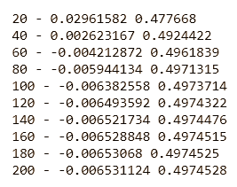

关闭会话很重要，因为只有关闭会话，资源才会被释放。


# 它是如何工作的...

TensorFlow 程序生成一个计算图，图中的节点称为 *ops* 。这些操作以张量作为输入，执行计算并产生张量(张量是 n 维数组或列表)。TensorFlow 程序分为两个阶段:构建阶段和执行阶段。在构建阶段，我们组装图，而在执行阶段，我们在会话的上下文中执行图。在 R 中调用`tensorflow`包创建了一个 TensorFlow API 的入口点(`tf`对象),通过它我们可以访问主 TensorFlow 模块。`tf$Variable()`功能创建一个保存和更新可训练参数的变量。张量流变量是包含张量的内存缓冲区。

在*步骤 1* 中，我们创建了一些虚拟数据。在下一步中，我们用初始值为权重和偏差创建了两个`tf`变量。在*步骤 3* 中，我们定义了模型。在*步骤 4* 中，我们根据以下等式定义了损失函数:

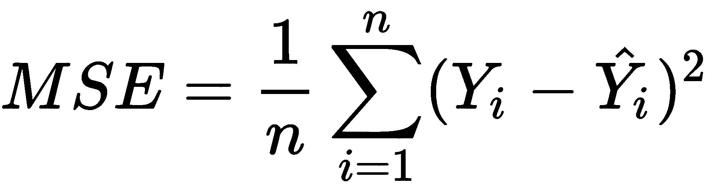

`reduce_mean()`函数计算张量维度上元素的平均值。在我们的代码中，它计算训练集的平均损失。在这一步中，我们还定义了训练网络所需的优化算法。这里，我们使用学习率为 0.5 的梯度下降优化器。然后，我们定义了每个训练步骤的目标；也就是说，我们尽量减少损失。

在*步骤 5* 中，我们组装了计算图，并向 TensorFlow 提供了我们想要执行的计算的描述。在我们的实现中，我们希望 TensorFlow 将损失降至最低；也就是说，使用梯度下降算法最小化均方误差。TensorFlow 在创建会话和调用`run()`函数之前不会运行任何计算。我们启动了会话并添加了一个 ops(节点)以便运行一些`tf`变量初始化器。`sessrun(tfrun(tfglobal_variables_initializer())`同时初始化所有变量。我们应该在完全构建好图表并在会话中启动它之后才运行此 ops。最后，在最后一步中，我们循环执行训练步骤，并在每次迭代中打印出`tf`变量(权重和偏差)。

建议您使用较高级别的 API(Keras 或 Estimator)之一，而不是较低级别的核心 TensorFlow API。


# 实现单层神经网络

人工神经网络是计算实体的网络，可以执行各种任务，如回归、分类、聚类和特征提取。它们受到人类大脑中生物神经网络的启发。神经网络的最基本单元被称为神经元/感知器。神经元是一个简单的计算单元，它接受一组输入，并对这些输入应用一个函数以产生输出。

下图显示了一个简单的神经元:


1957 年，Frank Rosenblatt 提出了一个经典的感知器模型，其中他将权重与每个输入相关联。他还提出了实现这些重量的方法。感知器模型是具有阈值的简单计算单元，其可以由以下等式定义:

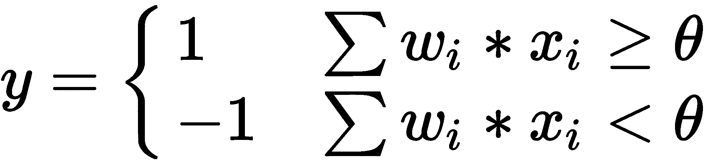

下图表示一个感知器:

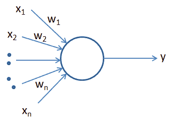

感知器只能处理线性可分的情况。我们今天使用的神经网络利用激活函数，而不是感知器中使用的苛刻阈值。与感知器不同，具有非线性激活函数的神经网络可以学习输入和输出之间复杂的非线性函数映射，使它们有利于更复杂的应用，如图像识别、语言翻译、语音识别等。最常用的激活函数是 sigmoid、tanh、relu 和 softmax。

我们可以使用神经网络实现各种机器学习算法，如简单线性回归、逻辑回归等。例如，我们可以将逻辑回归视为单层神经网络。逻辑回归神经网络使用 sigmoid ( )激活函数。下图显示了逻辑回归神经网络:

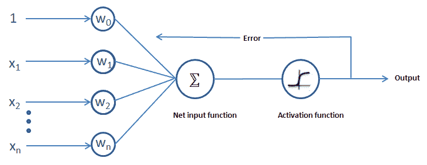

网络的输出如下所示:


*其中 z 等于 []* 

当使用神经网络实现多项式逻辑回归问题时，我们在输出层放置一个 softmax 激活函数。下面的等式显示了多项式逻辑回归神经网络的输出:

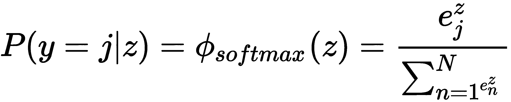

*其中 z 是第 j ^个类*的输入的加权和

在神经网络中，网络误差是通过将模型输出与期望输出进行比较来计算的。这个误差项用于指导神经网络的训练。在每次训练迭代之后，误差在网络中被反向传送，并且网络的权重被更新，以便最小化误差。这个过程被称为**反向传播**。在这个菜谱中，我们将使用 r 中的`keras`库构建一个多类分类神经网络。


# 做好准备

我们将在这个菜谱中使用`iris`数据集。这是一个由 50 个样本组成的多元数据集，这些样本属于鸢尾花的三个品种——setosa、virginica 和 versicolor。每个样本包含四个特征测量值；即以厘米为单位的萼片和花瓣的长度和宽度。我们将使用`keras`包，以便利用深度学习功能进行分类，并使用`datasets`库导入`iris`数据集:

```
library(keras)
library(datasets)
```

在下一节中，我们将更详细地研究这些数据。


# 怎么做...

在数据集中进行任何转换之前，我们将分析数据的属性，例如数据的维度、变量和摘要:

1.  让我们从从`datasets`库中加载`iris`数据集开始:

```
data <- datasets::iris
```

现在，我们可以查看数据的维度:

```
dim(data)
```

在这里，我们可以看到数据中有 150 行和 5 列:

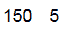

让我们显示数据的前五条记录:

```
head(data)
```

让我们看一下数据:

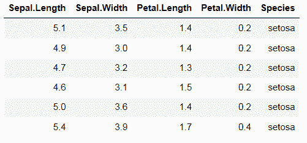

现在，让我们看看数据集中变量的数据类型:

```
str(data)
```

在这里，我们可以看到除了**物种**之外的所有列都是数字。物种是该分类练习的响应变量:

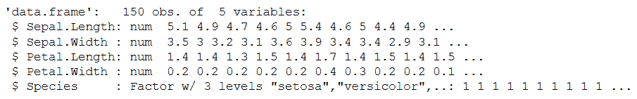

让我们也来看看数据的汇总，看看变量的分布情况:

```
summary(data)
```

我们得到以下输出:

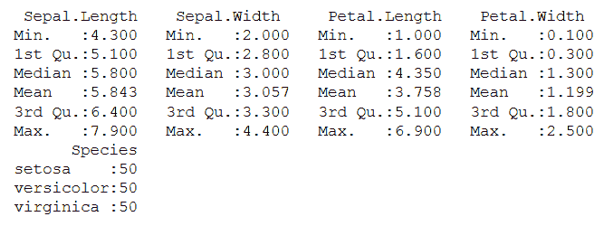

2.  现在，我们可以进行数据转换了。为了使用`keras`包，我们需要将数据转换成数组或矩阵。矩阵数据元素应该是相同的基本类型，但是这里我们有 factor 类型的目标值，所以我们需要更改它:

```
# Converting the data into a matrix for keras to consume
data[,5] <- as.numeric(data[,5]) -1
data <- as.matrix(data)

# Setting dimnames of data to NULL
dimnames(data) <- NULLhead(data)
```

3.  现在，我们需要将数据分成训练和测试数据集。种子号是生成随机数序列时使用的起点。在函数中使用相同的数字可以确保每次运行代码时都可以再现相同的数据:

```
set.seed(76)

# Training and testing data sample size
indexes <- sample(2,nrow(data),replace = TRUE,prob = c(0.70,0.30))
```

我们以 70:30 的比例分别为训练数据集和测试数据集划分数据:

```
# Splitting the predictor variables into training and testing
data.train <- data[indexes==1, 1:4]
data.test <- data[indexes==2, 1:4]

# Splitting the label attribute(response variable)into training and testing
data.trainingtarget <- data[indexes==1, 5]
data.testtarget <- data[indexes==2, 5]
```

4.  接下来，我们对训练和测试数据的目标列进行一次性编码。`to_categorical()`函数将类别向量转换成二进制类别矩阵:

```
data.trainLabels <- to_categorical(data.trainingtarget)
data.testLabels <- to_categorical(data.testtarget)
```

5.  现在，让我们构建模型并编译它。首先，我们需要初始化一个 Keras 顺序模型对象:

```
# Initialize a sequential model
model <- keras_model_sequential()
```

接下来，我们堆叠一个致密层。由于这是一个单层网络，我们堆叠一层:

```
model %>%
    layer_dense(units = 3, activation = 'softmax',input_shape = ncol(data.train))
```

该层是一个三节点 softmax 层，它返回一个由三个概率分数组成的数组，这些分数的总和为 1。现在，让我们来看看这个模型的概要:

```
summary(model)
```

上述代码的输出如下:

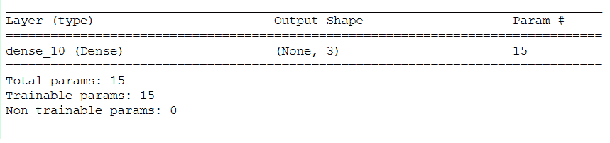

编译模型为训练做准备。在编译模型时，我们指定损失函数以及优化器名称和度量，以便在训练和测试期间评估模型:

```
# Compile the model
model %>% compile(
loss = 'categorical_crossentropy',
optimizer = 'adam',
metrics = 'accuracy'
)
```

6.  现在，我们训练这个模型:

```
# Fit the model
model %>% fit(data.train,
data.trainLabels,
epochs = 200,
batch_size = 5,
validation_split = 0.2
)
```

7.  让我们来看一下训练模型的指标:

```
history <- model %>% fit(data.train,
data.trainLabels,
epochs = 200,
batch_size = 5,
validation_split = 0.2
)

# Plotting the model metrics - loss and accuracy
plot(history)
```

在下图中， **loss** 和 **acc** 表示训练和验证数据的模型的损失和准确性:

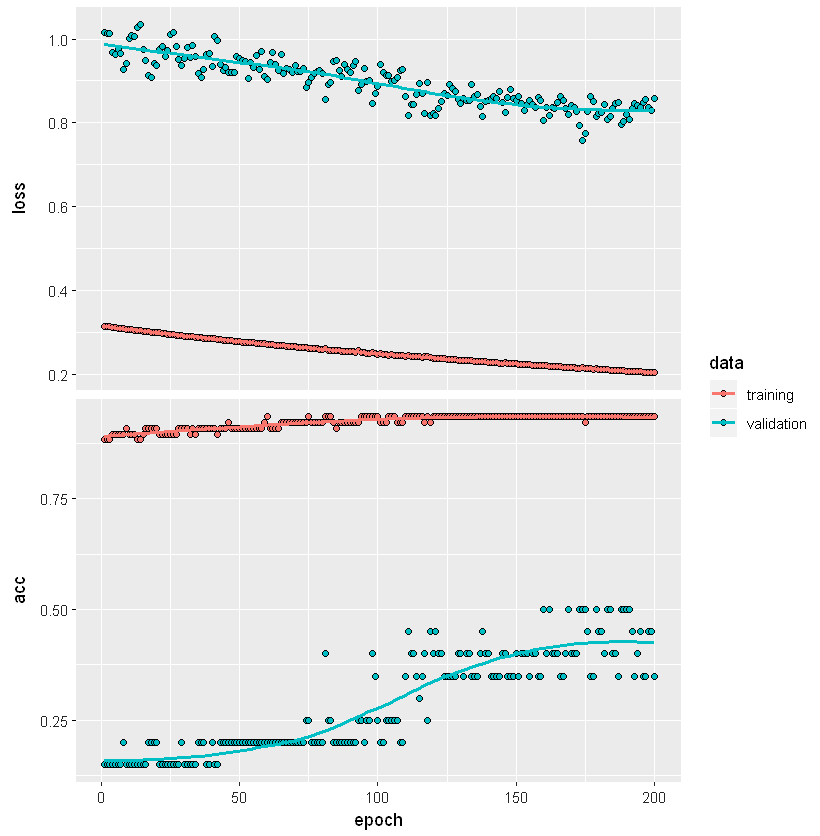

8.  现在，我们为测试数据生成预测。这里，我们使用`predict_classes()`函数来预测测试数据的类别。我们使用的批量为`128`:

```
classes <- model %>% predict_classes(data.test, batch_size = 128)
```

以下代码为我们提供了混淆矩阵，让我们看到正确和不正确的预测:

```
table(data.testtarget, classes)
```

下表显示了测试数据的混淆矩阵:

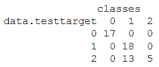

最后，让我们根据测试数据评估模型的性能:

```
score <- model %>% evaluate(data.test, data.testLabels, batch_size = 128)
```

现在，我们打印模型分数:

```
print(score)
```

下面的屏幕截图显示了模型在测试数据上的损失和准确性:

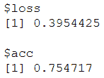

我们可以看到，我们的模型的准确率约为 75%。


# 它是如何工作的...

在*步骤* 1 中，我们从 r 中的`datasets`库中加载了`iris`数据。在我们开始构建模型之前，始终建议了解数据及其特征。因此，我们研究了数据中变量的结构和类型。我们看到，除了物种(我们的反应(目标)变量)，所有其他变量都是数字。然后，我们检查了数据集的维度。

`summary()`函数向我们展示了变量的分布以及数据中每个变量的集中趋势度量。默认情况下，`head()`函数只显示数据集的前五行。

您可以使用`head()`来显示任意数量的记录。为此，您需要在 head 函数中将记录数作为参数进行传递。如果您想查看数据末尾的记录，请使用`tail()`功能。

在*步骤* 2 中，我们完成了所需的数据转换。为了使用`keras`包，我们需要将数据转换成数组或矩阵。在我们的示例中，我们将目标列从`factor`数据类型更改为`numeric`，并将数据转换为矩阵格式。从数据集的总结来看，很明显我们不需要对这些数据进行标准化。

如果我们需要处理一些没有被归一化的数据，我们可以使用`keras`中的`normalize()`函数。

接下来，在*步骤* 3 中，我们以 70:30 的比例将数据分成训练集和测试集。请注意，在将数据分为训练和测试之前，我们设置了种子，并将一个随机整数作为参数传递给它。当我们在函数中提供相同的数字(种子)时，`seed()`函数有助于生成相同的随机数序列。

在使用神经网络构建多类分类模型时，建议将目标属性从包含每个类值的向量转换为包含每个类的布尔值的矩阵，以指示该类值在实例中是否存在。为了实现这一点，在*步骤* 4 中，我们使用了`keras`库中的`to_categorical()`函数。

在*步骤* 5 中，我们建立了模型。首先，我们使用`keras_model_sequential()`函数初始化一个序列模型。然后，我们给模型添加了层。模型需要知道它应该期望什么样的输入形状，所以我们在顺序模型的第一层中指定了输入形状。单元的数量是三个，因为在我们的多类分类问题中输出类的数量是三个。注意这一层的激活函数是`softmax`。当我们需要预测范围在 0 和 1 之间的概率值作为输出时，使用这个激活函数。然后，我们使用`summary()`函数来得到我们模型的概要。还有几个函数可以帮助我们研究模型，比如`get_config()`和`get_layer()`。

一旦我们建立了模型的架构，我们就编译它。为了编译模型，我们需要提供一些设置:

*   **损失函数**:测量训练时模型的精度。我们需要最小化这个函数来达到收敛。
*   **优化器**:这个度量帮助基于它看到的数据和它的损失函数更新模型。
*   **指标**:这些用于评估培训和测试步骤。

其他流行的优化算法包括 SGD、ADAM 和 RMSprop。选择一个损失函数取决于你正在处理的问题陈述。对于一个分类问题，我们一般使用交叉熵，而对于二分类问题，我们使用`binary_crossentropy()`损失函数。

在*步骤 6* 中，我们使用`fit()`方法训练模型。一个时期指的是通过整个训练集的一次通过。批量大小定义了通过网络的样本数量。

在*步骤* 7 中，我们使用`plot()`函数绘制了模型的指标，并分析了训练和验证数据的准确性和损失。

在最后一步中，我们为测试数据集生成了预测，并评估了模型的性能。注意，由于这是一个分类模型，我们使用了`predict_classes()`函数来预测结果。在回归练习的情况下，我们使用`predict()`函数。我们使用了`evaluate()`函数来检查我们的模型在测试数据上的准确性。通过这样做，我们看到我们的模型的准确性大约是 75.4%。


# 还有更多...

激活函数用于学习人工神经网络中输入和响应变量之间的非线性和复杂函数映射。要记住的一件事是，激活函数应该是可微分的，以便可以在网络中执行反向传播优化，同时计算相对于权重的误差(损失)梯度，以便优化权重并减少误差。让我们来看看一些流行的激活函数及其属性:

*   **乙状结肠:**
    *   sigmoid 函数的范围在 0 和 1 之间。
    *   它通常用于二进制分类问题的输出层。
    *   它优于线性激活，因为激活函数的输出与(-inf，inf)相比在(0，1)的范围内，所以激活的输出是绑定的。它将大的负数缩小到 0，将大的正数缩小到 1。
    *   它的输出不是以零为中心的，这使得梯度更新在不同的方向上走得太远，使得优化更加困难。
    *   它有一个消失梯度的问题。
    *   也有收敛慢的问题。

sigmoid 函数定义如下:


这是 sigmoid 函数的图表:


*   **正切双曲线** ( **tanh** ):
    *   tanh 函数将值调整到-1 和 1 之间。
    *   tanh 的梯度比 sigmoid 的梯度更陡。
    *   与 sigmoid 不同，它以零为中心，这使得优化更容易。
    *   它通常用于隐藏层。
    *   它有一个消失梯度的问题。

双曲正切函数定义如下:

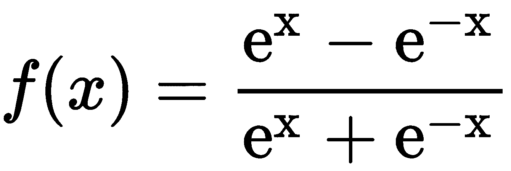

下图是双曲正切函数的图形:

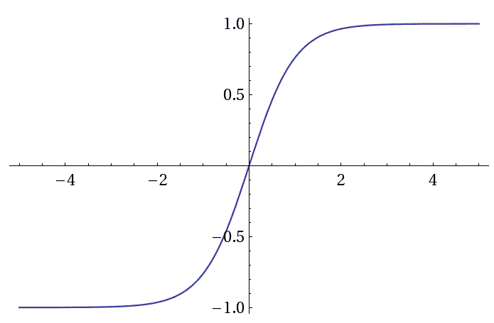

*   **整流线性单元** ( **ReLU** ):
    *   这是一个非线性函数
    *   它的范围从 0 到无穷大
    *   它没有渐变消失的问题
    *   它的收敛速度比 sigmoid 和 tanh 更快
    *   它有一个致命的问题
    *   它用于隐藏层

ReLU 函数定义如下:

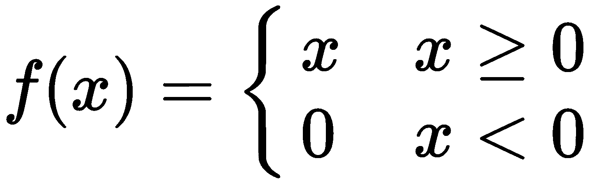

下面是 ReLU 函数的图表:


现在，让我们看看 ReLU 的**变体:**

*   **泄漏的 ReLU:**
    *   它没有一个垂死的 ReLU 问题，因为它没有零斜率部分
    *   泄漏的 ReLU 比 ReLU 学得快

数学上，泄漏 ReLU 函数可以定义如下:

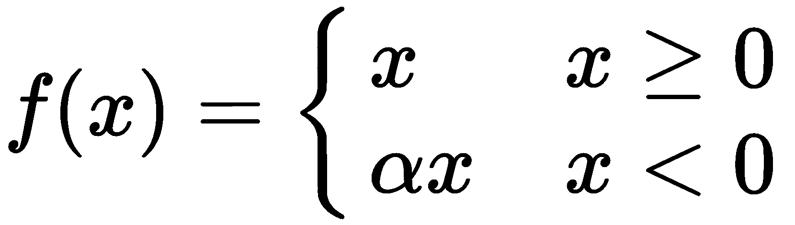

下面是泄漏 ReLU 函数的图示:

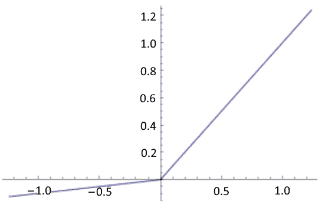

*   **指数线性单位** ( **ELU** ):
    *   它没有垂死的 ReLU 问题
    *   它对大的负值饱和

数学上，ELU 函数可以定义如下:

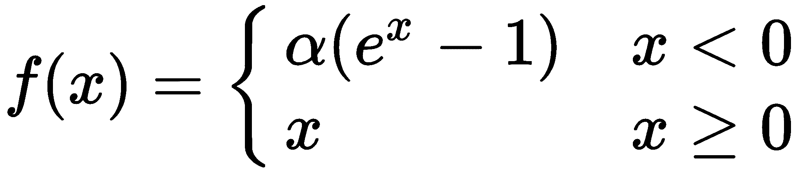

以下是 ELU 函数的图示:

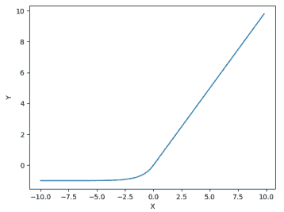

*   **参数整流线性单元** ( **预回路**):
    *   PReLU 是一种泄漏 ReLU，其中 alpha 值由网络本身决定。

PReLu 函数的数学定义如下:


*   **阈值整流线性单元:**

PReLu 函数的数学定义如下:

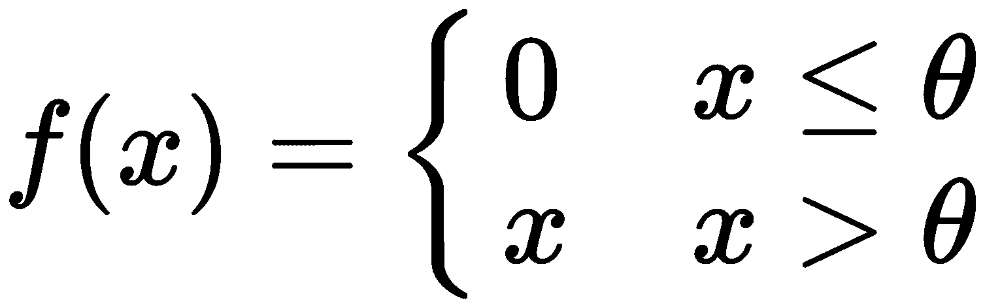

*   **Softmax:**
    *   它是非线性的。
    *   它通常用于多类分类问题的输出层。
    *   它计算事件在“n”个不同事件(类别)上的概率分布。它为所有类输出 0 到 1 之间的值，所有概率的总和为 1。

softmax 函数的数学定义如下:

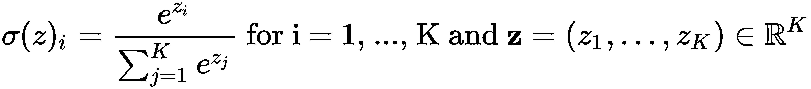

这里， *K* 是可能结果的个数。


# 请参见

*   你可以在这里阅读更多关于梯度下降优化算法和一些变种:[https://arxiv.org/pdf/1609.04747.pdf](https://arxiv.org/pdf/1609.04747.pdf)。
*   你可以在这里找到一篇关于消失渐变和选择合适的激活功能的好文章:[https://blog . paper space . com/vanishing-gradients-activation-function/](https://www.google.com/url?q=https://blog.paperspace.com/vanishing-gradients-activation-function/&sa=D&source=hangouts&ust=1555493743383000&usg=AFQjCNGAhOAwpAMFo4iIlKXF1S0HaJXBTA)。


# 训练你的第一个深度神经网络

在前面的配方中，*实现单层神经网络，*我们为分类任务实现了一个简单的基线神经网络。继续该模型架构，我们将创建一个深度神经网络。深度神经网络由几个隐藏层组成，这些隐藏层在几何上可以解释为附加的超平面。这些网络学习以复杂的方式对数据建模，并学习输入和输出之间的复杂映射。

下图是具有两个隐藏层的深度神经网络的示例:

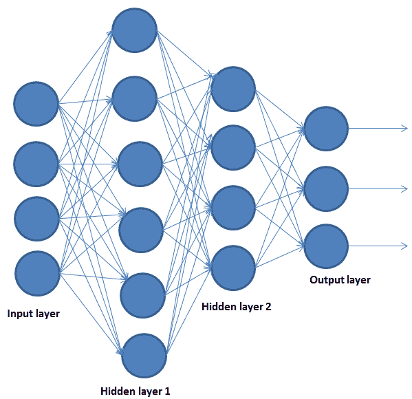

在这个菜谱中，我们将学习如何为多类分类问题实现深度神经网络。


# 做好准备

在这个食谱中，我们将使用 MNIST 数字数据集。这是一个手写数字的数据库，由 60，000 个 28x28 的 10 位数字的灰度图像组成，以及一个由 10，000 个图像组成的测试集。我们将建立一个模型，从这个数据集中识别手写数字。

首先，让我们加载`keras`库:

```
library(keras)
```

现在，我们可以做一些数据预处理和模型建立。


# 怎么做...

MNIST 数据集包含在`keras`中，可以使用`dataset_mnist()`函数访问:

1.  让我们将数据加载到 R 环境中:

```
mnist <- dataset_mnist()
x_train <- mnist$train$x
y_train <- mnist$train$y
x_test <- mnist$test$x
y_test <- mnist$test$y
```

2.  我们的训练数据是(图像，宽度，高度)的形式。因此，我们将数据转换为一维数组，并对其进行重新缩放:

```
# Reshaping the data
x_train <- array_reshape(x_train , c(nrow(x_train),784))
x_test <- array_reshape(x_test , c(nrow(x_test),784))

# Rescaling the data
x_train <- x_train/255
x_test <- x_test/255
```

3.  我们的目标数据是一个整数向量，包含从 0 到 9 的值。我们需要对目标变量进行一次性编码，以便将其转换成二进制矩阵格式。我们使用来自`keras`的`to_categorical()`函数来做这件事:

```
y_train <- to_categorical(y_train,10)
y_test <- to_categorical(y_test,10)
```

4.  现在，我们可以建立模型了。我们使用来自`keras`的顺序 API 来配置这个模型。注意，在第一层的配置中，`input_shape`参数是输入数据的形状；也就是说，它是一个长度为 784 的数值向量，代表一个灰度图像。最后一层使用 softmax 激活函数输出长度为 10 的数字向量(从 0 到 9 的每个数字的概率):

```
model <- keras_model_sequential()
model %>%
  layer_dense(units = 256, activation = 'relu', input_shape = c(784)) %>%
  layer_dropout(rate = 0.4) %>%
  layer_dense(units = 128, activation = 'relu') %>%
  layer_dropout(rate = 0.3) %>%
  layer_dense(units = 10, activation = 'softmax')
```

让我们来看看模型的细节:

```
summary(model)
```

这是模型的总结:

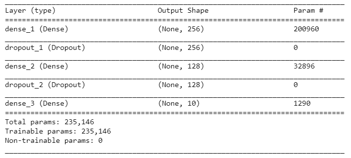

5.  接下来，我们通过提供一些适当的参数来编译我们的模型，比如损失函数、优化器和指标。这里，我们使用了`rmsprop`优化器。该优化器类似于梯度下降优化器，只是它可以提高我们的学习速率，以便我们的算法可以在水平方向上采取更大的步骤，从而更快地收敛:

```
model %>% compile(
loss = 'categorical_crossentropy',
optimizer = optimizer_rmsprop(),
metrics = c('accuracy')
)
```

6.  现在，让我们将训练数据与配置的模型相匹配。这里，我们将时期数设置为`30`，将批量大小设置为`128`，将验证百分比设置为`20`:

```
history <- model %>% fit(
    x_train, y_train,
    epochs = 30, batch_size = 128,
    validation_split = 0.2
)
```

7.  接下来，我们可视化模型度量。我们可以根据历史变量绘制模型的准确性和损失度量。让我们画出模型的精确度:

```
# Plot the accuracy of the training data
plot(history$metrics$acc, main="Model Accuracy", xlab = "epoch", ylab="accuracy", col="blue",
type="l")

# Plot the accuracy of the validation data
lines(history$metrics$val_acc, col="green")

# Add Legend
legend("bottomright", c("train","validation"), col=c("blue", "green"), lty=c(1,1))
```

下图显示了模型在训练和测试数据集上的准确性:

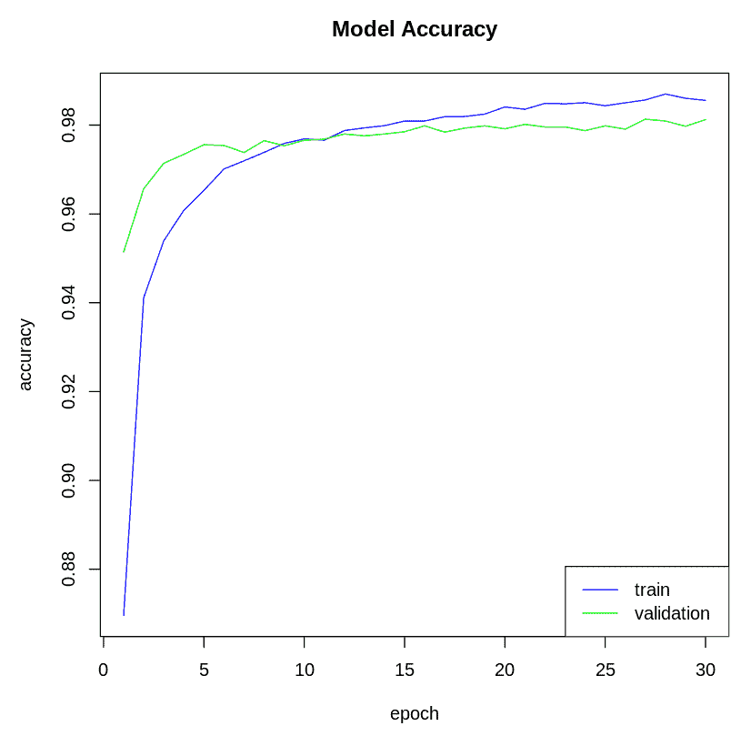

现在，让我们绘制模型的损失:

```
# Plot the model loss of the training data
plot(history$metrics$loss, main="Model Loss", xlab = "epoch", ylab="loss", col="blue", type="l")

# Plot the model loss of the validation data
lines(history$metrics$val_loss, col="green")

# Add legend
legend("topright", c("train","validation"), col=c("blue", "green"), lty=c(1,1))
```

下图显示了模型在训练和测试数据集上的损失:

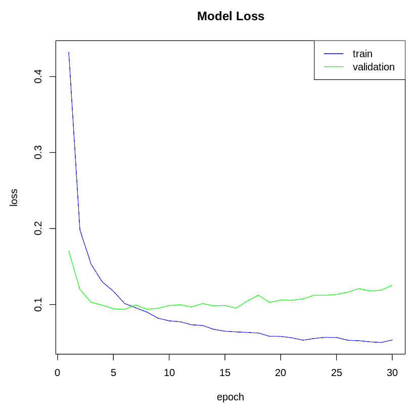

8.  现在，我们使用训练好的模型来预测测试数据实例的类:

```
model %>% predict_classes(x_test)
```

9.  让我们根据测试数据检查模型的准确性:

```
model %>% evaluate(x_test, y_test)
```

下图显示了测试数据的模型指标:

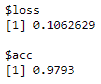

在这里，我们得到了大约 97.9 %的准确率。


# 它是如何工作的...

在*步骤* 1 中，我们加载了 MNIST 数据集。x 数据是形式为(图像、宽度、高度)的灰度值的 3D 数组。在第二步中，我们将这些 28x28 的图像展平成一个长度为 784 的矢量。然后，我们将灰度值归一化到 0 和 1 之间。在*步骤 3* 中，我们使用来自`keras`的`to_categorical()`函数对目标变量进行一次性编码，将其转换为二进制格式的矩阵。

在*步骤* 4 中，我们通过堆叠密集层和漏失层构建了一个序列模型。在密集层中，每个神经元接收来自前一层所有神经元的输入，这就是为什么它被称为密集连接。在我们的模型中，每一层都接收前一层的输入，并对前一层的输出应用激活。我们在隐藏层使用了`relu`激活函数，在最后一层使用了 softmax 激活函数，因为我们有 10 种可能的结果。 **Dropout** 层用于正则化深度学习模型。Dropout 是指在特定的向前或向后传递过程中，为了防止过度拟合，在训练阶段不考虑某些神经元的过程。`summary()`函数为我们提供了模型的概要；它为我们提供了关于每一层的信息，例如输出的形状和每一层中的参数。

在*步骤* 5 中，我们使用`keras`中的`compile()`函数编译了模型。我们应用了`rmsprop()`优化器来寻找最小化我们的目标损失函数`categorical_crossentropy`的权重和偏差。`metrics`参数计算模型在训练期间要评估的指标。

在*步骤* 6 中，我们为我们的模型训练了固定次数的迭代，这是由`epochs`参数定义的。`validation_split`参数可以接受 0 到 1 之间的浮点值，并指定用作验证数据的数据部分。最后，`batch_size`定义了将通过网络传播的样本数量。历史对象记录每个时期的训练度量，并包含两个列表，`params`和`metrics`。params 包含模型的参数，如批量大小、步骤等，而`metrics`包含模型指标，如损耗和准确度。

在*步骤* 7 中，我们可视化了模型的准确性和损失指标。在*步骤* 8 中，我们使用我们的模型通过`predict_classes()`函数为测试数据生成预测。最后，我们使用`evaluate()`函数评估了模型对测试数据的准确性。


# 还有更多...

**调整**是在不过度拟合或欠拟合的情况下最大化模型性能的过程。这可以通过为模型参数设置适当的值来实现。深度神经网络有多个可以调整的参数；层、隐藏单元优化参数，例如优化器、学习速率和时期数。

为了调整 Keras 模型参数，我们需要为我们想要优化的参数定义`flags`。这些由`keras`包的`flags()`函数定义，它返回一个`tfruns_flags`类型的对象。这包含关于要调整的参数的信息。在下面的代码块中，我们声明了四个标志，它们将调整模型第一层和第二层的辍学率和神经元数量。`flag_integer("dense_units1",8)`调整第 1 层的单元数量，`dense_units1`是标志的名称，`8`是默认的神经元数量:

```
# Defining flags
FLAGS <- flags(
 flag_integer("dense_units1",8),
 flag_numeric("dropout1",0.4),
 flag_integer("dense_units2",8),
 flag_numeric("dropout2", 0.3)
)
```

一旦我们定义了标志，我们就在模型的定义中使用它们。在下面的代码块中，我们使用想要优化的参数定义了模型:

```
# Defining model
model <- keras_model_sequential()
model %>%
 layer_dense(units = FLAGS$dense_units1, activation = 'relu', input_shape = c(784)) %>%
 layer_dropout(rate = FLAGS$dropout1) %>%
 layer_dense(units = FLAGS$dense_units2, activation = 'relu') %>%
 layer_dropout(rate = FLAGS$dropout2) %>%
 layer_dense(units = 10, activation = 'softmax')
```

前面两个代码块是来自`hyperparamexcter_tuning_model.R`脚本的代码片段，可以在本书的 GitHub 资源库中找到。在脚本中，我们实现了一个对 MNIST 数字进行分类的模型。执行此脚本不会优化您的超参数；它只是定义参数化的训练运行来创建最佳模型。

下面的代码块显示了我们如何微调`hyperparameter_tuning_model.R`中定义的模型。这里，我们使用了`tfruns`包中的`tuning_run()`函数。`tfruns`包提供了一套工具，用于跟踪、可视化和管理来自 r 的 TensorFlow 训练运行和实验。函数的`file`参数应该是训练脚本的路径，并且应该包含标志和模型定义。`flags`参数接受一个键-值对列表，其中的键名必须与我们在模型中定义的不同标志的名称相匹配。`tuning_run()`函数为指定标志的每个组合执行训练运行。默认情况下，所有运行都进入当前工作目录的`runs`子目录。它返回一个 dataframe，其中包含所有运行的摘要信息，如评估、验证和性能损失(`categorical_crossentropy`)以及指标(`accuracy`):

```
library(tfruns)

# training runs 
runs <- tuning_run(file = "hypereparameter_tuning_model.R", flags = list(
 dense_units1 = c(8,16),
 dropout1 = c(0.2, 0.3, 0.4),
 dense_units2 = c(8,16),
 dropout2 = c(0.2, 0.3, 0.4)
))
runs
```

以下是超参数调整期间每次运行的结果:

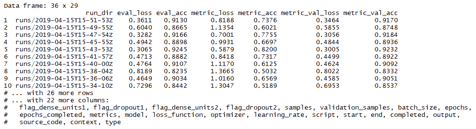

对于每次训练运行，我们都会获得训练和验证数据的模型度量。


# 请参见

*   深度神经网络中的操作矢量化:[http://ufldl . Stanford . edu/wiki/index . PHP/Neural _ Network _ Vectorization](https://www.google.com/url?q=http://ufldl.stanford.edu/wiki/index.php/Neural_Network_Vectorization&sa=D&source=hangouts&ust=1555493743383000&usg=AFQjCNEqQBGvbFLg3-nA7b0-6Ft-DJLE9g)和[https://peterroelants . github . io/posts/Neural-Network-implementation-part 04/](https://www.google.com/url?q=https://peterroelants.github.io/posts/neural-network-implementation-part04/&sa=D&source=hangouts&ust=1555493743383000&usg=AFQjCNHNRFEtN5_WBeAqXo0wmmek_NQkPQ)