# 二、使用卷积神经网络

**卷积神经网络**(**CNN**)是计算机视觉问题中最流行、应用最广泛的深度神经网络。它们用于各种应用，包括图像分类、人脸识别、文档分析、医学图像分析、动作识别和自然语言处理。在本章中，我们将重点学习卷积运算，以及填充和步长等概念，以优化 CNN。这一章背后的想法是让你精通 CNN 的功能，并学习数据扩充和批量标准化等技术，以微调你的网络，防止过度拟合。我们还将简要讨论如何利用迁移学习来提高模型性能。

在本章中，我们将介绍以下配方:

*   卷积运算简介
*   了解步幅和衬垫
*   熟悉池层
*   实现迁移学习


# 卷积运算简介

CNN 的通用架构由卷积层和全连接层组成。像其他神经网络一样，CNN 也包含输入层、隐藏层和输出层，但它的工作方式是将数据重组为由图像以及图像的宽度和高度组成的张量。在 CNN 中，一层中的每个体积仅连接到下一层中的空间相关区域，以确保当层数增加时，每个神经元对其特定位置具有局部影响。CNN 也可以包含池层以及几个完全连接的层。

下面是一个简单的 CNN 与卷积和池层的例子。在这个食谱中，我们将使用卷积层。我们将在本章的*熟悉池层*方法中介绍池层的概念:

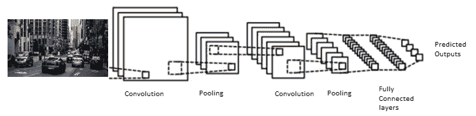

卷积运算是输入矩阵和所用滤波器之间的逐元素乘法和求和。以下是卷积运算的一个示例:

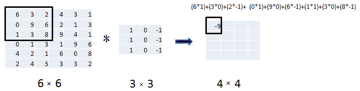

现在我们了解了卷积层的工作原理。让我们继续构建一个卷积神经网络来对服装和配饰进行分类。


# 做好准备

让我们从导入`keras`库开始:

```
library(keras)
```

在这个食谱中，我们将使用时尚 MNIST 数据集，它可以直接从 keras 导入。


# 怎么做...

时尚-MNIST 数据集包含 10 种不同类型的服装和配饰的图像。它由训练集中的 60，000 个示例和测试数据集中的 10，000 个示例组成。每个示例都是 28 × 28 灰度图像，与 10 个类别的标签相关联。

1.  我们在我们的环境中导入时尚-MNIST 数据集:

```
fashion <- dataset_fashion_mnist()
x_train <- fashion$train$x
y_train <- fashion$train$y
x_test <- fashion$test$x
y_test <- fashion$test$y
```

我们可以使用命令检查训练和测试数据集的维度:

```
dim(x_train)
dim(x_test)
```

现在让我们来看看一个示例图像的数据:

```
 x_test[1,,]
```

在下面的截图中，我们可以看到样本图像数据是以矩阵的形式:


我们使用以下代码检查前面截图的标签:

```
paste("label of first image is:  " ,y_train[1])
```

在下面的截图中，我们可以看到样本图像属于类别 9:

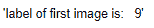

现在，我们为数据中的不同类别定义标签名称:

```
label_names = c('T-shirt/top', 'Trouser', 'Pullover', 'Dress', 'Coat',  'Sandal',
 'Shirt', 'Sneaker', 'Bag', 'Ankle boot')
```

如果您正在使用 Jupyter 笔记本，您可以使用以下代码使用`repr`库来设置绘图窗口大小:`options(repr.plot.width=5, repr.plot.height=3)`

让我们来看一些来自不同类别的示例图像:

```
# Visualize images

par(mfcol=c(3,3))
par(mar=c(2,2,2,2),xaxs = "i",yaxs = "i")
for (idx in 1:9) { 
 img <- x_train[idx,,]
 img <- t(apply(img, 2, rev)) 
 image(1:28,1:28,img, main=paste(label_names[y_train[idx]+1]),xaxt = 'n',yaxt = 'n',col= gray((0:255)/255))
}
```

在下面的屏幕截图中，我们可以看到示例图像及其标签名称:

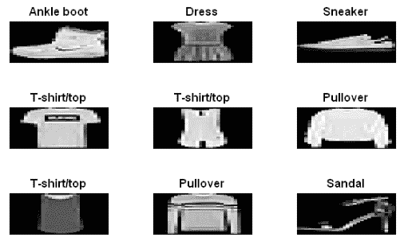

2.  接下来，我们对数据进行整形、规范化，并将目标标签转换为二进制类矩阵:

```
# Resize the shape of inputs
x_train <- array_reshape(x_train, c(nrow(x_train), 28, 28, 1))
x_test <- array_reshape(x_test, c(nrow(x_test), 28, 28, 1))

# Transform RGB values into [0,1] range
x_train <- x_train / 255
x_test <- x_test / 255

# Convert class vectors to binary class matrices
y_train <- to_categorical(y_train, 10)
y_test <- to_categorical(y_test, 10)
```

3.  一旦我们完成了数据准备，我们就构建、编译和训练我们的 CNN 模型:

```
# Define model
cnn_model <- keras_model_sequential() %>%
 layer_conv_2d(filters = 8, kernel_size = c(4,4), activation = 'relu',
 input_shape = c(28,28,1)) %>% 
 layer_conv_2d(filters = 16, kernel_size = c(3,3), activation = 'relu') %>% 
 layer_flatten() %>% 
 layer_dense(units = 16, activation = 'relu') %>% 
 layer_dense(units = 10, activation = 'softmax')
```

我们来看一下模型的总结:

```
cnn_model %>% summary()
```

下面的屏幕截图显示了该模型的详细信息:

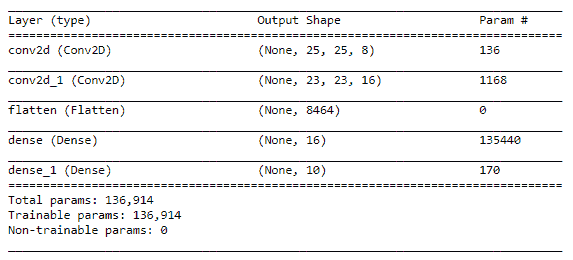

在编译模型之前，让我们定义它的损失函数:

```
loss_entropy <- function(y_pred, y_true) {
 loss_categorical_crossentropy(y_pred, y_true)
 }
```

现在我们编译这个模型:

```
# Compile model
cnn_model %>% compile(
 loss = loss_entropy,
 optimizer = optimizer_sgd(),
 metrics = c('accuracy')
)
```

在编译模型之后，我们使用 128 的批量大小、设置为 5 的时期数以及 20%的验证分割对其进行训练:

```
# train the model
cnn_model %>% fit(
 x_train, y_train,
 batch_size = 128,
 epochs = 5,
 validation_split = 0.2
)
```

4.  最后，我们评估已训练模型的性能，并打印评估指标:

```
scores <- cnn_model %>% evaluate(x_test,
 y_test,
 verbose = 0
 )
# Output metrics
paste('Test loss:', scores[[1]])
paste('Test accuracy:', scores[[2]])
```

在下面的截图中，我们可以看到模型对测试数据的评估指标:

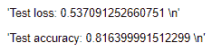

一旦我们对模型的准确性感到满意，我们就可以使用它来预测测试数据集的类:

```
#prediction
predicted_label <- cnn_model %>% predict_classes(x_test)
```

在前面的截图中，我们可以看到我们的模型在测试数据上取得了 81.63%的良好准确率。


# 它是如何工作的...

R 中的`keras`库提供了各种数据集，利用这些数据集我们可以开发深度学习模型。在*步骤 1* 中，我们使用`dataset_fashion_mnist()`函数导入了时尚-MNIST 数据集，并检查了其训练和测试分区的大小。我们还查看了样本图像的数据和标签。接下来，我们为数据定义了标签名称，并为每个标签可视化了一个示例图像。

Base R 图形提供了绘制有趣图形的功能。`par()`功能用于设置各种图形参数，`image()`功能创建一个彩色或灰度矩形网格，其颜色对应于图像矩阵中的值。

在*步骤 2* 中，我们对数据进行了整形，并在 0 到 1 的范围内进行了标准化。我们还使用`to_categorical()`函数对目标标签矩阵进行了一次性编码。在我们完成数据准备之后，在*步骤 3* 中，我们配置了我们的 CNN 模型并查看了它的摘要。在模型配置中，我们增加了两个卷积层，分别有 8 个和 16 个大小为 4 × 4 和 3 × 3 的滤波器，每一层都使用了 **ReLU** 激活函数。

接下来，我们使用`layer_flatten()`将卷积层的输出矩阵转换为线性阵列，该阵列作为输入馈入我们密集神经网络的节点。我们的密集网络包含 16 个单元的隐藏层和 10 个单元的输出层，因为我们有 10 个目标标签。接下来，我们看了模型的总结；它为我们提供了关于输出形状和每层参数数量的信息。以下是卷积层的计算公式:

*   每层的输出形状:如果我们卷积层的输入是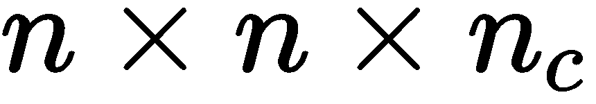并且我们应用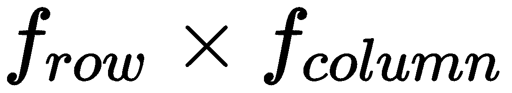的滤波器，那么输出形状由下面的公式给出:
    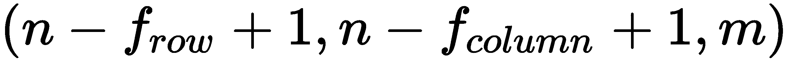
*   每层的参数个数可以通过下面的公式计算:
    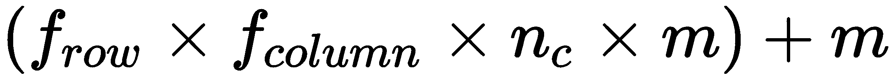

在模型配置之后，我们使用随机梯度下降优化器和分类交叉熵损失函数来编译模型。接下来，我们训练模型。最后，在*步骤 4* 中，我们评估了模型在测试数据集上的性能，并打印了评估指标，为测试数据集生成了预测。


# 还有更多...

到目前为止，我们主要使用二维卷积层。除了二维卷积，根据所用输入数据的类型，CNN 还有一维和三维实现。

一维 CNN 广泛用于文本数据分析，例如，对客户评论进行分类。与本质上大多是二维的图像不同，文本数据具有一维的输入数据。你可以参考下面这个一维卷积的例子，可以在[https://keras.rstudio.com/articles/examples/imdb_cnn.html](https://keras.rstudio.com/articles/examples/imdb_cnn.html)这里找到。


# 请参见

*   关于三维卷积层的更多细节，你可以参考 https://keras.rstudio.com/reference/layer_conv_3d.html[的 Keras 文档](https://keras.rstudio.com/reference/layer_conv_3d.html)


# 了解步幅和衬垫

在本食谱中，我们将了解 CNN 的两个关键配置超参数，即步幅和填充。跨距主要用于减小输出音量的大小。填充是另一种技术，它允许我们在输出体积中保留输入体积的尺寸，从而使我们能够有效地提取低级特征。

**步距:**步距，简单来说，就是卷积运算的步距。跨距指定滤波器围绕输入进行卷积的数量。例如，如果我们指定 stride 参数的值为`1`，这意味着过滤器将在输入矩阵上一次移动一个单位。

步幅可用于多种目的，主要如下:

*   为了避免特征重叠
*   为了实现输出体积的较小空间维度

在下图中，您可以看到一个对 7 × 7 输入数据进行卷积运算的示例，滤波器大小为 3 × 3，步长为 1:

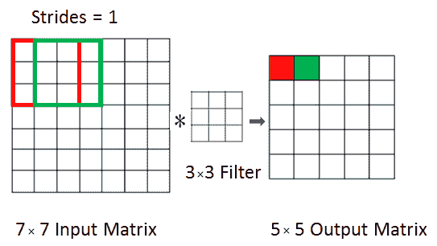

**填充:**为了获得更好的建模性能，我们需要在网络的早期层中保留关于输入音量的低级特征的信息。随着我们不断应用卷积层，输出卷的大小下降得更快。此外，与输入矩阵中间的像素相比，输入矩阵角落处的像素被遍历的次数较少，这导致丢弃了图像边缘附近的大量信息。为了避免这种情况，我们使用零填充。零填充在边界周围对称地用零填充输入体积。

有两种类型的填充:

*   **有效**:如果我们指定有效的填充，我们的卷积层不会填充输入矩阵周围的任何东西，并且输出音量的大小将随着层的增加而不断减小。

*   **Same** :在卷积之前，在输入矩阵的边缘用零填充原始输入，这样输出大小与输入大小相同。

在下面的屏幕截图中，我们可以看到零填充的图示:

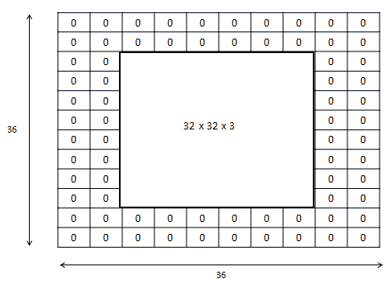

现在，我们已经了解了跨距和填充的概念，让我们进一步了解实现部分。


# 怎么做...

在这一节中，我们将使用与本章前面的简介*和*卷积运算*中使用的相同的时尚-MNIST 数据集。数据探索和转换将保持不变，因此我们直接跳到模型配置:*

1.  让我们用步幅和填充来定义我们的模型:

```
cnn_model_sp <- keras_model_sequential() %>% 
 layer_conv_2d(filters = 8, kernel_size = c(4,4), activation = 'relu',
 input_shape = c(28,28,1),
 strides = c(2L, 2L),,padding = "same") %>% 
 layer_conv_2d(filters = 16, kernel_size = c(3,3), activation = 'relu') %>% 
 layer_flatten() %>% 
 layer_dense(units = 16, activation = 'relu') %>% 
 layer_dense(units = 10, activation = 'softmax')
```

我们来看一下模型的总结:

```
cnn_model_sp %>% summary()
```

以下屏幕截图显示了所创建模型的详细信息:

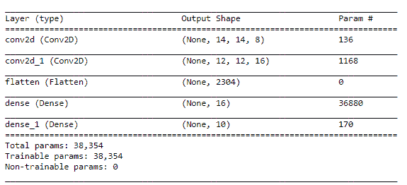

2.  在配置我们的模型之后，我们定义它的目标损失函数，然后编译和训练它:

```
# loss function
loss_entropy <- function(y_pred, y_true) {
 loss_categorical_crossentropy(y_pred, y_true)
 }

# Compile model
cnn_model_sp %>% compile(
 loss = loss_entropy,
 optimizer = optimizer_sgd(),
 metrics = c('accuracy')
)

# Train model
cnn_model_sp %>% fit(
 x_train, y_train,
 batch_size = 128,
 epochs = 5,
 validation_split = 0.2
)
```

让我们根据测试数据评估模型的性能，并打印评估指标:

```
scores <- cnn_model_sp %>% evaluate(x_test,
 y_test,
 verbose = 0
 )
```

现在我们在测试数据上打印模型损失和准确性:

```
# Output metrics
paste('Test loss:', scores[[1]], '\n')
paste('Test accuracy:', scores[[2]], '\n')
```

我们可以看到，模型对测试数据的准确率在 78%左右:

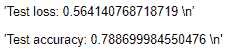

我们可以看到，模型在分类任务中做得很好。


# 它是如何工作的...

在之前的菜谱*卷积运算简介*中，我们搭建了一个简单的 CNN 模型。除了**滤波器尺寸**和**滤波器数量**之外，卷积层还有两个参数可以配置，以便更好地提取特征，它们是**步长**和**填充**。在*步骤 1* 中，我们传递了两个整数(宽度和高度)的向量，指定了卷积沿宽度和高度的步长。填充参数取两个值，**有效**和**相同**，其中**有效**表示没有填充，**相同**表示输入和输出大小保持不变。接下来，我们打印了模型的摘要。

卷积层的输出形状和可训练参数的数量可以由下面的公式给出:

*   输出形状:如果我们的卷积层的输入是，并且我们应用了和步长和填充的滤波器，则输出形状由以下公式给出:

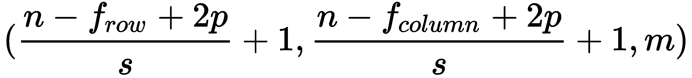

*   每层中的参数数量计算如下:

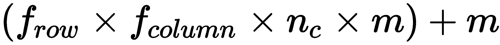

在*步骤 2* 中，我们定义了我们模型的损失函数，然后对其进行编译和训练。然后，我们在测试数据集上测试了模型的性能，并打印了模型的损失和准确性。


# 熟悉池层

CNN 使用池层来减小表示的大小，加速网络的计算，并确保稳健的特征提取。汇集层主要堆叠在卷积层的顶部，并且该层极大地缩小了输入维度，以减少网络中的计算，并且还减少过拟合。

有两种最常用的池技术:

*   **最大汇集**:这种类型的汇集通过将输入矩阵分成汇集区域，然后计算每个区域的最大值来进行缩减采样。

这里有一个例子:


*   **平均汇集**:这种类型的汇集通过将输入矩阵分成汇集区域，然后计算每个区域的平均值来进行下采样。

这里有一个例子:

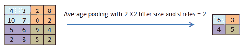

在这个菜谱中，我们将学习如何在 CNN 模型架构中安装池层。


# 做好准备

在本例中，我们将使用 Fruits 360 数据集的一个样本。该数据集归功于 Horea Muresan 和 Mihai Oltean。在他们的论文*使用深度学习从图像中识别水果*中介绍了该数据集，该论文展示了用于训练神经网络检测水果的数值实验结果。数据集可以从 https://www.kaggle.com/moltean/fruits[的 Kaggle 下载。水果 360 数据集包含大小为 100 × 100 的 103 个水果的彩色图像，但在我们的示例中，我们将只处理 23 个水果的图像。它有两个子集:一个训练集和一个测试集，每个水果的样本放在对应于水果名称的目录中。](https://www.kaggle.com/moltean/fruits)

我们将从加载`keras`库开始:

```
library(keras)
```

我们在当前工作目录中名为`fruits`的文件夹中有我们的数据集。该文件夹包含`train`和`test`子文件夹，这些子文件夹包含以特定水果命名的文件夹中的水果图像。让我们将训练和测试数据的路径存储到变量中:

```
# path to train and test directories
train_path <- "fruits/train/"
test_path <- "fruits/test/"
```

让我们创建一个数据中水果名称的向量:

```
class_label <- list.dirs(path = train_path, full.names = FALSE, recursive = TRUE)[-1]
```

现在我们打印数据的水果名称(类标签):

```
class_label
```

以下截图显示了我们数据中的水果名称:

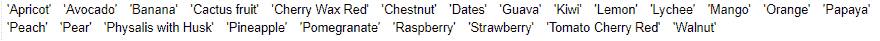

为了查看水果类的数量，可以使用下面的代码:

```
length(class_label)
```

现在让我们设置图像的宽度和高度，我们将把图像的尺寸从 100 × 100 缩小到 20 × 20:

```
img_width = 20
img_height = 20
img_size = c(img_width,img_height)
```

我们现在已经熟悉了数据集和我们想要做的转换。让我们继续实现这些转换。


# 怎么做...

我们将使用 keras 的`flow_images_from_directory()`函数动态读取和操作数据。

1.  让我们从 train 和 test 目录中读取图像，并进行所需的转换:

```
# Reading train data
train_data <- flow_images_from_directory(directory = train_path,
 target_size = img_size,
 color_mode = "rgb",
 class_mode = "categorical",
 classes = class_label,
 batch_size = 20)

# Reading  test data
test_data <- flow_images_from_directory(directory = test_path,
 target_size = img_size,
 color_mode = "rgb",
 class_mode = "categorical",
 classes = class_label,
 batch_size = 20)
```

让我们看看在训练集和测试集中有多少图像:

```
print(paste("Number of images in train and test is",train_data$n,"and ",test_data$n,"repectively"))
```

我们可以看到，训练数据集包含 11，397 幅图像，测试数据包含 3，829 幅图像:

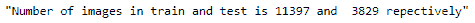

现在让我们看看训练和测试数据中每个类的图像数量:

```
table(factor(train_data$classes))
```

这是训练数据中每个类别的图像分布:

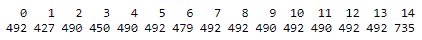

```
table(factor(test_data$classes))
```

这是测试数据中每个类别的图像分布:

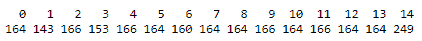

请注意，类别标签是数字的。让我们看看类标签和类标签名称的映射。这些对于训练和测试数据来说是相同的:

```
train_data$class_indices
```

屏幕截图显示了数据中的类别标签:


类似地，我们可以查看测试标签和标签名称。现在让我们打印加载到环境中的图像的形状:

```
train_data$image_shape
```

该屏幕截图显示了加载图像的尺寸:

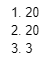

2.  接下来，我们定义带有池层的 Keras 模型:

```
cnn_model_pool <- keras_model_sequential() %>% 
 layer_conv_2d(filters = 32, kernel_size = c(3,3), activation = 'relu',
 input_shape = c(img_width,img_height,3),padding = "same") %>% 
 layer_conv_2d(filters = 16, kernel_size = c(3,3), activation = 'relu',padding = "same") %>%
 layer_max_pooling_2d(pool_size = c(2,2)) %>%
 layer_flatten() %>% 
 layer_dense(units = 50, activation = 'relu') %>% 
 layer_dense(units = 23, activation = 'softmax')
```

让我们来看看模型总结:

```
cnn_model_pool %>% summary()
```

下面的屏幕截图显示了模型的概要:

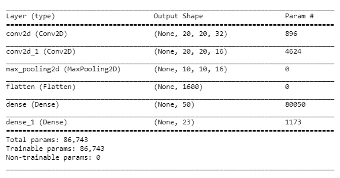

3.  在定义了我们的模型之后，我们编译并训练它。

在编译模型时，我们设置优化器的损失函数、模型度量、学习率和衰减率:

```
cnn_model_pool %>% compile(
 loss = "categorical_crossentropy",
 optimizer = optimizer_rmsprop(lr = 0.0001,decay = 1e-6),
 metrics = c('accuracy')
)
```

现在我们训练模型:

```
cnn_model_pool %>% fit_generator(generator = train_data,
 steps_per_epoch = 20,
 epochs = 5)
```

在训练模型之后，我们评估它在测试数据上的性能并打印性能指标:

```
scores <- cnn_model_pool %>% evaluate_generator(generator = test_data,steps = 20)

# Output metrics
paste('Test loss:', scores[[1]], '\n')
paste('Test accuracy:', scores[[2]], '\n')
```

下面的屏幕截图显示了模型在测试数据上的性能:

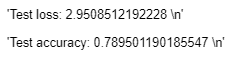

我们可以看到，模型对测试数据的准确率在 79%左右。


# 它是如何工作的...

在*步骤 1* 中，我们使用了`flow_images_from_directory()`函数从一个目录中加载图像。要使用此功能，我们必须像构建 Fruits 360 数据集一样构建数据。这个函数为我们提供了在 r 中加载图像时转换图像的灵活性。在我们的实现中，我们将每个图像的大小调整为 20 × 20，并将颜色模式更改为 RGB 通道。接下来，我们研究了数据，并查看了图像在训练和测试数据集中的分布。

在下一步中，我们定义了我们的模型。在此模型中，我们安装了一个最大池层，后跟两个密集层。网络的最后一层激活了 23 个单位的 **softmax** ，因为我们有 23 个输出标签。接下来，我们查看了该模型的摘要，我们观察到池层中可训练参数的数量为零，因为它没有要训练的权重和偏差。池层的输出形状可以由: *floor(输入大小/池大小)*决定。

在最后一步中，我们编译并训练了模型。为了训练模型，我们使用了`fit_generator()`函数，因为我们必须在`flow_images_from_directory()`返回的生成器对象上训练我们的模型。接下来，我们在测试数据集上评估了模型的性能，并打印了评估指标。


# 还有更多...

在我们只有少量数据样本可以学习的情况下，过度拟合是一个常见的挑战。这阻止了我们的模型在看不见的数据上稳健地执行。有一些技巧可以帮助我们处理这个问题:

**数据扩充**:这是一种技术，通过从数据中的现有样本生成更多的训练数据，并通过几次随机变换来扩充样本，从而产生看起来可信的图像，从而减少过拟合。它通过应用移动、翻转、缩放等操作来创建修改后的版本。它还丰富了我们的数据，这有助于推广我们的模型，使其更加稳健。数据扩充仅在训练集上完成。

R 中的`keras`库提供了`image_data_generator()`函数，实现实时批量数据扩充。以下示例显示了我们如何从 Fruits 360 数据集扩充数据。增强图像将随机旋转 0 到 50 度，其宽度/高度将在总宽度/高度的 0%到 10%之间变化。我们指定了 0.2 的缩放范围:

```
train_data_generator <- image_data_generator(rotation_range = 50,
 width_shift_range = 0.1,
 height_shift_range = 0.1,
 zoom_range = 0.2,
 horizontal_flip = TRUE,
 fill_mode = "nearest")
```

以下代码块演示了如何通过动态数据扩充从目录中加载图像:

```
train_data <- flow_images_from_directory(directory = train_path,
 generator = train_data_generator,
 target_size = img_size,
 color_mode = "rgb",
 class_mode = "categorical",
 classes = class_label,
 batch_size = 20)
```

注意，我们使用了`rgb`颜色模式；其他颜色模式包括`grayscale`。

**批量标准化** : 在训练深度神经网络时，每层输入的分布会发生变化，从而降低训练速度，因为我们需要保持较低的学习速率，并进行仔细的参数初始化，以正确训练模型。这种现象被称为**内部协变量偏移**，通过对每个训练小批量进行标准化来解决。批次标准化通过均值和方差参考对每个批次进行标准化，允许我们使用更高的学习率。它还起到了规范作用，在某些情况下消除了辍学的必要性。批量标准化使权重初始化变得容易。有关`layer_batch_normalization()`函数及其参数的更多详细信息，请参考[https://keras . r studio . com/reference/layer _ batch _ normalization . html](https://keras.rstudio.com/reference/layer_batch_normalization.html)。 [](https://keras.rstudio.com/reference/layer_batch_normalization.html) 

如果我们要在 CNN 模型中使用批量标准化，我们可以这样做:

```
cnn_model_batch_norm <- keras_model_sequential() %>% 
 layer_conv_2d(filters = 32, kernel_size = c(4,4),input_shape = c(img_width,img_height,3),padding = "same") %>% 
 layer_batch_normalization()%>%
 layer_activation("relu") %>%
 layer_conv_2d(filters = 16, kernel_size = c(3,3))%>%
 layer_batch_normalization()%>%
 layer_activation("relu")%>%
 layer_max_pooling_2d(pool_size = c(2,2)) %>%
 layer_flatten() %>% 
 layer_dense(units = 50, activation = 'relu') %>% 
 layer_dense(units = 23, activation = 'softmax')

```

让我们来看看批量标准化模型的总结:

```
summary(cnn_model_batch_norm)
```

该屏幕截图显示了批量标准化模型的描述:

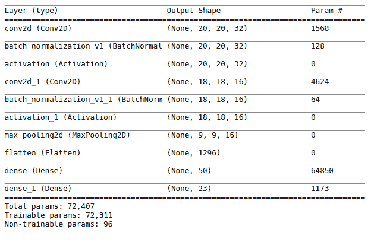

因此，在这个配方中，我们关注最大池和平均池。另一个著名的池技术被称为**全球平均池**，它执行极端的维度缩减。在本配方的*另请参见*部分，提供了有关全球平均池的更多信息的链接。


# 请参见

*   有时，我们也使用全局平均池层来防止过度拟合。keras 库提供了这些层的实现。如需了解更多信息，请点击[https://keras . r studio . com/reference/layer _ global _ max _ pooling _ 2d . html](https://keras.rstudio.com/reference/layer_global_max_pooling_2d.html)。
*   要了解如何为我们的优化器设置自定义学习率衰减，请参考在[https://tensor flow . r studio . com/TF estimates/articles/examples/iris _ custom _ decay _ dnn . html](https://tensorflow.rstudio.com/tfestimators/articles/examples/iris_custom_decay_dnn.html)实现的示例。


# 实现迁移学习

迁移学习通过使用从解决其他相关任务中获得的信息，帮助我们用较少的例子解决一个新问题。这是一种技术，其中我们重用在不同数据集上训练的学习模型来解决类似但不同的问题。在迁移学习中，我们在我们的网络中扩展预训练模型的学习，并建立新的模型来解决新的学习问题。R 中的 keras 库提供了许多预先训练好的模型；我们将使用一个名为 **VGG16** 的模型来训练我们的网络。


# 做好准备

我们首先将`keras`库导入到我们的环境中:

```
library(keras)
```

在这个例子中，我们将使用 ka ggle([https://www.kaggle.com/c/dogs-vs-cats](https://www.kaggle.com/c/dogs-vs-cats))的狗与猫数据集的子集，其中包含不同大小的狗和猫的图像。这个数据集是由 Petfinder 和微软合作开发的。我们已经将数据分成了训练集、测试集和验证集，每一个都在各自的文件夹中包含了猫和狗的图像。我们的训练和测试数据各有 1，000 张猫和狗的图片，测试和验证集各有 500 张狗和猫的图片。

让我们定义数据的训练、测试和验证路径:

```
train_path <- "dogs_cats_small/train/"
test_path <- "dogs_cats_small/test/"
validation_path <- "dogs_cats_small/validation/"
```

我们已经设置了数据集的路径。


# 怎么做...

现在让我们进行数据处理:

1.  我们首先为训练和测试数据定义一个生成器。我们将在将数据加载到我们的环境中时使用这些生成器，并执行实时数据扩充:

```
# train generator
train_augmentor = image_data_generator(
 rescale = 1/255,
 rotation_range = 300,
 width_shift_range = 0.15,
 height_shift_range = 0.15,
 shear_range = 0.2,
 zoom_range = 0.2,
 horizontal_flip = TRUE,
 fill_mode = "nearest"
)

# test generator
test_augmentor <- image_data_generator(rescale = 1/255)
```

现在，让我们将培训、测试和验证数据加载到我们的环境中:

```
# load train data
train_data <- flow_images_from_directory(
 train_path,
 train_augmentor,
 target_size = c(150, 150),
 batch_size = 20,
 class_mode = "binary")

# load test data
test_data <- test_generator <- flow_images_from_directory(
 test_path,
 test_augmentor,
 target_size = c(150, 150),
 batch_size = 20,
 class_mode = "binary")

# load validation data
validation_data <- flow_images_from_directory(
 validation_path,
 test_augmentor,
 target_size = c(150, 150),
 batch_size = 20,
 class_mode = "binary"
)
```

我们可以使用以下代码打印重新缩放后的图像的形状:

```
train_data$image_shape
```

2.  加载完我们的数据后，让我们实例化一个预训练的 VGG16 模型。更进一步，我们将此模型称为基础模型:

```
pre_trained_base <- application_vgg16(
 weights = "imagenet",
 include_top = FALSE,
 input_shape = c(150, 150, 3)
)
```

现在让我们来看看基本模型的总结:

```
summary(pre_trained_base)
```

以下是基本模型的描述:

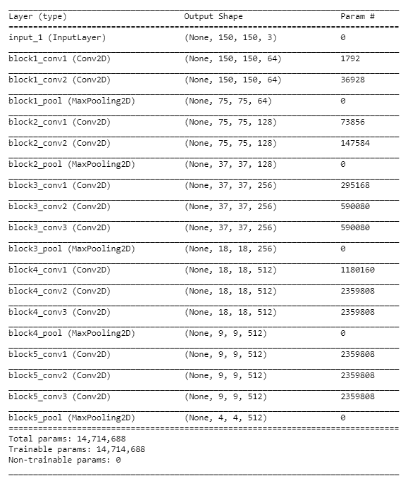

在实例化基础模型后，我们向其添加密集层并构建整体模型:

```
model_with_pretrained <- keras_model_sequential() %>% 
 pre_trained_base %>% 
 layer_flatten() %>% 
 layer_dense(units = 8, activation = "relu") %>%
 layer_dense(units = 16, activation = "relu") %>%
 layer_dense(units = 1, activation = "sigmoid")
```

现在我们将模型的概要可视化:

```
summary(model_with_pretrained)
```

该屏幕截图显示了整体模型的摘要:

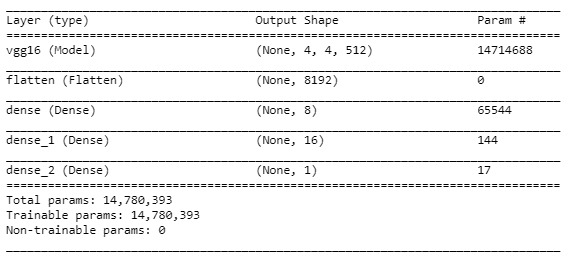

我们可以使用以下代码打印模型中可训练内核和偏差的数量:

```
length(model_with_pretrained$trainable_weights)
```

让我们冻结基本模型的预实现重量:

```
freeze_weights(pre_trained_base)
```

通过执行以下代码，我们可以检查在冻结基础模型后我们有多少可训练重量:

```
length(model_with_pretrained$trainable_weights)
```

3.  在配置模型之后，我们接着编译和训练它。

让我们使用二进制交叉熵作为损失函数，使用`RMSprop()`作为优化器来编译模型:

```
model_with_pretrained %>% compile(
 loss = "binary_crossentropy",
 optimizer = optimizer_rmsprop(lr = 0.0001),
 metrics = c('accuracy')
)
```

编译后，我们现在训练模型:

```
model_with_pretrained %>% fit_generator(generator = train_data,
 steps_per_epoch = 20,
 epochs = 10,
 validation_data = validation_data)
```

接下来，我们评估训练模型在测试数据上的性能，并打印评估指标:

```
scores <- model_with_pretrained %>% evaluate_generator(generator = test_data,steps = 20)

# Output metrics
paste('Test loss:', scores[[1]], '\n')
paste('Test accuracy:', scores[[2]], '\n')
```

屏幕截图显示了模型在测试数据上的性能:

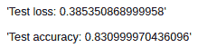

测试准确率在 83%左右。


# 它是如何工作的...

在*步骤 1* 中，我们定义了我们的训练和测试生成器来设置数据扩充的参数。然后，我们将数据集加载到我们的环境中，同时执行实时数据扩充，同时将图像大小调整为 150 × 150。

在下一步中，我们实例化了一个预训练的基础模型 **VGG16** ，其权重是根据 ImageNet 数据训练的。ImageNet 是一个大型可视化数据库，包含 1，000 种不同类别的图像。注意，我们已经将`include_top`的值设置为`FALSE`。将其设置为 false 不包括 VGG16 网络的默认密集连接层，这些层对应于 1，000 类 ImageNet 数据。此外，我们定义了一个顺序 Keras 模型，它包含基本模型以及一些定制的密集层，以构建二进制分类器。接下来，我们打印出了模型的概要，以及模型中的核和偏差的数量。然后我们冻结了基础模型的层，因为我们不想在数据集上训练时修改它的权重。

在最后一步中，我们使用`binary_crossentropy`作为损失函数来编译我们的模型，并使用 RMSprop 优化器来训练它。一旦我们训练了我们的模型，我们就在测试数据上打印它的性能指标。


# 还有更多...

实现迁移学习主要有三种方式:

*   使用预先训练好的模型，预先实现权重和偏差；也就是说，完全冻结网络的预训练模型，并在新的数据集上进行训练。
*   部分冻结我们的网络的预训练模型的几个层，并在新的数据集上训练它。
*   仅保留预训练模型的架构，并针对新的权重和偏差训练您的完整网络。

下面的代码片段演示了如何部分冻结网络的预训练部分。在解冻预训练网络的选定层之前，我们必须定义整体模型并冻结预训练部分:

```
unfreeze_weights(pre_trained_base, from = "block5_conv1", to = "block5_conv3")
```

`unfreeze_weights()`函数的`from`和`to`参数让我们定义想要解冻权重的层。请注意，`from`和`to`层都是包含的。

当我们在新的数据集上调整预训练模型的层时，我们应该使用非常低的学习率。建议采用较低的学习速率，因为在我们微调的层上，我们应该限制对表示进行修改的幅度。


# 请参见

我们可以利用其他预先训练好的模型来解决各种深度学习问题，Keras 提供了许多这样的模型。欲了解更多信息，请访问页面[https://tensor flow . r studio . com/keras/reference/# section-applications](https://tensorflow.rstudio.com/keras/reference/#section-applications)。