# 运行中的循环神经网络

序列数据是顺序很重要的数据，例如音频、视频和语音。由于数据的性质，学习序列数据是模式识别领域中最具挑战性的问题之一。在处理顺序数据时，序列各部分之间的相关性及其变化的长度进一步增加了复杂性。随着序列模型和算法的出现，例如**循环神经网络** ( **RNN** )、**长短期记忆模型** ( **LSTM** )、以及**门控递归单元** ( **GRU** )，序列数据建模正被用于多种应用，例如序列分类、序列生成、语音到文本的转换等等。

在序列分类中，目标是预测序列的类别，而在序列生成中，我们基于输入序列生成新的输出序列。在这一章中，你将学习如何使用不同风格的 RNN 实现序列分类和生成，以及时间序列预测。

在本章中，我们将介绍以下配方:

*   基于神经网络的情感分类
*   使用 LSTMs 生成文本
*   基于 GRUs 的时间序列预测
*   实现双向循环神经网络


# 基于神经网络的情感分类

RNN 是一个独特的网络，因为它有记忆输入的能力。这种能力使它非常适合处理序列数据的问题，例如时间序列预测、语音识别、机器翻译以及音频和视频序列预测。在 RNNs 中，数据以这样一种方式遍历，即在每个节点，网络从当前和以前的输入中学习，随着时间的推移共享权重。这就像在每一步执行相同的任务，只是不同的输入减少了我们需要学习的参数总数。

例如，如果激活函数是 *tanh* ，那么循环神经元的权重是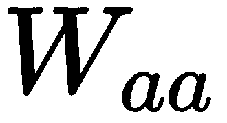，输入神经元的权重是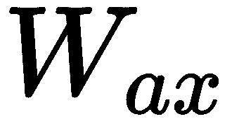。这里，我们可以将在时间 *t* 的状态的方程写成如下:

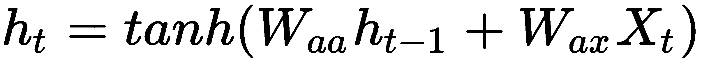

每个输出的梯度取决于当前和先前时间步长的计算。例如，为了计算在 *t=6* 处的梯度，我们需要反向传播五个步骤并添加梯度。这就是所谓的**穿越时间** ( **BPTT** )。在 BPTT 过程中，当迭代训练样本时，我们修改权重以减少错误。

rnn 可以通过它支持的不同体系结构处理各种输入和输出类型的数据。主要的如下:

*   **一对多:**一个输入映射到一个序列，多个步骤作为输出。这方面的一个例子是音乐生成:

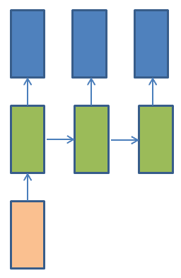

*   **多对一**:输入序列映射到一个类别或数量预测。情感分类就是一个例子:

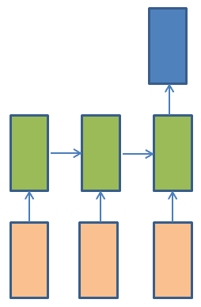

*   **多对多**:输入序列映射到输出序列。这方面的一个例子是语言翻译:

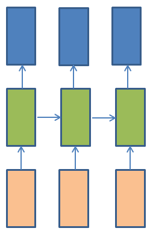

在这个菜谱中，我们将建立一个 RNN 模型，对电影评论的观点进行分类。


# 做好准备

在这一部分，我们将使用 IMDb 数据集，它包含电影评论和与之相关的情感。我们可以从`keras`库中导入数据集。这些评论被预处理并编码为一系列单词索引。这些单词通过它们在数据集中的总频率来索引；例如，单词 index *8* ，指的是数据中第 8 个^第个最频繁出现的单词。

现在，让我们导入`keras`库和`imdb`数据集:

```
library(keras)
imdb <- dataset_imdb(num_words = 1000)
```

让我们将数据分为训练集和测试集:

```
train_x <- imdb$train$x
train_y <- imdb$train$y
test_x <- imdb$test$x
test_y <- imdb$test$y
```

现在，我们可以看看训练和测试数据中的评论数量:

```
# number of samples in train and test set
cat(length(train_x), 'train sequences\n')
cat(length(test_x), 'test sequences')
```

在这里，我们可以看到在训练集和测试集中各有一个`25000`评论:

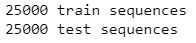

让我们也看看训练数据的结构:

```
str(train_x)
```

以下屏幕截图显示了训练数据中预测变量的描述:

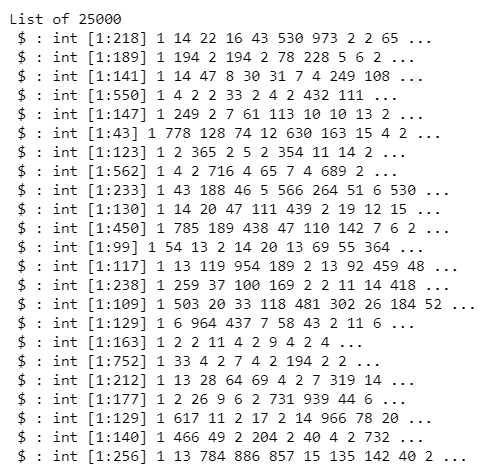

同样，我们将看看培训标签的结构:

```
str(train_y)
```

下面的屏幕截图显示了训练数据中目标变量的描述:

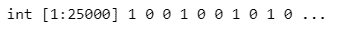

在这里，我们可以看到我们的训练集是一个评论和情感标签的列表。我们来看看第一篇评论，以及里面的字数:

```
train_x[[1]]
cat("Number of words in the first review is",length(train_x[[1]]))
```

下面的屏幕截图显示了编码形式的第一篇评论:

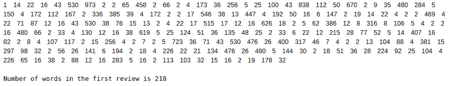

请注意，当我们导入数据集时，我们将参数`num_words`的值设置为`1000`。这意味着只有前 1000 个常用词被保存在编码评论中。为了验证这一点，让我们看看评论列表中的最大编码值:

```
cat("Maximum encoded value in train ",max(sapply(train_x, max)),"\n")
cat("Maximum encoded value in test ",max(sapply(test_x, max)))
```

执行前面的代码为我们提供了训练和测试数据中的最大编码值。


# 怎么做...

现在我们已经熟悉了这些数据，让我们更详细地看一下:

1.  让我们为`imdb`数据导入 word index:

```
word_index = dataset_imdb_word_index()
```

我们可以使用下面的代码来查看单词 index 的头部:

```
head(word_index)

```

在这里，我们可以看到有一个键-值对列表，其中键是单词，值是它映射到的整数:

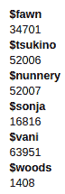

让我们也来看看单词索引中独特单词的数量:

```
length((word_index))
```

在这里，我们可以看到单词索引中有 88，584 个唯一单词:

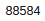

2.  现在，我们创建一个单词 index 的键值对的反向列表。我们将使用这个列表来解码 IMDb 数据集中的评论:

```
reverse_word_index <- names(word_index)
names(reverse_word_index) <- word_index
head(reverse_word_index)
```

在这里，我们可以看到反转单词索引列表是一个键-值对列表，其中键是整数索引，值是关联单词:

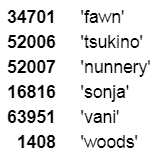

3.  现在，我们解码第一篇评论。请注意，字编码偏移 3，因为 0、1、2 分别保留用于填充、序列开始和词汇外字:

```
decoded_review <- sapply(train_x[[1]], function(index) {

  word <- if (index >= 3) reverse_word_index[[as.character(index -3)]]
  if (!is.null(word)) word else "?"

})

cat(decoded_review)
```

以下屏幕截图显示了第一篇评论的解码版本:


4.  让我们填充所有的序列，使它们长度一致:

```
train_x <- pad_sequences(train_x, maxlen = 80)
test_x <- pad_sequences(test_x, maxlen = 80)
cat('x_train shape:', dim(train_x), '\n')
cat('x_test shape:', dim(test_x), '\n')
```

所有序列都被填充到长度`80`:

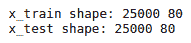

现在，我们来看看填充后的第一篇评论:

```
train_x[1,]
```

在这里，您可以看到填充后的评论只有 80 个索引:

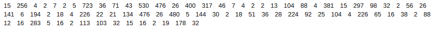

5.  现在，我们构建情感分类模型并查看其摘要:

```
model <- keras_model_sequential()
model %>%
  layer_embedding(input_dim = 1000, output_dim = 128) %>%
  layer_simple_rnn(units = 32) %>%
  layer_dense(units = 1, activation = 'sigmoid')

summary(model)

```

以下是对该模型的描述:

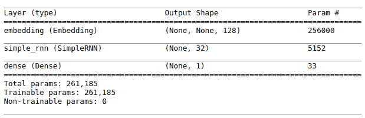

6.  现在，我们编译模型并训练它:

```
# compile model
model %>% compile(
  loss = 'binary_crossentropy',
  optimizer = 'adam',
  metrics = c('accuracy')
)

# train model
model %>% fit(
  train_x,train_y,
  batch_size = 32,
  epochs = 10,
  validation_split = .2
)

```

7.  最后，我们根据测试数据评估模型的性能，并打印指标:

```
scores <- model %>% evaluate(
  test_x, test_y,
  batch_size = 32
)

cat('Test score:', scores[[1]],'\n')

cat('Test accuracy', scores[[2]])
```

下面的屏幕截图显示了测试数据的性能指标:

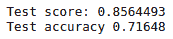

通过这样做，我们在测试数据上实现了大约 71%的准确率。


# 它是如何工作的...

在这个例子中，我们使用了来自`keras`库的 IMDb 评论的内置数据集。我们加载了数据的训练和测试分区，并查看了这些数据分区的结构。我们看到数据被映射到一个特定的整数值序列，每个整数代表字典中的一个特定单词。这本字典有丰富的单词集合，根据每个单词在语料库中的使用频率进行排列。由此，我们可以看到字典是一个键-值对的列表，键代表单词，值代表单词在字典中的索引。为了丢弃不经常使用的单词，我们提供了 1000 的阈值；也就是说，我们只保留了训练数据集中前 1000 个最常用的单词，而忽略了其余的单词。然后，我们转移到数据处理部分。

在*步骤 1* 中，我们为 IMDb 数据集导入了单词 index。在这个单词索引中，数据中的单词按照数据集中的总频率进行编码和索引。在*步骤 2* 中，我们创建了一个单词 index 的逆序键值对列表，用于从一系列编码整数中将句子解码回原始版本。在*步骤 3* 中，我们展示了如何重新生成一个样本审查。
在*步骤 4* 中，我们准备了数据，以便将其输入到模型中。因为我们不能直接将整数列表传递到模型中，所以我们将它们转换成统一形状的张量。为了使所有评论的长度一致，我们可以采用以下两种方法之一:

*   **一键编码**:这将把序列转换成相同长度的张量。矩阵的大小将是*字数*评论数*。这种方法计算量很大。
*   **填充评论**:或者，我们可以填充所有的序列，使它们都具有相同的长度。这将创建一个形状为*num _ examples * max _ length*的整数张量。max_length 参数用于限制我们希望在所有评论中保留的最大字数。

因为第二种方法占用的内存和计算量较少，所以我们选择了第二种方法；也就是说，我们将序列填充到最大长度 80。

在*步骤 5* 中，我们定义了一个顺序的 Keras 模型并配置了它的层。第一层是嵌入层，用于从我们的数据中生成单词序列的上下文，并提供有关相关特征的信息。在嵌入中，单词由密集向量表示来表示。每个向量代表单词到连续向量空间的投影，然后从文本中学习，并基于特定单词周围的单词。单词在向量空间中的位置被称为它的**嵌入**。当我们做嵌入时，我们根据一些潜在的因素来表示每个评论。比如*辉煌*这个词可以用一个向量来表示；比方说，[.32，. 02，. 48，. 21，. 56，. 15]。当我们使用大规模数据集时，这在计算上是高效的，因为它降低了维数。嵌入的向量也在深度神经网络的训练过程中得到更新，这有助于在多维空间中识别相似的单词。词嵌入也反映了单词在语义上是如何相互关联的。例如，像**说话**和**说话**这样的词可以被认为是相关的，就像**游泳**与**游泳**相关一样。

下图显示了词嵌入的图形表示:

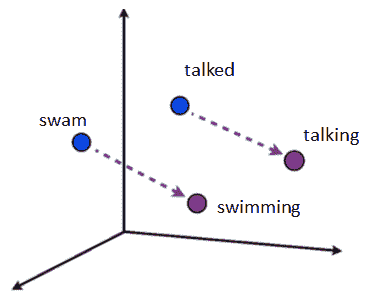

嵌入层通过指定三个参数来定义:

*   `input_dim`:这是文本数据中词汇的大小。在我们的例子中，文本数据是一个被编码为 0-999 之间的值的整数。由于这个原因，词汇表的大小是 1000 个单词。
*   `output_dim`:这是单词将要嵌入的向量空间的大小。我们将其指定为 128。
*   `input_length`:这是输入序列的长度，我们为 Keras 模型的任何输入层定义。
    在下一层，我们定义了一个有 32 个隐藏单元的简单 RNN 模型。如果 *n* 是输入维度的数量，并且 *d* 是 RNN 层中隐藏单元的数量，那么可训练参数的数量可以由下面的等式给出:

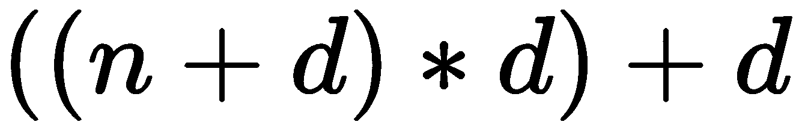

最后一层与单个输出节点紧密相连。这里，我们使用 sigmoid 激活函数，因为这是一个二元分类任务。在*步骤 6* 中，我们编译了模型。我们将`binary_crossentropy`指定为损失函数，因为我们正在处理二进制分类，而将 **adam** 指定为优化器。然后，我们用 20%的验证分割来训练我们的模型。最后，在最后一步中，我们评估了模型的测试准确性，以了解我们的模型在测试数据上的表现。


# 还有更多...

到现在为止，你已经知道 BPTT 是如何在 RNN 工作的了。我们反向遍历网络，计算每次迭代中相对于权重的误差梯度。在反向传播过程中，随着我们靠近网络的早期层，这些梯度变得太小，从而使这些层中的神经元学习非常慢。对于一个精确的模型，对早期层进行精确的训练是至关重要的，因为这些层负责从输入中学习简单的模式，并相应地将相关信息传递给后续层。当我们训练在层内具有更多依赖性的巨大网络时，rnn 经常面临这个挑战。这个挑战被称为**消失梯度问题**，它使得网络学习速度太慢。这也意味着结果并不尽如人意。通常建议使用 RELU 激活函数来避免大型网络中的消失梯度问题。处理这个问题的另一个非常常见的方法是使用一个**长短期记忆** ( **LSTM** )模型。我们将在下一个食谱中讨论这一点。

rnn 遇到的另一个挑战是**爆炸梯度问题**。在这种情况下，我们可以看到较大的梯度值，这反过来使模型学习速度过快和不准确。在某些情况下，由于计算中的数值溢出，梯度也可能变成`NaN`。当这种情况发生时，网络中的权重会在训练的较短时间内大幅增加。防止这个问题最常用的补救措施是**梯度削波**，它可以防止梯度增加超过指定的阈值。


# 请参见

要了解更多关于循环神经网络正则化的信息，请访问[https://arxiv.org/pdf/1409.2329.pdf](https://arxiv.org/pdf/1409.2329.pdf)。


# 使用 LSTMs 生成文本

循环神经网络在正确携带信息方面面临困难，特别是当大型网络中的层之间存在长顺序依赖性时。**长短期记忆**网络，通常被称为 **LSTM** 网络，是能够学习长期依赖关系的 RNNs 的扩展，被广泛用于深度学习，以避免 RNNs 面临的消失梯度问题。LSTMs 通过门控机制对抗消失梯度，并且能够向单元状态移除或添加信息。这种细胞状态由闸门仔细调节，闸门控制通过它们的信息。LSTMs 有三种门:输入、输出和遗忘。遗忘门控制着我们想要将多少来自前一状态的信息传递给下一个单元。输入状态定义了对于当前输入，*x[t]我们想要将多少新计算状态的信息传递给后续状态，而输出门定义了我们想要将多少内部状态信息传递给下一个状态。*

下图显示了 LSTM 网络架构的图示:

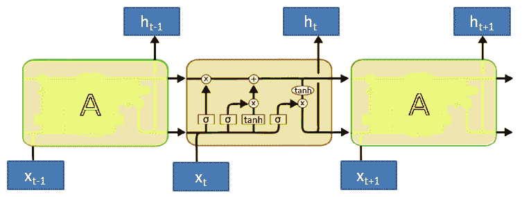

在这个菜谱中，我们将实现一个用于序列预测的 LSTM 模型(在这个例子中是多对一)。该模型将根据之前的单词序列预测某个单词的出现。这就是所谓的文本生成。


# 做好准备

在这个例子中，我们将使用 *Jack and Jill* 童谣作为我们的源文本，以便我们可以建立一个语言模型。我们将创建一个包含押韵的文本文件，并将其保存在目录中。我们的语言模型将两个单词作为输入来预测下一个单词。

我们将首先导入所需的库并读取我们的文本文件:

```
library(keras)
library(readr)
library(stringr)

data <- read_file("data/rhyme.txt") %>% str_to_lower()
```

在 NLP 中，我们将数据称为语料库。语料库是大量文本的集合。让我们看看我们的语料库:

```
data
```

下面的截图显示了我们语料库中的文本:

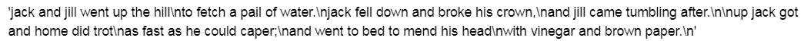

我们将使用前面截图中的文本来生成序列。


# 怎么做...

到目前为止，我们已经将一个语料库导入到 R 环境中。为了建立一个语言模型，我们需要把它转换成一个整数序列。让我们开始做一些数据预处理:

1.  首先，我们定义我们的记号赋予器。我们稍后将使用它将文本转换成整数序列:

```
tokenizer = text_tokenizer(num_words = 35,char_level = F)
tokenizer %>% fit_text_tokenizer(data)
```

让我们来看看语料库中独特单词的数量:

```
cat("Number of unique words", length(tokenizer$word_index))
```

我们的语料库中有 37 个独特的单词。要查看词汇表的前几条记录，我们可以使用以下命令:

```
head(tokenizer$word_index)
```

让我们使用之前定义的记号赋予器将语料库转换成整数序列:

```
text_seqs <- texts_to_sequences(tokenizer, data)
str(text_seqs)
```

下图显示了返回序列的结构:

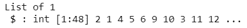

在这里，我们可以看到`texts_to_sequences()`返回一个列表。让我们把它转换成一个向量，并打印出它的长度:

```
text_seqs <- text_seqs[[1]]
length(text_seqs)
```

我们语料库的长度是 48:

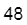

2.  现在，让我们将文本序列转换为输入(特征)和输出(标签)序列，其中输入将是两个连续单词的序列，输出将是序列中出现的下一个单词:

```
input_sequence_length <- 2
feature <- matrix(ncol = input_sequence_length)
label <- matrix(ncol = 1)

for(i in seq(input_sequence_length, length(text_seqs))){
    if(i >= length(text_seqs)){
        break()
    }
    start_idx <- (i - input_sequence_length) +1
    end_idx <- i +1
    new_seq <-  text_seqs[start_idx:end_idx]
    feature <- rbind(feature,new_seq[1:input_sequence_length])
    label <- rbind(label,new_seq[input_sequence_length+1])
}
feature <- feature[-1,]
label <- label[-1,]

paste("Feature")
head(feature)
```

下面的屏幕截图显示了我们制定的功能序列:

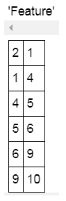

让我们看看我们创建的标签序列:

```
paste("label")
head(label)
```

以下屏幕截图显示了前几个标签序列:

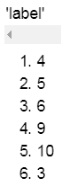

让我们对我们的标签进行一次性编码，并查看我们的特性和标签的尺寸:

```
label <- to_categorical(label,num_classes = tokenizer$num_words )
```

在这里，我们可以看到我们的特征和标签数据的尺寸:

```
cat("Shape of features",dim(feature),"\n")
cat("Shape of label",length(label))
```

以下截图显示了我们的特征和标签序列的尺寸:

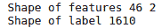

3.  现在，我们创建一个文本生成模型并打印其摘要:

```
model <- keras_model_sequential()
model %>%
    layer_embedding(input_dim = tokenizer$num_words,output_dim = 10,input_length = input_sequence_length) %>%
    layer_lstm(units = 50) %>%
    layer_dense(tokenizer$num_words) %>%
    layer_activation("softmax")

summary(model)
```

下面的屏幕截图显示了模型的概要:

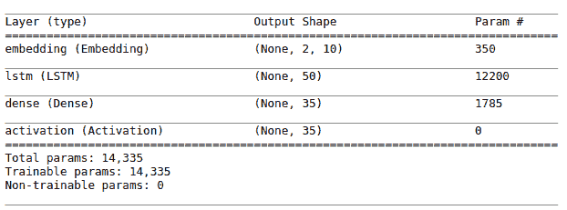

接下来，我们编译模型并对其进行训练:

```
# compile
model %>% compile(
    loss = "categorical_crossentropy", 
    optimizer = optimizer_rmsprop(lr = 0.001),
    metrics = c('accuracy')
)

# train
model %>% fit(
  feature, label,
#   batch_size = 128,
  epochs = 500
)
```

4.  在下面的代码块中，我们实现了一个从语言模型生成序列的函数:

```
generate_sequence <-function(model, tokenizer, input_length, seed_text, predict_next_n_words){
    input_text <- seed_text
    for(i in seq(predict_next_n_words)){
        encoded <- texts_to_sequences(tokenizer,input_text)[[1]]
        encoded <- pad_sequences(sequences = list(encoded),maxlen = input_length,padding = 'pre')
        yhat <- predict_classes(model,encoded, verbose=0)
        next_word <- tokenizer$index_word[[as.character(yhat)]]
        input_text <- paste(input_text, next_word)
    }
    return(input_text)
}
```

现在，我们可以使用自定义函数`generate_sequence()`，从整数序列生成文本:

```
seed_1 = "Jack and"
cat("Text generated from seed 1: " ,generate_sequence(model,tokenizer,input_sequence_length,seed_1,11),"\n ")
seed_2 = "Jack fell"
cat("Text generated from seed 2: ",generate_sequence(model,tokenizer,input_sequence_length,seed_2,11))
```

下面的屏幕截图显示了模型根据输入文本生成的文本:

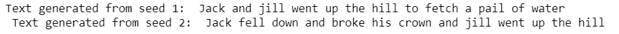

由此可见，我们的模型在预测序列方面做得很好。


# 它是如何工作的...

要构建任何语言模型，我们都需要清理输入文本并将其分解成标记。记号是单个的单词，将文本分解成不同的单词称为记号化。默认情况下，`keras`记号赋予器将语料库拆分成记号列表(“”用于将句子拆分成单词)，删除所有标点符号，将单词转换成小写，并基于输入文本构建内部词汇表。标记器生成的词汇表是一个索引列表，其中的单词根据它们在数据集中的总频率进行索引。在这个食谱中，我们看到，在童谣中，“和”是出现频率最高的词，而“上”是出现频率第五高的词。总共有 37 个独特的词。

在*步骤 1* 中，我们将语料库转换成一个整数序列。请注意，`text_tokenizer()`的`num_words`参数根据词频定义了要保留的最大字数。这意味着只有前“n”个频繁单词被保留在编码序列中。在*步骤 2* 中，我们为我们的语料库准备了特征和标签。

在*步骤 3* 中，我们定义了我们的 LSTM 神经网络。首先，我们初始化一个序列模型，然后向它添加一个嵌入层。嵌入层将输入特征空间转换成具有“d”维的潜在特征；在我们的例子中，它将其转化为 128 个潜在特征。接下来，我们添加了 50 个单位的 LSTM 层。单词预测是一个分类问题，我们从词汇表中预测下一个单词。由于这一点，我们添加了一个密集层，其单位等于具有 softmax 激活功能的词汇表中的单词数。

在*步骤 4* 中，我们定义了一个从给定的两个单词的初始集合生成文本的函数。我们的模型从原来的前两个单词预测下一个单词。在我们的示例中，初始种子是“Jack and ”,预测单词是“jill ”,因此创建了一个三个单词的序列。在下一次迭代中，我们使用句子的最后两个单词“and jill”，并预测下一个单词“got”。该函数继续生成文本，直到我们生成的单词等于参数`predict_next_n_words`的值。


# 还有更多...

在处理 NLP 应用程序时，我们从文本数据中构造有意义的特征。我们可以使用许多技术来构建这些特征，例如计数矢量化、二进制矢量化、**术语频率-逆文档频率** ( **tf-idf** )、词嵌入等等。下面的代码块演示了如何使用 R 中的`keras`库为各种 NLP 应用构建一个 tf-idf 特征矩阵:

```
texts_to_matrix(tokenizer, input, mode = c("tfidf"))
```

其他可用的模式包括*二进制*、*计数*和*频率*。


# 请参见

*   欲了解更多有关编码器-解码器网络堆叠 rnn/lstm 的信息，请访问[https://cs224d.stanford.edu/reports/Lambert.pdf](https://cs224d.stanford.edu/reports/Lambert.pdf)。
*   要了解更多关于 word2vec 类神经网络的信息，请访问[http://mccormickml . com/assets/word 2 vec/Alex _ Minnaar _ word 2 vec _ Tutorial _ Part _ I _ The _ Skip-Gram _ model . pdf](http://mccormickml.com/assets/word2vec/Alex_Minnaar_Word2Vec_Tutorial_Part_I_The_Skip-Gram_Model.pdf)。


# 基于 GRUs 的时间序列预测

与 LSTMs 不同，gru 不使用存储单元来控制信息流，并且可以直接利用所有隐藏状态。GRUs 不使用单元状态，而是使用隐藏状态来传递信息。GRUs 通常比其他基于记忆的神经网络训练得更快，因为它们需要训练的参数更少，张量运算更少，并且可以在更少的数据下很好地工作。格鲁有两个大门。这些被称为*复位门*和*更新门*。复位门用于确定如何将新的输入与先前的存储器相结合，而更新门确定从先前的状态保留多少信息。如果将此与 LSTMs 进行比较，GRU 中的更新门与 LSTM 中的输入和遗忘门相当。它决定添加或删除什么信息。GRUs 还合并了单元格状态和隐藏状态，使得生成的模型很简单。

下图是 GRU 的图示:

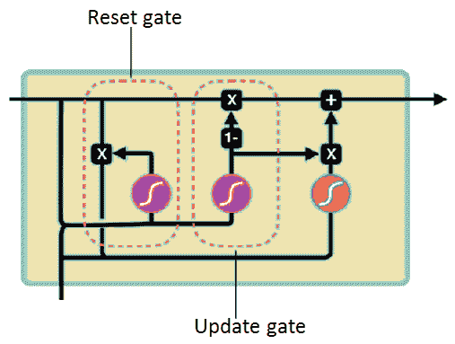

在这个食谱中，我们将使用 GRUs 建立一个模型来预测洗发水的销售。


# 做好准备

对于这个配方，我们需要在构建模型之前分析数据的趋势。

首先，让我们导入`keras`库:

```
library(keras)
```

在这个食谱中，我们将使用洗发水的销售数据，这些数据可以从本书的 GitHub 存储库中下载。该数据集包含三年内洗发水的月销售额，由 36 行组成。原始数据集归功于 Makridakis、Wheelwright 和 Hyndman (1998 年):

```
data = read.table("data/shampoo_sales.txt",sep = ',')
data <- data[-1,]
rownames(data) <- 1:nrow(data)
colnames(data) <- c("Year_Month","Sales")
head(data)
```

下面的屏幕截图显示了数据中的一些记录:

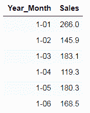

让我们分析一下数据的`Sales`列中的趋势:

```
# Draw a line plot to show the trend of data
library(ggplot2)
q = ggplot(data = data, aes(x = Year_Month, y = Sales,group =1))+ geom_line()
q = q+theme(axis.text.x = element_text(angle = 90, hjust = 1))
q
```

下图让我们了解了数据的趋势:

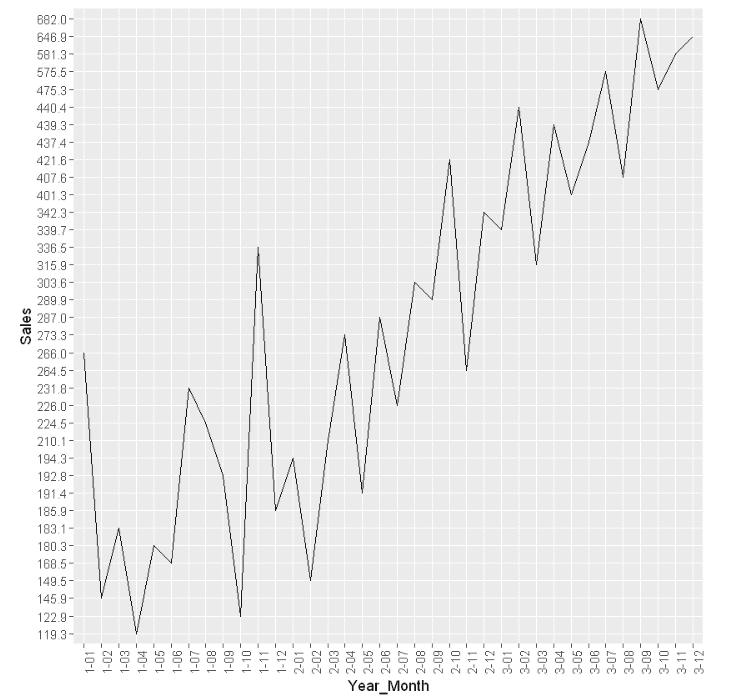

在这里，我们可以看到数据有增加的趋势。


# 怎么做...

让我们转到数据处理部分:

1.  首先，我们检查数据中`Sales`列的数据类型:

```
class(data$Sales)
```

注意，在数据中，`Sales`列的数据类型是 factor。为了在我们的分析中使用它，我们需要将它设为数值数据类型:

```
data$Sales <- as.numeric(as.character(data$Sales))
class(data$Sales)
```

现在，`Sales`列的类已经被更改为数值数据类型。

2.  为了实现时间序列预测，我们需要将数据转换成平稳数据。我们可以使用`diff()`函数来实现这一点，它将计算迭代差。我们将参数 differences 的值作为 1 传递，因为我们希望差异有一个滞后`1`:

```
data_differenced = diff(data$Sales, differences = 1)
head(data_differenced)
```

下面的屏幕截图显示了差异后的一段数据:

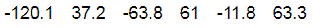

3.  接下来，我们创建一个监督数据集，以便我们可以应用 GRU。我们通过在序列中创建一个阶数为 1 的滞后来转换`data_differenced`序列；也就是说，作为输入的时间(t-1)的值将具有作为输出的时间 *t* 的值:

```
data_lagged = c(rep(NA, 1), data_differenced[1:(length(data_differenced)-1)])
data_preprocessed = as.data.frame(cbind(data_lagged,data_differenced))
colnames(data_preprocessed) <- c( paste0('x-', 1), 'x')
data_preprocessed[is.na(data_preprocessed)] <- 0
head(data_preprocessed)
```

以下是我们的监督数据集的外观:

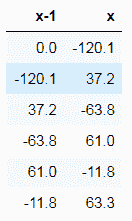

4.  现在，我们需要将数据分成训练集和测试集。在时间序列问题中，我们不能对数据进行随机抽样，因为数据的顺序很重要。因此，我们需要拆分数据，将系列的前 70%作为训练数据，其余 30%作为测试数据:

```
N = nrow(data_preprocessed)
n = round(N *0.7, digits = 0)
train = data_preprocessed[1:n, ]
test = data_preprocessed[(n+1):N,]
print("Training data snapshot :")
head(train)
print("Testing data snapshot :")
head(test)
```

下面的屏幕截图显示了训练数据集中的一些记录:

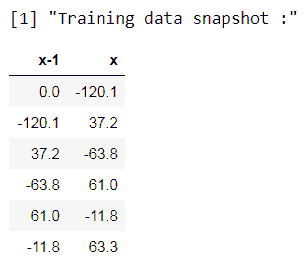

下面的屏幕截图显示了测试数据集中的一些记录:

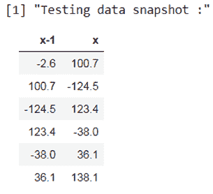

5.  接下来，我们在将要使用的激活函数的范围内对数据进行归一化。由于我们选择 *tanh* 作为激活函数，其范围从-1 到+1，我们使用**最小-最大归一化**来缩放数据。这里，我们对训练数据进行标准化:

```
scaling_data = function(train, test, feature_range = c(0, 1)) {
 x = train
 fr_min = feature_range[1]
 fr_max = feature_range[2]
 std_train = ((x - min(x) ) / (max(x) - min(x) ))
 std_test = ((test - min(x) ) / (max(x) - min(x) ))

 scaled_train = std_train *(fr_max -fr_min) + fr_min
 scaled_test = std_test *(fr_max -fr_min) + fr_min

 return( list(scaled_train = as.vector(scaled_train), scaled_test = as.vector(scaled_test) ,scaler= c(min =min(x), max = max(x))) )

}

Scaled = scaling_data(train, test, c(-1, 1))
y_train = Scaled$scaled_train[, 2]
x_train = Scaled$scaled_train[, 1]

y_test = Scaled$scaled_test[, 2]
x_test = Scaled$scaled_test[, 1]
```

然后，我们编写一个函数，将预测值恢复到原始比例。我们将在预测值时使用该函数:

```
## inverse-transform
invert_scaling = function(scaled, scaler, feature_range = c(0, 1)){
 min = scaler[1]
 max = scaler[2]
 t = length(scaled)
 mins = feature_range[1]
 maxs = feature_range[2]
 inverted_dfs = numeric(t)

 for( i in 1:t){
 X = (scaled[i]- mins)/(maxs - mins)
 rawValues = X *(max - min) + min
 inverted_dfs[i] <- rawValues
 }
 return(inverted_dfs)
}
```

6.  现在，我们定义模型并配置层。我们将数据重塑为 3D 格式，以便将其输入模型:

```
# Reshaping the input to 3-dimensional
dim(x_train) <- c(length(x_train), 1, 1)

# specify required arguments
batch_size = 1 
units = 1 

model <- keras_model_sequential() 
model%>%
 layer_gru(units, batch_input_shape = c(batch_size, dim(x_train)[2], dim(x_train)[3]),      stateful=TRUE)%>%
 layer_dense(units = 1)
```

我们来看看模型的`summary`:

```
summary(model)
```

下面的屏幕截图显示了模型的描述:

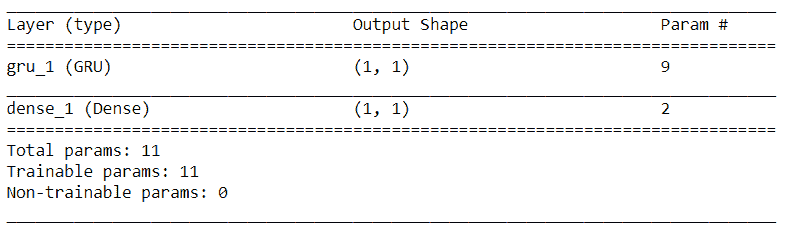

接下来，我们编译模型:

```
model %>% compile(
 loss = 'mean_squared_error',
 optimizer = optimizer_adam( lr= 0.01, decay = 1e-6 ), 
 metrics = c('accuracy')
)
```

7.  现在，在每个时期，我们将训练数据放入模型并重置状态。我们为`50`时代训练模型:

```
for(i in 1:50 ){
 model %>% fit(x_train, y_train, epochs=1, batch_size=batch_size, verbose=1, shuffle=FALSE)
 model %>% reset_states()
}
```

8.  最后，我们预测测试数据集的值，并使用`inverse_scaling`函数将预测值按比例缩小到原始比例:

```
scaler = Scaled$scaler
predictions = vector()

for(i in 1:length(x_test)){
 X = x_test[i]
 dim(X) = c(1,1,1)
 yhat = model %>% predict(X, batch_size=batch_size)
 # invert scaling
 yhat = invert_scaling(yhat, scaler, c(-1, 1))
 # invert differencing
 yhat = yhat + data$Sales[(n+i)]
 # store
 predictions[i] <- yhat
}
```

让我们看看测试数据的`predictions`:

```
predictions
```

以下屏幕截图显示了测试数据集的预测值:

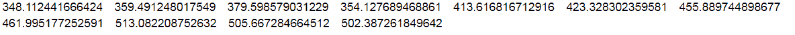

从测试数据的预测值中，我们可以推断出该模型做得相当不错。


# 它是如何工作的...

在*步骤 1* 中，我们检查了要预测其值的列的数据类型；这里，我们使用了`Sales`列。我们将其数据类型更改为数字。在*步骤 2* 中，我们将输入数据转换成静态数据。这样做是为了消除数据中与时间相关的成分。我们看到我们的输入数据有增加的趋势。在时间序列预测中，建议在建立模型之前去掉趋势分量。以后可以将这些趋势添加回预测值，这样我们就可以在原始范围内进行预测。在本例中，我们通过用 1 阶差分数据来消除趋势；也就是说，我们从当前的观测值中减去先前的观测值。

在使用 LSTM 和 GRU 等算法时，我们需要以监督的形式输入数据；即以预测器和目标变量的形式。在时间序列问题中，我们处理这样的数据，其中时间(t-k)的值充当任何 *k* 步进滞后数据集的时间 *t* 的值的输入。在我们的示例中， *k* 等于 1，因此在*步骤 3* 中，我们通过将当前数据转换为阶为 1 的滞后数据来创建滞后数据集。通过这样做，我们看到了数据中的 X=t-1 和 Y=t 模式。我们创建的滞后数据集系列充当预测变量。
在*步骤 4* 中，我们将数据分成训练和测试数据集。随机抽样不允许我们在时间序列数据中保持观察值的顺序。因此，我们拆分数据，同时保持观察顺序不变。为此，我们将前 70%的数据作为训练数据，其余 30%作为测试数据。 *n* 代表分割点，是训练的最后一个指标，而 *n+1* 代表测试数据的起始指标。在*步骤 5* 中，我们将数据标准化。gru 期望数据在网络所使用的激活函数的范围内。由于我们使用了 *tanh* 作为激活函数，它给出了(-1，1)范围内的输出，因此，我们也在(-1，1)范围内缩放了训练和测试数据集。在这种情况下，我们使用最小-最大缩放:

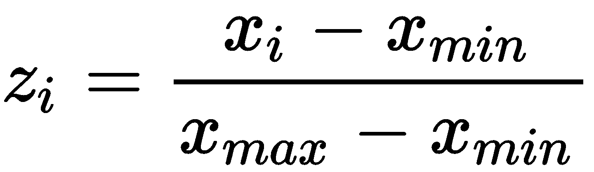

应该在训练数据集上计算缩放系数值，并将其应用于缩放测试数据集。这样做是为了避免实验中由于来自测试数据集的任何种类的知识而产生的偏差。这就是为什么在这里，训练数据的最小和最大值被用作缩放训练和测试数据以及预测值的参考。我们还创建了一个名为`invert_scaling`的函数来反向缩放缩放值，并将它们映射回原始比例。

GRUs 期望数据具有特定的格式[ `batch_size`、`timesteps`、`features` ]。`batch_size`定义了每批输入模型的观察值的数量。`timesteps`表示模型在历史数据中进行预测时需要回顾的时间步数。在本例中，我们将其设置为 1。`features`参数表示我们将使用的预测值的数量，在我们的例子中是 1。在*步骤 6* 中，我们按照要求的格式对输入数据进行了整形，并将其输入到 GRU 层。请注意，我们指定了参数`stateful = TRUE`,以便批次中索引为 *i* 的每个样本的最后状态将用作下一批次中索引为 *i* 的样本的初始状态。

这假设了不同连续批次中的样本之间的一对一映射。`units`参数表示输出空间的维度。因为我们处理的是预测连续值，所以在本例中我们采用了单位 *=1* 。一旦我们定义了模型，我们就编译它。我们指定`mean_squared_error`为损失函数，adam 为学习率为 0.01 的优化算法。我们使用准确性作为衡量标准来评估模型的性能。接下来，我们看了一下模型的概要。

假设我们有以下内容:

*   *f* 为一个单元中**前馈神经网络** ( **FFNN** )的数量(在 GRU 为 3)
*   h 是隐藏单元的尺寸
*   *i* 是输入的尺寸或大小

由于每个 FFNN 都有 *h(h+i) + h* 个参数，我们可以如下计算 GRU 中训练参数的数量:

*num _ params = f×[h(h+I)+h]；GRU 的 f = 3*

在*步骤 7* 中，对于每个时期，我们将训练数据拟合到模型中。我们将`shuffle`参数的值指定为 false，以避免在构建模型时对训练数据进行任何形式的洗牌。这样做是为了防止观测值之间的时间依赖性。我们还通过`reset_states()`功能在每个时期后重置网络状态。由于我们指定了`stateful = True`参数的值，我们需要在每个时期后手动重置 LSTM 的状态，以便为下一个时期进行干净的设置。
在最后一步中，我们预测了测试数据集的值。为了将预测值缩放回原始比例，我们使用了在*步骤 5* 中定义的`inverse_scaling`函数。


# 还有更多...

在处理大型数据集时，我们经常在训练深度学习模型时耗尽内存。R 中的`keras`库提供了各种生成器实用函数，这些函数在训练过程中动态生成批量训练数据。它还提供了创建批量时态数据的实用函数。下面的代码创建了一个监督形式的数据，类似于我们在*中创建的内容..*该配方的一部分，使用发电机实用程序:

```
# importing required libraries
library(reticulate)
library(keras)

# generating dummy data
data =  seq(from = 1,to = 10)

# timseries generator
gen = timeseries_generator(data = data,targets = data,length = 1,batch_size = 5)

# Print first batch
iter_next(as_iterator(gen))
```

下面的屏幕截图显示了第一批生成器。在这里，我们可以看到一个生成器对象产生了两个序列的列表；第一个序列是特征向量，而第二个序列是相应的标签向量:

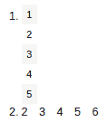

下面的代码为时序数据实现了一个自定义生成器。它给了我们定义`lookback`的灵活性；也就是我们要用多少过去的值来预测未来的值或者序列。`future_steps`定义了要预测的未来时间步数:

```
generator <- function (data,lookback =3 ,future_steps = 3,batch_size = 3 ){
    new_data = data
    for(i in seq(1,3)){
        data_lagged = c(rep(NA, i), data[1:(length(data)-i)])
        new_data = cbind(data_lagged,new_data)
    }    
    targets = new_data[future_steps:length(data),(ncol(new_data)-(future_steps-1)):ncol(new_data)]
    gen = timeseries_generator(data = data[1:(length(data)-(future_steps-1))],targets = targets,length = lookback,batch_size = batch_size)
}

cat("First batch of generator:")
iter_next(as_iterator(generator(data = data,lookback = 3,future_steps = 2)))
```

下面的屏幕截图显示了自定义生成器生成的第一批:

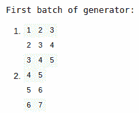

在这里，我们可以看到，在列表的第一个索引处，我们有`lookback`个数据点，而第二个索引包含相应的未来时间步长。


# 请参见

要了解如何利用 LSTMs 获取具有多个季节模式的时间序列数据，请访问[https://arxiv.org/pdf/1909.04293.pdf](https://arxiv.org/pdf/1909.04293.pdf)。


# 实现双向循环神经网络

双向循环神经网络是 RNNs 的扩展，其中输入数据以正常和反向时间顺序馈入两个网络。从两个网络接收的输出在每个时间步骤中使用各种合并模式进行合并，如求和、级联、乘法和求平均值。双向 rnn 主要用于整个语句或文本的上下文依赖于整个序列而不仅仅是线性解释的挑战。由于其长梯度链，双向 rnn 的训练成本很高。

下图是双向 RNN 的图示:

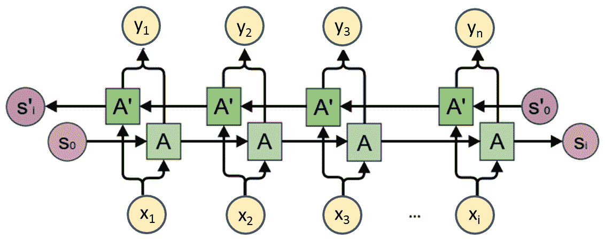

在这个菜谱中，我们将为 IMDb 评论的情感分类实现一个双向 RNN。


# 怎么做...

在本节中，我们将使用 IMDb 评论数据集。其数据准备步骤与使用 RNNs 部分的*情感分类相同。这意味着我们可以直接进入模型构建部分:*

1.  让我们从实例化我们的顺序模型开始:

```
model <- keras_model_sequential()
```

2.  现在，我们添加一些层到我们的模型并打印它的摘要:

```
model %>%
  layer_embedding(input_dim = 2000, output_dim = 128) %>% 
  bidirectional(layer_simple_rnn(units = 32),merge_mode = "concat") %>% 
  layer_dense(units = 1, activation = 'sigmoid')

summary(model)
```

下面的屏幕截图显示了模型的概要:

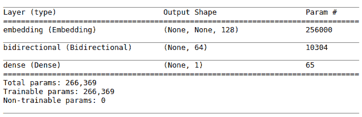

3.  让我们编译和训练我们的模型:

```
# compile model
model %>% compile(
  loss = "binary_crossentropy",
  optimizer = "adam",
  metrics = c("accuracy")
)

# train model
model %>% fit(
  train_x,train_y,
  batch_size = 32,
  epochs = 10,
  validation_split = .2
)
```

4.  让我们评估模型并打印指标:

```
scores <- model %>% evaluate(
  test_x, test_y,
  batch_size = 32
)

cat('Test score:', scores[[1]],'\n')
cat('Test accuracy', scores[[2]])
```

下面的屏幕截图显示了测试数据的性能指标:

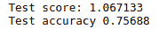

我们在测试数据上获得了 75%的准确率。


# 它是如何工作的...

在建立模型之前，我们需要准备数据。如果想了解更多关于数据预处理部分的内容，可以参考本章的*使用 RNNs 进行情感分类*一节。

在*步骤 1* 中，我们实例化了一个 Keras 序列模型。在*步骤 2* 中，我们向顺序模型添加了层。首先，我们增加了一个嵌入层，降低了输入特征空间的维数。然后，我们在双向包装器中添加了一个简单的 RNN，其中`merge_mode`等于`concat`。合并模式定义了如何组合前向和后向 rnn 的输出。其他模式包括`sum`、`mul`、`ave`和`NULL`。最后，我们添加了一个具有一个隐藏单元的密集层，并使用 sigmoid 作为激活函数。

在*步骤 3* 中，我们用`binary_crossentropy`作为损失函数来编译模型，因为我们正在解决一个二元分类问题。我们为此使用了`adam`优化器。然后，我们在训练数据集上训练我们的模型。在*步骤 4* 中，我们评估了我们的模型的测试准确性，以查看我们的模型在测试数据上的表现。


# 还有更多...

虽然双向 rnn 是一种先进的技术，但使用它们有一些限制。由于双向 rnn 在正方向和负方向上运行，它们非常慢，因为梯度具有很长的依赖链。

此外，双向 rnn 还用于非常特殊的应用，例如填充缺失的单词、机器翻译等等。该算法的另一个主要问题是，由于内存带宽限制的计算，训练起来很有挑战性。