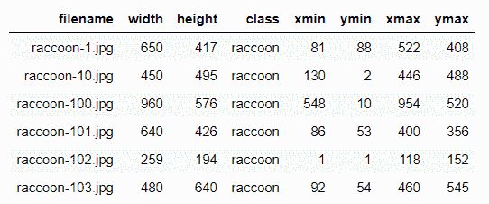
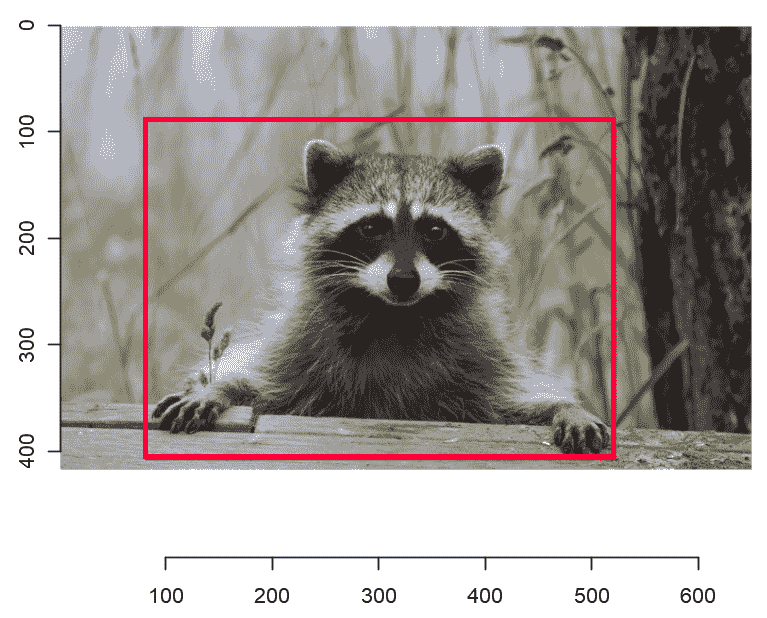
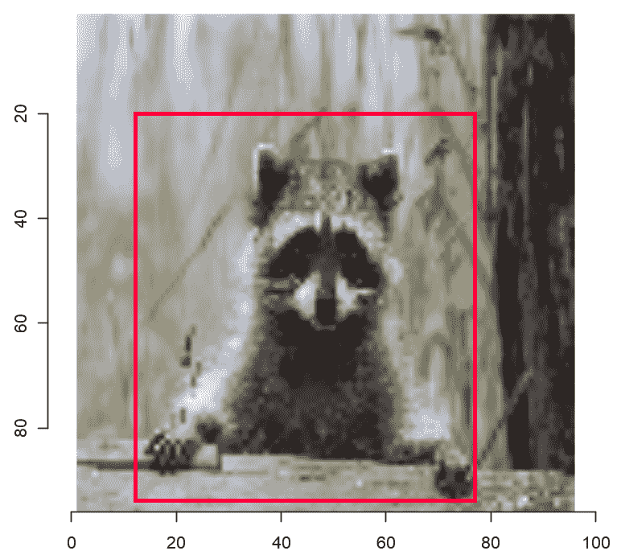
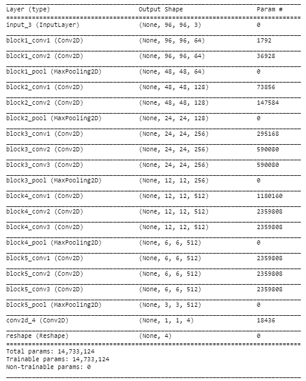
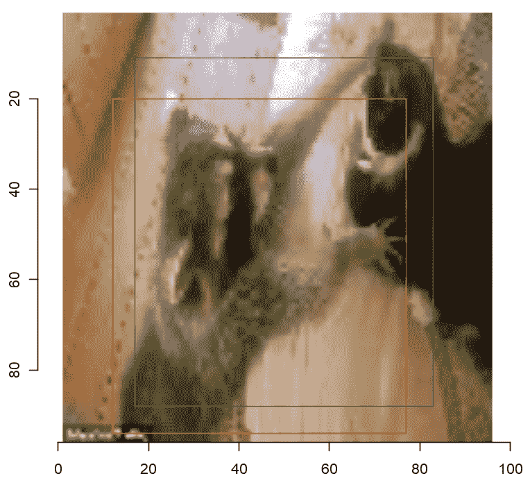
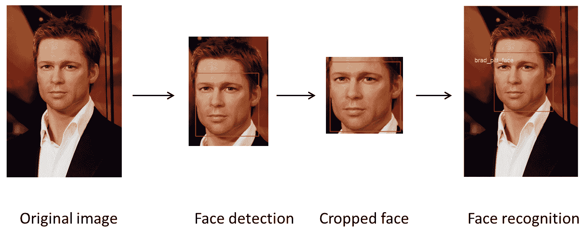
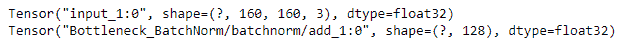
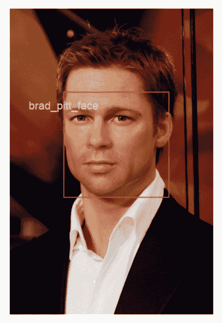
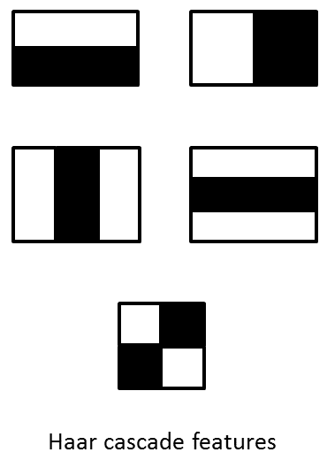

<title>Deep Learning for Computer Vision</title> 

# 计算机视觉的深度学习

计算机视觉是计算机科学的一个令人兴奋的领域，其首要目标是从数字媒体中进行推断。目标是开发能够训练计算机理解数字图像和视频内容并复制人类视觉能力的技术。随着**深度学习** ( **DL** )算法的出现和高性能计算机制的可用性，计算机视觉在各种行业的使用大幅增加，如医疗保健、零售、自动驾驶汽车、机器人、面部识别等。在这一章中，我们将展示 DL 在计算机视觉领域中一些有趣且常用的应用。

在本章中，我们将介绍以下配方:

*   目标定位
*   人脸识别

<title>Object localization</title> 

# 目标定位

物体定位是深度学习的一个广泛应用，在自动驾驶汽车、面部检测、物体跟踪等领域获得了很大的吸引力。定位一个对象是识别图像中感兴趣的区域并用边界框将其封装。在[第 1 章](396cd163-a43b-40d8-9785-69353e862acb.xhtml)、*了解神经网络和深度神经网络*和[第 2 章](94804b8b-6082-4e90-8581-68ccd8f6d749.xhtml)、*使用卷积神经网络、*中，我们进行了图像分类，其中网络的输出是每一类的概率。对于这个问题，我们将使用类似于我们用于图像分类的网络，除了具有不同的目标变量集。

在目标定位中，我们预测表示感兴趣的目标在整个输入图像中的位置的输出变量。使用这些，我们在图像上绘制边界框。当目标定位伴随着目标分类时，该技术通常被称为**目标**识别**目标**。在这个菜谱中，我们将遵循一个简单的通用方法来定位图像中的单个对象类别。

<title>Getting ready</title> 

# 做好准备

在这个食谱中，我们将使用`raccoon_dataset`，它包含 217 个不同宽度和高度的图像。这个数据集归功于 Dat Tran，可以从他的 GitHub 库下载:[https://github.com/datitran/raccoon_dataset](https://github.com/datitran/raccoon_dataset)。

我们从前面提到的 GitHub 库的`images`文件夹中下载了所有的图像，并将它们复制到`chapter8 - Deep learning for computer vision/data/raccoon_dataset/images`路径中。我们还从前面的 GitHub 库的`data`文件夹中下载了`raccoon_labels.csv`文件，并将其复制到`chapter8 - Deep learning for computer vision/data/raccoon_dataset`。`raccoon_labels.csv`文件包含每个图像中包围浣熊的边界框的坐标。

在这个食谱中，我们将建立一个单一的目标定位模型；也就是说，我们将在整个图像中只定位一个感兴趣的区域。让我们确保已经加载了所有必需的库:

```
library(keras)
library(imager)
library(graphics)
```

让我们加载数据，看看它是什么样子:

```
labels <- read.csv('data/raccoon_dataset/raccoon_labels.csv')
# Displaying first 5 rows of data
head(labels)
```

下面的屏幕截图显示了数据中的一些记录:



使用下面的代码，我们可以绘制一个示例图像，并根据给定的坐标绘制一个边界框:

```
# Load image
im <- load.image('data/raccoon_dataset/images/raccoon-1.jpg')
# Image information
im_info = labels[labels$filename == 'raccoon-1.jpg' ,]
print(im_info)
plot(im)
rect(xleft = im_info$xmin ,ybottom = im_info$ymin,xright = im_info$xmax,ytop = im_info$ymax,border = "red",lwd = 1)
```

以下屏幕截图是输入数据的一个示例:



前面截图中的边界框显示了感兴趣的区域。

<title>How to do it...</title> 

# 怎么做...

让我们预处理浣熊数据集并构建一个对象定位模型:

1.  我们的数据集包含不同大小的图像。让我们固定图像的宽度和高度，并初始化一些其他参数:

```
image_channels = 3
batch_size = 15
image_width_resized = 96
image_height_resized = 96
model_name = "raccoon_1_"
```

2.  现在，我们根据新的图像尺寸重新调整边界框的坐标:

```
labels$x_min_resized = (labels[,'xmin']/(labels[,'width']) * image_width_resized)%>% round()
labels$y_min_resized = (labels[,'ymin']/(labels[,'height']) * image_height_resized)%>% round()
labels$x_max_resized = (labels[,'xmax']/(labels[,'width']) * image_width_resized)%>% round()
labels$y_max_resized = (labels[,'ymax']/(labels[,'height']) * image_height_resized)%>% round()
```

让我们显示我们之前在该配方的*准备好*部分绘制的同一示例的调整后版本:

```
x <-labels[labels$filename == 'raccoon-1.jpg',]
im_resized <- resize(im = im,size_x = image_width_resized,size_y = image_height_resized)
plot(im_resized)
rect(xleft = x$x_min_resized,ybottom = x$y_min_resized,xright = x$x_max_resized ,ytop = x$y_max_resized,border = "red",lwd = 1)
```

下面的屏幕截图显示了我们在该配方的*准备好*部分绘制的相同样本图像的调整版本:



3.  现在，我们将数据分为训练、验证和测试数据集:

```
X_train <- labels[1:150,]
X_val <- labels[151:200,]
X_test <- labels[201:nrow(labels),]
```

4.  让我们定义一个函数来计算我们模型的定制度量——**交集超过并集** ( **IoU** )。这是两个边界框的交集与并集的比率，一个是实际边界框，另一个是预测边界框:

```
metric_iou <- function(y_true, y_pred) {

 intersection_x_min_resized <- k_maximum(y_true[ ,1], y_pred[ ,1])
 intersection_y_min_resized <- k_maximum(y_true[ ,2], y_pred[,2])
 intersection_x_max_resized <- k_minimum(y_true[ ,3], y_pred[ ,3])
 intersection_y_max_resized <- k_minimum(y_true[ ,4], y_pred[ ,4])

 area_intersection <- (intersection_x_max_resized - intersection_x_min_resized) * 
 (intersection_y_max_resized - intersection_x_max_resized)
 area_y <- (y_true[ ,3] - y_true[ ,1]) * (y_true[ ,4] - y_true[ ,2])
 area_yhat <- (y_pred[ ,3] - y_pred[ ,1]) * (y_pred[ ,4] - y_pred[ ,2])
 area_union <- area_y + area_yhat - area_intersection

 iou <- area_intersection/area_union
 k_mean(iou)
# c(area_y,area_yhat,area_intersection,area_union,iou)
}
```

5.  接下来，我们定义模型并编译它。让我们用`imagenet`权重实例化一个 VGG16 模型。我们将使用它作为模型的特征提取器:

```
feature_extractor <- application_vgg16(include_top = FALSE,
 weights = "imagenet",
 input_shape = c(image_width_resized, image_height_resized,image_channels)
)

```

现在，我们向 VGG16 添加一些层并构建模型:

```
output <- feature_extractor$output %>%
layer_conv_2d(filters = 4,kernel_size = 3) %>%
layer_reshape(c(4))

model <- keras_model(inputs = feature_extractor$input, outputs = output)
```

让我们来看看模型的总结:

```
summary(model)
```

下面的截图显示了模型的描述:



让我们冻结神经网络的特征提取器部分。我们将仅对模型的最后一层进行微调:

```
freeze_weights(feature_extractor)
```

现在，我们通过使用`adam`作为优化器、`mse`作为损失函数、以及`metric_iou`(我们在*步骤* *3* 中定义的)作为定制度量来编译模型:

```
 model %>% compile(
 optimizer = "adam",
 loss = "mae",
 metrics = list(custom_metric("iou", metric_iou))
)

```

6.  现在，我们创建一个定制的生成器函数，以便在训练过程中实时获取成批的图像数据和相应的调整大小的边界框坐标:

```
localization_generator <- function(data,target_height,target_width,batch_size) {

 function(){
 indexes <- sample(1:nrow(data), batch_size, replace = TRUE)
 y <- array(0, dim = c(length(indexes), 4))
 x <- array(0, dim = c(length(indexes), target_height, target_width, 3))
 for (j in 1:length(indexes)){
 im_name = data[indexes[j],"filename"] %>% as.character()
 im = load.image(file =paste0('data/raccoon_dataset/images/',im_name,sep = ""))
 im = resize(im = im,size_x = target_width,size_y = target_height)
 im = im[,,,]
 x[j,,,] <- as.array(im)
 y[j, ] <- data[indexes[j], c("x_min_resized","y_min_resized","x_max_resized","y_max_resized")] %>% as.matrix()
 }
 list(x, y)
 }
 }

```

现在，我们通过使用在前面的代码块中创建的`localization_generator()`函数为训练数据创建一个生成器:

```
train_generator = localization_generator(data = X_train,target_height = image_height_resized,target_width =image_width_resized,batch_size = batch_size )
```

我们还以类似的方式为验证数据创建了一个生成器:

```
validation_generator = localization_generator(data = X_val,target_height = image_height_resized,target_width =image_width_resized,batch_size = batch_size  )
```

7.  接下来，我们开始训练模型。我们指定要运行培训流程的时期数:

```
epoch = 100
```

然后，我们创建一些检查点，以便我们可以在特定的时间间隔保存训练过程的状态:

```
checkpoint_dir <- "checkpoints_raccoon"
dir.create(checkpoint_dir)
filepath <- file.path(checkpoint_dir, paste0(model_name,"weights.{epoch:02d}-{val_loss:.2f}-val_iou{val_iou:.2f}-iou{iou:.2f}.hdf5",sep=""))
```

我们将在训练期间使用回调来查看模型的内部状态和统计数据。为了确保我们的模型不会过度适应训练数据，我们还使用了 EarlyStopping:

```
cp_callback <- list(callback_model_checkpoint(mode = "auto"
 filepath = filepath,
 save_best_only = TRUE,
 verbose = 1),
 callback_early_stopping(patience = 100))
```

现在，我们将训练数据拟合到模型中，并开始训练过程:

```
model %>% fit_generator(
 train_generator,
 validation_data = validation_generator,
 epochs = epoch,
 steps_per_epoch = nrow(X_train) / batch_size,
 validation_steps = nrow(X_val) / batch_size,
 callbacks = cp_callback
)
```

让我们保存最终的模型:

```
model %>% save_model_hdf5(paste0(model_name,"obj_dect_raccoon.h5",sep=""))
```

8.  现在，我们对样本测试图像进行类似的数据处理，就像我们对训练数据图像所做的那样。然后，我们预测包围盒坐标。
    首先，我们加载一个样本测试图像:

```
test <- X_test[1,]
test_img <- load.image(paste(file = 'data/raccoon_dataset/images/',test$filename,sep = ""))
```

然后，我们调整样本测试图像的大小:

```
test_img_resized <- resize(test_img,size_x = image_width_resized,size_y = image_width_resized)
test_img_resized_mat = test_img_resized[,,,]
```

接下来，我们将调整后的图像转换成一个数组:

```
test_img_resized_mat <- as.array(test_img_resized_mat)
```

然后，我们将数组调整到所需的尺寸:

```
test_img_resized_mat <- array_reshape(test_img_resized_mat,dim = c(1,image_width_resized,image_width_resized,image_channels))
```

这里，我们预测测试样本的边界框的坐标:

```
predicted_cord <- model %>% predict(test_img_resized_mat)
predicted_cord = abs(ceiling(predicted_cord))
predicted_cord
```

接下来，我们绘制具有实际边界框和预测边界框的测试图像:

```
plot(test_img_resized)
rect(xleft = x$x_min_resized,ybottom = x$y_min_resized,xright = x$x_max_resized ,ytop = x$y_max_resized,border = "red",lwd = 1)
rect(xleft = predicted_cord[1] ,ybottom = predicted_cord[2] ,xright = predicted_cord[3] + predicted_cord[1] ,ytop = predicted_cord[4] ,border = "green",lwd = 1)
```

以下屏幕截图显示了实际(深灰色)和预测(浅灰色)边界框:



通过训练 100 个时期的模型，我们实现了 0.10 的 IOU。

<title>How it works...</title> 

# 它是如何工作的...

在*步骤* *1* 中，我们初始化了一些将在接下来的步骤中使用的参数。我们所有的输入图像都有不同的大小，在输入模型之前需要统一调整大小。
在下一步中，我们根据新的尺寸重新调整边界框的坐标。然后，我们绘制了一个样本图像来显示调整后的图像。在*步骤* *3* 中，我们根据索引将数据分为训练、验证和测试数据集。在*步骤 4* 中，我们定义了一个定制的度量标准，称为 union 的**交集，以评估我们模型的拟合优度。度量函数类似于损失函数，但是在训练模型时不使用评估度量的结果。该度量在模型编译期间传递，需要`y_true`和`y_pred`作为参数，并返回单个张量值。IoU 是一种常用的度量标准，用于测量计算机视觉问题中对象定位模型的性能。它允许我们评估我们的预测边界框与地面真实边界框的接近程度，并被计算为两个框之间的重叠面积与两个框的组合面积之比。如果预测的和实际的边界框完全重叠，那么 IoU 将是 1，因为交集的面积将等于并集的面积。按照惯例，大于 0.5 的 IoU 值被视为表现良好。**

在下一步中，我们配置并编译我们的模型。我们利用了 VGG16 模型，这是一个预训练的模型，在 ImageNet 数据集上达到了 92.7%(前五名)的测试准确率。这种方法在深度学习中很普遍，被称为迁移学习。在这种方法中，已经为一个任务训练的模型被重用为另一个模型的起点。这种技术也克服了手头问题的数据可用性的限制。

请注意，对于 VGG 模型，输入形状应该正好有三个输入通道，宽度和高度应该不小于 32。

在预训练网络的末尾，我们根据我们对模型的预期输出，放置了自定义层。因为我们在做回归来预测图像的边界框坐标，所以我们使用单位等于 4 的密集层作为最后一层。然后，我们使用`adam` 作为优化器，使用`mse`(平均绝对误差)作为损失函数来编译这个模型。在编译过程中，我们还指定了一个定制的度量标准`metric_iou`。

在*步骤* *6* 中，我们创建了一个定制的生成器函数`localization_generator()`，来获得批量调整后的图像数据和相应的缩放后的边界框坐标。我们使用这个函数为训练和验证数据创建生成器。`localization_generator()`函数将数据、图像的目标高度和宽度以及批处理大小作为参数。

在下一步中，我们定义了模型训练的参数。在训练模型时，我们还创建了检查点并指定了回调。检查点包含我们保存当前状态所需的所有信息，以便我们可以从该点恢复训练。**检查点**是一种容错机制，用于运行时间过长的进程，并允许我们在出现故障时捕获系统状态。如果我们在训练模型时遇到任何问题或失败，检查点允许我们通过保存特定状态下的模型权重，从我们离开的状态继续返回。我们使用回调来定义在哪里检查模型权重。回调用于定义一组需要在训练过程的给定阶段应用的函数。我们使用早期停止，以便一旦模型在验证数据集上的性能提高，就停止训练。一旦我们指定了模型的所有配置细节，我们就将训练数据与模型相匹配，并将模型的结果保存在一个变量中。

一旦我们训练了模型，在最后一步中，我们预测了预处理后的样本测试图像的边界框坐标。

<title>There's more...</title> 

# 还有更多...

在这个菜谱中，我们展示了一种通用的对象定位方法。然而，可以利用许多其他技术在图像中进行鲁棒的对象定位和分类，同时减少计算时间和成本。这些技术可用于定位和分类一幅图像中的多个对象。其中一些技术如下:

*   **区域卷积神经网络** ( **RCNN** ): 该技术使用选择性搜索算法为每个输入图像生成大约 2000 个区域，并将这些区域转换为固定大小。然后，每个区域被输入 CNN，作为特征提取器。提取的特征被提供给 SVM，其通常是 CNN 网络的最后一层，用于对特定区域中是否存在物体进行分类，并且还确定物体的类别。在区域中找到对象后，RCNN 的下一步是使用线性回归模型来预测在该特定区域中检测到的对象的边界框的坐标。RCNN 的一个重大挑战是它非常慢并且计算量很大，因为每个区域被单独传递给 CNN 网络。

*   **快速 RCNN:** 与 RCNN 不同，在这种技术中，我们将整个图像传递到几个卷积和池层以产生特征图，而不是传递在原始图像之上生成的多个区域。然后，通过使用区域提议方法，我们生成**感兴趣区域** ( **感兴趣区域**)。对于每个区域，ROI 池层用于从特征图中提取固定长度的特征向量。ROI max-pooling 将 h × w ROI 窗口划分为一个 h × w 子窗口网格，每个子窗口的大小大约为 h/H × w/W。然后，我们将 max-pooling 应用于每个子窗口。然后，通过预测每个输出类的 softmax 概率和边界框的坐标，将这些特征向量传递给用于对象分类的完全连接的层。

*   **更快的 RCNN:** 与 RCNN 和快速 RCNN 相比，更快的 RCNN 花费的计算时间最少。在更快的 RCNNs 中，使用单个神经网络一次性检测到对象。快速 RCNN 不使用选择搜索算法，而是使用一个**区域提议网络** ( **RPN** )从特征图中生成区域提议。rpn 对区域框(也称为锚点)进行排序，并提出极有可能包含对象的区域。该过程的其余部分，即检测对象的类别和预测每个对象的边界框，与快速 RCNNs 的相同。

<title>See also</title> 

# 请参见

*   用于图像分割、分类和检测的深度学习:[https://arxiv.org/ftp/arxiv/papers/1605/1605.09612.pdf](https://arxiv.org/ftp/arxiv/papers/1605/1605.09612.pdf)
*   基于回归的物体检测技术(https://pjreddie.com/media/files/papers/yolo.pdf YOLO):

<title>Face recognition</title> 

# 人脸识别

人脸识别是计算机视觉最具创新性的应用之一，近年来已经取得了许多突破。现实世界中有太多利用面部检测和识别的应用，例如脸书，它被用于图像标记。有许多方法来进行面部检测，例如通过使用 Haar cascade、**直方图** **定向梯度** ( **HOG** )和基于 CNN 的算法。人脸识别是两个基本步骤的融合:第一个是人脸检测，即在图像中定位人脸，另一个是识别人脸。

在这个食谱中，我们将使用 R 中的`image.libfacedetection`包，它为人脸检测提供了基于卷积神经网络的实现，然后为人脸识别构建一个分类器/识别器。安装包的步骤可以在[https://github.com/bnosac/image](https://github.com/bnosac/image)找到。对于人脸识别，我们将使用一个被称为 **FaceNet** 的预训练模型，这是一个由谷歌在 2015 年开发的人脸识别系统。FaceNet 能够从人脸中提取高质量的特征，也称为人脸嵌入，反过来可以用于训练任何人脸识别系统。在这个食谱中，我们将使用 Hiroki Taniai 提供的预先训练好的 Keras FaceNet 模型。

下面的截图显示了在这个菜谱中实现的人脸识别系统的中间步骤。首先，我们检测图像中的人脸。使用检测到的人脸坐标，我们在人脸周围绘制一个边界框。盒子内部的区域被传递给识别算法。识别模型识别个性，然后我们在给定的图像中标记人脸。请注意，识别模型是在裁剪的人脸上训练的，如下面的屏幕截图所示:



图片来源- Pixabay

让我们开始建立一个深度学习模型，这样我们就可以识别名人的脸。

<title>Getting ready</title> 

# 做好准备

在这个应用程序中，我们将构建一个自定义的人脸识别系统来识别三位名人:布拉德·皮特、摩根·弗里曼和杰森·斯坦森。我们使用了 Google image 搜索结果中每个人物的一些单独图像来训练我们的模型。

让我们从导入所需的库开始:

```
library(magick)
library(image.libfacedetection)
library(keras)
```

在下一节中，我们将进行所需的数据操作，以便构建一个利用 FaceNet 的分类器。

<title>How to do it...</title> 

# 怎么做...

我们的数据集包含不同大小的图像。现在，我们将预处理我们的数据并构建面部识别模型:

1.  让我们加载一个样本输入图像并调整它的大小:

```
width_resized = 500
height_resized = 500
test_img = image_read("data/face_recognition/brad_pitt/brad_pitt_21.jpg")
test_img <- image_scale(test_img,paste0(width_resized,"x",height_resized,sep =""))
```

2.  现在，我们可以使用`image_detect_faces()`函数定位图像中的人脸:

```
faces <- image_detect_faces(test_img)
```

让我们打印并保存面部区域的属性:

```
faces$detections[,1:4]
face_width = faces$detections$width
face_height = faces$detections$height 
face_x = faces$detections$x
face_y = faces$detections$y
```

3.  现在我们已经在图像中定位了人脸，我们可以围绕它画一个边界框:

```
test_img <- image_draw(test_img)
rect(xleft = face_x,ybottom = face_y,xright = face_x+ face_width,ytop = face_y+ face_height,lwd = 2,border = "red")
dev.off()
plot(test_img)
```

4.  现在，让我们为分类器准备训练数据。这将识别给定图像中的人脸。我们调整图片的大小，然后定位其中的每一张脸。之后，我们从图像中裁剪出人脸，并将它们存储在一个名为`faces`的文件夹中，该文件夹以每个名人的名字命名:

```
# Path to input mages
fold = list.dirs('data/face_recognition',full.names = FALSE, recursive = FALSE)
fold = grep(paste0("face", collapse = "|"), fold, invert = TRUE, value = TRUE)
# Create training data path
train_data_dir = "data/face_recognition/faces/"
dir.create(train_data_dir)
# Generating training images.
for (i in fold){
    files = list.files(path = paste0("data/face_recognition/",i),full.names = FALSE)
   for (face_file in files){
        img = image_read(paste0("data/face_recognition/",i,"/",face_file,sep= ""))
        img <- image_scale(img,paste0(width_resized,"x",height_resized,sep =""))
        # Detecting face
        faces <- image_detect_faces(img)
        face_width = faces$detections$width
        face_height = faces$detections$height
        face_x = faces$detections$x
        face_y = faces$detections$y
        face_dim= paste0(face_width,"x",face_height,"+",face_x,"+",face_y)
        face_cropped = image_crop(img,face_dim)
        face_cropped = image_crop(img,face_dim)
        if(nchar(face_dim)<= 3){
            print(paste("empty face in:",face_file))
            print(face_file)
        }else{
            fold_name = paste0(train_data_dir,"/",i,"_face")
            dir.create(fold_name)
            image_write(face_cropped,paste0(fold_name,"/",face_file))

        }

    }
} 
```

5.  裁剪的面部图像具有不同的尺寸。让我们设置这些训练图像的大小并构建一个生成器:

```
# path of training images
train_path = "data/face_recognition/faces/"
# setting image width height, width and channels 
img_size = c(160,160)
img_channels = 3
# class labels
class_label = list.dirs('data/face_recognition/faces', full.names = FALSE, recursive = TRUE)[-1]
# Data generator with image augmentation
train_data_generator <- image_data_generator(
                            rotation_range = 10,shear_range = .2,rescale = 1/255,
                            width_shift_range = 0.1,
                            height_shift_range = 0.1,
                            fill_mode = "nearest")
train_data <- flow_images_from_directory(
                  directory = train_path,shuffle = T,
                  generator = train_data_generator,
                  target_size = img_size,
                  color_mode = "rgb",
                  class_mode = "categorical",
                  classes = class_label,
                  batch_size = 10)
```

接下来，我们加载 FaceNet 模型。可以从[https://drive . Google . com/drive/folders/1 pwq 3 H4 aj 8 a 6 yyjhzktwjcl 4 wywqb7 bn](https://drive.google.com/drive/folders/1pwQ3H4aJ8a6yyJHZkTwtjcL4wYWQb7bn)下载:

下面的屏幕截图显示了 FaceNet 的输入和输出层的配置:

6.  

```
facenet <- load_model_hdf5("facenet_keras.h5")
print(facenet$input)
print(facenet$output)
```

在前面的屏幕截图中，我们可以看到 FaceNet 模型期望大小为 160×160 的正方形彩色图像作为输入，并产生 128 个元素的输出张量。

现在，让我们建立我们的人脸识别模型:

由于我们将在模型中使用预先实现的 ImageNet 权重，因此让我们冻结其权重:

7.  定义模型后，我们对其进行编译和训练:

```
facenet_out <- facenet$output %>%
layer_dense(units = 128,activation = "relu") %>%
layer_dense(units = 3,activation = "softmax")
facenet_model <- keras_model(inputs = facenet$input, outputs = facenet_out)
```

现在，我们开始识别样本图像中的人脸:

```
freeze_weights(facenet)
```

8.  在下面的截图中，我们可以看到我们的模型认出了布拉德·皮特:

```
facenet_model %>% compile(optimizer = 'rmsprop', loss = 'categorical_crossentropy',metrics = c('accuracy'))

facenet_model %>% fit_generator(generator = train_data,steps_per_epoch = 2,
 epochs = 5)
```

9.  

```
# image path
test_img = image_read("data/face_recognition/brad_pitt/brad_pitt_21.jpg")
# scaling input image
test_img <- image_scale(test_img,paste0(width_resized,"x",height_resized,sep =""))
# detecting faces in the image
faces <- image_detect_faces(test_img)

# extracting attribute of the detected face
face_width = faces$detections$width
face_height = faces$detections$height
face_x = faces$detections$x
face_y = faces$detections$y

# cropping detected face
face_dim= paste0(face_width,"x",face_height,"+",face_x,"+",face_y)
face_cropped = image_crop(test_img,face_dim)

# resizing cropped face
face_cropped = image_resize(image = face_cropped,paste0(img_size[1],"x",img_size[2]))

# converting  cropped face image to array
face_cropped_arr <- as.integer(face_cropped[[1]])/255
face_cropped_arr <- array_reshape(face_cropped_arr,dim = c(1,img_size,img_channels))

# Recognizing face
pred <- facenet_model %>% predict(face_cropped_arr)
pred_class <- class_label[which.max(pred)]

# Drawing bounding box around the face and putting name to the face
test_img <- image_draw(test_img)
rect(xleft = face_x,ybottom = face_y,xright = face_x+ face_width,ytop = face_y+ face_height,lwd = 2,border = "red")
text(face_x,face_y,pred_class,offset = 1,pos = 2,cex = 1.5,col = "pink")
dev.off()
plot(test_img)
```

图片来源- Pixabay

你也可以用布拉德·皮特和摩根·弗里曼的其他照片来测试这个模型。通过向训练数据中添加新的人脸，您可以进一步扩展该模型识别人脸的能力。

它是如何工作的...

在*步骤 1* 中，我们加载了一个样本图像，并将其高度和宽度分别调整为`height_resized`和`width_resized`。在*步骤 2* 中，我们通过使用`image.libfacedetection`库中的`image_detect_faces()`函数在图像中定位一张人脸。它返回检测到的面的左侧 x，y 坐标及其宽度和高度。然后，在*步骤 3* 中，我们在脸部周围画了一个边界框。`rect()`函数使用像素坐标在图像上绘制一个矩形。在前三个步骤中，我们实现了图像中的人脸定位。在*步骤 4* 中，我们利用这种人脸定位技术来准备数据集，我们将使用该数据集来训练我们的人脸识别器/分类器模型。

<title>How it works...</title> 

# 在*步骤 5* 中，我们构建了一个带有数据扩充的生成器。在第 6 步中，我们加载了 FaceNet 模型并检查了它的输入和输出层。在*步骤 7* 中，我们建立了我们的人脸识别模型。我们添加了 128 个单位的密集层。最后一层由三个具有 softmax 激活功能的单元组成。模型的最后一层有三个单元，因为我们有三个类标签。我们定义了模型的损失函数和 IOU 度量，然后对其进行编译和训练。在*步骤 8* 中，我们在样本图像上测试了我们的人脸识别系统。

还有更多...

我们在*中讨论了基于区域的物体检测技术，还有更多...前一个配方的*部分，本章的*对象定位*。然而，许多技术被广泛用于人脸定位。

<title>There's more...</title> 

# 让我们看看这些技术是如何工作的:

**猪**和 **SVM** :它们被用作图像检测的描述符，并与不同的照明背景和姿势变化无缝工作。在这种技术中，图像被分成 8×8 个单元，然后在像素上获得局部强度梯度的大小和方向的分布。梯度负变化大的像素为黑色，正变化大的像素为白色，变化小或无变化的像素为灰色。每个像元被划分为对应于梯度方向的角度箱(对于无符号梯度为 0 - 180 度，对于有符号梯度为 0 - 360 度)，从而将大小为 64(8×8)的向量压缩为仅 9 个与相应箱相关联的值(在 0-180 度的情况下)。HOG 使用滑动窗口计算图像中每个单元的 HOG 描述符，并通过图像金字塔处理缩放问题。这些 HOG 特征，结合 SVM 分类器，然后用于人脸识别。

**Haar 级联分类器** : Haar 级联分类器在检测图像中某一特定类型的对象时工作得非常好，比如图像中的人脸、图像中的眼睛等等。然而，它们可以并行用于检测面部、眼睛和嘴巴。该算法在许多正图像(包含人脸的图像)和负图像(不包含人脸的图像)上进行训练，然后在给定的基本窗口大小(在 Viola-Jones 算法的情况下为 24×24)上从这些图像中提取特征。Haar 特征类似于卷积核，因为它们检测给定图像中特定特征的存在，并且每个特征代表人脸的一部分。每个特征结果用于通过从黑色矩形下的像素总和中减去白色矩形下的像素总和来计算值。在这个过程中，有数以千计的特征被计算；然而，并不是所有的都可以用于人脸检测。

*   一种新的图像表示方法，称为积分图像，用于减少这种数量的特征。然后使用 AdaBoost 算法去除冗余特征，只选择相关的特征。然后，使用所有这些特征的加权组合来决定给定的窗口是否有人脸。不是使用所有选择的特征在图像上滑动，而是使用级联的思想，其中所有相关的特征以线性方式被采样到不同的级联中。如果级联 *i* 能够检测到窗口中的人脸，那么图像被传递给下一个级联，*I+1*；否则，它将被丢弃。级联分类器减少了大量的计算复杂度和时间。通过这种方法，我们可以在上面使用任何监督学习技术，并为面部识别进行训练。

*   以下截图显示了一些 Haar cascade 功能:



**最大检测裕度** ( **MMOD** ):使用非最大抑制技术，有时重叠窗口会被拒绝，导致虚警。最大检测裕度通过用一个新的目标函数代替这种技术来工作。与其他分类器不同，MMOD 不执行任何子采样；相反，它优化了图像的整个子窗口。在这种技术中，采用最大裕度方法，该方法要求以大的裕度正确预测每个训练样本的标签。

请参见

*   要了解更多关于 FaceNet 模型的信息，请访问 https://arxiv.org/pdf/1503.03832.pdf。

<title>See also</title> 

# 要了解更多关于 MMOD 的信息，请前往 https://arxiv.org/pdf/1502.00046.pdf。

*   To find out more about the FaceNet model, go to [https://arxiv.org/pdf/1503.03832.pdf](https://arxiv.org/pdf/1503.03832.pdf).
*   To find out more about MMOD, go to [https://arxiv.org/pdf/1502.00046.pdf](https://arxiv.org/pdf/1502.00046.pdf).