# 第二章。用前馈网络对手写数字进行分类

第一章介绍了作为计算引擎的 ano，及其不同的功能和特性。有了这些知识，我们将通过一个例子，介绍深度学习的一些主要概念，建立三个神经网络，并在手写数字分类的问题上训练它们。

深度学习是机器学习的一个领域，其中多层模块堆叠在彼此之上:本章介绍了一个简单的单线层模型，然后在其上添加第二层，以创建一个**多层感知器** ( **MLP** )，最后使用多个卷积层创建一个**卷积神经网络** ( **CNN** )。

与此同时，本章为那些不熟悉数据科学的人概述了基本的机器学习概念，如过度拟合、验证和损失分析:

*   小图像分类
*   手写数字识别挑战
*   构建神经网络的层设计
*   经典目标/损失函数的设计
*   随机梯度下降的反向传播
*   通过验证对数据集进行训练
*   卷积神经网络
*   数字分类的最新成果


# MNIST 数据集

**改进的国家标准与技术研究所** ( **MNIST** ) **数据集**是一个非常知名的手写数字数据集{0，1，2，3，4，5，6，7，8，9}用于训练和测试分类模型。

分类模型是在给定输入的情况下预测观察一个类别的概率的模型。

训练的任务是*学习*参数以使模型尽可能地适合数据，以便对于任何输入图像，预测正确的标签。对于此训练任务，MNIST 数据集包含 60，000 幅图像，每个示例都有一个目标标签(0 到 9 之间的数字)。

为了验证训练是有效的并决定何时停止训练，我们通常将训练数据集分成两个数据集:80%到 90%的图像用于训练，而剩余的 10-20%的图像不会呈现给算法用于训练，而是验证模型在未观察到的数据上概括得很好。

有一个单独的数据集，该算法在训练期间永远不会看到，称为测试集，它由 MNIST 数据集中的 10，000 幅图像组成。

在 MNIST 数据集中，每个示例的输入数据都是一幅 28x28 的归一化单色图像和一个标注，对于每个示例，标注都表示为一个介于 0 和 9 之间的简单整数。让我们展示其中的一些:

1.  首先，下载一个预先打包好的数据集版本，以便于从 Python 加载:

    ```
     wget http://www.iro.umontreal.ca/~lisa/deep/data/mnist/mnist.pkl.gz -P /sharedfiles
    ```

2.  Then load the data into a Python session:

    ```
    import pickle, gzip
    with gzip.open("/sharedfiles/mnist.pkl.gz", 'rb') as f:
       train_set, valid_set, test_set = pickle.load(f)
    ```

    对于`Python3`，由于它被序列化的方式，我们需要`pickle.load(f, encoding='latin1')`。

    ```
    train_set[0].shape
    *(50000, 784)*

    train_set[1].shape
    *(50000,)*

    import matplotlib

    import numpy 

    import matplotlib.pyplot as plt

    plt.rcParams['figure.figsize'] = (10, 10)

    plt.rcParams['image.cmap'] = 'gray'

    for i in range(9):
        plt.subplot(1,10,i+1)
        plt.imshow(train_set[0][i].reshape(28,28))
        plt.axis('off')
        plt.title(str(train_set[1][i]))

    plt.show()
    ```

数据集的前九个样本显示在它们的顶部，并带有相应的标签(*基本事实*，即分类算法所期望的正确答案):

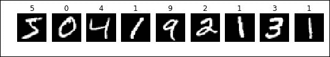

为了避免向 GPU 传输太多数据，并且因为完整的数据集足够小，可以放在 GPU 的内存中，我们通常将完整的训练集放在共享变量中:

```
import theano
train_set_x = theano.shared(numpy.asarray(train_set[0], dtype=theano.config.floatX))
train_set_y = theano.shared(numpy.asarray(train_set[1], dtype='int32'))
```

避免这些数据传输使我们能够在 GPU 上更快地训练，尽管最近的 GPU 和快速 PCIe 连接。

关于数据集的更多信息可在[http://yann.lecun.com/exdb/mnist/](http://yann.lecun.com/exdb/mnist/)获得。


# 培训计划的结构

培训计划的结构通常由以下步骤组成:

1.  **设置脚本环境**:包导入、GPU 使用等。
2.  **Load data** :数据 loader 类，用于在训练过程中访问数据，通常以随机的顺序进行，以避免同一个类有太多相似的例子，但有时也会以精确的顺序进行，例如，先简单后复杂的课程学习。
3.  **数据预处理**:一组变换，如交换图像尺寸、添加模糊或噪声。添加一些数据增强转换是非常常见的，例如随机裁剪、缩放、亮度或对比度抖动，以获得比原始示例更多的示例，并降低数据过度拟合的风险。如果模型中自由参数的数量对于训练数据集的大小来说太重要，则模型可以从可用的示例中学习。此外，如果数据集太小，并且对相同的数据执行了太多迭代，则模型可能会变得过于特定于训练示例，而不能很好地概括新的未见过的示例。
4.  **建立模型**:用持久变量(共享变量)中的参数定义模型结构，以便在训练期间更新它们的值，从而适应训练数据
5.  **Train**: There are different algorithms either training on the full dataset as a whole or training on each example step by step. The best convergence is usually achieved by training on a batch, a small subset of examples grouped together, from a few tens to a few hundreds.

    使用批处理的另一个原因是为了提高 GPU 的训练速度，因为单个数据传输的成本很高，而且 GPU 内存也不足以容纳完整的数据集。GPU 是一种并行架构，因此在某种程度上，处理一批示例通常比逐个处理示例更快。在一定程度上，同时看到更多的例子会加速收敛(在墙时间内)。即使 GPU 内存足够容纳整个数据集，也是如此:批处理大小的收益递减通常会使较小的批处理比整个数据集更快。注意，这对于现代的 CPU 也是正确的，但是最佳的批量大小通常更小。

    ### 注意

    一次迭代定义一个批次的训练。一个历元是算法查看完整数据集所需的迭代次数。

6.  During training, after a certain number of iterations, there is usually a **validation** using a split of the training data or a validation dataset that has not been used for learning. The loss is computed on this validation set. Though the algorithm has the objective to reduce the loss given the training data, it does not ensure generalization with unseen data. Validation data is unseen data used to estimate the generalization performance. A lack of generalization might occur when the training data is not representative, or is an exception and has not been sampled correctly, or if the model overfits the training data.

    验证数据验证一切正常，并在验证损失不再减少时停止训练，即使训练损失可能继续减少:进一步训练不再值得，并导致过度拟合。

7.  **Saving model parameters** and displaying results, such as best training/validation loss values, train loss curves for convergence analysis.

    在分类的情况下，我们计算训练期间的准确度(正确分类的百分比)或误差(错误分类的百分比)，以及损失。在训练结束时，混淆矩阵有助于评估分类器的质量。

    让我们看看实践中的这些步骤，并在 Python shell 会话中启动一个 Theano 会话:

    ```
    from theano import theano
    import theano.tensor as T
    ```


# 分类损失函数

损失函数是在训练期间最小化以获得最佳模型的目标函数。存在许多不同的损失函数。

在分类问题中，目标是预测 k 个类别中的正确类别，通常使用交叉熵，因为它测量每个类别的真实概率分布 *q* 和预测的概率分布 *p* 之间的差异:

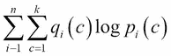

这里， *i* 是样本在数据集中的索引， *n* 是样本在数据集中的个数， *k* 是类的个数。

虽然每个类别的真实概率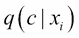是未知的，但在实践中可以通过经验分布简单地近似，即按照数据集顺序从数据集随机抽取一个样本。同样，任何预测概率`p`的交叉熵可以通过经验交叉熵来近似:

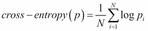

这里，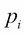是由模型为示例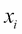的正确类别估计的概率。

准确性和交叉熵都朝着相同的方向发展，但是测量不同的东西。准确性衡量预测类别的正确程度，而交叉熵衡量概率之间的距离。交叉熵的减少解释了预测正确类别的概率变得更好，但是准确性可能保持不变或者下降。

虽然精度是离散的并且不可微，但是交叉熵损失是可微的函数，可以容易地用于训练模型。


# 单层线性模型

最简单的模型是线性模型，其中对于每个类别`c`，输出是输入值的线性组合:


这种输出是无限的。

为了获得总计为 1 的概率分布`p[i]`，线性模型的输出被传递到 softmax 函数中:

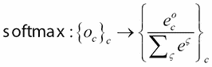

因此，输入`x`的类别`c`的估计概率用向量重写:


用 Python 翻译的:

```
batch_size = 600
n_in = 28 * 28
n_out = 10

x = T.matrix('x')
y = T.ivector('y')
W = theano.shared(
            value=numpy.zeros(
                (n_in, n_out),
                dtype=theano.config.floatX
            ),
            name='W',
            borrow=True
        )
b = theano.shared(
    value=numpy.zeros(
        (n_out,),
        dtype=theano.config.floatX
    ),
    name='b',
    borrow=True
)
model = T.nnet.softmax(T.dot(x, W) + b)
```

给定输入的预测由最可能类别(最大概率)给出:

```
y_pred = T.argmax(model, axis=1)
```

在这个具有单一线性层的模型中，信息从输入移动到输出:它是一个**前馈网络**。给定输入计算输出的过程称为**正向传播**。

这一层被称为完全连接，因为所有输出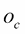是所有输入值的总和(通过乘法系数链接到):

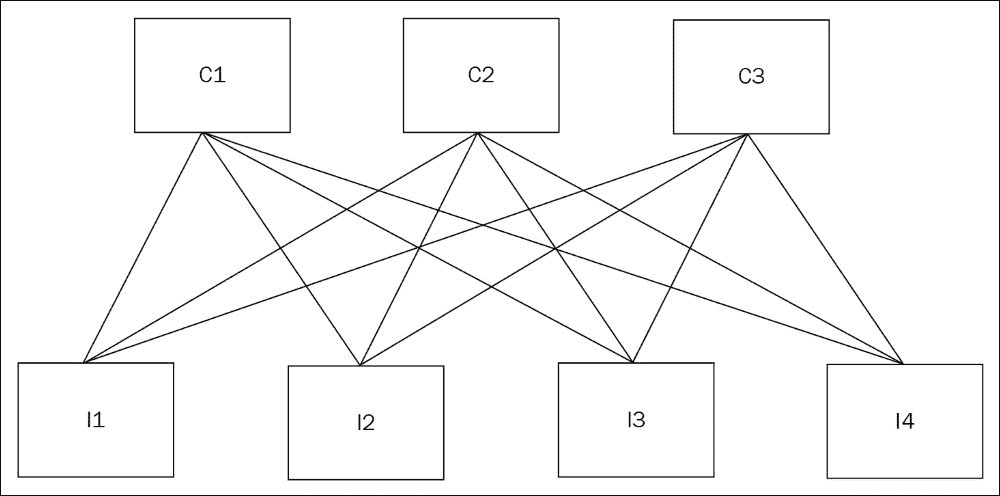

# 成本函数和误差

给定模型预测概率的成本函数如下:

```
cost = -T.mean(T.log(model)[T.arange(y.shape[0]), y])
```

误差是与真实类别不同的预测的数量，由值的总数平均，可以写成平均值:

```
error = T.mean(T.neq(y_pred, y))
```

相反，准确性对应于正确预测的数量除以预测的总数。误差和准确度之和是 1。

对于其他类型的问题，这里有一些其他的损失函数和实现:

| **范畴交叉熵**我们的等效实现 | 

```
T.nnet.categorical_crossentropy(model, y_true).mean()
```

 |
| **二元交叉熵**对于输出只能取两个值{0，1}的情况通常在 sigmoid 激活后使用，预测概率 p | 

```
T.nnet.binary_crossentropy(model, y_true).mean()
```

 |
| **均方误差**回归问题的 L2 范数 | 

```
T.sqr(model – y_true).mean()
```

 |
| **平均绝对误差**回归问题的 L1 范数 | 

```
T.abs_(model - y_true).mean()
```

 |
| **平滑 L1**大数值的 L1 和小数值的 L2 的混合称为回归的异常值抵抗损失 | 

```
T.switch(    T.lt(T.abs_(model - y_true) , 1\. / sigma),     0.5 * sigma * T.sqr(model - y_true),    T.abs_(model - y_true) – 0.5 / sigma ) .sum(axis=1).mean()
```

 |
| **平方铰链损耗**尤其用于无人监督的问题 | 

```
T.sqr(T.maximum(1\. - y_true * model, 0.)).mean()
```

 |
| **铰链损耗** | 

```
T.maximum(1\. - y_true * model, 0.).mean()
```

 |


# 反向传播和随机梯度下降

反向传播，或误差的反向传播，是用于调整连接权重的最常用的监督学习算法。

考虑作为权重 *W* 和 *b* 的函数的误差或成本，成本函数的局部最小值可以用梯度下降来逼近，其包括沿着负误差梯度改变权重:

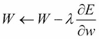

这里，是学习率，一个定义下降速度的正常数。

以下编译的函数在每次前馈运行后更新变量:

```
g_W = T.grad(cost=cost, wrt=W)
g_b = T.grad(cost=cost, wrt=b)

learning_rate=0.13
index = T.lscalar()

train_model = theano.function(
    inputs=[index],
    outputs=[cost,error],
    updates=[(W, W - learning_rate * g_W),(b, b - learning_rate * g_b)],
    givens={
        x: train_set_x[index * batch_size: (index + 1) * batch_size],
        y: train_set_y[index * batch_size: (index + 1) * batch_size]
    }
)
```

输入变量是批处理的索引，因为所有的数据集已经在共享变量中一次性传输到 GPU。

训练包括将每个样本反复呈现给模型(迭代)并多次重复操作(历元):

```
n_epochs = 1000
print_every = 1000

n_train_batches = train_set[0].shape[0] // batch_size
n_iters = n_epochs * n_train_batches
train_loss = np.zeros(n_iters)
train_error = npzeros(n_iters)

for epoch in range(n_epochs):
    for minibatch_index in range(n_train_batches):
        iteration = minibatch_index + n_train_batches * epoch
        train_loss[iteration], train_error[iteration] = train_model(minibatch_index)
        if (epoch * train_set[0].shape[0] + minibatch_index) % print_every == 0 :
            print('epoch {}, minibatch {}/{}, training error {:02.2f} %, training loss {}'.format(
                epoch,
                minibatch_index + 1,
                n_train_batches,
                train_error[iteration] * 100,
                train_loss[iteration]
            ))
```

不过，这只报告了一个小批量的损失和错误。最好还能报告整个数据集的平均值。

在第一次迭代中，错误率下降得非常快，然后就慢下来了。

GPU GeForce GTX 980M 笔记本电脑的执行时间为 67.3 秒，而英特尔 i7 CPU 的执行时间为 3 分 7 秒。

在长时间之后，模型收敛到 5.3 - 5.5%的错误率，并且随着更多的迭代可以进一步下降，但是也可能导致过拟合，当模型很好地拟合训练数据但是在看不见的数据上没有得到相同的错误率时，发生过拟合。

在这种情况下，模型过于简单，无法过度拟合这些数据。

太简单的模型是学不太好的。深度学习的原理是增加更多的层，即增加深度，建立更深的网络，以获得更好的精度。

我们将在下一节中看到如何计算模型精度和训练停止的更好估计。


# 多层模型

一个**多层感知器** ( **MLP** )就是一个多层前馈网。名为“隐藏层”的第二个线性层被添加到前面的示例中:

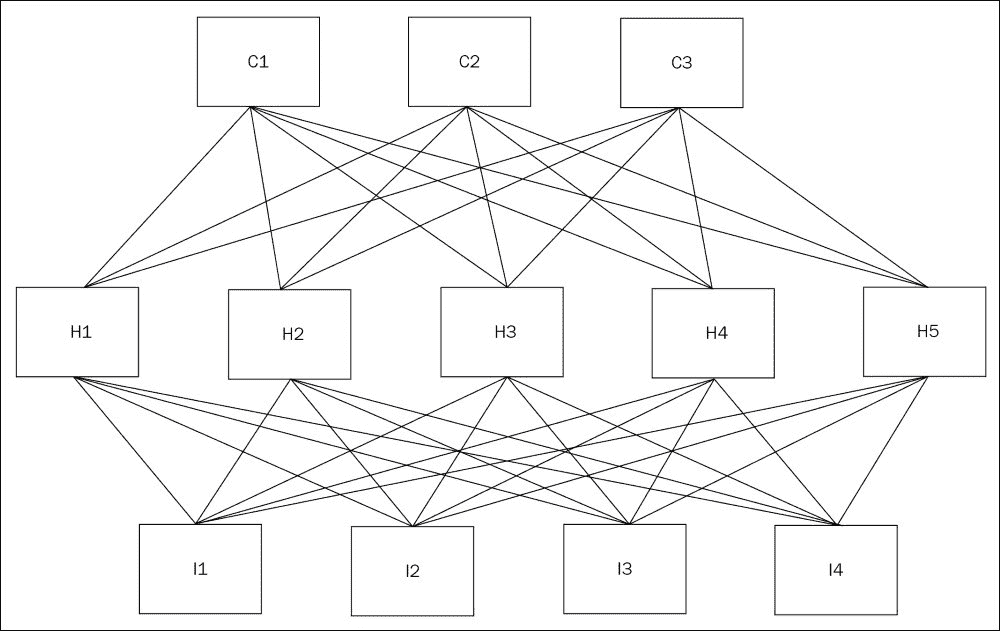

使两个线性层相互跟随相当于一个线性层。

通过线性之间的*非线性函数或非线性或传递函数*，模型不再简化为线性模型，而是表示更多可能的函数，以便捕捉数据中更复杂的模式:

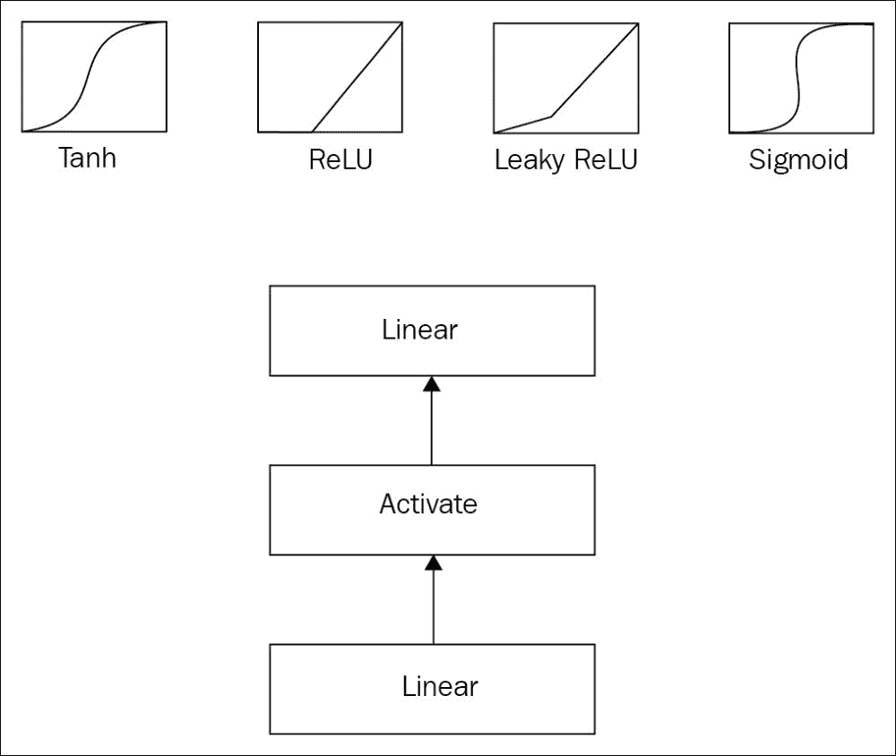

激活功能有助于饱和(开-关)并再现生物神经元激活。

**整流线性单元** ( **ReLU** )图如下:

*(x + T.abs_(x)) / 2.0*

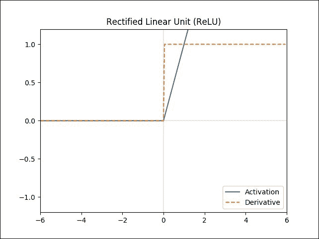

**漏整流线性单元** ( **漏整流**)图如下:

*( (1 +泄漏)* x+(1-泄漏)* T.abs_(x) ) / 2.0*

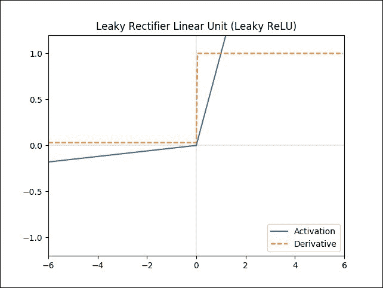

这里，`leak`是定义负值斜率的参数。在泄漏整流器中，该参数是固定的。

名为 PReLU 的激活考虑要学习的`leak`参数。

更一般地说，分段线性激活可以通过添加一个线性层，然后是`n_pool`单元的最大激活来学习:

```
T.max([x[:, n::n_pool] for n in range(n_pool)], axis=0)
```

这将输出基础学习线性的`n_pool`值或单位:

**乙状结肠** (T.nnet .乙状结肠)

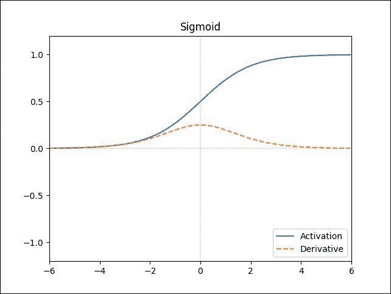

**HardSigmoid** 函数给出为:

*T.clip(X + 0.5，0。, 1.)*

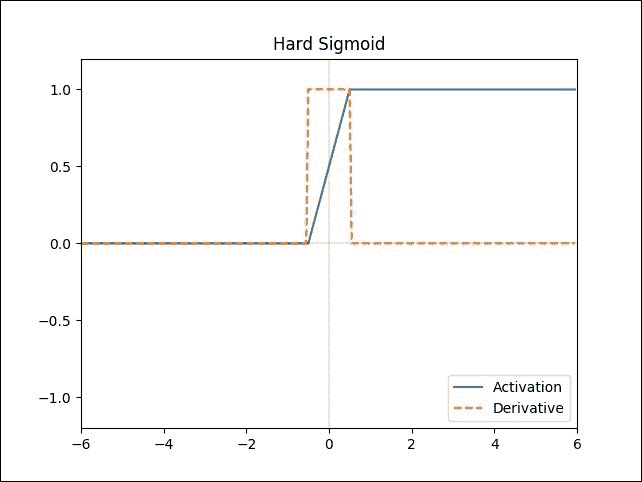

**HardTanh** 功能给出如下:

*T.clip(X，-1。, 1.)*

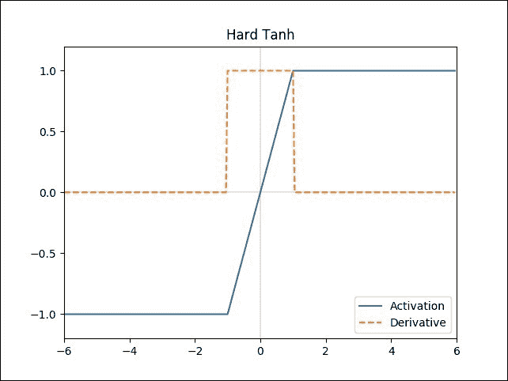

**Tanh**函数给出为:

*唐(x)*

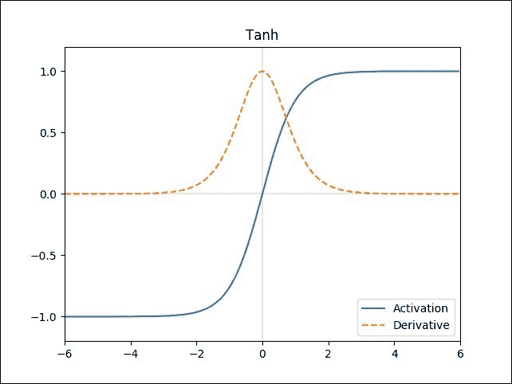

这个用 Python 写的两层网络模型如下:

```
batch_size = 600
n_in = 28 * 28
n_hidden = 500
n_out = 10

def shared_zeros(shape, dtype=theano.config.floatX, name='', n=None):
    shape = shape if n is None else (n,) + shape
    return theano.shared(np.zeros(shape, dtype=dtype), name=name)

def shared_glorot_uniform(shape, dtype=theano.config.floatX, name='', n=None):
    if isinstance(shape, int):
        high = np.sqrt(6\. / shape)
    else:
        high = np.sqrt(6\. / (np.sum(shape[:2]) * np.prod(shape[2:])))
    shape = shape if n is None else (n,) + shape
    return theano.shared(np.asarray(
        np.random.uniform(
            low=-high,
            high=high,
            size=shape),
        dtype=dtype), name=name)

W1 = shared_glorot_uniform( (n_in, n_hidden), name='W1' )
b1 = shared_zeros( (n_hidden,), name='b1' )

hidden_output = T.tanh(T.dot(x, W1) + b1)

W2 = shared_zeros( (n_hidden, n_out), name='W2' )
b2 = shared_zeros( (n_out,), name='b2' )

model = T.nnet.softmax(T.dot(hidden_output, W2) + b2)
params = [W1,b1,W2,b2]
```

在深网中，如果用`shared_zeros`方法将权重初始化为零，信号将不会正确地从一端到另一端流过网络。如果用太大的值初始化权重，在几个步骤之后，大多数激活函数饱和。因此，我们需要确保值可以在传播过程中传递到下一层，以及在反向传播过程中传递到上一层的梯度。

我们还需要打破神经元之间的对称性。如果所有神经元的权重都为零(或者都相等)，那么它们都将以完全相同的方式进化，模型也不会学到很多东西。

研究人员 Xavier Glorot 研究了一种以最佳方式初始化权重的算法。它包括从零均值的高斯或均匀分布和以下方差中提取权重:

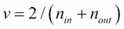

以下是前面公式中的变量:

*   `n[in]`是前馈传播期间该层接收的输入数
*   `n[out]`是层在反向传播过程中接受的梯度数

在线性模型的情况下，形状参数是一个元组，`v`就是简单的`numpy.sum( shape[:2] )`(在这种情况下，`numpy.prod(shape[2:])`就是`1`)。

在 *[-a，a]* 上均匀分布的方差由 *a**2 / 3* 给出，那么界限`a`可以计算如下:

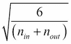

成本可以像以前一样定义，但是梯度下降需要适应处理参数列表，`[W1,b1,W2,b2]`:

```
g_params = T.grad(cost=cost, wrt=params)
```

训练循环需要更新的训练功能:

```
learning_rate = 0.01
updates = [
        (param, param - learning_rate * gparam)
        for param, gparam in zip(params, g_params)
    ]

train_model = theano.function(
    inputs=[index],
    outputs=cost,
    updates=updates,
    givens={
        x: train_set_x[index * batch_size: (index + 1) * batch_size],
        y: train_set_y[index * batch_size: (index + 1) * batch_size]
    }
)
```

在这种情况下，学习率对于网络是全局的，所有权重以相同的速率更新。学习率设置为 0.01，而不是 0.13。我们将在培训部分讨论超参数调整。

训练循环保持不变。完整代码在`2-multi.py`文件中给出。

在 GPU 上的执行时间是 5 分 55 秒，而在 CPU 上是 51 分 36 秒。

经过 1000 次迭代后，误差下降到了 2%，这比之前 5%的误差率好了很多，但部分原因可能是由于过度拟合。我们稍后将比较不同的模型。


# 卷积和最大层数

随着MNIST 数据库上卷积层的发明，图像分类取得了巨大的进步:

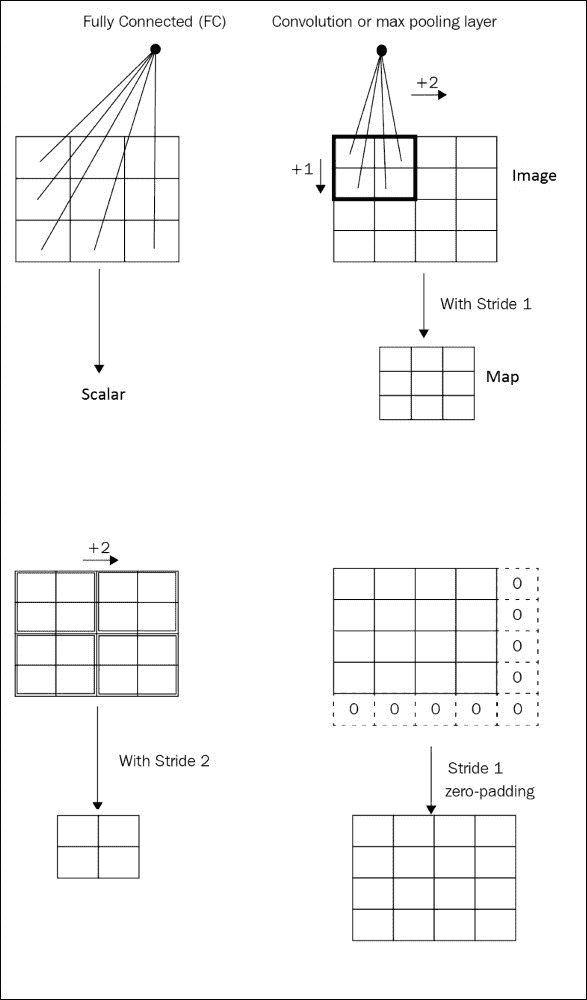

虽然先前的全连接层利用输入的所有输入值(在图像的情况下是像素)执行计算，但是 2D 卷积层将只考虑 2D 输入图像的 NxN 像素的小块或窗口或感受域，用于每个输出单元。面片的维数称为核维数，N 是核大小，系数/参数是核。

在输入图像的每个位置，内核产生一个标量，所有位置值将导致一个矩阵(2D 张量)，称为*特征图*。将输入图像上的核作为滑动窗口进行卷积会创建一个新的输出图像。内核的步幅定义了在图像上移动补丁/窗口的像素数:步幅为 2 时，每隔 2 个像素计算一次内核的卷积。

例如，在 224 x 224 的输入图像上，我们得到以下结果:

*   步幅为 1 的 2×2 内核输出 223×223 的特征图
*   步幅为 1 的 3×3 内核输出 222×222 的特征图

为了保持输出特征图与输入图像的尺寸相同，有一种称为*相同*或*一半*的零填充类型，可实现以下功能:

*   在步长为 1 的 2x2 内核的情况下，在输入图像的末尾添加一行和一列零
*   在步长为 1 的 3×3 内核的情况下，垂直和水平地添加两行和两列零，一个在输入图像的前面，一个在输入图像的末尾

因此，输出的尺寸与原始尺寸相同，即 224 x 224 的特征地图。

带零填充:

*   具有步幅 2 和零填充的 2×2 内核将输出 112×112 的特征图
*   步幅为 2 的 3×3 内核将输出 112×112 的特征图

如果没有补零，事情会变得更加复杂:

*   步幅为 2 的 2×2 内核将输出 112×112 的特征图
*   步幅为 2 的 3×3 内核将输出 111×111 的特征图

请注意，每个维度的内核维度和跨度可以不同。在这种情况下，我们说内核宽度、内核高度、步幅宽度或步幅高度。

在一个卷积层中，可以输出多个特征图，每个特征图用不同的核(和核权重)计算，并表示一个特征。我们无差别地说输出、神经元、核、特征、特征图、单元或输出通道，以给出这些具有不同核的不同卷积的数量。准确地说，神经元通常是指特征图中的特定位置。核是核本身，其他的是指卷积运算的结果。它们的数量是相同的，这就是为什么这些词经常被用来描述同一个事物。我将使用通道、输出和功能这几个词。

常用的卷积运算符可应用于多声道输入。这使得可以将它们应用于三通道图像(例如 RGB 图像)或另一个卷积的输出，以便进行链接。

让我们在前一个 MLP 模式之前包括两个内核大小为 5 的卷积:

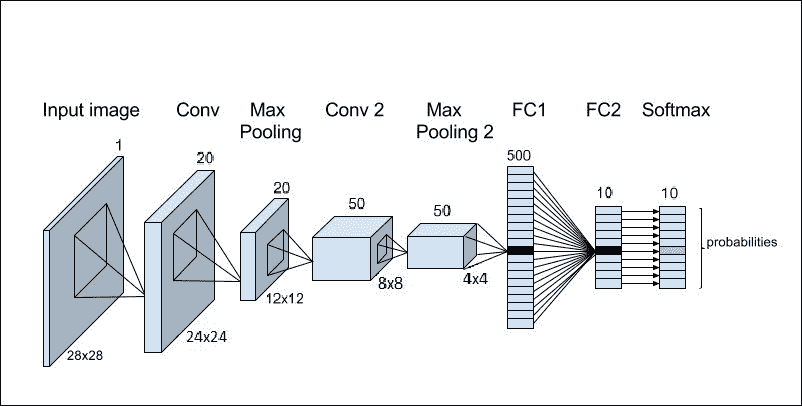

2D 卷积运算符需要一个 4D 张量输入。第一维是批量大小，第二维是输入或输入通道的数量(在“通道优先格式”中)，第三维和第四维是特征映射的两个维度(在“通道最后格式”中，通道是最后的维度)。存储在一维向量中的 MNIST 灰度图像(一个通道)需要转换成 28×28 的矩阵，其中 28 是图像的高度和宽度:

然后，在变换后的输入之上添加 20 个通道的第一卷积层，我们得到:

```
layer0_input = x.reshape((batch_size, 1, 28, 28))
```

在这种情况下，Xavier 初始化(以其发明者 Xavier Glorot 的名字命名)将输入/输出通道的数量乘以内核中的参数数量`numpy.prod(shape[2:]) = 5 x 5 = 25`，以获得初始化公式中输入/输出渐变的总数。

```
from theano.tensor.nnet import conv2d

n_conv1 = 20

W1 = shared_glorot_uniform( (n_conv1, 1, 5, 5) )

conv1_out = conv2d(
    input=layer0_input,
    filters=W1,
    filter_shape=(n_conv1, 1, 5, 5),
    input_shape=(batch_size, 1, 28, 28)
)
```

28×28 个输入上的 20 个大小为 5×5 和步长为 1 的核将产生 20 个大小为 24×24 的特征图。所以第一个卷积输出是(`batch_size,20,24,24`)。

最佳性能网络使用最大池层，以促进对噪声的平移不变性和稳定性。max-pooling 层在滑动窗口/面片上执行最大值操作，以仅将一个值保留在面片之外。除了提高速度性能之外，它还减小了特征图的大小，并且总计算复杂度和训练时间也减少了:

2x2 最大池层的输出将是(`batch_size,20,12,12`)。批次大小和通道数量保持不变。只有要素地图的大小发生了变化。

```
from theano.tensor.signal import pool
pooled_out = pool.pool_2d(input=conv1_out, ws=(2, 2), ignore_border=True)
```

在前一个卷积层之上添加第二个 50 信道的卷积层和最大池层导致大小为(`batch_size,50,4,4`)的输出:

为了创建一个分类器，我们在 MLP 的顶部连接两个完全连接的线性层和一个 softmax，如前所述:

```
n_conv2 = 50

W2 = shared_glorot_uniform( (n_conv2, n_conv1, 5, 5) )

conv2_out = conv2d(
    input=pooled_out,
    filters=W2,
    filter_shape=(n_conv2, n_conv1, 5, 5),
    input_shape=(batch_size, n_conv1, 12, 12)
)

pooled2_out = pool.pool_2d(input=conv2_out, ds=(2, 2),ignore_border=True)
```

这样一个模型被命名为**卷积神经网络** ( **CNN** )。

```
hidden_input = pooled2_out.flatten(2)

n_hidden = 500

W3 = shared_zeros( (n_conv2 * 4 * 4, n_hidden), name='W3' )
b3 = shared_zeros( (n_hidden,), name='b3' )

hidden_output = T.tanh(T.dot(hidden_input, W3) + b3)

n_out = 10

W4 = shared_zeros( (n_hidden, n_out), name='W4' )
b4 = shared_zeros( (n_out,), name='b4' )

model = T.nnet.softmax(T.dot(hidden_output, W4) + b4)
params = [W1,W2,W3,b3,W4,b4]
```

完整的代码在`3-cnn.py`文件中给出。

训练要慢得多，因为参数的数量再次成倍增加，使用 GPU 更有意义:在GPU 上的总训练时间增加到了 1 小时 48 分 27 秒。对 CPU 的训练需要几天时间。

经过几次迭代后，训练误差为零，部分原因是过度拟合。让我们在下一节看看如何计算一个测试损失和准确性，更好地解释模型的效率。

培训


# 为了很好地衡量模型如何处理训练期间不可见的数据，验证数据集用于计算训练期间的验证损失和准确性。

验证数据集使我们能够选择最佳模型，而测试数据集仅在最后用于获得模型的最终测试精度/误差。训练、测试和验证数据集是离散的数据集，没有共同的示例。验证数据集通常比测试数据集小 10 倍，以尽可能降低训练过程的速度。测试数据集通常占训练数据集的 10-20%左右。训练数据集和验证数据集都是训练计划的一部分，因为第一个数据集用于学习，第二个数据集用于在训练时根据看不见的数据选择最佳模型。

测试数据集完全在训练过程之外，用于获得由训练和模型选择产生的模型的准确性。

例如，如果模型因为在相同的图像上被训练了太多次而使训练集过拟合，那么验证集和测试集将不会受到这种行为的影响，并且将提供对模型准确性的真实估计。

通常，在没有模型梯度更新的情况下编译验证函数，以简单地仅计算输入批次的成本和误差。

批量数据 *(x，y)* 通常会在每次迭代时传输到 GPU，因为数据集通常太大，不适合 GPU 的内存。在这种情况下，我们仍然可以使用共享变量的技巧将整个验证数据集放在 GPU 的内存中，但是让我们看看如果我们必须在每个步骤将批处理传输到 GPU，而不使用前面的技巧，我们会怎么做。我们会使用更常见的形式:

它需要批量输入的转移。验证不是在每次迭代时计算，而是在训练`for`循环中的`validation_interval`次迭代时计算:

```
validate_model = theano.function(
    inputs=[x,y],
    outputs=[cost,error]
)
```

让我们看看这个简单的第一个模型:

```
if iteration % validation_interval == 0 :
    val_index = iteration // validation_interval
    valid_loss[val_index], valid_error[val_index] = np.mean([
            validate_model(
                valid_set[0][i * batch_size: (i + 1) * batch_size],
                numpy.asarray(valid_set[1][i * batch_size: (i + 1) * batch_size], dtype="int32")
                )
                for i in range(n_valid_batches)
             ], axis=0)
```

在完整的训练程序中，对应于时期总数的验证间隔，以及时期的平均验证分数，将更有意义。

```
epoch 0, minibatch 1/83, validation error 40.05 %, validation loss 2.16520105302

epoch 24, minibatch 9/83, validation error 8.16 %, validation loss 0.288349323906
epoch 36, minibatch 13/83, validation error 7.96 %, validation loss 0.278418215923
epoch 48, minibatch 17/83, validation error 7.73 %, validation loss 0.272948684171
epoch 60, minibatch 21/83, validation error 7.65 %, validation loss 0.269203903154
epoch 72, minibatch 25/83, validation error 7.59 %, validation loss 0.26624627877
epoch 84, minibatch 29/83, validation error 7.56 %, validation loss 0.264540277421
...
epoch 975, minibatch 76/83, validation error 7.10 %, validation loss 0.258190142922
epoch 987, minibatch 80/83, validation error 7.09 %, validation loss 0.258411859162
```

为了更好地估计训练的表现，让我们画出训练和有效损失。为了显示早期迭代中的下降，我将在 100 次迭代时停止绘制。如果我在图中使用 1000 次迭代，我将看不到早期的迭代:

To better estimate how the training performs, let's plot the training and valid loss. In order to display the descent in early iterations, I'll stop the drawing at 100 iterations. If I use 1,000 iterations in the plot, I won't see the early iterations:

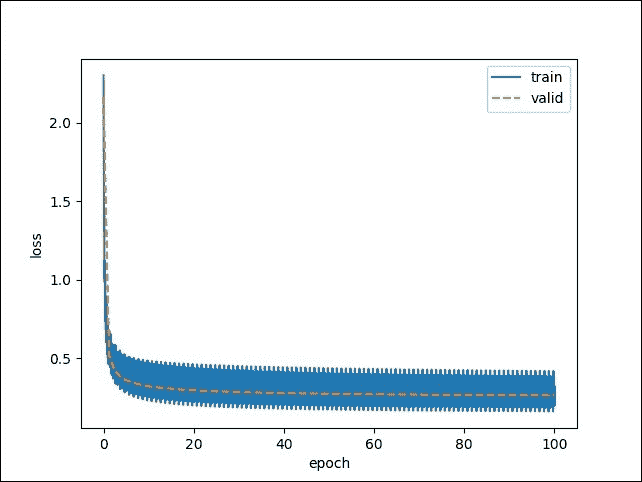

训练损失看起来像一个宽带，因为它在不同的值之间振荡。每个值对应一个批次。该批次可能太小，无法提供稳定的损失值。历元上训练损失的平均值将提供更稳定的值来与有效损失进行比较，并显示过度拟合。

还要注意，损耗图提供了网络如何收敛的信息，但没有给出任何有价值的误差信息。因此，划分训练误差和有效误差也是非常重要的。

对于第二个模型:

同样，训练曲线给出了更好的见解:

```
epoch 0, minibatch 1/83, validation error 41.25 %, validation loss 2.35665753484
epoch 24, minibatch 9/83, validation error 10.20 %, validation loss 0.438846310601
epoch 36, minibatch 13/83, validation error 9.40 %, validation loss 0.399769391865
epoch 48, minibatch 17/83, validation error 8.85 %, validation loss 0.379035864025
epoch 60, minibatch 21/83, validation error 8.57 %, validation loss 0.365624915808
epoch 72, minibatch 25/83, validation error 8.31 %, validation loss 0.355733696371
epoch 84, minibatch 29/83, validation error 8.25 %, validation loss 0.348027150147
epoch 96, minibatch 33/83, validation error 8.01 %, validation loss 0.34150374867
epoch 108, minibatch 37/83, validation error 7.91 %, validation loss 0.335878048092
...
epoch 975, minibatch 76/83, validation error 2.97 %, validation loss 0.167824191041
epoch 987, minibatch 80/83, validation error 2.96 %, validation loss 0.167092795949
```

Again, the training curves give better insights:

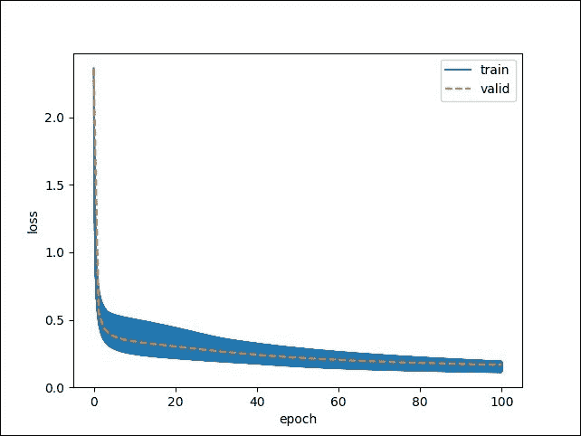

对于第三款:

参考下图:

```
epoch 0, minibatch 1/83, validation error 53.81 %, validation loss 2.29528842866
epoch 24, minibatch 9/83, validation error 1.55 %, validation loss 0.048202780541
epoch 36, minibatch 13/83, validation error 1.31 %, validation loss 0.0445762014715
epoch 48, minibatch 17/83, validation error 1.29 %, validation loss 0.0432346871821
epoch 60, minibatch 21/83, validation error 1.25 %, validation loss 0.0425786205451
epoch 72, minibatch 25/83, validation error 1.20 %, validation loss 0.0413943211024
epoch 84, minibatch 29/83, validation error 1.20 %, validation loss 0.0416557886347
epoch 96, minibatch 33/83, validation error 1.19 %, validation loss 0.0414686980075
...
epoch 975, minibatch 76/83, validation error 1.08 %, validation loss 0.0477593478863
epoch 987, minibatch 80/83, validation error 1.08 %, validation loss 0.0478142946085
```

Refer to the following graph:

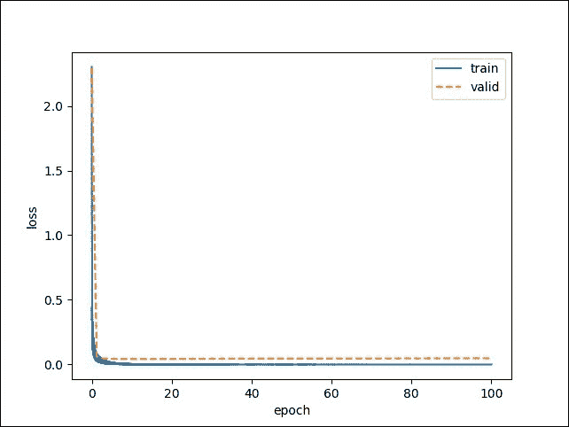

在这里，我们看到了 train 和 valid 之间的差异，损失要么是由于对训练数据的轻微过度拟合，要么是训练数据集和测试数据集之间的差异。

过度拟合的主要原因如下:

**数据集太小**:收集更多数据

*   **学习率太高**:网络对早期的例子学习得太快
*   **缺乏正则化**:增加更多的丢失(见下一节)，或者损失函数中权重范数的惩罚
*   **过小型号**:增加不同层的过滤器/单元数量
*   验证损失和误差给出了比训练损失和误差更好的估计，训练损失和误差噪声更大，并且在训练期间，它们也用于决定哪个模型参数是最好的:

**简单模型**:518 年期 6.96 %

*   **MLP 模型**:987 年时 2.96 %
*   **CNN 模型**:722 年时 1.06 %
*   这些结果还表明，模型可能不会随着进一步的训练而有很大的改善。

以下是三种模型验证损失的比较:

Here's a comparison of the three models' validation losses:

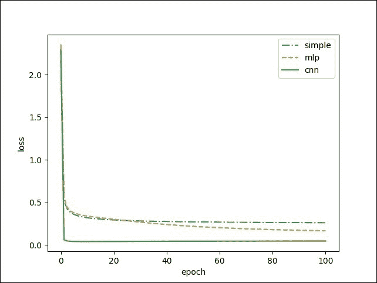

请注意，MLP 仍在改进，训练尚未结束，而 CNN 和 simple 网络已经收敛。

使用所选择的模型，您可以轻松地计算测试数据集上的测试损失和错误，以最终确定它。

机器学习的最后一个重要概念是超参数调整。超参数定义了在训练期间没有学习到的模型参数。以下是一些例子:

对于学习速率，下降太慢可能会阻止找到更全局的最小值，而下降太快会破坏最终的收敛。找到最佳的初始学习率至关重要。然后，通常在多次迭代之后降低学习率，以便对模型进行更精确的微调。

```
learning rate
number of hidden neurons
batch size
```

超参数选择要求我们针对超参数的不同值多次运行之前的运行；例如，测试超参数的所有组合可以在简单的网格搜索中完成。

下面是给读者的一个练习:

用不同的超参数训练模型，绘制训练损失曲线，看超参数如何影响最终损失。

*   一旦模型被训练，可视化第一层神经元的内容，以查看特征从输入图像中捕捉到了什么。针对这个任务，编写一个具体的可视化函数:

    ```
    visualize_layer1 = theano.function(     inputs=[x,y],     outputs=conv1_out )
    ```

*   辍学


# Dropout 是一种广泛使用的技术，用于改善神经网络的收敛性和鲁棒性，并防止神经网络过度拟合。它包括为我们想要应用的层设置一些随机值为零。它会在每个时期的数据中引入一些随机性。

通常，在全连接层之前使用 dropout，在卷积层中不常使用。让我们在两个完全连接的层之前添加以下行:

完整的脚本在`5-cnn-with-dropout.py`里。经过 1000 次迭代后，有丢包的 CNN 验证误差继续下降到 1.08%，而无丢包的 CNN 验证误差不会下降 1.22%。

```
dropout = 0.5

if dropout > 0 :
    mask = srng.binomial(n=1, p=1-dropout, size=hidden_input.shape)
    # The cast is important because
    # int * float32 = float64 which make execution slower
    hidden_input = hidden_input * T.cast(mask, theano.config.floatX)
```

想进一步了解辍学现象的读者应该看看 maxout 单位。它们可以很好地处理辍学问题，并取代 tanh 非线性，从而获得更好的结果。由于 dropout 执行一种模型平均，最大输出单元试图找到问题的最佳非线性。

推论


# 推理是使用模型产生预测的过程。

对于推理，权重参数不需要更新，因此推理函数比训练函数简单:

优化和其他更新规则

```
infer_model = theano.function(
    inputs=[x],
    outputs=[y_pred]
)
```


# 学习速率是正确设置的一个非常重要的参数。太低的学习率会使学习变得困难，训练速度会变慢，而太高的学习率会增加对异常值的敏感性，增加数据中的噪声量，训练太快而无法学习泛化，并陷入局部最小值:

Learning rate is a very important parameter to set correctly. Too low a learning rate will make it difficult to learn and will train slower, while too high a learning rate will increase sensitivity to outlier values, increase the amount of noise in the data, train too fast to learn generalization, and get stuck in local minima:

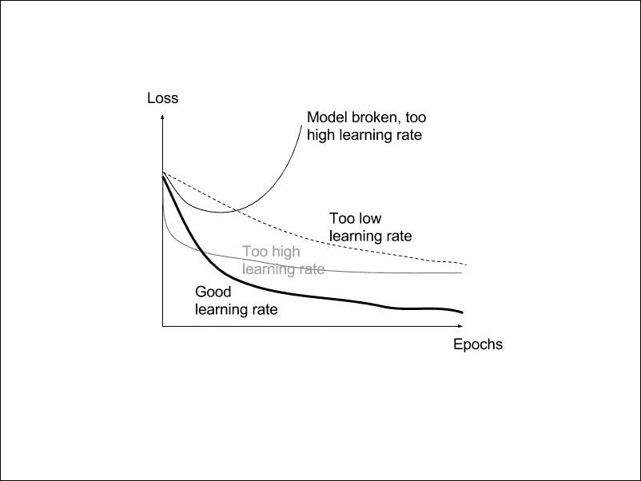

当训练损失在一次或几次迭代中不再改善时，学习率可以降低一个系数:

When training loss does not improve anymore for one or a few more iterations, the learning rate can be reduced by a factor:


它有助于网络学习数据中的细微差异，如训练残差网络时所示([第 7 章](part0075_split_000.html#27GQ61-ccdadb29edc54339afcb9bdf9350ba6b "Chapter 7. Classifying Images with Residual Networks")、*用残差网络对图像进行分类*):

为了检查训练过程，通常打印参数的标准、梯度、更新以及 NaN 值。

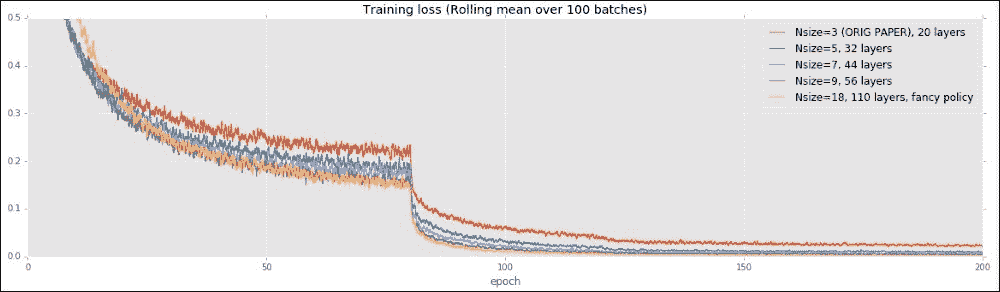

本章看到的更新规则是最简单的更新形式，称为的**随机梯度下降** ( **SGD** )。修剪规范以避免饱和和 NaN 值是一个很好的做法。给`theano`函数的更新列表如下:

为了改善下降，已经试验了一些非常简单的变体，并且在许多深度学习库中提出了这些变体。让我们在电影院看他们。

**气势**

```
def clip_norms(gs, c):
    norm = T.sqrt(sum([T.sum(g**2) for g in gs]))
    return [ T.switch(T.ge(norm, c), g*c/norm, g) for g in gs]

updates = []
grads = T.grad(cost, params)
grads = clip_norms(grads, 50)
for p,g in zip(params,grads):
    updated_p = p - learning_rate * g
    updates.append((p, updated_p))
```

对于每一个参数，动量( *v* ，作为速度)是从随时间衰减的迭代累积的梯度中计算出来的。先前的动量值乘以 0.5 和 0.9 之间的衰减参数(待交叉验证)并加到当前梯度上以提供新的动量值。

为了更快地学习，梯度的动量在更新中起到惯性力矩的作用。该想法还在于，连续梯度中的振荡将在动量中被抵消，从而将参数以更直接的路径移向解:

For each parameter, a momentum (*v*, as velocity) is computed from the gradients accumulated over the iterations with a time decay. The previous momentum value is multiplied by a decay parameter between 0.5 and 0.9 (to be cross-validated) and added to the current gradient to provide the new momentum value.

在 0.5 和 0.9 之间的衰减参数是一个超参数，通常被称为动量，在语言的滥用中:

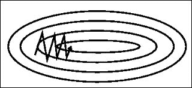

**内斯特罗夫加速梯度**

代替将 *v* 加到参数上的，想法是将动量`v - learning_rate g`的未来值加到目录上，以便让它直接在下一个位置计算下一次迭代中的梯度:

```
updates = []
grads = T.grad(cost, params)
grads = clip_norms(grads, 50)
for p,g in zip(params,grads):
    m = theano.shared(p.get_value() * 0.)
    v = (momentum * m) - (learning_rate * g)
    updates.append((m, v))
    updates.append((p, p + v))
```

阿达格勒

该更新规则以及以下规则包括调整学习率**参数方式**(每个参数不同)。梯度的逐元素平方和被累积到每个参数的共享变量中，以便以逐元素方式衰减学习速率:

```
updates = []
grads = T.grad(cost, params)
grads = clip_norms(grads, 50)
for p, g in zip(params, grads):
    m = theano.shared(p.get_value() * 0.)
    v = (momentum * m) - (learning_rate * g)
    updates.append((m,v))
    updates.append((p, p + momentum * v - learning_rate * g))
```

`Adagrad`是一个攻击性的方法，接下来的两个规则，`AdaDelta`和`RMSProp`，尽量减少其攻击性。

**阿达德尔塔**

```
updates = []
grads = T.grad(cost, params)
grads = clip_norms(grads, 50)
for p,g in zip(params,grads):
    acc = theano.shared(p.get_value() * 0.)
    acc_t = acc + g ** 2
    updates.append((acc, acc_t))
    p_t = p - (learning_rate / T.sqrt(acc_t + 1e-6)) * g
    updates.append((p, p_t))
```

每个参数创建两个累加器，以累加平方梯度和移动平均值的更新，由衰减`rho`参数化:

**RMSProp**

这个更新的规则在很多情况下非常有效。它是对`Adagrad`更新规则的改进，使用移动平均值(由`rho`参数化)来获得更小的衰减:

```
updates = []
grads = T.grad(cost, params)
grads = clip_norms(grads, 50)
for p,g in zip(params,grads):
    acc = theano.shared(p.get_value() * 0.)
    acc_delta = theano.shared(p.get_value() * 0.)
    acc_new = rho * acc + (1 - rho) * g ** 2
    updates.append((acc,acc_new))
    update = g * T.sqrt(acc_delta + 1e-6) / T.sqrt(acc_new + 1e-6)
    updates.append((p, p - learning_rate * update))
    updates.append((acc_delta, rho * acc_delta + (1 - rho) * update ** 2))
```

**亚当**

这是`RMSProp`与 momemtum，学习规则的最佳选择之一。时间步长在共享变量`t`中保持跟踪。计算两个移动平均值，一个用于过去的平方梯度，另一个用于过去的梯度:

```
updates = []
grads = T.grad(cost, params)
grads = clip_norms(grads, 50)
for p,g in zip(params,grads):
    acc = theano.shared(p.get_value() * 0.)
    acc_new = rho * acc + (1 - rho) * g ** 2
    updates.append((acc, acc_new))
    updated_p = p - learning_rate * (g / T.sqrt(acc_new + 1e-6))
    updates.append((p, updated_p))
```

总结更新规则，许多最近的研究论文仍然倾向于简单的 SGD 规则，并以正确的学习速率进行架构和层的初始化。对于更复杂的网络，或者如果数据是稀疏的，自适应学习速率方法是更好的，使你不必为寻找正确的学习速率而痛苦。

相关文章

```
b1=0.9, b2=0.999, l=1-1e-8
updates = []
grads = T.grad(cost, params)
grads = clip_norms(grads, 50)  
t = theano.shared(floatX(1.))
b1_t = b1 * l **(t-1)

for p, g in zip(params, grads):
    m = theano.shared(p.get_value() * 0.)
    v = theano.shared(p.get_value() * 0.)
    m_t = b1_t * m + (1 - b1_t) * g
    v_t = b2 * v + (1 - b2) * g**2 
    updates.append((m, m_t))
    updates.append((v, v_t))
    updates.append((p, p - (learning_rate * m_t / (1 - b1**t)) / (T.sqrt(v_t / (1 - b2**t)) + 1e-6)) )
updates.append((t, t + 1.))
```

您可以参考以下文档，深入了解本章涵盖的主题:


# *Deeplearning.net·泰诺教程:单层*([http://deeplearning.net/tutorial/logreg.html](http://deeplearning.net/tutorial/logreg.html))、MLP([http://deeplearning.net/tutorial/mlp.html](http://deeplearning.net/tutorial/mlp.html))、卷积([http://deeplearning.net/tutorial/lenet.html](http://deeplearning.net/tutorial/lenet.html))

所有损失函数:用于分类、回归和联合嵌入([http://Christopher 5106 . github . io/deep/learning/2016/09/16/about-loss-functions-多项式-logistic-对数-交叉熵-平方误差-euclidian-absolute-Frobenius-hinge . html](http://christopher5106.github.io/deep/learning/2016/09/16/about-loss-functions-multinomial-logistic-logarithm-cross-entropy-square-errors-euclidian-absolute-frobenius-hinge.html))

*   最后一个例子对应于 Yann Lecun 的 5-5 层网络，如应用于文档识别的基于梯度的学习([http://yann.lecun.com/exdb/publis/pdf/lecun-98.pdf](http://yann.lecun.com/exdb/publis/pdf/lecun-98.pdf)
*   理解训练深度前馈神经网络的困难，Xavier Glorot，Yoshua Bengio，2010
*   最大输出网络:伊恩·古德菲勒、大卫·沃德-法利、迈赫迪·米尔扎、亚伦·库维尔、约舒阿·本吉奥
*   梯度下降算法概述:[http://sebastianruder.com/optimizing-gradient-descent/](http://sebastianruder.com/optimizing-gradient-descent/)
*   CS231n 卷积神经网络用于视觉识别，[http://cs231n.github.io/neural-networks-3/](http://cs231n.github.io/neural-networks-3/)
*   是的，你应该了解 backprop，Andrej Karpathy，2016 年，[https://medium.com/@karpathy/](https://medium.com/@karpathy/)
*   追求简单:全卷积网络，Jost Tobias Springenberg，Alexey Dosovitskiy，Thomas Brox，Martin Riedmiller，2014 年
*   部分最高统筹，本杰明·格拉哈姆，2014 年
*   批量标准化:通过减少内部协变量转移加速深度网络训练，Sergey Ioffe，Christian Szegedy，2015
*   可视化和理解卷积网络，马修·D·泽勒，罗布·弗格斯，2013
*   深入了解卷积，Christian Szegedy，，，Jia，Pierre Sermanet，Scott Reed，Dragomir Anguelov，Dumitru Erhan，Vincent Vanhoucke，Andrew Rabinovich，2014
*   总结
*   分类是机器学习中一个非常广泛的话题。它包括预测一个类或一个类别，正如我们在手写数字例子中所展示的。在[第 7 章](part0075_split_000.html#27GQ61-ccdadb29edc54339afcb9bdf9350ba6b "Chapter 7. Classifying Images with Residual Networks")、*用残差网络对图像进行分类*中，我们将看到如何对更广泛的自然图像和物体进行分类。


# 分类可以应用于不同的问题，交叉熵/负对数似然是通过梯度下降解决这些问题的常用损失函数。对于回归(均方误差损失)或无监督联合学习(铰链损失)等问题，还有许多其他损失函数。

在这一章中，我们一直使用一个非常简单的梯度下降规则，称为随机梯度下降，并提出了一些其他梯度下降变体(`Momentum`、`Nesterov`、`RMSprop`、`ADAM`、`ADAGRAD`、`ADADELTA`)。已经有一些关于二阶优化的研究，例如 Hessian Free 或 K-FAC，其在深度或循环网络中提供了更好的结果，但是仍然复杂和昂贵，并且直到现在还没有被广泛采用。研究人员一直在寻找性能更好的新架构，而不需要这种优化技术。

在训练网络时，我强烈建议您使用以下两个 Linux 命令:

**屏幕**:要分离您的 shell，请在服务器上运行脚本并稍后重新连接，因为培训通常需要几天时间。

**Tee** :您将正在运行的程序的输出通过管道传输到这个接口，以便将显示的结果保存到一个文件中，同时继续在您的 shell 中可视化输出。这将使您的代码摆脱日志函数和框架的负担。

*   **Screen**: To detach your shell, run scripts on the server and reconnect later, since training usually takes a few days.
*   **Tee**: To which you pipe the output of your running program, in order to save the displayed results to a file, while continuing to visualize the output in your shell. This will spare your code the burden of log functions and frameworks.