# 三、将单词编码成向量

在前一章中，神经网络的输入是图像，也就是连续数值的向量，神经网络的**自然语言**。但对于许多其他机器学习领域，输入可能是分类的和离散的。

在本章中，我们将介绍一种称为嵌入的技术，它学习将离散输入信号转换成向量。输入的这种表示是与神经网络处理的其余部分兼容的重要的第一步。

这种嵌入技术将以自然语言文本为例进行说明，自然语言文本由属于有限词汇的单词组成。

我们将介绍嵌入的不同方面:

*   嵌入的原则
*   词嵌入的不同类型
*   一种热编码与索引编码
*   建立一个将文本转化为向量的网络
*   训练和发现嵌入空间的性质
*   保存和加载模型的参数
*   用于可视化的维数缩减
*   评估嵌入的质量
*   嵌入空间的应用
*   重量捆绑


# 编码和嵌入

每个单词可以用词汇表中的一个索引来表示:

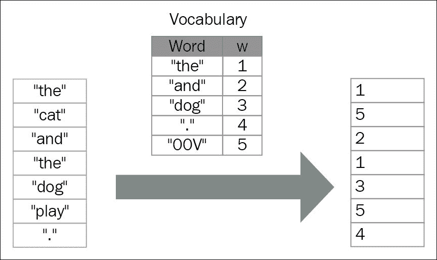

对单词进行编码是将每个单词表示为一个向量的过程。对单词进行编码的最简单的方法被称为 one-hot 或 1-of-K 矢量表示法。在这种方法中，每个单词都被表示为一个全 0 的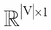向量，并且在排序后的词汇表中该单词的索引处有一个 1。在这种记法中，|V|是词汇表的大小。词汇{ **国王**、**王后**、**男人**、**女人**、**孩子** }的这种编码中的词向量出现在下面的**王后**的编码示例中:

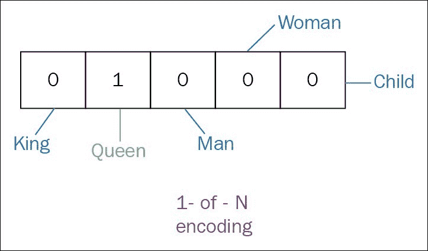

在一键向量表示法中，每个单词与另一个单词是等距的。然而，它不能保持它们之间的任何关系，并导致数据稀疏。使用词嵌入确实克服了这些缺点。

词嵌入是一种将单词表示为实数向量的分布式语义方法。这种表示具有有用的聚类特性，因为它将语义和语法相似的单词组合在一起。

例如，**海洋世界**和**海豚**这两个词在创造的空间中会非常接近。这一步的主要目的是将每个单词映射成一个连续的低维实值向量，并将其用作模型的输入，例如**循环神经网络**(**RNN**)**卷积神经网络** ( **CNN** )和等等:

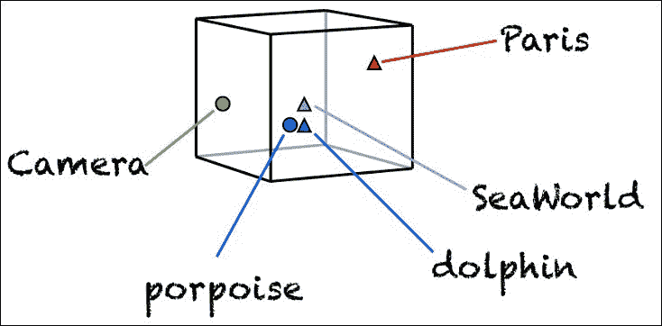

这样的表象就是**密集**。我们希望同义词和可互换的单词在这个空间中是相近的。

在这一章中，我们将介绍非常流行的词嵌入模型 Word2Vec，它最初是由 Mikolov 等人在 2013 年开发的。Word2Vec 有两种不同的型号:**连续包字** ( **CBOW** )和**跳字**。

在 CBOW 方法中，目标是在给定周围上下文的情况下预测单词。给定一个单词，Skip-gram 预测单词的周围上下文(见下图):

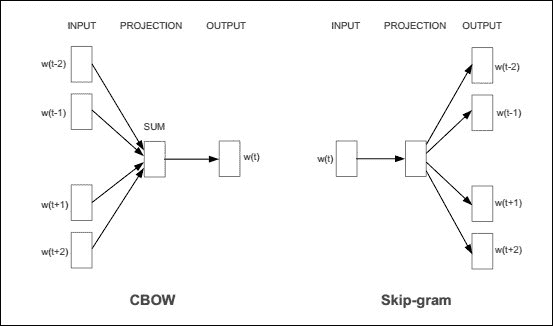

在这一章中，我们将关注 CBOW 模型。我们将从展示数据集开始，然后解释该方法背后的思想。之后，我们将使用 Theano 展示它的一个简单实现。最后，我们将参考词嵌入的一些应用。


# 数据集

在我们解释模型部分之前，让我们从处理文本语料库开始，创建词汇表并将其与文本集成，以便每个单词都表示为一个整数。作为数据集，可以使用任何文本语料库，例如维基百科或网络文章，或者来自 Twitter 等社交网络的帖子。常用的数据集包括 PTB、text8、BBC、IMDB 和 WMT 数据集。

在这一章中，我们使用了`text8`语料库。它由来自维基百科转储的前 1 亿个字符的预处理版本组成。让我们首先下载文集:

```
wget http://mattmahoney.net/dc/text8.zip -O /sharedfiles/text8.gz
gzip -d /sharedfiles/text8.gz -f
```

现在，我们构建词汇表，并用未知的的标记替换罕见的单词。让我们从将数据读入字符串列表开始:

1.  Read the data into a list of strings:

    ```
    words = []
    with open('data/text8') as fin:
      for line in fin:
        words += [w for w in line.strip().lower().split()]

    data_size = len(words)  
    print('Data size:', data_size)
    ```

    从字符串列表中，我们现在可以构建字典。我们从统计单词在`word_freq`字典中的出现频率开始。然后，我们用标记替换那些不常用的，在语料库中出现次数少于`max_df`的单词。

2.  建立字典，用`UNK`令牌:

    ```
    unkown_token = '<UNK>' pad_token = '<PAD>' # for padding the context max_df = 5 # maximum number of freq word_freq = [[unkown_token, -1], [pad_token, 0]] word_freq.extend(Counter(words).most_common()) word_freq = OrderedDict(word_freq) word2idx = {unkown_token: 0, pad_token: 1} idx2word = {0: unkown_token, 1: pad_token} idx = 2 for w in word_freq:   f = word_freq[w]   if f >= max_df:     word2idx[w] = idx     idx2word[idx] = w     idx += 1   else:     word2idx[w] = 0 # map the rare word into the unkwon token     word_freq[unkown_token] += 1 # increment the number of unknown tokens  data = [word2idx[w] for w in words]  del words # for reduce mem use  vocabulary_size = len(word_freq) most_common_words = list(word_freq.items())[:5] print('Most common words (+UNK):', most_common_words) print('Sample data:', data[:10], [idx2word[i] for i in data[:10]])  *Data size: 17005207* *Most common words (+UNK): [('<UNK>', 182564), ('the', 1061396), ('of', 593677), ('and', 416629), ('one', 411764)]* *Sample data: [5239, 3084, 12, 6, 195, 2, 3137, 46, 59, 156] ['anarchism', 'originated', 'as', 'a', 'term', 'of', 'abuse', 'first', 'used', 'against']* 
    ```

    替换生僻字
3.  现在，让我们定义创建数据集的功能(即上下文和目标):

    ```
     def get_sample(data, data_size, word_idx, pad_token, c = 1):    idx = max(0, word_idx - c)   context = data[idx:word_idx]   if word_idx + 1 < data_size:     context += data[word_idx + 1 : min(data_size, word_idx + c + 1)]   target = data[word_idx]   context = [w for w in context if w != target]   if len(context) > 0:     return target, context + (2 * c - len(context)) * [pad_token]   return None, None  def get_data_set(data, data_size, pad_token, c=1):   contexts = []   targets = []   for i in xrange(data_size):     target, context =  get_sample(data, data_size, i, pad_token, c)     if not target is None:       contexts.append(context)       targets.append(target)    return np.array(contexts, dtype='int32'), np.array(targets, dtype='int32')
    ```


# 连续包字模式

下图显示了神经网络的设计,用于预测给定上下文的单词:

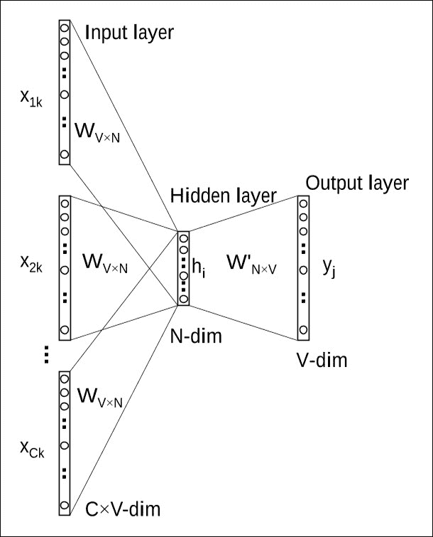

输入层接收上下文，而输出层预测目标单词。我们将用于 CBOW 模型的模型有三层:输入层、隐藏层(也称为投影层或嵌入层)和输出层。在我们的设置中，词汇大小为 V，隐藏层大小为 n。相邻单元完全连接。

输入和输出可以用一个索引(整数，0 维)或一个热编码向量(1 维)来表示。乘以独热编码向量`v`简单地包括取嵌入矩阵的第 j 行:

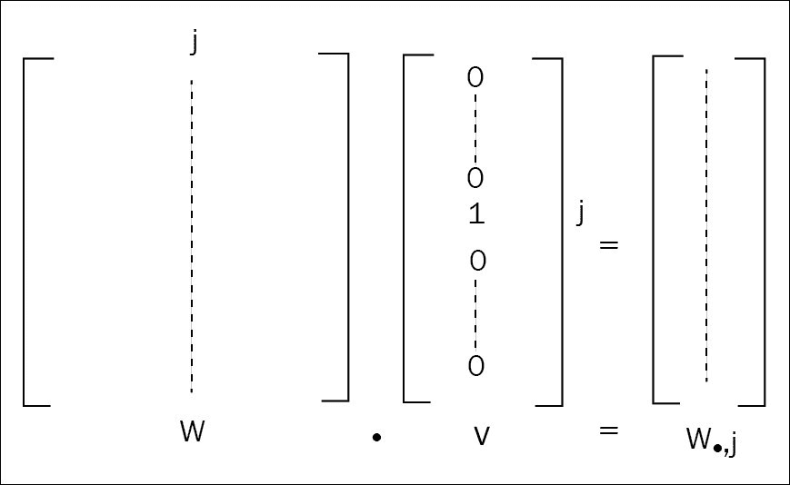

由于索引表示在内存使用方面比一键编码表示更有效，并且 Theano 支持对符号变量进行索引，因此最好尽可能采用索引表示。

因此，输入(上下文)将是二维的，由一个矩阵表示，具有两个维度:批量大小和上下文长度。输出(目标)是一维的，由一维向量表示:批量大小。

让我们定义 CBOW 模型:

```
import theano
import theano.tensor as T
import numpy as np
import math
context = T.imatrix(name='context')
target = T.ivector('target')
```

上下文和目标变量是该模型的已知参数。CBOW 模型的未知参数是输入层和隐藏层之间的连接矩阵，以及隐藏层和输出层之间的连接矩阵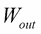:

```
vocab_size = len(idx2word)
emb_size = 128
W_in_values = np.asarray(np.random.uniform(-1.0, 1.0, 
	(vocab_size, emb_size)),
dtype=theano.config.floatX)

W_out_values = np.asarray(np.random.normal(
	scale=1.0 / math.sqrt(emb_size),
   size=(emb_size, vocab_size)),
   dtype=theano.config.floatX)

W_in = theano.shared(value=W_in_values,
                      name='W_in',
                      borrow=True)

W_out = theano.shared(value=W_out_values,
                      name='W_out',
                      borrow=True)

params = [W_in, W_out]
```

的每一行是输入层的关联单词`i`的 N 维向量表示，其中`N`是隐藏层尺寸。给定一个上下文，在计算隐层输出时，CBOW 模型取输入上下文单词向量的平均值，并使用`input -> hidden`权重矩阵与平均向量的乘积作为输出:

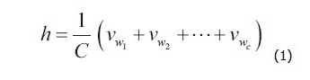

这里，`C`是上下文中的单词数，`w1, w2, w3,..., wc`是上下文中的单词，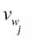是单词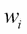的输入向量。输出层的激活函数是 softmax 层。等式 2 和 3 显示了我们如何计算输出层:

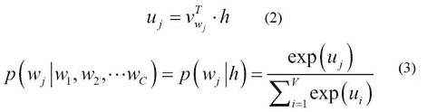

这里，是矩阵的第 j 列，`V`是词汇量。在我们的设置中，词汇大小是`vocab_size`，隐藏层大小是`emb_size`。损失功能如下:


(4)

现在，让我们来翻译等式 1、2、3 和 4。

计算隐藏(投影)层输出:`input -> hidden (eq. 1)`

```
h = T.mean(W_in[context], axis=1) 

For the hidden -> output layer (eq. 2)
uj = T.dot(h, W_out) 
```

softmax 激活(等式 3) :

```
p_target_given_contex = T.nnet.softmax(uj).dimshuffle(1, 0)
```

损失函数(等式。4):

```
loss = -T.mean(T.log(p_target_given_contex)[T.arange(target.shape[0]), target]) 
```

使用 SGD 更新模型的参数:

```
g_params = T.grad(cost=loss, wrt=params)
updates = [
        (param, param - learning_rate * gparam)
        for param, gparam in zip(params, g_params)
]
```

最后，我们需要定义培训和评估功能。

让我们共享数据集以将其传递给 GPU。为简单起见，我们假设我们有一个名为`get_data_set`的函数，它返回一组目标及其周围的上下文:

```
contexts, targets = get_data_set(data, data_size, word2idx[pad_token], c=2)

contexts = theano.shared(contexts)
targets = theano.shared(targets)

index = T.lscalar('index')

train_model = theano.function(
    inputs=[index],
    outputs=[loss],
    updates=updates,
    givens={
        context: contexts[index * batch_size: (index + 1) * batch_size],
        target: targets[index * batch_size: (index + 1) * batch_size]
    }
)
```

`train_model`的输入变量是批处理的索引，因为由于共享变量，整个数据集已经一次性传输到 GPU。

为了在训练期间进行验证，我们使用小批量示例和所有嵌入之间的余弦相似性来评估模型。

让我们使用一个`theano`变量来放置验证模型的输入:

```
valid_samples = T.ivector('valid_samples') 
```

验证输入的规范化词嵌入:

```
embeddings = params[0]
norm = T.sqrt(T.sum(T.sqr(embeddings), axis=1, keepdims=True))
normalized_embeddings = W_in / norm

valid_embeddings = normalized_embeddings[valid_samples]
```

相似度是由余弦相似度函数给出的:

```
similarity = theano.function([valid_samples], T.dot(valid_embeddings, normalized_embeddings.T))
```


# 训练模特

现在我们可以开始训练模型了。在本例中，我们选择使用批量大小为 64 和 100 个历元的 SGD 来训练模型。为了验证该模型，我们随机选择了 16 个单词，并使用相似性度量作为评估指标:

1.  让我们开始训练:

    ```
    valid_size = 16     # Random set of words to evaluate similarity on. valid_window = 100  # Only pick dev samples in the head of the distribution. valid_examples = np.array(np.random.choice(valid_window, valid_size, replace=False), dtype='int32')  n_epochs = 100 n_train_batches = data_size // batch_size n_iters = n_epochs * n_train_batches train_loss = np.zeros(n_iters) average_loss = 0  for epoch in range(n_epochs):     for minibatch_index in range(n_train_batches):          iteration = minibatch_index + n_train_batches * epoch         loss = train_model(minibatch_index)         train_loss[iteration] = loss         average_loss += loss           if iteration % 2000 == 0:            if iteration > 0:             average_loss /= 2000             # The average loss is an estimate of the loss over the last 2000 batches.             print("Average loss at step ", iteration, ": ", average_loss)             average_loss = 0             # Note that this is expensive (~20% slowdown if computed every 500 steps)         if iteration % 10000 == 0:            sim = similarity(valid_examples)           for i in xrange(valid_size):               valid_word = idx2word[valid_examples[i]]               top_k = 8 # number of nearest neighbors               nearest = (-sim[i, :]).argsort()[1:top_k+1]               log_str = "Nearest to %s:" % valid_word               for k in xrange(top_k):                   close_word = idx2word[nearest[k]]                   log_str = "%s %s," % (log_str, close_word)               print(log_str)
    ```

2.  最后，让我们创建两个通用函数，帮助我们将任何模型参数保存在一个可重用的`utils.py`实用程序文件中:

    ```
     def save_params(outfile, params):     l = []     for param in params:         l = l + [ param.get_value() ]     numpy.savez(outfile, *l)     print("Saved model parameters to {}.npz".format(outfile))  def load_params(path, params):     npzfile = numpy.load(path+".npz")     for i, param in enumerate(params):         param.set_value( npzfile["arr_" +str(i)] )     print("Loaded model parameters from {}.npz".format(path))
    ```

3.  在 GPU 上运行，前面的代码打印出以下结果:

    ```
     *Using gpu device 1: Tesla K80 (CNMeM is enabled with initial size: 80.0% of memory, cuDNN 5105)* *Data size 17005207* *Most common words (+UNK) [('<UNK>', 182565), ('<PAD>', 0), ('the', 1061396), ('of', 593677), ('and', 416629)]* *Sample data [5240, 3085, 13, 7, 196, 3, 3138, 47, 60, 157] ['anarchism', 'originated', 'as', 'a', 'term', 'of', 'abuse', 'first', 'used', 'against']* *Average loss at step  0 :  11.2959747314* *Average loss at step  2000 :  8.81626828802* *Average loss at step  4000 :  7.63789177912* *Average loss at step  6000 :  7.40699760973* *Average loss at step  8000 :  7.20080085599* *Average loss at step  10000 :  6.85602856147* *Average loss at step  12000 :  6.88123817992* *Average loss at step  14000 :  6.96217652643* *Average loss at step  16000 :  6.53794862854* *...*   *Average loss at step  26552000 :  4.52319500107* *Average loss at step  26554000 :  4.55709513521* *Average loss at step  26556000 :  4.62755958384* *Average loss at step  26558000 :  4.6266620369* *Average loss at step  26560000 :  4.82731778347* *Nearest to system: systems, network, device, unit, controller, schemes, vessel, scheme,* *Nearest to up: off, out, alight, forth, upwards, down, ordered, ups,* *Nearest to first: earliest, last, second, next, oldest, fourth, third, newest,* *Nearest to nine: apq, nineteenth, poz, jyutping, afd, apod, eurocents, zoolander,* *Nearest to between: across, within, involving, with, among, concerning, through, from,* *Nearest to state: states, provincial, government, nation, gaeltachta, reservation, infirmity, slates,* *Nearest to are: were, is, aren, was, include, have, weren, contain,* *Nearest to may: might, should, must, can, could, would, will, cannot,* *Nearest to zero: hundred, pounders, hadza, cest, bureaus, eight, rang, osr,* *Nearest to that: which, where, aurea, kessai, however, unless, but, although,* *Nearest to can: could, must, cannot, should, may, will, might, would,* *Nearest to s: his, whose, its, castletown, cide, codepoint, onizuka, brooklands,* *Nearest to will: would, must, should, could, can, might, shall, may,* *Nearest to their: its, his, your, our, her, my, the, whose,* *Nearest to but: however, though, although, which, while, whereas, moreover, unfortunately,* *Nearest to not: never, indeed, rarely, seldom, almost, hardly, unable, gallaecia,* *Saved model parameters to model.npz* 
    ```

让我们注意:

*   生僻字只更新少量次数，而常用字更多地出现在输入和上下文窗口中。对常用词进行二次抽样可以弥补这一点。
*   所有的权重在输出嵌入中被更新，并且只有它们中的一些，那些对应于上下文窗口中的单词的权重被积极地更新。负采样可以帮助重新平衡更新中的正负因素。


# 可视化学习到的嵌入

让我们将 2D 图形中的嵌入形象化，以便理解它们如何捕捉相似性和语义。为了这个目的，我们需要将嵌入的维数减少到二维，而不改变嵌入的结构。

降低维度的数量被称为流形学习，存在许多不同的技术，其中一些是线性的，如**主成分分析** ( **PCA** )，**独立成分分析** ( **ICA** )，**线性判别分析** ( **LDA** )，以及**潜在语义分析** / **索引**(**LSA ****局部线性嵌入** ( **LLE** )，**黑森** **特征映射**，**谱嵌入**，**局部切空间嵌入**，**多维尺度** ( **MDS** )，以及**t-分布随机邻居嵌入** ( **t-SNE** )。****

为了显示单词 embedding，让我们使用 t-SNE，一种适用于高维数据的伟大技术，以揭示局部结构和聚类，而不将点聚集在一起:

1.  Visualize the embeddings:

    ```
    def plot_with_labels(low_dim_embs, labels, filename='tsne.png'):
      assert low_dim_embs.shape[0] >= len(labels), "More labels than embeddings"
      plt.figure(figsize=(18, 18))  #in inches
      for i, label in enumerate(labels):
        x, y = low_dim_embs[i,:]
        plt.scatter(x, y)
        plt.annotate(label,
                     xy=(x, y),
                     xytext=(5, 2),
                     textcoords='offset points',
                     ha='right',
                     va='bottom')

      plt.savefig(filename)

    from sklearn.manifold import TSNE
    import matplotlib.pyplot as plt

    tsne = TSNE(perplexity=30, n_components=2, init='pca', n_iter=5000)
    plot_only = 500
    low_dim_embs = tsne.fit_transform(final_embeddings[:plot_only,:])
    labels = [idx2word[i] for i in xrange(plot_only)]
    plot_with_labels(low_dim_embs, labels)
    ```

    绘制的地图显示了具有相似嵌入且彼此靠近的单词:

    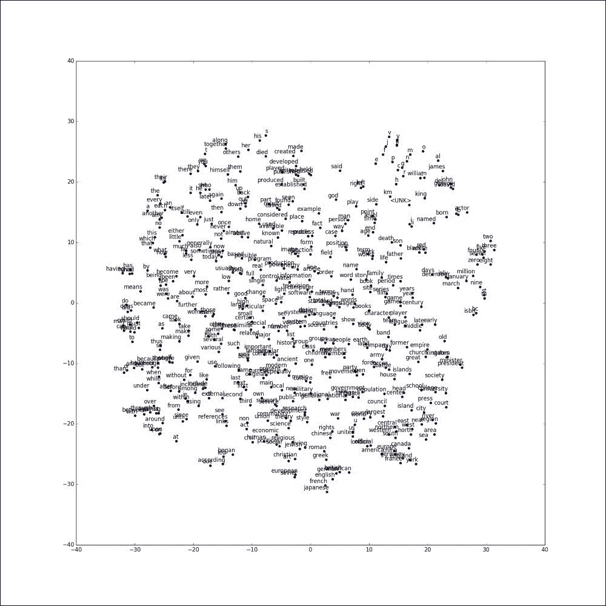


# 评估嵌入——类比推理

类比推理是一种简单而有效的评估嵌入的方法，它通过预测如下形式的句法和语义关系:a 是 b 的，就像 c 是 to _？，表示为 *a : b → c:？*。任务是识别保留的第四个单词，只有精确匹配的单词才被认为是正确的。

例如，*女人*这个词是对这个问题的最好回答*国王之于女王就像男人之于女王？*。假设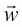是归一化到单位范数的单词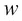的表示向量。那么，我们就可以回答问题 *a : b → c:？*，通过查找单词最接近:

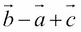

根据余弦相似度:

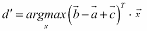

现在让我们使用 Theano 实现类比预测功能。首先，我们需要定义函数的输入。类比函数接收三个输入，分别是`a`、`b`和`c`的单词索引:

```
analogy_a = T.ivector('analogy_a')  
analogy_b = T.ivector('analogy_b')  
analogy_c = T.ivector('analogy_c')
```

然后，我们需要将每个输入映射到词嵌入向量。每一行`a_emb`、`b_emb`、`c_emb`都是一个单词的嵌入向量:

```
a_emb = embeddings[analogy_a]  # a's embs
b_emb = embeddings[analogy_b]  # b's embs
c_emb = embeddings[analogy_c]  # c's embs
```

现在我们可以计算每个目标和 vocab 对之间的余弦距离。我们期望 d 在单位超球面上的嵌入向量是 near: `c_emb + (b_emb - a_emb)`，其形状为`[bsz, emb_size]`。`dist`有形状[ `bsz, vocab_size` ]。

```
 dist = T.dot(target, embeddings.T)
```

在这个例子中，我们认为预测函数取前四个单词。因此，我们可以将 Theano 中的函数定义如下:

```
pred_idx = T.argsort(dist, axis=1)[:, -4:]
prediction = theano.function([analogy_a, analogy_b, analogy_c], pred_idx)
```

要运行前面的函数，我们需要加载评估数据，在本例中是 Google 定义的类比问题集。每个问题包含由空格分隔的四个单词。第一个问题可以解读为*雅典之于希腊就像巴格达之于 _？*而正确答案应该是*伊拉克*:

```
Athens Greece Baghdad Iraq
Athens Greece Bangkok Thailand
Athens Greece Beijing China
```

让我们使用下面代码中定义的`read_analogies`函数加载类比问题:

```
def read_analogies(fname, word2idx):
    """Reads through the analogy question file.
    Returns:
      questions: a [n, 4] numpy array containing the analogy question's
                 word ids.
      questions_skipped: questions skipped due to unknown words.
    """
    questions = []
    questions_skipped = 0
    with open(fname, "r") as analogy_f:
      for line in analogy_f:
        if line.startswith(":"):  # Skip comments.
          continue
        words = line.strip().lower().split(" ")
        ids = [word2idx.get(w.strip()) for w in words]
        if None in ids or len(ids) != 4:
          questions_skipped += 1
        else:
          questions.append(np.array(ids))
    print("Eval analogy file: ", fname)
    print("Questions: ", len(questions))
    print("Skipped: ", questions_skipped)

    return np.array(questions, dtype=np.int32)
```

现在，我们可以运行评估模型:

```
  """Evaluate analogy questions and reports accuracy."""

  # How many questions we get right at precision@1.
  correct = 0
  analogy_data = read_analogies(args.eval_data, word2idx)
  analogy_questions = analogy_data[:, :3]
  answers = analogy_data[:, 3]
  del analogy_data
  total = analogy_questions.shape[0]
  start = 0

  while start < total:
    limit = start + 200
    sub_questions = analogy_questions[start:limit, :]
    sub_answers = answers[start:limit]
    idx = prediction(sub_questions[:,0], sub_questions[:,1], sub_questions[:,2])

    start = limit
    for question in xrange(sub_questions.shape[0]):
      for j in xrange(4):
        if idx[question, j] == sub_answers[question]:
          # Bingo! We predicted correctly. E.g., [italy, rome, france, paris].
          correct += 1
          break
        elif idx[question, j] in sub_questions[question]:
          # We need to skip words already in the question.
          continue
        else:
          # The correct label is not the precision@1
          break
  print()
  print("Eval %4d/%d accuracy = %4.1f%%" % (correct, total,
                                            correct * 100.0 / total))
```

该导致:

```
*Eval analogy file:  questions-words.txt*
*Questions:  17827*
*Skipped:  1717*
*Eval   831/17827 accuracy =  4.7%*

```


# 评估嵌入——定量分析

几个字可能足以表明嵌入的定量分析也是可能的。

一些单词相似性基准提出了基于人类的概念之间的距离:Simlex999 (Hill 等人，2016 年)，Verb-143 (Baker 等人，2014 年)，MEN (Bruni 等人，2014 年)，RareWord (Luong 等人，2013 年)，以及 MTurk- 771 (Halawi 等人，2012 年)。

我们的嵌入之间的相似性距离可以与这些人类距离进行比较，使用 Spearman 的等级相关系数来定量评估所学习的嵌入的质量。


# 词嵌入的应用

词嵌入捕捉单词的意思。它们将离散输入转化为神经网络可以处理的输入。

嵌入是许多与语言相关的应用的开始:

*   生成文本，我们将在下一章看到
*   翻译系统，其中输入和目标句子是单词序列，其嵌入可以由端到端神经网络处理([第八章](part0083_split_000.html#2F4UM2-ccdadb29edc54339afcb9bdf9350ba6b "Chapter 8. Translating and Explaining with Encoding – decoding Networks")、*用编码解码网络翻译和解释*)
*   情感分析([第 5 章](part0060_split_000.html#1P71O2-ccdadb29edc54339afcb9bdf9350ba6b "Chapter 5. Analyzing Sentiment with a Bidirectional LSTM")，*用双向 LSTM 分析情感*)
*   计算机视觉中的零射击学习:word language 中的结构使我们能够找到不存在训练图像的类
*   图像注释/字幕
*   神经精神病学，神经网络可以 100%准确地预测人类的某些精神疾病
*   聊天机器人，或回答用户的问题([第 9 章](part0091_split_000.html#2MP362-ccdadb29edc54339afcb9bdf9350ba6b "Chapter 9. Selecting Relevant Inputs or Memories with the Mechanism of Attention")，*用注意力机制选择相关的输入或记忆*

与单词一样，语义嵌入的原理可以用于任何具有分类变量的问题(图像、声音、电影等的类别)，其中用于激活分类变量的学习嵌入可以用作神经网络的输入，用于进一步的分类挑战。

正如语言构建我们的思维一样，词嵌入有助于构建或改善基于神经网络的系统的性能。


# 重量捆绑

两个权重矩阵和分别用于输入或输出。虽然在反向传播期间，的所有权重在每次迭代时都被更新，但是仅在对应于当前训练输入单词的列上被更新。

**权重绑定** ( **WT** )包括仅使用一个矩阵 W 用于输入和输出嵌入。然后，Theano 计算关于这些新权重的新导数，并且在每次迭代中更新 W 中的所有权重。参数越少，过度拟合越少。

在 Word2Vec 的情况下，这种技术不会给出更好的结果，原因很简单:在 Word2Vec 模型中，在上下文中找到输入单词的概率如下所示:

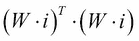

它应该尽可能接近零，但是除了 W = 0 之外不能为零。

但是在的其他应用中，比如在**神经网络语言模型** ( **NNLM** )第四章，*用循环神经网络生成文本*和**神经机器翻译** ( **NMT** )第八章，*用编解码网络翻译解释*中，可以用输出嵌入来表示

*   *输入嵌入通常比输出嵌入差*
*   *WT 解决了这个问题*
*   *用 WT 学习的普通嵌入在质量上接近于没有 WT 的输出嵌入*
*   *在输出嵌入之前插入正则化投影矩阵 P 有助于网络使用相同的嵌入，并且在 WT 下导致甚至更好的结果*

*

# 延伸阅读

请参考以下文章:

*   向量空间中单词表示的有效估计，托马斯·米科洛夫、程凯、格雷格·科拉多、杰弗里·迪恩，2013 年 1 月
*   基于因素的组合嵌入模型，莫宇，2014
*   用于文本分类的字符级卷积网络，张翔，赵军波，杨乐存，2015
*   单词和短语的分布式表示及其组合性，托马斯·米科洛夫，伊利亚·苏茨基弗，程凯，格雷格·科拉多，杰弗里·迪恩，2013
*   使用输出嵌入改进语言模型，Ofir 出版社，Lior Wolf，2016 年 8 月


# 总结

在自然语言处理的情况下，本章介绍了一种将特定文本中的离散输入转换为数字嵌入的常见方法。

使用神经网络训练这些单词表示的技术不需要我们标记数据，而是直接从自然文本中推断其嵌入。这样的训练被命名为*无监督学习*。

深度学习的主要挑战之一是将输入和输出信号转换为网络可以处理的表示形式，特别是浮点向量。然后，神经网络提供了处理这些向量的所有工具，以进行学习、决策、分类、推理或生成。

在接下来的章节中，我们将使用这些嵌入来处理文本和更高级的神经网络。下一章介绍的第一个应用是关于自动文本生成的。*