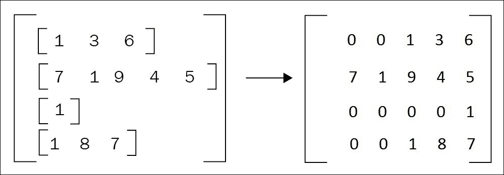
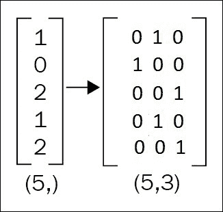
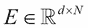
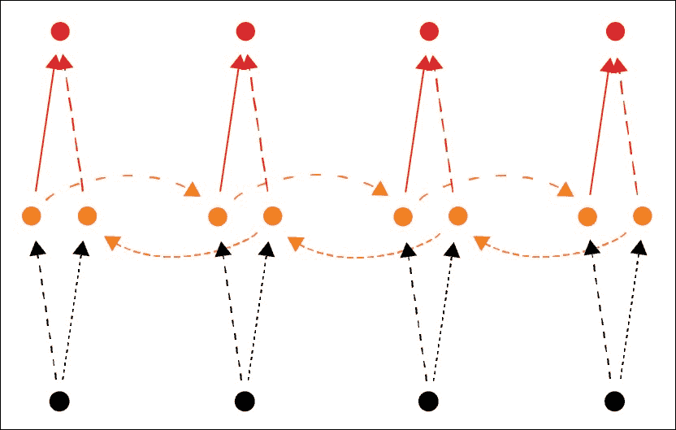

# 第五章。用双向 LSTM 分析情感

为了更好地理解前两章中介绍的常用递归神经网络和单词嵌入，这一章更实用一些。

这也是向读者介绍深度学习的一个新应用的机会，情感分析，这是**自然语言处理** ( **NLP** )的另一个领域。这是一个多对一的方案，一个可变长度的单词序列必须被分配给一个类。可以类似地使用这种方案的一个 NLP 问题是语言检测(英语、法语、德语、意大利语等等)。

前一章演示了如何从头开始构建递归神经网络，而本章则展示了如何使用预构建的模块来帮助实现和训练模型。由于这个例子，读者应该能够决定什么时候在他们的项目中使用 Keras。

本章阐述了以下几点:

*   递归神经网络和单词嵌入概述
*   情感分析
*   喀拉斯图书馆
*   双向递归网络

自动情感分析是识别文本中表达的观点的问题。它通常包括将文本分类成类别，例如*正面*、*负面*和*中性*。观点是几乎所有人类活动的核心，也是我们行为的关键影响因素。

最近，神经网络和深度学习方法已经被用于构建情感分析系统。这种系统具有自动学习一组特征的能力，以克服手工方法的缺点。

**递归神经网络** ( **RNN** )已经在文献中被证明是一种非常有用的技术，用于表示顺序输入，例如文本。递归神经网络的一个特殊扩展，称为**双向递归神经网络** ( **BRNN** )可以捕捉文本中前后的上下文信息。

在这一章中，我们将给出一个例子，展示使用**长短期记忆** ( **LSTM** )架构的双向递归神经网络如何用于处理情感分析的问题。我们的目标是实现一个模型，在该模型中，给定一个文本输入(即一个单词序列)，该模型试图预测它是积极的、消极的还是中性的。


# 安装和配置 Keras

Keras 是一种高级神经网络 API，用 Python 编写，能够运行在 TensorFlow 或 Theano 之上。它的开发是为了使实施深度学习模型对于研发来说尽可能的快速和简单。您可以使用 conda 轻松安装 Keras，如下所示:

```
conda install keras
```

编写 Python 代码时，导入 Keras 会告诉您使用了哪个后端:

```
>>> import keras
*Using Theano backend.*
*Using cuDNN version 5110 on context None*
*Preallocating 10867/11439 Mb (0.950000) on cuda0*
*Mapped name None to device cuda0: Tesla K80 (0000:83:00.0)*
*Mapped name dev0 to device cuda0: Tesla K80 (0000:83:00.0)*
*Using cuDNN version 5110 on context dev1*
*Preallocating 10867/11439 Mb (0.950000) on cuda1*
*Mapped name dev1 to device cuda1: Tesla K80 (0000:84:00.0)*

```

如果您安装了 Tensorflow，它可能不会使用。要指定使用哪个后端，请编写一个 Keras 配置文件，`~/.keras/keras.json:`

```
{
    "epsilon": 1e-07,
    "floatx": "float32",
    "image_data_format": "channels_last",
    "backend": "theano"
}
```

也可以用环境变量直接指定 Theano 后端:

```
KERAS_BACKEND=theano python

```

注意使用的设备是我们在`~/.theanorc` 文件中为 ano 指定的设备。也可以用 no 环境变量来修改这些变量:

```
KERAS_BACKEND=theano THEANO_FLAGS=device=cuda,floatX=float32,mode=FAST_RUN python

```


## 使用 Keras 编程

Keras 提供了一套数据预处理和建模的方法。

层和模型是张量和返回张量上的可调用函数。在 Keras 中，层/模块和模型之间没有区别:模型可以是更大模型的一部分，并由多个层组成。这种子模型表现为具有输入/输出的模块。

让我们创建一个具有两个线性层、一个 ReLU 非线性层和一个 softmax 输出的网络:

```
from keras.layers import Input, Dense
from keras.models import Model

inputs = Input(shape=(784,))

x = Dense(64, activation='relu')(inputs)
predictions = Dense(10, activation='softmax')(x)
model = Model(inputs=inputs, outputs=predictions)
```

`model`模块包含获取一个或多个输入/输出的输入和输出形状的方法，并列出我们模块的子模块:

```
>>> model.input_shape
*(None, 784)*

>>> model.get_input_shape_at(0)
*(None, 784)*

>>> model.output_shape
*(None, 10)*

>>> model.get_output_shape_at(0)
*(None, 10)*

>>> model.name
*'sequential_1'*

>>> model.input
*/dense_3_input*

>>> model.output
*Softmax.0*

>>> model.get_output_at(0)
*Softmax.0*

>>> model.layers
*[<keras.layers.core.Dense object at 0x7f0abf7d6a90>, <keras.layers.core.Dense object at 0x7f0abf74af90>]*

```

为了避免指定每一层的输入，Keras 提出了一种使用`Sequential`模块编写模型的函数方式，以构建一个新的模块或模型组合。

模型的以下定义建立了与前面所示完全相同的模型，用`input_dim`指定块的输入尺寸，否则将是未知的并产生错误:

```
from keras.models import Sequential
from keras.layers import Dense, Activation

model = Sequential()
model.add(Dense(units=64, input_dim=784, activation='relu'))
model.add(Dense(units=10, activation='softmax'))
```

`model`被认为是一个模块或层，可以是更大模型的一部分:

```
model2 = Sequential()
model2.add(model)
model2.add(Dense(units=10, activation='softmax'))
```

然后可以编译每个模块/模型/层，并用数据进行训练:

```
model.compile(optimizer='rmsprop',
              loss='categorical_crossentropy',
              metrics=['accuracy'])
model.fit(data, labels)
```

让我们看看 Keras 的实践。


## SemEval 2013 数据集

让我们从准备数据开始。在本章中，我们将使用 SemEval 2013 竞赛中展示的 Twitter 情感分类(消息级)监督任务中使用的标准数据集。它包含 3662 条 tweet 作为训练集，575 条 tweet 作为开发集，1572 条 tweet 作为测试集。这个数据集中的每个样本都由 tweet ID、极性(正极、负极或中性)和 tweet 组成。

让我们下载数据集:

```
wget http://alt.qcri.org/semeval2014/task9/data/uploads/semeval2013_task2_train.zip
wget http://alt.qcri.org/semeval2014/task9/data/uploads/semeval2013_task2_dev.zip
wget http://alt.qcri.org/semeval2014/task9/data/uploads/semeval2013_task2_test_fixed.zip
unzip semeval2013_task2_train.zip
unzip semeval2013_task2_dev.zip
unzip semeval2013_task2_test_fixed.zip
```

**A** 是指子任务 A，是消息级的情感分类*我们本章的研究目的*，其中 **B** 是指子任务 B 术语级的情感分析。

目录不包含标签，只有推文。`full`包含多一级分类，*主观*或*客观*。我们感兴趣的是`gold`或`cleansed`目录。

让我们使用脚本来转换它们:

```
pip install bs4
python download_tweets.py train/cleansed/twitter-train-cleansed-A.tsv > sem_eval2103.train
python download_tweets.py dev/gold/twitter-dev-gold-A.tsv > sem_eval2103.dev
python download_tweets.py SemEval2013_task2_test_fixed/gold/twitter-test-gold-A.tsv > sem_eval2103.test
```


# 预处理文本数据

众所周知，在 Twitter 上频繁使用 URL、用户提及和标签是很常见的。因此，首先我们需要对 tweets 进行如下预处理。

确保所有标记都使用空格分隔。每条推文都是小写的。

URL、用户提及和标签分别被替换为`<url>`、`<user>`和`<hashtag>`标记。这个步骤是使用`process`函数完成的，它将一条 tweet 作为输入，使用 NLTK `TweetTokenizer`对其进行标记，对其进行预处理，并返回 tweet 中的单词集(标记):

```
import re
from nltk.tokenize import TweetTokenizer

def process(tweet):
  tknz = TweetTokenizer()
  tokens = tknz.tokenize(tweet)
  tweet = " ".join(tokens)
  tweet = tweet.lower()
  tweet = re.sub(r'http[s]?://(?:[a-z]|[0-9]|[$-_@.&amp;+]|[!*\(\),]|(?:%[0-9a-f][0-9a-f]))+', '<url>', tweet) # URLs
  tweet = re.sub(r'(?:@[\w_]+)', '<user>', tweet)  # user-mentions
  tweet = re.sub(r'(?:\#+[\w_]+[\w\'_\-]*[\w_]+)', '<hashtag>', tweet)  # hashtags
  tweet = re.sub(r'(?:(?:\d+,?)+(?:\.?\d+)?)', '<number>', tweet)  # numbers
  return tweet.split(" ")
```

以为例，如果我们有 tweet `RT @mhj: just an example! :D http://example.com #NLP`，函数过程如下:

```
tweet = 'RT @mhj: just an example! :D http://example.com #NLP'
print(process(tweet))
```

返回

```
[u'rt', u'\<user\>', u':', u'just', u'an', u'example', u'!', u':d', u'\<url\>', u'\<hashtag\>']
```

以下函数用于读取数据集并返回元组列表，其中每个元组表示(tweet，class)的一个样本，class 是{0，1 或 2}中定义极性的整数:

```
def read_data(file_name):
  tweets = []
  labels = []
  polarity2idx = {'positive': 0, 'negative': 1, 'neutral': 2}
  with open(file_name) as fin:
    for line in fin:
      _, _, _, _, polarity, tweet = line.strip().split("\t")
      tweet = process(tweet)
      cls = polarity2idx[polarity]
      tweets.append(tweet)
      labels.append(cls)
  return tweets, labels

train_file = 'sem_eval2103.train'
dev_file = 'sem_eval2103.dev'

train_tweets, y_train = read_data(train_file)
dev_tweets, y_dev = read_data(dev_file)
```

现在，我们可以构建词汇表，这是一个将每个单词映射到固定索引的字典。下面的函数接收一组数据作为输入，并返回 tweets 的词汇和最大长度:

```
def get_vocabulary(data):
  max_len = 0
  index = 0
  word2idx = {'<unknown>': index}
  for tweet in data:
    max_len = max(max_len, len(tweet))
    for word in tweet:
      if word not in word2idx:
        index += 1
        word2idx[word] = index
  return word2idx, max_len

word2idx, max_len = get_vocabulary(train_tweets)
vocab_size = len(word2idx)
```

我们还需要一个函数来将每条或每组推文转移到基于词汇的索引中，如果单词存在，或者用未知令牌(索引 0)替换**不在词汇中的** ( **OOV** )单词，如下所示:

```
def transfer(data, word2idx):
  transfer_data = []
  for tweet in data:
    tweet2vec = []
    for word in tweet:
      if word in word2idx:
        tweet2vec.append(word2idx[word])
      else:
        tweet2vec.append(0)
    transfer_data.append(tweet2vec)
  return transfer_data

X_train = transfer(train_tweets, word2idx)
X_dev  = transfer(dev_tweets, word2idx)
```

我们可以节省一些内存:

```
del train_tweets, dev_tweets
```

Keras 提供了一个辅助方法来填充序列，以确保它们都具有相同的长度，以便一批序列可以由一个张量表示，并在 CPU 或 GPU 上对张量使用优化的操作。

默认情况下，该方法在开头填充，这有助于我们获得更好的分类结果:



```
from keras.preprocessing.sequence import pad_sequences
X_train = pad_sequences(X_train, maxlen=max_len, truncating='post')
X_dev = pad_sequences(X_dev, maxlen=max_len, truncating='post')
```

最后，Keras 提供了一种方法，通过添加一个维度将类转换成它们的独热编码表示:



用 Keras `to_categorical`方法:

```
from keras.utils.np_utils import to_categorical
y_train = to_categorical(y_train)
y_dev = to_categorical(y_dev)
```


# 设计模型的架构

本例中模型的主要模块如下:

*   首先，输入句子的单词被映射到实数向量。这一步称为单词的矢量表示或单词嵌入(更多细节参见[第三章](part0040_split_000.html#164MG1-ccdadb29edc54339afcb9bdf9350ba6b "Chapter 3. Encoding Word into Vector")，*将单词编码成矢量*)。
*   然后，这个向量序列由一个使用双 LSTM 编码器的固定长度和实值向量表示。这个向量总结了输入句子，并包含基于单词向量的语义、句法和/或情感信息。
*   最后，这个向量通过一个 softmax 分类器，将句子分类为阳性、阴性或中性。


## 词语的向量表示法

单词嵌入是一种将单词表示为实数向量的分布式语义方法。这种表示具有有用的聚类特性，因为语义和句法相关的单词由相似的向量表示(参见[第 3 章](part0040_split_000.html#164MG1-ccdadb29edc54339afcb9bdf9350ba6b "Chapter 3. Encoding Word into Vector")、*将单词编码成向量*)。

这一步的主要目的是将每个单词映射到一个连续的、低维的实值向量中，该向量稍后可以用作任何模型的输入。所有的单词向量被堆叠成矩阵；这里， *N* 是词汇量，d 是向量维数。这个矩阵被称为嵌入层或查找表层。嵌入矩阵可以使用预训练模型初始化，例如 **Word2vec** 或 **Glove** 。

在 Keras 中，我们可以简单地将嵌入层定义如下:

```
from keras.layers import Embedding
d = 100
emb_layer = Embedding(vocab_size + 1, output_dim=d, input_length=max_len)
```

第一个参数代表词汇大小，`output_dim`是向量维数，`input_length`是输入序列的长度。

让我们将这一层作为输入层添加到模型中，并将模型声明为顺序模型:

```
from keras.models import Sequential
model = Sequential()
model.add(emb_layer)
```


## 使用双 LSTM 的句子表征

递归神经网络具有表示句子等序列的能力。然而，在实践中，由于消失/爆炸梯度，学习香草 RNN 的长期依赖性是困难的。如前一章所述，**长短期记忆** ( **LSTM** )网络被设计成具有更持久的记忆(即状态)，专门用于保存和传输长期信息，这使得它们对于捕捉序列元素之间的长期依赖关系非常有用。

LSTM 单位是本章所用模型的基本组成部分。

Keras 提出了一种方法`TimeDistributed`，在多个时间步中克隆任何模型，并使其递归。但是对于常用的循环单元(如 LSTM ), Keras 中已经存在一个模块:

```
from keras.layers import LSTM
rnn_size = 64
lstm = LSTM(rnn_size, input_shape=(max_len, d))
```

以下内容完全相同:

```
lstm = LSTM(rnn_size, input_dim=d, input_length=max_len)
```

对于随后的层，我们不需要指定输入大小(这是因为 LSTM 层在嵌入层之后)，因此我们可以简单地如下定义`lstm`单元:

```
lstm = LSTM(rnn_size)
```

最后但同样重要的是，在这个模型中，我们希望使用双向 LSTM。它已被证明能产生更好的结果，在给定先前单词的情况下捕捉当前单词的含义，以及出现在以下单词之后的单词:



为了让这个单元双向处理输入，我们可以简单地使用双向，一个 RNNs 的双向包装器:

```
from keras.layers import Bidirectional
bi_lstm = Bidirectional(lstm)
model.add(bi_lstm)
```


## 用 softmax 分类器输出概率

最后，我们可以将从`bi_lstm`获得的向量传递给 softmax 分类器，如下所示:

```
from keras.layers import Dense, Activation

nb_classes = 3
fc = Dense(nb_classes)
classifier = Activation('softmax')
model.add(fc)
model.add(classifier)
```

现在，让我们打印模型的摘要:

```
print(model.summary())
Which will end with the results:
Using Theano backend:
__________________________________________________________________________________________
Layer (type)                      Output Shape        Param #         Connected to                     
=========================================================================================
embedding_1 (Embedding)           (None, 30, 100)     10000100    embedding_input_1[0][0]          
_________________________________________________________________________________________
bidirectional_1 (Bidirectional)   (None, 128)            84480          embedding_1[0][0]                
__________________________________________________________________________________________
dense_1 (Dense)                   (None, 3)                387      bidirectional_1[0][0]            
__________________________________________________________________________________________
activation_1 (Activation)         (None, 3)                  0              dense_1[0][0]                    
=========================================================================================
Total params: 10,084,967
Trainable params: 10,084,967
Non-trainable params: 0
__________________________________________________________________________________________
```


# 编译和训练模型

既然已经定义了模型，就可以开始编译了。为了在 Keras 中编译模型，我们需要确定优化器、损失函数和可选的评估指标。正如我们之前提到的，问题是预测推文是正面的、负面的还是中性的。这个问题被称为多类别分类问题。因此，本例中使用的损失(或目标)函数是`categorical_crossentropy`。我们将使用`rmsprop`优化器和准确性评估指标。

在 Keras 中，您可以找到最先进的优化器、目标和评估指标。使用编译功能在 Keras 中编译模型非常容易:

```
model.compile(optimizer='rmsprop',
          loss='categorical_crossentropy',
          metrics=['accuracy'])
```

我们已经定义了模型并编译了它，现在它已经准备好接受训练了。我们可以通过调用拟合函数，根据定义的数据训练或拟合模型。

训练过程通过数据集运行一定数量的迭代，称为历元，可以使用`epochs`参数指定。我们还可以使用`batch_size`参数设置在每一步提供给模型的实例数量。在这种情况下，我们将使用少量的`epochs` = `30`，并使用小批量的`10`。我们还可以在训练期间评估模型，方法是使用`validation_data`参数显式地输入开发集，或者使用`validation_split`参数从训练集中选择一个子集。在这种情况下，我们将使用我们之前定义的开发集:

```
model.fit(x=X_train, y=y_train, batch_size=10, epochs=30, validation_data=[X_dev, y_dev])
```


# 评估模型

我们已经在训练测试中训练了模型，现在我们可以在测试集上评估网络的性能。这可以使用`evaluation()`功能来完成。此函数返回测试模式下模型的损失值和度量值:

```
test_file = 'sem_eval2103.test'
test_tweets, y_test = read_data(test_file)

X_test  = transfer(test_tweets, word2idx)

del test_twee 

X_test = pad_sequences(X_test, maxlen=max_len, truncating='post')

y_test = to_categorical(y_test)

test_loss, test_acc = model.evaluate(X_test, y_test)

print("Testing loss: {:.5}; Testing Accuracy: {:.2%}" .format(test_loss, test_acc))
```


# 保存并加载模型

要保存Keras 模型的权重，只需调用`save`函数，模型就会被序列化为`.hdf5`格式:

```
model.save('bi_lstm_sentiment.h5')
```

要加载模型，使用 Keras 提供的`load_model`函数，如下所示:

```
from keras.models import load_model
loaded_model = load_model('bi_lstm_sentiment.h5')
```

现在可以对其进行评估，不需要进行编译。例如，在相同的测试集上，我们必须获得相同的结果:

```
test_loss, test_acc = loaded_model.evaluate(X_test, y_test)
print("Testing loss: {:.5}; Testing Accuracy: {:.2%}" .format(test_loss, test_acc))
```


# 运行示例

为了运行模型，我们可以执行下面的命令行:

```
python bilstm.py
```


# 延伸阅读

请参考以下文章:

*   *塞姆瓦尔推特中的情绪分析*https://www.cs.york.ac.uk/semeval-2013/task2.html T21
*   *人格洞察与 IBM 沃森演示*[https://personality-insights-livedemo.mybluemix.net/](https://personality-insights-livedemo.mybluemix.net/)
*   *音调分析仪*https://tone-analyzer-demo.mybluemix.net/
*   *凯拉斯*https://keras.io/
*   深度语音:扩展端到端语音识别，Awni Hannun，Carl Case，Jared Casper，Bryan Catanzaro，Greg Diamos，Erich Elsen，Ryan Prenger，Sanjeev Satheesh，Shubho Sengupta，Adam Coates，Andrew Y. Ng，2014
*   深度递归神经网络语音识别，Alex Graves，Abdel-Rahman Mohamed，Geoffrey Hinton，2013
*   深度演讲 2:英语和普通话的端到端语音识别，Dario Amodei、Rishita Anubhai、Eric Battenberg、Carl Case、Jared Casper、Bryan Catanzaro、陈敬东、Mike Chrzanowski、Adam Coates、Greg Diamos、Erich Elsen、Jesse Engel、Linxi Fan、Christopher Fougner、Tony Han、Awni Hannun、Billy Jun、Patrick LeGresley、Libby Lin、Narang、、Sherjil Ozair、Ryan Prenger、Jonathan Raiman、Sanjeev Satheesh


# 总结

本章回顾了前几章中介绍的基本概念，同时介绍了一个新的应用程序——情感分析和一个高级库——Keras，以简化使用 Theano 引擎开发模型的过程。

这些基本概念包括循环网络、单词嵌入、批量序列填充和一级热编码。提出了双向递归以改进结果。

在下一章中，我们将看到如何使用另一个库 Lasagne 将递归应用于图像，它比 Keras 更轻量级，可以让您更顺利地将库模块与自己的代码混合。