# 八、用编码解码网络翻译和解释

当输入和输出属于同一个空间时，就会出现编码-解码技术。例如，图像分割包括将输入图像转换成新图像，即分割掩模；翻译包括将一个字符序列转换成一个新的字符序列；问答包括用一个新的单词序列来回答一个单词序列。

为了应对这些挑战，编码-解码网络是由两个对称部分组成的网络:编码网络和解码网络。编码器网络将输入数据编码成矢量，解码器网络将使用该矢量来产生输出，例如输入问题的*翻译*、回答的*、解释*的*或者输入句子或输入图像的*注释*。*

编码器网络通常由前面章节中介绍的网络类型的第一层组成，没有用于维度缩减和分类的最后一层。这样一个截断的网络产生一个多维向量，称为*特征*，它给出一个*内部状态表示*，由解码器用来产生输出表示。

本章分解为以下几个关键概念:

*   序列间网络
*   机器翻译的应用
*   应用于聊天机器人
*   去进化
*   应用于图像分割
*   应用于图像字幕
*   解码技术的改进


# 用于自然语言处理的序列到序列网络

基于规则的系统正在被端到端的神经网络所取代，因为它们在性能上有所提高。

一个端到端的神经网络意味着网络通过例子直接推断所有可能的规则，而不知道底层的规则，例如语法和共轭；单词(或字符)作为输入直接送入网络。输出格式也是如此，可以直接是 word 索引本身。网络的结构负责学习带有系数的规则。

这种应用于**自然语言处理** ( **NLP** )的端到端编解码网络的架构选择是**序列到序列网络**，如下图所示:

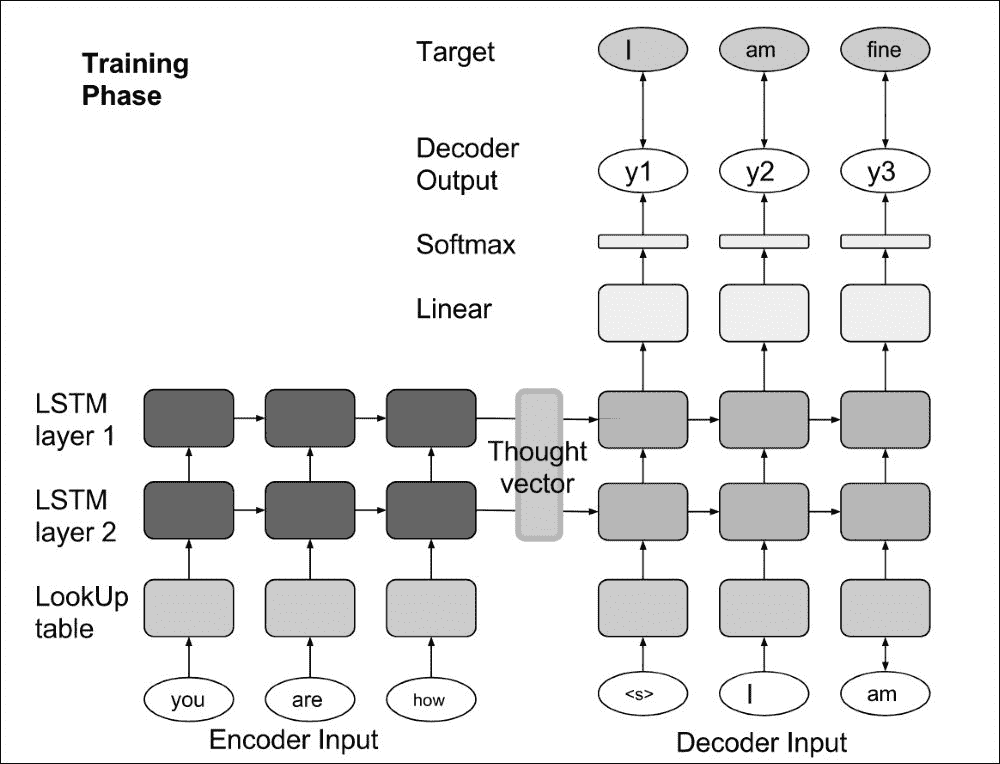

利用查找表将单词索引转换成它们在嵌入空间中的连续多维值。在[第 3 章](part0040_split_000.html#164MG1-ccdadb29edc54339afcb9bdf9350ba6b "Chapter 3. Encoding Word into Vector")、*将单词编码成向量*中介绍的这种转换是将离散单词索引编码成神经网络可以处理的高维空间的关键步骤。

然后，对输入词嵌入运行第一 LSTM 堆栈，以编码输入并产生思维向量。以该向量作为初始内部状态来启动第二个 LSTM 堆栈，并且期望为目标句子中的每个单词产生下一个单词。

在的核心，是 LSTM 单元的经典阶跃函数，具有输入、遗忘、输出和单元门:

一个简单的闭包比一个类更好。一个类没有足够的方法和参数。写作课强制加很多`self`。在所有变量之前，一个`__init__`方法。

```
def LSTM( hidden_size):
  W = shared_norm((hidden_size, 4*hidden_size))
  U = shared_norm((hidden_size, 4*hidden_size))
  b = shared_zeros(4*hidden_size)

  params = [W, U, b]

  def forward(m, X, h_, C_ ):
    XW = T.dot(X, W)
    h_U = T.dot(h_, U)
    bfr_actv = XW + h_U + b

    f = T.nnet.sigmoid( bfr_actv[:, 0:hidden_size] )
    i = T.nnet.sigmoid( bfr_actv[:, 1*hidden_size:2*hidden_size] )
    o = T.nnet.sigmoid( bfr_actv[:, 2*hidden_size:3*hidden_size] )
    Cp = T.tanh( bfr_actv[:, 3*hidden_size:4*hidden_size] )

    C = i*Cp + f*C_
    h = o*T.tanh( C )
    C = m[:, None]*C + (1.0 - m)[:, None]*C_
    h = m[:, None]*h + (1.0 - m)[:, None]*h_

    h, C = T.cast(h, theano.config.floatX), T.cast(h, theano.config.floatX)
    return h, C

  return forward, params
```

为了降低计算成本，将层的全部堆叠构建到单步函数中，并将递归添加到最后一层的输出为每个时间步长产生的全部堆叠阶跃函数的顶部。其他一些实现的每一层都是独立循环的，效率要低得多(慢了两倍多)。

在 *X* 输入的顶部，屏蔽变量`m`在设置为零时停止循环:当没有更多数据时(屏蔽值为零)，隐藏和单元格状态保持不变。因为输入是成批处理的，所以每批中的句子可以具有不同的长度，并且由于有了掩码，一批中的所有句子可以以相同数量的步骤并行处理，对应于最大的句子长度。对于批中的每一行，重复在不同的位置停止。

关闭一个类的原因是因为该模型不能像前面的例子那样直接应用于一些符号输入变量:事实上，该模型应用于递归循环内的序列(使用扫描操作符)。由于这个原因，在许多高级深度学习框架中，每一层都被设计为一个模块，该模块公开了一种前向/后向方法，以添加到各种架构中(并行分支和递归)，如本例所示。

编码器/解码器的全堆栈阶跃函数被放置在它们各自的递归循环中，可以设计如下:

第一部分是输入到嵌入空间的转换。第二部分是 LSTM 层的堆栈。对于解码器(当`target_voca_size != 0`时)，增加一个线性层来计算输出。

```
def stack( voca_size, hidden_size, num_layers, embedding=None, target_voca_size=0):
    params = []

    if embedding == None:
        embedding = shared_norm( (voca_size, hidden_size) )
        params.append(embedding)

    layers = []
    for i in range(num_layers):
        f, p = LSTM(hidden_size)
        layers.append(f)
        params += p

    def forward( mask, inputs, h_, C_, until_symbol = None):
        if until_symbol == None :
            output = embedding[inputs]
        else:
            output = embedding[T.cast( inputs.argmax(axis=-1), "int32" )]

        hos = []
        Cos = []
      for i in range(num_layers):
            hs, Cs = layers[i](mask, output, h_[i], C_[i])
            hos.append(hs)
            Cos.append(Cs)
            output = hs

        if target_voca_size != 0:
            output_embedding = shared_norm((hidden_size, target_voca_size))
            params.append(output_embedding)
            output = T.dot(output, output_embedding)

        outputs = (T.cast(output, theano.config.floatX),T.cast(hos, theano.config.floatX),T.cast(Cos, theano.config.floatX))

        if until_symbol != None:
            return outputs, theano.scan_module.until( T.eq(output.argmax(axis=-1)[0], until_symbol) )

        return outputs

    return forward, params
```

现在我们已经有了编码器/解码器步进函数，让我们来构建完整的编码器-解码器网络。

首先，编码器-解码器网络必须将输入编码为内部状态表示:

为了对输入进行编码，对每个单词循环运行编码堆栈步骤函数。

```
encoderInputs, encoderMask = T.imatrices(2)
h0,C0 = T.tensor3s(2)

encoder, encoder_params = stack(valid_data.source_size, opt.hidden_size, opt.num_layers)

([encoder_outputs, hS, CS], encoder_updates) = theano.scan(
  fn = encoder,
  sequences = [encoderMask, encoderInputs],
  outputs_info = [None, h0, C0])
```

当`outputs_info`由三个变量组成时，扫描操作者认为扫描操作的输出由三个值组成。

这些输出来自编码堆栈阶跃函数，对应于:

堆栈的输出

*   堆栈的隐藏状态，以及
*   对于输入句子的每个步骤/单词，堆栈的单元状态
*   在`outputs_info`中，`None`表示考虑编码器会产生三个输出，但只有最后两个会反馈到阶跃函数中(`h0 -> h_`和`C0 -> C_`)。

假定序列指向两个序列，扫描操作的阶跃函数必须处理四个参数。

然后，一旦输入的句子被编码成向量，编码器-解码器网络就对其进行解码:

编码器网络的最后状态`hS[-1]`、`CS[-1]]`作为解码器网络的初始隐藏和单元状态。

```
decoderInputs, decoderMask, decoderTarget = T.imatrices(3)

decoder, decoder_params = stack(valid_data.target_size, opt.hidden_size, opt.num_layers, target_voca_size=valid_data.target_size)

([decoder_outputs, h_vals, C_vals], decoder_updates) = theano.scan(
  fn = decoder,
  sequences = [decoderMask, decoderInputs],
  outputs_info = [None, hS[-1], CS[-1]])

params = encoder_params + decoder_params

```

在输出的基础上计算对数似然性与上一章序列中的相同。

为了进行评估，必须将最后一个预测的字输入到解码器的输入端，以预测下一个字，这与输入和输出序列已知的训练有点不同:

For evaluation, the last predicted word has to be fed into the input of the decoder to predict the next word, which is a bit different from training, where input and output sequences are known:

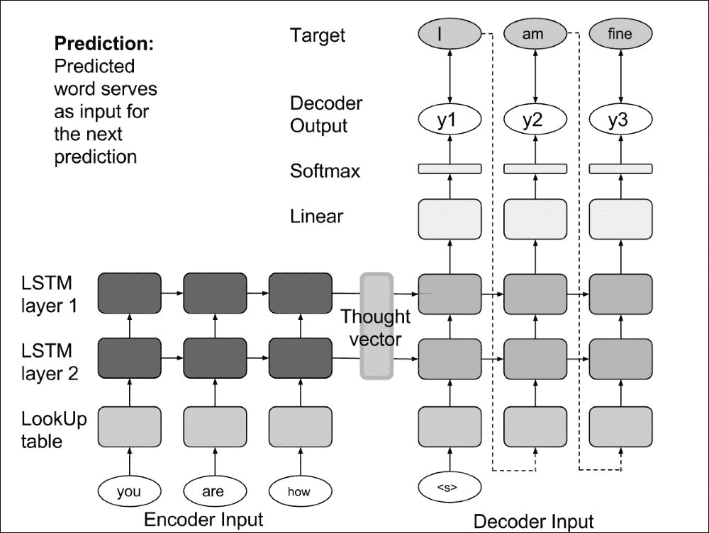

在这种情况下，`outputs_info`中的`None`可以替换为初始值`prediction_start`，即`start`令牌。由于不再是`None`，只要与`h0`和`C0`在一起，这个初始值将馈入解码器的步进函数。扫描算子认为在每一步有三个先前的值馈入解码器函数(而不是像以前那样有两个)。由于从输入序列中删除了`decoderInputs`,解码器堆栈阶跃函数的参数数量仍为 4:使用之前的预测输出值代替输入值。这样，相同的解码器功能可以用于训练和预测:

非序列参数`valid_data.idx_stop`向解码器步进函数指示其处于预测模式，意味着输入不是字索引，而是其先前的输出(需要找到最大索引)。

```
prediction_mask = theano.shared(np.ones(( opt.max_sent_size, 1), dtype="int32"))

prediction_start = np.zeros(( 1, valid_data.target_size), dtype=theano.config.floatX)
prediction_start[0, valid_data.idx_start] = 1
prediction_start = theano.shared(prediction_start)

([decoder_outputs, h_vals, C_vals], decoder_updates) = theano.scan(
  fn = decoder,
  sequences = [prediction_mask],
  outputs_info = [prediction_start, hS[-1], CS[-1]],
  non_sequences = valid_data.idx_stop
  )
```

同样在预测模式下，一次预测一句话(批量大小为`1`)。由于解码器堆栈阶跃函数中的`theano.scan_module.until`输出，当`end`令牌产生时，循环停止，并且不需要解码更多的字。

Seq2seq 为翻译


# **序列到序列** ( **Seq2seq** )网络首次应用于语言翻译。

已经为计算语言学协会的会议设计了翻译任务，数据集 WMT16 由不同语言的新闻翻译组成。该数据集的目的是评估新的翻译系统或技术。我们将使用德语-英语数据集。

首先，对数据进行预处理:

```
 python 0-preprocess_translations.py --srcfile data/src-train.txt --targetfile data/targ-train.txt --srcvalfile data/src-val.txt --targetvalfile data/targ-val.txt --outputfile data/demo First pass through data to get vocab... Number of sentences in training: 10000 Number of sentences in valid: 2819 Source vocab size: Original = 24995, Pruned = 24999 Target vocab size: Original = 35816, Pruned = 35820 (2819, 2819) Saved 2819 sentences (dropped 181 due to length/unk filter) (10000, 10000) Saved 10000 sentences (dropped 0 due to length/unk filter) Max sent length (before dropping): 127
```

1.  乍一看，你会注意到一个历元的 GPU 时间是 *445.906425953* ，因此比在 CPU 上快十倍( *4297.15962195* )。
2.  Train the `Seq2seq` network:

    ```
    python 1-train.py  --dataset translation
    ```

    一旦训练完毕，将你的英语句子翻译成德语，加载训练好的模型:

    ```
     python 1-train.py  --dataset translation --model model_translation_e100_n2_h500
    ```

3.  聊天机器人的 Seq2seq


# 序列到序列网络的第二个目标应用是问答或聊天机器人。

为此，下载康奈尔电影对话语料库并对其进行预处理:

这个语料库包含了从原始电影剧本中提取的大量元数据丰富的虚构对话。

```
wget http://www.mpi-sws.org/~cristian/data/cornell_movie_dialogs_corpus.zip -P /sharedfiles/
unzip /sharedfiles/cornell_movie_dialogs_corpus.zip  -d /sharedfiles/cornell_movie_dialogs_corpus

python 0-preprocess_movies.py
```

由于源句子和目标句子使用相同的语言，它们使用相同的词汇，解码网络可以使用与编码网络相同的词嵌入:

同样的命令也适用于`chatbot`数据集:

```
if opt.dataset == "chatbot":
    embeddings = encoder_params[0]
```

提高序列间网络的效率

```
python 1-train.py  --dataset chatbot # training
python 1-train.py  --dataset chatbot --model model_chatbot_e100_n2_h500 # answer my question
```


# 在聊天机器人的例子中，首先要注意的有趣的一点是逆序输入序列:这种技术已经被证明可以改善结果。

对于翻译，通常使用双向 LSTM 来计算内部状态，如[第 5 章](part0060_split_000.html#1P71O2-ccdadb29edc54339afcb9bdf9350ba6b "Chapter 5. Analyzing Sentiment with a Bidirectional LSTM")、*使用双向 LSTM 分析情绪*所示:两个 lstm，一个以正向顺序运行，另一个以反向顺序运行，在序列上并行运行，并且它们的输出被连接:

For translation, it is very common then to use a bidirectional LSTM to compute the internal state as seen in [Chapter 5](part0060_split_000.html#1P71O2-ccdadb29edc54339afcb9bdf9350ba6b "Chapter 5. Analyzing Sentiment with a Bidirectional LSTM"), *Analyzing Sentiment with a Bidirectional LSTM*: two LSTMs, one running in the forward order, the other in the reverse order, run in parallel on the sequence, and their outputs are concatenated:

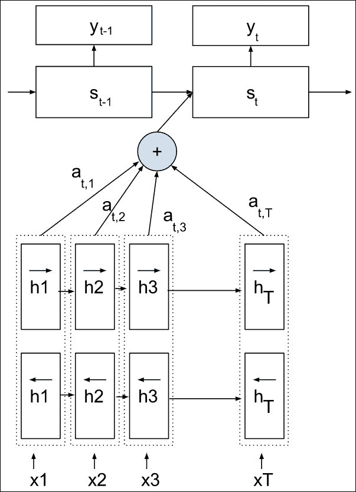

考虑到未来和过去，这种机制可以获取更好的信息。

另一项技术是*注意力机制*，这将是下一章的重点。

最后，*细化技术*已经开发完成，并通过二维网格 LSTM 进行了测试，这些技术离叠加 LSTM 不远(唯一的区别是深度/叠加方向上的门控机制):

网格长短期记忆

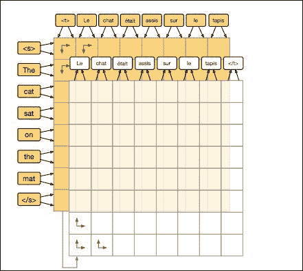

Grid long short-term memory

细化的原则是在输入句子上按两种顺序运行堆栈。这一公式背后的想法是让编码器网络在正向编码句子后重新访问或重新编码句子，并隐式捕获一些时间模式。还要注意，2D 网格为这种重新编码提供了更多可能的相互作用，在每个预测步骤对向量进行重新编码，使用先前输出的单词作为下一个预测单词的方向。所有这些改进都与更大的计算能力有关，对于这个再编码器网络来说为**O(n m)**(*n*和 *m* 表示输入和目标句子的长度)，而对于编码器-解码器网络来说为 **O(n+m)** 。

所有这些技术都减少了困惑。训练模型时，也考虑使用**波束搜索算法**，该算法将在每个时间步跟踪前 N 个可能的预测及其概率，而不是一个，以避免第一个位置的一个坏预测排序可能导致进一步错误预测的可能性。

图像去卷积


# 在图像的案例中，研究人员一直在寻找与编码卷积相反的解码操作。

第一个应用是对卷积网络的分析和理解，如在第 2 章、*中看到的，使用前馈网络*对手写数字进行分类，该网络由卷积层、最大池层和校正线性单元组成。为了更好地理解网络，其思想是将图像中对于网络的给定单元最有区别的部分可视化:高级特征图中的一个单个神经元保持非零，并且从该激活，信号被反向传播回 2D 输入。

为了通过最大汇集层重建信号，想法是在正向传递期间跟踪每个汇集区域内的最大值的位置。名为 **DeConvNet** 的这种架构可以表示为:

可视化和理解卷积网络

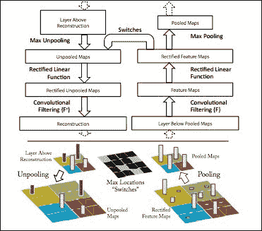

Visualizing and understanding convolutional networks

信号被反向传播到在正向传递期间具有最大值的位置。

为了通过 ReLU 层重建信号，已经提出了三种方法:

*反向传播*仅反向传播到正的位置

*   *反向去配置*仅反向传播正梯度
*   *导向反向传播*仅反向传播到满足前两个条件的位置，即正向传递期间的正输入和正梯度
*   方法如下图所示:

The methods are illustrated in the following figure:

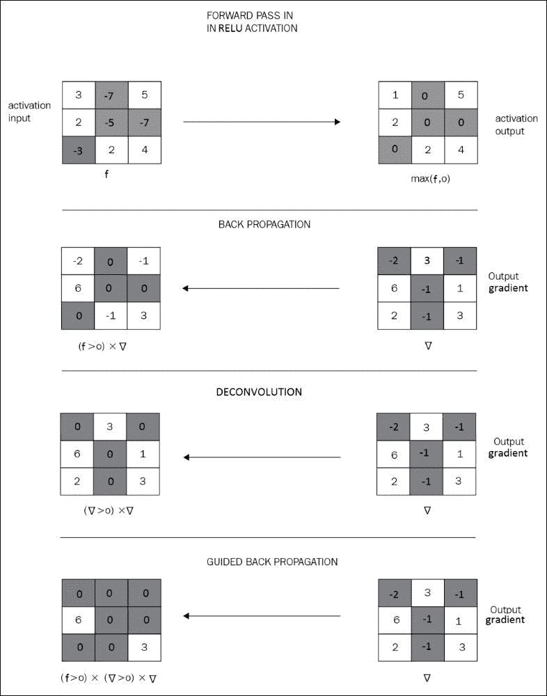

来自第一层的反向传播给出了各种类型的滤波器:

The retro-propagation from the first layers gives various sorts of filter:

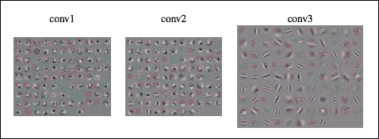

然而，从网络中的更高层，引导反向传播给出了更好的结果:

However, from higher layers in the network, the guided back-propagation gives much better results:

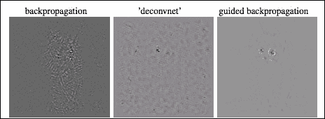

还可以对输入图像的反向传播进行调节，这将激活一个以上的神经元，反向传播将从这些神经元应用，以获得更精确的输入可视化:

It is also possible to condition the back-propagation on an input image, that will activate more than one neuron, from which the retro-propagation will be applied, to get a more precise input visualization:

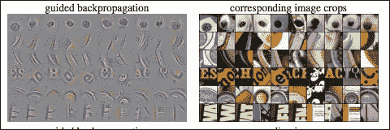

反向传播也可以应用于原始输入图像，而不是空白图像，这一过程被 Google research 命名为**概念主义**，当反向传播用于增加输出概率时:

The back-propagation can also be applied to the original input image rather than a blank one, a process that has been named **Inceptionism** by Google research, when retro-propagation is used to augment the output probability:

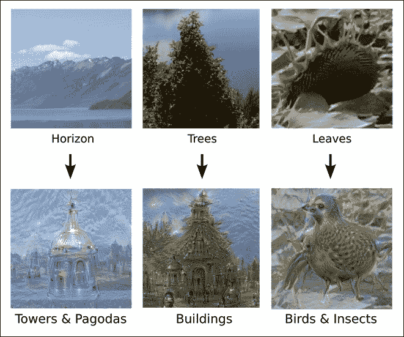

但是去卷积的主要目的是用于场景分割或图像语义分析，其中去卷积由学习的上采样卷积代替，例如在 **SegNet 网络**中:

SegNet:一种用于图像分割的深度卷积编解码器架构

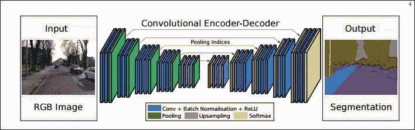

SegNet: A deep convolutional encoder-decoder architecture for image segmentation

在去卷积过程的每一步，较低的输入特征通常被连接到当前特征以进行上采样。

**深度遮罩网络**采用了一种混合方法，只对包含物体的面片进行解卷积。为此，它在包含对象的 224x224 的输入小块上(平移+/- 16 像素)而不是在整个图像上进行训练:

学习分割候选对象

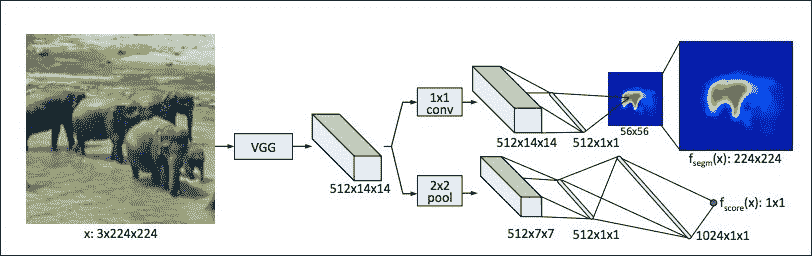

Learning to segment object candidates

编码器(VGG-16)网络的卷积具有因子 16 的下采样，导致 14×14 的特征图。

联合学习训练两个分支，一个用于分割，一个用于如果对象在面片中存在、居中并处于正确比例时的评分。

感兴趣的分支是语义分支，其从 14×14 的特征图向上采样到小块中的对象的 56×56 的分割图。如果满足以下条件，则可以进行上采样:

完全连接的图层，这意味着上采样地图中的每个位置都取决于所有要素，并且具有预测值的全局图片

*   卷积(或局部连接层)，减少了参数的数量，但也用局部视图预测了每个位置得分
*   一种混合方法，由两个线性层组成，它们之间没有非线性，以某种方式执行降维，如上图所示
*   然后，通过简单的双线性上采样层将输出蒙版上采样回原始面片尺寸 224x224。

为了处理完整的输入图像，完全连接的层可以被变换成卷积，其核大小等于完全连接的层的输入大小并且具有相同的系数，从而当将应用于完整的图像时，网络变成完全卷积的，步长为 16。

由于序列到序列网络已经通过双向重新编码机制进行了改进， **SharpMask** 方法使用输入卷积特征在等效尺度上提高了上采样去卷积过程的清晰度:

学习细化对象段

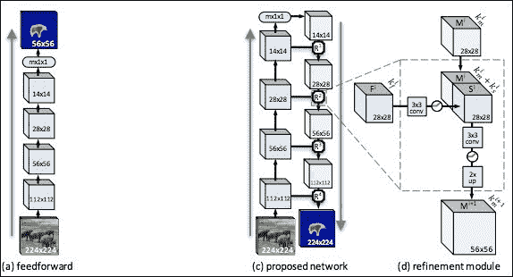

Learning to refine object segments

虽然 SegNet 方法仅从通过跟踪最大池索引产生的上采样图中学习去卷积，但 SharpMask 方法直接重用输入特征图，这是粗粒度到细粒度方法的一种非常常用的技术。

最后，请记住可以通过应用**条件随机场** ( **CRF** )后处理步骤进一步改善结果，无论是一维输入(如文本)还是二维输入(如分割图像)。

多模态深度学习


# 为了进一步开放可能的应用，编码-解码框架可以应用于不同的模态，例如图像字幕。

图像字幕包括用文字描述图像的内容。输入是一幅图像，通过一个深度卷积网络自然地编码成一个思想向量。

描述图像内容的文本可以用与解码器相同的 LSTM 网络堆栈从该内部状态向量中产生，如 Seq2seq 网络:

The text to describe the content of the image can be produced from this internal state vector with the same stack of LSTM networks as a decoder, as in Seq2seq networks:

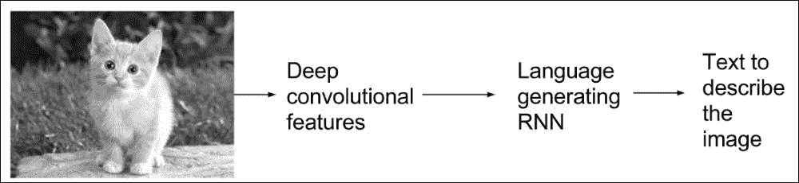

延伸阅读


# 请参考以下主题以获得更好的见解:

*神经网络的序列到序列学习*，伊利亚·苏茨基弗，奥里奥尔·维尼亚尔斯，Quoc V. Le，2014 年 12 月

*   *使用统计机器翻译的 RNN 编码器-解码器学习短语表示*，赵京云，巴特·范·梅里恩博尔，卡格拉尔·古尔切雷，迪米特里·巴丹瑙，费特希·布加雷斯，霍尔格·施文克，约舒阿·本吉奥，2014 年 9 月
*   *联合学习对齐和翻译的神经机器翻译*，Dzmitry Bahdanau，Kyunghyun Cho，Yoshua Bengio，2016 年 5 月
*   *一个神经对话模型*，Oriol Vinyals，Quoc Le，2015 年 7 月
*   *用于统计机器翻译的快速和稳健的神经网络联合模型*，Jacob Devlin，Rabih Zbib，Huang，Thomas Lamar，Richard Schwartz，John Mkahoul，2014
*   SYSTRAN 的纯神经机器翻译系统*、Josep Crego、Jungi Kim、Guillaume Klein、、Kathy Yang、Jean Senellart、、Akhanov、Patrice Brunelle、Aurelien Coquard、Yongchao Deng、Satoshi Enoue、Chiyo Geiss、Joshua Johanson、Ardas Khalsa、Raoum Khiari、Byeongil Ko、Catherine Kobus、Jean Lorieux、Leidiana Martins、Dang-Chuan Nguyen、Alexandra Priori、Thomas Riccardi、Natalia Segal*
*   *布鲁:一种自动评估机器翻译的方法，*基肖尔·帕皮尼，萨利姆·鲁科斯，托德·沃德，魏·，2002
*   ACL 2016 翻译任务
*   *想象对话中的变色龙:理解对话中语言风格协调的新方法*，Cristian Danescu-NiculescuMizil 和 Lillian Lee2011 年:[https://research . Google blog . com/2015/06/inception ism-going-deep-into-neural . html](https://research.googleblog.com/2015/06/inceptionism-going-deeper-into-neural.html)
*   *深度卷积网和全连通条件随机场的语义图像分割*，陈良杰，乔治·帕潘德里欧，亚索纳·科基诺斯，凯文·墨菲，艾伦·l，尤耶，2014
*   *SegNet:用于图像分割的深度卷积编解码器架构*，Vijay Badrinarayanan，Alex Kendall，Roberto Cipolla，2016 年 10 月
*   *R-FCN:基于区域的全卷积网络目标检测*，戴继峰，，，何，孙健 2016
*   *学习分割候选物体*，Pedro O. Pinheiro，Ronan Collobert，Piotr Dollar，2015 年 6 月
*   *学习细化对象片段*，佩德罗·欧·皮涅罗、宗-林逸、罗南·科洛伯特、彼得·多拉，2016 年 3 月
*   *可视化和理解卷积网络*，马修·D·泽勒，罗布·弗格斯，2013 年 11 月
*   *展示和讲述:一个神经图像字幕生成器*，Oriol Vinyals，Alexander Toshev，Samy Bengio，Dumitru Erhan，2014
*   总结


# 至于爱情，从头到脚的位置提供了令人兴奋的新可能性:编码器和解码器网络使用相同的叠层，但方向相反。

虽然它没有为深度学习提供新的模块，但这种*编码解码*的技术非常重要，因为它实现了网络的“端到端”训练，即直接提供输入和相应的输出，而无需为网络指定任何规则或模式，也无需将编码训练和解码训练分解为两个独立的步骤。

虽然图像分类是一对一的任务，而情感分析是多对一的任务，但编码解码技术说明了多对多的任务，如翻译或图像分割。

在下一章中，我们将介绍一种*注意力机制*，它为编码器-解码器架构提供了关注输入的某些部分的能力，以便产生更精确的输出。

In the next chapter, we'll introduce an *attention mechanism* that provides the ability for encoder-decoder architecture to focus on some parts of the input in order to produce a more accurate output.