# 十、使用高级 RNN 预测时间序列

本章涵盖了循环神经网络的先进技术。

在[第 2 章](part0026_split_000.html#OPEK1-ccdadb29edc54339afcb9bdf9350ba6b "Chapter 2. Classifying Handwritten Digits with a Feedforward Network")、*中看到的使用前馈网络*对手写数字进行分类的技术，对于前馈网络来说，如使用更多层更深入，或添加一个漏失层，对于循环网络来说更具挑战性，需要一些新的设计原则。

由于添加新层会增加消失/爆炸梯度问题，一种基于身份连接的新技术对于[第 7 章](part0075_split_000.html#27GQ61-ccdadb29edc54339afcb9bdf9350ba6b "Chapter 7. Classifying Images with Residual Networks")、*使用残差网络对图像进行分类*已被证明可提供最先进的结果。

涵盖的主题有:

*   变分 RNN
*   堆叠 RNN
*   深度过渡 RNN
*   公路连接及其在 RNN 的应用


# RNN 辍学

在神经网络内部应用 dropout 长期以来一直是一个研究课题，因为将 dropout 简单应用于递归连接会给训练 RNN 带来更多的不稳定性和困难。

一个解决方案已经被发现，它来自变分的**贝叶斯网络**理论。由此产生的想法非常简单，包括为 RNN 正在训练的整个序列保留相同的缺失掩码，如下图所示，并在每个新序列生成一个新的缺失掩码:

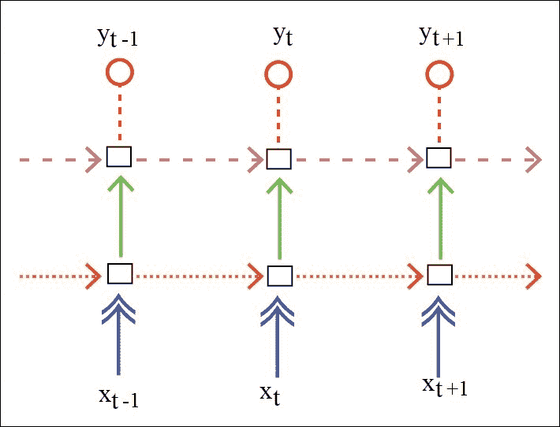

这种技术被称为**变分 RNN。**对于上图中具有相同箭头的连接，我们将保持所有序列的噪声屏蔽不变。

为此目的，我们将引入符号变量`_is_training`和`_noise_x`以在训练期间向输入、输出和循环连接添加随机(变化)噪声(丢失):

```py
_is_training = T.iscalar('is_training')
_noise_x = T.matrix('noise_x')
inputs = apply_dropout(_is_training, inputs, T.shape_padright(_noise_x.T))
```


# RNN 的深层途径

深度学习提高网络代表力的核心原理是增加更多层。对于 RNN，增加层数的两种方法是可能的:

*   The first one is known as **stacking** or **stacked recurrent network**, where the output of the hidden layer of a first recurrent net is used as input to a second recurrent net, and so on, with as many recurrent networks on top of each other: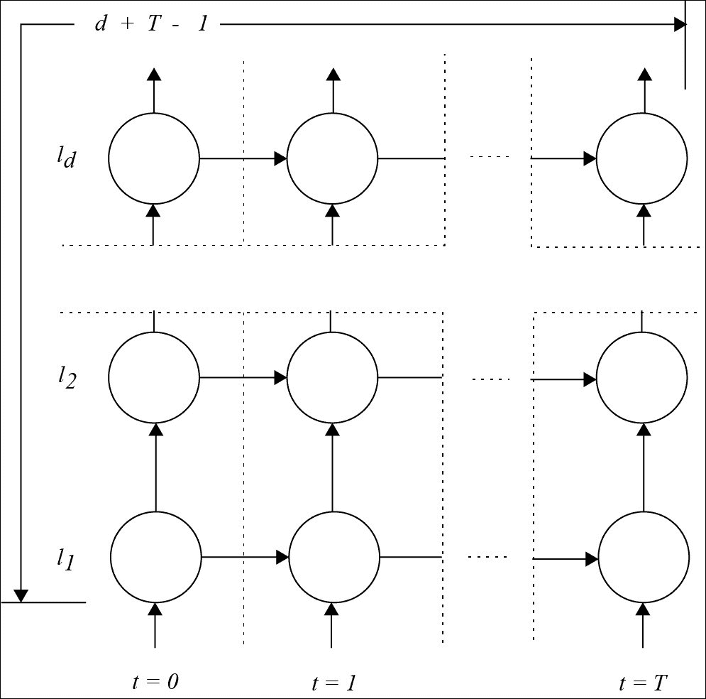

对于深度 *d* 和 *T* 时间步长，输入和输出之间的最大连接数为*d+T–1*:

*   The second approach is the **deep transition network**, consisting of adding more layers to the recurrent connection: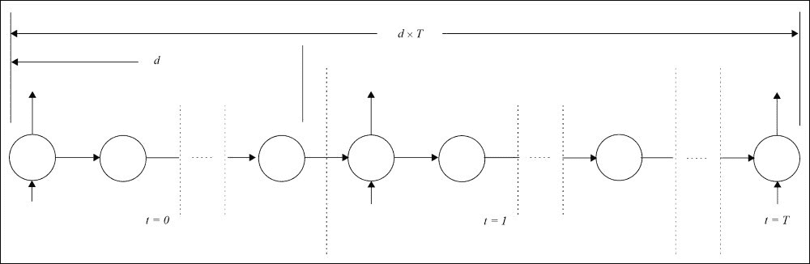

    图 2

    在这种情况下，输入和输出之间的最大连接数是 *d x T* ，这已经被证明是强大了很多。

这两种方法都提供了更好的结果。

然而，在第二种方法中，随着层数增加一个因子，训练变得更加复杂和不稳定，因为信号衰减或爆发得更快。我们稍后将通过解决循环高速公路连接的原则来解决这个问题。

首先，通常，单词序列被表示为词汇表中的索引值的数组，并且维数为(`batch_size, num_steps`)，被嵌入到维数为(`num_steps, batch_size, hidden_size`)的输入张量中:

符号输入变量`_lr`能够在训练期间降低学习率:

```py
embedding = shared_uniform(( config.vocab_size,config.hidden_size), config.init_scale)
params = [embedding]
inputs = embedding[_input_data.T]
```

让我们从第一种方法开始，堆叠循环网络。

```py
_lr = theano.shared(cast_floatX(config.learning_rate), 'lr')
```

堆叠循环网络


# 为了堆叠循环网络，我们将下面循环网络的隐藏层连接到前面循环网络的输入端:

To stack recurrent networks, we connect the hidden layer of the following recurrent network, to the input of the preceding recurrent network:

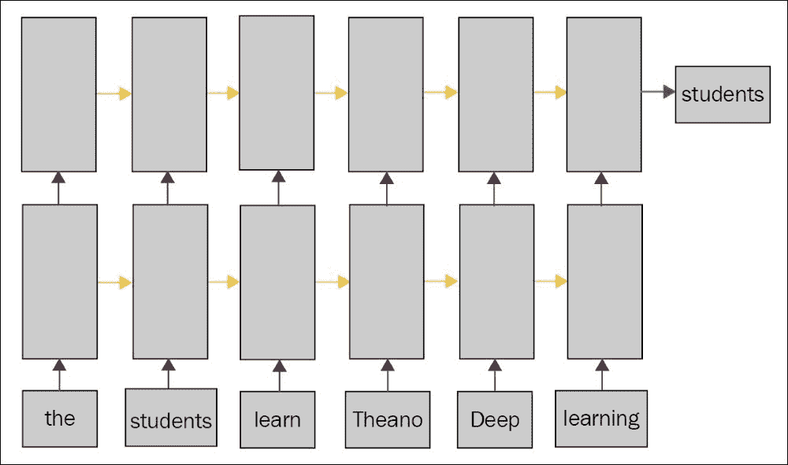

当层数为 1 时，我们的实现是一个循环网络，如前一章所述。

首先，我们在简单的 RNN 模型中实现辍学:

我们在 LSTM 模型中做了同样的事情:

```py
def model(inputs, _is_training, params, batch_size, hidden_size, drop_i, drop_s, init_scale, init_H_bias):
    noise_i_for_H = get_dropout_noise((batch_size, hidden_size), drop_i)
    i_for_H = apply_dropout(_is_training, inputs, noise_i_for_H)
    i_for_H = linear.model(i_for_H, params, hidden_size, 
                   hidden_size, init_scale, bias_init=init_H_bias)

    # Dropout noise for recurrent hidden state.
    noise_s = get_dropout_noise((batch_size, hidden_size), drop_s)

    def step(i_for_H_t, y_tm1, noise_s):
        s_lm1_for_H = apply_dropout(_is_training,y_tm1, noise_s)
        return T.tanh(i_for_H_t + linear.model(s_lm1_for_H, 
                  params, hidden_size, hidden_size, init_scale))

    y_0 = shared_zeros((batch_size, hidden_size), name='h0')
    y, _ = theano.scan(step, sequences=i_for_H, outputs_info=[y_0], non_sequences = [noise_s])

    y_last = y[-1]
    sticky_state_updates = [(y_0, y_last)]

    return y, y_0, sticky_state_updates
```

运行我们的堆叠网络:

```py
def model(inputs, _is_training, params, batch_size, hidden_size, drop_i, drop_s, init_scale, init_H_bias, tied_noise):
    noise_i_for_i = get_dropout_noise((batch_size, hidden_size), drop_i)
    noise_i_for_f = get_dropout_noise((batch_size, hidden_size), drop_i) if not tied_noise else noise_i_for_i
    noise_i_for_c = get_dropout_noise((batch_size, hidden_size), drop_i) if not tied_noise else noise_i_for_i
    noise_i_for_o = get_dropout_noise((batch_size, hidden_size), drop_i) if not tied_noise else noise_i_for_i

    i_for_i = apply_dropout(_is_training, inputs, noise_i_for_i)
    i_for_f = apply_dropout(_is_training, inputs, noise_i_for_f)
    i_for_c = apply_dropout(_is_training, inputs, noise_i_for_c)
    i_for_o = apply_dropout(_is_training, inputs, noise_i_for_o)

    i_for_i = linear.model(i_for_i, params, hidden_size, hidden_size, init_scale, bias_init=init_H_bias)
    i_for_f = linear.model(i_for_f, params, hidden_size, hidden_size, init_scale, bias_init=init_H_bias)
    i_for_c = linear.model(i_for_c, params, hidden_size, hidden_size, init_scale, bias_init=init_H_bias)
    i_for_o = linear.model(i_for_o, params, hidden_size, hidden_size, init_scale, bias_init=init_H_bias)

    # Dropout noise for recurrent hidden state.
    noise_s = get_dropout_noise((batch_size, hidden_size), drop_s)
    if not tied_noise:
      noise_s = T.stack(noise_s, get_dropout_noise((batch_size, hidden_size), drop_s),
 get_dropout_noise((batch_size, hidden_size), drop_s), get_dropout_noise((batch_size, hidden_size), drop_s))

    def step(i_for_i_t,i_for_f_t,i_for_c_t,i_for_o_t, y_tm1, c_tm1, noise_s):
        noise_s_for_i = noise_s if tied_noise else noise_s[0]
        noise_s_for_f = noise_s if tied_noise else noise_s[1]
        noise_s_for_c = noise_s if tied_noise else noise_s[2]
        noise_s_for_o = noise_s if tied_noise else noise_s[3]

        s_lm1_for_i = apply_dropout(_is_training,y_tm1, noise_s_for_i)
        s_lm1_for_f = apply_dropout(_is_training,y_tm1, noise_s_for_f)
        s_lm1_for_c = apply_dropout(_is_training,y_tm1, noise_s_for_c)
        s_lm1_for_o = apply_dropout(_is_training,y_tm1, noise_s_for_o)

        i_t = T.nnet.sigmoid(i_for_i_t + linear.model(s_lm1_for_i, params, hidden_size, hidden_size, init_scale))
        f_t = T.nnet.sigmoid(i_for_o_t + linear.model(s_lm1_for_f, params, hidden_size, hidden_size, init_scale))
        c_t = f_t * c_tm1 + i_t * T.tanh(i_for_c_t + linear.model(s_lm1_for_c, params, hidden_size, hidden_size, init_scale))
        o_t = T.nnet.sigmoid(i_for_o_t + linear.model(s_lm1_for_o, params, hidden_size, hidden_size, init_scale))
        return o_t * T.tanh(c_t), c_t

    y_0 = shared_zeros((batch_size,hidden_size), name='h0')
    c_0 = shared_zeros((batch_size,hidden_size), name='c0')
    [y, c], _ = theano.scan(step, sequences=[i_for_i,i_for_f,i_for_c,i_for_o], outputs_info=[y_0,c_0], non_sequences = [noise_s])

  y_last = y[-1]
    sticky_state_updates = [(y_0, y_last)]

    return y, y_0, sticky_state_updates
```

我们得到 15，203，150 个 RNN 参数，在 CPU 上每秒 326 **字** (WPS)，在 GPU 上每秒 4，806 WPS。

```py
python train_stacked.py --model=rnn
python train_stacked.py --model=lstm

```

对于 LSTM，在 GPU 上速度为 1，445 WPS 的情况下，参数数量为 35，882，600。

正如我们可能想象的那样，叠加 RNN 并不收敛:消失/爆炸梯度问题随着深度而增加。

旨在减少此类问题的 LSTM 在堆叠时比单层时收敛得更好。

深度跃迁轮回网络


# 与堆叠循环网络相反，深度过渡循环网络包括通过在递归连接内部添加更多层或*微时间步长*来增加网络沿时间方向的深度。

为了说明这一点，让我们回到循环网络中的转换/循环连接的定义:它将先前的状态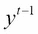和在时间步长 *t* 的输入数据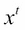作为输入，以预测它的新状态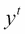。

在深度转换循环网络(图 2)中，递归转换由多个层构成，直到递归深度 *L* :初始状态设置为最后一个转换的输出:

In a deep transition recurrent network (figure 2), the recurrent transition is developed with more than one layer, up to a recurrency depth *L*: the initial state is set to the output of the last transition:

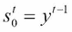

此外，在转换内部，计算多个状态或步骤:

Furthermore, inside the transition, multiple states or steps are computed:

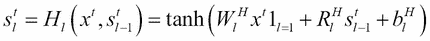

最终状态是跃迁的输出:

The final state is the output of the transition:

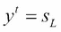

公路网设计原则


# 在过渡连接中增加更多的层增加了在长期依赖性中反向传播期间的消失或爆炸梯度问题。

在 [第四章](part0051_split_000.html#1GKCM1-ccdadb29edc54339afcb9bdf9350ba6b "Chapter 4. Generating Text with a Recurrent Neural Net")、*用循环神经网络生成文本*中，LSTM 和 GRU 网络已经被引入作为解决这个问题的解决方案。二阶优化技术也有助于克服这个问题。

基于**身份连接**的更一般的原理，以改进深度网络中的训练[第 7 章](part0075_split_000.html#27GQ61-ccdadb29edc54339afcb9bdf9350ba6b "Chapter 7. Classifying Images with Residual Networks")、*用剩余网络对图像进行分类*，也可以应用于深度过渡网络。

理论上的原则是:

给定一个输入 *x* 到一个隐藏层 *H* 带权重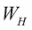:

Given an input *x* to a hidden layer *H* with weigh :

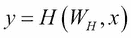

作为一种快捷方式，公路网设计包括将原始输入信息(带有标识图层)添加到图层或图层组的输出中:

*y = x*

两个混合门，*变换门* 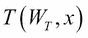和*进位门*，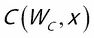学习调制隐藏层中变换的影响，以及允许通过的原始信息量:

Two mixing gates, the *transform gate*  and the *carry gate*,  learn to modulate the influence of the transformation in the hidden layer, and the amount of original information to allow to pass through:

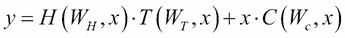

通常，为了减少参数总数以获得更快的训练网络，进位门被认为是变换门的 1 的补充:

Usually, to reduce the total number of parameters in order to get faster-to-train networks, the carry gate is taken as the complementary to 1 for the transform gate:

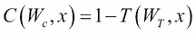

循环公路网


# 因此，让我们将公路网设计应用于深度转换循环网络，这导致了**循环公路网** ( **RHN** )的定义，并在给定转换输入的情况下预测输出:

So, let's apply the highway network design to deep transition recurrent networks, which leads to the definition of **Recurrent Highway Networks** (**RHN**), and predict the output  given  the input of the transition:


过渡由多级高速公路连接构成:

The transition is built with multiple steps of highway connections:

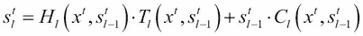

这里的转换门如下:

Here the transform gate is as follows:

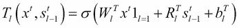

为了减少权重的数量，进位门与转换门互补:

And, to reduce the number of weights, the carry gate is taken as the complementary to the transform gate:


为了在 GPU 上进行更快的计算，最好在单个大矩阵乘法中计算不同时间步长和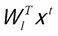上的输入的线性变换，所有步长的输入矩阵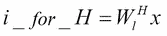和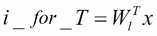同时进行，因为 GPU 将使用更好的并行化，并将这些输入提供给递归:

每一步之间有一个深度过渡:

```py
y_0 = shared_zeros((batch_size, hidden_size))
y, _ = theano.scan(deep_step_fn, sequences = [i_for_H, i_for_T],
            outputs_info = [y_0], non_sequences = [noise_s])
```

RHN 的递归隐藏状态是粘性的(一批的最后一个隐藏状态被结转到下一批，作为初始隐藏状态)。这些状态保存在一个共享变量中。

```py
def deep_step_fn(i_for_H_t, i_for_T_t, y_tm1, noise_s):
  s_lm1 = y_tm1
  for l in range(transition_depth):
    if l == 0:
      H = T.tanh(i_for_H_t + linear(s_lm1, params, hidden_size, hidden_size, init_scale))
      Tr = T.nnet.sigmoid(i_for_T_t + linear(s_lm1, params, hidden_size, hidden_size, init_scale))
    else:
      H = T.tanh(linear(s_lm1, params, hidden_size, hidden_size, init_scale, bias_init=init_H_bias))
      Tr = T.nnet.sigmoid(linear(s_lm1, params, hidden_size, hidden_size, init_scale, bias_init=init_T_bias))
    s_l = H * Tr + s_lm1 * ( 1 - Tr )
    s_lm1 = s_l
  y_t = s_l
  return y_t
```

让我们运行模式:

堆栈 RHN 的参数数量为*84172000*，其速度为 *420* wps。

```py
python train_stacked.py
```

该模型是文本上循环神经网络准确性的最新模型。

延伸阅读


# 您可以参考以下主题了解更多信息:

*嗨*嗨*高速公路网*在:[https://arxiv.org/abs/1505.00387](https://arxiv.org/abs/1505.00387)

*   *https://arxiv.org/abs/1508.03790 的深度门控 LSTM*
*   *在循环神经网络* *中学习更长的记忆*在:[https://arxiv.org/abs/1412.7753](https://arxiv.org/abs/1412.7753)
*   *格长短期记忆*，纳尔·卡尔·布伦纳，伊沃·达尼埃尔卡，亚历克斯·格雷夫斯
*   Zilly，J，Srivastava，R，Koutnik，J，Schmidhuber，J .，*循环公路网*，2016
*   Gal，Y，*循环神经网络中辍学的一个理论上的落地应用*，2015。
*   Zaremba，W，Sutskever，I，Vinyals，O，*循环神经网络正则化*，2014。
*   Press，O，Wolf，L，*利用输出嵌入改进语言模型*，2016。
*   门控反馈循环神经网络:钟俊英，卡格拉尔·古尔切雷，赵京贤，Yoshua Bengio 2015
*   发条 RNN:2014 年扬·库特尼克、克劳斯·格雷夫、福斯蒂诺·戈麦斯、于尔根·施密德胡伯
*   总结


# 用于提高网络鲁棒性的经典丢弃方法可以按顺序或分批应用于循环网络，以避免递归转换的不稳定性和破坏。例如，当应用于单词输入/输出时，它相当于从句子中删除相同的单词，用空白值替换它们。

深度学习中通过堆叠层来提高精度的原理适用于可以在深度方向无负担堆叠的循环网络。

在循环网络的过渡中应用相同的原理增加了消失/爆炸问题，但是通过具有身份连接的高速公路网络的发明来抵消。

循环神经网络的先进技术在序列预测中给出了最先进的结果。

Advanced techniques for recurrent neural nets give state-of-the-art results in sequence prediction.