# 十一、从环境中强化学习

监督和非监督学习描述了训练期间标签或目标的存在或不存在。对于代理来说，更自然的学习环境是在做出正确决策时获得奖励。这种奖励，比如*正确地打了网球*之类的，可能归因于一个复杂的环境，是多种行动的结果，延迟的或累积的。

为了优化人工智能体从环境中获得的回报，**强化学习** ( **RL** )领域出现了许多算法，如 Q-learning，或蒙特卡罗树搜索，随着深度学习的出现，这些算法被修订为新的方法，如深度 Q 网络，策略网络，价值网络和策略梯度。

我们将首先介绍强化学习框架及其在虚拟环境中的潜在应用。然后，我们将开发它的算法以及它们与深度学习的集成，深度学习已经解决了人工智能中最具挑战性的问题。

本章涵盖的要点如下:

*   强化学习
*   模拟环境
*   q 学习
*   蒙特卡罗树搜索
*   深度 Q 网络
*   策略梯度
*   异步梯度下降

为了简化本章中神经网络的开发，我们将使用 Keras，这是一个高级深度学习库，位于我在[第 5 章](part0060_split_000.html#1P71O2-ccdadb29edc54339afcb9bdf9350ba6b "Chapter 5. Analyzing Sentiment with a Bidirectional LSTM")、*使用双向 LSTM 分析情感*中介绍的基础之上。


# 强化学习任务

强化学习包括训练一个**代理**，它只是需要来自**环境**的偶尔反馈，以学习最终获得最佳反馈。代理执行**动作**，修改环境的**状态**。

在环境中导航的操作可以表示为从一个状态到另一个状态的有向边，如下图所示:

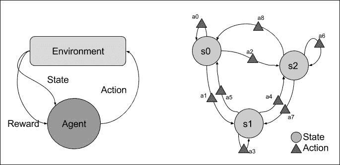

在真实环境(行走机器人、电机控制等)或虚拟环境(视频游戏、在线游戏、聊天室等)中工作的机器人必须决定哪些动作(或击键)可以获得最大奖励:

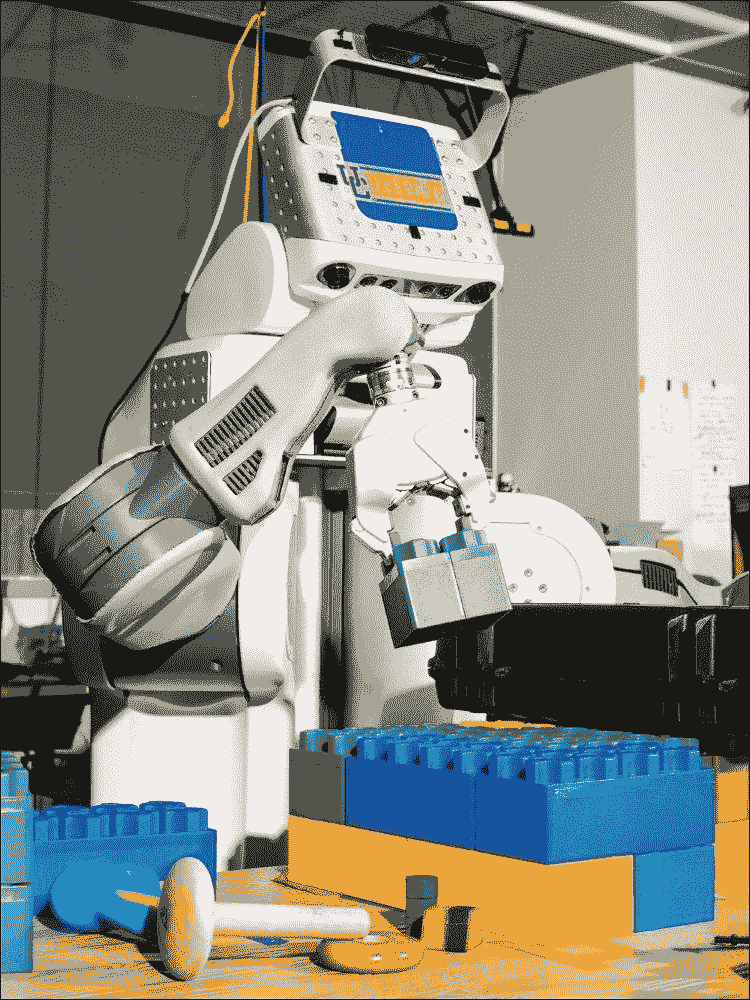

# 模拟环境

虚拟环境使得模拟成千上万的游戏成为可能，除了计算之外没有任何其他成本。为了对不同的强化学习算法进行基准测试，研究团体已经开发了模拟环境。

为了找到通用的解决方案，与商业巨头埃隆·马斯克(Elon Musk)合作的开放式人工智能非营利人工智能研究公司(旨在以造福全人类的方式谨慎地促进和发展友好的人工智能)已经将聚集在其开源模拟环境**开放式人工智能体育馆**([https://gym.openai.com/](https://gym.openai.com/))，一个 Python 工具包中的强化任务和环境的集合，以测试我们自己的方法。在这些环境中，您会发现:

*   Video games from Atari 2600, a home video game console released by Atari Inc in 1977, wrapping the simulator from the Arcade Learning Environment, one of the most common RL benchmark environment: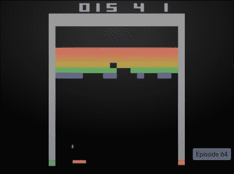
*   MuJoCo, a physics simulator for evaluating agents on continuous control tasks: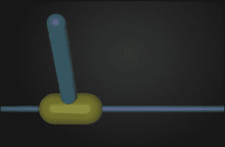
*   Other well-known games such as Minecraft, Soccer, Doom, and many others: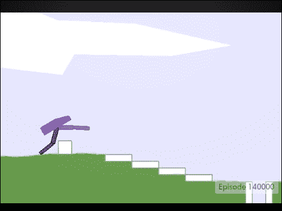

让我们安装 Gym 及其 Atari 2600 环境:

```py
pip install gym
pip install gym[atari]
```

也可以在所有环境中安装:

```py
pip install gym[all]
```

使用`env.step()`方法与 Gym 环境交互非常简单，给定我们为代理选择的动作，返回新的状态、奖励以及游戏是否已经终止。

例如，让我们对一个随机动作进行采样:

```py
import gym

env = gym.make('CartPole-v0')
env.reset()

for _ in range(1000):
    env.render()
    action = env.action_space.sample()
    next_state, reward, done, info = env.step(action)
    if done:
        env.reset()
```

Gym 还提供复杂的监控方法，以记录视频和算法性能。记录可以上传到 Open-AI API，用其他算法打分。

人们也可以看看:

*   3D car racing simulator Torcs ([http://torcs.sourceforge.net/](http://torcs.sourceforge.net/)), which is more realistic with smaller discretization of actions, but with less sparse rewards than simple Atari games, and also fewer possible actions than continuous motor control in MuJoCo: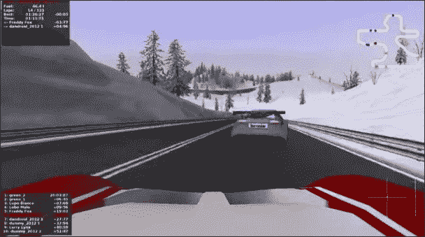
*   3D environment called Labyrinth for randomly generated mazes: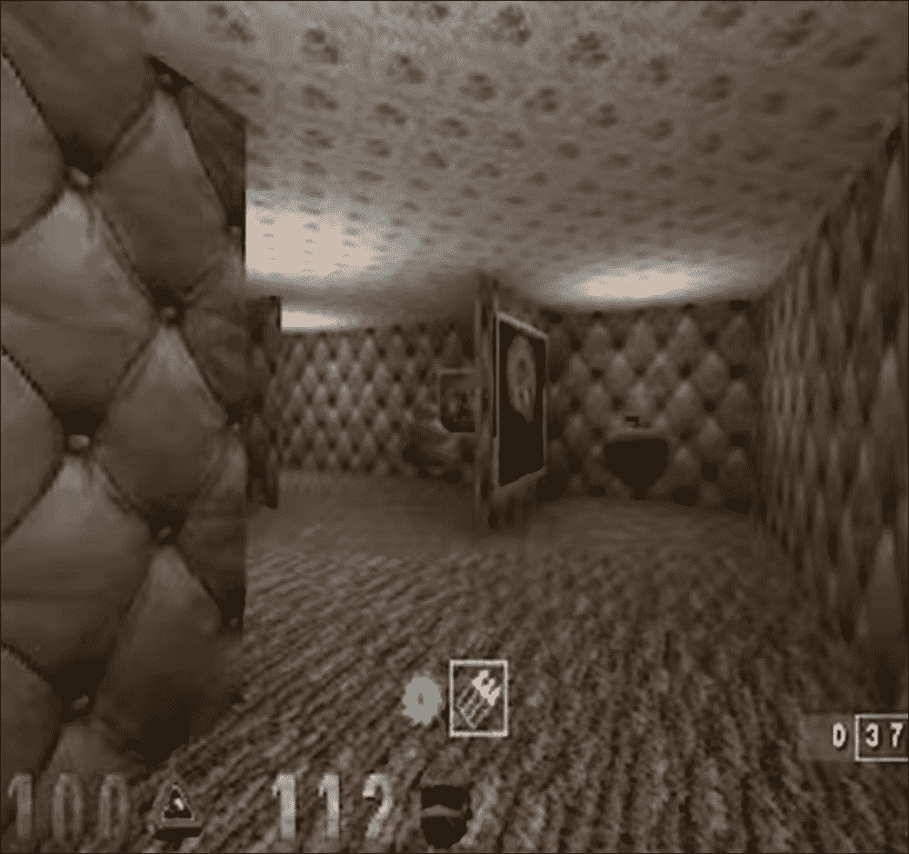


# Q-学习

解决游戏问题的一个主要方法是 Q 学习法。为了充分理解该方法，一个基本的例子将说明一个简单的情况，其中环境的状态数被限制为 6，状态 **0** 是入口，状态 **5** 是出口。在每个阶段，一些操作可以跳转到另一个状态，如下图所示:

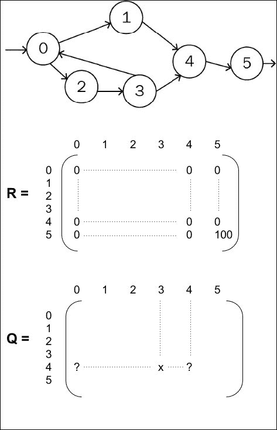

比方说，当代理从状态 **4** 到状态 **5** 时，奖励是 100。因为这个例子中游戏的目标是找到出口，所以对其他状态没有任何奖励。奖励是延时的，代理必须从状态 0 到状态 4 滚动多个状态才能找到出口。

在这种情况下，Q 学习包括学习矩阵 Q，表示状态-动作对的**值:**

*   Q 矩阵中的每一行对应于代理将处于的状态
*   每一列从该状态到目标状态

这个值代表在那种状态下选择那个动作会让我们离出口有多近。如果从状态 *i* 到状态 *j* 没有任何动作，我们在 Q 矩阵中的位置 *(i，j)* 定义一个零值或负值。如果从状态 *i* 到状态 *j* 有一个或多个可能的动作，那么 Q 矩阵中的值将被选择来表示状态 *j* 将如何帮助我们实现我们的目标。

例如，将状态 **3** 设为状态 **0** ，将使代理远离出口，而将状态 **3** 设为状态 **4** 将使我们更接近目标。一种通常使用的算法，称为*贪婪*算法，用于估计离散空间中的 **Q** ，由递归*贝尔曼方程*给出，其被证明收敛:

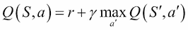

这里， *S'* 是对状态 *S* 采取动作 *a* 时的新状态； *r* 定义了从状态 *S* 到*S’*的路径上的奖励(在这种情况下为空)，并且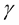是折扣因子，以阻止对图中太远的状态的动作。多次应用该等式将导致产生以下 Q 值:

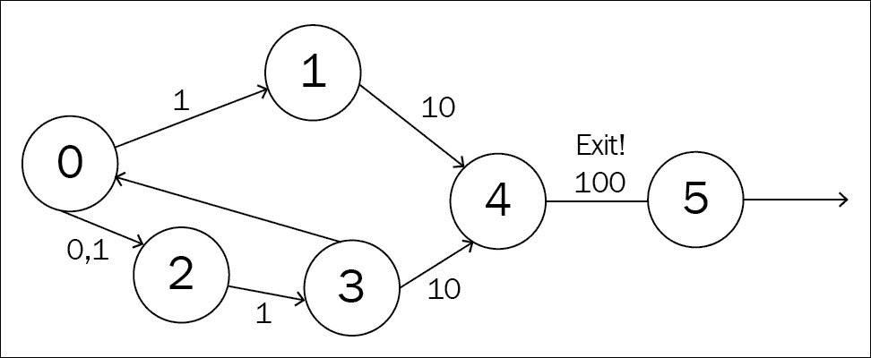

在 Q-learning 中， *Q* 代表*品质*代表行动获得最佳回报的力量。由于后期奖励是贴现的，这些值对应于每对(状态、行动)夫妇的**最大贴现未来奖励**。

注意一旦我们知道搜索子树的输出节点的**状态值**，就不需要完整的图形结果:

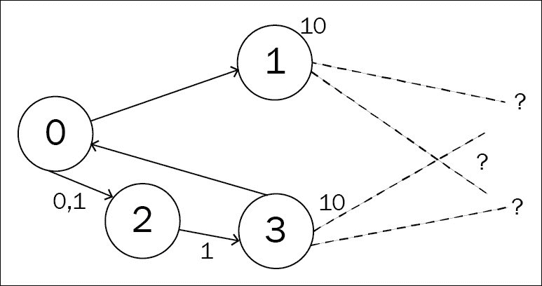

该图中，节点 **1** 和 **3** 的值 **10** 为**最优状态值函数 v(s)；**即完美玩法/最优路径下一局游戏的胜负。实际上，精确的值函数是未知的，而是近似的。

这种近似与 **DeepMind** 算法 **AlphaGo** 中的**蒙特卡罗树搜索** ( **MCTS** )结合使用，击败围棋世界冠军。MCTS 由给定策略的采样动作组成，因此只有从当前节点到估计其 Q 值的最可能的动作被保留在贝尔曼方程中:

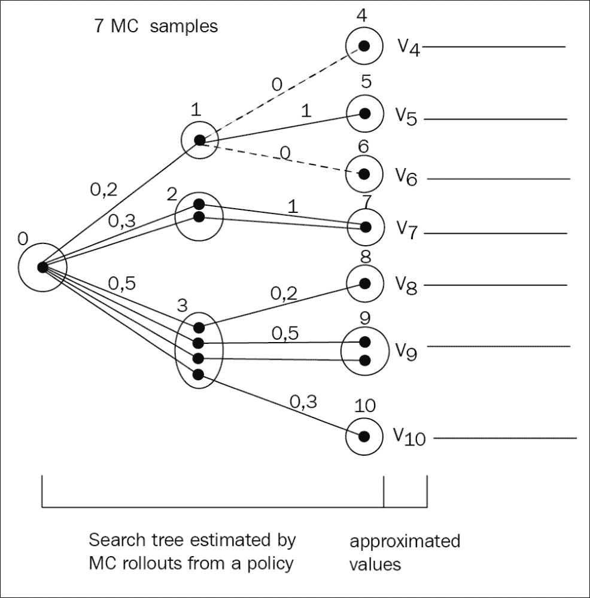

# 深度 Q 网络

虽然可能动作的数量通常是有限的(键盘按键或动作的数量)，但可能状态的数量可能是巨大的，搜索空间可能是巨大的，例如，在现实世界环境或真实视频游戏中，机器人配备有摄像头。使用计算机视觉神经网络变得很自然，例如我们在第 7 章*使用残差网络*分类图像中用于分类的神经网络，来表示给定输入图像(状态)的动作值，而不是矩阵:

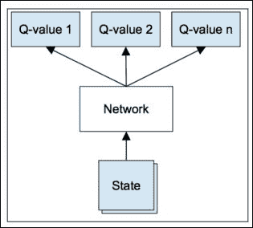

Q 网络被称为**状态-动作值网络**并预测给定状态的动作值。为了训练 Q 网络，的一个自然方法是通过梯度下降使其符合贝尔曼方程:

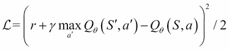

注意，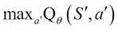被评估和固定，而下降是针对中的导数计算的，并且每个状态的值可以被估计为所有状态-动作值的最大值。

在用随机权重初始化 Q 网络之后，初始预测是随机的，但是随着网络收敛，给定特定状态的动作将变得越来越可预测，因此对新状态的探索下降。利用在线训练的模型需要迫使算法**继续探索**:贪婪方法**包括以概率ε进行随机动作，否则遵循 Q 网络给出的最大回报动作。这是一种通过试错来学习的方法。经过一定数量的历元后，被衰变以减少探索。**

**

# 训练稳定性

不同的方法可以提高训练期间的稳定性。**在线训练**，即一边玩游戏一边训练模型，忘记之前的经验，只考虑最后一个，用深度神经网络是根本不稳定的:时间上接近的状态，比如最近的状态，通常是强相似或相关的，训练时取最近的状态收敛不好。

为了避免这样的失败，一个可能的解决方案是将体验存储在**重放存储器**中，或者使用人类游戏数据库。从重放存储器或人类游戏数据库中分批和洗牌随机样本导致更稳定的训练，但是**偏离策略**训练。

提高稳定性的第二种解决方案是针对数千次的更新，固定**目标评估** 中参数的值，减少目标和 Q 值之间的相关性:

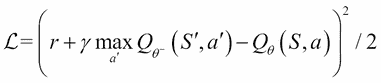

通过 n 步 Q-learning 可以更有效地进行培训，在 *n* 个之前的行动中传播奖励，而不是一个:

q 学习公式:

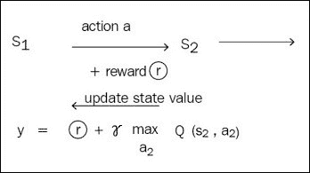

n 步 Q 学习公式:

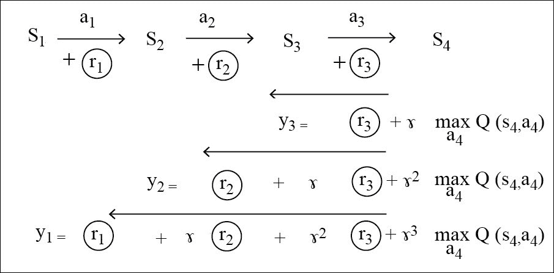

在这里，每个步骤都将从 *n 个*下一个奖励中获益:

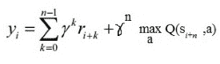

用于训练稳定性和效率的最后一个解决方案是**异步梯度下降**，其中多个代理在环境的多个实例上并行执行，具有不同的探索策略，使得每个梯度更新更少相关:每个学习代理在同一台机器上的不同线程中运行，与其他代理共享其模型和目标模型参数，但是为环境的不同部分计算梯度。并行 actor 学习器具有稳定效果，支持策略强化，减少训练时间，以及在 GPU 或多核 CPU 上的可比性能，这非常棒！

稳定化效果导致更好的**数据效率**:数据效率由收敛到期望的训练损失或精度所需的历元数(一个历元是当全部训练数据集已经呈现给算法时)来测量。总训练时间受数据效率、并行性(线程或机器的数量)和并行性开销(在给定内核、机器数量和算法分发效率的情况下，它与线程数量呈次线性关系)的影响。

让我们看看实践中的情况。为了实现多个代理探索环境的不同部分，我们将使用 Python 多处理模块运行多个进程，一个进程用于模型更新(GPU)，而 *n* 进程用于代理探索(CPU)。多处理模块的管理器对象控制一个服务器进程，该进程持有在进程之间共享的 Q 网络的权重。存储代理的经验并为它们提供一次模型更新的通信通道是通过一个进程安全队列实现的:

```py
from multiprocessing import *
manager = Manager()
weight_dict = manager.dict()
mem_queue = manager.Queue(args.queue_size)

pool = Pool(args.processes + 1, init_worker)

for i in range(args.processes):
    pool.apply_async(generate_experience_proc, (mem_queue, weight_dict, i))

pool.apply_async(learn_proc, (mem_queue, weight_dict))

pool.close()
pool.join()
```

现在，让我们生成体验并将它们放入公共队列对象中。

为此，每个代理创建其游戏环境，编译 Q 网络并从管理器加载权重:

```py
env = gym.make(args.game)

load_net = build_networks(observation_shape, env.action_space.n)

load_net.compile(optimizer='rmsprop', loss='mse', loss_weights=[0.5, 1.])

while 'weights' not in weight_dict:
    time.sleep(0.1)
load_net.set_weights(weight_dict['weights'])
```

为了产生一种体验，代理选择一个动作并在其环境中执行它:

```py
observation, reward, done, _ = env.step(action)
```

代理的每个经验都存储在一个列表中，直到游戏终止或者列表长于 *n_step* ，用 *n-steps* Q-learning 评估状态-动作值:

```py
if done or counter >= args.n_step:
    r = 0.
    if not done:
        r = value_net.predict(observations[None, ...])[0]
    for i in range(counter):
        r = n_step_rewards[i] + discount * r
        mem_queue.put((n_step_observations[i], n_step_actions[i], r))
```

偶尔，代理会根据学习过程更新其权重:

```py
load_net.set_weights(weight_dict['weights'])
```

现在让我们看看如何在学习代理中更新权重。


# 带有增强算法的策略梯度

**策略梯度** ( **PG** ) /强化算法的思想非常简单:它在于在强化学习任务的情况中重新使用分类损失函数。

请记住，分类损失是由负对数似然性给出的，使用梯度下降将其最小化遵循关于网络权重的负对数似然性导数:

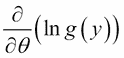

这里， *y* 是选择动作，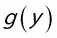是给定输入 X 和权重时该动作的预测概率。

强化定理引入了强化学习的等价形式，其中 *r* 是奖励。以下导数:

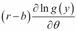

代表相对于网络权重的预期回报导数的无偏估计:

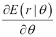

所以，跟随衍生品会鼓励代理人最大化回报。

这样的梯度下降使我们能够为我们的代理优化一个**策略网络**:一个策略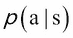是合法行为的概率分布，在在线学习期间对要执行的行为进行采样，也可以用一个参数化的神经网络来近似。

这在连续的情况下特别有用，例如对于电机控制，其中动作空间的离散化可能导致一些次优的假象，并且在无限动作空间下在动作值网络 Q 上的最大化是不可能的。

此外，还可以增强策略网络的重现性(LSTM，GRU)，这样代理就可以针对多个先前的状态选择它的动作。

强化定理给出了优化参数化策略网络的梯度下降法。为了鼓励在这种基于策略的情况下进行探索，还可以向损失函数添加正则化项，即策略的熵。

在该策略下，可以计算每个状态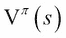的值:

*   要么从该州的策略出发进行博弈
*   Or, if parameterized into a **state value network**, by gradient descent, the current parameter serving as target, as for the state-action value network seen in the previous section with discounted rewards: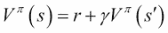

通常选择这个值作为强化基线 *b* 以减少策略梯度估计的方差，Q 值可以作为预期报酬:


增强导数中的第一个因素:

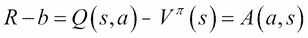

在状态 *s* 中被称为行动 a 的**优势。**

策略网络和价值网络的梯度下降都可以通过我们的并行参与者学习器异步执行。

让我们在 Keras 中创建我们的策略网络和州价值网络，共享它们的第一层:

```py
from keras.models import Model
from keras.layers import Input, Conv2D, Flatten, Dense

def build_networks(input_shape, output_shape):
    state = Input(shape=input_shape)
    h = Conv2D(16, (8, 8) , strides=(4, 4), activation='relu', data_format="channels_first")(state)
    h = Conv2D(32, (4, 4) , strides=(2, 2), activation='relu', data_format="channels_first")(h)
    h = Flatten()(h)
    h = Dense(256, activation='relu')(h)

    value = Dense(1, activation='linear', name='value')(h)
    policy = Dense(output_shape, activation='softmax', name='policy')(h)

    value_network = Model(inputs=state, outputs=value)
    policy_network = Model(inputs=state, outputs=policy)
    train_network = Model(inputs=state, outputs=[value, policy])

    return value_network, policy_network, train_network
```

我们的学习过程也构建模型，与其他过程共享权重，并利用各自的损失对它们进行编译以进行训练:

```py
_, _, train_network = build_networks(observation_shape, env.action_space.n)
weight_dict['weights'] = train_net.get_weights()

from keras import backend as K

def policy_loss(advantage=0., beta=0.01):
    def loss(y_true, y_pred):
        return -K.sum(K.log(K.sum(y_true * y_pred, axis=-1) + \K.epsilon()) * K.flatten(advantage)) + \
           	beta * K.sum(y_pred * K.log(y_pred + K.epsilon()))
    return loss

def value_loss():
    def loss(y_true, y_pred):
        return 0.5 * K.sum(K.square(y_true - y_pred))
    return loss

train_net.compile(optimizer=RMSprop(epsilon=0.1, rho=0.99),
            loss=[value_loss(), policy_loss(advantage, args.beta)])
```

策略损失是鼓励勘探的强化损失加上熵损失。价值损失是简单的均方误差损失。

我们的学习过程将体验排入一个批次，在批次上训练模型，并更新权重字典:

```py
loss = train_net.train_on_batch([last_obs, advantage], [rewards, targets])
```

要运行完整的代码:

```py
pip install -r requirements.txt

python 1-train.py --game=Breakout-v0 --processes=16
python 2-play.py --game=Breakout-v0 --model=model-Breakout-v0-35750000.h5
```

学习大概花了 24 个小时。

基于策略的优势演员评论家通常胜过基于价值的方法。


# 相关文章

可以参考以下文章:

*   *联结主义强化学习的简单统计梯度跟踪算法*，罗纳德·j·威廉姆斯，1992
*   *函数逼近强化学习的策略梯度方法*，Richard S. Sutton，David McAllester，Satinder Singh，Yishay Mansour，1999
*   *用深度强化学习玩雅达利*，沃洛季米尔·姆尼赫，科雷·卡武克库奥卢，大卫·西尔弗，亚历克斯·格雷夫斯，约安尼斯·安东诺格鲁，金奎大·威斯特拉，马丁·里德米勒，2013
*   *通过深度神经网络和树搜索掌握围棋游戏*，大卫·西尔弗、阿贾·黄、克里斯·j·马迪森、阿瑟·古兹、劳伦特·西弗、乔治·范·登·德里斯切、朱利安·施利特维泽、约安尼斯·安东诺格鲁、韦达·潘妮尔·谢尔瓦姆、马克·兰托特、桑德·迪耶曼、张秀坤·格雷韦、约翰·纳姆、纳尔·卡尔施布伦纳、伊利亚·苏茨基弗、蒂莫西·莉莉拉普、玛德琳·利奇、可雷·卡武克库奥卢、托雷·格雷佩尔&戴密斯·哈萨比斯，2016
*   *深度强化学习的异步方法*，Volodymyr Mnih，Adrià Puigdomènech Badia，Mehdi Mirza，Alex Graves，Tim Harley，Timothy P. LilliCrap，David Silver，Koray Kavukcuoglu，2016 年 2 月
*   *深度强化学习无线电控制和信号检测与 KeRLym* ，Gym RL 代理 Timothy J. O'Shea 和 T. Charles Clancy，2016


# 总结

强化学习描述了优化偶然遇到奖励的代理的任务。在深度神经网络的帮助下，针对各种游戏和模拟环境，开发了在线、离线、基于值或基于策略的算法。

策略梯度是一种强力解决方案，需要在训练期间对动作进行采样，并且更适合于小的动作空间，尽管它们为连续搜索空间提供了第一解决方案。

策略梯度还用于训练神经网络中的不可微随机层，并通过它们反向传播梯度。例如，当通过模型的传播需要遵循参数化子模型进行采样时，来自顶层的梯度可以被认为是对底层网络的奖励。

在更复杂的环境中，当没有明显的回报时(例如从环境中存在的物体理解和推断可能的行动)，推理可以帮助人类优化他们的行动，目前研究没有提供任何解决方案。当前的 RL 算法特别适合精确的游戏、快速的反应，但是没有长期的计划和推理。此外，RL 算法需要大量数据集，而仿真环境很容易提供这些数据集。但这也带来了现实世界中的缩放问题。

在下一章中，我们将探索最新的解决方案来生成与现实世界数据没有区别的新数据。**