# 第十二章。无监督生成网络学习特征

本章重点介绍一种新的模型，生成模型，包括**受限玻尔兹曼机**、**深度信念网络**、**变分自动编码器**、**自回归模型，以及生成对抗**网络。对于第一个网络，我们将介绍限制在理论上，而最后一个用实际代码和建议详细解释。

这些网不需要训练任何标签，称为*无监督学习*。无监督学习帮助从数据中计算特征，没有标签的偏见。这些模型是可生成的，因为它们被训练以生成听起来真实的新数据。

将涵盖以下点:

*   生成模型
*   无监督学习
*   受限玻尔兹曼机器
*   深度信念网络
*   生成对抗模型
*   半监督学习


# 生成模型

神经处理中的生成式模型是在给定噪声向量 *z* 作为输入的情况下生成数据的模型:


训练的目的是找到生成尽可能接近真实数据的数据的参数。

生成网络的应用包括数据降维、合成数据生成、无监督特征学习、预训练/训练效率。预训练有助于泛化，因为预训练侧重于数据中的模式，而不是数据-标签关系。


## 受限玻尔兹曼机器

受限玻尔兹曼机是最简单的生成网络，由一个全连通的隐含层组成，如图所示:

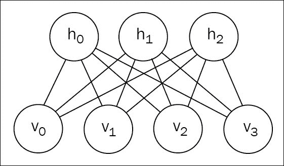

完整的玻尔兹曼机器也有隐藏到隐藏和可见到可见的回路连接，而*受限*版本没有任何连接。

在一般情况下，RBM 被定义为*基于能量的模型*，这意味着它们通过能量函数来定义概率分布:

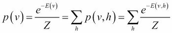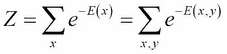

*Z* 是**配分函数**， *E(v)* 是**自由能**函数(不依赖于隐藏状态)。

### 注意

最小化负对数似然相当于最小化能量函数。

RBM 将能量函数定义为模型参数的线性:

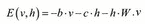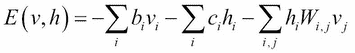

能量和自由能之间的关系由下式给出:

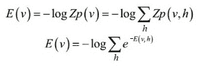

就 RBM 而言:

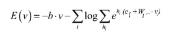

这里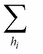表示第 I 个隐藏神经元的可能值之和。

RBM 通常是在`v`和`h`是 *{0，1}* 中的二项式值的特殊情况下考虑的，所以:

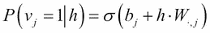

模型是对称的，遵循模型中的对称性:隐藏和可见在能量函数中具有相同的位置:

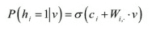

RBM 在两个方向上(从输入到隐藏，以及从隐藏到输入)都是一个简单的随机全连接层。

RBM 负对数似然的梯度或导数有两项，定义为**正相位和负相位**，其中第一项增加数据的概率，第二项减少生成样本的概率:

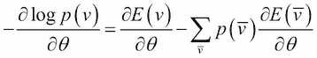

这里，总和是对所有可能输入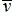的概率(期望值)加权。至少，我们数据样本自由能的任何增加都会降低总数据的期望值。

根据经验，这种负相位的和可以转换成观察到的 *N* 的和( *v，h* ):

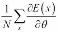

为了在实践中计算这样的和，观察样本的概率( *v，h* )必须满足由上述公式给出的 *p(v | h)* 以及 *p(h | v)* 。

采样是通过对比散度算法进行的，实际上: *v* 是从数据集中采样的，而 *h* 是根据上面给出的 *v* 的分布绘制的。重复此操作，产生一个新的 *v* 给定 *h* ，然后产生一个新的 *h* 给定 *v* 。在实践中，这足以实现样本紧密分布到真实分布。这些针对 *v* 和 *h* 的观测样本被称为**负粒子**，代价函数中的第二项降低了这些生成样本的概率，而第一项增加了数据的概率。

下面是带负粒子的配分函数的计算结果:

```
W = shared_glorot_uniform((n_visible, n_hidden), name='W')
hbias = shared_zeros(n_hidden, name='hbias')
vbias = shared_zeros(n_visible, name='vbias')
params = [W, hbias, vbias]

def sample_h_given_v(v0_sample):
    pre_sigmoid_h1 = T.dot(v0_sample, W) + hbias
    h1_mean = T.nnet.sigmoid(pre_sigmoid_h1)
    h1_sample = theano_rng.binomial(size=h1_mean.shape, n=1, p=h1_mean, dtype=theano.config.floatX)
    return [pre_sigmoid_h1, h1_mean, h1_sample]

def sample_v_given_h(h0_sample):
    pre_sigmoid_v1 = T.dot(h0_sample, W.T) + vbias
    v1_mean = T.nnet.sigmoid(pre_sigmoid_v1)
    v1_sample = theano_rng.binomial(size=v1_mean.shape, n=1, p=v1_mean, dtype=theano.config.floatX)
    return [pre_sigmoid_v1, v1_mean, v1_sample]

def gibbs_hvh(h0_sample):
    pre_sigmoid_v1, v1_mean, v1_sample = sample_v_given_h(h0_sample)
    pre_sigmoid_h1, h1_mean, h1_sample = sample_h_given_v(v1_sample)
    return [pre_sigmoid_v1, v1_mean, v1_sample,
            pre_sigmoid_h1, h1_mean, h1_sample]

chain_start = persistent_chain
(
    [
        pre_sigmoid_nvs,
        nv_means,
        nv_samples,
        pre_sigmoid_nhs,
        nh_means,
        nh_samples
    ],
    updates
) = theano.scan(
    gibbs_hvh,
    outputs_info=[None, None, None, None, None, chain_start],
    n_steps=k,
    name="gibbs_hvh"
)

chain_end = nv_samples[-1]

def free_energy(v_sample):
    wx_b = T.dot(v_sample, W) + hbias
    vbias_term = T.dot(v_sample, vbias)
    hidden_term = T.sum(T.log(1 + T.exp(wx_b)), axis=1)
    return -hidden_term - vbias_term

cost = T.mean(free_energy(x)) - T.mean(free_energy(chain_end))
```

在 15 个时期之后，在 MNIST 数据集上训练的滤波器的图片:

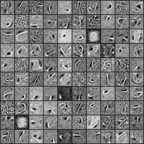

和一个小型批次的负粒子(每行之间 1000 步采样):

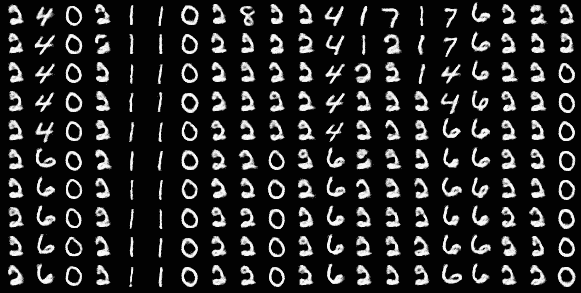

## 深深的信仰赌注

一个**深度信念网络** ( **DBN** )是多个 RBM 的堆叠，以增加它们的代表性和更好地捕捉数据中的模式。

训练逐层发生，首先考虑只有一个 RBM 具有隐藏状态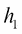。一旦 RBM 的权重被训练，这些权重保持固定，第一个 RBM 的隐藏层被认为是第二个 RBM 的可见层，具有一个隐藏状态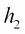。如下图所示，每个新的 RBM 将捕获以前的 RBM 没有捕获到的模式:

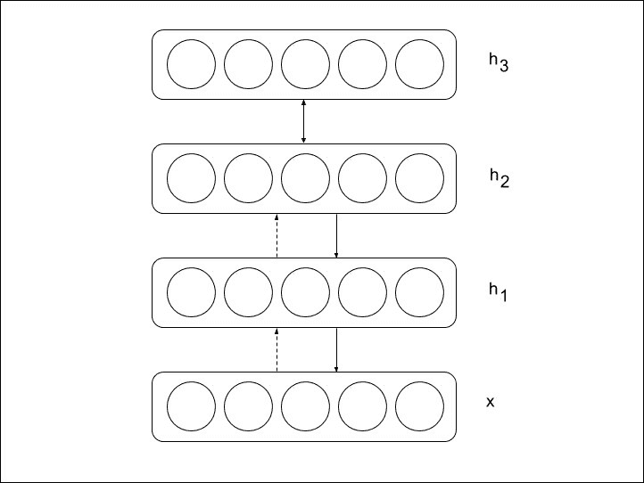

可以看出，堆栈顶部新 RBM 的每次添加都会降低负对数似然性。

作为最后一步，可以在分类网络中使用这些权重，只需在最终隐藏状态的顶部添加一个线性层和一个 softmax 层，并像往常一样通过梯度下降训练微调所有权重。

对数据维度的应用保持不变，展开所有层以产生解码器网络，其权重等于编码器网络中权重的转置(初始多层 RBM):

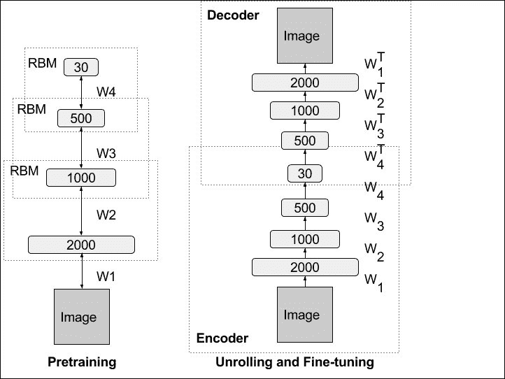

这种展开的网络被称为**自动编码器**。

在实践中，不通过贪婪的逐层训练直接通过梯度下降进行训练将需要找到正确的初始化，这可能会更加棘手，因为权重初始化必须足够接近解。这就是为什么自动编码器通常使用的方法是单独训练每个 RBM。


## 生成敌对网络

由于以前模型中的配分函数是不可检测的，并且需要使用 Gibbs 抽样的对比散度算法，博弈论最近提供了一类新的学习生成模型的方法，即**生成对抗网络** ( **GANs** )，它在今天获得了巨大的成功。

生成对抗网络由两个模型组成，这两个模型被交替训练以相互竞争。发生器网络 **G** 通过产生鉴别器 **D** 难以从真实数据中区分的数据，被优化以再现真实数据分布。同时，第二网络 D 被优化以区分由 g 产生的真实数据和合成数据。总的来说，训练过程类似于具有以下目标函数的两人最小-最大游戏:

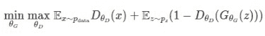

这里， *x* 是从真实数据分布中采样的真实数据， *z* 是生成式模型的噪声向量。在某些方面，鉴别器和发生器可以被视为警察和小偷:为了确保训练正确，警察接受的训练是小偷的两倍。

让我们用图像作为数据的情况来说明 GANs。特别地，让我们再次以第 2 章、*中的示例为例，使用关于 MNIST 数字的前馈网络*对手写数字进行分类，并考虑训练生成性对抗网络，以根据我们想要的数字有条件地生成图像。

GAN 方法包括使用第二个模型(鉴别网络)训练生成模型，以鉴别输入数据的真假。在这种情况下，我们可以简单地重新使用我们的 MNIST 图像分类模型作为鉴别器，具有两个类别`real`或`fake`，用于预测输出，并且还以应该生成的数字的标签为条件。为了调节标签上的网络，数字标签与输入连接在一起:

```
def conv_cond_concat(x, y):
    return T.concatenate([x, y*T.ones((x.shape[0], y.shape[1], x.shape[2], x.shape[3]))], axis=1)

def discrim(X, Y, w, w2, w3, wy):
    yb = Y.dimshuffle(0, 1, 'x', 'x')
    X = conv_cond_concat(X, yb)
    h = T.nnet.relu(dnn_conv(X, w, subsample=(2, 2), border_mode=(2, 2)), alpha=0.2 )
    h = conv_cond_concat(h, yb)
    h2 =  T.nnet.relu(batchnorm(dnn_conv(h, w2, subsample=(2, 2), border_mode=(2, 2))), alpha=0.2)
    h2 = T.flatten(h2, 2)
    h2 = T.concatenate([h2, Y], axis=1)
    h3 = T.nnet.relu(batchnorm(T.dot(h2, w3)))
    h3 = T.concatenate([h3, Y], axis=1)
    y = T.nnet.sigmoid(T.dot(h3, wy))
    return y
```

### 提示

注意使用两个泄漏整流线性单元，泄漏为 0.2，作为前两个卷积的激活。

为了生成给定噪声和标签的图像，生成器网络由一组去卷积组成，使用由 100 个范围从 0 到 1 的实数组成的输入噪声向量 z:

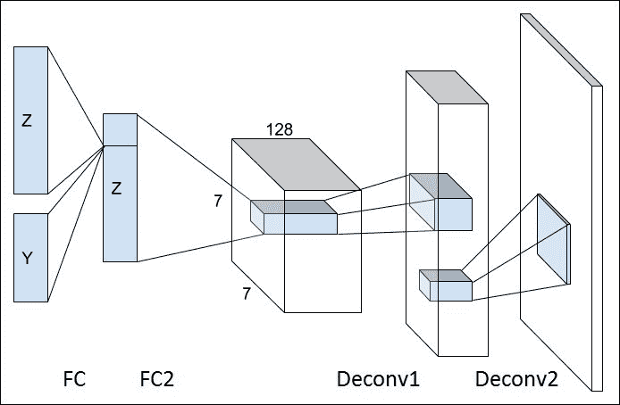

为了在 ano 中创建反卷积，需要创建一个伪卷积正向通道，该梯度用作反卷积:

```
def deconv(X, w, subsample=(1, 1), border_mode=(0, 0), conv_mode='conv'):
    img = gpu_contiguous(T.cast(X, 'float32'))
    kerns = gpu_contiguous(T.cast(w, 'float32'))
    desc = GpuDnnConvDesc(border_mode=border_mode, subsample=subsample,
conv_mode=conv_mode)(gpu_alloc_empty(img.shape[0], kerns.shape[1], img.shape[2]*subsample[0], img.shape[3]*subsample[1]).shape, kerns.shape)
    out = gpu_alloc_empty(img.shape[0], kerns.shape[1], img.shape[2]*subsample[0], img.shape[3]*subsample[1])
    d_img = GpuDnnConvGradI()(kerns, img, out, desc)
    return d_img

def gen(Z, Y, w, w2, w3, wx):
    yb = Y.dimshuffle(0, 1, 'x', 'x')
    Z = T.concatenate([Z, Y], axis=1)
    h = T.nnet.relu(batchnorm(T.dot(Z, w)))
    h = T.concatenate([h, Y], axis=1)
    h2 = T.nnet.relu(batchnorm(T.dot(h, w2)))
    h2 = h2.reshape((h2.shape[0], ngf*2, 7, 7))
    h2 = conv_cond_concat(h2, yb)
    h3 = T.nnet.relu(batchnorm(deconv(h2, w3, subsample=(2, 2), border_mode=(2, 2))))
    h3 = conv_cond_concat(h3, yb)
    x = T.nnet.sigmoid(deconv(h3, wx, subsample=(2, 2), border_mode=(2, 2)))
    return x
```

真实的数据由元组(X，Y)给出，而生成的数据由噪声和标签(Z，Y)构建:

```
X = T.tensor4()
Z = T.matrix()
Y = T.matrix()

gX = gen(Z, Y, *gen_params)
p_real = discrim(X, Y, *discrim_params)
p_gen = discrim(gX, Y, *discrim_params)
```

生成器和鉴别器模型在对抗学习期间竞争:

*   鉴别器被训练为将真实数据标记为真实(`1`)并将生成的数据标记为生成的(`0`)，从而最小化以下成本函数:

    ```
    d_cost = T.nnet.binary_crossentropy(p_real, 								T.ones(p_real.shape)).mean() \ 	+ T.nnet.binary_crossentropy(p_gen, T.zeros(p_gen.shape)).mean()
    ```

*   生成器被训练成尽可能地欺骗鉴别器。发生器的训练信号由鉴别器网络(p_gen)提供给发生器:

    ```
    g_cost = T.nnet.binary_crossentropy(p_gen,T.ones(p_gen.shape)).mean()
    ```

和往常一样的如下。计算关于每个模型的参数的成本，并且训练交替地优化每个模型的权重，使用两倍多的鉴别器。在 GANs 的情况下，鉴别器和发生器之间的竞争不会导致每个损失的减少。

从第一个纪元开始:

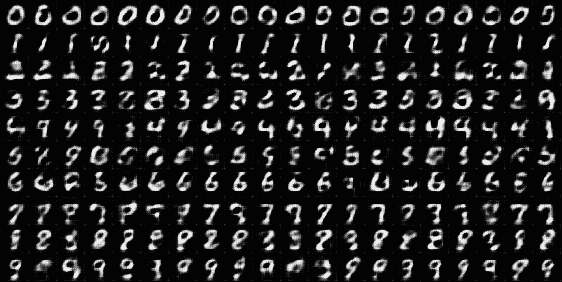

到第 45 纪元:

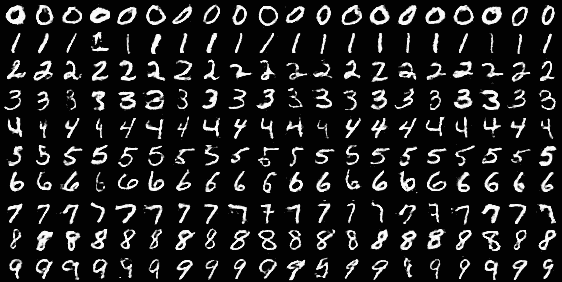

生成的示例看起来更接近真实示例:

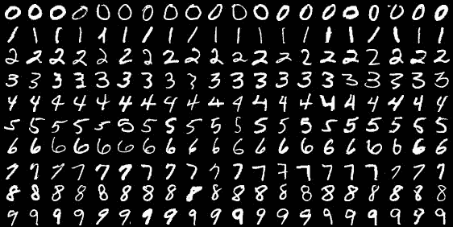

### 改进甘斯

gan 是最近才出现的，非常有前途，但今天仍在进行大量的研究。然而，有一些方法可以改善之前的结果。

首先，就 RBM 和其他网络而言，gan 可以堆叠起来，以增加其生产能力。例如，StackGan 模型提出使用两个堆叠的 Gan 来生成高质量的图像:第一个 GAN 生成粗糙和低分辨率的图像，而第二个 GAN 使用该生成的样本作为输入来生成更高清晰度和真实感的图像，其中对象的细节被精确化。

甘的主要问题之一是**模型崩溃**，这使得他们很难训练。当生成器开始忽略输入噪声并学习只生成一个样本(总是相同)时，模型崩溃发生。这一代人的多样性已经崩溃。一个非常好的处理方法来自 S-GAN 模型，包括添加第三个网络来与发电机一起训练。该网络的目的是预测给定输入的噪声:

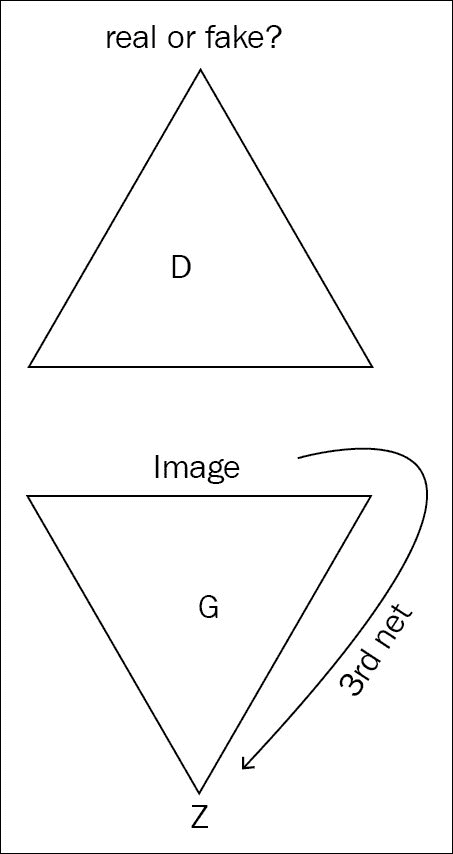

为了利用发生器优化该第三网络，熵损失被添加到发生器损失，以促使生成的图像 *x* 充分依赖于噪声 *z* 。换句话说，条件熵 *H(x | z)* 必须尽可能低:

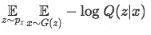

该第三网络预测辅助分布 Q 以逼近真实的后验概率 P(z | x) ，并且可以被证明是对于 *H(x | z)* 的变分上限。这种损失函数有助于发生器不忽略输入噪声。


# 半监督学习

最后，但同样重要的是，这种生成式对抗网络可以用来增强监督学习本身。

假设目标是对 *K* 类进行分类，对于这些类，有大量标记数据可用。可以向数据集添加一些来自生成模型的生成样本，并将其视为属于第 *(K+1)个*类，即伪数据类。

在两个集合(真实数据和虚假数据)之间分解新分类器的训练交叉熵损失导致以下公式:


这里，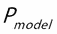是模型预测的概率:

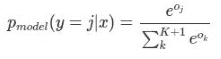

注意如果我们知道数据是真实的:

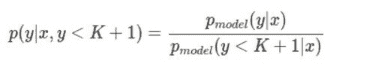

对真实数据(K 类)的训练会导致损失:

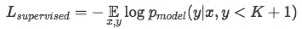

因此，全局分类器的丢失可以被重写:

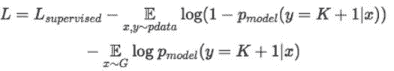

损耗的第二项对应于 GAN 的标准无监督损耗:

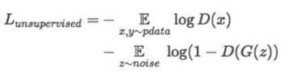

在监督和非监督损失之间引入的相互作用仍然没有被很好地理解，但是，当分类不是微不足道时，非监督损失是有帮助的。


# 延伸阅读

您可以参考以下主题了解更多信息:

*   *Deeplearning.net 关于 RBM 的教程*:[http://deeplearning.net/tutorial/rbm.html](http://deeplearning.net/tutorial/rbm.html)
*   *Deeplearning.net 深度信念网教程*:[http://deeplearning.net/tutorial/DBN.html](http://deeplearning.net/tutorial/DBN.html)
*   *Deeplearning.net 与 RBM-RNN 生成教程*:[http://deeplearning.net/tutorial/rnnrbm.html](http://deeplearning.net/tutorial/rnnrbm.html)
*   *高维序列中的时间依赖性建模:应用于复调音乐生成和转录*，尼古拉斯·布朗热-莱万多夫斯基、约舒阿·本吉奥、帕斯卡尔·文森特，2012
*   生成性对抗性网络，伊恩·古德菲勒、让·普盖-阿巴迪、迈赫迪·米尔扎、徐炳、戴维·沃德-法利、谢尔吉尔·奥泽尔、亚伦·库维尔、约舒阿·本吉奥，2014 年
*   *甘斯会* *改变世界*，https://medium.com/@Moscow25/ 2016[尼古拉·亚科文科](https://medium.com/@Moscow25/)
*   *像素递归神经网络*，Aaron van den Oord，Nal Kalchbrenner，Koray Kavukcuoglu，2016
*   *InfoGAN:通过信息最大化生成对抗网的可解释表示学习，*陈曦，闫端，雷因·胡特，约翰·舒尔曼，伊利亚·苏茨基弗，彼得·阿贝耳，2016
*   *StackGAN:利用堆叠生成对抗网络进行文本到照片级真实感图像合成*，张寒、徐涛、李洪生、张少婷、黄小蕾、王晓刚、迪米特里斯·梅塔克萨斯，2016
*   *堆叠式生成高级网络*，黄浚，黎一萱，奥米德·波尔赛德，约翰·霍普克罗夫特，塞尔日·贝隆吉，2016
*   *用于神经对话生成的对抗性学习*，李继伟，威尔·门罗，史天林，塞巴斯蒂安·让，艾伦·里特，丹·茹拉夫斯基，2017
*   *训练甘斯的改进技术*，蒂姆·萨利曼斯，伊恩·古德菲勒，沃伊切赫·扎伦巴，张维基，亚历克·拉德福德，陈曦，2016
*   *深度卷积生成对抗网络的无监督表示学习*，亚历克·拉德福德，卢克·梅茨，苏密·钦塔拉，2015


# 总结

生成对抗网络是当今非常活跃的研究领域。它们属于生成模型家族，包括 RBM 和深层信念网络。

生成模型旨在生成更多的数据，或者以无监督的方式为监督和其他任务学习更好的特征。

生成模型可以以一些环境输入为条件，并试图找到真实数据背后的隐藏变量。

这些模型是最先进的，与 Theano 一起完成了深度学习网络的概述。下一章将探讨一些先进的概念，以扩展深度学习的概念和未来。