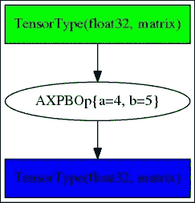
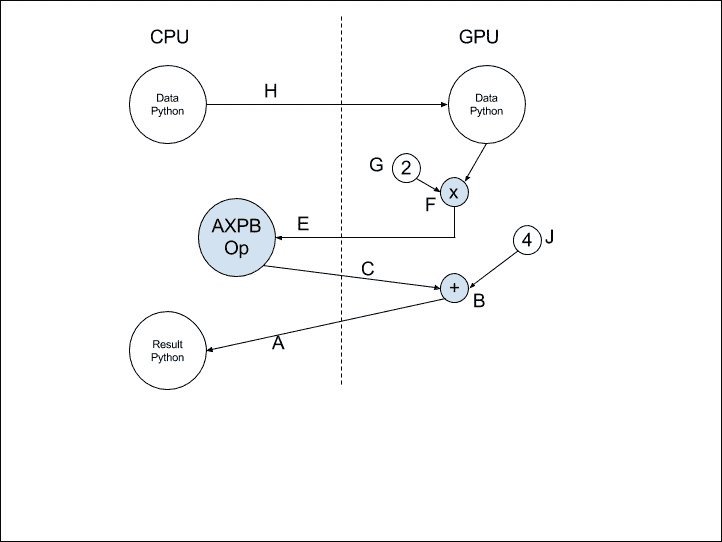
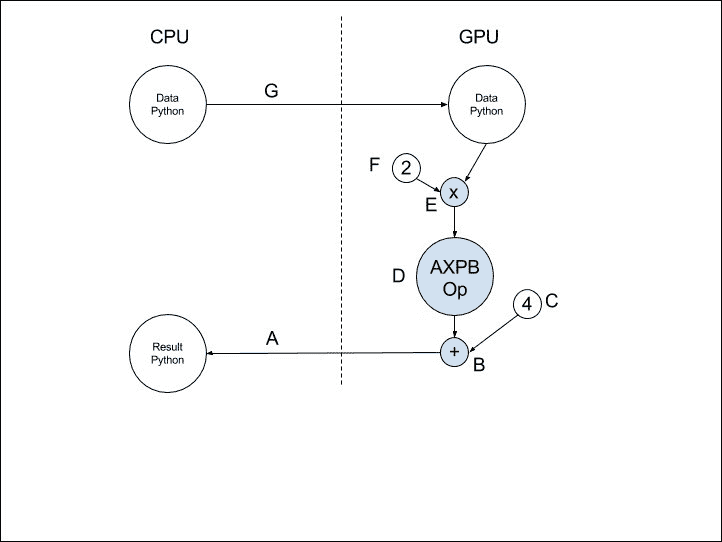
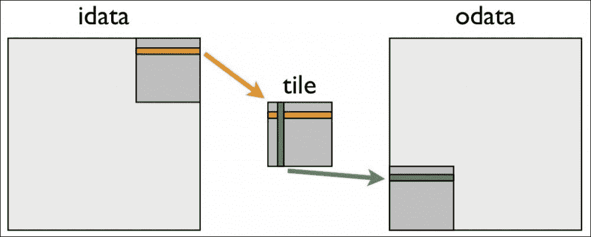
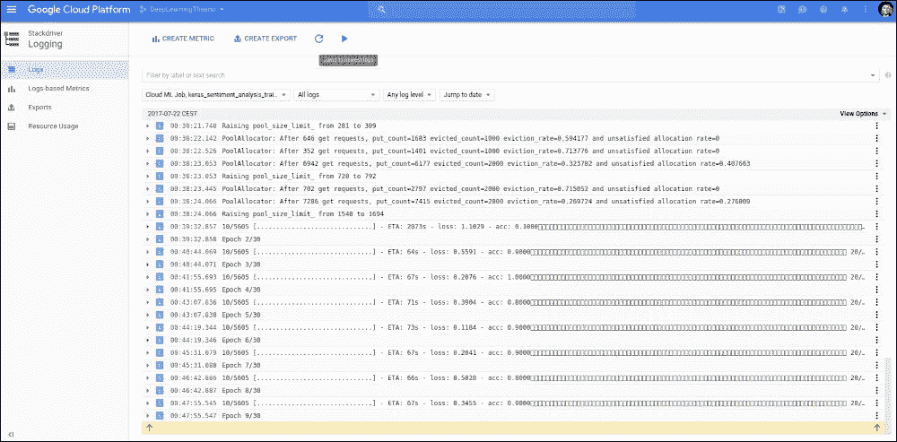
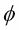
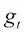
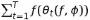
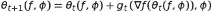
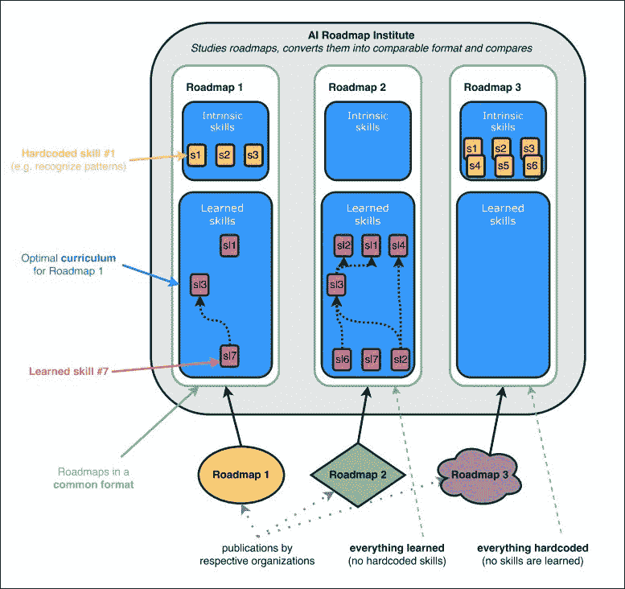

# 十三、使用 Theano 扩展深度学习

这一章给出了进一步研究 ano 和深度学习的线索。首先，它展示了如何用 Python 或 C 为 Theano 计算图创建新的操作符，无论是为 CPU 还是 GPU。然后，在代码库和库的支持下研究与其他深度学习框架的交互，这些代码库和库支持与其他技术的来回转换。

最后，为了完成深度学习领域提供的可能性，我们开发了一个新的通用人工智能领域的概念。

本章涵盖的主题如下:

*   为无计算图编写新的运算符
*   用于 CPU 和 GPU 的 Python 代码
*   CPU 和 GPU 的 C API
*   与其他深度学习框架共享模型
*   云 GPU
*   元学习、渐进学习和引导学习
*   通用人工智能

这一章给出了深度学习的完整概述。


# Python 中的 CPU 运算

作为一个数学编译引擎，Theano 的目的是为目标平台以最佳方式编译计算图。

可以用 Python 或 C 开发新的运算符，以便在 CPU 或 GPU 上编译。

首先，我们处理最简单的情况，在 Python for CPU 中，这将使您能够非常容易和快速地添加新的操作。

为了修正的想法，让我们实现一个简单的仿射操作符，它执行仿射变换 *a * x + b* ，给定 x 作为输入。

运算符由从通用`theano.Op`类派生的类定义:

```
import theano, numpy

class AXPBOp(theano.Op):
    """
    This creates an Op that takes x to a*x+b.
    """
    __props__ = ("a", "b")

    def __init__(self, a, b):
        self.a = a
        self.b = b
        super(AXPBOp, self).__init__()

    def make_node(self, x):
        x = theano.tensor.as_tensor_variable(x)
        return theano.Apply(self, [x], [x.type()])

    def perform(self, node, inputs, output_storage):
        x = inputs[0]
        z = output_storage[0]
        z[0] = self.a * x + self.b

    def infer_shape(self, node, i0_shapes):
        return i0_shapes
    def grad(self, inputs, output_grads):
        return [self.a * output_grads[0]]

mult4plus5op = AXPBOp(4,5)

x = theano.tensor.matrix()
y = mult4plus5op(x)
f = theano.function([x], y)

res = f(numpy.random.rand(3,2))
```

让我们来理解这个例子。

`__props__`属性被设置为运算符依赖的两个参数名`a`和`b`。它会自动为我们生成`__eq__()`、`__hash__()`和`__str_()`方法，这样如果我们用相同的参数`a`和`b`值创建两个不同的对象，那么 ano 会将它们视为相同的操作符:

```
>>> mult4plus5op2 = AXPBOp(4,5)

>>> mult4plus5op == mult4plus5op2
True

>>> hash(mult4plus5op)
-292944955210390262

>>> hash(mult4plus5op2)
-292944955210390262
```

另外，打印 op 时会出现参数`a`和`b`:

```
>>> theano.printing.pprint(y)
AXPBOp{a=4, b=5}.0

>>> theano.printing.pydotprint(y)
```



如果没有指定`__props__`，则需要手动定义`__eq__()`、`__hash__()`和`__str_()`方法。

`make_node()`方法创建包含在图形中的节点，并在将`mult4plus5op`对象应用于输入`x`时运行。使用`theano.Apply()`方法创建节点，该方法将输入变量和输出类型作为参数。为了确保输入是变量，对输入调用`as_tensor_variable()`方法，将任何 NumPy 数组转换为变量。这是我们在给定输入的情况下定义输出类型的地方，也是检查输入是否与操作符兼容并在不兼容的情况下抛出 TypeError 的地方。

注意，可以自动生成`make_node()`方法，就像我们之前对`__eq__()`方法的`__props__`属性所做的那样，但是在这种情况下，用`itypes`和`otypes`属性定义输入和输出的类型:

```
itypes = [theano.tensor.dmatrix]
otypes = [theano.tensor.dmatrix]
```

`perform()`方法定义了 Python 中为这个操作符执行的计算。因为可以在返回多个输出的多个输入上实现运算符，所以输入和输出以列表的形式给出。第二个输出将存储在`output_storage[1][0]`中。输出可能已经由先前的值分配，以便重新使用存储器。他们永远是好的目标，但不需要正确的形状和步幅。当它们的形状不好时，最好重新分配它们。

最后两种方法`infer_shape()`和`grad()`是可选的。当不需要计算输出，但只需要一个形状信息来执行计算时，使用第一种方法，这种情况发生在非优化过程中。第二种用于在`grad()`方法下需要对输出进行微分时:

```
>>> dy=theano.tensor.grad(y.sum(), x)

>>> theano.printing.pprint(dy)
'(TensorConstant{4} * fill(AXPBOp{a=4, b=5}(<TensorType(float32, matrix)>), fill(Sum{acc_dtype=float64}(AXPBOp{a=4, b=5}(<TensorType(float32, matrix)>)), TensorConstant{1.0})))'

>>> df = theano.function([x], dy)

>>> theano.printing.debugprint(df)
Alloc [id A] ''   2
 |TensorConstant{(1, 1) of 4.0} [id B]
 |Shape_i{0} [id C] ''   1
 | |<TensorType(float32, matrix)> [id D]
 |Shape_i{1} [id E] ''   0
   |<TensorType(float32, matrix)> [id D]
```

同样的，也可以定义算子的 R-算子函数。


# 用于 GPU 的 Python 中的 no 操作

让我们来看看在图形处理器`config`模式下运行这个操作符会发生什么:

```
>>> y = mult4plus5op(2 * x) + 4 * x

>>> f = theano.function([x], y)

>>> theano.printing.debugprint(f)
HostFromGpu(gpuarray) [id A] ''   6
 |GpuElemwise{Composite{(i0 + (i1 * i2))}}[(0, 0)]<gpuarray> [id B] ''   5
   |GpuFromHost<None> [id C] ''   4
   | |AXPBOp{a=4, b=5} [id D] ''   3
   |   |HostFromGpu(gpuarray) [id E] ''   2
   |     |GpuElemwise{mul,no_inplace} [id F] ''   1
   |       |GpuArrayConstant{[[ 2.]]} [id G]
   |       |GpuFromHost<None> [id H] ''   0
   |         |<TensorType(float32, matrix)> [id I]
   |GpuArrayConstant{[[ 4.]]} [id J]
   |GpuFromHost<None> [id H] ''   0
```

由于我们仅在 Python 中定义了 new 运算符的 CPU 实现，并且整个图形在 GPU 上运行，因此数据在图形中间来回传输到 CPU，以应用我们的新 CPU 运算符:



为了避免图内传输的低效率，让我们用 Python 为 GPU 创建相同的操作符。

为此，您必须简单地修改操作符的`make_node()`和`perform()`方法，如下所示:

```
from theano.gpuarray.type import get_context

def make_node(self, x):
    x = as_gpuarray_variable(x, self.context_name)

    x_arg = pygpu.elemwise.arg('x', 'float32', read=True)
    c_arg = pygpu.elemwise.arg('c', 'float32', read=True, write=True)
    self.my_op = pygpu.elemwise.GpuElemwise(get_context(self.context_name), "c = " + str(self.a) + " * x + " + str(self.b), [x_arg, c_arg], convert_f16=True)

    return Apply(self, [x], [x.type()])

def perform(self, node, inputs, output_storage):
    x = inputs[0]
    z = output_storage[0]
    z[0] = pygpu.empty(x.shape, dtype=x.dtype, context=get_context(self.context_name))
    self.my_op( x, z[0])
```

变化不大。

在`make_node()`方法中，`as_tensor_variable()`被替换为`as_gpuarray_variable()`，这需要作为 GPU 变量类型定义一部分的上下文。`get_context()`方法将我们为设备选择的上下文名称转换成`pygpu`库的`GPUContext`。

在`perform()`方法中，由于`pygpu`库包含 GPU 上的元素式运算符以及**基本线性代数子程序** ( **BLAS** )方法，例如**通用矩阵到矩阵乘法** ( **GEMM** )和**通用矩阵到向量乘法** ( **GEMV** )运算，计算在 GPU 上执行。

现在让我们看看这个新运算符在 GPU 上的一个更大的图形中时编译的图形:

```
HostFromGpu(gpuarray) [id A] ''   4
 |GpuElemwise{Add}[(0, 1)]<gpuarray> [id B] ''   3
   |GpuArrayConstant{[[ 4.]]} [id C]
   |GpuAXPBOp{a=4, b=5, context_name='dev0'} [id D] ''   2
     |GpuElemwise{Mul}[(0, 1)]<gpuarray> [id E] ''   1
       |GpuArrayConstant{[[ 2.]]} [id F]
       |GpuFromHost<dev0> [id G] ''   0
         |<TensorType(float32, matrix)> [id H]
```



为了的可读性，我们在 GPU 的操作符的类名前加了 GPU；比如 GpuAXPBOp。


# CPU 在 C 语言中的运算

另一个效率低下的原因是，每次执行计算时，也就是说，对于图中操作符的每个实例，操作符的 Python 实现都会增加很大的开销。Python 代码没有被 C 中的 ano 编译为图的其余部分，并且当 C 实现被包装到 Python 中并交换数据时，会产生开销。

为了补救这一点，可以直接编写一些 C 代码，将它们合并到图的其余部分的代码中，并一起编译。

在 C 中直接实现操作符时，NumPy 是管理数组的底层库，NumPy-API 扩展了 Python C-API。定义新 C 操作符的 Python 类不必实现`perform()`方法；相反，它返回C 代码以合并到`c_code()`、`c_support_code()`和`c_support_code_apply()`方法中:

```
def c_code_cache_version(self):
    return (6, 0)

def c_support_code(self):
    c_support_code = """
    bool same_shape(PyArrayObject* arr1, PyArrayObject* arr2)
    {
        if( PyArray_NDIM(arr1) != PyArray_NDIM(arr2)) {
            return false;
        }
        for(int i = 0; i < PyArray_NDIM(arr2) ; i++) {
            if (PyArray_DIMS(arr1)[0] == PyArray_DIMS(arr2)[0]) {
                return false;
            }
        }
        return true;
    }
    """

    return c_support_code

def c_support_code_apply(self, node, name):
    dtype_x = node.inputs[0].dtype
    dtype_z = node.outputs[0].dtype

    a = self.a
    b = self.b

    c_support_code = """
    void elemwise_op_%(name)s(npy_%(dtype_x)s* x_ptr, npy_intp* x_str, int itemsize_x,
        npy_%(dtype_z)s* z_ptr, npy_intp* z_str, int itemsize_z,
        int nbDims, npy_intp* dims)
    {
        npy_intp stride_x = (npy_intp)(1);
        npy_intp stride_z = (npy_intp)(1);
        for (int i = 0; i < nbDims; i ++) {
            stride_x = stride_x * x_str[i] / itemsize_x;
            stride_z = stride_z * z_str[i] / itemsize_z;
        }
        for (int i=0; i < dims[0]; i++)
            if (nbDims==1) {
                z_ptr[i * z_str[0]/itemsize_z] = x_ptr[i * x_str[0] / itemsize_x] * ((npy_%(dtype_z)s) %(a)s) + ((npy_%(dtype_z)s)%(b)s);
            } else {
                elemwise_op_%(name)s( x_ptr + i * stride_x , x_str + 1, itemsize_x,
                    z_ptr + i * stride_z , z_str + 1, itemsize_z,
                    nbDims - 1, dims + 1 );
            }
    }
    """

    return c_support_code % locals()

def c_code(self, node, name, inp, out, sub):
    x = inp[0]
    z = out[0]

    dtype_x = node.inputs[0].dtype
    dtype_z = node.outputs[0].dtype

    itemsize_x = numpy.dtype(dtype_x).itemsize
    itemsize_z = numpy.dtype(dtype_z).itemsize

    typenum_z = numpy.dtype(dtype_z).num

    fail = sub['fail']

    c_code = """
    // Validate that the output storage exists and has the same
    // dimension as x.
    if (NULL == %(z)s || !(same_shape(%(x)s, %(z)s)))
    {
        /* Reference received to invalid output variable.
        Decrease received reference's ref count and allocate new
        output variable */
        Py_XDECREF(%(z)s);
        %(z)s = (PyArrayObject*)PyArray_EMPTY(PyArray_NDIM(%(x)s),
                                            PyArray_DIMS(%(x)s),
                                            %(typenum_z)s,
                                            0);

        if (!%(z)s) {
            %(fail)s;
        }
    }

    // Perform the elemwise operation
    ((npy_%(dtype_z)s *)PyArray_DATA(%(z)s))[0] = 0;
    elemwise_op_%(name)s((npy_%(dtype_x)s*)PyArray_DATA(%(x)s), PyArray_STRIDES(%(x)s), %(itemsize_x)s,
                            (npy_%(dtype_z)s*)PyArray_DATA(%(z)s), PyArray_STRIDES(%(z)s), %(itemsize_z)s,
                            PyArray_NDIM(%(x)s), PyArray_DIMS(%(x)s) );

    """

    return c_code % locals()
```

现在让我们讨论不同的部分:

当`c_code_cache_version()`被实现时，Theano 将缓存编译后的代码，以便在下一次将操作符合并到图中时节省一些编译时间，但是每当我们修改 C op 的代码时，版本号都必须递增。

放置在`c_support_code()`和`c_support_code_apply()`方法中的代码包含在 C 程序的全局范围内。放置在`c_support_code_apply()`和`c_code()`方法中的代码必须特定于图中 op 的每次应用；特别是，在这种情况下，它们取决于输入的类型。由于`c_support_code_apply()`代码包含在全局范围内，所以这些方法以 op 名命名。

`PyArray_NDIM`、`PyArray_DIMS`、`PyArray_STRIDES`、`PyArray_DATA`分别是访问 C 中每个 NumPy 数组的维数、维数、数组的步距、数组中的数据的宏，`PyArrayObject`。`PyArray_EMPTY`相当于 c 语言中的 Python `numpy.empty()`方法。

NumPy `PyArrayObject`类从 Python C-API 的`PyObject`类继承而来。在为新的输出数组分配内存之前，`Py_XDECREF`宏使我们能够减少输出的参考计数。与 Python C-API 一样，NumPy C-API 要求正确计算对对象的引用。该方法不保证输出数组已被分配，也不保证它是否以正确的形状被分配。这就是为什么在`c_code()`开始时执行测试。

请注意，数组可以被划分，因为它们可以是数组(张量)的视图(或子张量)。也可以实现创建视图或修改输入的操作。

在 C 实现中还有一些其他可能的方法:`c_libraries()`和`c_lib_dirs()`使用外部库，`c_code_cleanup()`销毁内存分配，`c_init_code()`在初始化时执行一些代码。

最后，还可以在代码中引用一些 C 文件来减轻 Python 类的负担。我们不详述这最后三个特性。


# 面向 GPU 的 C 语言中的操作码

正如您所想象的，结合两种优化是可能的:

*   通过直接用 C 编程来减少 Python/C 的开销
*   为 GPU 写代码

要为 GPU 编写 CUDA 代码，必须将在 GPU 的众多内核上并行运行的代码打包成一个名为**内核**的特殊函数类型。

出于这个目的，`__init__()`、`make_node()`和`c_code_cache_version()`方法与我们的 Python 示例中的 GPU 保持一致，但是使用了一个新的`gpu_kernels()`方法来定义新的 GPU 内核，使用了`c_code()`方法(再次取代了`perform()`方法)来实现 C 代码，也称为**宿主代码**，它协调了如何以及何时调用 GPU 上的不同内核:

```
def gpu_kernels(self, node, name):
    code = """
KERNEL void axpb(GLOBAL_MEM %(ctype)s *x, GLOBAL_MEM  %(ctype)s *z, ga_size n, ga_size m) {
for (ga_size i = LID_0; i < n; i += LDIM_0) {
    for (ga_size j = LID_0; j < m; j += LDIM_0) {
        z[i*m + j] = %(write_a)s( 2 * x[i*m + j] );
    }
}
}""" % dict(ctype=pygpu.gpuarray.dtype_to_ctype(self.dtype),
        name=name, write_a=write_w(self.dtype))
    return [Kernel(
            code=code, name="axpb",
            params=[gpuarray.GpuArray, gpuarray.GpuArray, gpuarray.SIZE, gpuarray.SIZE],
            flags=Kernel.get_flags(self.dtype),
            objvar='k_axpb_' + name)]

def c_code(self, node, name, inp, out, sub):
    n, = inp
    z, = out
    dtype_n = node.inputs[0].dtype
    fail = sub['fail']
    ctx = sub['params']
    typecode = pygpu.gpuarray.dtype_to_typecode(self.dtype)
    sync = bool(config.gpuarray.sync)
    kname = self.gpu_kernels(node, name)[0].objvar
    s = """
    size_t dims[2] = {0, 0};
    size_t ls, gs;
    int err;
    dims[0] = %(n)s->ga.dimensions[0];
    dims[1] = %(n)s->ga.dimensions[1];
    Py_CLEAR(%(z)s);
    %(z)s = pygpu_zeros(2, dims,
                        %(typecode)s,
                        GA_C_ORDER,
                        %(ctx)s, Py_None);
    if (%(z)s == NULL) {
        %(fail)s
    }
    ls = 1;
    gs = 256;
    err = axpb_call(1, &gs, &ls, 0, %(n)s->ga.data, %(z)s->ga.data, dims[0], dims[1]);
    if (err != GA_NO_ERROR) {
        PyErr_Format(PyExc_RuntimeError,
                     "gpuarray error: kEye: %%s. n%%lu, m=%%lu.",
                     GpuKernel_error(&%(kname)s, err),
                     (unsigned long)dims[0], (unsigned long)dims[1]);
        %(fail)s;
    }
    if(%(sync)d)
        GpuArray_sync(&%(z)s->ga);
    """ % locals()

    return s
```

```
A new GPU computation kernel is defined under the name axpb, and it is a simple C code with special GPU types and two macros: KERNEL to designate the kernel function (hiding the CUDA __global__ declaration for kernels) and GLOBAL_MEM for the variables defined globally, available both on the CPU and the GPU (in opposition to variables inside the kernel function that, by default, are local to the thread executed on a GPU core).
```

请注意，我只为矩阵(即二维)输入实现了操作符，256 个线程将并行执行相同的操作，而这些操作可以被分成不同的组并分配给不同的线程。

运行在 CPU 上的主机代码管理 CPU 和 GPU 上的内存，并且还启动内核，这些内核是在 GPU 设备上执行的功能。

使用`pygpu_zeros()`方法执行新 GPU 数组的分配，当使用 CUDA 直接在 GPU 内存中分配数组时，该方法将从后面调用`cudamalloc()`方法。运算符实例不需要管理分配给输出的内存的释放以及 GPU 和 CPU 之间的数据传输，因为这是 ano optimization 决定何时插入传输运算符`HostFromGpu`和`GpuFromHost`的任务。

C 代码中对内核的调用是通过`axpb_call()`来执行的，也就是内核的名字后跟`_call()`。请注意，调用中的参数比内核方法定义中的多四个。这四个参数定义了`libgpuarray`如何在内核上执行或部署内核。

为了理解并行编程的 GPU 执行配置，让我们先明确一些关于 GPU 的基本概念。CUDA GPU 由**流式多处理器** ( **SM** )组成，规格由 warp 大小、网格大小、块大小、每个 SM 和每个块的最大线程数量、共享和本地内存大小以及最大注册器数量的计算能力给出:


(来源:[https://en.wikipedia.org/wiki/CUDA](https://en.wikipedia.org/wiki/CUDA))

在执行过程中，多处理器以**单指令多数据** ( **SIMD** )方式为一组 32 个线程(如上表所述)执行指令，称为 warp。当对进行并行执行编程时，您需要将您的线程组织成尽可能接近底层架构的块。例如，对于矩阵上的元素操作，如我们的 AXPBOp，你可以说每个线程将对矩阵的一个元素执行操作。因此，对 224 x 224 图像的计算将需要 50，176 个线程。假设 GPU 有 8 个多处理器，每个处理器有 1024 个内核。例如，在执行配置中，您可以定义 256 个线程的块大小，执行完整计算所需的块数将是 196 个块。为了简化并行程序的开发，可以将块组织成多维网格(对于 2.0 以上的 CC，多达 3 个维度，如上表所示)，对于图像输入，使用 14 x 14 块的二维网格是很自然的。将线程组织成网格上的块取决于您，但是组织线程的最佳方式是遵循底层数据的维度，因为这样更容易将数据分割并影响到不同的线程。

每个线程执行都提供了一些值来访问它在网格中的位置，您可以在代码中使用这些值:

`gridDim.x`、`gridDim.y`、`gridDim.z`线块网格的尺寸

*   `blockIdx.x`、`blockIdx.y`、`blockIdx.z`网格上图块的坐标
*   `blockDim.x`、`blockDim.y`、`blockDim.z`垫块的尺寸
*   `threadIdx.x`、`threadIdx.y`、`threadIdx.z`块中螺纹的坐标
*   在我们的基于元素的 AXPBOp 中，每个元素有一个线程，线程可以获取由以下行索引给出的数据元素:

为了进行部署，内核调用中的前四个新参数对应于:

```
int i = blockIdx.x*blockDim.x + threadIdx.x;
```

网格/块的维数，在这种情况下，作为输入的图像/矩阵的维数为 2

*   在这种情况下，发射网格的大小是{14，14}。一旦定义了每个块的线程数(在我们的例子中是 256)，每个网格的块数就由问题的大小(这里是矩阵的大小)决定了。
*   启动块的大小，在本例中为{16，16}，每个块有 256 个线程，因为它通常被设置为 128 或 256。最好选择扭曲大小的倍数，因为执行是按扭曲执行的；如果你将它设置为 250，那么，我们的 201 个块将表现不佳:每个块的一个扭曲将不会被使用到它的全部并行潜力。可以尝试 32 的不同倍数，并选择最有效的运行。
*   The sizes of launch blocks, in this case {16, 16} to go for 256 threads per block, as it is usually set to 128 or 256\. It is better to choose a multiple of the warp size, since execution is performed per warp; if you set it to 250, then, 201 of our blocks will underperform: one warp of each block will not be used at its full parallel potential. It is possible to try different multiples of 32 and make the choice on the most efficient runs.
*   The amount of dynamic shared memory to allocate, which is required when you define a shared memory (with the `LOCAL_MEM` macro) that is dynamic (when the amount of shared memory is not known at compile time). Shared memory designates memory shared between threads belonging to the same block of threads. On devices of compute capability 2.x and 3.x, each multiprocessor has 64 KB of on-chip memory that can be partitioned between L1 cache and shared memory (16, 32, or 48K). The L1 cache coalesces global memory accesses by threads in a warp into as few cache lines as possible. The alignment differences between each thread have a negligible effect on performance thanks to the cache. Inefficiencies arise in the strided access for second and third dimensions; in this case, the use of shared memory enables you to extract a 2D tile of a multidimensional array from global memory in a coalesced fashion into shared memory and have contiguous threads stride through the shared memory tile:

    通过共享内存合并转置，所有 NVIDIA 并行


# 当数据的维不可分为块大小乘以网格大小时，在边界处理数据的线程将比其他线程执行更快，内核代码必须以检查越界内存访问的方式编写。

当并行编程时，竞争条件、共享内存中的内存块冲突以及无法在可用注册器中保持线程本地状态的数据是一些需要检查的新问题。合并全局内存访问是实现良好性能的最关键的方面。NVIDIA Nsight 工具将帮助您开发、调试和分析在 CPU 和 GPU 上执行的代码。

型号转换


## 当保存一个模型时，产生的数据只是一个数组列表，即权重向量(用于偏差)和矩阵(用于乘法)以及每一层的名称。将一个模型从一个框架转换到另一个框架非常简单:它包括加载一个数字数组和检查层名。下面是几个用 C++编写的 Caffe 深度学习框架的相互转换示例:

[https://github.com/an-kumar/caffe-theano-conversion](https://github.com/an-kumar/caffe-theano-conversion)

*   [https://github.com/kencoken/caffe-model-convert](https://github.com/kencoken/caffe-model-convert)
*   [https://github.com/piergiaj/caffe-to-theano](https://github.com/piergiaj/caffe-to-theano)
*   要在 Torch 深度学习框架(用 Lua 编写)和 Theano 之间转换变量，只需要一个工具就可以将数据从 Lua 转换到 Python NumPy:

[https://github.com/imodpasteur/lutorpy](https://github.com/imodpasteur/lutorpy)

要在 Tensorflow 和 Theano 之间转换模型，我建议您使用 Keras 库，该库将保持最新，并能够在 Theano 或 Tensorflow 中训练模型。例如，要将一个模型从 Tensorflow 转换为 Theano，保持您的 Keras 安装配置有 Theano，如我们在[第 5 章](part0060_split_000.html#1P71O2-ccdadb29edc54339afcb9bdf9350ba6b "Chapter 5. Analyzing Sentiment with a Bidirectional LSTM")、*使用双向 LSTM* 分析情绪中所见，加载 Tensorflow 权重，并修改图层名称如下:

镜像操作序列使我们能够反其道而行之，从无到TensorFlow。

```
from keras import backend as K
from keras.utils.conv_utils import convert_kernel
from keras.models import Model

# build your Keras model HERE
# then
model.load_weights('my_weights_tensorflow.h5')

for layer in model.layers:
   if layer.__class__.__name__ in ['Convolution1D', 'Convolution2D']:
      original_w = K.get_value(layer.W)
      converted_w = convert_kernel(original_w)
      K.set_value(layer.W, converted_w)

model.save_weights('my_weights_theano.h5')
```

在 Keras 中设计网络的另一个优势是可以直接在云中训练它们，使用谷歌云机器学习引擎，用**张量处理单元** ( **TPU** )构建，这是 GPU 的替代物，是为机器学习而设计的。

让我们以[第 5 章](part0060_split_000.html#1P71O2-ccdadb29edc54339afcb9bdf9350ba6b "Chapter 5. Analyzing Sentiment with a Bidirectional LSTM")、*用双向 LSTM* 分析情感为例。

为了在云中训练模型，我在谷歌控制台[https://console.cloud.google.com/iam-admin/projects](https://console.cloud.google.com/iam-admin/projects)中创建了一个名为 *DeepLearning Theano* 的项目，并在该项目的 API 管理器中，启用机器学习引擎 API。一些安装需求可以通过以下网址的说明进行检查:[https://Cloud . Google . com/ml-engine/docs/quick starts/command-line](https://cloud.google.com/ml-engine/docs/quickstarts/command-line)，比如 Google Cloud SDK 和项目配置。使用`gcloud` `init`命令，您的 SDK 配置可以重新初始化，以切换到*deep learning the no*项目。

给定您选择的地区(这里是`europe-west1`)，让我们将数据上传到云中一个新创建的桶中:

由于模型是在云中的实例上执行的，因此需要:

```
gsutil mb -l europe-west1 gs://keras_sentiment_analysis
gsutil cp -r sem_eval2103.train gs://keras_sentiment_analysis/sem_eval2103.train
gsutil cp -r sem_eval2103.dev gs://keras_sentiment_analysis/sem_eval2103.dev
gsutil cp -r sem_eval2103.test gs://keras_sentiment_analysis/sem_eval2103.test
```

修改 Python 脚本，从远程存储桶而不是本地目录加载文件流，使用库`tensorflow.python.lib.io.file_io.FileIO(train_file, mode='r')` 而不是标准方法`open(train_file, mode='r')`，两者的模式参数用法相同，“r”表示读取，`w`表示写入，

*   定义一个`setup.py`文件来配置云实例环境中需要的库:

    ```
     from setuptools import setup, find_packages  setup(name='example5',   version='0.1',   packages=find_packages(),   description='keras on gcloud ml-engine',   install_requires=[       'keras',       'h5py',       'nltk'   ],   zip_safe=False)
    ```

*   定义云部署配置文件，`cloudml-gpu.yaml` :

    ```
      trainingInput:     scaleTier: CUSTOM     # standard_gpu provides 1 GPU. Change to complex_model_m_gpu for 4 GPUs     masterType: standard_gpu     runtimeVersion: "1.0"
    ```

*   在将培训提交到 Google ML Cloud 之前，要在本地检查其工作情况，请运行以下命令:

如果本地一切正常，那么让我们把它提交给云:

```
gcloud ml-engine local train --module-name 7-google-cloud.bilstm \
  --package-path ./7-google-cloud  -- --job-dir ./7-google-cloud \
  -t sem_eval2103.train -d sem_eval2103.dev -v sem_eval2103.test
```

If everything works fine locally, let's submit it to the cloud:

```
JOB_NAME="keras_sentiment_analysis_train_$(date +%Y%m%d_%H%M%S)"

gcloud ml-engine jobs submit training $JOB_NAME \
          --job-dir gs://keras_sentiment_analysis/$JOB_NAME \
          --runtime-version 1.0 \
          --module-name 7-google-cloud.bilstm  \
          --package-path ./7-google-cloud \
          --region europe-west1 \
          --config=7-google-cloud/cloudml-gpu.yaml \
          -- \
          -t gs://keras_sentiment_analysis/sem_eval2103.train \
          -d gs://keras_sentiment_analysis/sem_eval2103.dev \
          -v gs://keras_sentiment_analysis/sem_eval2103.test

gcloud ml-engine jobs describe $JOB_NAME
```



注意

### 注意 Google ML Cloud 使用 Tensorflow 作为后端。

人工智能的未来


# [第 2 章](part0026_split_000.html#OPEK1-ccdadb29edc54339afcb9bdf9350ba6b "Chapter 2. Classifying Handwritten Digits with a Feedforward Network")、*用前馈网络对手写数字进行分类*介绍了各种优化技术(Adam、RMSProp 等)并提到了二阶优化技术。概括来说，也要学习更新规则:

[Chapter 2](part0026_split_000.html#OPEK1-ccdadb29edc54339afcb9bdf9350ba6b "Chapter 2. Classifying Handwritten Digits with a Feedforward Network"), *Classifying Handwritten Digits with a Feedforward Network* presented diverse optimization techniques (Adam, RMSProp, and so on) and mentioned second order optimization techniques. A generalization would be to also learn the update rule:


这里，是优化器从不同问题实例中学习的参数，一种*泛化*或*转移优化器从问题中学习*以更好地学习新问题。在此*学习学习*或*元学习*框架下最小化的目标必须优化正确学习的时间，因此，在多个时间步长上定义:

Here,  is the parameter of the optimizer  to learn from different problem instances, a sort of *generalization* or *transfer learning* of the optimizer from problems to learn better on new problems. The objective to minimize under this *learning to learn* or *meta-learning* framework has to optimize the time to learn correctly and, consequently, be defined on multiple timesteps:



其中:

Where:



循环神经网络可用作优化器模型。这种解决多目标优化问题的泛化技术总体上提高了神经网络的学习速率。

研究人员已经向前看了一步，寻找通用人工智能，其目标是建立一个人类水平的技能集，有能力以渐进的方式改善自己并获得新技能，使用其**固有的**和以前学习的技能来寻找新优化问题的解决方案。

一项**技能**可以被定义为一种智能工具，用来缩小或限制搜索空间，并限制机器人在无限可能性世界中的行为。

构建一个**通用人工智能**需要你定义具有内在技能的智能架构，这将由程序员硬编码到机器人中，并帮助解决更小的子问题，以及定义获得新技能的顺序，可以在人工智能的**学校中教授的**课程路线图**。**渐进学习**使用更简单的技能逐渐学习技能，而**引导式学习**涉及到一个已经发现技能并将它们教给其他人工智能的老师。**

在自然语言翻译任务中，较小的网络已经被证明可以从较大的网络中学习得更快更好，较大的网络是 *mentor* ，它可以学习翻译并产生供较小网络学习的翻译，而不是直接从一组真实的人工翻译中学习。

On natural language translation tasks, smaller networks have been proven to learn faster and better from a bigger network, the *mentor*, which would have learned to translate and produce the translations for the smaller network to learn from, rather than learning directly from a real set of human translations.



上图代表 GoodAI Roadmap Institute 评估 AI 的学习路线图。

自我探索、与导师交流以及整合积极和消极的反馈是自主智能自我发展的想法之一，当前的深度学习网络为这一未来开辟了道路。

在朝着这一目标努力的公司中，值得一提的是 GoodAI，以及亚马逊的 Echo 产品和底层语音控制助理技术 Alexa，它已经学会了 10，000 多种技能，以帮助你组织你的生活。Alexa 的知识已经变得如此庞大，以至于很难深入其中并找到它的局限性。开发人员的测试环境使他们能够将这些技能插入到更高层次的智能工具中:

Among the companies that work toward this goal, it would be worth to quote GoodAI, as well as Amazon with its Echo product and the underlying voice control assistant technology, Alexa, that has already learned more than 10,000 skills in order to help you organize your life. Alexa's knowledge has become so vast that it becomes hard to dive deep into it and find its limitations. A test environment for developers enables them to insert these skills into intelligence tools of higher level:


延伸阅读


# 可以参考以下文章了解更多:

*安 E*asy CUDA C 和 C++ ，[https://dev blogs . NVIDIA . com/parallel forall/easy-Introduction-CUDA-C-and-C/](https://devblogs.nvidia.com/parallelforall/easy-introduction-cuda-c-and-c/)

*   *如何在 CUDA C/C++内核中高效访问全局内存**，[https://dev blogs . NVIDIA . com/parallel forall/How-Access-Global-Memory-efficient-CUDA-C-Kernels/](https://devblogs.nvidia.com/parallelforall/how-access-global-memory-efficiently-cuda-c-kernels/)*
*   **在 CUDA C/C++中使用共享内存*，[https://dev blogs . NVIDIA . com/parallel forall/Using-Shared-Memory-CUDA-cc/](https://devblogs.nvidia.com/parallelforall/using-shared-memory-cuda-cc/)*
*   **Just another Tensorflow 初学者指南(Par**T4-Google Cloud ML+GUP+Keras)*[http://Liu Fuyang . github . io/2017/04/02/Just-another-tensor flow-初学者指南-4.html](http://liufuyang.github.io/2017/04/02/just-another-tensorflow-beginner-guide-4.html)*
*   *学习如何通过梯度下降来学习，Marcin Andrychowicz，Misha Denil，Sergio Gomez，Matthew W. Hoffman，大卫·普法乌，Tom Schaul，Brendan Shillingford 和 Nando de Freitas，2016 年*
*   *搜索通用人工智能的框架，Marek Rosa 和 Jan Feyereisl，GoodAI Collective，2016 年*
*   *总结*

*

# 这一章总结了我们对深度学习的概述。

在 Python 和 C 中为 CPU 和 GPU 的第一组 Theano 扩展已经在这里公开，为计算图创建新的操作符。

将学习到的模型从一个框架转换到另一个框架并不是一项复杂的任务。Keras 是一个高级库，在本书中多次出现，作为 Theano 引擎之上的抽象，它提供了一种简单的方法来使用 Theano 和 Tensorflow，以及在 Google ML 云中推动模型的训练。

最后，本书中介绍的所有网络都是普通智能的基础，普通智能可以使用这些第一技能，如视觉或语言理解和生成，来学习更广泛的技能，仍然是从现实世界数据或生成的数据中获得的经验。

索引


# A

## AdaDelta / [优化和其他更新规则](part0037.html#1394Q2-ccdadb29edc54339afcb9bdf9350ba6b "Optimization and other update rules")

*   Adagrad / [优化和其他更新规则](part0037.html#1394Q2-ccdadb29edc54339afcb9bdf9350ba6b "Optimization and other update rules")
*   亚当/ [优化和其他更新规则](part0037.html#1394Q2-ccdadb29edc54339afcb9bdf9350ba6b "Optimization and other update rules")
*   AlphaGo / [Q-learning](part0106.html#352RK2-ccdadb29edc54339afcb9bdf9350ba6b "Q-learning")
*   类比推理/ [评估嵌入——类比推理](part0045.html#1AT9A2-ccdadb29edc54339afcb9bdf9350ba6b "Evaluating embeddings – analogical reasoning")
*   体系结构
*   设计，用于模型/ [设计模型的架构](part0062_split_000.html#1R42S2-ccdadb29edc54339afcb9bdf9350ba6b "Designing the architecture for the model")
    *   词语的矢量表示法/ [词语的矢量表示法](part0062_split_000.html#1R42S2-ccdadb29edc54339afcb9bdf9350ba6b "Vector representations of words")
    *   句子表征，使用 bi-LSTM / [句子表征使用 bi-LSTM](part0062_split_000.html#1R42S2-ccdadb29edc54339afcb9bdf9350ba6b "Sentence representation using bi-LSTM")
    *   用 softmax 分类器输出概率/ [用 softmax 分类器输出概率](part0062_split_000.html#1R42S2-ccdadb29edc54339afcb9bdf9350ba6b "Outputting probabilities with the softmax classifier")
    *   人工智能
*   未来/ [人工智能的未来](part0121.html#3JCK21-ccdadb29edc54339afcb9bdf9350ba6b "The future of artificial intelligence")
    *   计算语言学协会(ACL) / [Seq2seq 翻译](part0084.html#2G3F81-ccdadb29edc54339afcb9bdf9350ba6b "Seq2seq for translation")
*   异步梯度下降/ [训练稳定性](part0108.html#36VSO2-ccdadb29edc54339afcb9bdf9350ba6b "Training stability")
*   注意力机制
*   可区分的/ [可区分的注意力机制](part0091_split_000.html#2MP362-ccdadb29edc54339afcb9bdf9350ba6b "Differentiable mechanism of attention")
    *   关于/ [注意的可分化机制](part0091_split_000.html#2MP362-ccdadb29edc54339afcb9bdf9350ba6b "Differentiable mechanism of attention")
    *   翻译/ [具有注意力机制的更好的翻译](part0091_split_000.html#2MP362-ccdadb29edc54339afcb9bdf9350ba6b "Better translations with attention mechanism")
    *   注释图像/ [用注意力机制更好地注释图像](part0091_split_000.html#2MP362-ccdadb29edc54339afcb9bdf9350ba6b "Better annotate images with attention mechanism")
    *   汽车编码器/ [深度信念赌注](part0112_split_000.html#3APV02-ccdadb29edc54339afcb9bdf9350ba6b "Deep belief bets")
*   自动微分/ [功能和自动微分](part0022.html#KVCC1-ccdadb29edc54339afcb9bdf9350ba6b "Functions and automatic differentiation")
*   B


## 反向传播/ [反向传播和随机梯度下降](part0031.html#TI1E1-ccdadb29edc54339afcb9bdf9350ba6b "Backpropagation and stochastic gradient descent")

*   穿越时间的反向传播(BPTT) / [简单循环网络](part0053_split_000.html#1IHDQ2-ccdadb29edc54339afcb9bdf9350ba6b "Simple recurrent network")
*   基本线性代数子程序(BLAS) / [用于 GPU 的 Python 中的 no Op](part0117.html#3FIHQ1-ccdadb29edc54339afcb9bdf9350ba6b "Theano Op in Python for the GPU")
*   批量归一化/ [批量归一化](part0075_split_000.html#27GQ61-ccdadb29edc54339afcb9bdf9350ba6b "Batch normalization")
*   批量归一化层/ [批量归一化](part0075_split_000.html#27GQ61-ccdadb29edc54339afcb9bdf9350ba6b "Batch normalization")
*   贝叶斯网络理论/[RNN 辍学](part0096_split_000.html#2RHM01-ccdadb29edc54339afcb9bdf9350ba6b "Dropout for RNN")
*   波束搜索算法/ [提高时序网络效率](part0086.html#2I0GC1-ccdadb29edc54339afcb9bdf9350ba6b "Improving efficiency of sequence-to-sequence network")
*   广播/ [元素式操作符](part0020_split_000.html#J2B82-ccdadb29edc54339afcb9bdf9350ba6b "Elementwise operators")
*   C


## 字符错误率(CER) / [自然语言性能指标](part0054.html#1JFUC1-ccdadb29edc54339afcb9bdf9350ba6b "Metrics for natural language performance")

*   合并转置
*   通过共享内存/ [通过共享内存合并转置，所有 NVIDIA 并行](part0120_split_000.html#3IE3G2-ccdadb29edc54339afcb9bdf9350ba6b "Coalesced transpose via shared memory, NVIDIA parallel for all")
    *   通过 NVIDIA 并行/ [合并转置通过共享内存，NVIDIA 并行用于所有](part0120_split_000.html#3IE3G2-ccdadb29edc54339afcb9bdf9350ba6b "Coalesced transpose via shared memory, NVIDIA parallel for all")
    *   车型转换/ [车型转换](part0120_split_000.html#3IE3G2-ccdadb29edc54339afcb9bdf9350ba6b "Model conversions")
    *   图像的条件随机场(CRF) / [去卷积](part0087.html#2IV0U2-ccdadb29edc54339afcb9bdf9350ba6b "Deconvolutions for images")
*   连续单词包(CBOW) / [编码和嵌入](part0040_split_000.html#164MG1-ccdadb29edc54339afcb9bdf9350ba6b "Encoding and embedding")
*   连续词袋模型/ [连续词袋模型](part0042.html#181NK2-ccdadb29edc54339afcb9bdf9350ba6b "Continuous Bag of Words model")
*   控制器/ [在神经图灵机中存储和检索信息](part0092.html#2NNJO2-ccdadb29edc54339afcb9bdf9350ba6b "Store and retrieve information in Neural Turing Machines")
*   卷积神经网络(CNN) / [编码和嵌入](part0040_split_000.html#164MG1-ccdadb29edc54339afcb9bdf9350ba6b "Encoding and embedding")
*   卷积/ [卷积和最大层数](part0033.html#VF2I2-ccdadb29edc54339afcb9bdf9350ba6b "Convolutions and max layers")
*   成本函数/ [成本函数和误差](part0030.html#SJGS1-ccdadb29edc54339afcb9bdf9350ba6b "Cost function and errors")
*   库达
*   URL，用于下载/ [GPU 驱动程序和库](part0017_split_000.html#G6PI1-ccdadb29edc54339afcb9bdf9350ba6b "GPU drivers and libraries")
    *   D


## 数据增强/ [数据增强](part0080.html#2C9D01-ccdadb29edc54339afcb9bdf9350ba6b "Data augmentation")

*   数据集/ [数据集](part0041.html#173721-ccdadb29edc54339afcb9bdf9350ba6b "Dataset")
*   对于自然语言/ [自然语言数据集](part0052.html#1HIT82-ccdadb29edc54339afcb9bdf9350ba6b "A dataset for natural language")
    *   字符级/ [自然语言数据集](part0052.html#1HIT82-ccdadb29edc54339afcb9bdf9350ba6b "A dataset for natural language")
    *   单词级/ [自然语言数据集](part0052.html#1HIT82-ccdadb29edc54339afcb9bdf9350ba6b "A dataset for natural language")
    *   图像的去卷积
*   深深的信念赌注/ [深深的信念赌注](part0112_split_000.html#3APV02-ccdadb29edc54339afcb9bdf9350ba6b "Deep belief bets")
*   深度信念网络(DBN) / [深度信念赌注](part0112_split_000.html#3APV02-ccdadb29edc54339afcb9bdf9350ba6b "Deep belief bets")
*   Deeplearning.net·泰阿诺
*   参考文献/ [相关文章](part0038.html#147LC1-ccdadb29edc54339afcb9bdf9350ba6b "Related articles")
    *   深掩模网络/ [图像去卷积](part0087.html#2IV0U2-ccdadb29edc54339afcb9bdf9350ba6b "Deconvolutions for images")
*   DeepMind 算法/ [Q-learning](part0106.html#352RK2-ccdadb29edc54339afcb9bdf9350ba6b "Q-learning")
*   深 Q 网/ [深 Q 网](part0107.html#361C61-ccdadb29edc54339afcb9bdf9350ba6b "Deep Q-network")
*   深度过渡网络/[RNN 的深度方法](part0097.html#2SG6I1-ccdadb29edc54339afcb9bdf9350ba6b "Deep approaches for RNN")
*   深度跃迁轮回网/ [深度跃迁轮回网](part0099.html#2UD7M1-ccdadb29edc54339afcb9bdf9350ba6b "Deep transition recurrent network")
*   密集连接/ [密集连接](part0078.html#2ACBS1-ccdadb29edc54339afcb9bdf9350ba6b "Dense connections")
*   维度操作符/ [维度操作符](part0020_split_000.html#J2B82-ccdadb29edc54339afcb9bdf9350ba6b "Dimension manipulation operators")
*   辍学/ [辍学](part0035.html#11C3M1-ccdadb29edc54339afcb9bdf9350ba6b "Dropout")
*   E


## 元素式操作符/ [元素式操作符](part0020_split_000.html#J2B82-ccdadb29edc54339afcb9bdf9350ba6b "Elementwise operators")

*   嵌入/ [编码和嵌入](part0040_split_000.html#164MG1-ccdadb29edc54339afcb9bdf9350ba6b "Encoding and embedding")
*   编码/ [编码和嵌入](part0040_split_000.html#164MG1-ccdadb29edc54339afcb9bdf9350ba6b "Encoding and embedding")
*   情景记忆
*   具有动态记忆网络/ [具有动态记忆网络的情节记忆](part0093_split_000.html#2OM4A1-ccdadb29edc54339afcb9bdf9350ba6b "Episodic memory with dynamic memory networks")
    *   错误/ [成本函数和错误](part0030.html#SJGS1-ccdadb29edc54339afcb9bdf9350ba6b "Cost function and errors")
*   外部记忆库/ [在神经图灵机](part0092.html#2NNJO2-ccdadb29edc54339afcb9bdf9350ba6b "Store and retrieve information in Neural Turing Machines")中存储和检索信息
*   F


## 功能/ [功能和自动微分](part0022.html#KVCC1-ccdadb29edc54339afcb9bdf9350ba6b "Functions and automatic differentiation")

*   G


## 门控循环网络/ [门控循环网络](part0053_split_000.html#1IHDQ2-ccdadb29edc54339afcb9bdf9350ba6b "Gated recurrent network")

*   通用矩阵到矩阵乘法(GEMM) / [用于 GPU 的 Python 中的 no 运算](part0117.html#3FIHQ1-ccdadb29edc54339afcb9bdf9350ba6b "Theano Op in Python for the GPU")
*   通用矩阵到向量乘法(GEMV) / [用于 GPU 的 Python 中的 no 运算](part0117.html#3FIHQ1-ccdadb29edc54339afcb9bdf9350ba6b "Theano Op in Python for the GPU")
*   生成对抗网络
*   关于/ [生成对抗网络](part0112_split_000.html#3APV02-ccdadb29edc54339afcb9bdf9350ba6b "Generative adversarial networks")
    *   改善/ [改善 GANs](part0112_split_000.html#3APV02-ccdadb29edc54339afcb9bdf9350ba6b "Improve GANs")
    *   生成模型
*   关于/ [创成式模型](part0112_split_000.html#3APV02-ccdadb29edc54339afcb9bdf9350ba6b "Generative models")
    *   受限玻尔兹曼机/ [受限玻尔兹曼机](part0112_split_000.html#3APV02-ccdadb29edc54339afcb9bdf9350ba6b "Restricted Boltzmann Machines")
    *   深深的信念赌注/ [深深的信念赌注](part0112_split_000.html#3APV02-ccdadb29edc54339afcb9bdf9350ba6b "Deep belief bets")
    *   生成对抗网络(GANs) / [生成对抗网络](part0112_split_000.html#3APV02-ccdadb29edc54339afcb9bdf9350ba6b "Generative adversarial networks")
    *   全球平均池/ [全球平均池](part0075_split_000.html#27GQ61-ccdadb29edc54339afcb9bdf9350ba6b "Global average pooling")
*   图/ [图与符号计算](part0019.html#I3QM2-ccdadb29edc54339afcb9bdf9350ba6b "Graphs and symbolic computing")
*   贪婪方法/ [深度 Q 网络](part0107.html#361C61-ccdadb29edc54339afcb9bdf9350ba6b "Deep Q-network")
*   H


## 公路网设计原则/ [公路网设计原则](part0100.html#2VBO81-ccdadb29edc54339afcb9bdf9350ba6b "Highway networks design principle")

*   主机代码/[GPU 的 C 语言中的 no 操作](part0119.html#3HFIU2-ccdadb29edc54339afcb9bdf9350ba6b "Theano Op in C for GPU")
*   我


## 身份连接/ [剩余连接](part0076.html#28FAO2-ccdadb29edc54339afcb9bdf9350ba6b "Residual connections")

*   身份连接/ [公路网设计原则](part0100.html#2VBO81-ccdadb29edc54339afcb9bdf9350ba6b "Highway networks design principle")
*   形象
*   图像去卷积/ [去卷积](part0087.html#2IV0U2-ccdadb29edc54339afcb9bdf9350ba6b "Deconvolutions for images")
    *   图像的概念/ [去卷积](part0087.html#2IV0U2-ccdadb29edc54339afcb9bdf9350ba6b "Deconvolutions for images")
*   独立分量分析(ICA) / [可视化学习到的嵌入](part0044.html#19UOO1-ccdadb29edc54339afcb9bdf9350ba6b "Visualizing the learned embeddings")
*   推论/ [推论](part0036.html#12AK81-ccdadb29edc54339afcb9bdf9350ba6b "Inference")
*   内部协变量移位/ [批量归一化](part0075_split_000.html#27GQ61-ccdadb29edc54339afcb9bdf9350ba6b "Batch normalization")
*   联合交集(IOU) / [基于区域的定位网络](part0072.html#24L8G1-ccdadb29edc54339afcb9bdf9350ba6b "Region-based localization networks")
*   K


## 克拉斯

*   安装/ [安装和配置 Keras](part0060_split_000.html#1P71O2-ccdadb29edc54339afcb9bdf9350ba6b "Installing and configuring Keras")
    *   配置/ [安装和配置 Keras](part0060_split_000.html#1P71O2-ccdadb29edc54339afcb9bdf9350ba6b "Installing and configuring Keras")
    *   编程/ [用 Keras 编程](part0060_split_000.html#1P71O2-ccdadb29edc54339afcb9bdf9350ba6b "Programming with Keras")
    *   塞姆瓦尔 2013 年数据集/ [塞姆瓦尔 2013 年数据集](part0060_split_000.html#1P71O2-ccdadb29edc54339afcb9bdf9350ba6b "SemEval 2013 dataset")
    *   模型，训练/ [编译和训练模型](part0063.html#1S2JE1-ccdadb29edc54339afcb9bdf9350ba6b "Compiling and training the model")
    *   模型，编译/ [编译和训练模型](part0063.html#1S2JE1-ccdadb29edc54339afcb9bdf9350ba6b "Compiling and training the model")
    *   内核/ [用于 GPU 的 C 语言中的操作](part0119.html#3HFIU2-ccdadb29edc54339afcb9bdf9350ba6b "Theano Op in C for GPU")
*   L


## 千层面

*   MNIST CNN 模特/ [MNIST CNN 模特配千层面](part0069_split_000.html#21PMQ2-ccdadb29edc54339afcb9bdf9350ba6b "MNIST CNN model with Lasagne")
    *   潜在语义分析/索引(LSA / LSI) / [可视化学习嵌入](part0044.html#19UOO1-ccdadb29edc54339afcb9bdf9350ba6b "Visualizing the learned embeddings")
*   图层输入归一化/ [批量归一化](part0075_split_000.html#27GQ61-ccdadb29edc54339afcb9bdf9350ba6b "Batch normalization")
*   习得嵌入
*   可视化/ [可视化学习到的嵌入](part0044.html#19UOO1-ccdadb29edc54339afcb9bdf9350ba6b "Visualizing the learned embeddings")
    *   线性代数算子/ [线性代数算子](part0020_split_000.html#J2B82-ccdadb29edc54339afcb9bdf9350ba6b "Linear algebra operators")
*   线性判别分析(LDA) / [可视化学习到的嵌入](part0044.html#19UOO1-ccdadb29edc54339afcb9bdf9350ba6b "Visualizing the learned embeddings")
*   本地化网络
*   关于/ [一个本地化网络](part0070_split_000.html#22O7C2-ccdadb29edc54339afcb9bdf9350ba6b "A localization network")
    *   循环神经网络，应用于图像/ [循环神经网络应用于图像](part0070_split_000.html#22O7C2-ccdadb29edc54339afcb9bdf9350ba6b "Recurrent neural net applied to images")
    *   局部线性嵌入(LLE) / [可视化学习到的嵌入](part0044.html#19UOO1-ccdadb29edc54339afcb9bdf9350ba6b "Visualizing the learned embeddings")
*   长时短时记忆(LSTM) / [使用双 LSTM 的句子表征](part0062_split_000.html#1R42S2-ccdadb29edc54339afcb9bdf9350ba6b "Sentence representation using bi-LSTM")
*   环
*   在符号计算中/ [循环在符号计算中](part0023.html#LTSU2-ccdadb29edc54339afcb9bdf9350ba6b "Loops in symbolic computing")
    *   损失比较
*   培训/ [培训损失对比](part0055.html#1KEEU1-ccdadb29edc54339afcb9bdf9350ba6b "Training loss comparison")
    *   损失函数
*   分类/ [分类损失函数](part0028.html#QMFO1-ccdadb29edc54339afcb9bdf9350ba6b "Classification loss function")
    *   LSTM 网/ [LSTM 网](part0053_split_000.html#1IHDQ2-ccdadb29edc54339afcb9bdf9350ba6b "LSTM network")
*   M


## 最大层数/ [卷积和最大层数](part0033.html#VF2I2-ccdadb29edc54339afcb9bdf9350ba6b "Convolutions and max layers")

*   内存/ [内存和变量](part0021.html#K0RQ1-ccdadb29edc54339afcb9bdf9350ba6b "Memory and variables")
*   内存网络
*   关于/ [内存网络](part0093_split_000.html#2OM4A1-ccdadb29edc54339afcb9bdf9350ba6b "Memory networks")
    *   具有动态记忆网络的情节记忆/ [具有动态记忆网络的情节记忆](part0093_split_000.html#2OM4A1-ccdadb29edc54339afcb9bdf9350ba6b "Episodic memory with dynamic memory networks")
    *   MNIST CNN 模型
*   配千层面/ [MNIST CNN 模特配千层面](part0069_split_000.html#21PMQ2-ccdadb29edc54339afcb9bdf9350ba6b "MNIST CNN model with Lasagne")
    *   MNIST 数据集/[MNIST 数据集](part0026_split_000.html#OPEK1-ccdadb29edc54339afcb9bdf9350ba6b "The MNIST dataset")
*   模型
*   训练/ [训练模特](part0043.html#190862-ccdadb29edc54339afcb9bdf9350ba6b "Training the model")
    *   编译，在 Keras / [中编译和训练模型](part0063.html#1S2JE1-ccdadb29edc54339afcb9bdf9350ba6b "Compiling and training the model")
    *   培训，在 Keras / [中编译和培训模型](part0063.html#1S2JE1-ccdadb29edc54339afcb9bdf9350ba6b "Compiling and training the model")
    *   评估/ [评估模型](part0064.html#1T1401-ccdadb29edc54339afcb9bdf9350ba6b "Evaluating the model")
    *   加载/ [保存并加载模型](part0065.html#1TVKI1-ccdadb29edc54339afcb9bdf9350ba6b "Saving and loading the model")
    *   保存/ [保存并加载模型](part0065.html#1TVKI1-ccdadb29edc54339afcb9bdf9350ba6b "Saving and loading the model")
    *   示例，执行/ [运行示例](part0066.html#1UU541-ccdadb29edc54339afcb9bdf9350ba6b "Running the example")
    *   模型崩溃/ [改进 GANs](part0112_split_000.html#3APV02-ccdadb29edc54339afcb9bdf9350ba6b "Improve GANs")
*   修改后的国家标准与技术研究所(MNIST)/[MNIST 数据集](part0026_split_000.html#OPEK1-ccdadb29edc54339afcb9bdf9350ba6b "The MNIST dataset")
*   动量/ [优化等更新规则](part0037.html#1394Q2-ccdadb29edc54339afcb9bdf9350ba6b "Optimization and other update rules")
*   蒙特卡罗树搜索(MCTS) / [Q-learning](part0106.html#352RK2-ccdadb29edc54339afcb9bdf9350ba6b "Q-learning")
*   多 GPU / [多 GPU](part0079.html#2BASE1-ccdadb29edc54339afcb9bdf9350ba6b "Multi-GPU")
*   多层感知器(MLP) / [多层模型](part0032.html#UGI02-ccdadb29edc54339afcb9bdf9350ba6b "Multiple layer model")
*   多维标度(MDS) / [可视化学习到的嵌入](part0044.html#19UOO1-ccdadb29edc54339afcb9bdf9350ba6b "Visualizing the learned embeddings")
*   多模态深度学习/ [多模态深度学习](part0088.html#2JTHG1-ccdadb29edc54339afcb9bdf9350ba6b "Multimodal deep learning")
*   多层模型/ [多层模型](part0032.html#UGI02-ccdadb29edc54339afcb9bdf9350ba6b "Multiple layer model")
*   普通


## 自然图像数据集

*   关于/ [自然图像数据集](part0075_split_000.html#27GQ61-ccdadb29edc54339afcb9bdf9350ba6b "Natural image datasets")
    *   批量标准化/ [批量标准化](part0075_split_000.html#27GQ61-ccdadb29edc54339afcb9bdf9350ba6b "Batch normalization")
    *   全球平均池/ [全球平均池](part0075_split_000.html#27GQ61-ccdadb29edc54339afcb9bdf9350ba6b "Global average pooling")
    *   自然语言表现
*   / [自然语言表现指标](part0054.html#1JFUC1-ccdadb29edc54339afcb9bdf9350ba6b "Metrics for natural language performance")
    *   自然语言处理(NLP) / [用于自然语言处理的序列到序列网络](part0083_split_000.html#2F4UM2-ccdadb29edc54339afcb9bdf9350ba6b "Sequence-to-sequence networks for natural language processing")
*   [负粒子/受限玻尔兹曼机](part0112_split_000.html#3APV02-ccdadb29edc54339afcb9bdf9350ba6b "Restricted Boltzmann Machines")
*   内斯特罗夫加速梯度/ [优化和其他更新规则](part0037.html#1394Q2-ccdadb29edc54339afcb9bdf9350ba6b "Optimization and other update rules")
*   网络输入归一化/ [批量归一化](part0075_split_000.html#27GQ61-ccdadb29edc54339afcb9bdf9350ba6b "Batch normalization")
*   神经机器翻译(NMT) / [权重平手](part0048.html#1DOR01-ccdadb29edc54339afcb9bdf9350ba6b "Weight tying")
*   神经网络语言模型(NNLM) / [权重捆绑](part0048.html#1DOR01-ccdadb29edc54339afcb9bdf9350ba6b "Weight tying")
*   神经图灵机(NTM)
*   在/ [中检索信息在神经图灵机](part0092.html#2NNJO2-ccdadb29edc54339afcb9bdf9350ba6b "Store and retrieve information in Neural Turing Machines")中存储和检索信息
    *   在/ [中存储信息在神经图灵机](part0092.html#2NNJO2-ccdadb29edc54339afcb9bdf9350ba6b "Store and retrieve information in Neural Turing Machines")中存储和检索信息
    *   关于/ [在神经图灵机中存储和检索信息](part0092.html#2NNJO2-ccdadb29edc54339afcb9bdf9350ba6b "Store and retrieve information in Neural Turing Machines")
    *   O


## 脱产培训/ [培训稳定性](part0108.html#36VSO2-ccdadb29edc54339afcb9bdf9350ba6b "Training stability")

*   在线培训/ [培训稳定性](part0108.html#36VSO2-ccdadb29edc54339afcb9bdf9350ba6b "Training stability")
*   开放式人工智能健身房
*   关于/ [模拟环境](part0105.html#344B21-ccdadb29edc54339afcb9bdf9350ba6b "Simulation environments")
    *   URL / [模拟环境](part0105.html#344B21-ccdadb29edc54339afcb9bdf9350ba6b "Simulation environments")
    *   最佳状态值函数 v(s)/[Q-学习](part0106.html#352RK2-ccdadb29edc54339afcb9bdf9350ba6b "Q-learning")
*   优化/ [优化和其他更新规则](part0037.html#1394Q2-ccdadb29edc54339afcb9bdf9350ba6b "Optimization and other update rules")
*   无词汇(OOV) / [预处理文本数据](part0061.html#1Q5IA2-ccdadb29edc54339afcb9bdf9350ba6b "Preprocessing text data")
*   P


## 词性(POS)/[RNN 的应用](part0057.html#1MBG21-ccdadb29edc54339afcb9bdf9350ba6b "Applications of RNN")

*   团
*   参考链接/ [多 GPU](part0079.html#2BASE1-ccdadb29edc54339afcb9bdf9350ba6b "Multi-GPU")
    *   策略梯度(PG)
*   关于/ [采用强化算法的策略梯度](part0109.html#37UDA2-ccdadb29edc54339afcb9bdf9350ba6b "Policy gradients with REINFORCE algorithms")
    *   使用增强算法/ [使用增强算法的策略梯度](part0109.html#37UDA2-ccdadb29edc54339afcb9bdf9350ba6b "Policy gradients with REINFORCE algorithms")
    *   策略网络/ [具有增强算法的策略梯度](part0109.html#37UDA2-ccdadb29edc54339afcb9bdf9350ba6b "Policy gradients with REINFORCE algorithms")
*   正负相位/ [受限玻尔兹曼机](part0112_split_000.html#3APV02-ccdadb29edc54339afcb9bdf9350ba6b "Restricted Boltzmann Machines")
*   预言
*   示例/ [预测示例](part0056.html#1LCVG1-ccdadb29edc54339afcb9bdf9350ba6b "Example of predictions")
    *   主成分分析(PCA) / [可视化学习到的嵌入](part0044.html#19UOO1-ccdadb29edc54339afcb9bdf9350ba6b "Visualizing the learned embeddings")
*   Q


## Q-learning / [Q-learning](part0106.html#352RK2-ccdadb29edc54339afcb9bdf9350ba6b "Q-learning")

*   定量分析/ [评估嵌入——定量分析](part0046.html#1BRPS1-ccdadb29edc54339afcb9bdf9350ba6b "Evaluating embeddings – quantitative analysis")
*   稀有


## 循环高速公路网(RHN) / [循环高速公路网](part0101.html#30A8Q1-ccdadb29edc54339afcb9bdf9350ba6b "Recurrent Highway Networks")

*   循环神经网络(RNN) / [编码和嵌入](part0040_split_000.html#164MG1-ccdadb29edc54339afcb9bdf9350ba6b "Encoding and embedding")
*   循环神经网络(RNN)
*   对 RNN 的需求
    *   关于/ [需要 RNN](part0051_split_000.html#1GKCM1-ccdadb29edc54339afcb9bdf9350ba6b "Need for RNN")
    *   申请/[RNN 的申请](part0057.html#1MBG21-ccdadb29edc54339afcb9bdf9350ba6b "Applications of RNN")
    *   归约算子/ [归约算子](part0020_split_000.html#J2B82-ccdadb29edc54339afcb9bdf9350ba6b "Reduction operators")
*   基于区域的定位网络/ [基于区域的定位网络](part0072.html#24L8G1-ccdadb29edc54339afcb9bdf9350ba6b "Region-based localization networks")
*   区域提议网络(RPN) / [基于区域的定位网络](part0072.html#24L8G1-ccdadb29edc54339afcb9bdf9350ba6b "Region-based localization networks")
*   强化学习任务/ [强化学习任务](part0104_split_000.html#335QG1-ccdadb29edc54339afcb9bdf9350ba6b "Reinforcement learning tasks")
*   回放记忆/ [训练稳定性](part0108.html#36VSO2-ccdadb29edc54339afcb9bdf9350ba6b "Training stability")
*   剩余块/ [剩余连接](part0076.html#28FAO2-ccdadb29edc54339afcb9bdf9350ba6b "Residual connections")
*   剩余连接/ [剩余连接](part0076.html#28FAO2-ccdadb29edc54339afcb9bdf9350ba6b "Residual connections")
*   残差/ [残差连接](part0076.html#28FAO2-ccdadb29edc54339afcb9bdf9350ba6b "Residual connections")
*   受限玻尔兹曼机/ [受限玻尔兹曼机](part0112_split_000.html#3APV02-ccdadb29edc54339afcb9bdf9350ba6b "Restricted Boltzmann Machines")
*   RMSProp / [优化和其他更新规则](part0037.html#1394Q2-ccdadb29edc54339afcb9bdf9350ba6b "Optimization and other update rules")
*   RNN
*   辍学/[RNN 辍学](part0096_split_000.html#2RHM01-ccdadb29edc54339afcb9bdf9350ba6b "Dropout for RNN")
    *   RNN 的深层方法
    *   S


## SegNet 网络/ [图像去卷积](part0087.html#2IV0U2-ccdadb29edc54339afcb9bdf9350ba6b "Deconvolutions for images")

*   半监督学习/半监督学习
*   序列间(Seq2seq)网络
*   用于自然语言处理/ [用于自然语言处理的序列到序列网络](part0083_split_000.html#2F4UM2-ccdadb29edc54339afcb9bdf9350ba6b "Sequence-to-sequence networks for natural language processing")
    *   关于/ [用于自然语言处理的序列对序列网络](part0083_split_000.html#2F4UM2-ccdadb29edc54339afcb9bdf9350ba6b "Sequence-to-sequence networks for natural language processing")，[用于翻译的 seq 2 seq](part0084.html#2G3F81-ccdadb29edc54339afcb9bdf9350ba6b "Seq2seq for translation")
    *   用于翻译/ [Seq2seq 用于翻译](part0084.html#2G3F81-ccdadb29edc54339afcb9bdf9350ba6b "Seq2seq for translation")
    *   对于聊天机器人/ [Seq2seq 对于聊天机器人](part0085.html#2H1VQ1-ccdadb29edc54339afcb9bdf9350ba6b "Seq2seq for chatbots")
    *   效率，提高/ [提高时序网络的效率](part0086.html#2I0GC1-ccdadb29edc54339afcb9bdf9350ba6b "Improving efficiency of sequence-to-sequence network")
    *   SharpMask / [图像去卷积](part0087.html#2IV0U2-ccdadb29edc54339afcb9bdf9350ba6b "Deconvolutions for images")
*   简单循环网络
*   关于/ [简单循环网络](part0053_split_000.html#1IHDQ2-ccdadb29edc54339afcb9bdf9350ba6b "Simple recurrent network")
    *   LSTM 网/ [LSTM 网](part0053_split_000.html#1IHDQ2-ccdadb29edc54339afcb9bdf9350ba6b "LSTM network")
    *   门控循环网络/ [门控循环网络](part0053_split_000.html#1IHDQ2-ccdadb29edc54339afcb9bdf9350ba6b "Gated recurrent network")
    *   模拟环境/ [模拟环境](part0105.html#344B21-ccdadb29edc54339afcb9bdf9350ba6b "Simulation environments")
*   单层线性模型/ [单层线性模型](part0029.html#RL0A1-ccdadb29edc54339afcb9bdf9350ba6b "Single-layer linear model")
*   单指令多数据(SIMD)/[GPU 的 C 语言中的 no 运算](part0119.html#3HFIU2-ccdadb29edc54339afcb9bdf9350ba6b "Theano Op in C for GPU")
*   空间转换器网络(STN) / [一个定位网络](part0070_split_000.html#22O7C2-ccdadb29edc54339afcb9bdf9350ba6b "A localization network")
*   稳定性
*   训练/ [训练稳定性](part0108.html#36VSO2-ccdadb29edc54339afcb9bdf9350ba6b "Training stability")
    *   堆叠循环网络/ [堆叠循环网络](part0098.html#2TEN42-ccdadb29edc54339afcb9bdf9350ba6b "Stacked recurrent networks")
*   状态-行动价值网络/ [深度 Q 网络](part0107.html#361C61-ccdadb29edc54339afcb9bdf9350ba6b "Deep Q-network")
*   状态值网络/ [具有增强算法的策略梯度](part0109.html#37UDA2-ccdadb29edc54339afcb9bdf9350ba6b "Policy gradients with REINFORCE algorithms")
*   状态值/[Q-学习](part0106.html#352RK2-ccdadb29edc54339afcb9bdf9350ba6b "Q-learning")
*   随机深度/ [随机深度](part0077.html#29DRA1-ccdadb29edc54339afcb9bdf9350ba6b "Stochastic depth")
*   随机梯度下降(SGD) / [反向传播和随机梯度下降](part0031.html#TI1E1-ccdadb29edc54339afcb9bdf9350ba6b "Backpropagation and stochastic gradient descent")，[优化和其他更新规则](part0037.html#1394Q2-ccdadb29edc54339afcb9bdf9350ba6b "Optimization and other update rules")
*   流式多处理器(SM) / [面向 GPU 的 C #处理器](part0119.html#3HFIU2-ccdadb29edc54339afcb9bdf9350ba6b "Theano Op in C for GPU")
*   符号计算/ [图形和符号计算](part0019.html#I3QM2-ccdadb29edc54339afcb9bdf9350ba6b "Graphs and symbolic computing")
*   循环中的/ [循环中的符号计算](part0023.html#LTSU2-ccdadb29edc54339afcb9bdf9350ba6b "Loops in symbolic computing")
    *   T


## t-分布式随机邻居嵌入(t-SNE) / [可视化学习到的嵌入](part0044.html#19UOO1-ccdadb29edc54339afcb9bdf9350ba6b "Visualizing the learned embeddings")

*   张量处理单元(TPU) / [模型转换](part0120_split_000.html#3IE3G2-ccdadb29edc54339afcb9bdf9350ba6b "Model conversions")
*   张量
*   需求/ [对张量的需求](part0016_split_000.html#F8901-ccdadb29edc54339afcb9bdf9350ba6b "The need for tensors")
    *   关于/ [张量](part0018.html#H5A41-ccdadb29edc54339afcb9bdf9350ba6b "Tensors")
    *   对/ [的运算对张量](part0020_split_000.html#J2B82-ccdadb29edc54339afcb9bdf9350ba6b "Operations on tensors")的运算
    *   尺寸操作符/ [尺寸操作符](part0020_split_000.html#J2B82-ccdadb29edc54339afcb9bdf9350ba6b "Dimension manipulation operators")
    *   元素式运算符/ [元素式运算符](part0020_split_000.html#J2B82-ccdadb29edc54339afcb9bdf9350ba6b "Elementwise operators")
    *   归约运算符/ [归约运算符](part0020_split_000.html#J2B82-ccdadb29edc54339afcb9bdf9350ba6b "Reduction operators")
    *   线性代数算子/ [线性代数算子](part0020_split_000.html#J2B82-ccdadb29edc54339afcb9bdf9350ba6b "Linear algebra operators")
    *   文本数据
*   预处理/ [预处理文本数据](part0061.html#1Q5IA2-ccdadb29edc54339afcb9bdf9350ba6b "Preprocessing text data")
    *   Theano
*   安装/ [安装和装载编号](part0017_split_000.html#G6PI1-ccdadb29edc54339afcb9bdf9350ba6b "Installing and loading Theano")
    *   装载/ [安装和装载天线](part0017_split_000.html#G6PI1-ccdadb29edc54339afcb9bdf9350ba6b "Installing and loading Theano")
    *   康达包/ [康达包和环境管理器](part0017_split_000.html#G6PI1-ccdadb29edc54339afcb9bdf9350ba6b "Conda package and environment manager")
    *   环境管理器/ [Conda 包和环境管理器](part0017_split_000.html#G6PI1-ccdadb29edc54339afcb9bdf9350ba6b "Conda package and environment manager")
    *   在 CPU 上安装/ [在 CPU 上安装并运行 no](part0017_split_000.html#G6PI1-ccdadb29edc54339afcb9bdf9350ba6b "Installing and running Theano on CPU")
    *   在 CPU 上执行/ [在 CPU 上安装并运行 ano](part0017_split_000.html#G6PI1-ccdadb29edc54339afcb9bdf9350ba6b "Installing and running Theano on CPU")
    *   GPU 驱动程序/ [GPU 驱动程序和库](part0017_split_000.html#G6PI1-ccdadb29edc54339afcb9bdf9350ba6b "GPU drivers and libraries")
    *   GPU 库/ [GPU 驱动程序和库](part0017_split_000.html#G6PI1-ccdadb29edc54339afcb9bdf9350ba6b "GPU drivers and libraries")
    *   在 GPU 上安装/ [在 GPU 上安装和运行 ano](part0017_split_000.html#G6PI1-ccdadb29edc54339afcb9bdf9350ba6b "Installing and running Theano on GPU")
    *   在 GPU 上执行/ [在 GPU 上安装并运行 ano](part0017_split_000.html#G6PI1-ccdadb29edc54339afcb9bdf9350ba6b "Installing and running Theano on GPU")
    *   调试/ [配置、剖析和调试](part0024.html#MSDG1-ccdadb29edc54339afcb9bdf9350ba6b "Configuration, profiling and debugging")
    *   剖析/ [配置、剖析和调试](part0024.html#MSDG1-ccdadb29edc54339afcb9bdf9350ba6b "Configuration, profiling and debugging")
    *   配置/ [配置、分析和调试](part0024.html#MSDG1-ccdadb29edc54339afcb9bdf9350ba6b "Configuration, profiling and debugging")
    *   Theano Op
*   在 Python 中，for CPU/[the no Op 在 Python 中，for CPU](part0116_split_000.html#3EK181-ccdadb29edc54339afcb9bdf9350ba6b "Theano Op in Python for CPU")
    *   在 Python 中，对于 GPU / [在 Python 中对于 GPU 的 no Op](part0117.html#3FIHQ1-ccdadb29edc54339afcb9bdf9350ba6b "Theano Op in Python for the GPU")
    *   在 C 语言中，对于 CPU / [在 C 语言中对于 CPU](part0118.html#3GH2C2-ccdadb29edc54339afcb9bdf9350ba6b "Theano Op in C for CPU") 没有运算
    *   用于 GPU 的 C 语言/ [用于 GPU 的 C 语言中的 no Op](part0119.html#3HFIU2-ccdadb29edc54339afcb9bdf9350ba6b "Theano Op in C for GPU")
    *   托尔茨
*   URL / [模拟环境](part0105.html#344B21-ccdadb29edc54339afcb9bdf9350ba6b "Simulation environments")
    *   培训项目
*   培训计划的结构
    *   脚本环境，设置/ [培训计划的结构](part0027.html#PNV61-ccdadb29edc54339afcb9bdf9350ba6b "Structure of a training program")
    *   数据，加载/ [培训计划的结构](part0027.html#PNV61-ccdadb29edc54339afcb9bdf9350ba6b "Structure of a training program")
    *   数据，预处理/ [培训计划的结构](part0027.html#PNV61-ccdadb29edc54339afcb9bdf9350ba6b "Structure of a training program")
    *   培训计划的模型、建筑/ [结构](part0027.html#PNV61-ccdadb29edc54339afcb9bdf9350ba6b "Structure of a training program")
    *   培训/ [培训计划的结构](part0027.html#PNV61-ccdadb29edc54339afcb9bdf9350ba6b "Structure of a training program")
    *   U


## 无监督学习

*   协同定位/ [协同定位的无监督学习](part0071.html#23MNU1-ccdadb29edc54339afcb9bdf9350ba6b "Unsupervised learning with co-localization")
    *   更新规则/ [优化和其他更新规则](part0037.html#1394Q2-ccdadb29edc54339afcb9bdf9350ba6b "Optimization and other update rules")
*   V


## 验证数据集

*   训练/ [训练](part0034.html#10DJ42-ccdadb29edc54339afcb9bdf9350ba6b "Training")
    *   变量/ [内存和变量](part0021.html#K0RQ1-ccdadb29edc54339afcb9bdf9350ba6b "Memory and variables")
*   变分 RNN/[RNN 辍学](part0096_split_000.html#2RHM01-ccdadb29edc54339afcb9bdf9350ba6b "Dropout for RNN")
*   W


## 重量捆绑(WT) / [重量捆绑](part0048.html#1DOR01-ccdadb29edc54339afcb9bdf9350ba6b "Weight tying")

*   词嵌入
*   应用/ [词嵌入的应用](part0047.html#1CQAE1-ccdadb29edc54339afcb9bdf9350ba6b "Application of word embeddings")
    *   单词错误率(WER) / [自然语言表现指标](part0054.html#1JFUC1-ccdadb29edc54339afcb9bdf9350ba6b "Metrics for natural language performance")
*   Y


## 你只看到一次(YOLO)架构/ [基于地区的本地化网络](part0072.html#24L8G1-ccdadb29edc54339afcb9bdf9350ba6b "Region-based localization networks")

*   You Only See Once (YOLO) architecture / [Region-based localization networks](part0072.html#24L8G1-ccdadb29edc54339afcb9bdf9350ba6b "Region-based localization networks")*