# 一、什么是强化学习？

强化学习是机器学习的一个子领域，它解决了随着时间的推移自动学习最优决策的问题。这是在许多科学和工程领域中研究的一个普遍和共同的问题。

在我们不断变化的世界中，即使是看起来像静态的投入产出问题，从更大的角度来看也是动态的。例如，假设您正在使用两个目标类(狗和猫)解决宠物图像分类的简单监督学习问题。你已经收集了训练数据集，并使用你最喜欢的深度学习工具包实现了分类器，过了一段时间，已经收敛的模型表现出了优异的性能。好吗？肯定！您已经部署了它，并让它运行了一段时间。然后，在某个海滨度假胜地度假后，您发现狗的发型时尚已经改变，并且您的查询中有很大一部分现在被错误分类，因此您需要更新您的训练图像并再次重复该过程。好吗？肯定不是！

前面的例子旨在表明，即使是简单的**机器学习** ( **ML** )问题也有隐藏的时间维度，这一点经常被忽视，但它可能会成为生产系统中的一个问题。

**强化学习** ( **RL** )是一种将这种额外的维度(通常是时间，但不一定)天然地融入到学习方程中的方法，这使得它非常接近人类对人工智能的感知。在本章中，我们将熟悉以下内容:

*   RL 与其他 ML 学科的联系和区别:监督学习和非监督学习
*   什么是主要的 RL 形式以及它们之间的关系
*   强化学习的理论基础:马尔可夫决策过程

# 学习——监督、非监督和强化

你可能熟悉监督学习的概念，这是研究最多和最著名的机器学习问题。它的基本问题是:当给定一组示例对时，如何自动构建一个将一些输入映射到一些输出的函数？这听起来很简单，但是这个问题包括许多棘手的问题，计算机只是在最近才开始处理一些成功的问题。有很多监督学习问题的例子，包括如下:

*   **文本分类**:这是不是垃圾邮件？
*   **图像分类和目标定位**:该图像是否包含猫、狗或其他东西的图片？
*   **回归问题**:给定来自气象传感器的信息，明天的天气会是怎样的？
*   **情绪分析**:这次点评的客户满意度如何？

这些问题可能看起来不同，但它们有相同的想法:我们有许多输入和期望输出的例子，并且我们想知道如何为一些未来的、当前看不见的输入生成输出。*受监督的*这个名字来源于这样一个事实，即我们从已知的答案中学习，这些答案是从某个向我们提供了那些被标记的例子的主管那里获得的。

在另一个极端，我们有所谓的无监督学习，它假设没有监督，没有给我们的数据分配已知的标签。主要目标是了解手头数据集的一些隐藏结构。这种学习方法的一个常见例子是数据聚类。当我们的算法试图将数据项组合成一组聚类时，就会发生这种情况，这可以揭示数据中的关系。

另一种越来越流行的无监督学习方法是，**生成对抗网络** ( **GANs** )。当我们有两个竞争的神经网络时，第一个试图生成*假数据*来欺骗第二个网络，而另一个试图从我们的数据集采样的数据中区分人工生成的数据。随着时间的推移，他们通过捕捉数据集微妙的特定模式，在任务中变得越来越熟练。

RL 是第三个阵营，位于完全监管和完全缺乏预定义标签之间。一方面，它使用许多成熟的监督学习方法(如用于函数逼近的深度神经网络、随机梯度下降和反向传播)来学习数据表示。另一方面，它通常以不同的方式应用它们。

在本章接下来的两节中，我们将有机会探索 RL 方法的具体细节，包括其严格数学形式的假设和抽象。现在，为了比较 RL 与监督和非监督学习，我们将采用一种不太正式但更直观的描述。

想象一下，你有一个代理需要在某个环境中采取行动。迷宫中的机器老鼠就是一个很好的例子，但我们也可以想象一架自动直升机试图滚动，或者一个国际象棋程序学习如何击败一位特级大师。为了简单起见，我们还是用机器鼠吧。

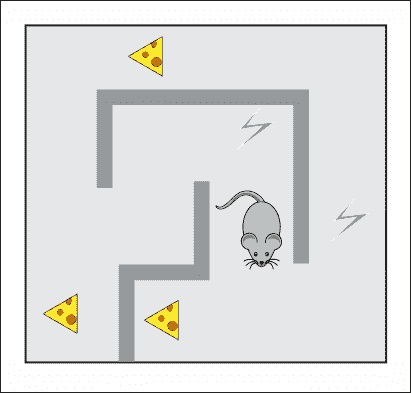

图 1:机器鼠迷宫世界

它的环境是一个迷宫，有些地方有食物，有些地方有电。机器鼠标可以采取诸如左转/右转和向前移动的动作。最后，它可以随时观察迷宫的完整状态，以决定可能采取的行动。它试图找到尽可能多的食物，同时尽可能避免电击。这些食物和电的信号代表了环境给予个体的奖励，作为对个体行为的额外反馈。奖励在 RL 中是一个非常重要的概念，我们会在本章后面讲到。现在，只要理解代理人的最终目标是获得尽可能多的总报酬就足够了。在我们的特定例子中，老鼠可能会遭受一点电击，以到达有大量食物的地方——这对老鼠来说将是比只是站着不动而一无所获更好的结果。

我们不想将关于环境的知识和在每种特定情况下采取的最佳行动硬编码到机器人中——这将花费太多的精力，甚至可能在轻微的迷宫变化中变得毫无用处。我们想做的是有一些神奇的方法，让我们的机器人能够自己学习如何避免电力，并收集尽可能多的食物。

强化学习正是这个神奇的工具箱，它的玩法不同于有监督和无监督的学习方法。它不像监督学习那样使用预定义的标签。没有人给机器人看到的所有图像贴上标签:好的*或坏的*，或者给它提供最佳的转向方向。**

**然而，我们并不像在无人监督的学习环境中那样完全盲目——我们有一个奖励系统。收获食物的奖励可能是积极的，电击的奖励可能是消极的，或者在没有特别事情发生时是中性的。通过观察这样的奖励并将其与我们采取的行动联系起来，我们的代理人学会了如何更好地执行一项行动，收集更多的食物，并减少电击。**

**当然，RL 的通用性和灵活性是有代价的。RL 被认为是一个比监督和非监督学习更具挑战性的领域。让我们快速讨论一下是什么让强化学习变得棘手。**

**首先要注意的是，RL 中的观察依赖于代理的行为，在某种程度上，它是他们行为的*结果*。如果你的代理人决定做低效的事情，那么观察结果将不会告诉你他们做错了什么，应该做些什么来改善结果(代理人只会一直得到负面反馈)。如果代理人顽固不化，不断犯错，那么观察可能会造成一个错误的印象，即没有办法获得更大的回报——生活正在遭受——这可能是完全错误的。用机器学习的术语来说，可以重新表述为*拥有非 i.i.d .数据*。缩写 **i.i.d** 代表**独立同分布**，这是大多数监督学习方法的一个要求。**

**使我们代理人的生活变得复杂的第二件事是，他们不仅需要**利用**他们学到的策略，还需要积极地**探索**环境，因为，谁知道呢，也许通过不同的方式做事，我们可以显著改善我们得到的结果。问题是，过多的探索也可能会严重降低回报(更不用说代理人实际上可以*忘记*他们之前学到的东西)，所以，我们需要在这两种活动之间找到某种平衡。这种探索/开发困境是 RL 中公开的基本问题之一。**

**人们总是面临这样的选择:我应该去一个已知的地方吃饭，还是去这家新的高级餐厅？你应该多久换一次工作？你应该学习一个新的领域还是继续在你的领域工作？这些问题没有通用的答案。**

**第三个复杂因素在于，奖励可能会从行动中严重延迟。就国际象棋而言，在游戏进行到一半时，一个强有力的举动就可能改变游戏的平衡。在学习过程中，我们需要发现这样的伤亡，随着时间的推移和我们的行动，这可能很难做到。**

**然而，尽管有这些障碍和复杂性，RL 在最近几年已经取得了巨大的进步，并且作为一个研究和实际应用领域变得越来越活跃。**

**感兴趣吗？让我们进入细节，看看 RL 的形式和游戏规则。**

**RL 形式和关系**

**

# 每个科学和工程领域都有自己的假设和限制。在上一节中，我们讨论了监督学习，其中这样的假设是输入输出对的知识。你的数据没有标签？对不起，你需要弄清楚如何获得标签或尝试使用其他一些理论。它不会让被监督的学习*变好*或*变坏*，它只是让它不适用于你的问题。了解和理解各种方法的游戏规则很重要，因为它可以提前为你节省大量时间。然而，我们知道有许多实践和理论突破的例子，当有人试图以创造性的方式挑战规则时。要做到这一点，你首先应该知道局限性。

当然，这样的形式主义对于 RL 来说是存在的，现在是介绍它们的恰当时机，因为我们将在本书的剩余部分从不同的角度分析它们。你可以看到下图显示了两个主要的 RL 实体: **Agent** 和 **Environment** 以及它们的通信通道: **Actions** 、 **Reward** 和 **Observ** 和**Actions**:

图 2: RL 实体及其通信

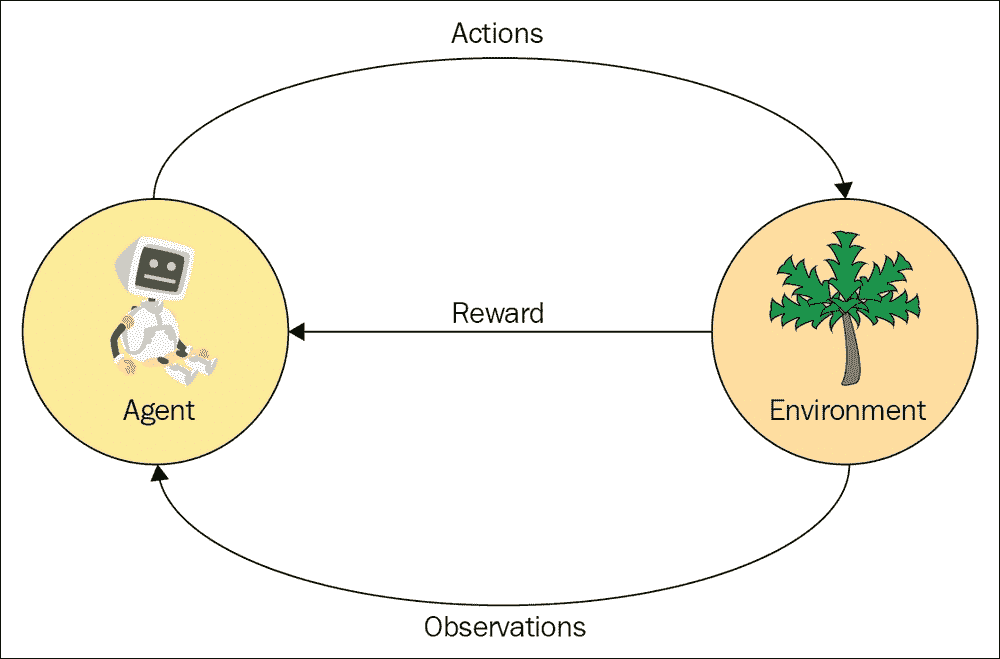

Figure 2: RL entities and their communications

奖励

## 首先要讨论的是一个关于奖励的概念。在 RL 中，它只是我们从环境中定期获得的标量值。它可以是正的，也可以是负的，可以是大的，也可以是小的，但它只是一个数字。奖励的目的是告诉我们的代理人他们表现得有多好。我们不定义代理人多长时间收到一次这种奖励；它可以是每一秒或一生中的一次，尽管通常的做法是在每个固定的时间戳或每次环境交互时获得奖励，只是为了方便。在一生一次的奖励制度的情况下，除了最后一个以外，所有的奖励都将为零。

正如我提到的，奖励的目的是给代理一个关于其成功的反馈，这是 RL 中一个重要的核心内容。基本上，*强化*这个术语来源于这样一个事实:一个代理人获得的报酬应该以积极或消极的方式强化其行为。奖励是*局部*，意思是，它反映的是代理人最近活动的成功，而不是代理人到目前为止取得的所有成功。当然，为某项行动获得高额回报并不意味着一秒钟后你就不会面临之前决定的巨大后果。这就像抢银行:在你考虑后果之前，这看起来可能是个好主意。

代理人试图实现的是在其行动序列中最大的*累积*回报。为了让你对奖励有更直观的认识，让我们列举一些具体的例子和它们的奖励:

**金融交易**:一笔利润是交易者买卖股票的报酬。

*   **象棋**:在这里，奖励是在游戏结束时获得的，分为赢、输或平。当然要看解读了。举例来说，对我来说，在与国际象棋大师的比赛中打平将是一个巨大的奖励。在实践中，我们需要明确指定确切的奖励值，但这可能是一个相当复杂的表达式。例如，在国际象棋中，奖励可能与对手的实力成比例。
*   **大脑中的多巴胺系统**:每当需要向大脑其他部分发送积极信号时，大脑中有一部分(边缘系统)就会产生多巴胺。更高浓度的多巴胺会带来愉悦感，这加强了被这个系统认为是好的活动。不幸的是，就它认为好的东西而言，边缘系统是古老的:食物、生殖和支配，但这是一个完全不同的故事。
*   **电脑游戏**:通常会给玩家明显的反馈，要么是杀死的敌人数量，要么是聚集的分数。注意在这个例子中奖励是已经累计的，所以街机游戏的 RL 奖励应该是分数的导数，也就是每次杀死一个新敌人+1，其他所有时间步都是 0。
*   **网页导航**:有一组实用价值很高的问题，就是能够自动提取网页上存在的信息。搜索引擎通常会尝试解决这个问题，但有时，要获得您要寻找的数据，您需要填写一些表格或浏览一系列链接，或完成验证码，这对搜索引擎来说可能很难做到。有一种基于强化学习的方法来完成这些任务，奖励是你需要得到的信息或结果。
*   **神经网络架构搜索** : RL 已成功应用于神经网络架构优化领域，目标是通过调整层数或其参数、添加额外的旁路连接或对神经网络架构进行其他更改，在某些数据集上获得最佳性能指标。在这种情况下，回报是性能(准确度或显示 NN 预测准确度的另一种度量)。
*   **训狗**:如果你曾经尝试过训狗，你就会知道，每次它做你要求的事情时，你都需要给它一些好吃的东西(但不要太多)。当你的宠物不听从你的命令时，惩罚它一下(消极奖励)也很常见，尽管最近的研究表明这不如积极奖励有效。
*   **校标**:我们这里都有经验！学校分数是一种奖励系统，给学生关于他们学习的反馈。
*   正如你从前面的例子中看到的，奖励的概念是代理人表现的一个非常普遍的指示，它可以被发现或者被人为地注入到我们周围的许多实际问题中。

代理人

## 代理人是通过执行某些动作、进行观察并因此获得最终回报而与环境互动的某人或某物。在大多数实际的 RL 场景中，我们的软件应该以或多或少有效的方式解决一些问题。对于我们最初的六个示例，代理将是其中之一:

**金融交易**:交易系统或交易员对订单执行做出决策

*   **国际象棋**:玩家还是电脑程序
*   **多巴胺系统**:根据感官数据，大脑本身决定这是一次好的经历还是坏的经历
*   **电脑游戏**:喜欢游戏或电脑程序的玩家( *Andrey Karpathy* 曾经在他的推特上说，“我们应该让 AI 做所有的工作，我们玩游戏，但我们做所有的工作，而 AI 在玩游戏！”)
*   **网页导航**:告诉浏览器点击哪个链接，鼠标移动到哪里，或者输入哪个文本的软件
*   **神经网络架构搜索**:控制被评估神经网络具体架构的软件
*   **训狗**:你心爱的宠物
*   学校:学生
*   环境

## 环境是代理之外的一切。在最一般的意义上，它是宇宙的其余部分，但这有点过火，甚至超过了明天的计算机的能力，所以我们通常在这里遵循一般意义。

环境是主体外部的，它与环境的交流受到奖励(从环境中获得)、动作(由主体执行并给予环境)和观察(主体从环境中获得的奖励之外的一些信息)的限制。我们已经讨论了奖励，所以让我们来谈谈行动和观察。

行动

## 动作是一个代理在环境中可以做的事情。动作可以是游戏规则允许的动作(如果是一些游戏)，也可以是做作业(在学校的情况下)。它们可以很简单，比如*将棋子向前移动一格*，也可以很复杂，比如*填写明天早上的税单*。

在 RL 中，我们区分两种类型的动作:离散的或连续的。离散的动作形成了一个代理可以做的互斥的事情的有限集合，例如向左或向右移动。连续的动作有一些附加的价值，比如汽车的动作*转向车轮*有一个转向的角度和方向。不同的角度可能会导致一秒钟后不同的场景，所以仅仅说*驾驶方向盘*肯定是不够的。

观察结果

## 对环境的观察是代理人的第二个信息渠道，第一个是奖励。您可能想知道，为什么我们需要一个单独的数据源？答案是方便。观察是环境提供给代理的信息片段，它描述了他们周围正在发生的事情。可能与即将到来的奖励有关(比如看到银行通知说，*你已经得到*的报酬)也可能无关。观察甚至可以包括一些模糊或混乱形式的奖励信息，如电脑游戏屏幕上的分数。分数只是像素，但是我们可以把它们转换成奖励值；跟手头的现代深度学习没什么大不了的。

另一方面，奖励不应被视为次要或不重要的东西:奖励是驱动代理学习过程的主要力量。如果奖励是错误的，嘈杂的，或者只是稍微偏离了主要目标，那么训练就有可能以错误的方式进行。

区分环境的状态和观察结果也很重要。环境的状态潜在地包括宇宙中的每一个原子，这使得不可能测量关于环境的一切。即使我们将环境的状态限制得足够小，大多数时候还是不可能获得完整的信息，或者我们的测量会包含噪声。这完全没问题，RL 就是为支持这种情况而生的。让我们再一次用一组例子来支持我们的直觉，以捕捉其中的差异:

**金融交易**:这里的环境是整个金融市场以及影响它的一切事物。这是一个庞大的列表，包括最新消息、经济和政治状况、天气、食品供应和 Twitter 趋势。即使你今天决定呆在家里，也有可能间接影响世界金融体系。然而，我们的观察仅限于股票价格、新闻等等。我们无法了解环境的大部分状态，这使得交易变得如此重要。

*   **棋**:这里的环境是你的棋盘*加上*你的对手，包括他们的棋艺、心情、大脑状态、选择的战术等等。观察是你所看到的(你当前的棋位)，但是，我猜想，在某种程度上，心理学知识和读懂对手情绪的能力可以增加你的机会。
*   **多巴胺系统**:这里的环境是你的大脑加上神经系统和器官的状态加上你能感知的整个世界。观察是大脑内部的状态和来自你感官的信号。
*   **电脑游戏**:在这里，环境就是你的电脑的状态，包括所有的内存和磁盘数据。对于网络游戏，你需要包括其他电脑以及它们和你的机器之间的所有互联网基础设施。观察是一个屏幕的像素和声音，就是这样。一个屏幕的像素并不是一个微小的信息量(有人计算过，可能的中等大小图像 1024 × 768 的总数明显大于我们银河系的原子数量)，但整个环境状态肯定更大。
*   **网络导航**:这里的环境是互联网，包括我们代理工作的计算机和网络服务器之间的所有网络基础设施，这是一个真正庞大的系统，包括数百万个不同的组件。观察通常是在当前导航步骤加载的网页。
*   **神经网络架构搜索**:在本例中，环境相当简单，包括执行特定神经网络评估的 NN 工具包和用于获取性能指标的数据集。与互联网相比，这看起来像一个小玩具环境。观察结果可能会有所不同，并包括一些关于测试的信息，如损失收敛动态或从评估步骤中获得的其他指标。
*   **训狗**:这里的环境是你的狗(包括它几乎观察不到的内心反应、情绪、生活经历)和它周围的一切，包括其他的狗和一只躲在灌木丛里的猫。观察是来自你的感官和记忆的信号。
*   **学校**:这里的环境是学校本身，是国家的教育制度，是社会，是文化遗产。观察和训狗一样:学生的感官和记忆。
*   这是我们的 mise en scène，我们将在本书的其余部分中使用它。我想你已经注意到 RL 模型非常灵活、通用，可以应用于各种场景。在深入 RL 模型的细节之前，让我们看看 RL 与其他学科的关系。

还有许多其他领域对 RL 有贡献或与之相关。下图显示了最重要的方面(摘自*大卫·西尔弗的* RL 课程[http://www0.cs.ucl.ac.uk/staff/d.silver/web/Teaching.html](http://www0.cs.ucl.ac.uk/staff/d.silver/web/Teaching.html))，其中包括六个在决策相关方法和特定主题上相互严重重叠的大领域(显示在内部灰色圆圈内)。在所有这些相关但仍然不同的科学领域的交叉点上，坐落着 RL，它是如此通用和灵活，以至于它可以从这些不同的领域中取长补短:

图 3:RL 中的各种域

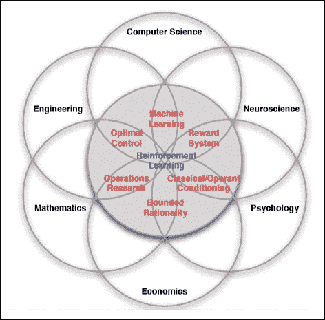

Figure 3: Various domains in RL

**机器学习** ( **ML** ): RL 作为 ML 的一个子领域，从 ML 那里借鉴了很多机器、技巧和技术。基本上，RL 的目标是学习当给定不完美的观察数据时，代理应该如何表现。

*   **工程(尤其是最优控制)**:这有助于采取一系列最优行动以获得最佳结果。
*   **神经科学**:我们以多巴胺系统为例，已经证明人类大脑的行为与 RL 模型密切相关。
*   **心理学**:这是研究各种条件下的行为，比如人们如何反应和适应，这和 RL 的题目很接近。
*   **经济学**:其中一个重要的课题就是在不完善的知识和现实世界不断变化的条件下，如何最大化回报。
*   **数学**:这适用于理想化的系统，同时也致力于寻找和达到运筹学领域的最优条件。
*   马尔可夫决策过程

# 在本章的这一部分，我们将熟悉 RL 的理论基础，这使得我们有可能开始着手解决 RL 问题的方法。这一节对于理解本书的其余部分很重要，并且将确保你熟悉 RL。首先，我们向你介绍我们刚刚讨论过的形式主义(奖励、主体、行动、观察和环境)的数学表示和符号。其次，在此基础上，我们向您介绍了 *RL 语言*的二阶概念，包括状态、情节、历史、值和增益，这些概念将在本书的稍后部分重复用于描述不同的方法。最后，我们对马尔可夫决策过程的描述就像一个俄罗斯套娃:我们从最简单的一个**马尔可夫过程** ( **MP** )(也称为马尔可夫链)开始，然后用奖励扩展它，这将把它变成一个马尔可夫奖励过程。然后，我们将通过添加动作将这个想法放入另一个额外的信封中，这将引导我们进入**马尔可夫决策过程** ( **MDPs** )。

马尔可夫过程和马尔可夫决策过程广泛应用于计算机科学和其他工程领域。因此，阅读这一章不仅对你在 RL 环境中有用，而且对更广泛的主题也有用。

如果您已经熟悉 MDP，那么您可以快速浏览本章，只关注术语定义，因为我们稍后会用到它们。

马尔可夫过程

## 让我们从马尔可夫家族最简单的子说起:**马尔可夫过程**，也被称为**马尔可夫链**。想象你面前有一个你只能观察的系统。你观察到的叫做**态**，系统可以按照一些动力学规律在态之间切换。同样，你不能影响系统，只能观察状态的变化。

系统的所有可能状态形成一个集合，称为状态空间。在马尔可夫过程中，我们要求这组状态是有限的(但是它可以非常大以补偿这种限制)。你的观察形成了一个状态序列或一个*链*(这就是为什么马尔可夫过程也被称为马尔可夫链)。例如，查看某个城市最简单的天气模型，我们可以将当天观察为*晴天*或*雨天*，这是我们的状态空间。一段时间内的一系列观测形成了一个状态链，比如[ *晴天*、*晴天*、*雨天*、*晴天*、…]，被称为**历史**。

要称这样的系统为 MP，它需要满足的**马尔可夫性质**，这意味着来自任何状态的未来系统动态必须仅依赖于该状态。马尔可夫性质的要点是使每一个可观测状态都是完备的，以描述系统的未来。换句话说，马尔可夫性质要求系统的状态是彼此可区分的和唯一的。在这种情况下，只需要一个状态来模拟系统的未来动态，而不是整个历史，或者说，最后 N 个状态。

在我们的*玩具天气*的例子中，马尔可夫属性将我们的模型限制为只代表晴天之后可能下雨的情况，具有相同的概率，不管我们在过去见过多少晴天。这不是一个非常现实的模型，因为从常识来看，我们知道明天下雨的可能性不仅取决于当前的条件，还取决于大量其他因素，如季节、我们的纬度以及附近是否有山和海。最近证明，甚至太阳活动对天气也有重大影响。所以，我们的例子真的很天真，但是理解这些限制并做出有意识的决定是很重要的。

当然，如果我们想让我们的模型更复杂，我们总是可以通过扩展我们的状态空间来做到这一点，这将允许我们以更大的状态空间为代价在模型中捕捉更多的依赖关系。例如，如果您想分别获取夏季和冬季的雨天概率，那么您可以在您的州中包含该季节。这样的话，你的状态空间就会是[ *晴+夏*、*晴+冬*、*雨+夏*、*雨+冬*等等。

由于您的系统模型符合马尔可夫属性，您可以用一个**转移矩阵**来捕获转移概率，转移矩阵是一个大小为 *N×N* 的方阵，其中 *N* 是我们模型中状态的数量。矩阵中行 *i* 和列 *j* 中的每个单元包含系统从状态 *i* 转换到状态 *j* 的概率。

例如，在我们的晴天/雨天示例中，转移矩阵可能如下:

For example, in our sunny/rainy example the transition matrix could be as follows:

| **阳光明媚** | **多雨** | 快活的 |
| 0.8 | 0.2 | 下雨的 |
| 0.1 | 0.9 | 在这种情况下，如果我们有一个晴天，那么第二天有 80%的机会是晴天，第二天有 20%的机会是雨天。如果我们观察到一个雨天，那么有 10%的可能性天气会变好，第二天有 90%的可能性会下雨。 |

所以，就这样了。马尔可夫过程的正式定义如下:

系统可能处于的一组状态

*   带有转移概率的转移矩阵(T ),它定义了系统动态
*   MP 的有用的视觉表示是一个图，它具有对应于系统状态和边的节点，用表示从一个状态到另一个状态的可能转换的概率来标记。如果转移概率为 0，我们不画边(没有办法从一个状态转移到另一个状态)。这种表示也广泛应用于自动机理论中研究的*有限状态机*表示。对于我们的晴天/雨天模型，图表如下所示:

图 4:晴天/雨天天气模型

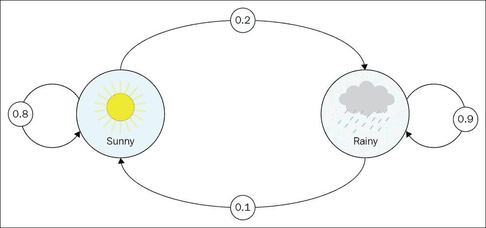

Figure 4: Sunny/Rainy weather model

同样，现在我们只讨论观察。我们没有办法影响天气，所以我们只是观察和记录我们的观察。

为了给你一个更复杂的例子，我们将考虑另一个*上班族的模型*(司各特·亚当斯著名漫画中的主要人物呆伯特就是一个很好的例子)。在我们的例子中，他的状态空间具有以下状态:

回家:他不在办公室

*   电脑:他正在办公室用电脑工作
*   咖啡:他正在办公室喝咖啡
*   聊天:他正在办公室和同事讨论一些事情
*   状态转换图如下所示:

图 5:状态转换图

我们期望他的工作日通常从**家**状态开始，并且他总是以**咖啡**开始他的工作日，没有例外(没有**家** → **电脑**边，没有**家** → **聊天**边)。上图还显示工作日总是从**计算机**状态结束(即，回到**家**状态)。上图的转换矩阵如下:

**首页**

| **咖啡** | **聊天** | **电脑** | 主页 | 60% |
| 40% | 0% | 0% | 咖啡 | 0% |
| 10% | 70% | 20% | 闲谈 | 0% |
| 20% | 50% | 30% | 计算机 | 20% |
| 20% | 10% | 50% | 转移概率可以直接放在状态转移图上，如下所示: | 图 6:带有转移概率的状态转移图 |

The transition probabilities could be placed directly on the state transition graph, as shown here:

实际上，我们很少有机会知道准确的转移矩阵。更真实的情况是，我们只有系统状态的观测值，这也被称为*事件*:

家→咖啡→咖啡→聊天→聊天→咖啡→电脑→电脑→家

电脑→电脑→聊天→聊天→咖啡→电脑→电脑→电脑

*   家→家→咖啡→聊天→电脑→咖啡→咖啡
*   通过我们的观察估计转移矩阵并不复杂；我们只是计算每个状态的所有转换，并将其归一化为和 1。我们拥有的观察数据越多，我们的估计就越接近真实的潜在模型。
*   还值得注意的是，马尔可夫属性意味着平稳性(也就是说，任何状态的底层转移分布都不会随时间而改变)。非平稳性意味着有一些隐藏的因素影响我们的系统动力学，而这个因素不包含在观测值中。然而，这与马尔可夫性质相矛盾，马尔可夫性质要求不管转移历史如何，对于相同的状态，基础概率分布都是相同的。理解一集里观察到的实际过渡和过渡矩阵中给出的潜在分布之间的差异很重要。我们观察到的具体情节是从模型的分布中随机抽样的，因此它们可能因情节而异。然而，混凝土转换被取样的概率保持不变。如果不是这样，马尔可夫链形式就不适用了。

现在，我们可以进一步扩展马尔可夫过程模型，使其更接近我们的 RL 问题。让我们给图片添加奖励吧！

马尔可夫奖励过程

为了引入奖励，我们需要扩展一下我们的马尔可夫过程模型。首先，我们需要增加我们从一种状态到另一种状态的转换的价值。我们已经有了概率，但是概率被用来捕捉系统的动态，所以现在我们有了一个额外的标量数，而没有额外的负担。

## 奖励可以有多种形式。最通用的方式是具有另一个类似于转移矩阵的方阵，其具有驻留在行 *i* 和列 *j* 中的从状态 *i* 转移到状态 *j* 的奖励。奖励可以是积极的或消极的，大的或小的——它只是一个数字。在某些情况下，这种表示是多余的，可以简化。例如，如果不管前一个状态如何，对到达该状态给予奖励，我们可以只保留状态→奖励对，这是一种更紧凑的表示。然而，这仅适用于奖励值仅取决于目标状态的情况，而情况并非总是如此。

我们添加到模型中的第二个东西是折扣因子γ (gamma)，一个从 0 到 1(包括 0 和 1)的单一数字。在我们定义了我们的马尔可夫回报过程的额外特征之后，这个意义将在后面解释。

正如你所记得的，我们在马尔可夫过程中观察到了一连串的状态转移。这仍然是马尔可夫奖励过程的情况，但是对于每一次转换，我们都有额外的量——奖励。所以现在，我们所有的观察都有一个奖励值，这个值与系统的每一次转变都有关联。

对于每一集，我们将在时间 *t* 的**返回**定义为这个量: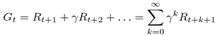

让我们试着理解这意味着什么。对于每个时间点，我们将**回报**计算为后续奖励的总和，但更远的奖励乘以贴现因子，乘以我们在时间 *t* 远离起点的步数的幂。贴现因子代表一个代理人的远见。如果 gamma 等于 1，那么 return *G [t]* 正好等于所有后续奖励的总和，并且对应于具有任何后续奖励的完美可见性的代理。如果 gamma 等于 0，我们的回报*G[t]t*将只是即时奖励，没有任何后续状态，对应绝对*短视*。

这些极值是没有用的，通常 gamma 设置为中间的某个值，比如 0.9 或者 0.99。在这种情况下，我们将着眼于未来的奖励，但不会太远。

这个伽马参数在 RL 中很重要，我们会在后续章节中多次遇到。现在，把它想成是我们对未来多远的一种衡量，以估计未来的回报:越接近 1，我们考虑的未来步骤就越多。

这个**回报**量在实践中不是很有用，因为它是为我们从马尔科夫回报过程中观察到的每个特定链定义的，所以即使是同一状态，它也可能变化很大。然而，如果我们走极端，计算任何状态的数学期望回报(通过平均大量的链)，我们将得到一个更有用的量，称为状态的**值:**

This gamma parameter is important in RL, and we'll meet it a lot in the subsequent chapters. For now, think about it as a measure of how far into the future we look to estimate the future return: the closer to 1, the more steps ahead of us we take into account.

这种解释很简单:对于每个状态 *s* ，值 *v* *(s)* 是我们遵循马尔可夫回报过程得到的平均(或预期)回报。

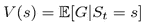

为了展示这些理论性的东西是如何与实践相联系的，让我们用奖励来扩展我们的呆伯特过程，并把它变成一个**呆伯特奖励过程** ( **DRP** )。我们的奖励值如下:

家→家:1(因为回家真好)

家→咖啡:1

*   计算机→计算机:5(努力是好事)
*   电脑→聊天:-3(分心就不好了)
*   聊天→电脑:2
*   电脑→咖啡:1
*   咖啡→电脑:3
*   咖啡→咖啡:1
*   咖啡→聊天:2
*   聊天→咖啡:1
*   聊天→聊天:-1(长时间的交谈变得无聊)
*   这里显示了一个带有奖励的图表:
*   图 7:带有转移概率(深色)和回报(浅色)的状态转移图

A diagram with rewards is shown here:

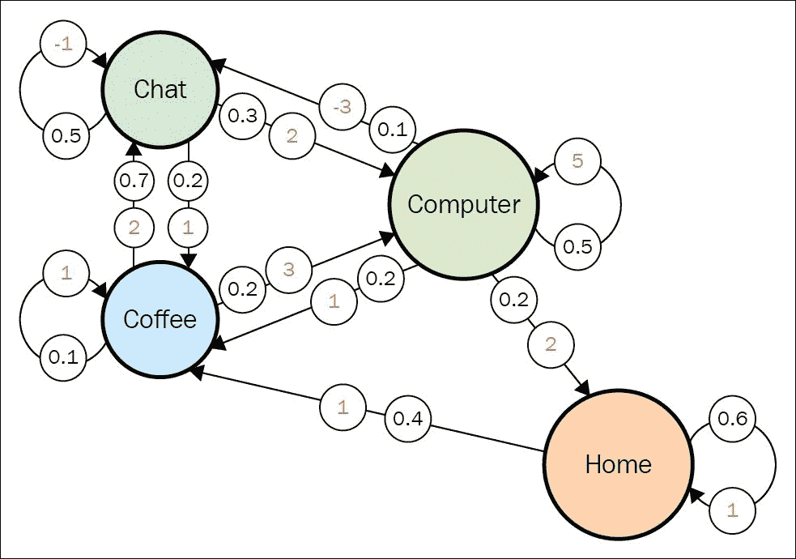

让我们回到我们的伽马参数，考虑具有不同伽马值的状态的值。我们从一个简单的例子开始:γ= 0。你如何计算这里的状态值？

要回答这个问题，我们先把状态固定为**聊天**。接下来的转变会是什么？答案是:*看机缘*。根据我们的呆伯特过程的转移矩阵，有 50%的可能性下一个状态将再次是**聊天**，20%的可能性将是**咖啡**，并且在 30%的情况下，我们返回到**计算机**状态。当 gamma = 0 时，我们的返回只等于下一个直接状态的值。因此，如果我们想要计算**聊天**状态的值，那么我们需要对所有的转换值求和，然后乘以它们的概率:

*V(聊天)= -1 * 0.5 + 2 * 0.3 + 1 * 0.2 = 0.3*

*V(咖啡)= 2 * 0.7 + 1 * 0.1 + 3 * 0.2 = 2.1*

*V(home)= 1 * 0.6+1 * 0.4 = 1.0*

*V(计算机)= 5 * 0.5+(-3)* 0.1+1 * 0.2+2 * 0.2 = 2.8*

所以，**电脑**是最有价值的状态(如果我们只关心眼前的回报的话)，这并不奇怪，因为**电脑** → **电脑**频繁，回报大，而且中断的比率不会太高。

现在有一个更棘手的问题:当 gamma = 1 时，值是多少？仔细想想这个。

答案是:对于所有状态，该值都是无穷大。我们的图不包含 *sink* 状态(没有传出转换的状态)，当我们的折扣等于 1 时，我们关心未来潜在的无限数量的转换。正如我们在 gamma = 0 的情况下看到的，我们所有的值在短期内都是正的，所以无穷多个正值的总和会给我们一个无穷大的值，不管起始状态如何。

这个无限的结果向我们展示了将 gamma 引入马尔可夫奖励过程的原因之一，而不是仅仅将所有未来的奖励相加。在大多数情况下，流程可以有无限(或大量)的转换。由于处理无穷大的值不太实际，我们希望限制我们计算值的范围。值小于 1 的 Gamma 提供了这样的限制，我们将在后面关于值迭代方法系列的章节中讨论这一点。另一方面，如果你处理的是有限范围的环境(例如，TicTacToe 游戏最多有 9 步限制)，那么使用 gamma = 1 就可以了。再举一个例子，有一类重要的只有一步的环境叫做*多臂强盗 MDP* 。这意味着在每一步你都需要选择一个可供选择的行动，这为你提供了一些奖励，这一集就结束了。

关于马尔可夫奖励过程定义我已经说过了，gamma 通常设置为 0 到 1 之间的值(gamma 常用值为 0.9 和 0.99)；然而，对于这样的值，手动精确计算这些值几乎是不可能的，即使对于像我们的 Dilbert 例子这样小的 MRP 也是如此，因为它需要对数百个值求和。计算机擅长于单调乏味的任务，例如对数千个数字求和，有几种简单的方法可以在给定转移和回报矩阵的情况下快速计算 MRP 的值。我们将在[第 5 章](part0036_split_000.html#12AK82-ce551566b6304db290b61e4d70de52ee "Chapter 5. Tabular Learning and the Bellman Equation")、*表格学习和贝尔曼方程*中看到甚至实现一个这样的方法，那时我们将开始研究 Q 学习方法。

现在，让我们在马尔可夫奖励过程的基础上再增加一层复杂性，并引入最后缺失的部分:行动。

马尔可夫决策过程

你可能已经知道如何扩展我们的 MRP，将行动纳入其中。首先，我们必须添加一组动作(A)，它必须是有限的。这是我们特工的*行动空间*。

## 然后，我们需要用动作来调节我们的转换矩阵，这基本上意味着我们的矩阵需要一个额外的*动作*维度，这将它变成一个立方体。如果你还记得，在 MPs 和 MRP 的情况下，转移矩阵是正方形的，源状态在行，目标状态在列。因此，每一行 *i* 都包含了跳转到每个状态的概率列表:

图 8:转换矩阵

Then, we need to condition our transition matrix with action, which basically means our matrix needs an extra *action* dimension, which turns it into a cube. If you remember, in the case of MPs and MRPs, the transition matrix had a square form, with source state in rows and target state in columns. So, every row *i* contained a list of probabilities to jump to every state:

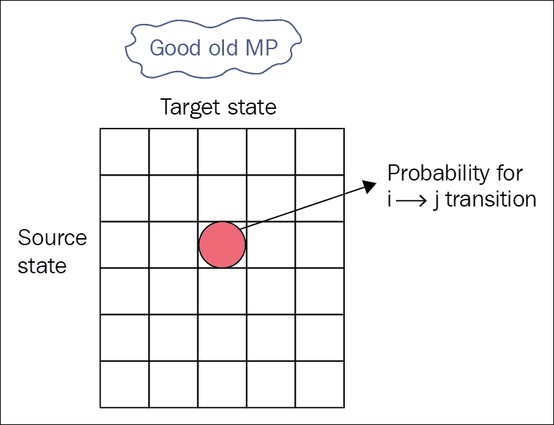

现在，代理不再被动地观察状态转换，而是可以在每次时主动选择要采取的动作**。因此，对于每个状态，我们没有一个数字列表，而是一个矩阵，其中*深度维度*包含代理可以采取的动作，另一个维度是代理执行该动作后目标状态系统将跳转到的位置。下图显示了我们的新转换表，它变成了一个立方体，源状态作为高度维度(由 **i** 索引)，目标状态作为宽度( **j** )，代理可以从转换表的深度( **k** )中选择动作:**

图 9:MDP 的转移概率

Now the agent no longer passively observes state transitions, but can actively choose an action to take **at every time**. So, for every state, we don't have a list of numbers, but a matrix, where the *depth dimension* contains actions that the agent can take, and the other dimension is that the target state system will jump to after this action is performed by the agent. The following diagram shows our new transition table that became a cube with source state as the height dimension (indexed by **i**), target state as width (**j**), and action the agent can choose from is depth (**k**) of the transition table:

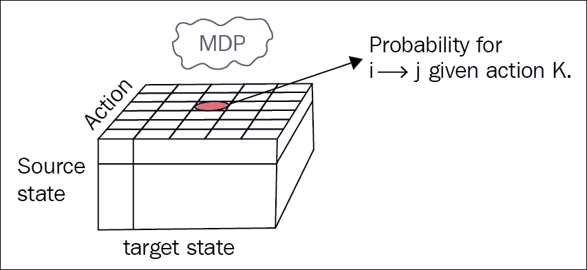

所以，一般来说，通过选择一个动作，代理可以影响目标状态的概率，这是一个有用的能力。

为了让你明白为什么我们需要这么多复杂的东西，让我们想象一个生活在 3 × 3 网格中的小机器人，它可以执行动作*左转*、*右转*和*前进*。世界的状态是机器人的位置加上方位(上、下、左、右)，这就给了我们 3 × 3 × 4 = 36 个状态(机器人可以在任何方位的任何位置)。

此外，想象一下机器人有不完美的电机(这在现实世界中是经常发生的)，当它执行*左转*或*右转*时，有 90%的机会实现预期的转弯，但有时有 10%的概率，车轮打滑，机器人的位置保持不变。同样的情况也发生在*前进*上:在 90%的情况下，它会工作，但对于其余的(10%)机器人会停留在相同的位置。

在下图中，显示了转移图的一小部分，显示了当机器人位于网格的中心并朝上时，从状态(1，1，向上)可能发生的转移。如果它试图向前移动，有 90%的可能性它会终止于状态(0，1，向上)，但有 10%的可能性轮子会打滑，目标位置将保持(1，1，向上)。

为了恰当地捕捉关于环境的所有这些细节以及对代理动作的可能反应，通用 MDP 具有带有维度(源状态、动作和目标状态)的 3D 转换矩阵。

图 10:网格世界环境

To properly capture all these details about the environment and possible reactions on the agent's actions, the general MDP has a 3D transition matrix with dimensions (source state, action, and target state).

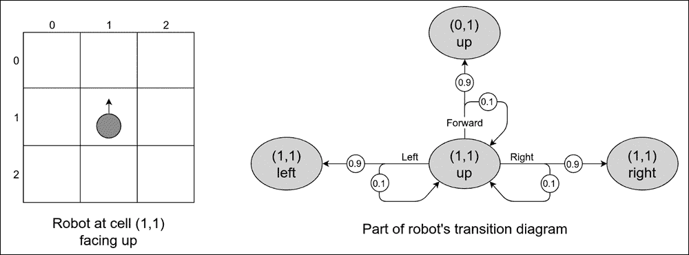

最后，要将我们的 MRP 转化为 MDP，我们需要像处理转移矩阵一样，将行动添加到我们的奖励矩阵中:我们的奖励矩阵不仅取决于状态，还取决于行动。换句话说，这意味着代理人现在获得的回报不仅取决于它最终所处的状态，还取决于导致这种状态的行为。这类似于当你努力做某事时，你通常会获得技能和知识，即使你努力的结果并不太成功。所以，如果你在做某件事，回报可能会比不做更好，即使最终结果是一样的。

现在，有了正式定义的 MDP，我们终于准备好引入 MDP 和 RL 最重要的核心内容:**策略**。

策略的直观定义是，它是控制代理行为的一组规则。即使对于相当简单的环境，我们也可以有各种各样的策略。例如，在前面的网格世界中机器人的例子中，代理可以有不同的策略，这将导致不同的访问状态集。例如，该机器人可以执行以下动作:

不顾一切盲目前进

通过检查之前的*前进*动作是否失败，尝试绕过障碍物

*   滑稽地旋转来娱乐它的创造者
*   在网格世界场景中随机选择一个模拟*醉酒机器人的动作，等等…*
*   你可能还记得，RL 中代理人的主要目标是收集尽可能多的回报(它被定义为贴现的累积回报)。所以，再一次，凭直觉，不同的策略可以给我们不同的回报，这使得找到一个好的策略变得很重要。这就是为什么策略的概念是重要的，并且它是我们正在寻找的中心事物。
*   形式上，策略被定义为每个可能状态的动作的概率分布:

You may remember that the main objective of the agent in RL is to gather as much return (which was defined as discounted cumulative reward) as possible. So, again, intuitively, different policies can give us different return, which makes it important to find a good policy. This is why the notion of policy is important, and it's the central thing we're looking for.

这被定义为概率，而不是具体的行动，以将随机性引入代理人的行为。我们稍后会谈到为什么这很重要和有用。最后，确定性策略是概率学的一个特例，需要采取的行动的概率为 1。

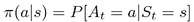

另一个有用的概念是，如果我们的策略是固定不变的，那么我们的 MDP 就变成了 MRP，因为我们可以用策略的概率减少转移和奖励矩阵，并去掉行动维度。

所以，我祝贺你走到这一步！这一章很有挑战性，但对后来的实践材料很重要。在关于 OpenAI gym 和深度学习的两个介绍性章节之后，我们终于可以开始解决这个问题:我如何教代理解决实际任务？

总结

在这一章中，我们通过学习什么使 RL 特殊以及它如何与监督和非监督学习范式相关联，开始了我们进入 RL 世界的旅程。然后，我们学习了基本的 RL 形式以及它们如何相互作用，之后我们定义了马尔可夫过程、马尔可夫奖励过程和马尔可夫决策过程。

# 在下一章，我们将从形式理论转移到 RL 的实践中。我们将讨论所需的设置、库，并编写我们的第一个代理。

In this chapter, we started our journey into the RL world by learning what makes RL special and how it relates to the supervised and unsupervised learning paradigm. We then learned about the basic RL formalisms and how they interact with each other, after which we defined Markov process, Markov reward process, and Markov decision process.

In the next chapter, we'll move away from the formal theory into the practice of RL. We'll cover the setup required, libraries, and write our first agent.**