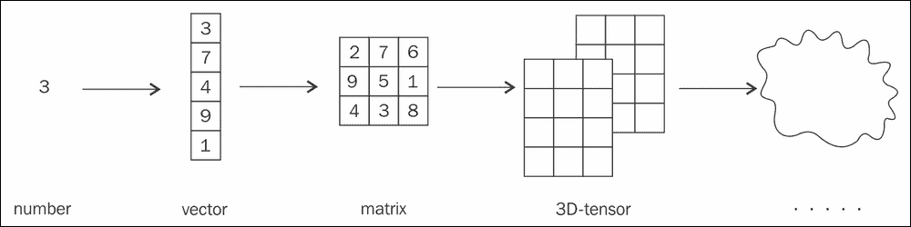
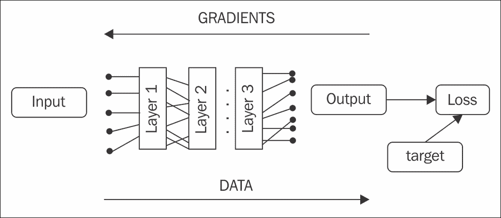
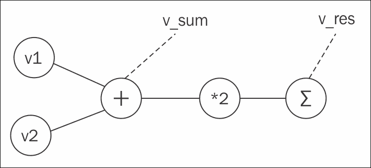
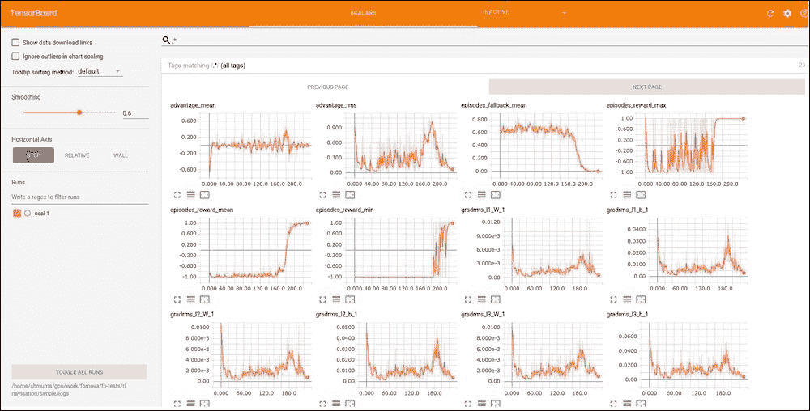
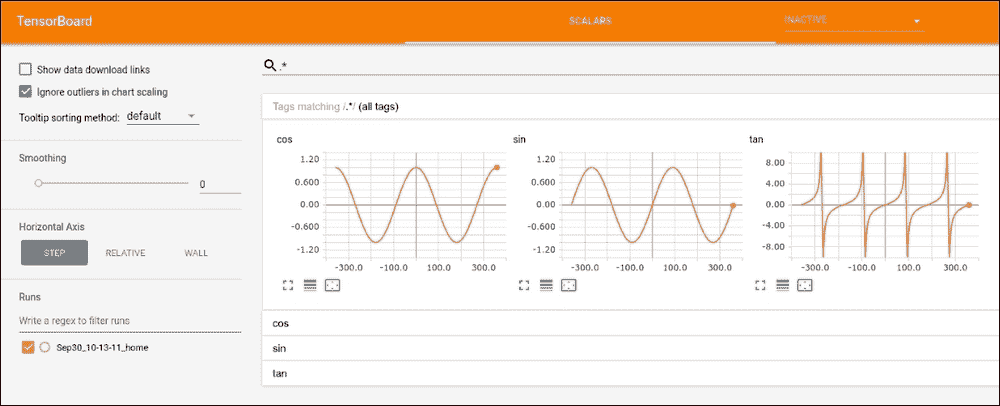
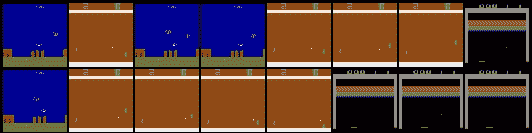
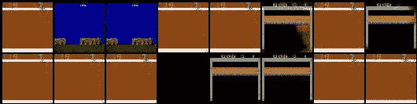

# 三、将 PyTorch 用于深度学习

在前一章中，我们熟悉了开源库，它为我们提供了一系列 RL 环境。然而，最近在 RL 方面的发展，特别是它与**深度学习** ( **DL** )的结合，现在使得解决比以前更复杂和更具挑战性的问题成为可能。这部分是由于 DL 方法和工具的发展。

这一章专门介绍这样一个工具，它使得用几行 Python 代码实现复杂的 DL 模型成为可能。这一章并不假装是一个完整的 DL 手册，因为这个领域非常广泛和动态。目标是让您熟悉 PyTorch 库的细节和实现细节，假设您已经熟悉了 DL 基础知识。

**兼容性说明**:本章中的所有示例都是针对最新的 PyTorch 0.4.0 进行更新的，与之前的 0.3.1 版本相比有很多变化。如果你用的是旧的 PyTorch，可以考虑升级。在本章中，我们将讨论最新版本中的不同之处。


# 张量

张量是所有 DL 工具包的基础构件。这个名字听起来很酷也很神秘，但是它的基本思想是张量是一个多维数组。一个个数字就像一个点，是零维的，而向量就像线段一样是一维的，矩阵就是二维的物体。三维数集合可以用一个数的平行六面体来表示，但是不要像*矩阵*一样有单独的名字。我们可以保留这个术语用于更高维度的集合，它们被命名为多维矩阵或张量。



图 1:从单一数字到 n 维张量


## 张量的创建

如果你熟悉 NumPy 库(你应该熟悉)，那么你应该已经知道它的主要目的是以一种通用的方式处理多维数组。在 NumPy 中，这样的数组不叫张量，但事实上，它们是张量。张量在科学计算中被广泛使用，作为数据的一般存储。例如，彩色图像可以被编码为具有宽度、高度和色彩平面维度的 3D 张量。

除了维度，张量的特征还在于其元素的类型。PyTorch 支持八种类型:三种浮点类型(16 位、32 位和 64 位)和五种整数类型(8 位有符号、8 位无符号、16 位、32 位和 64 位)。不同类型的张量用不同的类来表示，最常用的有`torch.FloatTensor`(对应 32 位浮点)、`torch.ByteTensor`(8 位无符号整数)、`torch.LongTensor`(64 位有符号整数)。其余的可以在文档中找到。

在 PyTorch 中创建张量有三种方法:

1.  通过调用所需类型的构造函数。
2.  通过将 NumPy 数组或 Python 列表转换成张量。在这种情况下，类型将取自数组的类型。
3.  通过让 PyTorch 为你创建一个带有特定数据的张量。例如，您可以使用`torch.zeros()`函数创建一个填充零值的张量。

为了给你这些方法的例子，让我们看一个简单的会话:

```
>>> import torch
>>> import numpy as np
>>> a = torch.FloatTensor(3, 2)
>>> a
tensor([[ 4.1521e+09,  4.5796e-41],
        [ 1.9949e-20,  3.0774e-41],
        [ 4.4842e-44,  0.0000e+00]])
```

这里，我们导入了 PyTorch 和 NumPy，并创建了一个大小为 3 × 2 的未初始化张量。默认情况下，PyTorch 为张量分配内存，但不初始化它。为了清楚张量的内容，我们需要使用它的运算:

```
>>> a.zero_()
tensor([[ 0.,  0.],
        [ 0.,  0.],
        [ 0.,  0.]])
```

张量有两种类型的操作:就地操作和函数操作。就地运算的名称后面有一个下划线，它对张量的内容进行运算。在这之后，对象本身被返回。功能等价创建了一个张量的*副本*，并执行了修改，而原始张量保持不变。从性能和内存的角度来看，就地操作通常更有效。

通过构造函数创建张量的另一种方法是提供一个 Python iterable(例如，一个列表或元组)，它将被用作新创建的张量的内容:

```
>>> torch.FloatTensor([[1,2,3],[3,2,1]])
tensor([[ 1.,  2.,  3.],
        [ 3.,  2.,  1.]])
```

这里我们使用 NumPy 创建相同的 zero 对象:

```
>>> n = np.zeros(shape=(3, 2))
>>> n
array([[ 0.,  0.],
       [ 0.,  0.],
       [ 0.,  0.]])
>>> b = torch.tensor(n)
>>> b
tensor([[ 0.,  0.],
        [ 0.,  0.],
        [ 0.,  0.]], dtype=torch.float64)
```

`torch.tensor`方法接受 NumPy 数组作为参数，并从中创建一个适当形状的张量。在前面的示例中，我们创建了一个用零初始化的 NumPy 数组，默认情况下，它创建了一个 double (64 位浮点)数组。因此，得到的张量具有`DoubleTensor`类型(在前面的示例中显示为具有`dtype`值)。通常，在 DL 中，不需要双精度，这增加了额外的内存和性能开销。通常的做法是使用 32 位浮点类型，甚至 16 位浮点类型，这就足够了。要创建这样的张量，需要明确指定 NumPy 数组的类型:

```
>>> n = np.zeros(shape=(3, 2), dtype=np.float32)
>>> torch.tensor(n)
tensor([[ 0.,  0.],
        [ 0.,  0.],
        [ 0.,  0.]])
```

作为一种选择，所需张量的类型可以在`dtype`自变量中提供给`torch.tensor`函数。然而，要小心，因为这个参数期望得到 PyTorch 类型规范，而不是 NumPy 类型规范。PyTorch 类型保存在`torch`包中，例如`torch.float32`、`torch.uint8`。

```
>>> n = np.zeros(shape=(3,2))
>>> torch.tensor(n, dtype=torch.float32)
tensor([[ 0.,  0.],
        [ 0.,  0.],
        [ 0.,  0.]])
```

**兼容性说明**:0 . 4 . 0 版本中增加了`torch.tensor()`方法和显式 PyTorch 类型规范，这是向简化张量创建迈出的一步。在以前的版本中，`torch.from_numpy()`函数是转换 NumPy 数组的推荐方法，但是它在处理 Python 列表和 NumPy 数组的组合时存在问题。为了向后兼容，这个`from_numpy()`函数仍然存在，但是为了更灵活的`torch.tensor()`方法，它被弃用了。


## 标量张量

从 0.4.0 版本开始，PyTorch 支持对应标量值的零维张量(在*图 1* 的左侧)。这种张量可以是某些运算的结果，例如对张量中的所有值求和。早些时候，这种情况是通过创建一维(向量)张量来处理的，其中一维等于 1。这个解决方案有效，但是不太简单，因为需要额外的索引来访问值。

现在零维张量被适当的函数支持并返回，并且可以由`torch.tensor()`函数创建。要访问这样一个张量的实际 Python 值，他们有一个特殊的`item()`方法:

```
>>> a = torch.tensor([1,2,3])
>>> a
tensor([ 1,  2,  3])
>>> s = a.sum()
>>> s
tensor(6)
>>> s.item()
6
>>> torch.tensor(1)
tensor(1)
```


## 张量运算

在张量上可以执行的操作有很多，不胜枚举。通常，在位于[http://pytorch.org/docs/](http://pytorch.org/docs/)的 PyTorch 文档中搜索就足够了。这里我们需要提到的是，除了我们已经讨论过的就地变量和函数变量(也就是说，有和没有下划线，像`zero()`和`zero_()`)，还有两个地方可以寻找操作:`torch`包和张量类。在第一种情况下，函数通常接受张量作为参数。在第二种情况下，它作用于所谓的张量。

大多数时候，张量运算试图对应于它们的 NumPy 等价，所以如果 NumPy 中有一些不是很专业的函数，那么 PyTorch 也很有可能有。例子有`torch.stack()`、`torch.transpose()`和`torch.cat()`。


## GPU 张量

PyTorch 透明支持CUDA GPU，也就是说所有操作都有两个版本——CPU 和GPU——自动选择。这个决定是基于你正在操作的张量的类型做出的。我们提到的每一种张量类型都是针对 CPU 的，都有对应的 GPU。唯一的区别是 GPU 张量驻留在`torch.cuda`包中，而不仅仅是`torch`。例如，`torch.FloatTensor`是一个驻留在 CPU 内存中的 32 位浮点张量，但是`torch.cuda.FloatTensor`是它的 GPU 对应物。要从 CPU 转换到 GPU，有一个张量方法`to(device)`，它创建一个张量的副本到指定的设备(可以是 CPU 或 GPU)。如果张量已经在设备上，什么都不会发生，原始张量将被返回。可以用不同的方式指定设备类型。首先你可以只传一个设备的字符串名，就是 cpu 内存的“CPU”或者 GPU 的“cuda”。一个 GPU 设备可以在冒号后指定一个可选的设备索引，例如，系统中的第二个 GPU 卡可以通过“cuda:1”来寻址(索引从零开始)。

在`to()`方法中指定设备的另一种稍微有效的方法是使用`torch.device`类，它接受设备名和可选索引。为了访问张量当前所在的设备，它有一个`device`属性。

```
>>> a = torch.FloatTensor([2,3])
>>> a
tensor([ 2.,  3.])
>>> ca = a.cuda(); ca
tensor([ 2.,  3.], device='cuda:0')
```

这里，我们在 CPU 上创建了一个张量，然后将其复制到 GPU 内存中。两个副本都可以用于计算，所有特定于 GPU 的机器对用户都是透明的:

```
>>> a + 1
tensor([ 3.,  4.])
>>> ca + 1
tensor([ 3.,  4.], device='cuda:0')
>>> ca.device
device(type='cuda', index=0)
```

**兼容性说明**:0 . 4 . 0 中引入了`to()`方法和`torch.device`类。在以前的版本中，CPU 和 GPU 之间的复制分别通过单独的张量方法`cpu()`和`cuda()`来执行，这需要添加额外的代码行来显式地将张量转换为它们的 CUDA 版本。在最新版本中，你可以在程序开始时创建一个想要的`torch.device`对象，并在你创建的每个张量上使用`to(device)`。张量中的旧方法`cpu()`和`cuda()`仍然存在，但已被弃用。


# 渐变

即使有透明的 GPU 支持，如果没有一个“杀手锏”:自动计算梯度，所有这些与张量共舞都不值得费心。这个功能最初是在 Caffe 工具包中实现的，后来成为 DL 库中事实上的标准。即使对于最简单的**神经网络** ( **NN** )来说，手动计算梯度的实现和调试也是极其痛苦的。你必须计算所有函数的导数，应用链式法则，然后实现计算结果，祈祷一切都做对了。这对于理解 DL 的具体细节可能是一个非常有用的练习，但这不是你想通过试验不同的神经网络架构来一遍又一遍重复的事情。

幸运的是，那些日子已经过去了，就像用烙铁和真空管给你的硬件编程一样！现在，定义一个数百层的神经网络只需要从预定义的构建块组装它，或者在极端情况下，你做一些奇特的事情，手动定义转换表达式。所有的梯度将被仔细计算，反向传播，并应用于网络。为了能够实现这一点，您需要根据所使用的 DL 库来定义您的网络架构，这些库在细节上可以不同，但一般来说必须是相同的:您定义您的网络将输入转换为输出的顺序。



图 2:数据和梯度流过神经网络

造成根本差异的是如何计算梯度。有两种方法:

1.  **静态图**:在这种方法中，你需要预先定义你的计算，以后就不可能再修改了。在进行任何计算之前，DL 库会对图形进行处理和优化。该模型在 TensorFlow、Theano 和许多其他 DL 工具包中实现。
2.  **动态图形**:你不需要预先定义你的图形，因为它将被执行。您只需对实际数据执行想要用于数据转换的操作。在此期间，该库记录执行操作的顺序，当您要求它计算梯度时，它会展开其操作历史，累积网络参数的梯度。这个方法也叫做笔记本渐变**并且在 PyTorch、Chainer 和其他一些软件中实现。**

这两种方法各有优缺点。例如，静态图形通常更快，因为所有计算都可以转移到 GPU，从而最大限度地减少数据传输开销。此外，在静态图中，库在优化计算顺序甚至删除图的某些部分方面有更大的自由度。另一方面，动态图有较高的计算开销，但给开发者更多的自由。例如，他们可以说，“对于这段数据，我可以应用这个网络两次，对于这段数据，我将使用一个完全不同的模型，其中的梯度被批量平均值剪裁。”动态图模型的另一个非常吸引人的优点是，它允许您以更“Pythonic 化”的方式更自然地表达您的转换。最后，它只是一个包含一堆函数的 Python 库，所以只需调用它们，让这个库来发挥作用。


## 张量和梯度

PyTorch 张量有一个内置的梯度计算和跟踪机制，所以你需要做的就是将数据转换成张量，并使用`torch`提供的张量方法和函数进行计算。当然，如果您需要访问底层的底层细节，您总是可以的，但是大多数时候，PyTorch 会做您所期望的事情。

每个张量都有几个与梯度相关的属性:

*   `grad`:保存包含计算梯度的相同形状的张量的属性。
*   `is_leaf` : `True`，如果这个张量是用户构造的，`False`，如果对象是函数变换的结果。
*   `requires_grad` : `True`如果这个张量需要计算梯度。该属性继承自叶张量，叶张量从张量构造步骤(`torch.zeros()`或`torch.tensor()`等等)中获得该值。默认情况下，构造函数有`requires_grad=False`，所以如果你想为你的张量计算梯度，那么你需要明确地说出来。

为了让所有这些渐变叶片机制更加清晰，让我们来考虑一下这个环节:

```
>>> v1 = torch.tensor([1.0, 1.0], requires_grad=True)
>>> v2 = torch.tensor([2.0, 2.0])
```

在前面的代码中，我们创建了两个张量。第一种需要计算梯度，第二种不需要:

```
>>> v_sum = v1 + v2
>>> v_res = (v_sum*2).sum()
>>> v_res
tensor(12.)
```

所以现在我们将两个向量按元素相加(这是向量`[3, 3]`)，将每个元素加倍，并将它们加在一起。结果是一个值为`12`的零维张量。好了，到目前为止这是简单的数学。现在让我们来看看我们的表达式创建的底层图表:



图 3:表达式的图形表示

如果我们检查张量的属性，我们会发现 **v1** 和 **v2** 是仅有的叶节点，除了 **v2** 之外的每个变量都需要计算梯度:

```
>>> v1.is_leaf, v2.is_leaf
(True, True)
>>> v_sum.is_leaf, v_res.is_leaf
(False, False)
>>> v1.requires_grad
True
>>> v2.requires_grad
False
>>> v_sum.requires_grad
True
>>> v_res.requires_grad
True
```

现在，让 PyTorch 计算我们的图形的梯度:

```
>>> v_res.backward()
>>> v1.grad
tensor([ 2.,  2.])
```

通过调用`backward`函数，我们要求 PyTorch 计算`v_res`变量相对于我们图表中任何变量的数值导数。换句话说，`v_res`变量的微小变化会对图表的其余部分产生什么影响？在我们的特定示例中，v1 的渐变中的值 2 意味着通过将 v1 的每个元素增加 1，得到的值`v_res`将增加 2。

如上所述，PyTorch 仅使用`requires_grad=True`为叶张量计算梯度。事实上，如果我们试图检查 v2 的梯度，我们什么也得不到:

```
>>> v2.grad
```

原因是计算和内存方面的效率:在现实生活中，我们的网络可以有数百万个优化的参数，对它们执行数百个中间操作。在梯度下降优化过程中，我们对任何中间矩阵乘法的梯度不感兴趣；我们在模型中唯一想要调整的是相对于模型参数(权重)的损失梯度。当然，如果你想计算输入数据的梯度(如果你想生成一些对立的例子来欺骗现有的神经网络或调整预训练的词嵌入，这可能是有用的)，那么你可以很容易地做到这一点，通过传递张量创建的`requires_grad=True`。

基本上，您现在已经拥有了实现自己的神经网络优化器所需的一切。这一章的其余部分是关于额外方便的函数，它将为你提供 NN 架构的更高层次的构建块，流行的优化算法和常见的损失函数。然而，不要忘记，你可以很容易地以任何你喜欢的方式重新实现所有这些附加功能。这就是 PyTorch 在 DL 研究者中如此受欢迎的原因:因为它的优雅和灵活性。

**兼容性说明**:支持张量中的梯度计算是 PyTorch 0.4.0 的主要变化之一。在以前的版本中，图形跟踪和梯度累积是在一个单独的非常薄的类`Variable`中完成的，它作为张量的包装器，自动保存计算的历史，以便能够反向传播。这个类在 0.4.0 中仍然存在，但它已被弃用，并将很快消失，因此新代码应该避免使用它。从我的角度来看，这一变化很大，因为`Variable`逻辑非常薄，但仍然需要额外的代码和开发人员的注意力来包装和展开张量。现在渐变是一个内置的张量属性，这使得 API 更加简洁。


# NN 积木

在`torch.nn`包中，你会发现大量的预定义类为你提供了基本的功能块。所有这些都是在实践的基础上设计的(例如，它们支持迷你批次，具有合理的默认值，并且权重被正确初始化)。所有模块都遵循 *callable* 的约定，这意味着任何类的实例在应用于其参数时都可以充当函数。例如，`Linear`类实现了一个带有可选偏置的前馈层:

```
>>> import torch.nn as nn
>>> l = nn.Linear(2, 5)
>>> v = torch.FloatTensor([1, 2])
>>> l(v)
tensor([ 0.1975,  0.1639,  1.1130, -0.2376, -0.7873])
```

这里，我们创建了一个随机初始化的前馈层，有两个输入和五个输出，并将其应用于我们的浮点张量。`torch.nn`包中的所有类都继承自`nn.Module`基类，你可以用它来实现你自己的更高层次的 NN 块。我们将在下一节看到如何做到这一点，但是现在，让我们看看所有`nn.Module`孩子都提供的有用方法。它们如下:

*   `parameters()`:返回所有需要梯度计算的变量(即模块权重)的迭代器的函数
*   `zero_grad()`:该功能将所有参数的所有梯度初始化为零
*   `to(device)`:将所有模块参数移动到给定设备(CPU 或 GPU)
*   `state_dict()`:这将返回包含所有模块参数的字典，对于模型序列化非常有用
*   `load_state_dict()`:用状态字典初始化模块

可用类别的完整列表可在[http://pytorch.org/docs](http://pytorch.org/docs)的文档中找到。

现在我们应该提到一个非常方便的类，它允许您将其他层组合到管道中:`Sequential`。演示`Sequential`的最佳方式是通过一个例子:

```
>>> s = nn.Sequential(
... nn.Linear(2, 5),
... nn.ReLU(),
... nn.Linear(5, 20),
... nn.ReLU(),
... nn.Linear(20, 10),
... nn.Dropout(p=0.3),
... nn.Softmax(dim=1))
>>> s
Sequential (
  (0): Linear (2 -> 5)
  (1): ReLU ()
  (2): Linear (5 -> 20)
  (3): ReLU ()
  (4): Linear (20 -> 10)
  (5): Dropout (p = 0.3)
  (6): Softmax ()
)
```

这里，我们定义了一个输出为 softmax 的三层神经网络，应用于维度 1(维度 0 是批量样本)、ReLU 非线性和丢失。让我们推着东西穿过它:

```
>>> s(torch.FloatTensor([[1,2]]))
tensor([[ 0.1410,  0.1380,  0.0591,  0.1091,  0.1395,  0.0635,  0.0607,
          0.1033,  0.1397,  0.0460]])
```

所以，我们的迷你电池就是一个成功穿越网络的例子！


# 自定义图层

在上一节中，我们简单地提到了类作为 PyTorch 公开的所有 NN 构件的基本父类。它不仅是现有层的统一父层，还有更多的意义。通过子类化`nn.Module`类，您可以创建自己的构建块，这些构建块可以堆叠在一起，以后可以重用，并且可以完美地集成到 PyTorch 框架中。

在其核心部分，`nn.Module`为其子代提供了相当丰富的功能:

*   它跟踪当前模块包含的所有子模块。例如，您的构建块可以有两个前馈层，以某种方式用于执行块的转换。
*   它提供了处理注册子模块的所有参数的函数。您可以获得模块参数的完整列表(`parameters()`方法)，将它的梯度归零(`zero_grads()`方法)，移动到 CPU 或 GPU ( `to(device)`方法)，序列化和反序列化模块(`state_dict()`和`load_state_dict()`)，甚至使用您自己的可调用方法(`apply()`方法)执行一般转换。
*   它建立了模块应用于数据的惯例。每个模块都需要通过覆盖`forward()`方法来执行数据转换。
*   还有更多的功能，比如注册一个钩子函数来调整模块转换或渐变流的能力，但它更多的是针对高级用例。

这些功能允许我们以统一的方式将子模型嵌套到更高级别的模型中，这在处理复杂性时非常有用。这可能是一个简单的一层线性变换，也可能是一个 1001 层的 ResNet 怪物，但是如果它们遵循`nn.Module`的约定，那么它们都可以用相同的方式处理。这对于代码的简单性和可重用性非常方便。

为了使我们的生活更简单，在遵循前面的约定时，PyTorch 作者通过精心的设计和大量的 Python 魔法简化了模块的创建。因此，要创建一个定制模块，我们通常只需要做两件事:注册子模块和实现`forward()`方法。让我们看看如何为上一节中的`Sequential`示例实现这一点，但是是以一种更通用和可重用的方式(完整的示例是`Chapter03/01_modules.py`):

```
class OurModule(nn.Module):
    def __init__(self, num_inputs, num_classes, dropout_prob=0.3):
        super(OurModule, self).__init__()
        self.pipe = nn.Sequential(
            nn.Linear(num_inputs, 5),
            nn.ReLU(),
            nn.Linear(5, 20),
            nn.ReLU(),
            nn.Linear(20, num_classes),
            nn.Dropout(p=dropout_prob),
            nn.Softmax()
        )
```

这是我们继承了`nn.Module`的模块类。在构造函数中，我们传递三个参数:输入的大小、输出的大小和可选的退出概率。我们要做的第一件事是调用父类的构造函数，让它自己初始化。第二步，我们用一堆层创建一个已经熟悉的`nn.Sequential`，并把它分配给我们的类字段`pipe`。通过给我们的字段分配一个`Sequential`实例，我们自动注册了这个模块(`nn.Sequential`从`nn.Module`继承而来，就像`nn`包中的所有东西一样)。要注册，我们不需要调用任何东西，我们只需要将我们的子模块分配给字段。构造函数完成后，所有这些字段将被自动注册(如果你真的想注册，在`nn.Module`中有一个函数可以注册子模块):

```
    def forward(self, x):
        return self.pipe(x)
```

这里，我们用数据转换的实现覆盖了 forward 函数。由于我们的模块是其他层的一个非常简单的包装器，我们只需要要求他们转换数据。请注意，要将模块应用于数据，您需要将模块调用为可调用的(也就是说，假设模块实例是一个函数并使用参数调用它)，并且*而不是*使用`nn.Module`类的`forward()`函数。这是因为`nn.Module`覆盖了`__call__()`方法，当我们将一个实例视为可调用时，就会用到这个方法。这个方法使用了一些`nn.Module`魔法，并调用了你的`forward()`方法。如果你直接调用`forward()`，你将会介入`nn.Module`任务，这会给你错误的结果。

所以，这就是我们需要做的，来定义我们自己的模块。现在，让我们使用它:

```
if __name__ == "__main__":
    net = OurModule(num_inputs=2, num_classes=3)
    v = torch.FloatTensor([[2, 3]])
    out = net(v)
    print(net)
    print(out)
```

我们创建我们的模块，为它提供所需数量的输入和输出，然后我们创建一个张量，包装到`Variable`中，并要求我们的模块转换它，遵循使用它作为可调用的相同约定。然后我们打印我们的网络结构(`nn.Module`覆盖`__str__()`和`__repr__()`)，以一种很好的方式表示内部结构。我们最后展示的是网络转型的结果。

我们代码的输出应该如下所示:

```
rl_book_samples/Chapter03$ python 01_modules.pyOurModule(
  (pipe): Sequential(
    (0): Linear(in_features=2, out_features=5, bias=True)
    (1): ReLU()
    (2): Linear(in_features=5, out_features=20, bias=True)
    (3): ReLU()
    (4): Linear(in_features=20, out_features=3, bias=True)
    (5): Dropout(p=0.3)
    (6): Softmax()
  )
)
tensor([[ 0.3672,  0.3469,  0.2859]])
```

当然，所有关于 PyTorch 的动态本质的说法仍然是正确的。您的`forward()`方法将获得对每批数据的控制，因此，如果您想基于需要处理的数据进行一些复杂的转换，如分层 softmax 或随机选择要应用的 net，那么没有什么可以阻止您这样做。您的模块的参数数量也不受一个参数的限制。所以，如果你愿意，你可以写一个有多个必选参数和几十个可选参数的模块，就可以了。

现在我们需要熟悉 PyTorch 库的两个重要部分，这将简化我们的生活:损失函数和优化器。


# 最终粘合-损失函数和优化器

将输入数据转换成输出数据的网络不足以开始训练它。我们需要定义我们的学习目标，即有一个接受两个参数的函数:网络的输出和期望的输出。它的职责是返回给我们一个单一的数字:网络的预测与期望的结果有多接近。该功能称为**损失功能**，其输出为**损失值**。使用该损失值，我们计算网络参数的梯度并调整它们以减小该损失值，这推动我们的模型在未来得到更好的结果。这两个部分——损失函数和通过梯度调整网络参数的方法——是如此常见，并以如此多的形式存在，以至于它们都构成了 PyTorch 库的重要部分。让我们从损失函数开始。


## 损失函数

损失函数驻留在`nn`包中，并作为`nn.Module`子类实现。通常，它们接受两个参数:来自网络的输出(预测)和期望的输出(真实数据，也称为数据样本的标签)。在撰写本文时，PyTorch 0.4 包含 17 个不同的损失函数。最常用的有:

*   `nn.MSELoss`:自变量之间的均方误差，这是回归问题的标准损失
*   `nn.BCELoss`和`nn.BCEWithLogits`:二元交叉熵损失。第一个版本期望一个单一概率值(通常是`Sigmoid`层的输出)，而第二个版本假设原始分数作为输入，自己应用`Sigmoid`。第二种方法通常在数值上更加稳定和有效。这些损失(顾名思义)经常用于二进制分类问题。
*   `nn.CrossEntropyLoss`和`nn.NLLLoss`:著名的“最大似然”准则，用于多类分类问题。第一个版本期望每个类的原始分数，并在内部应用`LogSoftmax`，而第二个版本期望将对数概率作为输入。

还有其他可用的损失函数，您可以随时编写自己的`Module`子类来比较输出和目标。现在让我们看看优化过程的第二部分。


## 优化者

基本优化器的职责是获取模型参数的梯度并改变这些参数，以便降低损失值。通过降低损失值，我们将模型推向期望的输出，这可以给我们未来更好的模型性能带来希望。“更改参数”听起来可能很简单，但这里有很多细节，优化程序仍然是一个热门的研究课题。在`torch.optim`包中，PyTorch 提供了许多流行的优化器实现，其中最广为人知的如下:

*   `SGD`:具有可选动量扩展的普通随机梯度下降算法
*   `RMSprop`:g . hint on 提出的优化器
*   `Adagrad`:一个自适应梯度优化器

所有的优化器都公开了统一的接口，这样就可以很容易地试验不同的优化方法(有时优化方法真的可以在收敛动态和最终结果上有所不同)。在构造上，你需要传递一个`Variables`的 iterable，这个 iterable 会在优化过程中被修改。通常的做法是传递上层`nn.Module`实例的`params()`调用的结果，这将返回所有带有渐变的叶子`Variables`的 iterable。

现在，让我们讨论一个训练循环的通用蓝图:

```
for batch_samples, batch_labels in iterate_batches(data, batch_size=32):                                                    # 1
    batch_samples_t = torch.tensor(batch_samples))                 # 2
    batch_labels_t = torch.tensor(batch_labels))                   # 3
    out_t = net(batch_samples_t)                                   # 4
    loss_t = loss_function(out_t, batch_labels_t)                  # 5
    loss_t.backward()                                              # 6
    optimizer.step()                                               # 7
    optimizer.zero_grad()                                          # 8

```

通常，您会一遍又一遍地迭代您的数据(对一组完整示例的一次迭代被称为一个*时期*)。数据通常太大，无法一次放入 CPU 或 GPU 内存，因此被分成大小相等的批次。每批包含数据样本和目标标签，两者都必须是张量(行`2`和`3`)。您将数据样本传递到您的网络(行`4`)并将它的输出和目标标签馈送到损失函数(行`5`)。损失函数的结果显示了网络结果相对于目标标签的“差”。由于网络的输入和网络的权重是张量，所以网络的所有变换只不过是具有中间张量实例的运算图。损失函数也是如此:它的结果也是一个单一损失值的张量。这个计算图中的每个张量都记得它的父项，所以要计算整个网络的梯度，你需要做的就是在一个损失函数结果上调用`backward()`函数(第`6`行)。

该调用的结果将是展开已执行计算的图表，并使用`require_grad=True`计算每个叶张量的梯度。通常，这样的张量是我们模型的参数，例如前馈网络的权重和偏差，以及卷积滤波器。每次计算梯度时，它都在`tensor.grad`域中累积，因此一个张量可以多次参与一个变换，其梯度将被适当地累加在一起。例如，一个单独的 **RNN** (代表**循环神经网络**，我们将在[第 12 章](part0087_split_000.html#2IV0U1-ce551566b6304db290b61e4d70de52ee "Chapter 12. Chatbots Training with RL")、*用 RL* 训练聊天机器人)单元可以应用于多个输入项。

在`loss.backward()`调用完成后，我们已经积累了梯度，现在是优化器做它的工作的时候了:它从我们在构造时传递给它的参数中获取所有梯度并应用它们。所有这些都是用方法`step()`(行`7`)完成的。

训练循环的最后但并非最不重要的部分是我们对参数零梯度的责任。这可以通过在我们的网络上调用`zero_grad()`来完成，但是为了方便起见，optimizer 也公开了这样一个调用，它做同样的事情(第`8`行)。有时候`zero_grad()`被放在训练循环的开头，但是没多大关系。

前面的方案是一种非常灵活的执行优化的方式，即使在复杂的研究中也能满足要求。例如，您可以让两个优化器在相同的数据上调整不同模型的选项(这是来自 GAN training 的真实场景)。

因此，我们已经完成了培训神经网络所需的 PyTorch 的基本功能。本章以一个实际的中等规模的例子结束，以展示我们所学的所有概念，但在我们开始之前，我们需要讨论一个对神经网络从业者来说至关重要的重要话题:学习过程的监控。


# 用张量板监控

如果你曾经尝试过独自训练一个神经网络，那么你可能知道这有多痛苦和不确定。我说的不是遵循现有的教程和演示，当所有的超参数都已经为您调好时，而是获取一些数据并从头开始创建一些东西。即使有了现代的 DL 高级工具包，所有的最佳实践，例如正确的权重初始化和优化器的 betas、gammas 和其他选项都被设置为相同的默认值，并且许多其他东西都隐藏在引擎盖下，但仍然有许多决策可以做出，因此许多事情可能会出错。因此，你的网络从第一次运行开始就几乎不工作，这是你应该习惯的事情。

当然，随着实践和经验的积累，你会对问题的可能原因产生强烈的直觉，但是直觉需要关于你的网络内部正在发生什么的输入数据。所以你需要能够窥视你的训练过程，观察它的动态。即使是小型网络(如微型 MNIST 辅导网络)也可能有数十万个参数，具有非常非线性的训练动态。DL 从业者已经制定了一份你在培训期间应该遵守的事项清单，通常包括以下内容:

*   损失值，通常由几个部分组成，如基本损失和正则化损失。您应该随时监控总损耗和单个组件。
*   训练集和测试集的验证结果。
*   关于梯度和权重的统计。
*   学习率和其他超参数，如果它们随时间调整的话。

该列表可能会更长，并包括特定领域的指标，如词嵌入的投影、音频样本和 GAN 生成的图像。您可能还想监控与训练速度相关的值，比如一个 epoch 需要多长时间，以查看您的优化效果或硬件问题。

长话短说,您需要一个通用的解决方案来跟踪一段时间内的大量值并表示它们以供分析，最好是专门为 DL 开发的(想象一下在 Excel 电子表格中查看这样的统计数据)。幸运的是，这样的工具是存在的。


## 冲浪板 101

事实上，在撰写本文时，可供选择的替代方案并不多，尤其是开源和通用的。从第一个公开版本开始，TensorFlow 就包含了一个名为 TensorBoard 的特殊工具，开发该工具是为了解决我们正在谈论的问题:如何在训练过程中观察和分析各种 NN 特征。TensorBoard 是一个强大的通用解决方案，拥有一个大型社区，它看起来非常漂亮:



图 TensorBoard web 界面

从架构的角度来看，TensorBoard 是一个 Python web 服务，您可以在您的计算机上启动它，向它传递您的训练过程将保存要分析的值的目录。然后你将浏览器指向 TensorBoard 的端口(通常是`6006`)，它会向你展示一个交互式的 web 界面，其中的值会实时更新。这很好也很方便，尤其是当你的训练是在云中某个远程机器上进行的时候。

最初，TensorBoard 是作为 TensorFlow 的一部分部署的，但最近，它被转移到一个单独的项目(仍由 Google 维护)中，并有了自己的包名。然而，TensorBoard 仍然使用 TensorFlow 数据格式，因此为了能够从 PyTorch 优化中编写训练统计数据，您需要安装`tensorflow`和`tensorflow-tensorboard`包。由于 TensorFlow 依赖于 TensorBoard，要安装两者，您需要在您的虚拟环境中运行`pip install tensorflow`。

理论上，这就是你开始监控你的网络所需要的一切，因为`tensorflow`包为你提供了写 TensorBoard 能够读取的数据的类。然而，它不是很实用，因为那些类是非常低的水平。为了克服这个问题，有几个第三方开源库提供了一个方便的高级接口。我的最爱之一，也就是本书中使用的，是`tensorboard-pytorch`([https://github.com/lanpa/tensorboard-pytorch](https://github.com/lanpa/tensorboard-pytorch))。可以用`pip install tensorboard-pytorch`安装。

策划素材


## 为了给你一个简单`tensorboard-pytorch`的印象，让我们考虑一个与 NNs 无关的小例子，它只是将东西写入 TensorBoard(完整的示例代码在`Chapter03/02_tensorboard.py`中)。

我们导入所需的包，创建一个数据写入器，并定义我们要可视化的函数。默认情况下，`SummaryWriter`将为每次启动在`runs`目录下创建一个唯一的目录，以便能够比较不同的培训启动。新目录的名称包括当前日期和时间以及主机名。要覆盖它，您可以将`log_dir`参数传递给`SummaryWriter`。您还可以通过传递一个注释选项来给目录名添加一个后缀，例如为了捕捉不同实验的语义，比如`dropout=0.3`或`strong_regularisation`

```
import math
from tensorboardX import SummaryWriter

if __name__ == "__main__":
    writer = SummaryWriter()

    funcs = {"sin": math.sin, "cos": math.cos, "tan": math.tan}
```

在这里，我们循环以度为单位的角度范围，将它们转换成弧度，并计算函数的值。使用`add_scalar`函数将每个值添加到编写器中，该函数有三个参数:参数名、参数值和当前迭代(必须是整数)。

```
    for angle in range(-360, 360):
        angle_rad = angle * math.pi / 180
        for name, fun in funcs.items():
            val = fun(angle_rad)
            writer.add_scalar(name, val, angle)
    writer.close()
```

循环后我们需要做的最后一件事是关闭编写器。请注意，writer 会定期刷新(默认情况下，每两分钟一次)，因此即使在优化过程很长的情况下，您仍然会看到您的值。

运行它的结果将是控制台上的零输出，但是您将看到在`runs`目录中创建了一个新目录，其中包含一个文件。为了查看结果，我们需要启动 TensorBoard:

现在，您可以在浏览器中打开`http://localhost:6006`来查看如下内容:

```
rl_book_samples/Chapter03$ tensorboard --logdir runs --host localhost
TensorBoard 0.1.7 at http://localhost:6006 (Press CTRL+C to quit)
```

图 5:示例生成的图



Figure 5: Plots produced by the example

这些图表是交互式的，因此您可以将鼠标悬停在它们上面以查看实际值，并选择区域以放大细节。要缩小，请双击图形内部。如果您多次运行您的程序，那么您将在左侧的“运行”列表中看到几个项目，它们可以以任何组合启用和禁用，允许您比较几个优化的动态。TensorBoard 不仅允许您分析标量值，还允许您分析图像、音频、文本数据和嵌入，它甚至可以向您显示您的网络结构。有关所有这些特性，请参考`tensorboard-pytorch`和`tensorboard`的文档。

现在是时候把你在本章中学到的所有东西结合起来，用 PyTorch 看一个真实的神经网络优化问题了。

示例–雅达利图像上的 GAN


# 几乎每本关于 DL 的书都使用 MNIST 数据集向你展示 DL 的力量，多年来，这使得这个数据集变得极其乏味，就像基因研究人员的果蝇一样。为了打破这一传统，并给这本书增添一点趣味，我尽量避免走老路，用一些不同的东西来说明 PyTorch。你可能听说过**生成对抗网络** ( **GANs** )，是由 *Ian Goodfellow* 发明并推广的。在这个例子中，我们将训练一个 GAN 来生成各种 Atari 游戏的截图。

最简单的 GAN 架构是这样的:我们有两个网络，第一个作为“骗子”(也称为生成器)，另一个是“侦探”(另一个名称是鉴别器)。两个网络相互竞争:生成器试图生成假数据，鉴别器将很难从您的数据集区分出来，而鉴别器试图检测生成的数据样本。随着时间的推移，这两个网络都提高了他们的技能:生成器产生越来越多的真实数据样本，鉴别器发明了更复杂的方法来区分假冒商品。GANs 的实际应用包括图像质量改进、逼真图像生成和特征学习。在我们的例子中，实际有用性几乎为零，但它将是一个很好的例子，说明 PyTorch 代码对于相当复杂的模型是多么简洁。

那么，我们开始吧。整个示例代码在文件`Chapter03/03_atari_gan.py`中。这里我们只看重要的代码段，没有导入部分和常量声明:

这个类是一个体育馆游戏的包装器，它包括几个转换:

```
class InputWrapper(gym.ObservationWrapper):
    def __init__(self, *args):
        super(InputWrapper, self).__init__(*args)
        assert isinstance(self.observation_space, gym.spaces.Box)
        old_space = self.observation_space
        self.observation_space = gym.spaces.Box(self.observation(old_space.low),self.observation(old_space.high), dtype=np.float32)

    def observation(self, observation):
        # resize image
        new_obs = cv2.resize(observation, (IMAGE_SIZE, IMAGE_SIZE))
        # transform (210, 160, 3) -> (3, 210, 160)
        new_obs = np.moveaxis(new_obs, 2, 0)
        return new_obs.astype(np.float32) / 255.0
```

将输入图像的大小从 210 × 160(标准 Atari 分辨率)调整为 64 × 64 的正方形

*   将图像的颜色平面从最后一个位置移动到第一个位置，以满足卷积层的 PyTorch 约定，该卷积层输入具有通道形状、高度和宽度的张量
*   将图像从字节转换为浮点，并将其值重新调整为 0..1 范围
*   然后我们定义两个`nn.Module`类:`Discriminator`和`Generator`。第一个将我们缩放的彩色图像作为输入，通过应用五层卷积，将其转换为一个单一的数字，通过一个 sigmoid 非线性函数。来自`Sigmoid`的输出被解释为`Discriminator`认为我们的输入图像来自真实数据集的概率。

`Generator`将一个随机数向量(潜在向量)作为输入，并使用“转置卷积”操作(也称为**解卷积**)，将该向量转换为原始分辨率的彩色图像。我们不会在这里查看这些类，因为它们太长了，并且与我们的例子不太相关。您可以在完整的示例文件中找到它们。

图 6:三款 Atari 游戏的截图



Figure 6: A sample screenshot from three Atari games

作为输入，我们将使用由一个随机代理同时玩的几个 Atari 游戏的截图。*图 6* 是输入数据的一个例子，由以下函数生成:

这将从提供的数组中无限采样环境，发出随机动作并在`batch`列表中记住观察结果。当批处理达到要求的大小时，我们将它转换成一个张量和来自生成器的`yield`。由于一个游戏中的错误，需要检查观察的非零均值，以防止图像闪烁。

```
def iterate_batches(envs, batch_size=BATCH_SIZE):
    batch = [e.reset() for e in envs]
    env_gen = iter(lambda: random.choice(envs), None)

    while True:
        e = next(env_gen)
        obs, reward, is_done, _ = e.step(e.action_space.sample())
        if np.mean(obs) > 0.01:
            batch.append(obs)
        if len(batch) == batch_size:
            yield torch.FloatTensor(batch)
            batch.clear()
        if is_done:
            e.reset()
```

现在让我们看看我们的主函数，它准备模型并运行训练循环:

这里，我们处理命令行参数(可能只有一个可选参数，`--cuda`，启用 GPU 计算模式)并创建应用了包装器的环境池。这个环境数组将被传递给`iterate_batches`函数来生成训练数据；

```
if __name__ == "__main__":
    parser = argparse.ArgumentParser()
    parser.add_argument("--cuda", default=False, action='store_true')
    args = parser.parse_args()
    device = torch.device("cuda" if args.cuda else "cpu")

    env_names = ('Breakout-v0', 'AirRaid-v0', 'Pong-v0')
    envs = [InputWrapper(gym.make(name)) for name in env_names]
    input_shape = envs[0].observation_space.shape
```

在这篇文章中，我们创建了我们的类:一个摘要编写器、两个网络、一个损失函数和两个优化器。为什么是两个？这是因为这是 GANs 接受训练的方式:为了训练鉴别器，我们需要向它展示带有适当标签的真实和虚假数据样本(1 代表真实，0 代表虚假)。在此过程中，我们只更新鉴别器的参数。

```
    Writer = SummaryWriter()
    net_discr = Discriminator(input_shape=input_shape).to(device)
    net_gener = Generator(output_shape=input_shape).to(device)

    objective = nn.BCELoss()
    gen_optimizer = optim.Adam(params=net_gener.parameters(), lr=LEARNING_RATE)
    dis_optimizer = optim.Adam(params=net_discr.parameters(), lr=LEARNING_RATE)
```

之后，我们再次通过鉴别器传递真实和虚假的样本，但这次所有样本的标签都是 1，现在我们只更新生成器的权重。第二遍教导生成器如何欺骗鉴别器并将真实样本与生成的样本混淆:

在这里，我们定义了数组，，它将用于累积损失，迭代器计数器，以及带有`True`和`Fake`标签的变量。

```
    gen_losses = []
    dis_losses = []
    iter_no = 0

    true_labels_v = torch.ones(BATCH_SIZE, dtype=torch.float32, device=device)
    fake_labels_v = torch.zeros(BATCH_SIZE, dtype=torch.float32, device=device)
```

在训练循环的开始，我们生成一个随机向量，并将其传递给`Generator`网络。

```
    for batch_v in iterate_batches(envs):
        # generate extra fake samples, input is 4D: batch, filters, x, y
        gen_input_v = torch.FloatTensor(BATCH_SIZE, LATENT_VECTOR_SIZE, 1, 1).normal_(0, 1).to(device)
        batch_v = batch_v.to(device)
        gen_output_v = net_gener(gen_input_v)
```

首先，我们通过应用它两次来训练鉴别器:对我们的批中的真实数据样本和对生成的样本。我们需要在生成器的输出上调用`detach()`函数，防止这个训练通道的梯度流入生成器(`detach()`是 tensor 的一个方法，它在不连接到父操作的情况下制作一个副本)。

```
        dis_optimizer.zero_grad()
        dis_output_true_v = net_discr(batch_v)
        dis_output_fake_v = net_discr(gen_output_v.detach())
        dis_loss = objective(dis_output_true_v, true_labels_v) + objective(dis_output_fake_v, fake_labels_v)
        dis_loss.backward()
        dis_optimizer.step()
        dis_losses.append(dis_loss.item())
```

现在是发电机的训练时间。我们将生成器的输出传递给鉴别器，但现在我们不停止渐变。相反，我们应用带有`True`标签的目标函数。它会将我们的生成器推向这样一个方向:它生成的样本会使鉴别器将它们与真实数据混淆。

```
        gen_optimizer.zero_grad()
        dis_output_v = net_discr(gen_output_v)
        gen_loss_v = objective(dis_output_v, true_labels_v)
        gen_loss_v.backward()
        gen_optimizer.step()
        gen_losses.append(gen_loss_v.item())
```

这都是真正的训练，接下来的几行会报告损失并向 TensorBoard 提供图像样本:

这个例子的训练是一个相当漫长的过程。在 GTX 1080 GPU 上，100 次迭代大约需要 40 秒。开始时，生成的图像完全是随机噪声，但经过 10k-20k 的迭代，生成器越来越精通其工作，生成的图像越来越接近真实的游戏截图。

```
        iter_no += 1
        if iter_no % REPORT_EVERY_ITER == 0:
            log.info("Iter %d: gen_loss=%.3e, dis_loss=%.3e",iter_no, np.mean(gen_losses), np.mean(dis_losses))
            writer.add_scalar("gen_loss", np.mean(gen_losses), iter_no)
            writer.add_scalar("dis_loss", np.mean(dis_losses), iter_no)
            gen_losses = []
            dis_losses = []
        if iter_no % SAVE_IMAGE_EVERY_ITER == 0:
            writer.add_image("fake", vutils.make_grid(gen_output_v.data[:64]), iter_no)
            writer.add_image("real", vutils.make_grid(batch_v.data[:64]), iter_no)
```

我的实验在 40k-50k 的训练迭代(在 GPU 上几个小时)后给出了以下图像:

图 7:由生成器网络生成的样本图像



Figure 7: Sample images produced by the generator network

总结


# 在本章中，我们看到了 PyTorch 功能和特性的快速概述。我们讨论了张量和梯度等基本要素，了解了如何从基本构建模块中构建神经网络，并学习了如何自己实现这些模块。我们讨论了损失函数和优化器，以及训练动态的监控。这一章的目的是快速介绍 PyTorch，这将在本书的后面使用。

对于下一章，我们准备开始处理本书的主题:RL 方法。

For the next chapter, we're ready to start dealing with the main subject of this book: RL methods.