# 四、交叉熵方法

在这一章中，我们将总结这本书的第一部分，并熟悉 RL 方法之一——交叉熵。尽管它不如 RL 实践者工具箱中的其他工具有名，如**深度 Q 网** ( **DQN** )或优势演员评论家，但这种方法有自己的优势。最重要的如下:

*   **简单性**:交叉熵方法真的很简单，这使得它成为一种可以遵循的直观方法。例如，它在 PyTorch 上的实现不到 100 行代码。
*   **良好的收敛性**:在简单的环境中，不需要学习和发现复杂的、多步骤的策略，并且具有频繁奖励的短插曲，交叉熵通常非常有效。当然，许多实际问题不属于这一类，但有时它们属于这一类。在这种情况下，交叉熵(就其本身或作为更大系统的一部分)可能是最合适的。

在接下来的章节中，我们将从交叉熵的实用方面开始，然后看看它在 Gym 中的两种环境(我们熟悉的 CartPole 和 FrozenLake 的“网格世界”)中是如何工作的。然后，在本章的最后，我们将看一看该方法的理论背景。这一部分是可选的，需要更多的概率和统计知识，但是如果你想了解为什么这个方法有效，你可以深入研究。


# RL 方法的分类

交叉熵方法属于*无模型*和*基于策略*的方法类别。这些概念是新的，所以让我们花一些时间来探索它们。RL 中的所有方法都可以分为不同的方面:

*   无模型还是基于模型
*   基于价值还是基于策略
*   符合策略还是不符合策略

还有其他方法可以对 RL 方法进行分类，但是现在我们只对前三种感兴趣。让我们来定义它们，因为您的问题细节会影响您对特定方法的决策。

术语**无模型**意味着该方法不建立环境或奖励的模型；它只是将观察与行动(或与行动相关的值)直接联系起来。换句话说，代理接受当前的观察并对其进行一些计算，结果就是它应该采取的行动。相反，**基于模型的**方法试图预测下一次观察和/或奖励会是什么。基于这种预测，代理人试图选择最好的可能行动，经常多次做出这样的预测，以看到未来越来越多的步骤。

这两类方法都有优缺点，但通常纯基于模型的方法用于确定性环境，如有严格规则的棋盘游戏。另一方面，无模型方法通常更容易训练，因为很难用丰富的观察数据建立复杂环境的良好模型。本书中描述的所有方法都来自无模型类别，因为这些方法在过去几年中一直是最活跃的研究领域。直到最近，研究人员才开始将两个世界的好处结合起来(例如，参考 DeepMind 关于智能体想象力的论文。这种方法将在[第 17 章](part0124_split_000.html#3M85O1-ce551566b6304db290b61e4d70de52ee "Chapter 17. Beyond Model-Free – Imagination")、*超越无模型-想象*中描述。

从另一个角度来看，**基于策略的**方法直接逼近代理的策略，即代理在每一步应该执行什么动作。策略通常由可用动作的概率分布来表示。相反，该方法可以是基于值的。在这种情况下，代理计算每个可能动作的值，并选择具有最佳值的动作，而不是动作的概率。这两类方法同样受欢迎，我们将在本书的下一部分讨论基于值的方法。策略方法将是第三部分的主题。

方法的第三个重要分类是**符合策略的**与**不符合策略的**。我们将在本书的第二部分和第三部分详细讨论这种区别，但是现在，将非策略解释为该方法在旧的历史数据上学习的能力就足够了(由代理的先前版本获得，或者由人类演示记录，或者仅由同一代理在几集之前看到)。

因此，我们的交叉熵方法是无模型的、基于策略的和基于策略的，这意味着:

*   它没有建立任何环境模型；它只是告诉代理每一步要做什么
*   它近似于代理的策略
*   它需要从环境中获得新的数据


# 实用交叉熵

交叉熵方法描述分为两个不相等的部分:实践和理论。实际部分本质上是直观的，而对*为什么*交叉熵起作用的理论解释以及正在发生的事情更加复杂。

你可能还记得，RL 中最核心、最棘手的事情是代理人，它试图通过与环境交流来积累尽可能多的总回报。在实践中，我们遵循一种常见的 ML 方法，并用某种非线性可训练函数代替代理的所有复杂性，该函数将代理的输入(来自环境的观察)映射到一些输出。这个函数产生的输出的细节可能取决于一个特定的方法或一系列方法，如前一节所述(例如基于值的方法和基于策略的方法)。由于我们的交叉熵方法是基于策略的，我们的非线性函数(神经网络)产生*策略*，它基本上为每个观察指出代理应该采取的动作。

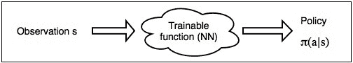

图 1:RL 的高级方法

在实践中，策略通常表示为动作的概率分布，这使得它非常类似于分类问题，类的数量等于我们可以执行的动作的数量。这种抽象使得我们的代理非常简单:它需要将一个观察从环境传递到网络，获得动作的概率分布，并使用概率分布执行随机采样以获得要执行的动作。这种随机抽样给我们的代理增加了随机性，这是一件好事，因为在训练开始时，我们的权重是随机的，代理的行为也是随机的。在代理获得一个要发布的动作后，它向环境触发该动作，并获得下一个观察和对上一个动作的奖励。然后循环继续。

在代理人的一生中，它的经验是作为插曲出现的。每一集都是代理人从环境中获得的一系列观察结果，它发布的行动，以及对这些行动的奖励。想象一下，我们的经纪人演了好几集这样的戏。对于每一集，我们都可以计算代理人要求的总报酬。可以打折，也可以不打折，但为了简单起见，我们假设打折因子 gamma = 1，也就是说只是每集所有本地奖励的总和。这个总报酬显示了《T2》这一集对代理人有多好。让我们用一个图表来说明这一点，它包含四集(注意，不同的集对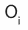、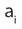和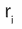有不同的值):

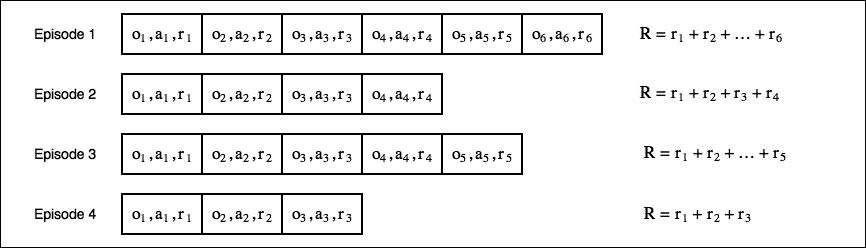

图 2:带有观察、行动和奖励的示例情节

每一个单元格都代表了特工在这一集里的一步。由于环境的随机性和代理人选择采取行动的方式，有些情节会比其他情节更好。交叉熵方法的核心是扔掉不好的剧集，在更好的剧集上训练。因此，该方法的步骤如下:

使用我们当前的模型和环境播放 *N* 集。

1.  计算每集的总奖励，并确定一个奖励范围。通常，我们使用所有奖励的某个百分比，例如第 50 或第 70。
2.  扔掉所有低于界限的有奖励的剧集。
3.  将观察结果作为输入，将发布的行动作为期望的输出，对剩余的“精华”片段进行培训。
4.  从第一步开始重复，直到我们对结果满意为止。
5.  所以，这就是关于交叉熵方法的描述。通过前面的程序，我们的神经网络学习如何重复动作，这导致了更大的奖励，不断地将边界移动得越来越高。尽管这种方法简单，但它在简单的环境中工作得很好，易于实现，并且对超参数变化非常鲁棒，这使它成为一种理想的基线方法。现在让我们将它应用到我们的 CartPole 环境中。

柱子上的交叉熵


# 这个例子的全部代码在`Chapter04/01_cartpole.py`中，但是下面是最重要的部分。我们模型的核心是一个单隐层神经网络，有 ReLU 和 128 个隐藏神经元(这是绝对任意的)。其他超参数也几乎是随机设置的，并且不进行调整，因为该方法是鲁棒的并且收敛非常快。

我们在文件的顶部定义了常数，它们包括隐藏层中神经元的数量，我们在每次迭代中播放的剧集数量(16)，以及我们用于精英剧集过滤的剧集总回报的百分比。我们将采用第 70 个百分位数，这意味着我们将把前 30%的剧集按奖励排序:

```
HIDDEN_SIZE = 128
BATCH_SIZE = 16
PERCENTILE = 70
```

我们的网络没有什么特别的；它将来自环境的单个观察作为输入向量，并为我们可以执行的每个动作输出一个数字。网络的输出是动作的概率分布，因此一种简单的方法是在最后一层之后加入 softmax 非线性。然而，在前面的网络中，我们没有应用 softmax 来增加训练过程的数值稳定性。我们将使用 PyTorch 类`nn.CrossEntropyLoss`，它将 softmax 和交叉熵结合在一个更稳定的表达式中，而不是先计算 softmax(使用取幂运算)然后计算交叉熵损失(使用概率的对数)。`CrossEntropyLoss`需要来自网络的原始的、非标准化的值(也称为 logits ),这样做的缺点是，每次我们需要从网络输出中获取概率时，我们都需要记住应用 softmax。

```
class Net(nn.Module):
    def __init__(self, obs_size, hidden_size, n_actions):
        super(Net, self).__init__()
        self.net = nn.Sequential(
            nn.Linear(obs_size, hidden_size),
            nn.ReLU(),
            nn.Linear(hidden_size, n_actions)
        )

    def forward(self, x):
        return self.net(x)
```

这里我们将定义两个助手类，它们被命名为来自标准库中`collections`包的元组:

```
Episode = namedtuple('Episode', field_names=['reward', 'steps'])
EpisodeStep = namedtuple('EpisodeStep', field_names=['observation', 'action'])
```

`EpisodeStep`:这将用于表示我们的代理在该集中执行的单个步骤，它存储了对环境的观察和代理完成的操作。我们将使用精英剧集中的剧集步骤作为训练数据。

*   `Episode`:存储为总未打折奖励和`EpisodeStep`集合的单集。
*   让我们来看一个生成包含剧集的批处理的函数:

前面的函数接受环境(Gym 库中的`Env`类实例)、我们的神经网络，以及它应该在每次迭代中生成的剧集数。`batch`变量将用于累积我们的批处理(这是一个`Episode`实例的列表)。我们还为当前剧集及其步骤列表声明了一个奖励计数器(`EpisodeStep`对象)。然后，我们重置我们的环境以获得第一个观察结果，并创建一个 softmax 层，它将用于将网络的输出转换为行动的概率分布。我们的准备工作到此为止；因此，我们准备开始环境循环:

```
def iterate_batches(env, net, batch_size):
    batch = []
    episode_reward = 0.0
    episode_steps = []
    obs = env.reset()
    sm = nn.Softmax(dim=1)
```

在每一次迭代中，我们将当前的观察结果转换为 PyTorch 张量，并将其传递给网络以获得行动概率。这里有几点需要注意:

```
    while True:
        obs_v = torch.FloatTensor([obs])
        act_probs_v = sm(net(obs_v))
        act_probs = act_probs_v.data.numpy()[0]
```

PyTorch 中的所有`nn.Module`实例都需要一批数据项，我们的网络也是如此，因此我们将观察值(CartPole 中的四个数字的向量)转换为大小为 1 × 4 的张量(为了实现这一点，我们在单元素列表中传递一个观察值)。

*   由于我们没有在网络输出中使用非线性，它输出原始动作得分，我们需要通过 softmax 函数输入这些得分。
*   我们的网络和 softmax 层都返回跟踪梯度的张量，因此我们需要通过访问`tensor.data`字段，然后将张量转换为 NumPy 数组来解包。该数组将具有与输入相同的二维结构，批次维度在轴 0 上，因此我们需要获取第一个批次元素以获得动作概率的一维向量:

    ```
            action = np.random.choice(len(act_probs), p=act_probs)         next_obs, reward, is_done, _ = env.step(action)
    ```

*   现在我们有了动作的概率分布，我们可以通过使用 NumPy 函数`random.choice()`对这个分布进行采样，使用这个分布来获得当前步骤的实际动作。在此之后，我们将把这个动作传递给环境，以获得我们的下一次观察、我们的奖励以及剧集结束的指示:

奖励被添加到当前集的总奖励中，我们的集步骤列表也增加了一个(观察、动作)对。注意，我们保存了用于选择动作的观察，而不是由环境作为动作的结果返回的观察。这些是你需要记住的微小但重要的细节。

```
        episode_reward += reward
        episode_steps.append(EpisodeStep(observation=obs, action=action))
```

这就是我们在当前一集结束时处理这种情况的方式(在掷骰子的情况下，尽管我们做了努力，但当棍子落下时，这一集就结束了)。我们将最终完成的剧集添加到批处理中，保存总奖励(因为剧集已经完成，我们已经累积了所有奖励)和我们已经采取的步骤。然后，我们重置总奖励累计器，并清除步骤列表。之后，我们重置环境，重新开始。

```
        if is_done:
            batch.append(Episode(reward=episode_reward, steps=episode_steps))
            episode_reward = 0.0
            episode_steps = []
            next_obs = env.reset()
            if len(batch) == batch_size:
                yield batch
                batch = []
```

如果我们的批处理达到了期望的剧集数，我们使用`yield`将它返回给调用者进行处理。我们的函数是一个生成器，所以每次执行`yield`操作符时，控制被转移到外部迭代循环，然后在`yield`行之后继续。如果您不熟悉 Python 的生成器函数，请参考 Python 文档。处理后，我们将清理该批次:

循环的最后一步，也是非常重要的一步，是将从环境中获得的一个观察值赋给我们当前的观察变量。之后一切无限重复:我们把观察传到网上，采样要执行的动作，要求环境处理动作，记住这个处理的结果。

```
        obs = next_obs
```

在这个功能逻辑中需要理解的一个非常重要的事实是，我们网络的训练和我们剧集的生成是在同时*执行的。它们不是完全并行的，但是每当我们的循环积累了足够多的片段(16)时，它就将控制传递给这个函数调用者，这个函数调用者应该使用梯度下降来训练网络。因此，当返回`yield`时，网络将有不同的、稍微好一点的(我们希望)行为。*

我们不需要探索适当的同步，因为我们的训练和数据收集活动是在同一个执行线程中进行的，但是您需要理解那些从网络训练到其利用的不断跳跃。

好了，现在我们需要定义另一个函数，我们将准备好切换到训练循环:

这个函数是交叉熵方法的核心:根据给定的一批剧集和百分位值，它计算一个边界奖励，用于筛选精英剧集进行训练。为了获得边界奖励，我们使用 NumPy 的 percentile 函数，它从值列表和所需的百分位中计算百分位的值。然后我们会计算均值奖励，只用于监控。

```
def filter_batch(batch, percentile):
    rewards = list(map(lambda s: s.reward, batch))
    reward_bound = np.percentile(rewards, percentile)
    reward_mean = float(np.mean(rewards))
```

接下来，我们将过滤掉我们的剧集。对于该批次中的每一集，我们将检查该集的总回报是否高于我们的界限，如果是，我们将填充我们将训练的观察和行动列表。

```
    train_obs = []
    train_act = []
    for example in batch:
        if example.reward < reward_bound:
            continue
        train_obs.extend(map(lambda step: step.observation, example.steps))
        train_act.extend(map(lambda step: step.action, example.steps))
```

作为函数的最后一步，我们将把我们的观察和行动从精英剧集转换成张量，并返回一个四元组:观察、行动、奖励的边界和平均奖励。最后两个值将仅用于将它们写入 TensorBoard，以检查我们代理的性能。

```
    train_obs_v = torch.FloatTensor(train_obs)
    train_act_v = torch.LongTensor(train_act)
    return train_obs_v, train_act_v, reward_bound, reward_mean
```

现在，将所有内容粘合在一起的最后一段代码主要由训练循环组成，如下所示:

一开始，我们将创建所有需要的对象:环境、我们的神经网络、目标函数、优化器和 TensorBoard 的摘要编写器。注释行创建一个监视器来记录您的代理的表现视频。

```

if __name__ == "__main__":
    env = gym.make("CartPole-v0")
    # env = gym.wrappers.Monitor(env, directory="mon", force=True)
    obs_size = env.observation_space.shape[0]
    n_actions = env.action_space.n

    net = Net(obs_size, HIDDEN_SIZE, n_actions)
    objective = nn.CrossEntropyLoss()
    optimizer = optim.Adam(params=net.parameters(), lr=0.01)
    writer = SummaryWriter()
```

在训练循环中，我们将迭代我们的批处理(这是一个`Episode`对象的列表)，然后我们使用`filter_batch`函数执行精英剧集的过滤。结果是观察和采取行动的变量、用于过滤的奖励边界和平均奖励。之后，我们将网络的梯度归零，并将观察结果传递给网络，从而获得其动作得分。这些分数被传递给目标函数，该函数计算网络输出和代理采取的动作之间的交叉熵。这样做的目的是为了加强我们的网络来执行那些“精英”行动，这些行动已经带来了很好的回报。然后，我们将计算损耗的梯度，并要求优化器调整我们的网络。

```
    for iter_no, batch in enumerate(iterate_batches(env, net, BATCH_SIZE)):
        obs_v, acts_v, reward_b, reward_m = filter_batch(batch, PERCENTILE)
        optimizer.zero_grad()
        action_scores_v = net(obs_v)
        loss_v = objective(action_scores_v, acts_v)
        loss_v.backward()
        optimizer.step()
```

循环的其余部分主要是进度监控。在控制台上，我们显示迭代次数、损失、批次的平均回报和回报边界。我们还将相同的值写入 TensorBoard，以获得代理学习表现的漂亮图表。

```
        print("%d: loss=%.3f, reward_mean=%.1f, reward_bound=%.1f" % (
            iter_no, loss_v.item(), reward_m, reward_b))
        writer.add_scalar("loss", loss_v.item(), iter_no)
        writer.add_scalar("reward_bound", reward_b, iter_no)
        writer.add_scalar("reward_mean", reward_m, iter_no)
```

循环中的最后一个检查是我们的批量剧集的平均奖励的比较。当这变得大于`199`时，我们停止我们的训练。为什么是`199`？在 Gym 中，当最后 100 集的平均奖励大于 195 时，认为解决了 CartPole 环境，但我们的方法收敛得如此之快，以至于 100 集通常是我们需要的。经过适当培训的代理可以无限长地平衡棍子(获得任何数量的分数)，但 CartPole 中的剧集长度被限制在 200 步(如果您查看 CartPole 的环境变量，您可能会注意到`TimeLimit`包装器，它在 200 步后停止剧集)。考虑到这一点，我们将在批次中的平均奖励大于`199`后停止训练，这很好地表明我们的代理人作为专业人士知道如何平衡大棒。

```
        if reward_m > 199:
            print("Solved!")
            break
    writer.close()
```

就是这样。所以让我们开始第一次 RL 训练吧！

代理解决环境一般不超过 50 批。我的实验显示了 25 到 45 集的内容，这是一个非常好的学习表现(记住，我们只需要每批播放 16 集)。TensorBoard 显示我们的代理一直在进步，几乎每一批都达到了上限(有一些下降的时期，但大多数时间都有所改善)。

```
rl_book_samples/Chapter04$ ./01_cartpole.py
[2017-10-04 12:44:39,319] Making new env: CartPole-v0
0: loss=0.701, reward_mean=18.0, reward_bound=21.0
1: loss=0.682, reward_mean=22.6, reward_bound=23.5
2: loss=0.688, reward_mean=23.6, reward_bound=25.5
3: loss=0.675, reward_mean=22.8, reward_bound=22.0
4: loss=0.658, reward_mean=31.9, reward_bound=34.0
.........
36: loss=0.527, reward_mean=135.9, reward_bound=168.5
37: loss=0.527, reward_mean=147.4, reward_bound=160.5
38: loss=0.528, reward_mean=179.8, reward_bound=200.0
39: loss=0.530, reward_mean=178.7, reward_bound=200.0
40: loss=0.532, reward_mean=192.1, reward_bound=200.0
41: loss=0.523, reward_mean=196.8, reward_bound=200.0
42: loss=0.540, reward_mean=200.0, reward_bound=200.0
Solved!
```

图 3:培训期间的损失、回报界限和回报

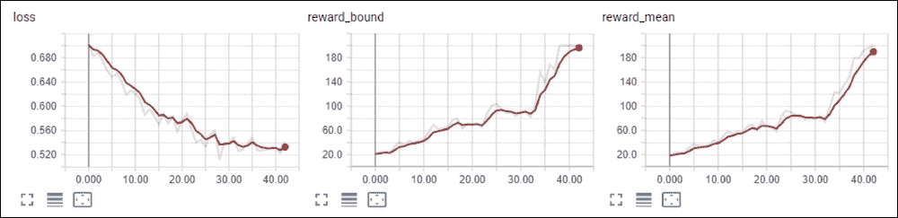

Figure 3: Loss, reward boundary, and reward during the training

为了检查我们的代理的运行情况，您可以在环境创建后通过取消注释下一行来启用`Monitor`。重启后(可能用`xvfb-run`提供虚拟 X11 显示)，我们的程序将创建一个`mon`目录，其中包含在不同训练步骤录制的视频:

正如你从输出中看到的，它将代理活动的定期记录转换成单独的视频文件，这可以让你了解你的代理的会话是什么样子的。

```
rl_book_samples/Chapter04$ xvfb-run -s "-screen 0 640x480x24" ./01_cartpole.py
[2017-10-04 13:52:23,806] Making new env: CartPole-v0
[2017-10-04 13:52:23,814] Creating monitor directory mon
[2017-10-04 13:52:23,920] Starting new video recorder writing to mon/openaigym.video.0.4430.video000000.mp4
[2017-10-04 13:52:25,229] Starting new video recorder writing to mon/openaigym.video.0.4430.video000001.mp4
[2017-10-04 13:52:25,771] Starting new video recorder writing to mon/openaigym.video.0.4430.video000008.mp4
0: loss=0.682, reward_mean=18.9, reward_bound=20.5
[2017-10-04 13:52:26,297] Starting new video recorder writing to mon/openaigym.video.0.4430.video000027.mp4
1: loss=0.687, reward_mean=16.6, reward_bound=19.0
2: loss=0.677, reward_mean=21.1, reward_bound=21.0
[2017-10-04 13:52:26,964] Starting new video recorder writing to mon/openaigym.video.0.4430.video000064.mp4
3: loss=0.653, reward_mean=33.2, reward_bound=48.5
4: loss=0.642, reward_mean=37.4, reward_bound=42.5
.........
29: loss=0.561, reward_mean=111.6, reward_bound=122.0
30: loss=0.540, reward_mean=135.1, reward_bound=166.0
[2017-10-04 13:52:40,176] Starting new video recorder writing to mon/openaigym.video.0.4430.video000512.mp4
31: loss=0.546, reward_mean=147.5, reward_bound=179.5
32: loss=0.559, reward_mean=140.0, reward_bound=171.5
33: loss=0.558, reward_mean=160.4, reward_bound=200.0
34: loss=0.547, reward_mean=167.6, reward_bound=195.5
35: loss=0.550, reward_mean=179.5, reward_bound=200.0
36: loss=0.563, reward_mean=173.9, reward_bound=200.0
37: loss=0.542, reward_mean=162.9, reward_bound=200.0
38: loss=0.552, reward_mean=159.1, reward_bound=200.0
39: loss=0.548, reward_mean=189.6, reward_bound=200.0
40: loss=0.546, reward_mean=191.1, reward_bound=200.0
41: loss=0.548, reward_mean=199.1, reward_bound=200.0
Solved!
```

图 4:墨盒状态的可视化

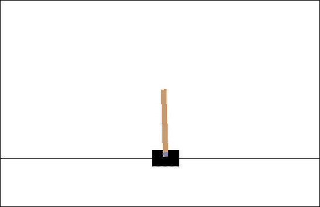

Figure 4: Visualization of the CartPole state

现在让我们暂停一下，想想刚刚发生了什么。我们的神经网络已经学会了如何纯粹通过观察和奖励来玩环境，而不需要对观察到的值进行任何一个词的解释。环境可以很容易地不是一辆带棍子的手推车，而是，比如说，一个仓库模型，以产品数量作为观察，以赚到的钱作为奖励。我们的实现不依赖于环境细节。这就是 RL 模型的美妙之处，在下一节中，我们将看看如何将完全相同的方法应用于不同的环境，而不是Gym集合。

冰湖上的交叉熵


# 我们将尝试使用交叉熵方法解决的下一个环境是 FrozenLake。它的世界来自所谓的“网格世界”类别，当你的代理人生活在一个大小为 4 × 4 的网格中，可以向四个方向移动:上、下、左、右。代理总是从左上角开始，它的目标是到达网格的右下角。网格的固定单元格中有洞，如果你进入这些洞，这一集就结束了，你的奖励为零。如果代理到达目的地单元，则它获得奖励 1.0，并且该集结束。

让生活变得更复杂的是，这个世界很滑(毕竟这是一个冰冻的湖)，所以代理人的行动并不总是如预期的那样:有 33%的机会它会滑向右边或左边。例如，您希望代理向左移动，但是有 33%的可能性它确实会向左移动，有 33%的可能性它会出现在上面的单元格中，有 33%的可能性它会出现在下面的单元格中。正如我们将在本节末尾看到的，这使得进展变得困难。

图 5:冰冻湖环境

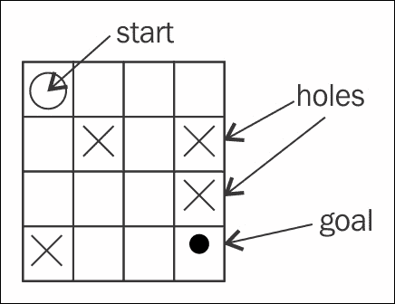

Figure 5: The FrozenLake environment

让我们看看这种环境是如何在 Gym 中表现出来的:

我们的观察空间是离散的，这意味着它只是一个从 0 到 15 的数字。显然，这个数字是我们在网格中的当前位置。动作空间也是离散的，但是可以从零到三。在 CartPole 示例中，我们的网络需要一个数字向量。为了实现这一点，我们可以对离散输入应用传统的“一键编码”,这意味着网络的输入将有 16 个浮点数，除了我们要编码的索引之外，其他地方都是零。为了最小化代码中的变化，我们可以使用 Gym 中的`ObservationWrapper`类并实现我们的`DiscreteOneHotWrapper`类:

```
>>> e = gym.make("FrozenLake-v0")
[2017-10-05 12:39:35,827] Making new env: FrozenLake-v0
>>> e.observation_space
Discrete(16)
>>> e.action_space
Discrete(4)
>>> e.reset()
0
>>> e.render()

SFFF
FHFH
FFFH
HFFG
```

有了应用于环境的包装器，观察空间和动作空间都与我们的 CartPole 解决方案 100%兼容(源代码`Chapter04/02_frozenlake_naive.py`)。然而，通过启动它，我们可以看到，随着时间的推移，这并没有提高分数。

```
class DiscreteOneHotWrapper(gym.ObservationWrapper):
    def __init__(self, env):
        super(DiscreteOneHotWrapper, self).__init__(env)
        assert isinstance(env.observation_space, gym.spaces.Discrete)
        self.observation_space = gym.spaces.Box(0.0, 1.0, (env.observation_space.n, ), dtype=np.float32)

    def observation(self, observation):
        res = np.copy(self.observation_space.low)
        res[observation] = 1.0
        return res
```

图 6:在 FrozenLake 环境中，原始交叉熵编码缺乏收敛性

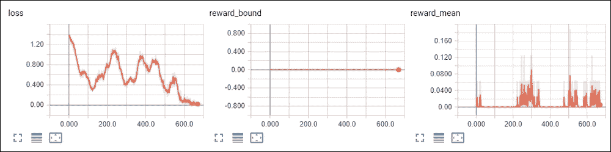

Figure 6: Lack of convergence of the original cross-entropy code in the FrozenLake environment

为了理解发生了什么，我们需要更深入地了解两种环境下的奖励结构。在 CartPole 中，环境的每一步都给我们 1.0 的回报，直到杆子落下的那一刻。所以，代理人平衡杆子的时间越长，获得的奖励就越多。由于我们代理人行为的随机性，不同的剧集长度不同，这给了我们一个非常正常的剧集奖励分布。在选择了奖励边界后，我们拒绝了不太成功的剧集，并学习了如何重复更好的剧集(通过对成功剧集的数据进行训练)。

如下图所示:

图 7:在横竿环境中奖励的分布

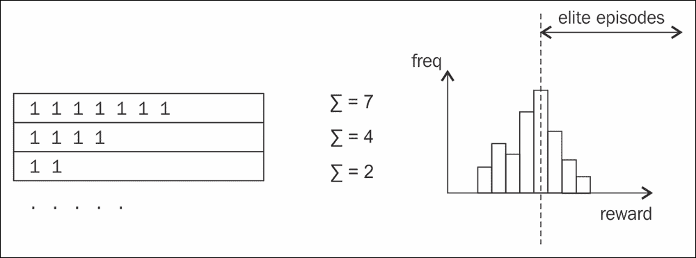

Figure 7: Distribution of reward in the CartPole environment

在 FrozenLake 环境中，剧集和它们的奖励看起来是不同的。只有当我们达到目标时，我们才能获得 1.0 的奖励，这个奖励并不能说明每集有多好。是快速有效还是我们在随机进入最后一个牢房之前在湖上转了四圈？我们不知道，只是 1.0 奖励仅此而已。我们剧集的奖励分配也有问题。只有两种插曲可能，零奖励(失败)和一奖励(成功)，失败的插曲在训练的开始阶段会明显占优势。所以，我们对“精英”剧集的百分位数选择是完全错误的，给了我们糟糕的训练范例。这就是我们训练失败的原因。

图 FrozenLake 环境的奖励分布

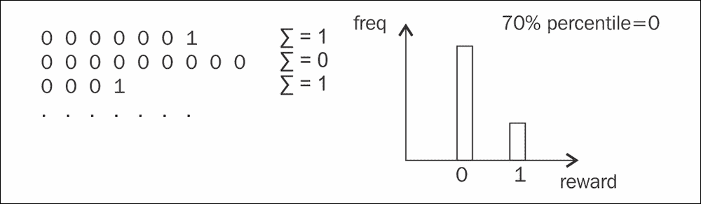

Figure 8: Reward distribution of the FrozenLake environment

这个例子向我们展示了交叉熵方法的局限性:

为了训练，我们的剧集必须是有限的，最好是短的

*   剧集的总报酬应该有足够的可变性来区分好的和坏的剧集
*   没有关于代理是成功还是失败的中间指示
*   在本书的后面，我们将熟悉解决这些限制的其他方法。现在，如果你对如何使用交叉熵解决 FrozenLake 感到好奇，这里有一个你需要做的代码调整列表(完整的例子在`Chapter04/03_frozenlake_tweaked.py`):

**更大批量的播放剧集**:在 CartPole 中，每次迭代 16 集就足够了，但 FrozenLake 需要至少 100 集才能获得一些成功的剧集。

*   **应用于奖励**的折扣系数:为了使剧集的总奖励取决于剧集长度，并增加剧集的多样性，我们可以使用折扣系数为 0.9 或 0.95 的折扣总奖励。在这种情况下，较短剧集的奖励会高于较长剧集的奖励。
*   **更长时间保留“精英”剧集**:在翻筋斗训练中，我们从环境中取样剧集，在最好的剧集上进行训练，然后扔掉。在 FrozenLake 中，成功的一集是非常罕见的动物，所以我们需要保留它们几个迭代来训练它们。
*   **降低学习率**:这将给我们的网络时间平均更多的训练样本。
*   **更长的训练时间**:由于成功情节的稀少，以及我们行动的随机结果，我们的网络很难获得在任何特定情况下最佳行为的想法。为了达到 50%的成功剧集，需要大约 5k 的训练迭代。
*   为了将所有这些整合到我们的代码中，我们需要更改`filter_batch`函数来计算折扣奖励并返回“精英”剧集供我们保留:

然后，在训练循环中，我们将存储以前的“精英”剧集，以便在下一次训练迭代中将它们传递给前面的函数。

```
def filter_batch(batch, percentile):
    disc_rewards = list(map(lambda s: s.reward * (GAMMA ** len(s.steps)), batch))
    reward_bound = np.percentile(disc_rewards, percentile)
    train_obs = []
    train_act = []
    elite_batch = []
    for example, discounted_reward in zip(batch, disc_rewards):
        if discounted_reward > reward_bound:
            train_obs.extend(map(lambda step: step.observation, example.steps))
            train_act.extend(map(lambda step: step.action, example.steps))
            elite_batch.append(example)
    return elite_batch, train_obs, train_act, reward_bound
```

代码的其余部分是相同的，除了学习率降低了 10 倍，并且`BATCH_SIZE`被设置为 100。经过一段时间的耐心等待(新版本大约需要一个半小时来完成 10k 次迭代)，我们可以看到模型的训练在 55%左右的已解决剧集中停止了改进。有很多方法可以解决这个问题(例如，通过应用熵损失正则化)，但是这些技术将在接下来的章节中讨论。

```
full_batch = []
for iter_no, batch in enumerate(iterate_batches(env, net, BATCH_SIZE)):
    reward_mean = float(np.mean(list(map(lambda s: s.reward, batch))))
    full_batch, obs, acts, reward_bound = filter_batch(full_batch + batch, PERCENTILE)
    if not full_batch:
        continue
    obs_v = torch.FloatTensor(obs)
    acts_v = torch.LongTensor(acts)
    full_batch = full_batch[-500:]
```

图 9:使用调整的交叉熵实现的 FrozenLake 的收敛

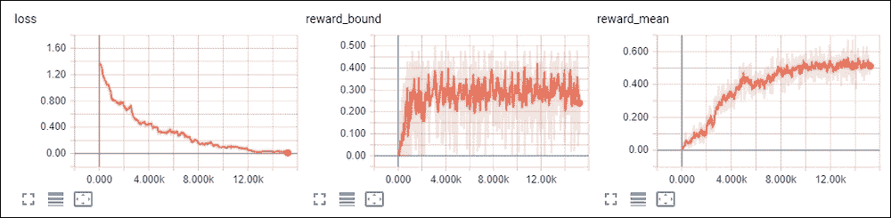

Figure 9: Convergence of FrozenLake with tweaked cross-entropy implementation

这里要注意的最后一点是 FrozenLake 环境中“光滑”的影响。我们每一个有 33%概率的动作都被旋转了 90°的动作所取代(例如，“向上”动作成功的概率为 0.33，被“向左”动作取代的概率为 0.33，被“向右”动作取代的概率为 0.33)。

无滑动版本在`Chapter04/04_frozenlake_nonslippery.py`中，唯一的不同是在环境创建中(我们需要窥视 Gym 的核心来创建带有调整参数的环境实例):

效果很戏剧化！环境的非光滑版本可以在 120-140 次批量迭代中求解，这比噪声环境快 100 倍:

```
    env = gym.envs.toy_text.frozen_lake.FrozenLakeEnv(is_slippery=False)
    env = gym.wrappers.TimeLimit(env, max_episode_steps=100)env = DiscreteOneHotWrapper(env)
```

图 10:frozen lake 的非滑动版本的收敛

```
rl_book_samples/Chapter04$ ./04_frozenlake_nonslippery.py
0: loss=1.379, reward_mean=0.010, reward_bound=0.000, batch=1
1: loss=1.375, reward_mean=0.010, reward_bound=0.000, batch=2
2: loss=1.359, reward_mean=0.010, reward_bound=0.000, batch=3
3: loss=1.361, reward_mean=0.010, reward_bound=0.000, batch=4
4: loss=1.355, reward_mean=0.000, reward_bound=0.000, batch=4
5: loss=1.342, reward_mean=0.010, reward_bound=0.000, batch=5
6: loss=1.353, reward_mean=0.020, reward_bound=0.000, batch=7
7: loss=1.351, reward_mean=0.040, reward_bound=0.000, batch=11
......
124: loss=0.484, reward_mean=0.680, reward_bound=0.000, batch=68
125: loss=0.373, reward_mean=0.710, reward_bound=0.430, batch=114
126: loss=0.305, reward_mean=0.690, reward_bound=0.478, batch=133
128: loss=0.413, reward_mean=0.790, reward_bound=0.478, batch=73
129: loss=0.297, reward_mean=0.810, reward_bound=0.478, batch=108
Solved!
```

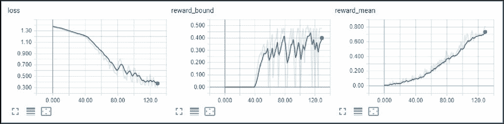

Figure 10: Convergence of the nonslippery version of FrozenLake

交叉熵方法的理论背景


# 这一部分是可选的，包含在中是为了让那些对这种方法的工作原理感兴趣的读者。如果你愿意，你可以参考关于交叉熵的原始论文，它将在本节的最后给出。

交叉熵方法的基础在于重要抽样定理，该定理陈述如下:

The basis of the cross-entropy method lies in the importance sampling theorem, which states this:

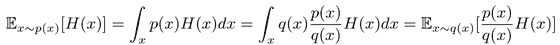

在我们的 RL 例子中， *H(x)* 是某个策略 *x* 得到的奖励值， *p(x)* 是所有可能策略的分布。我们不想通过搜索所有可能的策略来最大化我们的回报，相反，我们想找到一种方法来用 *q(x)* 近似 *p(x)H(x)* ，迭代地最小化它们之间的距离。两个概率分布之间的距离通过**kull back-lei bler**(**KL**)散度计算，如下:

In our RL case, *H(x)* is a reward value obtained by some policy *x* and *p(x)* is a distribution of all possible policies. We don't want to maximize our reward by searching all possible policies, instead we want to find a way to approximate *p(x)H(x)* by *q(x)*, iteratively minimizing the distance between them. The distance between two probability distributions is calculated by **Kullback-Leibler** (**KL**) divergence which is as follows:

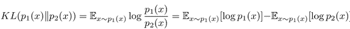

KL 中的第一项称为**熵**而不依赖于此，因此在最小化过程中可以省略。第二项称为**交叉熵**，是 DL 中非常常见的优化目标。

结合这两个公式，我们可以得到一个迭代算法，从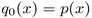开始，每一步都在改进。这是一个对 *p(x)H(x)* 的近似，但有一个更新:

Combining both formulas, we can get an iterative algorithm, which starts with  and on every step improves. This is an approximation of *p(x)H(x)* with an update:

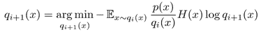

这是一种通用的交叉熵方法，在我们的 RL 案例中可以大大简化。首先我们把我们的 *H(x)* 换成一个指标函数，当该集的奖励在阈值以上时为 1，奖励在阈值以下时为 0。我们的策略更新将如下所示:

This is a generic cross-entropy method, which can be significantly simplified in our RL case. Firstly, we replace our *H(x)* with an indicator function, which is 1 when the reward for the episode is above the threshold and 0 if the reward is below. Our policy update will look like this:

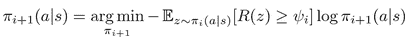

严格地说，前面的公式忽略了规范化项，但在实践中没有规范化项仍然有效。因此，方法很清楚:我们使用我们当前的策略(从一些随机的初始策略开始)对情节进行采样，并最小化最成功的样本和我们的策略的负对数可能性。

有一整本书专门讲这个方法，作者是 *Dirk P. Kroese* 。更简短的描述可以在*德克·P·克罗斯*([https://people.smp.uq.edu.au/DirkKroese/ps/eormsCE.pdf](https://people.smp.uq.edu.au/DirkKroese/ps/eormsCE.pdf))的*交叉熵方法*论文中找到。

总结


# 在这一章中，我们熟悉了第一个 RL 方法交叉熵，它很简单，但是非常强大，尽管有它的局限性。我们将它应用于 CartPole 环境(取得了巨大的成功)和 FrozenLake(取得了较小的成功)。这一章结束了这本书的介绍部分。

在接下来的章节中，我们将探索更复杂，但更强大的深度强化工具。

In the upcoming chapters, we will explore more complex, but more powerful tools of deep RL.