<title>Chapter 5. Tabular Learning and the Bellman Equation</title>  

# 第五章。表格学习和贝尔曼方程

上一章我们熟悉了我们的第一个**强化学习** ( **RL** )方法，交叉熵，看到了它的优缺点。在这本书的新部分，我们将看看另一组方法，称为 Q-learning，它有更多的灵活性和能力。

本章将建立这些方法所需要的背景知识。我们还将再次访问 FrozenLake 环境，并展示新概念如何适应这种环境，并帮助我们解决环境的不确定性问题。

<title>Chapter 5. Tabular Learning and the Bellman Equation</title>  

# 价值、状态和最优性

你可能还记得我们在[第一章](part0012_split_000.html#BE6O2-ce551566b6304db290b61e4d70de52ee "Chapter 1. What is Reinforcement Learning?")、*中对状态的值的定义什么是强化学习？*。这是一个非常重要的概念，现在是进一步探讨的时候了。这本书的整个部分都是围绕着价值以及如何估算价值而展开的。我们将价值定义为可从国家获得的预期总回报。用正式的方式来说，状态的值是: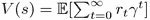，其中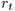是在该集的步骤 *t* 获得的本地奖励。

总报酬可能会打折扣，也可能不会；如何定义，就看我们自己了。价值总是在我们的代理遵循的某些政策方面进行计算。为了说明，让我们考虑一个非常简单的环境，它有三种状态:

1.  代理的初始状态。
2.  代理在执行从初始状态“离开”的操作后所处的最终状态。由此获得的回报是 1。
3.  The final state that the agent is in after action "down". The reward obtained from this is 2: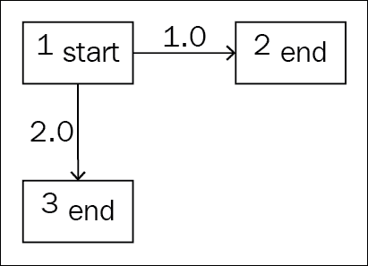

    图 1:一个有奖励的环境状态转换的例子

环境总是确定的:每个动作成功，我们总是从状态 **1** 开始。一旦我们到达状态 **2** 或状态 **3** ，这一集就结束了。现在的问题是，state **1** 的值是多少？如果没有关于我们代理人行为的信息，或者换句话说，没有关于其政策的信息，这个问题是没有意义的。即使在这样一个简单的环境中，我们的代理也可以有无限多的行为，每个行为都有自己的状态值。考虑这个例子:

*   特工总是走左边
*   特工总是倒下
*   代理向左的概率是 0.5，向下的概率是 0.5
*   代理在 10%的情况下向左移动，在 90%的情况下执行“向下”动作

为了演示如何计算值,让我们对前面的所有策略都这样做:

*   在“总是向左”代理的情况下，状态 **1** 的值是 **1.0** (每次向左，它获得 1，并且剧集结束)
*   对于“总是停机”代理，状态 **1** 的值是 **2.0**
*   对于 50%左/50%下代理，该值将为*1.0 * 0.5+2.0 * 0.5 =***1.5**
*   在最后一种情况下，该值将是*1.0 * 0.1+2.0 * 0.9 =***1.9**

现在，另一个问题是:这个代理的最优策略是什么？RL 的目标是获得尽可能多的总报酬。对于这个单步环境，总回报等于状态 **1** 的值，很明显，在策略 2(总是向下)时最大。

不幸的是，这种具有明显最优策略的简单环境在实践中并不那么有趣。对于有趣的环境，最优策略更难制定，更难证明它们的最优性。然而，不要担心，我们正在向能够让计算机自己学习最佳行为的目标迈进。

从前面的例子中，你可能会有一个错误的印象，认为我们应该总是采取奖励最高的行动。总的来说，没那么简单。为了演示这一点，让我们用另一个状态来扩展前面的环境，这个状态可以从状态 **3** 到达。状态 **3** 不再是终结状态，而是过渡到状态 **4** ，坏奖励 **-20** 。一旦我们在状态 **1** 中选择了“向下”动作，这个不好的奖励是不可避免的，因为从状态 **3** 我们只有一个出口。所以，对于认为“贪婪”是一个好策略的代理人来说，这是一个陷阱。

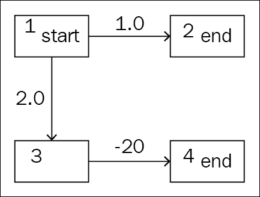

图 2:添加了额外状态的相同环境

加上这些，我们的状态值 **1** 将会这样计算:

*   “永远向左”代理也是一样: **1.0**
*   “始终向下”代理获取:*2.0+(-20)=***-18**
*   “50%/50%代理人”:*0.5 * 1.0+0.5 *(20+(-20))=***-8.5**
*   “10%/90%代理人”:*0.1 * 1.0+0.9 *(2.0+(-20))=***-8**

所以，对于这个新环境来说，最好的策略是第一条:永远向左走。

我们花了一些时间讨论天真和琐碎的环境，以便你认识到这个最优化问题的复杂性，并能更好地欣赏*理查德·贝尔曼*的结果。理查德是美国数学家，他提出并证明了著名的“贝尔曼方程”。我们将在下一节讨论它。

<title>The Bellman equation of optimality</title>  

# 最优的贝尔曼方程

要解释贝尔曼方程，最好抽象一点。不要怕，后面我会提供具体的例子来支持你的直觉！让我们从一个确定性的案例开始，当我们所有的行动都有一个 100%保证的结果。假设我们的代理观察到状态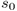并且有 **N** 个可用动作。每一个动作都导致另一个状态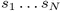，并有相应的奖励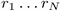。还假设我们知道连接到状态的所有状态的值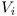。在这种情况下，代理可以采取的最佳行动是什么？

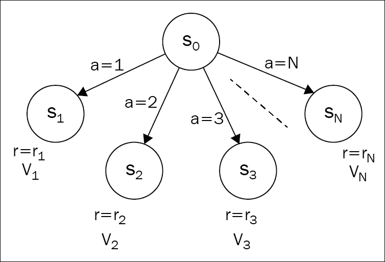

图 3:从初始状态可以到达 N 个状态的抽象环境

如果我们选择具体的动作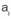，并计算赋予该动作的值，那么该值将为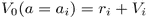。因此，为了选择最佳的可能行动，代理需要计算每个行动的结果值，并选择最大的可能结果。换句话说: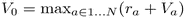。如果我们使用折扣因子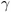，我们需要将下一个状态的值乘以 gamma: 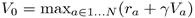。

这可能看起来非常类似于我们上一节中的贪婪的例子，事实上，的确如此。然而，有一点不同:当我们贪婪地行动时，我们不仅仅看行动的即时回报，而是看即时回报加上国家的长期价值。*理查德·贝尔曼*证明了，有了那个扩展，我们的行为会得到最好的可能结果。换句话说，它将是最优的。因此，前面的方程被称为数值的**贝尔曼方程**(对于确定性情况):

当我们的行为有机会以不同的状态结束时，将这个想法扩展到随机情况并不复杂。我们需要做的是计算每个动作的期望值，而不是只取下一个状态的值。为了说明这一点，让我们考虑一个来自状态的单一动作，有三种可能的结果。

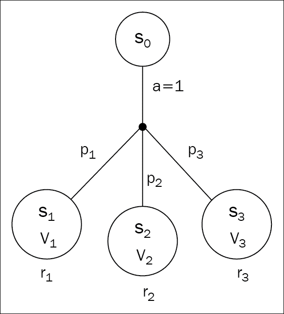

图 4:随机情况下状态转换的一个例子

这里我们有一个动作，它可以导致三种不同概率的不同状态:以概率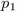它可以结束于状态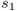、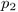状态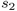和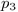状态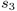(当然是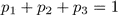)。每个目标状态都有自己的奖励(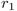、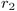或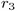)。要计算发出动作 1 后的期望值，我们需要将所有值相加，乘以它们的概率:

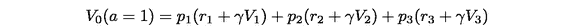

或者更正式地说，

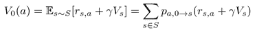

通过将确定性情况下的贝尔曼方程与随机行为值相结合，我们得到了一般情况下的贝尔曼最优方程:

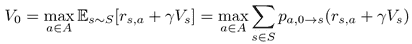

(注意，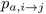表示在状态 *i* 发出的动作 *a* 在状态 *j* 结束的概率。)

解释还是一样的:状态的最优值等于行动，给了我们最大可能的预期即时回报，加上下一个状态的贴现长期回报。您可能还注意到这个定义是递归的:状态的值是通过可立即到达的状态的值来定义的。

这种递归可能看起来像欺骗:我们定义一些值，假装我们已经知道它。然而，这在计算机科学中，甚至在一般的数学中，都是一种非常强大和常见的技术(归纳法的证明是基于同样的技巧)。这个 Bellman 方程不仅是 RL 的基础，也是更一般的动态规划的基础，后者是一种广泛用于解决实际优化问题的方法。

这些值不仅给了我们可以获得的最佳回报，而且它们基本上给了我们获得回报的最佳策略:如果我们的代理知道每个状态的值，那么它就自动知道如何收集所有这些回报。由于贝尔曼的最优性证明，在代理人结束的每个状态下，它需要选择对该行为具有最大期望报酬的行为，该报酬是即时报酬和一步贴现长期报酬的总和。就是这样。因此，了解这些值是非常有用的。在我们熟悉计算它们的实用方法之前，我们需要再介绍一种数学符号。它不像价值那样重要，但是为了我们的方便我们需要它。

<title>Value of action</title>  

# 动作值

为了让我们的生活稍微简单一点，除了状态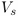的值:动作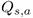的值，我们还可以定义不同的量。基本上，它等于我们在状态 *s* 中执行动作 *a* 所能获得的总奖励，并且可以通过来定义。作为一个比简单得多的实体，这个量给整个方法家族起了个名字叫“Q-learning”，因为它在实践中稍微方便一些。在这些方法中，我们的主要目标是获得每对状态和动作的值。

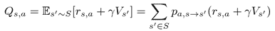

*Q* 对于这种状态 *s* 和行动 *a* 等于目的状态的预期即时报酬和贴现的长期报酬。我们也可以通过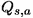来定义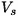:

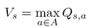

这只是意味着某个状态的值等于我们可以从这个状态执行的最大动作的值。它可能看起来非常接近状态的值，但仍然有区别，理解这一点很重要。最后，我们可以通过 Q(s，a) 本身来表达 *Q(s，a)】，这将在下一章的 Q-learning 主题中使用:*

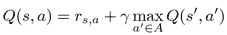

为了给你一个具体的例子，让我们考虑一个类似于 FrozenLake 的环境，但是有一个简单得多的结构:我们有一个初始状态被四个目标状态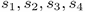包围，有不同的回报。

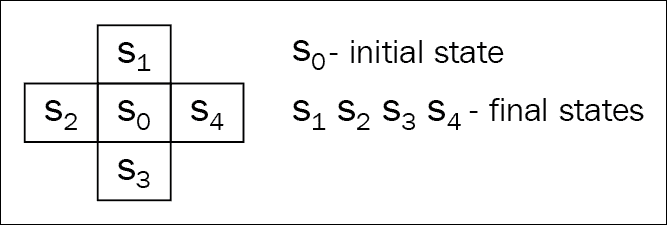

图 5:简化的类似网格的环境

每个动作都是概率性的，就像在 FrozenLake 中一样:有 33%的几率我们的动作会不加修改地执行，但是有 33%的几率我们会滑到目标单元格的左边，有 33%的几率我们会滑到右边。为简单起见，我们使用贴现因子γ= 1。

图 6:网格环境的转换图

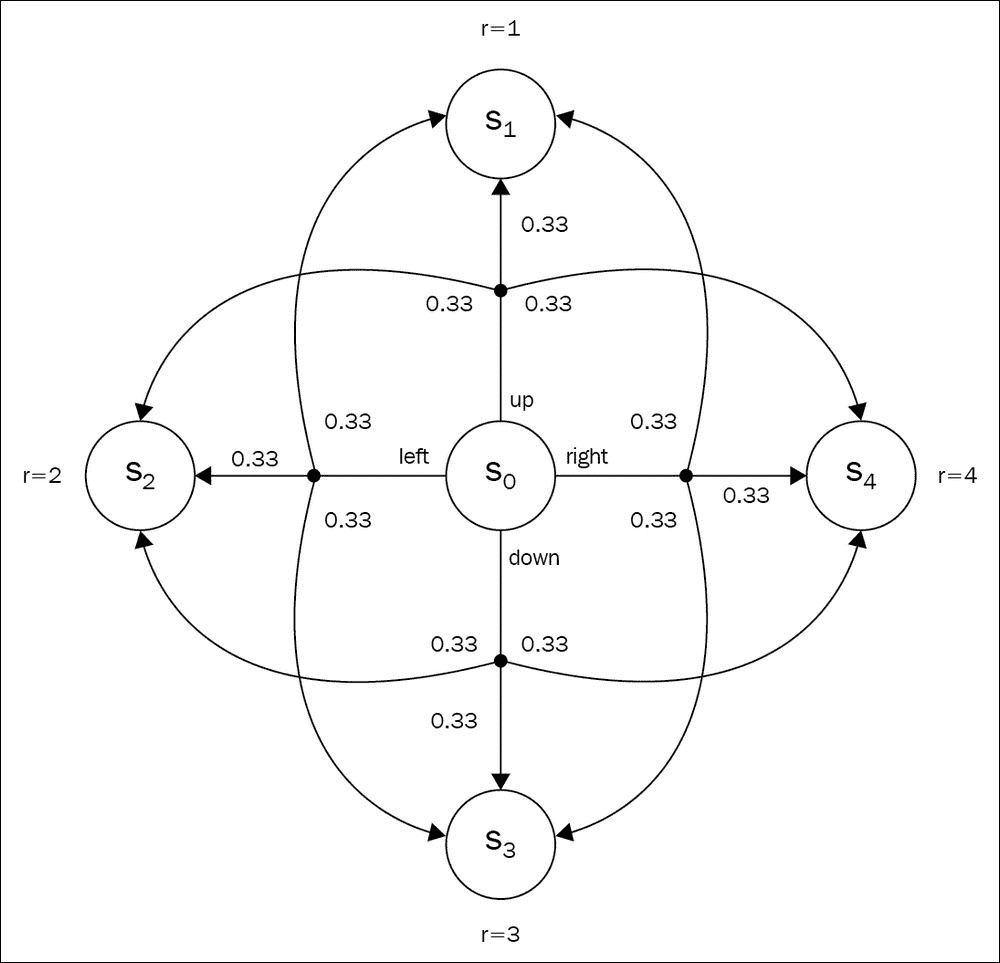

Figure 6: A transition diagram of the grid environment

让我们先计算行动的价值。终端状态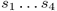没有出站连接，因此这些状态的 Q 对于所有动作都是零。由于这个原因，最终状态的值等于它们的直接回报(一旦我们到达那里，我们的插曲结束，没有任何后续状态):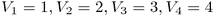。

状态 0 的动作值稍微复杂一些。先说“上”的动作。它的价值，根据定义，等于眼前的回报加上后续步骤的长期价值的预期总和。对于“向上”动作的任何可能的过渡，我们没有后续步骤，所以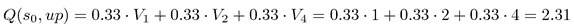。

对其余的动作重复此操作，结果如下:

Repeating this for the rest of  actions results in the following:

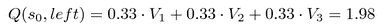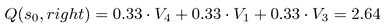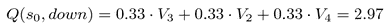

状态的最终值是这些动作值的最大值，即 2.97。

Q 值在实践中要方便得多，因为对于代理来说，基于 Q 比基于 v 做出关于动作的决策要简单得多。在 Q 的情况下，要基于状态选择动作，代理只需要使用当前状态计算所有可用动作的 Q，并选择具有最大 Q 值的动作。要使用状态值做同样的事情，代理不仅需要知道值，还需要知道转移的概率。实际上，我们很少事先知道它们，所以代理需要估计每个动作和状态对的转移概率。在本章的后面，我们将通过两种方式解决 FrozenLake 环境来看到这一点。然而，为了能够做到这一点，我们仍然缺少一个重要的东西:一个计算这些 Vs 和 Qs 的通用方法。

值迭代法

<title>The value iteration method</title>  

# 在我们刚刚看到的简单示例中，为了计算状态和动作的值，我们利用了环境的结构:我们在转换中没有循环，所以我们可以从终端状态开始，计算它们的值，然后继续到中心状态。然而，在我们的方法中，环境中的一个循环就构成了一个障碍。让我们考虑这样一个具有两种状态的环境:

图 7:在转换图中有一个循环的示例环境


我们从状态开始，我们能采取的唯一行动将我们带到状态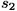。我们得到奖励 **r=1** ，从的唯一过渡是一个动作，这将我们带回到了。因此，我们代理的生命是一个无限的状态序列[ 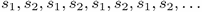 ]。为了处理这个无限循环，我们可以使用折扣因子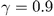。现在的问题是，这两种状态的值是什么？

不过，答案并不复杂。从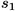到的每一次转换给我们 1 的奖励，每一次返回转换给我们 2 的奖励。所以，我们的奖励顺序将是[1，2，1，2，1，2，1，2，…]。].由于在每个状态中只有一个可用的动作，我们的代理没有选择，所以我们可以在公式中省略 max 运算(只有一个选择)。每个状态的值将等于无穷大的和:

We start from state , and the only action we can take leads us to state . We get reward **r=1**,and the only transition from  is an action, which brings us back to the . So, the life of our agent is an infinite sequence of states []. To deal with this infinity loop, we can use a discount factor . Now, the question is, what are the values for both the states?

The answer is not very complicated, though. Every transition from  to  gives us a reward of 1 and every back transition gives us 2\. So, our sequence of rewards will be [1, 2, 1, 2, 1, 2, 1, 2, ….]. As there is only one action available in every state, our agent has no choice, so we can omit the max operation in formulas (there is only one alternative). The value for every state will be equal to the infinite sum:

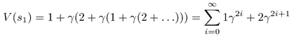

严格地说，我们不能计算我们状态的精确值，但是有了，每一个跃迁的贡献都会随着时间快速减少。例如，在 10 步之后，，但是在 100 步之后，它变成 0.0000266。由于这个原因，我们可以在 50 次迭代后停止，并且仍然得到相当精确的估计。


前面的示例可用于获得更一般程序的要点，称为“价值迭代算法”,它允许我们用已知的转移概率和回报数值计算 MDP 的状态值和行动值。该过程(对于状态值)包括以下步骤:

将所有状态的值初始化为某个初始值(通常为零)

```
>>> sum([0.9**(2*i) + 2*(0.9**(2*i+1)) for i in range(50)])
14.736450674121663
>>> sum([2*(0.9**(2*i)) + 0.9**(2*i+1) for i in range(50)])
15.262752483911719
```

对于 MDP 的每个州 *s* ，执行行李员更新:

1.  对大量步骤重复步骤 2，或者直到变化变得太小
2.  对于动作值(即 Q ),只需对前面的程序稍作修改:
3.  将所有初始化为零

对于每个状态 *s* 和该状态下的每个动作 *a* ，执行更新:

1.  重复步骤 2
2.  好吧，这就是理论。实践呢？实际上，这种方法有几个明显的局限性。首先，我们的状态空间应该是离散的，足够小，可以对所有状态进行多次迭代。这对于 FrozenLake-4x4 甚至 FrozenLake-8x8 来说都不是问题(它作为一个更具挑战性的版本存在于 Gym 中)，但对于 CartPole 来说，还不完全清楚该怎么做。我们对 CartPole 的观察是四个浮点值，它们代表了系统的一些物理特性。这些值中即使很小的差异也会对国家的价值产生影响。一个潜在的解决方案是对我们的观测值进行离散化，例如，我们可以将 CartPole 的观测空间分割成多个箱，并将每个箱视为空间中一个单独的离散状态。然而，这将产生许多实际问题，例如多大的箱间隔以及我们需要多少来自环境的数据来估计我们的值。当我们在 Q-学习中使用神经网络时，我们将在后续章节中解决这个问题。
3.  第二个实际问题是，我们很少知道行动和回报矩阵的转移概率。记住是什么界面给代理的作者提供了锻炼:我们观察状态，决定一个动作，只有这样我们才能得到下一个观察和转换的奖励。我们不知道(不查看 Gym 的环境代码)通过发出动作从状态进入状态的概率是多少。我们所拥有的只是代理与环境交互的历史记录。然而，在贝尔曼的更新中，我们既需要每次跃迁的奖励，也需要这次跃迁的概率。因此，这个问题的明显答案是使用我们代理的经验作为两个未知数的估计。奖励可以照原样使用。我们只需要使用动作 *a* 记住从转换到的奖励，但是为了估计概率，我们需要为每个元组 *(*  *，*  *，*  *)* 维护计数器，并使它们正常化。

好了，现在让我们看看值迭代法将如何为 FrozenLake 工作。

实践中的价值迭代

完整示例在`Chapter05/01_frozenlake_v_learning.py`中。本例中的中心数据结构如下:

<title>Value iteration in practice</title>  

# **奖励表**:组合键为“源状态”+“动作”+“目标状态”的字典。价值是从眼前的奖励中获得的。

**转换表**:保存所经历转换的计数器的字典。关键是复合的“state”+“action ”,值是另一个字典，它将目标状态映射到我们看到它的次数。例如，如果在状态 0 下，我们执行动作 1 十次，三次后它将我们带到状态 4，七次后到状态 5。该表中带有关键字(0，1)的条目将是一个字典`{4: 3, 5: 7}`。我们用这个表来估计跃迁的概率。

*   **值表**:一个字典，将一个状态映射到这个状态的计算值。
*   我们代码的整体逻辑很简单:在循环中，我们从环境中随机播放 100 步，填充奖励和转换表。在这 100 个步骤之后，我们对所有状态执行值迭代循环，更新我们的值表。然后，我们播放几集完整的剧集，使用更新后的值表来检查我们的改进。如果这些测试集的平均回报高于 0.8，那么我们就停止训练。在测试剧集中，我们还会更新奖励和转换表，以使用环境中的所有数据。
*   好吧，让我们来看看代码。开始时，我们导入用过的包并定义常量:

然后我们定义`Agent`类，它将保存我们的表并包含我们将在训练循环中使用的函数:

在`class`构造函数中，我们创建将用于数据样本的环境，获得我们的第一次观察，并定义奖励、转换和值的表。

```
import gym
import collections
from tensorboardX import SummaryWriter

ENV_NAME = "FrozenLake-v0"
GAMMA = 0.9
TEST_EPISODES = 20
```

该函数用于从环境中收集随机经验，并更新奖励和转换表。注意，我们不需要等到一集结束才开始学习；我们只需执行 N 个步骤，并记住它们的结果。这是值迭代和交叉熵的区别之一，交叉熵只能在全集上学习。

```
class Agent:
    def __init__(self):
        self.env = gym.make(ENV_NAME)
        self.state = self.env.reset()
        self.rewards = collections.defaultdict(float)
        self.transits = collections.defaultdict(collections.Counter)
        self.values = collections.defaultdict(float)
```

下一个函数使用我们的转换、奖励和值表从状态中计算动作的值。我们将把它用于两个目的:从状态中选择要执行的最佳动作，以及在值迭代时计算状态的新值。其逻辑如下图所示，我们执行以下操作:

```
    def play_n_random_steps(self, count):
        for _ in range(count):
            action = self.env.action_space.sample()
            new_state, reward, is_done, _ = self.env.step(action)
            self.rewards[(self.state, action, new_state)] = reward
            self.transits[(self.state, action)][new_state] += 1
            self.state = self.env.reset() if is_done else new_state
```

我们从转换表中提取给定状态和动作的转换计数器。该表中的计数器具有 dict 形式，以目标状态为关键字，以经历的转换计数为值。我们对所有的计数器求和，以获得我们从状态执行动作的总次数。我们稍后将使用这个总值从单个计数器到概率。

然后，我们迭代我们的动作已经到达的每个目标状态，并使用贝尔曼方程计算它对总动作值的贡献。这种贡献等于直接奖励加上目标州的贴现值。我们将这个总和乘以这个转移的概率，并将结果加到最终动作值上。

1.  图 8:状态值的计算
2.  在我们的图中，我们有一个计算状态 *s* 和动作 *a* 的值的图示。想象一下，在我们的经历中，我们已经执行了这个动作几次()，并且它以两种状态中的一种结束，或。我们已经切换到这些状态中的每一个的次数存储在我们的转换表中，作为 dict {  : ， :  }。然后，状态和动作 *Q(s，a)* 的近似值将等于每个状态的概率，乘以状态的值。根据贝尔曼方程，这等于即时回报和贴现的长期状态价值之和。


下一个函数使用我们刚刚描述的函数来决定在给定状态下采取的最佳行动。它遍历环境中所有可能的动作，并计算每个动作的值。具有最大值的动作获胜，并作为要采取的动作返回。这个动作选择过程是确定性的，因为`play_n_random_steps()`函数引入了足够的探索。所以，我们的代理人会贪婪地对待我们的价值近似值。

`play_episode`功能使用`select_action`寻找最佳行动，并使用提供的环境播放一整集。该功能用于播放测试剧集，在期间，我们不想弄乱用于收集随机数据的主环境的当前状态。所以，我们使用第二个环境作为参数。逻辑非常简单，您应该已经很熟悉了:我们只需循环状态，累积一集的奖励:

`Agent`类的最后一个方法是我们的值迭代实现，由于前面的函数，它非常简单。我们所做的只是在环境中的所有状态上循环，然后对于每个状态，我们计算从它可达到的状态的值，获得状态值的候选。然后，我们用状态中可用动作的最大值来更新当前状态的值:

```
    def calc_action_value(self, state, action):
        target_counts = self.transits[(state, action)]
        total = sum(target_counts.values())
        action_value = 0.0
        for tgt_state, count in target_counts.items():
            reward = self.rewards[(state, action, tgt_state)]
            action_value += (count / total) * (reward + GAMMA * self.values[tgt_state])
        return action_value
```

这就是我们代理的所有方法，最后一部分是训练循环和代码监控:

```
    def select_action(self, state):
        best_action, best_value = None, None
        for action in range(self.env.action_space.n):
            action_value = self.calc_action_value(state, action)
            if best_value is None or best_value < action_value:
                best_value = action_value
                best_action = action
        return best_action
```

我们为 TensorBoard 创建将用于测试的环境、`Agent`类实例和摘要编写器:

```
    def play_episode(self, env):
        total_reward = 0.0
        state = env.reset()
        while True:
            action = self.select_action(state)
            new_state, reward, is_done, _ = env.step(action)
            self.rewards[(state, action, new_state)] = reward
            self.transits[(state, action)][new_state] += 1
            total_reward += reward
            if is_done:
                break
            state = new_state
        return total_reward
```

前面代码片段中的两行是训练循环中的关键部分。首先，我们执行 100 个随机步骤，用新数据填充奖励和转移表，然后我们对所有状态运行值迭代。其余代码使用值表作为我们的策略播放测试集，然后将数据写入 TensorBoard，跟踪最佳平均奖励，并检查训练循环停止条件。

```
    def value_iteration(self):
        for state in range(self.env.observation_space.n):
            state_values = [self.calc_action_value(state, action)
                            for action in range(self.env.action_space.n)]
            self.values[state] = max(state_values)
```

好，让我们运行我们的程序:

```
if __name__ == "__main__":
    test_env = gym.make(ENV_NAME)
    agent = Agent()
    writer = SummaryWriter(comment="-v-learning")
```

我们的解决方案是随机的，我的实验通常需要 12 到 100 次迭代才能得出一个解决方案，但在所有情况下，找到一个可以在 80%的运行中解决环境问题的好策略只需要不到一秒钟。如果您记得使用交叉熵获得 60%的成功率需要多少个小时，那么您可以理解这是一个重大的改进。这有几个原因。

```
    iter_no = 0
    best_reward = 0.0
    while True:
        iter_no += 1
        agent.play_n_random_steps(100)
        agent.value_iteration()
```

首先，我们行动的随机结果，加上情节的长度(平均 6-10 步)，使得交叉熵方法很难理解在情节中什么是正确的，哪一步是错误的。值迭代处理状态(或动作)的单个值，并通过估计概率和计算期望值，自然地结合动作的概率结果。因此，值迭代要简单得多，需要的环境数据也少得多(RL 中称为**采样效率**)。

```
        reward = 0.0
        for _ in range(TEST_EPISODES):
            reward += agent.play_episode(test_env)
        reward /= TEST_EPISODES
        writer.add_scalar("reward", reward, iter_no)
        if reward > best_reward:
            print("Best reward updated %.3f -> %.3f" % (best_reward, reward))
            best_reward = reward
        if reward > 0.80:
            print("Solved in %d iterations!" % iter_no)
            break
    writer.close()
```

第二个原因是价值迭代不需要全集就可以开始学习。在一个极端的例子中，我们可以从一个例子开始更新我们的值。然而，对于 FrozenLake 来说，由于奖励结构(我们只有在成功达到目标状态后才能获得 1)，我们仍然需要至少有一集成功才能开始从有用的值表中学习，这在更复杂的环境中可能很难实现。例如，您可以尝试将现有代码切换到更大版本的 FrozenLake，其名称为 **FrozenLake8x8-v0** 。更大版本的 FrozenLake 可能需要 50 到 400 次迭代才能解决，根据 TensorBoard 图表，大多数时间它会等待第一个成功的剧集，然后非常快地达到收敛。下面是一个有两条线的图表。橙色对应的是 **FrozenLake-v0 (4x4)** 训练时的奖励，蓝色是 **FrozenLake8x8-v0** 的奖励。：

```
rl_book_samples/Chapter05$ ./01_frozenlake_v_learning.py
[2017-10-13 11:39:37,778] Making new env: FrozenLake-v0
[2017-10-13 11:39:37,988] Making new env: FrozenLake-v0
Best reward updated 0.000 -> 0.150
Best reward updated 0.150 -> 0.500
Best reward updated 0.500 -> 0.550
Best reward updated 0.550 -> 0.650
Best reward updated 0.650 -> 0.800
Best reward updated 0.800 -> 0.850
Solved in 36 iterations!
```

图 FrozenLake 4x4 和 8x8 的融合

First of all, the stochastic outcome of our actions, plus the length of the episodes (6-10 steps on average), makes it hard for the Cross-entropy method to understand what was done right in the episode and which step was a mistake. The value iteration works with individual values of state (or action) and incorporates the probabilistic outcome of actions naturally, by estimating probability and calculating the expected value. So, it's much simpler for the value iteration and requires much less data from the environment (which is called **sample efficiency** in RL).

现在是时候将我们刚刚讨论过的学习状态值的代码与学习动作值的代码进行比较了。


针对 FrozenLake 的 Q 学习

整个例子都在`Chapter05/02_frozenlake_q_learning.py`文件中，差别真的很小。最明显的变化是我们的价值表。在前面的例子中，我们保存了状态的值，所以字典中的键只是一个状态。现在我们需要存储 Q 函数的值，它有两个参数:state 和 action，所以值表中的键现在是一个复合键。

第二个不同是在我们的`calc_action_value`函数中。我们只是不再需要它，因为我们的动作值存储在值表中。最后，代码中最重要的变化是代理的`value_iteration`方法。以前，它只是一个围绕`calc_action_value`调用的包装器，完成贝尔曼近似的工作。现在，由于这个函数已经消失并被一个值表所取代，我们需要在`value_iteration`方法中做这个近似。

<title>Q-learning for FrozenLake</title>  

# 让我们看看代码。由于几乎一样，我就直接跳到最有趣的`value_iteration`函数:

代码与前面例子中的`calc_action_value`非常相似，事实上它做了几乎相同的事情。对于给定的状态和动作，它需要使用关于我们已经达到的目标状态的统计数据来计算这个动作的值。为了计算这个值，我们使用贝尔曼方程和我们的计数器，它允许我们近似目标状态的概率。然而，在贝尔曼的方程中，我们有状态的值，现在我们需要以不同的方式计算它。之前，我们将它存储在值表中(因为我们近似状态的值)，所以我们只是从该表中取出它。我们不能再这样做了，所以我们必须调用`select_action`方法，它将为我们选择 Q 值最大的动作，然后我们将这个 Q 值作为目标状态的值。当然，我们可以实现另一个函数来计算这个状态值，但是`select_action`几乎完成了我们需要的一切，所以我们将在这里重用它。

我想在这里强调这个例子的另一部分。让我们来看看我们的`select_action`方法:

正如我所说的，我们不再有`calc_action_value`方法，因此，要选择动作，我们只需迭代动作并在我们的值表中查找它们的值。这看起来像是一个微小的改进，但是如果你考虑一下我们在`calc_action_value`中使用的数据，你可能会明白为什么 Q 函数的学习在 RL 中比 V 函数的学习更受欢迎。

```
    def value_iteration(self):
        for state in range(self.env.observation_space.n):
            for action in range(self.env.action_space.n):
                action_value = 0.0
                target_counts = self.transits[(state, action)]
                total = sum(target_counts.values())
                for tgt_state, count in target_counts.items():
                    reward = self.rewards[(state, action, tgt_state)]
                    best_action = self.select_action(tgt_state)
                    action_value += (count / total) * (reward + GAMMA * self.values[(tgt_state, best_action)])
                self.values[(state, action)] = action_value
```

我们的`calc_action_value`函数使用了关于回报和概率的信息。对于值迭代法来说，这不是一个大问题，因为它在训练过程中依赖于这些信息。然而，在下一章中，我们将了解值迭代方法扩展，它不需要概率近似，而只是从环境样本中获取。对于这样的方法，这种对概率的依赖增加了代理的额外负担。在 Q-learning 的情况下，代理需要做决定的只是 Q 值。

我不想说 V 函数完全没用，因为它们是演员-评论家方法的重要组成部分，我们将在本书的第三部分讨论。然而，在价值学习领域，Q 函数是最受欢迎的。关于收敛速度，我们的两个版本几乎相同(但 Q-learning 版本需要四倍多的内存来存储值表)。

```
    def select_action(self, state):
        best_action, best_value = None, None
        for action in range(self.env.action_space.n):
            action_value = self.values[(state, action)]
            if best_value is None or best_value < action_value:
                best_value = action_value
                best_action = action
        return best_action
```

总结

恭喜你，你在理解现代最先进的 RL 方法上又迈进了一步！我们学习了一些在 deep RL 中广泛使用的非常重要的概念:状态的值，动作的值，以及各种形式的贝尔曼方程。我们看到了价值迭代方法，这是 Q-learning 领域中一个非常重要的构建模块。最后，我们了解了价值迭代如何改进我们的 FrozenLake 解决方案。

在下一章中，我们将了解深度 Q-networks，它在 2013 年启动了深度 RL 革命，在许多 Atari 2600 游戏中击败了人类。

```
rl_book_samples/Chapter05$ ./02_frozenlake_q_learning.py
[2017-10-13 12:38:56,658] Making new env: FrozenLake-v0
[2017-10-13 12:38:56,863] Making new env: FrozenLake-v0
Best reward updated 0.000 -> 0.050
Best reward updated 0.050 -> 0.200
Best reward updated 0.200 -> 0.350
Best reward updated 0.350 -> 0.700
Best reward updated 0.700 -> 0.750
Best reward updated 0.750 -> 0.850
Solved in 22 iterations!
```

<title>Summary</title>  

# Summary

My congratulations, you've made another step towards understanding modern, state-of-the-art RL methods! We learned about some very important concepts that are widely used in deep RL: the value of state, the value of actions, and the Bellman equation in various forms. We saw the value iteration method, which is a very important building block in the area of Q-learning. Finally, we got to know how value iteration can improve our FrozenLake solution.

In the next chapter, we'll learn about deep Q-networks, which started the deep RL revolution in 2013, by beating humans on lots of Atari 2600 games.