# 六、深度 Q 网络

在前一章中，我们熟悉了贝尔曼方程及其应用的实际方法，称为数值迭代法。这种方法让我们在 FrozenLake 环境中显著提高了速度和收敛性，这很有希望，但我们能走得更远吗？

在这一章中，我们将尝试将相同的理论应用于更复杂的问题:Atari 2600 平台的街机游戏，这是 RL 研究社区事实上的基准。为了处理这个新的更具挑战性的目标，我们将讨论值迭代法的问题，并介绍它的变体，称为 Q-learning。特别是，我们将研究 Q 学习在所谓的“网格世界”环境中的应用，这被称为表格 Q 学习，然后我们将结合神经网络讨论 Q 学习。这个组合被命名为 DQN。在本章的最后，我们将重新实现 2013 年发表的著名论文 *V. Mnih 等人*的《用深度强化学习玩雅达利》中的一个 DQN 算法，该论文开启了 RL 开发的新时代。


# 现实价值迭代

通过从交叉熵切换到值迭代法，我们在 FrozenLake 环境中获得的改进非常令人鼓舞，因此将值迭代法应用于更具挑战性的问题是很有诱惑力的。然而，让我们先看看我们的价值迭代法的假设和限制。

我们将从快速回顾该方法开始。每一步上的值迭代方法在所有状态上循环，并且对于每个状态，它使用贝尔曼近似来执行其值的更新。相同方法对于 Q 值(动作值)的变化几乎是相同的，但是我们近似并存储每个状态和动作的值。那么，这个过程有什么问题呢？

第一个明显的问题是环境状态的计数和我们迭代它们的能力。在值迭代中，我们假设我们预先知道我们环境中的所有状态，可以对它们进行迭代，并且可以存储与状态相关联的值近似值。对于 FrozenLake 简单的“网格世界”环境来说肯定是真的，但是其他任务呢？首先，让我们尝试理解值迭代方法的可伸缩性，或者，换句话说，我们可以在每个循环中轻松迭代多少个状态。即使是一台中等大小的计算机也可以在内存中保存几十亿个浮点值(在 32 GB 的 RAM 中有 85 亿个)，因此值表所需的内存看起来并不是一个巨大的限制。对数十亿个状态和动作进行迭代会占用更多的内存，但这并不是一个不可克服的问题。

如今，我们的多核系统大多处于闲置状态。真正的问题是获得状态转换动力学的良好近似所需的样本数量。想象一下，你有一个有十亿个状态的环境(这大约相当于一个大小为 31600 × 31600 的冰冻湖)。为了计算这个环境中每个状态的粗略近似值，我们需要在我们的状态中均匀分布数千亿个跃迁，这是不实际的。

为了给你一个具有大量潜在状态的环境的例子，让我们再次考虑 Atari 2600 游戏控制台。这在 20 世纪 80 年代非常流行，许多街机风格的游戏都适用于它。以今天的游戏标准来看，雅达利游戏机是过时的，但它的游戏给出了一组优秀的 RL 问题，人类可以相当快地掌握，但对计算机来说仍然具有挑战性。毫不奇怪，这个平台(当然使用仿真器)是 RL 研究中非常受欢迎的基准。

让我们计算 Atari 平台的状态空间。屏幕的分辨率为 210 x 160 像素，每个像素都有 128 种颜色中的一种。因此，屏幕的每一帧有 210 × 160 = 33600 个像素，不同屏幕的可能总数是 128 ^(33600) ，比 10 ^(70802) 略多。如果我们决定只列举一次 Atari 的所有可能状态，即使是最快的超级计算机也需要几十亿几十亿年。此外，这项工作的 99.9%将是浪费时间，因为大多数组合将永远不会显示在甚至长时间的游戏中，所以我们永远不会有这些状态的样本。然而，值迭代方法想要迭代它们*，以防万一*。

价值迭代方法的另一个问题是，它将我们限制在离散的动作空间。事实上， *Q(s，a)* 和 *V(s)* 近似假设我们的动作是一个互斥的离散集合，这对于连续控制问题是不正确的，在连续控制问题中，动作可以表示连续变量，例如方向盘的角度、致动器上的力或者加热器的温度。这个问题比第一个问题更具挑战性，我们将在本书的最后部分，在专门讨论连续动作空间问题的章节中讨论它。现在，让我们假设我们有一个离散的行动计数，这个计数不是很大(十个数量级)。我们应该如何处理状态空间大小的问题？


# 表格 Q-学习

首先，我们真的需要迭代状态空间中的每一个状态吗？我们有一个环境，可以用来作为现实生活中的国家样本的来源。如果状态空间中的某个状态没有被环境展现给我们，我们为什么要关心它的值呢？我们可以使用从环境中获得的状态来更新状态的值，这可以节省我们大量的工作。

值迭代方法的这种修改被称为 Q 学习，如前所述，并且对于具有显式状态到值映射的情况，具有以下步骤:

1.  从一个空表开始，将状态映射到动作的值。
2.  通过与环境交互，获得元组 *s，a，r，s′*(状态，动作，奖励，新状态)。在这一步，我们需要决定采取哪一个行动，并且没有一个合适的方法来做这个决定。我们将这个问题作为*勘探与开发*进行了讨论，并将对此进行大量讨论。
3.  使用贝尔曼近似法更新 *Q(s，a)* 值: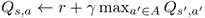
4.  从步骤 2 开始重复。

与价值迭代一样，结束条件可以是更新的某个阈值，或者我们可以执行测试集来估计策略的预期回报。这里需要注意的另一件事是如何更新 Q 值。当我们从环境中抽取样本时，通常在现有值的基础上分配新的值不是一个好主意，因为训练会变得不稳定。实践中通常做的是使用“混合”技术用近似值更新 *Q(s，a)* ，这只是使用学习率在 Q 的新旧值之间取平均值

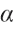

取值范围为 0 到 1:

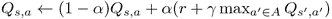

这允许 Q 值平滑地收敛，即使我们的环境是嘈杂的。算法的最终版本在这里:

1.  从用于 *Q(s，a)* 的空表开始。
2.  从环境中获得( *s* ， *a* ， *r* ，*s′*)。
3.  做一个更夫更新:。
4.  检查收敛条件。如果不符合，从步骤 2 开始重复。

如前所述，这种方法被称为**表格 Q-learning** ，因为我们用它们的 Q 值保存了一个状态表。让我们在我们的 FrozenLake 环境中尝试一下。整个示例代码在`Chapter06/01_frozenlake_q_learning.py`中。

```
import gym
import collections
from tensorboardX import SummaryWriter

ENV_NAME = "FrozenLake-v0"
GAMMA = 0.9
ALPHA = 0.2
TEST_EPISODES = 20

class Agent:
    def __init__(self):
        self.env = gym.make(ENV_NAME)
        self.state = self.env.reset()
        self.values = collections.defaultdict(float)
```

开始时，我们导入包并定义常量。这里的新东西是


，它将用作值更新中的学习率。我们的`Agent`类的初始化现在更简单了，因为我们不需要跟踪奖励和转换计数器的历史，只需要我们的值表。这将使我们的内存占用更小，这对于 FrozenLake 来说不是一个大问题，但对于更大的环境来说却是至关重要的。

前面的方法用于从环境中获取下一个过渡。我们从动作空间中随机抽取一个动作，并返回旧状态、采取的动作、获得的奖励和新状态的元组。稍后将在训练循环中使用该元组。

```
    def sample_env(self):
        action = self.env.action_space.sample()
        old_state = self.state
        new_state, reward, is_done, _ = self.env.step(action)
        self.state = self.env.reset() if is_done else new_state
        return (old_state, action, reward, new_state)
```

下一个方法接收环境的状态，并通过采取表中具有最大值的动作，从该状态中找到要采取的最佳动作。如果我们没有与状态和动作对相关联的值，那么我们把它作为零。这个方法将被使用两次:第一次，在使用我们的当前值表播放一集的测试方法中(评估我们的策略质量)，第二次，在执行值更新以获得下一个状态的值的方法中。

```
    def best_value_and_action(self, state):
        best_value, best_action = None, None
        for action in range(self.env.action_space.n):
            action_value = self.values.get[(state, action)]
            if best_value is None or best_value < action_value:
                best_value = action_value
                best_action = action
        return best_value, best_action
```

这里，我们使用环境中的一个步骤来更新我们的值表。为了做到这一点，我们正在计算状态 *s* 和动作 *a* 的贝尔曼近似值，方法是将即时奖励与下一个状态的贴现值相加。然后，我们获得状态和动作对的先前值，并使用学习率将这些值混合在一起。结果是状态 *s* 和动作 *a* 的值的新近似值，它存储在我们的表中。

```
    def value_update(self, s, a, r, next_s):
        best_v, _ = self.best_value_and_action(next_s)
        new_val = r + GAMMA * best_v
        old_val = self.values[(s, a)]
        self.values[(s, a)] = old_val * (1-ALPHA) + new_val * ALPHA
```

我们的`Agent`类中的最后一个方法使用提供的测试环境播放一个完整的片段。每一步的行动都使用我们的 Q 值的当前值表。这种方法被用来评估我们目前的策略，以检查学习的进展。注意，这个方法并没有改变我们的值表:它只是用它来寻找要采取的最佳行动。

```
    def play_episode(self, env):
        total_reward = 0.0
        state = env.reset()
        while True:
            _, action = self.best_value_and_action(state)
            new_state, reward, is_done, _ = env.step(action)
            total_reward += reward
            if is_done:
                break
            state = new_state
        return total_reward
```

示例的其余部分是训练循环，它与上一章的示例非常相似:我们创建一个测试环境、代理和摘要编写器，然后在循环中，我们在环境中执行一个步骤，并使用获得的数据执行值更新。然后，我们通过播放几集测试集来测试我们当前的策略。如果获得了好的回报，那么我们就停止训练。

该示例的结果如下所示:

```
if __name__ == "__main__":
    test_env = gym.make(ENV_NAME)
    agent = Agent()
    writer = SummaryWriter(comment="-q-learning")

    iter_no = 0
    best_reward = 0.0
    while True:
        iter_no += 1
        s, a, r, next_s = agent.sample_env()
        agent.value_update(s, a, r, next_s)

        reward = 0.0
        for _ in range(TEST_EPISODES):
            reward += agent.play_episode(test_env)
        reward /= TEST_EPISODES
        writer.add_scalar("reward", reward, iter_no)
        if reward > best_reward:
            print("Best reward updated %.3f -> %.3f" % (best_reward, reward))
            best_reward = reward
        if reward > 0.80:
            print("Solved in %d iterations!" % iter_no)
            break
    writer.close()
```

你可能已经注意到，与上一章的值迭代方法相比，这个版本使用了更多的迭代来解决问题。原因是我们不再使用测试中获得的经验。(在`Chapter05/02_frozenlake_q_iteration.py`中，定期测试导致 Q 表统计数据的更新。在这里，我们在测试期间不接触 Q 值，这在环境得到解决之前会导致更多的迭代。)总的来说，环境所需的样本总量几乎相同。TensorBoard 里的奖励图也表现出了很好的训练动态，和数值迭代法很像。

```
rl_book_samples/Chapter06$ ./01_frozenlake_q_learning.py
[2017-10-20 14:21:23,459] Making new env: FrozenLake-v0
[2017-10-20 14:21:23,682] Making new env: FrozenLake-v0
Best reward updated 0.000 -> 0.200
Best reward updated 0.200 -> 0.250
Best reward updated 0.250 -> 0.350
Best reward updated 0.350 -> 0.400
Best reward updated 0.400 -> 0.500
Best reward updated 0.500 -> 0.750
Best reward updated 0.750 -> 0.800
Best reward updated 0.800 -> 0.850
Solved in 1860 iterations!
```

图 FrozenLake 的奖励动态

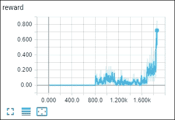

Figure 1: Reward dynamics of FrozenLake

深度 Q-学习


# 我们刚刚看到的 Q-learning 方法通过在整个状态集上迭代解决了这个问题，但是在可观察状态集的数量非常大的情况下仍然会有困难。例如，Atari 游戏可以有各种不同的屏幕，所以如果我们决定使用原始像素作为单独的状态，我们会很快意识到我们有太多的状态要跟踪和近似值。

在某些环境中，不同可观测状态的数量几乎是无限的。例如，在 CartPole 中，环境给我们的状态是四个浮点数。值的组合数量是有限的(它们用位来表示)，但是这个数字非常大。我们可以创建一些箱来离散化这些值，但这通常会产生比它解决的问题更多的问题:我们需要决定哪些参数范围对于区分不同的状态是重要的，以及哪些范围可以聚集在一起。

在 Atari 的例子中，一个单独的像素变化不会产生太大的影响，所以将两个图像视为一个单独的状态是有效的。然而，我们仍然需要区分一些状态。下图显示了乒乓游戏中的两种不同情况。我们通过控制一个桨(我们的桨在右边，是绿色的，而我们对手的桨在左边，是浅棕色的)来和人工智能的对手比赛。游戏的目标是让跳球越过对手的球拍，同时防止它越过我们的球拍。两种情况可以认为是完全不同的:右手情况下，球离对手很近，我们可以放松观看。但是左边的情况要求更高:假设球是从左向右运动的，也就是说球是向我们这边运动的，所以我们需要快速移动球拍，避免丢一分。下面的情况只是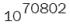可能情况中的两种，但是我们希望我们的代理对它们采取不同的行动。

图 Pong 中观察的模糊性

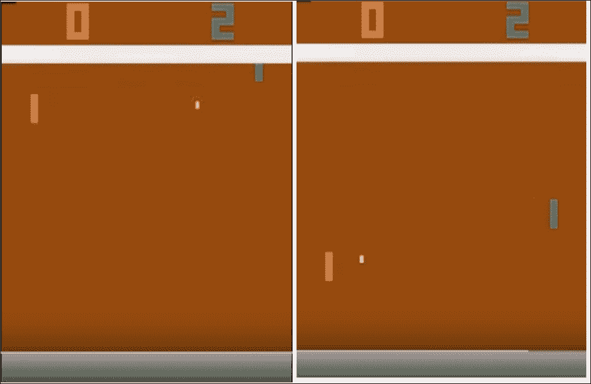

作为这个问题的解决方案，我们可以使用一种非线性的表示法，将状态和动作都映射到一个值上。在机器学习中，这被称为“回归问题”表示和训练这种表示的具体方式可以不同，但是，正如您可能已经从本节的标题中猜到的那样，使用深度神经网络是最受欢迎的选择之一，尤其是在处理以屏幕图像表示的观察时。考虑到这一点，让我们对 Q 学习算法进行修改:

用一些初始近似值初始化 *Q(s，a)*

通过与环境交互，获得元组( *s* ， *a* ， *r* ，*s′*)

1.  计算损失:如果事件已经结束，则为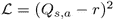，否则为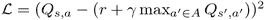
2.  通过最小化关于模型参数的损失，使用**随机梯度下降** ( **SGD** )算法更新 *Q(s，a)*
3.  从步骤 2 开始重复，直到收敛
4.  前面的算法看起来很简单，但不幸的是，它不会工作得很好。让我们讨论一下可能会出错的地方。
5.  与环境的相互作用

首先，我们需要以某种方式与环境互动，以接收数据进行训练。在简单的环境中，比如 FrozenLake，我们可以随机行动，但这是最好的策略吗？想象一下乒乓球比赛。随机移动桨赢得单点的概率有多大？它不是零，但非常小，这意味着我们需要等待很长时间才能看到这种罕见的情况。作为替代，我们可以使用我们的 Q 函数近似值作为行为的来源(就像我们之前在值迭代法中所做的那样，当我们在测试期间记住我们的经验时)。


## 如果我们对 Q 的表示是好的，那么我们从环境中获得的经验将向代理显示相关的数据以进行训练。然而，当我们的近似不完美时(例如，在训练开始时)，我们就有麻烦了。在这种情况下，我们的代理可能会被一些州的不良行为所困扰，而不会尝试做出不同的行为。这种*探索与利用*的困境在[第一章](part0012_split_000.html#BE6O2-ce551566b6304db290b61e4d70de52ee "Chapter 1. What is Reinforcement Learning?")、*中简单提到过什么是强化学习？*。一方面，我们的代理需要探索环境，以建立一个完整的过渡和行动结果的图片。另一方面，我们应该有效地利用与环境的互动:我们不应该浪费时间去随机尝试我们已经尝试过的行为，并了解它们的结果。如您所见，当我们的 Q 近似不好时，随机行为在训练开始时更好，因为它为我们提供了关于环境状态的更均匀分布的信息。随着我们训练的进行，随机行为变得低效，我们希望回到 Q 近似值来决定如何行动。

执行这种两种极端行为混合的方法被称为**ε贪婪**方法，这意味着使用概率超参数在随机和 Q 策略之间切换。通过改变，我们可以选择随机动作的比率。通常的做法是从 * = 1.0 * (100%随机动作)开始，慢慢降低到某个小值比如随机动作的 5%或者 2%。使用 epsilon-greedy 方法有助于在开始时探索环境，并在训练结束时坚持良好的策略。“探索与开发”问题还有其他解决方案，我们将在本书的第三部分讨论其中的一些。这个问题是 RL 中的基本公开问题之一，也是一个活跃的研究领域，甚至还没有完全解决。

SGD 优化

我们的 Q-学习过程的核心是从监督学习中借鉴来的。事实上，我们正试图用神经网络来逼近一个复杂的非线性函数 *Q(s，a)* 。为此，我们使用贝尔曼方程计算该函数的目标，然后假设我们手头有一个监督学习问题。这没问题，但是 SGD 优化的一个基本要求是训练数据**独立同分布**(经常缩写为**I . I . d .**)。


## 在我们的例子中，我们将用于 SGD 更新的数据不符合这些标准:

我们的样本不是独立的。即使我们积累了大量的数据样本，它们也将彼此非常接近，因为它们属于同一集。

In our case, data that we're going to use for the SGD update doesn't fulfill these criteria:

1.  -贪婪)，但我们不想学习如何随机地玩:我们想要一个最优的策略，有最好的回报。
2.  Distribution of our training data won't be identical to samples provided by the optimal policy that we want to learn. Data that we have is a result of some other policy (our current policy, random, or both in the case of

    为了处理这种麻烦，我们通常需要使用我们过去经验的大缓冲区，并从中抽取训练数据，而不是使用我们最新的经验。这个方法叫做**重放缓冲**。最简单的实现是一个固定大小的缓冲区，将新数据添加到缓冲区的末尾，以便将最老的体验推出。Replay buffer 允许我们在或多或少独立的数据上进行训练，但数据仍然足够新，可以在我们最近的策略生成的样本上进行训练。

    步骤之间的关联

默认培训程序的另一个实际问题也与我们的数据中缺少 id 有关，但方式略有不同。贝尔曼方程通过*Q(s′，a′)*(有自举之称)为我们提供了 *Q(s，a)* 的值。然而，两个状态 *s* 和*s′*之间只有一步之隔。这使得它们非常相似，神经网络很难区分它们。当我们执行网络参数的更新时，为了使 *Q(s，a)* 更接近期望的结果，我们可以间接地改变为*Q(s’，a’)*和附近的其他状态产生的值。这可能会使我们的训练变得非常不稳定，就像追逐我们自己的尾巴:当我们为状态 *s* 更新 *Q* 时，然后在后续状态中，我们发现*Q(s′，a′)*变得更差，但是尝试更新它会破坏我们的 *Q(s，a)* 近似，等等。


## 为了使训练更加稳定，有一个技巧，叫做*目标网络*，当我们保留我们网络的副本，并将其用于贝尔曼方程中的*Q(s′，a′)*值。这个网络只是周期性地与我们的主网络同步，比如在 *N* 步中同步一次(其中 *N* 通常是相当大的超参数，比如 1k 或者 10k 训练迭代)。

马尔科夫属性

我们的 RL 方法使用 MDP 形式主义作为它们的基础，它假设环境服从马尔可夫性质:从环境中的观察是我们最佳行动所需要的全部(换句话说，我们的观察允许我们区分彼此的状态)。正如我们在前面的 Pong 截图中看到的，Atari 游戏中的一张图像不足以捕捉所有重要信息(仅使用一张图像，我们无法了解物体的速度和方向，如球和对手的球拍)。这明显违背了马尔可夫性质，把我们的单帧 Pong 环境移到了**部分可观测 MDPs** ( **POMDP** )的区域。POMDP 基本上是没有马尔可夫性质的 MDP，它们在实践中非常重要。例如，对于大多数看不到对手牌的纸牌游戏，游戏观察是 POMDPs，因为当前观察(你的牌和桌上的牌)可能对应于对手手中的不同牌。


## 我们不会在本书中详细讨论 POMPDs，所以，现在，我们将使用一个小技巧将我们的环境推回到 MDP 域。解决方案是维护过去的几个观察值，并将它们作为一种状态使用。在 Atari 游戏的情况下，我们通常将 *k* 个后续帧堆叠在一起，并将其用作每个状态的观察。这允许我们的代理推断当前状态的动态，例如，得到球的速度和方向。雅达利通常的“经典”k 数是 4。当然，这只是一个小技巧，因为环境中可以有更长的依赖关系，但对于大多数游戏来说，它工作得很好。

DQN 训练的最终形式

研究人员还发现了更多的技巧和窍门，让 DQN 训练更加稳定和有效，我们将在下一章介绍其中的精华。然而，-贪婪，重放缓冲，目标网络形态？DeepMind 能够在 49 款雅达利游戏上成功训练 DQN，并证明这种方法应用于复杂环境的效率的基础。


## 原论文(无目标网)发表于 2013 年底(*玩深度强化学习的雅达利* 1312.5602v1、 *Mnih 等人*。)，而且他们用了 7 款游戏进行测试。后来在 2015 年初，文章的修改版，有 49 个不同的游戏，发表在 *Nature* ( *通过深度强化学习的人类级控制* doi:10.1038/nature14236， *Mnih 等*。)

前述论文中的 DQN 算法具有以下步骤:

用随机权重初始化 *Q(s，a)* 和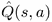的参数，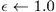，清空重放缓冲区

用概率、选择一个随机动作*一个*，否则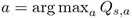

1.  在仿真器中执行动作 *a* ，观察奖励 *r* 和下一个状态*s′*
2.  在重放缓冲器中存储转换 *(s，a，r，s’)*
3.  从重放缓冲区中随机抽取一批过渡
4.  对于缓冲区中的每个过渡，如果剧集已经在该步骤结束，则计算目标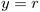,否则计算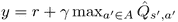
5.  计算损失: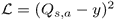
6.  通过最小化关于模型参数的损失，使用 SGD 算法更新 *Q(s，a)*
7.  每 *N* 步将权重从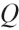复制到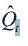
8.  从步骤 2 开始重复，直到收敛
9.  让我们现在实现它，并尝试击败一些雅达利游戏！
10.  乒乓上的 DQN

在我们进入代码之前，需要做一些介绍。我们的例子变得越来越具有挑战性和复杂，这并不奇怪，因为我们试图解决的问题的复杂性也在增加。示例尽可能简单明了，但是有些代码可能一开始很难理解。


# 另一个需要注意的是性能。我们之前关于 FrozenLake 或 CartPole 的例子从性能角度来看要求不高，因为观察值很小，神经网络参数很小，在训练循环中减少额外的毫秒数并不重要。然而，从现在开始，情况不再是这样了。Atari 环境中的一个观察值是 100k 值，必须对其进行重新缩放，转换为浮点数，并存储在重放缓冲区中。这个数据阵列的一个额外副本可能会影响您的训练速度，这不再是几秒钟或几分钟，而是可能是几个小时，即使是在最快的 GPU 上。神经网络训练循环也可能是一个瓶颈。当然，RL 模型没有最先进的 ImageNet 模型那么庞大，但即使是 2015 年的 DQN 模型也有超过 150 万个参数，这对 GPU 来说是一个很大的挑战。因此，长话短说:性能很重要，尤其是当您在试验超参数，并且需要等待训练的不是单个模型，而是几十个模型时。

PyTorch 非常具有表现力，因此或多或少高效的处理代码可能看起来比优化的 TensorFlow 图少得多，但是仍然有很多机会缓慢地做事情和犯错误。例如，DQN 损失计算的一个简单版本，在每个批量样本上循环，比并行版本慢两倍。然而，数据批次的单个额外副本可以使相同代码的速度慢 13 倍，这是相当显著的。

由于长度、逻辑结构和可重用性，这个例子被分成三个模块。这些模块如下:

这些是 Atari 环境包装器，大部分来自 OpenAI Baselines 项目

`Chapter06/lib/dqn_model.py`:这是 DQN 神经网络层，与来自 *Nature* 论文的 DeepMind DQN 具有相同的架构

*   `Chapter06/02_dqn_pong.py`:这是主模块，有训练循环，损失函数计算，经验回放缓冲
*   糖纸
*   从资源角度来看，用 RL 处理 Atari 游戏是相当费力的。为了让事情变得更快，对 Atari 平台交互应用了几个转换，这在 DeepMind 的论文中有所描述。其中一些转换只影响性能，但一些解决了 Atari 平台的特性，这些特性使学习变得漫长和不稳定。转换通常被实现为各种 OpenAI Gym 包装器。完整的列表相当长，在不同的源代码中有相同包装器的几种实现。我个人最喜欢的是 OpenAI 资源库，称为**基线**，这是一组在 TensorFlow 中实现的 RL 方法和算法，应用于流行的基准测试，为比较方法建立共同基础。资源库可从 https://github.com/openai/baselines[获得](https://github.com/openai/baselines)，包装器可在该文件中获得:[https://github . com/open ai/baselines/blob/master/baselines/common/atari _ wrappers . py](https://github.com/openai/baselines/blob/master/baselines/common/atari_wrappers.py)。


## RL 研究人员使用的 Atari 变换的完整列表包括:

将游戏中的个人生活转换成独立的情节。一般来说，一集包含了从游戏开始到出现“游戏结束”画面的所有步骤？，可以持续上千个游戏步骤(观察和动作)。通常，在街机游戏中，玩家被给予几种生活，这在游戏中提供了几种尝试。这种转换将一个完整的情节分割成一个个小情节，代表玩家的每一个生命。不是所有的游戏都支持这个功能(比如 Pong 就不支持)，但是对于支持的环境来说，随着我们的剧集变得更短，它通常有助于加速收敛。

在游戏开始时，执行随机数量(最多 30 个)的无操作动作。这应该会稳定训练，但没有适当的解释为什么会这样。

*   每 K 步做一个动作决策，其中 K 通常为 4 或 3。在中间帧上，简单地重复所选择的动作。这使得训练速度大大加快，因为用神经网络处理每一帧都是一项相当苛刻的操作，但后续帧之间的差异通常很小。
*   取最后两帧中每个像素的最大值，并将其用作观察值。一些 Atari 游戏有闪烁效果，这是由于平台的限制(Atari 在单帧上可以显示的精灵数量有限)。对于人眼来说，这种快速变化是不可见的，但它们会混淆神经网络。
*   游戏开始时按下**开火**。一些游戏(包括 Pong 和 Breakout)需要用户按下**开火**按钮来开始游戏。理论上，神经网络有可能学会自己按下**火**，但这将需要播放更多集。因此，我们在包装器中按下 **FIRE** 。
*   将每一帧从 210 × 160 的三色帧缩小到单色 84 × 84 的图像。不同的方法是可能的。例如，DeepMind 的论文将这种转换描述为从 YCbCr 颜色空间中获取 Y 颜色通道，然后将整个图像重新缩放到 84 × 84 的分辨率。其他一些研究人员进行灰度转换，裁剪图像的不相关部分，然后按比例缩小。在基线存储库中(以及下面的示例代码中)，使用的是后一种方法。
*   将几个(通常是四个)后续帧堆叠在一起，为网络提供有关游戏对象动态的信息。
*   将奖励限幅到*1*、 *0* 和 *1* 的值。获得的分数在不同的游戏中会有很大的差异。例如，在乒乓球比赛中，你的对手从你身后传过来的每一个球，你都得 1 分。然而，在一些游戏中，比如功夫，你每杀死一个敌人可以获得 100 的奖励。这种奖励值的分布使得我们的损失在游戏之间具有完全不同的规模，这使得寻找一组游戏的公共超参数变得更加困难。为了解决这个问题，奖励被限制在[*-1*... *1* 。
*   将观察值从`unsigned`字节转换为`float32`值。从模拟器获得的屏幕被编码为具有从 0 到 255 的值的字节张量，这不是神经网络的最佳表示。因此，我们需要将图像转换成浮点数，并将数值调整到[ *0.0…1.0]* 的范围内。
*   在我们关于 Pong 的例子中，我们不需要上面的一些包装器，比如将生活转换成单独的剧集和奖励剪辑，所以这些包装器没有包含在示例代码中。然而，你应该意识到它们，以防万一你决定尝试其他游戏。有时，当 DQN 不收敛时，问题不在代码中，而在错误包装的环境中。我花了几天时间调试游戏开始时错过按下**开火**按钮导致的收敛问题！
*   让我们来看看来自`Chapter06/lib/wrappers.py`的单个包装器的实现:

前面的包装器在游戏需要启动的环境中按下**开火**按钮。除了按下 **FIRE** 之外，这个包装器还会检查一些游戏中出现的一些极限情况。

这个包装器结合了 K 帧和两个连续帧的像素期间动作的重复。

```
import cv2
import gym
import gym.spaces
import numpy as np
import collections

class FireResetEnv(gym.Wrapper):
    def __init__(self, env=None):
        super(FireResetEnv, self).__init__(env)
        assert env.unwrapped.get_action_meanings()[1] == 'FIRE'
        assert len(env.unwrapped.get_action_meanings()) >= 3

    def step(self, action):
        return self.env.step.action()

    def reset(self):
        self.env.reset()
        obs, _, done, _ = self.env.step(1)
        if done:
            self.env.reset()
        obs, _, done, _ = self.env.step(2)
        if done:
            self.env.reset()
        return obs
```

这个包装器的目标是将来自仿真器的输入观察结果转换为灰度 84 × 84 的图像，仿真器通常具有 210 × 160 像素的分辨率和 RGB 颜色通道。它使用比色灰度转换(这比简单的平均颜色通道更接近人类的颜色感知)，调整图像大小并裁剪结果的顶部和底部。

```
class MaxAndSkipEnv(gym.Wrapper):
    def __init__(self, env=None, skip=4):
        """Return only every 'skip'-th frame"""
        super(MaxAndSkipEnv, self).__init__(env)
        # most recent raw observations (for max pooling across time steps)
        self._obs_buffer = collections.deque(maxlen=2)
        self._skip = skip

    def step(self, action):
        total_reward = 0.0
        done = None
        for _ in range(self._skip):
            obs, reward, done, info = self.env.step(action)
            self._obs_buffer.append(obs)
            total_reward += reward
            if done:
                break
        max_frame = np.max(np.stack(self._obs_buffer), axis=0)
        return max_frame, total_reward, done, info

    def _reset(self):
        self._obs_buffer.clear()
        obs = self.env.reset()
        self._obs_buffer.append(obs)
        return obs
```

这个类沿着第一维创建一个后续帧的堆栈，并将它们作为观察值返回。目的是让网络了解物体的动态，例如 Pong 中球的速度和方向，或者敌人是如何移动的。这是非常重要的信息，不可能从单个图像中获得。

```
class ProcessFrame84(gym.ObservationWrapper):
    def __init__(self, env=None):
        super(ProcessFrame84, self).__init__(env)
        self.observation_space = gym.spaces.Box(low=0, high=255, shape=(84, 84, 1), dtype=np.uint8)

    def observation(self, obs):
        return ProcessFrame84.process(obs)

    @staticmethod
    def process(frame):
        if frame.size == 210 * 160 * 3:
            img = np.reshape(frame, [210, 160, 3]).astype(np.float32)
        elif frame.size == 250 * 160 * 3:
            img = np.reshape(frame, [250, 160, 3]).astype(np.float32)
        else:
            assert False, "Unknown resolution."
        img = img[:, :, 0] * 0.299 + img[:, :, 1] * 0.587 + img[:, :, 2] * 0.114
        resized_screen = cv2.resize(img, (84, 110), interpolation=cv2.INTER_AREA)
        x_t = resized_screen[18:102, :]
        x_t = np.reshape(x_t, [84, 84, 1])
        return x_t.astype(np.uint8)
```

这个简单的包装器将来自 HWC 的观察结果转换成 PyTorch 所需的 CHW 格式。张量的输入形状有一个颜色通道作为最后一个维度，但 PyTorch 的卷积层假设颜色通道是第一维。

```
class BufferWrapper(gym.ObservationWrapper):
    def __init__(self, env, n_steps, dtype=np.float32):
        super(BufferWrapper, self).__init__(env)
        self.dtype = dtype
        old_space = env.observation_space
        self.observation_space = gym.spaces.Box(old_space.low.repeat(n_steps, axis=0),
        old_space.high.repeat(n_steps, axis=0), dtype=dtype)

    def reset(self):
        self.buffer = np.zeros_like(self.observation_space.low, dtype=self.dtype)
        return self.observation(self.env.reset())

    def observation(self, observation):
        self.buffer[:-1] = self.buffer[1:]
        self.buffer[-1] = observation
        return self.buffer
```

我们在库中的最后一个包装器将观察数据从字节转换为浮点，并将每个像素的值缩放到范围[ *0.0...1.0]* 。

```
class ImageToPyTorch(gym.ObservationWrapper):
    def __init__(self, env):
        super(ImageToPyTorch, self).__init__(env)
        old_shape = self.observation_space.shape
        self.observation_space = gym.spaces.Box(low=0.0, high=1.0, shape=(old_shape[-1], old_shape[0], old_shape[1]), dtype=np.float32)

    def observation(self, observation):
        return np.moveaxis(observation, 2, 0)
```

文件的最后是一个简单的函数，它根据名称创建一个环境，并对它应用所有需要的包装器。这就是包装器，让我们看看我们的模型。

```
class ScaledFloatFrame(gym.ObservationWrapper):
    def observation(self, obs):
        return np.array(obs).astype(np.float32) / 255.0
```

DQN 模式

```
def make_env(env_name):
    env = gym.make(env_name)
    env = MaxAndSkipEnv(env)
    env = FireResetEnv(env)
    env = ProcessFrame84(env)
    env = ImageToPyTorch(env)
    env = BufferWrapper(env, 4)
    return ScaledFloatFrame(env)
```

发表在 *Nature* 上的模型有三个卷积层，后面是两个全连接层。所有层都被 ReLU 非线性分隔开。该模型的输出是环境中可用的每个动作的 Q 值，没有应用非线性(因为 Q 值可以具有任何值)。与逐字处理 *Q(s，a)* 并将观察结果和动作输入网络以获得动作值相比，通过网络一次计算所有 Q 值的方法有助于我们显著提高速度。


## 该型号的代码在`Chapter06/lib/dqn_model.py`中:

为了能够以通用的方式编写我们的网络，它被实现为两个部分:卷积和顺序。PyTorch 没有一个“更平”的层，可以将 3D 张量转换为数字的 1D 向量，需要将卷积输出馈送到完全连接的层。这个问题在`forward()`函数中得到解决，在这里我们可以将一批 3D 张量重新整形为一批 1D 向量。

另一个小问题是，我们不知道给定形状的输入所产生的卷积层输出中值的确切数量。但是，我们需要将这个数字传递给第一个完全连接的层构造函数。一种可能的解决方案是对这个数字进行硬编码，它是输入形状的函数(对于 84 × 84 输入，卷积层的输出将有 3136 个值)，但这不是最好的方法，因为我们的代码对输入形状变化的鲁棒性会降低。更好的解决方案是使用一个简单的函数(`_get_conv_out()`)，该函数接受输入形状，并将卷积层应用于这种形状的伪张量。该函数的结果将等于该应用程序返回的参数数。它会很快，因为这个调用将在模型创建时完成一次，但将允许我们有通用代码:

```
import torch
import torch.nn as nn
import numpy as np

class DQN(nn.Module):
    def __init__(self, input_shape, n_actions):
        super(DQN, self).__init__()

        self.conv = nn.Sequential(
            nn.Conv2d(input_shape[0], 32, kernel_size=8, stride=4),
            nn.ReLU(),
            nn.Conv2d(32, 64, kernel_size=4, stride=2),
            nn.ReLU(),
            nn.Conv2d(64, 64, kernel_size=3, stride=1),
            nn.ReLU()
        )

        conv_out_size = self._get_conv_out(input_shape)
        self.fc = nn.Sequential(
            nn.Linear(conv_out_size, 512),
            nn.ReLU(),
            nn.Linear(512, n_actions)
        )
```

模型的最后一块是`forward()`函数，它接受 4D 输入张量(第一维是批量大小，第二维是*颜色*通道，这是我们后续帧的堆栈，第三维和第四维是图像维度)。变换的应用分两步完成:首先我们对输入应用卷积层，然后我们在输出上获得 4D 张量。该结果被展平为两个维度:一个批处理大小和由该批处理条目的卷积返回的所有参数，作为一个长的数字向量。这是由张量的`view()`函数完成的，它让一个单独的维度作为剩余参数的*通配符*作为一个`-1`参数。例如，如果我们有一个形状为`(2, 3, 4)`的张量`T`，它是一个包含 24 个元素的 3D 张量，我们可以使用`T.view(6, 4)`将其重新整形为一个具有 6 行 4 列的 2D 张量。这个操作不会创建一个新的内存对象，也不会移动内存中的数据，它只是改变了张量的高层形状。同样的结果可以通过`T.view(-1, 4)`或`T.view(6, -1)`得到，当你的张量在第一维有批量大小时，这是非常方便的。最后，我们将这个展平的 2D 张量传递给我们完全连接的层，以获得每个批量输入的 Q 值。

训练

```
    def _get_conv_out(self, shape):
        o = self.conv(torch.zeros(1, *shape))
        return int(np.prod(o.size()))

    def forward(self, x):
        conv_out = self.conv(x).view(x.size()[0], -1)
        return self.fc(conv_out)
```

第三个模块包含经验重放缓冲器、代理、损失函数计算和训练循环本身。在进入代码之前，需要说明一下训练超参数。DeepMind 的 *Nature* 论文包含了一个表格，其中列出了用于在用于评估的所有 49 款雅达利游戏上训练其模型的超参数的所有细节。DeepMind 为所有游戏保持所有这些参数相同(但为每个游戏训练了单独的模型)，该团队的目的是展示该方法足够强大，可以使用一个单一的模型架构和超参数来解决许多具有不同复杂性、动作空间、奖励结构和其他细节的游戏。然而，我们在这里的目标要小得多:我们只想解决乒乓游戏。


## 与 Atari 测试集中的其他游戏相比，Pong 非常简单明了，所以本文中的超参数对于我们的任务来说是多余的。例如，为了在所有 49 场游戏中获得最佳结果，DeepMind 使用了一百万次观察的重放缓冲区，这需要大约 20 GB 的 RAM 来保存，并需要从环境中填充大量样本。所使用的ε衰减时间表也不是单个乒乓游戏的最佳时间表。在训练中，DeepMind 在从环境中获得的第一个一百万帧中，将ε从 1.0 线性衰减到 0.1。然而，我自己的实验表明，对于 Pong 来说，在前 100k 帧中衰减 epsilon，然后保持稳定就足够了。重放缓冲区也可以小得多:10k 的转换就足够了。在下面的例子中，我使用了我的参数。这些参数与论文中的参数不同，但可以让我们以快十倍的速度求解 Pong。在 GeForce GTX 1080 Ti 上，以下版本在一到两个小时内收敛到 19.5 的平均分数，但使用 DeepMind 的超参数，至少需要一天。

当然，这种加速是针对特定环境的微调，可能会破坏其他游戏的收敛。你可以自由地玩 Atari 套装中的选项和其他游戏。

首先，我们导入所需的模块并定义超参数。

这两个值设置了训练的默认环境和最后 100 集停止训练的奖励界限。他们只是默认；您可以使用命令行重新定义它们。

```
from lib import wrappers
from lib import dqn_model

import argparse
import time
import numpy as np
import collections

import torch
import torch.nn as nn
import torch.optim as optim

from tensorboardX import SummaryWriter
```

这些参数定义了以下内容:

```
DEFAULT_ENV_NAME = "PongNoFrameskip-v4"
MEAN_REWARD_BOUND = 19.5
```

我们用于贝尔曼近似的伽马值

```
GAMMA = 0.99
BATCH_SIZE = 32
REPLAY_SIZE = 10000
REPLAY_START_SIZE = 10000
LEARNING_RATE = 1e-4
SYNC_TARGET_FRAMES = 1000
```

从重放缓冲区(`BATCH_SIZE`)取样的批次大小

*   缓冲器的最大容量(`REPLAY_SIZE`)
*   开始训练以填充重放缓冲区之前等待的帧数(`REPLAY_START_SIZE`)
*   Adam 优化器中使用的学习率，在本例中使用
*   我们将模型权重从训练模型同步到目标模型的频率，这用于获得贝尔曼近似中下一个状态的值。

    ```
    EPSILON_DECAY_LAST_FRAME = 10**5 EPSILON_START = 1.0 EPSILON_FINAL = 0.02
    ```

*   最后一批超参数与ε衰变纲图有关。为了实现正确的探索，在训练的早期阶段，我们从ε= 1.0 开始，这导致所有的动作都是随机选择的。然后，在前 100，000 帧期间，ε线性衰减到`0.02`，这对应于在 2%的步长中采取的随机动作。DeepMind 最初的论文中使用了类似的方案，但衰减的持续时间长了 10 倍(因此，一百万帧后达到ε= 0.02)。
*   下一个代码块定义了我们的体验重放缓冲区，其目的是保存从环境中获得的最后一个转换(观察、动作、奖励、完成标志和下一个状态的元组)。每当我们在环境中执行一个步骤时，我们将转换推入缓冲区，只保留固定数量的步骤，在我们的例子中是 10k 转换。对于训练，我们从重放缓冲区中随机抽取一批转换，这允许我们打破环境中后续步骤之间的相关性。

大多数经验重放缓冲区代码非常简单:它基本上利用了`deque`类的能力来维护缓冲区中给定数量的条目。在`sample()`方法中，我们创建一个随机索引列表，然后将采样的条目重新打包到 NumPy 数组中，以便更方便地计算损失。

我们需要的下一个类是一个`Agent`，它与环境交互，并将交互的结果保存到我们刚刚看到的体验回放缓冲区中:

```
Experience = collections.namedtuple('Experience', field_names=['state', 'action', 'reward', 'done', 'new_state'])

class ExperienceBuffer:
    def __init__(self, capacity):
        self.buffer = collections.deque(maxlen=capacity)

    def __len__(self):
        return len(self.buffer)

    def append(self, experience):
        self.buffer.append(experience)

    def sample(self, batch_size):
        indices = np.random.choice(len(self.buffer), batch_size, replace=False)
        states, actions, rewards, dones, next_states = zip(*[self.buffer[idx] for idx in indices])
        return np.array(states), np.array(actions), np.array(rewards, dtype=np.float32), \
                np.array(dones, dtype=np.uint8), np.array(next_states)
```

在代理的初始化期间，我们需要存储对环境和经验重放缓冲区的引用，跟踪当前的观察和迄今为止累积的总奖励。

代理的主要方法是在环境中执行一个步骤，并将其结果存储在缓冲区中。为此，我们需要首先选择动作。利用概率ε(作为参数传递),我们采取随机行动，否则我们使用过去的模型来获得所有可能行动的 Q 值，并选择最佳行动。

```
class Agent:
    def __init__(self, env, exp_buffer):
        self.env = env
        self.exp_buffer = exp_buffer
        self._reset()

    def _reset(self):
        self.state = env.reset()
        self.total_reward = 0.0
```

当行动被选择后，我们将它传递给环境以获得下一次观察和奖励，将数据存储在体验缓冲区中，并处理剧集结束的情况。如果我们已经完成这一步，函数的结果就是总的累积奖励，否则就是`None`。

```
    def play_step(self, net, epsilon=0.0, device="cpu"):
        done_reward = None

        if np.random.random() < epsilon:
            action = env.action_space.sample()
        else:
            state_a = np.array([self.state], copy=False)
            state_v = torch.tensor(state_a).to(device)
            q_vals_v = net(state_v)
            _, act_v = torch.max(q_vals_v, dim=1)
            action = int(act_v.item())
```

现在是训练模块的最后一个函数，它计算抽样批次的损失。该函数以一种形式编写，通过用向量运算处理所有批处理样本来最大限度地利用 GPU 并行性，与批处理上的简单循环相比，这使其更难理解。然而这种优化得到了回报:并行版本比批处理上的显式循环快两倍多。

```
        new_state, reward, is_done, _ = self.env.step(action)
        self.total_reward += reward
        new_state = new_state

        exp = Experience(self.state, action, reward, is_done, new_state)
        self.exp_buffer.append(exp)
        self.state = new_state
        if is_done:
            done_reward = self.total_reward
            self._reset()
        return done_reward
```

提醒一下，下面是我们需要计算的损失表达式:表示不在本集结尾的步骤，或者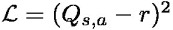表示最后的步骤。

在 arguments 中，我们将我们的批处理作为数组元组(由经验缓冲区中的`sample()`方法重新打包)、我们正在训练的网络和目标网络进行传递，目标网络会定期与已训练的网络进行同步。第一个模型(作为参数`net`传递)用于计算梯度，而`tgt_net`参数中的第二个模型用于计算下一个状态的值，这个计算不应该影响梯度。为了实现这一点，我们使用 PyTorch 张量的`detach()`函数来防止梯度流入目标网络的图形。该功能在[第 3 章，使用 PyTorch 进行深度学习](part0022_split_000.html#KVCC2-ce551566b6304db290b61e4d70de52ee "Chapter 3. Deep Learning with PyTorch")中有所描述。

前面的代码简单明了:我们用 PyTorch 张量中的批量数据包装单个 NumPy 数组，如果在参数中指定了 CUDA 设备，则将它们复制到 GPU。

```
def calc_loss(batch, net, tgt_net, device="cpu"):
    states, actions, rewards, dones, next_states = batch
```

在上一行中，我们将观察结果传递给第一个模型，并使用`gather()`张量运算提取所采取行动的特定 Q 值。`gather()`调用的第一个参数是我们想要收集的维度索引(在我们的例子中，它等于 1，对应于动作)。第二个参数是要选择的元素的索引张量。需要额外的`unsqueeze()`和`squeeze()`调用来满足`gather`函数对索引参数的要求，并去除我们创建的额外维度(索引应该具有与我们正在处理的数据相同的维度数量)。在下图中，您可以看到`gather`在示例案例中所做的工作，一批有六个条目和四个动作。

```
    states_v = torch.tensor(states).to(device)
    next_states_v = torch.tensor(next_states).to(device)
    actions_v = torch.tensor(actions).to(device)
    rewards_v = torch.tensor(rewards).to(device)
    done_mask = torch.ByteTensor(dones).to(device)
```

图 3:DQN 损失计算过程中的张量变换

```
    state_action_values = net(states_v).gather(1, actions_v.unsqueeze(-1)).squeeze(-1)
```

请记住，`gather()`应用于张量的结果是一个可微运算，它将保持所有关于最终损失值的梯度。

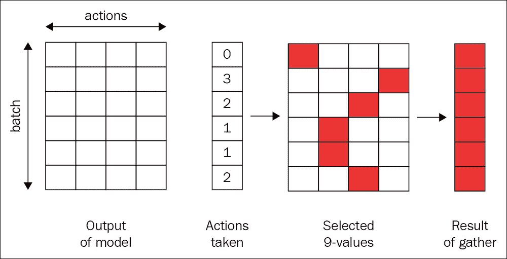

在上面的行中，我们将目标网络应用于我们的下一个状态观察，并计算沿着相同的*动作*维度 1 的最大 Q 值。函数`max()`同时返回最大值和那些值的索引(所以它同时计算 max 和 argmax)，这非常方便。然而，在这种情况下，我们只对值感兴趣，所以我们取结果的第一个条目。

在这里，我们提出一个简单但非常重要的观点:如果批次中的转换是从剧集的最后一步开始的，那么我们的动作值没有下一个状态的折扣奖励，因为没有下一个状态可以收集奖励。这可能看起来很小，但这在实践中非常重要:没有这一点，训练就不会收敛。

在这一行中，我们将该值从其计算图中分离出来，以防止梯度流入用于计算下一个状态的 Q 近似的神经网络。这很重要，因为如果没有这一点，我们损失的反向传播将开始影响当前状态和下一个状态的预测。然而，我们不想触及下一个状态的预测，因为它们在贝尔曼方程中用于计算参考 Q 值。为了阻止梯度流入图的这个分支，我们使用了张量的`detach()`方法，该方法返回的张量与其计算历史无关。在 PyTorch 的以前版本中，我们使用了`Variable`类的 volatile 属性，这在 0.4.0 版本中已经过时了。更多信息请参见第 3 章、*使用 PyTorch 进行深度学习*。

```
    next_state_values = tgt_net(next_states_v).max(1)[0]
```

最后，我们计算了贝尔曼近似值和均方误差损失。我们的损失函数计算到此结束，剩下的代码就是我们的训练循环。

```
    next_state_values[done_mask] = 0.0
```

首先，我们创建一个命令行参数的解析器。我们的脚本允许我们在不同于默认环境的环境中启用 CUDA 和训练。

```
    next_state_values = next_state_value.detach()
```

在这里，我们创建了应用了所有必需的包装器的环境、我们将要训练的神经网络以及具有相同架构的目标网络。开始时，它们会被初始化为不同的随机权重，但这并不重要，因为我们会每 1k 帧同步它们，这大致相当于 Pong 的一集。

```
    expected_state_action_values = next_state_values * GAMMA + rewards_v
    return nn.MSELoss()(state_action_values, expected_state_action_values)
```

然后，我们创建所需大小的体验重放缓冲区，并将其传递给代理。ε最初被初始化为 1.0，但每次迭代都会减小。

```
if __name__ == "__main__":
    parser = argparse.ArgumentParser()
    parser.add_argument("--cuda", default=False, action="store_true", help="Enable cuda")
    parser.add_argument("--env", default=DEFAULT_ENV_NAME,
                        help="Name of the environment, default=" + DEFAULT_ENV_NAME)
    parser.add_argument("--reward", type=float, default=MEAN_REWARD_BOUND,
                        help="Mean reward boundary for stop of training, default=%.2f" % MEAN_REWARD_BOUND)
    args = parser.parse_args()
    device = torch.device("cuda" if args.cuda else "cpu")
```

在训练循环之前，我们要做的最后一件事是创建一个优化器，一个完整剧集奖励的缓冲区，一个帧计数器和几个变量来跟踪我们的速度，以及达到的最佳平均奖励。每次我们的平均奖励打破记录，我们都会把模型保存在文件里。

```
    env = wrappers.make_env(args.env)
    net = dqn_model.DQN(env.observation_space.shape, env.action_space.n).to(device)
    tgt_net = dqn_model.DQN(env.observation_space.shape, env.action_space.n).to(device)
```

在训练循环的开始，我们计算完成的迭代次数，并根据我们的时间表减少ε。ε将在给定帧数(`EPSILON_DECAY_LAST_FRAME=100k`)期间线性下降，然后将保持在`EPSILON_FINAL=0.02`的相同水平。

```
    writer = SummaryWriter(comment="-" + args.env)
    print(net)

    buffer = ExperienceBuffer(REPLAY_SIZE)
    agent = Agent(env, buffer)
    epsilon = EPSILON_START
```

在这段代码中，我们要求代理在环境中执行一个步骤(使用我们当前的网络和 epsilon 的值)。仅当该步骤是剧集中的最后一步时，该函数才返回非无结果。在这种情况下，我们报告我们的进展。具体来说，我们在控制台和 TensorBoard 中计算并显示这些值:

```
    optimizer = optim.Adam(net.parameters(), lr=LEARNING_RATE)
    total_rewards = []
    frame_idx = 0
    ts_frame = 0
    ts = time.time()
    best_mean_reward = None
```

以每秒处理的帧数表示的速度

```
    while True:
        frame_idx += 1
        epsilon = max(EPSILON_FINAL, EPSILON_START - frame_idx / EPSILON_DECAY_LAST_FRAME)
```

播放的剧集数

```
        reward = agent.play_step(net, epsilon, device=device)
        if reward is not None:
            total_rewards.append(reward)
            speed = (frame_idx - ts_frame) / (time.time() - ts)
            ts_frame = frame_idx
            ts = time.time()
            mean_reward = np.mean(total_rewards[-100:])
            print("%d: done %d games, mean reward %.3f, eps %.2f, speed %.2f f/s" % (
                frame_idx, len(total_rewards), mean_reward, epsilon,
                speed
            ))
            writer.add_scalar("epsilon", epsilon, frame_idx)
            writer.add_scalar("speed", speed, frame_idx)
            writer.add_scalar("reward_100", mean_reward, frame_idx)
            writer.add_scalar("reward", reward, frame_idx)
```

前 100 集的平均奖励

*   当前值为ε

    ```
                if best_mean_reward is None or best_mean_reward < mean_reward:                 torch.save(net.state_dict(), args.env + "-best.dat")                 if best_mean_reward is not None:                     print("Best mean reward updated %.3f -> %.3f, model saved" % (best_mean_reward, mean_reward))                 best_mean_reward = mean_reward             if mean_reward > args.reward:                 print("Solved in %d frames!" % frame_idx)                 break
    ```

*   每次我们对最后 100 集的平均奖励达到最大值时，我们都会报告并保存模型参数。如果我们的平均回报超过了特定的界限，那么我们就停止训练。对于 Pong 来说，边界是 19.5，这意味着从 21 场可能的比赛中赢得 19 场以上的比赛。
*   在这里，我们检查我们的缓冲区对于训练来说是否足够大。开始时，我们应该等待足够的数据开始，在我们的例子中是 10k 转换。下一个条件是每隔`SYNC_TARGET_FRAMES`将参数从我们的主网络同步到目标网络，默认情况下是 1k。
*   训练循环的最后一部分非常简单，但需要最多的时间来执行:我们将梯度归零，从经验重放缓冲区中采样数据批次，计算损失，并执行优化步骤以最小化损失。

运行和性能

```
        if len(buffer) < REPLAY_START_SIZE:
            continue
        if frame_idx % SYNC_TARGET_FRAMES == 0:
            tgt_net.load_state_dict(net.state_dict())
```

这个例子就是对资源的需求。在 Pong 上，需要大约 40 万帧才能达到 17 的平均奖励(这意味着赢得超过 80%的游戏)。从 17 到 19.5 将需要类似数量的帧，因为我们的学习进度饱和，模型很难提高分数。因此，平均来说，需要一百万帧来完全训练它。在 GTX 1080 Ti 上，我的速度大约是每秒 150 帧，这是大约两个小时的训练。在 CPU 上，速度要慢得多:大约每秒九帧，大约需要一天半的时间。记住这是针对 Pong 的，相对容易解决。其他游戏需要数亿帧和 100 倍大的体验回放缓冲区。

```
        optimizer.zero_grad()
        batch = buffer.sample(BATCH_SIZE)
        loss_t = calc_loss(batch, net, tgt_net, device=device)
        loss_t.backward()
        optimizer.step()
```

在下一章，我们将看看研究人员自 2015 年以来发现的各种方法，这些方法有助于提高训练速度和数据效率。然而，对于雅达利来说，你需要资源和耐心。下图显示了包含训练动态的 TensorBoard 屏幕截图:


## 图 4:训练过程的特征(X 轴是迭代次数)

This example is demanding on resources. On Pong, it requires about 400k frames to reach a mean reward of 17 (which means winning more than 80% of games). A similar number of frames will be required to get from 17 to 19.5, as our learning progress saturates and it's hard for the model to improve the score. So, on average, a million frames are needed to train it fully. On the GTX 1080 Ti, I have a speed of about 150 frames per second, which is about two hours of training. On a CPU, the speed is much slower: about nine frames per second, which will take about a day and a half. Remember that this is for Pong, which is relatively easy to solve. Other games require hundreds of millions of frames and a 100 times larger experience replay buffer.

在培训开始时:

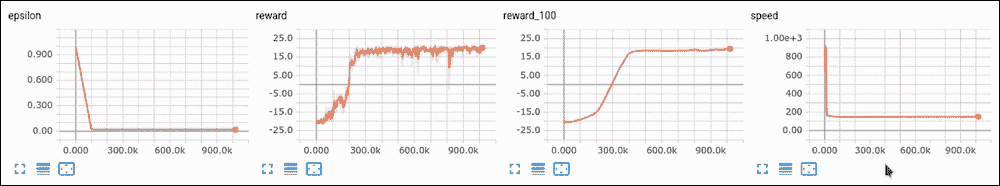

数百场比赛之后，我们的 DQN 应该开始考虑如何在 21 场比赛中赢一两场。由于 epsilon drop，速度已经下降:我们不仅需要将我们的模型用于训练，还需要用于环境步骤。

最后，在更多的游戏之后，它终于可以主宰并击败(不是很老练的)内置 Pong AI 对手:

您的行动榜样

```
rl_book_samples/Chapter06$ ./02_dqn_pong.py --cuda
DQN (
  (conv): Sequential (
    (0): Conv2d(4, 32, kernel_size=(8, 8), stride=(4, 4))
    (1): ReLU ()
    (2): Conv2d(32, 64, kernel_size=(4, 4), stride=(2, 2))
    (3): ReLU ()
    (4): Conv2d(64, 64, kernel_size=(3, 3), stride=(1, 1))
    (5): ReLU ()
  )
  (fc): Sequential (
    (0): Linear (3136 -> 512)
    (1): ReLU ()
    (2): Linear (512 -> 6)
  )
)
```

```
1048: done 1 games, mean reward -19.000, eps 0.99, speed 83.45 f/s
1894: done 2 games, mean reward -20.000, eps 0.98, speed 913.37 f/s
2928: done 3 games, mean reward -20.000, eps 0.97, speed 932.16 f/s
3810: done 4 games, mean reward -20.250, eps 0.96, speed 923.60 f/s
4632: done 5 games, mean reward -20.400, eps 0.95, speed 921.52 f/s
5454: done 6 games, mean reward -20.500, eps 0.95, speed 918.04 f/s
6379: done 7 games, mean reward -20.429, eps 0.94, speed 906.64 f/s
7409: done 8 games, mean reward -20.500, eps 0.93, speed 903.51 f/s
8259: done 9 games, mean reward -20.556, eps 0.92, speed 905.94 f/s
9395: done 10 games, mean reward -20.500, eps 0.91, speed 898.05 f/s
10204: done 11 games, mean reward -20.545, eps 0.90, speed 374.76 f/s
10995: done 12 games, mean reward -20.583, eps 0.89, speed 160.55 f/s
11887: done 13 games, mean reward -20.538, eps 0.88, speed 160.44 f/s
12949: done 14 games, mean reward -20.571, eps 0.87, speed 160.67 f/s
```

只是为了让你的等待更有趣一点，我们的代码保存了最佳模型的权重。在`Chapter06/03_dqn_play.py`文件中，我们有一个程序可以加载这个模型文件并播放一集，显示模型的动态。

```
101032: done 83 games, mean reward -19.506, eps 0.02, speed 143.06 f/s
103349: done 84 games, mean reward -19.488, eps 0.02, speed 142.99 f/s
106444: done 85 games, mean reward -19.424, eps 0.02, speed 143.15 f/s
108359: done 86 games, mean reward -19.395, eps 0.02, speed 143.18 f/s
110499: done 87 games, mean reward -19.379, eps 0.02, speed 143.01 f/s
113011: done 88 games, mean reward -19.352, eps 0.02, speed 142.98 f/s
115404: done 89 games, mean reward -19.326, eps 0.02, speed 143.07 f/s
117821: done 90 games, mean reward -19.300, eps 0.02, speed 143.03 f/s
121060: done 91 games, mean reward -19.220, eps 0.02, speed 143.10 f/s
```

代码非常简单，但是只通过观察像素，看看几个有一百万个参数的矩阵如何以超人的精度玩 Pong，就像变魔术一样。

```
982059: done 520 games, mean reward 19.500, eps 0.02, speed 145.14 f/s
984268: done 521 games, mean reward 19.420, eps 0.02, speed 145.39 f/s
986078: done 522 games, mean reward 19.440, eps 0.02, speed 145.24 f/s
987717: done 523 games, mean reward 19.460, eps 0.02, speed 145.06 f/s
989356: done 524 games, mean reward 19.470, eps 0.02, speed 145.07 f/s
991063: done 525 games, mean reward 19.510, eps 0.02, speed 145.31 f/s
Best mean reward updated 19.500 -> 19.510, model saved
Solved in 991063 frames!
```


## 开始时，我们导入熟悉的 PyTorch 和 Gym 模块。前面的 FPS 参数指定了所示帧的大致速度。

该脚本接受保存的模型的文件名，并允许指定 Gym 环境(当然，模型和环境必须匹配)。另外，你可以用一个不存在的目录名来传递选项`-r`，它将被用来保存你的游戏视频(使用`Monitor`包装)。默认情况下，脚本只显示帧，但如果你想上传你的模型的游戏到 YouTube，例如，`-r`可能会很方便。

前面的代码应该是清晰的，没有注释:我们创建环境和模型，然后从参数中传递的文件中加载权重。

```
import gym
import time
import argparse
import numpy as np
import torch
from lib import wrappers
from lib import dqn_model

DEFAULT_ENV_NAME = "PongNoFrameskip-v4"
FPS = 25
```

这几乎是来自训练代码的`Agent`类的方法`play_step()`的精确拷贝，缺少ε-贪婪动作选择。我们只是将我们的观察传递给代理，并选择具有最大值的动作。这里唯一的新东西是环境中的`render()`方法，这是 Gym 中显示当前观察的标准方式(为此你需要一个 GUI)。

```
If __name__ == "__main__":
    parser = argparse.ArgumentParser()
    parser.add_argument("-m", "—model", required=True, help="Model file to load")
    parser.add_argument("-e", "—env", default=DEFAULT_ENV_NAME,
                        help="Environment name to use, default=" + DEFAULT_ENV_NAME)
    parser.add_argument("-r", "—record", help="Directory to store video recording")
    args = parser.parse_args()
```

代码的其余部分也很简单。我们将动作传递给环境，计算总回报，并在剧集结束时停止循环。

```
    env = wrappers.make_env(args.env)
    if args.record:
        env = gym.wrappers.Monitor(env, args.record)
    net = dqn_model.DQN(env.observation_space.shape, env.action_space.n)
    net.load_state_dict(torch.load(args.model))
```

尝试:如果你很好奇，想自己尝试本章的内容，那么这里有一个简短的探索方向列表。但是要注意:它们会花费大量的时间，并且会在你的实验中给你带来一些挫折。然而，从实用的角度来看，这些实验是真正掌握材料的非常有效的方法:

```
    state = env.reset()
    total_reward = 0.0
    while True:
        start_ts = time.time()
        env.render()
        state_v = torch.tensor(np.array([state], copy=False))
        q_vals = net(state_v).data.numpy()[0]
        action = np.argmax(q_vals)
```

试着从 Atari 套装里拿一些其他游戏，比如 Breakout 或者 Atlantis 或者 RiverRaid(我小时候的最爱)。这可能需要调整超参数。

```
        state, reward, done, _ = env.step(action)
        total_reward += reward
        if done:
            break
        delta = 1/FPS - (time.time() - start_ts)
        if delta > 0:
            time.sleep(delta)
    print("Total reward: %.2f" % total_reward)
```

作为 FrozenLake 的替代，还有另一个表格环境 Taxi，它模拟了一个需要搭载乘客并将他们带到目的地的出租车司机。

玩乒乓超参数。有可能训练得更快吗？OpenAI 声称它可以使用 A3C 方法在 30 分钟内解决 Pong(这是本书第三部分的一个主题)。也许有了 DQN 就有可能了。

*   你能让 DQN 训练代码更快吗？OpenAI Baselines 项目在 GTX 1080 Ti 上使用 TensorFlow 显示每秒 350 帧。因此，看起来优化 PyTorch 代码是可能的。
*   你能得到平均分数为 21 的终极 Pong 支配者模型吗？这应该不会很难:学习率衰减是显而易见的尝试方法。
*   总结
*   在这一章中，我们介绍了许多新的和复杂的材料。我们熟悉了值迭代在具有大观察空间的复杂环境中的局限性，并讨论了如何用 Q-learning 来克服它们。我们在 FrozenLake 环境中检查了 Q 学习算法，并讨论了神经网络对 Q 值的逼近以及这种逼近带来的额外复杂性。我们介绍了 dqn 提高训练稳定性和收敛性的几个技巧，比如经验重放缓冲、目标网络和帧堆叠。最后，我们将这些扩展组合成一个 DQN 的单一实现，它解决了 Atari 游戏套件中的 Pong 环境。
*   在下一章中，我们将看看研究人员自 2015 年以来发现的一系列提高 DQN 收敛和质量的技巧，这些技巧(结合起来)可以在 54 款雅达利游戏中的大多数游戏上产生最先进的结果。这套在 2017 年发布，我们将分析并重新实现所有的技巧。


# Summary

In this chapter, we introduced lots of new and complex material. We became familiar with the limitations of value iteration in complex environments with large observation spaces and discussed how to overcome them with Q-learning. We checked the Q-learning algorithm on the FrozenLake environment and discussed the approximation of Q-values with neural networks and the extra complications that arise from this approximation. We covered several tricks for DQNs to improve their training stability and convergence, such as experience replay buffer, target networks, and frame stacking. Finally, we combined those extensions in to one single implementation of DQN that solves the Pong environment from the Atari games suite.

In the next chapter, we'll look at a set of tricks that researchers have found, since 2015, to improve DQN convergence and quality, which (combined) can produce state-of-the-art results on most of the 54 Atari games. This set was published in 2017 and we'll analyze and reimplement all of the tricks.