# 第七章。DQN 扩展公司

在上一章中，我们实现了 DeepMind 在 2015 年发布的深度 Q-网络(DQN)模型。这篇论文对强化学习(RL)领域产生了重大影响，它表明，尽管普遍认为，在 RL 中使用非线性近似器是可能的。这个概念证明激发了人们对深度 Q 学习领域特别是深度 RL 的兴趣。

从那以后，人们提出了许多改进，以及对基本架构的调整，这些改进显著提高了 DeepMind 发明的基本 DQN 的收敛性、稳定性和采样效率。在这一章中，我们将更深入地研究其中的一些观点。非常方便的是，2017 年 10 月，DeepMind 发表了一篇名为*Rainbow:Combining Improvements in Deep Reinforcement Learning*(【1】*Hessel and others*，2017)的论文，该论文提出了 DQN 最重要的七项改进，其中一些是在 2015 年发明的，但有些是最近才发明的。在这篇论文中，Atari Games suite 上的最新结果是通过将所有这七种方法结合在一起得到的。

本章将介绍所有这些方法。我们将分析他们背后的想法，以及他们是如何实现的，并与经典的 DQN 表演进行比较。最后，我们将检查所有方法的组合系统。

我们将熟悉的 DQN 扩展如下:

*   **N 步 DQN** :如何通过简单地展开贝尔曼方程来提高收敛速度和稳定性，以及为什么它不是最终的解决方案
*   **双 DQN** :如何应对 DQN 高估价值观的行动
*   **噪声网络**:如何通过在网络权重中增加噪声来提高探索效率
*   **优先重放缓冲区**:为什么我们经验的统一采样不是最好的训练方式
*   **决斗 DQN** :如何通过使我们的网络架构更加紧密来提高收敛速度代表了我们正在解决的问题
*   **分类 DQN** :如何超越行动的单一期望值，使用完全分布

首先，我们应该通过在我们的 DQN 代码中加入更高级的库来简化我们的实验。


# py torch 代理网库

在[第六章](part0043_split_000.html#190861-ce551566b6304db290b61e4d70de52ee "Chapter 6. Deep Q-Networks")、*深度 Q 网*中，我们从零开始实现了一个 DQN，只用到了 PyTorch、OpenAI Gym、`pytorch-tensorboard`。它满足了我们演示事物如何工作的需要，但现在我们要通过额外的调整来扩展基本的 DQN。有些调整非常简单和琐碎，但有些需要对代码进行重大修改。为了能够只关注重要的部分，拥有一个尽可能小而简洁的 DQN 版本是非常有用的，最好是具有可重用的代码段。当你在试验一些发表在论文中的方法或你自己的想法时，这将非常有帮助。在这种情况下，您不需要一次又一次地重新实现相同的功能，与不可避免的错误作斗争。

考虑到这一点，不久前我开始为深度 RL 领域实现自己的工具包。我把它叫做 PTAN，代表 PyTorch Agent Net，因为它的灵感来自另一个叫做 Agent Net 的开源库([https://github.com/yandexdataschool/AgentNet](https://github.com/yandexdataschool/AgentNet))。我在 PTAN 尝试遵循的基本设计原则如下:

*   尽可能简单和干净
*   py torch-本土性
*   包含小的、可重用的功能块
*   扩展性和灵活性

该库可在 GitHub:[https://github.com/Shmuma/ptan](https://github.com/Shmuma/ptan)获得。所有后续示例都是使用 PTAN 0.3 版实现的，可以通过运行以下命令将其安装在您的虚拟环境中:

```
pip install ptan==0.3

```

让我们看看 PTAN 提供的基本构件。


## 代理

代理实体提供了一种统一的方式来连接来自环境的**观察**和我们想要执行的**动作**。到目前为止，我们只看到了一个简单的、无状态的 DQN 代理，它使用神经网络从当前观察中获取动作值，并对这些值表现出贪婪的行为。我们已经使用ε-贪婪行为来探索环境，但这并没有改变多少情况。

在 RL 领域，这可能更复杂。例如，我们的代理可以预测动作的概率分布，而不是预测动作的值。这样的代理被称为策略代理，我们将在本书的第三部分讨论这些方法。另一个要求可能是代理中的某种内存。例如，通常一次观察(或者甚至 k 次最后观察)不足以做出关于动作的决定，我们希望在代理中保留一些记忆来捕获必要的信息。RL 的整个子域试图用部分可观察马尔可夫决策过程(POMDP)形式来解决这种复杂性。我们将在本书的最后一部分简要地谈到这个案例。

为了捕获所有这些变体并使代码具有灵活性，PTAN 中的代理被实现为一个可扩展的类层次结构，其中`ptan.agent.BaseAgent`抽象类位于顶部。从高层来看，代理需要接受一批观察(以 NumPy 数组的形式)并返回代理想要采取的一批操作。批处理用于提高处理效率，因为在 GPU 中一次处理多个观察值通常比单独处理它们要快得多。抽象基类不定义输入和输出的类型，这使得它非常灵活，易于扩展。例如，在连续域中，我们的动作不再是离散动作的索引，而是浮动值。

对应于我们当前 DQN 需求的代理是`ptan.agent.DQNAgent`，它使用提供的 PyTorch `nn.Module`将一批观察值转换成行动值。为了将网络的输出转换成要采取的实际动作，`DQNAgent`类需要在创建时传递第二个对象:动作选择器。

动作选择器的目的是将网络的输出(通常是一个数字向量)转换成某种动作。在离散动作空间的情况下，动作将是要采取的一个或几个动作索引。PTAN 中有两个我们需要的动作选择器:`ptan.actions.ArgmaxActionSelector`和`ptan.actions.EpsilonGreedyActionSelector`。正如您可能从名称中猜到的，第一个(`ArgmaxActionSelector`)将 argmax 应用于所提供的值，这对应于对 Q 值的贪婪操作。

第二个动作选择器支持ε-贪婪行为，将ε作为参数，并以此概率采取随机动作而不是贪婪选择。要将所有这些结合在一起，为 CartPole 创建代理，使用ε-greedy 操作选择，我们可以编写以下代码:

```
import gym
import ptan
import numpy as np
import torch.nn as nn

env = gym.make("CartPole-v0")
net = nn.Sequential(nn.Linear(env.observation_space.shape[0], 256),nn.ReLU(),nn.Linear(256, env.action_space.n))

action_selector = ptan.actions.EpsilonGreedyActionSelector(epsilon=0.1)agent = ptan.agent.DQNAgent(net, action_selector)
```

然后，我们可以将观察结果传递给代理，询问它要采取的行动。

```
>>> obs = np.array([env.reset()], dtype=np.float32)
>>> agent(obs)
(array([0]), [None])
```

结果元组中的第一项是要采取的一批动作，而第二个值与有状态代理相关，应该被忽略。在运行期间，我们可以在动作选择器中更改 epsilon 属性，以更改训练期间的随机动作概率。


## 代理的经验

第二个在 PTAN 重要的抽象是所谓的*经验来源*。在前一章的 DQN 例子中，我们使用了单步体验片段，它包括四件事:

*   在某一时间步观察到的环境状态: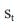
*   代理已采取的操作: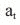
*   代理获得的奖励: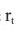
*   下一个状态的观察: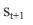

我们使用这些值(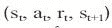)通过贝尔曼方程更新我们的 Q 近似值。然而，对于一般情况，我们可以对更长的经验链感兴趣，包括主体与环境交互的更多时间步骤。

贝尔曼的方程也可以展开到更长的经验链。

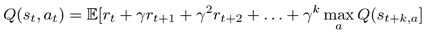

本章讨论的提高 DQN 稳定性和收敛性的方法之一就是这样做的:将贝尔曼方程向前展开 k 步(当 *k* 通常是 2...5)我们显著提高了我们训练收敛的速度。

为了以一种通用的方式支持这种情况，在 PTAN 我们有`ptan.experience.ExperienceSourceFirstLast` 类，它接受环境和代理，并向我们提供经验元组流:(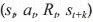)，其中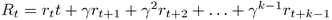。当 *k = 1* 时，就是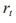。

这个类自动处理剧集结尾的情况，通过将最后一个元组条目设置为 None 来让我们了解它们。在这种情况下，会自动执行环境重置。类`ExperienceSourceFirstLast`公开迭代器接口，在每次迭代中生成有经验的元组。该类的示例如下:

```
>> exp_source = ptan.experience.ExperienceSourceFirstLast(env, agent, gamma=0.99, steps_count=1)
>> it = iter(exp_source)
>> next(it)
ExperienceFirstLast(state=array([ 0.03937284, -0.01242409,  0.03980117,  0.02457287]), action=0, reward=1.0, last_state=array([ 0.03912436, -0.20809355,  0.04029262,  0.32954308]))
```


## 经验缓冲区

在 DQN 的例子中，一旦我们得到了经验，我们很少想要从中学习。我们通常将它存储在某个大的缓冲区中，并从中进行随机抽样，以获得用于训练的小批次。这个场景由`ptan.experience.ExperienceReplayBuffer` 类支持，它与我们在前一章看到的实现非常相似。为了构造它，我们需要传递经验源和缓冲区的大小。通过调用`populate(n) method`，我们要求缓冲区从经验源中提取 n 个例子，并将它们存储在缓冲区中。`sample(batch_size)`方法从当前缓冲区内容中返回一个给定大小的随机样本。


## 健身房环境包装纸

为了避免一遍又一遍地实现(或复制粘贴)通用的 Atari 包装器，我把它们放在了`ptan.common.wrappers`模块中。它们与 OpenAI 基线项目:[https://github.com/openai/baselines](https://github.com/openai/baselines)中可用的包装器基本相同(有微小的特定于 PyTorch 的修改)。要将 Atari 环境总结成一行，调用`ptan.common.wrappers.wrap_dqn(env)`方法就足够了。基本就是这样！正如我之前说过的，PTAN 不应该是最终的 RL 框架。它只是一个设计用来一起使用的实体的集合，但彼此不太依赖。


# 基本 DQN

通过结合上述所有内容，我们可以用一种更短但仍然灵活的方式重新实现同一个 DQN 代理，这在以后我们开始修改和更改 DQN 的各个部分以使 DQN 更好时会变得很方便。

在基本 DQN 实施中，我们有三个模块:

*   `Chapter07/lib/dqn_model.py`:DQN 神经网络，和我们在上一章看到的一样
*   `Chapter07/lib/common.py`:本章示例中使用的通用函数，但是过于专业，不能移到 PTAN
*   `Chapter07/01_dqn_basic.py`:创建所有用过的片段和训练循环

先说`lib/common.py`的内容。首先，我们有 Pong 环境的超参数，这在前一章已经介绍过了。超参数存储在 dict 中，键作为配置名，值作为参数的 dict。这使得为更复杂的 Atari 游戏添加另一个配置集变得容易。

```
HYPERPARAMS = {
    'pong': {
        'env_name':         "PongNoFrameskip-v4",
        'stop_reward':      18.0,
        'run_name':         'pong',
        'replay_size':      100000,
        'replay_initial':   10000,
        'target_net_sync':  1000,
        'epsilon_frames':   10**5,
        'epsilon_start':    1.0,
        'epsilon_final':    0.02,
        'learning_rate':    0.0001,
        'gamma':            0.99,
        'batch_size':       32
    },
}
```

此外，common.py 有一个函数，它获取一批转换并将其打包到 NumPy 数组集中。从`ExperienceSourceFirstLast`开始的每个转换都有一个类型为`namedtuple`的转换，包含以下字段:

*   `state`:从环境中观察。
*   `action`:代理采取的整数动作。
*   `rewards`:如果我们已经创造了属性为`steps_count=1`的`ExperienceSourceFirstLast`，那就是直接奖励。对于更大的步数，它包含该步数的折扣奖励总额。
*   `last_state`:如果转换对应于环境中的最后一步，则该字段为`None`，否则包含经验链中的最后一次观察。

`unpack_batch`的代码如下:

```
def unpack_batch(batch):
    states, actions, rewards, dones, last_states = [], [], [], [], []
    for exp in batch:
        state = np.array(exp.state, copy=False)
        states.append(state)
        actions.append(exp.action)
        rewards.append(exp.reward)
        dones.append(exp.last_state is None)
        if exp.last_state is None:
            last_states.append(state)
       # the result will be masked anyway
        else:
            last_states.append(np.array(exp.last_state, copy=False))
    return np.array(states, copy=False), np.array(actions), np.array(rewards, dtype=np.float32), \
           np.array(dones, dtype=np.uint8), np.array(last_states, copy=False)
```

请注意我们如何处理批处理中的最终转换。为了避免这种情况的特殊处理，对于终端转换，我们将初始状态存储在`last_states`数组中。为了使我们对 Bellman 更新的计算正确，我们将在损失计算期间使用`dones`数组屏蔽这样的批量条目。另一个解决方案是只为非终结跃迁计算最后状态的值，但这会使我们的损失函数逻辑变得更加复杂。

损失函数和我们在上一章中的完全一样。我们计算从第一个状态采取的动作的值，然后使用贝尔曼方程计算相同动作的值。由此产生的损耗是这两个量之间的均方误差:

```
def calc_loss_dqn(batch, net, tgt_net, gamma, device="cpu"):
    states, actions, rewards, dones, next_states = unpack_batch(batch)

    states_v = torch.tensor(states).to(device)
    next_states_v = torch.tensor(next_states).to(device)
    actions_v = torch.tensor(actions).to(device)
    rewards_v = torch.tensor(rewards).to(device)
    done_mask = torch.ByteTensor(dones).to(device)

    state_action_values = net(states_v).gather(1, actions_v.unsqueeze(-1)).squeeze(-1)
    next_state_values = tgt_net(next_states_v).max(1)[0]
    next_state_values[done_mask] = 0.0

    expected_state_action_values = next_state_values.detach() * gamma + rewards_v
    return nn.MSELoss()(state_action_values, expected_state_action_values)
```

此外，在`common.py,`中，我们有两个实用程序类来帮助我们简化训练循环:

```
class EpsilonTracker:
    def __init__(self, epsilon_greedy_selector, params):
        self.epsilon_greedy_selector = epsilon_greedy_selector
        self.epsilon_start = params['epsilon_start']
        self.epsilon_final = params['epsilon_final']
        self.epsilon_frames = params['epsilon_frames']
        self.frame(0)

    def frame(self, frame):
        self.epsilon_greedy_selector.epsilon = \
            max(self.epsilon_final, self.epsilon_start - frame / self.epsilon_frames)
```

`EpsilonTracker`类接受的实例`EpsilonGreedyActionSelector`和我们的超参数用于特定的配置。此外，在其唯一的方法`frame()`中，它根据标准的 DQNε衰减时间表更新ε的值:在第一个`epsilon_frames`步骤中线性减小它，然后保持它恒定。

第二个类，`RewardTracker,`应该在每集结束时被告知总奖励，并跟踪上一集的平均奖励，报告 TensorBoard 和控制台中的当前值，最后，检查游戏是否已成功解决。它还测量每秒帧数的速度，了解这一点很有用，因为性能是训练的一个重要指标。

```
class RewardTracker:
    def __init__(self, writer, stop_reward):
        self.writer = writer
        self.stop_reward = stop_reward

    def __enter__(self):
        self.ts = time.time()
        self.ts_frame = 0
        self.total_rewards = []
        return self

    def __exit__(self, *args):
        self.writer.close()
```

实现该类是为了用作上下文管理器，在退出时自动关闭 TensorBoard 编写器。在`reward()`方法中执行主逻辑，每次一集结束时都会调用该方法。它与上一章的训练循环代码基本相同。

```
    def reward(self, reward, frame, epsilon=None):
        self.total_rewards.append(reward)
        speed = (frame - self.ts_frame) / (time.time() - self.ts)
        self.ts_frame = frame
        self.ts = time.time()
        mean_reward = np.mean(self.total_rewards[-100:])
        epsilon_str = "" if epsilon is None else ", eps %.2f" % epsilon
        print("%d: done %d games, mean reward %.3f, speed %.2f f/s%s" % (
            frame, len(self.total_rewards), mean_reward, speed, epsilon_str
        ))
        sys.stdout.flush()
        if epsilon is not None:
            self.writer.add_scalar("epsilon", epsilon, frame)
        self.writer.add_scalar("speed", speed, frame)
        self.writer.add_scalar("reward_100", mean_reward, frame)
        self.writer.add_scalar("reward", reward, frame)
        if mean_reward > self.stop_reward:
            print("Solved in %d frames!" % frame)
            return True
        return False
```

`common.py`到此为止。它还有另一个功能，现在还不相关，将在后面的示例中使用。现在，让我们来看看`01_dqn_basic.py`，它只包含所需类的创建和训练循环。

```
#!/usr/bin/env python3
import gym
import ptan
import argparse
import torch
import torch.optim as optim
from tensorboardX import SummaryWriter
from lib import dqn_model, common
```

首先，我们导入所需的模块。

```
if __name__ == "__main__":
    params = common.HYPERPARAMS['pong']
    parser = argparse.ArgumentParser()
    parser.add_argument("--cuda", default=False, action="store_true", help="Enable cuda")
    args = parser.parse_args()
    device = torch.device("cuda" if args.cuda else "cpu")

    env = gym.make(params['env_name'])
    env = ptan.common.wrappers.wrap_dqn(env)
```

然后，我们获得 Pong 游戏的超参数，解析 CUDA 的选项并创建我们的环境。接下来，我们使用 PTAN 的 DQN 包装器，它将一组通用的预处理应用到环境中。

```
    writer = SummaryWriter(comment="-" + params['run_name'] + "-basic")
    net = dqn_model.DQN(env.observation_space.shape, env.action_space.n).to(device)
    tgt_net = ptan.agent.TargetNet(net)
```

然后，我们使用观察和动作的维度为 TensorBoard 和我们的 DQN 神经网络(NN)创建一个摘要编写器。`ptan.agent.TargetNet`类是一个非常简单的网络包装器，它允许我们创建神经网络权重的副本，并定期同步它们。

```
    selector = ptan.actions.EpsilonGreedyActionSelector(epsilon=params['epsilon_start'])
    epsilon_tracker = common.EpsilonTracker(selector, params)
    agent = ptan.agent.DQNAgent(net, selector, device=device)
```

这里我们创建了我们的代理，它需要一个网络来将观察值转换成动作值，还需要一个动作选择器来决定采取哪个动作。对于动作选择器，我们使用ε贪婪策略，ε根据超参数定义的时间表衰减。

```
    exp_source = ptan.experience.ExperienceSourceFirstLast(env, agent, gamma=params['gamma'], steps_count=1)
    buffer = ptan.experience.ExperienceReplayBuffer(exp_source, buffer_size=params['replay_size'])
```

下一个要定义的元素是我们的经验源，这是一个单步`ExperienceSourceFirstLast`和经验重放缓冲区，它将存储固定数量的过渡。

```
    optimizer = optim.Adam(net.parameters(), lr=params['learning_rate'])
    frame_idx = 0
```

训练循环之前需要的最后一步是优化器和帧计数器。

```
    with common.RewardTracker(writer, params['stop_reward']) as reward_tracker:
        while True:
            frame_idx += 1
            buffer.populate(1)
            epsilon_tracker.frame(frame_idx)
```

在训练循环的开始，我们创建奖励跟踪器，它将报告每一集完成的平均奖励，增加帧计数器，并要求我们的经验重放缓冲器从经验源中提取一个过渡。对`buffer.populate(1)`的调用将在 PTAN 库内部启动以下动作链:

*   `ExperienceReplayBuffer`会要求经验源获得下一个过渡。
*   经验源将当前观察反馈给代理以获得动作。
*   代理将把神经网络应用到观察中来计算 Q 值，然后要求动作选择器选择要采取的动作。
*   动作选择器(是一个ε贪婪选择器)将生成随机数来检查如何行动:贪婪还是随机。在这两种情况下，它将决定采取何种行动。
*   行动将被返回到经验源，经验源将把行动反馈到环境中，以获得奖励和下一次观察。所有这些数据(当前观察、行动、奖励和下一次观察)都将返回到缓冲区。
*   缓冲区将存储转换，推出旧的观察值以保持其长度不变。

以上所有内容可能看起来很复杂，但是，基本上，它与我们之前完成的过程是相同的，只是以不同的方式包装。

```
            new_rewards = exp_source.pop_total_rewards()
            if new_rewards:
                if reward_tracker.reward(new_rewards[0], frame_idx, selector.epsilon):
                    break
```

上面的训练循环向经验源请求已完成剧集的奖励列表(未打折的总奖励),并将其传递给奖励跟踪器以报告和检查训练是否已完成。因为我们之前只执行了一个步骤，所以可能只有一集或零集完成。如果奖励跟踪器返回 True，则表明平均奖励已经达到分数界限，我们可以停止训练。

```
            if len(buffer) < params['replay_initial']:
                continue
```

在这里，我们检查缓冲区的长度是否足以开始训练。否则，我们就等着收集更多的数据。

```
            optimizer.zero_grad()
            batch = buffer.sample(params['batch_size'])
            loss_v = common.calc_loss_dqn(batch, net, tgt_net.target_model, gamma=params['gamma'], device=device)
            loss_v.backward()
            optimizer.step()
```

这部分执行标准的随机梯度下降(SGD)更新。我们对梯度进行调零，从体验回放缓冲区对迷你批次进行采样，并使用我们已经看到的函数计算损耗。

```
            if frame_idx % params['target_net_sync'] == 0:
                tgt_net.sync()
```

训练循环的最后一部分在我们的主模型(被训练)和目标网络之间执行定期同步，我们在贝尔曼更新中使用该目标网络来计算动作值。

好的，让我们训练模型并检查它的收敛性。

```
rl_book_samples/Chapter07$ ./01_dqn_basic.py --cuda
865: done 1 games, mean reward -20.000, eps 0.99, speed 364.42 f/s
2147: done 2 games, mean reward -20.500, eps 0.98, speed 493.27 f/s
3061: done 3 games, mean reward -20.333, eps 0.97, speed 493.09 f/s
3974: done 4 games, mean reward -20.500, eps 0.96, speed 492.45 f/s
4810: done 5 games, mean reward -20.600, eps 0.95, speed 490.46 f/s
5836: done 6 games, mean reward -20.500, eps 0.94, speed 495.29 f/s
6942: done 7 games, mean reward -20.571, eps 0.93, speed 491.58 f/s
7953: done 8 games, mean reward -20.500, eps 0.92, speed 491.78 f/s
9109: done 9 games, mean reward -20.444, eps 0.91, speed 492.71 f/s
...
```

输出中的每一行都写在下一集的结尾，显示当前帧计数器、已完成集的数量、最近 100 场游戏的平均奖励、epsilon 和计算速度。在前 10k 帧期间，速度很快，因为我们不进行训练，等待我们的重放缓冲区被填充。对于基本的 DQN 版本，通常需要大约 100 万帧才能达到 17 的平均回报，所以请耐心等待。训练结束后，我们可以在 TensorBoard 中查看训练过程的动态，其中显示了 epsilon、原始奖励值、平均奖励和速度的图表。

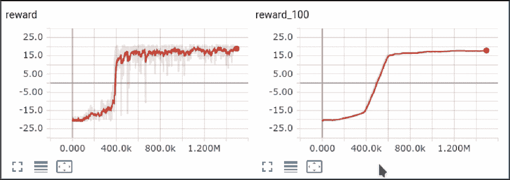

图 1:一个基本 DQN 实现的收敛


# N 步 DQN

我们将实施和评估的第一个改进是一个非常老的改进。它是由 Richard Sutton 在论文中首次提出的([2] Sutton，1988)。为了得到这个想法，让我们再一次看看 Q-learning 中使用的贝尔曼更新。

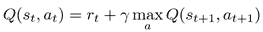

这个方程是递归的，这意味着我们可以用它本身来表示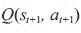，这给了我们这个结果:

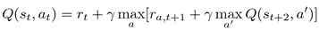

值 r [*a，t+1*] 表示发布动作 *a* 后，t+1 时刻的局部奖励。然而，如果我们假设我们在步骤 *t+1* 中的动作 a 是最优选择的，或者接近最优选择，我们可以省略*max*[*a*]and 运算，并获得:

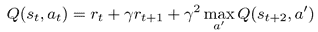

这个值可以一次又一次地展开任意次。正如您可能猜到的，通过用 n 步的更长转换序列替换一步转换采样，这种展开可以很容易地应用于我们的 DQN 更新。为了理解为什么这种展开会帮助我们加速训练，让我们考虑下面的例子。这里我们有一个四个状态的简单环境，s [1] ，s [2] ，s [3] ，s [4] ，以及在每个状态下唯一可用的动作，除了 s [4] ，它是一个终止状态。

图 2:一个简单环境的转换图

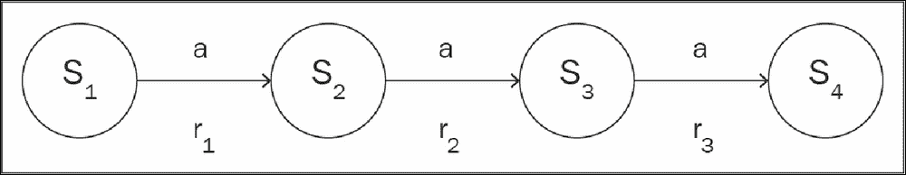

Figure 2: A transition diagram for a simple environment

那么，在单步执行的情况下会发生什么呢？我们总共有三个可能的更新(我们不使用 *max* ，因为只有一个动作可用):

Q(s [1] ，a) ← r [1] + γ Q(s [2] ，a)

1.  Q(s [2] ，a) ← r [2] + γ Q(s [3] ，a)
2.  Q(s [3] ，a) ← r [3]
3.  让我们想象一下，在培训开始时，我们按照这个顺序完成上面的更新。前两次更新将是无用的，因为我们当前的 Q(s [2] ，a)和 Q(s [3] ，a)是不正确的，并且包含初始随机数据。唯一有用的更新将是更新三，其在终止状态之前正确地将奖励 r [3] 分配给状态 s [3] 。现在让我们一遍又一遍地完成上面的更新。在第二次迭代时，正确的值将被分配给 Q(s [2] ，a)，但是 Q(s [1] ，a)的更新仍然会有噪声。只有在第三次迭代中，我们才能得到所有 *Q* 的有效值。因此，即使在一步的情况下，也需要三步*将正确的值传播到所有状态*。

现在让我们考虑一个两步的情况。这种情况又有三个更新:

Q(s [1] ，a)←r[1]+γr[2]+γ²Q(s[3]，a)

1.  Q(s [2] ，a) ← r [2] + γr [3]
2.  Q(s [3] ，a) ← r [3]
3.  在这种情况下，在更新的第一次循环中，正确的值将被分配给 Q(s [2] ，a)和 Q(s [3] ，a)。在第二次迭代时，Q(s [1] ，a)的值也将被适当地更新。因此，多个步骤提高了值的传播速度，从而提高了收敛性。好吧，你可能会想，如果这真的有帮助，让我们展开贝尔曼方程，比方说，向前 100 步。会让我们的收敛速度加快 100 倍吗？很遗憾，答案是否定的。

尽管我们有所期待，但我们的 DQN 将根本不会趋同。为了理解为什么，让我们再次回到我们的展开过程，特别是我们放下了 *max* [*a*] 的地方。这是正确的吗？严格地说，没有。我们已经省略了中间步骤的 max 操作，假设我们在经验收集期间的动作选择(或者我们的*策略*)是最优的。如果不是呢，比如说，在训练开始的时候，我们的特工随机行动的时候？在这种情况下，我们对 Q(st，at)的计算值可能小于状态的最佳值(正如我们随机采取的一些步骤，但不是通过最大化 Q 值来遵循最有希望的路径)。我们展开贝尔曼方程的步骤越多，我们的更新就可能越不正确。

我们的大经验重放缓冲区将使情况变得更糟，因为它增加了从旧的坏策略(由 Q 的旧的坏近似决定)获得转换的机会。这会导致当前 Q 近似值的错误更新，因此很容易打断我们的训练进度。上述问题是 RL 方法的一个基本特征，在第四章、*交叉熵方法、*中我们谈到 RL 方法的分类时曾简要提及。有两大类:不符合策略的方法和符合策略的方法。

第一类非策略方法不依赖于“数据的新鲜度”。例如，简单的 DQN 是不符合策略的，这意味着我们可以使用几百万步前从环境中采样的非常旧的数据，并且这些数据对于学习仍然是有用的。这是因为我们只是更新了行动 Q(s [t] ，a [t] )的价值，加上最佳行动价值的贴现当前近似值。即使在的动作是随机抽样的，也没有关系，因为对于在 st 状态下的这个特定动作，我们的更新将是正确的。这就是为什么在非策略方法中，我们可以使用非常大的经验缓冲区来使我们的数据更接近于**独立和同分布** ( **i.i.d** )。

另一方面，基于策略的方法严重依赖于根据我们正在更新的当前策略进行采样的训练数据。发生这种情况是因为政策上的方法试图间接地(如上面的 n 步 DQN)或直接地(这本书的整个第三部分都致力于这种方法)改善当前的政策。

那么，哪一类方法比较好呢？嗯，看情况。非策略方法允许您在以前的大量历史数据上进行训练，甚至在人类演示上进行训练，但是，通常，它们收敛速度较慢。基于策略的方法通常更快，但需要来自环境的更多新数据，这可能成本高昂。想象一辆用政策方法训练的自动驾驶汽车。在系统知道墙和树是它应该避开的东西之前，它会让你付出很多撞车的代价。

你可能会有一个问题:如果这个“n 步”将它变成一个政策上的方法，这将使我们的大经验缓冲区无用，为什么我们要谈论一个 n 步 DQN？在实践中，这通常不是非黑即白的。如果 n 步 DQN 有助于加速 DQNs，您仍然可以使用它，但您需要适度选择 n。2 或 3 的小值通常很好，因为我们在经验缓冲区中的轨迹与一步过渡没有太大不同。在这种情况下，收敛速度通常成比例地提高，但是 n 的大的值会破坏训练过程。因此，应该调整步骤的数量，但是加快收敛速度通常是值得的。

实施


## 由于`ExperienceSourceFirstLast`类已经支持多步贝尔曼展开，我们的 DQN 的 n 步版本非常简单。我们只需要对基本 DQN 进行两处修改，就可以将其变成 n 步版本:

传递我们希望在`steps_count parameter`中的`ExperienceSourceFirstLast`创建上展开的步骤数。

*   将正确的伽马值传递给`calc_loss_dqn`函数。这种修改确实很容易被忽略，但它可能对收敛有害。由于我们的更夫现在是 n 步，经验链中最后一个状态的折现系数将不再只是γ，而是γ ^n 。
*   您可以在`Chapter07/02_dqn_n_steps.py`中找到完整的示例，但以下是修改后的行:

`args.n`值是命令行参数中传递的步数，默认情况下使用 2 步。

```
    exp_source = ptan.experience.ExperienceSourceFirstLast(env, agent, gamma=params['gamma'], steps_count=args.n)
```

下面是简单 DQN(浅色线)和两步 DQN(深色线)的回报和平均 100 点回报的图表。

```
    loss_v = common.calc_loss_dqn(batch, net, tgt_net.target_model,
                       gamma=params['gamma']**args.n, device=device)
```

图 3:与基本 DQN 相比，两步 DQN 的收敛

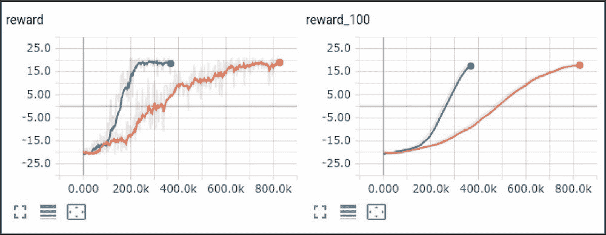

Figure 3: The convergence of a two-step DQN in comparison to a basic DQN

正如您在图中看到的，两步 DQN 比简单的 DQN 收敛快两倍多，这是一个很好的改进。那么，更大的 *n* 呢？下图显示了两步(深色)和三步(浅色)DQN 的对比:

图 4:两步 DQN 和三步 DQN 的比较

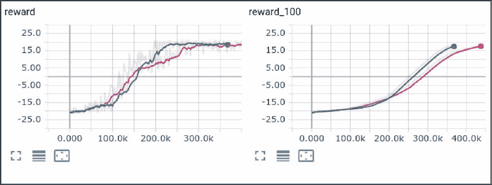

Figure 4: A comparison of a two-step DQN and three-step DQN

因此，与两步疗法相比，并没有改善。优化过程是随机的，因此您的结果可能会略有不同。

双 DQN


# 下一个关于如何改进基本 DQN 的富有成效的想法来自 DeepMind 研究人员在一篇题为*使用双 Q 学习的深度强化学习*(van Hasselt，Guez 和 Silver，2015 年)的论文中。在论文中，作者证明了基本 DQN 有高估 Q 值的趋势，这可能对训练表现有害，有时可能导致次优策略。造成这种情况的根本原因是贝尔曼方程中的 max 运算，但严格证明太复杂，这里就不写了。作为这个问题的解决方案，作者建议修改贝尔曼更新一点。

在基本 DQN 中，我们的 Q 的目标值如下所示:

In the basic DQN, our target value for Q looked like this:

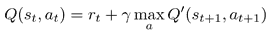

Q( [t+1] ，a)是使用我们的目标网络计算的 Q 值，所以我们每 n 步用训练好的网络更新。该论文的作者建议使用训练过的网络为下一个状态选择动作，但是从目标网络中取值 *Q* 。因此，目标 Q 值的新表达式将如下所示:

Q([t+1], a) was Q-values calculated using our target network, so we update with the trained network every n steps. The authors of the paper proposed choosing actions for the next state using the trained network but taking values of *Q* from the target net. So, the new expression for target Q-values will look like this:

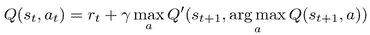

作者证明了这个简单的调整完全修正了高估，他们称这个新架构为双 DQN。

实现


## 核心的实现非常简单。我们需要做的是稍微修改我们的损失函数。让我们更进一步，比较基本 DQN 和双 DQN 产生的动作值。为了做到这一点，我们存储了一组随机保留的状态，并定期计算评估集中每个状态的最佳动作的平均值。

完整的示例在`Chapter07/03_dqn_double.py`中。我们先来看看损失函数。

额外的参数`double`开启和关闭计算要采取的行动的双 DQN 方式。

```
def calc_loss(batch, net, tgt_net, gamma, device="cpu", double=True):
    states, actions, rewards, dones, next_states = common.unpack_batch(batch)
```

以上部分与之前相同。

```
    states_v = torch.tensor(states).to(device)
    next_states_v = torch.tensor(next_states).to(device)
    actions_v = torch.tensor(actions).to(device)
    rewards_v = torch.tensor(rewards).to(device)
    done_mask = torch.ByteTensor(dones).to(device)
```

这是与基本 DQN 损失函数的区别。如果启用了双 DQN，我们将使用我们的主训练网络来计算在下一个状态中要采取的最佳动作，但是与该动作相对应的值来自目标网络。当然，这部分可以以更快的方式实现，通过将`next_states_v`和`states_v`结合起来，并且只调用一次我们的主网络，但是这将使代码不那么清晰。

```
    state_action_values = net(states_v).gather(1, actions_v.unsqueeze(-1)).squeeze(-1)
    if double:
        next_state_actions = net(next_states_v).max(1)[1]
        next_state_values = tgt_net(next_states_v).gather(1, next_state_actions.unsqueeze(-1)).squeeze(-1)
    else:
        next_state_values = tgt_net(next_states_v).max(1)[0]
```

函数的其余部分是相同的:我们屏蔽完整的情节，并计算网络预测的 Q 值和近似 Q 值之间的均方误差(MSE)损失。我们考虑的最后一个函数计算我们坚持状态的值。

```
    next_state_values[done_mask] = 0.0
    expected_state_action_values = next_state_values.detach() * gamma + rewards_v
    return nn.MSELoss()(state_action_values, expected_state_action_values)
```

这里没有什么太复杂的:我们只是将我们的 hold-out States 数组分成相等的块，并将每个块传递给网络以获得动作值。从这些值中，我们选择具有最大值的动作，并计算这些值的平均值。由于我们的状态数组在整个训练过程中是固定的，并且这个数组足够大(在我们存储 1000 个状态的代码中)，我们可以比较这两个 DQN 变量中平均值的动态。

```
def calc_values_of_states(states, net, device="cpu"):
    mean_vals = []
    for batch in np.array_split(states, 64):
        states_v = torch.tensor(batch).to(device)
        action_values_v = net(states_v)
        best_action_values_v = action_values_v.max(1)[0]
        mean_vals.append(best_action_values_v.mean().item())
    return np.mean(mean_vals)
```

`03_dqn_double.py`文件的其余部分是我们模型的训练循环，大部分和以前一样。

该程序现在有一个额外的命令行选项来打开和关闭双 DQN 扩展，以便能够在训练期间比较动作值(注意，您需要显式提供选项来启用双 DQN 行为)。

```
if __name__ == "__main__":
    params = common.HYPERPARAMS['pong']
    parser = argparse.ArgumentParser()
    parser.add_argument("--cuda", default=False, action="store_true", help="Enable cuda")
    parser.add_argument("--double", default=False, action="store_true", help="Enable double DQN")
    args = parser.parse_args()
    device = torch.device("cuda" if args.cuda else "cpu")
```

前面的代码与基本的 DQN 变体没有区别。在初始重放缓冲器填充后,`eval_states`变量将被填充我们的保持状态。

```
    env = gym.make(params['env_name'])
    env = ptan.common.wrappers.wrap_dqn(env)

    writer = SummaryWriter(comment="-" + params['run_name'] + "-double=" + str(not args.no_double))
    net = dqn_model.DQN(env.observation_space.shape, env.action_space.n).to(device)

    tgt_net = ptan.agent.TargetNet(net)
    selector = ptan.actions.EpsilonGreedyActionSelector(epsilon=params['epsilon_start'])
    epsilon_tracker = common.EpsilonTracker(selector, params)
    agent = ptan.agent.DQNAgent(net, selector, device=device)

    exp_source = ptan.experience.ExperienceSourceFirstLast(env, agent, gamma=params['gamma'], steps_count=1)
    buffer = ptan.experience.ExperienceReplayBuffer(exp_source, buffer_size=params['replay_size'])
    optimizer = optim.Adam(net.parameters(), lr=params['learning_rate'])

    frame_idx = 0
    eval_states = None
```

这部分也和之前一样。

```
    with common.RewardTracker(writer, params['stop_reward']) as reward_tracker:
        while True:
            frame_idx += 1
            buffer.populate(1)
            epsilon_tracker.frame(frame_idx)

            new_rewards = exp_source.pop_total_rewards()
            if new_rewards:
                if reward_tracker.reward(new_rewards[0], frame_idx, selector.epsilon):
                    break

            if len(buffer) < params['replay_initial']:
                continue
```

在这里，我们执行初始创建状态，以便在训练期间进行评估。常数`STATES_TO_EVALUATE`在程序的开始被定义，等于 1000，这足够让有一组代表性的游戏状态。

```
            if eval_states is None:
                eval_states = buffer.sample(STATES_TO_EVALUATE)
                eval_states = [np.array(transition.state, copy=False) for transition in eval_states]
                eval_states = np.array(eval_states, copy=False)
```

这部分也没有太大变化，除了我们传递给损失函数的标志，它启用或禁用双 DQN。

```
            optimizer.zero_grad()
            batch = buffer.sample(params['batch_size'])
            loss_v = calc_loss(batch, net, tgt_net.target_model, gamma=params['gamma'], device=device, double=args.double)
            loss_v.backward()
            optimizer.step()

            if frame_idx % params['target_net_sync'] == 0:
                tgt_net.sync()
```

最后，对于每 100 帧(在`EVAL_EVERY_FRAME`常量中定义)，我们计算我们状态的平均值，并将其写入 TensorBoard。

```
            if frame_idx % EVAL_EVERY_FRAME == 0:
                mean_val = calc_values_of_states(eval_states, net, device=device)
                writer.add_scalar("values_mean", mean_val, frame_idx)
```

结果


## 要训练双 DQN，启用扩展，传递`--double`命令行参数:

为了比较一个基本 DQN 的动作值，在没有`--double`选项的情况下再次训练它。训练需要一些时间，取决于你的计算能力。在 GTX 1080Ti 上，100 万帧大约需要两个小时。奖励图如下所示，它揭示了尽管在训练开始时有相似的动态，双 DQN 已经更快地达到收敛。

```
rl_book_samples/Chapter07$ ./03_dqn_double.py --cuda --double
1041: done 1 games, mean reward -19.000, speed 272.36 f/s, eps 0.99
2056: done 2 games, mean reward -19.000, speed 396.04 f/s, eps 0.98
3098: done 3 games, mean reward -19.000, speed 462.68 f/s, eps 0.97
3918: done 4 games, mean reward -19.500, speed 569.58 f/s, eps 0.96
4819: done 5 games, mean reward -19.600, speed 563.84 f/s, eps 0.95
5697: done 6 games, mean reward -19.833, speed 565.74 f/s, eps 0.94
6596: done 7 games, mean reward -20.000, speed 563.71 f/s, eps 0.93
...

```

图 5:双 DQN(浅色)和基本 DQN(深色)的对比

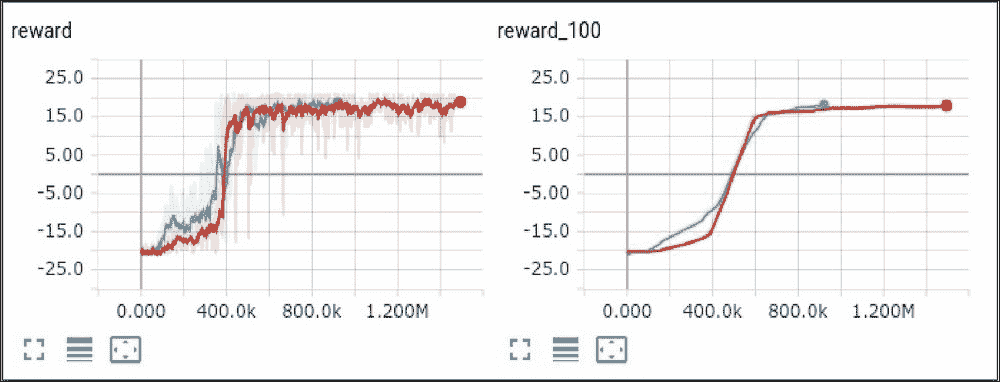

Figure 5: The comparison of double DQN (light) and basic DQN (dark)

同时，有价值的图表显示，经典的 DQN 在大多数时候高估了行动的价值。在训练结束时，经典的 DQN 甚至被要求减小该值以达到收敛。

图 6:双 DQN(浅色)和基本 DQN(深色)中动作的平均值

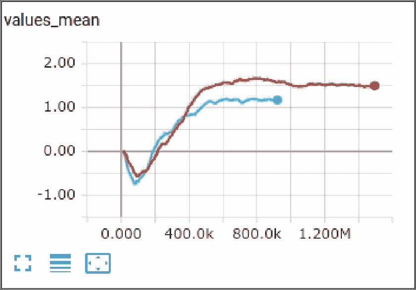

Figure 6: The mean value of actions in double DQN (light) and basic DQN (dark)

噪音网络


# 我们要检查的下一个改进解决了另一个 RL 问题:探索环境。这篇论文名为*探索的嘈杂网络*(*【4】Fortunato 等人，2017* )，有一个非常简单的想法，即在训练期间学习探索特性，而不是有一个单独的与探索相关的时间表。

经典 DQN 通过选择具有特别定义的超参数ε的随机动作来实现探索，该超参数ε随着时间从 1.0(完全随机动作)缓慢降低到 0.1 或 0.02 的某个小比率。这个过程适用于具有短插曲的简单环境，在游戏期间没有太多的非平稳性，但是即使在这样简单的情况下，也需要调整以使训练过程高效。

在上面提到的论文中，作者提出了一个非常简单的解决方案，尽管如此，它仍然工作得很好。他们向网络的全连接层的权重添加噪声，并在训练期间使用反向传播来调整该噪声的参数。当然，这种方法不应该与“网络决定在哪里探索更多”相混淆，后者是一种更复杂的方法，也有广泛的支持(例如，参见关于内在动机和基于计数的探索方法的文章[5]或[6])。

作者提出了两种添加噪声的方法，根据他们的实验，这两种方法都有效，但是具有不同的计算开销:

**独立高斯噪声**:对于全连接层中的每个权重，我们有一个从正态分布中抽取的随机值。噪声μ和σ的参数存储在层内，并使用反向传播进行训练，与我们训练标准线性层的权重的方式相同。这种“噪声层”的输出以与线性层相同的方式计算。

1.  **因式分解的高斯噪声**:为了最小化要采样的随机值的数量，作者建议只保留两个随机向量，一个具有层的输入大小，另一个具有层的输出大小。然后，通过计算向量的外积来创建该层的随机矩阵。
2.  实施


## 在 PyTorch 中，这两种方法都可以用非常简单的方式轻松实现。我们需要做的是创建我们自己的`nn.Linear`层，每次调用`forward()`时，用额外的随机值进行采样。我已经实现了两个噪声层，它们的实现在`Chapter07/lib/dqn_model.py`中，在`NoisyLinear`类中(对于独立的高斯噪声)和 NoisyFactorizedLinear(对于分解的噪声变量)。

在构造函数中，我们为σ创建一个矩阵(μ的值将存储在从`nn.Linear`继承的矩阵中)。为了使 sigmas 可训练，我们需要将张量包装在一个`nn.Parameter`中。`register_buffer`方法在网络中创建一个张量，该张量在反向传播期间不会更新，但将由`nn.Module`机器处理(例如，它将通过`cuda()`调用被复制到 GPU)。为层的偏置创建一个额外的参数和缓冲。sigmas 的初始值(0.017)取自本节开头引用的噪声网络文章。最后，我们将调用`reset_parameters() method`，它被`nn.Linear`覆盖，并且应该执行层的初始化。

```
class NoisyLinear(nn.Linear):
    def __init__(self, in_features, out_features, sigma_init=0.017, bias=True):
        super(NoisyLinear, self).__init__(in_features, out_features, bias=bias)
        self.sigma_weight = nn.Parameter(torch.full((out_features, in_features), sigma_init))
        self.register_buffer("epsilon_weight", torch.zeros(out_features, in_features))
        if bias:
            self.sigma_bias = nn.Parameter(torch.full((out_features,), sigma_init))
            self.register_buffer("epsilon_bias", torch.zeros(out_features))
        self.reset_parameters()
```

在`reset_parameters method`中，我们根据文章中的建议执行`nn.Linear`权重和偏差的初始化。

```
    def reset_parameters(self):
        std = math.sqrt(3 / self.in_features)
        self.weight.data.uniform_(-std, std)
        self.bias.data.uniform_(-std, std)
```

在前向方法中，我们对权重和偏差缓冲器中的随机噪声进行采样，并以与`nn.Linear`相同的方式对输入数据进行线性变换。因式分解的高斯噪声以类似的方式工作，我在结果中没有发现太大的差异。所以，为了完整起见，我只把它的代码放在下面。如果你很好奇，你可以在文章[4]中找到的细节和方程式。

```
    def forward(self, input):
        self.epsilon_weight.normal_()
        bias = self.bias
        if bias is not None:
            self.epsilon_bias.normal_()
            bias = bias + self.sigma_bias * self.epsilon_bias
        return F.linear(input, self.weight + self.sigma_weight * self.epsilon_weight, bias)
```

从实现的角度来说，就是这样。我们现在需要做的是，把经典的 DQN 变成一个无意识的变种，只是替换掉神经网络。线性层(这是我们的 DQN 网络中的最后两层)和非线性层(如果你愿意，也可以称为 T1)。当然，你必须删除所有与ε贪婪策略相关的代码。为了在训练期间检查内部噪声水平，我们可以监控噪声层的信噪比(SNR)，即均方根(μ) /均方根(σ)之比，其中均方根为相应权重的均方根。在我们的例子中，SNR 表示噪声层的静态成分比注入噪声大多少倍。

```
class NoisyFactorizedLinear(nn.Linear):
    def __init__(self, in_features, out_features, sigma_zero=0.4, bias=True):
        super(NoisyFactorizedLinear, self).__init__(in_features, out_features, bias=bias)
        sigma_init = sigma_zero / math.sqrt(in_features)
        self.sigma_weight = nn.Parameter(torch.full((out_features, in_features), sigma_init))
        self.register_buffer("epsilon_input", torch.zeros(1, in_features))
        self.register_buffer("epsilon_output", torch.zeros(out_features, 1))
        if bias:
            self.sigma_bias = nn.Parameter(torch.full((out_features,), sigma_init))

    def forward(self, input):
        self.epsison_input.normal_()
        self.epsilon_output.normal_()

        func = lambda x: torch.sign(x) * torch.sqrt(torch.abs(x))
        eps_in = func(self.epsilon_input)
        eps_out = func(self.epsilon_output)

        bias = self.bias
        if bias is not None:
            bias = bias + self.sigma_bias * eps_out.t()
        noise_v = torch.mul(eps_in, eps_out)
        return F.linear(input, self.weight + self.sigma_weight * noise_v, bias)
```

我们的 NoisyNet 样本的训练代码在`Chapter07/04_dqn_noisy_net.py`。让我们看看与基本 DQN 版本不同的代码部分:

吵闹版 DQN 的开头和以前一样。区别在于网络的其余部分。

```
class NoisyDQN(nn.Module):
    def __init__(self, input_shape, n_actions):
        super(NoisyDQN, self).__init__()

        self.conv = nn.Sequential(
            nn.Conv2d(input_shape[0], 32, kernel_size=8, stride=4),
            nn.ReLU(),
            nn.Conv2d(32, 64, kernel_size=4, stride=2),
            nn.ReLU(),
            nn.Conv2d(64, 64, kernel_size=3, stride=1),
            nn.ReLU()
        )
```

创建的噪波图层具有与其线性对应图层相同的形状。我们将它们放入列表中，以便以后能够访问它们。

```
        conv_out_size = self._get_conv_out(input_shape)
        self.noisy_layers = [
            model.NoisyLinear(conv_out_size, 512),
            model.NoisyLinear(512, n_actions)
        ]
        self.fc = nn.Sequential(
            self.noisy_layers[0],
            nn.ReLU(),
            self.noisy_layers[1]
        )
```

获得卷积部分形状的函数和`forward()`与之前相同。我们在课堂上有一个额外的功能是计算噪声层的信噪比。

```
    def _get_conv_out(self, shape):
        o = self.conv(torch.zeros(1, *shape))
        return int(np.prod(o.size()))

    def forward(self, x):
        fx = x.float() / 256
        conv_out = self.conv(fx).view(fx.size()[0], -1)
        return self.fc(conv_out)
```

训练循环也与之前完全相同，除了一个额外的部分:每 500 帧，我们从网络中查询噪声层的 SNR 值，并将其写入 TensorBoard。

```
    def noisy_layers_sigma_snr(self):
        return [
            ((layer.weight ** 2).mean().sqrt() / (layer.sigma_weight ** 2).mean().sqrt()).data.cpu().numpy()[0]
            for layer in self.noisy_layers
        ]
```

结果

```
            if frame_idx % 500 == 0:
                snr_vals = net.noisy_layers_sigma_snr()
                for layer_idx, sigma_l2 in enumerate(snr_vals):
                    writer.add_scalar("sigma_snr_layer_%d" % (layer_idx+1),
                                      sigma_l2, frame_idx)
```


## 训练后，TensorBoard 图表显示了更好的训练动态。该模型能够在不到 600k 的帧中达到 18 的平均分数。

图 7:嘈杂网络的融合

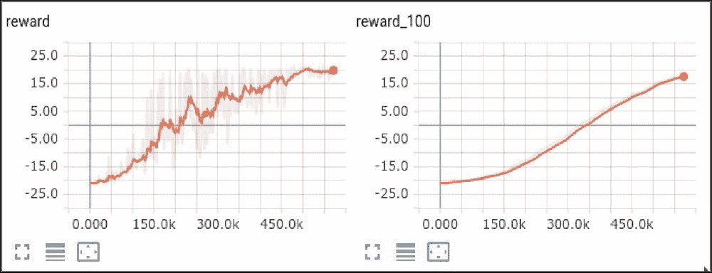

Figure 7: Noisy networks convergence

与基本的 DQN 相比，这是一个重大的改进(暗线是嘈杂的 DQN，亮线是基本的 DQN)。在下图中，显示了前 1M 帧。

图 8:噪声网络(亮)与基本 DQN(暗)的对比


检查信噪比图表后，你可能会注意到两层都很快降低了噪声水平。第一层从 1 到几乎 1/2.5 的噪声比。第二层甚至更有趣，因为它的噪声水平从开始的 1/3 下降到 1/16，但在 250k 帧之后，这大致与原始奖励攀升到接近 20 分的时间相同，最后一层的噪声水平开始增加回来，推动代理更多地探索环境。这很有意义，因为在达到高分水平后，代理基本上知道如何在一个好的水平上玩，但仍然需要“润色”其动作以进一步改善结果。

图 9:训练期间的噪音水平变化

After checking the SNR chart, you may notice that both layers have decreased the noise level very quickly. The first layer went from 1 to almost 1/2.5 ratio of noise. The second layer is even more interesting, as its noise level decreased from 1/3 in the beginning to 1/16, but after 250k frames, which is roughly the same time as when raw rewards climbed close to the 20 score, the level of the noise in the last layer started to increase back, pushing the agent to explore the environment more. This makes a lot of sense, as after reaching high score levels, the agent basically knows how to play at a good level, but still needs to 'polish' its actions to improve the results even more.

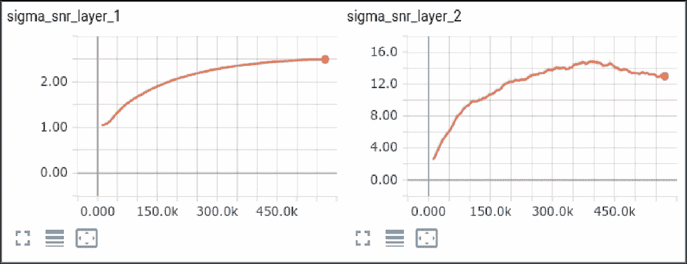

优先重放缓冲区

下一个非常有用的关于如何改进 DQN 培训的想法是在 2015 年的论文中提出的，*优先经验回放*(*【7】Schaul 等人，2015* )。这种方法试图通过根据训练损失对那些样本进行优先排序来提高重放缓冲器中的样本的效率。


# 基本的 DQN 使用重播缓冲器来打破我们剧集中直接过渡之间的相关性。正如我们在[第 6 章](part0043_split_000.html#190861-ce551566b6304db290b61e4d70de52ee "Chapter 6. Deep Q-Networks")、*深度 Q-Networks* 中所讨论的，我们在这一集所经历的例子将是高度相关的，因为大部分时间环境是“平稳的”，不会随着我们的行动而发生太大变化。然而，SGD 方法假设我们用于训练的数据具有 i.i.d .属性。为了解决这个问题，经典的 DQN 方法使用一个大的过渡缓冲区，随机采样以获得下一个训练批次。

该论文的作者对这种统一随机样本策略提出了质疑，并证明了通过为缓冲样本分配优先级，根据训练损失并按照这些优先级对缓冲区进行采样，我们可以显著提高 DQN 的收敛性和策略质量。这个方法可以看做是“在让你吃惊的数据上多训练”。这里棘手的一点是保持“不寻常”样本的训练和缓冲液其余部分的训练之间的平衡。如果我们只关注缓冲区的一个小的子集，我们可能会失去我们的 i.i.d .属性，并简单地在这个子集上过度拟合。

从数学的角度来看，缓冲器中每个样本的优先级计算为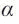，其中是缓冲器中第 *i* 个样本的优先级，是表示我们对优先级重视程度的数字。如果 *= 0* ，我们的采样将像经典的 DQN 方法一样变得均匀。的值越大，优先级越高的样本承受的压力越大。因此，这是另一个需要调整的超参数，本文提出的的初始值为 0.6。

对于如何定义优先级，论文中提出了几种选择，最流行的是使优先级与贝尔曼更新中这个特定示例的损失成比例。添加到缓冲区的新样本需要被赋予最大优先级值，以确保它们很快被采样。

通过调整样本的优先级，我们在数据分布中引入了偏差(我们对一些转换的采样比其他转换频繁得多)，这需要得到补偿，以便 SGD 能够工作。为了得到这个结果，该研究的作者使用了样本权重，需要乘以个体样本损失。每个样本的权重值定义为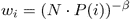，其中 *β* 是另一个超参数，应该在 0 和 1 之间。在 *β = 1* 的情况下，采样引入的偏差得到了完全补偿，但作者已经证明，从 0 和 1 之间的某个 *β* 开始，并在训练期间慢慢增加到 1，这对收敛是有好处的。

实施

为了实现这个方法，我们必须在代码中引入一些变化。首先，我们需要一个新的重放缓冲区，它将跟踪优先级，根据优先级对一批进行采样，计算权重，并让我们在损失已知后更新优先级。第二个变化是损失函数本身。现在，我们不仅需要合并每个样本的权重，还需要将丢失值传递回重放缓冲区，以调整采样转换的优先级。


## 在示例文件`Chapter07/05_dqn_prio_replay.py`中，我们已经实现了所有这些更改。为了简单起见，新的优先级重放缓冲区类使用了与我们以前的重放缓冲区非常相似的存储方案。不幸的是，对优先级的新要求使得不可能在 O(1)时间内实现对缓冲器大小的采样。如果我们使用简单的列表，每次我们采样一个新的批次，我们需要处理所有的优先级，这使得我们的采样 O(N)到缓冲区大小。如果我们的缓冲区很小，比如 100k 个样本，这没什么大不了的，但对于现实生活中数百万次转换的大型缓冲区，这可能会成为一个问题。还有其他存储方案支持 O(log N)时间内的高效采样，例如，使用段树数据结构。你可以在 OpenAI Baselines 项目中找到这样的实现，https://github.com/openai/baselines。

让我们看看优先级重放缓冲区的例子。

开始时，我们为样本的优先级定义了的值，并为 *β* 改变时间表定义了参数。在最初的 100k 帧中，我们的 beta 将从 0.4 更改为 1.0。

优先级重放缓冲区的类将样本存储在一个循环缓冲区(它允许我们保留固定数量的条目，而无需重新分配列表)和 NumPy 数组中，以保持优先级。我们还将迭代器存储到体验源对象中，以便从环境中提取样本。

```
PRIO_REPLAY_ALPHA = 0.6
BETA_START = 0.4
BETA_FRAMES = 100000
```

`populate()`方法需要从`ExperienceSource`对象中取出给定数量的转换，并将它们存储在缓冲区中。由于我们的过渡存储被实现为循环缓冲区，因此该缓冲区有两种不同的情况:

```
class PrioReplayBuffer:
    def __init__(self, exp_source, buf_size, prob_alpha=0.6):
        self.exp_source_iter = iter(exp_source)
        self.prob_alpha = prob_alpha
        self.capacity = buf_size
        self.pos = 0
        self.buffer = []
        self.priorities = np.zeros((buf_size, ), dtype=np.float32)
```

当我们的缓冲区没有达到最大容量时，我们只需要向缓冲区追加一个新的转换。

```
    def __len__(self):
        return len(self.buffer)

    def populate(self, count):
        max_prio = self.priorities.max() if self.buffer else 1.0
        for _ in range(count):
            sample = next(self.exp_source_iter)
            if len(self.buffer) < self.capacity:
                self.buffer.append(sample)
            else:
                self.buffer[self.pos] = sample
            self.priorities[self.pos] = max_prio
            self.pos = (self.pos + 1) % self.capacity
```

如果缓冲区已经满了，我们需要覆盖由 pos class 字段跟踪的最旧的转换，并调整这个位置模块的缓冲区大小。

```
    def sample(self, batch_size, beta=0.4):         if len(self.buffer) == self.capacity:             prios = self.priorities         else:             prios = self.priorities[:self.pos]         probs = prios ** self.prob_alpha         probs /= probs.sum()
```

1.  在示例方法中，我们需要使用我们的
2.  If the buffer is already full, we need to overwrite the oldest transition, which is tracked by the pos class field, and adjust this position module's buffer size.

    ```
        def sample(self, batch_size, beta=0.4):
            if len(self.buffer) == self.capacity:
                prios = self.priorities
            else:
                prios = self.priorities[:self.pos]
            probs = prios ** self.prob_alpha
            probs /= probs.sum()
    ```

超参数。


然后，使用这些概率，我们对缓冲区进行采样以获得一批样本。

最后一步，我们计算批次中样本的权重，并返回三个对象:批次、指数和权重。需要批次样本的索引来更新抽样项目的优先级。

```
        indices = np.random.choice(len(self.buffer), batch_size, p=probs)
        samples = [self.buffer[idx] for idx in indices]
```

优先级重放缓冲区的最后一个功能允许我们为已处理的批处理更新新的优先级。调用者有责任使用该函数计算批次的损失。

```
        total = len(self.buffer)
        weights = (total * probs[indices]) ** (-beta)
        weights /= weights.max()
        return samples, indices, weights
```

我们例子中的下一个自定义函数是损失计算。由于 PyTorch 中的`MSELoss`类不支持权重(这是可以理解的，因为 MSE 是回归问题中使用的损失，但样本的加权通常用于分类损失)，我们需要计算 MSE 并显式地将结果乘以权重。

```
    def update_priorities(self, batch_indices, batch_priorities):
        for idx, prio in zip(batch_indices, batch_priorities):
            self.priorities[idx] = prio
```

该函数的开始与之前完全相同，除了样本权重数组的额外参数，该参数需要转换为张量并放在 GPU 上。

在损失计算的最后一部分，我们实现了相同的 MSE 损失，但是显式地编写我们的表达式，而不是使用库。这使我们能够考虑样品的重量，并保留每个样品的单个损失值。这些值将被传递到优先级重放缓冲区以更新优先级。每次亏损都加上小值来处理亏损值为零的情况，会导致进场优先级为零。

```
def calc_loss(batch, batch_weights, net, tgt_net, gamma, device="cpu"):
    states, actions, rewards, dones, next_states = common.unpack_batch(batch)

    states_v = torch.tensor(states).to(device)
    next_states_v = torch.tensor(next_states).to(device)
    actions_v = torch.tensor(actions).to(device)
    rewards_v = torch.tensor(rewards).to(device)
    done_mask = torch.ByteTensor(dones).to(device)
    batch_weights_v = torch.tensor(batch_weights).to(device)

    state_action_values = net(states_v).gather(1, actions_v.unsqueeze(-1)).squeeze(-1)
    next_state_values = tgt_net(next_states_v).max(1)[0]
    next_state_values[done_mask] = 0.0
```

现在，是我们训练循环的时候了。

```
    expected_state_action_values = next_state_values.detach() * gamma + rewards_v
    losses_v = batch_weights_v * (state_action_values - expected_state_action_values) ** 2
    return losses_v.mean(), losses_v + 1e-5
```

初始化部分应该非常熟悉，因为我们已经创建了我们需要的所有东西，唯一的区别是使用了`PrioReplayBuffer`而不是简单的重放缓冲区。

在训练循环中，和以前一样，我们从经验源中抽取一个转换，并根据时间表更新 epsilon。我们使用类似的调度来线性增加β超参数，用于优先级重放缓冲器权重的调整。

```
if __name__ == "__main__":
    params = common.HYPERPARAMS['pong']
    parser = argparse.ArgumentParser()
    parser.add_argument("--cuda", default=False, action="store_true", help="Enable cuda")
    args = parser.parse_args()
    device = torch.device("cuda" if args.cuda else "cpu")

    env = gym.make(params['env_name'])
    env = ptan.common.wrappers.wrap_dqn(env)

    writer = SummaryWriter(comment="-" + params['run_name'] + "-prio-replay")
    net = dqn_model.DQN(env.observation_space.shape, env.action_space.n).to(device)
    tgt_net = ptan.agent.TargetNet(net)
    selector = ptan.actions.EpsilonGreedyActionSelector(epsilon=params['epsilon_start'])
    epsilon_tracker = common.EpsilonTracker(selector, params)
    agent = ptan.agent.DQNAgent(net, selector, device=device)

    exp_source = ptan.experience.ExperienceSourceFirstLast(env, agent, gamma=params['gamma'], steps_count=1)
    buffer = PrioReplayBuffer(exp_source, params['replay_size'], PRIO_REPLAY_ALPHA)
    optimizer = optim.Adam(net.parameters(), lr=params['learning_rate'])
```

和以前一样，我们追踪已完成剧集的总奖励，现在显示 beta 随着训练时间的变化。

```
    frame_idx = 0
    beta = BETA_START

    with common.RewardTracker(writer, params['stop_reward']) as reward_tracker:
        while True:
            frame_idx += 1
            buffer.populate(1)
            epsilon_tracker.frame(frame_idx)
            beta = min(1.0, BETA_START + frame_idx * (1.0 - BETA_START) / BETA_FRAMES)
```

优化器的调用不同于基本的 DQN 版本。首先，我们来自缓冲区的样本现在返回的不是单个批次，而是三个值:批次、样本索引及其权重。我们将批次和权重传递给损失函数，其结果有两个:第一个是我们需要反向传播的累积损失值，第二个是批次中每个样本的单个损失值的张量。我们反向传播累积的损失，并要求我们的优先级重放缓冲器更新样本的优先级。

```
            new_rewards = exp_source.pop_total_rewards()
            if new_rewards:
                writer.add_scalar("beta", beta, frame_idx)
                if reward_tracker.reward(new_rewards[0], frame_idx, selector.epsilon):
                    break

            if len(buffer) < params['replay_initial']:
                continue
```

结果

```
            optimizer.zero_grad()
            batch, batch_indices, batch_weights = buffer.sample(params['batch_size'], beta)
            loss_v, sample_prios_v = calc_loss(batch, batch_weights, net, tgt_net.target_model, params['gamma'], device=device)
            loss_v.backward()
            optimizer.step()
            buffer.update_priorities(batch_indices, sample_prios_v.data.cpu().numpy())
```

这个例子可以照常训练。以下是与基本 DQN 相比的奖励动态。


## 图 10:优先重放缓冲区(上图)与基本 DQN(下图)的比较

This example can be trained as usual. The following are the reward dynamics in comparison to the basic DQN.

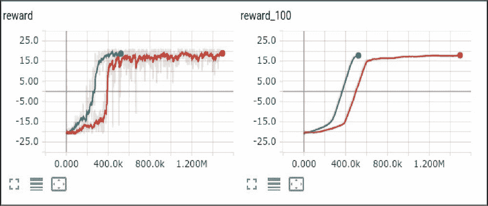

正如所料，在中，重放缓冲区样本的优先级显示了更好的收敛动态。

决斗 DQN

对的这种改进是在 2015 年提出的，论文名为*深度强化学习的决斗网络架构*(*【8】王等，2015* )。本文的核心观察点在于，我们的网络试图逼近的 Q 值 *Q(s，a)* 可以分解为量:状态 *V(s)* 的值和该状态下动作的优势 *A(s，a)* 。我们以前见过数量 *V(s)* ，因为它是第五章、*表格学习和贝尔曼方程*中的值迭代法的核心。它就等于从这种状态下可获得的折现期望回报。优势 *A(s，a)* 被认为是从 *A(s)* 到 *Q(s，a)* 的桥梁，因为，根据定义: *Q(s，a) = V(s) + A(s，a)* 。换句话说，advantage *A(s，a)* 就是 delta，表示国家的某个特定行为给我们带来了多少额外的奖励。优势可以是正面的，也可以是负面的，一般来说，优势的大小可以是任意的。例如，在某个临界点上，选择一个行动而不是另一个会让我们损失很多总回报。


# 上述论文的贡献是在网络架构中明确分离了价值和优势，这带来了更好的训练稳定性、更快的收敛和在 Atari 基准上的更好结果。下图显示了与经典 DQN 网络的架构差异。经典的 DQN 网络(顶部)从卷积层提取要素，并使用完全连接的图层将它们转换为 Q 值向量，每个动作一个。另一方面，决斗 DQN(下图)采用卷积特征，并使用两条独立的路径对其进行处理:一条路径负责 *V(s)* 预测，这只是一个数字，另一条路径预测各个优势值，与经典情况下的 Q 值具有相同的维数。之后我们把 *V(s)* 加到 *A(s，a)* 的每一个值上，得到 *Q(s，a)* ，正常使用和训练。

图 11:一个基本的 DQN(上)和决斗架构(下)

架构的上述变化不足以确保网络如我们所愿地学习 *V(s)* 和 *A(s，a)* 。例如，没有什么可以阻止网络预测某个状态 *V(s) = 0* ，以及*A(s)=【1，2，3，4】*，这是完全错误的，因为预测的 *V(s)* 不是该状态的期望值。我们还需要设置另一个约束条件:我们希望任何一个州的优势均值为零。在这种情况下，上述示例的正确预测将是 *V(s) = 2.5* 和 *A(s) = [-1.5，-0.5，0.5，1.5]* 。

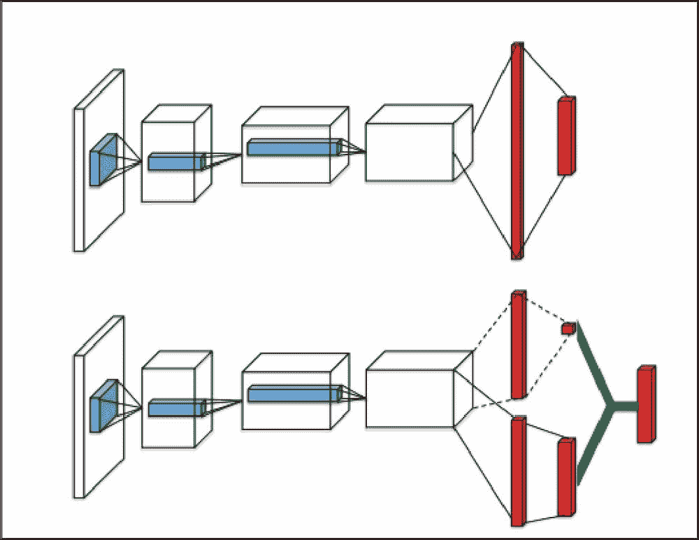

这种约束可以通过多种方式实施，例如，通过损失函数，但在论文中，作者提出了一种非常优雅的解决方案，从网络中的 Q 表达式中减去优势的平均值，这有效地将优势的平均值拉至零: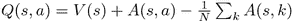。这使得经典 DQN 中需要进行的更改非常简单:要将其转换为双 DQN，您只需更改网络架构，而不影响实现的其他部分。

实施

完整的例子是`Chapter07/06_dqn_dueling.py`中的，所以这里我只展示网络类。

卷积层与之前完全相同。


## 我们没有定义完全连接的层的单一路径，而是创建了两个不同的转换:一个用于优势，一个用于值预测。

得益于 PyTorch 的表现力，`forward()`函数的变化也非常简单:我们计算一批样本的价值和优势，并将它们相加，减去优势的平均值，从而获得最终的 Q 值。

```
class DuelingDQN(nn.Module):
    def __init__(self, input_shape, n_actions):
        super(DuelingDQN, self).__init__()

        self.conv = nn.Sequential(
            nn.Conv2d(input_shape[0], 32, kernel_size=8, stride=4),
            nn.ReLU(),
            nn.Conv2d(32, 64, kernel_size=4, stride=2),
            nn.ReLU(),
            nn.Conv2d(64, 64, kernel_size=3, stride=1),
            nn.ReLU()
        )
```

结果

```
        conv_out_size = self._get_conv_out(input_shape)
        self.fc_adv = nn.Sequential(
            nn.Linear(conv_out_size, 512),
            nn.ReLU(),
            nn.Linear(512, n_actions)
        )
        self.fc_val = nn.Sequential(
            nn.Linear(conv_out_size, 512),
            nn.ReLU(),
            nn.Linear(512, 1)
        )
```

在训练了一个决斗的 DQN 之后，我们可以在我们的 Pong 基准上将其与经典的 DQN 收敛进行比较，如下所示。

```
    def _get_conv_out(self, shape):
        o = self.conv(torch.zeros(1, *shape))
        return int(np.prod(o.size()))

    def forward(self, x):
        fx = x.float() / 256
        conv_out = self.conv(fx).view(fx.size()[0], -1)
        val = self.fc_val(conv_out)
        adv = self.fc_adv(conv_out)
        return val + adv - adv.mean()
```

图 12:决斗建筑(浅色)与基本 DQN(深色)的对比


## Results

绝对的 DQN

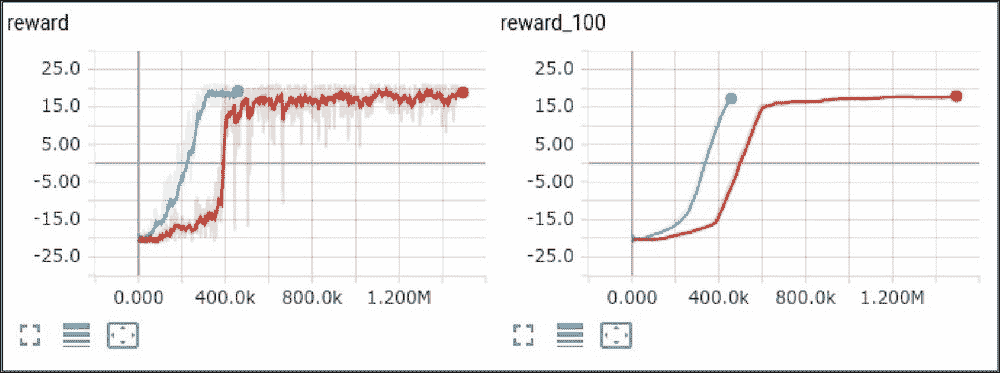

在我们的 *DQN 改进工具箱*中，最后一个也是最复杂的方法来自 DeepMind 在 2017 年 6 月发表的一篇名为*关于强化学习的分布式观点* ( *[9] Bellemare、Dabney 和 Munos 2017* )。

在论文中，作者质疑了 Q 学习的基础部分:Q 值，并试图用更通用的 Q 值概率分布来代替它们。让我们试着理解这个想法。Q-learning 和 value iteration 方法都是用简单的数字来表示行为或状态的值，并显示我们可以从状态或行为中获得多少总回报。但是，把未来所有可能的奖励都挤到一个数字里，实际可行吗？在复杂的环境中，未来可能是随机的，以不同的概率给我们不同的值。例如，想象一下你经常开车从家去上班的通勤场景。大多数时候，交通并不拥挤，你大约需要 30 分钟才能到达目的地。不完全是 30 分钟，但平均是 30 分钟。有时，会发生一些事情，比如道路维修或事故，由于交通堵塞，你要花三倍的时间去上班。您的通勤时间的概率可以表示为“通勤时间”随机变量的分布，如下图所示。


# 图 13:通勤时间的概率分布

The last and the most complicated method in our *DQN improvements toolbox* is from the very recent paper published by DeepMind in June 2017 called *A Distributional Perspective on Reinforcement Learning* (*[9] Bellemare, Dabney and Munos 2017*).

现在想象一下，你有另一种方式去上班:坐火车。这要花一点时间，因为你需要从家到火车站，再从火车站到办公室，但它们要可靠得多。举例来说，火车通勤时间平均为 40 分钟，火车中断的可能性很小，这给旅程增加了 20 分钟的额外时间。火车通勤的分布如下图所示。

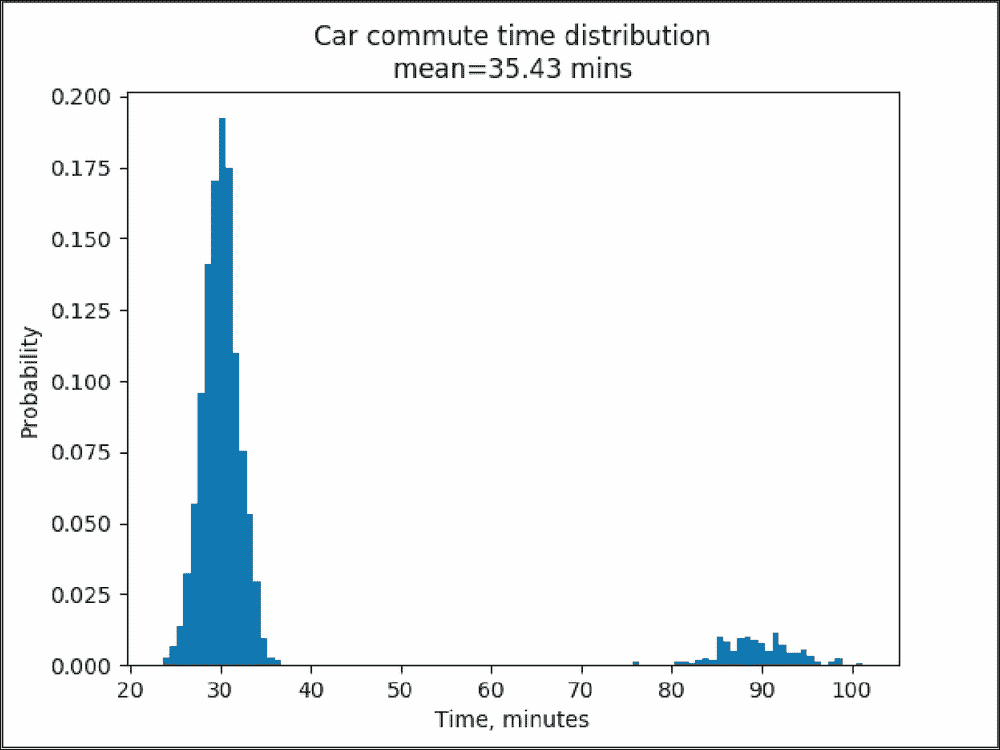

图 14:火车通勤时间的概率分布

想象一下，现在我们想要决定如何通勤。如果我们只知道汽车和火车的平均时间，汽车看起来更有吸引力，因为平均旅行时间为 35.43 分钟，比火车的 40.54 分钟要好。然而，如果我们看完整的分布，我们可能会决定坐火车去，因为即使在最坏的情况下，通勤时间也将是 1 小时，而不是 1 小时 30 分钟。切换到统计语言，汽车分布有更高的**方差**，所以，当你真的必须在最多 60 分钟内到达办公室时，火车更好。


论文作者提出了完全相同的想法，*关于强化学习的分布式观点*【9】。当潜在价值可能具有复杂的潜在分布时，为什么我们要限制自己去预测一个行为的平均值呢？也许它会帮助我们直接使用发行版。

论文中给出的结果表明，事实上，这个想法可能是有帮助的，但代价是引入了更复杂的方法。我不打算在这里给出严格的数学定义，但总体思路是预测每个动作的价值分布，类似于上面汽车/火车例子中的分布。作为下一步，作者已经表明，贝尔曼方程可以推广到分布情况，它将具有形式，这非常类似于熟悉的贝尔曼方程，但现在 *Z(x，a)* ， *R(x，a)* 是概率分布，而不是数字。

得到的分布可用于训练我们的网络，以更好地预测给定状态的每个动作的值分布，与 Q-learning 的方式完全相同。唯一的区别是损失函数，现在必须替换成适合于分布比较的函数。有几种替代方法可用，例如分类问题中使用的 kull back-lei bler(KL)-散度(或交叉熵损失)或 Wasserstein 度量。在论文中，作者给出了 Wasserstein 度量的理论依据，但当他们试图在实践中应用它时，他们面临着局限性，因此，论文最后使用了 KL-divergence。这篇论文是最近发表的，因此很有可能会对方法进行改进。

实施

如前所述，方法相当复杂，所以我花了一段时间来实现它并确保它正常工作。完整的代码在`Chapter07/07_dqn_distrib.py`中，它使用了`lib/common.py`中的一个函数来执行分布的投影，这个函数我们以前没有讨论过。在开始之前，我们需要说几句关于实现逻辑的话。

该方法的核心部分是我们正在逼近的概率分布。有很多方法来表示分布，但论文的作者选择了一个相当通用的*参数分布*，它基本上是有规律地放置在一个值范围内的固定数量的值。值的范围应涵盖可能的累积折扣奖励的范围。在论文中，作者用不同数量的原子做了实验，但最好的结果是在从`Vmin=-10`到`Vmax=10`的值范围内以`N_ATOMS=51`间隔分割范围获得的。


## 对于每个原子(我们有 51 个)，我们的网络预测未来贴现值落入该原子范围的概率。该方法的核心部分是代码，它使用 gamma 执行下一个状态的最佳行为的分布收缩，将本地奖励添加到分布中，并将结果投射回我们的原始原子。下面的函数就是这样做的:

开始时，我们分配保存投影结果的数组。该函数需要一批带有形状(`batch_size`、`n_atoms`)、奖励数组、已完成剧集的标志以及我们的超参数:`Vmin`、`Vmax`、`n_atoms`和`gamma`的分布。`delta_z`变量是我们取值范围内每个原子的宽度。

在前面的代码中，我们对原始分布中的每个原子进行迭代，并计算这个原子将被 Bellman 算子投影的位置，同时考虑我们的值界限。例如，索引为 0 的第一个原子对应于值`Vmin=-10`，但是对于奖励为+1 的样本，将被投影为值-10 * 0.99 + 1 = -8.9。换句话说，它将向右移动(假设我们的 gamma=0.99)。如果值超出了由`Vmin`和`Vmax`给定的值范围，我们会将其限制在边界内。

在下一行中，我们计算我们的样本所投射的原子数。当然，样品可以被投射到原子之间。在这种情况下，我们将在源原子的原始分布中，在它所在的两个原子之间传播值。这种扩散应该小心处理，因为我们的目标原子可以准确地落在某个原子的位置上。在这种情况下，我们只需要将源分布值加到目标原子上。

```
def distr_projection(next_distr, rewards, dones, Vmin, Vmax, n_atoms, gamma):
    batch_size = len(rewards)
    proj_distr = np.zeros((batch_size, n_atoms), dtype=np.float32)
    delta_z = (Vmax - Vmin) / (n_atoms - 1)
```

上面的代码处理投射的原子正好落在目标原子上的情况。否则，`b_j`就不是整数值和变量`l`和`u`(对应于投影点上下原子的索引)。

```
    for atom in range(n_atoms):
        tz_j = np.minimum(Vmax, np.maximum(Vmin, rewards + (Vmin + atom * delta_z) * gamma))
```

当投影点落在原子之间时，我们需要将源原子的概率分散到下面和上面的原子之间。这是通过上面代码中的两行实现的，当然，我们需要正确处理剧集的最后过渡。在这种情况下，我们的预测不应该考虑下一次分配，只会有 1 的概率对应于获得的奖励。然而，我们需要再次考虑我们的原子，如果奖励值落在原子之间，适当地分配这个概率。这种情况由下面的代码分支处理，它将设置了 done 标志的样本的结果分布置零，然后计算结果投影。

```
        b_j = (tz_j - Vmin) / delta_z
```

为了给你一个关于这个函数做什么的例子，让我们来看看这个函数处理的人工生成的分布。我用它们来调试功能，并确保它按预期工作。这些检查的代码在`Chapter07/adhoc/distr_test.py`中。

```
        l = np.floor(b_j).astype(np.int64)
        u = np.ceil(b_j).astype(np.int64)
        eq_mask = u == l
        proj_distr[eq_mask, l[eq_mask]] += next_distr[eq_mask, atom]
```

图 15:应用于正态分布的概率分布转换示例

```
        ne_mask = u != l
        proj_distr[ne_mask, l[ne_mask]] += next_distr[ne_mask, atom] * (u - b_j)[ne_mask]
        proj_distr[ne_mask, u[ne_mask]] += next_distr[ne_mask, atom] * (b_j - l)[ne_mask]
```

When the projected point lands between atoms, we need to spread the probability of the source atom between atoms below and above. This is carried out by two lines in the above code and, of course, we need to properly handle the final transitions of episodes. In that case, our projection shouldn't take into account the next distribution and will just have a 1 probability corresponding to the reward obtained. However, we need, again, to take into account our atoms and properly distribute this probability if the reward value falls between the atoms. This case is handled by the code branch below, which zeroes resulting distribution for samples with the done flag set and then calculates the resulting projection.

```
    if dones.any():
        proj_distr[dones] = 0.0
        tz_j = np.minimum(Vmax, np.maximum(Vmin, rewards[dones]))
        b_j = (tz_j - Vmin) / delta_z
        l = np.floor(b_j).astype(np.int64)
        u = np.ceil(b_j).astype(np.int64)
        eq_mask = u == l
        eq_dones = dones.copy()
        eq_dones[dones] = eq_mask
        if eq_dones.any():
            proj_distr[eq_dones, l] = 1.0
        ne_mask = u != l
        ne_dones = dones.copy()
        ne_dones[dones] = ne_mask
        if ne_dones.any():
            proj_distr[ne_dones, l] = (u - b_j)[ne_mask]
            proj_distr[ne_dones, u] = (b_j - l)[ne_mask]
    return proj_distr
```

下面的第一幅图对应于用 *gamma=0.9* 投影的正态分布，并且用 *reward=2* 向右移动。在我们用相同的数据传递 done=True 的情况下，结果会有所不同。在这种情况下，资源分配将被完全忽略，结果将只有奖励计划。

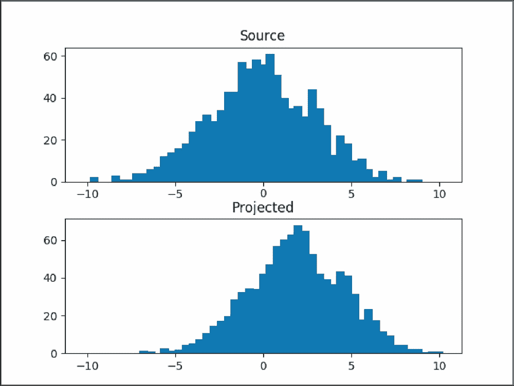

图 16:剧集最后一步的分布图

现在让我们看看`Chapter07/07_dqn_distrib.py`中方法的主要源代码。


开始时，我们将 matplotlib 切换到“无头”模式，此时它不需要显示来绘图。代码具有特殊的调试模式标志，这些标志允许保存概率分布以简化调试和训练过程的可视化(默认情况下它们是禁用的)。

然后我们定义我们的常数，它包括值分布的范围`Vmax`、`Vmin`，原子的数量，以及每个原子的宽度。

接下来的两个常量定义了我们在保持的缓冲区中保留了多少状态来执行平均值计算，以及该平均值更新的频率。这对于评估训练进度很有用，因为随着我们的代理在游戏中变得越来越好，它的 Q 值也在增长。

```
SAVE_STATES_IMG = False
SAVE_TRANSITIONS_IMG = False

if SAVE_STATES_IMG or SAVE_TRANSITIONS_IMG:
    import matplotlib as mpl
    mpl.use("Agg")
    import matplotlib.pylab as plt
```

这两个标志支持保存分布图，这对于调试很有用，但是会大大降低训练过程的速度。如果每 10k 帧启用第一个标志，我们将前 200 个状态的所有动作的预测分布保存在保持缓冲器中。由此产生的图像显示了这些状态的分布是如何从一开始的均匀分布收敛到更真实、更像高斯分布的。第二个标志允许保存具有非零奖励或最终剧集的批次的投影分布，这对于发现分布投影代码中的错误非常有帮助，并且对于可视化该方法的内部非常有用。

```
Vmax = 10
Vmin = -10
N_ATOMS = 51
DELTA_Z = (Vmax - Vmin) / (N_ATOMS - 1)
```

NN 构造器的主要区别是网络的输出。现在，不是大小`n_actions`的张量；这是一个由`n_actions * n_atoms`个元素组成的矩阵，包含每个动作的概率分布。使用 batch dimension，得到的输出有三个维度。我们还用原子的值注册了 torch 张量，以便以后使用。

```
STATES_TO_EVALUATE = 1000
EVAL_EVERY_FRAME = 100
```

与基线 DQN 相比，`forward()`功能基本相同，除了最终形状需要调整。然而，`forward()`对于我们的目的来说是不够的。除了原始分布，我们还需要一批状态的分布和 Q 值。为了避免多重神经网络转换，我们将定义函数`both()`，它返回原始分布和 Q 值。q 值将用于行动决策。当然，使用分布意味着我们可以有不同的行动选择策略，但是关于 Q 值的贪婪策略使得该方法可以与标准的 DQN 版本相媲美。

```
SAVE_STATES_IMG = False
SAVE_TRANSITIONS_IMG = False
```

为了从分布中获得 Q 值，我们只需要计算归一化分布和原子值的加权和。结果将是分布的期望值。

```
class DistributionalDQN(nn.Module):
    def __init__(self, input_shape, n_actions):
        super(DistributionalDQN, self).__init__()

        self.conv = nn.Sequential(
            nn.Conv2d(input_shape[0], 32, kernel_size=8, stride=4),
            nn.ReLU(),
            nn.Conv2d(32, 64, kernel_size=4, stride=2),
            nn.ReLU(),
            nn.Conv2d(64, 64, kernel_size=3, stride=1),
            nn.ReLU()
        )

        conv_out_size = self._get_conv_out(input_shape)
        self.fc = nn.Sequential(
            nn.Linear(conv_out_size, 512),
            nn.ReLU(),
            nn.Linear(512, n_actions * N_ATOMS)
        )

        self.register_buffer("supports", torch.arange(Vmin, Vmax+DELTA_Z, DELTA_Z))
        self.softmax = nn.Softmax(dim=1)
```

剩下的两个函数是简单的效用函数。第一个只计算 Q 值，而第二个将`softmax`应用于输出张量，保持张量的正确形状。

```
    def _get_conv_out(self, shape):
        o = self.conv(torch.zeros(1, *shape))
        return int(np.prod(o.size()))

    def forward(self, x):
        batch_size = x.size()[0]
        fx = x.float() / 256
        conv_out = self.conv(fx).view(batch_size, -1)
        fc_out = self.fc(conv_out)
        return fc_out.view(batch_size, -1, N_ATOMS)
```

分类 DQN(作者也称其为 C51，根据使用的原子数量)的损失函数的开始方式与之前相同:我们解开批处理并将数组转换为张量。

```
    def both(self, x):
        cat_out = self(x)
        probs = self.apply_softmax(cat_out)
        weights = probs * self.supports
        res = weights.sum(dim=2)
        return cat_out, res
```

稍后，我们将需要下一个状态的概率分布和 Q 值，因此我们使用对网络的`both()`调用，获得在下一个状态采取的最佳行动，将`softmax`应用于分布，并将其转换为数组。

```
    def qvals(self, x):
        return self.both(x)[1]

    def apply_softmax(self, t):
        return self.softmax(t.view(-1, N_ATOMS)).view(t.size())
```

然后，我们提取最佳行动的分布，并使用贝尔曼算子执行它们的投影。预测的结果将是我们希望我们的网络输出看起来像什么的目标分布。

```
def calc_loss(batch, net, tgt_net, gamma, device="cpu", save_prefix=None):
    states, actions, rewards, dones, next_states = common.unpack_batch(batch)
    batch_size = len(batch)

    states_v = torch.tensor(states).to(device)
    actions_v = torch.tensor(actions).to(device)
    next_states_v = torch.tensor(next_states).to(device)
```

在函数的最后，我们需要计算网络的输出，并计算投影分布和所采取行动的网络输出之间的 KL-divergence。KL-divergence 显示了两个分布之间的差异，并被定义为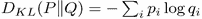。

```
    # next state distribution
    next_distr_v, next_qvals_v = tgt_net.both(next_states_v)
    next_actions = next_qvals_v.max(1)[1].data.cpu().numpy()
    next_distr = tgt_net.apply_softmax(next_distr_v).data.cpu().numpy()
```

为了计算概率的对数，我们使用 PyTorch 函数`log_softmax`，它以数值和稳定的方式执行`log`和`softmax`。训练循环和以前一样，除了`ptan.DQNAgent`创建中的一个例外，它需要使用函数`qvals()`，而不是模型本身。

```
    next_best_distr = next_distr[range(batch_size), next_actions]
    dones = dones.astype(np.bool)
    proj_distr = common.distr_projection(next_best_distr, rewards, dones, Vmin, Vmax, N_ATOMS, gamma)
```

结果

```
    distr_v = net(states_v)
    state_action_values = distr_v[range(batch_size), actions_v.data]
    state_log_sm_v = F.log_softmax(state_action_values, dim=1)
    proj_distr_v = torch.tensor(proj_distr).to(device)
    loss_v = -state_log_sm_v * proj_distr_v
    return loss_v.sum(dim=1).mean()
```

结果图如下，上面的线对应于基本 DQN，下面的线来自 C51 训练。

图 17:与基本 DQN(上图)相比，分类 DQN(下图)的收敛

```
    agent = ptan.agent.DQNAgent(lambda x: net.qvals(x), selector, device=device)
```


## Results

正如你所看到的，绝对 DQN 是收敛动态的唯一方法，它在开始时比经典的 DQN 更糟糕。然而，有一个因素保护了这种新方法:Pong 是一个太简单的游戏，无法得出结论。在《分类 DQN》的论文中，作者报告了超过一半的游戏在雅达利基准测试中的最新分数(Pong 不在其中)。

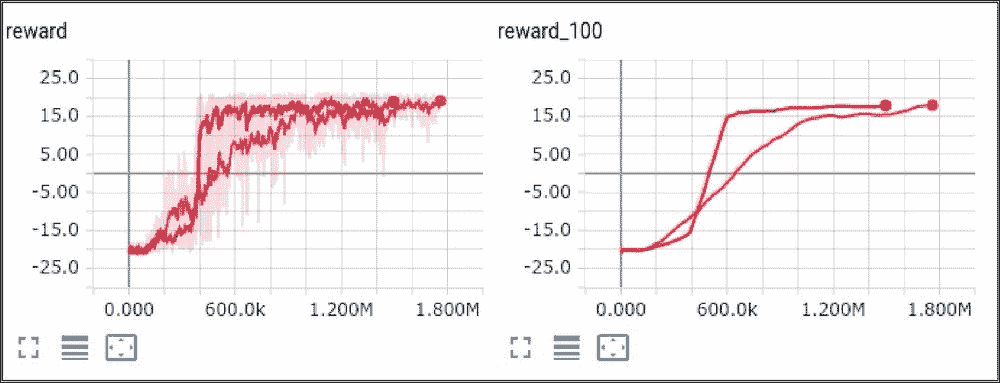

在训练期间研究概率分布的动态可能是有趣的。该代码有两个标志，`SAVE_STATES_IMG`和`SAVE_TRANSITIONS_IMG`(默认禁用)，可以在训练期间保存概率分布图像。例如，下图显示了训练开始时(30k 帧后)一个状态的所有六个动作的概率分布。

图 18:训练开始时的概率分布

As you can see, categorical DQN is the only method of convergence dynamic, which, in the beginning is *worse* than the classic DQN. However, there is one factor that protects this new method: Pong is too simple a game to draw conclusions. In the Categorical DQN paper, the authors reported state-of-the-art scores for more than half of the games from the Atari benchmark (Pong is not among them).

所有的分布都非常宽(因为网络还没有收敛),中间的峰值对应于网络期望从其行为中获得的负回报。500k 帧训练后的相同状态如下图所示:

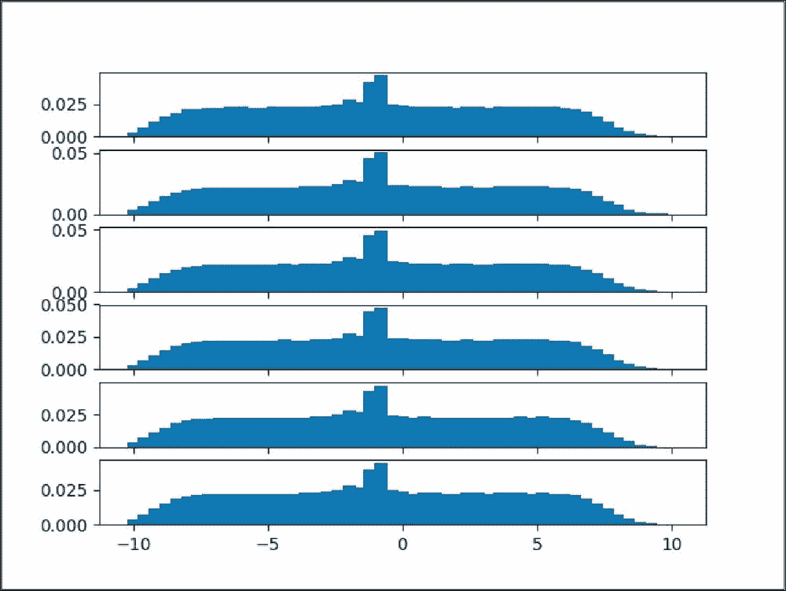

图 19:由训练好的网络产生的概率分布

现在我们可以看到不同的动作有不同的分布。第一个动作(对应于 NOOP，即*什么都不做*动作)已经分配到左边，所以在这种状态下什么都不做通常会导致失败。第五个动作是 RIGHTFIRE，其平均值向右移动，因此该动作导致更好的分数。

结合一切

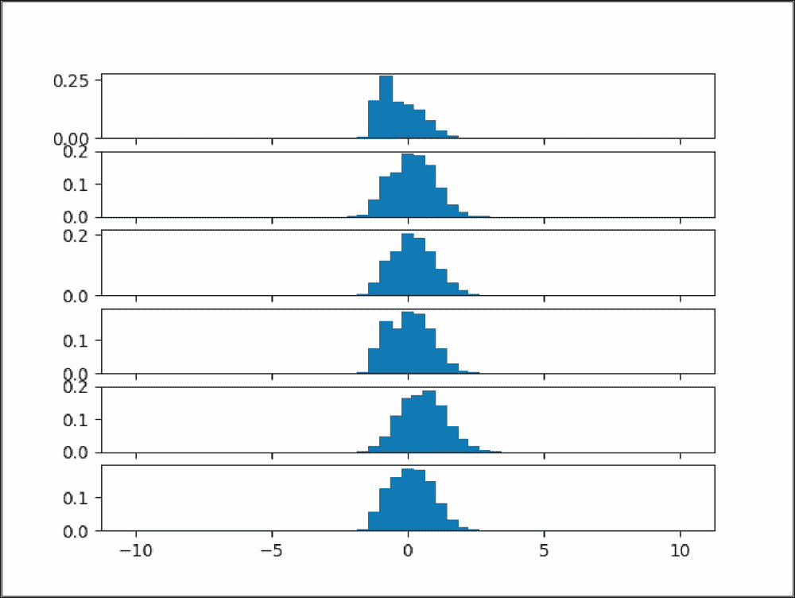

我们现在已经看到了论文 *[1] Rainbow:结合深度强化学习*中提到的所有 DQN 改进。让我们将所有这些方法结合成一个混合方法。首先，我们需要定义我们的网络架构以及促成这一架构的三种方法:

**分类 DQN** :我们的网络会预测行动的价值概率分布。

**决战 DQN** :我们的网络将有两条独立的路径进行价值状态分配和优势分配。在输出中，两条路径将被加在一起，提供动作的最终值概率分布。为了迫使优势分布具有零平均值，我们将减去每个原子中具有平均优势的分布。


# **noise net**:我们在价值和优势路径中的线性层将是`nn.Linear`的嘈杂变体。

除了网络架构的变化，我们将使用优先重放缓冲区来保存环境转换，并根据 KL-divergence 按比例对其进行采样。最后，我们将把贝尔曼方程展开到 **n 步**，并使用**双 DQN** 动作选择过程来防止高估状态值。

*   实施
*   前面列出的修改可能看起来很复杂，但是，事实上，所有的方法都很好地相互配合。完整的示例在`Chapter07/08_dqn_rainbow.py file`中:
*   像往常一样，我们为将要使用的所有方法定义了超参数(为了节省空间，省略了导入)。

我们网络的构造者不应该让你感到惊讶，因为我们以前已经见过它了。它将决斗的 DQN、诺伊辛尼特和绝对的 DQN 结合到一个建筑中。值网络路径预测输入状态的值的分布，从而为我们提供每个批次样本的 N 个原子的单个向量。优势路径为我们在游戏中的每一个行动产生分布。


## 向前传递产生动作的值分布，这类似于分类 DQN 中的 Q 值。由于 PyTorch 的张量传播，通过准确地重塑价值和优势路径的输出，我们的回报表达式变得非常简单。

这个想法是让我们想要添加的所有值具有相同的维数。比如价值路径会被重塑成(`batch_size`、`1`、`N_ATOMS`)，所以二次元会广播到优势路径中的所有动作。我们需要减去的基线优势是通过计算每个原子对所有行为的平均优势获得的。`keepdim=True`参数要求`mean()`调用保持第二维度，这产生了(`batch_size`、`1`、`N_ATOMS`)的张量。因此，基线优势也将被广播。

```
# n-step
REWARD_STEPS = 2

# priority replay
PRIO_REPLAY_ALPHA = 0.6
BETA_START = 0.4
BETA_FRAMES = 100000

# C51
Vmax = 10
Vmin = -10
N_ATOMS = 51
DELTA_Z = (Vmax - Vmin) / (N_ATOMS - 1)
```

前述函数用于将概率分布组合成 Q 值，而无需多次调用网络。

```
class RainbowDQN(nn.Module):
    def __init__(self, input_shape, n_actions):
        super(RainbowDQN, self).__init__()

        self.conv = nn.Sequential(
            nn.Conv2d(input_shape[0], 32, kernel_size=8, stride=4),
            nn.ReLU(),
            nn.Conv2d(32, 64, kernel_size=4, stride=2),
            nn.ReLU(),
            nn.Conv2d(64, 64, kernel_size=3, stride=1),
            nn.ReLU()
        )

        conv_out_size = self._get_conv_out(input_shape)
        self.fc_val = nn.Sequential(
            dqn_model.NoisyLinear(conv_out_size, 512),
            nn.ReLU(),
            dqn_model.NoisyLinear(512, N_ATOMS)
        )

        self.fc_adv = nn.Sequential(
            dqn_model.NoisyLinear(conv_out_size, 512),
            nn.ReLU(),
            dqn_model.NoisyLinear(512, n_actions * N_ATOMS)
        )

        self.register_buffer("supports", torch.arange(Vmin, Vmax+DELTA_Z, DELTA_Z))
        self.softmax = nn.Softmax(dim=1)
```

最终函数将`softmax`应用于输出概率分布。

```
    def _get_conv_out(self, shape):
        o = self.conv(torch.zeros(1, *shape))
        return int(np.prod(o.size()))

    def forward(self, x):
        batch_size = x.size()[0]
        fx = x.float() / 256
        conv_out = self.conv(fx).view(batch_size, -1)
        val_out = self.fc_val(conv_out).view(batch_size, 1, N_ATOMS)
        adv_out = self.fc_adv(conv_out).view(batch_size, -1, N_ATOMS)
        adv_mean = adv_out.mean(dim=1, keepdim=True)
        return val_out + adv_out - adv_mean
```

我们的损失函数接受与我们在优先重放缓冲区中看到的相同的参数集。除了带有训练数据的批处理数组之外，我们还传递每个样本的权重。

这里我们使用一个小技巧来加快我们的计算速度。因为双 DQN 方法要求我们使用我们的主网络来选择动作，但是使用目标网络来获得这些动作的值(在我们的例子中，值分布),所以我们需要向我们的主网络传递当前状态和下一个状态。前面我们计算了两次调用的网络输出，在 GPU 上效率不是很高。现在，我们将当前状态和下一个状态连接成一个张量，并在一次网络传递中获得结果，稍后再拆分结果。我们需要计算 Q 值和原始值的分布，因为我们的动作选择策略仍然是贪婪的:我们选择具有最大 Q 值的动作。

```
    def both(self, x):
        cat_out = self(x)
        probs = self.apply_softmax(cat_out)
        weights = probs * self.supports 
        res = weights.sum(dim=2)
        return cat_out, res

    def qvals(self, x):
        return self.both(x)[1]
```

在前面的几行中，我们决定了在下一个状态中要采取的动作，并使用我们的目标网络获得这些动作的分布。所以，上面的`net/tgt_net`洗牌实现了双 DQN 方法。然后，我们将`softmax`应用于这些最佳行动的分布，并将数据复制到 CPU 中以执行贝尔曼预测。

```
    def apply_softmax(self, t):
        return self.softmax(t.view(-1, N_ATOMS)).view(t.size())
```

在前面的代码中，我们使用贝尔曼方程计算投影分布。这个结果将作为我们 KL-divergence 的一个目标。

```
def calc_loss(batch, batch_weights, net, tgt_net, gamma, device="cpu"):
    states, actions, rewards, dones, next_states = common.unpack_batch(batch)
    batch_size = len(batch)

    states_v = torch.tensor(states).to(device)
    actions_v = torch.tensor(actions).to(device)
    next_states_v = torch.tensor(next_states).to(device)
    batch_weights_v = torch.tensor(batch_weights).to(device)
```

这里，我们获得了所采取措施的分布，并应用`log_softmax`来计算损失。

```
    distr_v, qvals_v = net.both(torch.cat((states_v, next_states_v)))
    next_qvals_v = qvals_v[batch_size:]
    distr_v = distr_v[:batch_size]
```

在函数的最后几行中，我们计算 KL-divergence 损失，将其乘以权重并返回两个量:将在优化器步骤中使用的组合损失和批处理的单个损失值，它们将在重放缓冲区中用作优先级。模块的其余部分包含初始化和训练循环，您应该很熟悉。

```
    next_actions_v = next_qvals_v.max(1)[1]
    next_distr_v = tgt_net(next_states_v)
    next_best_distr_v = next_distr_v[range(batch_size), next_actions_v.data]
    next_best_distr_v = tgt_net.apply_softmax(next_best_distr_v)
    next_best_distr = next_best_distr_v.data.cpu().numpy()
```

在前面的代码中，我们创建了我们需要的一切，包括我们的自定义网络、经验源、优先重放缓冲区和优化器。

```
    dones = dones.astype(np.bool)
    proj_distr = common.distr_projection(next_best_distr, rewards, dones, Vmin, Vmax, N_ATOMS, gamma)
```

战果

```
    state_action_values = distr_v[range(batch_size), actions_v.data]
    state_log_sm_v = F.log_softmax(state_action_values, dim=1)
```

这里显示了聚合代理的培训动态。

```
    proj_distr_v = torch.tensor(proj_distr)
    loss_v = -state_log_sm_v * proj_distr_v
    loss_v = batch_weights_v * loss_v.sum(dim=1)
    return loss_v.mean(), loss_v + 1e-5
```

图 20:组合方法(浅色)与基本 DQN(深色)的收敛动态

```
if __name__ == "__main__":
    params = common.HYPERPARAMS['pong']
    parser = argparse.ArgumentParser()
    parser.add_argument("--cuda", default=False, action="store_true", help="Enable cuda")
    args = parser.parse_args()
    device = torch.device("cuda" if args.cuda else "cpu")

    env = gym.make(params['env_name'])
    env = ptan.common.wrappers.wrap_dqn(env)

    writer = SummaryWriter(comment="-" + params['run_name'] + "-rainbow")
    net = RainbowDQN(env.observation_space.shape, env.action_space.n).to(device)
    tgt_net = ptan.agent.TargetNet(net)
    agent = ptan.agent.DQNAgent(lambda x: net.qvals(x), ptan.actions.ArgmaxActionSelector(), device=device)

    exp_source = ptan.experience.ExperienceSourceFirstLast(env, agent, gamma=params['gamma'], steps_count=REWARD_STEPS)
    buffer = ptan.experience.PrioritizedReplayBuffer(exp_source, params['replay_size'], PRIO_REPLAY_ALPHA)
    optimizer = optim.Adam(net.parameters(), lr=params['learning_rate'])
```

In the preceding code we create everything we need, including our custom network, experience source, prioritized replay buffer and optimizer.

```
    frame_idx = 0
    beta = BETA_START

    with common.RewardTracker(writer, params['stop_reward']) as reward_tracker:
        while True:
            frame_idx += 1
            buffer.populate(1)
            beta = min(1.0, BETA_START + frame_idx * (1.0 - BETA_START) / BETA_FRAMES)

            new_rewards = exp_source.pop_total_rewards()
            if new_rewards:
                if reward_tracker.reward(new_rewards[0], frame_idx):
                    break

            if len(buffer) < params['replay_initial']:
                continue

            optimizer.zero_grad()
            batch, batch_indices, batch_weights = buffer.sample(params['batch_size'], beta)
            loss_v, sample_prios_v = calc_loss(batch, batch_weights, net, tgt_net.target_model, params['gamma'] ** REWARD_STEPS, device=device)
            loss_v.backward()
            optimizer.step()
            buffer.update_priorities(batch_indices, sample_prios_v.data.cpu().numpy())

            if frame_idx % params['target_net_sync'] == 0:
                tgt_net.sync()
```


## 如果你把我们所有的方法放在一个角度来看，在 Pong 游戏中，聚合代理没有最好的训练动态，例如决斗 DQN 或 NoisyNets 单独收敛稍快。然而，Pong 并不复杂，由于其简单性和快速收敛，被选为本章的基准。作为额外的练习，您可以在 Atari 套件的不同游戏上检查这些方法。

在`lib/common.py`模块中，你可以找到更接近研究人员在基准测试中使用的设置的超参数，但请记住，在复杂的游戏上达到最先进的结果可能需要 50-100 米的帧，这可能需要一周的训练。

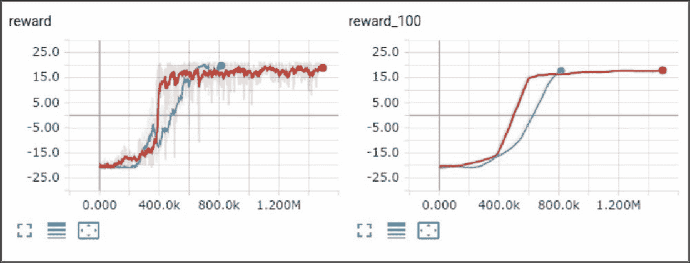

总结

在这一章中，我们走过并实现了自 2015 年第一篇 DQN 论文发表以来研究人员发现的许多 DQN 改进。这份清单远非完整。首先，对于方法列表，我用过论文，*【1】彩虹:结合深度强化学习的改进*，是 DeepMind 发表的，所以方法列表肯定是偏向 DeepMind 论文的。其次，RL 现在非常活跃，几乎每天都有新的论文出现，这使得我们很难跟上，即使我们将自己局限于一种 RL 模型，如 DQN。这一章的目的是给你一个该领域发展的不同观点的实际观点。

在下一章，我们将把我们的 DQN 知识应用到真实的股票交易场景中。

参考文献


# *Matteo Hessel，Joseph Modayil，Hado van Hasselt，Tom Schaul，Georg Ostrovski，Will Dabney，Dan Horgan，Bilal Piot，Mohammad Azar，David Silver，2017，Rainbow:结合深度强化学习的改进。arXiv:1710.02298*

*Sutton，R.S. 1988，用时间差异方法学习预测，机器学习 3(1):9-44*

*Hado Van Hasselt，Arthur Guez，David Silver，2015，采用双 Q 学习的深度强化学习。arXiv:1509.06461v3*


# *Meire Fortunato、Mohammad Gheshlaghi Azar、Bilal Pilot、Jacob Menick、Ian Osband、Alex Graves、Vlad Mnih、Remi Munos、戴密斯·哈萨比斯、Olivier Pietquin、Charles Blundell、Shane Legg，2017 年,《探索的嘈杂网络》, arXiv:1706.10295v1*

1.  *Marc Bellemare，Sriram Srinivasan，Georg Ostrovski，Tom Schaus，David Saxton，Remi Munos 2016，统一基于计数的探索和内在动机 arXiv:1606.01868v2*
2.  *Jarryd Martin，Suraj Narayanan Sasikumar，Tom Everitt，Marcus Hutter，2017，基于计数的特征空间探索用于强化学习 arXiv:1706.08090*
3.  *Tom Schaul，John Quan，Ioannis Antonoglou，David Silver，2015 年，优先体验回放 arXiv:1511.05952*
4.  *王子瑜，汤姆·绍尔，马特奥·赫塞尔，哈多·范·哈瑟尔特，马克·兰托特，南多·德·弗莱塔斯，2015，深度强化学习的决斗网络架构 arXiv:1511.06581*
5.  *Marc G. Bellemare，Will Dabney，Rémi Munos，2017，强化学习的分布视角 arXiv:1707.06887*
6.  *Jarryd Martin, Suraj Narayanan Sasikumar, Tom Everitt, Marcus Hutter, 2017, Count-Based Exploration in Feature Space for Reinforcement Learning arXiv:1706.08090*
7.  *Tom Schaul, John Quan, Ioannis Antonoglou, David Silver, 2015, Prioritized Experience Replay arXiv:1511.05952*
8.  *Ziyu Wang, Tom Schaul, Matteo Hessel, Hado van Hasselt, Marc Lanctot, Nando de Freitas, 2015, Dueling Network Architectures for Deep Reinforcement Learning arXiv:1511.06581*
9.  *Marc G. Bellemare, Will Dabney, Rémi Munos, 2017, A Distributional Perspective on Reinforcement Learning arXiv:1707.06887*