# 九、策略梯度——另一种选择

在本书第三部分的第一章中，我们将考虑一种处理**马尔可夫决策过程** ( **MDP** )问题的替代方法，这形成了一个完整的方法家族，称为**策略梯度** ( **PG** )。本章将概述这些方法，它们的动机，以及它们与我们已经熟悉的 Q-learning 相比的优缺点。我们将从一个叫做加强的简单 PG 方法开始，并尝试将其应用到我们的 CartPole 环境中，将其与**深度 Q 网络** ( **DQN** )方法进行比较。


# 价值观和策略

在我们开始讨论(PG)之前，让我们回顾一下本书第二部分中介绍的方法的共同特征。Q-learning 的中心话题是状态或动作+状态对的**值**。价值被定义为我们可以从这个州或通过从这个州发布这个特定的行动而获得的总奖励的折扣。如果我们知道价值，我们对每一步的决定都变得简单而明显:我们只是贪婪地按照价值行事，这保证了我们在一集结束时获得良好的总回报。因此，状态的值(在值迭代法的情况下)或状态+动作(在 Q 学习的情况下)挡在我们和最佳回报之间。为了获得这些值，我们使用了贝尔曼方程，它通过下一步的值来表示当前步的值。

在[第一章](part0012_split_000.html#BE6O2-ce551566b6304db290b61e4d70de52ee "Chapter 1. What is Reinforcement Learning?")、*什么是强化学习？我们将告诉我们在每个州做什么的实体定义为**策略**。正如 Q-learning 方法中的一样，当**值**指示我们如何行动时，它们实际上是在定义我们的策略。形式上，这可以写成，这意味着我们的策略在每个状态 *s* 的结果是 q 最大的动作。*

这种策略-价值观的联系是显而易见的，所以我们没有把策略作为一个独立的实体来强调，而是把大部分时间花在了讨论价值观和正确接近价值观的方法上。现在是时候关注这种联系了，在本书的第三部分，我们将忘记价值观，把注意力转向策略。


## 为什么策略？

有几个原因可以解释为什么策略可能是一个有趣的话题。首先，**策略**是我们在解决强化学习(RL)问题时所寻找的。当代理获得观察结果并需要决定下一步做什么时，我们需要的是策略，而不是状态或特定动作的值。我们确实关心总回报，但在每个状态下，我们可能对状态的确切值没什么兴趣。

想象一下这种情况:你正在丛林中行走，突然意识到灌木丛中藏着一只饥饿的老虎。你有几个选择，比如跑或者藏起来或者试着把你的背包扔向他，但是你要问，“跑这个动作的确切值是多少，它比什么都不做这个动作的值大吗？”有点傻。你不太在乎价值，因为你需要快速做出做什么的决定，仅此而已。我们的 Q-learning 方法试图间接地回答策略问题，通过估算各州的价值，并试图选择最佳方案，但是如果我们对价值不感兴趣，为什么还要做额外的工作呢？

策略可能比价值观更有吸引力的另一个原因是因为有很多行动的环境，或者在极端情况下，有一个**连续的**行动空间。为了能够决定在有 *Q(s，a)* 的情况下采取的最佳行动，我们需要解决一个小的优化问题，寻找 a，它最大化 *Q(s，a)* 。在 Atari 游戏有几个离散动作的情况下，这不是问题:我们只是近似所有动作的值，并采取最大 *Q* 的动作。如果我们的动作不是一个小的离散集合，而是有一个标量值与之相关，例如方向盘角度或我们想要逃离老虎的速度，这个优化问题就变得很困难，因为 *Q* 通常由高度非线性的神经网络(NN)表示，所以找到使函数值最大化的参数可能很棘手。在这种情况下，更可行的方法是避开值，直接使用策略。

支持策略学习的额外一票是具有**随机性的环境**。正如我们在[第 7 章](part0048_split_000.html#1DOR02-ce551566b6304db290b61e4d70de52ee "Chapter 7. DQN Extensions")、 *DQN 扩展*中看到的，在分类 DQN 中，我们的代理可以从处理 Q 值的分布而不是预期平均值中受益匪浅，因为我们的网络可以更精确地捕捉潜在的概率分布。正如我们将在下一节中看到的，策略自然地被表示为行动的概率，这与绝对 DQN 方法是一个方向。


## 策略表示

既然我们知道了策略的好处，我们准备试一试。那么我们如何表示策略呢？在 Q 值的情况下，它们由神经网络参数化，神经网络将动作值作为标量返回。如果我们希望我们的网络参数化的行动，我们有几个选择。第一种也是最简单的方法是只返回动作的标识符(在一组离散动作的情况下)。然而，这并不是处理离散集合的最佳方式。在分类任务中大量使用的一个更常见的解决方案是返回我们动作的概率分布。换句话说，对于 N 个互斥的动作，我们返回 N 个数字，表示在给定状态下采取每个动作的概率(我们将其作为输入传递给网络)。这种表示如下图所示。

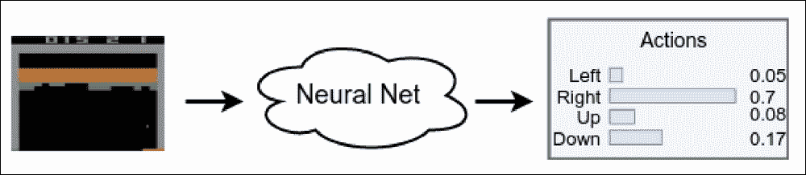

图 1:一组离散动作的神经网络策略近似

像概率这样的行为表示还有另外一个优点，即平滑表示:如果我们稍微改变一下我们的网络权重，网络的输出也会改变。在离散数字输出的情况下，即使是对权重的小调整也可能导致跳转到不同的动作。然而，如果我们的输出是概率分布，权重的小变化通常会导致输出分布的小变化，例如稍微增加一个动作相对于其他动作的概率。这是一个非常好的属性，因为梯度优化方法都是关于调整模型的参数来改善结果。在数学符号中，策略通常表示为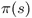，所以我们也将使用这种符号。


## 策略梯度

我们定义了我们的策略表示，但是到目前为止我们还没有看到我们将如何改变我们网络的参数来改进策略。如果你还记得[第四章](part0030_split_000.html#SJGS1-ce551566b6304db290b61e4d70de52ee "Chapter 4. The Cross-Entropy Method")中的*交叉熵方法*，在交叉熵方法中，我们解决了一个非常类似的问题:我们的网络将观察值作为输入，并返回行动的概率分布。事实上，交叉熵是我们将在本书这一部分讨论的方法的弟弟。首先，我们将熟悉称为加强的方法，它与交叉熵只有很小的不同，但首先我们需要看一些我们将在本章和后续章节中使用的数学符号。

我们定义 PG 为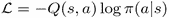。当然，这一点有很强的证明，但并不那么重要。我们更感兴趣的是这个表达的语义。

PG 定义了我们需要改变网络参数的方向，以便根据累积的总报酬来改进策略。梯度的比例与所采取行动的值成比例，在上式中为 *Q(s，a)* ，梯度本身等于所采取行动的对数概率的梯度。直觉上，这意味着我们试图增加给我们带来好的总回报的行动的概率，减少最终结果不好的行动的概率。公式中的期望 E 仅仅意味着我们在环境中做了几个步骤，然后平均梯度。

从实践的角度来看，PG 方法可以被实现为执行该损失函数的优化:。负号很重要，因为在**随机梯度下降** ( **SGD** )期间，损失函数**最小化**，但我们希望**最大化**我们的策略梯度。在本章和后面的章节中，你会看到 PG 方法的代码示例。


# 加固方法

我们刚刚看到的 PG 公式被大多数基于策略的方法使用，但细节可能会有所不同。非常重要的一点是如何精确计算梯度标度 *Q(s，a)* 。在第 4 章[的*交叉熵方法*中，我们播放了几集，计算了每一集的总奖励，并对奖励高于平均水平的集的过渡进行了训练。该训练程序是 PG 方法，对于来自*好*集(具有大的总奖励)的动作，具有 *Q(s，a) = 1* ，对于来自差集的动作，具有 *Q(s，a) = 0* 。](part0030_split_000.html#SJGS1-ce551566b6304db290b61e4d70de52ee "Chapter 4. The Cross-Entropy Method")

交叉熵方法即使在那些简单的假设下也能工作，但明显的改进将是使用 *Q(s，a)* 进行训练，而不是仅仅使用 0 和 1。那么为什么它会有帮助呢？答案是更精细的剧集分离。例如，总报酬= 10 的剧集的过渡应该比来自报酬= 1 的剧集的过渡对梯度的贡献更大。使用 *Q(s，a)* 而不仅仅是 0 或 1 常数的第二个原因是，在剧集开始时增加好行为的概率，并在接近剧集结尾时减少行为。这正是所谓的强化方法的思想。其步骤如下:

1.  用随机权重初始化网络
2.  播放 *N* 个完整剧集，保存它们的 *(s，a，r，s’)*转场
3.  对于每集 k 的每个步骤 t，计算后续步骤的总折扣奖励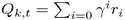
4.  计算所有转换的损失函数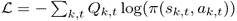
5.  执行 SGD 权重更新，最大限度地减少损失
6.  从步骤 2 开始重复，直到收敛

上面的算法在几个重要方面不同于 Q 学习:

*   不需要明确的探索。在 Q-learning 中，我们使用ε-贪婪策略来探索环境，并防止我们的代理陷入非最优策略。现在，根据网络返回的概率，探索是自动进行的。开始时，网络用随机权重初始化，网络返回均匀的概率分布。这种分布对应于随机的代理行为。
*   不使用重放缓冲器。PG 方法属于 on-policy 方法类，这意味着我们不能在从旧策略获得的数据上进行训练。这有好有坏。好的一面是这种方法通常收敛得更快。不好的一面是，它们通常比 DQN 等非策略方法需要更多与环境的互动。
*   不需要目标网络。这里我们使用 Q 值，但它们是从我们的环境经验中获得的。在 DQN，我们使用目标网络来打破 Q 值逼近中的相关性，但我们不再逼近它了。稍后，我们将看到目标网络技巧在 PG 方法中仍然有用。


## 翻筋斗的例子

要查看该方法的运行情况，让我们在熟悉的 CartPole 环境中检查增强方法的实现。示例的完整代码在`Chapter09/02_cartpole_reinforce.py`中。

```py
GAMMA = 0.99
LEARNING_RATE = 0.01
EPISODES_TO_TRAIN = 4
```

一开始，我们定义超参数(省略导入)。`EPISODES_TO_TRAIN`值指定了我们将用于训练的完整剧集的数量。

```py
class PGN(nn.Module):
    def __init__(self, input_size, n_actions):
        super(PGN, self).__init__()

        self.net = nn.Sequential(
            nn.Linear(input_size, 128),
            nn.ReLU(),
            nn.Linear(128, n_actions)
        )

    def forward(self, x):
        return self.net(x)
```

网络应该也是你熟悉的。请注意，尽管我们的网络返回概率，但我们没有对输出应用 softmax 非线性。这背后的原因是我们将使用 PyTorch `log_softmax`函数一次性计算 softmax 输出的对数。这种计算方式在数值上要稳定得多，但我们需要记住，网络的输出不是概率，而是原始分数(通常称为 logits)。

```py
def calc_qvals(rewards):
    res = []
    sum_r = 0.0
    for r in reversed(rewards):
        sum_r *= GAMMA
        sum_r += r
        res.append(sum_r)
    return list(reversed(res))
```

这个函数有点棘手。它接受整集的奖励列表，并需要计算每一步的折扣总奖励。为了有效地做到这一点，我们从本地奖励列表的末尾开始计算奖励。事实上，该集的最后一步的总奖励将等于其局部奖励。最后一步之前的一步会有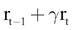的总奖励(如果 t 是最后一步的一个指标)。我们的`sum_r`变量包含前一步的总奖励，因此要获得前一步的总奖励，我们需要将`sum_r`乘以 gamma，并对本地奖励求和。

```py
if __name__ == “__main__”:
    env = gym.make(“CartPole-v0”)
    writer = SummaryWriter(comment=”-cartpole-reinforce”)

    net = PGN(env.observation_space.shape[0], env.action_space.n)
    print(net)

    agent = ptan.agent.PolicyAgent(net, preprocessor=ptan.agent.float32_preprocessor,
                                   apply_softmax=True)
    exp_source = ptan.experience.ExperienceSourceFirstLast(env, agent, gamma=GAMMA)

    optimizer = optim.Adam(net.parameters(), lr=LEARNING_RATE)
```

训练循环前的准备步骤你也应该很熟悉。唯一的新元素是来自`ptan`库的代理类。这里我们使用`ptan.agent.PolicyAgent,`,它需要为每个观察做出行动的决定。因为我们的网络现在以行动概率的形式返回策略？为了选择要采取的行动，我们需要从网络中获得概率，然后从这个概率分布中进行随机抽样。

当我们与 DQN 合作时，网络的输出是 Q 值，所以如果某个动作的值是 0.4，而另一个动作的值是 0.5，那么第二个动作在 100%的时间里都是首选的。在概率分布的情况下，如果第一个行动的概率为 0.4，第二个行动的概率为 0.5，那么我们的代理人应该以 40%的几率采取第一个行动，以 50%的几率采取第二个行动。当然，我们的网络可以 100%的时间决定采取第二个动作，在这种情况下，它为第一个动作返回概率 0，为第二个动作返回概率 1。

理解这种差异很重要，但实现中的变化并不大。我们的`PolicyAgent`用来自网络的概率在内部调用 NumPy `random.choice`函数。参数`apply_softmax`指示它通过首先调用 softmax 将网络输出转换为概率。第三个参数预处理器是一种避免 Gym 中的 CartPole 环境以`float64`而不是 PyTorch 所要求的`float32`返回观察结果的方法。

```py
    total_rewards = []
    done_episodes = 0

    batch_episodes = 0
    cur_rewards = []
    batch_states, batch_actions, batch_qvals = [], [], []
```

在开始训练循环之前，我们需要几个变量。第一组用于报告，包含每集的总奖励和已完成每集的计数。第二组用于收集训练数据。`cur_rewards list`包含当前播放剧集的本地奖励。当这一集结束时，我们使用`calc_qvals`函数计算本地奖励的总奖励折扣，并将它们添加到`batch_qvals`列表中。`batch_states`和`batch_actions lists`包含我们在上次培训中看到的状态和动作。

```py
    for step_idx, exp in enumerate(exp_source):
        batch_states.append(exp.state)
        batch_actions.append(int(exp.action))
        cur_rewards.append(exp.reward)

        if exp.last_state is None:
            batch_qvals.extend(calc_qvals(cur_rewards))
            cur_rewards.clear()
            batch_episodes += 1
```

以上是训练循环的开始。我们从经验源获得的每一个经验都包含状态、行动、本地奖励和下一个状态。如果已经到达该集的结尾，则下一个状态将是`None`。对于非终端经验条目，我们只在列表中保存状态、动作和本地奖励。在剧集结束时，我们将本地奖励转换为 Q 值，并增加剧集计数器。

```py
        new_rewards = exp_source.pop_total_rewards()
        if new_rewards:
            done_episodes += 1
            reward = new_rewards[0]
            total_rewards.append(reward)
            mean_rewards = float(np.mean(total_rewards[-100:]))
            print(“%d: reward: %6.2f, mean_100: %6.2f, episodes: %d” % (
                step_idx, reward, mean_rewards, done_episodes))
            writer.add_scalar(“reward”, reward, step_idx)
            writer.add_scalar(“reward_100”, mean_rewards,step_idx)
            writer.add_scalar(“episodes”, done_episodes, step_idx)
            if mean_rewards > 195:
                print(“Solved in %d steps and %d episodes!” % (step_idx, done_episodes))
                break
```

训练循环的这一部分在每集结束时执行，负责向 TensorBoard 报告当前进度并写入指标。

```py
        if batch_episodes < EPISODES_TO_TRAIN:
            continue

        optimizer.zero_grad()
        states_v = torch.FloatTensor(batch_states)
        batch_actions_t = torch.LongTensor(batch_actions)
        batch_qvals_v = torch.FloatTensor(batch_qvals)
```

当自上一个训练步骤以来已经过了足够多的片段时，我们对收集的示例执行优化。作为第一步，我们需要将状态、动作和 Q 值转换成适当的 PyTorch 形式。

```py
        logits_v = net(states_v)
        log_prob_v = F.log_softmax(logits_v, dim=1)
        log_prob_actions_v = batch_qvals_v * log_prob_v[range(len(batch_states)), batch_actions_t]
        loss_v = -log_prob_actions_v.mean()
```

然后我们计算台阶的损失。为此，我们要求我们的网络将状态计算成 logits，并计算它们的对数+ softmax。在第三行，我们从采取的行动中选择对数概率，并用 Q 值衡量它们。在最后一行，我们对这些缩放值进行平均，然后求反，以获得要最小化的损失。同样，这个负号非常重要，因为我们的 PG 需要最大化来改进策略。由于 PyTorch 中的优化器对损失函数进行最小化，我们需要取消 PG。

```py
        loss_v.backward()
        optimizer.step()

        batch_episodes = 0
        batch_states.clear()
        batch_actions.clear()
        batch_qvals.clear()

    writer.close()
```

剩下的代码很清楚:我们执行反向传播来收集变量中的梯度，并要求优化器执行 SGD 更新。在训练循环结束时，我们重置剧集计数器并清空列表以收集新数据。


## 结果

作为参考，我已经在 CartPole 环境中实现了 DQN，使用了与上面的增强示例几乎相同的超参数。就在`Chapter09/01_cartpole_dqn.py`里。这两个例子都不需要任何命令行参数，应该会在不到一分钟的时间内收敛。

```py
rl_book_samples/chapter09$ ./02_cartpole_reinforce.py
PGN (
  (net): Sequential (
    (0): Linear (4 -> 128)
    (1): ReLU ()
    (2): Linear (128 -> 2)
  )
)
63: reward:  62.00, mean_100:  62.00, episodes: 1
83: reward:  19.00, mean_100:  40.50, episodes: 2
99: reward:  15.00, mean_100:  32.00, episodes: 3
125: reward:  25.00, mean_100:  30.25, episodes: 4
154: reward:  28.00, mean_100:  29.80, episodes: 5
...
27676: reward: 200.00, mean_100: 193.58, episodes: 224
27877: reward: 200.00, mean_100: 194.07, episodes: 225
28078: reward: 200.00, mean_100: 194.07, episodes: 226
28279: reward: 200.00, mean_100: 194.53, episodes: 227
28480: reward: 200.00, mean_100: 195.09, episodes: 228
Solved in 28480 steps and 228 episodes!
```

DQN 和钢筋的收敛动态如下所示。

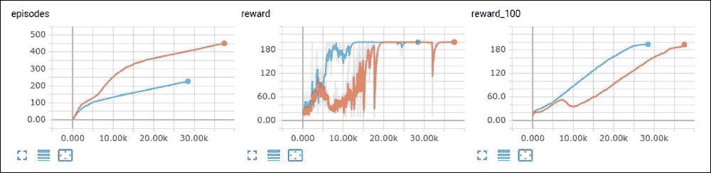

图 2:DQN(橙色)和加强(蓝线)的融合

正如你所看到的，加强收敛更快，需要更少的训练步骤和插曲来解决横竿环境。如果你还记得从[第四章](part0030_split_000.html#SJGS1-ce551566b6304db290b61e4d70de52ee "Chapter 4. The Cross-Entropy Method")，*交叉熵方法*开始，交叉熵方法需要大约 40 批 16 集来解决 CartPole 环境，总共是 640 集。强化方法能够在不到 300 集的里做到同样的事情，这是一个很好的改进。

基于策略与基于价值的方法


## 现在让我们从刚刚看到的代码后退一步，讨论一下这两个方法家族的差异:

策略方法直接优化了我们关心的东西:我们的行为。DQN 等价值方法也在间接这么做，首先学习价值，然后根据这个价值为美国提供策略。

*   策略方法是基于策略的，并且需要来自环境的新鲜样本。价值方法可以受益于从旧策略、人工演示和其他来源获得的旧数据。
*   策略方法通常样本效率较低，这意味着它们需要与环境进行更多的交互。值方法可以受益于大的重放缓冲区。然而，样本效率并不意味着值方法的计算效率更高，通常情况恰恰相反。在上面的例子中，在训练期间，我们只需要访问我们的神经网络一次，就可以得到行动的概率。在 DQN，我们需要处理两批状态:一批用于当前状态，另一批用于贝尔曼更新中的下一个状态。
*   正如你所看到的，没有一个家庭对另一个家庭的强烈偏好。在某些情况下，策略方法将是更自然的选择，如在连续控制问题或当进入环境是廉价和快速的情况下。然而，在很多情况下，价值方法会大放异彩，例如，DQN 变体最近在雅达利游戏上取得的最新成果。理想情况下，你应该平等地熟悉两个家庭，了解两个阵营的强势和弱势。在下一部分，我们将讨论，加强方法的局限性，改进它的方法，以及如何将 PG 方法应用到我们最喜欢的 Pong 游戏中。

强化问题


# 在上一节中，我们讨论了加强方法，这是从第四章[、*交叉熵方法*的自然延伸。不幸的是，增强和交叉熵仍然受到几个问题的困扰，这使得它们都局限于简单的环境。](part0030_split_000.html#SJGS1-ce551566b6304db290b61e4d70de52ee "Chapter 4. The Cross-Entropy Method")

需要全集


## 首先我们还是需要等完整集完成才能开始训练。更糟糕的是，随着用于训练的剧集越来越多，增强和交叉熵的表现越来越好(仅仅从更多剧集意味着更多训练数据这一事实来看，这意味着更准确的 PG)。这种情况对于在横杠中的短插曲来说是没问题的，当开始时，我们只能勉强处理超过 10 步的横杠，但在 Pong 中，这完全不同:每一集可以持续数百甚至数千帧。从训练的角度来看，这同样不好，因为我们的训练批次变得非常大，而且从样本效率来看，当我们需要与环境进行大量通信来执行单个训练步骤时。

完整剧集需求的来源是获得尽可能精确的 Q 估计。当我们谈到 DQN 时，我们看到在实践中，使用一步贝尔曼方程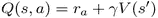用我们的估计值代替折扣奖励的确切值是很好的。为了估计*V(s)*我们使用了自己的 Q 估计，但是在 PG 的情况下，我们不再需要 *V(s)* 或 *Q(s，a)* 。

The origin of the complete episodes requirement is to get as accurate a Q estimation as possible. When we talked about DQN, we saw that in practice, it’s fine to replace the exact value for a discounted reward with our estimation using the one-step Bellman equation . To estimate *V(s),* we’ve used our own Q-estimation, but in the case of PG, we don’t have *V(s)* or *Q(s, a)* anymore.


为了克服这一点，有两种方法。一方面，我们可以要求我们的网络估计 *V(s)* 并使用该估计来获得 *Q* 。这种方法将在下一章讨论，称为*演员评论家方法*，是 PG 家族中最流行的方法。

另一方面，我们可以将贝尔曼方程向前展开 N 步，这将有效地利用 gamma 小于 1 时价值贡献减少的事实。实际上，当γ= 0.9 时，第十级的价值系数将是 0.9 ^(10) =0.35。在第 50 步，这个系数变成 0.9 ^(50) =0.00515，这对总奖励的贡献真的很小。在 gamma=0.99 的情况下，所需的步数变得更大，但我们仍然可以这样做。

高梯度方差


## 在 PG 公式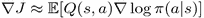中，我们有一个与来自给定州的贴现奖励成比例的梯度。然而，这种奖励的范围在很大程度上取决于环境。对于的例子，在 CartPole 环境中，当我们垂直拿着杆子时，每一个时间戳我们都会得到 1 的奖励。如果我们能做到这五步，我们将得到 5 英镑的总回报(未折现)。如果我们的代理人很聪明，可以拿着杆子走 100 步，总奖励将是 100。这两种情况之间的值差是 20 倍，这意味着不成功样本的梯度之间的比例将比更成功样本的比例低 20 倍。如此大的差异会严重影响我们的训练动态，因为一个幸运的插曲将在最后的梯度中占主导地位。

用数学术语来说，我们的 PGs 有很高的方差，我们需要在复杂的环境中对此做些什么，否则，训练过程会变得不稳定。通常的处理方法是从 *Q* 中减去一个叫做基线的值。基线的可能选择如下:

一些常数值，这些通常是折扣奖励的平均值

1.  折扣奖励的移动平均值
2.  状态值 *V(s)*
3.  探索


## 即使策略被表示为概率分布，代理也很有可能收敛到某个局部最优策略，并停止探索环境。在 DQN，我们用ε贪婪行动选择解决了这个问题:在概率ε下，代理采取一些随机行动，而不是当前策略规定的行动。当然，我们可以使用相同的方法，但是 PG 允许我们遵循一条更好的路径，称为熵奖励。

在信息论中，熵是某些系统中不确定性的度量。应用于代理策略时，熵显示了代理对于采取哪种行动有多少不确定性。在数学符号中，策略的熵定义为: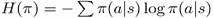。当策略一致时，熵的值总是大于零，并且有一个最大值。换句话说，所有的行为都有相同的概率。当我们的策略对于某些行为为 1，对于所有其他行为为 0 时，熵变得最小，这意味着代理人绝对确定要做什么。为了防止我们的代理陷入局部最小值，我们从损失函数中减去熵，惩罚代理过于确定要采取的行动。

样本间的相关性


## 正如我们在[第六章](part0043_split_000.html#190861-ce551566b6304db290b61e4d70de52ee "Chapter 6. Deep Q-Networks")、*深度 Q 网络*中讨论的，一个单集的训练样本通常是高度相关的，这对 SGD 训练是不利的。在 DQN 的例子中，我们通过一个包含 100k-1M 观察值的大型重放缓冲区解决了这个问题，我们从该缓冲区中抽取了一批训练样本。这个解决方案不再适用于 PG 系列，因为这些方法属于 on-policy 类。含义很简单:使用旧策略生成的旧样本，我们将得到旧策略的 PG，而不是当前策略的 PG。

显然，但不幸的是，错误的解决方案是减少重放缓冲区的大小。它可能在一些简单的情况下工作，但总的来说，我们需要由我们当前的策略生成的新的训练数据。为了解决这个问题，通常使用并行环境。想法很简单:我们使用几个环境，并使用它们的转换作为训练数据，而不是与一个环境通信。

扁担上的 PG


# 现在，几乎没有人使用普通的 PG 方法，因为存在更稳定的演员评论家方法，这将是下面两章的主题。然而，我仍然想展示 PG 实现，因为它建立了非常重要的概念和度量来检查 PG 方法的性能。因此，我们将从一个简单得多的 CartPole 环境开始，在下一节中，我们将在我们最喜欢的 Pong 环境中检查它的性能。以下示例的完整代码可在`Chapter09/04_cartpole_pg.py`中找到。

除了已经熟悉的超参数，我们有两个新的。熵β值是熵加成的尺度。`REWARD_STEPS`值指定了贝尔曼方程向前展开多少步，以估计每次转换的总奖励折扣。

```py
GAMMA = 0.99
LEARNING_RATE = 0.001
ENTROPY_BETA = 0.01
BATCH_SIZE = 8
REWARD_STEPS = 10
```

网络架构与前面的 CartPole 示例完全相同:一个两层网络，隐藏层有 128 个神经元。准备代码也和之前一样，只是要求经验源展开贝尔曼方程 10 步:

```py
class PGN(nn.Module):
    def __init__(self, input_size, n_actions):
        super(PGN, self).__init__()

        self.net = nn.Sequential(
            nn.Linear(input_size, 128),
            nn.ReLU(),
            nn.Linear(128, n_actions)
        )

    def forward(self, x):
        return self.net(x)
```

在训练循环中，我们维护每个过渡的折扣奖励的总和，并使用它来计算策略规模的基线。

```py
    exp_source = ptan.experience.ExperienceSourceFirstLast(env, agent, gamma=GAMMA, steps_count=REWARD_STEPS)
```

在损失计算中，我们使用与之前相同的代码来计算保单损失(即被否定的 PG)。

```py
    for step_idx, exp in enumerate(exp_source):
        reward_sum += exp.reward
        baseline = reward_sum / (step_idx + 1)
        writer.add_scalar(“baseline”, baseline, step_idx)
        batch_states.append(exp.state)
        batch_actions.append(int(exp.action))
        batch_scales.append(exp.reward - baseline)
```

然后，我们通过计算该批的熵并从损失中减去它，将熵奖金添加到损失中。由于熵对于均匀概率分布具有最大值，并且我们想要将训练推向该最大值，所以我们需要从损失中减去。

```py
        optimizer.zero_grad()
        logits_v = net(states_v)
        log_prob_v = F.log_softmax(logits_v, dim=1)
        log_prob_actions_v = batch_scale_v *log_prob_v[range(BATCH_SIZE), batch_actions_t]
        loss_policy_v = -log_prob_actions_v.mean()
```

然后，我们计算新旧策略之间的 Kullback-Leibler (KL)差异。KL-divergence 是一个概率分布如何偏离另一个预期概率分布的信息论度量。在我们的例子中，它被用来比较优化步骤前后模型返回的策略。KL 中的高尖峰通常是一个不好的信号，表明我们的策略被推得离之前的策略太远，这在大多数时候是一个坏主意(因为我们的 NN 在高维空间中是一个非常非线性的函数，所以模型权重的大变化可能对策略有非常强的影响)。

```py
        prob_v = F.softmax(logits_v, dim=1)
        entropy_v = -(prob_v * log_prob_v).sum(dim=1).mean()
        entropy_loss_v = -ENTROPY_BETA * entropy_v
        loss_v = loss_policy_v + entropy_loss_v

        loss_v.backward()
        optimizer.step()
```

最后，我们计算关于这个训练步骤的梯度的统计量。通常，展示梯度的最大值和 L2 范数的图形是一个很好的做法，可以了解训练的动态。

```py
        new_logits_v = net(states_v)
        new_prob_v = F.softmax(new_logits_v, dim=1)
        kl_div_v = -((new_prob_v / prob_v).log() * prob_v).sum(dim=1).mean()
        writer.add_scalar(“kl”, kl_div_v.item(), step_idx)
```

在训练循环的最后，我们将所有想要监控的值转储到 TensorBoard。

```py
        grad_max = 0.0
        grad_means = 0.0
        grad_count = 0
        for p in net.parameters():
            grad_max = max(grad_max, p.grad.abs().max().item())
            grad_means += (p.grad ** 2).mean().sqrt().item()
            grad_count += 1
```

结果

```py
        writer.add_scalar(“baseline”, baseline, step_idx)
        writer.add_scalar(“entropy”, entropy_v.item(), step_idx)
        writer.add_scalar(“batch_scales”, np.mean(batch_scales),step_idx)
        writer.add_scalar(“loss_entropy”, entropy_loss_v.item(),step_idx)
        writer.add_scalar(“loss_policy”, loss_policy_v.item(),step_idx)
        writer.add_scalar(“loss_total”, loss_v.item(), step_idx)
        writer.add_scalar(“grad_l2”, grad_means / grad_count,step_idx)
        writer.add_scalar(“grad_max”, grad_max, step_idx)

        batch_states.clear()
        batch_actions.clear()
        batch_scales.clear()
```


## 在这个例子中，我们在 TensorBoard 中绘制了许多图表。先说大家熟悉的:奖励。正如您在下面看到的，动态和性能与增强方法没有太大的不同。

图 3:PG 方法的奖励动态

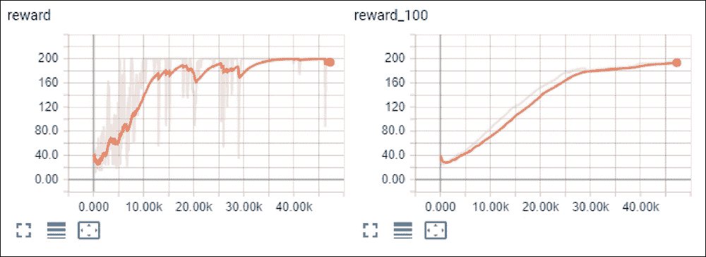

Figure 3: Reward dynamics for the PG method

接下来的两张图表是与我们的 PG 基线和等级相关。我们预计基线会收敛到 1+0.99+0.99²+…+0.99⁹，大概是 9.56。PG 的标度应该在零附近振荡。这正是我们在下图中看到的。

图 4:基线动态

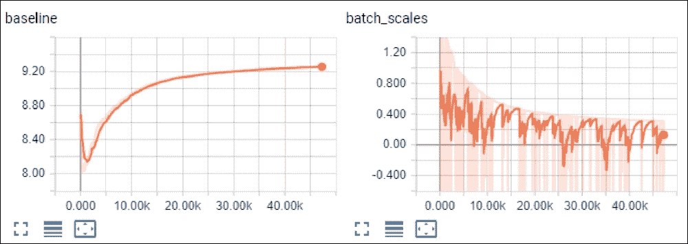

Figure 4: Baselines dynamics

熵随着时间从 0.69 减少到 0.52。起始值对应两个动作的最大熵(也就是，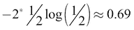)。熵在训练期间减小的事实表明，我们的策略正从均匀分布转向更确定的动作。

图 5:训练期间的熵动力学

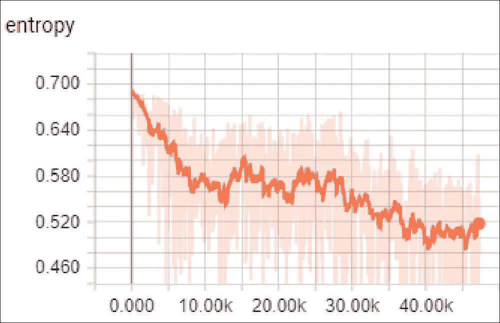

Figure 5: Entropy dynamics during the training

下一组图与损失相关，包括策略损失、熵损失及其总和。熵损失是成比例的，是上面熵图的镜像版本。策略损失显示了按批次计算的 PG 的平均规模和方向。这里我们应该检查两者的相对大小，以防止熵损失过大。

图 6:损失动态

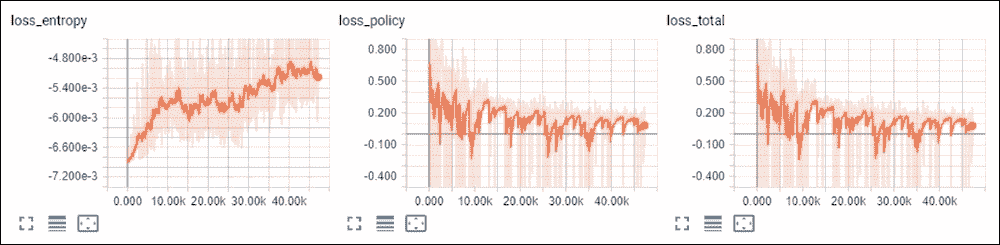

Figure 6: Loss dynamics

最后一组图表是梯度的最大值，L2 值和 KL。在整个训练过程中，我们的梯度看起来很健康:不太大也不太小，没有巨大的尖峰。KL 图表看起来也正常，因为有一些尖峰，但它们不超过 1e-3。

图 7:梯度和 KL 散度

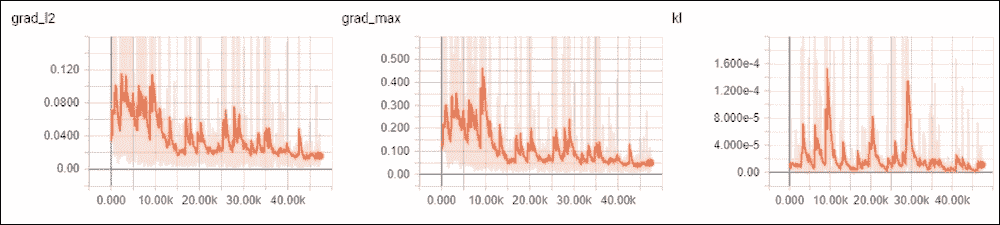

Figure 7: Gradients and KL divergence

PG on Pong


# 正如前面的部分所述，传统的 PG 方法在简单的 CartPole 环境中工作得很好，但在更复杂的环境中却令人惊讶地糟糕。即使在相对简单的 Atari 游戏 Pong 中，我们的 DQN 也能够在 1M 帧内完全解决它，并在仅 100k 帧内显示出积极的奖励动态，而 PG 未能收敛。由于 PG 训练的不稳定性，找到好的超参数变得非常困难，这仍然对初始化非常敏感。

这并不意味着 PG 不好，因为，正如我们将在下一章中看到的，只需对网络架构进行一点调整以获得梯度中更好的基线，PG 就会成为最好的方法之一(异步优势演员评论家(A3C)方法)。当然，很有可能我的超参数是完全错误的，或者代码有一些隐藏的错误或其他什么。不管怎样，不成功的结果仍然有价值，至少可以作为不良趋同动力的证明。示例的完整代码在`Chapter09/05_pong_pg.py`中。

与前一个示例代码的三个主要区别如下:

基线是用过去 100 万次转变的移动平均值来估计的，而不是所有的例子

*   使用了几个并发环境
*   修剪梯度以提高训练稳定性
*   为了加快移动平均值的计算速度，创建了一个支持队列的缓冲区。

这个例子中的第二个不同之处是可以在多个环境中工作，这个功能是由 ptan 库支持的。我们要做的唯一一件事就是将`Env`对象的数组传递给`ExperienceSource`类。其余的都是自动完成的。在几个环境的情况下，经验源要求他们进行循环转换，为我们提供不太相关的训练样本。与 CartPole 示例的最后一个区别是渐变裁剪，这是使用`torch.nn.utils`包中的 PyTorch `clip_grad_norm`函数执行的。

```py
class MeanBuffer:
    def __init__(self, capacity):
        self.capacity = capacity
        self.deque = collections.deque(maxlen=capacity)
        self.sum = 0.0

    def add(self, val):
        if len(self.deque) == self.capacity:
            self.sum -= self.deque[0]
        self.deque.append(val)
        self.sum += val

    def mean(self):
        if not self.deque:
            return 0.0
        return self.sum / len(self.deque)
```

最佳变量的超参数如下:

结果

```py
GAMMA = 0.99
LEARNING_RATE = 0.0001
ENTROPY_BETA = 0.01
BATCH_SIZE = 128

REWARD_STEPS = 10
BASELINE_STEPS = 1000000
GRAD_L2_CLIP = 0.1

ENV_COUNT = 32
```


## 好了，让我们来看看这个例子的最佳运行之一。下面是奖励图，你可以看到，在培训期间，奖励有一段时间几乎是恒定的，然后开始有所增长，被最低奖励的平坦区域打断-21。

图 Pong 的奖励图

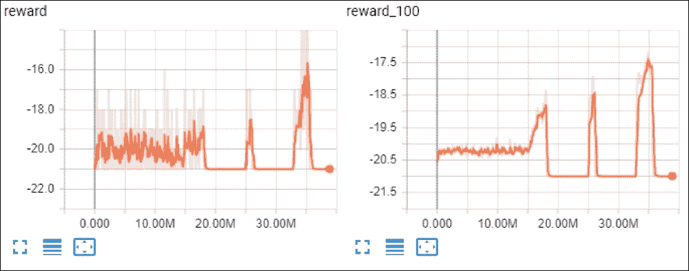

Figure 8: Reward plots for Pong

在熵图上，我们可以看到那些平坦的区域对应于熵为零的时期，这意味着我们的代理在其行动中有 100%的确定性。在这段时间间隔内，梯度也是零，所以我们的训练过程能够从那些平坦的区域中恢复过来是相当令人惊讶的。

图 9:使用 PG 方法的另一组 Pong 图

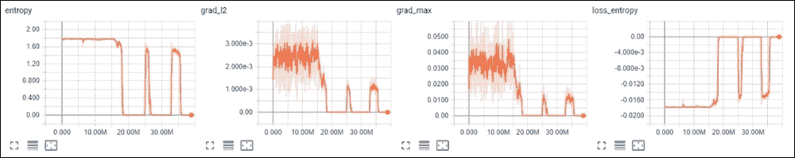

Figure 9: Another set of plots for Pong, using the PG method

带基线的图表大多跟随回报，并且有相同的模式。

图 10:基线、标度和标度的标准偏差

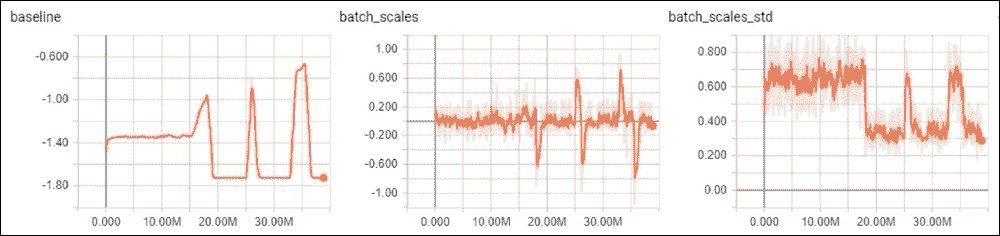

Figure 10: Baseline, scales, and standard deviation of scales

KL 图大约在零熵转变的时刻和从零熵转变的时刻有大的峰值,这表明该策略遭受了返回分布的大幅跳跃。

图 11:培训期间 KL 的偏离和损失

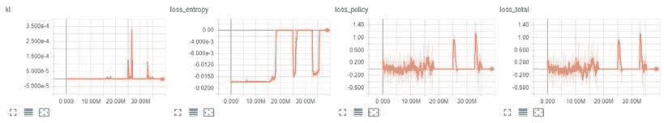

Figure 11: KL divergence and losses during training

总结


# 在这一章中，我们看到了解决 RL 问题的另一种方法:PG，它在许多方面不同于我们熟悉的 DQN 方法。我们探索了称为加强的基本方法，它是我们在 RL 域交叉熵中的第一种方法的推广。这种方法很简单，但是应用于 Pong 环境时，效果并不好。

在下一章中，我们将考虑通过结合基于价值和基于策略的方法来提高 PG 的稳定性。

In the next chapter, we’ll consider ways to improve the stability of PG by combining both families of value-based and policy-based methods.