#  十、演员评论家方法

在[第 9 章](part0068_split_000.html#20R682-ce551566b6304db290b61e4d70de52ee "Chapter 9. Policy Gradients – An Alternative")、*策略梯度——一种替代方案*中，我们开始研究一种常见的基于价值的方法家族的替代方案，称为基于策略的。特别是，我们重点研究了称为加强的方法及其修改，该方法使用折扣奖励来获得策略的梯度(这为我们提供了改进策略的方向)。这两种方法对于小 CartPole 问题都很有效，但是对于更复杂的 Pong 环境，收敛速度非常慢。

在这一章中，我们将讨论对传统**策略梯度** ( **PG** )方法的另一个扩展，它神奇地提高了新方法的稳定性和收敛速度。尽管修改很小，但新方法有自己的名字，**演员兼评论家**，它是深度**强化学习** ( **RL** )中最强大的方法之一。


# 方差减少

在上一章中，我们简要提到了提高 PG 方法稳定性的方法之一是减少梯度的方差。现在让我们试着理解为什么这很重要，以及减少方差意味着什么。在统计学中，方差是随机变量与该变量期望值的预期方差。

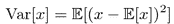

方差告诉我们数值离平均值有多远。当方差很大时，随机变量的取值会大大偏离均值。在下图中，正态(高斯)分布具有相同的平均值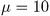，但是具有不同的方差值。

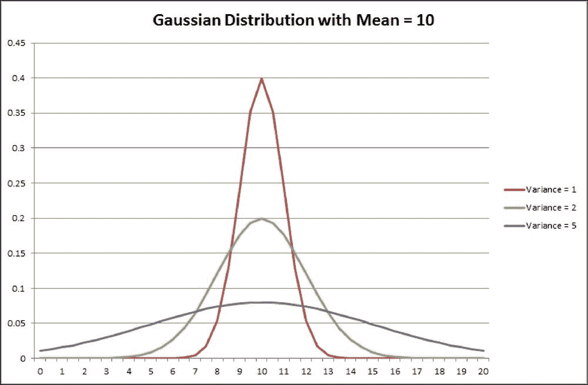

图 1:方差对高斯分布的影响

现在让我们回到 PG。在前一章已经说过，这种方法的思想是增加好行为的概率，减少坏行为的机会。在数学符号中，我们的 PG 被写成。比例因子 *Q(s，a)* 指定了我们希望在特定状态下增加或减少多少采取行动的概率。在强化方法中，我们使用总报酬的贴现值作为梯度的标度。为了增加强化稳定性，我们从梯度量表中减去了平均奖励。

为了理解为什么会有帮助，让我们考虑一个优化步骤的非常简单的场景，在这个场景中，我们有三个具有不同总折扣回报的动作:Q [1] 、Q [2] 和 Q [3] 。现在让我们考虑一下这些 Qs 相对价值的策略梯度。

作为第一个例子，让 Q [1] 和 Q [2] 都等于某个较小的正数，而 Q [3] 是较大的负数。所以，第一步和第二步的行动会带来一些小回报，但第三步并不是很成功。由此产生的所有三个步骤的**合并**梯度将试图推动我们的策略远离第三步的行动，而略微倾向于第一和第二步采取的行动，这是完全合理的做法。

现在让我们想象我们的报酬总是正的，只是价值不同。这对应于对所有 Q [1] 、Q [2] 和 Q [3] 增加一些常数。在这种情况下，Q1 和 Q2 成为大的正数，而 Q [3] 将具有小的正值。不过，我们的策略更新会变得不同！接下来，我们将努力推动我们的策略朝着第一步和第二步的行动，并略微推动它朝着第三步的行动。因此，严格地说，我们不再试图避免第三步所采取的行动，尽管事实上相对回报是相同的。

我们的策略更新依赖于报酬中添加的常量，这可能会显著减慢我们的培训，因为我们可能需要更多的样本*来平均*PG 的此类变化的影响。更糟糕的是，随着我们的总折现回报随着时间的推移而变化，随着代理学习如何表现得越来越好，我们的 PG 方差也可能发生变化。例如，在 Atari Pong 环境中，开始时的平均报酬为-21...20，所以所有的行动看起来几乎同样糟糕。

为了克服这个问题，在上一章中，我们从 Q 值中减去了平均总回报，并将其称为平均值**基线**。这个技巧让我们的 PGs 正常化，因为在平均奖励为-21 的情况下，获得-20 的奖励对代理来说看起来像是赢了，并且它将策略推向所采取的动作。


# CartPole 方差

为了在实践中检验这个理论上的结论，让我们为基线版本和没有基线的版本绘制训练期间 PG 的方差图。完整的示例在`Chapter10/01_cartpole_pg.py`中，大部分代码与[第 9 章](part0068_split_000.html#20R682-ce551566b6304db290b61e4d70de52ee "Chapter 9. Policy Gradients – An Alternative")、*策略梯度中的代码相同——另一种选择*。该版本的不同之处如下:

*   它现在接受命令行选项`--baseline`，该选项允许从奖励中减去平均值。默认情况下，不使用基线。
*   在每个训练循环中，我们从保单损失中收集梯度，并使用该数据计算方差。

要仅从策略损失中收集梯度，并从为探索添加的熵奖励中排除梯度，我们需要分两个阶段计算梯度。幸运的是，PyTorch 允许这很容易地完成。下面，只包括训练循环的相关部分来说明这个想法。

```
        optimizer.zero_grad()
        logits_v = net(states_v)
        log_prob_v = F.log_softmax(logits_v, dim=1)
        log_prob_actions_v = batch_scale_v * log_prob_v[range(BATCH_SIZE), batch_actions_t]
        loss_policy_v = -log_prob_actions_v.mean()
```

我们按照前面的计算保单损失，方法是根据采取行动的概率计算对数，然后乘以保单比例(如果我们不使用基线，则为总折扣奖励或总奖励减去基线)。

```
        loss_policy_v.backward(retain_graph=True)
```

下一步，我们要求 PyTorch 反向传播保单损失，计算梯度并将它们保存在我们模型的缓冲区中。正如我们之前执行的`optimizer.zero_grad()`，那些缓冲区将只包含来自保单损失的梯度。当我们调用`backward()`时，这里有一个棘手的问题是`retain_graph=True`选项。它指示 PyTorch 保持变量的图形结构。通常，这被`backward()`调用破坏，但是在我们的例子中，这不是我们想要的。一般来说，当我们需要在调用优化器之前多次反向传播丢失时，保留图形会很有用。这种情况并不常见，但有时会变得很方便。

```
        grads = np.concatenate([p.grad.data.numpy().flatten()
                                for p in net.parameters()
                                if p.grad is not None])
```

然后，我们从我们的模型中迭代所有参数(我们的模型的每个参数都是具有梯度的张量),并在展平的 NumPy 数组中提取它们的梯度场。这给了我们一个长数组，包含了模型变量的所有梯度。然而，我们的参数更新不仅要考虑策略梯度，还要考虑熵红利提供的梯度。为了实现这一点，我们计算熵损失并再次调用`backward()`。为了能够第二次这样做，我们需要通过`retain_graph=True`。

在第二次`backward()`调用时，PyTorch 将反向传播我们的熵损失，并将梯度添加到内部梯度的缓冲区中。因此，我们现在需要做的只是让我们的优化器使用这些组合梯度来执行优化步骤。

```
        prob_v = F.softmax(logits_v, dim=1)
        entropy_v = -(prob_v * log_prob_v).sum(dim=1).mean()
        entropy_loss_v = -ENTROPY_BETA * entropy_v
        entropy_loss_v.backward()
        optimizer.step()
```

后来，我们唯一需要做的就是把我们感兴趣的统计数据写入 TensorBoard。

```
        writer.add_scalar("grad_l2", np.sqrt(np.mean(np.square(grads))), step_idx)
        writer.add_scalar("grad_max", np.max(np.abs(grads)), step_idx)
        writer.add_scalar("grad_var", np.var(grads), step_idx)
```

通过运行这个例子两次，一次使用`--baseline`命令行选项，一次不使用，我们得到了 PG 的方差图。以下是奖励动态的图表:

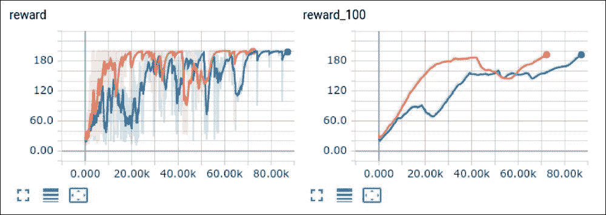

图 2:有基线(橙色)和无基线(蓝色)版本的收敛动态

以下三个图表显示了渐变的幅度、最大值和方差:

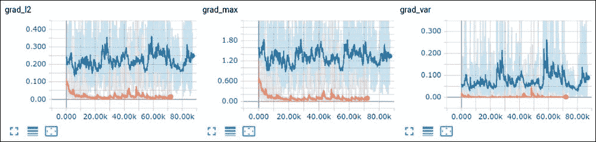

图 3:减去基线(橙色)和基本版本(蓝色)的梯度 l2、最大值和方差

如您所见，有基线的版本的方差比没有基线的版本低两到三个数量级，这有助于系统更快地收敛。


# 演员兼评论家

减少方差的下一步是使我们的基线依赖于状态(直觉上，这是一个好主意，因为不同的状态可能有非常不同的基线)。事实上，为了决定某一特定行为在某个州的适宜性，我们使用了该行为的总报酬折现。然而，总奖励本身可以表示为状态的*值*加上动作的*优势*:*Q(s，a) = V(s) + A(s，a)* 。我们在第 7 章、 *DQN 扩展*中已经看到了这一点，当时我们讨论了 DQN 的修改，特别是决斗 DQN。

那么，为什么不能用 *V(s)* 作为基线呢？在这种情况下，我们的梯度的规模将正好是 advantage *A(s，a)* ，显示这个采取的行动相对于平均状态的值如何更好。事实上，我们可以这样做，这是一个非常好的改进 PG 方法的想法。这里唯一的问题是:我们不知道从贴现总回报中减去 *V(s)* 状态的值 *Q(s，a)* 。为了解决这个问题，让我们使用*另一个神经网络*，它将对每个观测值近似为 *V(s)* 。为了训练它，我们可以利用我们在 DQN 方法中使用的相同训练程序:我们将执行贝尔曼步骤，然后最小化均方误差，以改善 *V(s)* 近似。

当我们知道任何状态的值时(或者至少有一些近似值)，我们可以使用它来计算 PG 并更新我们的策略网络，以增加具有良好优势值的行动的概率，并减少具有不良优势的行动的机会。策略网络(返回动作的概率分布)被称为*参与者*，因为它告诉我们该做什么。另一个网络叫做*评论家*，因为它让我们了解我们的行为有多好。下面是该架构的示意图。


图 4:A2C 架构

在实践中，策略和价值网络部分重叠，主要是出于效率和融合的考虑。在这种情况下，策略和价值被实现为网络的不同头部，从公共主体获取输出，并将其转换为概率分布和表示状态值的单个数字。这有助于两个网络共享低级功能(如 Atari 代理中的卷积滤波器)，但以不同的方式组合它们。该架构如下所示。

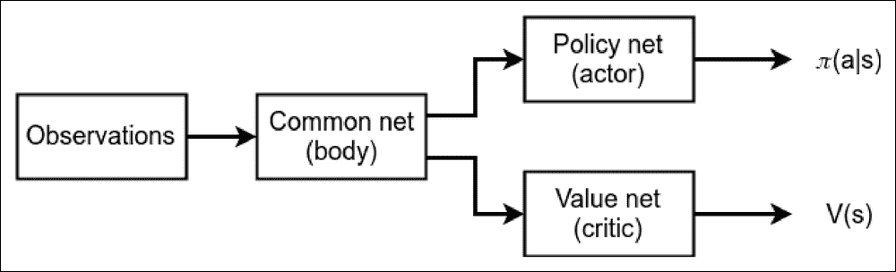

图 5:具有共享网络主体的 A2C 架构

从培训的角度来看，我们完成了以下步骤:

1.  用随机值初始化网络参数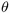
2.  在环境中玩 N 步使用当前策略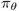，保存状态 st，动作 at，奖励 rt
3.  如果剧集结束，R = 0，或者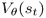
4.  对于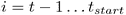(注意步骤是向后处理的):

    *   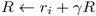
    *   累加 PG 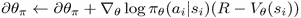
    *   累加值渐变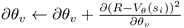

5.  使用累积的梯度更新网络参数，在 PG 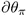方向和数值梯度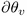的相反方向移动
6.  从步骤 2 开始重复，直到达到收敛

前面的算法是一个大纲，类似于那些通常打印在研究论文。在实践中，需要考虑一些因素:

*   熵奖励通常是用来提高探索的。它通常被写成熵值加上损失函数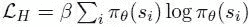的。当概率分布是均匀的时候，这个函数有一个最小值，所以通过把它加到损失函数中，我们正在推动我们的代理人不要太确定它的行为。
*   梯度累积通常被实现为结合了所有三个部分的损失函数:策略损失、值损失和熵损失。你应该小心这些损失的迹象，作为 PGs？正在向您展示策略改进的方向，但是价值和熵损失都应该最小化。
*   为了提高稳定性，值得使用几个环境，同时为您提供观察(当我们有多个环境时，我们的训练批次将从它们的观察中创建)。我们将在下一章中探讨几种方法。

前一种方法被称为演员评论家，或有时优势演员评论家，简称为 A2C。几个环境并行运行的版本称为 Advantage Asynchronous Actor-Critic，也称为 A3C。A3C 方法将是下一章的主题，但是现在让我们实现 A2C。


# 乒乓上的 A2C

在前一章中，我们看到了一个(不太成功的)用 PG 解决我们最喜欢的 Pong 环境的尝试。让我们用手头的演员评论家方法再试一次。

```
GAMMA = 0.99
LEARNING_RATE = 0.001
ENTROPY_BETA = 0.01
BATCH_SIZE = 128
NUM_ENVS = 50

REWARD_STEPS = 4
CLIP_GRAD = 0.1
```

像往常一样，我们从定义超参数开始(省略了导入)。这些值是不可调的，因为我们将在本章的下一节进行调整。这里我们有一个新的值:`CLIP_GRAD`。这个超参数指定了梯度削波的阈值，这基本上防止了我们在优化阶段的梯度变得太大，并将我们的策略推得太远。使用 PyTorch 功能来实现裁剪，但是想法非常简单:如果梯度的 L2 范数大于这个超参数，那么梯度向量被裁剪到这个值。

`REWARD_STEPS` 超参数决定了我们将采取多少步骤来估算每个行动的总折扣奖励。在 PG 中，我们使用了大约 10 个步骤，但在 A2C，我们将使用我们的值近似值来获得进一步步骤的状态值，因此减少步骤的数量也没问题。

```
class AtariA2C(nn.Module):
    def __init__(self, input_shape, n_actions):
        super(AtariA2C, self).__init__()

        self.conv = nn.Sequential(
            nn.Conv2d(input_shape[0], 32, kernel_size=8, stride=4),
            nn.ReLU(),
            nn.Conv2d(32, 64, kernel_size=4, stride=2),
            nn.ReLU(),
            nn.Conv2d(64, 64, kernel_size=3, stride=1),
            nn.ReLU()
        )

        conv_out_size = self._get_conv_out(input_shape)
        self.policy = nn.Sequential(
            nn.Linear(conv_out_size, 512),
            nn.ReLU(),
            nn.Linear(512, n_actions)
        )

        self.value = nn.Sequential(
            nn.Linear(conv_out_size, 512),
            nn.ReLU(),
            nn.Linear(512, 1)
        )
```

我们的网络体系结构有一个共享的卷积体和两个头部:第一个头部返回带有我们行为的概率分布的策略，第二个头部返回一个单一的数字，它将近似状态的值。它可能看起来类似于我们在[第 7 章](part0048_split_000.html#1DOR02-ce551566b6304db290b61e4d70de52ee "Chapter 7. DQN Extensions")、 *DQN 扩展*中的决斗 DQN 建筑，但是我们的训练程序是不同的。

```
    def _get_conv_out(self, shape):
        o = self.conv(torch.zeros(1, *shape))
        return int(np.prod(o.size()))

    def forward(self, x):
        fx = x.float() / 256
        conv_out = self.conv(fx).view(fx.size()[0], -1)
        return self.policy(conv_out), self.value(conv_out)
```

通过网络的前向传递返回两个张量的元组:策略和值。现在我们有了一个大而重要的函数，它接受环境转换的批次并返回三个张量:状态批次、采取的动作批次和使用公式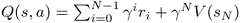计算的 Q 值批次。这个 Q 值将用于两个地方:计算均方误差(MSE)损失以改进值的近似值，与 DQN 的方法相同，以及计算行动的优势。

```
def unpack_batch(batch, net, device='cpu'):
    states = []
    actions = []
    rewards = []
    not_done_idx = []
    last_states = []
    for idx, exp in enumerate(batch):
        states.append(np.array(exp.state, copy=False))
        actions.append(int(exp.action))
        rewards.append(exp.reward)
        if exp.last_state is not None:
            not_done_idx.append(idx)
            last_states.append(np.array(exp.last_state, copy=False))
```

在第一个循环中，我们只是遍历我们的一批转换，并将它们的字段复制到列表中。注意，奖励值已经包含了前面`REWARD_STEPS`的折扣奖励，因为我们使用了`ptan.ExperienceSourceFirstLast`类。我们还需要处理剧集结束的情况，并记住非结束剧集的批量条目的索引。

```
    states_v = torch.FloatTensor(states).to(device)
    actions_t = torch.LongTensor(actions).to(device)
```

在前面的代码中，我们将收集的状态和动作转换为 PyTorch 张量，并在需要时将其复制到 GPU 中。该函数的其余部分计算 Q 值，将末期发作考虑在内。

```
    rewards_np = np.array(rewards, dtype=np.float32)
    if not_done_idx:
        last_states_v = torch.FloatTensor(last_states).to(device)
        last_vals_v = net(last_states_v)[1]
        last_vals_np = last_vals_v.data.cpu().numpy()[:, 0]
        rewards_np[not_done_idx] += GAMMA ** REWARD_STEPS * last_vals_np
```

前面的代码用我们的转移链中的最后一个状态准备了变量，并查询我们的网络以获得 *V(s)* 近似值。然后，将该近似值添加到折扣奖励中，并分几步乘以 gamma 指数。

```
    ref_vals_v = torch.FloatTensor(rewards_np).to(device)
    return states_v, actions_t, ref_vals_v
```

在函数的开始，我们将 Q 值打包成适当的形式并返回。

```
if __name__ == "__main__":
    parser = argparse.ArgumentParser()
    parser.add_argument("--cuda", default=False, action="store_true", help="Enable cuda")
    parser.add_argument("-n", "--name", required=True, help="Name of the run")
    args = parser.parse_args()
    device = torch.device("cuda" if args.cuda else "cpu")

    make_env = lambda: ptan.common.wrappers.wrap_dqn(gym.make("PongNoFrameskip-v4"))
    envs = [make_env() for _ in range(NUM_ENVS)]
    writer = SummaryWriter(comment="-pong-a2c_" + args.name)
```

训练循环的准备代码与往常一样，只是我们现在使用一系列环境来收集经验，而不是一个环境。

```
    net = AtariA2C(envs[0].observation_space.shape, envs[0].action_space.n).to(device)
    print(net)

    agent = ptan.agent.PolicyAgent(lambda x: net(x)[0], apply_softmax=True, device=device)
    exp_source = ptan.experience.ExperienceSourceFirstLast(envs, agent, gamma=GAMMA, steps_count=REWARD_STEPS)

    optimizer = optim.Adam(net.parameters(), lr=LEARNING_RATE, eps=1e-3)
```

这里一个非常重要的细节是将`eps`参数传递给优化器。如果你熟悉 **Adam** 算法，你可能知道 epsilon 是一个加在分母上的小数字，以防止出现零除的情况。通常，该值被设置为某个较小的数字，如 1e-8 或 1e-10，但是，在我们的例子中，这些值被证明太小了。对此我没有数学上严格的解释，但是使用默认值ε，这个方法根本不会收敛。很有可能，划分为 1e-8 的小值使得梯度太大，这对训练稳定性是致命的。

```
    batch = []

    with common.RewardTracker(writer, stop_reward=18) as tracker:
        with ptan.common.utils.TBMeanTracker(writer, batch_size=10) as tb_tracker:
            for step_idx, exp in enumerate(exp_source):
                batch.append(exp)

                # handle new rewards
                new_rewards = exp_source.pop_total_rewards()
                if new_rewards:
                    if tracker.reward(new_rewards[0], step_idx):
                        break

                if len(batch) < BATCH_SIZE:
                    continue
```

在训练循环中，我们使用两个包装器。第一个是您已经熟悉的:`common.RewardTracker`，它计算最近 100 集的平均奖励，并在这个平均奖励超过所需阈值时告诉我们。另一个包装器`TBMeanTracker`来自 ptan 库，负责将最后 10 步测量参数的平均值写入 TensorBoard。当训练可能需要数百万步时，这很有帮助，所以我们不想将数百万个点写入 TensorBoard，而是每 10 步写入平滑的值。下一个代码块负责我们的损失计算，这是 A2C 方法的核心。

```
                states_v, actions_t, vals_ref_v = unpack_batch(batch, net, device=device)
                batch.clear()

                optimizer.zero_grad()
                logits_v, value_v = net(states_v)
```

开始时，我们使用前面描述的函数解包我们的批处理，并要求我们的网络返回该批处理的策略和值。策略是以非规范化的形式返回的，所以要将其转换成概率分布，我们需要对其应用 softmax。我们推迟这一步使用`log_softmax`，因为它在数值上更稳定。

```
                loss_value_v = F.mse_loss(value_v.squeeze(-1), vals_ref_v)
```

价值损失部分几乎是微不足道的:我们只是计算我们的网络返回的价值和我们使用向前展开四步的贝尔曼方程执行的近似之间的 MSE。

```
                log_prob_v = F.log_softmax(logits_v, dim=1)
                adv_v = vals_ref_v - value_v.detach()
                log_prob_actions_v = adv_v * log_prob_v[range(BATCH_SIZE), actions_t]
                loss_policy_v = -log_prob_actions_v.mean()
```

这里，我们计算保单损失以获得 PG。前两步是获取我们策略的日志，计算行动的优势，即 *A(s，a) = Q(s，a) - V(s)* 。对`value_v.detach()`的调用很重要，因为我们不想将 PG 传播到我们的值近似值中。然后，我们对所采取的行动的概率进行记录，并根据优势对其进行衡量。我们的 PG 损失值将等于该策略的比例对数的否定平均值，因为 PG 指导我们改进策略，但是损失值应该被最小化。

```
                prob_v = F.softmax(logits_v, dim=1)
                entropy_loss_v = ENTROPY_BETA * (prob_v * log_prob_v).sum(dim=1).mean()
```

我们损失函数的最后一部分是熵损失，它等于我们策略的缩放熵，符号相反(熵计算为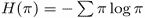)。

```
                loss_policy_v.backward(retain_graph=True)
                grads = np.concatenate([p.grad.data.cpu().numpy().flatten()
                                        for p in net.parameters()
                                        if p.grad is not None])
```

在前面的代码中，我们计算并提取策略的梯度，这将用于跟踪最大梯度、其方差和 L2 范数。

```
                loss_v = entropy_loss_v + loss_value_v
                loss_v.backward()
                nn_utils.clip_grad_norm_(net.parameters(), CLIP_GRAD)
                optimizer.step()
                loss_v += loss_policy_v
```

作为我们训练的最后一步，我们反向传播熵损失 an、值损失和剪辑梯度，并要求我们的优化器更新网络。

```
                tb_tracker.track("advantage", adv_v, step_idx)
                tb_tracker.track("values", value_v, step_idx)
                tb_tracker.track("batch_rewards", vals_ref_v, step_idx)
                tb_tracker.track("loss_entropy", entropy_loss_v, step_idx)
                tb_tracker.track("loss_policy", loss_policy_v, step_idx)
                tb_tracker.track("loss_value", loss_value_v, step_idx)
                tb_tracker.track("loss_total", loss_v, step_idx)
                tb_tracker.track("grad_l2", np.sqrt(np.mean(np.square(grads))), step_idx)
                tb_tracker.track("grad_max", np.max(np.abs(grads)),step_idx)
                tb_tracker.track("grad_var", np.var(grads), step_idx)
```

在训练循环的最后，我们跟踪我们将在 TensorBoard 中监控的所有值。它们有很多，我们将在下一节讨论它们。


# A2C 谈乒乓成绩

要开始训练，使用`--cuda`和-n 选项运行`02_pong_a2c.py`(为 TensorBoard 提供运行的名称):

```
rl_book_samples/Chapter10$ ./02_pong_a2c.py --cuda -n t2
AtariA2C (
  (conv): Sequential (
    (0): Conv2d(4, 32, kernel_size=(8, 8), stride=(4, 4))
    (1): ReLU ()

    (2): Conv2d(32, 64, kernel_size=(4, 4), stride=(2, 2))
    (3): ReLU ()
    (4): Conv2d(64, 64, kernel_size=(3, 3), stride=(1, 1))
    (5): ReLU ()
  )
  (policy): Sequential (
    (0): Linear (3136 -> 512)
    (1): ReLU ()
    (2): Linear (512 -> 6)
  )
  (value): Sequential (
    (0): Linear (3136 -> 512)
    (1): ReLU ()
    (2): Linear (512 -> 1)
  )
)
37799: done 1 games, mean reward -21.000, speed 722.89 f/s
39065: done 2 games, mean reward -21.000, speed 749.92 f/s
39076: done 3 games, mean reward -21.000, speed 755.26 f/s
...

```

作为一个警告:培训过程是漫长的。对于原始的超参数，需要超过 8M 的帧来求解，这在 GPU 上大约需要三个小时。在本章的下一节，我们将调整参数来提高收敛速度，但是，现在，它是三个小时。为了进一步改善这种情况，在下一章中，我们将研究分布式版本，它在一个单独的进程中执行环境，但首先让我们关注 TensorBoard 中的绘图。

首先，奖励动态看起来比上一章的例子好得多:

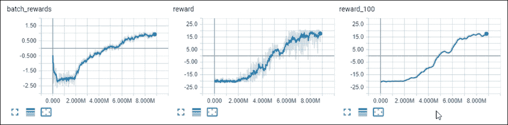

图 6:A2C 方法的收敛动态

第一个图 batch_rewards 显示了使用贝尔曼方程近似的 Q 值和 Q 近似中的总体正动态。接下来的两个情节是总的未折扣奖励和相同的奖励，但平均为最后 100 集。这表明，随着时间的推移，我们的培训流程或多或少在不断改进。

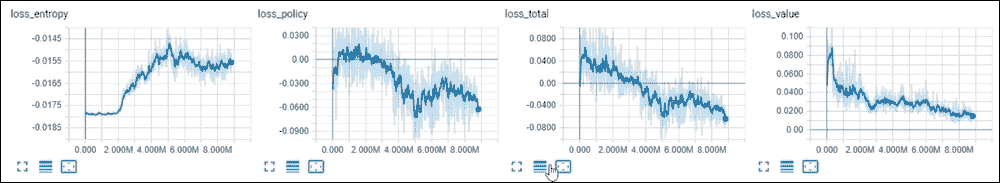

图 7:培训期间的损失成分

接下来的四个图表与我们的损失相关，包括单个损失部分和总损失。在这里我们可以看到各种各样的东西。首先，我们的价值损失在持续减少，这表明我们的 *V(s)* 近似值在训练过程中不断提高。我们可以分享的第二个观察结果是，我们的熵损失在增长，但在总损失中并不占主导地位。这基本上意味着，随着策略变得不那么一致，我们的代理人对其行动变得更加自信。这里要注意的最后一点是，保单损失在大多数时间都在减少，保单损失与总损失相关，这很好，因为我们首先对 PG 感兴趣。

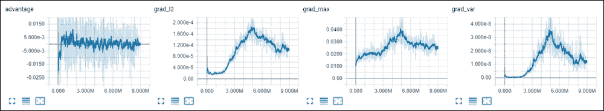

图 8:培训期间的优势和梯度指标

最后一组图显示了优势值和 PG 指标。优势是我们 PGs 的一个尺度，它等于 *Q(s，a) - V(s)* 。我们预计它会在零附近振荡，图表符合我们的预期。梯度图表明我们的梯度既不太小也不太大。方差在训练开始时非常小(对于 1.5M 的帧)，但后来开始增长，这意味着我们的策略正在改变。

调优超参数


# 在前面的部分中，我们在三个小时的优化和 9M 帧中解决了 Pong。现在是调整我们的超参数来加速收敛的好时机。这里的黄金法则是一次调整一个选项，并仔细做出结论，因为整个过程是随机的。

在本节中，我们将从原始超参数开始，并执行以下实验:

提高学习率

*   增加熵β
*   改变我们用来收集经验的环境数量
*   调整批量的大小
*   严格地说，下面的实验不是适当的超参数调整，只是试图更好地理解 A2C 收敛动力学如何依赖于参数。为了找到最佳的一组参数，全网格搜索或随机采样值可以得到更好的结果，但需要更多的时间和资源。

学习速度


## 我们的起始**学习率** ( **LR** )是 0.001，我们可以预期更大的学习率将导致更快的收敛。在我的测试中，这被证明是正确的，但只是在一定程度上:收敛速度提高到 0.003，但对于更大的值，系统根本不收敛。

性能结果如下:

LR = 0.002:480 万帧，1.5 小时

*   LR=0.003: 3.6M 帧，1 小时
*   LR=0.004:未收敛
*   LR=0.005:未收敛
*   回报动态和价值损失如下图所示。较大的 LR 值导致较低的值损失，这表明对策略和值头使用两个优化器(具有不同的学习速率)可能会导致更稳定的学习。

图 9:不同学习速率的实验(较快的收敛对应于较大的学习速率)

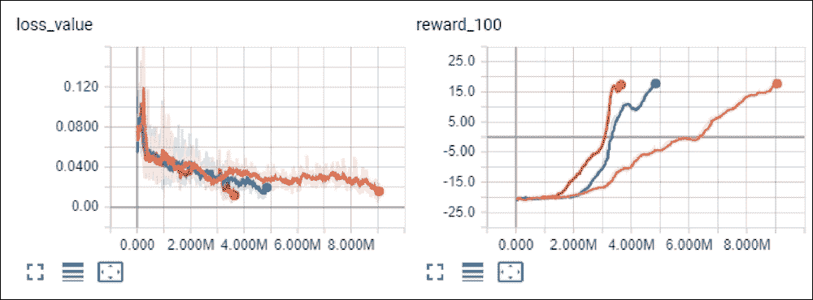

Figure 9: Experiments with different learning rates (faster convergence corresponds to large learning rates)

熵β


## 我尝试了两个熵值损失标度:0.02 和 0.03。第一个值提高了速度，但第二个值又使速度变得更差，所以最优值介于两者之间。结果如下:

beta = 0.02:680 万帧，2 小时

*   beta=0.03: 12M 帧，4 小时
*   环境计数


## 不清楚什么样的环境效果最好，所以我尝试了几个小于或大于初始值 50 的计数。结果是矛盾的，但似乎环境越多，收敛越快:

envs = 40:8.6 兆帧，3 小时

*   envs = 30:620 万帧，2 小时(看起来像一颗幸运的种子)
*   envs = 20:950 万帧，3 小时
*   Envs=10:没有收敛
*   Envs=60: 11.6M 帧，4 小时(看起来像个倒霉的种子)
*   envs = 70:770 万帧，2.5 小时
*   批量大小


## 关于批量大小的实验产生了一个意想不到的结果:较小的批量导致更快的收敛，但是对于非常小的批量，回报不会增加。从 RL 的角度来看，这是合乎逻辑的，因为对于较小的批次，我们执行更频繁的网络更新，并且我们需要更少的观察，但是这对于深度学习来说是反直觉的，因为较大的批次通常会带来更多的 i.i.d .训练数据:

批次= 64:490 万帧，1.7 小时

*   批次= 32:380 万帧，1.5 小时
*   批量=16，不收敛
*   总结


# 在本章中，我们看到了 deep RL 中使用最广泛的方法之一:A2C，它明智地将 PG 更新与状态近似值结合起来。通过分析基线对梯度的统计和收敛的影响，我们介绍了 A2C 背后的思想。然后，我们检查了基线概念的扩展:A2C，其中一个单独的网络负责人为我们提供当前状态的基线。

在下一章中，我们将研究以分布式方式执行相同算法的方法。

In the next chapter, we will look at ways to perform the same algorithm in a distributed way.