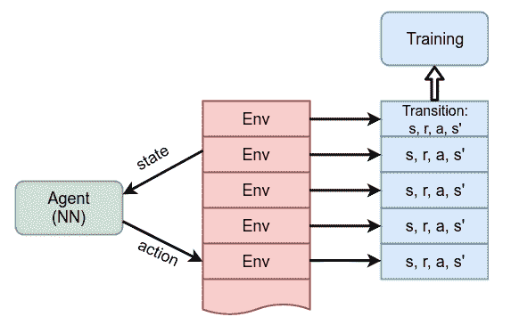
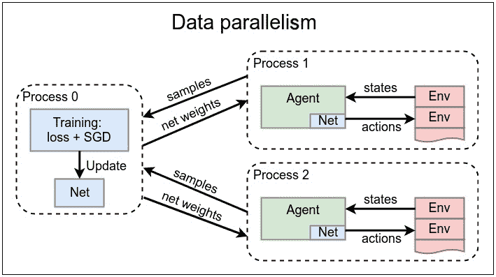
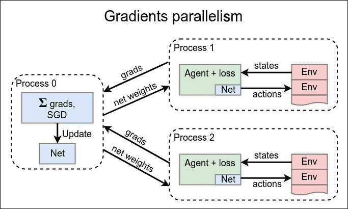
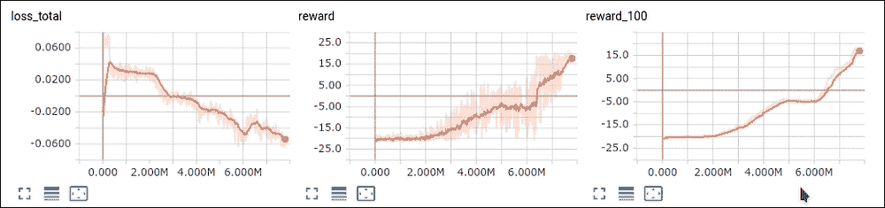
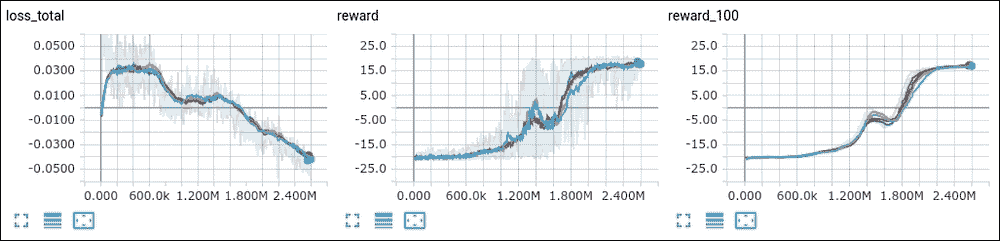

<title>Chapter 11. Asynchronous Advantage Actor-Critic</title>  

# 第十一章。异步优势行动者-批评家

本章致力于扩展我们在前一章详细讨论的**演员-评论家** ( **A2C** )方法。该扩展增加了真正的异步环境交互。全称是**异步优势演员-评论家**，通常缩写为 A3C。这种方法是 RL 实践者最广泛使用的方法之一。我们将看一下向基本 A2C 方法添加异步行为的两种方法。

<title>Chapter 11. Asynchronous Advantage Actor-Critic</title>  

# 相关性和样本效率

提高**策略梯度** ( **PG** )系列方法稳定性的方法之一是并行使用多个环境。这背后的原因是我们在[第六章](part0043_split_000.html#190861-ce551566b6304db290b61e4d70de52ee "Chapter 6. Deep Q-Networks")、*深度 Q 网络*中讨论的基本问题，当我们谈到样本之间的相关性时，它打破了**独立同分布**(**I . I . d .**)假设，这对于**随机梯度下降** ( **SGD** )优化来说是至关重要的。这种相关性的负面结果是梯度中非常高的方差，这意味着我们的训练批次包含非常相似的示例，所有这些示例都将我们的网络推向相同的方向。然而，从全球角度来看，这可能完全是错误的方向，因为所有这些例子都可能来自一个幸运或不幸的插曲。

利用我们的**深度 Q 网络** ( **DQN** )，我们通过在重放缓冲区中存储大量先前状态并从该缓冲区中采样我们的训练批次来解决这个问题。如果缓冲区足够大，从中随机抽取的样本可以更好地代表各州的总体分布情况。不幸的是，这种解决方案不适用于 PG 方法，因为它们中的大多数都是基于策略的，这意味着我们必须对当前策略生成的样本进行训练，因此，*记住旧的转换*不再可能。您可以尝试这样做，但是生成的 PG 将用于生成样本的旧策略，而不是您想要更新的当前策略。

几年来，这个问题一直是研究人员关注的焦点，并且提出了解决这个问题的几种方法，但是这个问题仍然远远没有解决。最常用的解决方案是使用几个并行环境收集转换，所有这些环境都利用当前策略。这打破了单个情节中的相关性，因为我们现在在从不同环境中获得的几个情节上进行训练。与此同时，我们仍在使用我们目前的政策。这样做的一个很大的缺点是**样本效率低**，因为我们基本上丢掉了我们在一次训练后获得的所有经验。比较 DQN 和控卫的方法很简单。例如，对于 DQN，如果我们对每个新帧使用 1M 的重放缓冲样本和 32 个样本的训练批次大小，则在从体验重放推送之前，每个单个过渡将大约使用 32 次。对于第 7 章、 *DQN 扩展*中讨论的优先级重放缓冲区，这个数字可能会高得多，因为样本概率并不均匀。在 PG 的情况下，从环境中获得的每一个经验只能使用一次，因为我们的方法需要新的数据，所以 PG 方法的数据效率可能比基于值的非策略方法低一个数量级。

另一方面，我们的 A2C 代理在 8M 帧中收敛于 **Pong** ，这仅仅是第六章*Deep Q-Networks*[第七章](part0048_split_000.html#1DOR02-ce551566b6304db290b61e4d70de52ee "Chapter 7. DQN Extensions")*DQN 扩展*中基本 DQN 的 1M 帧的八倍多。所以，这向我们表明 PG 方法并非完全无用；它们只是不同，有自己的特点，您需要在选择方法时加以考虑。如果您的环境在代理交互方面比较便宜(环境速度快、内存占用少、允许并行化等等)，PG 方法可能是更好的选择。另一方面，如果环境是昂贵的，并且获得大量的经验会减慢训练过程，基于价值的方法可能是更聪明的方法。

<title>Adding an extra A to A2C</title>  

# 给 A2C 多加一个 A

从实践的角度来看，与几个并行环境进行通信是很简单的，我们已经在前一章中完成了，但是没有明确地说明。在 A2C 代理中，我们将一组健身房环境传递给`ExperienceSource`类，该类将其切换到循环数据收集模式:每次我们请求从体验源进行转换时，该类都会使用我们数组中的下一个环境(当然，为每个环境保留状态)。这种简单的方法相当于与环境的并行通信，但是有一点不同:严格意义上的通信不是并行的，而是以串行方式执行的。然而，来自我们经验源的样本被打乱了。这个想法如下图所示:



图 1:来自多个并行环境的代理培训

这种方法工作得很好，并且帮助我们在 A2C 方法中获得了收敛，但是在计算资源利用方面它仍然不是完美的。即使是现在最普通的工作站也有几个 CPU 内核，可以用于计算，例如训练和环境交互。另一方面，当你有一个清晰的执行流时，并行编程比传统的范例更难。幸运的是，Python 是一种非常富于表现力和灵活性的语言，拥有许多第三方库，这使得您可以毫不费力地进行并行编程。另一个好消息是 PyTorch 在它的`torch.multiprocessing`模块中支持并行编程。并行和分布式编程是一个非常广泛的话题，远远超出了本书的范围。在这里，我们将仅仅触及并行化这个大领域的表面，但是还有很多东西需要学习。

关于行动者-批评家并行化，存在两种方法:

1.  **数据并行**:我们可以有几个进程，每个进程与一个或多个环境通信，并为我们提供转换(s，r，a，s’)。所有这些样本都集中在一个单一的训练过程中，该过程计算损失并执行 SGD 更新。然后，需要将更新的神经网络参数广播给所有其他进程，以便在未来的环境通信中使用。
2.  **梯度并行**:由于训练过程的目标是计算梯度以更新我们的网络，我们可以让几个过程计算它们自己的训练样本的梯度。然后，可以将这些梯度相加，在一个过程中执行 SGD 更新。当然，更新后的网络权重也需要传播给所有工人，以保持数据符合策略。

下图说明了这两种方法。



图 2:基于正在收集的分布式训练样本的第一种演员-评论家并行方法



图 3:并行化的第二种方法，为模型收集梯度

从图中可以看出这两种方法的区别并不明显，但是您需要注意计算成本。A3C 优化中最繁重的操作是训练过程，该过程包括根据数据样本计算损失(正向传递)以及计算与该损失相关的梯度。SGD 优化步骤是相当轻量级的，基本上只是将比例梯度添加到网络的权重中。通过将第二种方法中的损失和梯度计算从中央流程中移出，我们消除了主要的潜在瓶颈，并使整个流程的可扩展性显著提高。

在实践中，方法的选择主要取决于你的资源和你的目标。如果您有一个单一的优化问题和大量的分布式计算资源，例如分布在网络中几台机器上的几十个 GPU，那么梯度并行是加速您训练的最佳方法。然而，在单个 GPU 的情况下，这两种方法将向您展示相似的性能，并且第一种方法通常更容易实现，因为您不需要弄乱低级别的渐变值。在这一章中，我们将在我们最喜欢的 Pong 游戏上实现这两种方法，看看这两种方法之间的区别，并看看 PyTorch 的多处理能力。

<title>Multiprocessing in Python</title>  

# Python 中的多重处理

Python 包含了`multiprocessing`(大多数时候简称为`mp`)模块来支持进程级并行和所需的通信原语。在我们的例子中，我们将使用这个模块中的两个主要类:

*   `mp.Queue`:并发多生产者、多消费者 FIFO 队列，对队列中的对象进行透明的序列化和反序列化
*   `mp.Process`:在子进程中运行的一段代码和从父进程控制它的方法

PyTorch 在`multiprocessing`模块周围提供了自己的瘦包装，增加了对 CUDA 设备和共享内存上的张量和变量的正确处理。它提供了与标准库中的`multiprocessing`模块完全相同的功能，所以您需要做的就是使用`import torch.multiprocessing`而不是`import multiprocessing`。

<title>A3C – data parallelism</title>  

# A3C–数据并行

我们将检查的 A3C 并行化的第一个版本(图 2 中有概述)既有一个执行训练的主进程，也有几个与环境通信并收集训练经验的子进程。为了简单和高效，没有实现来自训练器过程的**神经网络** ( **NN** )权重广播。不是显式地收集权重并将其发送给子进程，而是使用 PyTorch 内置功能在所有进程之间共享网络，允许我们通过调用 NN 创建上的`share_memory()`方法，在不同进程中使用相同的`nn.Module`实例及其所有权重。在幕后，这种方法对 CUDA(因为 GPU 内存在所有主机进程之间共享)或 CPU 计算情况下的共享内存 IPC 没有任何开销。在这两种情况下，该方法都提高了性能，但我们的示例仅限于使用一个 GPU 卡进行训练和数据收集的单台机器。对于我们的 Pong 示例来说，这并没有太大的限制，但是如果您需要更大的可伸缩性，这个示例应该扩展为显式共享网络权重。

完整的代码在`Chapter11/01_a3c_data.py`文件中，它使用具有以下功能块的`Chapter11/lib/common.py`模块:

*   `class AtariA2C(nn.Module)`:这实现了演员-评论家 NN 模块
*   `class RewardTracker`:处理全集未打折奖励，写入 TensorBoard，检查*游戏已解决*条件
*   `unpack_batch(batch, net, last_val_gamma)`:该功能将 *n* 集步骤的一批转换(状态、奖励、动作、last_state)转换成适合训练的数据

那些类和函数的代码我们在前面几章已经看到了，这里就不赘述了。现在让我们检查主要模块的代码，包括子流程和主训练循环的功能。

```
#!/usr/bin/env python3
import gym
import ptan
import numpy as np
import argparse
import collections
from tensorboardX import SummaryWriter

import torch.nn.utils as nn_utils
import torch.nn.functional as F
import torch.optim as optim
import torch.multiprocessing as mp

from lib import common
```

开始时，我们导入所需的模块。除了我们正在导入`torch.multiprocessing`库之外，这里没有什么新的东西。

```
GAMMA = 0.99
LEARNING_RATE = 0.001
ENTROPY_BETA = 0.01
BATCH_SIZE = 128

REWARD_STEPS = 4
CLIP_GRAD = 0.1

PROCESSES_COUNT = 4
NUM_ENVS = 15

ENV_NAME = "PongNoFrameskip-v4"
NAME = 'pong'
REWARD_BOUND = 18
```

在超参数中，我们有两个新值:

*   `PROCESSES_COUNT`指定将为我们收集培训数据的子流程的数量。这个活动大部分是 CPU 受限的，因为这里最繁重的操作是 Atari 帧预处理，所以这个值被设置为等于我的机器上的 CPU 核心的数量。
*   `NUM_ENVS`是每个子进程将用来收集数据的环境数量。这个数字乘以进程的数量就是我们将从中获取训练数据的并行环境的总数。

    ```
    def make_env():     return ptan.common.wrappers.wrap_dqn(gym.make(ENV_NAME))
    ```

在我们使用子进程函数之前，我们需要环境构造函数和一个微小的包装器，我们将使用它将总剧集奖励发送到主训练进程中。

```
def data_func(net, device, train_queue):
TotalReward = collections.namedtuple('TotalReward', field_names='reward')
    envs = [make_env() for _ in range(NUM_ENVS)]
    agent = ptan.agent.PolicyAgent(lambda x: net(x)[0], 
      device=device, apply_softmax=True)
    exp_source = ptan.experience.ExperienceSourceFirstLast(envs, 
      agent, gamma=GAMMA, steps_count=REWARD_STEPS)

    for exp in exp_source:
        new_rewards = exp_source.pop_total_rewards()
        if new_rewards:
          train_queue.put(TotalReward
           (reward=np.mean(new_rewards)))
        train_queue.put(exp)
```

前面的函数非常简单，但很特殊，因为它将在子进程中执行(我们将使用`mp.Process`类在主代码块中启动这些进程)。我们传递给它三个参数:我们的 NN，用于执行计算的设备(`cpu`或`cuda`字符串)，以及我们将用于从子进程向主进程发送数据的队列，主进程将执行训练。队列用于多生产者和单消费者模式，并且可以包含两种不同类型的对象:

*   `TotalReward`:这是我们定义的一个前置对象，它只有一个字段奖励，是已完成剧集的总未折扣奖励的浮点值。
*   `ptan.experience.ExperienceFirstLast`:这个对象包装了`REWARD_STEPS`子序列中的第一个状态、采取的行动、这个子序列的折扣奖励以及最后一个状态。这是我们的经验，我们将用于培训。

这就是子过程，现在让我们检查主过程和训练循环的开始代码。

```
if __name__ == "__main__":
    mp.set_start_method('spawn')
    parser = argparse.ArgumentParser()
    parser.add_argument("--cuda", default=False, 
      action="store_true", help="Enable cuda")
    parser.add_argument("-n", "--name", required=True, 
      help="Name of the run")
    args = parser.parse_args()
    device = "cuda" if args.cuda else "cpu"
    writer = SummaryWriter(comment="-a3c-data_" + NAME + "_" + args.name)
```

开始时，我们采取熟悉的步骤，除了一个对`mp.set_start_method`的调用，它指示`multiprocessing`模块我们想要使用的并行类型。Python 中的本机多处理库支持几种启动子进程的方式，但是由于 PyTorch 多处理的限制，spawn 是最好的选择。

```
    env = make_env()
    net = common.AtariA2C(env.observation_space.shape, 
      env.action_space.n).to(device)
    net.share_memory()
    optimizer = optim.Adam(net.parameters(), 
      lr=LEARNING_RATE, eps=1e-3)
```

之后，我们创建我们的神经网络，将其移动到 CUDA 设备，并要求它共享其权重。CUDA 张量默认共享，但是对于 CPU 模式，需要调用`share_memory`。

```
    train_queue = mp.Queue(maxsize=PROCESSES_COUNT)
    data_proc_list = []
    for _ in range(PROCESSES_COUNT):
        data_proc = mp.Process(target=data_func, 
          args=(net, device, train_queue))
        data_proc.start()
        data_proc_list.append(data_proc)
```

然后，我们必须启动我们的子进程，但是在此之前，我们创建一个队列，它们将使用这个队列向我们传递数据。队列构造函数的参数指定最大队列容量。将一个新项目推到满队列的所有尝试都将被阻止，这对于我们保持我们的数据样本符合策略非常方便。在队列创建之后，我们使用`mp.Process`类启动所需数量的进程，并将它们保存在一个列表中，用于正确的关闭。在`mp.Process.start()`调用之后，我们的`data_func`函数将由子进程执行。

```
    batch = []
    step_idx = 0

    try:
        with common.RewardTracker(writer, 
stop_reward=REWARD_BOUND) as tracker:
            with ptan.common.utils.TBMeanTracker(writer, 
batch_size=100) as tb_tracker:
                while True:
                    train_entry = train_queue.get()
                    if isinstance(train_entry, TotalReward):
                        if tracker.reward(train_entry.reward, 
step_idx):
                            break
                        continue
```

在训练循环的开始，我们从队列中获取下一个条目，并处理可能的`TotalReward`对象，我们将这些对象传递给奖励跟踪器。

```
                    step_idx += 1
                    batch.append(train_entry)
                    if len(batch) < BATCH_SIZE:
                        continue
```

因为我们在队列中只能有两种类型的对象(`TotalReward`和经历转换)，所以我们只需要检查一次从队列中获得的条目。在处理完`TotalReward`条目后，我们将经验对象放入到批量累积中，直到达到所需的批量大小。

```
                    states_v, actions_t, vals_ref_v = \
                        common.unpack_batch(batch, net, last_val_gamma=GAMMA**REWARD_STEPS, device=device)
                    batch.clear()
```

当我们获得所需数量的经验样本时，我们使用`unpack_bach`函数将它们转换成训练数据，并清除该批次。需要注意的一点是:由于我们的经验样本代表四步子序列(因为`REWARD_STEPS`是 4)，我们需要为最后的 *V(s)* 奖励项使用一个合适的折扣因子 *γ* ^(*4*) 。训练循环的其余部分是标准的行动者-批评者损失计算，其执行方式与上一章完全相同:我们使用当前网络计算策略和价值估计的逻辑，并计算策略、价值和熵损失。

```
                    optimizer.zero_grad()
                    logits_v, value_v = net(states_v)

                    loss_value_v = F.mse_loss(value_v.squeeze(-1), 
                      vals_ref_v)

                    log_prob_v = F.log_softmax(logits_v, dim=1)
                    adv_v = vals_ref_v - value_v.detach()
                    log_prob_actions_v = adv_v * 
                      log_prob_v[range(BATCH_SIZE), actions_t]
                    loss_policy_v = -log_prob_actions_v.mean()

                    prob_v = F.softmax(logits_v, dim=1)
                    entropy_loss_v = ENTROPY_BETA * (prob_v * 
                      log_prob_v).sum(dim=1).mean()

                    loss_v = entropy_loss_v + loss_value_v + 
                      loss_policy_v
                    loss_v.backward()
                    nn_utils.clip_grad_norm_(net.parameters(), 
                      CLIP_GRAD)
                    optimizer.step()
```

最后一步，我们将计算出的张量传递给 TensorBoard `tracker`类，它将执行我们想要监控的数据的平均和存储。

```
                    tb_tracker.track("advantage", adv_v, step_idx)
                    tb_tracker.track("values", value_v, step_idx)
                    tb_tracker.track("batch_rewards", vals_ref_v, 
                      step_idx)
                    tb_tracker.track("loss_entropy", 
                      entropy_loss_v, step_idx)
                    tb_tracker.track("loss_policy", loss_policy_v, 
                      step_idx)
                    tb_tracker.track("loss_value", loss_value_v, 
                      step_idx)
                    tb_tracker.track("loss_total", loss_v, 
                      step_idx)
    finally:
        for p in data_proc_list:
            p.terminate()
            p.join()
```

在最后一个`finally`块中，由于异常( *Ctrl* + *C* )或*游戏解决*条件而可以执行，我们终止子进程并等待它们。这是确保没有剩余流程所必需的。

<title>A3C – data parallelism</title>  

## 结果

像往常一样启动示例，经过一段时间的延迟后，它应该开始写入绩效和平均奖励数据。在 GTX 1080Ti 和 4 核机器上，它显示的速度约为每秒 1800 帧，比上一章的 600 帧/秒有了很大提高。

```
rl_book_samples/Chapter11$ ./01_a3c_data.py --cuda -n final
44830: done 1 games, mean reward -21.000, speed 1618.10 f/s
44856: done 2 games, mean reward -21.000, speed 2053.09 f/s
45037: done 3 games, mean reward -21.000, speed 2036.78 f/s
45351: done 4 games, mean reward -21.000, speed 1894.14 f/s
45562: done 5 games, mean reward -21.000, speed 2204.78 f/s
45573: done 6 games, mean reward -21.000, speed 629.41 f/s
...
```

在收敛动力学方面，新版本类似于具有并行环境的 A2C，并在来自环境的 7M-8M 观测中解决 Pong。然而，这 800 万帧的处理只需一个多小时，而不是等待三个小时。



图 Pong 上 A3C 数据并行版本的收敛动态

<title>A3C – gradients parallelism</title>  

# A3C–梯度平行度

我们将考虑的并行 A2C 实施的下一种方法将有几个子进程，但不是将训练数据馈送到中央训练循环，而是它们将使用本地训练数据计算梯度，并将这些梯度发送到中央主进程。此过程负责将这些梯度组合在一起(基本上就是将它们相加)，并在共享网络上执行 SGD 更新。

这种差异可能看起来很小，但这种方法更具可扩展性，尤其是如果您有几个功能强大的节点，并且有多个 GPU 与网络相连。在这种情况下，数据并行模型中的中央过程很快成为瓶颈，因为损失计算和反向传播需要大量计算。梯度并行化允许将负载分散到几个 GPU 上，只在中心位置执行相对简单的梯度组合操作。

完整的示例在`Chapter11/02_a3c_grad.py`文件中，它使用了与我们之前的示例相同的`Chapter11/lib/common.py`文件。

```
GAMMA = 0.99
LEARNING_RATE = 0.001
ENTROPY_BETA = 0.01

REWARD_STEPS = 4
CLIP_GRAD = 0.1

PROCESSES_COUNT = 4
NUM_ENVS = 15

GRAD_BATCH = 64
TRAIN_BATCH = 2
ENV_NAME = "PongNoFrameskip-v4"
NAME = 'pong'
REWARD_BOUND = 18
```

像往常一样，我们正在定义超参数，除了用两个参数`GRAD_BATCH`和`TRAIN_BATCH`代替`BATCH_SIZE`之外，这些超参数与前面的例子基本相同。`GRAD_BATCH`的值定义了每个子进程用来计算损失和获取梯度值的批处理的大小。第二个参数`TRAIN_BATCH`指定在每次 SGD 迭代中有多少来自子流程的梯度批次将被合并。子进程产生的每个条目都具有与我们的网络参数相同的形状，我们将它们的`TRAIN_BATCH`值加在一起。因此，对于每个优化步骤，我们都使用`TRAIN_BATCH * GRAD_BATCH`训练样本。由于损失计算和反向传播是相当繁重的操作，我们使用大的`GRAD_BATCH`使它们更有效。由于这个大批量，我们应该保持`TRAIN_BATCH`相对较低，以保持我们的网络更新政策。

```
def make_env():
    return ptan.common.wrappers.wrap_dqn(gym.make(ENV_NAME))

def grads_func(proc_name, net, device, train_queue):
    envs = [make_env() for _ in range(NUM_ENVS)]

    agent = ptan.agent.PolicyAgent(lambda x: net(x)[0], 
      device=device, apply_softmax=True)
    exp_source = ptan.experience.ExperienceSourceFirstLast(envs, 
      agent, gamma=GAMMA, steps_count=REWARD_STEPS)

    batch = []
    frame_idx = 0
    writer = SummaryWriter(comment=proc_name)
```

前面是由子进程执行的函数，这比我们的数据并行示例要复杂得多。作为补偿，主流程中的训练循环变得几乎微不足道。在创建子进程时，我们向函数传递几个参数:

*   用于创建 TensorBoard 编写器的进程的名称。在这个例子中，每个子进程都写自己的 TensorBoard 数据集。
*   共享神经网络。
*   执行计算的装置(`cpu`或`cuda`字符串)。
*   用于将计算出的梯度传送到中央进程的队列。

我们的子流程函数看起来非常类似于数据并行版本中的主训练循环，这并不奇怪，因为我们的子流程的责任增加了。然而，我们没有要求优化器更新网络，而是收集梯度并将它们发送到队列中。剩下的代码几乎是一样的。

```
    with common.RewardTracker(writer, stop_reward=REWARD_BOUND) as 
tracker:
        with ptan.common.utils.TBMeanTracker(writer, 
batch_size=100) as tb_tracker:
            for exp in exp_source:
                frame_idx += 1
                new_rewards = exp_source.pop_total_rewards()
                if new_rewards and tracker.reward(new_rewards[0], 
frame_idx):
                    break

                batch.append(exp)
                if len(batch) < GRAD_BATCH:
                    continue
```

到目前为止，我们已经收集了带有过渡的批次，并处理了剧集结尾的奖励。

```
                states_v, actions_t, vals_ref_v = \
                    common.unpack_batch(batch, net, 
last_val_gamma=GAMMA**REWARD_STEPS, device=device)
                batch.clear()

                net.zero_grad()
                logits_v, value_v = net(states_v)
                loss_value_v = F.mse_loss(value_v.squeeze(-1), 
vals_ref_v)

                log_prob_v = F.log_softmax(logits_v, dim=1)
                adv_v = vals_ref_v - value_v.detach()
                log_prob_actions_v = adv_v * 
log_prob_v[range(GRAD_BATCH), actions_t]
                loss_policy_v = -log_prob_actions_v.mean()

                prob_v = F.softmax(logits_v, dim=1)
                entropy_loss_v = ENTROPY_BETA * (prob_v * 
log_prob_v).sum(dim=1).mean()

                loss_v = entropy_loss_v + loss_value_v + 
loss_policy_v
                loss_v.backward()
```

在前面的部分中，我们根据训练数据计算组合损失，并执行损失的反向传播，这有效地将每个网络参数的梯度存储在`Tensor.grad`字段中。这可以在不打扰与其他工作者同步的情况下完成，因为我们的网络参数是共享的，但是梯度是由每个进程本地分配的。

```
                tb_tracker.track("advantage", adv_v, frame_idx)
                tb_tracker.track("values", value_v, frame_idx)
                tb_tracker.track("batch_rewards", vals_ref_v, 
                  frame_idx)
                tb_tracker.track("loss_entropy", entropy_loss_v, 
                  frame_idx)
                tb_tracker.track("loss_policy", loss_policy_v, 
                  frame_idx)
                tb_tracker.track("loss_value", loss_value_v, 
                  frame_idx)
                tb_tracker.track("loss_total", loss_v, frame_idx)
```

在前面的代码中，我们将把我们在训练期间要监控的中间值发送到 TensorBoard。

```
                nn_utils.clip_grad_norm(net.parameters(), 
                  CLIP_GRAD)
                grads = [param.grad.data.cpu().numpy() if 
                  param.grad is not None else None
                         for param in net.parameters()]
                train_queue.put(grads)
```

在循环结束时，我们需要裁剪梯度，并将它们从网络参数中提取到一个单独的缓冲区中(以防止它们被循环的下一次迭代破坏)。

```
    train_queue.put(None)
```

`grads_func`的最后一行将`None`放入队列，表示该子进程已经到达*游戏已解决*状态，训练应该停止。

```
if __name__ == "__main__":
    mp.set_start_method('spawn')
    parser = argparse.ArgumentParser()
    parser.add_argument("--cuda", default=False, 
      action="store_true", help="Enable cuda")
    parser.add_argument("-n", "--name", required=True, 
      help="Name of the run")
    args = parser.parse_args()
    device = "cuda" if args.cuda else "cpu"

    env = make_env()
    net = common.AtariA2C(env.observation_space.shape, 
      env.action_space.n).to(device)
    net.share_memory()
```

主要过程从创建网络和共享其权重开始。

```
    optimizer = optim.Adam(net.parameters(), lr=LEARNING_RATE, 
      eps=1e-3)

    train_queue = mp.Queue(maxsize=PROCESSES_COUNT)
    data_proc_list = []
    for proc_idx in range(PROCESSES_COUNT):
        proc_name = "-a3c-grad_" + NAME + "_" + args.name + "#%d" 
          % proc_idx
        data_proc = mp.Process(target=grads_func, args=(proc_name, 
          net, device, train_queue))
        data_proc.start()
        data_proc_list.append(data_proc)
```

然后，像以前一样，我们创建通信队列，并产生所需数量的子进程。

```
    batch = []
    step_idx = 0
    grad_buffer = None

    try:
        while True:
            train_entry = train_queue.get()
            if train_entry is None:
                break
```

A3C 的数据并行版本之间的主要区别在于训练循环，这里要简单得多，因为子进程已经为我们完成了所有繁重的计算。在循环的开始，我们处理当一个过程已经达到要求的平均回报时停止训练的情况。在这种情况下，我们只是退出循环。

```
            step_idx += 1

            if grad_buffer is None:
                grad_buffer = train_entry
            else:
                for tgt_grad, grad in zip(grad_buffer,train_entry):
                    tgt_grad += grad
```

为了平均来自不同孩子的梯度，我们为获得的每个`TRAIN_BATCH`梯度调用优化器的`step()`函数。对于中间步骤，我们只是把对应的梯度加在一起。

```
            if step_idx % TRAIN_BATCH == 0:
                for param, grad in zip(net.parameters(),grad_buffer):
                    grad_v = torch.FloatTensor(grad).to(device)
                    param.grad = grad_v

                nn_utils.clip_grad_norm_(net.parameters(),CLIP_GRAD)
                optimizer.step()
                grad_buffer = None
```

当我们积累了足够多的梯度片段时，我们将梯度的总和转换成 PyTorch `FloatTensor`并将其分配给网络参数的`grad`字段。之后，我们需要做的就是调用优化器的`step()`方法，使用累积的梯度来更新网络参数。

```
    finally:
        for p in data_proc_list:
            p.terminate()
            p.join()
```

在退出训练循环时，我们停止所有子进程以确保我们终止了它们，即使按下 *Ctrl* + *C* 来停止优化。这是为了防止僵尸进程占用 GPU 资源。

<title>A3C – gradients parallelism</title>  

## 结果

这个例子可以像以前一样开始，过一会儿应该开始显示速度和意思奖励；但是，您需要注意，显示的信息对于每个子进程都是本地的，这意味着速度、完成的游戏数和帧数需要乘以进程的数量。我的基准测试显示，每个孩子的速度大约是每秒 550-600 帧，总共 2200-2400 帧/秒。

```
rl_book_samples/Chapter11$ ./02_a3c_grad.py --cuda -n final
11278: done 1 games, mean reward -21.000, speed 520.23 f/s
11640: done 2 games, mean reward -21.000, speed 610.54 f/s
11773: done 3 games, mean reward -21.000, speed 485.09 f/s
11803: done 4 games, mean reward -21.000, speed 359.42 f/s
11765: done 1 games, mean reward -21.000, speed 519.08 f/s
11771: done 2 games, mean reward -21.000, speed 531.22 f/s
...
```

收敛动态也和之前的版本很像。观测总次数约为 8M-10M，需要一个半小时才能完成。



图 Pong 上基于梯度的 A3C 并行化的收敛

<title>Summary</title>  

# 总结

在这一章中，我们讨论了 PG 方法从多个环境中收集训练数据的重要性，这是由于它们的政策性质。我们还实现了两种不同的 A3C 方法，以便并行化和稳定训练过程。当我们讨论黑盒方法时(RL 中的[第 16 章](part0114_split_000.html#3CN041-ce551566b6304db290b61e4d70de52ee "Chapter 16. Black-Box Optimization in RL")、*黑盒优化)，并行化将在本书中再次出现。在接下来的章节中，我们将会看到使用 PG 方法可以解决的实际问题，这将会结束本书的 PG 部分。*