# 十二、使用 RL 训练聊天机器人

在这一章中，我们将看看**深度强化学习** ( **Deep RL** )的另一个实际应用，这是近两年开始流行的:用 RL 方法训练自然语言模型。它始于 2014 年发表的一篇名为*视觉注意力的递归模型*的论文，并已成功应用于从**自然语言处理** ( **NLP** )领域的各种各样的问题。

为了理解该方法，我们将从简单介绍 NLP 基础知识开始，包括**循环神经网络**(**RNN**)**词嵌入、**和 **seq2seq** 模型。然后，我们将讨论 NLP 和 RL 问题之间的相似之处，并看看如何使用 RL 方法改进 NLP seq2seq 训练的原始想法。本章的核心是在电影对话数据集上训练的对话系统。


# 聊天机器人概述

2017 年许多趋势话题中的一个是人工智能驱动的聊天机器人。在这个问题上有各种各样的观点，从*完全无用的东西*，到*一个绝对聪明的想法*，但有一点很难质疑:聊天机器人为人们与计算机交流开辟了新的方式，比我们都习惯的老式界面更像人、更自然。

从本质上来说，聊天机器人是一种计算机程序，它使用自然语言与其他方(人类或其他计算机程序)以对话的形式进行交流。这种场景可能有许多不同的形式，即一个聊天机器人与用户交谈，或者许多机器人相互交谈，等等。例如，可能有一个技术支持机器人可以回答用户的自由文本问题。然而，通常聊天机器人共享对话交互的共同属性(用户提出一个问题，但聊天机器人可以提出澄清性问题以获得缺失的信息)和自由形式的**自然语言**(这使得它不同于电话菜单，例如，当你有固定的*时，按 N 进入 X 类别*，或者*输入你的银行账号以检查给用户的余额*选项)。

自然语言理解是一个长期的科幻概念。在电影中，你只需与你的星际飞船的电脑聊天，就可以获得关于最近外星人入侵的有用和相关的信息，而无需按下任何按钮。这个场景被作者利用了几十年，但是在现实生活中，这种与计算机的交互直到最近才开始成为现实。你仍然不能和你的星际飞船说话，但是你至少可以不用按按钮就能开关你的烤面包机，这无疑是一大进步！

计算机花这么长时间理解语言的原因仅仅是因为语言本身的复杂性。甚至在琐碎的场景中，比如说，*烤面包机，打开开关！*你可以想象出几种制定订单的方式，但通常很难使用普通的计算机编程技术提前捕捉到所有这些方式和极端情况。不幸的是，传统的计算机编程要求你给计算机准确、明确的指令，一个小小的错误，或者输入中的模糊，都可能使你超级复杂的代码失败。

最近在**机器学习** ( **ML** ) 和**深度学习** ( **DL** )及其所有应用方面的进展，是打破计算机编程中这种严格性的第一个真正的步骤，代之以一种不同的想法:让计算机自己找到数据中的模式。这种方法在某些领域非常成功，现在每个人都对这种新方法及其潜在的应用感到非常兴奋。DL 复活始于计算机视觉，然后延续到 NLP 领域，你肯定可以期待将来会有越来越多新的、成功的、有用的应用。

所以，回到我们的聊天机器人，自然语言的复杂性是实际应用中的主要障碍。很长一段时间，聊天机器人大多是无聊的工程师为了娱乐而创造的玩具。这种系统中最古老，也绝对是最受欢迎的一个例子是伊莱扎，她在 20 世纪 60 年代创造了([https://en.wikipedia.org/wiki/ELIZA](https://en.wikipedia.org/wiki/ELIZA))。尽管 ELIZA 在模仿心理治疗师方面相当成功，但它对用户的短语完全没有理解，只是包括一小组手动创建的模式和对用户输入的典型回复。在前 DL 时代，这种方法是实现这种系统的一种主要方式，当时人们普遍认为我们只需要添加更多的模式来捕捉真实的语言角落情况，一段时间后，计算机将能够理解人类语言。不幸的是，这个想法被证明是不切实际的，因为人类需要处理的规则和矛盾例子的数量太大太复杂，无法手工创建。

ML 方法允许你从不同的方向解决问题的复杂性。您不必手动创建大量规则来处理用户输入，而是收集大量训练数据，并允许 ML 算法找到解决问题的最佳方法。这种方法有自己的与 NLP 领域相关的具体细节，我们将在本章的下一节对它们进行简要概述。就目前而言，更重要的是，软件开发人员发现了使用自然语言的能力，就像他们使用其他对计算机友好得多的正式事物，如文档格式、网络协议或计算机语言语法一样。这仍然不是微不足道的，需要大量的工作，有时你会踏入未知的领域，但至少这种方法有时是可行的，不需要你将数百名语言学家锁在一个房间里十年来收集 NLP 规则！

从聊天机器人的角度来看，它们仍然是非常新的和实验性的，但总的想法是允许计算机以自由文本对话的形式而不是更正式的方式与用户交流。例如，让我们以网上购物为例。当你想买东西时，你去网上商店，如亚马逊或易贝，浏览分类或使用网站搜索找到你想要的产品。然而，这个场景有几个问题。首先，大型网上商店可能有数以百万计的商品，以一种非常不确定的方式落入数以千计的类别。一个简单的儿童玩具可以同时属于几个类别，像*拼图*、*益智游戏、*和 *5-10 岁*。另一方面，如果你不知道你到底想要什么，或者至少不知道它属于哪一类，你可以很容易地花几个小时浏览无休止的类似项目列表，希望你能找到你正在寻找的东西。网站的搜索引擎只能部分解决这个问题，因为只有当你知道一些独特的单词组合或正确的品牌名称来搜索时，你才能获得大量有意义的结果。

对此问题的另一种观点是，聊天机器人可以向用户询问他或她的意图、价格范围和目的，以限制搜索。当然，这种方法不是通用的，也不应该被看作是搜索、目录和其他 UI 解决方案的现代网站的 100%替代品，但它可以在某些用例中提供一个很好的替代方案，并且比旧式的交互方法更好地服务于某些用户。


# 深入的自然语言处理基础知识

希望你对聊天机器人及其潜在应用感到兴奋，所以现在让我们进入 NLP 构建模块和标准方法的无聊细节。与 ML 中的几乎所有东西一样，deep NLP 正在经历大肆宣传，并且正在快速发展，因此本节只是触及了表面，涵盖了最常见和标准的构建块。更详细的描述，理查德·索彻的在线课程*cs 224d*([http://cs224d.stanford.edu](http://cs224d.stanford.edu))是一个很好的起点。


## 循环神经网络

NLP 有其自身的特殊性，这使得它不同于计算机视觉或其他领域。其中一个功能是处理可变长度的对象。在不同层次上，NLP 处理的对象可能有不同的长度，例如，一种语言中的一个单词可能包含几个字符。句子由可变长度的单词序列组成。段落或文档由不同数量的句子组成。这种可变性不是特定于 NLP 的，可能出现在不同的领域，如信号处理或视频处理。即使是标准的计算机视觉问题也可以被视为一些对象的序列，如图像字幕问题，此时**神经网络** ( **NN** )可以聚焦同一图像的不同数量的区域，以更好地描述图像。

标准的构件之一是 rnn。RNN 的概念是一个具有固定输入和输出的网络，它被应用于对象序列，并且可以沿着这个序列传递信息。这个信息被称为隐藏状态，通常只是一个一定大小的数字向量。

在下图中，我们有一个 RNN，其输入是一个数字向量，其输出是另一个向量。它与标准前馈或卷积网络的不同之处在于两个额外的门:一个输入和一个输出。额外的输入将前一项的隐藏状态输入到 RNN 单元，额外的输出为下一个序列提供一个转换后的隐藏状态。


图 1:RNN 积木的结构

这应该可以解决我们的可变长度问题，事实上，它确实解决了这个问题。由于 RNN 有两个输入，它可以应用于任何长度的输入序列，只需将前一个条目产生的隐藏状态传递给下一个条目。在图 2 中，一个 RNN 应用于句子*这是一只猫*，产生序列中每个单词的输出。在应用程序中，我们将相同的 RNN 应用于每个输入项，但是通过隐藏状态，它现在可以沿着序列传递信息。这类似于卷积神经网络，当我们将相同的一组滤波器应用于图像的不同位置时，但是区别在于卷积网络不能通过隐藏状态。

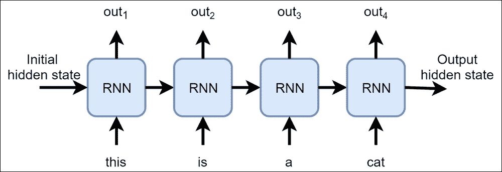

图 2:RNN 如何应用于一个句子

尽管这个模型很简单，但它给标准的前馈神经网络模型增加了额外的自由度。前馈网络由它们的输入决定，并且对于某些固定输入总是产生相同的输出(当然是在测试模式下，而不是在训练期间)。RNN 的输出不仅取决于输入，还取决于隐藏状态，而隐藏状态可以由网络本身来改变。因此，网络可以从序列的开头到结尾传递一些信息，并在不同的上下文中为相同的输入产生不同的输出。这种上下文依赖性在自然语言处理中非常重要，因为在自然语言中，一个单词在不同的上下文中可能有完全不同的含义，一个单词可能会改变整个句子的含义。

当然，这种灵活性是有代价的。rnn 通常需要更多的时间来训练，并可能产生一些奇怪的行为，如训练期间的丢失振荡或突然健忘症。然而，研究界已经做了大量的工作，并且仍在努力使 RNNs 更加实用和稳定，因此 RNNs 可以被视为需要处理变长输入的系统的标准构建块。

嵌入


## 现代 DL 驱动的 NLP 的另一个标准构建块是**词嵌入**，也叫 word 2 vec。这个想法来自于在 NNs 中表示我们的语言序列的问题。通常，神经网络使用固定大小的数字向量，但在 NLP 中，我们通常将单词或字符作为模型的输入。

其中一个解决方案是对我们的字典进行一次性编码，每个单词在输入向量中都有自己的位置，当我们在输入序列中遇到这个单词时，我们将这个数字设置为 1。当您必须处理一些不是很大的离散项目集，并希望以 NN 友好的方式表示它们时，这是 NNs 中的标准方法。不幸的是，由于几个原因，一次性编码并不是很好。

首先，我们的输入集通常不小。如果我们只想对最常用的英语词典进行编码，它将包含至少几千个单词。《牛津英语词典》有 170，000 个常用词和 50，000 个过时和罕见的词。这只是已有的词汇，不包括俚语、新词、科学术语、缩写、错别字、笑话、推特迷因等等。而且这只是针对英语的！

与单词的一键表示相关的第二个问题是词汇的不均匀频率。有相对较小的非常频繁的词集，如 *a* 、 *cat* 等，但是有非常大的非常不常用的词集，如 *covfefe* 或 *bibliopole、*，并且那些罕见的词在非常大的文本语料库中只能出现一次或两次。所以，我们的一键表示在空间方面效率很低。

简单一键表示的另一个问题是不能捕捉单词的关系。比如有些词是同义词，意思相同，但是会用不同的向量表示。有些词一起使用的频率很高，如*联合国*或*公平贸易*，这一事实也没有在一键表达中体现出来。

为了克服所有这些，我们可以使用词嵌入，它将一些词汇表中的每个单词映射到一个密集的固定长度的数字向量中。这些数字不是随机的，而是在大型文本语料库上训练的，以捕捉单词的上下文。词嵌入的详细描述超出了本书的范围，但是这是一种真正强大且广泛使用的 NLP 技术，用于以某种顺序表示单词、字符和其他对象。现在，你可以认为它们只是从单词到数字向量的映射，这种映射便于网络区分单词。

要获得这种映射，有两种方法。首先，你可以下载你需要的语言的预训练向量。有几个可用的嵌入来源，只需在 Google*glove pre trained vector*或 *word2vec pretrained* 上搜索即可(GloVE 和 word2vec 是用于训练此类向量的不同方法，产生的结果相似)。

另一种获得嵌入的方法是在你自己的数据集上训练它们。要做到这一点，你可以使用特殊的工具，如脸书开源的`fasttext,`，或者只是随机初始化嵌入，并允许你的模型在正常训练中调整它们。

编码器-解码器


## NLP 中广泛使用的另一个模型叫做**编解码器**和也叫 **seq2seq** 。它最初来自机器翻译，当你的系统需要在源语言上接受一个单词序列，并在目标语言上产生另一个序列。seq2seq 背后的思想是使用一个 RNN 来处理一个输入序列，然后*将这个序列编码*成某种固定长度的表示。这个 RNN 叫做一个**编码器**。然后你将编码的向量输入另一个 RNN，称为**解码器**，它有来产生目标语言的结果序列。这种想法的一个例子如下所示，其中我们将一个英语句子翻译成俄语:

图 3:机器翻译中的编码器-解码器架构

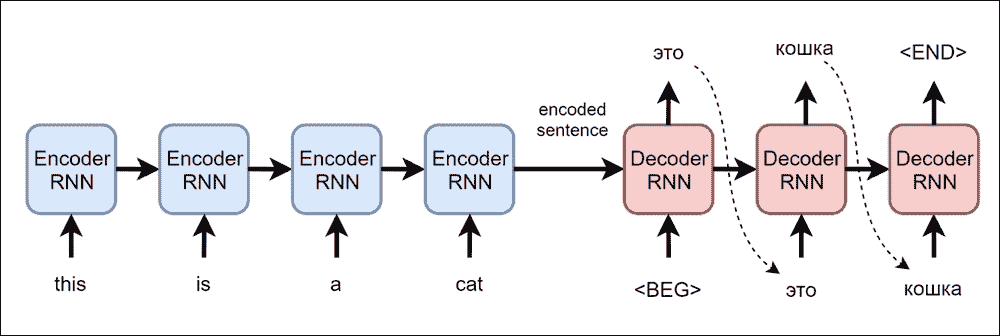

Figure 3: Encoder-Decoder architecture in machine translation

这种模型(有许多现代的调整和扩展)仍然是机器翻译的主要工具，但足够通用，可以应用于更广泛的领域，例如，音频处理，图像注释，视频字幕等。在我们的聊天机器人示例中，当给定单词的输入序列时，我们将使用它来生成回复短语。

seq 2 seq 的训练


# 这些都很有趣，但它与 RL 有什么关系呢？这种联系存在于 seq2seq 模型的培训过程中，但是在我们讨论现代 RL 解决问题的方法之前，我们需要就执行培训的标准方式说几句话。

对数似然训练


## 想象一下，我们需要使用 seq2seq 模型创建一个从一种语言(比如说法语)到另一种语言(英语)的机器翻译系统。让我们假设我们有一个很好的、大型的法语-英语句子翻译样本数据集，我们将在这个数据集上训练我们的模型。我们如何做到这一点？

编码部分是显而易见的:我们只是将我们的编码器 RNN 应用于训练对中的第一个句子，这产生了该句子的编码表示。这种表示的明显候选将是从最后一个 RNN 应用程序返回的隐藏状态。在编码阶段，我们忽略 RNN 的输出，只考虑来自最后一个 RNN 应用程序的隐藏状态。我们还使用特殊的标记`<END>`来扩展我们的句子，这向编码器发出了句子结束的信号。这个过程如下图所示:

图 4:编码步骤

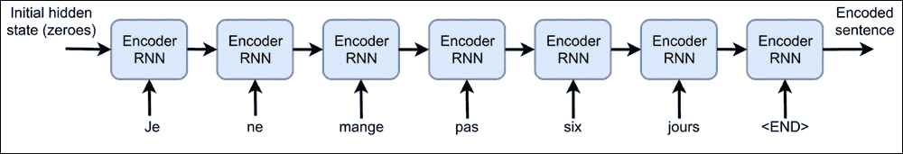

为了开始解码，我们将编码的表示传递给解码器的输入隐藏状态，并传递令牌`<BEG>`作为开始解码的信号。在这一步，解码器 RNN 必须返回给我们翻译句子的第一个记号。然而，在训练的开始，当编码器和解码器 rnn 都用随机权重初始化时，解码器的输出将是随机的，我们的目标将是使用**随机梯度下降** ( **SGD** )将其推向正确的翻译。

当我们的解码器需要返回解码句子当前位置的标记的概率分布时，传统的方法是将这个问题视为分类。通常，这是通过使用浅层前馈网络转换解码器的输出并产生一个向量来完成的，该向量的长度是我们的字典的大小。然后我们把这种概率分布和标准损失用于分类问题:交叉熵(也称为对数似然损失)。

对于解码序列中的第一个标记，这一点很清楚，它应该由输入中给出的`<BEG>`标记产生，但是序列的其余部分呢？这里有两个选择。第一种选择是从参考句子中输入标记。例如，如果我们有训练对*Je ne mange pas 6 jours*->*我已经六天没吃东西了*，我们喂代币(我，还没，吃过...)到解码器，然后在 RNN 的输出和句子中的下一个记号之间使用交叉熵损失。这种训练模式被称为**教师强制，**在每一步，我们从正确的翻译中输入一个标记，要求 RNN 产生正确的下一个标记。这个过程如下图所示:

图 5:在教师强制模式下，编码向量是如何解码的

That's clear with the first token in the decoded sequence, which should be produced by the `<BEG>` token given on the input, but what about the rest of the sequence? There are two options here. The first alternative is to feed tokens from the reference sentence. For example, if we have training pair *Je ne mange pas six jours* -> *I haven't eaten for six days*, we feed tokens (I, haven't, eaten...) to the decoder and then use cross-entropy loss between the RNN's output and the next token in the sentence. This training mode is called **teacher forcing,** and at every step we feed a token from the correct translation, asking the RNN to produce the correct next token. This process is shown in the following diagram:

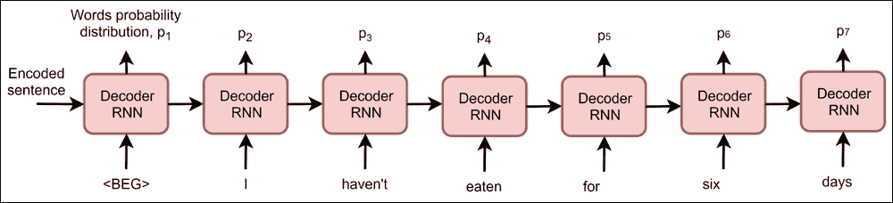

前面示例的损耗表达式将按如下方式计算:

`L = xentropy(p1,"I") + xentropy(p2,"haven't") + xentropy(p3,"eaten") + xentropy(p4,"for") + xentropy(p5,"six") + xentropy(p6,"days") + xentropy(p7,"<END>")`

因为解码器和编码器都是可微分的神经网络，所以我们可以反向传播损失，以在将来将它们都推向该示例的更好分类，例如，与我们训练图像分类器的方式相同。

不幸的是，前面的过程没有完全解决 seq2seq 训练问题，这个问题与模型的使用方式有关。在训练期间，我们知道输入和期望的输出序列，因此我们可以将有效的输出序列提供给解码器，该解码器仅被要求产生序列的下一个令牌。

在模型被训练之后，我们不会有一个目标序列(因为这个序列应该是由模型产生的)。因此，使用该模型的最简单方法是使用编码器对输入序列进行编码，然后要求解码器一次生成一项输出，将生成的令牌输入到解码器的输入中。

图 6:课程学习模式中的解码是如何执行的

After the model has been trained, we won't have a target sequence (as this sequence is supposed to be produced by the model). So, the simplest way to use the model will be to encode the input sequence using the encoder and then ask the decoder to generate one item of the output at a time, feeding the produced token into the input of the decoder.

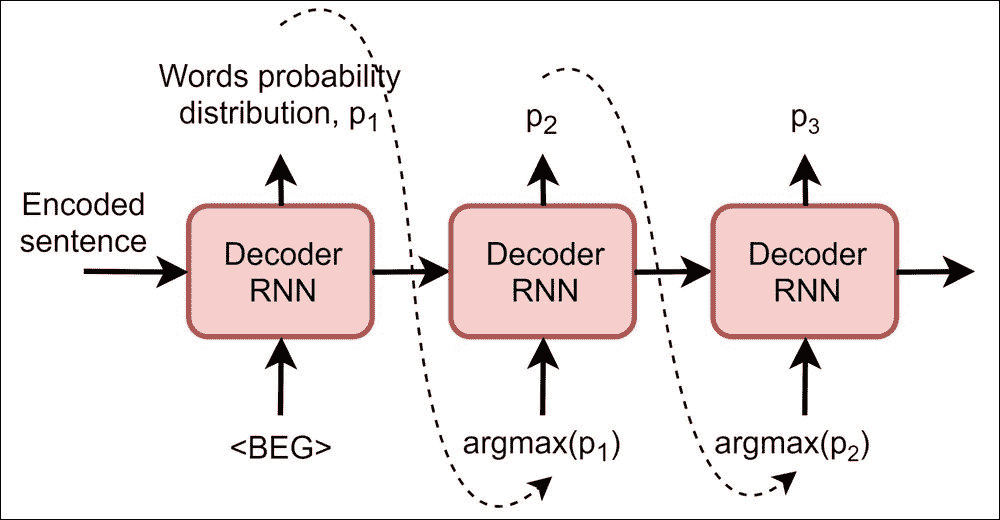

将先前的结果传递到输入中可能看起来很自然，但是这里存在危险。在训练过程中，我们没有要求我们的解码器 RNN 使用自己的输出作为输入，所以在生成过程中的一个错误可能会混淆解码器，并导致垃圾输出。

为了克服这一点，seq2seq 培训的第二种方法存在，称为**课程学习**。这种方法使用相同的交叉熵损失，但不是将完整的目标序列作为解码器的输入进行传递，我们只是要求解码器以我们在训练后将要使用的相同方式对序列进行解码。这一过程如上图所示。这增加了解码器的鲁棒性，从而在模型的实际应用中给出了更好的结果。作为一个缺点，这种模式可能会导致非常长的训练，因为我们的解码器学习如何逐令牌地产生所需的输出。为了弥补这一点，在实践中，我们通常使用教师和课程学习来训练模型，只是在每一批中随机选择这两者。

双语评估替角(BLEU)评分

在进入本章的主话题(RL for seq2seq)之前，我们需要介绍一下 NLP 问题中常用的用于比较机器翻译输出质量的度量。该指标称为 **BLEU** ，是将机器产生的输出序列与某组参考输出进行比较的标准方法之一。它允许使用多个参考输出(一个句子可以有多种翻译方式),其核心是计算产生的输出和参考句子之间共享的一元词、二元词等的比率。


## 其他替代品存在，如苹果酒和流氓。在这个例子中，我们将使用在`nltk` Python 库中实现的 BLEU(`nltk.translate.bleu_score package`)。

seq 2 seq 中的 RL

RL 和文本生成可能看起来非常不同，但是有个连接可以用来提高经过训练的 seq2seq 模型的质量。首先要注意的是，我们的解码器输出的是每一步的概率分布，非常类似于**策略梯度** ( **PG** )模型。从这个角度来看，我们的解码器可以被看作是一个代理，试图决定在每一步产生哪个令牌。解码过程的这种解释有几个优点。


## 首先，通过将我们的解码过程视为随机的，我们可以自动考虑多个目标序列。比如 *hello 就有很多可能的回复！你好吗*短语，而且都是正确的。通过优化对数似然目标，我们的模型将尝试学习所有这些回复的平均值，但短语*我很好，谢谢的平均值！*和*不太好*不一定会是有意义的短语。通过返回概率分布并从中抽取下一个标记，我们的代理可以学习如何产生所有可能的变量，而不是学习一些平均答案。

第二个好处是优化我们关心的目标。在对数似然训练中，我们最小化产生的标记和来自参考的标记之间的交叉熵，但是在机器翻译和许多其他 NLP 问题中，我们并不真正关心对数似然:我们希望最大化产生的序列的 BLEU 分数。不幸的是，BLEU 分数是不可微的，所以我们不能对它进行反向移植。然而，PG 方法如加强(来自第 9 章第 13 章第 14 章策略梯度——另一种选择——第 15 章)即使在回报不可区分的情况下也是有效的:我们只是提高了成功事件的概率，降低了更糟糕事件的概率。

我们可以利用的第三个优势是，我们的序列生成过程是由我们自己定义的，我们知道它的内部机制。通过在解码过程中引入随机性，我们可以多次重复解码过程，从单个训练样本中收集不同的解码场景。当我们的训练数据集有限时，这可能是有益的，这几乎总是如此，除非你是谷歌或脸书的员工。

为了理解如何将我们的训练从对数似然目标转换到 RL 场景，让我们从数学的角度来看两者。对数似然估计意味着通过调整模型的参数来最大化总和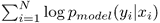，这与最小化数据概率分布和模型参数化的概率分布之间的**kull back–lei bler**(**KL**)-散度完全相同，其中可以写成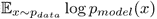的最大化。

另一方面，加固方法的目的是最大化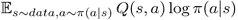。联系是显而易见的，两者之间的区别只是对数前的刻度和我们选择动作的方式(在我们的字典中是记号)。

实际上，seq2seq 训练的加强可以写成以下算法:

对于数据集中的每个样本，使用编码器 RNN 获得编码表示 E

用特殊的`begin`令牌:`T = '<BEG>'`初始化当前令牌

1.  用空序列初始化输出序列:`Out = []`
2.  而`T != '<END>'`

    *   得到令牌的概率分布和新的隐藏状态，传递当前令牌和隐藏状态:p，H =解码器(T，E)
    *   采样输出令牌从概率分布
    *   记住概率分布 p
    *   追加到输出序列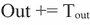
    *   设置当前令牌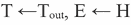

3.  获得令牌和新隐藏状态的概率分布，传递当前令牌和隐藏状态:p，H = Decoder(T，E)
4.  来自概率分布的样本输出令牌
5.  使用 SGD 更新模型
6.  重复直到收敛
7.  自我批判序列训练
8.  尽管有其积极的一面，上述方法也有一些复杂之处。首先，从零开始训练几乎没有用。即使对于简单的对话，输出序列通常至少有五个或更多的单词，每个单词都来自几千个单词的字典。大小为五的不同短语的数量，在 1000 个单词的字典中等于 5 ^(1000) ，略小于 10700。因此，在训练开始时获得正确回答的概率(当我们的编码器和解码器的权重都是随机的时)小得可以忽略不计。为了克服这一点，我们可以结合对数似然和 RL 方法，首先用对数似然目标预训练我们的模型(在教师强制和课程学习之间切换)，在模型达到某种质量水平后，切换到强化方法来微调模型。一般来说，这可以被看作是一种解决复杂 RL 问题的统一方法，当一个大的动作空间使得从一个随机行为的主体开始是不可行的，因为这样一个主体随机达到目标的机会是可以忽略的。围绕将外部生成的样本纳入 RL 训练过程，有许多研究正在进行，使用对数似然预训练正确的动作是方法之一。


## 普通增强方法的另一个问题是我们在第 10 章[和*演员评论家方法*中讨论过的渐变的高方差。您可能还记得，为了解决这个问题，我们使用了**演员评论家** ( **A2C** )方法，该方法使用国家价值的专用估计值作为方差。我们可以这样应用 A2C 方法，当然，通过用另一个头扩展我们的解码器，并返回给定解码序列的 BLEU 分数估计，但是有更好的方法。在 S. Rennie 和 E. Marcherett 等人于 2016 年发表的论文 a *用于图像字幕的自我批判序列训练*【1】中，提出了更好的基线。](part0074_split_000.html#26I9K1-ce551566b6304db290b61e4d70de52ee "Chapter 10. The Actor-Critic Method")

为了获得基线，该论文的作者使用 argmax 模式下的解码器来生成序列，然后使用该序列来计算相似性度量，如 BLEU 或 similar。切换到 argmax 模式使解码器过程完全确定，并为公式中的增强策略梯度提供基线:

Another issue with the vanilla REINFORCE method is the high variance of the gradients that we've discussed in the [Chapter 10](part0074_split_000.html#26I9K1-ce551566b6304db290b61e4d70de52ee "Chapter 10. The Actor-Critic Method"), *The Actor-Critic Method*. As you might remember, to solve the issue we used the **Actor-Critic** (**A2C**) method, which used the dedicated estimation of the state's value as a variance. We can apply the A2C method that way, of course, by extending our decoder with another head and returning BLEU score estimation given the decoded sequence, but there is a better approach. In the paper a *Self-Critical Sequence Training for Image Captionings* [1], published by S. Rennie and E. Marcherett and others in 2016, a better baseline was proposed.

在下一节中，我们将从电影数据集中实现并训练一个简单的聊天机器人。


聊天机器人示例

在本章的开始，我们谈了一些关于聊天机器人和 NLP 的内容，所以让我们尝试使用 seq2seq 和 RL training 来实现一些简单的东西。总的来说，聊天机器人分为两大类:**娱乐性的仿人**和**目标导向性的** 聊天机器人。第一组被认为是让用户在不完全理解的情况下，对用户的短语给出类似人类的回复。后一类实现起来要困难得多，应该是为了解决用户的问题:提供信息、更改预订或开关你家的烤面包机。该行业的大多数最新努力都集中在目标导向型群体上，但问题还远远没有完全解决。由于这一章应该给出所描述的方法的一个简短例子，我们将专注于使用从电影中提取的短语的在线数据集来训练一个娱乐机器人。


# 尽管这个问题很简单，但是这个例子在代码和我们拥有的新概念方面很大，所以本书没有包括这个例子的全部代码。我们将只关注负责模型训练和使用的中心模块，但是将概述许多功能。

示例结构

完整的示例在`rl_book_samples/Chapter12`文件夹中，包含以下部分:


## `data`:包含`get_data.sh`脚本的目录，用于下载和解包我们将在示例中使用的数据集。数据集存档为 10 MB，包含从各种来源提取的结构化对话，被称为**康奈尔电影-对话语料库**，可在此处获得:[https://www . cs . Cornell . edu/~ cristian/Cornell _ Movie-Dialogs _ Corpus . html](https://www.cs.cornell.edu/~cristian/Cornell_Movie-Dialogs_Corpus.html)。

`libbots`:一个包含 Python 模块的目录，在不同的示例组件之间共享。这些模块将在下一章介绍。

*   `tests`:库模块单元测试的目录。
*   根文件夹包含两个用于训练模型的程序:`train_crossent.py`，用于在开始时训练模型，以及`train_scst.py`，用于使用增强算法微调预训练的模型。
*   显示来自数据集的各种统计和数据的脚本:`cor_reader.py`。
*   将训练好的模型应用到数据集的脚本，显示质量度量:`data_test.py`。
*   针对用户提供的短语使用模型的脚本:`use_model.py`。
*   一个电报信使的 bot，使用了预训练的模型:`telegram_bot.py`。
*   我们将从示例的数据相关部分开始，然后查看两个培训脚本，最后介绍模型的使用。
*   模块:cornell.py 和 data.py

使用用于训练模型的数据集的两个库模块是`cornell.py`和`data.py`。两者都与数据处理有关，用于将数据集转换为适合训练的形式，但在不同的层上工作。


## `cornell.py`文件包括低级函数，用于解析康乃尔电影对话语料库格式的数据，并以适合后续处理的形式表示。该模块的主要目标是从电影中载入一系列对话。由于数据集包含关于电影的元数据，我们可以通过各种标准过滤要加载的对话框，但是只实现了一个类型过滤器。在返回的对话列表中，每个对话都表示为一个短语列表，每个短语都是一个小写单词列表(称为**标记**)。例如，一个短语可以是`["hi", "!", "how", "are", "you", "?"]`。

句子到标记列表的转换在 NLP 中称为标记化，即使这一步本身也是一个棘手的过程，因为您需要处理标点、缩写、引号、撇号和其他自然语言细节。幸运的是，`nltk`库包括几个记号赋予器，所以从一个句子到一个记号列表只需要调用适当的函数，这大大简化了我们的任务。在外部使用的`cornell.py`中的主要函数是函数`load_dialogues()`，它应该使用可选的类型过滤器加载对话数据。

`data.py`模块在更高的层次上工作，不包括任何特定于数据集的知识。它提供了以下功能，这些功能几乎在示例中的所有地方都使用到了:

使用来自其整数 id 中的记号的映射:从文件中保存和加载(`save_emb_dict()`和`load_emb_dict()`函数)，将记号列表编码成 id 列表(`encode_words()`)，将整数 id 列表解码成记号(`decode_words()`)，并从训练数据生成字典映射(`phrase_pairs_dict()`)

处理训练数据:迭代给定大小的批次(`iterate_batches()`)并将数据分成训练/测试部分(`split_train_test()`)

*   加载对话数据并将其转换成适合训练的短语-回复对:`load_data()`功能
*   在数据加载和字典创建时，我们还添加了带有预定义 id 的特殊标记:
*   未知单词的标记`#UNK`，用于所有字典外的标记

序列开始的标记`#BEG`，附加在所有序列的前面

*   用于序列结束的令牌`#END`
*   除了可用于在实验中限制数据大小的可选类型过滤器之外，其他几个过滤器也应用于加载的数据。第一个过滤器限制训练对中的最大令牌数。就运算数量和内存使用而言，RNN 训练可能非常昂贵，因此我只为第一个和第二个训练条目留下了具有 20 个令牌的训练对。这也有助于收敛速度，因为短句对话的可变性要小得多，所以我们的 RNN 更容易在这些数据上进行训练。这也是我们的模型只产生简短回复的一个缺点。
*   应用于数据的第二个过滤器与字典相关。字典中的单词量对性能和所需的 GPU 内存有重大影响，因为我们的嵌入矩阵(为每个字典令牌保存嵌入向量)和解码器输出投影矩阵(将解码器 RNN 输出转换为概率分布)都将字典大小作为维度之一。所以，通过减少字典中的单词量，我们可以减少记忆，提高训练速度。为了在数据加载过程中得到这个结果，我们计算字典中每个单词的出现次数，并将所有出现次数少于 10 次的单词映射到一个未知标记。稍后，从训练集中移除具有未知标记的所有训练对。

BLEU 评分和 utils.py

为了计算 BLEU 分数，使用了`nltk`库，但是为了使 BLEU 计算更方便，实现了两个包装器函数:`calc_bleu(candidate_seq, reference_seq)`，当我们有一个候选序列和一个参考序列时，它计算分数，当我们有几个参考序列与候选序列进行比较时，它用于获得分数。在有几个候选人的情况下，计算并返回最佳 BLEU 分数。


## 此外，为了反映我们数据集中的短语，BLEU 仅针对单词和双词进行计算。下面是`utils.py`模块的代码，它负责 BLEU 计算和额外的两个函数，用于对句子进行标记并将标记列表转换回字符串。

型号

与训练过程和模型本身相关的功能在`libbots/model.py` 文件中定义。这对理解培训过程很重要，因此带有注释的代码如下所示。

```py
import string
from nltk.translate import bleu_score
from nltk.tokenize import TweetTokenizer

def calc_bleu_many(cand_seq, ref_sequences):
    sf = bleu_score.SmoothingFunction()
    return bleu_score.sentence_bleu(ref_sequences, cand_seq,
                                    smoothing_function=sf.method1,
                                    weights=(0.5, 0.5))

def calc_bleu(cand_seq, ref_seq):
    return calc_bleu_many(cand_seq, [ref_seq])

def tokenize(s):
    return TweetTokenizer(preserve_case=False).tokenize(s)

def untokenize(words):
    return "".join([" " + i if not i.startswith("'") and i not in string.punctuation else i for i in words]).strip()
```


## 两个超参数定义了编码器和解码器 rnn 使用的隐藏状态的大小。在 RNNs 的 PyTorch 实现中，该值一次定义三个参数:

输入中预期的隐藏状态的维度，并作为 RNN 单元的输出返回

```py
HIDDEN_STATE_SIZE = 512
EMBEDDING_DIM = 50
```

从 RNN 返回的输出的维度。尽管维度相同，但 RNN 的输出与隐藏状态不同

*   用于 RNN 变换的神经元内部计数
*   第二个超参数`EMBEDDING_DIM,`定义了我们嵌入的维度，这是一组用于表示我们字典中每个标记的向量。对于这个例子，我们没有使用 GLoVe 或 word2vec 这样的预训练嵌入，而是将它们与模型一起训练。由于我们的编码器和解码器都是输入端的接受令牌，嵌入的维数也定义了 RNN 输入的大小。
*   在模型的构造器中，我们创建嵌入、编码器、解码器和输出投影组件。随着 RNN 的实现，LSTM 被使用了。`batch_first`参数指定批处理将作为输入张量的第一维提供给 RNN。投影层是线性变换，将解码器的输出转换成字典概率分布。

模型的其余部分是使用 seq2seq 模型执行不同数据转换的方法。严格地说，这个类打破了 PyTorch 惯例，覆盖了将网络应用于数据的`forward`方法。这是有意的，以强调 seq2seq 模型不可能解释为输入数据到输出的单一转换。在我们的示例中，我们将以不同的方式使用该模型，例如，以教师强制模式处理目标序列，或者使用 argmax 逐个解码该序列，或者执行单个解码步骤。因为基类`nn.Module.forward`方法只负责调用钩子(在我们的例子中没有使用)，所以避免`forward`方法重定义是很好的。

```py
class PhraseModel(nn.Module):
    def __init__(self, emb_size, dict_size, hid_size):
        super(PhraseModel, self).__init__()

        self.emb = nn.Embedding(num_embeddings=dict_size, embedding_dim=emb_size)
        self.encoder = nn.LSTM(input_size=emb_size, hidden_size=hid_size,
                               num_layers=1, batch_first=True)
        self.decoder = nn.LSTM(input_size=emb_size, hidden_size=hid_size,
                               num_layers=1, batch_first=True)
        self.output = nn.Sequential(
            nn.Linear(hid_size, dict_size)
        )
```

前面的方法在我们的模型中执行最简单的操作:它对输入序列进行编码，并从编码器 RNN 的最后一步返回隐藏状态。在 PyTorch 中，所有 RNN 类都返回两个对象的元组作为结果。元组的第一部分是 RNN 的每个应用的 RNN 的输出，第二部分是输入序列中最后一项的隐藏状态。我们对编码器的输出不感兴趣，所以我们只返回隐藏状态。

前面的函数是一个实用方法，用于访问输入批处理的单个组件的隐藏状态。这是必需的，因为我们在一次调用中对整批序列进行编码(使用`encode()`方法)，但是解码是对每一批序列单独执行的。此方法用于提取批次中第 index 个元素的隐藏状态。该提取的细节取决于 RNN 实现。例如，LSTM 将隐藏状态表示为两个张量的元组:单元状态和隐藏状态。然而，简单的 RNN 实现，像普通的`torch.nn.RNN`类或者更复杂的`torch.nn.GRU`，都将隐藏状态作为单个张量。所以，这个知识被封装在这个方法中，如果你切换底层 RNN 类型的编码器和解码器，它应该被调整。

```py
    def encode(self, x):
        _, hid = self.encoder(x)
        return hid
```

其余的方法只与不同形式的解码过程有关。

```py
    def get_encoded_item(self, encoded, index):
        # For RNN
        # return encoded[:, index:index+1]
        # For LSTM
        return encoded[0][:, index:index+1].contiguous(), \
               encoded[1][:, index:index+1].contiguous()
```

执行解码的最简单和最有效的方式是教师强制模式。在这种模式下，我们简单地将解码器 RNN 应用于参考序列(训练样本的回复短语)。在教师强制模式下，每一步的输入都是预先知道的，RNN 在步骤之间的唯一依赖关系是其隐藏状态，这使我们可以非常有效地执行 RNN 变换，而无需将数据从 GPU 传输到 GPU，也无需在底层 CuDNN 库中实现。

当每个解码器步骤的输出定义下一个步骤的输入时，其他解码方法就不是这种情况。输出和输入之间的这种连接是用 Python 代码完成的，所以解码是一步一步执行的，不一定要传输数据(因为我们所有的张量都已经在 GPU 内存中了)，但控制是由 Python 代码定义的，而不是由高度优化的 CuDNN 库定义的。

```py
    def decode_teacher(self, hid, input_seq):
        # Method assumes batch of size=1
        out, _ = self.decoder(input_seq, hid)
        out = self.output(out.data)
        return out
```

对于一个例子，前面的方法执行一个单独的解码步骤。我们为解码器传递隐藏状态(在第一步中设置为编码序列),并输入带有输入令牌的嵌入向量的张量。然后，来自解码器的结果通过输出投影传递，以获得字典中每个标记的原始分数。这不是一个概率分布，因为我们不通过 softmax 函数传递输出，只传递原始分数(也称为 logits)。该函数的结果是解码器返回的那些逻辑和新的隐藏状态。

`decode_chain_argmax()`方法执行编码序列的解码，使用`argmax`作为从概率分布到产生的令牌索引的过渡。函数参数如下:

```py
    def decode_one(self, hid, input_x):
        out, new_hid = self.decoder(input_x.unsqueeze(0), hid)
        out = self.output(out)
        return out.squeeze(dim=0), new_hid
```

`hid`:编码器为输入序列返回的隐藏状态。

```py
    def decode_chain_argmax(self, hid, begin_emb, seq_len, stop_at_token=None):
        res_logits = []
        res_tokens = []
        cur_emb = begin_emb
```

`begin_emb`:用于开始解码的`#BEG`令牌的嵌入向量。

*   `seq_len`:解码序列的最大长度。如果解码器返回`#END`令牌，结果序列可能会更短，但绝不会更长。当解码器开始无限重复自己时，这有助于停止解码，这可能发生在训练的开始。
*   `stop_at_token`:可选令牌 ID(通常为`#END`令牌)，停止解码过程。
*   这个函数应该返回两个值:一个张量，它包含解码器在每一步返回的结果逻辑和生成的令牌 id 列表。第一个值用于训练，因为我们需要输出张量来计算损失，而第二个值被传递给质量度量函数，在本例中是 BLEU 分数。
*   在每次解码循环迭代中，我们将解码器 RNN 应用于一个单个令牌，传递解码器的当前隐藏状态(在开始时，它等于编码向量)和当前令牌的嵌入向量。解码器 RNN 的输出是具有 logits(字典中每个单词的非标准化概率)和新的隐藏状态的元组。为了从 logits 转到解码的令牌 ID，我们使用 argmax 函数作为方法的名称。然后，我们获得解码令牌的嵌入，将 logits 和令牌 ID 保存在结果列表中，并检查停止条件。

执行序列解码的下一个和最后一个函数几乎与`decode_chain_argmax()`相同，但是，它不是 argmax，而是根据返回的概率分布执行随机采样。其余的逻辑是一样的。

```py
        for _ in range(seq_len):
            out_logits, hid = self.decode_one(hid, cur_emb)
            out_token_v = torch.max(out_logits, dim=1)[1]
            out_token = out_token_v.data.cpu().numpy()[0]

            cur_emb = net.emb(out_token_v)

            res_logits.append(out_logits)
            res_tokens.append(out_token)
            if stop_at_token is not None and out_token == stop_at_token:
                break
        return torch.cat(res_logits), res_tokens
```

除了`PhraseModel`类之外，`model.py`文件还包含几个用于准备模型输入的函数，为了 PyTorch RNN 机器正常工作，这些函数必须是张量形式。

```py
    def decode_chain_sampling(self, hid, begin_emb, seq_len, stop_at_token=None):
        res_logits = []
        res_actions = []
        cur_emb = begin_emb

        for _ in range(seq_len):
            out_logits, hid = self.decode_one(hid, cur_emb)
            out_probs_v = F.softmax(out_logits, dim=1)
            out_probs = out_probs_v.data.cpu().numpy()[0]
            action = int(np.random.choice(out_probs.shape[0], p=out_probs))
            action_v = torch.LongTensor([action]).to(action_v.device)
            cur_emb = net.emb(action_v)

            res_logits.append(out_logits)
            res_actions.append(action)
            if stop_at_token is not None and action == stop_at_token:
                break
        return torch.cat(res_logits), res_actions
```

该函数将输入批处理(这是一个`(phrase, replay)`元组的列表)打包成适合编码和`decode_chain_*`函数的形式。作为第一步，我们按照第一个短语的长度以降序对批处理进行排序。这是 PyTorch 作为 CUDA 后端使用的 CuDNN 库的一个要求。

然后，我们创建一个具有[batch，max_input_phrase]维的矩阵，并将我们的输入短语复制到那里。这种形式被称为**填充序列**，因为我们的可变长度序列用零填充到最长的序列。

```py
def pack_batch_no_out(batch, embeddings, device="cpu"):
    assert isinstance(batch, list)
    # Sort descending (CuDNN requirements)
    batch.sort(key=lambda s: len(s[0]), reverse=True)
    input_idx, output_idx = zip(*batch)
```

下一步，我们将这个矩阵包装成 PyTorch 张量，并使用 PyTorch RNN 模块中的特殊函数将这个矩阵从填充形式转换成所谓的**打包形式**。在压缩形式中，我们的序列是按列存储的(也就是说，以转置形式)，保持每列的长度。例如，在第一行中，我们有来自所有序列的所有第一标记。在第二行中，我们从第二个位置开始标记长度大于 1 的序列，依此类推。这种表示允许 CuDNN 非常有效地执行 RNN 处理，一次处理我们的一批序列。

```py
    # create padded matrix of inputs
    lens = list(map(len, input_idx))
    input_mat = np.zeros((len(batch), lens[0]), dtype=np.int64)
    for idx, x in enumerate(input_idx):
        input_mat[idx, :len(x)] = x
```

在函数的最后，我们将数据从整数令牌 id 转换为嵌入，这可以一步完成，因为我们的令牌 id 已经打包到张量中。然后，我们返回包含三项内容的结果元组:要传递给编码器的打包序列和两个包含输入和输出序列的整数标记 id 的列表。

```py
    input_v = torch.tensor(input_mat).to(device)
    input_seq = rnn_utils.pack_padded_sequence(input_v, lens, batch_first=True)
```

前面的函数用于将编码短语(作为令牌 id 列表)转换成适合传递给 RNN 的打包序列。

```py
    # lookup embeddings
    r = embeddings(input_seq.data)
    emb_input_seq = rnn_utils.PackedSequence(r, input_seq.batch_sizes)
    return emb_input_seq, input_idx, output_idx
```

下一个函数使用了`pack_batch_no_out() method`，但是，除此之外，它还将输出索引转换成打包序列的列表，以便在教师强制训练模式中使用。那些序列已经去掉了`#END`标记。

```py
def pack_input(input_data, embeddings, device="cpu"):
    input_v = torch.LongTensor([input_data]).to(device)
    r = embeddings(input_v)
    return rnn_utils.pack_padded_sequence(r, [len(input_data)], batch_first=True)
```

最后，`model.py`中的最后一个函数，用 logits 从张量中计算 BLEU 分数，由解码器在教师强制模式下产生。它的逻辑很简单:它只是调用 argmax 来获取序列索引，然后使用来自`utils.py`模块的 BLEU 计算函数。

```py
def pack_batch(batch, embeddings, device="cpu"):
    emb_input_seq, input_idx, output_idx = pack_batch_no_out(batch, embeddings, device)
    output_seq_list = []
    for out in output_idx:
        output_seq_list.append(pack_input(out[:-1], embeddings, device))
    return emb_input_seq, output_seq_list, input_idx, output_idx
```

训练:交叉熵

```py
def seq_bleu(model_out, ref_seq):
    model_seq = torch.max(model_out.data, dim=1)[1]
    model_seq = model_seq.cpu().numpy()
    return utils.calc_bleu(model_seq, ref_seq)
```

为了训练模型的第一次近似，使用交叉熵方法并在`train_crossent.py`中实现。在训练过程中，我们在教师强制模式(当我们在解码器的输入上给出目标序列时)和 argmax 链解码(当我们一步一步解码序列时，选择输出分布中概率最高的令牌)之间随机切换。这两种训练模式之间的决定是以 50%的固定概率随机做出的。这允许结合两种方法的特征:来自教师强制的快速收敛和来自课程学习的稳定解码。


## 首先，我们定义了特定于交叉熵训练步骤的超参数。`TEACHER_PROB`的值定义了针对每个训练样本随机选择教师强制训练的概率。

每个时期都会调用`run_test`方法来计算保留测试数据集的平均 BLEU 分数，默认情况下是加载数据的 5%。

```py
SAVES_DIR = "saves"

BATCH_SIZE = 32
LEARNING_RATE = 1e-3
MAX_EPOCHES = 100

log = logging.getLogger("train")

TEACHER_PROB = 0.5
```

程序允许指定我们想要培训的电影类型和当前培训的名称，该名称用于 TensorBoard 评论和作为定期模型检查点的目录名称。

```py
def run_test(test_data, net, end_token, device="cpu"):
    bleu_sum = 0.0
    bleu_count = 0
    for p1, p2 in test_data:
        input_seq = model.pack_input(p1, net.emb, device)
        enc = net.encode(input_seq)
        _, tokens = net.decode_chain_argmax(enc, input_seq.data[0:1],
                                            seq_len=data.MAX_TOKENS,
                                            stop_at_token=end_token)
        bleu_sum += utils.calc_bleu(tokens, p2[1:])
        bleu_count += 1
    return bleu_sum / bleu_count
```

解析完参数后，我们加载所提供流派的数据集，保存嵌入字典(从令牌的字符串到令牌的整数 ID 的映射)并对短语对进行编码。此时，我们的数据是一个包含两个条目的元组列表，每个条目都是一个令牌整数 id 列表。

```py
if __name__ == "__main__":
    logging.basicConfig(format="%(asctime)-15s %(levelname)s %(message)s", level=logging.INFO)
    parser = argparse.ArgumentParser()
    parser.add_argument("--data", required=True, help="Category to use for training. "
                                                      "Empty string to train on full dataset")
    parser.add_argument("--cuda", action='store_true', default=False,
                        help="Enable cuda")
    parser.add_argument("-n", "--name", required=True, help="Name of the run")
    args = parser.parse_args()
    device = torch.device("cuda" if args.cuda else "cpu")

    saves_path = os.path.join(SAVES_DIR, args.name)
    os.makedirs(saves_path, exist_ok=True)
```

在数据被加载后，我们将它分成训练/测试部分，然后我们使用固定的随机种子对数据进行混洗(以便能够在 RL 训练阶段重复相同的混洗)。

```py
    phrase_pairs, emb_dict = data.load_data(genre_filter=args.data)
    log.info("Obtained %d phrase pairs with %d uniq words",
             len(phrase_pairs), len(emb_dict))
    data.save_emb_dict(saves_path, emb_dict)
    end_token = emb_dict[data.END_TOKEN]
    train_data = data.encode_phrase_pairs(phrase_pairs, emb_dict)
```

然后，我们创建模型，向它传递嵌入的维度、字典的大小以及编码器和解码器的隐藏大小。

```py
    rand = np.random.RandomState(data.SHUFFLE_SEED)
    rand.shuffle(train_data)
    log.info("Training data converted, got %d samples", len(train_data))
    train_data, test_data = data.split_train_test(train_data)
    log.info("Train set has %d phrases, test %d", len(train_data), len(test_data))
```

我们的训练循环执行固定数量的历元，并且它们中的每一个都是对一批成对的编码短语的迭代。对于 every 批处理，我们使用`model.pack_batch()`打包它，它返回打包的输入序列、打包的输出序列和批处理的两个输入和输出标记索引列表。为了获得批处理中每个输入序列的编码表示，我们调用`net.encode()`，它只是通过我们的编码器传递输入序列，并从最后一个 RNN 应用程序返回隐藏状态。这个隐藏状态的形状为[batch_size，`model.HIDDEN_STATE_SIZE` ]，默认为[16，512]。

```py
    net = model.PhraseModel(emb_size=model.EMBEDDING_DIM, dict_size=len(emb_dict),
                            hid_size=model.HIDDEN_STATE_SIZE).to(device)
    log.info("Model: %s", net)
    writer = SummaryWriter(comment="-" + args.name)
    optimiser = optim.Adam(net.parameters(), lr=LEARNING_RATE)
    best_bleu = None
```

然后，我们单独解码我们批次中的每个序列。也许以某种方式并行化这个循环是可能的，但是这会使这个例子可读性更差。对于批处理中的每个序列，我们得到一个标记 id 的参考序列(没有训练`#BEG`标记)和由编码器创建的输入序列的编码表示。

```py
    for epoch in range(MAX_EPOCHES):
        losses = []
        bleu_sum = 0.0
        bleu_count = 0
        for batch in data.iterate_batches(train_data, BATCH_SIZE):
            optimiser.zero_grad()
            input_seq, out_seq_list, _, out_idx = model.pack_batch(batch, net.emb, device)
            enc = net.encode(input_seq)
```

在前面的代码中，我们随机决定使用哪种解码方法:教师强制或课程学习。它们的区别仅在于模型的调用方法和我们计算 BLEU 分数的方式。对于教师强制模式，`decode_teacher()`方法返回大小为[out_seq_len，dict_size]的 logits 的张量，因此，为了计算 BLEU 分数，我们需要使用来自`model.py`模块的函数。在课程学习的情况下，由`decode_chain_argmax()`方法实现，它返回输出序列的 logits 张量和令牌 id 列表。这允许我们直接计算 BLEU 分数。

```py
            net_results = []
            net_targets = []
            for idx, out_seq in enumerate(out_seq_list):
                ref_indices = out_idx[idx][1:]
                enc_item = net.get_encoded_item(enc, idx)
```

在序列处理的最后，我们添加了生成的逻辑和参考索引，以便稍后在损失计算中使用。

```py
                if random.random() < TEACHER_PROB:
                    r = net.decode_teacher(enc_item, out_seq)
                    bleu_sum += model.seq_bleu(r, ref_indices)
                else:
                    r, seq = net.decode_chain_argmax(enc_item, out_seq.data[0:1],
                                                     len(ref_indices))
                    bleu_sum += utils.calc_bleu(seq, ref_indices)
```

为了计算交叉熵损失，我们将 logits 张量的列表转换为一个单一的张量，并将具有引用令牌 id 的列表转换为 PyTorch 张量，将其放在 GPU 内存中。然后，我们需要做的只是计算交叉熵损失，执行反向传播，并要求优化器调整模型。这就结束了单个批次的处理。

```py
                net_results.append(r)
                net_targets.extend(ref_indices)
                bleu_count += 1
```

处理完所有批次后，我们从训练中计算平均 BLEU 分数，对保留的数据集进行测试，并报告我们的指标。

```py
            results_v = torch.cat(net_results)
            targets_v = torch.LongTensor(net_targets).to(device)
            loss_v = F.cross_entropy(results_v, targets_v)
            loss_v.backward()
            optimiser.step()
            losses.append(loss_v.item())
```

为了能够微调模型，我们将模型的权重与迄今为止看到的最佳测试 BLEU 分数一起保存。我们还每 10 次迭代保存一次检查点文件。

```py
        bleu = bleu_sum / bleu_count
        bleu_test = run_test(test_data, net, end_token, device)
        log.info("Epoch %d: mean loss %.3f, mean BLEU %.3f, test BLEU %.3f",
                 epoch, np.mean(losses), bleu, bleu_test)
        writer.add_scalar("loss", np.mean(losses), epoch)
        writer.add_scalar("bleu", bleu, epoch)
        writer.add_scalar("bleu_test", bleu_test, epoch)
```

跑步训练

```py
        if best_bleu is None or best_bleu < bleu_test:
            if best_bleu is not None:
                out_name = os.path.join(saves_path, "pre_bleu_%.3f_%02d.dat" %
                                        (bleu_test, epoch))
                torch.save(net.state_dict(), out_name)
                log.info("Best BLEU updated %.3f", bleu_test)
            best_bleu = bleu_test

        if epoch % 10 == 0:
            out_name = os.path.join(saves_path, "epoch_%03d_%.3f_%.3f.dat" %
                                    (epoch, bleu, bleu_test))
            torch.save(net.state_dict(), out_name)
```

这就是我们的训练准则。要启动它，您需要在命令行中传递运行的名称，并提供流派过滤器。完整的数据集非常大(总共 617 部电影)，可能需要大量的时间来训练，即使是在 GPU 上。例如，在 GTX 1080Ti 上，每个 epoch 大约需要 16 分钟，100 个 epoch 需要 18 个小时。


## 通过应用流派过滤器，您可以在电影的子集上进行训练，例如，流派*喜剧*包括 159 部电影，为我们带来 22k 训练短语对，这小于完整数据集的 150k 短语对。使用*喜剧*过滤器的字典大小也小得多(4905 个单词对完整数据中的 11131 个单词)。这将纪元时间从 16 分钟减少到 3 分钟。

为了使训练集更小，你可以使用*家族*类型，它只有 16 部电影，3000 个短语对和 772 个单词。在这种情况下，100 次电子缓存只需要 30 分钟。例如，下面是如何开始训练*喜剧*类型。该过程将检查点写入目录`saves/crossent-comedy`，而张量板指标写入 runs 目录。

对于交叉熵训练，有三个指标写入张量板:损失、训练 BLEU 分数和测试 BLEU 分数。以下是*喜剧*类型的剧情，训练花了六个小时。

图 6:“喜剧”类型的交叉熵训练

```py
rl_book_samples/Chapter12$ ./train_crossent.py --cuda --data comedy -n crossent-comedy
2018-01-15 12:35:35,072 INFO Loaded 159 movies with genre comedy
2018-01-15 12:35:35,073 INFO Read and tokenise phrases...
2018-01-15 12:35:39,785 INFO Loaded 93039 phrases
2018-01-15 12:35:40,057 INFO Loaded 24716 dialogues with 93039 phrases, generating training pairs
2018-01-15 12:35:40,118 INFO Counting freq of words...
2018-01-15 12:35:40,469 INFO Data has 31774 uniq words, 4913 of them occur more than 10
2018-01-15 12:35:40,660 INFO Obtained 47644 phrase pairs with 4905 uniq words
2018-01-15 12:35:40,992 INFO Training data converted, got 26491 samples
2018-01-15 12:35:40,992 INFO Train set has 25166 phrases, test 1325
2018-01-15 12:35:43,320 INFO Model: PhraseModel (
  (emb): Embedding(4905, 50)
  (encoder): LSTM(50, 512, batch_first=True)
  (decoder): LSTM(50, 512, batch_first=True)
  (output): Sequential (
    (0): Linear (512 -> 4905)
  )
)
2018-01-15 12:39:17,656 INFO Epoch 0: mean loss 5.000, mean BLEU 0.164, test BLEU 0.122
2018-01-15 12:42:49,997 INFO Epoch 1: mean loss 4.671, mean BLEU 0.178, test BLEU 0.078
2018-01-15 12:46:23,016 INFO Epoch 2: mean loss 4.537, mean BLEU 0.179, test BLEU 0.088
```

For the cross-entropy training, there are three metrics written into the TensorBoard: loss, train BLEU score and test BLEU score. Below are the plots for the *comedy* genre, which took six hours to train.

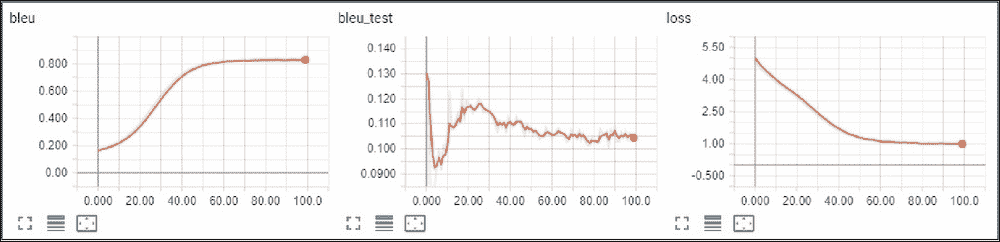

如您所见，训练数据的 BLEU 分数持续增长，在 0.83 左右达到饱和，但是测试数据集的 BLEU 分数在第 25 个^(时期之后停止提高，并且远不如训练数据的 BLEU 分数令人印象深刻。这有两个原因。首先，我们的数据集不够大，代表性不足以让我们的训练过程概括回复短语，从而在测试数据集上获得好成绩。在*喜剧*类型中，我们有 25，166 个训练对和 1325 个测试对，因此测试对很可能包含全新的且与训练对无关的短语。这是由于我们拥有的对话框的高度可变性造成的，我们将在下一节中查看我们的数据。)

低测试 BLEU 的第二个可能原因可能是交叉熵训练没有考虑有几个可能回答的短语。正如我们将在下一节中看到的，我们的数据包含有几个备选答案的短语。交叉熵试图找到这种模型的权重，这将产生与期望输出匹配的输出序列，但是如果期望输出是随机的，那么模型对此无能为力。

测试分数低的另一个原因可能是模型中缺乏适当的正则化，这应有助于防止过度拟合。这是留给你检查效果的一个练习。

检查数据

从各种角度查看您的数据集总是一个好主意,比如统计数据、绘制数据的各种特征，或者只是目测您的数据以更好地了解您的问题和潜在问题。工具`cor_reader.py`支持数据分析的极简功能。通过使用`--show-genres`选项运行它，你将从数据集中得到所有类型，每个类型都有一些电影，按照电影数量从大到小排序。其中前 10 名如下所示:


## `--show-dials`选项显示电影中的对话，没有任何预处理，按照它们在数据库中出现的顺序。对话框的数量很大，所以传递`-g`选项按流派过滤是值得的。例如，让我们看看喜剧电影中的两个对话。

通过传递`--show-train`选项，您可以检查训练对，按照第一个短语分组，并按照回复的计数按降序排序。该数据已经应用了词频(至少出现 10 次)和短语长度(最多 20 个标记)过滤器。以下是 family 流派的部分输出。

```py
rl_book_samples/Chapter12$ ./cor_reader.py --show-genres
Genres:
drama: 320
thriller: 269
action: 168
comedy: 162
crime: 147
romance: 132
sci-fi: 120
adventure: 116
mystery: 102
horror: 99
```

如您所见，即使在很小的数据子集中，也存在有多个回复候选的短语。由`cor_reader.py`支持的最后一个选项是`--show-dict-freq`，它统计单词的频率，并根据出现的次数进行排序。

```py
rl_book_samples/Chapter12$ ./cor_reader.py -g comedy --show-dials | head -n 10
Dialog 0 with 4 phrases:
can we make this quick? roxanne korrine and andrew barrett are having an incredibly horrendous public break - up on the quad . again .
well , i thought we'd start with pronunciation , if that's okay with you .
not the hacking and gagging and spitting part . please .
okay ... then how ' bout we try out some french cuisine . saturday ? night ?

Dialog 1 with two phrases:
you're asking me out . that's so cute . what's your name again ?
forget it .
```

测试训练好的模型

```py
rl_book_samples/Chapter12$ ./cor_reader.py -g family --show-train | head -n 20
Training pairs (558 total)
0: #BEG yes . #END
 : #BEG but you will not ... be safe ... #END
 : #BEG oh ... oh well then , one more won't matter . #END
 : #BEG vada you've gotta stop this , there's absolutely nothing wrong with you ! #END
 : #BEG good . #END
 : #BEG he's getting big . vada , come here and sit down for a minute . #END
 : #BEG who's that with your dad ? #END
 : #BEG for this . #END
 : #BEG didn't i tell you ? i'm always right , you know , my dear ... aren't i ? #END
 : #BEG oh , i hope we got them in time . #END
 : #BEG oh - - now look at him ! this is terrible ! #END
1: #BEG no . #END
 : #BEG were they pretty ? #END
 : #BEG it's there . #END
 : #BEG why do you think she says that ? #END
 : #BEG come here , sit down . #END
 : #BEG what's wrong with your eyes ? #END
 : #BEG maybe we should , just to see what's the big deal . #END
 : #BEG why not ? #END
```

好了，数据说够了，现在让我们来玩玩我们的模型。在训练期间，两个训练工具(`train_crossent.py`和`train_scst.py`)定期保存模型，这在两种不同的情况下完成:当测试数据集上的 BLEU 分数更新最大值时和每 10 个 epoches。两种模型都有相同的格式(由`torch.save()`方法生成),并且包含模型的权重。除了权重之外，我保存了令牌到整数 ID 的映射，工具将使用它来预处理短语。

```py
rl_book_samples/Chapter12$ ./cor_reader.py -g family --show-dict-freq | head -n 10
Frequency stats for 772 tokens in the dict
.: 1907
,: 1175
?: 1148
you: 840
!: 758
i: 653
-: 578
the: 506
a: 414
```


## 为了试验模型，有两个实用程序。第一个是`data_test.py`，它加载模型并将其应用于给定流派的所有短语，并报告平均 BLEU 分数。在测试之前，短语对按第一个短语分组。例如，下面是两个接受喜剧类型训练的模型的结果。第一个用交叉熵方法训练，第二个用 RL 方法微调。

用模型进行试验的第二种方式是脚本`use_model.py`，它允许您将任何字符串传递给模型，并要求它生成回复。

通过向`--self`选项传递一个数字，您可以要求模型将自己的回复作为输入进行处理，换句话说就是生成对话。

```py
rl_book_samples/Chapter12$ ./data_test.py --data comedy -m saves/xe-comedy/epoch_030_0.567_0.114.dat
2018-01-15 15:25:43,097 INFO Loaded 159 movies with genre comedy
2018-01-15 15:25:43,097 INFO Read and tokenise phrases...
2018-01-15 15:25:47,814 INFO Loaded 93039 phrases
2018-01-15 15:25:48,084 INFO Loaded 24716 dialogues with 93039 phrases, generating training pairs
2018-01-15 15:25:48,144 INFO Counting freq of words...
2018-01-15 15:25:48,497 INFO Data has 31774 uniq words, 4913 of them occur more than 10
2018-01-15 15:25:48,688 INFO Obtained 47644 phrase pairs with 4905 uniq words
2018-01-15 15:29:54,990 INFO Processed 22767 phrases, mean BLEU = 0.5283
rl_book_samples/Chapter12$ ./data_test.py --data comedy -m saves/sc-comedy-e40-no-skip/epoch_080_0.841_0.124.dat
2018-01-15 15:31:47,931 INFO Loaded 159 movies with genre comedy
2018-01-15 15:31:47,931 INFO Read and tokenise phrases...
2018-01-15 15:31:52,617 INFO Loaded 93039 phrases
2018-01-15 15:31:52,887 INFO Loaded 24716 dialogues with 93039 phrases, generating training pairs
2018-01-15 15:31:52,947 INFO Counting freq of words...
2018-01-15 15:31:53,299 INFO Data has 31774 uniq words, 4913 of them occur more than 10
2018-01-15 15:31:53,492 INFO Obtained 47644 phrase pairs with 4905 uniq words
2018-01-15 15:36:11,085 INFO Processed 22767 phrases, mean BLEU = 0.8066
```

默认情况下，使用 argmax 执行生成，因此模型的输出始终由输入标记定义。这并不总是我们想要的，所以我们可以通过传递`--sample`选项给输出添加随机性。在这种情况下，在每个解码器步骤中，将从返回的概率分布中采样下一个令牌。

```py
rl_book_samples/Chapter12$ ./use_model.py -m saves/sc-comedy-e40-no-skip/epoch_080_0.841_0.124.dat -s 'how are you?'
very well. thank you.
```

训练:SCST

```py
rl_book_samples/Chapter12$ ./use_model.py -m saves/sc-comedy-e40-no-skip/epoch_080_0.841_0.124.dat -s 'how are you?' --self 10
very well. thank you.
okay ... it's fine.
hey ...
shut up.
fair enough.
so?
so, i saw my draw.
what are you talking about?
just one.
i have a car.
```

正如我们已经讨论过的，应用于 seq2seq 问题的 RL 训练方法可能会改进最终模型。主要原因是:

```py
rl_book_samples/Chapter12$ ./use_model.py -m saves/sc-comedy-e40-no-skip/epoch_080_0.841_0.124.dat -s 'how are you?' --self 2 --sample
very well.
very well.
rl_book_samples/Chapter12$ ./use_model.py -m saves/sc-comedy-e40-no-skip/epoch_080_0.841_0.124.dat -s 'how are you?' --self 2 --sample
very well. thank you.
ok.
```


## 更好地处理多个目标序列。比如*嗨！*可以回复*嗨！*、*你好*、*没兴趣*还是别的。RL 的观点是将我们的解码器视为选择动作的过程，而每个动作都是要生成的令牌，这更适合问题。

直接优化 BLEU 分数而不是交叉熵损失。使用生成序列的 BLEU 分数作为梯度尺度，我们可以将我们的模型推向成功的序列，并降低不成功的概率。

*   通过重复解码过程，我们可以生成更多的片段进行训练，这将导致更好的梯度估计。
*   此外，使用自我关键序列训练方法，我们可以几乎免费地获得基线，而不增加我们的模型的复杂性，这可以进一步改善收敛性
*   这一切看起来很有希望，让我们检查一下。RL 培训在工具`train_scst.py`中作为单独的培训步骤实现。它需要通过命令行传递由`train_crossentropy.py`保存的模型文件。
*   像往常一样，我们从超参数开始(省略了导入)。这个训练脚本具有相同的超参数集，唯一的区别是批量较小，因为 SCST 的 GPU 内存要求更高，学习率更低。

前面是在每个时期运行的函数，用于计算测试数据集上的 BLEU 分数。这与`train_crossent.py`中的几乎相同，因为唯一的区别在于测试数据，该数据现在由第一个短语分组。所以，现在数据的形状是[(first_phrase，[second _ phrase])]。和以前一样，我们需要从每两个短语中去掉`#BEG`标记，但是 BLEU 分数现在由另一个函数计算，该函数接受几个参考序列并从中返回最佳分数。

```py
SAVES_DIR = "saves"

BATCH_SIZE = 16
LEARNING_RATE = 1e-4
MAX_EPOCHES = 10000
```

该工具现在接受三个新的命令行参数:传递选项`-l`以提供要加载的模型的文件名，而选项`--samples`用于更改对每个训练样本执行的解码迭代次数。使用更多样本会导致更准确的 PG 估计，但会增加 GPU 内存需求。最后一个新选项`--disable-skip`可用于禁止跳过具有高 BLEU 分数的训练样本(默认阈值为 0.99)。这种跳过功能显著提高了训练速度，因为我们只在 argmax 模式下生成的序列错误的训练样本上进行训练，但我的实验表明，禁用这种跳过会导致更好的模型质量。

```py
log = logging.getLogger("train")

def run_test(test_data, net, end_token, device="cpu"):
    bleu_sum = 0.0
    bleu_count = 0
    for p1, p2 in test_data:
        input_seq = model.pack_input(p1, net.emb, device)
        enc = net.encode(input_seq)
        _, tokens = net.decode_chain_argmax(enc, input_seq.data[0:1], seq_len=data.MAX_TOKENS,
                                            stop_at_token=end_token)
        ref_indices = [
            indices[1:]
            for indices in p2
        ]
        bleu_sum += utils.calc_bleu_many(tokens, ref_indices)
        bleu_count += 1
    return bleu_sum / bleu_count
```

然后，我们以与交叉熵训练相同的方式加载训练数据。额外的代码在下面的两行中，它们用于按第一个短语对训练数据进行分组。

```py
if __name__ == "__main__":
    logging.basicConfig(format="%(asctime)-15s %(levelname)s %(message)s", level=logging.INFO)
    parser = argparse.ArgumentParser()
    parser.add_argument("--data", required=True, help="Category to use for training. Empty string to train on full dataset")
    parser.add_argument("--cuda", action='store_true', default=False, help="Enable cuda")
    parser.add_argument("-n", "--name", required=True, help="Name of the run")
    parser.add_argument("-l", "--load", required=True, help="Load model and continue in RL mode")
    parser.add_argument("--samples", type=int, default=4, help="Count of samples in prob mode")
    parser.add_argument("--disable-skip", default=False, action='store_true', help="Disable skipping of samples with high argmax BLEU")
    args = parser.parse_args()
    device = torch.device("cuda" if args.cuda else "cpu")
```

当数据被加载时，我们创建模型并从给定的文件中加载它的权重。

```py
    saves_path = os.path.join(SAVES_DIR, args.name)
    os.makedirs(saves_path, exist_ok=True)

    phrase_pairs, emb_dict = data.load_data(genre_filter=args.data)
    log.info("Obtained %d phrase pairs with %d uniq words", len(phrase_pairs), len(emb_dict))
    data.save_emb_dict(saves_path, emb_dict)
    end_token = emb_dict[data.END_TOKEN]
    train_data = data.encode_phrase_pairs(phrase_pairs, emb_dict)
    rand = np.random.RandomState(data.SHUFFLE_SEED)
    rand.shuffle(train_data)
    train_data, test_data = data.split_train_test(train_data)
    log.info("Training data converted, got %d samples", len(train_data))
```

在开始训练之前，我们需要一个 ID 为`#BEG` token 的特殊张量。它将用于查找嵌入并将结果传递给解码器。

```py
    train_data = data.group_train_data(train_data)
    test_data = data.group_train_data(test_data)
    log.info("Train set has %d phrases, test %d", len(train_data), len(test_data))

    rev_emb_dict = {idx: word for word, idx in emb_dict.items()}

    net = model.PhraseModel(emb_size=model.EMBEDDING_DIM, dict_size=len(emb_dict), hid_size=model.HIDDEN_STATE_SIZE).to(device)
    log.info("Model: %s", net)

    writer = SummaryWriter(comment="-" + args.name)
    net.load_state_dict(torch.load(args.load))
    log.info("Model loaded from %s, continue training in RL mode...", args.load)
```

对于每个时期，我们计算样本总量，并计算跳过的样本(由于高 BLEU 分数)。为了跟踪训练期间的 BLEU 变化，我们保留具有 argmax 生成的序列和通过采样生成的序列的 BLEU 分数的阵列。

```py
    beg_token = torch.LongTensor([emb_dict[data.BEGIN_TOKEN]]).to(device)
```

在每个批次的开始，我们通过调用`net.encode()`来打包批次和编码批次的所有第一序列。然后我们声明几个列表，它们将在批处理条目的单独解码过程中被填充。

```py
    with ptan.common.utils.TBMeanTracker(writer, batch_size=100) as tb_tracker:
        optimiser = optim.Adam(net.parameters(), lr=LEARNING_RATE, eps=1e-3)
        batch_idx = 0
        best_bleu = None
        for epoch in range(MAX_EPOCHES):
            random.shuffle(train_data)
            dial_shown = False

            total_samples = 0
            skipped_samples = 0
            bleus_argmax = []
            bleus_sample = []
```

在前面的循环中，我们开始处理批处理中的单个条目:从引用序列中剥离`#BEG`标记，并获得编码批处理的单个条目。

```py
            for batch in data.iterate_batches(train_data, BATCH_SIZE):
                batch_idx += 1
                optimiser.zero_grad()
                input_seq, input_batch, output_batch = model.pack_batch_no_out(batch, net.emb, device)
                enc = net.encode(input_seq)

                net_policies = []
                net_actions = []
                net_advantages = []
                beg_embedding = net.emb(beg_token)
```

下一步，我们在 argmax 模式下解码批处理条目，并计算其 BLEU 分数。这个分数将在以后的加强 PG 评估中用作基线。

```py
                for idx, inp_idx in enumerate(input_batch):
                    total_samples += 1
                    ref_indices = [
                        indices[1:]
                        for indices in output_batch[idx]
                    ]
                    item_enc = net.get_encoded_item(enc, idx)
```

如果我们启用了样本跳过，并且 argmax BLEU 高于阈值(0.99 的阈值意味着序列接近完美匹配)，我们将停止该批次条目并进入下一个。

```py
                    r_argmax, actions = net.decode_chain_argmax(item_enc, beg_embedding, data.MAX_TOKENS, stop_at_token=end_token)
                    argmax_bleu = utils.calc_bleu_many(actions, ref_indices)
                    bleus_argmax.append(argmax_bleu)
```

前面的代码段在每个时期执行一次，并提供输入序列、参考序列和解码器结果(序列和 BLEU 分数)的随机样本。对训练过程没什么用，但是在训练过程中给我们提供了信息。

```py
                    if not args.disable_skip and argmax_bleu > 0.99:
                        skipped_samples += 1
                        continue
```

然后，我们需要使用随机抽样对批量条目进行几轮解码。默认情况下，这种轮次的计数是 4，但是可以使用命令行选项进行调整。

```py
                    if not dial_shown:
                        log.info("Input: %s", utils.untokenize(data.decode_words(inp_idx, rev_emb_dict)))
                        ref_words = [utils.untokenize(data.decode_words(ref, rev_emb_dict)) for ref in ref_indices]
                        log.info("Refer: %s", " ~~|~~ ".join(ref_words))
                        log.info("Argmax: %s, bleu=%.4f", utils.untokenize(data.decode_words(actions, rev_emb_dict)),
                                 argmax_bleu)
```

采样解码调用具有与 argmax 解码相同的参数集，随后是对`calc_bleu_many()`函数的相同调用以获得 BLEU 分数。

在剩余的解码循环中，如果需要的话，我们显示解码后的序列并填充我们的列表。为了获得解码回合的优势，我们从随机采样解码的结果中减去通过 argmax 方法获得的 BLEU 分数。

```py
                    for _ in range(args.samples):
                        r_sample, actions = net.decode_chain_sampling(item_enc, beg_embedding,
                                                                      data.MAX_TOKENS, stop_at_token=end_token)
                        sample_bleu = utils.calc_bleu_many(actions, ref_indices)
```

当我们完成一个批处理时，我们有几个列表:解码器每一步的 logits 列表，这些步骤所采取的动作列表(实际上是选择的标记)以及每一步的优势列表。

```py
                        if not dial_shown:
                            log.info("Sample: %s, bleu=%.4f", utils.untokenize(data.decode_words(actions, rev_emb_dict)),
                                     sample_bleu)

                        net_policies.append(r_sample)
                        net_actions.extend(actions)
                        net_advantages.extend([sample_bleu - argmax_bleu] * len(actions))
                        bleus_sample.append(sample_bleu)
```

返回的 logits 已经在 GPU 内存中，所以我们可以使用`torch.cat()`函数将它们合并到单个张量中。另外两个列表需要在 GPU 上进行转换和复制。

```py
                    dial_shown = True

                if not net_policies:
                    continue
```

当一切都准备好了，我们可以通过应用`log(softmax())`计算 PG，并从选择的行为中选择值，根据它们的优势进行缩放。那些比例对数的负均值将是我们要求优化器最小化的损失。

```py
                policies_v = torch.cat(net_policies)
                actions_t = torch.LongTensor(net_actions).to(device)
                adv_v = torch.FloatTensor(net_advantages).to(device)
```

作为批处理循环的最后一步，我们将优势和损失值发送到 TensorBoard。

```py
                log_prob_v = F.log_softmax(policies_v, dim=1)
                log_prob_actions_v = adv_v * log_prob_v[range(len(net_actions)), actions_t]
                loss_policy_v = -log_prob_actions_v.mean()

                loss_v = loss_policy_v
                loss_v.backward()
                optimiser.step()
```

前面的代码在每个时期结束时执行，计算测试数据集的 BLEU 分数，并将其与训练期间获得的 BLEU 分数一起报告给 TensorBoard。

```py
                tb_tracker.track("advantage", adv_v, batch_idx)
                tb_tracker.track("loss_policy", loss_policy_v, batch_idx)
```

和以前一样，每当测试 BLEU 分数更新最大值或每 10 个 epoches，我们就编写一个模型检查点。

```py
            bleu_test = run_test(test_data, net, end_token, device)
            bleu = np.mean(bleus_argmax)
            writer.add_scalar("bleu_test", bleu_test, batch_idx)
            writer.add_scalar("bleu_argmax", bleu, batch_idx)
            writer.add_scalar("bleu_sample", np.mean(bleus_sample), batch_idx)
            writer.add_scalar("skipped_samples", skipped_samples / total_samples, batch_idx)
            writer.add_scalar("epoch", batch_idx, epoch)
            log.info("Epoch %d, test BLEU: %.3f", epoch, bleu_test)
```

跑 SCST 训练

```py
            if best_bleu is None or best_bleu < bleu_test:
                best_bleu = bleu_test
                log.info("Best bleu updated: %.4f", bleu_test)
                torch.save(net.state_dict(), os.path.join(saves_path, "bleu_%.3f_%02d.dat" % (bleu_test, epoch)))
            if epoch % 10 == 0:
                torch.save(net.state_dict(), os.path.join(saves_path, "epoch_%03d_%.3f_%.3f.dat" % (epoch, bleu, bleu_test)))
```

要运行训练，您需要通过带有`-l`参数的交叉熵训练保存的模型。你的模特接受训练的类型必须与传递给 SCST 训练的旗帜相匹配。


## 结果

根据我的实验，RL 微调能够提高测试 BLEU 分数和训练 BLEU 分数。比如下面是关于喜剧体裁的交叉熵训练。

```py
rl_book_samples/Chapter12$ ./train_scst.py --cuda --data comedy -l saves/xe-comedy/epoch_040_0.720_0.111.dat -n sc-comedy-test
2018-01-16 11:09:40,942 INFO Loaded 159 movies with genre comedy
2018-01-16 11:09:40,942 INFO Read and tokenise phrases...
2018-01-16 11:09:45,640 INFO Loaded 93039 phrases
2018-01-16 11:09:45,913 INFO Loaded 24716 dialogues with 93039 phrases, generating training pairs
2018-01-16 11:09:45,975 INFO Counting freq of words...
2018-01-16 11:09:46,327 INFO Data has 31774 uniq words, 4913 of them occur more than 10
2018-01-16 11:09:46,519 INFO Obtained 47644 phrase pairs with 4905 uniq words
2018-01-16 11:09:46,855 INFO Training data converted, got 25166 samples
2018-01-16 11:09:46,957 INFO Train set has 21672 phrases, test 1253
2018-01-16 11:09:49,272 INFO Model: PhraseModel (
  (emb): Embedding(4905, 50)
  (encoder): LSTM(50, 512, batch_first=True)
  (decoder): LSTM(50, 512, batch_first=True)
  (output): Sequential (
    (0): Linear (512 -> 4905)
  )
)
2018-01-16 11:09:49,458 INFO Model loaded from saves/xe-comedy/epoch_040_0.720_0.111.dat, continue training in RL mode...
2018-01-16 11:09:49,989 INFO Input: #BEG like i said, it's a business deal ... #END
2018-01-16 11:09:49,989 INFO Refer: damn, you are the real thing ... #END
2018-01-16 11:09:49,989 INFO Argmax: yeah ... #END, bleu=0.0781
2018-01-16 11:09:49,996 INFO Sample: yeah. #END, bleu=0.0175
2018-01-16 11:09:50,006 INFO Sample: yeah said ... #END, bleu=0.1170
2018-01-16 11:09:50,038 INFO Sample: yeah,! what about show show ...? ... where? #END, bleu=0.0439
2018-01-16 11:09:50,048 INFO Sample: yeah white ... #END, bleu=0.1170
```


## 图 7:交叉熵训练动态

From my experiments, RL fine-tuning is able to improve both the test BLEU score and the train BLEU score. For example, the following is the cross-entropy training on the comedy genre.

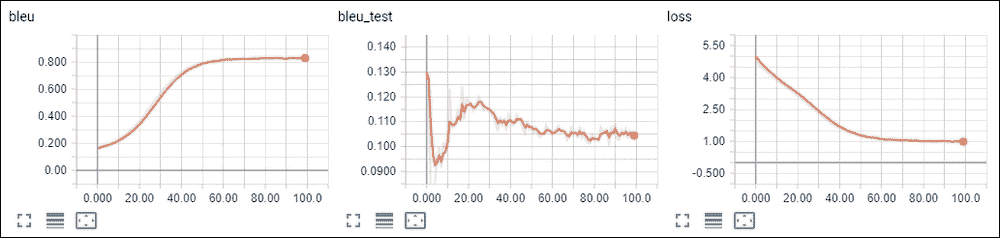

从这些图表中，您可以看到最佳测试 BLEU 得分为 0.124，而训练 BLEU 在 0.83 时停止提高。通过微调在时期 40 保存的模型(用训练 BLEU 0.72 和测试 BLEU 0.111)，它能够达到训练 BLEU 0.72。从 train BLEU 的动态来看，它似乎可以进一步增长，但只是需要更多的时间。我没有足够的耐心，因为即使达到这一点也需要 200 个 epoches，这比一天还多。图表如下:

图 8: SCST 培训

从相同的模型中分离训练，但不跳过 argmax 解码中具有高 BLEU 分数的训练样本(使用选项`--disable-skip`)，我能够在测试集上达到 0.127 BLEU，这不是很令人印象深刻，但正如已经解释的那样，很难在如此少的对话样本上获得良好的泛化。

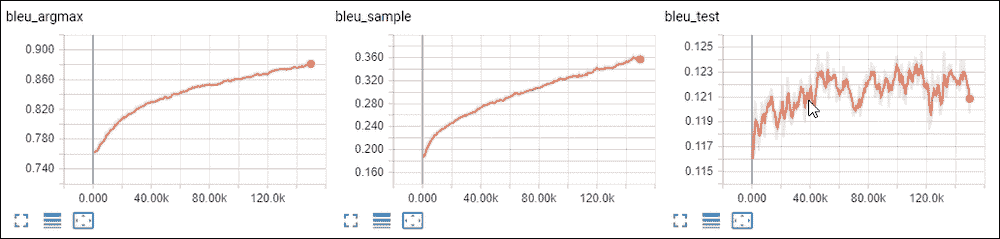

图 9:不跳过样本的 SCST

电报机器人

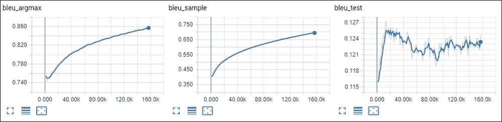

作为最后一步，使用训练好的模型实现了 Telegram 聊天机器人。为了能够运行它，你需要使用`pip install`将`python-telegram-bot`额外的包安装到你的虚拟环境中。

启动 bot 需要采取的另一个步骤是通过注册新 bot 来获取 API 令牌。完整的过程在文档[https://core.telegram.org/bots#6-botfather](https://core.telegram.org/bots#6-botfather)中描述。得到的令牌是一个形式为`110201543:AAHdqTcvCH1vGWJxfSeofSAs0K5PALDsaw`的字符串。bot 要求将该字符串放在`~/.config/rl_Chapter12_bot.ini`的配置文件中，该文件的结构如电报 bot 源代码所示，如下所示。


## 该机器人的逻辑与用于实验该模型的其他两个工具没有太大不同:它接收用户的短语，并用解码器生成的序列进行回复。

bot 支持两种操作模式:argmax 解码(默认使用)和样本模式。在 argmax 中，机器人对同一短语的回复总是相同的。当启用采样时，在解码过程中，我们从每一步返回的概率分布中进行采样，这增加了机器人回复的可变性。

在前面的代码中，我们解析配置文件以获取电报 API 令牌，加载嵌入并使用权重初始化模型。我们不需要加载数据集，因为不需要培训。

这个函数由`python-telegram-bot`库调用，通知它用户向机器人发送了一个短语。在这里，我们获取短语，将其标记化并转换为适合模型的形式。然后，编码器用于为解码器获取初始隐藏状态。

```py
#!/usr/bin/env python3
# This module requires python-telegram-bot
import os
import sys
import logging
import configparser
import argparse

try:
    import telegram.ext
except ImportError:
    print("You need python-telegram-bot package installed to start the bot")
    sys.exit()

from libbots import data, model, utils

import torch

# Configuration file with the following contents
# [telegram]
# api=API_KEY
CONFIG_DEFAULT = "~/.config/rl_Chapter12_bot.ini"

log = logging.getLogger("telegram")

if __name__ == "__main__":
    logging.basicConfig(format="%(asctime)-15s %(levelname)s %(message)s", level=logging.INFO)
    parser = argparse.ArgumentParser()
    parser.add_argument("--config", default=CONFIG_DEFAULT,
                        help="Configuration file for the bot, default=" + CONFIG_DEFAULT)
    parser.add_argument("-m", "--model", required=True, help="Model to load")
    parser.add_argument("--sample", default=False, action='store_true', help="Enable sampling mode")
    prog_args = parser.parse_args()
```

接下来，我们调用其中一个解码方法，这取决于程序命令行参数。我们在两种情况下得到的结果都是解码序列的整数令牌 id 序列。

```py
    conf = configparser.ConfigParser()
    if not conf.read(os.path.expanduser(prog_args.config)):
        log.error("Configuration file %s not found", prog_args.config)
        sys.exit()

    emb_dict = data.load_emb_dict(os.path.dirname(prog_args.model))
    log.info("Loaded embedded dict with %d entries", len(emb_dict))
    rev_emb_dict = {idx: word for word, idx in emb_dict.items()}
    end_token = emb_dict[data.END_TOKEN]

    net = model.PhraseModel(emb_size=model.EMBEDDING_DIM, dict_size=len(emb_dict), hid_size=model.HIDDEN_STATE_SIZE)
    net.load_state_dict(torch.load(prog_args.model))
```

当我们得到解码后的序列时，我们唯一需要做的事情就是使用我们的字典将它解码成文本形式，并将回复发送给用户。

```py
    def bot_func(bot, update, args):
        text = " ".join(args)
        words = utils.tokenize(text)
        seq_1 = data.encode_words(words, emb_dict)
        input_seq = model.pack_input(seq_1, net.emb)
        enc = net.encode(input_seq)
```

最后一段代码是`python-telegram-bot` machinery 注册我们的 bot 函数。要触发它，您需要在电报聊天中使用命令/机器人短语。以下是由训练模型生成的一个对话的示例。

```py
        if prog_args.sample:
            _, tokens = net.decode_chain_sampling(enc, input_seq.data[0:1], seq_len=data.MAX_TOKENS, stop_at_token=end_token)
        else:
            _, tokens = net.decode_chain_argmax(enc, input_seq.data[0:1], seq_len=data.MAX_TOKENS, stop_at_token=end_token)
```

图 10:生成的对话

```py
        if tokens[-1] == end_token:
            tokens = tokens[:-1]
        reply = data.decode_words(tokens, rev_emb_dict)
        if reply:
            reply_text = utils.untokenize(reply)
            bot.send_message(chat_id=update.message.chat_id, text=reply_text)
```

When we've got the decoded sequence, the only thing we need to do is to decode it back in text form using our dictionary and send the reply to the user.

```py
    updater = telegram.ext.Updater(conf['telegram']['api'])
    updater.dispatcher.add_handler(telegram.ext.CommandHandler('bot', bot_func, pass_args=True))

    log.info("Bot initialized, started serving")
    updater.start_polling()
    updater.idle()
```

总结


尽管 seq2seq 很简单，并且是本章中的一个玩具般的例子，但它在 NLP 和其他领域中是一个非常广泛使用的模型，因此替代的 RL 方法可能适用于广泛的问题。在这一章中，我们只是触及了深层 NLP 模型和思想的表面，这远远超出了本书的范围。我们讨论了 NLP 模型的基础知识，如 RNN 和 seq2seq 模型，以及训练它的不同方法。

在下一章，我们将看看 RL 方法在另一个领域的应用的另一个例子:自动化网页导航任务。


# Summary

Despite its simplicity, and the toy-like example in this chapter, seq2seq is a very widely used model in NLP and other domains, so the alternative RL approach could potentially be applicable to a wide range of problems. In this chapter, we've just scratched the surface of deep NLP models and ideas, which goes well beyond the scope of this book. We covered the basics of NLP models, such as RNN and the seq2seq model and different ways that it could be trained.

In the next chapter, we'll take a look at another example of the application of RL methods in another domain: automating web navigation tasks.