# 十四、连续动作空间

这一章开始了本书的**高级强化学习** ( **RL** )部分，通过看一下我们之前只简单提到过的问题:当我们的行动空间不是离散的时候，如何处理环境。在本章中，我们将熟悉在这种情况下出现的挑战，并学习如何解决它们。


# 为什么是连续空间？

到目前为止，我们在书中看到的所有例子都有一个离散的动作空间，所以你可能会有一个错误的印象，认为离散的动作主导了这个领域。当然，这是一个非常有偏见的观点，仅仅反映了我们选择测试问题的领域。除了 Atari 游戏和简单、经典的 RL 问题之外，还有许多任务需要做的不仅仅是从一组小而分散的事情中进行选择。

举个例子，想象一个简单的机器人，只有一个可控关节，可以在一定角度范围内旋转。通常，要控制物理关节，必须指定所需的位置或施加的力。在这两种情况下，您都需要对连续值做出决定。这个值从根本上不同于一个离散的动作空间，因为您可以做出决策的值集可能是无限的。例如，您可以要求关节移动到 13.5 角度或 13.512 角度，结果可能会不同。当然，系统总是有一些物理限制，您不能无限精确地指定动作，但是潜在值的大小可能非常大。

事实上，当你需要与一个物理世界交流时，一个连续的行动空间比拥有一组离散的行动更有可能。例如，不同种类的机器人控制系统(如加热/冷却控制器)。RL 的方法可以应用到这个领域，但是在使用**异步优势演员评论家** ( **A3C** )或**深度 Q 网络** ( **DQN** )方法之前，有一些细节需要考虑。

在这一章中，我们将试图理解如何处理这一系列问题。这将作为一个很好的起点，让你开始了解这个非常有趣和重要的 RL 领域。


# 动作空间

与连续动作空间最根本、最明显的区别就是它的连续性。与离散动作空间相反，当动作被定义为可供选择的离散互斥选项集时，连续动作具有某个范围内的值。在每个时间步上，代理需要为动作选择具体的值，并将其传递给环境。

在 Gym 中，一个连续的动作空间被表示为`gym.spaces.Box`类，这个类在[第 2 章](part0016_split_000.html#F8901-ce551566b6304db290b61e4d70de52ee "Chapter 2. OpenAI Gym")《open ai Gym》中有描述，我们在讲观察空间的时候。您可能记得 Box 包含一组具有形状和边界的值。例如，来自 Atari 模拟器的每个观察值都被表示为`Box(low=0, high=255, shape=(210, 160, 3))`，这意味着 100，800 个值被组织为一个 3D 张量，值从 0..255 范围。

对于动作空间，你不太可能处理这么多的动作。例如，我们将用作测试环境的机器人有八个连续动作，对应于八个电机，每个机器人的腿上有两个。对于这种环境，动作空间将被定义为`Box(low=-1, high=1, shape=(8, ))`，这意味着范围-1 中的八个值..1 必须在每个时间戳被选择以控制机器人。在这种情况下，每一步传递给`env.step()`的动作将不再是一个整数:它将是一个带有单个动作值的 NumPy 向量。当然，当动作空间是离散和连续动作的组合时，可能会有更复杂的情况，这可以用`gym.spaces.Tuple`类来表示。


# 环境

大多数包含连续动作空间的环境都与物理世界有关，所以通常使用物理模拟。有许多软件包可以模拟物理过程，从非常简单的开源工具到复杂的商业软件包都可以模拟多物理过程(如流体、燃烧和强度模拟)。在机器人方面，最受欢迎的软件包之一是 MuJoCo，它代表**多关节动力学与接触**([www.mujoco.org](http://www.mujoco.org))。这是一个物理引擎，你可以在其中定义系统的组件，它们的交互和属性。然后模拟器负责*求解系统*，考虑到你的介入并找到组件的参数(通常是位置、速度和加速度)。这使得它成为 RL 环境的理想场所，因为您可以定义相当复杂的系统(如多足机器人或机械臂或类人机器人)，然后将观察结果反馈给 RL 代理，获得动作。

不幸的是，MuJoCo 不是免费的，而且需要许可证才能使用。网站上有一个月的试用许可证，但试用后，将需要一个许可证。对于学生来说，MuJoCo 开发者提供了一个免费的许可证，但是对于大学毕业后的 RL 爱好者来说，购买一个许可证可能是多余的。幸运的是，有一个开源的替代方案，叫做 PyBullet，它免费提供类似的功能(可能以较低的速度或准确性为代价)。

PyBullet 在[https://github.com/bulletphysics/bullet3](https://github.com/bulletphysics/bullet3)有版本，可以通过在虚拟环境中运行`pip install pybullet`来安装。下面的代码(在`Chapter14/01_check_env.py`中可用)允许您检查 PyBullet 是否工作，并查看动作空间和渲染环境的图像，我们将在本章中将其用作试验品。

```py
#!/usr/bin/env python3
import gym
import pybullet_envs

ENV_ID = "MinitaurBulletEnv-v0"
RENDER = True

if __name__ == "__main__":
    spec = gym.envs.registry.spec(ENV_ID)
    spec._kwargs['render'] = RENDER
    env = gym.make(ENV_ID)

    print(env.observation_space)
    print(env.action_space, env.action_space.sample())
    print(env)
    print(env.reset())
    input("Press any key to exit\n")
    env.close()
```

启动上面的实用程序后，它应该会打开 GUI 窗口，显示我们将要训练如何移动的四足机器人。

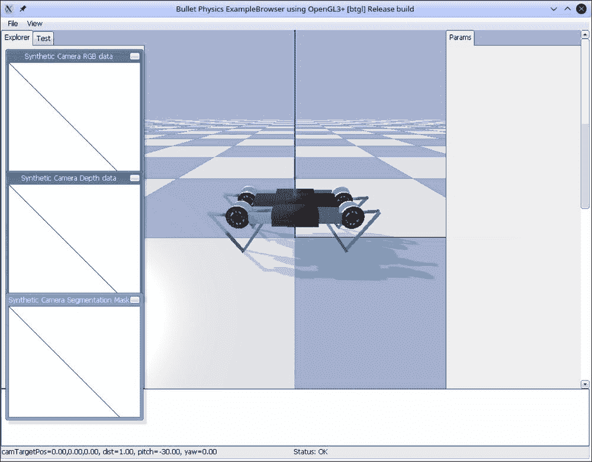

图 PyBullet GUI 中的 Minitaur 环境

这个环境给你提供 28 个数作为观察。分别对应机器人不同的物理参数:速度、位置、加速度(具体可以查看`MinitaurBulletEnv-v0`的源代码)。动作空间是八个数字，它们定义了电机的参数。每条腿有两个(每个膝盖一个)。这种环境的回报是机器人行驶的距离减去消耗的能量。

演员兼评论家(A2C)法

```py
rl_book_samples/Chapter14$ ./01_check_env.py
[2018-02-05 15:02:14,305] Making new env: MinitaurBulletEnv-v0
pybullet build time: Feb 2 2018 08:30:15
...
Observation space: Box(28,)
Action space: Box(8,)
<TimeLimit<MinitaurBulletEnv<MinitaurBulletEnv-v0>>>
[ 1.47892781e+00 1.47092442e+00 1.47486159e+00 1.46795948e+00
 1.48735227e+00 1.49067837e+00 1.48767487e+00 1.48856073e+00
 1.22760518e+00 1.23364264e+00 1.23980635e+00 1.23808274e+00
 1.23863620e+00 1.20957165e+00 1.22914063e+00 1.21966631e+00
 5.27463590e-01 5.87924378e-01 5.56949063e-01 6.10125678e-01
 4.58817873e-01 4.37388898e-01 4.57652322e-01 4.52128593e-01
 -3.00935339e-03 1.04264007e-03 -2.26649036e-04 9.99994903e-01]
Press any key to exit
```


# 我们将应用于步行机器人问题的第一种方法是 A2C，我们在本书的第三部分进行了实验。这种方法的选择是相当明显的，因为 A2C 很容易适应连续的行动领域。快速回顾一下，A2C 的想法是把我们策略的梯度估计为

The first method that we'll apply to our walking robot problem is A2C, which we experimented with in part three of the book. This choice of method is quite obvious, as A2C is very easy to adapt to the continuous action domain. As a quick refresher, A2C's idea is to estimate the gradient of our policy as

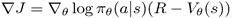

。策略应该为我们提供给定观察状态下动作的概率分布。数量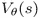被称为 critic，等于状态的值，并且使用 critic 回报和由贝尔曼方程估计的值之间的**均方误差** ( **MSE** )来训练。为了改善探索，熵奖励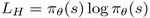通常被添加到损失中。

显然，演员评论家的价值头对于连续的行动是不变的。唯一受影响的是策略的表示。在我们看到的离散案例中，我们只有一个动作，它有几个互斥的离散值。在这种情况下，策略的明显表现是所有行动的概率分布。在连续的情况下，我们通常有几个动作，每个动作可以取某个范围内的值。记住这一点，最简单的策略表示就是为每个动作返回的那些值。这些值不要和状态的值 *V(s)* 混为一谈，意思是我们能从状态中得到多少奖励。为了说明区别，让我们想象一个简单的汽车转向案例，这时我们只能转动方向盘。每一时刻的动作都会是轮角(动作值)，但每一个状态的值都会是来自状态的潜在贴现回报，这完全是两码事。

回到我们的行动表示选项，如果你还记得[第 9 章](part0068_split_000.html#20R682-ce551566b6304db290b61e4d70de52ee "Chapter 9. Policy Gradients – An Alternative")、*策略梯度——一个替代方案*，将行动表示为一个具体的值有不同的缺点，大多与对环境的探索有关。更好的选择是随机的。最简单的选择是网络返回高斯分布的参数。对于 N 个动作，它将是两个大小为 N 的向量。第一个是平均值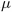，第二个向量将包含方差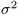。在这种情况下，我们的策略将被表示为不相关的正态分布随机变量的随机 N 维向量，我们的网络可以选择每个变量的均值和方差。

根据定义，高斯分布的概率密度函数是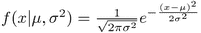。我们可以直接使用这个公式来获得概率，但是为了提高数值稳定性，有必要做一些数学计算并简化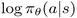的表达式。

最后的结果会是这样: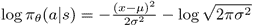。

高斯分布的熵可使用差分熵定义获得，并将为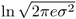。现在我们有了实现 A2C 方法所需的一切。让我们开始吧。

实现


## 完整的源代码在`Chapter14/02_train_a2c.py`、`Chapter14/lib/model.py`和`Chapter14/lib/common.py`中。大部分代码您已经很熟悉了，所以下面只包括不同的部分。让我们从`Chapter14/lib/model.py`中定义的模型类开始。

正如你所看到的，我们的网络有三个头，而不是通常的 A2C 离散变体的两个头。前两个头返回动作的平均值和方差，而最后一个头是返回状态值的 critic 头。返回的平均值具有双曲正切的激活函数，它是-1 范围内的压缩输出..1.方差通过 softplus 激活函数进行转换，该函数为，具有平滑 ReLU 函数的形状。这种激活有助于使我们的方差为正。像往常一样，值头没有应用激活函数。

```py
HID_SIZE = 128

class ModelA2C(nn.Module):
    def __init__(self, obs_size, act_size):
        super(ModelA2C, self).__init__()

        self.base = nn.Sequential(
            nn.Linear(obs_size, HID_SIZE),
            nn.ReLU(),
        )
        self.mu = nn.Sequential(
            nn.Linear(HID_SIZE, act_size),
            nn.Tanh(),
        )
        self.var = nn.Sequential(
            nn.Linear(HID_SIZE, act_size),
            nn.Softplus(),
        )
        self.value = nn.Linear(HID_SIZE, 1)
```

转换是显而易见的:我们首先应用公共层，然后我们计算单独的头部。

```py
    def forward(self, x):
        base_out = self.base(x)
        return self.mu(base_out), self.var(base_out), self.value(base_out)
```

下一步将是实现`ptan`代理类，它用于将观察转换成行动。在离散的情况下，我们已经使用了`ptan.agent.DQNAgent`和`ptan.agent.PolicyAgent`类，但是对于我们的问题，我们需要编写自己的，这并不复杂:你只需要编写一个类，从`ptan.agent.BaseAgent`派生并覆盖`__call__`方法，这需要将观察转换为行动。

```py
class AgentA2C(ptan.agent.BaseAgent):
    def __init__(self, net, device="cpu"):
        self.net = net
        self.device = device 

    def __call__(self, states, agent_states):
        states_v = ptan.agent.float32_preprocessor(states).to(device)
        mu_v, var_v, _ = self.net(states_v)
        mu = mu_v.data.cpu().numpy()
        sigma = torch.sqrt(var_v).data.cpu().numpy()
        actions = np.random.normal(mu, sigma)
        actions = np.clip(actions, -1, 1)
        return actions, agent_states
```

在前面的课程中，我们从网络中获取平均值和方差，并使用 NumPy 函数对正态分布进行采样。为了防止操作超出环境的-1..1 界限，我们用`np.clip`，用-1 代替所有小于-1 的值，用 1 代替大于 1 的值。没有使用`agent_states`参数，但是需要返回所选择的动作，因为我们的`BaseAgent`支持保持代理的状态(在下一节中，当我们需要使用**奥恩斯坦-乌伦贝克** ( **OU** )过程实现随机探索时，它会变得很方便)。

有了模型和代理，我们现在可以进入`Chapter14/02_train_a2c.py`中定义的培训流程。它由训练循环和两个函数组成。第一个用于在单独的测试环境中对我们的模型进行定期测试。由于在测试过程中，我们不需要做任何探索，我们将直接使用模型返回的平均值，没有任何随机抽样。测试功能如下:

培训模块中定义的第二个函数实现了在给定策略的情况下对所采取措施的对数的计算。上面给出了这方面的公式，该函数是它的一个简单实现。唯一微小的区别是当返回的方差太小时，使用`torch.clamp()`函数来防止除以零。

```py
def test_net(net, env, count=10, device="cpu"):
    rewards = 0.0
    steps = 0
    for _ in range(count):
        obs = env.reset()
        while True:
            obs_v = ptan.agent.float32_preprocessor([obs]).to(device)
            mu_v = net(obs_v)[0]
            action = mu_v.squeeze(dim=0).data.cpu().numpy()
            obs, reward, done, _ = env.step(action)
            rewards += reward
            steps += 1
            if done:
                break
    return rewards / count, steps / count
```

训练循环通常创建网络和代理，然后实例化两步经验源和优化器。使用的超参数如下所示，没有做太多调整，因此有很大的优化空间。

```py
def calc_logprob(mu_v, var_v, actions_v):
    p1 = - ((mu_v - actions_v) ** 2) / (2*var_v.clamp(min=1e-3))
    p2 = - torch.log(torch.sqrt(2 * math.pi * var_v))
    return p1 + p2
```

用于对收集的批处理执行优化步骤的代码非常类似于我们在[第 10 章](part0074_split_000.html#26I9K1-ce551566b6304db290b61e4d70de52ee "Chapter 10. The Actor-Critic Method")、*、*、*演员评论家方法*和[第 11 章](part0081_split_000.html#2D7TI1-ce551566b6304db290b61e4d70de52ee "Chapter 11. Asynchronous Advantage Actor-Critic")、*异步优势演员评论家*中实现的 A2C 训练。不同之处仅在于使用了我们的`calc_logprob function`和熵加成的不同表达式。

```py
ENV_ID = "MinitaurBulletEnv-v0"
GAMMA = 0.99
REWARD_STEPS = 2
BATCH_SIZE = 32
LEARNING_RATE = 5e-5
ENTROPY_BETA = 1e-4

TEST_ITERS = 1000
```

每隔`TEST_ITERS`帧，执行模型测试，在获得最佳奖励的情况下，保存模型权重。

```py
                states_v, actions_v, vals_ref_v = \
                    common.unpack_batch_a2c(batch, net, last_val_gamma=GAMMA ** REWARD_STEPS, device=device)
                batch.clear()

                optimizer.zero_grad()
                mu_v, var_v, value_v = net(states_v)

                loss_value_v = F.mse_loss(value_v, vals_ref_v)

                adv_v = vals_ref_v.unsqueeze(dim=-1) - value_v.detach()
                log_prob_v = adv_v * calc_logprob(mu_v, var_v, actions_v)
                loss_policy_v = -log_prob_v.mean()
                entropy_loss_v = ENTROPY_BETA * (-(torch.log(2*math.pi*var_v) + 1)/2).mean()

                loss_v = loss_policy_v + entropy_loss_v + loss_value_v
                loss_v.backward()
                optimizer.step()
```

结果


## 在与我们将在本章中看到的其他方法的比较中，A2C 显示了最差的结果，无论是在最佳回报还是收敛速度方面。这可能是因为用于收集经验的单一环境，这是 PG 方法的弱点。因此，您可能希望检查几个(八个或更多)并行环境对 A2C 的影响。

要开始训练，您需要传递带有运行名称的`-n`参数，它将用于 TensorBoard 和一个新目录来保存模型。`--cuda`选项支持 GPU 的使用，但是由于输入的维度很小，网络规模很小，它只能略微提高速度。训练的样本输出如下所示:

经过 13M 帧(差不多两天)的训练过程，已经达到了 1.188 的最好成绩，印象不是很深刻。下图显示了一些被跟踪的参数:

```py
Chapter14$ ./02_train_a2c.py -n test
pybullet build time: Feb 2 2018 08:26:19
ModelA2C (
  (base): Sequential (
    (0): Linear (28 -> 128)
    (1): ReLU ()
  )
  (mu): Sequential (
    (0): Linear (128 -> 8)
    (1): Tanh ()
  )
  (var): Sequential (
    (0): Linear (128 -> 8)
    (1): Softplus (beta=1, threshold=20)
  )
  (value): Linear (128 -> 1)
)
Test done is 20.32 sec, reward -0.786, steps 443
122: done 1 episodes, mean reward -0.473, speed 5.69 f/s
1123: done 2 episodes, mean reward -2.560, speed 27.54 f/s
1209: done 3 episodes, mean reward -1.838, speed 176.22 f/s
1388: done 4 episodes, mean reward -1.549, speed 137.63 f/s
```

图 2:在 Minitaur 环境中培训 A2C 代理

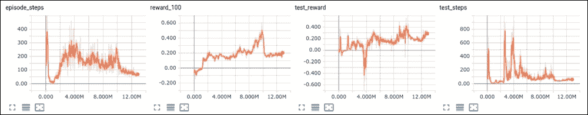

**剧集 _ 步数**图表显示剧集结束前的平均步数。环境的时间限制是 1000 步，因此下面的所有内容都表明该集由于环境检查而停止(对于大多数环境，这些是检查自我损坏，这将停止模拟)。 **test_reward** 和 **test_steps** 图表显示测试期间获得的平均奖励和步数。

使用模型和录制视频

正如我们之前看到的，物理模拟器可以渲染环境的状态，这使得我们可以看到我们训练过的模型的行为。为了实现我们的 A2C 模型，有一个实用程序，`Chapter14/03_play_a2c.py`。它的逻辑与`test_net`函数中的相同，所以这里不显示它的代码。要启动它，您需要传递带有模型文件的`-m`选项和带有目录名的`-r`，它将被创建来保存视频。为了渲染图像，PyBullet 需要 OpenGL，因此为了能够在无头服务器上录制视频，您需要使用`Xvfb: xvfb-run -s "-screen 0 640x480x24 +extension GLX" ./03_play_a2c.py -m model.dat -r dest-dir`。在`Chapter14/adhoc/record_a2c.sh`中有一个脚本是这样做的。例如，我从 A2C 培训中获得的最佳模型是这样的:


## 在指定的目录中，将有一个记录了代理活动的电影。

确定性策略梯度

```py
Chapter14$ ./adhoc/record_a2c.sh res/a2c-t1-long/a2c-t1/best_+1.188_203000.dat a2c-res/
pybullet build time: Feb 2 2018 08:26:19
In 738 steps we got 1.261 reward
```

我们要看的下一个方法叫做确定性策略梯度，它是 A2C 方法的一种变体，但是具有非常好的非策略属性。以下是我对严格证明的非常轻松的解读。如果你有兴趣深入了解这种方法的核心，你可以随时参考 2014 年发表的大卫·西尔弗(David Silver)等人名为*确定性策略梯度算法*的文章和 2015 年发表的蒂莫西·p·莉莉卡普(Timothy P. Lillicrap)等人名为*深度强化学习的连续控制*的论文。


# 说明这种方法的最简单的方法是与我们已经熟悉的 A2C 进行比较。在这种方法中，参与者估计随机策略，这将返回离散行动的概率分布，或者，正如我们在上一节中看到的，正态分布的参数。在这两种情况下，我们的策略是*随机*，所以，换句话说，我们采取的行动是从这个分布中抽样的。确定性策略梯度也属于 A2C 家族，但该策略是*确定性*，这意味着它直接为我们提供了从国家采取的行动。这使得将链式法则应用于 Q 值成为可能，并且通过最大化 Q，策略也将得到改进。为了理解这一点，让我们看看演员和评论家是如何在一个连续的动作领域中联系起来的。

让我们从演员开始，因为这是两者中比较简单的一个。我们想从它那里得到的是对每个给定状态采取的行动。在一个连续的动作域中，每个动作都是一个数字，所以演员网络将状态作为输入，返回 N 个值，每个动作一个值。这种映射将是确定性的，因为如果输入相同，相同的网络总是返回相同的输出(我们不会使用 DropOut 或类似的东西，只是一个普通的前馈网络)。

现在让我们来看看评论家。评论家的角色是估计 Q 值，这是在某个州采取的行动的折扣奖励。然而，我们的动作是一个数字向量，所以我们的评论家网现在接受两个输入:状态和动作。评论家的输出将是一个单一的数字，它对应于 Q 值。这种架构不同于 DQN，当时我们的动作空间是离散的，为了提高效率，我们一次返回所有动作的值。这种映射也是确定性的。

那么，我们有什么？我们有两个功能，一个是演员，姑且称之为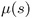，将状态转换为动作，另一个是评论家，由状态和动作给我们 Q 值: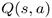。我们可以把 actor 函数代入 critic，得到只有我们状态的一个输入参数的表达式:。最后，**神经网络** ( ** NN ** s)只是函数。

现在评论家的输出给了我们一个我们首先感兴趣的最大化实体的近似值:总报酬的折扣。该值不仅取决于输入状态，还取决于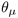 actor 和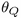 critic 网络的参数。在我们优化的每一步，我们都希望改变演员的权重，以提高我们希望获得的总回报。用数学术语来说，我们想要我们策略的梯度。

在他的确定性策略梯度定理中，David Silver 证明了随机策略梯度等价于确定性策略梯度。换句话说，要改进策略，我们只需要计算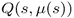函数的梯度。通过应用链式法则，我们得到梯度: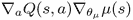。

请注意，尽管 A2C 和**深度确定性策略梯度** ( **DDPG** )方法都属于 A2C 家族，但使用 critic 的方式是不同的。在 A2C，我们使用评论家作为经验轨迹的奖励的基线，所以评论家是一个可选的部分(没有它，我们将得到加强方法)并用于提高稳定性。这是因为 A2C 的策略是**随机的**，这在我们的反向传播能力中建立了一个障碍(我们没有办法区分随机抽样步骤)。在 DDPG，评论家以不同的方式被使用。由于我们的策略是**确定性的**，我们现在可以计算从 Q 开始的梯度，从评论家到演员的权重，因此整个系统是可微的，并且可以使用**随机梯度下降** ( **SGD** )进行端到端优化。为了更新 critic 网络，我们可以使用 Bellman 方程来找到 *Q(s，a)* 的近似值，并最小化 MSE 目标。

所有这些可能看起来有点神秘，但在它的背后有一个非常简单的想法:评论家和演员的更新就像我们在 A2C 做的那样，以一种最大化评论家的产出的方式进行更新。这种方法的美妙之处在于它不符合策略，这意味着我们现在可以有一个巨大的重播缓冲区和其他我们在 DQN 训练中用过的技巧。不错吧。

探索

我们为所有这些好处付出的代价是，我们的策略现在是决定性的，所以我们必须以某种方式探索环境。在将动作传递给环境之前，我们可以通过向动作返回的动作添加噪声来实现这一点。这里有几种选择。最简单的方法就是给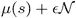动作添加随机噪声。我们将在本章考虑的下一个方法中使用这种探索方式。一个更好的探索方法是使用上述的随机模型，它在金融界和其他处理随机过程的领域非常流行:OU 过程。


## 这个过程模拟了大质量布朗粒子在摩擦影响下的速度，并由这个随机微分方程定义: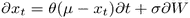，其中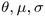是过程的参数，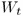是维纳过程。在离散时间的情况下，OU 过程可以写成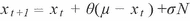。该等式通过噪声的前一个值，加上正常噪声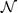，表达了过程产生的下一个值。在我们的探索中，我们将把 OU 流程的值添加到 actor 返回的动作中。

实现

这个例子由三个源文件组成:`Chapter14/lib/model.py`包含模型和 ptan 代理，而`Chapter14/lib/common.py`有一个用于解包批处理的函数，`Chapter14/04_train_ddpg.py`有一个启动代码和训练循环。这里我们将只展示代码的重要部分。


## 该模型由演员和评论家的两个独立网络组成，并遵循论文中的架构，*具有深度强化学习的连续控制*。演员极其简单，前馈两个隐藏层。输入是一个观察向量，而输出是一个有 N 个值的向量，每个值对应一个动作。用双曲正切非线性变换输出动作，以将值压缩到-1..1 范围。

critic 有点不寻常，因为它包括观察和动作的两条独立路径，这些路径被连接在一起，以转换为一个数字的 critic 输出。以下是两个网络的结构图:

图 3: DDPG 演员和评论家网络

The critic is a bit unusual, as it includes two separate paths for observation and the actions, and those paths are concatenated together to be transformed into the critic output of one number. The following is a diagram with the structures of both networks:

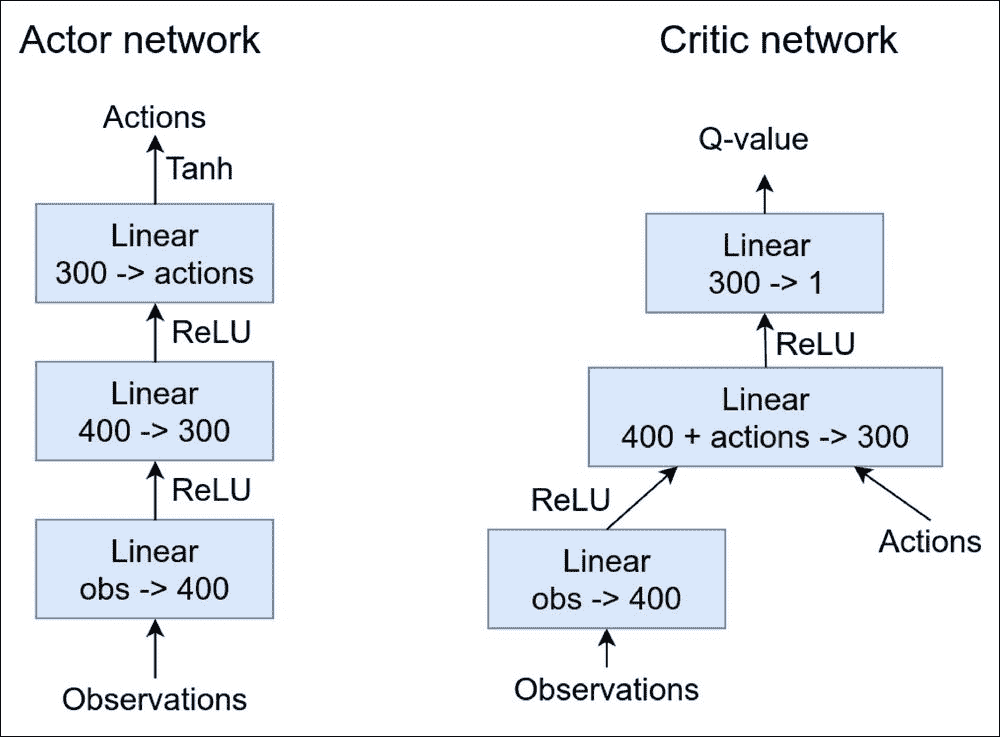

这两个类的代码简单明了:

critic 的`forward()`功能首先通过其小型网络转换观察结果，然后连接输出和给定的动作，将它们转换为一个单一的 q 值。要将 actor 网络与 ptan 体验源一起使用，我们需要定义必须将观察结果转换为动作的代理类。这个类是放置我们的 OU 探索过程的最方便的地方，但是要正确地做到这一点，我们应该使用到目前为止我们还没有使用的 ptan 代理的功能:可选状态。这个想法很简单:我们的代理将观察转化为行动，但是如果它需要记住观察之间的一些事情呢？到目前为止，我们所有的例子都是无状态的，但有时这还不够。OU 的问题是，我们必须跟踪观测值之间的 OU 值。有状态代理的另一个非常有用的用例是**部分可观察马尔可夫决策过程** ( **POMDP** )，我们在[第 13 章](part0092_split_000.html#2NNJO1-ce551566b6304db290b61e4d70de52ee "Chapter 13. Web Navigation")、*网页导航*中简单提到过。当代理观察到的状态不符合马尔可夫性质并且不包括区分一个状态和另一个状态的完整信息时，POMDP 是 MDP。在这种情况下，我们的代理需要沿着轨迹跟踪状态，以便能够采取行动。

因此，为 exploration 实现 OU 的代理的代码如下:

```py
class DDPGActor(nn.Module):
    def __init__(self, obs_size, act_size):
        super(DDPGActor, self).__init__()

        self.net = nn.Sequential(
            nn.Linear(obs_size, 400), nn.ReLU(),
            nn.Linear(400, 300), nn.ReLU(),
            nn.Linear(300, act_size), nn.Tanh()
        )

    def forward(self, x):
        return self.net(x)

class DDPGCritic(nn.Module):
    def __init__(self, obs_size, act_size):
        super(DDPGCritic, self).__init__()
        self.obs_net = nn.Sequential(
            nn.Linear(obs_size, 400),
            nn.ReLU(),
        )

        self.out_net = nn.Sequential(
            nn.Linear(400 + act_size, 300), nn.ReLU(),
            nn.Linear(300, 1)
        )

    def forward(self, x, a):
        obs = self.obs_net(x)
        return self.out_net(torch.cat([obs, a], dim=1))
```

构造函数接受许多参数，其中大部分是 OU 的默认值，取自 Timothy P. Lillycrap 等人 2015 年的论文。

这个方法是从`BaseAgent`类中派生出来的，当新的一集开始时，它必须返回代理的初始状态。由于我们的初始状态必须与动作具有相同的维度(我们希望环境的每个动作都有单独的探索轨迹)，我们将状态的初始化推迟到`__call__`方法，如下所示:

```py
class AgentDDPG(ptan.agent.BaseAgent):
    def __init__(self, net, device="cpu", ou_enabled=True, ou_mu=0.0, ou_teta=0.15, ou_sigma=0.2, ou_epsilon=1.0):
        self.net = net
        self.device = device 
        self.ou_enabled = ou_enabled
        self.ou_mu = ou_mu
        self.ou_teta = ou_teta
        self.ou_sigma = ou_sigma
        self.ou_epsilon = ou_epsilon
```

该方法是 agent 的核心，其目的是将观察到的状态和 agent 内部的状态转换成动作。作为第一步，我们将观察转换成适当的形式，并要求演员网络将它们转换成确定性的动作。该方法的其余部分是通过应用 OU 过程来添加探测噪声。

```py
    def initial_state(self):
        return None
```

在这个循环中，我们迭代上一次调用的一批观察结果和代理状态列表，并更新 OU 流程值，这是前面公式的一个简单实现。

```py
    def __call__(self, states, agent_states):
        states_v = ptan.agent.float32_preprocessor(states).to(self.device)
        mu_v = self.net(states_v)
        actions = mu_v.data.cpu().numpy()
```

为了结束循环，我们将来自 OU 过程的噪声添加到我们的操作中，并保存噪声值以供下一步使用。

```py
        if self.ou_enabled and self.ou_epsilon > 0:
            new_a_states = []
            for a_state, action in zip(agent_states, actions):
                if a_state is None:
                    a_state = np.zeros(shape=action.shape, dtype=np.float32)
                a_state += self.ou_teta * (self.ou_mu - a_state)
                a_state += self.ou_sigma * np.random.normal(size=action.shape)
```

最后，我们剪辑行动，以强制他们落入-1..1 范围，否则 PyBullet 会抛出异常。DDPG 实现的最后一部分是`Chapter14/04_train_ddpg.py` 文件中的训练循环。为了提高稳定性，我们使用具有 100k 转换的重放缓冲区和演员和评论家的目标网络。我们在第六章、*深度 Q 网络*中讨论了这两者。

```py
                action += self.ou_epsilon * a_state
                new_a_states.append(a_state)
```

我们还使用两种不同的优化器来简化演员和评论家训练步骤的渐变处理。最有趣的代码在训练循环内部。在每次迭代中，我们将经验存储到重放缓冲区中，并对训练批次进行采样。

```py
        else:
            new_a_states = agent_states

        actions = np.clip(actions, -1, 1)
        return actions, new_a_states
```

然后执行两个独立的训练步骤。为了训练评论家，我们需要使用一步贝尔曼方程计算目标 Q 值，将目标评论家网络作为下一个状态的近似。

```py
    act_net = model.DDPGActor(env.observation_space.shape[0], env.action_space.shape[0]).to(device)
    crt_net = model.DDPGCritic(env.observation_space.shape[0], env.action_space.shape[0]).to(device)
    tgt_act_net = ptan.agent.TargetNet(act_net)
    tgt_crt_net = ptan.agent.TargetNet(crt_net)
    agent = model.AgentDDPG(act_net, device=device)
    exp_source = ptan.experience.ExperienceSourceFirstLast(env, agent, gamma=GAMMA, steps_count=1)
    buffer = ptan.experience.ExperienceReplayBuffer(exp_source, buffer_size=REPLAY_SIZE)
    act_opt = optim.Adam(act_net.parameters(), lr=LEARNING_RATE)
    crt_opt = optim.Adam(crt_net.parameters(), lr=LEARNING_RATE)
```

当我们有了参考，我们可以计算 MSE 损失，并要求评论家的优化调整评论家的权重。整个过程和我们在 DQN 的训练很相似，所以这里没有什么新的东西。

```py
                batch = buffer.sample(BATCH_SIZE)
                states_v, actions_v, rewards_v, dones_mask, last_states_v = \
                    common.unpack_batch_ddpg(batch, device=device)
```

在演员训练步骤中，我们需要更新演员的权重，以增加评论家的输出。由于参与者和评论家都被表示为可微函数，我们需要做的只是将参与者的输出传递给评论家，然后最小化评论家返回的否定值。

```py
                # train critic
                crt_opt.zero_grad()
                q_v = crt_net(states_v, actions_v)
                last_act_v = tgt_act_net.target_model(last_states_v)
                q_last_v = tgt_crt_net.target_model(last_states_v, last_act_v)
                q_last_v[dones_mask] = 0.0
                q_ref_v = rewards_v.unsqueeze(dim=-1) + q_last_v * GAMMA
```

评论家的这种否定输出可被用作损失，以将其反向传播到评论家网络，并最终传播到演员。我们不想触及评论家的权重，所以只要求演员的优化器来做优化步骤是很重要的。评论家的权重将仍然保持来自这个调用的梯度，但是它们将在下一个优化步骤中被丢弃。

```py
                critic_loss_v = F.mse_loss(q_v, q_ref_v.detach())
                critic_loss_v.backward()
                crt_opt.step()
                tb_tracker.track("loss_critic", critic_loss_v, frame_idx)
                tb_tracker.track("critic_ref", q_ref_v.mean(), frame_idx)
```

作为训练循环的最后一步，我们以一种不寻常的方式执行目标网络更新。以前，我们每 n 步就将权重从优化网络同步到目标网络。在连续动作问题中，这种同步比所谓的*软同步*效果更差。每一步都执行软同步，但是只有一小部分优化网络的权重被添加到目标网络。这使得从旧重量到新重量的过渡平稳而缓慢。

```py
                # train actor
                act_opt.zero_grad()
                cur_actions_v = act_net(states_v)
                actor_loss_v = -crt_net(states_v, cur_actions_v)
                actor_loss_v = actor_loss_v.mean()
```

结果

```py
                actor_loss_v.backward()
                act_opt.step()
                tb_tracker.track("loss_actor", actor_loss_v, frame_idx)
```

代码可以以与 A2C 示例相同的方式开始:您需要传递运行名和可选的`--cuda`标志。我的实验表明，GPU 的速度提高了约 30%，因此，如果你很着急，使用 CUDA 可能是一个好主意，但这种提高并不明显，正如我们在 Atari 游戏中看到的那样。

```py
                tgt_act_net.alpha_sync(alpha=1 - 1e-3)
                tgt_crt_net.alpha_sync(alpha=1 - 1e-3)
```


## 经过大约一天的 500 万次观察，DDPG 算法能够在 10 次测试中达到 3.943 的平均回报，这比 A2C 的结果有所改善。训练动态如下所示。

图 4: DDPG 培训动态

After 5M observations, which took about a day, the DDPG algorithm was able to reach the mean reward of 3.943 on 10 test episodes, which is an improvement over the A2C result. The training dynamics are shown as follows.

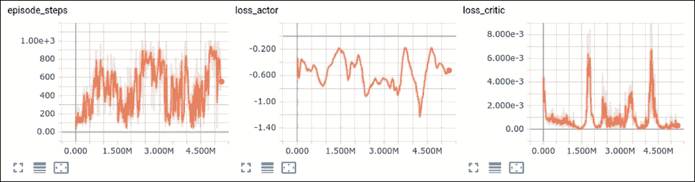

`episode_steps`值显示了我们用于训练的剧集的平均长度。评论家损失是一个 MSE 损失，它应该很低，但是演员损失，正如你记得的，是否定评论家的输出，所以它越小，演员可以(潜在地)获得越好的回报。从前面的图表来看，训练不是很稳定，很吵。

图 5:DDPG 训练期间的奖励和测试

The `episode_steps` value shows the mean length of the episodes that we used for training. The critic loss is an MSE loss and it should be low, but the actor loss, as you will remember, is the negated critic's output, so the smaller it is, the better reward that the actor can (potentially) achieve. From the preceding charts, the training is not very stable and noisy.

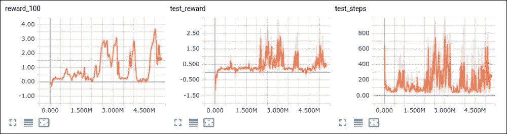

同一次运行的最后三个图表包括来自训练集和测试运行值的平均回报。这些图表也相当嘈杂。

录制视频

为了检查受训代理的行动，我们可以像为 A2C 代理录制视频一样录制视频。对于 DDPG，有一个单独的工具`Chapter14/05_play_ddpg.py`，它几乎与 A2C 方法相同，只是对演员使用了不同的类。我的模型的结果如下:


## 分配策略梯度

作为本章的最后一个方法，我们将看看加布里埃尔·巴斯-马龙、马修·w·霍夫曼等人最近发表的论文，名为*分配策略梯度*，发表于 2018 年。在撰写本文时，该论文尚未上传到 ArXiV，因为它仅提交给 2018 年 ICLR 会议进行审查。https://openreview.net/forum?id=SyZipzbCb[有售](https://openreview.net/forum?id=SyZipzbCb)。

```py
rl_book_samples/Chapter14$ adhoc/record_ddpg.sh saves/ddpg-t5-simpler-critic/best_+3.933_2484000.dat res/play-ddpg
pybullet build time: Feb 2 2018 08:26:19
In 1000 steps we got 5.346 reward
```


# 该方法的全称是分布式深度确定性策略梯度，简称 D4PG。作者对我们刚刚看到的 DDPG 方法提出了几个改进，以提高稳定性、收敛性和采样效率。

首先，他们采用了马克·G·贝勒马尔(Mark G.Bellemare)在 2017 年发表的论文中提出的 Q 值的分布表示，名为*关于强化学习的分布观点*。我们在第 7 章、 *DQN 扩展*中讨论了这种方法，当我们谈到 DQN 改进时，请参考它或参考原始论文了解详细信息。核心思想是用概率分布代替评论家的单个 Q 值。贝尔曼方程被替换为贝尔曼算子，后者以类似的方式转换这种分布表示。

第二个改进是使用 n 步贝尔曼方程，展开以加速收敛。我们也在第 7 章、 *DQN 扩展*中详细讨论了这一点。相对于原始 DDPG 方法的另一个改进是使用优先重放缓冲器而不是均匀采样缓冲器。因此，严格来说，作者从 Matteo Hassel 等人在 2017 年发表的名为*Rainbow:Combining Improvements in Deep Reinforcement Learning*的论文中提取了相关改进，并将其应用于 DDPG 方法。结果令人印象深刻:这种组合显示了在连续控制问题集上的最先进的结果。让我们试着重新实现这个方法并自己检查一下。

建筑

最显著的变化是评论家的作品。它现在返回 N_ATOMS 值，对应于预定义范围内的值的概率，而不是返回给定状态和动作的单个 Q 值。在我的代码中，我使用了 N_ATOMS=51 和分布范围 *Vmin=-10* 和 *Vmax=10* ，所以评论家返回了 51 个数字，代表折扣奖励落入范围在[-10，-9.6，-9.2，…，9.6，10]内的概率。


## D4PG 和 DDPG 的另一个区别是探索。DDPG 使用 OU 过程进行探索，但根据 D4PG 的作者，他们尝试了 OU 和向动作中添加简单的随机噪声，结果是相同的。因此，他们在论文中使用了一种更简单的方法进行探索。

代码中的最后一个显著差异将与训练有关，因为 D4PG 使用交叉熵损失来计算两个概率分布之间的差异:由评论家返回的和作为 Bellman 运算符的结果获得的。为了使两种分布对准相同的支持原子，分布投影以与 Bellemare 等人 2017 年的原始论文中相同的方式使用。

实现

完整的来源在`Chapter14/06_train_d4pg.py`、`Chapter14/lib/model.py`和`Chapter14/lib/common.py`中。和以前一样，我们从模型类开始。actor 类具有完全相同的架构，因此在培训类期间，使用了 DDPGActor。评论家的隐藏层的大小和数量是一样的，但是输出的不是一个数字，而是 N_ATOMS。


## 我们还创建了一个带有奖励支持的助手 PyTorch 缓冲区，它将用于从概率分布得到单个平均 Q 值。

正如所见，softmax 不是网络的一部分，因为我们将在培训期间使用更稳定的`log_softmax()`功能。因此，当我们想要获得实际概率时，需要应用`softmax()`。对于 D4PG 来说，代理类要简单得多，并且没有要跟踪的状态。

```py
class D4PGCritic(nn.Module):
    def __init__(self, obs_size, act_size, n_atoms, v_min, v_max):
        super(D4PGCritic, self).__init__()

        self.obs_net = nn.Sequential(
            nn.Linear(obs_size, 400),
            nn.ReLU(),
        )

        self.out_net = nn.Sequential(
            nn.Linear(400 + act_size, 300),
            nn.ReLU(),
            nn.Linear(300, n_atoms)
        )

        delta = (v_max - v_min) / (n_atoms - 1)
        self.register_buffer("supports", torch.arange(v_min, v_max+delta, delta))
```

对于每个要转换为动作的状态，代理应用参与者网络，并向动作添加高斯噪声，按ε值缩放。在训练代码中，我们有如下所示的超参数。我使用了一个 100k 的较小重放缓冲区，它工作得很好(在 D4PG 文章中，作者在缓冲区中使用了 1M 的过渡)。缓冲区预先填充了来自环境的 10k 个样本，然后开始训练。

```py
    def forward(self, x, a):
        obs = self.obs_net(x)
        return self.out_net(torch.cat([obs, a], dim=1))

    def distr_to_q(self, distr):
        weights = F.softmax(distr, dim=1) * self.supports
        res = weights.sum(dim=1)
        return res.unsqueeze(dim=-1)
```

对于每个训练循环，我们执行与之前相同的两个步骤:我们训练评论家和演员。不同之处在于计算评论家损失的方式。

```py
class AgentD4PG(ptan.agent.BaseAgent):
    def __init__(self, net, device="cpu", epsilon=0.3):
        self.net = net
        self.device = device 
        self.epsilon = epsilon

    def __call__(self, states, agent_states):
        states_v = ptan.agent.float32_preprocessor(states).to(device)
        mu_v = self.net(states_v)
        actions = mu_v.data.cpu().numpy()
        actions += self.epsilon * np.random.normal(size=actions.shape)
        actions = np.clip(actions, -1, 1)
        return actions, agent_states
```

作为 critic 训练的第一步，我们要求它返回状态和采取的行动的概率分布。该概率分布将被用作交叉熵损失计算中的输入。为了获得目标概率分布，我们需要从批次中的最后状态计算分布，然后执行分布的贝尔曼投影。

```py
ENV_ID = "MinitaurBulletEnv-v0"
GAMMA = 0.99
BATCH_SIZE = 64
LEARNING_RATE = 1e-4
REPLAY_SIZE = 100000
REPLAY_INITIAL = 10000
REWARD_STEPS = 5

TEST_ITERS = 1000

Vmax = 10
Vmin = -10
N_ATOMS = 51
DELTA_Z = (Vmax - Vmin) / (N_ATOMS - 1)
```

这个投影函数有点复杂，会在训练循环代码之后解释。目前，它计算的是`last_states`概率分布的转换，这种转换会根据即时回报进行转换，并根据贴现因子进行缩放。结果是我们希望我们的网络返回的目标概率分布。由于 PyTorch 中没有通用的交叉熵损失函数，我们通过将输入概率的对数乘以目标概率来手动计算它。

```py
                batch = buffer.sample(BATCH_SIZE)
                states_v, actions_v, rewards_v, dones_mask, last_states_v = \
                    common.unpack_batch_ddpg(batch, device=device)

                # train critic
                crt_opt.zero_grad()
                crt_distr_v = crt_net(states_v, actions_v)
                last_act_v = tgt_act_net.target_model(last_states_v)
                last_distr_v = F.softmax(tgt_crt_net.target_model(last_states_v, last_act_v), dim=1)
```

actor 训练简单得多，与 DDPG 方法的唯一区别是使用了`distr_to_q()`函数，通过支持原子将概率分布转换为单个平均 Q 值。

```py
                proj_distr_v = distr_projection(last_distr_v, rewards_v, dones_mask, gamma=GAMMA**REWARD_STEPS, device=device)
```

现在是 D4PG 实现中最复杂的一段代码:使用 Bellman 操作符预测概率。在[第 7 章](part0048_split_000.html#1DOR02-ce551566b6304db290b61e4d70de52ee "Chapter 7. DQN Extensions")、 *DQN 扩展*中已经解释过了，但是函数比较棘手，我们再来一遍。该函数的总体目标是计算贝尔曼算子的结果，并将所得概率分布投影到与原始分布相同的支持原子。贝尔曼算子有一种形式的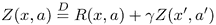，它被认为是转换概率分布。

```py
                prob_dist_v = -F.log_softmax(crt_distr_v, dim=1) * proj_distr_v
                critic_loss_v = prob_dist_v.sum(dim=1).mean()
                critic_loss_v.backward()
                crt_opt.step()
```

开始时，我们将提供的张量转换成 NumPy 数组，并为生成的投影分布创建一个空数组。

```py
                # train actor
                act_opt.zero_grad()
                cur_actions_v = act_net(states_v)
                crt_distr_v = crt_net(states_v, cur_actions_v)
                actor_loss_v = -crt_net.distr_to_q(crt_distr_v)
                actor_loss_v = actor_loss_v.mean()
                actor_loss_v.backward()
                act_opt.step()
                tb_tracker.track("loss_actor", actor_loss_v, frame_idx)
```

在循环中，我们迭代我们的原子，作为第一步，考虑值范围 V ^(min) ，计算这个原子将被贝尔曼算子投影到的位置...V ^(max) 。

```py
def distr_projection(next_distr_v, rewards_v, dones_mask_t, gamma, device="cpu"):
    next_distr = next_distr_v.data.cpu().numpy()
    rewards = rewards_v.data.cpu().numpy()
    dones_mask = dones_mask_t.cpu().numpy().astype(np.bool)
    batch_size = len(rewards)
    proj_distr = np.zeros((batch_size, N_ATOMS), dtype=np.float32)
```

前面的行计算这个投影值所属的原子的索引。当然，值可能落在原子之间，所以在那种情况下，我们将值按比例投影到两个原子。

```py
    for atom in range(N_ATOMS):
        tz_j = np.minimum(Vmax, np.maximum(Vmin, rewards + (Vmin + atom * DELTA_Z) * gamma))
```

前面的代码处理了项目值正好落在原子上的罕见情况。在这种情况下，我们只需要把值加到原子上。当然，我们处理的是一个批次，所以有些样本可能符合这种情况，但有些可能不符合。这就是为什么我们需要计算遮罩并用它进行过滤。

```py
        b_j = (tz_j - Vmin) / DELTA_Z
```

作为循环的最后一步，我们需要处理投影值在两个原子之间的情况。在这种情况下，我们计算比例，并在两个原子之间分配投影值。

```py
        l = np.floor(b_j).astype(np.int64)
        u = np.ceil(b_j).astype(np.int64)
        eq_mask = u == l
        proj_distr[eq_mask, l[eq_mask]] += next_distr[eq_mask, atom]
```

在这个分支中，我们处理剧集结束时的情况，我们的投影分布将只包含一个与我们获得的奖励原子相对应的条纹。这里我们做和以前一样的动作，但是我们的资源分配只是奖励。

```py
        ne_mask = u != l
        proj_distr[ne_mask, l[ne_mask]] += next_distr[ne_mask, atom] * (u - b_j)[ne_mask]
        proj_distr[ne_mask, u[ne_mask]] += next_distr[ne_mask, atom] * (b_j - l)[ne_mask]
```

在函数的末端，我们将分布打包到 PyTorch 张量中并返回它。

```py
    if dones_mask.any():
        proj_distr[dones_mask] = 0.0
        tz_j = np.minimum(Vmax, np.maximum(Vmin, rewards[dones_mask]))
        b_j = (tz_j - Vmin) / DELTA_Z
```

结果

```py
        l = np.floor(b_j).astype(np.int64)
        u = np.ceil(b_j).astype(np.int64)
        eq_mask = u == l
        eq_dones = dones_mask.copy()
        eq_dones[dones_mask] = eq_mask
        if eq_dones.any():
            proj_distr[eq_dones, l] = 1.0
        ne_mask = u != l
        ne_dones = dones_mask.copy()
        ne_dones[dones_mask] = ne_mask
        if ne_dones.any():
            proj_distr[ne_dones, l] = (u - b_j)[ne_mask]
            proj_distr[ne_dones, u] = (b_j - l)[ne_mask]
```

方法 D4PG 在收敛速度和获得的回报两方面都显示出最佳结果。在短短 5 个小时的训练和不到 100 万次的观察中，它能够达到 12.799 的平均测试回报，我们可以猜测这接近环境中的最大值。下面的图表是 2M 观测的动态。

```py
    return torch.FloatTensor(proj_distr).to(device) 
```


## 图 6: DDPG 在训练中的步伐和损失

The method D4PG has shown the best result in both convergence speed and the reward obtained. In just five hours of training and less than 1M observations, it was able to reach the mean test reward of 12.799, which we can guess is close to the maximum in the environment. On the charts below are the dynamics for 2M observations.

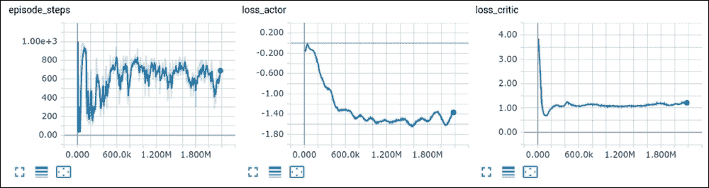

图 7:训练和测试期间的 DDPG 奖励

从图中可以看出，代理找到了最佳策略，并在 1M 帧后停止收敛。要录制模型活动的视频，可以使用相同的`Chapter14/05_play_ddpg.py`实用程序，因为演员的架构完全相同。我从受训模特那里得到的最好的视频可以在这里找到:【https://youtu.be/BMt40odLfyk[。](https://youtu.be/BMt40odLfyk)

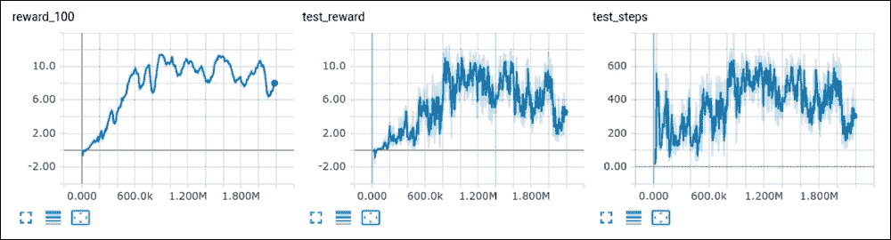

尝试的东西

以下是你可以做的一些事情来提高你对这个话题的理解:

在 D4PG 代码中，我使用了一个简单的重放缓冲区，这对于 DDPG 来说已经足够了。你可以像我们在[第 7 章](part0048_split_000.html#1DOR02-ce551566b6304db290b61e4d70de52ee "Chapter 7. DQN Extensions")、 *DQN 扩展*中所做的一样，尝试将示例切换到优先重放缓冲区，并检查效果。


# 周围有很多有趣而富有挑战性的环境。例如，你可以从其他 PyBullet 环境开始，但也有 **DeepMind 控制套件**(2018 年初发表了一篇关于它的论文，比较了 A3C，DDPG 和 D4PG 方法)，Gym 中基于 MuJoCo 的环境和许多其他环境。

你可以申请 MuJoCo 的试用许可，并与 PyBullet 比较其稳定性、性能和结果策略。

1.  玩非常具有挑战性的*学习如何运行 NIPS-2017 的*比赛，在那里你会得到一个人体模拟器，你的代理人需要知道如何移动它。
2.  总结
3.  在这一章中，我们快速浏览了连续控制的一个非常有趣的领域，使用 RL 方法并在一个四足机器人的一个问题上检查了三种不同的算法。在我们的训练中，我们使用了模拟器，但有幽灵机器人公司制作的这个机器人的真实模型(你可以在 YouTube 上查看很酷的视频:[https://youtu.be/bnKOeMoibLg](https://youtu.be/bnKOeMoibLg))。
4.  我们在这种环境下应用了三种训练方法:A2C、DDPG 和 D4PG(效果最好)。在下一章，我们将继续探索连续动作域，并将检查一组不同的改进:信任区域。


# Summary

In this chapter, we quickly skimmed through a very interesting domain of continuous control, using RL methods and checked three different algorithms on one problem of a four-legged robot. In our training, we used an emulator, but there are real models of this robot made by the Ghost Robotics company (you can check out the cool video on YouTube: [https://youtu.be/bnKOeMoibLg](https://youtu.be/bnKOeMoibLg)).

We applied three training methods to this environment: A2C, DDPG, and D4PG (which has shown the best results). In the next chapter, we'll continue exploring the continuous action domain and will check a different set of improvements: trust region.