# 十六、强化学习中的黑盒优化

在这一章中，我们将再次改变我们对强化学习(RL)训练的观点，并将切换到所谓的黑盒优化，特别是进化策略和遗传算法。这些方法至少有十年的历史，但最近进行了几项研究，这些研究显示了这些方法对大规模 RL 问题的适用性以及它们与值迭代和策略梯度(PG)方法的竞争力。


# 黑箱方法

首先，让我们讨论整个方法家族，以及它们与我们目前所看到的有何不同。黑盒优化方法是解决优化问题的一般方法，当您将正在优化的目标视为黑盒时，没有任何关于可微性、价值函数、目标平滑度等的假设。这些方法公开的唯一需求是计算**适应度函数**的能力，这应该给我们手边的优化实体的特定实例的适合度的度量。

这种方法的一个最简单的例子是随机搜索，当你随机抽取你正在寻找的东西时(在 RL 的例子中是策略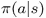)，然后你检查这个候选者的适合度，如果结果足够好(根据一些奖励标准)，那么你就完成了。否则，你会一次又一次地重复这个过程。尽管这种方法简单甚至幼稚，特别是对于我们到目前为止看到的复杂方法，这是一个很好的例子来说明黑盒方法的思想。此外，通过一些修改，正如我们将很快看到的，这种简单的方法可以在效率和结果策略的质量方面与深度 Q 网络(DQN)和 PG 方法进行比较。

黑盒方法有几个非常吸引人的特性:

1.  它们比基于梯度的方法至少快两倍，因为我们不需要执行反向传播步骤来获得梯度。
2.  关于优化目标和策略的假设很少，这被视为一个黑箱。当你的奖励函数不平滑或者策略包含随机选择的步骤时，传统方法很难应付。所有这些对黑盒方法来说都不是问题，因为它们对黑盒内部没有太多期望。
3.  这些方法通常可以很好地并行化。例如，上面提到的随机搜索可以很容易地扩展到成千上万个并行工作的 CPU 或 GPU，彼此之间没有任何依赖性。这与 DQN 或 PG 的情况不同，当您需要累积梯度并将当前策略传播给所有并行工作器时，会降低并行性。

上述缺点通常会降低采样效率。特别地，用具有 50 万个参数的神经网络(NN)参数化的策略的简单随机搜索成功的概率非常低。在这一章中，我们将讨论两种方法，它们能够极大地提高黑箱方法在复杂 RL 问题领域中的适用性。


# 进化策略

黑盒优化方法的子集被称为进化策略(es ),并受到进化过程的启发，其中最成功的个体对搜索的整体方向具有最高的影响力。有许多不同的方法属于这一类，在本章中，我们将考虑 OpenAI 研究人员 Tim Salimans，Jonathan Ho 等人在他们的论文中采用的方法，*进化策略作为强化学习的可扩展替代方案* [1]，发表于 2017 年 3 月。

ES 方法的基本思想很简单:在每次迭代中，我们对当前的策略参数进行随机扰动，并评估得到的策略适应度函数。然后，我们调整与相对适应度函数值成比例的策略权重。

上面论文中使用的具体方法称为**协方差矩阵自适应进化策略** ( **CMA-ES** )，其中执行的扰动是从零均值、恒等方差正态分布中采样的随机噪声。然后，我们计算策略的适应度函数，其权重等于原始策略的权重加上经缩放的噪声。接下来，根据获得的值，我们通过添加噪声乘以适应度函数值来调整原始策略权重，这将我们的策略移向具有更高适应度函数值的权重。为了提高稳定性，通过对具有不同随机噪声的一批这样的步骤进行平均来执行权重的更新。

更正式地说，上述方法可以表示为以下步骤序列:

1.  初始化学习率、噪声标准偏差和初始策略参数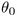。
2.  对于 t = 0，1，2，...执行:

    1.  用一个形状的权重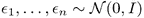对样本进行批量噪声处理。
    2.  计算为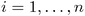返回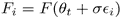。
    3.  更新权重。

上面的算法是论文中提出的方法的核心，但是，像往常一样，在 RL 域中，核心方法不足以获得好的结果，因此论文包括了改进该方法的几个调整，尽管核心是相同的。让我们在我们的"*果蝇*"环境:CartPole 上实现并测试它。


# 在扁担上

完整的示例在`Chapter16/01_cartpole_es.py`中。在这个例子中，我们使用单一环境来检查扰动网络权重的适合度。我们的健身功能将是这一集未打折的总奖励:

```py
#!/usr/bin/env python3
import gym
import time
import numpy as np

import torch
import torch.nn as nn

from tensorboardX import SummaryWriter
```

从`import`语句中，您可以注意到我们的例子是多么的独立。我们没有使用 PyTorch 优化器，因为我们根本不执行反向传播。事实上，我们可以完全避免使用 PyTorch，而只使用 NumPy，因为我们使用 PyTorch 的唯一目的是执行正向传递并计算网络的输出。

```py
MAX_BATCH_EPISODES = 100
MAX_BATCH_STEPS = 10000
NOISE_STD = 0.01
LEARNING_RATE = 0.001
```

超参数的数量也很少，包括以下值:

*   `MAX_BATCH_EPISODES`和`MAX_BATCH_STEPS`:我们用于训练的集数和步数的限制
*   `NOISE_STD`:用于权值扰动的噪声的标准差 *σ*
*   `LEARNING_RATE`:用于调整训练步长

    ```py
    class Net(nn.Module):     def __init__(self, obs_size, action_size):         super(Net, self).__init__()         self.net = nn.Sequential(             nn.Linear(obs_size, 32),             nn.ReLU(),             nn.Linear(32, action_size),             nn.Softmax(dim=1)         )      def forward(self, x):         return self.net(x)
    ```

    上权重的系数

我们使用的模型是一个简单的单隐层神经网络，它给我们从观察中采取的行动。我们在这里使用 PyTorch NN 机器只是为了方便，因为我们只需要前向传递，但它可以由一堆矩阵乘法和非线性来代替。

```py
def evaluate(env, net):
    obs = env.reset()
    reward = 0.0
    steps = 0
    while True:
        obs_v = torch.FloatTensor([obs])
        act_prob = net(obs_v)
        acts = act_prob.max(dim=1)[1]
        obs, r, done, _ = env.step(acts.data.numpy()[0])
        reward += r
        steps += 1
        if done:
            break
    return reward, steps
```

上面的函数使用给定的策略播放一整集，并返回总奖励和步数。奖励将用作适合度值，而步数需要限制我们在形成批次上花费的时间。通过从网络输出计算 argmax 来确定性地执行动作选择。原则上，我们可以从分布中进行随机采样，但我们已经通过向网络参数中添加噪声进行了探索，因此确定性操作选择在这里很好。

```py
def sample_noise(net):
    pos = []
    neg = []
    for p in net.parameters():
        noise_t = torch.tensor(np.random.normal(size=p.data.size()).astype(np.float32))
        pos.append(noise_t)
        neg.append(-noise_t)
    return pos, neg
```

在`sample_noise` 函数中，我们创建了均值为零、单位方差等于网络参数形状的随机噪声。该函数返回两组噪声张量:一组具有正噪声，另一组具有带负号的相同随机值。这两个样品随后作为独立样品用于一批。这种技术被称为*镜像采样*，用于提高收敛的稳定性。事实上，没有负噪声，收敛变得非常不稳定。

```py
def eval_with_noise(env, net, noise):
    old_params = net.state_dict()
    for p, p_n in zip(net.parameters(), noise):
        p.data += NOISE_STD * p_n
    r, s = evaluate(env, net)
    net.load_state_dict(old_params)
    return r, s
```

前面的函数获取由我们刚刚看到的函数创建的噪声数组，并评估添加了噪声的网络。为了实现这一点，我们将噪声添加到网络的参数中，并调用 evaluate 函数来获得奖励和所采取的步数。在此之后，我们需要将网络权重恢复到原始状态，这是通过加载网络的状态字典来完成的。

该方法的最后一个中心函数是`train_step`，其采用具有噪声和各自奖励的批次，并通过应用公式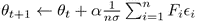计算网络参数的更新。

```py
def train_step(net, batch_noise, batch_reward, writer, step_idx):
    norm_reward = np.array(batch_reward)
    norm_reward -= np.mean(norm_reward)
    s = np.std(norm_reward)
    if abs(s) > 1e-6:
        norm_reward /= s
```

在开始时，我们将奖励归一化为零均值和单位方差，这提高了方法的稳定性。

```py
    weighted_noise = None
    for noise, reward in zip(batch_noise, norm_reward):
        if weighted_noise is None:
            weighted_noise = [reward * p_n for p_n in noise]
        else:
            for w_n, p_n in zip(weighted_noise, noise):
                w_n += reward * p_n
```

然后，我们迭代批处理中的每一对(噪声、奖励),并将噪声值乘以归一化的奖励，将策略中每个参数各自的噪声相加。

```py
    m_updates = []
    for p, p_update in zip(net.parameters(), weighted_noise):
        update = p_update / (len(batch_reward) * NOISE_STD)
        p.data += LEARNING_RATE * update
        m_updates.append(torch.norm(update))
    writer.add_scalar("update_l2", np.mean(m_updates), step_idx)
```

最后一步，我们使用累积的缩放噪声来调整网络参数。从技术上讲，我们在这里做的是梯度上升，但梯度不是从反向传播中获得的，而是从蒙特卡罗抽样方法中获得的。这一事实也在上述论文[1]中得到了证明，其中作者表明 CMA-ES 与 PG 方法非常相似，不同之处仅在于我们获得梯度估计的方式。

```py
if __name__ == "__main__":
    writer = SummaryWriter(comment="-cartpole-es")
    env = gym.make("CartPole-v0")

    net = Net(env.observation_space.shape[0], env.action_space.n)
    print(net)
```

培训循环之前的准备工作很简单:我们创建环境和网络。

```py
    step_idx = 0
    while True:
        t_start = time.time()
        batch_noise = []
        batch_reward = []
        batch_steps = 0
        for _ in range(MAX_BATCH_EPISODES):
            noise, neg_noise = sample_noise(net)
            batch_noise.append(noise)
            batch_noise.append(neg_noise)
            reward, steps = eval_with_noise(env, net, noise)
            batch_reward.append(reward)
            batch_steps += steps
            reward, steps = eval_with_noise(env, net, neg_noise)
            batch_reward.append(reward)
            batch_steps += steps
            if batch_steps > MAX_BATCH_STEPS:
                break
```

训练循环的每一次迭代都从批量创建开始，在批量创建中，我们对噪声进行采样，并从正面和负面噪声中获得奖励。当我们达到批中剧集的限制或总步骤的限制时，我们停止收集数据并进行训练更新。

```py
        step_idx += 1
        m_reward = np.mean(batch_reward)
        if m_reward > 199:
            print("Solved in %d steps" % step_idx)
            break

        train_step(net, batch_noise, batch_reward, writer, step_idx)
```

为了执行网络的更新，我们调用我们已经看到的函数。它的目标是根据总回报来缩放噪声，然后在平均噪声的方向上调整策略权重。

```py
        writer.add_scalar("reward_mean", m_reward, step_idx)
        writer.add_scalar("reward_std", np.std(batch_reward), step_idx)
        writer.add_scalar("reward_max", np.max(batch_reward), step_idx)
        writer.add_scalar("batch_episodes", len(batch_reward), step_idx)
        writer.add_scalar("batch_steps", batch_steps, step_idx)
        speed = batch_steps / (time.time() - t_start)
        writer.add_scalar("speed", speed, step_idx)
        print("%d: reward=%.2f, speed=%.2f f/s" % (step_idx, m_reward, speed))
```

训练循环的最后步骤是将指标写入 TensorBoard，并在控制台上显示训练进度。


## 战果

只需运行不带参数的程序即可开始训练:

```py
rl_book_samples/Chapter16$ ./01_cartpole_es.py
Net (
  (net): Sequential (
    (0): Linear (4 -> 32)
    (1): ReLU ()
    (2): Linear (32 -> 2)
    (3): Softmax ()
  )
)
1: reward=9.54, speed=6471.63 f/s
2: reward=9.93, speed=7308.94 f/s
3: reward=11.12, speed=7362.68 f/s
4: reward=18.34, speed=7116.69 f/s
...
20: reward=141.51, speed=8285.36 f/s
21: reward=136.32, speed=8397.67 f/s
22: reward=197.98, speed=8570.06 f/s
23: reward=198.13, speed=8402.74 f/s
Solved in 24 steps
```

根据我的实验，通常需要 40-60 个批次来解决 CartPole。上述运行的收敛动态显示在下图中，结果相当稳定:

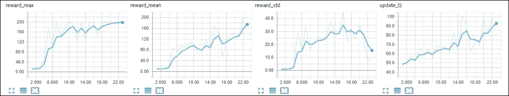

图 1:在 CartPole 环境下 ES 方法的收敛


# 半猎豹上的五十两

在下一个例子中，我们将超越最简单的 ES 实现，看看如何使用论文[1]提出的*共享种子*策略有效地将该方法并行化。为了展示这种方法，我们将使用 roboschool 库中的环境，我们已经在[第 15 章](part0107_split_000.html#361C61-ce551566b6304db290b61e4d70de52ee "Chapter 15. Trust Regions – TRPO, PPO, and ACKTR")、*信任区域 TRPO、PPO 和 ACKTR、* **HalfCheetah** 中试验过，这是一个连续动作问题，其中一个怪异的两条腿生物通过向前跑而不伤害自己来获得奖励。

首先，我们来讨论一下共享种子的想法。ES 算法的性能主要取决于我们收集训练批次的速度，包括对噪声进行采样和检查扰动噪声的总回报。由于我们的训练批次项目是独立的，我们可以很容易地将这个步骤并行化到坐在远程机器上的大量工作人员(这有点类似于来自[第 11 章](part0081_split_000.html#2D7TI1-ce551566b6304db290b61e4d70de52ee "Chapter 11. Asynchronous Advantage Actor-Critic")的例子，当我们从 A3C 工作人员那里收集梯度时，异步优势演员评论家)。然而，这种并行化的简单实现需要将大量数据从工作机传输到中央*主机*，该主机应该结合工作机检查的噪声并执行策略更新。这些数据的大部分是噪声向量，其大小等于我们的策略参数的大小。

为了避免这种开销，论文作者提出了一个非常优雅的解决方案。由于在 worker 上采样的噪声是由伪随机数发生器产生的，它允许我们设置随机种子并再现所产生的随机序列，因此 worker 只能将用于产生噪声的种子传输到 master。然后，主设备可以使用种子再次生成相同的噪声向量。当然，每个工人身上的种子需要随机生成，以便仍然有随机的优化过程。这允许显著地减少需要从工作者传输到主者的数据量，提高该方法的可扩展性。例如，作者报告了云中涉及 1440 个 CPU 的优化的线性加速。

在我们的示例中，我们将使用相同的方法检查本地并行化。代码放在`Chapter16/02_cheetah_es.py`中。由于代码与 CartPole 版本有很大的重叠，我们在这里只关注不同之处。

我们将从 worker 开始，它使用 PyTorch 多处理包装器作为一个独立的进程启动。工人的责任很简单:为了什么？每次迭代，它从主进程获得网络参数，然后执行固定数量的迭代，对噪声进行采样并评估回报。使用队列将带有随机种子的结果发送到主设备。

```py
RewardsItem = collections.namedtuple('RewardsItem', field_names=['seed', 'pos_reward', 'neg_reward', 'steps'])
```

工作人员使用上面的`namedtuple`来发送扰动策略评估的结果，它包括随机种子、通过噪声获得的奖励、通过被否定的噪声获得的奖励以及我们在两个测试中执行的步骤总数。

```py
def worker_func(worker_id, params_queue, rewards_queue, device, noise_std):
    env = make_env()
    net = Net(env.observation_space.shape[0], env.action_space.shape[0]).to(device
    net.eval()

    while True:
        params = params_queue.get()
        if params is None:
            break
        net.load_state_dict(params)
```

在每一次训练迭代中，工作者等待从主设备广播的网络参数。`None`的值表示主控想要停止工人。

```py
        for _ in range(ITERS_PER_UPDATE):
            seed = np.random.randint(low=0, high=65535)
            np.random.seed(seed)
            noise, neg_noise = sample_noise(net, device=device)
            pos_reward, pos_steps = eval_with_noise(env, net, noise, noise_std, device=device)
            neg_reward, neg_steps = eval_with_noise(env, net, neg_noise, noise_std, device=device)
            rewards_queue.put(RewardsItem(seed=seed, pos_reward=pos_reward,
                                          neg_reward=neg_reward, steps=pos_steps+neg_steps))
```

其余的几乎与前面的例子相同，唯一的区别是在噪声产生之前产生和分配的随机种子。这将允许主人仅从种子再生同样的噪音。另一个区别在于主设备用来执行训练步骤的功能。

```py
def train_step(optimizer, net, batch_noise, batch_reward, writer, step_idx, noise_std):
    weighted_noise = None
    norm_reward = compute_centered_ranks(np.array(batch_reward))
```

在前面的例子中，我们通过减去平均值并除以标准偏差来标准化一批奖励。根据 ES 的论文，用排名代替实际奖励可以获得更好的结果。由于 ES 对适应度函数没有任何假设(在我们的例子中，适应度函数是一种奖励)，我们可以对奖励进行任何我们想要的重新排列，例如，这在 DQN 的例子中是不可能的。这里，数组的**秩变换**是指用排序后的数组的索引替换数组。例如，array [0.1，10，0.5]将具有 rank array [0，3，2]。`compute_centered_ranks`函数获取包含该批次总奖励的数组，计算数组中每个项目的排名，然后对这些排名进行归一化。例如，输入数组[21.0。5.8.7.0]将具有等级[2，0，1]，并且最终居中的等级将是[0.5，-0.5，0.0]。

```py
    for noise, reward in zip(batch_noise, norm_reward):
        if weighted_noise is None:
            weighted_noise = [reward * p_n for p_n in noise]
        else:
            for w_n, p_n in zip(weighted_noise, noise):
                w_n += reward * p_n
    m_updates = []
    optimizer.zero_grad()
    for p, p_update in zip(net.parameters(), weighted_noise):
        update = p_update / (len(batch_reward) * noise_std)
        p.grad = -update
        m_updates.append(torch.norm(update))
    writer.add_scalar("update_l2", np.mean(m_updates), step_idx)
    optimizer.step()
```

训练函数的另一个主要区别是 PyTorch 优化器的使用。为了理解为什么使用它们，以及在不进行反向传播的情况下如何实现，需要一些解释。首先，在 ES 论文中表明，ES 算法使用的优化方法非常类似于适应度函数的梯度上升，不同之处在于梯度是如何计算的。通常应用**随机梯度下降** ( **SGD** )方法的方式是，通过计算网络参数相对于损失值的导数，从损失函数中获得梯度。这限制了网络和损失函数的可微性，但情况并非总是如此，例如，由 es 方法执行的秩变换是不可微的。另一方面，ES 执行的优化工作方式不同。我们通过向当前参数添加噪声并计算适应度函数来随机采样当前参数的邻域。根据适应度函数的变化，我们调整参数，这将我们的参数推向更高适应度函数的方向。这样做的结果非常类似于基于梯度的方法，但是对我们的适应度函数的要求要宽松得多:唯一的要求是我们计算它的能力。

然而，如果我们通过随机抽样适应度函数来估计某种梯度，我们可以使用 PyTorch 的标准优化器。通常，优化器使用参数的`grad`字段中累积的梯度来调整网络的参数。这些梯度是在反向传播步骤之后累积的，但是由于 PyTorch 的灵活性，优化器并不关心梯度的来源。因此，我们唯一需要做的就是将估计参数的更新复制到 grad 字段中，并要求优化器更新它们。请注意，更新是用负号复制的，因为优化器通常执行梯度下降(在正常操作中，我们正在**最小化**损失函数)，但在这种情况下，我们希望执行梯度上升。这与**演员评论家方法** ( **A2C** )非常相似，当时估算的 PG 是带负号的，因为它表明了**改进**策略的方向。

不同代码的最后一部分取自主进程执行的训练循环。它的职责是等待来自工作进程的数据，执行参数的训练更新，并将结果广播给工作进程。主设备和工作设备之间的通信由两组队列执行。第一个队列是针对每个工作线程的，由主服务器用来发送要使用的当前策略参数。第二个队列由工人共享，用于发送已经提到的带有随机种子和奖励的`RewardItem`结构:

```py
    params_queues = [mp.Queue(maxsize=1) for _ in range(PROCESSES_COUNT)]
    rewards_queue = mp.Queue(maxsize=ITERS_PER_UPDATE)
    workers = []
    for idx, params_queue in enumerate(params_queues):
        proc = mp.Process(target=worker_func, args=(idx, params_queue, rewards_queue, device, args.noise_std))
        proc.start()
        workers.append(proc)

    print("All started!")
    optimizer = optim.Adam(net.parameters(), lr=args.lr)
```

在主进程的开始，我们创建所有这些队列，启动工作进程和优化器。

```py
    for step_idx in range(args.iters):
        # broadcasting network params
        params = net.state_dict()
        for q in params_queues:
            q.put(params)
```

每次训练迭代都是从向工人广播网络参数开始的。

```py
        t_start = time.time()
        batch_noise = []
        batch_reward = []
        results = 0
        batch_steps = 0
        batch_steps_data = []
        while True:
            while not rewards_queue.empty():
                reward = rewards_queue.get_nowait()
                np.random.seed(reward.seed)
                noise, neg_noise = sample_noise(net)
                batch_noise.append(noise)
                batch_reward.append(reward.pos_reward)
                batch_noise.append(neg_noise)
                batch_reward.append(reward.neg_reward)
                results += 1
                batch_steps += reward.steps
                batch_steps_data.append(reward.steps)

            if results == PROCESSES_COUNT * ITERS_PER_UPDATE:
                break
            time.sleep(0.01)
```

然后，在循环中，主服务器等待从工作服务器获得足够的数据。每次有新的结果时，我们都使用随机种子来重现噪音。

```py
        train_step(optimizer, net, batch_noise, batch_reward, writer, step_idx, args.noise_std)
```

作为训练循环的最后一步，我们调用我们已经看到的函数，该函数根据噪声和奖励计算更新，并调用优化器来调整权重。


## 结果

代码支持可选的`--cuda`标志，但是，从我的实验来看，我从 GPU 获得零加速，因为网络太浅，并且每个参数的评估的批处理大小只有一个。这也表明，通过增加我们在评估过程中使用的批量大小，可能会提高速度，这可以通过在每个工作人员中使用多种环境并仔细处理网络内部的噪声数据来实现。每次迭代显示的值是获得的平均回报、训练速度(每秒观察值)两个计时值，显示收集数据和执行训练步骤花费的时间(以秒为单位),然后是关于每集长度的三个值:每集中的平均、最小和最大步数:

```py
rl_book_samples/Chapter16$ ./02_cheetah_es.py
Net (
  (mu): Sequential (
    (0): Linear (26 -> 64)
    (1): Tanh ()
    (2): Linear (64 -> 64)
    (3): Tanh ()
    (4): Linear (64 -> 6)
    (5): Tanh ()
  )
)
All started!
0: reward=10.86, speed=1486.01 f/s, data_gather=0.903, train=0.008, steps_mean=45.10, min=32.00, max=133.00, steps_std=17.62
1: reward=11.39, speed=4648.11 f/s, data_gather=0.269, train=0.005, steps_mean=42.53, min=33.00, max=65.00, steps_std=8.15
2: reward=14.25, speed=4662.10 f/s, data_gather=0.270, train=0.006, steps_mean=42.90, min=36.00, max=59.00, steps_std=5.65
3: reward=14.33, speed=4901.02 f/s, data_gather=0.257, train=0.006, steps_mean=43.00, min=35.00, max=56.00, steps_std=5.01
4: reward=14.95, speed=4566.68 f/s, data_gather=0.281, train=0.005, steps_mean=43.60, min=37.00, max=54.00, steps_std=4.41
…
```

培训的动力在开始时很快显示出策略改进(在仅 100 次更新，即 7 分钟的培训中，代理能够达到 700-800 的分数)，但后来，它卡住了，无法从保持平衡(当猎豹可以达到 900-1000 总奖励)切换到奖励更高的 2.5k 或更多的跑步模式:

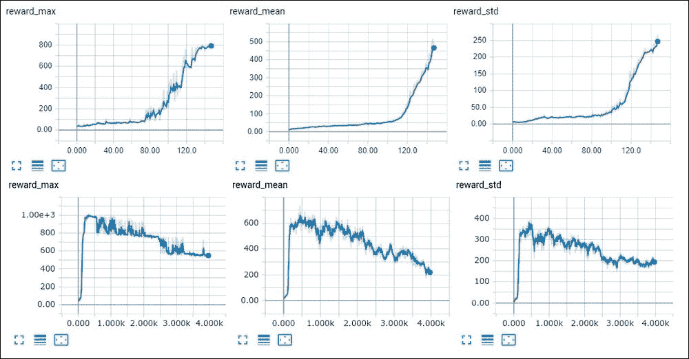

图 2:使用 ES 方法的 HalfCheetah 收敛


# 遗传算法

另一类黑盒方法是遗传算法或 GA，它最近成为基于值和 PG 方法的流行替代方法。它是一个拥有二十多年历史的大型优化方法家族，其简单的核心思想是生成 N 个个体的群体，每个个体都用适应度函数进行评估。每个个体都意味着模型参数的某种组合。然后，一些表现最好的子集被用来产生(这被称为变异)种群的下一代。这个过程一直重复，直到我们对群体的表现满意为止。

遗传算法家族中有许多不同的方法，例如，如何为下一代完成个体的变异或如何对执行者进行排序。在这里，我们将考虑简单的遗传算法和一些扩展，发表在由*菲利佩·彼得罗斯基这样，瓦希什特·马德哈万和其他人*发表的论文中，称为*深度神经进化:遗传算法是训练用于强化学习的深度神经网络的有竞争力的替代方案*【2】。

在本文中，作者分析了简单的遗传算法，该算法对父代的权重进行高斯噪声扰动来执行变异。在每一次迭代中，表现最好的被不加修改地复制。在算法形式中，简单 GA 方法的步骤可以写成如下:

1.  初始化变异能力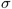，种群大小 *N* ，选择个体数量 *T* ，初始种群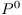N 个随机初始化的策略及其适应度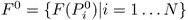。
2.  对于代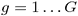 :

    1.  按适应度函数值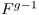降序排列代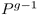。
    2.  复制精英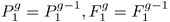。
    3.  对于个体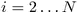 :

        *   k =从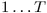中随机选择亲本。

        *   样本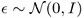。
        *   变异亲本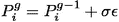。
        *   得其适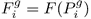。

论文中提出的这个基本方法有几处改进，我们将在后面讨论。现在，让我们检查核心算法的实现。


# 钢管舞

源代码在`Chapter16/03_cartpole_ga.py`中，它与我们的 ES 示例有很多共同之处。不同之处在于缺少梯度上升代码，该代码由如下网络突变函数代替:

```py
def mutate_parent(net):
    new_net = copy.deepcopy(net)
    for p in new_net.parameters():
        noise_t = torch.from_numpy(np.random.normal(size=p.data.size()).astype(np.float32))
        p.data += NOISE_STD * noise_t
    return new_net
```

该函数的目标是通过向所有权重添加随机噪声来创建给定策略的变异副本。父代的权重保持不变，因为随机选择父代是通过替换进行的，所以这个网络可以在以后再次使用。

```py
NOISE_STD = 0.01
POPULATION_SIZE = 50
PARENTS_COUNT = 10
```

超参数的数量甚至比 ES 更少，并且包括噪声附加突变的标准偏差、种群大小和用于产生下一代的最佳表现者的数量。

```py
if __name__ == "__main__":
    writer = SummaryWriter(comment="-cartpole-ga")
    env = gym.make("CartPole-v0")

    gen_idx = 0
    nets = [
        Net(env.observation_space.shape[0], env.action_space.n)
        for _ in range(POPULATION_SIZE)
    ]
    population = [
        (net, evaluate(env, net))
        for net in nets
    ]
```

在训练循环之前，我们创建随机初始化网络的群体，并获得它们的适应度。

```py
    while True:
        population.sort(key=lambda p: p[1], reverse=True)
        rewards = [p[1] for p in population[:PARENTS_COUNT]]
        reward_mean = np.mean(rewards)
        reward_max = np.max(rewards)
        reward_std = np.std(rewards)

        writer.add_scalar("reward_mean", reward_mean, gen_idx)
        writer.add_scalar("reward_std", reward_std, gen_idx)
        writer.add_scalar("reward_max", reward_max, gen_idx)
        print("%d: reward_mean=%.2f, reward_max=%.2f, reward_std=%.2f" % (
            gen_idx, reward_mean, reward_max, reward_std))
        if reward_mean > 199:
            print("Solved in %d steps" % gen_idx)
            break
```

在每一代的开始，我们根据上一代的适应度对他们进行排序，并记录关于未来父母的统计数据。

```py
        prev_population = population
        population = [population[0]]
        for _ in range(POPULATION_SIZE-1):
            parent_idx = np.random.randint(0, PARENTS_COUNT)
            parent = prev_population[parent_idx][0]
            net = mutate_parent(parent)
            fitness = evaluate(env, net)
            population.append((net, fitness))
        gen_idx += 1
```

在一个单独的循环中，在要生成的新个体中，我们随机抽取一个父个体，对其进行变异，并评估其适应度得分。


## 战果

尽管这种方法很简单，但它甚至比 ES 更有效，只需几代就能解决 CartPole 环境。在我用上面的代码做的实验中，需要五到十代人来解决这个环境:

```py
rl_book_samples/Chapter16$ ./03_cartpole_ga.py
0: reward_mean=20.60, reward_max=25.00, reward_std=2.76
1: reward_mean=44.40, reward_max=55.00, reward_std=6.70
2: reward_mean=73.30, reward_max=105.00, reward_std=16.66
3: reward_mean=100.40, reward_max=167.00, reward_std=30.75
4: reward_mean=140.20, reward_max=172.00, reward_std=21.99
5: reward_mean=137.50, reward_max=172.00, reward_std=14.63
6: reward_mean=157.70, reward_max=200.00, reward_std=22.07
7: reward_mean=198.20, reward_max=200.00, reward_std=4.24
8: reward_mean=200.00, reward_max=200.00, reward_std=0.00
Solved in 8 steps
```

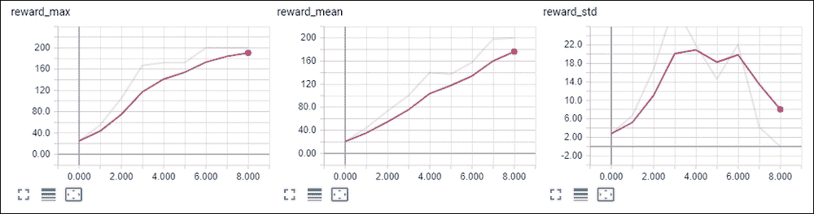

图 CartPole 上的 GA 收敛


# GA 调整

在深度神经进化论文[2]中，作者检查了对基本遗传算法的两个调整。第一个名为 **deep GA** ，旨在增加实现的可扩展性，第二个名为**新颖性搜索**，试图用剧集的不同指标来取代奖励目标。在下面的例子中，我们将实现第一个改进，而第二个改进是可选的。


## 深嘎

作为一种无梯度方法，遗传算法在速度方面甚至可能比 ES 方法更具可扩展性，有更多的 CPU 参与优化。然而，我们看到的简单 GA 算法与 ES 方法有相似的瓶颈:策略参数必须在工作者之间交换。在上面提到的论文中，作者提出了一个类似于共享种子方法的技巧，但走了一个极端。他们称之为 deep GA，在其核心，策略参数被表示为一个随机种子列表，用于创建这个特定策略的权重。

事实上，初始网络的权重是在第一个群体中随机生成的，因此列表中的第一个种子定义了这个初始化。在每个群体中，突变也完全由每个突变的随机种子指定。所以，我们唯一需要重建权重的是种子本身。在这种方法中，我们需要重建每个工作者的权重，但通常这种开销比通过网络传输全部权重的开销要小得多。


## 查新

另一个对基本遗传算法的修改，也在深度神经进化论文中进行了检查，是新颖性搜索(NS)，由*雷曼和斯坦利*在他们的论文*中提出，发表于 2011 年【3】。*

NS 的想法是停止将奖励作为驱动优化过程的主要目标，代之以不同的目标，并奖励代理探索它以前从未检查过的行为(即新颖)。根据他们在迷宫导航问题上的实验，对于代理人来说有很多陷阱，NS 比其他奖励驱动的方法要好得多。

为了实现 NS，我们定义了所谓的行为特征(BC) ( ，它描述了策略的行为以及两个 BC 之间的距离。然后，使用 k-最近邻方法来检查新策略的新颖性，并根据该距离来驱动遗传算法。在深度神经进化论文中，需要代理人进行充分的探索。NS 的方法明显优于 ES、GA 和其他更传统的解决 RL 问题的方法。


# 嘎上猎豹

在本章的最后一个例子中，我们将在 HalfCheetah 环境中实现并行深度 GA。完整的代码在`Chapter16/04_cheetah_ga.py`里。体系结构非常接近并行 ES 版本，有一个主进程和几个工人。每个工人的目标是评估该批网络并将结果返回给主，主将部分结果合并到完整的种群中，根据获得的奖励对个体进行排序，并生成下一个由工人评估的种群。

每个个体由一个随机种子列表编码，用于初始化初始网络权重和所有后续变异。这种表示允许对网络进行非常紧凑的编码，即使策略中的参数数量不是很大。例如，在我们具有两个隐藏层的 64 个神经元的网络中，我们有 6278 个浮点值(输入是 26 个值，动作是 6 个浮点)。每个 float 占用 4 个字节，这与随机种子使用的大小相同。因此，本文提出的深度遗传算法在优化过程中将会减少到 6278 代。

在我们的示例中，我们在本地 CPU 上执行并行化，因此来回传输的数据量并不重要，但是如果您有数百个内核要利用，表示可能会成为一个重要问题。

```py
NOISE_STD = 0.01
POPULATION_SIZE = 2000
PARENTS_COUNT = 10
WORKERS_COUNT = 6
SEEDS_PER_WORKER = POPULATION_SIZE // WORKERS_COUNT
MAX_SEED = 2**32 - 1
```

这组超参数与 CartPole 示例中的相同，不同之处在于群体规模更大。

```py
def mutate_net(net, seed, copy_net=True):
    new_net = copy.deepcopy(net) if copy_net else net
    np.random.seed(seed)
    for p in new_net.parameters():
        noise_t = torch.from_numpy(np.random.normal(size=p.data.size()).astype(np.float32))
        p.data += NOISE_STD * noise_t
    return new_net
```

有两个函数用于根据给定的种子构建网络。第一个在已经创建的策略网络上执行一个变异，并且它可以就地执行变异，或者通过基于参数复制目标网络来执行变异(第一代需要复制)。

```py
def build_net(env, seeds):
    torch.manual_seed(seeds[0])
    net = Net(env.observation_space.shape[0], env.action_space.shape[0])
    for seed in seeds[1:]:
        net = mutate_net(net, seed, copy_net=False)
    return net
```

第二个函数使用种子列表从头开始创建网络。第一个种子被传递给 PyTorch，以影响网络初始化，随后的种子用于应用网络突变。

worker 函数获得要评估的种子列表，并为获得的每个结果输出单独的`OutputItem`元组。该函数维护网络缓存，以最大限度地减少从种子列表中重新创建参数所花费的时间。这个缓存是为？每一代，因为每一代都是从当前一代的获胜者中产生的，所以旧网络从缓存中重用的可能性很小。

```py
OutputItem = collections.namedtuple('OutputItem', field_names=['seeds', 'reward', 'steps'])

def worker_func(input_queue, output_queue):
    env = gym.make("RoboschoolHalfCheetah-v1")
    cache = {}

    while True:
        parents = input_queue.get()
        if parents is None:
            break
        new_cache = {}
        for net_seeds in parents:
            if len(net_seeds) > 1:
                net = cache.get(net_seeds[:-1])
                if net is not None:
                    net = mutate_net(net, net_seeds[-1])
                else:
                    net = build_net(env, net_seeds)
            else:
                net = build_net(env, net_seeds)
            new_cache[net_seeds] = net
            reward, steps = evaluate(env, net)
            output_queue.put(OutputItem(seeds=net_seeds, reward=reward, steps=steps))
        cache = new_cache
```

主进程的代码也很简单。对于每一代人，我们将当前人口的种子发送给工人进行评估，并等待结果。然后，我们对结果进行排序，并根据最佳表现者生成下一个群体。在主节点方面，突变只是一个随机生成的种子号，并附加到父节点的种子列表中。

```py
        batch_steps = 0
        population = []
        while len(population) < SEEDS_PER_WORKER * WORKERS_COUNT:
            out_item = output_queue.get()
            population.append((out_item.seeds, out_item.reward))
            batch_steps += out_item.steps
        if elite is not None:
            population.append(elite)
        population.sort(key=lambda p: p[1], reverse=True)

        elite = population[0]
        for worker_queue in input_queues:
            seeds = []
            for _ in range(SEEDS_PER_WORKER):
                parent = np.random.randint(PARENTS_COUNT)
                next_seed = np.random.randint(MAX_SEED)
                seeds.append(tuple(list(population[parent][0]) + [next_seed]))
            worker_queue.put(seeds)
```


## 结果

要开始训练，只需启动源代码文件。对于每一代，它都会在控制台上显示结果:

```py
rl_book_samples/Chapter16$ ./04_cheetah_ga.py
0: reward_mean=31.28, reward_max=34.37, reward_std=1.46, speed=5495.65 f/s
1: reward_mean=45.41, reward_max=54.74, reward_std=3.86, speed=6748.35 f/s
2: reward_mean=60.74, reward_max=69.25, reward_std=5.33, speed=6749.70 f/s
3: reward_mean=67.70, reward_max=84.29, reward_std=8.21, speed=6070.31 f/s
4: reward_mean=69.85, reward_max=86.38, reward_std=9.37, speed=6612.48 f/s
5: reward_mean=65.59, reward_max=86.38, reward_std=7.95, speed=6542.46 f/s
6: reward_mean=77.29, reward_max=98.53, reward_std=11.13, speed=6949.59 f/s
```

整体动力学类似于 ES 在相同环境下的实验，同样的问题出在 1010 奖励的局部最优。经过四个小时的训练和 250 代之后，这个代理能够学习如何完美地站立，但却不能发现跑步可以带来更多的回报。NS 方法有可能克服这个问题:

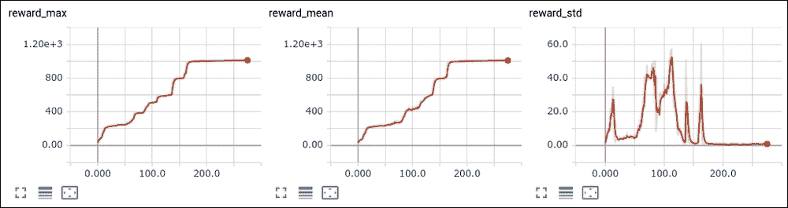

图 HalfCheetah 上的 GA 收敛

总结


# 在这一章中，我们看到了两个黑盒优化方法的例子:进化策略和遗传算法，它们对奖励系统做了更少的假设，但仍然可以为其他分析梯度方法提供竞争。它们的优势在于对大量资源的良好并行化，以及对回报函数的少量假设。

在下一章，我们将看看现代 RL 开发的不同领域:基于模型的方法。

参考文献


# 1998 年，李晓明，李晓明，李晓明，李晓明，进化策略在强化学习中的应用，中国教育科学出版社，2003 年第 2 期，第 17 页

1.  费利佩·彼得罗斯基·瑟克，瓦希什特·马德哈万，和其他人，深层神经进化:遗传算法是训练用于强化学习的深层神经网络的一种有竞争力的替代方案 arXiv:1712.065656767667
2.  Lehman 和 Stanley,《放弃目标:仅通过寻求新奇的进化》,《进化计算档案》第 19 卷第 2 期，2011 年夏季，第 189-223 页
3.  Lehman and Stanley, Abandoning Objectives: Evolution Through the Search for Novelty Alone, Journal Evolutionary Computation archive Volume 19 Issue 2, Summer 2011 Pages 189-223