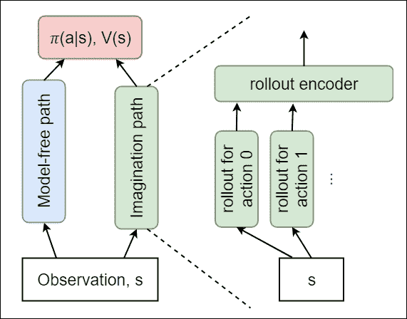
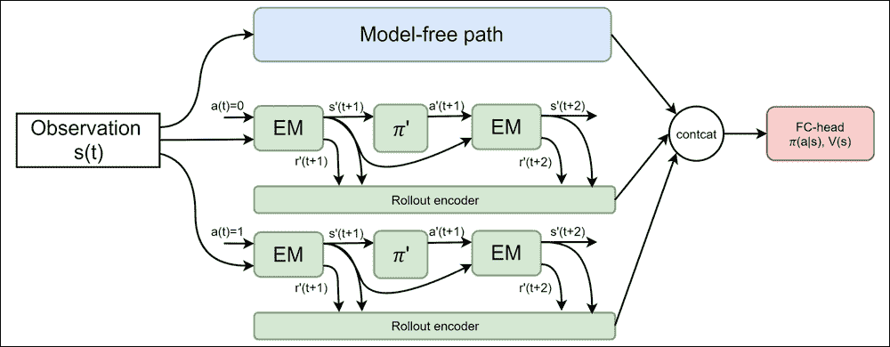
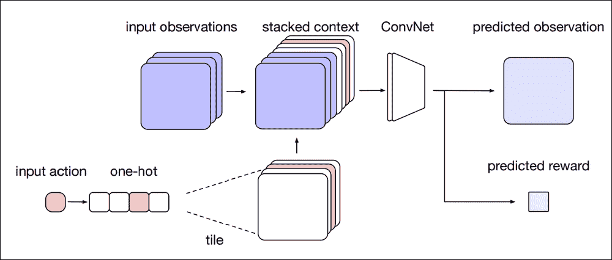
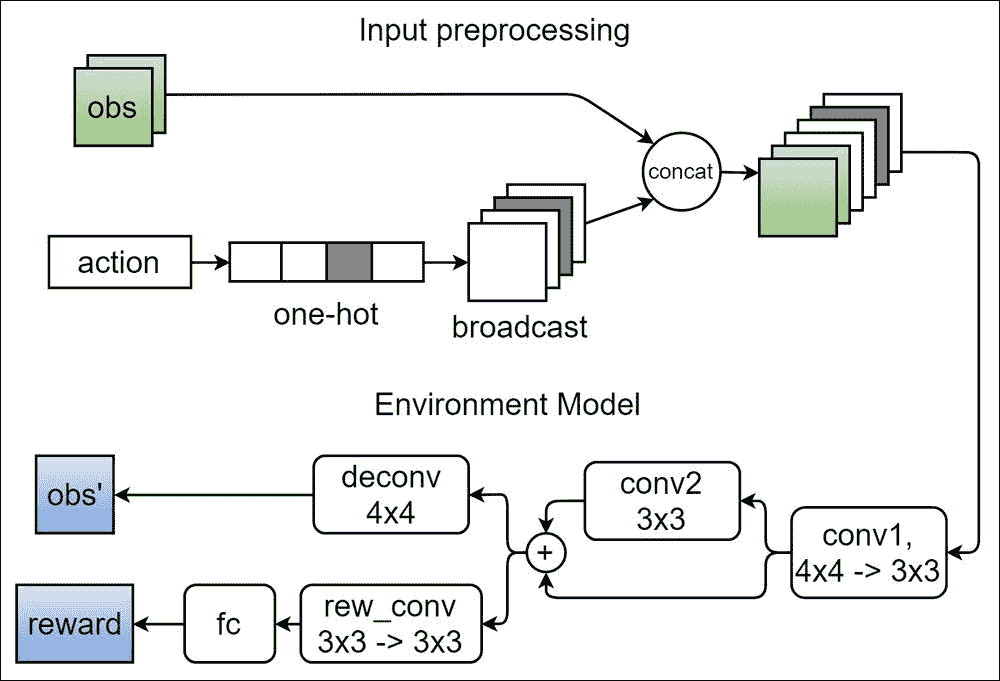
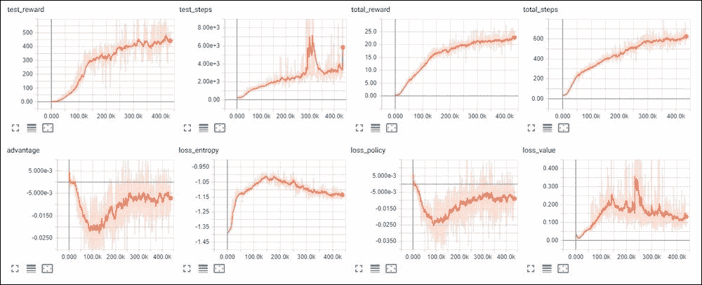
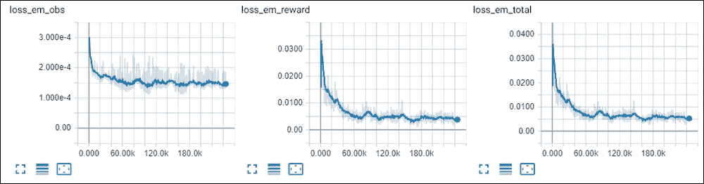
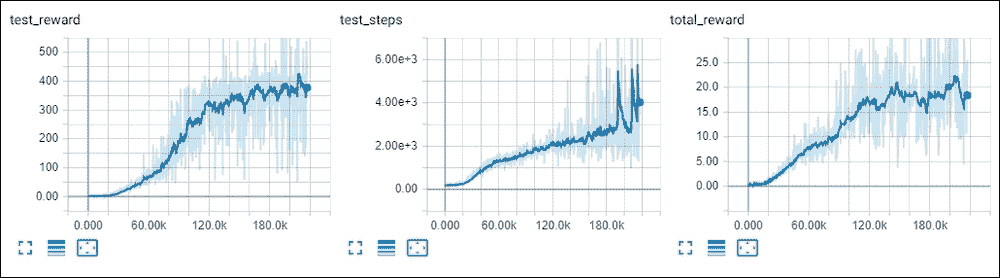
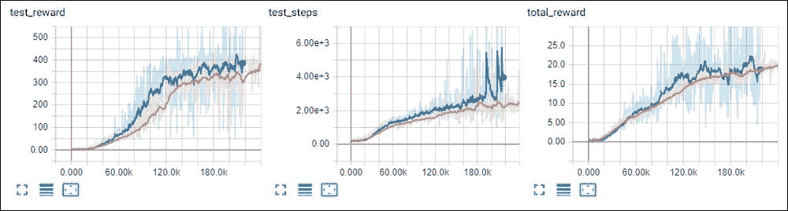

# 十七、超越无模型——想象力

在这一章中，我们将简要介绍一下**强化学习** ( **RL** )中基于模型的方法，并重新实现 DeepMind 模型，为代理增加想象力。基于模型的方法允许我们通过建立环境模型并在训练中使用它来减少与环境的通信量。


# 基于模型与无模型

在[第 4 章](part0030_split_000.html#SJGS1-ce551566b6304db290b61e4d70de52ee "Chapter 4. The Cross-Entropy Method")、*交叉熵方法*中的*RL 方法分类*部分，我们看到了可以对 RL 方法进行分类的几个不同的角度。我们区分了三个主要方面:

*   基于价值和基于策略
*   策略内和策略外
*   无模型和基于模型

第一类和第二类方法都有足够多的例子，但是到目前为止我们看到的所有方法都是 100%无模型的。这并不意味着无模型方法比基于模型的方法更重要或更好。历史上，由于其采样效率，基于模型的方法已被用于机器人领域和其他工业控制。这是由于硬件的成本和可以从真实机器人获得的样本的物理限制。具有大量自由度的机器人不是广泛可及的，因此 RL 研究人员更专注于计算机游戏和其他样本相对便宜的环境。然而，来自机器人的想法正在渗透，所以，谁知道呢，也许基于模型的方法将很快成为焦点。现在，让我们从头开始，了解区别在哪里。

在这两个类别的名称中，“模型”意味着环境的模型，它可以有各种形式，例如，为我们提供一种新的状态和来自当前状态和行动的回报。到目前为止，我们所看到的所有方法都没有在预测、理解或模拟环境方面付出任何努力。我们感兴趣的是适当的行为(就最终奖励而言)，直接指定(一项策略)或间接指定(一种价值)，给定观察。观察和奖励的来源是环境本身，在某些情况下可能非常缓慢和低效。

在基于模型的方法中，我们试图学习环境的模型，以减少对“真实环境”的依赖。如果我们有一个精确的环境模型，我们的智能体可以简单地通过使用这个模型而不是在现实世界中执行动作来产生它需要的任意数量的轨迹。在某种程度上，RL 研究的公共操场也只是真实世界的模型，例如，Mujoco 或 PyBullet 是物理模拟器，用于避免构建具有真实致动器、传感器和摄像机的真实机器人来训练我们的代理。雅达利游戏或 TORCS 赛车模拟器的情况也是如此:我们使用计算机程序来模拟一些过程，这些模型可以快速而廉价地执行。甚至我们的横竿例子也是一个过分简化的真实的附有棍子的手推车的近似(顺便说一下，在 PyBullet 和 Mujoco 中有更真实的横竿版本，具有 3D 动作和更精确的模拟)。

关于无模型，使用基于模型的方法有两个动机。第一个也是最重要的一个是由于对真实环境的依赖性降低而导致的样本效率。理想情况下，通过拥有一个精确的模型，我们可以避免接触真实世界，只使用经过训练的模型。在实际应用中，几乎不可能有精确的环境模型，但即使是不完美的模型也能显著减少所需样本的数量。例如，在现实生活中，你不需要某个动作(比如系鞋带或过马路)的绝对精确的脑海画面，但这个画面有助于你计划和预测结果。基于模型的方法的第二个原因是环境模型跨目标的可移植性。如果你有一个机器人机械手的好模型，你可以在各种各样的目标中使用它，而不用从头开始重新训练一切。

在这类方法中有很多细节，但本章的目标是给你一个概述，并仔细看看一篇特定的研究论文，它试图以一种复杂的方式将无模型和基于模型的方法结合起来。


# 模型缺陷

这里基于模型的方法有一个严重的问题:当我们的模型出错或者只是在某些环境中不准确时，从这个模型中学到的策略在现实生活中可能是完全错误的。为了解决这个问题，我们有几个选择。最明显的选择是“让模型变得更好。”不幸的是，这只能意味着我们需要从环境中进行更多的观察，而这正是我们试图避免的。环境的行为越复杂和非线性，对其进行适当建模的情况就越糟糕。

已经发现了几种方法来解决这个问题，例如，*本地模型*系列方法，当我们用一个小型的基于制度的模型集替换一个大型环境模型，并使用信任区域技巧训练它们，就像**T****rust Region Policy Optimization**(**TRPO**所做的那样。看待环境模型的另一个有趣的方式是用基于模型的路径来扩充无模型策略。在这种情况下，我们并不试图建立最佳的环境模型，而只是给我们的代理提供额外的信息，让它自己决定这些信息在培训中是否有用。

DeepMind 在他们的系统 UNREAL 中朝着这个方向迈出了第一步，该系统由 *Max Jaderberg* 、 *Volodymyr Mnih* 、*和其他人*在 2016 年发表的论文*中描述(arXiv:1611.05397) [1]。在本文中，作者用在正常训练期间以无监督方式学习的额外任务来扩充**异步优势演员评论家** ( **A3C** )代理。代理的主要测试是在一个部分可观察的第一人称视角迷宫导航问题中进行的，当代理需要通过类似末日的迷宫获得收集东西或执行其他动作的奖励时。这篇论文的新方法是人为地注入额外的辅助任务，这些任务与通常的 RL 方法的价值目标或折扣奖励无关。这些任务是在无人监督的情况下通过观察进行训练的，包括以下内容:*

*   **即时回报预测**:根据观察的历史，要求代理预测当前步骤的即时回报
*   **像素控制**:代理被要求与环境交流，以最大化其视图的变化
*   特征控制:代理正在学习如何改变其内部表现的特定特征

这些任务与主要代理人最大化总回报的目标没有直接关系，但它们允许代理人获得更好的低级特征表征，并允许虚幻获得更好的结果。即时回报预测的第一个任务可以被视为一个微小的环境模型，旨在预测回报。我不打算详细讲述虚幻的架构，但推荐你阅读原文。

我们将在本章详细介绍的论文也是由 DeepMind 的研究人员发表的:*塞奥芬·韦伯*、*塞巴斯蒂安·拉坎蒂尔*、*等人、*称为*深度强化学习的想象力增强代理* (arXiv:1707.06203) [2]。在论文中，作者用所谓的“想象力模块”扩展了标准 A3C 代理的无模型路径，这为代理做出有关行动的决策提供了额外的帮助。


# 想象力增强的代理人

被称为**想象力增强代理** ( **I2A** )的新架构的总体思想是允许代理通过当前的观察来想象未来的轨迹，并将这些想象的路径纳入其决策过程。下图显示了高级架构:



图 1: 12A 架构

代理由两个不同的路径组成，用于转换输入观察值:无模型和想象。无模型是一组标准的卷积层，用于在高级特征中转换输入图像。另一条路径称为**想象**，由一组从当前观察“想象”的轨迹组成。轨迹称为卷展栏，是为环境中的每个可用动作生成的。每一次展示都由固定数量的未来步骤组成，每一步都有一个特殊的模型，称为**环境模型** ( **EM** )(但不要与期望最大化方法相混淆)，从当前的观察和要采取的行动中产生下一次观察和预测的直接回报。

每个动作的每个卷展栏都是通过将当前观察值输入 EM，然后将预测的观察值再次输入 EM N 次而产生的。在部署的第一步，我们知道动作(因为这是为其生成部署的动作)，但是在后续步骤中，使用小的“部署策略网络”选择动作，该网络与主代理一起训练。展示的输出是从给定动作开始并根据学习到的展示策略持续到未来的 *N* 步想象轨迹。首次展示的每一步都是想象的观察和预测的直接回报。单个卷展栏中的所有步骤都被传递到另一个名为“卷展栏编码器”的网络，该网络将它们编码为固定大小的向量。

对于每一次部署，我们获得这些向量，将它们连接在一起，并将其提供给代理的负责人，代理负责人会为 A2C 算法生成通常的策略和值估计。正如您所看到的，这里有一些移动的部分，所以我尝试在下图中为环境中的两个卷展步骤和两个动作的情况可视化它们。在接下来的小节中，我们将详细描述该方法执行的每个网络和步骤。



图 2:想象路径架构


## 环境模型

环境模型的目标是将当前的观察和行动转化为下一次的观察和即时的回报。在论文[2]中，作者在两种环境下测试了 I2A 模型:推箱子谜题和 MiniPacman 街机游戏。在这两种情况下，观察值都是像素，所以环境模型也返回像素，加上奖励的浮点值。为了将动作合并到卷积层中，动作被一键编码和广播以匹配观察像素，每个动作一个色彩平面。下图说明了这种转换:



图 3:EM 结构

有几种可能的方法可以训练这个环境模型。作者发现，通过使用另一个部分训练的基线代理作为环境样本源来预训练环境模型，可以获得最快的收敛。


## 首次展示策略

在展示步骤中，我们需要决定在我们想象的轨迹中要采取的行动。第一步的动作是显式设置的，因为我们为每个动作生成单独的展示轨迹，但后续步骤需要有人做出决定。理想情况下，我们希望这些行动类似于我们代理的策略，但我们不能只要求我们的代理产生概率，因为这将需要在想象路径中创建展开。为了打破这种束缚，一个独立的“推广策略”网络被训练来产生与我们的主要代理的策略相似的输出。推广策略是一个小型网络，具有类似于 A3C 的体系结构，使用推广策略网络输出和主网络输出之间的交叉熵损失，与主 I2A 网络并行训练。在本文中，这种培训过程被称为“策略升华”


## 编码器卷展栏

I2A 模型的最后一个组件是卷展编码器，它将卷展步骤(观察和奖励对)作为输入，并产生固定大小的向量，该向量嵌入了关于卷展的信息。在这个网络中，每个卷展步骤都用一个小的卷积网络进行预处理，以从观测值中提取特征，这些特征通过 LSTM 网络转换成一个固定大小的向量。

每个展示的输出与无模型路径的特征连接在一起，并用于以与 A2C 方法相同的方式产生策略和价值估计。


## 论文成绩

如上所述，为了检查 RL 问题中想象力的作用，作者使用了两种需要对未来进行规划和决策的环境:随机生成的推箱子谜题和迷你吃豆人游戏。在这两种环境中，想象力的架构显示出比基线 A2C 代理更好的结果。

在本章的其余部分，我们将把这个模型应用到 Atari 突围游戏中，并亲自检验其效果。


# 雅达利突破时的 I2A

I2A 的代码和训练路径有点复杂，包括许多代码和几个步骤。为了更好地理解它，我们先来做一个简单的概述。在这个例子中，我们将实现论文中描述的 I2A 架构，采用 Atari 环境，并在突破游戏上测试它。总体目标是检查培训动态和想象力增强对最终策略的影响。

我们的示例包括三个部分，分别对应于培训中的不同步骤:

1.  基线 A2C 特工在`Chapter17/01_a2c.py`。所产生的策略用于获得环境模型的观察结果。
2.  `Chapter17/02_imag.py`中的环境模型训练。它使用上一步获得的模型以无监督的方式训练 EM。结果是 EM 权重。
3.  最后的 I2A 特工训练在`Chapter17/03_i2a.py`进行。在这一步中，我们使用第 2 步中的 EM 来训练一个完整的 I2A 代理，它结合了无模型和部署路径。

由于代码的大小，我们不打算在这里描述整个代码，而是集中在重要的部分。


## 基线 A2C 代理

培训的第一步有两个目标:建立基线，用于评估 I2A 代理并获得 EM 步骤的策略。根据从环境中获得的元组( *s* ， *a* ，*s’*， *r* )以无监督的方式训练 EM。因此，EM 的最终质量在很大程度上取决于它被训练的数据。观察结果越接近代理在实际行动中所经历的数据，最终结果就越好。

代码在`Chapter17/01_a2c.py`和`Chapter17/lib/common.py`中，是我们已经见过几次的标准 A2C 算法。为了使训练数据生成过程在 I2A agent 训练中可重用，我没有使用 PTAN 库类，而是从头重新实现了数据生成，它在`common.iterate_batches() function`中，负责从环境中收集观察数据，并为经验轨迹计算折扣奖励。这个代理的所有超参数都设置得非常接近 OpenAI 基线 A2C 实现，这是我在代理的调试和实现过程中使用的。唯一的不同是初始权重的初始化(我依赖于标准的 PyTorch 权重初始化)和学习速率从 7e-4 降低到 1e-4 以提高训练过程的稳定性。

对于每 1000 批训练，执行对当前策略的测试，该测试包括由代理人扮演的三个完整集和五个生命。记录平均奖励和步数，并在每次达到新的最佳训练奖励时保存模型。测试环境的配置在两个方面不同于训练期间使用的环境:首先，测试环境播放完整的剧集，而不是每个生命的剧集，因此测试剧集的最终奖励高于训练期间的奖励。第二个不同之处是测试环境使用未剪辑的奖励来使测试数字可解释。削波是提高 Atari 训练稳定性的标准方法，因为在一些游戏中，原始分数可能有很大的幅度，这对估计的优势方差有负面影响。

与经典的雅达利 A2C 代理的另一个区别是作为观察给出的帧数。通常，给出四个结果帧，但是从我的实验中，我发现突围游戏在仅仅两个帧上有非常相似的收敛。处理两个帧更快，因此在这个例子中的任何地方，观察张量都具有维度(`2`、`84`、`84`)。

为了使训练可重复，在基线代理中使用固定的随机种子。这由`common.set_seed`函数完成，它为 NumPy、Torch(CPU 和 CUDA)以及池中的每个环境设置随机种子。


## EM 培训

EM 根据基线代理生成的数据进行训练，您可以指定在之前步骤中保存的任何重量文件。它不一定是最好的模型，因为它只需要“足够好”以产生相关的观察结果。

EM 定义在`Chapter17/lib/i2a.py`、`EnvironmentModel class`中，其架构主要遵循论文[2]中提出的 Sokoban 环境的模型。模型的输入是伴随要采取的动作的观察张量，作为整数值传递。该动作被一键编码并广播到观察张量维度。然后，广播的动作和观察沿着“通道”维度连接，给出输入张量(`6`、`84`、`84`)，因为突围有四个动作。

这个张量用 4 × 4 和 3 × 3 的两个卷积层处理，然后当输出用 3 × 3 卷积处理时使用剩余层，卷积的结果加到输入上。得到的张量被送入两条路径:一条是反卷积，产生输出观测值，另一条是回报预测路径，由两个卷积层和两个完全连接的层组成。

EM 有两个输出:即时奖励值(单个浮点值)和下一个观察值。为了减少观察的维度，预测与最后观察的差异。所以，输出是一个张量(`1`、`84`、`84`)。除了我们需要预测的值的数量减少之外，这种差异还有一个好处，即当什么都没有改变时，帧的值为零，这将在突围游戏中占主导地位，此时通常只有几个像素在帧与帧之间发生变化(球、球拍和被击中的砖块)。EM 的架构和代码如下图所示:



图 4: EM 架构及其输入预处理

EM 的训练过程简单明了。16 个平行环境的池用于填充 64 个样本的批次。一批中的每个条目都由当前观察、下一个即时观察、采取的行动和获得的即时奖励组成。被优化的最终损失是观察损失和奖励损失之和。观测损失是下一次观测的预测增量和当前与下一次观测的真实增量之间的**均方误差** ( **MSE** )损失。奖励损失也是奖励之间的 MSE。为了强调观察的重要性，观察损失的比例因子为 10。

```
EM_OUT_SHAPE = (1, ) + common.IMG_SHAPE[1:]

class EnvironmentModel(nn.Module):
    def __init__(self, input_shape, n_actions):
        super(EnvironmentModel, self).__init__()

        self.input_shape = input_shape
        self.n_actions = n_actions

        # input color planes will be equal to frames plus one-hot encoded actions
        n_planes = input_shape[0] + n_actions
        self.conv1 = nn.Sequential(
            nn.Conv2d(n_planes, 64, kernel_size=4, stride=4, padding=1),
            nn.ReLU(),
            nn.Conv2d(64, 64, kernel_size=3, padding=1),
            nn.ReLU(),
        )
        self.conv2 = nn.Sequential(
            nn.Conv2d(64, 64, kernel_size=3, padding=1),
            nn.ReLU()
        )
        # output is one single frame with delta from the current frame
        self.deconv = nn.ConvTranspose2d(64, 1, kernel_size=4, stride=4, padding=0)

        self.reward_conv = nn.Sequential(
            nn.Conv2d(64, 64, kernel_size=3),
            nn.MaxPool2d(2),
            nn.ReLU(),
            nn.Conv2d(64, 64, kernel_size=3),
            nn.MaxPool2d(2),
            nn.ReLU()
        )

        rw_conv_out = self._get_reward_conv_out((n_planes, ) + input_shape[1:])
        self.reward_fc = nn.Sequential(
            nn.Linear(rw_conv_out, 128),
            nn.ReLU(),
            nn.Linear(128, 1)
        )

    def _get_reward_conv_out(self, shape):
        o = self.conv1(torch.zeros(1, *shape))
        o = self.reward_conv(o)
        return int(np.prod(o.size()))

    def forward(self, imgs, actions):
        batch_size = actions.size()[0]
        act_planes_v = torch.FloatTensor(batch_size, self.n_actions, *self.input_shape[1:]).zero_()
        act_planes_v = act_planes_v.to(actions.device)
        act_planes_v[range(batch_size), actions] = 1.0
        comb_input_v = torch.cat((imgs, act_planes_v), dim=1)
        c1_out = self.conv1(comb_input_v)
        c2_out = self.conv2(c1_out)
        c2_out += c1_out
        img_out = self.deconv(c2_out)
        rew_conv = self.reward_conv(c2_out).view(batch_size, -1)
        rew_out = self.reward_fc(rew_conv)
        return img_out, rew_out
```

想象力代理人


## 训练过程中的最后一步是 I2A 代理，它将无模型路径与 EM 产生的展开相结合，在前面的步骤中进行训练。

I2A 模式

### 代理是在`Chapter17/lib/i2a.py` 模块的`I2A`类中实现的:

构造函数的参数提供了观察的形状、环境中的动作数量，以及部署期间使用的两个网络:EM 和部署策略，最后是部署期间要执行的步骤数。EM 和部署策略网络都以特殊方式存储，以防止其权重包含在 I2A 网络参数中。

```
class I2A(nn.Module):
    def __init__(self, input_shape, n_actions, net_em, net_policy, rollout_steps):
        super(I2A, self).__init__()
```

前面的代码指定了无模型路径，该路径根据观察结果生成要素。该架构是一个熟悉的雅达利卷积。

```
        self.n_actions = n_actions
        self.rollout_steps = rollout_steps

        self.conv = nn.Sequential(
            nn.Conv2d(input_shape[0], 32, kernel_size=8, stride=4),
            nn.ReLU(),
            nn.Conv2d(32, 64, kernel_size=4, stride=2),
            nn.ReLU(),
            nn.Conv2d(64, 64, kernel_size=3, stride=1),
            nn.ReLU(),
        )
```

将产生策略和代理值的层的输入与从无模型路径和编码展开中获得的特征相结合。每个卷展栏都用`ROLLOUT_HIDDEN`常量(等于 256)表示，这是`RolloutEncoder`类中 LSTM 层的维度。

```
        conv_out_size = self._get_conv_out(input_shape)
        fc_input = conv_out_size + ROLLOUT_HIDDEN * n_actions
        self.fc = nn.Sequential(
            nn.Linear(fc_input, 512),
            nn.ReLU()
        )
        self.policy = nn.Linear(512, n_actions)
        self.value = nn.Linear(512, 1)
```

构造函数的其余部分创建`RolloutEncoder`类(将在本节稍后描述)并存储 EM 和部署策略网络。这两个网络不应该与 I2A 代理一起训练，因为 EM 根本没有经过训练(它是在前面的步骤中预先训练的，并且保持固定),而展示策略是通过单独的策略提炼过程训练的。然而，PyTorch 的`Module`类会自动注册并加入分配给该类的所有字段。为了防止 EM 和 rollout 策略网络被合并到 I2A 代理中，我们通过`__setattr__`调用来保存它们的引用，这有点不太好，但确实是我们需要的。

```
        self.encoder = RolloutEncoder(EM_OUT_SHAPE)
        self.action_selector = ptan.actions.ProbabilityActionSelector()
        object.__setattr__(self, "net_em", net_em)
        object.__setattr__(self, "net_policy", net_policy)
```

`forward()`函数看起来很简单，因为这里的大部分工作都在`rollouts_batch()`方法内部。I2A 类的下一个也是最后一个方法有点复杂。最初，它被编写为顺序执行所有的部署，但是那个版本非常慢。新版本的代码一步一步地一次执行所有部署，将速度提高了近五倍，但代码稍微复杂了一些:

```
    def _get_conv_out(self, shape):
        o = self.conv(torch.zeros(1, *shape))
        return int(np.prod(o.size()))

    def forward(self, x):
        fx = x.float() / 255
        enc_rollouts = self.rollouts_batch(fx)
        conv_out = self.conv(fx).view(fx.size()[0], -1)
        fc_in = torch.cat((conv_out, enc_rollouts), dim=1)
        fc_out = self.fc(fc_in)
        return self.policy(fc_out), self.value(fc_out)
```

在函数的开头，我们获取一批观察值，并希望为该批的每个观察值执行`n_actions`展开。所以，我们需要扩大观察批次，重复每一次观察`n_actions`次。最有效的方法是使用 PyTorch `expand()`方法，它可以重复任何一维张量，并沿着这个维度重复任意次。如果我们的批处理只包含一个例子，我们就使用这个批处理维，否则我们需要在批处理维之后注入额外的单元维，然后沿着它扩展。无论如何，`obs_batch_v`张量的最终维数是(`batch_size * n_actions, 2, 84, 84`)。

```
    def rollouts_batch(self, batch):
        batch_size = batch.size()[0]
        batch_rest = batch.size()[1:]
        if batch_size == 1:
            obs_batch_v = batch.expand(batch_size * self.n_actions, *batch_rest)
        else:
            obs_batch_v = batch.unsqueeze(1)
            obs_batch_v = obs_batch_v.expand(batch_size, self.n_actions, *batch_rest)
            obs_batch_v = obs_batch_v.contiguous().view(-1, 
*batch_rest)
```

之后，我们需要用我们希望 EM 对每个观察采取的动作来准备数组。当我们重复每一次观察`n_actions`时，我们的动作数组也将具有形式`[0, 1, 2, 3, 0, 1, 2, 3, ...]`(突破总共有四个动作)。在`step_obs`和`step_rewards`列表中，我们将保存 EM 模型对每个展示步骤产生的观察和即时奖励。该数据将被传递到`RolloutEncoder`以嵌入固定向量形式。

```
        actions = np.tile(np.arange(0, self.n_actions, dtype=np.int64), batch_size)
        step_obs, step_rewards = [], []
```

然后我们开始每一步的循环。对于每一步，我们要求 EM 网络预测下一个观察值(作为当前观察值的增量返回)和即时奖励。后续步骤将使用展开策略网络选择动作。

```
        for step_idx in range(self.rollout_steps):
            actions_t = torch.tensor(actions).to(batch.device)
            obs_next_v, reward_v = self.net_em(obs_batch_v, actions_t)
```

我们为`RolloutEncoder`在列表中存储观察增量和即时奖励，如果我们处于最后的展示步骤，则停止循环。早期停止是可能的，因为循环中的其余代码应该选择动作，但是对于最后一步，我们根本不需要动作。

```
            step_obs.append(obs_next_v.detach())
            step_rewards.append(reward_v.detach())
            # don't need actions for the last step
            if step_idx == self.rollout_steps-1:
                break
```

为了能够使用部署策略网络，我们需要从 EM 网络返回的增量中创建一个法线观察张量。为此，我们从当前观察中取出最后一个通道，将来自 EM 的增量添加到其中，创建一个预测帧，然后将它们组合成形状的正常观察张量，`(batch_size * n_actions, 2, 84, 84)`。

```
            # combine the delta from EM into new observation
            cur_plane_v = obs_batch_v[:, 1:2]
            new_plane_v = cur_plane_v + obs_next_v
            obs_batch_v = torch.cat((cur_plane_v, new_plane_v), dim=1)
```

在循环的其余部分，我们使用创建的观察批次来选择使用部署策略网络的动作，并将返回的概率分布转换为动作指数。然后循环继续预测下一个展示步骤。

```
            # select actions
            logits_v, _ = self.net_policy(obs_batch_v)
            probs_v = F.softmax(logits_v, dim=1)
            probs = probs_v.data.cpu().numpy()
            actions = self.action_selector(probs)
```

当我们完成所有步骤后，两个列表`step_obs`和`step_rewards`将包含每步的张量。使用`torch.stack()`函数，我们在新的维度上加入它们。产生的张量将有第一维的展示步骤和第二维的`batch_size * n_actions`。这两个张量被传递给`RolloutEncoder`，它为第二维中的每个条目生成一个编码向量。编码器的输出是一个张量`(batch_size*n_actions, encoded_len)`，我们希望将同一批样本的不同动作的编码连接在一起。要做到这一点，我们只需将输出张量整形为第一维度`batch_size`，因此函数的输出将具有`(batch_size, encoded_len*n_actions)`形状。

```
        step_obs_v = torch.stack(step_obs)
        step_rewards_v = torch.stack(step_rewards)
        flat_enc_v = self.encoder(step_obs_v, step_rewards_v)
        return flat_enc_v.view(batch_size, -1)
```

编码器卷展栏

### `RolloutEncoder`类接受两个张量:观察值`(rollout_steps, batch_size, 1, 84, 84)`和奖励值`(rollout_steps, batch_size)`，并沿着展示步骤应用a**R**t【19】e current 神经网络 ( **RNN** )将每一批序列转换成编码向量。在 RNN 之前，我们有一个预处理器，它从 EM 给出的观察增量中提取特征，然后将奖励值附加到特征向量上。

观察预处理器具有相同的 Atari 卷积层，除了输入张量具有单通道，这是由 EM 产生的连续观察之间的增量。

```
class RolloutEncoder(nn.Module):
    def __init__(self, input_shape, hidden_size=ROLLOUT_HIDDEN):
        super(RolloutEncoder, self).__init__()

        self.conv = nn.Sequential(
            nn.Conv2d(input_shape[0], 32, kernel_size=8, stride=4),
            nn.ReLU(),
            nn.Conv2d(32, 64, kernel_size=4, stride=2),
            nn.ReLU(),
            nn.Conv2d(64, 64, kernel_size=3, stride=1),
            nn.ReLU(),
        )
```

编码器的 RNN 是一个 LSTM 层。`batch_first=False`参数有点多余(因为该参数的默认值也是`False`)，但留在这里是为了提醒我们输入张量的顺序，它是一个`(rollout_steps, batch_size, conv_features+1)`，所以时间维度的索引为零。

```
        conv_out_size = self._get_conv_out(input_shape)

        self.rnn = nn.LSTM(input_size=conv_out_size+1, hidden_size=hidden_size, batch_first=False)
```

从编码器架构来看，`forward()`函数是显而易见的，它首先从所有`rollout_steps*batch_size`观测值中提取特征，然后将 LSTM 应用于序列。作为卷展栏的编码向量，我们采用 RNN 的最后一步返回的隐藏状态。

```
    def _get_conv_out(self, shape):
        o = self.conv(torch.zeros(1, *shape))
        return int(np.prod(o.size()))

    def forward(self, obs_v, reward_v):
        """
        Input is in (time, batch, *) order
        """
        n_time = obs_v.size()[0]
        n_batch = obs_v.size()[1]
        n_items = n_time * n_batch
        obs_flat_v = obs_v.view(n_items, *obs_v.size()[2:])
        conv_out = self.conv(obs_flat_v)
        conv_out = conv_out.view(n_time, n_batch, -1)
        rnn_in = torch.cat((conv_out, reward_v), dim=2)
        _, (rnn_hid, _) = self.rnn(rnn_in)
        return rnn_hid.view(-1)
```

I2A 的训练

### 训练过程有两个步骤:我们以通常的 A2C 方式训练 I2A 模型，并使用单独的损失对首次展示策略进行提炼。蒸馏训练需要通过在展示步骤中使用的较小策略来近似 I2A 行为，以选择行动。在想象的轨迹中选择的行动应该与代理人在真实情况下选择的行动相似。然而，在部署期间，我们不能仅仅使用我们的主 I2A 模型来进行动作选择，因为主 I2A 模型将需要再次进行部署。为了打破这个矛盾，使用了蒸馏，这是一个非常简单的训练期间主 I2A 模型的策略和 rollout 策略网络返回的策略之间的交叉熵损失。这个训练步骤有一个单独的优化器，只负责部署策略参数。

下面给出了负责蒸馏的训练循环部分。数组`mb_probs`包含 I2A 模型为观察选择的动作的概率，`obs_v`。

训练中的另一个步骤是训练 I2A 模型，其执行方式与我们训练通常的 A2C 完全相同，忽略了 I2A 模型的所有内部因素:价值损失是预测和贴现回报之间的 MSE，由贝尔曼方程近似，而的**策略梯度** ( **PG** )由优势乘以所选行动的对数概率近似。这不是什么新鲜事。

```
            probs_v = torch.FloatTensor(mb_probs)).to(device)
            policy_opt.zero_grad()
            logits_v, _ = net_policy(obs_v)
            policy_loss_v = -F.log_softmax(logits_v, dim=1) * probs_v.view_as(logits_v)
            policy_loss_v = policy_loss_v.sum(dim=1).mean()
            policy_loss_v.backward()
            policy_opt.step()
```

实验结果


# 在这一部分，我们将看看多步训练过程的结果

基线代理


## 为了训练代理，使用可选的`--cuda`标志运行`Chapter17/01_a2c.py`以启用 GPU，并使用 TensorBoard 中使用的实验名称和保存模型的目录名称运行必需的`-n`选项。

在 50 万次训练迭代中，A2C 能够在有五条生命和未剪辑奖励的测试集上达到 450 的平均奖励。三集测试的最高奖励是 650 英镑。

```
Chapter17$ ./01_a2c.py --cuda -n tt
AtariA2C (
  (conv): Sequential (
    (0): Conv2d(2, 32, kernel_size=(8, 8), stride=(4, 4))
    (1): ReLU ()
    (2): Conv2d(32, 64, kernel_size=(4, 4), stride=(2, 2))
    (3): ReLU ()
    (4): Conv2d(64, 64, kernel_size=(3, 3), stride=(1, 1))
    (5): ReLU ()
  )
  (fc): Sequential (
    (0): Linear (3136 -> 512)
    (1): ReLU ()
  )
  (policy): Linear (512 -> 4)
  (value): Linear (512 -> 1)
)
4: done 13 episodes, mean_reward=0.00, best_reward=0.00, speed=99.96
9: done 11 episodes, mean_reward=0.00, best_reward=0.00, speed=133.25
10: done 1 episodes, mean_reward=1.00, best_reward=1.00, speed=136.62
13: done 9 episodes, mean_reward=0.00, best_reward=1.00, speed=153.99
…
```

图 5:基线收敛



Figure 5: Baseline convergence

训练 EM 重量


## 为了训练 EM，您需要指定在基线代理训练期间产生的策略。在我的实验中，我采用了部分训练的代理的策略来增加 EM 训练数据的潜在多样性。

在 100k 次训练迭代中，损失停止下降，损失最小的 EM 模型可用于 I2A 模型的最终训练。

```
Chapter17$ ./02_imag.py --cuda -m res/best/01_a2c_clip/best_0342.333_119000.dat -n tt
EnvironmentModel (
  (conv1): Sequential (
    (0): Conv2d(6, 64, kernel_size=(4, 4), stride=(4, 4), padding=(1, 1))
    (1): ReLU ()
    (2): Conv2d(64, 64, kernel_size=(3, 3), stride=(1, 1), padding=(1, 1))
    (3): ReLU ()
  )
  (conv2): Sequential (
    (0): Conv2d(64, 64, kernel_size=(3, 3), stride=(1, 1), padding=(1, 1))
    (1): ReLU ()
  )
  (deconv): ConvTranspose2d(64, 1, kernel_size=(4, 4), stride=(4, 4))
  (reward_conv): Sequential (
    (0): Conv2d(64, 64, kernel_size=(3, 3), stride=(1, 1))
    (1): MaxPool2d (size=(2, 2), stride=(2, 2), dilation=(1, 1))
    (2): ReLU ()
    (3): Conv2d(64, 64, kernel_size=(3, 3), stride=(1, 1))
    (4): MaxPool2d (size=(2, 2), stride=(2, 2), dilation=(1, 1))
    (5): ReLU ()
  )
  (reward_fc): Sequential (
    (0): Linear (576 -> 128)
    (1): ReLU ()
    (2): Linear (128 -> 1)
  )
)
Best loss updated: inf -> 1.7988e-02
Best loss updated: 1.7988e-02 -> 1.1621e-02
Best loss updated: 1.1621e-02 -> 9.8923e-03
Best loss updated: 9.8923e-03 -> 8.6424e-03
...
```

图 6: EM 培训



Figure 6: EM training

用 I2A 模型训练


## 想象路径伴随着巨大的计算成本，这与执行的展示步骤的数量成比例。我试验了这个超参数的几个值，对于突破来说，五步和三步之间没有太大的区别，但是速度几乎快了两倍。

在 200k 训练步骤中，I2A 能够在测试中达到 400 的平均奖励，这显示了比基线更好的动态。三集测试的最高奖励是 750 英镑，也比基线测试的 650 英镑要好。

```
Chapter17$ ./03_i2a.py --cuda --em res/best/02_env_larger-batch\=64/best_6.9029e-04_106904.dat -n tt
I2A (
  (conv): Sequential (
    (0): Conv2d(2, 32, kernel_size=(8, 8), stride=(4, 4))
    (1): ReLU ()
    (2): Conv2d(32, 64, kernel_size=(4, 4), stride=(2, 2))
    (3): ReLU ()
    (4): Conv2d(64, 64, kernel_size=(3, 3), stride=(1, 1))
    (5): ReLU ()
  )
  (fc): Sequential (
    (0): Linear (4160 -> 512)
    (1): ReLU ()
  )
  (policy): Linear (512 -> 4)
  (value): Linear (512 -> 1)
  (encoder): RolloutEncoder (
    (conv): Sequential (
      (0): Conv2d(1, 32, kernel_size=(8, 8), stride=(4, 4))
      (1): ReLU ()
      (2): Conv2d(32, 64, kernel_size=(4, 4), stride=(2, 2))
      (3): ReLU ()
      (4): Conv2d(64, 64, kernel_size=(3, 3), stride=(1, 1))
      (5): ReLU ()
    )
    (rnn): LSTM(3137, 256)
  )
)
2: done 1 episodes, mean_reward=0.00, best_reward=0.00, speed=6.41 f/s
4: done 12 episodes, mean_reward=0.00, best_reward=0.00, speed=90.84 f/s
7: done 1 episodes, mean_reward=0.00, best_reward=0.00, speed=69.94 f/s
...
```

图 7: 12A 融合(奖励和步骤)



Figure 7: 12A convergence (rewards and steps)

下图显示了 I2A(蓝色)和基线 A2C(橙色)的测试回报:

图 8: 12A 与基线 A2C 的比较



Figure 8: 12A compared with the baseline A2C

我还对首次展示中的单个步骤进行了实验，令人惊讶的是，一个步骤和三个步骤之间的训练动态没有太大不同，这可能是一个迹象，即在突破中，代理不需要想象太长时间的轨迹就可以从 EM 中获得好处。这很有吸引力，因为对于单个步骤，我们根本不需要部署策略(因为第一步总是在所有操作上执行)，也不需要 RNN，这可以显著加快代理的速度，将其性能推至接近基线 A2C。

总结


# 在本章中，我们讨论了基于模型的 RL 方法，并实现了 DeepMind 的一个最新研究架构，该架构将环境模型扩展到无模型代理中。该模型试图将无模型和基于模型的路径结合成一个，以允许代理决定使用哪种知识。

在接下来的章节(这将是本书的最后一章)，我们将看看 DeepMind 最近在全信息游戏领域的突破:AlphaGo Zero 算法。

引用


# *由 *Max Jaderberg* 、 *Volodymyr Mnih* 等人进行的无监督辅助任务*强化学习，(arXiv:1611.05397)

1.  *深度强化学习的想象力增强代理*，作者 *Theophane Weber* 、 *Sebastien Racantiere* 等人，(arXiv:1707.06203)
2.  *Imagination-Augmented Agents for Deep Reinforcement Learning* by *Theophane Weber*, *Sebastien Racantiere*, and others, (arXiv:1707.06203)