# 六、揭秘卷积网络

**卷积神经网络**(**CNN**)是最常用的深度学习算法之一。它们广泛用于与图像相关的任务，如图像识别、对象检测、图像分割等。CNN 的应用是无止境的，从自动驾驶汽车的视觉供电到脸书图片中朋友的自动标记。尽管 CNN 广泛用于图像数据集，但它们也可以应用于文本数据集。

在这一章中，我们将详细了解 CNN，掌握 CNN 的窍门以及它们是如何工作的。首先，我们将直观地了解 CNN，然后我们将深入探究其背后的数学原理。接下来，我们将逐步了解如何在 TensorFlow 中实现 CNN。接下来，我们将探索不同类型的 CNN 架构，如 LeNet、AlexNet、VGGNet 和 GoogleNet。在本章的最后，我们将研究 CNN 的缺点以及如何使用胶囊网络来解决这些问题。此外，我们将学习如何使用 TensorFlow 构建胶囊网络。

在本章中，我们将探讨以下主题:

*   CNN 是什么？
*   CNN 背后的数学
*   在 TensorFlow 中实现 CNN
*   不同的 CNN 架构
*   胶囊网络
*   在 TensorFlow 中构建胶囊网络


# CNN 是什么？

CNN，也被称为 **ConvNet** ，是计算机视觉任务中使用最广泛的深度学习算法之一。假设我们正在执行一个图像识别任务。考虑下面的图像。我们想让我们的 CNN 认识到它包含了一匹马:


我们如何做到这一点？当我们将图像输入计算机时，它基本上将其转换成像素值的矩阵。像素值的范围从 0 到 255，这个矩阵的尺寸将是[ *图像*宽度 x *图像高度* x *通道数*。灰度图像有一个通道，彩色图像有三个通道**红、绿、蓝** ( **RGB** )。

假设我们有一个宽度为 11、高度为 11 的彩色输入图像，即 11×11，那么我们的矩阵维数将是*【11×11×3】*。在*【11 x 11 x 3】*中可以看到，11 x 11 代表图像的宽度和高度，3 代表通道号，因为我们有一个彩色图像。因此，我们将有一个三维矩阵。

但是很难将 3D 矩阵可视化，因此，为了便于理解，让我们考虑将灰度图像作为输入。由于灰度图像只有一个通道，我们将得到一个 2D 矩阵。

如下图所示，输入灰度图像将被转换为范围从 0 到 255 的像素值矩阵，像素值代表该点的像素强度:

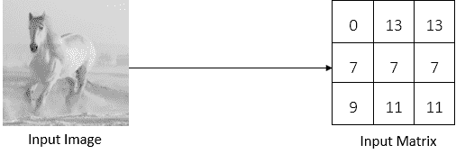

输入矩阵中给出的值只是我们理解的任意值。

好了，现在我们有了一个像素值的输入矩阵。接下来会发生什么？美国有线电视新闻网是如何理解图像包含一匹马的？CNN 由以下三个重要层组成:

*   卷积层
*   汇集层
*   完全连接的层

在这三层的帮助下，CNN 识别出图像包含一匹马。现在，我们将详细探讨每一层。


# 卷积层

卷积层是 CNN 的第一层，也是核心层。它是 CNN 的组成部分之一，用于从图像中提取重要特征。

我们有一匹马的图像。你认为有哪些特征可以帮助我们理解这是一匹马的图像？我们可以说身体结构、脸、腿、尾巴等等。但是 CNN 是如何理解这些特征的呢？这就是我们使用卷积运算从图像中提取马的所有重要特征的地方。所以，卷积运算有助于我们理解图像是怎么回事。

好吧，这个卷积运算到底是什么？它是如何执行的？它是如何提取重要特征的？我们来详细看看这个。

众所周知，每个输入图像都由像素值矩阵表示。除了输入矩阵，我们还有另一个矩阵叫做**滤波器矩阵**。过滤器矩阵也被称为**内核**，或简称为**过滤器**，如下图所示:


我们采用滤波器矩阵，将其在输入矩阵上滑动一个像素，执行逐元素乘法，对结果求和，并产生一个数字。这很令人困惑，不是吗？让我们借助下图更好地理解这一点:


正如您在前面的图表中看到的，我们将滤波器矩阵放在输入矩阵之上，执行元素乘法，将结果相加，并生成一个数字。这一点如下所示:

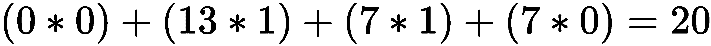

现在，我们将滤波器在输入矩阵上滑动一个像素，并执行相同的步骤，如下图所示:


这一点如下所示:

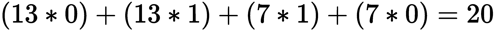

同样，我们将滤波器矩阵滑动一个像素，并执行相同的操作，如下图所示:

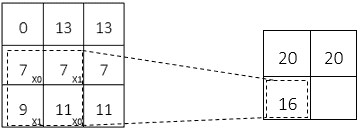

这一点如下所示:


现在，我们再次将滤波器矩阵在输入矩阵上滑动一个像素，并执行相同的操作，如下图所示:

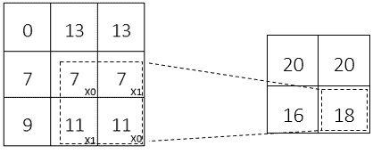

那就是:

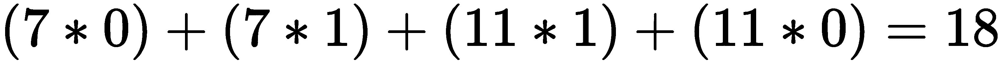

好吧。我们在这里做什么？我们基本上是将滤波器矩阵在整个输入矩阵上滑动一个像素，执行逐元素乘法并对其结果求和，这创建了一个新矩阵，称为**特征图**或**激活图**。这被称为**卷积运算**。

正如我们所了解的，卷积运算用于提取特征，新的矩阵，即特征映射，表示提取的特征。如果我们绘制特征图，那么我们可以看到通过卷积运算提取的特征。

下图显示了实际图像(输入图像)和卷积图像(特征图)。我们可以看到，我们的滤波器已经从实际图像中检测到边缘作为特征:

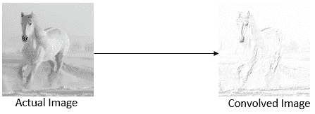

各种滤波器用于从图像中提取不同的特征。例如，如果我们使用一个锐化过滤器，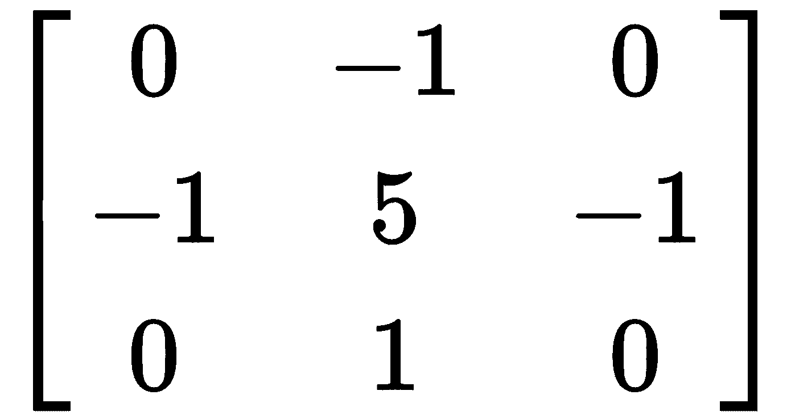，那么它将锐化我们的图像，如下图所示:

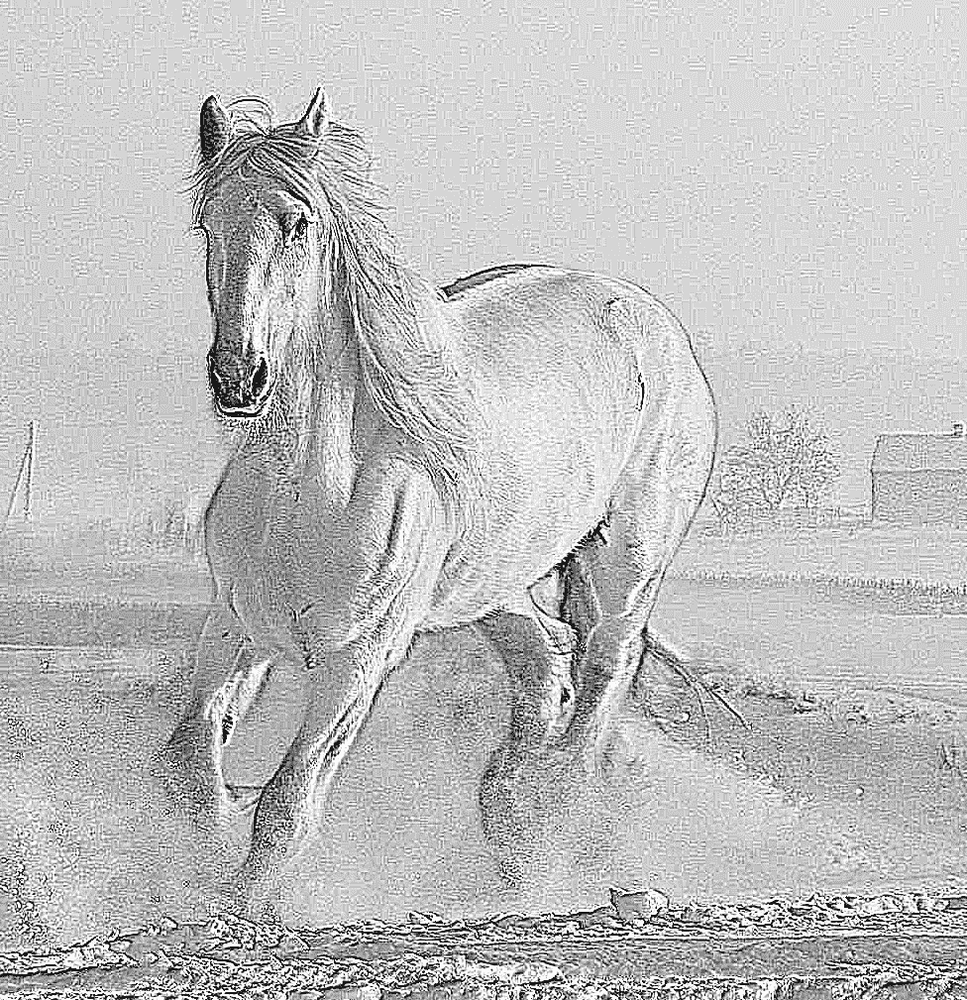

因此，我们已经知道，有了过滤器，我们可以使用卷积运算从图像中提取重要的特征。因此，我们可以使用多个过滤器从图像中提取不同的特征，而不是使用一个过滤器，并产生多个特征图。因此，特征图的深度将是过滤器的数量。如果我们使用七个过滤器从图像中提取不同的特征，那么我们的特征图的深度将是七:


好的，我们已经知道不同的过滤器从图像中提取不同的特征。但问题是，我们如何为滤波器矩阵设置正确的值，以便从图像中提取重要的特征？不要担心！我们只需随机初始化滤波矩阵，然后通过反向传播学习滤波矩阵的最优值，从而从图像中提取重要特征。然而，我们只需要指定过滤器的大小和我们想要使用的过滤器的数量。


# 大步

我们刚刚学习了卷积运算是如何工作的。我们将带有滤波器矩阵的输入矩阵滑动一个像素，并执行卷积运算。但是我们不能只在输入矩阵上滑动一个像素。我们也可以在输入矩阵上滑动任意数量的像素。

我们通过滤波器矩阵在输入矩阵上滑动的像素数量被称为**步幅**。

如果我们将步幅设置为 2，那么我们将在带有滤波器矩阵的输入矩阵上滑动两个像素。下图显示了步长为 2 的卷积运算:

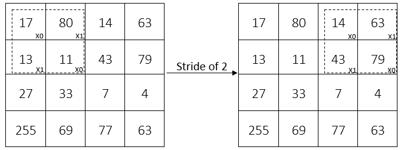

但是我们如何选择步幅呢？我们刚刚了解到，步幅是我们移动滤波器矩阵时所经过的像素数。因此，当步幅被设置为小数值时，我们可以对图像进行比步幅被设置为大数值时更详细的编码。然而，具有高值的步幅比具有低值的步幅需要更少的计算时间。


# 填料

通过卷积运算，我们使用滤波器矩阵在输入矩阵上滑动。但是在某些情况下，滤波器并不完全适合输入矩阵。我们这样说是什么意思？例如，假设我们正在执行步长为 2 的卷积运算。存在这样一种情况，当我们将滤波器矩阵移动两个像素时，它到达边界，并且滤波器矩阵不适合输入矩阵。也就是说，我们的滤波器矩阵的某些部分在输入矩阵之外，如下图所示:

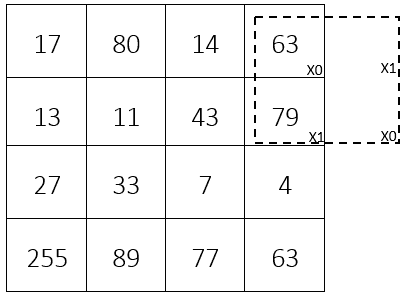

在这种情况下，我们执行填充。我们可以简单地用零填充输入矩阵，这样滤波器就可以适应输入矩阵，如下图所示。在输入矩阵上填充零被称为**相同填充**或**零填充**:


除了用零填充它们，我们还可以简单地丢弃滤波器不适合的输入矩阵区域。这被称为**有效填充**:


# 池层

好吧。现在，我们完成了卷积运算。作为卷积运算的结果，我们得到了一些特征图。但是特征地图的维数太大。为了减少特征图的维度，我们执行一个池操作。这减少了特征图的维度，并且仅保留必要的细节，从而可以减少计算量。

比如从图像中识别一匹马，我们需要提取并只保留马的特征；我们可以简单地丢弃不想要的特征，比如图像的背景等等。汇集操作也称为**下采样**或**子采样**操作，它使 CNN 平移不变。因此，池层通过仅保留重要的要素来减少空间维度。

汇集操作不会改变特征地图的深度；只会影响高度和宽度。

有不同类型的池化操作，包括最大池化、平均池化和总和池化。

在最大池中，我们滑过输入矩阵上的过滤器，只需从过滤器窗口中获取最大值，如下图所示:

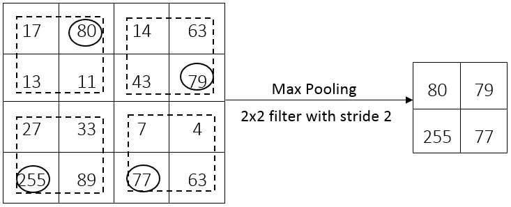

顾名思义，在平均池中，我们取筛选器窗口内输入矩阵的平均值，而在总和池中，我们对筛选器窗口内输入矩阵的所有值求和，如下图所示:


最大池是最常用的池操作之一。


# 完全连接的层

到目前为止，我们已经了解了卷积层和池层的工作原理。CNN 可以有多个卷积层和池层。但是，这些图层将仅从输入图像中提取要素并生成要素地图；也就是说，它们只是特征提取器。

给定任何图像，卷积层从图像中提取特征并产生特征图。现在，我们需要对这些提取的特征进行分类。所以，我们需要一种算法，可以对这些提取的特征进行分类，并告诉我们提取的特征是马的特征，还是其他的特征。为了进行这种分类，我们使用前馈神经网络。我们展平特征图并将其转换成向量，并将其作为输入馈送给前馈网络。前馈网络把这个扁平化的特征图作为输入，应用一个激活函数，比如 sigmoid，返回输出，说明图像是否包含马；这称为全连接层，如下图所示:

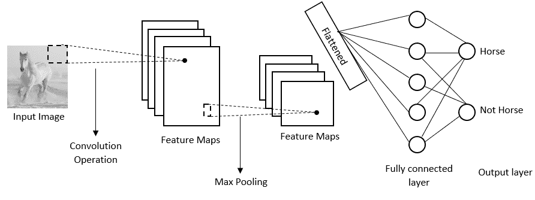


# CNN 的体系结构

CNN 的架构如下图所示:

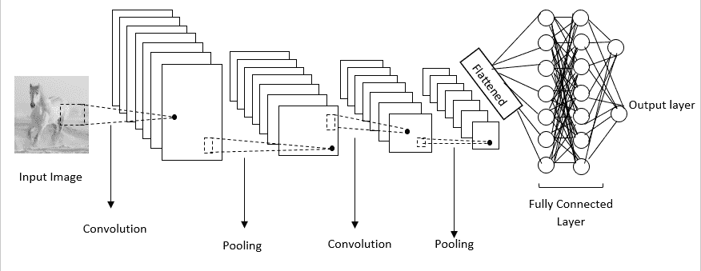

您会注意到，首先我们将输入图像输入到卷积层，在这里我们应用卷积运算从图像中提取重要特征并创建特征图。然后，我们将特征映射传递到池层，在池层中特征映射的维度将会减少。如上图所示，我们可以有多个卷积层和池层，我们还应该注意，池层不一定要在每个卷积层之后出现；可以有许多卷积层，后面跟着一个汇集层。

因此，在卷积层和池层之后，我们将得到的特征图展平，并将其馈送到一个完全连接的层，这基本上是一个前馈神经网络，它根据特征图对给定的输入图像进行分类。


# CNN 背后的数学

到目前为止，我们已经直观地了解了 CNN 是如何工作的。但是 CNN 到底是如何学习的呢？它如何使用反向传播找到滤波器的最佳值？为了回答这个问题，我们将从数学上探索 CNN 是如何工作的。不同于第五章第一章第一章，RNN 第三章的 T2 改进，CNN 背后的数学很简单也很有趣。


# 正向传播

让我们从正向传播开始。我们已经看到了前向传播是如何工作的，以及 CNN 如何对给定的输入图像进行分类。让我们用数学的方法来描述它。让我们考虑一个输入矩阵， *X* ，以及滤波器， *W* ，其值如下所示:

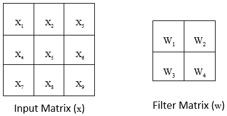

首先，让我们熟悉一下符号。每当我们写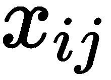时，它意味着输入矩阵的行和列中的元素。这同样适用于滤波器和输出矩阵；也就是说，和分别代表滤波器和输出矩阵中的行和列值。在上图中，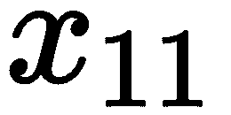 = ，即是输入矩阵第一行第一列的元素。

如下图所示，我们采用滤波器，将其滑过输入矩阵，执行卷积运算，并生成输出矩阵(特征映射)，正如我们在上一节中所学:

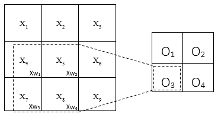

因此，输出矩阵(特征图)中的所有值计算如下:


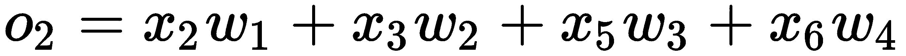


好，我们知道卷积运算是如何执行的，输出是如何计算的。我们可以用一个简单的等式来表示吗？假设我们有一个输入图像， *X，*，宽度为 *W* ，高度为 *H* ，大小为 *P* x *Q* 的滤波器，那么卷积运算可以表示如下:

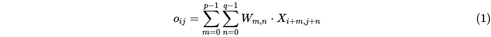

该等式基本上表示如何使用卷积运算计算输出(即输出矩阵的行和列中的元素)。

一旦执行了卷积运算，我们将结果馈送给前馈网络，并预测输出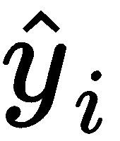:

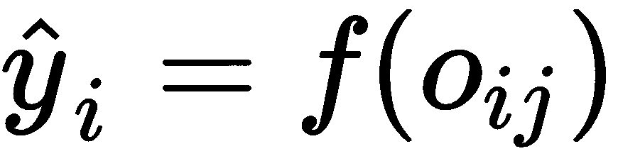


# 反向传播

一旦我们预测了产量，我们就可以计算损失。我们使用均方误差作为损失函数，即实际输出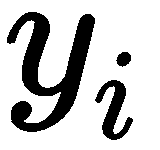和预测输出之间的平方差的平均值，如下所示:

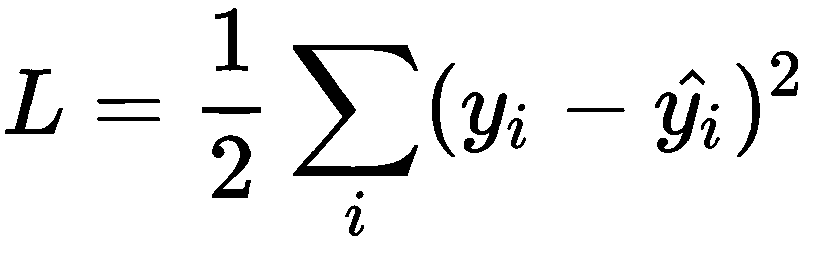

现在，我们将看看如何使用反向传播来最小化损失。为了将损耗降至最低，我们需要找到滤波器 *W* 的最佳值。我们的滤波器矩阵由四个值组成， *w1* 、 *w2* 、 *w3* 和 *w4* 。为了找到最佳滤波器矩阵，我们需要计算损失函数相对于所有这四个值的梯度。我们如何做到这一点？

首先，让我们回忆一下输出矩阵的方程，如下所示:


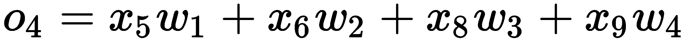

不要被即将到来的方程式吓倒；它们实际上非常简单。

首先，让我们计算相对于 *的梯度。*可以看到，出现在所有的输出方程中；我们计算损失对的偏导数如下:

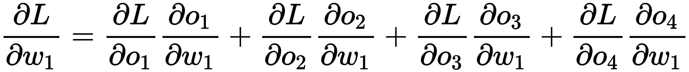

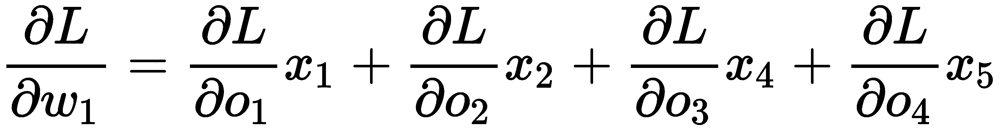

类似地，我们计算损失相对于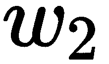重量的偏导数如下:

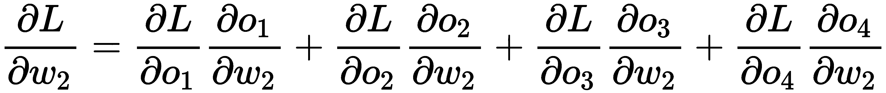

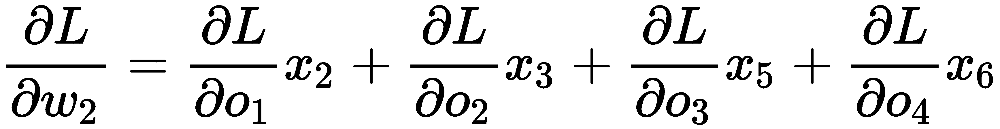

相对于重量的损失梯度计算如下:


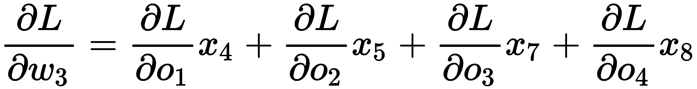

相对于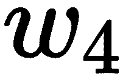重量的损耗梯度如下所示:


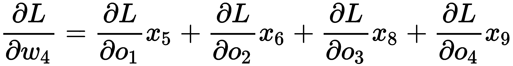

因此，简而言之，我们关于所有重量的损耗梯度的最终方程如下:


事实证明，计算损耗相对于滤波器矩阵的导数非常简单，这只是另一种卷积运算。如果我们仔细观察前面的等式，我们会发现它们看起来像是输入矩阵与作为滤波矩阵的输出损耗梯度之间的卷积运算结果，如下图所示:


例如，让我们看看如何通过输入矩阵和作为过滤矩阵的输出的损失梯度之间的卷积运算来计算相对于权重的损失梯度，如下图所示:

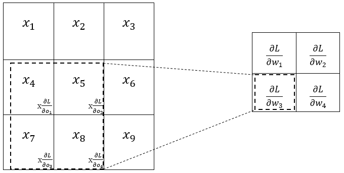

因此，我们可以这样写:


因此，我们理解，计算相对于滤波器的损耗梯度(即权重)只是输入矩阵和相对于作为滤波器矩阵的输出的损耗梯度之间的卷积运算。

除了计算相对于滤波器的损耗梯度，我们还需要计算相对于输入的损耗梯度。但是我们为什么要这样做呢？因为它用于计算前一层中存在的滤波器的梯度。

我们的输入矩阵由从到的九个值组成，因此我们需要计算所有这九个值的损耗梯度。让我们回忆一下输出矩阵是如何计算的:


如您所见，仅出现在中，因此我们可以单独计算相对于的损耗梯度，因为其他项为零:

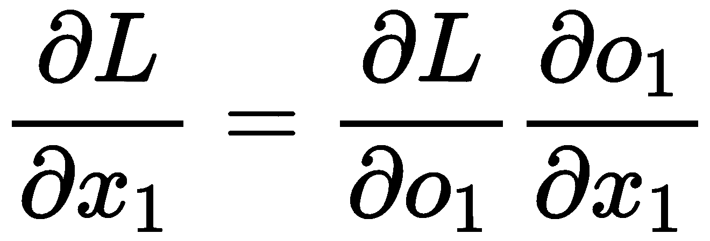


现在，让我们计算相对于 *的梯度；*由于只出现在和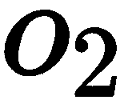中，我们单独计算相对于和的梯度:

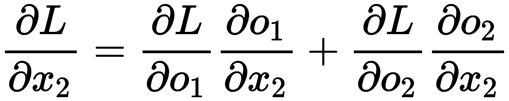

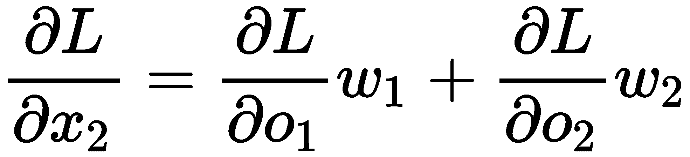

以非常相似的方式，我们计算所有输入的损耗梯度，如下所示:

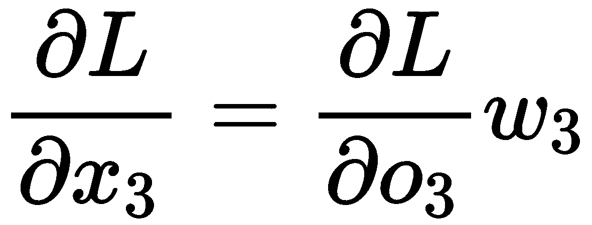


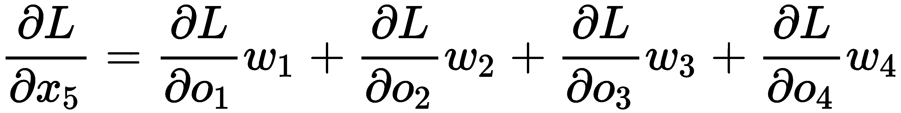

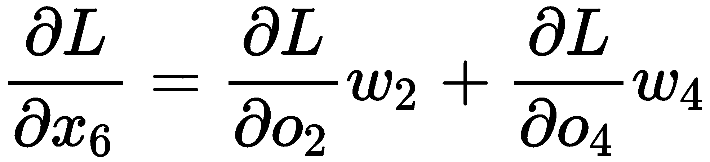


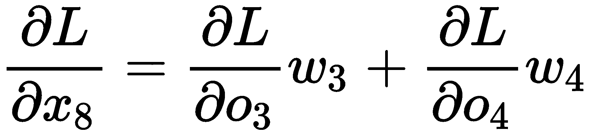

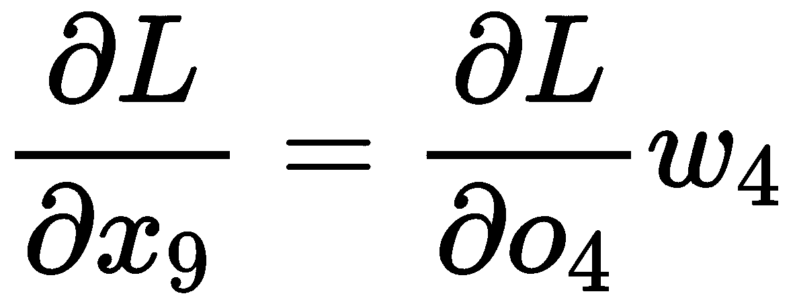

正如我们使用卷积运算来表示损失相对于权重的梯度一样，我们是否也可以这样做？事实证明答案是肯定的。实际上，我们可以使用作为输入矩阵的滤波矩阵和作为滤波矩阵的输出矩阵的损耗梯度之间的卷积运算来表示前述方程，即，相对于输入的损耗梯度。但诀窍在于，我们不是直接使用滤波器矩阵，而是将它们旋转 180 度，并且不是执行卷积，而是执行全卷积。我们这样做是为了利用卷积运算推导出前面的方程。

下图显示了内核旋转 180 度后的样子:

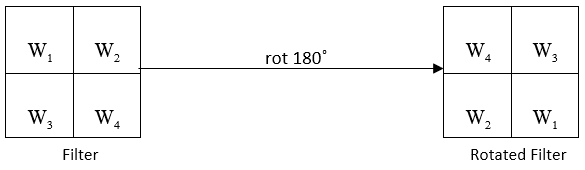

好吧，那么什么是全卷积？与卷积运算的方式相同，在全卷积中，我们使用一个滤波器，并在输入矩阵上滑动它，但我们滑动滤波器的方式与我们之前看到的卷积运算不同。下图显示了全卷积运算的工作原理。我们可以看到，阴影矩阵表示滤波器矩阵，无阴影矩阵表示输入矩阵；我们可以看到滤波器如何逐步滑过输入矩阵，如下图所示:

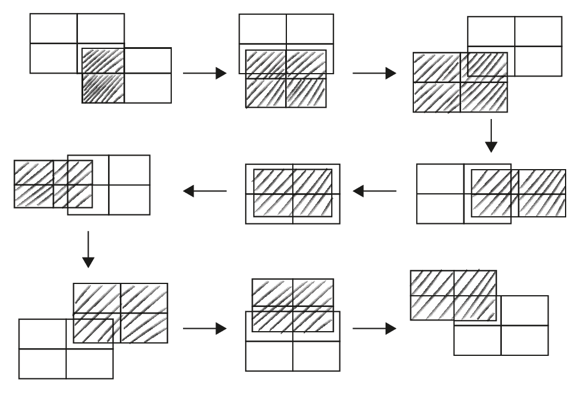

因此，我们可以说，相对于输入矩阵的损耗梯度可以使用旋转 180 度作为输入矩阵的滤波器和相对于输出作为滤波器矩阵的损耗梯度之间的全卷积运算来计算:


例如，如下图所示，我们将注意到输入的损耗梯度是如何通过旋转 180 度的滤波器矩阵与作为滤波器矩阵的输出矩阵的损耗梯度之间的全卷积运算来计算的:


这一点如下所示:


因此，我们理解，计算相对于输入的损耗梯度只是完整的卷积运算。因此，我们可以说 CNN 中的反向传播只是另一种卷积运算。


# 在 TensorFlow 中实现 CNN

现在我们将学习如何使用 TensorFlow 构建 CNN。我们将使用 MNIST 手写数字数据集，了解 CNN 如何识别手写数字，我们还将可视化卷积层如何从图像中提取重要特征。

首先，让我们加载所需的库:

```
import warnings
warnings.filterwarnings('ignore')

import numpy as np
import tensorflow as tf
from tensorflow.examples.tutorials.mnist import input_data
tf.logging.set_verbosity(tf.logging.ERROR)

import matplotlib.pyplot as plt
%matplotlib inline
```

加载 MNIST 数据集:

```
mnist = input_data.read_data_sets('data/mnist', one_hot=True)
```


# 定义助手功能

现在，我们定义初始化权重和偏差的函数，以及执行卷积和汇集操作的函数。

通过从截断的正态分布中提取来初始化权重。记住，权重实际上是我们在执行卷积运算时使用的滤波器矩阵:

```
def initialize_weights(shape):
    return tf.Variable(tf.truncated_normal(shape, stddev=0.1))
```

用一个恒定值初始化偏置，比如说，`0.1`:

```
def initialize_bias(shape):
    return tf.Variable(tf.constant(0.1, shape=shape))
```

我们用`tf.nn.conv2d()`定义了一个叫卷积的函数，它实际上执行的是卷积运算；即输入矩阵(`x`)与滤波器(`W`)的逐元素乘法，步长为`1`，填充相同。我们设定`strides = [1,1,1,1]`。步幅的第一个和最后一个值被设置为`1`，这意味着我们不想在训练样本和不同通道之间移动。`strides`的第二个和第三个值也被设置为`1`，这意味着我们在高度和宽度方向上按`1`像素移动过滤器:

```
def convolution(x, W):
    return tf.nn.conv2d(x, W, strides=[1,1,1,1], padding='SAME')
```

我们定义了一个名为`max_pooling`的函数，使用`tf.nn.max_pool()`来执行池操作。我们使用`2`的`stride`执行最大池化，相同的`padding`和`ksize`暗示我们的池化窗口形状:

```
def max_pooling(x):
    return tf.nn.max_pool(x, ksize=[1,2,2,1], strides=[1,2,2,1], padding='SAME')
```

定义输入和输出的占位符。

输入图像的`placeholder`定义如下:

```
X_ = tf.placeholder(tf.float32, [None, 784])
```

整形后的输入图像的`placeholder`定义如下:

```
X = tf.reshape(X_, [-1, 28, 28, 1])
```

输出标签的`placeholder`定义如下:

```
y = tf.placeholder(tf.float32, [None, 10])
```


# 定义卷积网络

我们的网络架构由两个卷积层组成。每个卷积层后面是一个池层，我们使用一个全连接层，后面是一个输出层；也就是`conv1->pooling->conv2->pooling2->fully connected layer-> output layer`。

首先，我们定义第一个卷积层和池层。

权重实际上是卷积层中的滤波器。因此，权重矩阵将被初始化为`[ filter_shape[0], filter_shape[1], number_of_input_channel, filter_size ]`。

我们使用一个`5 x 5`过滤器。由于我们使用灰度图像，输入通道的数量将是`1`，我们将过滤器的大小设置为`32`。因此，第一卷积层的权重矩阵将是`[5,5,1,32]`:

```
W1 = initialize_weights([5,5,1,32])
```

偏置的形状就是滤波器的大小，也就是`32`:

```
b1 = initialize_bias([32])
```

使用 ReLU 激活执行第一个卷积运算，然后使用最大池:

```
conv1 = tf.nn.relu(convolution(X, W1) + b1)
pool1 = max_pooling(conv1)
```

接下来，我们定义第二个卷积层和池层。

由于第二卷积层从具有 32 通道输出的第一卷积层获取输入，因此第二卷积层的输入通道数变为 32，我们使用滤波器大小为`64`的 5×5 滤波器。因此，第二卷积层的权重矩阵变成`[5,5,32,64]`:

```
W2 = initialize_weights([5,5,32,64])
```

偏置的形状就是滤波器的大小，也就是`64`:

```
b2 = initialize_bias([64])
```

对 ReLU 激活执行第二次卷积运算，然后是最大池化:

```
conv2 = tf.nn.relu(convolution(pool1, W2) + b2)
pool2 = max_pooling(conv2)
```

在两个卷积和池层之后，我们需要在将输出馈送到完全连接的层之前将其展平。因此，我们将第二个池层的结果扁平化，并将其提供给完全连接的层。

展平第二个池层的结果:

```
flattened = tf.reshape(pool2, [-1, 7*7*64])
```

现在我们定义全连接层的权重和偏差。我们知道我们把权重矩阵的形状设为`[number of neurons in the current layer, number of neurons layer in the next layer]`。这是因为输入图像的形状在展平后变成了`7x7x64`，我们在隐藏层中使用了`1024`神经元。重物的形状变为`[7x7x64, 1024]`:

```
W_fc = initialize_weights([7*7*64, 1024])
b_fc = initialize_bias([1024])
```

这是一个带有 ReLU 激活的完全连接的层:

```
fc_output = tf.nn.relu(tf.matmul(flattened, W_fc) + b_fc)
```

定义输出层。我们在当前层中有`1024`个神经元，并且由于我们需要预测 10 个类别，我们在下一层中有 10 个神经元，因此权重矩阵的形状变为`[1024 x 10]`:

```
W_out = initialize_weights([1024, 10])
b_out = initialize_bias([10])
```

使用 softmax 激活计算输出:

```
YHat = tf.nn.softmax(tf.matmul(fc_output, W_out) + b_out)
```


# 计算损失

使用交叉熵计算损失。我们知道交叉熵损失如下所示:

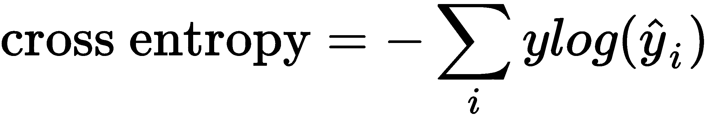

这里，是实际标签，是预测标签。因此，交叉熵损失实现如下:

```
cross_entropy = -tf.reduce_sum(y*tf.log(YHat))
```

使用 Adam 优化器将损失降至最低:

```
optimizer = tf.train.AdamOptimizer(1e-4).minimize(cross_entropy)
```

计算准确度:

```
predicted_digit = tf.argmax(y_hat, 1)
actual_digit = tf.argmax(y, 1)

correct_pred = tf.equal(predicted_digit,actual_digit)
accuracy = tf.reduce_mean(tf.cast(correct_pred, tf.float32))
```


# 开始训练

启动一个 TensorFlow`Session`并初始化所有变量:

```
sess = tf.Session()
sess.run(tf.global_variables_initializer())
```

为`1000`时代训练模型。打印每个`100`时期的结果:

```
for epoch in range(1000):

    #select some batch of data points according to the batch size (100)
    X_batch, y_batch = mnist.train.next_batch(batch_size=100)

    #train the network
    loss, acc, _ = sess.run([cross_entropy, accuracy, optimizer], feed_dict={X_: X_batch, y: y_batch})

    #print the loss on every 100th epoch
    if epoch%100 == 0:
        print('Epoch: {}, Loss:{} Accuracy: {}'.format(epoch,loss,acc))
```

您会注意到，随着时间的推移，损耗会降低，精度会提高:

```
Epoch: 0, Loss:631.2734375 Accuracy: 0.129999995232

Epoch: 100, Loss:28.9199733734 Accuracy: 0.930000007153

Epoch: 200, Loss:18.2174377441 Accuracy: 0.920000016689

Epoch: 300, Loss:21.740688324 Accuracy: 0.930000007153
```


# 可视化提取的特征

现在我们已经训练了我们的 CNN 模型，我们可以看到我们的 CNN 提取了什么特征来识别图像。正如我们所知，每个卷积层都从图像中提取重要特征。我们将看到我们的第一个卷积层提取了什么特征来识别手写数字。

首先，让我们从训练集中选择一个图像，比如数字 1:

```
plt.imshow(mnist.train.images[7].reshape([28, 28]))
```

输入图像如下所示:

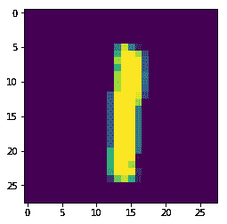

将此图像送入第一个卷积层，即`conv1`，得到特征图:

```
image = mnist.train.images[7].reshape([-1, 784])
feature_map = sess.run([conv1], feed_dict={X_: image})[0]
```

绘制特征图:

```
for i in range(32):
    feature = feature_map[:,:,:,i].reshape([28, 28])
    plt.subplot(4,8, i + 1)
    plt.imshow(feature)
    plt.axis('off')
plt.show()

```

正如您在下图中看到的，第一个卷积层已经学会从给定图像中提取边缘:

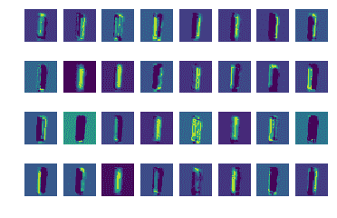

因此，这就是 CNN 如何使用多个卷积层从图像中提取重要特征，并将这些提取的特征馈送到全连接层以对图像进行分类。现在我们已经了解了 CNN 是如何工作的，在下一节中，我们将了解几个有趣的 CNN 架构。


# CNN 架构

在这一部分，我们将探索不同类型的有趣的 CNN 架构。当我们说不同类型的 CNN 架构时，我们基本上是指卷积层和池层如何相互堆叠。此外，我们还将了解使用了多少卷积层、池层和全连接层，以及过滤器的数量和尺寸等。


# LeNet 架构

LeNet 架构是 CNN 的经典架构之一。如下图所示，该架构非常简单，仅由七层组成。在这七层中，有三个卷积层、两个汇集层、一个全连接层和一个输出层。它使用步长为 1 的 5 x 5 卷积，并使用平均池。什么是 5×5 卷积？这意味着我们正在用一个 5×5 的滤波器进行卷积运算。

如下图所示，LeNet 由三个卷积层(`C1`、`C3`、`C5`)、两个池层(`S2`、`S4`)、一个全连接层(`F6`)和一个输出层(`OUTPUT`)组成，每个卷积层之后是一个池层:


# 了解 AlexNet

AlexNet 是一个经典而强大的深度学习架构。它通过将错误率从 26%大幅降低到 15.3%，赢得了 2012 年 ILSVRC。ILSVRC 代表 ImageNet 大规模视觉识别竞赛，这是专注于计算机视觉任务(如图像分类、定位、对象检测等)的最大竞赛之一。ImageNet 是一个巨大的数据集，包含超过 1500 万张带标签的高分辨率图像，超过 22，000 个类别。每年，研究人员都竞相使用创新建筑赢得比赛。

AlexNet 由先驱科学家设计，包括 Alex Krizhevsky、Geoffrey Hinton 和 Ilya Sutskever。它由五个卷积层和三个全连接层组成，如下图所示。它使用 ReLU 激活函数而不是 tanh 函数，ReLU 在每一层后应用。它使用 dropout 来处理过拟合，并且在第一个和第二个完全连接的层之前执行 dropout。它使用数据增强技术，如图像翻译，并在两个 GTX 580 GPU 上使用批量随机梯度下降进行 5 至 6 天的训练:

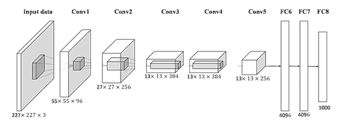


# VGGNet 架构

VGGNet 是最常用的 CNN 架构之一。它是由牛津大学的视觉几何小组 ( **VGG** )发明的。当它成为 ILSVRC 2014 的亚军时，它开始变得非常受欢迎。

它基本上是一个深度卷积网络，广泛用于对象检测任务。牛津团队向公众提供了网络的权重和结构，因此我们可以直接使用这些权重来执行几项计算机视觉任务。它还被广泛用作图像的良好基线特征提取器。

VGG 网络的架构非常简单。它由卷积层和池层组成。它在整个网络中使用 3 x 3 卷积和 2 x 2 池。它被称为 VGG- *n* ，其中 *n* 对应于多个层，不包括 pooling 和 softmax 层。下图显示了 VGG-16 网络的架构:

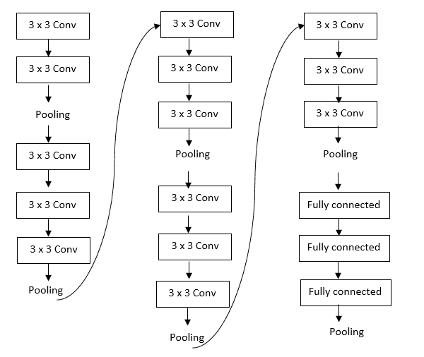

从下图可以看出，AlexNet 的架构特点是金字塔形状，初始层宽，后期层窄。您会注意到它由多个卷积层和一个池层组成。由于池层减少了空间维度，随着我们深入网络，它会缩小网络:


VGGNet 的一个缺点是计算量很大，它有超过 1.6 亿个参数。


# 谷歌网

**GoogleNet** ，也被称为 **inception net** ，是 2014 年 ILSVRC 的获胜者。它由各种版本组成，每个版本都是前一个版本的改进版本。我们将逐一探讨每个版本。


# 盗梦空间 v1

Inception v1 是网络的第一个版本。图像中的对象以不同的大小出现在不同的位置。比如看第一个图像；正如你所看到的，当近距离观看时，鹦鹉占据了图像的整个部分，但是在第二个图像中，当从远处观看鹦鹉时，它占据了图像的较小区域:


因此，我们可以说物体(在给定的图像中，是一只鹦鹉)可以出现在图像的任何区域。它可能小或大。它可能会占据图像的整个区域，或者只是很小的一部分。我们的网络必须准确识别目标。但是这里的问题是什么呢？还记得我们如何学习使用过滤器从图像中提取特征吗？现在，由于我们感兴趣的对象在每幅图像中的大小和位置各不相同，因此选择正确的滤波器大小非常困难。

当对象尺寸较大时，我们可以使用大尺寸的过滤器，但是当我们必须检测图像的小角落中的对象时，大尺寸的过滤器不合适。因为我们使用固定的感受野，即固定的滤波器大小，所以很难识别图像中位置变化很大的对象。我们可以使用深度网络，但它们更容易过度拟合。

为了克服这一点，初始网络在相同的输入上使用不同大小的多个滤波器，而不是使用相同大小的单个滤波器。一个初始网络由九个相互堆叠的初始块组成。下图显示了一个单独的先启块。您会注意到，我们使用三种不同大小的滤波器(即 1 x 1、3 x 3 和 5 x 5)对给定图像执行卷积运算。一旦所有这些不同的滤波器执行了卷积运算，我们就将结果连接起来，并将其提供给下一个先启块:


当我们连接来自多个过滤器的输出时，连接结果的深度将增加。虽然我们使用的填充只匹配输入和输出的形状，但我们仍然会有不同的深度。因为一个先启块的结果是对另一个的反馈，所以深度不断增加。因此，为了避免深度增加，我们只需在 3 x 3 和 5 x 5 卷积之前添加 1 x 1 卷积，如下图所示。我们还执行最大汇集操作，并且在最大汇集操作之后添加 1 x 1 卷积:


每个先启块提取一些特性，并将它们提供给下一个先启块。假设我们正试图识别一张鹦鹉的图片。前几层中的先启块检测基本特性，后面的先启块检测高级特性。正如我们所见，在卷积网络中，初始块将只提取特征，而不执行任何分类。因此，我们将由 inception 块提取的特征提供给分类器，该分类器将预测图像是否包含鹦鹉。

由于初始网络很深，有九个初始块，它容易受到消失梯度问题的影响。为了避免这一点，我们在初始块之间引入了分类器。由于每个先启块都学习了图像的有意义的特征，所以我们也尝试执行分类并计算中间层的损失。如下图所示，我们有九个先启块。我们获取第三个先启块的结果，并将其提供给一个中间分类器，还将第六个先启块的结果提供给另一个中间分类器。在最终的初始块的末尾还有另一个分类器。该分类器基本上由平均池、1 x 1 卷积和具有 softmax 激活的线性层组成:


中间的量词实际上叫做辅助量词。因此，初始网络的最终损耗是辅助分类器损耗和最终分类器损耗(实际损耗)的加权和，如下所示:


# Inception v2 和 v3

《盗梦空间》第二版和第三版由克里斯蒂安·塞格迪(Christian Szegedy)在*延伸阅读*一节中介绍的*与回旋*一起深入。作者建议使用因子分解卷积，也就是说，我们可以将一个滤波器大小较大的卷积层分解为一个滤波器大小较小的卷积层堆栈。因此，在初始模块中，一个具有 5 x 5 滤波器的卷积层可以分解为两个具有 3 x 3 滤波器的卷积层，如下图所示。使用因子分解卷积可以提高性能和速度:


作者还建议将滤波器大小为 *n* x *n* 的卷积层分解成一堆滤波器大小为 *1* x *n* 和 *n* x *1* 的卷积层。例如，在上图中，我们有 *3* x *3* 卷积，现在它被分解为 *1* x *3* 卷积，后面是 *3* x *1* 卷积，如下图所示:


正如你在上图中注意到的，我们基本上是在以更深的方式扩展我们的网络，这将导致我们丢失信息。因此，我们没有让它变得更深，而是让我们的网络变得更宽，如下所示:


在 inception net v3 中，我们使用带有 RMSProp 优化器的因子分解的 7 x 7 卷积。此外，我们在辅助分类器中应用批量归一化。


# 胶囊网络

Geoffrey Hinton 提出了胶囊网络来克服卷积网络的局限性。

辛顿声明如下:

“卷积神经网络中使用的池操作是一个巨大的错误，它如此有效的事实是一场灾难。”

但是，合并操作有什么问题呢？还记得我们使用池操作来减少维度和删除不需要的信息吗？汇集操作使得我们的 CNN 表示对于输入中的小平移不变。

CNN 的这种平移不变性并不总是有益的，并且容易被错误分类。例如，假设我们需要识别一个图像是否有人脸；CNN 将寻找这个图像是否有眼睛、鼻子、嘴巴和耳朵。它不关心他们在哪个位置。如果它找到了所有这样的特征，那么它就把它归类为一张脸。

考虑两个图像，如下图所示。第一个图像是实际的脸，在第二个图像中，眼睛放在左边，一个在另一个上面，耳朵和嘴放在右边。但是 CNN 仍然会将这两张图片归类为人脸，因为这两张图片都具有人脸的所有特征，即耳朵、眼睛、嘴巴和鼻子。CNN 认为这两张图片都是由一张脸组成的。它不学习每个特征之间的空间关系；眼睛应该放在顶部，然后是鼻子，等等。它只检查组成面部的特征是否存在。

当我们有一个深度网络时，这个问题会变得更糟，因为在深度网络中，特征将变得抽象，并且它的大小也会由于几个汇集操作而缩小:


为了克服这一点，Hinton 引入了一种新的网络，称为胶囊网络，由胶囊而不是神经元组成。像 CNN 一样，胶囊网络检查某些特征的存在以对图像进行分类，但是除了检测特征之外，它还将检查它们之间的空间关系。也就是说，它学习特征的层次结构。以我们识别人脸为例，胶囊网络会学习眼睛应该在顶部，鼻子应该在中间，然后是嘴等等。如果图像不遵循这种关系，则胶囊网络不会将其归类为面部:


胶囊网络由几个连接在一起的胶囊组成。但是等等。什么是胶囊？

胶囊是一组学习检测图像中特定特征的神经元；说，眼睛。与返回标量的神经元不同，胶囊返回向量。向量的长度告诉我们特定的特征是否存在于给定的位置，并且向量的元素表示特征的属性，例如位置、角度等等。

假设我们有一个向量，如下所示:


向量的长度可以计算如下:


我们已经知道，向量的长度代表特征存在的概率。但是前面的长度不代表概率，因为它超过 1。所以，我们用一个叫做挤压函数的函数将这个值转换成一个概率。挤压功能有一个优点。除了计算概率，它还保持向量的方向:


就像 CNN 一样，早期层中的胶囊检测包括眼睛、鼻子等在内的基本特征，而较高层中的胶囊检测高级特征，例如整个面部。因此，较高层中的胶囊从较低层中的胶囊获取输入。为了让更高层的胶囊检测到面部，它们不仅检查鼻子和眼睛等特征的存在，还检查它们的空间关系。

现在我们对什么是胶囊有了一个基本的了解，我们将更详细地研究它，看看胶囊网络到底是如何工作的。


# 了解胶囊网络

假设我们有两层，和。是下层，有轿厢，是上层，有轿厢。来自较低层的胶囊将它们的输出发送到较高层的胶囊。将是来自下层的胶囊的激活。将是来自更高层的胶囊的激活，。

下图显示了一个胶囊，正如您所看到的，它将前面胶囊的输出作为输入，并计算其输出:


我们将继续学习如何计算。


# 计算预测向量

在上图中，、和表示来自前一个胶囊的输出向量。首先，我们将这些向量乘以权重矩阵，并计算预测向量:


好，那么我们到底在做什么，什么是预测向量？让我们考虑一个简单的例子。假设胶囊试图预测一幅图像是否有脸。我们已经知道，早期层中的胶囊检测基本特征，并将它们的结果发送到较高层中的胶囊。因此，早期层中的胶囊、和检测基本的低特征，例如眼睛、鼻子和嘴，并将它们的结果发送到高级层中的胶囊，即检测面部的胶囊。

因此，胶囊将先前的胶囊、和作为输入，并将它们乘以权重矩阵。

权重矩阵表示低级特征和高级特征之间的空间和其他关系。例如，重量告诉我们眼睛应该在顶部。告诉我们鼻子应该在中间。告诉我们，一张嘴应该在最下面。注意，权重矩阵不仅捕捉位置(即空间关系)，还捕捉其他关系。

因此，通过将输入乘以权重，我们可以预测人脸的位置:

*   暗示基于眼睛的面部的预测位置
*   暗示基于鼻子的面部的预测位置
*   暗示基于嘴的面部的预测位置

当所有预测的人脸位置都相同，即彼此一致时，那么我们可以说该图像包含人脸。我们使用反向传播来学习这些权重。


# 耦合系数

接下来，我们将预测向量乘以耦合系数。任何两个胶囊之间都存在耦合系数。我们知道来自较低层的胶囊将它们的输出发送到较高层的胶囊。耦合系数有助于较低层中的胶囊理解它必须将其输出发送到较高层中的哪个胶囊。

例如，让我们考虑同一个例子，我们试图预测一个图像是否由一张脸组成。代表和之间的协议。

代表眼睛和脸的一致。既然我们知道眼睛在脸上，那么值就会增加。我们知道预测向量暗示了基于眼睛的面部的预测位置。用乘以意味着我们在增加眼睛的重要性，因为的值很高。

代表鼻子和脸的一致。既然我们知道鼻子在脸上，那么值就会增加。我们知道预测向量暗示了基于鼻子的面部预测位置。将乘以意味着我们在增加鼻子的重要性，因为的值很高。

让我们考虑另一个低级特征，比如说，它检测手指。现在，代表手指和脸的吻合度，会低。将乘以意味着我们正在降低手指的重要性，因为的值很低。

但是这些耦合系数是怎么学来的呢？与权重不同，耦合系数是在前向传播本身中学习的，它们是使用一种称为动态路由的算法学习的，我们将在下一节讨论这种算法。

将乘以后，我们将它们相加，如下所示:


因此，我们可以将等式写成如下:


# 挤压功能

我们开始说胶囊试图检测图像中的人脸。所以，我们需要将转换成概率，从而得到图像中人脸存在的概率。

除了计算概率，我们还需要保持向量的方向，所以我们使用一个激活函数，称为挤压函数。其给出如下:


现在，(也称为活动向量)给出了给定图像中人脸存在的概率。


# 动态路由算法

现在，我们将了解动态路由算法如何计算耦合系数。让我们引入一个新变量叫做，它只是一个临时变量，与耦合系数相同。首先，我们将初始化为 0。这意味着较低层中的胶囊和较高层中的胶囊之间的耦合系数被设置为 0。

设为的向量表示。给定预测向量，对于一些 *n* 次迭代，我们做如下:

1.  对于层中的所有胶囊，计算如下:


2.  对于层中的所有胶囊，计算如下:


3.  对于中的所有胶囊和中的所有胶囊，计算如下:


必须仔细注意前面的等式。这是我们更新耦合系数的地方。点积意味着较低层中的胶囊的预测向量和较高层中的胶囊的输出向量之间的点积。如果点积高，将增加各自的耦合系数，这使得更强。


# 胶囊网络的体系结构

假设我们的网络试图预测手写数字。我们知道，早期层中的胶囊检测基本特征，而后期层中的胶囊检测数字。所以，让我们把早期层中的胶囊称为**初级胶囊**，把后期层中的胶囊称为**数字胶囊**。

胶囊网络的架构如下所示:


在上图中，我们可以观察到以下情况:

1.  首先，我们将输入图像送入标准卷积层，结果称为卷积输入。
2.  然后，我们将卷积输入馈送到主胶囊层，并获得主胶囊。
3.  接下来，我们使用动态路由算法以主胶囊作为输入来计算数字胶囊。
4.  数字胶囊由 10 行组成，每行代表预测数字的概率。也就是说，第 1 行表示输入数字为 0 的概率，第 2 行表示数字为 1 的概率，依此类推。
5.  由于输入图像是前一图像中的数字 3，所以表示数字 3 的概率的行 4 在数字胶囊中将是高的。


# 损失函数

现在我们将探讨胶囊网络的损失函数。损失函数是称为边际损失和重建损失的两个损失函数的加权和。


# 利润损失

我们了解到胶囊返回一个向量，向量的长度代表特征存在的概率。假设我们的网络正在试图识别图像中的手写数字。为了检测给定图像中的多个数字，我们对每个数字胶囊使用余量损失，如下所示:


在这里，情况如下:

*   ，如果类别的数字存在
*   是余量，设置为 0.9，设置为 0.1
*   防止初始学习缩小所有数字胶囊的向量长度，通常设置为 0.5

总利润损失是所有类别损失的总和，，如下所示:


# 重建损失

为了确保网络已经学习了胶囊中的重要特征，我们使用重建损失。这意味着我们使用一个称为解码器网络的三层网络，它试图从数字胶囊中重建原始图像:


重建损失由重建图像和原始图像之间的平方差给出，如下所示:


最终损失如下所示:


这里，α是一个正则项，因为我们不希望重建损失比边际损失具有更高的优先级。因此，alpha 乘以重建损失以降低其重要性，通常设置为 0.0005。


# 在 TensorFlow 中构建胶囊网络

现在我们将学习如何在 TensorFlow 中实现胶囊网络。我们将使用我们最喜欢的 MNIST 数据集来学习胶囊网络如何识别手写图像。

导入所需的库:

```
import warnings
warnings.filterwarnings('ignore')

import numpy as np
import tensorflow as tf

from tensorflow.examples.tutorials.mnist import input_data
tf.logging.set_verbosity(tf.logging.ERROR)
```

加载 MNIST 数据集:

```
mnist = input_data.read_data_sets("data/mnist",one_hot=True)
```


# 定义挤压功能

我们了解到 squash 函数将向量的长度转换为概率，其给出如下:


`squash`功能可定义如下:

```
def squash(sj):

    sj_norm = tf.reduce_sum(tf.square(sj), -2, keep_dims=True)
    scalar_factor = sj_norm / (1 + sj_norm) / tf.sqrt(sj_norm + epsilon)

    vj = scalar_factor * sj 

    return vj
```


# 定义动态路由算法

现在我们来看看动态路由算法是如何实现的。我们使用在动态路由算法中学到的相同符号的变量名，这样我们就可以很容易地遵循这些步骤。我们将一步一步地看函数中的每一行。你也可以在 GitHub 的[http://bit.ly/2HQqDEZ](http://bit.ly/2HQqDEZ)查看完整的代码。

首先，定义名为`dynamic_routing`的函数，该函数将前面的胶囊、`ui`、耦合系数、`bij`和路由迭代次数、`num_routing`作为输入，如下所示:

```
def dynamic_routing(ui, bij, num_routing=10):
```

通过从随机正态分布中抽取来初始化`wij`权重，并用常数值初始化`biases`:

```
    wij = tf.get_variable('Weight', shape=(1, 1152, 160, 8, 1), dtype=tf.float32,

                        initializer=tf.random_normal_initializer(0.01))

    biases = tf.get_variable('bias', shape=(1, 1, 10, 16, 1))
```

定义初级胶囊`ui` ( `tf.tile`复制张量 *n 次*):

```
    ui = tf.tile(ui, [1, 1, 160, 1, 1])
```

计算预测向量，如下所示:

```
    u_hat = tf.reduce_sum(wij * ui, axis=3, keep_dims=True)
```

重塑预测向量:

```
    u_hat = tf.reshape(u_hat, shape=[-1, 1152, 10, 16, 1])
```

停止预测向量中的梯度计算:

```
    u_hat_stopped = tf.stop_gradient(u_hat, name='stop_gradient')
```

执行多次路由迭代的动态路由，如下所示:

```
    for r in range(num_routing):

        with tf.variable_scope('iter_' + str(r)):

            #step 1
            cij = tf.nn.softmax(bij, dim=2)

            #step 2
            if r == num_routing - 1:

                sj = tf.multiply(cij, u_hat)

                sj = tf.reduce_sum(sj, axis=1, keep_dims=True) + biases

                vj = squash(sj)

            elif r < num_routing - 1: 

                sj = tf.multiply(cij, u_hat_stopped)

                sj = tf.reduce_sum(sj, axis=1, keep_dims=True) + biases

                vj = squash(sj)

                vj_tiled = tf.tile(vj, [1, 1152, 1, 1, 1])

                coupling_coeff = tf.reduce_sum(u_hat_stopped * vj_tiled, axis=3, keep_dims=True)

                #step 3
                bij += coupling_coeff
   return vj
```


# 计算主胶囊和数字胶囊

现在我们将计算提取基本特征的主胶囊和识别数字的数字胶囊。

启动 TensorFlow`Graph`:

```
graph = tf.Graph()
with graph.as_default() as g:
```

定义输入和输出的占位符:

```
    x = tf.placeholder(tf.float32, [batch_size, 784])
    y = tf.placeholder(tf.float32, [batch_size,10])
    x_image = tf.reshape(x, [-1,28,28,1])
```

执行卷积运算并获得卷积输入:

```
    with tf.name_scope('convolutional_input'):
        input_data = tf.contrib.layers.conv2d(inputs=x_image, num_outputs=256, kernel_size=9, padding='valid')
```

计算提取基本特征(如边缘)的主胶囊。首先，使用卷积运算计算胶囊，如下所示:

```
 capsules = []

 for i in range(8):

 with tf.name_scope('capsules_' + str(i)):

 #convolution operation 
 output = tf.contrib.layers.conv2d(inputs=input_data, num_outputs=32,kernel_size=9, stride=2, padding='valid')

 #reshape the output
 output = tf.reshape(output, [batch_size, -1, 1, 1])

 #store the output which is capsule in the capsules list
 capsules.append(output)
```

连接所有胶囊并形成主胶囊，挤压主胶囊，并获得如下概率:

```
 primary_capsule = tf.concat(capsules, axis=2)
```

将`squash`函数应用于主胶囊，获得概率:

```
 primary_capsule = squash(primary_capsule)
```

使用动态路由算法计算数字胶囊，如下所示:

```
    with tf.name_scope('dynamic_routing'):

        #reshape the primary capsule
        outputs = tf.reshape(primary_capsule, shape=(batch_size, -1, 1, primary_capsule.shape[-2].value, 1))

        #initialize bij with 0s
        bij = tf.constant(np.zeros([1, primary_capsule.shape[1].value, 10, 1, 1], dtype=np.float32))

        #compute the digit capsules using dynamic routing algorithm which takes 
        #the reshaped primary capsules and bij as inputs and returns the activity vector 
        digit_capsules = dynamic_routing(outputs, bij)

 digit_capsules = tf.squeeze(digit_capsules, axis=1)
```


# 掩蔽数字胶囊

为什么我们需要屏蔽数字胶囊？我们了解到，为了确保网络已经学习了重要的特征，我们使用了一个称为解码器网络的三层网络，它试图从数字胶囊中重建原始图像。如果解码器能够成功地从数字胶囊中重建图像，那么这意味着网络已经学习了图像的重要特征；否则，网络没有学习到图像的正确特征。

数字胶囊包含所有数字的活动向量。但是解码器只想重建给定的输入数字(输入图像)。因此，我们屏蔽掉所有数字的活动向量，除了正确的数字。然后，我们使用这个掩蔽的数字胶囊来重建给定的输入图像:

```
with graph.as_default() as g:
    with tf.variable_scope('Masking'):

        #select the activity vector of given input image using the actual label y and mask out others
        masked_v = tf.multiply(tf.squeeze(digit_capsules), tf.reshape(y, (-1, 10, 1)))
```


# 定义解码器

定义用于重建图像的解码器网络。它由以下三个完全连接的网络组成:

```
with tf.name_scope('Decoder'):

    #masked digit capsule
    v_j = tf.reshape(masked_v, shape=(batch_size, -1))

    #first fully connected layer 
    fc1 = tf.contrib.layers.fully_connected(v_j, num_outputs=512)

    #second fully connected layer
    fc2 = tf.contrib.layers.fully_connected(fc1, num_outputs=1024)

    #reconstructed image
    reconstructed_image = tf.contrib.layers.fully_connected(fc2, num_outputs=784, activation_fn=tf.sigmoid)
```


# 计算模型的精确度

现在我们计算模型的精确度:

```
with graph.as_default() as g:
    with tf.variable_scope('accuracy'):
```

计算数字胶囊中每个活动向量的长度:

```
        v_length = tf.sqrt(tf.reduce_sum(tf.square(digit_capsules), axis=2, keep_dims=True) + epsilon)
```

将`softmax`应用于长度并获得概率:

```
        softmax_v = tf.nn.softmax(v_length, dim=1)
```

选择概率最高的索引；这将给我们预测的数字:

```
        argmax_idx = tf.to_int32(tf.argmax(softmax_v, axis=1)) 
        predicted_digit = tf.reshape(argmax_idx, shape=(batch_size, ))
```

计算`accuracy`:

```
        actual_digit = tf.to_int32(tf.argmax(y, axis=1))

        correct_pred = tf.equal(predicted_digit,actual_digit)
        accuracy = tf.reduce_mean(tf.cast(correct_pred, tf.float32))
```


# 计算损失

众所周知，我们计算两种类型的损失——边际损失和重建损失。


# 利润损失

我们知道利润损失如下所示:


计算左边的最大值和右边的最大值:

```
max_left = tf.square(tf.maximum(0.,0.9 - v_length))
max_right = tf.square(tf.maximum(0., v_length - 0.1))
```

将设置为:

```
T_k = y

lambda_ = 0.5
L_k = T_k * max_left + lambda_ * (1 - T_k) * max_right
```

总利润损失计算如下:

```
margin_loss = tf.reduce_mean(tf.reduce_sum(L_k, axis=1))
```


# 重建损失

使用以下代码整形并获得原始图像:

```
original_image = tf.reshape(x, shape=(batch_size, -1))
```

计算重建图像和原始图像之间的平方差的平均值:

```
squared = tf.square(reconstructed_image - original_image)

```

计算重建损失:

```
reconstruction_loss = tf.reduce_mean(squared) 
```


# 全损

定义总损失，即边际损失和重建损失的加权和:

```
alpha = 0.0005
total_loss = margin_loss + alpha * reconstruction_loss
```

使用 Adam 优化器优化损失:

```
optimizer = tf.train.AdamOptimizer(0.0001)
train_op = optimizer.minimize(total_loss)
```


# 训练胶囊网络

设置时期数和步数:

```
num_epochs = 100
num_steps = int(len(mnist.train.images)/batch_size)
```

现在启动 TensorFlow`Session`并进行训练:

```
with tf.Session(graph=graph) as sess:

    init_op = tf.global_variables_initializer()
    sess.run(init_op)

    for epoch in range(num_epochs):
        for iteration in range(num_steps):
            batch_data, batch_labels = mnist.train.next_batch(batch_size)
            feed_dict = {x : batch_data, y : batch_labels}

            _, loss, acc = sess.run([train_op, total_loss, accuracy], feed_dict=feed_dict)

            if iteration%10 == 0:
                print('Epoch: {}, iteration:{}, Loss:{} Accuracy: {}'.format(epoch,iteration,loss,acc))
```

您可以看到在各种迭代中损失是如何减少的:

```
Epoch: 0, iteration:0, Loss:0.55281829834 Accuracy: 0.0399999991059

Epoch: 0, iteration:10, Loss:0.541650533676 Accuracy: 0.20000000298

Epoch: 0, iteration:20, Loss:0.233602654934 Accuracy: 0.40000007153
```

因此，我们已经逐步了解了胶囊网络的工作原理，以及如何在 TensorFlow 中构建胶囊网络。


# 摘要

我们从理解 CNN 开始这一章。我们学习了 CNN 的不同层次，比如卷积和池化；其中来自图像的重要特征将被提取并被馈送到完全收集的层；以及所提取的特征将被分类的位置。我们还通过对手写数字进行分类，使用 TensorFlow 可视化了从卷积层提取的特征。

后来我们了解了 CNN 的几种架构，包括 LeNet，AlexNet，VGGNet，GoogleNet。在本章的最后，我们研究了胶囊网络，它克服了卷积网络的缺点。我们了解到胶囊网络使用动态路由算法对图像进行分类。

在下一章，我们将研究用于学习文本表示的各种算法。


# 问题

让我们尝试回答以下问题，以评估我们对 CNN 的了解:

1.  CNN 有哪些不同的层次？
2.  定义步幅。
3.  为什么需要填充？
4.  定义池化。有哪些不同类型的池操作？
5.  解释 VGGNet 的架构。
6.  《盗梦空间》网络中的因子分解卷积是什么？
7.  胶囊网络和 CNN 有什么不同？
8.  定义挤压函数。


# 进一步阅读

有关更多信息，请参考以下内容:

*   *用于大规模图像识别的深度卷积网络*由 https://arxiv.org/pdf/1409.1556.pdf[的卡伦·西蒙扬和安德鲁·齐泽曼开发](https://arxiv.org/pdf/1409.1556.pdf)
*   克里斯蒂安·塞格迪等人撰写的关于《盗梦空间网》*的论文*，可在[https://www . cv-foundation . org/open access/content _ cvpr _ 2015/papers/Szegedy _ Going _ Deeper _ With _ 2015 _ CVPR _ paper . pdf](https://www.cv-foundation.org/openaccess/content_cvpr_2015/papers/Szegedy_Going_Deeper_With_2015_CVPR_paper.pdf)查阅
*   *Sara Sabour、Nicholas Frosst 和 Geoffrey E. Hinton 编写的胶囊间动态路由*，可在[https://arxiv.org/pdf/1710.09829.pdf](https://arxiv.org/pdf/1710.09829.pdf)获得