# 使用 GANs 生成图像

到目前为止，我们已经学习了辨别模型，它学习在类之间进行辨别。也就是说，给定一个输入，它告诉我们它们属于哪个类。例如，为了预测一封电子邮件是垃圾邮件还是垃圾邮件，该模型学习最能区分两个类别(垃圾邮件和垃圾邮件)的决策边界，当一封新电子邮件进来时，它们可以告诉我们新电子邮件属于哪个类别。

在这一章中，我们将学习一个生成模型，它学习类的分布，即类的特征，而不是学习决策边界。顾名思义，使用生成模型，我们可以生成与训练集中的数据点相似的新数据点。

我们将从详细理解区别性模型和生成性模型之间的差异开始这一章。然后，我们将深入研究最常用的生成算法之一，称为**生成对抗网络** ( **GANs** )。我们将了解 gan 如何工作，以及它们如何用于生成新的数据点。接下来，我们将探索 GANs 的架构，并了解损失函数。稍后，我们将看到如何在 TensorFlow 中实现 GANs 来生成手写数字。

我们还将仔细研究**深度卷积生成对抗网络** ( **DCGAN** )，它通过在其架构中使用卷积网络，作为普通 GAN 的一个小扩展。接下来，我们将探索**最小平方 GAN** ( **LSGAN** )，它采用最小平方损失来生成更好、更高质量的图像。

在本章的最后，我们将掌握**Wasserstein GAN**(**WGA****N**)的窍门，它在 GAN 的损失函数中使用 wasser stein 度量以获得更好的结果。

本章将涵盖以下主题:

*   生成模型和判别模型之间的差异
*   甘斯
*   甘斯建筑
*   在 TensorFlow 中构建 GANs
*   深度卷积 GANs
*   使用 DCGAN 生成 CIFAR 图像
*   最小平方甘斯
*   瓦瑟斯坦·甘斯


# 判别模型和生成模型之间的差异

给定一些数据点，判别模型通过学习以最佳方式分隔类的决策边界来学习将数据点分类到它们各自的类中。生成模型也可以对给定的数据点进行分类，但是它们不是学习决策边界，而是学习每个类的特征。

例如，让我们考虑预测给定图像是苹果还是橘子的图像分类任务。如下图所示，为了在苹果和桔子之间进行分类，判别模型学习分隔苹果和桔子类的最佳决策边界，而生成模型通过学习苹果和桔子类的特征来学习它们的分布:

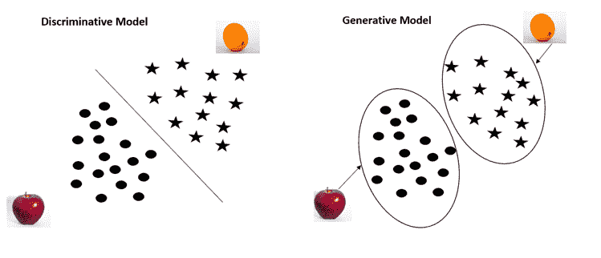

简而言之，判别模型学习寻找以最佳方式分隔类的决策边界，而生成模型学习每个类的特征。

判别模型根据输入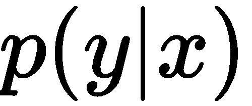预测标签，而生成模型学习联合概率分布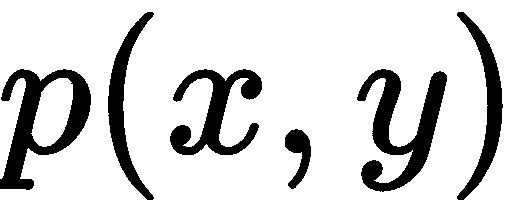。判别模型的例子包括逻辑回归、**支持向量机** ( **SVM** )等等，我们可以从训练集直接估计。生成模型的例子包括**马尔可夫随机场**和**朴素贝叶斯**，其中首先我们估计来确定:

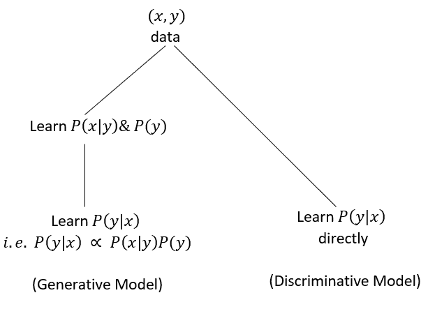


# 向甘斯问好！

2014 年，伊恩·J·古德菲勒、让·普盖-阿巴迪、迈赫迪·米尔扎、徐炳、大卫·沃德-法利、谢尔吉尔·奥泽尔、亚伦·库维尔和约舒阿·本吉奥在他们的论文*中首次介绍了甘。*

gan 广泛用于生成新的数据点。它们可以应用于任何类型的数据集，但它们通常用于生成图像。GANs 的一些应用包括生成逼真的人脸，将灰度图像转换为彩色图像，将文本描述转换为逼真的图像，等等。

Yann LeCun 对 GANs 说了以下的话:

“过去 20 年深度学习中最酷的想法。”

近几年来，GANs 进化得如此之快，以至于它们可以生成非常逼真的图像。下图显示了过去五年中 GANs 在生成图像方面的发展:

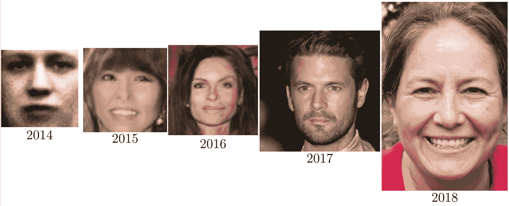

已经对甘斯感兴趣了吗？现在，我们将看看它们到底是如何工作的。在继续之前，让我们考虑一个简单的类比。假设你是警察，你的任务是找到假币，而假币制造者的角色是制造假币，欺骗警察。

伪造者不断试图以如此逼真的方式制造假币，以至于无法将其与真币区分开来。但是警察必须鉴别这些钱是真的还是假的。因此，伪造者和警察本质上玩一个两人游戏，其中一个试图击败另一个。GANs 的工作是这样的。它们由两个重要部分组成:

*   发电机
*   鉴别器

你可以把生产者比作造假者，而鉴别者比作警察。即发生器的作用是制造假钱，鉴别器的作用是鉴别钱的真假。

不赘述，首先对 GANs 有个基本的了解。假设我们希望我们的 GAN 生成手写数字。我们如何做到这一点？首先，我们将获取一个包含手写数字集合的数据集；比如说，MNIST 数据集。生成器学习我们数据集中图像的分布。因此，它在我们的训练集中学习手写数字的分布。一旦它学习了我们数据集中图像的分布，我们向生成器输入一个随机噪声，它就会根据学习到的分布将随机噪声转换成一个新的手写数字，类似于我们训练集中的数字:


鉴别器的目标是执行分类任务。给定一个图像，它将其分类为真或假；也就是说，图像是来自训练集还是由生成器生成:

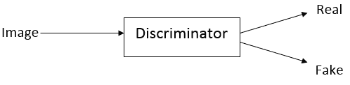

GAN 的生成器组件基本上是生成模型，鉴别器组件基本上是鉴别模型。因此，生成器学习类的分布，鉴别器学习类的判定边界。

如下图所示，我们向生成器输入一个随机噪声，然后它将这个随机噪声转换成一个新的图像*，它与我们在训练集中的图像*相似，但与训练集中的图像不完全相同。生成器生成的图像称为假图像，我们训练集中的图像称为真图像。我们把真的和假的图像都输入鉴别器，鉴别器告诉我们它们是真的概率。如果图像是假的，则返回 0，如果图像是真的，则返回 1:

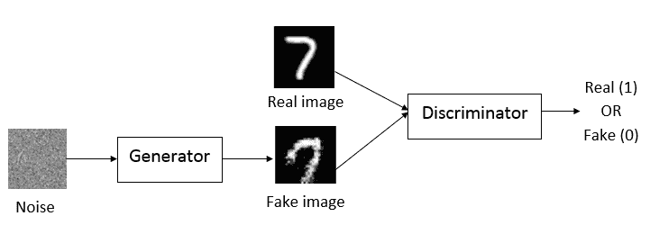

现在我们对生成器和鉴别器有了基本的了解，我们将详细研究每个组件。


# 分解发电机

GAN 的生成器组件是一个生成模型。当我们说生成模型时，有两种类型的生成模型——一种**隐式**和一种**显式**密度模型。隐式密度模型不使用任何显式密度函数来学习概率分布，而显式密度模型，顾名思义，使用显式密度函数。GANs 属于第一类。也就是说，它们是一个隐式的密度模型。让我们详细研究并理解 GANs 是一个怎样的隐式密度模型。

假设我们有一个发电机，。它基本上是一个由参数化的神经网络。生成器网络的作用是生成新图像。他们是怎么做到的？发电机的输入应该是什么？

我们从正态或均匀分布中抽取随机噪声。我们将这个随机噪声作为输入输入到生成器，然后它将这个噪声转换成图像:

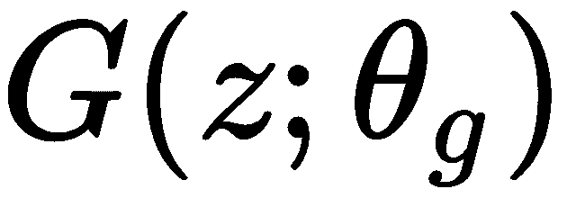

令人惊讶，不是吗？生成器如何将随机噪声转换为真实图像？

假设我们有一个包含人脸集合的数据集，我们希望我们的生成器生成一个新的人脸。首先，生成器通过学习我们训练集中图像的概率分布来学习人脸的所有特征。一旦生成器学习到正确的概率分布，它就可以生成全新的人脸。

但是生成器如何学习训练集的分布呢？也就是说，生成器如何学习人脸图像在训练集中的分布？

发电机只不过是一个神经网络。所以，发生的事情是神经网络隐式地学习我们训练集中图像的分布；让我们称这种分布为发电机分布，。在第一次迭代中，生成器生成一个非常嘈杂的图像。但是经过一系列迭代，它会学习我们训练集的准确概率分布，并通过调整其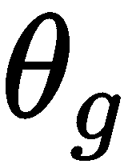参数来学习生成正确的图像。

值得注意的是，我们没有使用均匀分布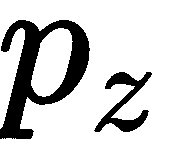来学习我们的训练集的分布。它仅用于对随机噪声进行采样，我们将该随机噪声作为输入提供给发生器。生成器网络隐式地学习我们的训练集的分布，我们称这种分布为生成器分布，，这就是为什么我们称我们的生成器网络为隐式密度模型。


# 分解鉴别器

顾名思义，鉴别器是一种鉴别模型。假设我们有一个鉴别器，。它也是一个神经网络，由参数化。

鉴别器的目标是区分两个类。也就是说，给定一个图像，它必须识别该图像是来自真实分布还是虚假分布(生成器分布)。也就是说，鉴别器必须识别给定的输入图像是来自训练集还是由生成器生成的假图像:

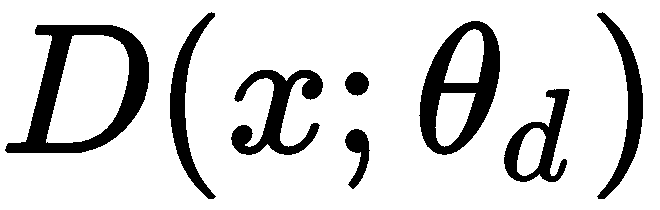

让我们把我们训练集的分布称为真实数据分布，用来表示。我们知道发电机分布用表示。

因此，鉴别器本质上试图鉴别图像是来自还是。


# 但是他们是如何学习的呢？

到目前为止，我们只是研究了生成器和鉴别器的作用，但它们究竟是如何学习的呢？生成器如何学习生成新的逼真图像，鉴别器如何学习正确区分图像？

我们知道生成器的目标是以这样一种方式生成图像，以欺骗鉴别者相信生成的图像来自真实的分布。

在第一次迭代中，生成器生成一个噪声图像。当我们把这个图像馈送给鉴别器时，鉴别器可以很容易地检测出这个图像是来自一个生成器分布。生成器认为这是一种损失，并试图改善自己，因为它的目标是欺骗鉴别器。也就是说，如果生成器知道鉴别器很容易将生成的图像检测为伪图像，则意味着它没有生成与训练集中的图像相似的图像。这意味着它还没有学习到训练集的概率分布。

因此，生成器以这样的方式调整其参数，以便学习训练集的正确概率分布。因为我们知道生成器是一个神经网络，所以我们简单地通过反向传播来更新网络的参数。一旦它学习了真实图像的概率分布，那么它可以生成与训练集中的图像相似的图像。

好吧，那鉴别器呢？它是如何学习的？正如我们所知，鉴别器的作用是鉴别真假图像。

如果鉴别器对生成的图像分类不正确；也就是说，如果鉴别器将假图像分类为真图像，那么这意味着鉴别器没有学会区分真图像和假图像。因此，我们通过反向传播来更新鉴别器网络的参数，以使鉴别器学会区分真假图像。

所以，基本上，生成器试图通过学习真实的数据分布来欺骗鉴别器，鉴别器试图找出图像是来自真实的还是虚假的分布。现在的问题是，鉴于生成器和鉴别器都在相互竞争，我们什么时候停止训练网络？

基本上，GAN 的目标是生成与训练集中的图像相似的图像。假设我们想要生成一张人脸——我们学习训练集中图像的分布，并生成新的人脸。因此，对于发电机，我们需要找到最佳鉴别器。我们这样说是什么意思？

我们知道发电机分布由表示，真实数据分布由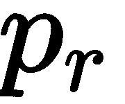表示。如果发生器很好地学习了真实数据分布，那么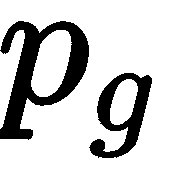等于，如下图所示:

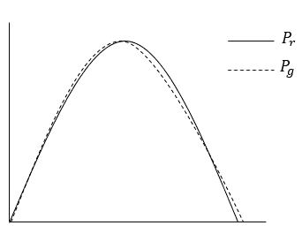

当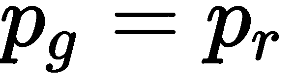时，鉴别器无法区分输入图像是来自真实分布还是虚假分布，因此它将仅返回 0.5 作为概率，因为当两个分布相同时，鉴别器将在两个分布之间混淆。

因此，对于发电机，最佳鉴别器可由下式给出:


所以，当鉴别器只是返回任意图像的概率为 0.5 时，那么我们就可以说，生成器已经学习了我们训练集中图像的分布，成功地骗过了鉴别器。


# GAN 的体系结构

GAN 的架构如下图所示:

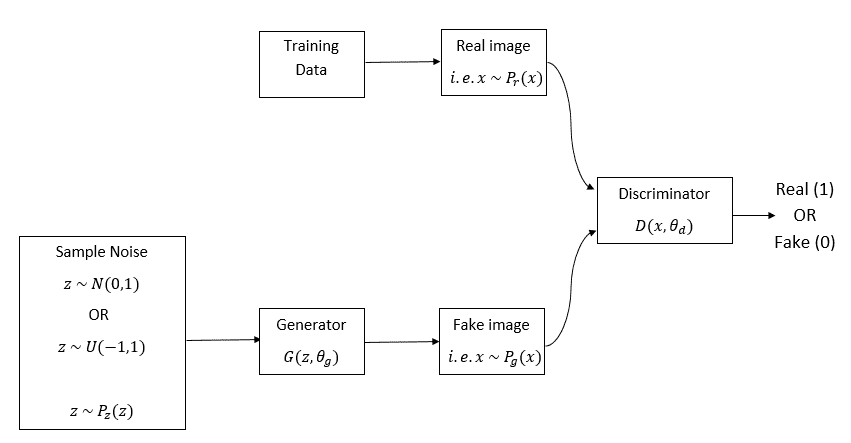

如上图所示，**生成器** 通过从均匀或正态分布中采样，将随机噪声作为输入，并通过隐式学习训练集的分布来生成假图像。

我们从真实数据分布和虚假数据分布中采样图像，并将其馈送给鉴别器。我们将真实和伪造的图像提供给鉴别器，鉴别器执行二元分类任务。也就是说，当图像是假的时，它返回 0，当图像是真的时，它返回 1。


# 揭秘损失函数

现在我们将检查 GAN 的损失函数。在继续之前，让我们回顾一下符号:

*   作为发电机输入的噪声由表示
*   从其采样噪声的均匀或正态分布由表示
*   输入图像由表示
*   真实数据分布或我们训练集的分布由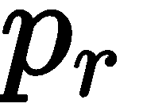表示
*   假数据分布或发生器分布由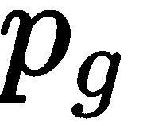表示

当我们写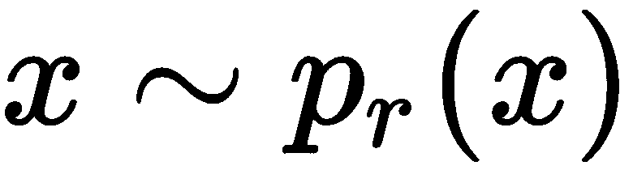时，它意味着图像是从真实分布中采样的。类似地，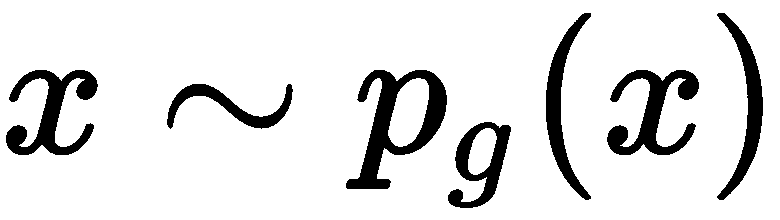表示图像是从发生器分布采样的，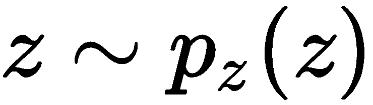意味着发生器输入是从均匀分布采样的。

我们已经知道，生成器和鉴别器都是神经网络，它们都通过反向传播来更新它们的参数。我们现在需要找到最佳发生器参数和鉴别器参数。

鉴频器损耗


# 现在我们来看看鉴频器的损耗函数。我们知道鉴别器的目标是分类图像是真实图像还是伪造图像。让我们用来表示鉴别器。

鉴频器的损耗函数如下所示:


然而，这意味着什么呢？让我们逐一理解每一个术语。

首项


# 我们来看第一项:


在这里，暗示我们是从真实的数据分布中采样输入，，所以是真实的图像。

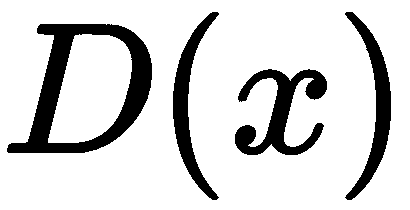表示我们正在将输入图像送入鉴别器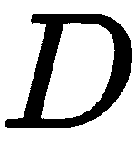，鉴别器将返回输入图像为真实图像的概率。由于是从真实数据分布中采样的，我们知道是真实图像。所以，我们需要最大化的概率:

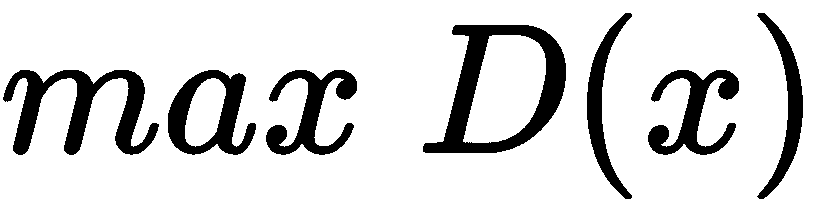

但是我们不是最大化原始概率，而是最大化对数概率；正如我们在[第七章](d184e022-0b11-492a-8303-37a6021c4bf6.xhtml)、*中所学的文字表述*，我们可以写出如下内容:


因此，我们的最终等式变成如下:


表示从真实数据分布中采样的输入图像的对数似然的期望值是真实的。

第二学期


# 现在，让我们看看第二项:

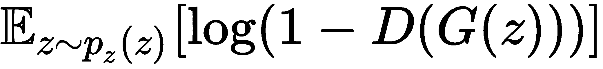

这里，意味着我们从均匀分布中采样一个随机噪声。意味着生成器将随机噪声作为输入，并基于其隐式学习的分布返回一个假图像。

表示我们正在将生成器生成的假图像提供给鉴别器，它将返回假输入图像是真实图像的概率。

如果我们从 1 中减去，那么它将返回伪输入图像是伪图像的概率:

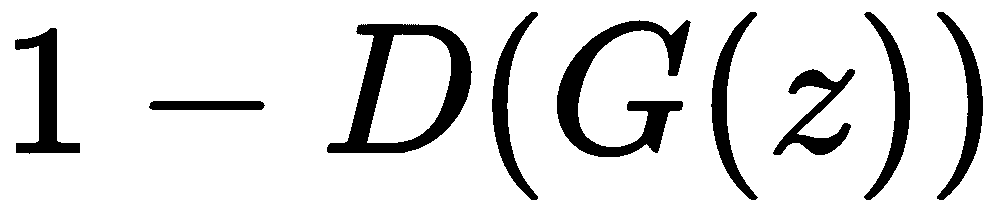

因为我们知道不是真实的图像，鉴别器将最大化这个概率。也就是说，鉴别器使被归类为伪图像的概率最大化，所以我们写:


我们不是最大化原始概率，而是最大化对数概率:


暗示由生成器生成的输入图像的对数似然性的期望是假的。

 implies the expectations of the log likelihood of the input images generated by the generator being fake.

期末


# 因此，结合这两项，鉴频器的损耗函数如下所示:


这里，和分别是发生器和鉴别器网络的参数。所以，鉴别器的目标是找到正确的，这样它就可以正确地对图像进行分类。

发电机损耗


# 发电机的损耗函数如下所示:


我们知道生成器的目标是骗过鉴别器把假图像归类为真图像。

在*鉴别器损失*部分，我们看到暗示了将假输入图像分类为假图像的概率，鉴别器最大化了将假图像正确分类为假的概率。

但是生成器想要最小化这个概率。由于生成器想要欺骗鉴别器，所以它最小化了假输入图像被鉴别器分类为假的概率。因此，发电机的损耗函数可以表示如下:


全损


# 我们刚刚学习了发生器和鉴频器的损耗函数，结合这两个损耗，我们将最终损耗函数写为:


因此，我们的目标函数基本上是最小-最大目标函数，即鉴别器最大化和发生器最小化，我们通过反向传播各自的网络找到最佳发生器参数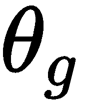和鉴别器参数。

So, our objective function is basically a min-max objective function, that is, a maximization for the discriminator and minimization for the generator, and we find the optimal generator parameter, , and discriminator parameter, , through backpropagating the respective networks.

所以，我们执行梯度上升；也就是说，在鉴别器上最大化:

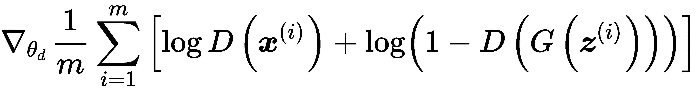

并且，我们执行梯度下降；也就是说，发电机的最小化:

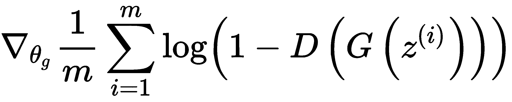

然而，优化前面的生成器目标函数不能正常工作，并且会导致稳定性问题。因此，我们引入一种新的损失形式，称为**启发式损失**。

启发式损失


# 鉴频器的损耗函数没有变化。可以直接写成这样:

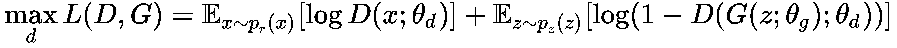

现在，我们来看看发电机损耗:

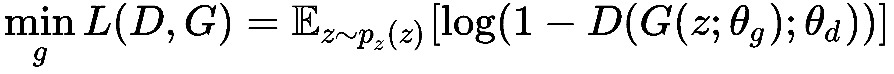

我们能否像鉴频器损耗一样，将发电机损耗函数中的最小化目标转换为最大化目标？我们如何做到这一点？我们知道返回的是假输入图像是假的概率，生成器正在最小化这个概率。

我们可以不这么做，而是写。它意味着假输入图像是真实的概率，现在生成器可以最大化这个概率。这意味着生成器最大化了伪输入图像被分类为真实图像的概率。因此，我们的发电机的损失函数现在变成如下:

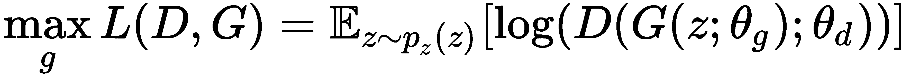

现在，我们有了鉴别器和发生器的最大化损失函数:


但是，不是最大化，如果我们可以最小化损失，那么我们可以应用我们最喜欢的梯度下降算法。那么，我们如何将最大化问题转化为最小化问题呢？我们可以通过简单地添加一个负号来实现。

因此，鉴频器的最终损耗函数如下所示:

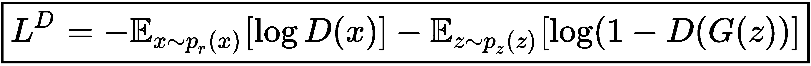

此外，发电机损耗如下所示:


在 TensorFlow 中使用 GANs 生成图像


# 让我们通过构建 GANs 在 TensorFlow 中生成手写数字来加强对 GANs 的理解。你也可以在[http://bit.ly/2wwBvRU](http://bit.ly/2wwBvRU)查看本节使用的完整代码。

首先，我们将导入所有必需的库:

First, we will import all the necessary libraries:

```
import warnings
warnings.filterwarnings('ignore')

import numpy as np
import tensorflow as tf
from tensorflow.examples.tutorials.mnist import input_data
tf.logging.set_verbosity(tf.logging.ERROR)

import matplotlib.pyplot as plt
%matplotlib inline

tf.reset_default_graph()
```

读取数据集


# 加载 MNIST 数据集:

让我们绘制一幅图像:

```
data = input_data.read_data_sets("data/mnist",one_hot=True)
```

输入图像如下所示:

```
plt.imshow(data.train.images[13].reshape(28,28),cmap="gray")
```

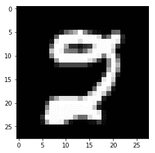

定义生成器


# 生成器将噪声作为输入并返回图像。我们将生成器定义为一个具有三层的前馈网络。我们可以使用`tf.layers.dense()`来创建一个密集层，而不是从头开始编写生成器网络。它需要三个参数:`inputs`、`units`的数量和`activation`函数:

定义鉴别器

```
def generator(z,reuse=None):

    with tf.variable_scope('generator',reuse=reuse):

        hidden1 = tf.layers.dense(inputs=z,units=128,activation=tf.nn.leaky_relu)
        hidden2 = tf.layers.dense(inputs=hidden1,units=128,activation=tf.nn.leaky_relu)
        output = tf.layers.dense(inputs=hidden2,units=784,activation=tf.nn.tanh)

        return output
```


# 我们知道鉴别器返回给定图像真实的概率。我们也将鉴别器定义为具有三层的前馈网络:

定义输入占位符

```
def discriminator(X,reuse=None):

    with tf.variable_scope('discriminator',reuse=reuse):

        hidden1 = tf.layers.dense(inputs=X,units=128,activation=tf.nn.leaky_relu)
        hidden2 = tf.layers.dense(inputs=hidden1,units=128,activation=tf.nn.leaky_relu)
        logits = tf.layers.dense(inputs=hidden2,units=1)
        output = tf.sigmoid(logits)

        return logits 
```


# 现在我们为输入和噪声定义`placeholder`:

启动 GAN！

```
x = tf.placeholder(tf.float32,shape=[None,784])
z = tf.placeholder(tf.float32,shape=[None,100])
```


# 首先，我们将噪声馈送给发生器，它将输出假图像， [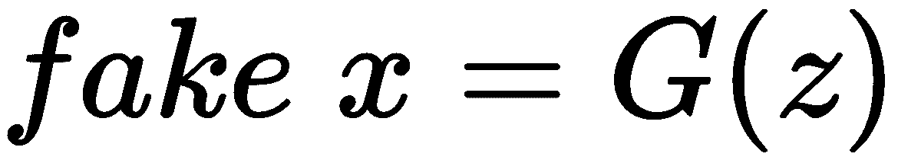] :

现在我们将真实图像输入到鉴别器 [] 中，得到真实图像真实的概率:

```
fake_x = generator(z)
```

类似地，我们将假图像提供给鉴别器并得到假图像为真的概率:

```
D_logits_real = discriminator(x)
```

计算损失函数

```
D_logits_fake = discriminator(fake_x,reuse=True)
```


# 现在，我们将看到如何计算损失函数。

鉴频器损耗


# 鉴频器损耗计算如下:


首先，我们将实现第一个术语。

第一项表示从真实数据分布中采样的图像的对数似然性的期望值是真实的。

基本上就是二元交叉熵损失。我们可以用`tf.nn.sigmoid_cross_entropy_with_logits()`TensorFlow函数实现二进制交叉熵损失。它采用两个参数作为输入，`logits`和`labels`，解释如下:

`logits`输入，顾名思义，是网络的逻辑，所以是`D_logits_real`。

*   `labels`输入，顾名思义，才是真正的标签。我们知道鉴别器应该为真实图像返回`1`,为虚假图像返回`0`。由于我们正在计算从真实数据分布中采样的输入图像的损失，因此真实标签为`1`。
*   我们使用`tf.ones_likes()`将标签设置为 1，形状与`D_logits_real`相同。那就是，`labels = tf.ones_like(D_logits_real)`。

然后我们使用`tf.reduce_mean()`计算平均损失。如果你注意到，在我们的损失函数中有一个负号，这是我们添加的，用于将我们的损失转换为最小化目标。但是，在下面的代码中，没有负号，因为TensorFlow优化器只会最小化而不会最大化。因此，我们不必在实现中添加负号，因为在任何情况下，TensorFlow优化器都会将其最小化:

现在我们将实现第二个术语。

```
D_loss_real = tf.reduce_mean(tf.nn.sigmoid_cross_entropy_with_logits(logits=D_logits_real,
 labels=tf.ones_like(D_logits_real)))
```

第二项，，暗示了由生成器生成的图像是假的对数似然的预期。

The second term,, implies the expectations of the log likelihood of images generated by the generator being fake.

类似于第一项，我们可以使用`tf.nn.sigmoid_cross_entropy_with_logits()`来计算二元交叉熵损失。在这方面，以下情况成立:

Logits 是`D_logits_fake`

*   由于我们正在计算生成器生成的假图像的损失，因此`true`标签为`0`
*   我们使用`tf.zeros_like()`将标签设置为`0`，其形状与`D_logits_fake`相同。也就是`labels = tf.zeros_like(D_logits_fake)`:

现在我们将实施最终损失。

```
D_loss_fake = tf.reduce_mean(tf.nn.sigmoid_cross_entropy_with_logits(logits=D_logits_fake,
 labels=tf.zeros_like(D_logits_fake)))
```

因此，结合前面两项，鉴频器的损耗函数如下所示:

发电机损耗

```
D_loss = D_loss_real + D_loss_fake
```


# 发电机损耗如所示。

它意味着伪图像被分类为真实图像的概率。由于我们在鉴频器中计算了二进制交叉熵，因此我们使用`tf.nn.sigmoid_cross_entropy_with_logits()`来计算发生器中的损耗。

在此，应牢记以下几点:

逻辑是`D_logits_fake`。

*   因为我们的损失意味着假输入图像被分类为真实图像的概率，所以真实标签是 1。因为，正如我们所了解的，生成器的目标是生成假图像，并欺骗鉴别器将假图像归类为真图像。

*   Since our loss implies the probability of the fake input image being classified as real, the true label is 1\. Because, as we learned, the goal of the generator is to generate the fake image and fool the discriminator to classify the fake image as a real image.

我们使用`tf.ones_like()`将标签设置为 1，形状与`D_logits_fake`相同。那就是，`labels = tf.ones_like(D_logits_fake)`:

优化损失

```
G_loss = tf.reduce_mean(tf.nn.sigmoid_cross_entropy_with_logits(logits=D_logits_fake, labels=tf.ones_like(D_logits_fake)))
```


# 现在我们需要优化我们的生成器和鉴别器。因此，我们将鉴频器和发生器的参数分别收集为和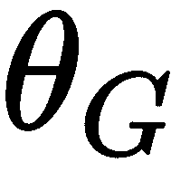:

使用 Adam 优化器优化损失:

```
training_vars = tf.trainable_variables()
theta_D = [var for var in training_vars if 'dis' in var.name]
theta_G = [var for var in training_vars if 'gen' in var.name]
```

开始训练

```
learning_rate = 0.001

D_optimizer = tf.train.AdamOptimizer(learning_rate).minimize(D_loss,var_list = theta_D)
G_optimizer = tf.train.AdamOptimizer(learning_rate).minimize(G_loss, var_list = theta_G)
```


# 让我们从定义批量大小和时期数开始培训:

初始化所有变量:

```
batch_size = 100
num_epochs = 1000
```

生成手写数字

```
init = tf.global_variables_initializer()
```


# 启动 TensorFlow 会话并生成手写数字:

Start the TensorFlow session and generate handwritten digits:

```
with tf.Session() as session:
```

初始化所有变量:

要对每个时期执行此操作:

```
    session.run(init)
```

选择批次数量:

```
    for epoch in range(num_epochs):
```

要对每个批次执行此操作:

```
        num_batches = data.train.num_examples // batch_size
```

根据批量大小获取批量数据:

```
        for i in range(num_batches):
```

重塑数据:

```
            batch = data.train.next_batch(batch_size)
```

对批量噪音进行采样:

```
            batch_images = batch[0].reshape((batch_size,784))
            batch_images = batch_images * 2 - 1
```

定义输入`x`为`batch_images`，噪声`z`为`batch_noise`的馈电字典:

```

            batch_noise = np.random.uniform(-1,1,size=(batch_size,100))
```

训练鉴别器和发生器:

```
            feed_dict = {x: batch_images, z : batch_noise}
```

计算鉴频器和发电机的损耗:

```
            _ = session.run(D_optimizer,feed_dict = feed_dict)
            _ = session.run(G_optimizer,feed_dict = feed_dict)
```

Compute loss of discriminator and generator:

```
            discriminator_loss = D_loss.eval(feed_dict)
            generator_loss = G_loss.eval(feed_dict)

```

每隔 100 ^个周期将噪声馈入发生器，并生成一幅图像:

在培训过程中，我们注意到损失如何减少，以及 GANs 如何学习生成图像，如下所示:

```
        if epoch%100==0:
            print("Epoch: {}, iteration: {}, Discriminator Loss:{}, Generator Loss: {}".format(epoch,i,discriminator_loss,generator_loss))

            _fake_x = fake_x.eval(feed_dict)

            plt.imshow(_fake_x[0].reshape(28,28))
            plt.show()
```

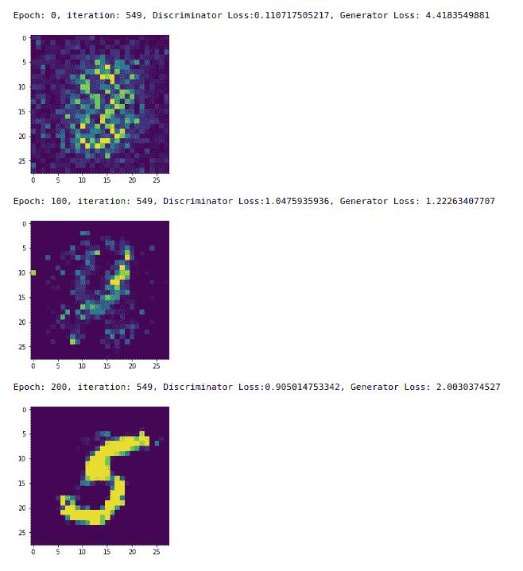

DCGAN–向 GAN 添加卷积


# 我们刚刚了解到 GANs 有多有效，以及如何使用它们来生成图像。我们知道，GAN 有两个组件，一个是生成镜像的生成器，另一个是鉴别器，它对生成的镜像进行鉴别。正如你所看到的，这两个生成器和鉴别器基本上都是前馈神经网络。不保留它们作为前馈网络，可以用卷积网络吗？

在[第 6 章](af0b9e75-a9a0-4bc7-ad23-92d2ac4a2629.xhtml)、*揭秘卷积网络*中，我们已经看到了卷积网络对于基于图像的数据的有效性，以及它们如何以无人监管的方式从图像中提取特征。因为在 GANs 中我们生成图像，所以最好使用卷积网络而不是前馈网络。所以，我们推出一种新型 GAN，叫做 **DCGAN** 。它扩展了修道院的设计。我们基本上是用一个**卷积神经网络** ( **CNN** )代替发生器和鉴别器中的前馈网络。

鉴别器使用卷积层来将图像分类为伪图像或真实图像，而生成器使用卷积转置层来生成新图像。现在，我们将详细讨论 DCGAN 中的生成器和鉴别器与普通 GAN 相比有何不同。

去卷积生成器


# 我们知道生成器的作用是通过学习真实的数据分布来生成新的图像。在 DCGAN 中，生成器由具有 ReLU 激活的卷积转置层和批量范数层组成。

注意，卷积转置操作也称为去卷积操作或分数步长卷积。

生成器的输入是噪声，我们从标准正态分布中提取，它输出与训练数据中的图像大小相同的图像，比如 64 x 64 x 3。

发电机的结构如下图所示:

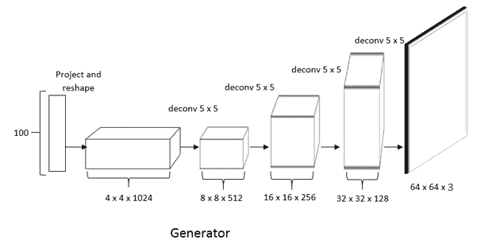

首先，我们将 100 x 1 形状的噪声 *z* 转换为 1024 x 4 x 4 的形状，以具有宽度、高度和特征图的形状，它被称为**项目和整形**。接下来，我们用分数步长卷积执行一系列卷积运算。除了最后一层之外，我们对每一层都应用批量标准化。此外，我们将 ReLU 激活应用于除最后一层以外的每一层。我们应用 tanh 激活函数在-1 和+1 之间缩放生成的图像。

卷积鉴别器


# 现在我们将看到 DCGAN 中鉴别器的架构。正如我们所知，鉴别器获取图像，并告诉我们该图像是真实图像还是虚假图像。因此，它基本上是一个二元分类器。鉴别器由一系列具有泄漏 ReLU 激活的卷积和批量范数层组成。

鉴别器的架构如下图所示:


正如您所看到的，它采用 64 x 64 x 3 形状的输入图像，并使用泄漏 ReLU 激活函数执行一系列卷积运算。我们在除输入层之外的所有层应用批量标准化。

记住，我们没有在鉴别器和生成器中都应用最大池操作。相反，我们应用一个步长卷积运算(即具有步长的卷积运算)。

简而言之，我们通过用卷积网络替换发生器中的前馈网络和鉴别器来增强普通 GAN。

实现 DCGAN 以生成 CIFAR 图像


# 现在我们将看看如何在 TensorFlow 中实现 DCGAN。我们将学习如何对来自**加拿大高级研究所** ( **CIFAR** )-10 数据集的图像使用 DCGAN。CIFAR-10 由来自 10 个不同类别的 60，000 张图像组成，包括飞机、汽车、鸟类、猫、鹿、狗、青蛙、马、船只和卡车。我们将研究如何使用 DCGAN 来生成这样的图像。

Now we will see how to implement DCGAN in TensorFlow. We will learn how to use DCGAN with images from the **Canadian Institute For Advanced Research** (**CIFAR**)-10 dataset. CIFAR-10 consists of 60,000 images from 10 different classes that include airplanes, cars, birds, cats, deer, dogs, frogs, horses, ships, and trucks. We will examine how we can use DCGAN to generate such images.

首先，导入所需的库:

探索数据集

```
import warnings
warnings.filterwarnings('ignore')

import numpy as np
import tensorflow as tf
from tensorflow.examples.tutorials.mnist import input_data
tf.logging.set_verbosity(tf.logging.ERROR)

from keras.datasets import cifar10

import matplotlib.pyplot as plt
%matplotlib inline
from IPython import display

from scipy.misc import toimage
```


# 加载 CIFAR 数据集:

让我们看看我们的数据集中有什么。定义用于绘制图像的辅助函数:

```
(x_train, y_train), _ = cifar10.load_data()

x_train = x_train.astype('float32')/255.0
```

让我们绘制一些图像:

```
def plot_images(X):
    plt.figure(1)
    z = 0
    for i in range(0,4):
        for j in range(0,4):
            plt.subplot2grid((4,4),(i,j))
            plt.imshow(toimage(X[z]))
            z = z + 1

    plt.show()
```

绘制的图像如下所示:

```
plot_images(x_train[:17])
```

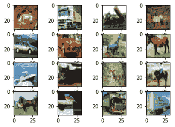

定义鉴别器


# 我们将鉴别器定义为一个卷积网络，它有三个卷积层，后面是一个全连接层。它由一系列具有泄漏 ReLU 激活的卷积和批量范数层组成。我们在除输入层之外的所有层上应用批量标准化:

具有泄漏 ReLU 激活的第一卷积层:

```
def discriminator(input_images, reuse=False, is_training=False, alpha=0.1):

    with tf.variable_scope('discriminator', reuse= reuse):
```

具有批量归一化和泄漏 ReLU 激活的第二卷积层:

```
        layer1 = tf.layers.conv2d(input_images, 
                                  filters=64, 
                                  kernel_size=5, 
                                  strides=2, 
                                  padding='same', 
                                  kernel_initializer=kernel_init, 
                                  name='conv1')

        layer1 = tf.nn.leaky_relu(layer1, alpha=0.2, name='leaky_relu1')
```

具有批量标准化和泄漏 ReLU 的第三卷积层:

```
        layer2 = tf.layers.conv2d(layer1, 
                                  filters=128, 
                                  kernel_size=5, 
                                  strides=2, 
                                  padding='same', 
                                  kernel_initializer=kernel_init, 
                                  name='conv2')
        layer2 = tf.layers.batch_normalization(layer2, training=is_training, name='batch_normalization2')

        layer2 = tf.nn.leaky_relu(layer2, alpha=0.2, name='leaky_relu2')
```

平坦化最终卷积层的输出:

```
        layer3 = tf.layers.conv2d(layer2, 
                                 filters=256, 
                                 kernel_size=5, 
                                 strides=1,
                                 padding='same',
                                 name='conv3')
        layer3 = tf.layers.batch_normalization(layer3, training=is_training, name='batch_normalization3')
        layer3 = tf.nn.leaky_relu(layer3, alpha=0.1, name='leaky_relu3')
```

定义全连接层并返回`logits`:

```
        layer3 = tf.reshape(layer3, (-1, layer3.shape[1]*layer3.shape[2]*layer3.shape[3]))

```

定义生成器

```
        logits = tf.layers.dense(layer3, 1)

        output = tf.sigmoid(logits)

        return logits  
```


# 正如我们所了解的，生成器执行转置卷积运算。生成器由卷积转置层和具有 ReLU 激活的批量范数层组成。除了最后一层之外，我们对每一层都应用批量标准化。此外，我们将 ReLU 激活应用到每一层，但是对于最后一层，我们应用`tanh`激活函数在-1 和+1 之间缩放生成的图像:

第一个完全连接的层:

```
def generator(z, z_dim, batch_size, is_training=False, reuse=False):
    with tf.variable_scope('generator', reuse=reuse):
```

First fully connected layer:

```
        input_to_conv = tf.layers.dense(z, 8*8*128)
```

转换输入的形状，并在 ReLU 激活后应用批处理规范化:

第二层，即转置卷积层，具有批量标准化和 ReLU 激活:

```
        layer1 = tf.reshape(input_to_conv, (-1, 8, 8, 128))
        layer1 = tf.layers.batch_normalization(layer1, training=is_training, name='batch_normalization1')
        layer1 = tf.nn.relu(layer1, name='relu1')
```

定义第三层:

```
        layer2 = tf.layers.conv2d_transpose(layer1, filters=256, kernel_size=5, strides= 2, padding='same', 
                                            kernel_initializer=kernel_init, name='deconvolution2')
        layer2 = tf.layers.batch_normalization(layer2, training=is_training, name='batch_normalization2')
        layer2 = tf.nn.relu(layer2, name='relu2')

```

定义第四层:

```
        layer3 = tf.layers.conv2d_transpose(layer2, filters=256, kernel_size=5, strides= 2, padding='same', 
                                            kernel_initializer=kernel_init, name='deconvolution3')
        layer3 = tf.layers.batch_normalization(layer3,training=is_training, name='batch_normalization3')
        layer3 = tf.nn.relu(layer3, name='relu3')
```

在最后一层，我们没有应用批处理规范化，而是使用`tanh`激活来代替 ReLU:

```
        layer4 = tf.layers.conv2d_transpose(layer3, filters=256, kernel_size=5, strides= 1, padding='same', 
                                            kernel_initializer=kernel_init, name='deconvolution4')
        layer4 = tf.layers.batch_normalization(layer4,training=is_training, name='batch_normalization4')
        layer4 = tf.nn.relu(layer4, name='relu4')
```

In the final layer, we don't apply batch normalization and instead of ReLU, we use `tanh` activation:

```
        layer5 = tf.layers.conv2d_transpose(layer4, filters=3, kernel_size=7, strides=1, padding='same', 
                                            kernel_initializer=kernel_init, name='deconvolution5')

        logits = tf.tanh(layer5, name='tanh')

        return logits
```

定义输入


# 定义输入的`placeholder`:

定义`placeholder`为学习率和训练布尔量:

```
image_width = x_train.shape[1]
image_height = x_train.shape[2]
image_channels = x_train.shape[3]

x = tf.placeholder(tf.float32, shape= (None, image_width, image_height, image_channels), name="d_input")
```

定义噪音的批量大小和尺寸:

```
learning_rate = tf.placeholder(tf.float32, shape=(), name="learning_rate")
is_training = tf.placeholder(tf.bool, [], name='is_training')
```

定义噪声的占位符， *z* :

```
batch_size = 100
z_dim = 100
```

启动 DCGAN

```
z = tf.random_normal([batch_size, z_dim], mean=0.0, stddev=1.0, name='z')
```


# 首先，我们将噪声馈送给发生器，它将输出假图像:

现在，我们将真实图像输入鉴别器并获得真实图像真实的概率:

```
fake_x = generator(z, z_dim, batch_size, is_training=is_training)
```

同样，我们将假图像输入鉴别器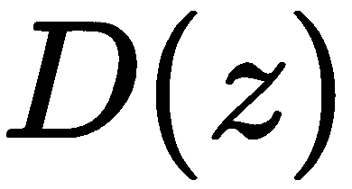，得到假图像为真的概率:

```
D_logit_real = discriminator(x, reuse=False, is_training=is_training)
```

计算损失函数

```
D_logit_fake = discriminator(fake_x, reuse=True,  is_training=is_training)
```


# 现在我们来看看如何计算损失函数。

Now we will see how to compute the loss function.

鉴频器损耗


# 损失函数与普通 GAN 的损失函数相同:

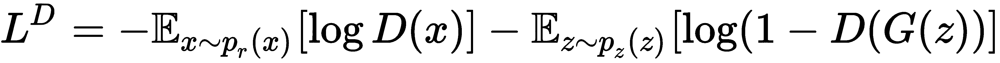

所以，我们可以直接写出以下内容:

发电机损耗

```
D_loss_real = tf.reduce_mean(tf.nn.sigmoid_cross_entropy_with_logits(logits=D_logits_real,
 labels=tf.ones_like(D_logits_real)))

D_loss_fake = tf.reduce_mean(tf.nn.sigmoid_cross_entropy_with_logits(logits=D_logits_fake,
 labels=tf.zeros_like(D_logits_fake)))

D_loss = D_loss_real + D_loss_fake
```


# 发电机损耗也与普通 GAN 相同:


我们可以使用下面的代码来计算它:

优化损失

```
G_loss = tf.reduce_mean(tf.nn.sigmoid_cross_entropy_with_logits(logits=D_logits_fake, labels=tf.ones_like(D_logits_fake)))
```


# 正如我们在 vanilla GANs 中看到的，我们收集鉴别器和发生器的参数，分别为和:

As we saw in vanilla GANs, we collect the parameters of the discriminator and generator as  and  respectively:

```
training_vars = tf.trainable_variables()
theta_D = [var for var in training_vars if 'dis' in var.name]
theta_G = [var for var in training_vars if 'gen' in var.name]
```

使用 Adam 优化器优化损失:

训练 DCGAN

```
d_optimizer = tf.train.AdamOptimizer(learning_rate).minimize(D_loss, var_list=theta_D)
g_optimizer = tf.train.AdamOptimizer(learning_rate).minimize(G_loss, var_list=theta_G)
```


# 让我们开始训练吧。定义批次数量、时期和学习率:

定义一个辅助函数，用于生成和绘制生成的图像:

```
num_batches = int(x_train.shape[0] / batch_size)
steps = 0
num_epcohs = 500
lr = 0.00002
```

开始培训:

```
def generate_new_samples(session, n_images, z_dim):

    z = tf.random_normal([1, z_dim], mean=0.0, stddev=1.0)

    is_training = tf.placeholder(tf.bool, [], name='training_bool') 

    samples = session.run(generator(z, z_dim, batch_size, is_training, reuse=True),feed_dict={is_training: True})

    img = (samples[0] * 255).astype(np.uint8)
    plt.imshow(img)
    plt.show()
```

初始化所有变量:

```
with tf.Session() as session:
```

要在每个时期执行:

```
    session.run(tf.global_variables_initializer())
```

To execute for each epoch:

```
    for epoch in range(num_epcohs):

        #for each batch
        for i in range(num_batches):
```

定义批次的开始和结束:

批量图像样本:

```
            start = i * batch_size
            end = (i + 1) * batch_size
```

每两步训练一次鉴别器:

```
            batch_images = x_train[start:end]
```

训练发电机和鉴别器:

```
            if(steps % 2 == 0):

                _, discriminator_loss = session.run([d_optimizer,D_loss], feed_dict={x: batch_images, is_training:True, learning_rate:lr})            
```

生成新图像:

```
            _, generator_loss = session.run([g_optimizer,G_loss], feed_dict={x: batch_images, is_training:True, learning_rate:lr})
            _, discriminator_loss = session.run([d_optimizer,D_loss], feed_dict={x: batch_images, is_training:True, learning_rate:lr})
```

在第一次迭代中，DCGAN 将生成原始像素，但在一系列迭代中，它将学习使用以下参数生成真实图像:

```
           display.clear_output(wait=True) 
            generate_new_samples(session, 1, z_dim)
            print("Epoch: {}, iteration: {}, Discriminator Loss:{}, Generator Loss: {}".format(epoch,i,discriminator_loss,generator_loss))   

            steps += 1
```

`Epoch: 0, iteration: 0, Discriminator Loss:1.44706475735, Generator Loss: 0.726667642593`

以下图像由 DCGAN 在第一次迭代中生成:

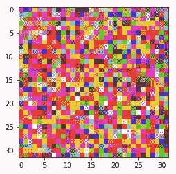

最小平方甘


# 我们刚刚学习了如何使用 gan 来生成图像。**最小二乘 GAN** ( **LSGAN** )是 GAN 的另一个简单变体。顾名思义，在这里，我们用最小二乘误差作为损失函数，而不是 sigmoid 交叉熵损失。借助 LSGAN，我们可以提高 GAN 生成的图像质量。但是我们怎么做呢？为什么香草甘产生质量差的图像？

如果你能回忆起 GAN 的损失函数，我们使用 sigmoid 交叉熵作为损失函数。生成器的目标是学习训练集中图像的分布，即真实数据分布，将其映射到伪分布，并根据学习到的伪分布生成伪样本。因此，甘一家试图绘制尽可能接近真实分布的假分布图。

但是一旦假样本在决策表面的正确一侧，那么梯度趋向于消失，即使假样本远离真实分布。这是由于 sigmoid 交叉熵损失。

让我们用下图来理解这一点。下图显示了使用 sigmoid 交叉熵作为损失函数的 vanilla GANs 的决策边界，其中假样本用十字表示，真实样本用点表示，用于更新生成器的假样本用星号表示。

正如您所观察到的，一旦生成器生成的假样本(星形)位于决策面的正确一侧，也就是说，一旦假样本位于真实样本(点)的一侧，那么梯度就会消失，即使假样本远离真实分布。这是由于 sigmoid 交叉熵损失，因为它不关心伪样本是否接近真实样本；它只寻找假样本是否在决策面的正确一边。这导致一个问题，即当梯度消失时，即使伪样本远离真实数据分布，生成器也无法获知数据集的真实分布:

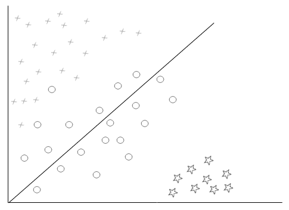

因此，我们可以将这个具有 sigmoid 交叉熵损失的决策表面变为最小平方损失。现在，正如您在下图中所看到的，尽管生成器生成的假样本位于决策面的正确一侧，但梯度不会消失，直到假样本与真实分布相匹配。最小平方损失迫使更新将假样本与真样本相匹配:

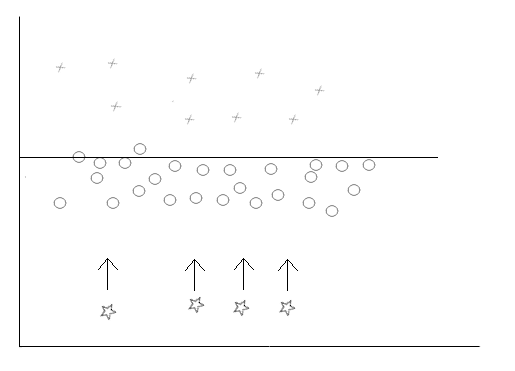

因此，由于我们将伪分布与真实分布进行匹配，当我们使用最小二乘法作为成本函数时，我们的图像质量将会得到提高。

简而言之，当伪样本位于决策面的正确一侧时，即使它们来自真实样本，即真实分布，也将停止 vanilla GANs 中的梯度更新。这是由于 sigmoid 交叉熵损失，并且它不关心伪样本是否接近真实样本，它只寻找伪样本是否在正确的一侧。这就导致了我们无法完美学习真实数据分布的问题。因此，我们使用 LSGAN，它使用最小平方误差作为损失函数，梯度更新不会停止，直到伪样本与真实样本匹配，即使伪样本位于决策边界的正确一侧。

损失函数

现在，我们已经知道最小二乘损失函数提高了发生器的图像质量，我们如何根据最小二乘重写 GANs 损失函数？


# 假设 *a* 和 *b* 分别是生成图像和真实图像的实际标号，那么我们可以用最小二乘损失来写鉴别器的损失函数如下:


同样，假设 *c* 是生成器想要鉴别器相信生成的图像是真实图像的实际标签，那么标签 *c* 代表真实图像。然后，我们可以用最小平方损耗来表示发电机的损耗函数，如下所示:


我们将真实图像的标签设为 1，将虚假图像的标签设为 0，因此 *b* 和 *c* 变为 1，而 *a* 变为 0。因此，我们的最终等式可以给出如下:

鉴频器的损耗函数如下所示:

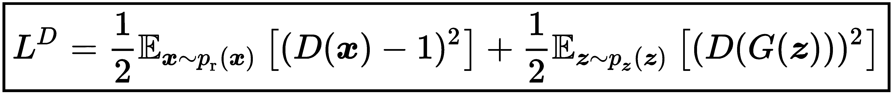

The loss function of the discriminator is given as follows:

发电机的损耗函数如下所示:


TensorFlow中的 LSGAN

实施 LSGAN 与传统 GAN 相同，只是损失函数有所变化。因此，我们将只看如何在 TensorFlow 中实现 LSGAN 的 loss 函数，而不是看整个代码。LSGAN 的完整代码可在 http://bit.ly/2HMCrrx[的 GitHub repo 中获得。](http://bit.ly/2HMCrrx)


# 现在让我们看看 LSGAN 的损失函数是如何实现的。

鉴频器损耗

鉴频器损耗计算如下:


# 

首先，我们将实现第一个术语，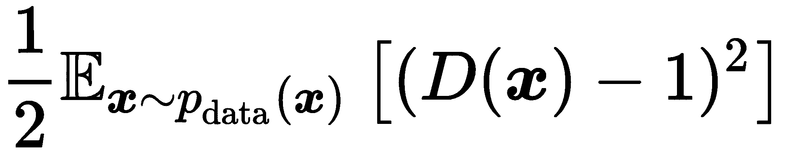:

现在我们将实现第二个术语，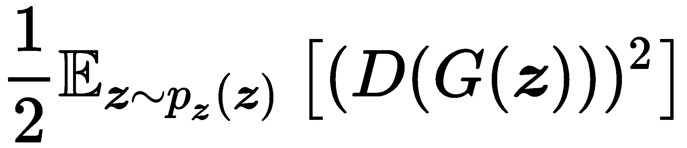:

最终鉴频器损耗可写为:

```
D_loss_real = 0.5*tf.reduce_mean(tf.square(D_logits_real-1))
```

发电机损耗

```
D_loss_fake = 0.5*tf.reduce_mean(tf.square(D_logits_fake))
```

发电机损耗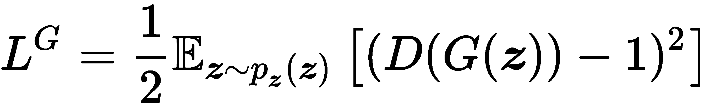如下所示:

```
D_loss = D_loss_real + D_loss_fake
```


# Generator loss

The generator loss, , is given as follows:

```
G_loss = 0.5*tf.reduce_mean(tf.square(D_logits_fake-1))
```

有瓦瑟斯坦距离的甘斯

现在我们将看到 GAN 的另一个非常有趣的版本，称为 Wasserstein GAN ( **WGAN** )。它使用 GAN 损失函数中的 Wasserstein 距离。首先，让我们了解为什么我们需要一个 Wasserstein 距离度量，以及我们当前的损失函数有什么问题。


# 在继续之前，首先，让我们简要地探讨两个流行的用于测量两个概率分布之间的相似性的散度度量。

**kull back-lei bler**(**KL**)散度是用来确定一个概率分布如何偏离另一个概率分布的最常用的方法之一。假设我们有两个离散的概率分布，和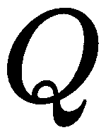，那么 KL 散度可以表示如下:


当两个分布连续时，KL 散度可以用积分形式表示，如下所示:

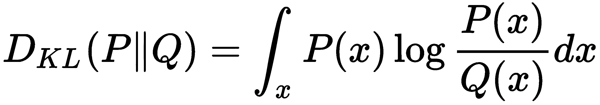

KL 散度是不对称的，意思如下:


**詹森-沙农** ( **JS** )散度是衡量两个概率分布相似性的另一个尺度。但与 KL 散度不同，JS 散度是对称的，可以给出如下:


我们是否最小化了 gan 中的 JS 差异？

我们知道，生成器试图学习真实的数据分布，，以便它可以从学习到的分布，中生成新的样本，鉴别器告诉我们图像是来自真实的还是虚假的分布。


# 我们还了解到，当时，鉴别器无法告诉我们图像是来自真实的还是伪造的分布。它只输出 0.5，因为它不能区分和。

因此，对于发电机，最佳鉴别器可由下式给出:


让我们回忆一下鉴别器的损失函数:


它可以简单地写为:


将等式 *(1)* 代入前面的等式，我们得到以下结果:


它可以按如下方式解决:


如你所见，我们基本上是在最小化 GAN 的损失函数中的 JS 发散。因此，最小化 GAN 的损失函数基本上意味着最小化真实数据分布和伪数据分布之间的 JS 散度，如图所示:


最小化和之间的 JS 散度表示生成器使它们的分布类似于真实数据分布。但是 JS 发散有个问题。从下图中可以看出，这两个分布之间没有重叠。当没有重叠或者当两个分布不共享相同的支持时，JS 发散将爆炸或者返回常数值，并且 gan 不能正确学习:


因此，为了避免这种情况，我们需要改变我们的损失函数。我们不是最小化 JS 散度，而是使用一个新的距离度量，称为 Wasserstein 距离，它告诉我们两个分布如何彼此分开，即使它们不共享相同的支持。

什么是瓦瑟斯坦距离？

Wasserstein 距离，也称为**推土机** ( **EM** )距离，是在我们需要将物品从一种配置移动到另一种配置的最佳运输问题中最常用的距离度量之一。

所以，当我们有两个分布，和， **** 暗示着概率分布需要多少功，来匹配概率分布。


# 让我们试着去理解 EM 距离背后的直觉。我们可以把概率分布看作质量的集合。我们的目标是将一种概率分布转换成另一种。将一种分布转换成另一种分布有许多可能的方法，但是 Wasserstein 度量标准试图找到转换成本最低的最佳和最小的方法。

转换的成本可以用距离乘以质量来表示。

从点 *x* 移动到点 *y* 的信息量为。它被称为**运输计划**。它告诉我们从 *x* 到 *y* 需要传输多少信息， *x* 和 *y* 之间的距离给定为。

因此，成本如下所示:


我们有许多 *(x，y)* 对，因此所有 *(x，y)* 对的期望值如下所示:


它意味着从点 *x* 到 *y* 的移动成本。从 *x* 到 *y* 有很多方法，但是我们只对最优路径感兴趣，也就是最小成本，所以我们将前面的等式改写如下:


在这里， *inf* 基本暗示了最小值。是和之间所有可能的联合分布的集合。

因此，在和之间所有可能的联合分布中，我们正在寻找使一个分布看起来像另一个分布所需的最小成本。

我们的最终等式可以给出如下:


然而，计算 Wasserstein 距离并不是一项简单的任务，因为很难穷尽所有可能的联合分布，，这变成了另一个优化问题。

为了避免这一点，我们引入 **Kantorovich-Rubinstein 对偶**。它将我们的等式转换成一个简单的最大化问题，如下所示:


好吧，但是上面的等式是什么意思？我们基本上是将**上确界**应用于所有的 **k-Lipschitz 函数**。等等。什么是 Lipschitz 函数，什么是上确界？让我们在下一节讨论这个问题。

揭开 k-李普希茨函数的神秘面纱

Lipschitz 连续函数是一个必须连续且几乎处处可微的函数。所以，对于任何一个 Lipschitz 连续的函数，函数图的斜率的绝对值不能超过一个常数。这个常数被称为**李普希兹**T4【常数】T5:


# 简单来说，我们可以说一个函数是 Lipschitz 连续的，当一个函数的求导被某个常数 *K* 所限制，并且永远不会超过这个常数。

比如说，是李普希兹连续的，因为它的导数被 1 所限制。同样，是 Lipschitz 连续的，因为它的斜率处处为-1 或 1。然而，它在 0 是不可微的。

那么，让我们回忆一下我们的等式:


在这里，上确界基本上是下确界的对立面。因此，Lipschitz 函数上的上确界意味着 k-Lipschitz 函数上的最大值。所以，我们可以这样写:


前面的等式基本上告诉我们，我们基本上是在寻找真实样本的期望值和生成样本的期望值之间的最大距离。

WGAN 的损失函数

好吧，我们为什么要学这些？我们之前看到在损失函数中存在 JS 发散的问题，所以我们求助于 Wasserstein 距离。现在，我们鉴别器的目标不再是说图像是来自真的还是假的分布；相反，它试图最大化真实样本和生成样本之间的距离。我们训练鉴别器来学习 Lipschitz 连续函数，用于计算真实和虚假数据分布之间的 Wasserstein 距离。

因此，鉴频器损耗计算如下:


# 

现在我们需要确保我们的函数在训练时是 k-Lipschitz 函数。因此，对于每次梯度更新，我们在下限和上限之间裁剪梯度的权重，比如说在-0.01 和+0.01 之间。

我们知道鉴频器损耗由下式给出:


我们不是最大化，而是通过添加一个负号将其转化为最小化目标:


发电机损耗与我们在香草甘斯中学到的一样。

因此，鉴频器的损耗函数为:


发电机的损耗函数由下式给出:


TensorFlow中的 WGAN

实现 WGAN 与实现普通 GAN 是一样的，只是 WGAN 的损耗函数会发生变化，我们需要对鉴频器的梯度进行削波。不看整体，只看如何实现 WGAN 的损失函数，如何对鉴频器的梯度进行削波。

我们知道鉴频器的损耗由下式给出:


# 

并且它可以如下实现:

我们知道发电机损耗由下式给出:


并且它可以如下实现:

```
D_loss = - tf.reduce_mean(D_real) + tf.reduce_mean(D_fake)
```

We know that generator loss is given as:

我们对鉴频器的梯度进行如下裁剪:

摘要

```
G_loss = -tf.reduce_mean(D_fake)
```

我们从理解生成模型和判别模型之间的区别开始这一章。我们了解到，判别模型学习寻找以最佳方式分隔类别的良好决策边界，而生成模型学习每个类别的特征。

后来，我们明白了 gan 是如何工作的。它们基本上由两个被称为生成器和鉴别器的神经网络组成。生成器的作用是通过学习真实数据分布来生成新的图像，而鉴别器充当批评家，其作用是告诉我们所生成的图像是来自真实数据分布还是虚假数据分布，基本上是真实图像还是虚假图像。

```
clip_D = [p.assign(tf.clip_by_value(p, -0.01, 0.01)) for p in theta_D]
```


# 接下来，我们学习了 DCGAN，其中我们用卷积神经网络取代了发生器和鉴别器中的前馈神经网络。鉴别器使用卷积层来将图像分类为假图像或真图像，而生成器使用卷积转置层来生成新图像。

然后，我们学习了 LSGAN，它用最小平方误差损失代替了发生器和鉴频器的损失函数。因为，当我们使用 sigmoid 交叉熵作为损失函数时，一旦伪样本位于决策边界的正确一侧，我们的梯度往往会消失，即使它们并不接近真实分布。因此，我们用最小平方误差损失代替交叉熵损失，其中梯度不会消失，直到伪样本匹配真实分布。它强制梯度更新以匹配假样本和真样本。

最后，我们学习了另一种有趣的 GAN，称为 Wassetrtain GAN，其中我们在鉴频器的损失函数中使用 Wasserstein 距离度量。因为在 vanilla GANs 中，我们基本上是最小化 JS 散度，当真实数据和虚假数据的分布不重叠时，它将是常数或结果为 0。为了克服这一点，我们在鉴别器的损失函数中使用了 Wasserstein 距离度量。

在下一章，我们将学习其他几种有趣的 GAN 类型，称为 CGAN、InfoGAN、CycleGAN 和 StackGAN。

Then, we learned about the LSGAN, which replaces the loss function of both the generator and the discriminator with a least squared error loss. Because, when we use sigmoid cross-entropy as a loss function, our gradients tend to vanish once the fake samples on the correct side of the decision boundary even though they are not close to the real distribution. So, we replace the cross-entropy loss with the least squared error loss where the gradients will not vanish till the fake samples match the true distribution. It forces the gradient updates to match the fake samples to the real samples.

Finally, we learned another interesting type of GAN called the Wassetrtain GAN where we use the Wasserstein distance measure in the discriminator's loss function. Because in vanilla GANs we are basically minimizing JS divergence and it will be constant or results in 0 when the distributions of real data and fake does not overlap. To overcome this, we used the Wasserstein distance measure in the discriminator's loss function.

问题

让我们通过回答以下问题来评估我们对 GANs 的了解:

生成型和判别型模型有什么区别？


# 解释发电机的作用。

解释鉴别器的作用。

1.  发生器和鉴别器的损失函数是什么？
2.  DCGAN 与普通 GAN 有何不同？
3.  什么是 KL 发散？
4.  定义瓦瑟斯坦距离。
5.  什么是 k-Lipschitz 连续函数？
6.  进一步阅读
7.  有关更多信息，请参考以下文件:
8.  *伊恩·J·古德菲勒等人的生成对抗网*，【https://arxiv.org/pdf/1406.2661.pdf】T2


# 亚历克·拉德福德、索史密斯·钦塔拉和卢克·梅茨，[https://arxiv.org/pdf/1511.06434.pdf](https://arxiv.org/pdf/1511.06434.pdf)利用深度卷积生成对抗网络的无监督表示学习

*最小二乘生成对抗网络*毛旭东等人，[https://arxiv.org/pdf/1611.04076.pdf](https://arxiv.org/pdf/1611.04076.pdf)

*   *Wasserstein GAN* 作者:Martin Arjovsky、Soumith Chintala 和 L eon Bottou，[https://arxiv.org/pdf/1701.07875.pdf](https://arxiv.org/pdf/1701.07875.pdf)
*   *Unsupervised Representation Learning with Deep Convolutional Generative Adversarial Networks* by Alec Radford, Soumith Chintala, and Luke Metz, [https://arxiv.org/pdf/1511.06434.pdf](https://arxiv.org/pdf/1511.06434.pdf)
*   *Least Squares Generative Adversarial Networks* by Xudong Mao, et al., [https://arxiv.org/pdf/1611.04076.pdf](https://arxiv.org/pdf/1611.04076.pdf)
*   *Wasserstein GAN* by Martin Arjovsky, Soumith Chintala, and L´eon Bottou, [https://arxiv.org/pdf/1701.07875.pdf](https://arxiv.org/pdf/1701.07875.pdf)