# 十、使用自编码器重构输入

**自编码器**是无监督学习算法。与其他算法不同，自编码器学习重建输入，也就是说，自编码器接受输入，并学习将输入作为输出再现。我们从理解什么是自编码器以及它们如何准确地重建输入开始这一章。然后，我们将学习自编码器如何重建 MNIST 图像。

接下来，我们将了解自编码器的不同变体；首先，我们将了解使用卷积层的**卷积自编码器**(**CAEs**)；然后，我们将了解**如何对自编码器**(**DAE**)进行去噪，这些编码器学习去除输入中的噪声。在此之后，我们将了解稀疏自编码器以及它们如何从稀疏输入中学习。在本章的最后，我们将学习一种有趣的生成型自编码器，叫做**变型自编码器**。我们将理解变分自编码器如何学习生成新的输入，以及它们与其他自编码器有何不同。

在本章中，我们将讨论以下主题:

*   自编码器及其体系结构
*   使用自编码器重建 MNIST 图像
*   卷积自编码器
*   构建卷积自编码器
*   降噪自编码器
*   使用去噪自编码器去除图像中的噪声
*   稀疏自编码器
*   收缩自编码器
*   可变自编码器


# 什么是自编码器？

自编码器是一种有趣的无监督学习算法。与其他神经网络不同，自编码器的目标是重构给定的输入；也就是说，自编码器的输出与输入相同。它由两个重要部件组成，称为**编码器**和**解码器**。

编码器的作用是通过学习输入的潜在表示对输入进行编码，解码器的作用是从编码器产生的潜在表示中重建输入。这种潜在的表现也被称为**瓶颈**或**代码**。如下图所示，图像作为输入传递给自编码器。编码器获取图像并学习图像的潜在表示。解码器获取潜在表示，并尝试重建图像:

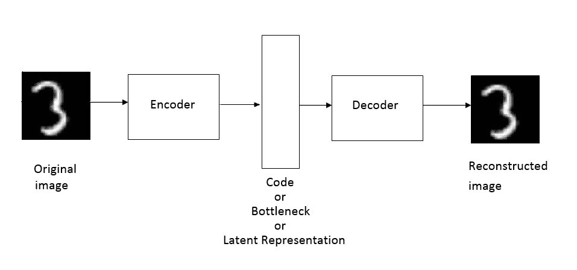

下图显示了一个简单的两层自编码器；您可能已经注意到，它由输入层、隐藏层和输出层组成。首先，我们将输入馈送到输入层，然后编码器学习输入的表示并将其映射到瓶颈。从瓶颈开始，解码器重建输入:

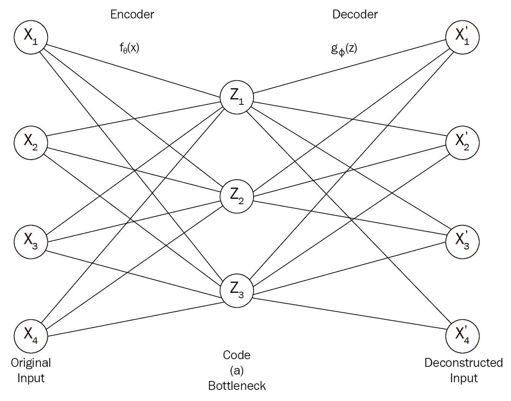

我们可能想知道这有什么用。为什么我们需要对输入进行编码和解码？为什么我们只需要重建输入？嗯，有各种各样的应用，比如降维、数据压缩、图像去噪等等。

由于自编码器会重构输入，因此输入层和输出层中的节点数总是相同的。假设我们有一个包含 100 个输入要素的数据集，并且我们有一个输入层为 100 个单元、隐藏层为 50 个单元、输出层为 100 个单元的神经网络。当我们将数据集提供给自编码器时，编码器试图学习数据集中的重要特征，并将特征的数量减少到 50 个，从而形成瓶颈。瓶颈包含数据的表示，即数据的嵌入，并且只包含必要的信息。然后，瓶颈被馈送到解码器以重构原始输入。如果解码器成功地重建了原始输入，则意味着编码器已经成功地学习了给定输入的编码或表示。也就是说，编码器通过捕获必要的信息，成功地将包含 100 个要素的数据集编码或压缩为仅包含 50 个要素的表示。

因此，本质上，编码器试图学习在不丢失有用信息的情况下减少数据的维数。我们可以认为自编码器类似于降维技术，如**主成分分析** ( **PCA** )。在 PCA 中，我们使用线性变换将数据投影到低维中，并移除不需要的特征。PCA 和自编码器的区别在于，PCA 使用线性变换进行降维，而自编码器使用非线性变换。

除了降维，自编码器还广泛用于图像、音频等的去噪。我们知道，自编码器中的编码器通过只学习必要的信息来降低数据集的维数，并形成瓶颈或代码。因此，当有噪声的图像作为输入被馈送到自编码器时，编码器仅学习图像的必要信息，并形成瓶颈。由于编码器只学习表示图像的重要和必要的信息，因此它知道噪声是不想要的信息，并从瓶颈中去除噪声的表示。

因此，现在我们将有一个瓶颈，即没有任何噪声信息的图像表示。当编码器的这种学习表示(即瓶颈)被提供给解码器时，解码器从编码器产生的编码中重建输入图像。由于编码没有噪声，重建的图像将不包含任何噪声。

简而言之，自编码器将我们的高维数据映射到低级别表示。数据的这种低级数据表示被称为**潜在表示**或**瓶颈**，它们仅具有表示输入的有意义且重要的特征。

由于我们的自编码器的作用是重建其输入，我们使用重建误差作为我们的损失函数，这意味着我们试图了解有多少输入被解码器正确地重建。因此，我们可以使用均方误差损失作为损失函数来量化自编码器的性能。

现在我们已经了解了什么是自编码器，我们将在下一节中探索自编码器的架构。


# 了解自编码器的架构

正如我们刚刚了解到的，自编码器由两个重要组件组成:一个编码器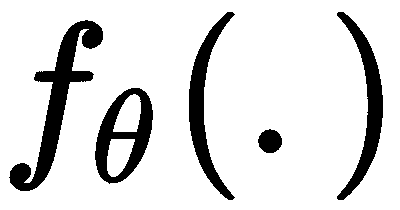和一个解码器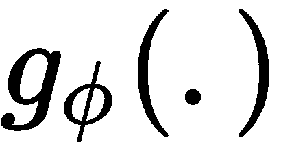。让我们仔细看看其中的每一个:

*   **编码器**:编码器学习输入并返回输入的潜在表示。假设我们有一个输入，。当我们将输入馈送给编码器时，它返回一个低维的输入潜在表示，称为代码或瓶颈，。我们用表示编码器的参数:

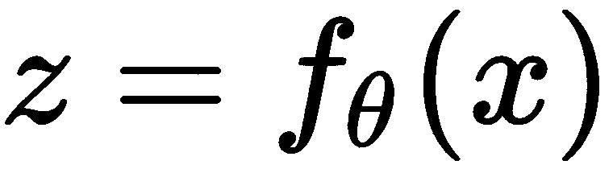

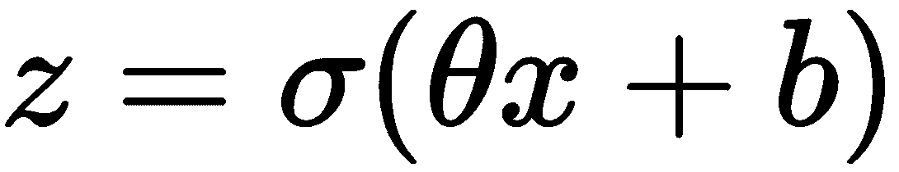

*   **解码器**:解码器试图使用编码为的编码器的输出作为输入来重建原始输入。重建图像由表示。我们用表示解码器的参数:

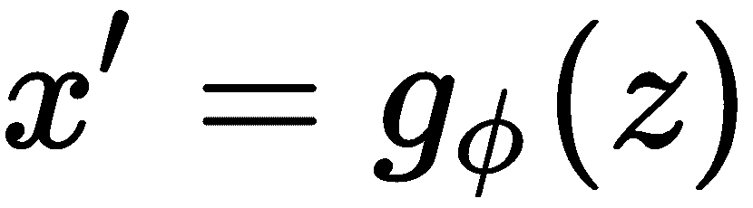


我们需要分别学习我们的编码器和解码器的最佳参数和，以便我们可以最小化重建损失。我们可以将损失函数定义为实际输入和重构输入之间的均方误差:

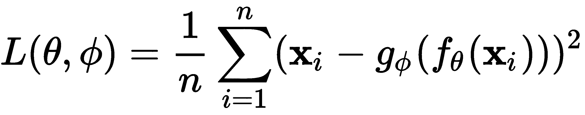

这里，是训练样本数。

当潜在表示的维数小于输入时，它被称为**欠完整自编码器。**由于维数较少，欠完整自编码器试图学习并保留输入中唯一有用的区分和重要特征，并删除其余特征。当潜在表示的维数大于或等于输入时，自编码器将只是复制输入，而不学习任何有用的特征，这种类型的自编码器被称为**过完全自编码器**。

下图显示了欠完整和过完整自编码器。欠完整自编码器在隐藏层(代码)中的神经元比输入层中的神经元数量少；而在过完备自编码器中，隐藏层(代码)中的神经元数量大于输入层中的单元数量:


因此，通过限制隐藏层(代码)中的神经元，我们可以学习输入的有用表示。自编码器也可以有任意数量的隐藏层。具有多个隐藏层的自编码器被称为**多层自编码器**或**深度自编码器**。到目前为止，我们所知道的只是**普通的**或**浅层自编码器**。


# 使用自编码器重建 MNIST 图像

现在我们将学习自编码器如何使用 MNIST 数据集重建手写数字。首先，让我们导入必要的库:

```
import warnings
warnings.filterwarnings('ignore')

import numpy as np
import tensorflow as tf

from tensorflow.keras.models import Model
from tensorflow.keras.layers import Input, Dense
tf.logging.set_verbosity(tf.logging.ERROR)

#plotting
import matplotlib.pyplot as plt
%matplotlib inline

#dataset
from tensorflow.keras.datasets import mnist
```


# 准备数据集

让我们加载 MNIST 数据集。因为我们正在重构给定的输入，所以我们不需要标签。因此，我们只加载`x_train`用于训练，加载`x_test`用于测试:

```
(x_train, _), (x_test, _) = mnist.load_data()
```

通过除以最大像素值来归一化数据，最大像素值是`255`:

```
x_train = x_train.astype('float32') / 255
x_test = x_test.astype('float32') / 255
```

打印我们数据集的`shape`:

```
print(x_train.shape, x_test.shape)

((60000, 28, 28), (10000, 28, 28))
```

将图像重塑为 2D 阵列:

```
x_train = x_train.reshape((len(x_train), np.prod(x_train.shape[1:])))
x_test = x_test.reshape((len(x_test), np.prod(x_test.shape[1:])))
```

现在，数据的形状将变成如下所示:

```
print(x_train.shape, x_test.shape)

((60000, 784), (10000, 784))
```


# 定义编码器

现在我们定义编码器层，它将图像作为输入并返回编码。

定义编码的大小:

```
encoding_dim = 32
```

定义输入的占位符:

```
input_image = Input(shape=(784,))
```

定义采用`input_image`并返回编码的编码器:

```
encoder  = Dense(encoding_dim, activation='relu')(input_image)
```


# 定义解码器

让我们定义从编码器获取编码值并返回重建图像的解码器:

```
decoder = Dense(784, activation='sigmoid')(encoder)
```


# 构建模型

既然我们已经定义了编码器和解码器，那么我们定义一个模型，该模型将图像作为输入，并返回解码器的输出，即重建的图像:

```
model = Model(inputs=input_image, outputs=decoder)
```

让我们来看一下该模型的总结:

```
model.summary()

________________________________________________________________

Layer (type)                Output Shape              Param #   

=================================================================

input_1 (InputLayer)         (None, 784)               0         

_________________________________________________________________

dense (Dense)                (None, 32)                25120     

_________________________________________________________________

dense_1 (Dense)              (None, 784)               25872     

=================================================================

Total params: 50,992

Trainable params: 50,992

Non-trainable params: 0

_________________________________________________________________
```

使用`loss`作为二进制交叉熵编译模型，并使用`adadelta`优化器最小化损失:

```
model.compile(optimizer='adadelta', loss='binary_crossentropy')
```

现在我们来训练模型。

通常，我们将模型训练为`model.fit(x,y)`，其中`x`是输入，`y`是标签。但是由于自编码器重建了它们的输入，模型的输入和输出应该是相同的。因此，在这里，我们将模型训练为`model.fit(x_train, x_train)`:

```
model.fit(x_train, x_train, epochs=50, batch_size=256, shuffle=True, validation_data=(x_test, x_test))
```


# 重建图像

现在我们已经训练了模型，我们看到模型是如何重建测试集的图像的。将测试图像提供给模型，并获得重建图像:

```
reconstructed_images = model.predict(x_test)
```


# 绘制重建图像

首先，让我们绘制实际图像，即输入图像:

```
n = 7
plt.figure(figsize=(20, 4))
for i in range(n):

    ax = plt.subplot(1, n, i+1)
    plt.imshow(x_test[i].reshape(28, 28))
    plt.gray()
    ax.get_xaxis().set_visible(False)
    ax.get_yaxis().set_visible(False)
plt.show() 
```

实际图像的情节如下:

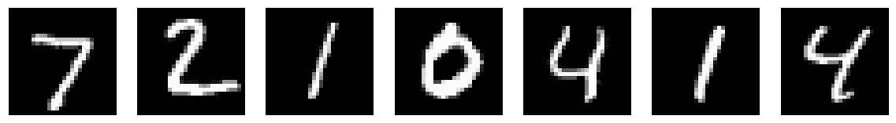

绘制重建图像，如下所示:

```
n = 7
plt.figure(figsize=(20, 4))
for i in range(n):
    ax = plt.subplot(2, n, i + n + 1)
    plt.imshow(reconstructed_images[i].reshape(28, 28))
    plt.gray()
    ax.get_xaxis().set_visible(False)
    ax.get_yaxis().set_visible(False)

plt.show() 
```

下图显示了重建的图像:

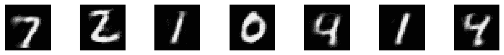

如您所见，autoencoder 已经学习了输入图像的更好表示，并对它们进行了重构。


# 带卷积的自编码器

在前一节中，我们刚刚了解了什么是自编码器。我们学习了一个普通的自编码器，它基本上是一个带有一个隐藏层的前馈浅网络。不把它们作为前馈网络，我们可以把它们作为卷积网络吗？由于我们知道卷积网络擅长分类和识别图像(假设我们在自编码器中使用卷积层而不是前馈层)，当输入是图像时，它将学习更好地重建输入。

因此，我们引入了一种新型的自编码器，称为 CAEs，它使用卷积网络而不是普通的神经网络。在普通的自编码器中，编码器和解码器基本上是一个前馈网络。但是在 CAEs 中，它们基本上是卷积网络。这意味着编码器由卷积层组成，解码器由转置卷积层组成，而不是前馈网络。CAE 如下图所示:

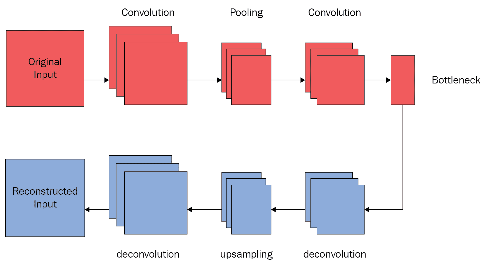

如图所示，我们将输入图像输入由卷积层组成的编码器，卷积层执行卷积运算，并从图像中提取重要特征。然后，我们执行最大池，只保留图像的重要特征。以类似的方式，我们执行几个卷积和最大池操作，并获得图像的潜在表示，称为**瓶颈**。

接下来，我们将瓶颈提供给由去卷积层组成的解码器，去卷积层执行去卷积操作，并尝试从瓶颈重建图像。它由几个去卷积和上采样操作组成，以重建原始图像。

因此，这就是 CAE 如何在编码器中使用卷积层，在解码器中转置卷积层来重建图像。


# 构建卷积自编码器

正如我们在上一节中学习如何实现自编码器一样，实现 CAE 也是一样的，但唯一的区别是我们在编码器和解码器中使用卷积层，而不是前馈网络。我们将使用相同的 MNIST 数据集通过 CAE 重建图像。

导入库:

```
import warnings
warnings.filterwarnings('ignore')

#modelling
from tensorflow.keras.models import Model
from tensorflow.keras.layers import Input, Dense, Conv2D, MaxPooling2D, UpSampling2D
from tensorflow.keras import backend as K

#plotting
import matplotlib.pyplot as plt
%matplotlib inline

#dataset
from keras.datasets import mnist
import numpy as np
```

读取并重塑数据集:

```
(x_train, _), (x_test, _) = mnist.load_data()

# Normalize the dataset

x_train = x_train.astype('float32') / 255.
x_test = x_test.astype('float32') / 255.

# reshape

x_train = np.reshape(x_train, (len(x_train), 28, 28, 1)) 
x_test = np.reshape(x_test, (len(x_test), 28, 28, 1)) 
```

让我们定义输入图像的形状:

```
input_image = Input(shape=(28, 28, 1))  
```


# 定义编码器

现在，让我们定义我们的编码器。不像普通的自编码器，我们使用前馈网络，这里我们使用卷积网络。因此，我们的编码器包括三个卷积层，后面是一个带有`relu`激活的最大池层。

定义第一个卷积层，然后是最大池操作:

```
x = Conv2D(16, (3, 3), activation='relu', padding='same')(input_image)
x = MaxPooling2D((2, 2), padding='same')(x)
```

定义第二个卷积和最大池层:

```
x = Conv2D(8, (3, 3), activation='relu', padding='same')(x)
x = MaxPooling2D((2, 2), padding='same')(x)
```

定义最终卷积和最大池层:

```
x = Conv2D(8, (3, 3), activation='relu', padding='same')(x)
encoder = MaxPooling2D((2, 2), padding='same')(x)
```


# 定义解码器

现在，我们定义我们的解码器；在解码器中，我们对三个层执行去卷积操作，也就是说，我们对编码器创建的编码进行上采样，并重建原始图像。

定义第一个卷积层，然后进行上采样:

```
x = Conv2D(8, (3, 3), activation='relu', padding='same')(encoder)
x = UpSampling2D((2, 2))(x)
```

用上采样定义第二卷积层:

```
x = Conv2D(8, (3, 3), activation='relu', padding='same')(x)
x = UpSampling2D((2, 2))(x)
```

使用上采样定义最终卷积层:

```
x = Conv2D(16, (3, 3), activation='relu')(x)
x = UpSampling2D((2, 2))(x)
decoded = Conv2D(1, (3, 3), activation='sigmoid', padding='same')(x)
```


# 构建模型

定义获取输入图像并返回解码器生成的图像(即重建图像)的模型:

```
model = Model(input_image, decoder)
```

让我们将损失模型编译为二进制交叉熵，并使用`adadelta`作为优化器:

```
model.compile(optimizer='adadelta', loss='binary_crossentropy')
```

然后，按如下方式训练模型:

```
model.fit(x_train, x_train, epochs=50,batch_size=128, shuffle=True, validation_data=(x_test, x_test))
```


# 重建图像

使用我们训练过的模型重建图像:

```
reconstructed_images = model.predict(x_test)
```

首先，让我们绘制输入图像:

```
n = 7
plt.figure(figsize=(20, 4))
for i in range(n):

    ax = plt.subplot(1, n, i+1)
    plt.imshow(x_test[i].reshape(28, 28))
    plt.gray()
    ax.get_xaxis().set_visible(False)
    ax.get_yaxis().set_visible(False)
plt.show() 
```

输入图像的绘图如下:


现在，我们绘制重建的图像:

```
n = 7
plt.figure(figsize=(20, 4))
for i in range(n):
    ax = plt.subplot(2, n, i + n + 1)
    plt.imshow(reconstructed_images[i].reshape(28, 28))
    plt.gray()
    ax.get_xaxis().set_visible(False)
    ax.get_yaxis().set_visible(False)

plt.show() 
```

重建图像的绘图如下:

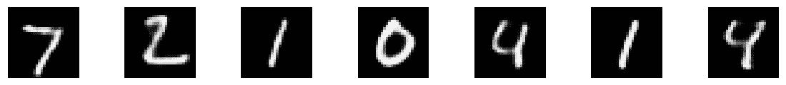


# 探索降噪自编码器

DAE 是自编码器的另一个小型变体。它们主要用于消除图像、音频和其他输入中的噪声。因此，当我们将损坏的输入提供给 DAE 时，它会学习重建原始的未损坏输入。现在，我们来看看 DAE 是如何消除噪音的。

对于 DAE，我们不是将原始输入馈送给自编码器，而是通过添加一些随机噪声来破坏输入，并馈送被破坏的输入。我们知道，编码器通过只保留重要信息来学习输入的表示，并将压缩的表示映射到瓶颈。当被破坏的输入被发送到编码器时，在学习输入的表示时，编码器将学习噪声是不想要的信息，并移除其表示。因此，编码器通过仅保留必要的信息来学习没有噪声的输入的紧凑表示，并将所学习的表示映射到瓶颈。

现在解码器尝试使用编码器学习到的表示来重建图像，也就是瓶颈。由于该表示不包含任何噪声，解码器重建没有噪声的输入。这就是 DAE 从输入中消除噪声的方式。

下图显示了一个典型的 DAE。首先，我们通过添加一些噪声来破坏输入，并将破坏的输入馈送到编码器，编码器学习没有噪声的输入表示，而解码器使用编码器学习的表示来重建未破坏的输入:

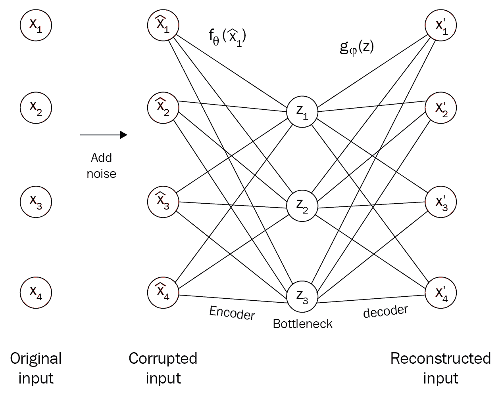

数学上，这可以表示如下。

假设我们有一个图像，，我们添加噪声到图像，得到，这是损坏的图像:

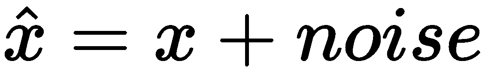

现在将这个损坏的图像输入编码器:

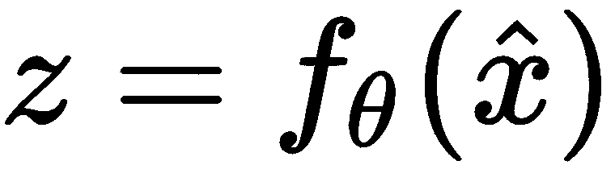

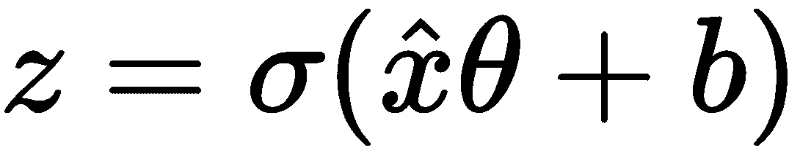

解码器试图重建实际图像:


使用 DAE 去噪图像


# 在本节中，我们将学习如何使用 DAE 对图像进行降噪处理。我们使用 CAE 对图像去噪。DAE 的代码与 CAE 一样，只是这里我们在输入中使用噪声图像。我们将只看到各自的变化，而不是查看整个代码。完整的代码可以在 GitHub 的 https://GitHub . com/packt publishing/Hands-On-Deep-Learning-Algorithms-with-Python 获得。

设置噪声系数:

向训练和测试图像添加噪声:

```
noise_factor = 1
```

通过 0 和 1 剪辑训练和测试集:

```
x_train_noisy = x_train + noise_factor * np.random.normal(loc=0.0, scale=1.0, size=x_train.shape) 
x_test_noisy = x_test + noise_factor * np.random.normal(loc=0.0, scale=1.0, size=x_test.shape)
```

Clip the train and test set by 0 and 1:

```
x_train_noisy = np.clip(x_train_noisy, 0., 1.)
x_test_noisy = np.clip(x_test_noisy, 0., 1.)
```

让我们训练模型。因为，我们希望模型学习去除图像中的噪声，所以模型的输入是噪声图像，即`x_train_noisy`，输出是去噪图像，即`x_train`:

使用我们训练过的模型重建图像:

```
model.fit(x_train_noisy, x_train, epochs=50,batch_size=128, shuffle=True, validation_data=(x_test_noisy, x_test))
```

首先，让我们绘制输入图像，即被破坏的图像:

```
reconstructed_images = model.predict(x_test_noisy)
```

输入噪声图像的曲线图如下所示:

```
n = 7
plt.figure(figsize=(20, 4))
for i in range(n):

    ax = plt.subplot(1, n, i+1)
    plt.imshow(x_test_noisy[i].reshape(28, 28))
    plt.gray()
    ax.get_xaxis().set_visible(False)
    ax.get_yaxis().set_visible(False)
plt.show() 
```


现在，让我们根据模型绘制重建图像:

如你所见，我们的模型已经学会了从图像中去除噪声:

```
n = 7
plt.figure(figsize=(20, 4))
for i in range(n):
    ax = plt.subplot(2, n, i + n + 1)
    plt.imshow(reconstructed_images[i].reshape(28, 28))
    plt.gray()
    ax.get_xaxis().set_visible(False)
    ax.get_yaxis().set_visible(False)

plt.show()
```

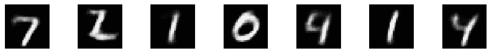

了解稀疏自编码器


# 我们知道自编码器学习重建输入。但是，当我们将隐藏层中的节点数设置为大于输入层中的节点数时，它将学习一个不利的恒等函数，因为它只是完全复制输入。

在隐藏层中有更多的节点有助于我们学习健壮的潜在表示。但是当隐藏层中有更多节点时，自编码器会尝试完全模仿输入，因此会过度拟合训练数据。为了解决过度拟合的问题，我们为损失函数引入了一个新的约束，称为**稀疏约束**或**稀疏惩罚**。具有稀疏惩罚的损失函数可以表示如下:

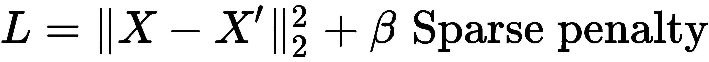

第一项表示原始输入和重构输入之间的重构误差。第二项意味着稀疏约束。现在我们将探索这种稀疏约束如何减轻过度拟合的问题。

使用稀疏约束，我们只激活隐藏层上的特定神经元，而不是激活所有的神经元。基于输入，我们激活和去激活特定的神经元，因此当神经元被激活时，它们将学习从输入中提取重要的特征。通过稀疏惩罚，自编码器不会将输入精确地复制到输出，并且它还可以学习健壮的潜在表示。

如下图所示，稀疏自编码器在隐藏层中比在输入层中有更多的单元；然而，只有隐藏层中的少数神经元被激活。无阴影的神经元代表当前被激活的神经元:

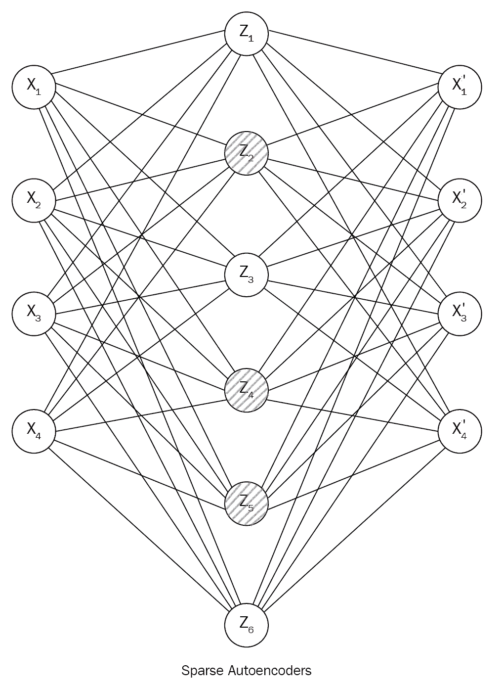

如果神经元处于活动状态，则返回 1，如果处于非活动状态，则返回 0。在稀疏自编码器中，我们将隐藏层中的大多数神经元设置为非活动状态。我们知道，sigmoid 激活函数将值压缩到 0 到 1 之间。所以，当我们使用 sigmoid 激活函数时，我们试图保持神经元的值接近 0。

我们一般会尽量让隐层中每个神经元的平均激活值接近于零，比如说 0.05，但不等于零，这个值叫做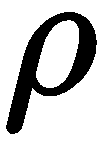，也就是我们的稀疏度参数。我们通常将的值设置为 0.05。

首先，我们计算神经元的平均激活。

隐藏层中的神经元在整个训练集中的平均激活可以计算如下:


在这里，以下情况成立:

表示隐藏层中神经元的平均激活

*   是训练样本的数量
*   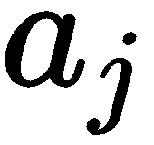是隐藏层中神经元的激活
*   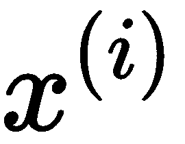是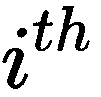训练样本
*   表示激活了隐含层 [] 中的神经元为第 [] ^个训练样本
*   我们试图保持神经元的平均激活值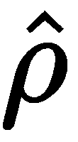接近。也就是说，我们试图将神经元的平均激活值保持在 0.05:


因此，我们惩罚的值，它与不同。我们知道**kull back–lei bler**(**KL**)散度被广泛用于度量两个概率分布之间的差异。因此，在这里，我们使用 KL 散度来衡量两个**伯努利分布**之间的差异，即均值和均值之间的差异，可以给出如下:

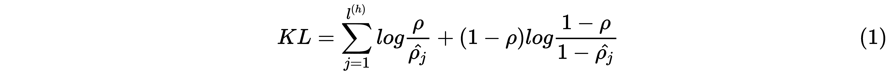

在前面的等式中，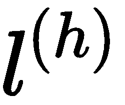表示隐藏层，而表示隐藏层中的神经元。早期的方程基本上是稀疏惩罚或稀疏约束。因此，在稀疏性约束下，所有神经元不会同时活跃，平均而言，它们被设置为 0.05。

现在，我们可以用稀疏惩罚重写损失函数，如下所示:

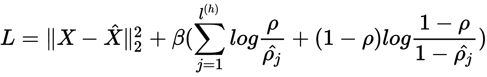

因此，稀疏自编码器允许我们在隐藏层中具有比输入层更多的节点，同时借助损失函数中的稀疏性约束来减少过拟合的问题。

Thus, sparse autoencoders allow us to have a greater number of nodes in the hidden layer than the input layer, yet reduce the problem of overfitting with the help of the sparsity constraint in the loss function.

构建稀疏自编码器


# 构建稀疏自编码器与构建常规自编码器是一样的，只是我们在编码器和解码器中使用了稀疏正则化器，因此在下面的部分中，我们将只查看与实现稀疏正则化器相关的部分，而不是查看整个代码；GitHub 上有完整的代码和解释。

定义稀疏正则化子


# 以下是定义稀疏正则化的代码:

将我们的值设置为`0.05`:

```
def sparse_regularizer(activation_matrix):
```

计算平均激活值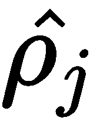:

```
rho = 0.05
```

根据等式 *(1)* 计算平均值和平均值之间的 KL 散度:

```
rho_hat = K.mean(activation_matrix) 
```

对 KL 散度值求和:

```
KL_divergence = K.sum(rho*(K.log(rho/rho_hat)) + (1-rho)*(K.log(1-rho/1-rho_hat)))
```

将`sum`乘以`beta`并返回结果:

```
    sum = K.sum(KL_divergence) 
```

稀疏正则化器的整个函数如下所示:

```
    return beta * sum
```

The whole function for the sparse regularizer is given as follows:

```
def sparse_regularizer(activation_matrix):
    p = 0.01
    beta = 3
    p_hat = K.mean(activation_matrix)  
    KL_divergence = p*(K.log(p/p_hat)) + (1-p)*(K.log(1-p/1-p_hat))
    sum = K.sum(KL_divergence) 

    return beta * sum
```

学习使用收缩式自编码器


# 像稀疏自编码器一样，**收缩自编码器**给自编码器的损失函数增加了一个新的正则项。他们试图让我们的编码对训练数据中的微小变化不那么敏感。因此，使用收缩型自编码器，我们的编码对于小扰动变得更加鲁棒，例如训练数据集中存在的噪声。我们现在引入一个新的术语叫做**正则项**或**罚项**到我们的损失函数中。它有助于惩罚对输入过于敏感的表示。

我们的损失函数可以用数学方法表示如下:


第一项代表重构误差，第二项代表惩罚项或正则项，它基本上是**雅可比矩阵**的 **Frobenius** **范数**。等等！那是什么意思？

矩阵的 Frobenius 范数，也称为**希尔伯特-施密特范数**，被定义为其元素的绝对平方之和的平方根。包含向量值函数偏导数的矩阵称为**雅可比矩阵**。

因此，计算雅可比矩阵的 Frobenius 范数意味着我们的罚项是隐藏层相对于输入的所有偏导数的平方和。其给出如下:

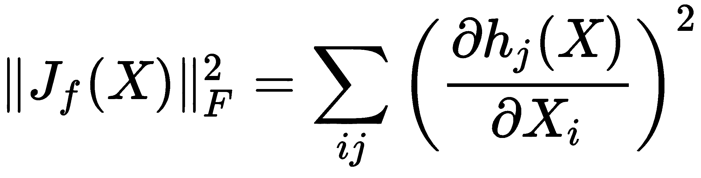

计算隐藏层相对于输入的偏导数类似于计算损失梯度。假设我们使用 sigmoid 激活函数，则隐藏层相对于输入的偏导数如下所示:


将惩罚项添加到我们的损失函数有助于降低模型对输入变化的敏感性，并使我们的模型对异常值更加稳健。因此，收缩型自编码器降低了模型对训练数据中微小变化的敏感性。

实现收缩自编码器


# 构建收缩自编码器与构建自编码器是一样的，除了我们在模型中使用收缩损失正则化器，因此我们将只查看与实现收缩损失相关的部分，而不是查看整个代码。

定义收缩损失


# 现在让我们看看如何在 Python 中定义损失函数。

定义均方损耗如下:

从我们的编码器层获得权重并转置权重:

```
MSE = K.mean(K.square(actual - predicted), axis=1)
```

获取我们编码器层的输出:

```
weights = K.variable(value=model.get_layer('encoder_layer').get_weights()[0]) 
weights = K.transpose(weights) 
```

定义处罚条款:

```
h = model.get_layer('encoder_layer').output
```

最终损失是均方误差和惩罚项之和乘以`lambda`:

```
penalty_term =  K.sum(((h * (1 - h))**2) * K.sum(weights**2, axis=1), axis=1)
```

收缩损失的完整代码如下所示:

```
Loss = MSE + (lambda * penalty_term)
```

剖析变分自编码器

```
def contractive_loss(y_pred, y_true):

    lamda = 1e-4

    MSE = K.mean(K.square(y_true - y_pred), axis=1)

    weights = K.variable(value=model.get_layer('encoder_layer').get_weights()[0]) 
    weights = K.transpose(weights) 

    h = model.get_layer('encoder_layer').output

    penalty_term = K.sum(((h * (1 - h))**2) * K.sum(weights**2, axis=1), axis=1)

    Loss = MSE + (lambda * penalty_term)

    return Loss
```


# 现在我们将看到另一种非常有趣的自编码器，叫做**变型自编码器** ( **VAE** )。与其他自编码器不同，vae 是生成模型，这意味着它们像 gan 一样学习生成新数据。

假设我们有一个包含许多个人面部图像的数据集。当我们用这个数据集训练我们的变分自编码器时，它会学习生成在数据集中看不到的新的真实人脸。由于它们的生成性质，VAEs 具有各种应用，其中一些应用包括生成图像、歌曲等等。但是是什么使得 VAE 具有可生成性，它与其他自编码器有什么不同？让我们在下一节中了解这一点。

正如我们在讨论 GANs 时了解到的那样，一个模型要生成，它必须了解输入的分布。例如，假设我们有一个由手写数字组成的数据集，比如 MNIST 数据集。现在，为了生成新的手写数字，我们的模型必须学习数字在给定数据集中的分布。了解数据集中出现的数字的分布有助于 VAE 了解有用的属性，如数字宽度、笔画、高度等。一旦模型在其分布中编码了该属性，那么它可以通过从学习的分布中采样来生成新的手写数字。

假设我们有一个人脸数据集，那么学习数据集中人脸的分布有助于我们学习各种属性，如性别、面部表情、头发颜色等。一旦模型在其分布中学习并编码这些属性，那么它就可以通过从学习的分布中采样来生成新的面部。

因此，在 VAE，我们不是将编码器的编码直接映射到潜在向量(瓶颈)，而是将编码映射到一个分布；通常，它是高斯分布。我们从这个分布中抽取一个潜在向量，并将其馈送给解码器，然后解码器学习重建图像。如下图所示，编码器将其编码映射到一个分布，我们从该分布中采样一个潜在向量，并将其提供给解码器以重建图像:

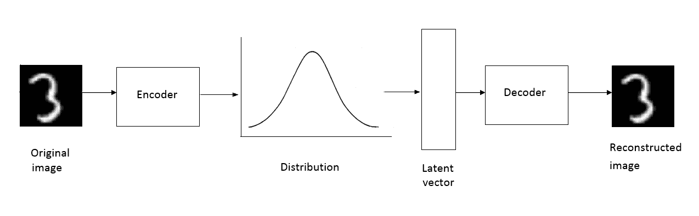

高斯分布可以通过其均值和协方差矩阵来参数化。因此，我们可以让编码器生成其编码，并将其映射到近似遵循高斯分布的均值向量和标准差向量。现在，从这个分布中，我们对一个潜在向量进行采样，并将其馈送到我们的解码器，然后解码器重建图像:

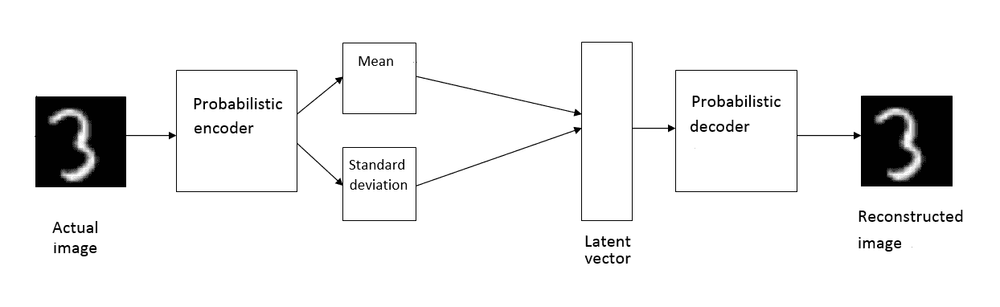

简而言之，编码器学习给定输入的期望属性，并将它们编码成分布。我们从该分布中采样一个潜在向量，并将该潜在向量作为输入馈送到解码器，解码器然后生成从编码器的分布中学习的图像。


In a nutshell, the encoder learns the desirable properties of the given input and encodes them into distribution. We sample a latent vector from this distribution and feed the latent vector as input to the decoder which then generates images learned from the encoder's distribution.

在 VAE，编码器也被称为**识别** **型**，解码器也被称为 **g** **生成** **型**。现在我们已经对 VAE 有了直观的了解，在下一节，我们将详细了解 VAE 是如何工作的。

变分推理

在继续之前，让我们熟悉一下符号:


# 让我们用来表示输入数据集的分布，其中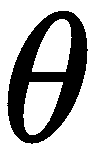表示将在训练期间学习的网络参数

我们用表示潜在变量，它通过从分布中取样来编码输入的所有属性

*   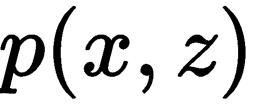表示输入与其属性的联合分布
*   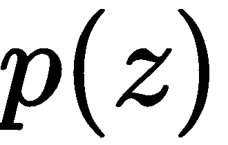代表潜在变量的分布
*   使用贝叶斯定理，我们可以写出以下内容:
*   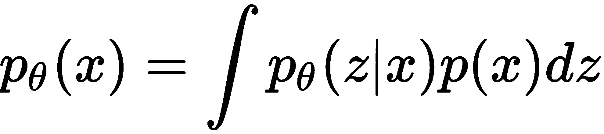

前面的等式有助于我们计算输入数据集的概率分布。但问题在于计算，因为计算它是棘手的。因此，我们需要找到一种容易处理的方法来估计。在这里，我们引入一个叫做**变分推理**的概念。

我们不是直接推断的分布，而是使用另一种分布来近似它们，比如高斯分布。也就是说，我们使用基本上是由参数参数化的神经网络的来估计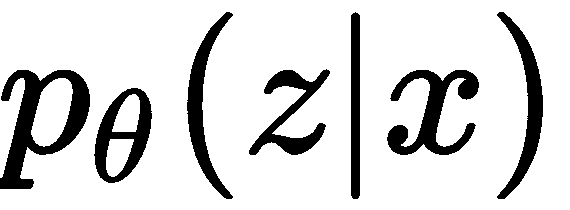的值:

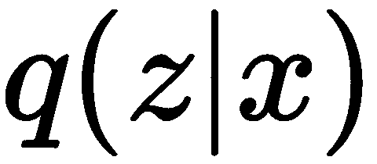基本上就是我们的概率编码器；也就是说，他们要创建一个潜在向量 *z* 给定

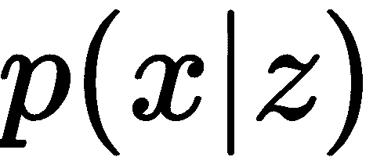是概率解码器；也就是说，它试图在给定潜在向量的情况下构建输入

*   下图有助于您清楚地理解符号以及我们目前所看到的内容:
*   

损失函数

我们刚刚了解到，我们用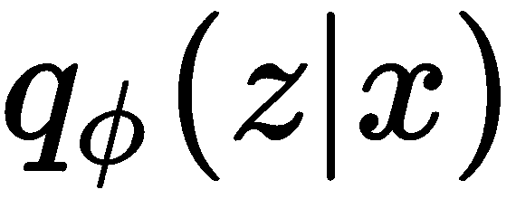来近似。因此，的估计值应该接近。由于这两个都是分布，我们使用 KL 散度来衡量如何偏离，我们需要最小化散度。


# 和之间的 KL 偏差如下所示:

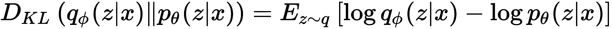

因为我们知道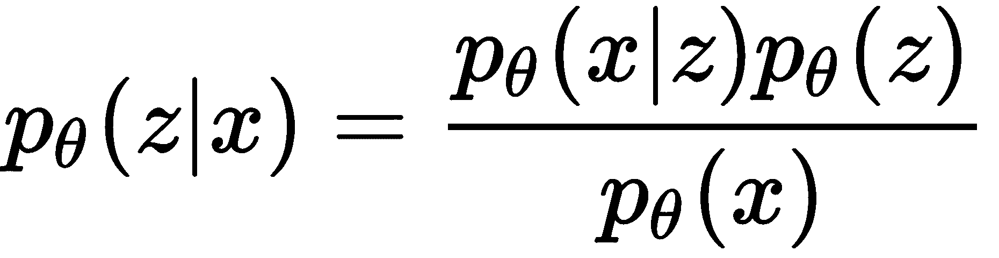，将它代入前面的等式，我们可以写出如下:

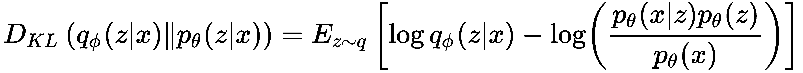

由于我们知道 *log (a/b) = log(a) - log(b)* ，我们可以将前面的等式改写如下:


我们可以将置于期望值之外，因为它不依赖于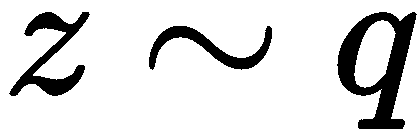:

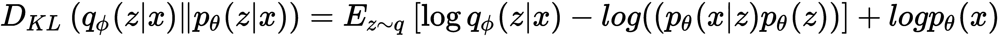

We can take the  outside the expectations since it has no dependency on :

由于我们知道 *log(ab) = log (a) + log(b)* ，我们可以将前面的等式改写如下:


我们知道和之间的 KL 散度可由下式给出:

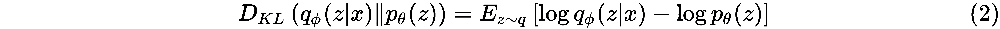

将方程式 *(2)* 代入方程式 *(1)* 中，我们可以写出:

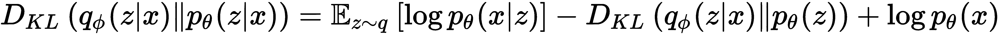

重新排列等式的左侧和右侧，我们可以写出以下内容:

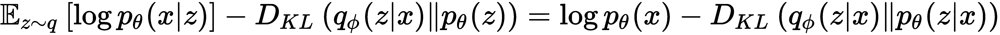

重新排列这些项，我们的最终等式可以给出如下:


上面的等式暗示了什么？

等式的左侧也被称为**变分下界**或**证据下界** ( **ELBO** )。左手边的第一项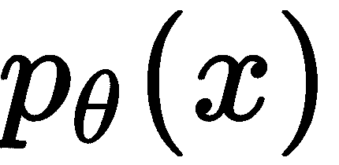表示输入 *x* 的分布，我们希望使其最大化，而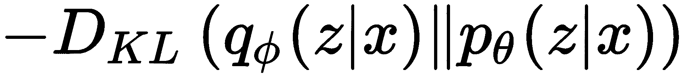表示估计分布和实际分布之间的 KL 偏差。

损失函数可以写成如下形式:


在这个等式中，您会注意到以下内容:

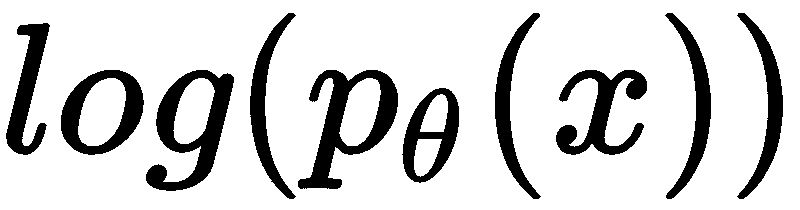暗示我们正在最大化输入的分布；我们可以通过简单地添加一个负号，将最大化问题转化为最小化问题；因此，我们可以写

暗示我们正在最大化估计和真实分布之间的 KL 散度，但是我们想要最小化它们，所以我们可以写来最小化 KL 散度

*   implies we are maximizing the distribution of the input; we can convert the maximization problem into minimization by simply adding a negative sign; thus, we can write 
*   因此，我们的损失函数变成如下:

^()


如果你看这个等式，基本上暗示了输入的重构，也就是取潜向量并重构输入的解码器。

因此，我们的最终损失函数是重建损失和 KL 散度之和:


KL 散度的值简化如下:


因此，最小化前面的损失函数意味着我们最小化重建损失，并且最小化估计和实际分布之间的 KL 偏差。

重新参数化技巧

我们在通过梯度下降训练 VAE a 时面临一个问题。记住，我们正在执行一个采样操作来生成一个潜在向量。由于采样操作是不可微的，我们不能计算梯度。也就是说，在反向传播网络以最小化误差时，我们无法计算采样操作的梯度，如下图所示:


# 

We face a problem while training VAE a through gradient descent. Remember, we are performing a sampling operation to generate a latent vector. Since a sampling operation is not differentiable, we cannot calculate gradients. That is, while backpropagating the network to minimize the error, we cannot calculate the gradients of the sampling operation as shown in the following diagram:

因此，为了解决这个问题，我们引入了一个叫做**重新参数化技巧**的新技巧。我们引入一个称为**ε**的新参数，我们从一个单位高斯中随机采样，给出如下:


现在我们可以将我们的潜在向量改写为:


重新参数化的技巧如下图所示:


因此，通过重新参数化技巧，我们可以用梯度下降算法来训练 VAE。

使用 VAE 生成图像

现在我们已经了解了 VAE 模型的工作原理，在这一部分，我们将学习如何使用 VAE 来生成图像。


# 导入所需的库:

准备数据集

加载 MNIST 数据集:

```
import warnings
warnings.filterwarnings('ignore')

import numpy as np
import matplotlib.pyplot as plt
from scipy.stats import norm

from tensorflow.keras.layers import Input, Dense, Lambda
from tensorflow.keras.models import Model
from tensorflow.keras import backend as K
from tensorflow.keras import metrics
from tensorflow.keras.datasets import mnist

import tensorflow as tf
tf.logging.set_verbosity(tf.logging.ERROR)
```


# 规范化数据集:

重塑数据集:

```
(x_train, _), (x_test, _) = mnist.load_data()
```

现在让我们定义一些重要的参数:

```
x_train = x_train.astype('float32') / 255.
x_test = x_test.astype('float32') / 255.
```

定义编码器

```
x_train = x_train.reshape((len(x_train), np.prod(x_train.shape[1:])))
x_test = x_test.reshape((len(x_test), np.prod(x_test.shape[1:])))
```

定义输入:

```
batch_size = 100
original_dim = 784
latent_dim = 2
intermediate_dim = 256
epochs = 50
epsilon_std = 1.0
```


# 编码器隐藏层:

Define the input:

```
x = Input(shape=(original_dim,))
```

Encoder hidden layer:

```
h = Dense(intermediate_dim, activation='relu')(x)
```

计算平均值和方差:

定义采样操作

使用重新参数化技巧定义采样操作，从编码器的分布中对潜在向量进行采样:

```
z_mean = Dense(latent_dim)(h)
z_log_var = Dense(latent_dim)(h)
```


# 从平均值和方差中采样潜在向量 *z* :

定义解码器

```
def sampling(args):
    z_mean, z_log_var = args
    epsilon = K.random_normal(shape=(K.shape(z_mean)[0], latent_dim), mean=0., stddev=epsilon_std)
    return z_mean + K.exp(z_log_var / 2) * epsilon
```

用两层定义解码器:

```
z = Lambda(sampling, output_shape=(latent_dim,))([z_mean, z_log_var])
```


# 使用解码器重建图像，解码器将潜在向量作为输入，并返回重建图像:

构建模型

```
decoder_hidden = Dense(intermediate_dim, activation='relu')
decoder_reconstruct = Dense(original_dim, activation='sigmoid')
```

我们建立的模型如下:

```
decoded = decoder_hidden(z)
reconstructed = decoder_reconstruct(decoded)
```


# 定义重建损失:

We build the model as follows:

```
vae = Model(x, reconstructed)
```

Define the reconstruction loss:

```
Reconstruction_loss = original_dim * metrics.binary_crossentropy(x, reconstructed)
```

定义 KL 散度:

因此，总损失可定义为:

添加损失并编译模型:

```
kl_divergence_loss = - 0.5 * K.sum(1 + z_log_var - K.square(z_mean) - K.exp(z_log_var), axis=-1)
```

训练模型:

```
total_loss = K.mean(Reconstruction_loss + kl_divergence_loss)
```

定义生成器

```
vae.add_loss(total_loss)
vae.compile(optimizer='rmsprop')
vae.summary()
```

根据学习的分布定义发生器样本，并生成图像:

```
vae.fit(x_train,
        shuffle=True,
        epochs=epochs,
        batch_size=batch_size,
        verbose=2,
        validation_data=(x_test, None))
```


# 绘制生成的图像

现在我们绘制生成器生成的图像:

```
decoder_input = Input(shape=(latent_dim,))
_decoded = decoder_hidden(decoder_input)

_reconstructed = decoder_reconstruct(_decoded)
generator = Model(decoder_input, _reconstructed)
```


# 以下是由生成器生成的图像的绘图:


```
n = 7 
digit_size = 28
figure = np.zeros((digit_size * n, digit_size * n))

grid_x = norm.ppf(np.linspace(0.05, 0.95, n))
grid_y = norm.ppf(np.linspace(0.05, 0.95, n))

for i, yi in enumerate(grid_x):
    for j, xi in enumerate(grid_y):
        z_sample = np.array([[xi, yi]])
        x_decoded = generator.predict(z_sample)
        digit = x_decoded[0].reshape(digit_size, digit_size)
        figure[i * digit_size: (i + 1) * digit_size,
               j * digit_size: (j + 1) * digit_size] = digit

plt.figure(figsize=(4, 4), dpi=100)
plt.imshow(figure, cmap='Greys_r')
plt.show()
```

摘要

本章一开始，我们学习了什么是自编码器，以及如何使用自编码器来重建自己的输入。我们研究了卷积自编码器，其中我们没有使用前馈网络，而是分别使用卷积层和去卷积层进行编码和解码。接下来，我们学习了稀疏，它只激活特定的神经元。然后，我们了解了另一种类型的正则化自编码器，称为压缩自编码器，在本章的最后，我们了解了 VAE，这是一个生成式自编码器模型。


# 在下一章中，我们将学习如何使用少量的学习算法从较少的数据点中学习。

We started this chapter by learning what autoencoders are and how autoencoders are used to reconstruct their own input. We explored convolutional autoencoders, where instead of using feedforward networks, we used convolutional and deconvolutional layers for encoding and decoding, respectively. Following this, we learned about sparse which activate only certain neurons. Then, we learned about another type of regularizing autoencoder, called a contractive autoencoder, and at the end of the chapter, we learned about VAE which is a generative autoencoder model.

In the next chapter, we will learn about how to learn from a less data points using few-shot learning algorithms.

问题

让我们通过回答以下问题来检验我们对自编码器的了解:


# 什么是自编码器？

自编码器的目标功能是什么？

1.  卷积自编码器与普通自编码器有何不同？
2.  什么是去噪自编码器？
3.  神经元的平均激活是如何计算的？
4.  定义收缩自编码器的损失函数。
5.  什么是弗罗贝纽斯范数和雅可比矩阵？
6.  进一步阅读
7.  您也可以查看以下链接了解更多信息:


# *稀疏自编码器*吴恩达笔记，[https://web . Stanford . edu/class/cs 294 a/sparsea auto encoder _ 2011 new . pdf](https://web.stanford.edu/class/cs294a/sparseAutoencoder_2011new.pdf)

萨拉赫·里法伊等人的*收缩型自编码器:特征提取期间的显式不变性*，http://www.icml-2011.org/papers/455_icmlpaper.pdf

*   *yun Chen Pu 等人的用于图像、标签和字幕深度学习的 variable auto encoder*，[https://papers . nips . cc/paper/6528-variable-auto encoder-for-Deep-Learning-of-Images-Labels-and-Captions . pdf](https://papers.nips.cc/paper/6528-variational-autoencoder-for-deep-learning-of-images-labels-and-captions.pdf)
*   *Contractive Auto-Encoders: Explicit Invariance During Feature Extraction* by Salah Rifai, et al., [http://www.icml-2011.org/papers/455_icmlpaper.pdf](http://www.icml-2011.org/papers/455_icmlpaper.pdf)
*   *Variational Autoencoder for Deep Learning of Images, Labels and Captions* by Yunchen Pu, et al., [https://papers.nips.cc/paper/6528-variational-autoencoder-for-deep-learning-of-images-labels-and-captions.pdf](https://papers.nips.cc/paper/6528-variational-autoencoder-for-deep-learning-of-images-labels-and-captions.pdf)