# 介绍 DRL

**深度强化学习** ( **DRL** )目前正在席卷全球，被视为机器学习技术的“it”，即达到某种形式的通用人工智能的 it 目标。也许这是因为 DRL 接近了人工智能或者我们所认为的一般智能的尖端。这也可能是你读这本书的主要原因之一。幸运的是，这一章，以及本书其余部分的大部分，都深深地聚焦于**强化学习** ( **RL** )及其许多变体。在这一章中，我们开始学习 RL 的基础知识，以及它如何适应**深度学习** ( **DL** )。我们将探索 **OpenAI Gym** 环境，一个很棒的 RL 游乐场，并看看如何用一些简单的 DRL 技术来使用它。

请记住，这是一本动手操作的书，所以我们将把技术理论保持在最低限度，相反，我们将探索大量的工作示例。一些读者可能会因为没有理论背景而感到迷茫，觉得有必要自己去探索 RL 更理论的一面。

对于其他不熟悉 RL 理论背景的读者，我们会涉及几个核心概念，但这是删节版，所以建议你在准备好的时候从其他来源寻求理论知识。

在这一章，我们将开始学习 DRL，这个话题将贯穿许多章节。我们将从基础开始，然后探索一些适用于 DL 的工作示例。以下是我们将在本章中涉及的内容:

*   强化学习
*   Q-学习模型
*   经营露天健身房
*   第一个具有深 Q 网络的 DRL
*   RL 实验

对于喜欢跳来跳去看书的人:是的，从这一章开始看这本书是可以的。但是，为了完成一些练习，您可能需要回到前面的章节。我们还假设您的 Python 环境配置了 TensorFlow 和 Keras，但是如果您不确定，请查看项目文件夹中的`requirements.txt`文件。

本书中的所有项目都是用 Visual Studio 2017 (Python)构建的，它是本书中示例的推荐编辑器。如果将 VS 2017 与 Python 配合使用，可以通过打开章节解决方案文件轻松管理样本。当然，还有很多其他优秀的 Python 编辑器和工具，所以使用你觉得舒服的。


# 强化学习

与其他机器学习方法相比，RL 目前在进步方面领先。请注意使用的是*方法*一词，而不是*技术*。RL 是一种方法或算法，它应用了我们可以与神经网络一起使用的原理，而神经网络是一种可以应用于多种方法的机器学习技术。之前，我们研究了与 DL 相结合的其他方法，但是我们更关注实际的实现。然而，RL 引入了一种新的方法，要求我们在了解如何应用它之前，了解更多的内部和外部工作方式。

RL 是由加拿大人理查德·萨顿推广的，他现在是阿尔伯塔大学的教授。萨顿还在谷歌的 DeepMind 协助开发 RL，并经常被视为 RL 之父。

任何机器学习系统的核心都是对训练的需求。通常，人工智能代理/大脑什么都不知道，然后我们通过一些自动化过程向它提供数据，让它学习。正如我们已经看到的，最常见的方式是所谓的**监督训练**。这是我们第一次标记我们的训练数据。我们还研究了**无监督训练**，其中我们的**生成对抗网络** ( **GANs** )通过相互竞争来训练。然而，这两个系统都没有复制我们在**生物学**中看到的学习或训练类型，这通常被称为**奖励**或 RL:这种学习类型让你教你的狗吠叫以获得奖励，取纸，并利用户外进行自然呼唤，这种学习类型让代理探索其自身的环境并为自己学习。这与一般人工智能预期使用的学习类型没有什么不同；毕竟，RL 很可能类似于我们使用的系统，或者我们是这样认为的。

大卫·西尔弗是萨顿教授以前的学生，现在是 DeepMind 的负责人，他有一个关于 RL 理论背景的优秀视频系列。前五个视频相当有趣，推荐观看，但后面的内容变得相当深入，可能不适合每个人。以下是视频的链接:[https://www.youtube.com/watch?v=2pWv7GOvuf0](https://www.youtube.com/watch?v=2pWv7GOvuf0)

RL 定义了自己的训练类型，并以相同的名称进行调用。下图显示了这种基于奖励的培训形式:

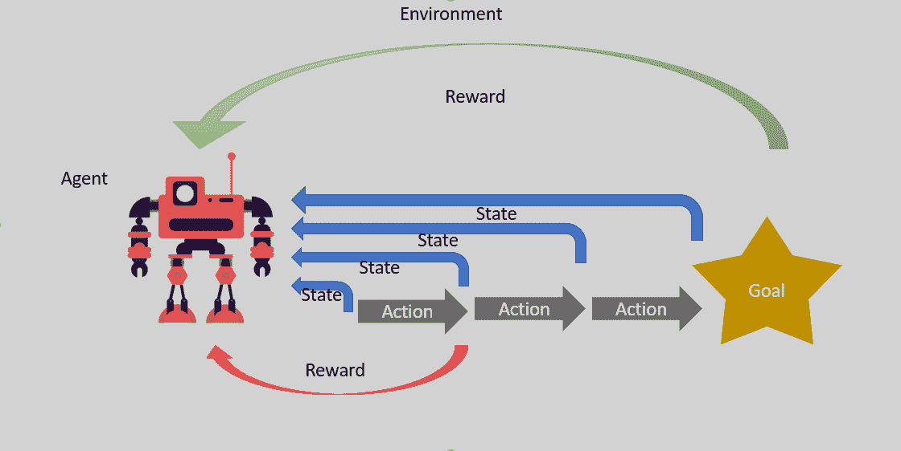

Reinforcement learning 

该图显示了环境中的代理。该代理读取环境的状态，然后决定并执行一个动作。这个行为可能会，也可能不会，给予奖励，而这个奖励可能是好的，也可能是坏的。在每次行动和可能的奖励之后，代理再次收集环境的状态。该过程重复进行，直到代理达到终止或结束状态。也就是说，直到它达到目标；也许它死了，或者只是累了。注意上图中的一些微妙之处是很重要的。首先，代理人并不总是收到奖励，这意味着奖励可能会被推迟，直到某个未来目标达成。这与我们之前探索的其他学习形式截然不同，后者为我们的培训网络提供了即时反馈。奖励可以是好的也可以是坏的，用这种方式消极地训练代理人通常同样有效，但对人类来说就没那么有效了。

现在，正如你可能预料的那样，对于任何强大的学习模型，数学可能会非常复杂，并且肯定会让新手望而生畏。除了在下一节描述 RL 的一些基础之外，我们不会过多地讨论理论细节。

多臂强盗


# 我们之前看到的图表描述了完整的 RL 问题，我们将在本书的大部分内容中使用。然而，我们经常教授这个问题的一个更简单的单步变体，称为**多臂强盗**。武装匪徒指的是拉斯维加斯的老虎机，没有比这更邪恶的了。我们使用这些更简单的场景，以单步或单态问题的形式解释 RL 的基础知识。

在多臂强盗的例子中，想象一个虚构的多臂拉斯维加斯吃角子老虎机，它根据拉动哪只手臂来奖励不同的奖励，但是每只手臂的奖励总是相同的。在这种情况下，代理的目标是每次都找出正确的手臂。我们可以用如下所示的等式对此进行进一步建模:

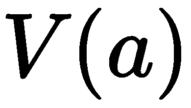 =值的向量(1，2，3，4)

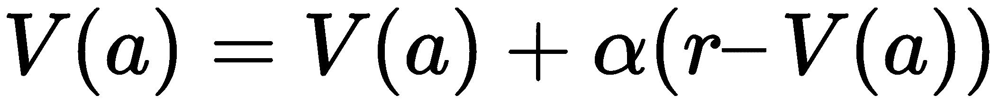
Consider the following equation:

*   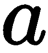 =动作
*    =阿尔法=学习率
*    =奖励
*   这个等式计算代理采取的每个动作的值( *V* )，这是一个向量。然后，它将这些值反馈给自己，从奖励中减去并乘以学习率。该计算值可用于确定拉动哪只手臂，但首先代理需要至少拉动每只手臂一次。让我们快速地用代码对此建模，这样作为游戏/模拟程序员，我们可以看到这是如何工作的。打开`Chapter_5_1.py`代码并遵循以下步骤:

本练习的代码如下:

1.  The code for this exercise is as follows:

```
alpha = .9
arms = [['bronze' , 1],['gold', 3], ['silver' , 2], ['bronze' , 1]]
v = [0,0,0,0]

for i in range(10):
    for a in range(len(arms)):
        print('pulling arm '+ arms[a][0])
        v[a] = v[a] + alpha * (arms[a][1]-v[a])

print(v)
```

这段代码创建所需的设置变量、`arms` ( `gold`、`silver`和`bronze`)，以及值向量`v`(全零)。然后，代码循环通过多次迭代(`10`)，其中每个臂被拉动，并且值`v`基于等式被计算和更新。注意奖励值换成了拉臂值，也就是术语`arms[a][1]`。

2.  运行该示例，您将看到生成的输出显示了每个动作的值，在本例中是手臂拉动。
3.  正如我们所看到的，通过一个简单的等式，我们能够对多臂土匪问题进行建模，并得出一个解决方案，该方案将允许代理始终如一地拉动正确的臂。这为 RL 奠定了基础，在下一节中，我们将进行下一步，看看**上下文强盗**。

语境强盗


# 我们现在可以把单个多武器匪徒的问题提升为多个多武器匪徒的问题，每个匪徒都有自己的一套武器。现在，我们的问题将上下文或状态引入了等式。随着每一个强盗定义它自己的环境/状态，现在我们在质量和行动方面评估我们的等式。我们修改后的方程如下所示:

考虑以下等式:

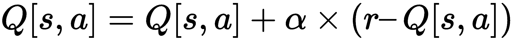

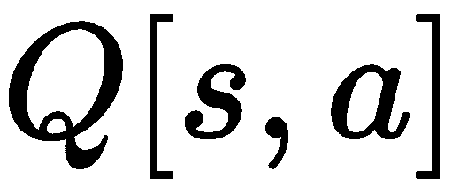 =数值表/矩阵

*   [1,2,3,4

2,3,4,5

4,2,1,4]

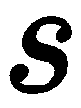 =状态

*    =动作
*    = alpha =学习率
*    =奖励
*    = reward

让我们打开`Chapter_5_2.py`并观察以下步骤:

打开代码，如下所示，并遵循前面示例中所做的更改:

1.  这个代码设置了许多多臂强盗，每个强盗都有自己的一套武器。然后，它会进行多次迭代，但这一次，当它循环时，它还会循环每个 bandit。在每一次循环中，它随机选取一个手臂来拉动并评估质量。

```
import random

alpha = .9
bandits = [[['bronze' , 1],['gold', 3], ['silver' , 2], ['bronze' , 1]],
           [['bronze' , 1],['gold', 3], ['silver' , 2], ['bronze' , 1]],
           [['bronze' , 1],['gold', 3], ['silver' , 2], ['bronze' , 1]],
           [['bronze' , 1],['gold', 3], ['silver' , 2], ['bronze' , 1]]]
q = [[0,0,0,0],
     [0,0,0,0],
     [0,0,0,0],
     [0,0,0,0]]

for i in range(10): 
    for b in range(len(bandits)):
        arm = random.randint(0,3)
        print('pulling arm {0} on bandit {1}'.format(arm,b))
        q[b][arm] = q[b][arm] + alpha * (bandits[b][arm][1]-q[b][arm])

print(q)
```

2.  运行示例并查看`q`的输出。请注意，即使在选择了随机手臂后，该等式仍然一致地选择了黄金手臂，即奖励最高的手臂来拉。
3.  请随意使用这个示例，并从练习中寻找更多的灵感。当我们讨论 Q-Learning 时，我们将扩展 RL 问题的复杂性。然而，在我们进入这一部分之前，我们将快速转移话题，看看如何建立 OpenAI 健身房，以便进行更多的 RL 实验。

开放健身房的 RL


# RL 已经变得如此流行，以至于现在出现了一场只构建工具来帮助构建 RL 算法的竞赛。目前这一领域的两个主要竞争对手是**开放健身房**和 **Unity** 。Unity 很快成为了 RL 赛车，我们将在后面深入探讨。现在，我们将戴上训练轮，运行 OpenAI Gym，进一步探索 RL 的基础。

我们需要安装 OpenAI Gym toolkit 才能继续，根据您的操作系统，安装可能会有很大差异。因此，我们在这里将着重于 Windows 安装说明，因为其他操作系统用户可能会有较少的困难。按照以下步骤在 Windows 上安装 OpenAI Gym:

安装一个 C++编译器；如果你安装了 Visual Studio 2017，你可能已经有推荐的了。你可以在这里找到其他支持的编译器:[https://wiki.python.org/moin/WindowsCompilers](https://wiki.python.org/moin/WindowsCompilers)。

1.  确保安装了 Anaconda，打开 Anaconda 命令提示符并运行以下命令:
2.  就我们的目的而言，在短期内，我们不需要安装任何其他的健身房模块。Gym 有大量的示例环境，Atari 游戏和 MuJoCo(机器人模拟器)是最有趣的工作环境。我们将在本章的后面看一下 Atari 游戏模块。

```
conda create -n gym
conda activate gym
conda install python=3.5  # reverts Python, for use with TensorFlow later
pip install tensorflow
pip install keras pip install gym
```

3.  For our purposes, in the short term, we don't need to install any other Gym modules. Gym has plenty of example environments, Atari games and MuJoCo (robotics simulator) being some of the most fun to work with. We will take a look at the Atari games module later in this chapter.

这将为您的系统安装健身房环境。我们需要的大部分东西只需很少的设置就能工作。如果你决定用 Gym 做更多的事情，那么你可能会想安装其他模块；有好几个。在下一节中，我们将在学习 Q-Learning 时测试这个新环境。

Q-学习模型


# RL 与几个数学和动态编程概念纠缠在一起，可以填满一本教科书，事实上也有几个。然而，就我们的目的而言，我们只需要理解关键概念，以便构建我们的 DRL 代理。因此，我们将选择不要让数学负担太重，但是有几个关键概念你需要理解才能成功。如果你在[第一章](108dd4cb-0332-4f3b-963b-fbfb49f2c8f0.xhtml)、*游戏的深度学习*中涉及了数学，这一节将是轻而易举的。对于那些没有，只是慢慢来，但你不能错过这一次。

为了理解 Q-Learning 模型，它是 RL 的一种形式，我们需要回到基础。在下一部分，我们将讨论**马尔可夫决策过程**和**贝尔曼** e **方程**的重要性。

马尔可夫决策过程和贝尔曼方程


# RL 的核心是**马尔可夫决策过程** ( **MDP** )。MDP 通常被描述为离散时间随机控制过程。更简单地说，这只是意味着它是一个控制程序，通过时间步长来确定行动的概率，前提是每个行动都会导致奖励。这一过程已经用于机器人、无人机、网络以及 RL 的大多数自动化控制。下图显示了我们描绘这一过程的经典方式:

其中使用以下变量将 MDP 表示为元组或向量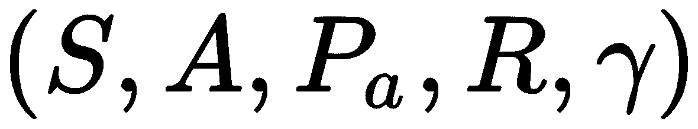:

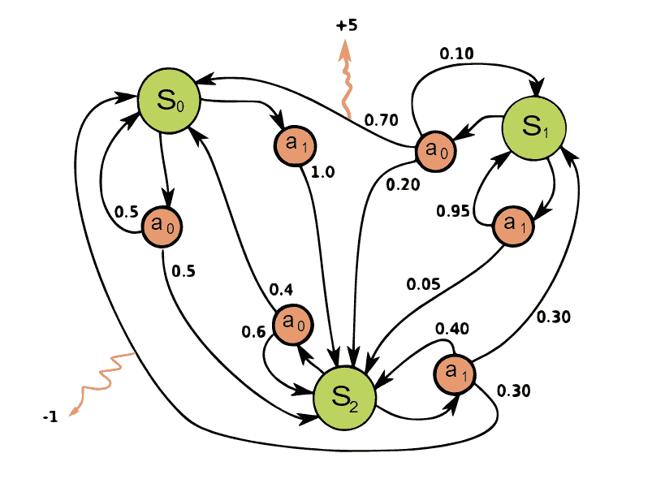

The Markov decision process

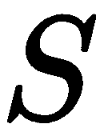 -作为状态的有限集合，

*    -作为一组有限的动作，
*   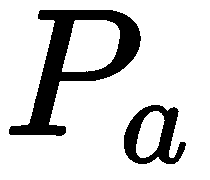 -在时间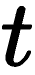处于状态的动作导致在时间处于状态的概率，
*    -是即时奖励
*    - gamma 是一个折扣系数，我们应用它来降低重要性或为未来奖励提供重要性
*   这个图表的工作原理是把你自己想象成一个处于其中一种状态的代理人。然后你根据概率决定行动，总是采取随机行动。当你移动到下一个状态时，动作给你一个奖励，你根据奖励更新概率。同样，大卫·西尔弗在他的讲座中很好地阐述了这一点。

The diagram works by picturing yourself as an agent in one of the states. You then determine actions based on the probability, always taking a random action. As you move to the next state, the action gives you a reward and you update the probability based on the reward. Again, David Silver covers this piece very well in his lectures.

现在，前面的过程起作用了，但另一个变化出现了，它提供了更好的未来奖励评估，这是通过引入**贝尔曼方程**和政策/价值迭代的概念来完成的。之前我们有一个值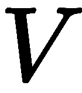，现在我们有一个策略()用于名为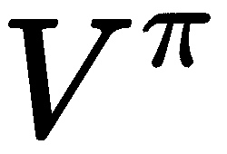的值，这产生了一个新的等式，如下所示:

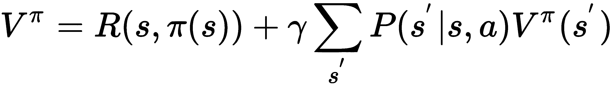

除了说记住质量迭代的概念之外，我们不会对这个等式做更多的介绍。在下一节中，我们将看到如何将这个等式还原为每个动作的质量指标，并将其用于 Q 学习。

q 学习


# 随着质量迭代方法的引入，推导出称为 **Q 学习**或**质量学习**的有限状态方法。q 对给定的有限状态问题使用质量迭代技术来确定代理的最佳行动过程。我们在上一节中看到的等式现在可以表示如下:

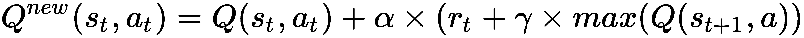

考虑以下等式:

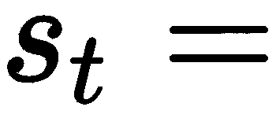当前状态

*   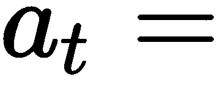当前动作
*   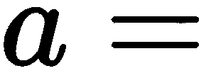下一个动作
*   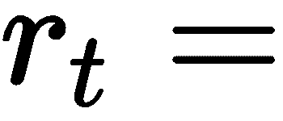当前奖励
*   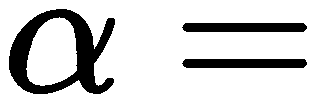学习率(α)
*   奖励折扣系数(伽玛)
*   现在，当代理在其环境中漫游时，Q 值以迭代方式更新。没有什么比一个例子更能说明这些概念了。打开`Chapter_5_3.py`并遵循以下步骤:

我们从各种导入开始，并按照下面的代码设置它们:

1.  这些导入只是加载了我们在这个例子中需要的基本库。记住，您需要安装`Gym`来运行这个示例。

```
from collections import deque
import numpy as np
import os
clear = lambda: os.system('cls') #linux/mac use 'clear'
import time
import gym
from gym import wrappers, logger
```

2.  接下来，我们建立一个新的环境；在这个例子中，我们使用基本的`FrozenLake-v0`样本，一个测试 Q-learning 的完美例子:
3.  然后，我们设置人工智能环境(`env`)和许多其他参数:

```
environment = 'FrozenLake-v0'
env = gym.make(environment)
```

4.  在代码的这一部分，我们设置了一些变量，稍后我们会讲到。对于这个示例，我们使用一个包装工具来监控环境，这对于确定任何潜在的培训问题非常有用。另外要注意的是`q_table`数组的设置，由环境`observation_space`(状态)和`action_space`(动作)定义；空格定义数组而不仅仅是向量。在这个特殊的例子中，`action_space`是一个向量，但它也可以是一个多维数组或张量。

```
outdir = os.path.join('monitor','q-learning-{0}'.format(environment))
env = wrappers.Monitor(env, directory=outdir, force=True)
env.seed(0)
env.is_slippery = False
q_table = np.zeros([env.observation_space.n, env.action_space.n])

#parameters
wins = 0
episodes = 40000
delay = 1

epsilon = .8
epsilon_min = .1
epsilon_decay = .001
gamma = .9
learning_rate = .1
```

5.  跳过函数的下一部分，跳到最后一部分，在这里进行训练迭代，如下面的代码所示:

6.  前面的大部分代码相对简单，应该很容易理解。看看`env`(环境)是如何使用`act`函数生成的`action`；这用于单步执行或执行对代理的操作。`step`函数的输出是`next_state`、`reward`和`done`，我们通过使用`learn`函数来确定最优 Q 策略。

```
for episode in range(episodes): 
    state = env.reset()
    done = False
    while not done:
        action = act(env.action_space,state)
        next_state, reward, done, _ = env.step(action)
        clear()
        env.render()
        learn(state, action, reward, next_state)
        if done:
            if reward > 0:
                wins += 1
            time.sleep(3*delay)
        else:
            time.sleep(delay)

print("Goals/Holes: %d/%d" % (wins, episodes - wins))
env.close() 
```

7.  在我们进入动作和学习功能之前，运行示例并观察代理如何训练。这可能需要一段时间来训练，所以请放心回到书上。
8.  以下是 OpenAI Gym FrozenLake 环境运行我们的 Q-learning 模型的示例:

随着示例的运行，您将看到一个显示环境的简单文本输出。`S`表示开始，`G`表示目标，`F`表示冷冻切片，`H`表示孔。智能体的目标是在环境中找到自己的路，而不会掉进洞里，并达到目标。特别注意代理如何移动并在环境中找到路。在下一节中，我们将解开`learn`和`act`功能，并理解探索的重要性。

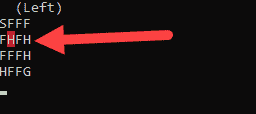

FrozenLake Gym environment

q-学习和探索


# 我们在 Q-learning 等策略迭代模型中面临的一个问题是探索与利用的问题。Q-model 方程假设使用最高质量来确定一个动作，我们称之为利用(利用模型)。这样做的问题是，它经常会迫使代理人采用只寻求最佳短期利益的解决方案。相反，我们需要允许代理有一定的灵活性来探索环境并自己学习。我们通过在训练中引入溶解探索因素来做到这一点。让我们通过再次打开`Chapter_5_3.py`示例来看看这是怎么回事:

向下滚动到`act`和`is_explore`功能，如图所示:

1.  Scroll down to the `act` and `is_explore` functions as shown:

```
def is_explore():
    global epsilon, epsilon_decay, epsilon_min
    epsilon = max(epsilon-epsilon_decay,epsilon_min)
    if np.random.rand() < epsilon:
        return True
    else:
        return False

def act(action_space, state):
    # 0 - left, 1 - Down, 2 - Right, 3 - Up
    global q_table
    if is_explore():
        return action_space.sample()
    else:
        return np.argmax(q_table[state])
```

注意在`act`函数中，它首先测试代理是否想或需要与`is_explore()`一起探索。在`is_explore`函数中，我们可以看到全局`epsilon`值随着`epsilon_decay`的每次迭代而衰减到全局最小值`epsilon_min`。当代理开始一集，他们的探索`epsilon`是高的，使他们更有可能探索。随着时间的推移，随着情节的进展，`epsilon`减小。我们的假设是，随着时间的推移，代理人需要探索的越来越少。勘探和开发之间的这种权衡是非常重要的，也是关于环境状态的大小需要理解的事情。我们将在本书中看到更多关于这种权衡的探讨。
请注意，代理使用了探索功能，并且只选择了一个随机动作。

2.  最后，我们得到了`learn`函数。该函数是计算`Q`值的地方，如下所示:
3.  这里，等式被分解和简化，但这是计算代理在剥削时将使用的值的步骤。

```
def learn(state, action, reward, next_state):
    # Q(s, a) += alpha * (reward + gamma * max_a' Q(s', a') - Q(s, a))
    global q_table
    q_value = gamma * np.amax(q_table[next_state])
    q_value += reward
    q_value -= q_table[state, action]
    q_value *= learning_rate
    q_value += q_table[state, action]
    q_table[state, action] = q_value
```

4.  保持代理运行，直到它完成。我们刚刚完成了第一个完整的强化学习问题，尽管它有一个有限的状态。在下一节中，我们将大大扩展我们的视野，看看与强化学习相结合的深度学习。

第一个深度 Q 学习的 DRL


# 既然我们已经详细了解了强化学习过程，我们可以考虑调整我们的 Q-learning 模型来处理深度学习。正如你可能猜到的，这是我们努力的结果，也是 RL 真正力量闪耀的地方。正如我们在前面章节中了解到的，深度学习本质上是一个复杂的方程系统，可以通过非线性函数映射输入，以生成训练好的输出。

Now that we understand the reinforcement learning process in detail, we can look to adapt our Q-learning model to work with deep learning. This, as you could likely guess, is the culmination of our efforts and where the true power of RL shines. As we learned through earlier chapters, deep learning is essentially a complex system of equations that can map inputs through a non-linear function to generate a trained output.

神经网络只是求解非线性方程的另一种更简单的方法。稍后我们将会看到如何使用 DNN 来求解其他方程，但是现在我们将集中于使用它来求解我们在上一节看到的 Q-learning 方程。

我们将使用 OpenAI Gym toolkit 中的 **CartPole** 训练环境。这种环境几乎是用来学习深度 Q 学习的标准。

打开`Chapter_5_4.py`,按照接下来的步骤，看看我们如何将求解器转换为使用深度学习:

像往常一样，我们查看导入和一些初始启动参数，如下所示:

1.  接下来，我们将创建一个包含 DQN 代理功能的类。`__init__`的功能如下:

```
import random
import gym
import numpy as np
from collections import deque
from keras.models import Sequential
from keras.layers import Dense
from keras.optimizers import Adam

EPISODES = 1000
```

2.  大部分参数已经包含在内，但是请注意一个名为`memory`的新参数，它是一个保存最后 2000 步的 **deque** 集合。这允许我们以一种重放模式批量训练我们的神经网络。

```
class DQNAgent:
    def __init__(self, state_size, action_size):
        self.state_size = state_size
        self.action_size = action_size
        self.memory = deque(maxlen=2000)
        self.gamma = 0.95 # discount rate
        self.epsilon = 1.0 # exploration rate
        self.epsilon_min = 0.01
        self.epsilon_decay = 0.995
        self.learning_rate = 0.001
        self.model = self._build_model()
```

3.  接下来，我们看看如何使用`_build_model`函数构建神经网络模型，如下所示:

4.  与我们已经看到的其他模型相比，这构建了一个相当简单的模型，三个**密集**层为每个动作输出一个值。这个网络的输入是国家。

```
def _build_model(self):
    # Neural Net for Deep-Q learning Model
    model = Sequential()
    model.add(Dense(24, input_dim=self.state_size, activation='relu'))
    model.add(Dense(24, activation='relu'))
    model.add(Dense(self.action_size, activation='linear'))
    model.compile(loss='mse',
                      optimizer=Adam(lr=self.learning_rate))
    return model
```

5.  跳到文件的底部，查看训练迭代循环，如下所示:
6.  Jump down to the bottom of the file and look at the training iteration loop, shown as follows:

```
if __name__ == "__main__":
    env = gym.make('CartPole-v1')
    state_size = env.observation_space.shape[0]
    action_size = env.action_space.n
    agent = DQNAgent(state_size, action_size)
    # agent.load("./save/cartpole-dqn.h5")
    done = False
    batch_size = 32

    for e in range(EPISODES):
        state = env.reset()
        state = np.reshape(state, [1, state_size]) 
        for time in range(500):
            # env.render()
            action = agent.act(state)
            env.render()
            next_state, reward, done, _ = env.step(action)
            reward = reward if not done else -10
            next_state = np.reshape(next_state, [1, state_size])
 agent.remember(state, action, reward, next_state, done)
            state = next_state
            if done:
                print("episode: {}/{}, score: {}, e: {:.2}"
                      .format(e, EPISODES, time, agent.epsilon))
                break
            if len(agent.memory) > batch_size:
                agent.replay(batch_size)
```

在这个例子中，我们的训练发生在一个实时的`render`循环中。代码的重要部分被突出显示，显示了状态的整形并调用了`agent.remember`函数。最后的`agent.replay`功能是网络训练的地方。`remember`功能如下:

7.  该功能仅存储重放训练的`state`、`action`、`reward`、`next_state`、`done`参数。向下滚动到`replay`功能，如下所示:

```
def remember(self, state, action, reward, next_state, done):
    self.memory.append((state, action, reward, next_state, done))
```

8.  `replay`功能是进行网络训练的地方。我们先定义一个`minibatch`，它是由`batch_size`分组的以往经验随机抽样定义的。然后，我们循环设置`reward`到`target`的批次，如果不是`done`则根据`next_state`上的模型预测计算新的目标。之后，我们使用`state`上的`model.predict`功能来确定最终目标。最后，我们使用`model.fit`函数将训练好的目标反向传播回网络。由于这一部分很重要，让我们重申一下。注意计算和设置变量`target`的行。这几行代码可能看起来很熟悉，因为它们符合我们之前看到的 Q 值方程。该`target`值是应该为当前动作预测的值。这是为当前动作反向传播的值，由返回的`reward`设置。

```
def replay(self, batch_size):
    minibatch = random.sample(self.memory, batch_size)
    for state, action, reward, next_state, done in minibatch:
        target = reward
        if not done:
            target = (reward+self.gamma*
                      np.amax(self.model.predict(next_state)[0]))
            target_f = self.model.predict(state)
            target_f[0][action] = target
            self.model.fit(state, target_f, epochs=1, verbose=0)
        if self.epsilon > self.epsilon_min:
            self.epsilon *= self.epsilon_decay
```

9.  运行示例并观察代理训练以平衡推车上的杆。下面显示了培训时的环境:

10.  钢管露天体育馆环境


示例环境使用典型的第一个环境 CartPole，我们用它来学习构建我们的第一个 DRL 模型。在下一节中，我们将看看如何在其他场景和通过 Keras-RL API 提供的其他模型中使用 DQNAgent。

RL 实验


# 强化学习正在快速发展，我们刚刚看到的 DQN 模型已经很快被更先进的算法超越。RL 算法有多种变化和进步，可能会占据几个章节，但大多数材料将被视为学术。因此，我们将转而查看 Keras RL API 提供的各种 RL 模型的一些更实用的示例。

我们可以使用的第一个简单的例子是改变我们以前的例子，使其适用于新的`gym`环境。打开`Chapter_5_5.py`，进行下一个练习:

在以下代码中更改环境名称:

1.  在这种情况下，我们将使用`MountainCar`环境，如图所示:

```
if __name__ == "__main__":
    env = gym.make('MountainCar-v0')
```

2.  山地车环境示例


像平常一样运行代码，看看 DQNAgent 如何解决爬山问题。

3.  您可以看到我们切换环境和在另一个环境中测试 DQNAgent 的速度有多快。在下一节中，我们将看到用 Keras-RL API 提供的各种 RL 算法训练 Atari 游戏。

Keras RL


# Keras 提供了一个非常有用的 RL API，它包装了几个变体，比如 DQN、DDQN、SARSA 等等。我们现在不会详细讨论这些不同的 RL 变体，但我们会在以后讨论更复杂的模型时讨论重要的部分。不过现在，我们将看看如何快速构建一个 DRL 模型来玩 Atari 游戏。打开`Chapter_5_6.py`并遵循以下步骤:

我们首先需要用`pip`安装几个依赖项；打开命令 shell 或 Anaconda 窗口，输入以下命令:

1.  We first need to install several dependencies with `pip`; open a command shell or Anaconda window, and enter the following commands:

```
pip install Pillow
pip install keras-rl

pip install gym[atari] # on Linux or Mac
pip install --no-index -f https://github.com/Kojoley/atari-py/releases atari_py  # on Windows thanks to Nikita Kniazev
```

这将安装 Keras RL API、`Pillow`、一个图像框架和用于`gym`的 Atari 环境。

2.  像平常一样运行示例代码。这个示例确实接受脚本参数，但是我们不需要在这里使用它们。呈现的 Atari 分组环境的示例如下:
3.  不幸的是，您不能在代理玩的时候看到游戏运行，因为所有的动作都发生在后台，但是让代理运行，直到它完成并保存模型。下面是我们运行示例的方式:

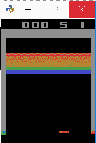

Atari Breakout environment

您可以使用`--mode test`作为参数重新运行样本，让代理运行 10 集并查看结果。

1.  在示例运行时，浏览代码并特别注意模型，如下所示:
2.  请注意我们的模型是如何使用`Convolution`和池的。这是因为该示例将游戏的每个屏幕/帧作为输入(状态)读取，并相应地做出响应。在这种情况下，模型国家是巨大的，这表明了 DRL 的真正力量。在这种情况下，我们仍然在训练一个状态模型，但是在以后的章节中，我们将着眼于训练一个策略，而不是一个模型。

```
model = Sequential()
if K.image_dim_ordering() == 'tf':
    # (width, height, channels)
    model.add(Permute((2, 3, 1), input_shape=input_shape))
elif K.image_dim_ordering() == 'th':
    # (channels, width, height)
    model.add(Permute((1, 2, 3), input_shape=input_shape))
else:
    raise RuntimeError('Unknown image_dim_ordering.')
model.add(Convolution2D(32, (8, 8), strides=(4, 4)))
model.add(Activation('relu'))
model.add(Convolution2D(64, (4, 4), strides=(2, 2)))
model.add(Activation('relu'))
model.add(Convolution2D(64, (3, 3), strides=(1, 1)))
model.add(Activation('relu'))
model.add(Flatten())
model.add(Dense(512))
model.add(Activation('relu'))
model.add(Dense(nb_actions))
model.add(Activation('linear'))
print(model.summary())
```

3.  这是对 RL 的简单介绍，我们已经忽略了新人可能会忽略的几个细节。由于我们计划在 RL 上覆盖更多的章节，特别是**近似策略优化** ( **PPO** ) 在[第 8 章](1393797c-79cd-46c3-8e43-a09a7750fc92.xhtml)、*理解 PPO* 中有更详细的介绍，所以不要太担心诸如策略和基于模型的 RL 之类的差异。

在这个 GitHub 链接的 TensorFlow 中有一个同样的 DQN 的优秀例子:[https://github.com/floodsung/DQN-Atari-Tensorflow](https://github.com/floodsung/DQN-Atari-Tensorflow)。该代码可能有点过时，但它是一个简单而优秀的示例，值得一看。

我们不会进一步查看代码，但读者肯定会被邀请。现在让我们做一些练习。

练习


# 像往常一样，使用本节中的练习来更好地理解你所学的材料。尝试完成本节中至少两到三个练习:

回到示例`Chapter_5_1.py`，改变 **alpha** ( `learning_rate`)变量，看看这对计算值有什么影响。

1.  回到`Chapter_5_2.py`的例子，改变各种强盗的手臂位置。
2.  改变示例`Chapter_5_2.py`的学习率，看看这对 Q 结果输出有什么影响。
3.  Change the learning rate on the example `Chapter_5_2.py` and see what effect this has on the Q results output.

改变`Chapter_5_3.py`示例中的 gamma 奖励折扣系数，看看这对代理培训有什么影响。

4.  将`Chapter_5_3.py`中的探测ε更改为不同的值，并重新运行样品。看看改变各种探索参数对训练代理有什么影响。
5.  改变`Chapter_5_4.py`示例中的各种参数(**探索**、 **alpha** 和 **gamma** )，看看这对训练有什么影响。
6.  改变`Chapter_5_4.py`例子中的内存大小，或者更大或者更小，看看这对训练有什么影响。
7.  尝试在来自`Chapter_5_5.py`的 DQNAgent 示例中使用不同的健身房环境。你可以在谷歌上快速搜索一下，看看有没有其他可供选择的环境。
8.  `Chapter_5_6.py`示例目前使用一种叫做`LinearAnnealedPolicy`的表单探索策略；将策略更改为使用代码注释中提到的`BoltzmannQPolicy`策略。
9.  请务必下载并运行来自 https://github.com/keras-rl/keras-rl[的其他 Keras-RL 示例。同样，您可能需要安装其他健身房环境来让它们工作。](https://github.com/keras-rl/keras-rl)
10.  关于 RL 还有很多其他的例子、视频和其他材料可以学习。尽可能多的学习，因为这些材料广泛而复杂，不是你一夜之间就能学会的。

摘要


# RL 是目前主导许多研究人员兴趣的机器学习技术。它对我们很有吸引力，因为它非常适合游戏和模拟。在这一章中，我们从多兵种背景强盗的基本入门问题开始，讨论了 RL 的一些基础。然后，我们快速查看了安装 OpenAI Gym RL 工具包。然后我们看了 Q-learning 以及如何在代码中实现它，并在 OpenAI 健身房环境中训练它。最后，我们研究了如何通过加载一些其他环境，包括 Atari 游戏模拟器，用 Gym 进行各种其他实验。

在下一章中，我们将关注 Unity 目前正在开发的快速发展的尖端 RL 平台。

In the next chapter, we look at the quickly evolving a cutting-edge RL platform that Unity is currently developing.