<title>Unity ML-Agents</title>  

# unity ML-代理

Unity 以坚定的决心和活力拥抱了机器学习，特别是深度强化学习，目的是为游戏和模拟开发者制作一个工作的 **seep 强化学习**(**)SDK。幸运的是，由 Danny Lange 领导的 Unity 团队已经成功开发出一种强大的尖端 DRL 引擎，能够产生令人印象深刻的结果。这种发动机是最好的，在许多方面都比我们早先推出的 DQN 型强得多。Unity 使用一个**近似策略优化** ( **PPO** )模型作为其 DRL 引擎的基础。这个模型要复杂得多，可能在某些方面有所不同，但是，幸运的是，这是更多章节的开始，我们将有足够的时间来介绍这些概念——毕竟，这是一本动手操作的书。**

 **在这一章中，我们介绍用于构建 DRL 代理来玩游戏和模拟的 **Unity ML-Agents** 工具和 SDK。虽然这个工具既强大又先进，但它也很容易使用，并提供了一些工具来帮助我们学习概念。在本章中，我们将讨论以下主题:

*   安装 ML 代理
*   培训代理
*   大脑里有什么？
*   使用 TensorBoard 监控训练
*   运行代理

我们要感谢 Unity 的团队成员在 ML-Agents 上的出色工作；以下是撰写本文时的团队成员:

*   丹尼·兰格([https://arxiv.org/search/cs?searchtype=author&query =兰格%2C+D](https://arxiv.org/search/cs?searchtype=author&query=Lange%2C+D) )
*   亚瑟·朱利安尼([https://arxiv.org/search/cs?searchtype=author&query =朱利安尼%2C+A](https://arxiv.org/search/cs?searchtype=author&query=Juliani%2C+A) )
*   文森特-皮埃尔·伯格斯([https://arxiv.org/search/cs?searchtype=author&query =伯格斯%2C+V](https://arxiv.org/search/cs?searchtype=author&query=Berges%2C+V) )
*   esh Vckay([https://arxiv.org/search/cs?searchtype=author&查询=Vckay%2C+E](https://arxiv.org/search/cs?searchtype=author&query=Vckay%2C+E) )
*   ([查询=高%2C+Y](https://arxiv.org/search/cs?searchtype=author&query=Gao%2C+Y) )
*   亨特·亨利(【https://arxiv.org/search/cs?searchtype=author】T21&查询=亨利%2C+H )
*   马尔万·马特([https://arxiv.org/search/cs?searchtype=author&查询=马特%2C+M](https://arxiv.org/search/cs?searchtype=author&query=Mattar%2C+M) )
*   亚当·克雷斯皮([https://arxiv.org/search/cs?searchtype=author&查询=克雷斯皮%2C+A](https://arxiv.org/search/cs?searchtype=author&query=Crespi%2C+A) )
*   乔纳森·哈珀([https://arxiv.org/search/cs?searchtype=author&query =哈珀%2C+J](https://arxiv.org/search/cs?searchtype=author&query=Harper%2C+J) )

在继续本章之前，请确保您已经按照[第 4 章](a8e699ff-c668-4601-842d-4c6e06c47a61.xhtml)、*构建深度学习游戏聊天机器人、*中的章节安装了 Unity。

<title>Installing ML-Agents</title>  

# 安装 ML 代理

在本节中，我们将概括介绍成功安装 ML-Agents SDK 所需的步骤。这份材料仍处于测试阶段，并且已经从一个版本到另一个版本发生了显著的变化。因此，如果你在完成这些高级步骤时遇到困难，只要回到最近的 Unity 文档；他们写得很好。

跳上你的电脑，按照以下步骤操作；可能有许多子步骤，因此预计这需要一段时间:

1.  确保您的计算机上安装了 Git 它从命令行工作。Git 是一个非常流行的源代码管理系统，关于如何在您的平台上安装和使用 Git 有大量的资源。安装 Git 后，只要通过测试克隆一个存储库，任何存储库，确保它能够工作。
2.  打开命令窗口或常规 shell。Windows 用户可以打开 Anaconda 窗口。
3.  切换到您想要放置新代码的工作文件夹，并输入以下命令(Windows 用户可能想要使用`C:\ML-Agents`):

```
git clone https://github.com/Unity-Technologies/ml-agents
```

4.  这将把`ml-agents`库克隆到您的计算机上，并创建一个同名的新文件夹。您可能需要采取额外的步骤，将版本添加到文件夹名称中。Unity，以及几乎整个人工智能领域，都在不断转型，至少目前是这样。这意味着新的和不断的变化总是在发生。在写的时候，我们会克隆到一个名为`ml-agents.6`的文件夹，就像这样:

```
git clone https://github.com/Unity-Technologies/ml-agents ml-agents.6
```

这本书的作者以前写过一本关于 ML-Agents 的书，为了适应主要的变化，他不得不在短时间内重写了几章。事实上，这一章也不得不重写几次，以说明更多的重大变化。

5.  为`ml-agents`创建一个新的虚拟环境，并将其设置为`3.6`，如下所示:

```
#Windows 
conda create -n ml-agents python=3.6

#Mac
Use the documentation for your preferred environment
```

6.  再次使用 Anaconda 激活环境:

```
activate ml-agents
```

7.  安装 TensorFlow。有了 Anaconda，我们可以通过使用以下内容来实现这一点:

```
pip install tensorflow==1.7.1
```

8.  安装 Python 包。在 Anaconda 上，输入以下内容:

```
cd ML-Agents #from root folder
cd ml-agents or cd ml-agents.6 #for example
cd ml-agents
pip install -e . or pip3 install -e .
```

9.  这将安装代理 SDK 所需的所有软件包，可能需要几分钟时间。请务必打开此窗口，因为我们很快就会用到它。

这是 TensorFlow 的基本安装，不使用 GPU。查阅 Unity 文档以了解如何安装 GPU 版本。这可能会也可能不会对你的训练表现产生巨大的影响，这取决于你的 GPU 的能力。

这应该完成了用于 ML 代理的 Unity Python SDK 的设置。在下一节，我们将学习如何设置和训练 Unity 提供的众多示例环境中的一个。

<title>Training an agent</title>  

# 培训代理

在本书的大部分时间里，我们都在看代码以及**深度学习** ( **DL** )和**强化学习** ( **RL** )的内在深度。有了这些知识，我们现在可以跳进去看看使用**深度强化学习** ( **DRL** )的例子。幸运的是，新代理的工具包提供了几个示例来展示该引擎的威力。打开 Unity 或 Unity Hub，按照以下步骤操作:

1.  点按项目对话框顶部的“打开项目”按钮。
2.  找到并打开`UnitySDK`项目文件夹，如下图所示:

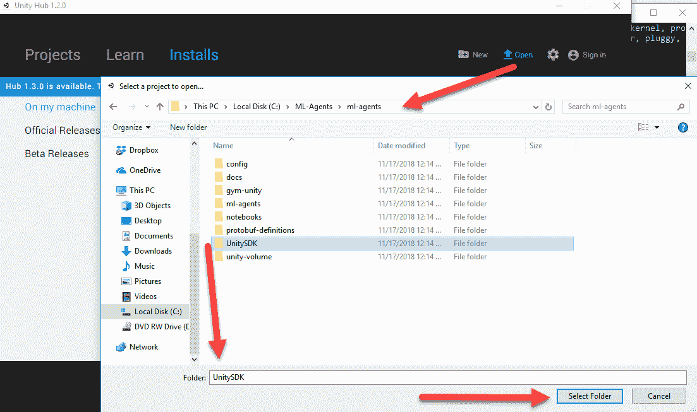

打开 UnitySDK 项目

3.  等待项目加载，然后打开编辑器底部的项目窗口。如果你被要求更新项目，一定要说是或继续。到目前为止，所有的代理代码都被设计成向后兼容的。

4.  找到并打开 GridWorld 场景，如下图所示:

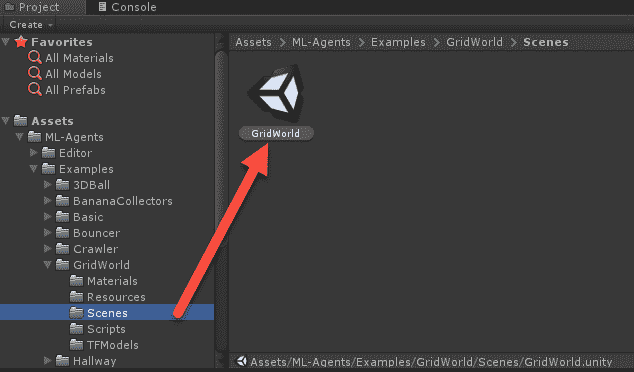

打开 GridWorld 示例场景

5.  在“层次”窗口中选择 GridAcademy 对象。

6.  然后将注意力转向“检查器”窗口，在大脑旁边，点按目标图标以打开大脑选择对话框:

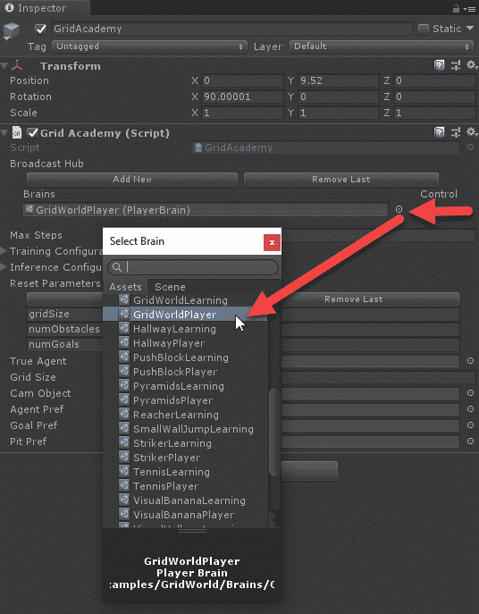

检查 GridWorld 示例环境

7.  选择 GridWorldPlayer 大脑。这个大脑是一个*玩家*大脑，意味着一个玩家，你，可以控制游戏。我们将在下一节更深入地研究这个大脑概念。
8.  按下编辑器顶部的 Play 按钮，观察网格环境表单。由于游戏当前设置为玩家，您可以使用 **WASD** 控件来移动立方体。目标很像我们之前为 DQN 建造的冰冻池塘环境。也就是你要把蓝色的立方体移到绿色的+符号，避开红色的 x。

你可以尽情地玩这个游戏。请注意这个游戏只运行一定的时间，并且不是回合制的。在下一节中，我们将学习如何使用 DRL 代理运行这个示例。

<title>What's in a brain?</title>  

# 大脑里有什么？

ML-Agents 平台的一个出色的方面是能够非常快速和无缝地从玩家控制切换到 AI/agent 控制。为了做到这一点，Unity 使用了一个**大脑**的概念。大脑可以是玩家控制的，玩家大脑，也可以是代理控制的，学习大脑。精彩的部分是你可以构建一个游戏并测试它，因为玩家可以在 RL 代理上打开游戏。这有一个额外的好处，使得任何用 Unity 编写的游戏都可以被人工智能轻松控制。事实上，这是一个如此强大的工作流程，以至于我们将花费整个章节，[第 12 章](323523c2-82f9-48c4-b1b5-35d417f90558.xhtml)，*用 DRL* 调试/测试一个游戏，来测试和调试你的 RL 游戏。

用 Unity 训练 RL 代理的设置和运行相当简单。Unity 对外使用 Python 构建学习大脑模型。使用 Python 更有意义，因为正如我们已经看到的，几个 DL 库是在它的基础上构建的。按照以下步骤为 GridWorld 环境培训一个代理:

1.  再次选择 GridAcademy，并将大脑从 GridWorldPlayer 切换到 GridWorldLearning，如下所示:

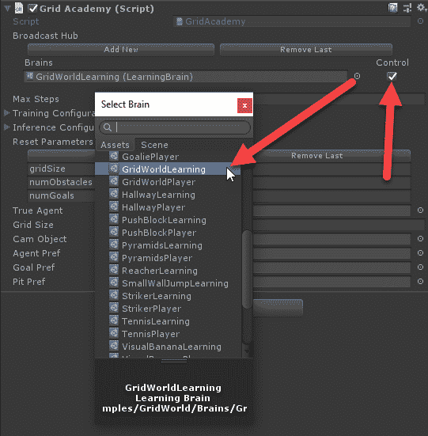

转换大脑使用网格世界学习

2.  确保在最后点按“控制”选项。这个简单的设置告诉大脑它可以被外部控制。请务必仔细检查该选项是否已启用。
3.  在“层次”窗口中选择 trueAgent 对象，然后在“检查器”窗口中，将“网格代理”组件下的“大脑”属性更改为 GridWorldLearning brain:

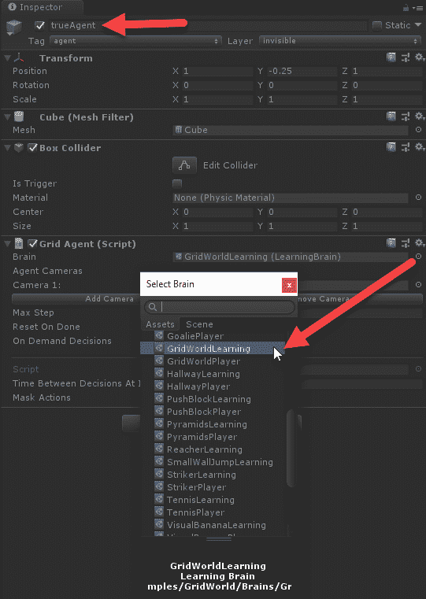

将代理上的大脑设置为 GridWorldLearning

4.  对于这个示例，我们希望将我们的学院和代理交换使用同一个大脑 GridWorldLearning。在我们稍后将探讨的更高级的案例中，情况并非总是如此。你当然可以让一个玩家和一个智能体大脑同时运行，或者其他配置。
5.  确保您打开了一个 Anaconda 或 Python 窗口，并设置为`ML-Agents/ml-agents`文件夹或您的版本化`ml-agents`文件夹。
6.  使用`ml-agents`虚拟环境在 Anaconda 或 Python 窗口中运行以下命令:

```
mlagents-learn config/trainer_config.yaml --run-id=firstRun --train
```

7.  这将启动 Unity PPO 训练器，并按配置运行代理示例。在某些时候，命令窗口会提示您运行 Unity 编辑器，并加载环境。
8.  在 Unity 编辑器中按 Play 运行 GridWorld 环境。不久之后，您应该会看到代理训练，其结果会输出到 Python 脚本窗口中:

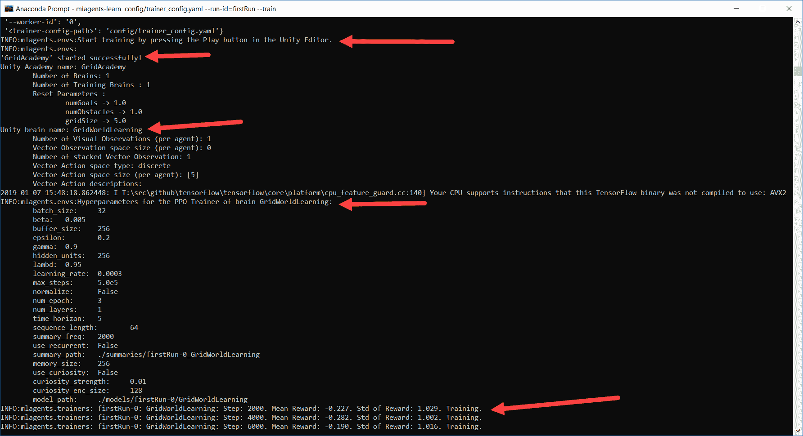

在训练模式下运行 GridWorld 环境

9.  注意`mlagents-learn`脚本是构建 RL 模型来运行代理的 Python 代码。正如您从脚本输出中看到的，有几个参数，或者我们称之为**超参数**，需要进行配置。这些参数中的一些可能听起来很熟悉，它们应该是熟悉的，但是有几个可能不清楚。幸运的是，在本章和本书的剩余部分，我们将详细探讨如何调整这些参数。
10.  让代理训练几千次迭代，注意它学习的速度有多快。这里的内部模型叫做 **PPO** ，已经被证明在多种形式的任务中是一个非常有效的学习者，并且非常适合游戏开发。根据您的硬件，代理可能会在不到一个小时的时间内学会完成此任务。

继续代理培训，我们将在下一节中查看更多检查代理培训进度的方法。

<title>Monitoring training with TensorBoard</title>  

# 使用 TensorBoard 监控训练

用 RL 或任何 DL 模型来训练一个代理虽然令人愉快，但通常不是一项简单的任务，需要注意一些细节。幸运的是，TensorFlow 附带了一套名为 **TensorBoard** 的图形工具，我们可以用它来监控训练进度。按照以下步骤运行 TensorBoard:

1.  打开一个 Anaconda 或 Python 窗口。激活`ml-agents`虚拟环境。不要关闭运行训练器的窗口；我们需要继续下去。
2.  导航到`ML-Agents/ml-agents`文件夹并运行以下命令:

```
tensorboard --logdir=summaries
```

3.  这将运行 TensorBoard 自带的内置 web 服务器。您可以使用运行前面的命令后显示的 URL 来加载页面。
4.  在窗口中输入 TensorBoard 的 URL，或者在浏览器中使用`localhost:6006`或`machinename:6006`。大约一个小时后，您应该会看到类似下面的内容:

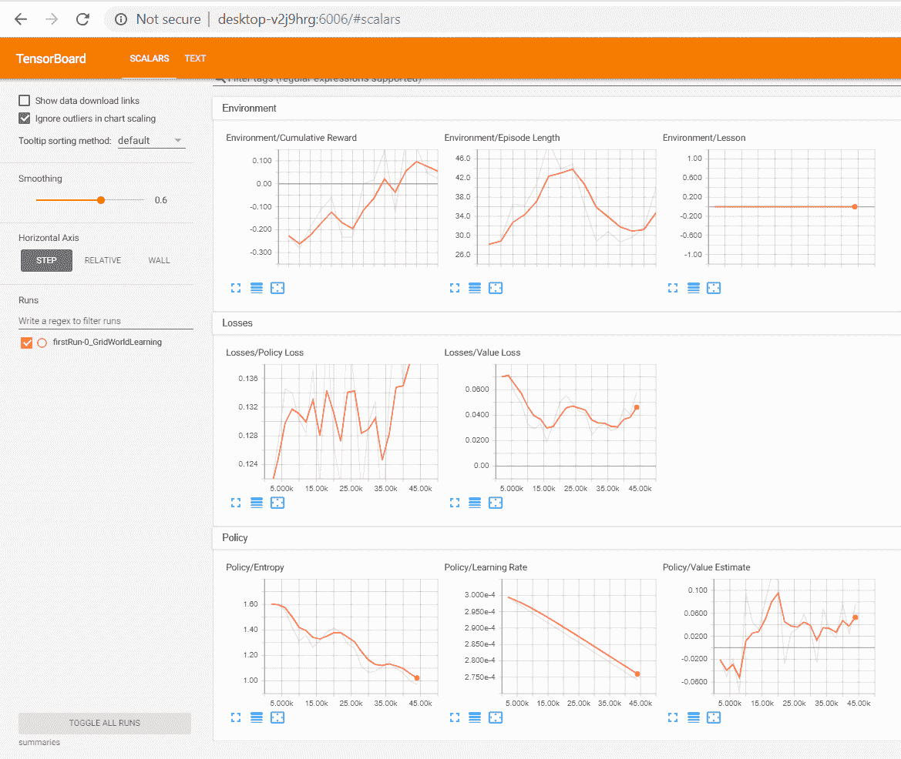

张量板图形窗口

5.  在前面的屏幕截图中，您可以看到表示培训某个方面的各种图表。了解这些图表中的每一个对于了解您的代理如何训练非常重要，因此我们将分解每个部分的输出:
    *   环境:此部分显示代理在环境中的整体表现。下面的屏幕截图详细展示了每个图表及其首选趋势:

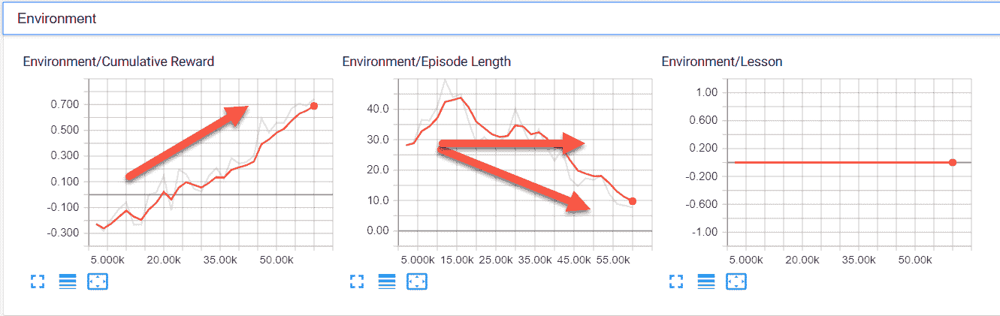

仔细查看环境部分图

*   累积奖励:这是代理人最大化的总奖励。你通常希望看到它上涨，但它下跌也是有原因的。在 1 比 1 的范围内最大化奖励总是最好的。如果您在图表上看到奖励超出了这个范围，您也需要纠正这个问题。
*   剧集长度:如果这个值减少，通常是一个更好的迹象。毕竟，更短的剧集意味着更多的训练。然而，请记住，剧集长度可能会根据需要而增加，所以这一集可以是任意一集。
*   课程:这表示代理所在的课程，用于课程学习。我们将在[第 9 章](ae184eca-6c9d-456e-a72b-85274ddcc10c.xhtml)、*奖励和强化学习*中了解更多课程学习。
*   损失:此部分显示了表示计算出的保单和价值的损失或成本的图表。当然，我们还没有花太多的时间来解释 PPO 以及它是如何使用一个策略的，所以，在这一点上，只要了解培训时的首选方向即可。接下来显示了该部分的屏幕截图，同样带有显示最佳首选项的箭头:

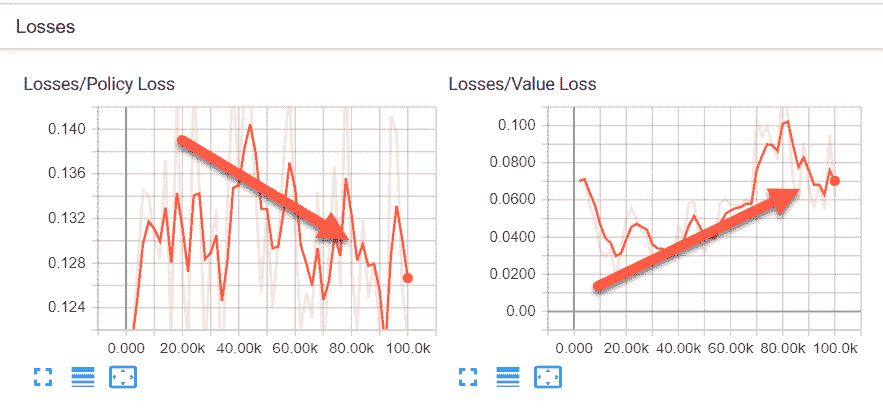

损失和首选培训方向

*   策略损失:这决定了策略随着时间的推移会发生多大的变化。策略是决定行动的部分，一般来说，这个图应该显示一个下降的趋势，表明策略在做决策方面变得更好。
*   价值损失:这是`value`函数的平均损失。它本质上模拟了代理如何预测其下一个状态的值。最初，这个值应该会增加，然后在奖励稳定后，它应该会减少。
*   政策:PPO 使用政策的概念而不是模型来决定行动的质量。同样，我们将在第 8 章、*了解 PPO、*中花更多的时间，在那里我们将揭示关于 PPO 的更多细节。下一个屏幕截图显示了策略图表及其首选趋势:

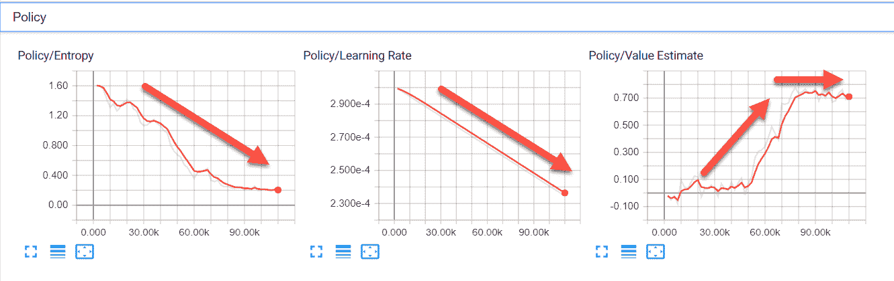

政策图表和首选趋势

*   熵:这表示代理探索了多少。随着代理对周围环境了解得越来越多，需要探索得越来越少，您希望该值减少。
*   学习率:目前，该值设置为随时间线性下降。
*   估计值:这是代理的所有状态访问的平均值。该值应该增加，以表示代理知识的增长，然后稳定下来。

这些图形都是为了与 Unity 所基于的 PPO 方法的实现一起工作而设计的。现在还不要太担心理解这些新术语。我们将在第 7 章、*代理和环境*中探讨 PPO 的基础。

6.  让代理运行完成，并保持 TensorBoard 运行。
7.  回到训练大脑的 Anaconda/Python 窗口，运行以下命令:

```
mlagents-learn config/trainer_config.yaml --run-id=secondRun --train
```

8.  将再次提示您在编辑器中按播放键；一定要这样做。让代理开始培训并运行几个会话。当你这样做时，监视 TensorBoard 窗口并注意`secondRun`是如何显示在图表上的。也可以让这个代理运行完成，但是如果您愿意，现在就可以停止它。

在以前的 ML-Agents 版本中，您需要首先构建一个 Unity 可执行文件作为游戏训练环境并运行它。外部 Python 大脑仍然会运行相同的程序。这种方法使得调试任何代码问题或游戏问题变得非常困难。所有这些困难都用当前的方法解决了；然而，我们以后可能需要使用旧的可执行方法进行一些定制训练。

既然我们已经看到了设置和训练一个代理是多么容易，我们将在下一节看看这个代理如何在没有外部 Python 大脑的情况下直接在 Unity 中运行。

<title>Running an agent</title>  

# 运行代理

使用 Python 来训练效果很好，但这不是一个真正的游戏会使用的东西。理想情况下，我们希望能够建立一个张量流图，并在 Unity 中使用它。幸运的是，我们构建了一个名为 TensorFlowSharp 的库。NET 来消耗张量流图。这允许我们建立离线的 TF 模型，然后将它们注入到我们的游戏中。不幸的是，我们只能使用经过训练的模型，而不能以这种方式训练，至少现在还不能。

让我们通过使用我们刚刚为 GridWorld 环境训练的图表来看看这是如何工作的，并将其用作 Unity 中的内部大脑。按照下一节中的练习来设置和使用内部大脑:

1.  从这个链接下载 TFSharp 插件:[https://S3 . amazonaws . com/unity-ml-agents/0.5/tfsharpplugin . unity package](https://s3.amazonaws.com/unity-ml-agents/0.5/TFSharpPlugin.unitypackage)。 [](https://s3.amazonaws.com/unity-ml-agents/0.5/TFSharpPlugin.unitypackage) 

如果此链接不起作用，请咨询 Unity 文档或资产商店获取新的链接。目前的版本是实验性的，可能会有变化。

2.  从编辑器菜单中，选择资产|导入包|自定义包...
3.  找到您刚刚下载的资产包，并使用导入对话框将插件加载到项目中。如果你在这些基本的 Unity 任务上需要帮助，网上有很多帮助可以进一步指导你。

4.  从菜单中，选择编辑|项目设置。这将打开设置窗口(2018.3 中的新功能)
5.  在播放器选项下找到脚本定义符号，并将文本设置为`ENABLE_TENSORFLOW`并启用允许不安全代码，如该屏幕截图所示:

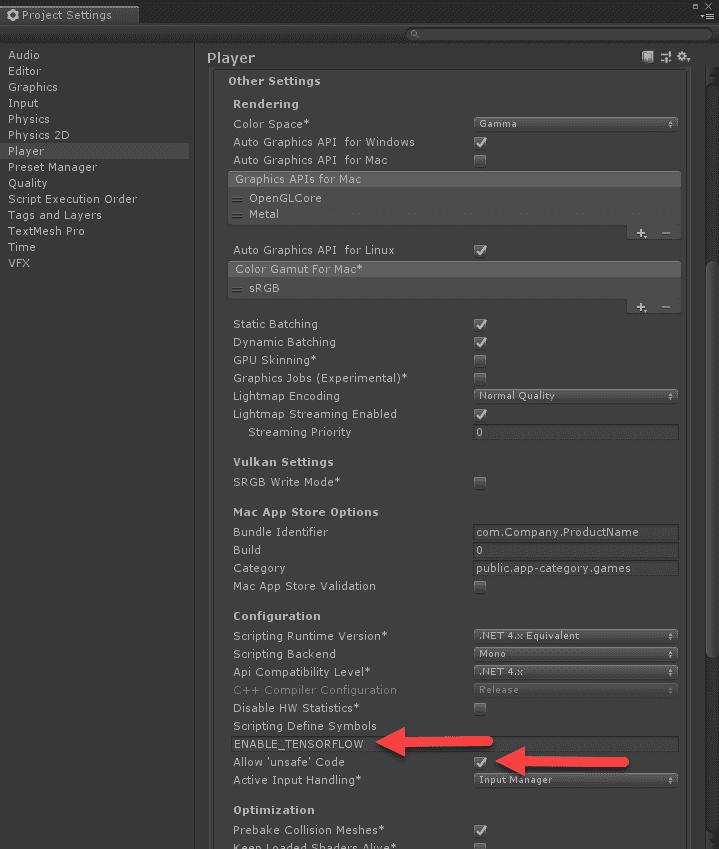

设置 ENABLE_TENSORFLOW 标志

6.  在层次窗口中找到 GridWorldAcademy 对象，并确保它正在使用 Brains | GridWorldLearning。在 Grid Academy 脚本的“Brains”部分，禁用“Control”选项。
7.  在`Assets/Examples/GridWorld/Brains`文件夹中找到 GridWorldLearning brain，确保在检查器窗口中设置了模型参数，如下图所示:

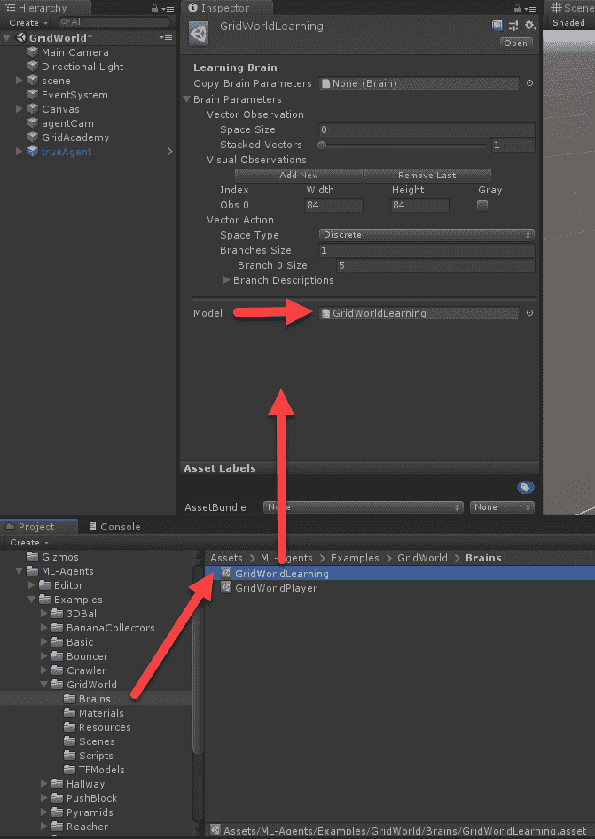

为大脑建立模型

8.  模型应该已经设置为**GridWorldLearning**模型。在本例中，我们使用 GridWorld 示例附带的 TFModel。您也可以轻松地使用我们在前面的示例中训练的模型，只需将其导入到项目中，然后将其设置为模型。****
*****   按“播放”运行编辑器，观看代理控制多维数据集。****

 ****现在，我们正在使用预先训练好的 Unity brain 运行环境。在下一节中，我们将看看如何使用我们在上一节中训练过的大脑。

<title>Loading a trained brain</title>  

# 装载训练有素的大脑

所有的 Unity 样本都带有预先训练好的大脑，你可以用它来探索样本。当然，我们希望能够将我们自己的 TF 图加载到 Unity 中并运行它们。按照以下步骤加载训练图:

1.  找到`ML-Agents/ml-agents/models/firstRun-0`文件夹。在这个文件夹中，您应该会看到一个名为`GridWorldLearning.bytes`的文件。将此文件拖入 Unity 编辑器的`Project/Assets/ML-Agents/Examples/GridWorld/TFModels`文件夹中，如图所示:

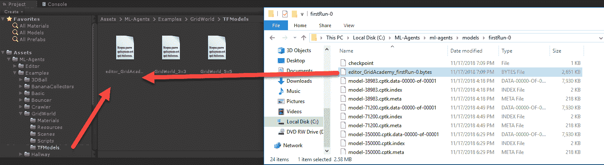

将字节图拖入 Unity

2.  这将把图形作为资源导入到 Unity 项目中，并将其重命名为`GridWorldLearning 1`。这样做是因为默认模型已经有了相同的名称。

3.  从`brains`文件夹中找到`GridWorldLearning`并在检查器窗口中选择它，然后将新的 GridWorldLearning 1 模型拖到 Brain 参数下的模型槽中:

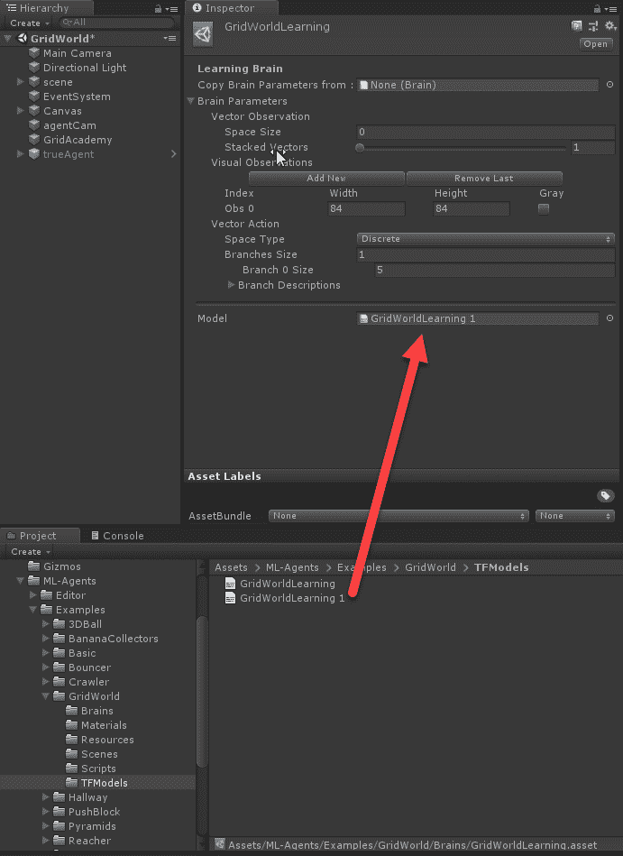

在大脑中加载图形模型槽

4.  在这一点上，我们不需要改变任何其他参数，但要特别注意大脑是如何配置的。默认设置暂时有效。
5.  按下 Unity 编辑器中的 Play，观看代理成功运行游戏。
6.  你训练代理的时间长短将决定它在游戏中的表现。如果你让它完成训练，代理应该等于已经训练好的 Unity 代理。

现在，您可以自己运行和探索大量的 Unity 示例。你可以随意自己训练几个例子，或者按照下一节练习中所列的来训练。

<title>Exercises</title>  

# 练习

使用本节中的练习来提高和巩固您的学习。自己尝试至少几个这样的练习，记住这真的对你有好处:

1.  设置并运行 3DBall 示例环境来训练工作代理。这个环境使用多个游戏/代理来训练。
2.  以 3DBall 为例，让一半的游戏使用已经训练好的大脑，另一半使用训练或外部学习。
3.  使用外部学习培训推块环境代理。
4.  训练视觉推块环境。注意这个例子是如何使用一个可视摄像机来捕捉环境状态的。
5.  作为玩家运行走廊场景，然后使用外部学习大脑训练该场景。
6.  作为玩家运行 VisualHallway 场景，然后使用外部学习大脑训练该场景。
7.  运行跳墙场景，然后在训练条件下运行。这个例子使用了课程培训，我们将在[第 9 章](ae184eca-6c9d-456e-a72b-85274ddcc10c.xhtml)、*奖励和强化学习*中进一步探讨。
8.  运行金字塔场景，然后设置它进行训练。
9.  运行 VisualPyramids 场景并为训练进行设置。
10.  运行保镖场景，并为训练进行设置。

虽然您不必运行所有这些练习/示例，但熟悉它们会有所帮助。正如我们将在下一章中看到的，它们通常是创造新环境的基础。

<title>Summary</title>  

# 摘要

正如您所了解的，在 Unity 中培训 RL 和 DRL 代理的工作流程比在 OpenAI Gym 中更加完整和无缝。我们不必编写一行代码来训练网格世界环境中的代理，而且视觉效果更好。对于这一章，我们从安装 ML-Agents 工具包开始。然后，我们加载了一个 GridWorld 环境，并将其设置为使用 RL 代理进行训练。从那里，我们看着 TensorBoard 监控代理培训和进展。在我们完成训练后，我们首先加载了一个 Unity 预训练大脑，并在 GridWorld 环境中运行。然后，我们使用一个我们刚刚训练过的大脑，并将其作为资产导入 Unity，然后作为 GridWorldLearning 大脑的模型。

在下一章，我们将探索如何构建一个新的 RL 环境或游戏，我们可以使用一个代理来学习和玩。这将使我们能够更深入地了解我们在本章中浏览过的各种细节。******