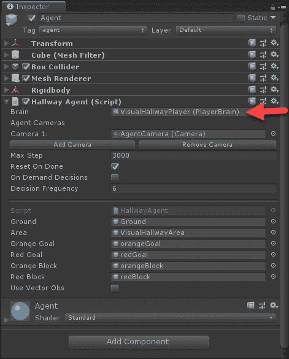
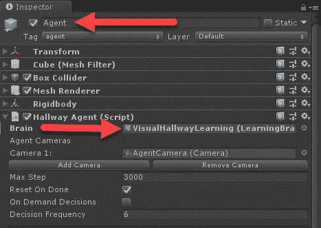
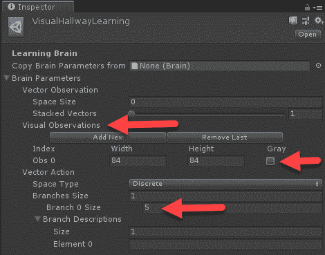
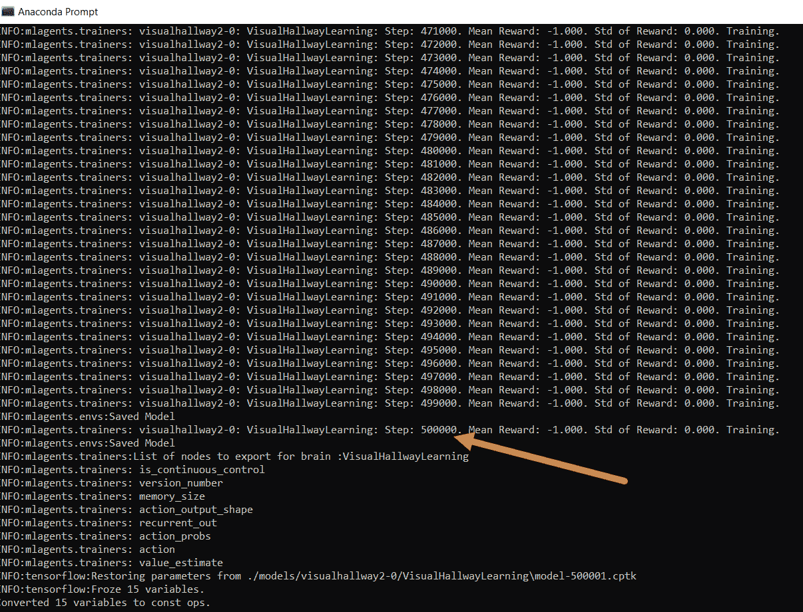
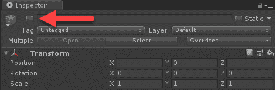
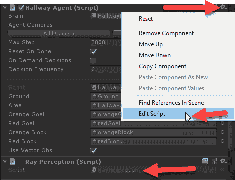
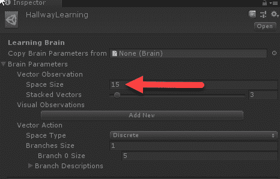
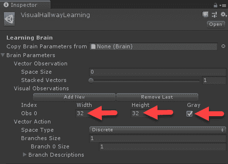
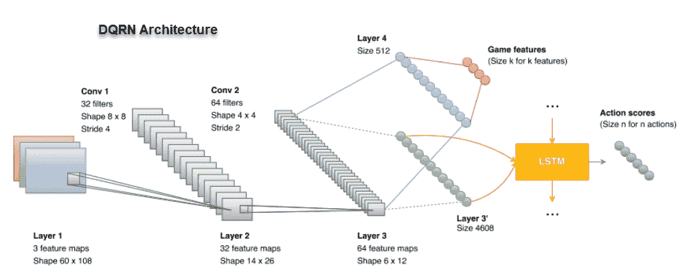

# 代理人与环境

玩和探索实验性的强化学习环境是很好的，但是，最终，大多数游戏开发者想要开发他们自己的学习环境。要做到这一点，我们需要了解更多关于训练深度强化学习环境的知识，特别是代理如何接收和处理输入。因此，在这一章中，我们将仔细研究在 Unity 中训练一个更困难的样本环境。这将有助于我们理解输入和状态对于训练代理有多重要的许多复杂细节，以及 Unity ML-Agents 工具包中的许多功能，这些功能使我们可以轻松地探索多个选项。对于任何想要建立自己的环境并在游戏中使用 ML-agent 的人来说，这将是一个关键的章节。所以，如果你需要反复阅读这一章来理解细节，请这样做。

在这一章中，我们将涉及许多与代理如何处理输入/状态相关的细节，以及如何调整这些细节以适应您的代理培训。以下是本章内容的总结:

*   探索培训环境
*   理解状态
*   理解视觉状态
*   卷积和视觉状态
*   循环网络

确保您已经阅读、理解并运行了上一章、[第 6 章](b422aff5-b743-4696-ba80-e0a222ea5b4d.xhtml)、 *Unity ML-Agents* 中的一些示例练习。在继续之前，您必须正确配置和运行 Unity 和 ML-Agents toolkit。


# 探索培训环境

经常推动我们走向成功，或者推动我们去学习的事情之一，就是失败。作为人类，当我们失败时，有两种情况发生:我们更加努力或者我们放弃。有趣的是，这与强化学习中的负面奖励没有什么不同。在 RL 中，一个获得负回报的代理人可能会放弃探索一条看不到未来价值的路径，或者它预测不会给出足够的收益。然而，如果代理人觉得需要更多的探索，或者它还没有完全用尽路径，它会继续前进，这通常会将它引向正确的路径。再说一次，这肯定和我们人类没什么不同。因此，在本节中，我们将培训一个更难的示例代理，促使自己学习如何失败和修复培训失败。

Unity 目前正在建造一个具有多种难度的多级基准塔环境。这将允许 DRL 爱好者、从业者和研究人员在基线环境中测试他们的技能/模型。作者被告知，合理的权威，这个环境应该在 2019 年初/年中完成。

我们将需要使用 Unity ML-Agents toolkit 的许多高级特性来最终让这个例子工作起来。这需要你很好地理解这本书的前五章。如果您跳过这些章节来到这里，请返回并根据需要复习它们。在本章的许多地方，提供了到前面相关章节的有用链接。

我们将重点关注的培训示例环境是 VisualHallway，不要与标准的 Hallway 示例相混淆。VisualHallway 的不同之处在于，它使用摄像机作为模型的完整输入状态，而我们之前看到的其他 Unity 示例使用某种形式的多感知传感器输入，通常允许代理随时查看 90 到 360 度，并获得其他有用的信息。这对大多数游戏来说没问题，事实上，许多游戏仍然允许 NPC 或计算机对手将这种欺骗或直觉作为他们人工智能的一部分。在游戏的人工智能中加入这些作弊手段已经是多年来公认的做法，但也许这种情况很快就会改变。

毕竟，好的游戏玩起来很有趣，而且对玩家有意义。不久前的游戏可能会给人工智能作弊。然而，现在，玩家们期待更多，他们希望他们的人工智能和他们一样遵守同样的规则。以前认为计算机人工智能受到技术限制的阻碍的看法已经一去不复返了，现在一个游戏人工智能必须按照与玩家相同的规则来玩，这使得我们对 VisualHallway 样本工作/训练的关注更加引人注目。

当然，教人工智能像玩家一样玩耍/学习还有另一个额外的好处，那就是能够使用一个叫做转移学习的概念，将这种能力转移到其他环境中玩耍。我们将在第 10 章、*模仿和迁移学习*中探讨迁移学习，其中我们将学习如何调整预训练的模型/参数并将其应用于其他环境。

visual hallow/hallow 样本从将代理随机投入一个长房间或走廊开始。在这个空间的中心是一个彩色块，在每个角落的走廊的一端是一个彩色的正方形覆盖着地板。该方块为红色或金色(橙色/黄色),用于通知代理相同颜色的目标方块。目标是让代理移动到正确的彩色方块。在标准走廊示例中，代理具有 360 度传感器感知能力。在可视走廊的例子中，代理仅被显示房间的摄像机视图，与游戏的玩家版本所看到的完全一样。这使得我们的经纪人和球员处于平等的地位。

在我们开始训练之前，让我们打开这个例子，像玩家一样玩它，看看我们做得怎么样。按照本练习打开 VisualHallway 示例:

1.  在继续之前，请确保您有一个 ML-Agents 的工作安装，并且可以在 Python 中对大脑进行外部训练。如果需要帮助，请查阅上一章。
2.  从“项目”窗口的“资产| ML-代理|示例|走廊|场景”文件夹中打开 VisualHallway 场景。

3.  确保 Agent | Hallway Agent | Brain 设置为 VisualHallwayPlayer，如下图所示:



走廊代理|大脑设置为播放器

4.  在编辑器中按 Play 运行场景，使用 *W* 、 *A* 、 *S* 和 *D* 键控制代理。请记住，目标是移动到与中心方块颜色相同的方块。
5.  玩游戏，移动到两个彩色方块，看看当给予奖励时会发生什么，无论是积极的还是消极的。当进入奖励方块时，游戏屏幕会闪烁绿色或红色。

这种游戏环境是典型的第一人称射击游戏，也非常适合训练代理人以第一人称游戏。训练一个代理人扮演人类是许多人工智能从业者的目标，你可能会也可能不会努力把它融入到你的游戏中。正如我们将会看到的，根据你游戏的复杂程度，这种类型的学习/训练甚至可能不是一个可行的选择。此时，我们应该看看如何直观地设置和训练代理。


# 对代理进行可视化培训

幸运的是，设置代理来可视化地训练它是非常简单的，特别是如果你已经完成了上一章的练习。打开 Unity 编辑器到 VisualHallway 场景，准备好 Python 命令或 Anaconda 窗口，让我们开始:

1.  在 Unity 中，将 Agent | Hallway Agent | Brain 改为 VisualHallwayLearning，如下截图所示:



改变大脑去学习

2.  单击 VisualHallwayLearning brain，在项目窗口中找到它。
3.  点击 VisualHallwayLearning brain，在 Inspector 窗口中查看其属性，如以下屏幕摘录所示:



确认学习大脑上的属性设置正确

4.  确保 Brain 参数设置为接受分辨率为`84` x `84`像素的单次视觉观察，并且不使用灰度。灰色只是去除了颜色通道，这使得输入是一个通道而不是三个。回想一下我们在第二章、*卷积和循环网络*中对 CNN 层的讨论。另外，确保 Vector Observation | Space Size 为 0，如前面的屏幕截图所示。
5.  从菜单中，选择文件|保存和文件|保存项目以保存所有更改。
6.  切换到 Python 窗口或 Anaconda 提示符，确保您位于`ML-Agents/ml-agents`目录中，并运行以下命令:

```
mlagents-learn config/trainer_config.yaml --run-id=visualhallway --train
```

7.  命令运行后，等待提示启动编辑器。然后，在出现提示时运行编辑器，让示例运行完成，或者您有耐心等待多长时间。
8.  运行完示例后，您应该会看到如下所示的内容:



完整的训练运行到完成

假设您训练您的代理直到运行结束，也就是 500 K 次迭代，那么您可以确认代理实际上什么也没学到。那么，为什么 Unity 会在他们的样本中放一个这样的例子呢？嗯，你可以说这是故意的挑战，或者只是他们的疏忽。无论哪种方式，我们都将把它作为更好地理解强化学习的挑战。

在我们应对这一挑战之前，让我们后退一步，通过查看下一部分中更容易训练的走廊示例来重申我们对这一环境的理解。


# 回归基础

通常，当你在一个问题上陷入困境时，回到起点并重申你对所有事情的理解都如预期的那样会有所帮助。现在，公平地说，我们还没有探索 ML-Agents 的内部并真正理解 DRL，所以我们实际上从未从头开始，但是，为了这个例子的目的，我们将后退一步，更详细地看走廊的例子。跳回到编辑器中，并遵循以下练习:

1.  在编辑器中打开走廊示例场景。请记住，场景位于资产| ML-代理|示例|走廊|场景文件夹中。
2.  这个示例被配置为使用几个并发的培训环境。我们能够用同一个大脑训练多个并发的训练环境，因为**近似策略优化** ( **PPO** )，驱动这个代理的 RL 算法，训练到一个策略而不是一个模型。当我们在第 8 章、*了解 PPO、*学习 RL 中了解 PPO 的内部原理时，我们将涵盖政策和基于模型的学习的基础。出于我们的目的和简单起见，我们现在将禁用这些额外的环境。
3.  按下 *Shift* ，然后选择层级中所有编号的走廊区域(1-15)对象。
4.  选中所有额外的走廊区域对象后，通过单击“活动”复选框将其全部禁用，如以下屏幕截图所示:



禁用所有额外的训练走廊

5.  在“层次结构”窗口中打开剩余的有效走廊区域，并选择代理。
6.  设置大脑代理使用走廊学习大脑。可能默认设置为使用玩家大脑。
7.  在“层次”窗口中选择“学院”对象，并确保“走廊学院”组件的 brain 设置为 Learning，并且“控制”复选框处于启用状态。
8.  打开一个 Python 或 Anaconda 窗口到`ML-Agents/ml-agents`文件夹。确保您的 ML-Agents 虚拟环境处于活动状态，并运行以下命令:

```
mlagents-learn config/trainer_config.yaml --run-id=hallway --train
```

9.  让培训师启动并提示您单击编辑器中的播放。观察代理运行，并将其性能与 VisualHallway 示例进行比较。

通常，在 50，000 次迭代之前，您会注意到代理的一些训练活动，但这可能会有所不同。我们所说的培训活动是指代理的平均奖励大于-1.0，标准奖励不等于零。即使你让例子运行到完成，也就是再次 500，000 次迭代，样本也不太可能训练到正的均值回报。我们通常希望我们的奖励范围从-1.0 到+1.0，有一些变化来显示学习活动。如果您还记得 VisualHallway 示例，代理在培训期间没有显示任何学习活动。我们可以扩展训练迭代，但是我们不太可能看到任何稳定的训练出现。其原因与增加的状态空间和对奖励的处理有关。在下一节中，我们将扩展我们对状态以及它如何与 RL 相关的理解。


# 理解状态

Hallway 和 VisualHallway 的例子本质上是同一个游戏问题，但是提供了一个不同的视角，或者我们可以在强化学习中称为环境或游戏状态。在走廊示例中，代理通过传感器输入进行学习，这是我们很快就会看到的，而在可视走廊示例中，代理通过摄像机或玩家视角进行学习。在这一点上，有帮助的是理解每个例子如何处理状态，以及我们如何修改它。

在以下练习中，我们将修改走廊输入状态并查看结果:

1.  回到上次练习结束时我们离开的走廊场景，并启用学习功能。
2.  我们将需要修改几行 C#代码，没有什么非常困难，但安装 Visual Studio(社区或其他版本)可能是有用的，因为这将是我们首选的编辑器。当然，你可以使用任何你喜欢的代码编辑器，只要它能和 Unity 一起工作。
3.  在“层次结构”窗口中找到代理对象，然后在“检查器”窗口中，单击走廊代理组件上的齿轮图标，如以下屏幕截图所示:



打开 HallwayAgent.cs 脚本

4.  从上下文菜单中，选择 Edit Script 选项，如前面的屏幕截图所示。这将在您选择的代码编辑器中打开脚本。

5.  在编辑器中找到以下 C#代码部分:

```
public override void CollectObservations()
{
  if (useVectorObs)
  {
    float rayDistance = 12f;
    float[] rayAngles = { 20f, 60f, 90f, 120f, 160f };
    string[] detectableObjects = { "orangeGoal", "redGoal", "orangeBlock", "redBlock", "wall" };
    AddVectorObs(GetStepCount() / (float)agentParameters.maxStep);
    AddVectorObs(rayPer.Perceive(rayDistance, rayAngles, detectableObjects, 0f, 0f));
  }
}
```

6.  `CollectObservations`方法是代理收集它的观察值或输入它的状态。在走廊的例子中，代理将`useVectorObs`设置为`true`，这意味着它通过使用`if`语句内部的代码块来检测状态。这段代码所做的就是从代理以`20f`、`60f`、`120f`和`160f`度的角度在`rayDistance`定义的距离投射光线或线条，并检测`detectableObjects`中定义的对象。光线感知是通过一个称为`RayPerception`类型的`rayPer`辅助组件完成的，它执行`rayPer.Percieve`来收集它感知的环境状态。这与步的比率一起，被添加到代理将输入的向量观察或状态中。此时，状态的长度为 36 个向量。在这个版本中，这需要用代码来构造，但是这在将来可能会改变。
7.  更改代码的`rayAngles`行，使其与以下内容匹配:

```
float[] rayAngles = { 20f, 60f };
```

8.  这具有将代理的视野或感知从 180 度显著缩小到 60 度的效果。另一种思考方式是减少输入状态。
9.  完成编辑后，保存文件并返回 Unity。当你返回编辑器时，Unity 会重新编译代码。

10.  在 Assets | ML-Agents | Examples | Hallway | Brains 文件夹中找到 HallwayLearning brain，并将 Vector Observation | Space Size 更改为`15`，如以下截图所示:



设置矢量观测空间大小

11.  我们将其减少到 15°的原因是，输入现在由两个角度输入和一个阶跃输入组成。每个角度输入包括五个可检测的对象，加上七个感知或输入的两个边界。因此，两个角度乘以七个感知加上一个脚步，等于 15。以前，我们有五个角度乘以七个感知加上一步，等于 35。
12.  请确保在修改 Brain 可编写脚本的对象后保存项目。
13.  再次运行培训中的示例，观察代理如何培训。花些时间注意代理采取的行动以及它是如何学习的。确保这个示例运行的时间与其他走廊示例运行的时间一样长，希望能够运行到结束。

你对结果感到惊讶吗？是的，我们的代理人视野更小，实际上训练得更快。这可能看起来完全违背直觉，但是从数学的角度来考虑这个问题。更小的输入空间或状态意味着代理有更少的路径可以探索，因此应该训练得更快。这确实是我们在这个例子中看到的，当我们将输入空间减少一半以上时。在这一点上，我们肯定需要看看当我们在 VisualHallway 例子中减少视觉状态空间时会发生什么。


# 理解视觉状态

RL 是一种非常强大的算法，但当我们开始考虑大规模状态输入时，它会变得非常复杂。为了考虑大规模状态，许多强大的 RL 算法使用无模型或基于策略的学习的概念，这将在后面的章节中介绍。正如我们已经知道的，Unity 使用基于策略的算法，允许它通过推广到策略来学习任何大小的状态空间。这使我们可以轻松地输入一个 15 个向量的状态空间，在我们刚刚运行的例子中，它更大，就像在 VisualHallway 例子中一样。

让我们打开 Unity 的 VisualHallway 示例场景，看看如何在下面的练习中减少视觉输入空间:

1.  在 VisualHallway 场景打开的情况下，在 Assets | ML-Agents | Examples | hallow | Brains 文件夹中找到 HallwayLearningBrain 并选择它。
2.  修改大脑参数 **|** 视觉观察第一个摄像头可观察到的一个输入的`32` x `32`灰度。下面的屏幕截图显示了这样一个例子:



为代理设置视觉观察空间

3.  当视觉观察被设置在大脑上时，那么每一帧都是以所选择的分辨率从相机中捕获的。以前，捕获的图像是 84 x 84 像素大，绝不像玩家模式下的游戏屏幕那么大，但仍然明显大于 35 个矢量输入。通过缩小图像尺寸并使其灰度化，我们将一个输入帧从 84 x 84 x 3 = 20，172 个输入减少到 32 x 32 x 1 =1，024 个输入。反过来，这大大减少了我们所需的模型输入空间和需要学习的网络的复杂性。
4.  保存项目和场景。
5.  使用以下命令在学习模式下再次运行 VisualHallway:

```
mlagents-learn config/trainer_config.yaml --run-id=vh_reduced --train
```

6.  注意我们是如何在每次运行时改变`--run-id`参数的。回想一下，如果我们想使用 TensorBoard，那么我们的每一次运行都需要一个唯一的名称，否则它只会覆盖以前的运行。
7.  让样本训练的时间与您运行之前的 VisualHallway 练习的时间一样长，因为这将为您提供我们在状态中所做的更改的良好比较。

结果是你期望的吗？是的，代理仍然不学习，甚至在减少状态之后。这样做的原因是因为在这种特殊情况下，较小的视觉状态实际上对代理不利。与这些结果相似，我们希望我们人类通过针孔来解决问题。但是，还有另一种方法可以使用卷积将视觉状态简化为特征集。您可能还记得，我们在第 2 章、*卷积和循环网络*中详细讨论了卷积和 CNN。在下一节中，我们将看看如何通过添加卷积层来减少示例的视觉状态。


# 卷积和视觉状态

代理在 ML-Agents 工具包中使用的视觉状态是由一个过程定义的，该过程以特定的分辨率拍摄屏幕截图，然后将其输入卷积网络，以训练某种形式的嵌入式状态。在下面的练习中，我们将开放 ML-Agents 训练代码并增强卷积代码以获得更好的输入状态:

1.  使用文件浏览器打开位于`ml-agents.6\ml-agents\mlagents\trainers` **的 ML-Agents `trainers`文件夹。**在这个文件夹中，您会发现几个用于培训代理的 Python 文件。我们感兴趣的文件叫做`models.py`。

2.  在您选择的 Python 编辑器中打开`models.py`文件。具有 Python 数据扩展的 Visual Studio 是一个优秀的平台，并且还提供了交互式调试代码的能力。
3.  向下滚动文件找到`create_visual_observation_encoder`函数，如下所示:

```
def create_visual_observation_encoder(self, image_input, h_size, activation, num_layers, scope,reuse):
  #comments removed        
  with tf.variable_scope(scope):
    conv1 = tf.layers.conv2d(image_input, 16, kernel_size=[8, 8], strides=[4, 4],activation=tf.nn.elu, reuse=reuse, name="conv_1")
 conv2 = tf.layers.conv2d(conv1, 32, kernel_size=[4, 4], strides=[2, 2],activation=tf.nn.elu, reuse=reuse, name="conv_2")
    hidden = c_layers.flatten(conv2)

    with tf.variable_scope(scope + '/' + 'flat_encoding'):
      hidden_flat = self.create_vector_observation_encoder(hidden, h_size, activation, num_layers, scope, reuse)
 return hidden_flat
```

4.  代码是使用 TensorFlow 的 Python，但是你应该能够识别出`conv1`和`conv2`卷积层。请注意内核和步幅是如何为层以及缺失的池层定义的。Unity 不使用池来避免数据中空间关系的丢失。然而，正如我们之前所讨论的，这并不总是一成不变的，它会随着你试图识别的视觉特征的类型而变化。
5.  在两个卷积层后添加以下代码行，并修改`hidden`层设置，如下所示:

```
conv1 = tf.layers.conv2d(image_input, 16, kernel_size=[8, 8], strides=[4, 4], activation=tf.nn.elu, reuse=reuse, name="conv_1")
conv2 = tf.layers.conv2d(conv1, 32, kernel_size=[4, 4], strides=[2, 2], activation=tf.nn.elu, reuse=reuse, name="conv_2")
conv3 = tf.layers.conv2d(image_input, 64, kernel_size=[2, 2], strides=[2, 2], activation=tf.nn.elu, reuse=reuse, name="conv_3")

hidden = c_layers.flatten(conv3)
```

这将具有添加另一层卷积的效果，以在代理游戏视图中提取更精细的细节。正如我们在[第二章](391f7c79-537a-4c1d-bb92-e517097cd4d8.xhtml)、*卷积和循环网络*中看到的，增加额外的卷积层会增加训练时间，但确实会提高训练性能——至少在图像分类器上是这样。

跳回您的命令或 Anaconda 窗口，使用以下命令在学习模式下运行示例:

6.  观察训练并观察代理的表现，确保在示例运行时观察代理在游戏窗口中的移动。代理做的是你期望的吗？将您的结果与之前的运行结果进行比较，并注意差异。
7.  你肯定会注意到的一件事是代理人变得稍微更优雅，能够执行更精细的动作。虽然训练可能需要更长的时间，但这个代理将能够观察到环境中更细微的变化，从而做出更细微的动作。当然，你可以把整个 CNN 的 ML-agent 架构换成更好定义的架构。然而，请注意，大多数图像分类网络忽略了空间相关性，正如我们将在下一节中看到的，这与游戏代理非常相关。

```
mlagents-learn config/trainer_config.yaml --run-id=vh_conv1 --train
```

8.  合伙还是不合伙

正如我们在[第 2 章](391f7c79-537a-4c1d-bb92-e517097cd4d8.xhtml)、*卷积和循环网络*中所讨论的，ML-Agents 不使用任何池来避免数据中任何空间关系的丢失。然而，正如我们在自动驾驶汽车示例中看到的那样，在更高的特征级别提取(卷积层)上的一个或两个池层实际上是有帮助的。虽然我们的例子是在一个复杂得多的网络上测试的，但是看看这如何应用于一个更复杂的 ML-Agents CNN 嵌入将是有帮助的。让我们尝试一下，通过完成以下练习，将一个池层应用到最后一个示例中:


# 在您选择的 Python 编辑器中打开`models.py`文件。具有 Python 数据扩展的 Visual Studio 是一个优秀的平台，并且还提供了交互式调试代码的能力。

找到下面的代码块，这是我们在上一个练习中最后留下的代码块:

1.  我们现在将通过修改代码块注入一个池层，如下所示:
2.  这将我们之前的示例设置为使用单层池。您可以将此视为提取所有上层特征，如天空、墙壁或地板，并将结果汇集在一起。当你思考这个问题时，代理需要知道多少关于一个天空补丁与另一个天空补丁的空间信息？代理人真正需要知道的是天空总是向上的。

```
conv1 = tf.layers.conv2d(image_input, 16, kernel_size=[8, 8], strides=[4, 4], activation=tf.nn.elu, reuse=reuse, name="conv_1")
conv2 = tf.layers.conv2d(conv1, 32, kernel_size=[4, 4], strides=[2, 2], activation=tf.nn.elu, reuse=reuse, name="conv_2")
conv3 = tf.layers.conv2d(image_input, 64, kernel_size=[2, 2], strides=[2, 2], activation=tf.nn.elu, reuse=reuse, name="conv_3")

hidden = c_layers.flatten(conv3)
```

3.  打开命令 shell 或 Anaconda 窗口，通过运行以下代码来训练示例:

```
conv1 = tf.layers.conv2d(image_input, 16, kernel_size=[8, 8], strides=[4, 4], activation=tf.nn.elu, reuse=reuse, name="conv_1")
#################### ADD POOLING
conv2 = tf.layers.conv2d(conv1, 32, kernel_size=[4, 4], strides=[2, 2], activation=tf.nn.elu, reuse=reuse, name="conv_2")
conv3 = tf.layers.conv2d(image_input, 64, kernel_size=[2, 2], strides=[2, 2], activation=tf.nn.elu, reuse=reuse, name="conv_3")

hidden = c_layers.flatten(conv3)
```

4.  像往常一样，观察代理的表现，注意代理在训练时如何移动。观察培训直到完成，或者和你观察其他人一样多。
5.  现在，根据您的机器或环境，您可能已经注意到训练时间有了很大的改进，但实际性能略有下降。这意味着每一次训练迭代执行得更快，两到三次或者更多，但是代理需要更多的交互。在这种情况下，代理将更快地训练时间，但在其他环境中，更高水平的池可能更有害。归根结底，这取决于你所处环境的视觉效果，你希望你的代理人表现得有多好，以及最终你的耐心。

```
mlagents-learn config/trainer_config.yaml --run-id=vh_conv_wpool1 --train
```

6.  As always, watch the performance of the agent and notice how the agent moves as it trains. Watch the training until completion, or as much as you observed others.

在下一节中，我们将研究状态的另一个特征——记忆或排序。我们将着眼于如何使用循环网络来捕捉记忆序列或事件系列的重要性。

记忆循环网络系列

我们在本章中运行的示例环境默认使用一种形式的循环内存来记忆过去的事件序列。这种循环记忆是由**长短期记忆**(**【LSTM】**)层构成的，它允许代理人记住有益的序列，这些序列可能会鼓励未来的一些奖励。记得我们在[第二章](391f7c79-537a-4c1d-bb92-e517097cd4d8.xhtml)、*卷积和循环网络*中广泛讨论过 LSTM 网络。例如，一个代理可能会重复看到相同的帧序列，也许是朝着目标移动，然后将该状态序列与增加的奖励相关联。从论文*使用视觉强化学习和 VizDoom* 为 FPS Doom 游戏训练代理人 *Khan Aduil et a* *l .，*中截取的显示这个网络的原始形式的图表如下:


# 作者将网络架构称为 DQRN，代表 deep Q 循环网络。也许奇怪的是，他们没有称之为 DQCRN，因为图中清楚地显示了卷积的加法。虽然 ML-Agents 的实现略有不同，但概念是完全相同的。无论哪种方式，LSTM 层的增加可以是一个巨大的好处，代理人的培训，但是，在这个阶段，我们还没有看到在培训中不使用的影响。

The sample environments we have been running in this chapter use a form of recurrent memory by default to remember past sequences of events. This recurrent memory is constructed of **Long Short-Term Memory** (**LSTM**) layers that allow the agent to remember beneficial sequences that may encourage some amount of future reward. Remember that we extensively covered LSTM networks in [Chapter 2](391f7c79-537a-4c1d-bb92-e517097cd4d8.xhtml), *Convolutional and Recurrent Networks*. For example, an agent may see the same sequence of frames repeatedly, perhaps moving toward the target goal, and then associate that sequence of states with an increased reward. A diagram showing the original form of this network, taken from the paper *Training an Agent for FPS Doom Game using Visual Reinforcement Learning and VizDoom* by *Khan Aduil et a**l.,* is as follows:


DQRN Architecture

因此，在下面的练习中，我们将学习如何禁用循环网络，并看看这对训练有什么影响:

从`Assets/ML-Agents/Examples/Hallway/Scenes`文件夹打开标准走廊示例场景，即没有视觉学习的场景。

打开一个命令外壳或 Anaconda 窗口，并确保您的 ML-Agent 的虚拟 Python 环境处于活动状态。

1.  在您选择的文本或 XML 编辑器中找到并打开位于`ML-Agents/ml-agents/config`文件夹中的`trainer_config.xml`文件。
2.  找到配置块，如下所示:
3.  命名的配置块，称为`HallwayLearning`，与我们在场景中的学院中设置的大脑的名称相匹配。如果您需要确认，请继续。
4.  我们通常将所有这些配置参数称为超参数，它们会对训练产生相当大的影响，尤其是在设置不正确的情况下。如果您滚动到文件的顶部，您会注意到一组默认参数，后跟每个命名大脑的异常。每个大脑的每个大脑参数部分都会覆盖默认设置。

```
HallwayLearning:
    use_recurrent: true
    sequence_length: 64
    num_layers: 2
    hidden_units: 128
    memory_size: 256
    beta: 1.0e-2
    gamma: 0.99
    num_epoch: 3
    buffer_size: 1024
    batch_size: 128
    max_steps: 5.0e5
    summary_freq: 1000
    time_horizon: 64
```

5.  通过修改代码禁用`use_recurrent`网络，如下所示:
6.  将`use_recurrent`设置为`false`将禁用循环编码。我们现在可以看到这对训练有什么影响。
7.  Disable the `use_recurrent` networks by modifying the code, as follows:

```
HallwayLearning:
    use_recurrent: false
```

8.  保存配置文件。

像往常一样，运行学习示例。您现在应该可以在睡眠状态下运行训练样本了。

9.  像往常一样，观察代理人的表现，并确保注意代理人的动作。
10.  正如您所看到的，在这个例子中，代理的表现要差得多，很明显，使用循环网络来捕获重要动作的序列产生了很大的不同。事实上，在大多数重复的游戏环境中，比如走廊和可视走廊，添加循环状态非常有效。然而，将会有其他环境，可能不会受益于或可能确实受到使用状态排序的影响。事实上，以广泛探索或新内容为特征的环境可能会受到影响。由于代理可能更喜欢较短的动作序列，这受到为代理配置的内存量的限制。当你开发一个新的环境时，试着记住这一点。
11.  现在，我们已经比较了在没有递归或 LSTM 层的情况下样本的运行方式，我们可以在下一节中通过调整一些相关的递归超参数来再次测试样本。

调整递归超参数

正如我们在讨论循环网络时了解到的，LSTM 层可能接收可变输入，但我们仍然需要定义一个我们希望网络记住的最大序列长度。使用循环网络时，我们需要考虑两个关键的超参数。在撰写本文时，ML-Agents 文档中列出的这些参数的描述如下:


# `sequence_length`:*C*or 对应于培训期间通过网络传递的经验序列的长度。这应该足够长，以获取您的代理可能需要记住的任何信息。例如，如果您的代理需要记住物体的速度，那么这可能是一个很小的值。如果您的代理需要记住一条在一集开始时只给出一次的信息，那么这应该是一个较大的值:

典型范围:4–128

*   `memory_size`:对应用于存储循环神经网络隐藏状态的浮点数数组的大小。该值必须是 4 的倍数，并且应与您期望代理为成功完成任务而需要记住的信息量成比例:
    *   典型范围:64–512
*   循环`sequence_length`和`memory_size`超参数的描述直接摘自 Unity ML-Agents 文档。

    *   如果我们在`trainer_config.yaml`文件中查看我们的 VisualHallway 示例配置，我们可以看到参数定义如下:

这实际上意味着我们的代理将使用 256 的内存大小来记忆 64 个帧或输入状态。文档不清楚单个输入占用多少内存，因此我们只能假设默认的视觉卷积编码网络，即原始的两层模型，每帧需要四个。我们可以假设，通过增加前面例子中的卷积编码，代理可能无法记住每一帧状态。因此，让我们修改 VisualHallway 示例中的配置，以解决内存增加的问题，并在下面的练习中查看其效果:

打开 VisualHallway 示例，回到我们在前面的练习中最后离开的地方，启用或不启用池。请务必记住您是否使用了池，因为这将对所需的内存产生影响。

```
VisualHallwayLearning:
    use_recurrent: true
    sequence_length: 64
    num_layers: 1
    hidden_units: 128
    memory_size: 256
    beta: 1.0e-2
    gamma: 0.99
    num_epoch: 3
    buffer_size: 1024
    batch_size: 64
    max_steps: 5.0e5
    summary_freq: 1000
    time_horizon: 64
```

This effectively means that our agent will remember 64 frames or states of input using a memory size of 256\. The documentation is unclear as to how much memory a single input takes, so we can only assume that the default visual convolutional encoding network, the original two layer model, requires four per frame. We can assume that, by increasing our convolutional encoding in the previous examples, the agent may have not been able to remember every frame of state. Therefore, let's modify the configuration in the VisualHallway example to account for that increase in memory, and see the effect it has in the following exercise:

1.  打开位于`ML-Agents/ml-agents/config`文件夹中的`trainer_config.yaml`文件。

修改`VisualHallwayLearning`配置部分，如下所示:

2.  我们将代理的内存从 64 个序列增加到 128 个序列，从而使其内存翻倍。然后，我们在不使用池时将内存增加到 2，048，在使用池时增加到 1，024。请记住，池收集要素并减少在卷积的每个步骤中生成的要素地图的数量。
3.  完成编辑后保存文件。

```
VisualHallwayLearning:
    use_recurrent: true
    sequence_length: 128
    num_layers: 1
    hidden_units: 128
    memory_size: 2048 without pooling, 1024 with pooling
    beta: 1.0e-2
    gamma: 0.99
    num_epoch: 3
    buffer_size: 1024
    batch_size: 64
    max_steps: 5.0e5
    summary_freq: 1000
    time_horizon: 64
```

4.  打开您的命令或 Anaconda 窗口，使用以下命令开始训练:
5.  出现提示时，通过按 Play 开始编辑器中的训练会话，并观察动作的展开。
6.  等待代理进行培训，就像您对我们运行的其他示例所做的那样。您应该会注意到培训绩效的另一个提高，以及代理做出的动作选择，这些动作看起来应该会更协调。

```
mlagents-learn config/trainer_config.yaml --run-id=vh_recurrent --train
```

7.  正如我们所看到的，对超参数的轻微调整允许我们提高代理的性能。了解培训中使用的许多参数的用途对于您成功构建卓越的代理至关重要。在下一节中，我们将看一看你可以用来提高你的理解和技能的进一步练习。
8.  Wait for the agent to train, like you did for the other examples we ran. You should notice another increase in training performance, as well as the choice of actions the agent makes, which should look better coordinated.

练习

像往常一样，为了你自己的利益，试着自己完成至少两到三个这样的练习。虽然这是一本动手操作的书，但多花一点时间将你的知识应用到新问题上总是有帮助的。


# 独立完成以下练习:

浏览并探索 VisualPushBlock 示例。这个例子与走廊非常相似，是一个很好的模拟。

修改走廊示例的 HallwayAgent 脚本，以使用更多的扫描角度，从而使用更多的矢量观测。

1.  修改走廊示例，以使用组合的传感器扫描和视觉观察输入。这将需要您通过添加摄像头来修改学习大脑配置，并可能更新一些超参数。
2.  修改其他视觉观察环境，使用某种形式的矢量观察。一个很好的例子就是 VisualPushBlock 例子。
3.  将视觉观察相机空间修改为大于或小于 84 x 84 像素，并使用或不使用灰度。在测试更复杂或更简单的 CNN 网络架构时，这是一个很好的练习。
4.  修改`create_visual_observation_encoder`卷积编码函数，使其可以使用不同的 CNN 架构。这些架构可以根据您的需要简单或复杂。
5.  修改`create_visual_observation_encoder`卷积编码函数以使用不同级别和数量的池层。尝试在每一个卷积层后使用池来探索它对训练的影响。
6.  在另一个示例的一个或两个环境中禁用和启用周期性网络，并研究这样做的效果。
7.  在启用递归的情况下，使用`sequence_length`和`memory_size`参数，查看不同序列长度对代理性能的影响。如果增加`sequence_length`，请务必增加`memory_size`参数。
8.  考虑向代理添加额外的矢量或视觉观察。毕竟，一个主体不一定只有单一形式的感觉输入。一个智能体总是能探测到它所处的方向，或者它可能有其他形式的感觉输入，比如能听。我们将在后面的章节中给代理一个倾听的能力，但是你自己试着去实现它。
9.  Play with the `sequence_length` and `memory_size` parameters with recurrent enabled to see the effect that different sequence lengths have on agent performance. Be sure to increase the `memory_size` parameter if you increase the `sequence_length`.
10.  Consider adding additional vector or visual observations to the agent. After all, an agent doesn't have to have only a single form of sensory input. An agent could always detect the direction it is in, or perhaps it may have other forms of sensory input, such as being able to listen. We will give an agent the ability to listen in a later chapter, but try and implement this yourself.

记住，这些练习是为了你的利益和享受而提供的，所以一定要至少尝试两次。

摘要

在这一章中，我们仔细观察了 ML-agent 中的 agent 如何感知他们的环境和过程输入。代理对环境的感知完全由开发人员控制，它通常是你想给代理多少输入/状态的一个微妙的平衡。在本章中，我们使用了许多例子，并从深入了解走廊示例以及代理如何使用光线来感知环境中的对象开始。然后，我们研究了智能体如何使用视觉观察，就像我们人类一样，作为它可以学习的输入或状态。由此，我们深入研究了 CNN 架构，ML-Agents 使用它来编码提供给代理的视觉观察。然后，我们学习了如何通过添加或删除卷积层或池层来修改这种架构。最后，我们研究了记忆的作用，或者输入状态的循环排序如何被用来帮助代理训练。循环网络允许代理给提供奖励的动作序列增加更多的价值。


# 在下一章中，我们将仔细研究 RL 以及代理如何使用 PPO 算法。在此过程中，我们将了解更多关于 RL 的基础，以及培训中使用的许多超参数的重要性。

In this chapter, we took a very close look at how the agents in ML-Agents perceive their environment and process input. An agent's perception of the environment is completely in control by the developer, and it is often a fine balance of how much or how little input/state you want to give an agent. We played with many examples in this chapter and started by taking an in-depth look at the Hallway sample and how an agent uses rays to perceive objects in the environment. Then, we looked at how an agent can use visual observations, not unlike us humans, as input or state that it may learn from. From this, we delved into the CNN architecture that ML-Agents uses to encode the visual observations it provides to the agent. We then learned how to modify this architecture by adding or removing convolution or pooling layers. Finally, we looked at the role of memory, or how recurrent sequencing of input state can be used to help with agent training. Recurrent networks allow an agent to add more value to action sequences that provide a reward.

In the next chapter, we will take a closer look at RL and how agents use the PPO algorithm. We will learn more about the foundations of RL along the way, as well as learn about the importance of the many hyperparameters used in training.