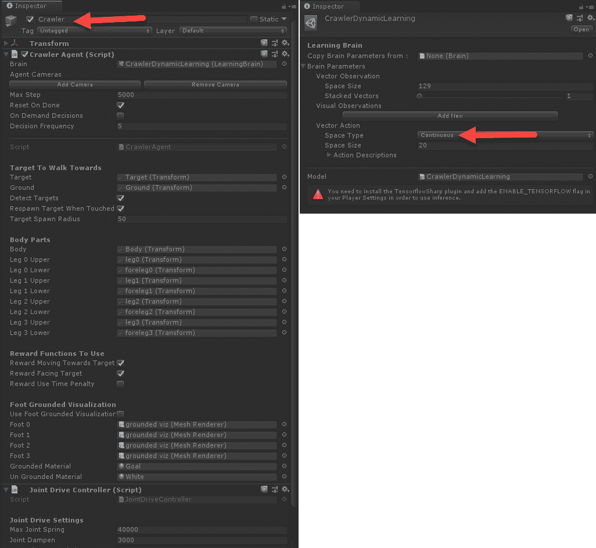
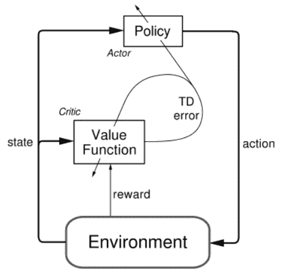
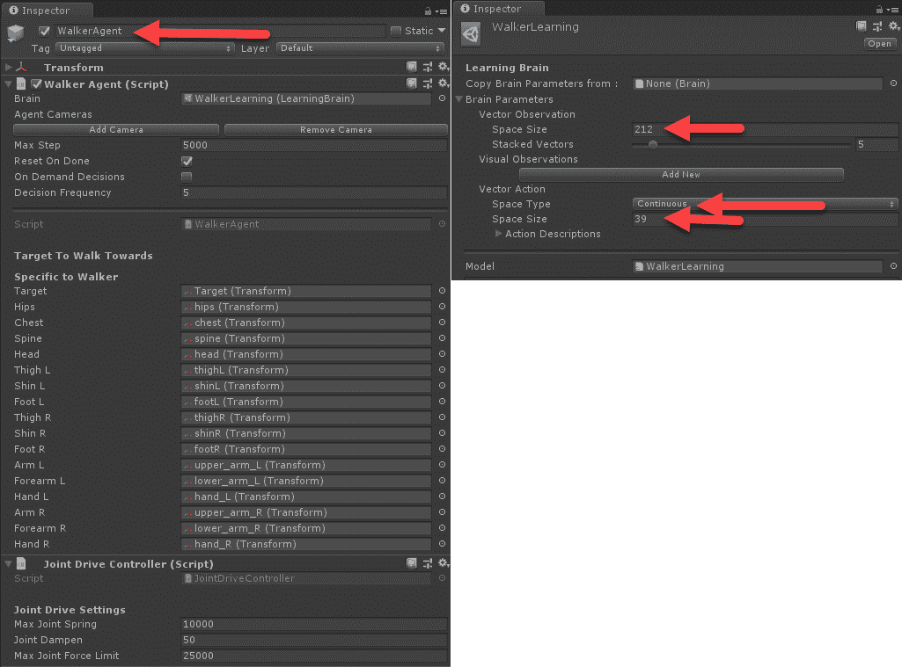
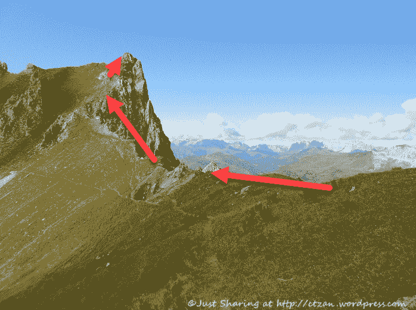
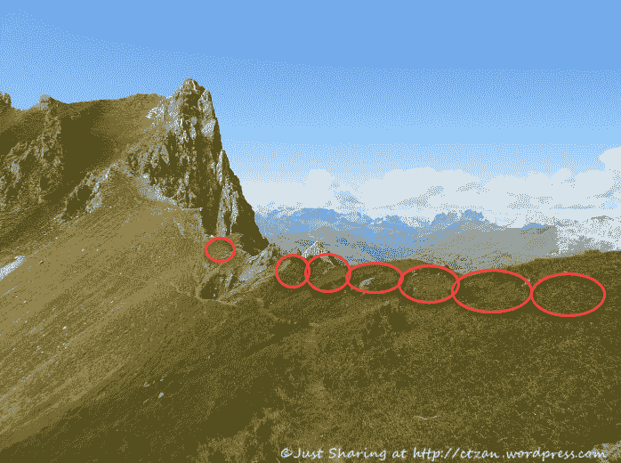
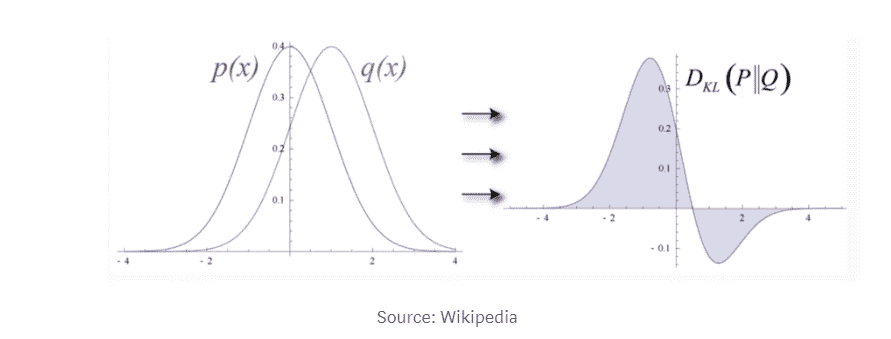
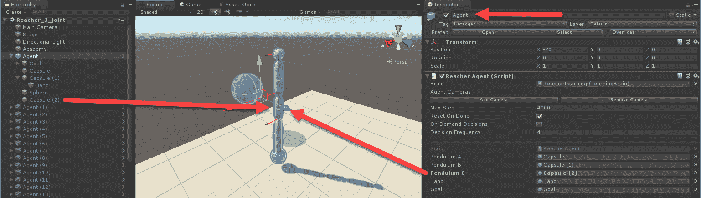
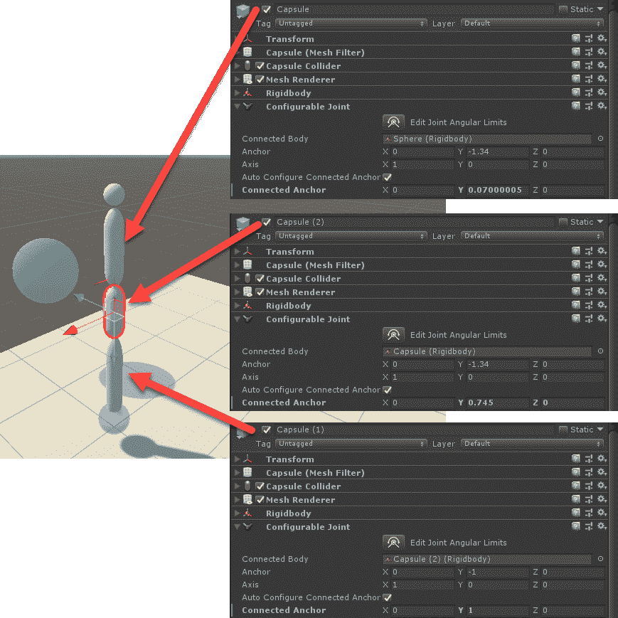
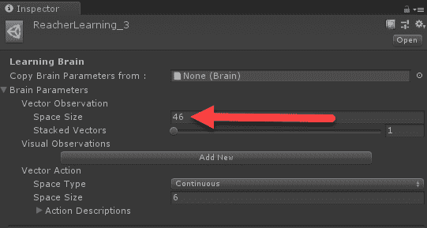

# 八、了解 PPO

我们已经避免太深入到更高级的**近似策略优化** ( **PPO** )算法的内部工作，甚至避免任何策略对模型的讨论。如果你还记得，PPO 是 OpenAI 首次开发的支持 ML-Agents 的**缩减级别** ( **RL** )方法，是一种基于策略的算法。在这一章中，我们将看看基于策略和基于模型的 RL 算法之间的区别，以及 Unity 实现的更高级的内部工作方式。

以下是我们将在本章中涉及的主要主题的列表:

*   马拉松强化学习
*   部分可观测马尔可夫决策过程
*   演员评论家和连续行动空间
*   了解 TRPO 和 PPO
*   用超参数调优 PPO

本章的内容是高级的，并且假设你已经学习了前面的几个章节和练习。为了本章的目的，我们还将假设你能够毫无困难地在 Unity 中打开和运行一个学习环境。


# 马拉松 RL

到目前为止，我们关注的是离散的动作和情节环境，在这些环境中，智能体经常学习解决一个难题或完成一些任务。这种环境的最好例子是 GridWorld，当然还有 hallow/visual hallow 示例，其中智能体离散地选择诸如上、左、下或右之类的动作，并使用这些动作导航到某个目标。虽然这些都是很好的学习 RL 基本概念的环境，但是学习起来可能会很乏味，因为结果通常不是自动的，需要大量的探索。然而，在马拉松式 RL 环境中，智能体总是通过接收控制反馈形式的奖励来学习。事实上，这种形式的 RL 类似于机器人和模拟的控制系统。由于这些环境以反馈的形式提供了丰富的回报，当我们改变/调整超参数时，它们为我们提供了更好的即时反馈，这将使这些类型的环境完美地满足我们自己的学习目的。

Unity 提供了几个马拉松 RL 环境的例子，在写这篇文章的时候还提供了爬虫、Reacher、Walker 和人形环境的例子，但是这些在将来可能会改变。

马拉松环境的构造是不同的，在进一步深入之前，我们可能应该理解其中的一些差异。打开 Unity 编辑器和您选择的 Python 命令窗口，设置运行`mlagents-learn`，并完成以下练习:

1.  从`Assets/ML-Agents/Examples/Crawler/Scenes`文件夹中打开`CrawlerDynamicTarget`示例场景。这个例子展示了一个具有四个可移动肢体的智能体，每个肢体都有两个可以移动的关节。目标是让智能体朝着某个不断变化的动态目标前进。
2.  Select the DynamicPlatform | Crawler object in the Hierarchy window and take note of the Crawler Agent component and CrawlerDynamicLearning brain, as shown in the following

    **截图:**



检查爬虫智能体和大脑

3.  注意大脑的空间大小是如何 129 个向量观察和 20 个连续动作的。连续动作返回一个值，该值确定关节可以旋转的角度，从而允许智能体学习如何将这些关节动作协调成允许其爬行到目标的运动。

4.  单击 Crawler 智能体组件旁边的目标图标，并从上下文菜单中选择**编辑脚本**。
5.  脚本打开后，向下滚动并寻找`CollectObservations`方法:

```
public override void CollectObservations()
{
  jdController.GetCurrentJointForces();

  AddVectorObs(dirToTarget.normalized);
  AddVectorObs(body.transform.position.y);
  AddVectorObs(body.forward);
  AddVectorObs(body.up);
  foreach (var bodyPart in jdController.bodyPartsDict.Values)
  {
    CollectObservationBodyPart(bodyPart);
  }
}
```

6.  同样，代码是用 C#编写的，但是对于智能体感知的输入应该是不言自明的。我们首先可以看到，智能体将指向目标的方向、其向上和向前，以及来自每个身体部位的观察作为输入。
7.  在场景中选择**学院**，确保**脑**配置设置为**控制**(学习)。
8.  从您之前准备的命令窗口或 Anaconda 窗口中，如下运行`mlagents-learn`脚本:

```
mlagents-learn config/trainer_config.yaml --run-id=crawler --train
```

9.  培训开始后，您会很快看到智能体取得了明显的进步。

这个智能体可以令人印象深刻地非常快速地训练，并且在接下来的部分中对于测试我们关于 RL 如何工作的知识将是非常有用的。您可以随意浏览和研究这个示例，但是要避免调整任何参数，因为我们将在下一节开始这样做。


# 部分可观测马尔可夫决策过程

回到[第 5 章](6ca7a117-1a8c-49f9-89c0-ee2f2a1e8baf.xhtml)，*介绍 DRL* ，我们了解到一个**马尔可夫决策过程** ( **MDP** )被用来定义一个智能体用来计算一个动作/值的状态/模型。在 Q-learning 的例子中，我们已经看到了如何使用一个表格或网格来保存一个环境中的整个 MDP，例如冰冻的池塘或网格世界。这些类型的 RL 是基于模型的，这意味着它们完全模拟了环境中的每个状态——例如，网格游戏中的每个方块。只不过，在大多数复杂的游戏和环境中，能够映射物理或视觉状态变成了一个部分可观测的问题，或者我们可以称之为**部分可观测马尔可夫决策过程** ( **POMDP** )。

POMDP 定义了一个过程，在该过程中，智能体从不具有其环境的完整视图，而是学习基于派生的一般策略来执行动作。这在爬虫示例中得到了很好的演示，因为我们可以看到智能体只使用有限的信息学习移动——到达目标的方向。下表概述了我们通常用于 RL 的马尔可夫模型的定义:

|  | **否** | **是** |  |
| **所有状态可观测？** | **否** | 马尔可夫链 | MDP |
| **是** | 隐马尔可夫模型 | POMDP |

因为我们以行动的形式为智能体提供了对其状态的控制，所以我们研究的马尔可夫模型是 MDP 和 POMDP。同样，这些过程也经常被称为 on 或 off 模型，而如果 RL 算法完全知道状态，我们就称之为基于模型的过程。相反，POMDP 指的是脱离模型的过程，或者我们将称之为基于策略的方法。基于策略的算法提供了更好的泛化能力，并且具有在未知或无限数量的可观察状态的环境中学习的能力。部分可观察状态的例子有走廊、可视走廊等环境，当然还有 Crawler。

马尔可夫模型为机器学习的许多方面提供了基础，你可能会在被称为深度概率编程的更高级的深度学习方法中遇到它们的使用。Deep PPL，顾名思义，就是变分推理和深度学习方法的结合。

无模型方法通常使用有经验的缓冲区来存储一组经验，稍后将使用这些经验来学习一般策略。这个缓冲由几个超参数定义，称为`time_horizon`、`batch_size`和`buffer_size`。这里给出了从 ML-Agents 文档中提取的每个参数的定义:

`time_horizon`:这对应于每个智能体在添加到经验缓冲区之前需要收集多少步经验。当在一集结束之前达到这个限制时，价值估计被用于从智能体的当前状态预测整体预期报酬。因此，该参数在偏差较小但方差较高的估计值(长时间范围)和偏差较大但变化较小的估计值(短时间范围)之间进行权衡。在一集内有频繁奖励的情况下，或者一集太大，较小的数量可能更理想。这个数字应该足够大，以捕捉一个智能体动作序列中的所有重要行为:

典型范围:32–2，048

*   `buffer_size`:这对应于在我们更新模型或进行任何学习之前应该收集多少经验(智能体观察、行动和获得的奖励)。这应该是`batch_size`的倍数。通常，较大的`buffer_size`参数对应于更稳定的训练更新。
    *   典型范围:2048–409600
*   `batch_size`:这是梯度下降更新的一次迭代使用的经验数。这应该总是`buffer_size`参数的一部分。如果使用连续的动作空间，这个值应该很大(大约几千)。如果使用离散的动作空间，该值应该更小(十个数量级)。
    *   典型范围(连续):512–5，120
*   典型范围(离散):32–512

    *   我们可以通过查看`CrawlerDynamicLearning`大脑配置来了解这些值是如何设置的，并对其进行更改以查看其对训练的影响。打开编辑器和一个正确配置的 Python 窗口，进入`CrawlerDynamicTarget`场景，然后进行以下练习:

    *   打开位于`ML-Agents/ml-agents/config`文件夹中的`trainer_config.yaml`文件。

向下滚动到`CrawlerDynamicLearning`大脑配置部分:

1.  注意显示`time_horizon`、`batch_size`和`buffer_size`参数的突出显示的行。如果您还记得我们之前的走廊/可视走廊示例，那么`time_horizon`参数只有 32 或 64。由于这些例子使用了离散的动作空间，我们可以为`time_horizon`设置一个低得多的值。

2.  将所有参数值加倍，如以下代码摘录所示:

```
CrawlerDynamicLearning:
  normalize: true
  num_epoch: 3
  time_horizon: 1000
 batch_size: 2024
 buffer_size: 20240
  gamma: 0.995
  max_steps: 1e6
  summary_freq: 3000
  num_layers: 3
  hidden_units: 512
```

3.  从本质上说，我们在这里所做的是将智能体用于构建其周围环境的策略的经验数量加倍。本质上，我们给智能体一个更大的经验快照来训练。
4.  像以前多次做的那样，在培训中运行智能体。

```
time_horizon: 2000
batch_size: 4048
buffer_size: 40480
```

5.  只要您运行了之前的基本样本，就让智能体接受培训。这会让你在训练表现上有一个很好的比较。
6.  有一件事将立即变得显而易见，那就是智能体的训练更加稳定，这意味着智能体的平均回报将更稳定，波动更少。回想一下，我们希望避免训练跳跃、尖峰或摆动，因为这可能表明网络优化方法的收敛性差。这意味着越平缓的变化通常越好，并表明良好的训练表现。通过加倍`time_horizon`和相关参数，我们已经加倍了智能体用来学习的经验数量。这反过来又有稳定训练的效果，但是您可能注意到智能体花费了更长的时间来训练相同的迭代次数。
7.  部分可观测 RL 算法分为基于策略、无模型或无模型算法，是 PPO 的基础。在下一节中，我们将看看 RL 中的改进，这些改进更好地处理了管理连续动作空间的额外复杂性。

演员评论家和连续行动空间

我们在研究马拉松 RL 或控制学习时引入的另一个复杂性是连续动作空间的引入。连续动作空间表示一个智能体可以采取的一组无限可能的动作。我们的智能体以前可以支持一个离散的动作，是或否，现在它必须在一个无限的动作空间中选择一些点作为每个关节的动作。这种从无限动作空间到动作的映射并不容易解决——然而，我们确实有神经网络可供我们使用，这些网络为我们提供了一个出色的解决方案，它使用的架构与我们在第三章[、 *游戏*中看到的 g an 没有什么不同。](cb51d15b-9855-47e2-8e45-f74a115ebfa8.xhtml)


# 正如我们在关于 GANs 的章节中所发现的，我们可以提出一个由两个竞争网络组成的网络架构。这些相互竞争的网络将迫使每个网络通过相互竞争来学习将随机空间映射成令人信服的伪造物的最佳解决方案。类似于 GAN 的概念也可以应用于这种情况，称为演员评论家模型。该模型的示意图如下:

这里发生的是**角色**从给定**状态**的策略中选择一个**动作**。**状态**首先通过**评判器**，该评判器在给定当前**状态**的情况下评估最佳动作，并提供一些**错误**。更简单的说，**评论家**根据当前**状态**对每个动作进行批评，然后**演员**根据**状态**选择最佳动作。

这种动作选择的方法最早是在一种叫做**决斗双 Q 网络** ( **DDQN** )的算法中探索出来的。它现在是最先进的 RL 算法的基础。



Actor-Critic architecture

Actor-Critic 本质上是用来解决连续动作空间问题的，但是，考虑到它的性能，这种方法也已经被集成到一些高级的离散算法中。ML-Agents 对连续空间使用演员评论家模型，但对离散动作空间不使用。

使用 Actor-Critic 需要在我们的网络中使用额外的层和神经元，这是我们可以在 ML-Agents 中配置的。这些的超参数定义来自 ML-Agents 文档，如下所示:

`num_layers`:这对应于在观察输入之后，或者在视觉观察的 CNN 编码之后，存在多少隐藏层。对于简单的问题，较少的层数可能训练得更快更有效。对于更复杂的控制问题，可能需要更多的层:

典型范围:1–3

*   `hidden_units`:这些对应于神经网络的每个全连接层中有多少个单元。对于简单的问题，正确的行动是观察输入的直接组合，这应该是小的。对于操作是观察变量之间非常复杂的相互作用的问题，这个值应该更大:
    *   典型范围:32–512

*   让我们打开一个新的 ML-Agents 马拉松或控制样本，看看修改这些参数对训练有什么影响。按照本练习理解向控制问题添加层和神经元(单元)的效果:

    *   从`Assets/ML-Agents/Examples/Walker/Scenes`文件夹中打开沃克场景。这个例子展示了一个行走的人形动画。

在“层次”窗口中找到并选择 WalkerAgent 对象，然后查看“检查器”窗口并检查智能体和大脑设置，如以下屏幕截图所示:

1.  WalkerAgent 和 WalkerLearning 属性
2.  在层级窗口中选择`WalkerAcademy`，并确保`Brains`参数的控制选项已启用。



打开位于`ML-Agents/ml-agents/config`文件夹中的`trainer_config.yaml`文件，向下滚动到`WalkerLearning`部分，如下所示:

3.  注意这个例子使用了多少层和单位。它比我们在离散动作问题中使用的多还是少？
4.  保存所有内容，并为训练设置样本。

```
WalkerLearning:
    normalize: true
    num_epoch: 3
    time_horizon: 1000
    batch_size: 2048
    buffer_size: 20480
    gamma: 0.995
    max_steps: 2e6
    summary_freq: 3000
    num_layers: 3
 hidden_units: 512
```

5.  使用以下命令从 Python 控制台启动培训会话:
6.  该智能体可能需要相当长的时间来训练，但是尝试并等待大约 100，000 次迭代，以便很好地了解其训练进度。
7.  现在，我们对演员评论家及其在连续动作空间中的应用有了更好的理解，我们可以在下一节继续探索改变网络大小对训练这些更复杂的网络有什么影响。

```
mlagents-learn config/trainer_config.yaml --run-id=walker --train
```

8.  扩展网络架构

演员-批评者架构增加了问题的复杂性，从而增加了解决问题所需的网络的复杂性和规模。这与我们之前研究 PilotNet 的情况没有什么不同，pilot net 是 Nvidia 用于自驱动的多层 CNN 架构。


# Expanding network architecture

我们想看到的是，增加我们的网络规模对 Walker 例子这样的复杂例子的直接影响。打开 Unity 至`Walker`示例，并完成以下练习:

从正常位置打开`trainer_config.yaml`。

修改`WalkerLearning`配置，如下面的代码所示:

1.  设置`num_layers: 1`和`hidden_units: 128`。这些是我们用于离散动作空间问题的典型值。您可以通过查看另一个离散样本来确认这一点，例如`VisualHallwayLearning`配置，如下所示:
2.  此示例使用的设置与我们刚刚将连续动作问题设置为的设置相同。

```
WalkerLearning:
    normalize: true
    num_epoch: 3
    time_horizon: 1000
    batch_size: 2048
    buffer_size: 20480
    gamma: 0.995
    max_steps: 2e6
    summary_freq: 3000
    num_layers: 1
 hidden_units: 128
```

3.  完成编辑后，保存所有内容，为培训做好准备。

```
VisualHallwayLearning:
    use_recurrent: false
    sequence_length: 64
    num_layers: 1
 hidden_units: 128
    memory_size: 256
    beta: 1.0e-2
    gamma: 0.99
    num_epoch: 3
    buffer_size: 1024
    batch_size: 64
    max_steps: 5.0e5
    summary_freq: 1000
    time_horizon: 64
```

4.  使用新的`run-id`参数启动培训课程。记住练习在每次运行时改变`run-id`参数，以便更容易辨别 TensorBoard 中的每次运行。
5.  和往常一样，让样本运行的时间和之前运行的时间一样长，以便进行比较。
6.  运行此示例时，您可能会立即注意到的一件事是训练的稳定性。你可能注意到的第二件事是，训练稳定性增加了，但表现略有下降。请记住，较小的网络权重较小，通常会更稳定，训练速度也更快。但是，在这个问题中，虽然训练在网络上更稳定，并且承诺更快，但您可能会注意到训练碰壁了。智能体现在受到网络大小的限制，能够更快地优化较小的网络，但没有我们以前见过的精细控制。事实上，这个智能体将永远不会像第一次未改变的运行那样好，因为它现在受到较小网络的限制。这是你在为游戏/模拟建立 DRL 智能体时需要平衡的另一个权衡。
7.  在下一节中，我们将进一步研究我们称之为优势函数或那些像演员评论家中使用的函数，并将首先探索 TRPO，当然还有 PPO。

了解 TRPO 和 PPO

在解决优化未来回报预测的 RL 问题时，无策略和无模型算法有许多变体。正如我们所看到的，许多算法使用了一个优势函数，比如 Actor-Critic，在这里我们有问题的两个方面试图收敛到最优解。在这种情况下，优势函数试图找到最大的期望折扣奖励。TRPO 和 PPO 通过使用一种叫做**最小化最大化** ( **MM)** 算法的优化方法来做到这一点。下图显示了 MM 算法如何解决问题的示例:


# 这个图摘自惠的一系列博客，这些博客优雅地描述了 MM 算法以及 TRPO 和 PPO 方法的更多细节*。*来源见以下链接:([https://medium . com/@ Jonathan _ hui/rl-proximal-policy-optimization-PPO-explained-77f 014 EC 3 f 12](https://medium.com/@jonathan_hui/rl-proximal-policy-optimization-ppo-explained-77f014ec3f12))。

本质上，MM 算法通过交互地最大化和最小化函数参数来寻找最佳对函数，直到它达到收敛解。在图中，红线表示我们要逼近的函数，蓝线表示收敛函数。当算法选择将找到解决方案的最小/最大值时，您可以看到进度。


Using the MM algorithm

我们在使用 MM 时遇到的问题是，函数逼近有时会下降，或陷入低谷。为了更好地理解这一点，让我们把这看作是用一条直线来解决爬一个不平坦的小山的问题。这种情况的一个例子如下:

你可以看到，只使用线性路径来尝试和导航这个相当危险的山脊，实际上是危险的。虽然危险可能不那么真实，但当使用线性方法求解 MM 时，这仍然是一个大问题，因为如果你只使用一条笔直的固定路径在陡峭的山脊上徒步旅行。

TRPO 通过使用二次方法，并通过以信赖域的形式限制每次迭代可以采取的步骤的数量，解决了使用线性方法的问题。也就是说，算法确保每个位置都是正的和安全的。如果我们再次考虑我们的爬山例子，我们可能会认为 TRPO 放置了一个路径或信任区域，如下图所示:



Attempting to climb a hill using linear methods

在前面的照片中，路径仅出于示例目的显示为一组相连的圆或区域；真实的信任路径可能或可能不更接近实际的峰或脊。不管怎样，这具有允许智能体以更渐进的速度学习的效果。有了 TRPO，信任区域的大小可以改变，变得更大或更小，以符合我们首选的策略趋同。TRPO 的问题是实现起来相当复杂，因为它需要对一些复杂的方程进行二次求导。

TRPO solves the problem of using linear methods by using a quadratic method, and by  limiting the amount of steps each iteration can take in a form of trust region. That is, the algorithm makes sure that every position is positive and safe. If we consider our hill climbing example again, we may consider TRPO as placing a path or region of trust, like in the following photo:



A trust region path up the hill

PPO 通过在每次迭代中限制或削减两个策略之间的 Kulbach-Leibler ( **KL** )差异来解决这个问题。KL 散度衡量概率分布的差异，可通过下图进行描述:

在上图中， **p(x)** 和 **q(x)** 分别代表衡量 KL 差异的不同策略。然后，该算法反过来使用这种差异度量来限制或削减迭代中可能发生的策略变化量。ML-Agents 使用两个超参数，允许您控制应用于目标或函数的裁剪量，该目标或函数决定迭代中策略变化的量。如 Unity 文档中所述，以下是β和ε参数的定义:

**Beta** :这对应于熵正则化的强度，这使得策略*更加随机*。这可确保智能体在培训期间正确探索行动空间。增加该值将确保采取更多随机操作。这应该被调整，以便熵(可从 TensorBoard 测量)随着奖励的增加而慢慢减少。如果熵下降太快，增加β。如果熵下降太慢，则减小β:



Understanding KL divergence

典型范围:1e-4–1e-2

*   **Epsilon** :这对应于梯度下降更新过程中新旧策略之间可接受的背离阈值。将该值设置得较小会导致更稳定的更新，但也会减慢训练过程:
*   典型范围:0.1–0.3
*   关于这些参数要记住的关键事情是，它们控制策略从一个迭代到下一个迭代的变化速度。如果您注意到智能体训练有些不稳定，将这些参数调整为较小的值可能会有所帮助。**ε**的默认值是 **.2** ，而**β**的默认值是 **1.0e-2** ，但是，当然，我们会想要探究这些值如何影响训练，无论是正面的还是负面的。在下一个练习中，我们将修改这些策略更改参数，并查看它们在培训中的效果:
*   对于这个例子，我们将从`Assets/ML-Agents/Examples/Crawler/Scenes`文件夹中打开`CrawlerDynamic`场景。

打开位于`ML-Agents/ml-agents/config`文件夹中的`trainer_config.yaml`文件。由于我们已经评估了该示例的性能，因此有几种方法可以恢复训练配置，并对 beta 和 epsilon 参数进行一些修改。

向下滚动到`CrawlerDynamicLearning`配置部分，修改如下:

我们将`epsilon`和`beta`参数修改为更高的值，这意味着训练将更不稳定。然而，如果你回想一下，这些马拉松例子通常以更稳定的方式训练。

1.  打开正确配置的 Python 控制台，运行以下命令启动培训:
2.  像往常一样，等待一系列培训会议，以便从一个示例到下一个示例进行良好的比较。
3.  Scroll down to the `CrawlerDynamicLearning` configuration section and modify it as follows:

```
CrawlerDynamicLearning:
    normalize: true
    num_epoch: 3
    time_horizon: 1000
    batch_size: 1024
    buffer_size: 20240
    gamma: 0.995
    max_steps: 1e6
    summary_freq: 3000
    num_layers: 3
    hidden_units: 512
    epsilon: .1
 beta: .1 
```

4.  We modified the `epsilon` and `beta` parameters to higher values, meaning that the training will be less stable. If you recall, however, these marathon examples generally train in a more stable manner.
5.  你可能会发现意想不到的是，智能体似乎开始倒退，事实上，它是。发生这种情况是因为我们使那些信任区域太大(一个大的**β**),虽然我们允许变化率较低(1**ε**),但我们可以看到**β**值对训练更敏感。

```
mlagents-learn config/trainer_config.yaml --run-id=crawler_policy --train
```

6.  请记住，Unity ML-Agents 的实现串联使用了许多交叉特性，构成了一个强大的 RL 框架。在下一节中，我们将快速查看 Unity 最近添加的一个后发优化参数。

广义优势估计

由于不断的研究，RL 领域正在经历爆炸式的增长，推动着可能性的极限。每一点进步都会带来额外的超参数和小调整，可用于稳定和/或改善训练表现。Unity 最近增加了一个名为 lambda 的新参数，从文档中提取的定义如下:

**λ**:对应于计算**广义优势估计**(**https://arxiv.org/abs/1506.02438**)[时使用的λ参数。这可以被认为是智能体在计算更新的估价时对其当前估价的依赖程度。低值对应于更依赖于当前价值估计(可能是高偏差)，高值对应于更依赖于在环境中收到的实际回报(可能是高方差)。该参数提供了两者之间的折衷，并且正确的值可以导致更稳定的训练过程:](https://arxiv.org/abs/1506.02438)

典型范围:0.9–0.95


# GAE 的论文描述了一个称为 lambda 的函数参数，该参数可用于形成奖励估计函数，并且最适合用于控制或马拉松 RL 任务。细节我们就不赘述了，有兴趣的读者当然要把论文拉下来自己回顾一下。但是，我们将在下一个练习中探索改变该参数如何影响控制样本，如`Walker`场景:

打开 Unity 编辑器到`Walker`示例场景。

*   在层次中选择学院对象，并确认场景仍为训练/学习设置。如果是，你就不用做别的了。如果场景不是为学习而设置的，你知道该怎么做。
    *   打开`trainer_config.yaml`文件，修改`WalkerLearning`如下:

注意我们如何设置`lambd`参数，并确保`num_layers`和`hidden_units`被重置为原始值。在本文中，作者描述了从`.95`到`.99`的最佳值，但这不同于 Unity 文档。

1.  完成编辑后保存文件。
2.  打开用于培训的 Python 控制台设置，并使用以下命令运行它:

3.  确保您让示例运行的时间与之前一样长，以获得良好的比较。

```
WalkerLearning:
    normalize: true
    num_epoch: 3
    time_horizon: 1000
    batch_size: 2048
    buffer_size: 20480
    gamma: 0.995
    max_steps: 2e6
    summary_freq: 3000
    num_layers: 3
    hidden_units: 512
    lambd: .99
```

4.  经过一段时间的训练后，你会注意到，在这个例子中，智能体的训练速度确实慢了 25%。这个结果告诉我们的是，通过增加 lambda，我们告诉智能体把更多的价值放在奖励上。现在，这可能看起来违背直觉，但是在这个例子或这种类型的环境中，智能体正在接受持续的小的积极的奖励。这导致每个奖励都变得倾斜，正如我们所看到的，倾斜训练并阻碍智能体的进步。对于感兴趣的读者来说，在走廊环境中尝试和使用 lambda 参数可能是一个有趣的练习，在走廊环境中，智能体只收到一个积极的剧集奖励。
5.  RL advantage 函数有多种形式，用于解决非模型或策略驱动算法(如 PPO)的许多问题。在下一节中，我们将通过自己修改和创建一个新的样本控制/马拉松学习环境来结束这一章。
6.  学习调优 PPO

```
mlagents-learn config/trainer_config.yaml --run-id=walker_lambd --train
```

7.  在本节中，我们将学习调整修改后的/新的控制学习环境。这将允许我们学习更多关于 Unity 示例的内部工作原理，但是也将向您展示如何在以后自己修改一个新的或修改过的示例。让我们首先打开 Unity 编辑器，以便完成以下练习:

打开`Reacher`场景，设置学习，训练中运行。你现在应该可以在睡觉的时候做这部分了。像往常一样，让智能体训练相当长的时间，这样你就可以建立一个基准。

从菜单中选择`Assets/Import Package/Custom Package`。从下载到源代码的书籍的`Chapter08`文件夹中找到`Chapter_8_Assets.unitypackage`。


# 从`Assets/HoDLG/Scenes`文件夹中打开 Reacher_3_joint 场景。这是修改后的场景，但是我们也将经历它的构造。

首先，请注意只有一个**机械手**处于活动状态，但现在有三个关节，如下面的截图所示:

1.  检查智能体游戏对象
2.  请注意手臂现在有三个部分，新的部分称为胶囊(2)并被标识为钟摆 C。关节的顺序现在混乱了，这意味着钟摆 C 实际上是中间的钟摆，而不是底部。
3.  选择每个胶囊对象，并检查它们的配置和放置，如以下屏幕截图所示:
4.  检查胶囊对象



请务必注意每个胶囊的可配置关节|连接的身体对象。该属性设置对象将铰接或连接到的几何体。可配置关节组件上有许多其他属性，允许您以任何形式模拟这种关节交互，甚至可能是生物形式。例如，您可能希望通过只允许某些角度的运动来使手臂的关节更像人类。同样，如果你正在设计一个运动受限的机器人，那么你也可以用这个关节组件来模拟它。

5.  在这个阶段，我们可以设置并运行示例。打开并设置用于训练 Python 控制台或 Anaconda 窗口。
6.  在训练中运行示例，并观察智能体的进度。让智能体运行足够多的迭代，以便将训练性能与基线进行比较。



在这个阶段，我们已经启动并运行了我们的样本，我们准备开始调整新的参数来优化训练。然而，在我们这样做之前，我们将后退一步，看一看使最后一个示例成为可能所需的 C#代码更改。下一节将介绍 C#代码的变化，对于那些对代码不感兴趣的开发人员来说，这是可选的。如果您计划在 Unity 中构建自己的控制或马拉松环境，您将需要阅读下一部分。

7.  控制项目所需的编码更改
8.  正如我们已经提到的，这部分是可选的，是为那些对使用 Unity C#构建自己的控件示例的细节感兴趣的人准备的。将来，修改这些类型的示例也可能不需要任何编码更改，这也是本节可选的另一个原因。
9.  完成以下练习，了解在 Reacher 控制示例中添加关节所需的编码更改:

在“层次”窗口中选择智能体对象，然后在“检查器”窗口中，注意 Reacher Agent_3 组件。这是我们将要检查的修改过的脚本。


# 单击 Reach Agent_3 组件旁边的目标图标，并从上下文菜单中选择编辑脚本。

这将在您选择的 C#代码编辑器中打开`ReacherAgent_3.cs`脚本。

声明中首先要注意的是添加了新的变量，以粗体突出显示如下:

1.  Select the Agent object in the Hierarchy window and then, in the Inspector window, note the Reacher Agent_3 component. This is the modified script that we will be inspecting.
2.  添加了两个新变量`pendulumC`和`rbC`，用于保存新关节 GameObject 和 RigidBody。现在，Unity physics 中的`Rigidbody`表示可以被物理引擎移动或操纵的对象。
    Unity 正在升级他们的物理引擎，这将改变这里的一些教学。ML-Agents 的当前版本使用旧的物理系统，所以这个例子也一样。
3.  下一件需要注意的重要事情是添加了额外的智能体观察，如下面的`CollectObservations`方法所示:
4.  The first thing to note under the declarations is the addition of new variables, highlighted in bold as follows:

```
public GameObject pendulumA;
public GameObject pendulumB;
public GameObject pendulumC;
public GameObject hand;
public GameObject goal;
private ReacherAcademy myAcademy;
float goalDegree;
private Rigidbody rbA;
private Rigidbody rbB;
private Rigidbody rbC;
private float goalSpeed;
private float goalSize;
```

粗体部分增加了对`pendulumC`和`rbC`的新观察，总共有另外 13 个向量。回想一下，这意味着我们还需要将我们的大脑从 33 个向量观察值切换到 46 个观察值，如下面的屏幕截图所示:

5.  检查更新 ReacherLearning_3 brain
6.  接下来，我们将目光投向`AgentAction`方法；这是 Python 训练器代码调用智能体并告诉它做什么动作的地方，如下所示:

```
public override void CollectObservations()
    {
        AddVectorObs(pendulumA.transform.localPosition);
        AddVectorObs(pendulumA.transform.rotation);
        AddVectorObs(rbA.angularVelocity);
        AddVectorObs(rbA.velocity);

        AddVectorObs(pendulumB.transform.localPosition);
        AddVectorObs(pendulumB.transform.rotation);
        AddVectorObs(rbB.angularVelocity);
        AddVectorObs(rbB.velocity);

        AddVectorObs(pendulumC.transform.localPosition);
 AddVectorObs(pendulumC.transform.rotation);
 AddVectorObs(rbC.angularVelocity);
 AddVectorObs(rbC.velocity);

        AddVectorObs(goal.transform.localPosition);
        AddVectorObs(hand.transform.localPosition);

        AddVectorObs(goalSpeed);
  }
```

在这个方法中，我们扩展了代码，允许智能体以`rigidbody rbC`的形式移动新关节。你是否注意到新的学习大脑也增加了更多的行动空间？

7.  最后，我们看一下`AgentReset`方法，看看智能体如何用新分支重置自己，如下所示:



Inspecting the update ReacherLearning_3 brain

8.  Next, we will look to the `AgentAction` method; this is where the Python trainer code calls the agent and tells it what movements it makes, and is as follows:

```
public override void AgentAction(float[] vectorAction, string textAction)
  {
        goalDegree += goalSpeed;
        UpdateGoalPosition();

        var torqueX = Mathf.Clamp(vectorAction[0], -1f, 1f) * 150f;
        var torqueZ = Mathf.Clamp(vectorAction[1], -1f, 1f) * 150f;
        rbA.AddTorque(new Vector3(torqueX, 0f, torqueZ));

        torqueX = Mathf.Clamp(vectorAction[2], -1f, 1f) * 150f;
        torqueZ = Mathf.Clamp(vectorAction[3], -1f, 1f) * 150f;
        rbB.AddTorque(new Vector3(torqueX, 0f, torqueZ));

        torqueX = Mathf.Clamp(vectorAction[3], -1f, 1f) * 150f;
 torqueZ = Mathf.Clamp(vectorAction[4], -1f, 1f) * 150f;
 rbC.AddTorque(new Vector3(torqueX, 0f, torqueZ));
    }
```

9.  In this method, we are extending the code to allow the agent to move the new joint in the form of `rigidbody rbC`. Did you notice that the new learning brain also added more action space?
10.  Lastly, we look at the `AgentReset` method to see how the agent will reset itself with the new limb, as follows:

```
public override void AgentReset()
    {
        pendulumA.transform.position = new Vector3(0f, -4f, 0f) + transform.position;
        pendulumA.transform.rotation = Quaternion.Euler(180f, 0f, 0f);
        rbA.velocity = Vector3.zero;
        rbA.angularVelocity = Vector3.zero;

        pendulumB.transform.position = new Vector3(0f, -10f, 0f) + transform.position;
        pendulumB.transform.rotation = Quaternion.Euler(180f, 0f, 0f);
        rbB.velocity = Vector3.zero;
        rbB.angularVelocity = Vector3.zero;

        pendulumC.transform.position = new Vector3(0f, -6f, 0f) + transform.position;
 pendulumC.transform.rotation = Quaternion.Euler(180f, 0f, 0f);
 rbC.velocity = Vector3.zero;
 rbC.angularVelocity = Vector3.zero;

        goalDegree = Random.Range(0, 360);
        UpdateGoalPosition();

        goalSize = myAcademy.goalSize;
        goalSpeed = Random.Range(-1f, 1f) * myAcademy.goalSpeed;

        goal.transform.localScale = new Vector3(goalSize, goalSize, goalSize);
    }
```

这段代码所做的只是将手臂的位置重置到原始位置，并停止所有运动。

这涵盖了本例中唯一需要的代码更改。幸运的是，只有一个脚本需要修改。很可能在将来你根本不需要修改这些脚本。在下一节中，我们将通过调整额外的参数和引入另一种策略学习方法的训练优化来改进样本的训练。

多智能体策略

在本节中，我们将探讨如何通过引入多个智能体来训练相同的策略，从而改进基于策略或非模型的方法，如 PPO。您将在本节中使用的示例练习将完全由您决定，并且应该是您熟悉和/或感兴趣的。出于我们的目的，我们将探索一个我们已经广泛研究过的样本——走廊/可视走廊。如果你已经完成了本书中的大部分练习，你应该能够适应这个例子。但是，请注意，在本练习中，我们希望使用一个设置为使用多个智能体进行培训的示例。

11.  以前，我们避免讨论多个智能体；我们之前避免了这方面的培训，因为它可能会使模型上和模型下的讨论复杂化。现在，您已经理解了使用基于策略的方法的区别和原因，您可以更好地理解，因为我们的智能体正在使用基于策略的方法，所以我们可以针对同一策略同时训练多个智能体。然而，这可能会对其他训练参数和配置产生影响，正如您可以想象的那样。

打开 Unity 编辑器进入`Hallway` / `VisualHallway`示例场景，或您选择的场景，并完成以下练习:


# 打开 Python 或 Anaconda 控制台窗口，让它准备好进行训练。

选择并启用走廊区域，选择区域(1)到(19)以便它们在场景中处于活动状态并可见。

选择每个**走廊区域**中的智能体对象，并确保**走廊智能体** | **大脑**设置为走廊学习而不是走廊玩家。这将打开所有附加的训练区域。

根据您以前的经验，您可能希望也可能不希望将示例修改回原始状态。回想一下，在前面的练习中，我们修改了 HallwayAgent 脚本，使其只扫描较小部分的角度。这可能也需要你改变大脑参数。

1.  设置场景后，保存场景和项目。
2.  使用独特的`run-id`在训练中运行场景，并等待多次训练迭代。根据您的硬件，此示例的训练速度可能会慢很多，甚至更快。
3.  既然我们已经为走廊环境建立了新的基线，现在我们可以确定修改一些超参数对离散动作样本有什么影响。我们将重新审视的两个参数是`num_epochs`(训练时期的数量)和`batch_size`(每个训练时期的经历)参数，我们之前在连续动作(控制)样本中看到过。在文件中，我们注意到当训练控制剂时，较大的批量是优选的。
4.  在我们继续之前，让我们打开`trainer_config.yaml`文件并检查如下的走廊学习配置部分:
5.  在 Unity 文档中，它特别提到了在增加批量时只增加历元的数量，这是为了考虑额外的训练经验。我们了解到，控制示例通常受益于较大的批量，因此也受益于较大的时段。然而，我们想要确定的最后一件事是，在一个离散动作示例中，改变`batch_size`和`num_epoch`参数的效果，其中多个智能体向同一个策略提供信息并从中学习。

6.  出于本练习的目的，我们仅将`batch_size`和`num_epoch`修改为如下值:

更新您正在使用的`HallwayLearning`或大脑配置，以使用以下参数:

我们将`num_epoch`设为 10，将`batch_size`设为`1000`。正如我们之前所看到的，这些设置是控制样本的典型设置，但现在我们希望在一个离散动作示例中看到效果，其中多个智能体训练相同的策略。

```
HallwayLearning:
    use_recurrent: true
    sequence_length: 64
    num_layers: 2
    hidden_units: 128
    memory_size: 256
    beta: 1.0e-2
    gamma: 0.99
    num_epoch: 3
    buffer_size: 1024
    batch_size: 128
    max_steps: 5.0e5
    summary_freq: 1000
    time_horizon: 64
```

准备用于训练的样本，准备好 Python 控制台并打开。

使用以下命令运行培训会话:

1.  注意我们是如何设置`run-id`的，使用一个助手前缀来命名迭代。我们用`e10`表示`num_epoch`参数设置为`10`，`b1000`表示`1000`的`batch_size`值。这种类型的命名方案很有帮助，我们将在本书中继续使用。

```
HallwayLearning:
    use_recurrent: true
    sequence_length: 64
    num_layers: 2
    hidden_units: 128
    memory_size: 256
    beta: 1.0e-2
    gamma: 0.99
    num_epoch: 10
    buffer_size: 1024
    batch_size: 1000
    max_steps: 5.0e5
    summary_freq: 1000
    time_horizon: 64
```

2.  智能体培训时，尝试回答以下问题:
3.  智能体的培训比您预期的更好还是更差？
4.  你认为这是为什么？

```
mlagents-learn config/trainer_config.yaml --run-id=hallway_e10b1000 --train
```

5.  为了了解这些问题的答案，将由您来运行示例。在下一节中，我们将看看你可以自己做的有助于理解这些复杂主题的练习。

练习

*   自己尝试以下一两个练习:
*   运行 CrawlerStaticTarget 示例场景，并将其性能与动态示例进行比较。

将另一个对照示例中的`time_horizon`、`batch_size`和`buffer_size`大脑超参数加倍:


# 对另一个对照样品进行`time_horizon`、`batch_size`和`buffer_size`的相同修改，观察组合效果。

将`num_layers`和`hidden_units`大脑超参数修改为我们在控制样本中使用的值，并将它们应用于离散动作示例，如走廊示例，如以下代码所示。对训练有什么影响？

1.  更改另一个连续或离散动作实例的`num_layers`和`hidden_units`超参数，并将其与其他参数修改相结合。

2.  将离散动作示例中的λ`lambd`大脑超参数修改为值`.99`。请记住，这将产生强化奖励的效果:

```
time_horizon: 2000
batch_size: 4048
buffer_size: 40480
```

3.  用关节和四肢创造你自己的控制生物。一个好的起点是使用爬虫示例并对其进行修改。
4.  通过添加新的肢体或关节来修改其中一个控制样本。

```
num_layers: 3
hidden_units: 512
```

5.  修改步行机控制示例，为智能体提供一件武器和一个目标。你必须结合沃克和 Reacher 例子的元素。
6.  使用更改后的`num_epoch`和`batch_size`参数运行 VisualHallwayLearning 示例场景。结果是你期望的吗？

```
lambd: .99
```

7.  随着我们阅读这本书的进展，这些练习可能会变得越来越乏味，尤其是如果您在一个更老更慢的系统上运行它们。但是，了解这些参数如何改变智能体的训练是很重要的。
8.  当与深度学习和 RL 实践者交谈时，他们经常会将培训的微妙之处与成为一名优秀或伟大的厨师之间的差异进行比较。一个好的厨师可能会做出美味可口、完全可以接受的饭菜，但是只有一个伟大的厨师，以及他对细节的关注，才能让你做出一顿令人难忘的大餐。
9.  Modify the Walker control example to give the agent a weapon and a target. You will have to combine elements of the Walker and Reacher examples.
10.  Run the VisualHallwayLearning sample scene with altered `num_epoch` and `batch_size` parameters. Are the results what you expected?

摘要

在这一章中，通过理解基于模型的算法与基于模型和/或基于策略的算法之间的差异，我们深入了解了 RL 的更多内部工作原理。正如我们所了解的，Unity ML-Agents 使用 PPO 算法，这是一种强大而灵活的策略学习模型，在训练控制时效果非常好，有时也称为马拉松 RL。在学习了更多的基础知识后，我们跳到了其他 RL 的改进上，比如演员评论家，或者优势训练，以及 ML-Agents 支持的选项。接下来，我们研究了 PPO 及其前身 TRPO 算法的发展，它们如何在基础层面上工作，以及它们如何影响训练。在这里，我们学习了如何修改一个控制样本，以在机械手上创建一个新的关节。我们通过查看如何改进多智能体策略训练，再次通过调优超参数，完成了这一章。

我们已经讨论了 RL 的许多方面和细节，以及智能体如何培训，但是我们把培训中最重要的部分——奖励——留到了下一章。在下一章，我们将研究奖励，奖励函数，以及如何模拟奖励。


# Summary

In this chapter, we dug in and learned more of the inner workings of RL by understanding the differences between model-based versus off-model and/or policy-based algorithms. As we learned, Unity ML-Agents uses the PPO algorithm, a powerful and flexible policy learning model that works exceptionally well when training control, or what is sometimes referred to as marathon RL. After learning more basics, we jumped into other RL improvements in the form of Actor-Critic, or advantage training, and what options ML-Agents supports. Next, we looked at the evolution of PPO and its predecessor, the TRPO algorithm, how they work at a basic level, and how they affect training. This is where we learned how to modify one of the control samples to create a new joint on the Reacher arm. We finished the chapter by looking at how multi-agent policy training can be improved on, again by tuning hyperparameters.

We have covered many aspects and details of RL and how agents train, but we have left the most important part of training, rewards, to the next chapter. In the next chapter, we look into rewards, reward functions, and how rewards can even be simulated.