# 构建多代理环境

有了我们的单代理经验，我们可以进入更复杂但同样有趣的在多代理环境中工作的世界，训练多个代理以合作或竞争的方式在同一环境中工作。这也为训练具有对抗性自我游戏、合作性自我游戏、竞争性自我游戏等等的代理人提供了几个新的机会。可能性在这里变得无穷无尽，这可能就是 AI 真正的圣杯。

在这一章中，我们将涉及多代理培训环境的几个方面，主要部分的主题将在这里突出显示:

*   对抗与合作的自我游戏
*   竞技自我游戏
*   多脑游戏
*   用内在奖励增添个性
*   个性的外在奖励

本章假设您已经学习了前三章，并完成了每一章中的一些练习。在下一节中，我们将开始讲述各种自我游戏场景。

最好从 ML-Agents 库的一个新克隆开始这一章。我们这样做是为了清理我们的环境，并确保不会无意中保存错误的配置。如果你需要这方面的帮助，请查阅前面的章节。


# 对抗与合作的自我游戏

当然，术语*自我游戏*对许多人来说可能意味着许多事情，但在这种情况下，我们指的是大脑通过操纵多个代理与自己竞争(对抗)或合作。在 ML-agent 的情况下，这可能意味着让一个大脑在同一个环境中操纵多个 agent。在 ML-Agents 中有一个很好的例子，所以打开 Unity 并按照下一个练习来为多代理培训准备这个场景:

1.  从 Assets | ML-Agents | Examples | Soccer | Scenes 文件夹中打开 SoccerTwos 场景。默认情况下，场景设置为在玩家模式下运行，但是我们需要将其转换回学习模式。
2.  选择并禁用所有 SoccerFieldTwos(1)至 SoccerFieldTwos(7)区域。我们还不会用那些。
3.  选择并展开剩余的活动 SoccerFieldTwos 对象。这将显示有四个代理的游戏区域，两个标记为 RedStriker 和 BlueStriker，两个标记为 RedGoalie 和 BlueGoalie。
4.  检查代理，并根据需要设置每个人的大脑进行击球学习或射门学习，如下所示:

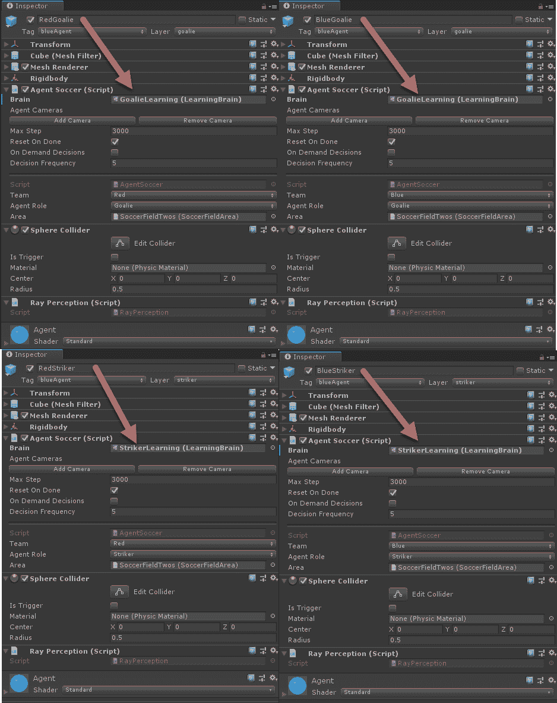

在代理上设置学习大脑

5.  在这个环境中，我们有四个由大脑控制的智能体，它们既相互合作又相互竞争。老实说，这个例子很精彩，非常好地展示了合作和竞争自我游戏的整个概念。如果您仍然对一些概念感到困惑，请考虑这张图表，它显示了这些概念是如何组合在一起的:

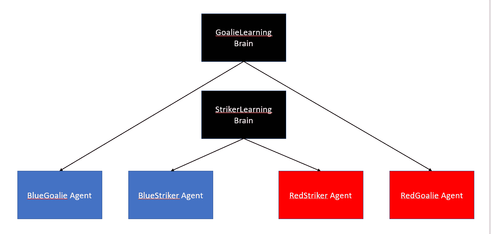

苏格拉底的大脑结构

6.  正如我们所见，我们有两个大脑控制四个代理人:两个前锋和两个守门员。前锋的工作是向守门员射门得分，当然，守门员的工作是阻挡进球。
7.  选择学院并将足球学院|大脑|控制设置为启用两个大脑，如图所示:

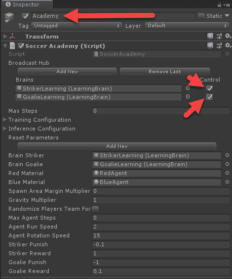

在学院中设置大脑控制

8.  此外，请注意足球学院组件底部的前锋、守门员奖励和惩罚设置。同样重要的是要注意`reward`对每个大脑的作用方式。以下是对该样本进行数学描述的`reward`函数:

【T8
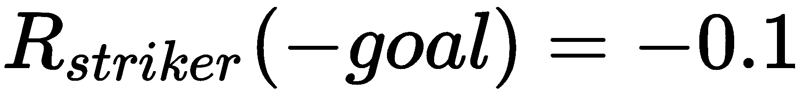


9.  这意味着，当一个进球得分时，四个代理中的每一个都根据其位置和球队获得奖励。因此，如果红色进球，红色前锋将获得`+1`奖励，蓝色前锋获得`-0.1`奖励，红色守门员获得`+0.1`奖励，可怜的蓝色守门员获得`-1`奖励。现在，你可能认为这会导致重叠，但是请记住，每个代理对一个状态或一个观察的看法是不同的。因此，奖励将应用于该状态或观察的策略。本质上，代理基于其当前的环境视图进行学习，该环境视图将基于哪个代理发送该观察而改变。
10.  完成编辑后，保存场景和项目。

这为使用两个大脑和四个代理的多代理训练设置了场景，使用竞争和合作的自我游戏。在下一节中，我们将完成外部配置并开始训练场景。


# 训练自我游戏环境

训练这些类型的自我游戏环境不仅为增强的训练可能性，而且为有趣的游戏环境开辟了进一步的可能性。在某些方面，这些类型的训练环境看起来同样有趣，我们将在本章的结尾看到。

不过，现在我们要跳回来，继续设置我们在下一个练习中训练 SoccerTwos 多代理环境所需的配置:

1.  打开`ML-Agents/ml-agents/config/trainer_config.yaml`文件，检查`StrikerLearning`和`GoalieLearning`配置部分，如图所示:

```
StrikerLearning:
    max_steps: 5.0e5
    learning_rate: 1e-3
    batch_size: 128
    num_epoch: 3
    buffer_size: 2000
    beta: 1.0e-2
    hidden_units: 256
    summary_freq: 2000
    time_horizon: 128
    num_layers: 2
    normalize: false

GoalieLearning:
    max_steps: 5.0e5
    learning_rate: 1e-3
    batch_size: 320
    num_epoch: 3
    buffer_size: 2000
    beta: 1.0e-2
    hidden_units: 256
    summary_freq: 2000
    time_horizon: 128
    num_layers: 2
    normalize: false
```

2.  显而易见的想法是，大脑应该有相似的配置，你可以这样开始，是的。然而，注意，即使在这个例子中，`batch_size`参数也是为每个大脑不同地设置的。
3.  打开 Python/Anaconda 窗口，切换到您的 ML-Agents 虚拟环境，然后从`ML-Agents/ml-agents`文件夹启动以下命令:

```
mlagents-learn config/trainer_config.yaml --run-id=soccer --train
```

4.  出现提示时，请按 Play，您应该会看到以下培训课程正在运行:


在训练模式下运行的 SoccerTwos 场景

5.  正如已经说过的，这可以是一个非常有趣的观看样本，而且它的训练速度惊人的快。

6.  经过一些训练后，打开 Python/Anaconda 控制台，注意你现在是如何获得两个大脑的统计数据的，StrikerLearning 和 GoalieLearning，如下面的截图所示:

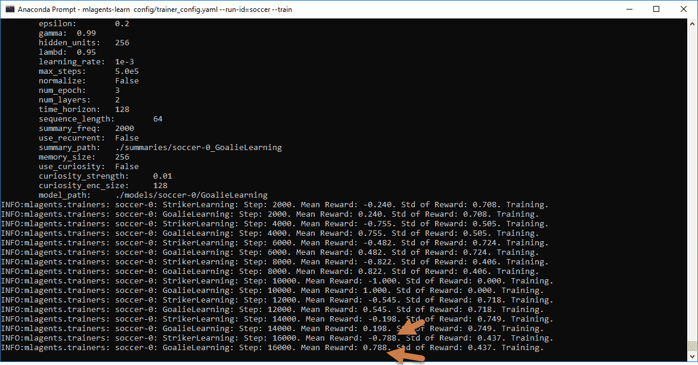

控制台输出显示两个大脑的统计数据

7.  注意罢工学习和进球学习是如何互相回报相反的回报的。这意味着，为了训练这些代理人，他们必须将两个代理人的平均奖励平衡为 0。随着代理的训练，您会注意到他们的奖励开始收敛到 0，这是本例中的最佳奖励。
8.  让示例运行到完成。你很容易迷失在这些环境中，所以你可能甚至没有注意到时间的流逝。

这个例子展示了我们如何通过自我游戏来利用多智能体训练的力量，教会两个大脑如何同时竞争和合作。在下一节中，我们将看到多个代理在自我游戏中相互竞争。


# 对抗性自我游戏

在前面的例子中，我们看到了一个合作和竞争自我游戏的例子，其中多个主体几乎是共生的。虽然这是一个很好的例子，但它仍然通过奖励功能将一个大脑的功能与另一个大脑的功能联系起来，因此我们观察到代理人处于几乎与奖励相反的情景中。相反，我们现在想看看一个环境，它可以用多个智能体通过对抗性的自我游戏来训练大脑。当然，ML-Agents 有这样一个环境，称为 Banana，它由几个随机漫游场景并收集香蕉的代理组成。代理人也有一个激光指示器，这允许他们在被击中时使对手瘫痪几秒钟。这是我们将在下一个练习中看到的场景:

1.  从“资产| ML-代理|示例| BananaCollectors |场景”文件夹中打开香蕉场景。
2.  选择并禁用附加训练区域 RLArea(1)至 RLArea(3)。
3.  在 RLArea 中选择五个代理(代理、代理(1)、代理(2)、代理(3)、代理(4))。
4.  把香蕉代理|大脑从 BananaPlayer 换成 BananaLearning。
5.  选择学院，并将香蕉学院|大脑|控制属性设置为启用。
6.  在编辑器中选择 Banana 代理组件(脚本)，并在您选择的代码编辑器中打开它。如果向下滚动到底部，可以看到如下所示的`OnCollisionEnter`方法:

```
void OnCollisionEnter(Collision collision)
{
  if (collision.gameObject.CompareTag("banana"))
  {
    Satiate();
    collision.gameObject.GetComponent<BananaLogic>().OnEaten();
    AddReward(1f);
    bananas += 1;
    if (contribute)
    {
      myAcademy.totalScore += 1;
    }
  }
 if (collision.gameObject.CompareTag("badBanana"))
 {
   Poison();
   collision.gameObject.GetComponent<BananaLogic>().OnEaten();

   AddReward(-1f);
   if (contribute)
   {
     myAcademy.totalScore -= 1;
   }
  }
}
```

7.  阅读前面的代码，我们可以将我们的`reward`函数总结如下:

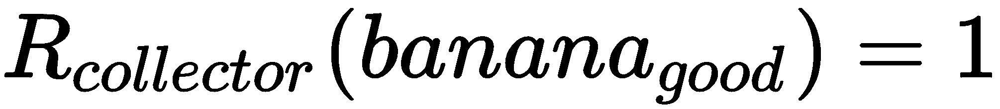

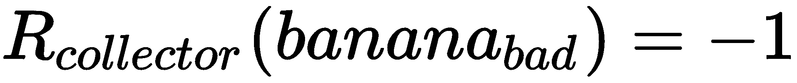

这仅仅意味着代理人只收到吃香蕉的奖励。有趣的是，用激光或被禁用来禁用对手是没有奖励的。

8.  保存场景和项目。
9.  打开一个准备好的 Python/Anaconda 控制台，使用以下命令开始训练:

```
mlagents-learn config/trainer_config.yaml --run-id=banana --train
```

10.  当出现提示时，在编辑器中按 Play，并观察动作的展开，如下一个屏幕截图所示:

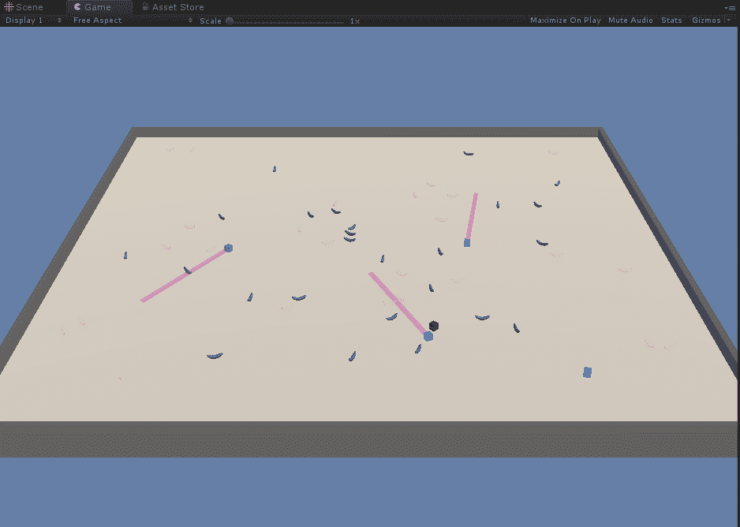

香蕉收集代理人正在做他们的工作

11.  让场景运行多久都行。

这个场景是一个很好的例子，说明代理人如何学习使用不返回奖励的第二游戏机制，但像激光一样，仍然被用来阻止敌对的收集者并获得更多的香蕉，同时只因为只吃香蕉而获得奖励。这个例子展示了 RL 的真正力量，以及它如何被用来寻找解决问题的次要策略。虽然这是一个非常有趣的方面，在游戏中观看也很有趣，但请考虑一下这一点的更大含义。RL 已经被证明可以使用**对抗性自我游戏**来优化从网络到推荐系统的一切，看看这种学习方法在不久的将来能够实现什么将会很有趣。


# 多脑游戏

ML-Agents 套件的一个真正伟大之处是能够快速添加由多个大脑驱动的多个代理。这反过来让我们有能力构建更复杂的游戏环境或场景，与有趣的代理人/人工智能一起玩或对抗。让我们看看将我们的足球示例转换成让代理都使用单独的大脑是多么容易:

1.  打开编辑器，进入我们之前看到的 SoccerTwos 场景。
2.  在 Assets | ML-Agents | Examples | Soccer | Brains 中找到示例的`Brains`文件夹。
3.  单击窗口右上角的创建菜单，从上下文菜单中选择 ML-Agents | Learning Brain:

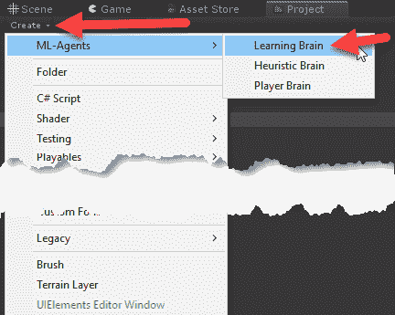

创造一个新的学习大脑

4.  将新大脑命名为`RedStrikerLearning`。在同一个文件夹中再创建三个名为`RedGoalieLearning`、`BlueGoalieLearning`和`BlueStrikerLearning`的新大脑。

5.  选择 RedStrikerLearning。然后选择并拖动 StrikerLearning brain，并将其放入“复制 brain 参数 from slot:

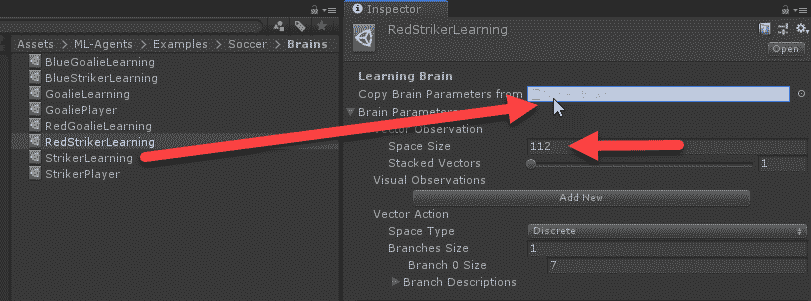

从另一个大脑复制大脑参数

6.  对 BlueStrikerLearning 执行此操作，从 StrikerLearning 复制参数。然后对 RedGoalieLearning 和 BlueGoalieLearning 做同样的事情，从 GoalieLearning 复制参数。
7.  在“层次”窗口中选择 RedAgent，并将代理 Soccer | Brain 设置为 RedStrikerLearning。对其他每个代理都这样做，将颜色与位置匹配。blue goalie**->**blue goalie learning。
8.  选择学院并从足球学院|大脑列表中删除所有当前大脑。然后使用“添加新大脑”按钮将我们刚刚创建的所有新大脑添加回列表中，并将其设置为控制:

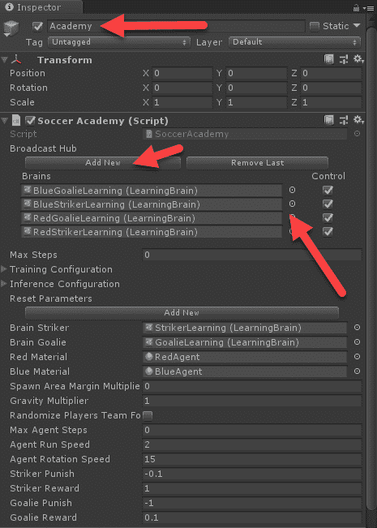

向学院添加新的大脑

9.  保存场景和项目。现在，我们刚刚把在自我游戏模式中使用两个并行大脑的例子换成了团队中的个体代理。
10.  打开为培训设置的 Python/Anaconda 窗口，并使用它启动以下内容:

```
mlagents-learn config/trainer_config.yaml --run-id=soccer_mb --train
```

11.  让培训继续进行，并注意代理开始时的表现如何与之前一样好。也看一下控制台输出。你会看到它现在报告了四个代理人，但代理人仍然有点共生，因为红色的前锋与蓝色的守门员相对。然而，他们现在训练得慢得多，部分原因是每个大脑现在只能看到一半的观察结果。请记住，我们之前让两个攻击代理人都向一个大脑提供信息，正如我们所了解的，这种额外的状态输入可以大大加快训练。

在这一点上，我们有四个代理人用四个独立的大脑在玩足球游戏。当然，由于代理人仍然通过共享一个奖励功能来进行共生训练，我们不能真正地将他们描述为个体。除此之外，正如我们所知，在团队中打球的个人通常会受到他们自己内部或内在奖励系统的影响。在下一节中，我们将看看内在奖励的应用如何使最后一个练习变得更有趣。


# 用内在奖励增添个性

正如我们在[第 9 章](ae184eca-6c9d-456e-a72b-85274ddcc10c.xhtml)、*奖励和强化学习*中了解到的，内在奖励系统和代理动机的概念目前在 ML-Agents 中仅仅作为**好奇心学习**来实现。将内在奖励或动机与 RL 相结合的整个领域广泛应用于游戏和人际应用，如**仆人代理**。

在下一个练习中，我们将为我们的几个代理添加内在奖励，并看看这对游戏有什么影响。打开上一练习中的场景，并按照以下步骤操作:

1.  在文本编辑器中打开`ML-Agents/ml-agents/config/trainer_config.yaml`文件。我们从未给我们的代理添加任何专门的配置，但我们现在要纠正这一点，并添加一些额外的配置。

2.  将以下四种新的大脑配置添加到文件中:

```
BlueStrikerLearning:
    max_steps: 5.0e5
    learning_rate: 1e-3
    batch_size: 128
    num_epoch: 3
    buffer_size: 2000
    beta: 1.0e-2
    hidden_units: 256
    summary_freq: 2000
    time_horizon: 128
    num_layers: 2
    normalize: false
 BlueGoalieLearning:
 use_curiosity: true
 summary_freq: 1000
 curiosity_strength: 0.01
 curiosity_enc_size: 256
    max_steps: 5.0e5
    learning_rate: 1e-3
    batch_size: 320
    num_epoch: 3
    buffer_size: 2000
    beta: 1.0e-2
    hidden_units: 256 
    time_horizon: 128
    num_layers: 2
    normalize: false

RedStrikerLearning:
    use_curiosity: true
 summary_freq: 1000
 curiosity_strength: 0.01
 curiosity_enc_size: 256
    max_steps: 5.0e5
    learning_rate: 1e-3
    batch_size: 128
    num_epoch: 3
    buffer_size: 2000
    beta: 1.0e-2
    hidden_units: 256 
    time_horizon: 128
    num_layers: 2
    normalize: false

RedGoalieLearning:
    max_steps: 5.0e5
    learning_rate: 1e-3
    batch_size: 320
    num_epoch: 3
    buffer_size: 2000
    beta: 1.0e-2
    hidden_units: 256
    summary_freq: 2000
    time_horizon: 128
    num_layers: 2
    normalize: false
```

3.  请注意我们是如何在`BlueGoalieLearning`和`RedStrikerLearning`大脑上启用`use_curiosity: true`的。您可以从文件中已经存在的原始`GoalieLearning`和`StrikerLearning`大脑配置中复制并粘贴大部分内容；注意细节就好。
4.  完成编辑后保存文件。
5.  打开 Python/Anaconda 控制台，使用以下命令开始训练:

```
mlagents-learn config/trainer_config.yaml --run-id=soccer_icl --train
```

6.  让代理训练一段时间，您会注意到，虽然他们看起来更像个人，但他们的训练能力仍然很差，而我们在训练中看到的任何改进都可能会引起一些代理的好奇。

这种通过内在奖励或动机为代理添加个性的能力肯定会像 DRL 为游戏和其他潜在应用所做的那样成熟，并有望提供其他可能不完全专注于学习的内在奖励模块。然而，内在奖励确实可以鼓励个性，所以在下一节中，我们在修改后的例子中引入外在奖励。

迁移学习的另一个很好的应用是，在代理人接受了一般任务的培训后，能够添加内在的奖励模块。


# 个性的外在奖励

我们已经在几个章节中广泛讨论了外部或外在奖励，以及如何使用技巧来优化和鼓励代理人获得这些奖励。现在，要改变一个代理人的行为，似乎最简单的方法就是改变它的外在奖励或者本质上的奖励功能。然而，这可能很容易出现困难，并且这经常会使培训表现变差，这就是我们在上一节中为几个代理添加**课程学习** ( **CL** )时所看到的情况。当然，即使我们让训练变得更糟糕，我们现在也有一些技巧，如**迁移学习** ( **TL** )，也称为**模仿学习**(**IL**)；**好奇心**；还有 CL，帮助我们改正错误。

在下一个练习中，我们将通过增加额外的外部奖励来为我们的代理增加更多的个性。打开我们刚刚做的上一个练习示例，然后继续:

1.  从菜单中，选择窗口|资产存储。这将带您到 Unity 资产商店，这是一个很好的助手资产资源。虽然这些资产中的大部分都是付费的，但老实说，与可比的开发人员工具相比，价格是最低的，并且有几个免费的非常优秀的资产，您可以开始使用它们来增强您的培训环境。资产商店是 Unity 最好和最糟糕的事情之一，所以如果你购买资产，一定要阅读评论和论坛帖子。任何好的资产通常都会有自己的论坛，如果它是以开发人员为中心的，艺术资产就更少了。
2.  在搜索栏中，输入`toony tiny people`并按下 *Enter* 键或点击搜索按钮。这将显示搜索结果。

我们要感谢**多边形铁匠**的支持，允许我们将他们的 Toony Tiny People 演示资产与书的源代码一起发布。此外，他们收集的角色资产做得非常好，使用简单。如果你决定要制作一个完整的游戏或者增强版的试玩，这个价格对于一些大的资产包来说也是一个很好的起点。

3.  选择多边形铁匠名为 Toony Tiny People Demo 的结果并选中它。它将如下图所示:

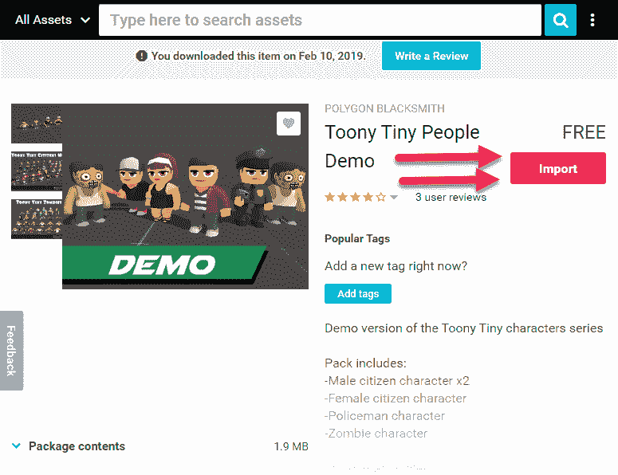

来自多边形铁匠的图尼小人演示资产

4.  单击红色的 Download 按钮，在资产下载完成后，该按钮将变为 Import，如前面的屏幕截图所示。单击“导入”按钮导入资产。当导入对话框提示您时，确保所有内容都已选中，然后单击导入。

这些类型的低多边形或卡通资产是完美的，使一个简单的游戏或模拟更具娱乐性和趣味性。这可能看起来不多，但你可以花很多时间看这些训练模拟人跑步，如果他们看起来有吸引力，那会有帮助。

5.  选择并展开层次结构中的所有代理对象。这包括 RedStriker、BlueStriker、RedGoalie 和 BlueGoalie。
6.  在项目窗口中打开资产| tooytinpeople | TT _ 演示|预设文件夹。
7.  从前面的文件夹中选择并拖动 TT _ 演示 _ 女性预设，并将其放入“层次”窗口中的 RedStriker 代理对象。选择代理下方的立方体对象，并在检查器中禁用它。根据以下列表，对其他代理继续执行此操作:
    *   TT _ 德莫 _ 女->红人
    *   TT _ 德莫 _ 马累 _A ->蓝魔
    *   TT _ demo _ 警察-> BlueGoalie
    *   TT _ demo _ 僵尸-> RedGoalie

这张截图进一步证明了这一点:


设置新的代理主体

8.  确保还将新代理模型的变换位置和方向重置为`[0,0,0]`，如以下屏幕截图所示:

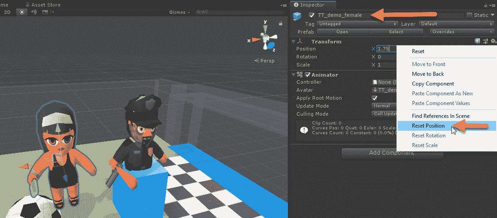

重置拖动的预设的方向和位置

9.  保存场景和项目。

此时，您可以在训练中运行场景，并观看新的代理模型四处移动，但没有多大意义。代理人仍然会采取相同的行动，所以我们接下来需要做的是根据一些任意的个性设置额外的外部奖励，我们将在下一节中定义。


# 利用定制的奖励功能创造独特性

我们设法通过增加内在奖励使我们的代理变得独特，虽然结果可能不如我们希望的那样独特。这意味着我们现在想看看修改代理的外在奖励，希望使他们的行为更独特，并最终使游戏更具娱乐性。

我们开始这样做的最好方法是看看我们之前描述的`SoccerTwos`奖励函数；这里列出了这些，以供参考:

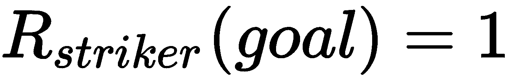

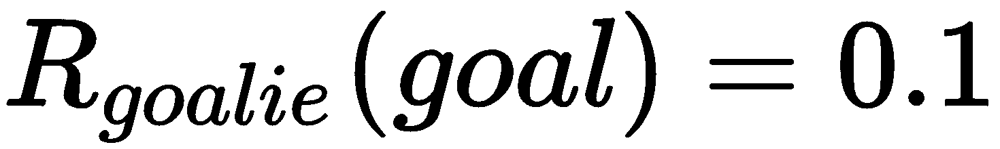


我们现在要做的是根据当前角色对奖励函数进行一些个性化的修改。我们将通过简单地根据字符类型修改链接函数来实现这一点，如下所示:

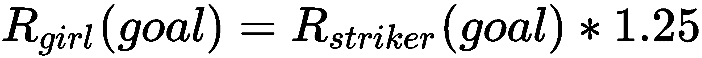或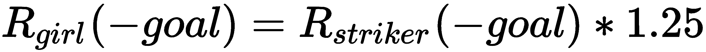
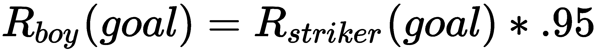或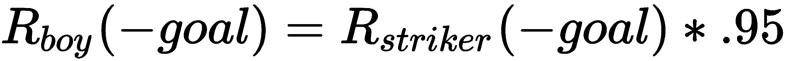
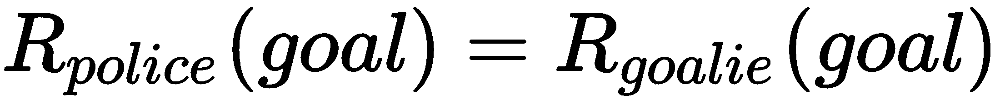或
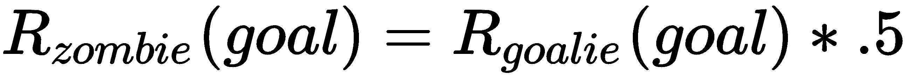或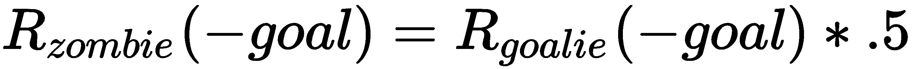

我们在这里用这些奖励函数所做的只是通过一些个性修改来修改奖励值。对于女孩，我们给她 1.25 倍奖励的奖金，反映她可能是兴奋的。男孩不太兴奋，所以我们把他的奖励修改了 0.95 倍，稍微减少了一些。警察，总是冷静和控制，保持不变，没有奖励修改。最后，我们引入一个通配符，半死不活的僵尸。为了将它描述为半死，我们也将它的所有奖励减半。

当然，根据你的游戏机制，你可以以任何你喜欢的方式修改这些功能，但是重要的是要注意你所应用的个性修改的效果可能会阻碍训练。当我们开始训练这个例子时，一定要记住这一点。

一个女孩、一个男孩、一个僵尸和一个警察进入足球场。

既然我们已经理解了新的奖励函数，我们想在我们的例子中添加一点，是时候打开 Unity 并对它们进行编码了。这个例子需要对 C#文件稍加修改，但是代码非常简单，任何有 C 语言经验的程序员都应该很容易理解。

打开 Unity，进入我们在上一个示例中修改的场景，然后进行下一个练习:

1.  在“层次”窗口中找到 RedStriker 代理并选择它。

2.  从检查器中，单击代理足球组件旁边的齿轮图标，并从上下文菜单中选择编辑脚本。这将在您的编辑器中打开脚本和解决方案。
3.  在文件顶部当前`enum AgentRole`之后添加一个名为`PersonRole`的新`enum`，如代码所示:

```
public enum AgentRole
{
  striker,goalie
} *//after this line*
public enum PersonRole
{
 girl, boy, police, zombie
}
```

4.  这创造了一个新的角色，本质上是我们想要应用到每个大脑的个性。
5.  向该类添加另一个新变量，如下所示:

```
public AgentRole agentRole; *//after this line*
public PersonRole playerRole;
```

6.  这就给代理添加了新的`PersonRole`。现在，我们还想通过向`InitializeAgent`方法添加一行来将新类型添加到设置中，如下所示:

```
public override void InitializeAgent()
{
  base.InitializeAgent();
  agentRenderer = GetComponent<Renderer>();
  rayPer = GetComponent<RayPerception>();
  academy = FindObjectOfType<SoccerAcademy>();
  PlayerState playerState = new PlayerState();
  playerState.agentRB = GetComponent<Rigidbody>();
  agentRB = GetComponent<Rigidbody>();
  agentRB.maxAngularVelocity = 500;
  playerState.startingPos = transform.position;
  playerState.agentScript = this;
  area.playerStates.Add(playerState);
  playerIndex = area.playerStates.IndexOf(playerState);
  playerState.playerIndex = playerIndex;
  playerState.personRole = personRole;  *//add this line*
}
```

7.  现在，您应该会在该行中看到一个错误。这是因为我们还需要将新的`personRole`属性添加到`PlayerState`中。打开`PlayerState`类并添加属性，如下所示:

```
[System.Serializable]
public class PlayerState
{
  public int playerIndex; 
  public Rigidbody agentRB; 
  public Vector3 startingPos; 
  public AgentSoccer agentScript; 
  public float ballPosReward;
  public string position;
  public AgentSoccer.PersonRole personRole { get; set; }  *//add me*
}
```

8.  你现在应该在`SoccerFieldArea.cs`文件中。滚动到`RewardOrPunishPlayer`方法并修改它，如下所示:

```
public void RewardOrPunishPlayer(PlayerState ps, float striker, float goalie)
{
  if (ps.agentScript.agentRole == AgentSoccer.AgentRole.striker)
  { 
    RewardOrPunishPerson(ps, striker);  *//new line*
  }
  if (ps.agentScript.agentRole == AgentSoccer.AgentRole.goalie)
  { 
    RewardOrPunishPerson(ps, striker); *//new line*
  }
  ps.agentScript.Done(); //all agents need to be reset
}
```

9.  我们在这里做的是注入另一个奖励函数，`RewardOrPunishPerson`，以增加我们外在的个性奖励。接下来，添加一个新的`RewardOrPunishPerson`方法，如图所示:

```
private void RewardOrPunishPerson(PlayerState ps, float reward)
{
  switch (ps.personRole)
  {
    case AgentSoccer.PersonRole.boy:
      ps.agentScript.AddReward(reward * .95f);
      break;

    case AgentSoccer.PersonRole.girl:
      ps.agentScript.AddReward(reward*1.25f);
      break;

    case AgentSoccer.PersonRole.police:
      ps.agentScript.AddReward(reward);
      break;

    case AgentSoccer.PersonRole.zombie:
      ps.agentScript.AddReward(reward * .5f);
      break;
  }
}
```

10.  这段代码做的正是我们之前定制的奖励函数所做的。完成编辑后，保存所有文件并返回 Unity 编辑器。如果有任何错误或编译器警告，它们将显示在控制台中。如果您需要返回并修复任何(红色)错误问题，请这样做。

正如你所看到的，用很少的代码，我们就能添加我们外在的个性奖励。当然，您可以用多种方式增强这个系统，甚至使它更加通用和参数驱动。在下一部分中，我们希望将所有这些放在一起，并对我们的代理进行单独培训。


# 配置代理的个性

设置好所有代码后，我们现在可以继续回到编辑器中，设置代理来匹配我们想要应用到它们的个性。再次打开编辑器，按照下一个练习将个性应用到代理并开始培训:

1.  在层次结构中选择 RedStriker，并将我们刚刚创建的 Agent Soccer | Person 角色参数设置为 Girl，如图所示:

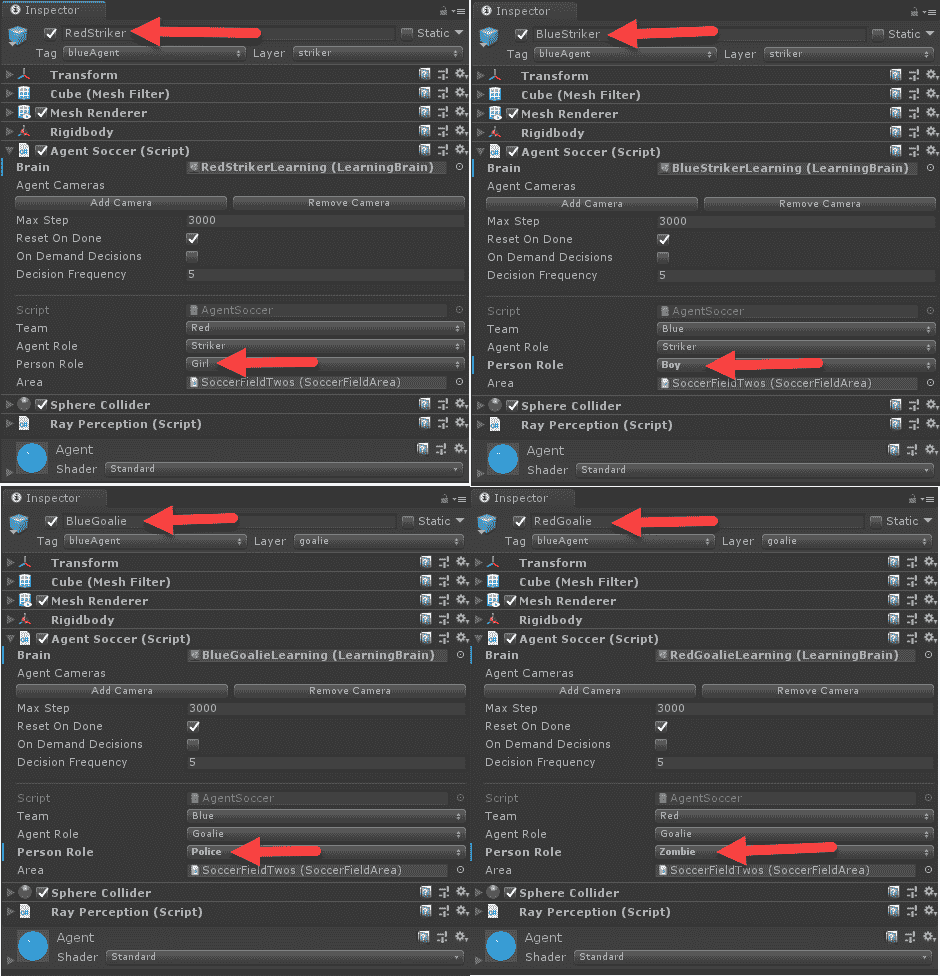

设置每个代理的个性

2.  用与我们之前分配的模型相匹配的相关个性更新所有代理:BlueStriker-> Boy、BlueGoalie -> Police 和 RedGoalie -> Zombie，如前面的截图所示。
3.  保存场景和项目。
4.  现在，在这一点上，如果你想让它更详细，你可能想回过头来更新每个代理大脑名称，以反映他们的个性，如 GirlStrikerLearning 或 PoliceGoalieLearning，你可以省略团队颜色。确保将新的大脑配置设置添加到您的`trainer_config.yaml`文件中。
5.  打开 Python/Anaconda 培训控制台，使用以下命令开始培训:

```
mlagents-learn config/trainer_config.yaml --run-id=soccer_peeps --train
```

6.  现在，这看起来非常有趣，正如你在下面的截图中看到的:

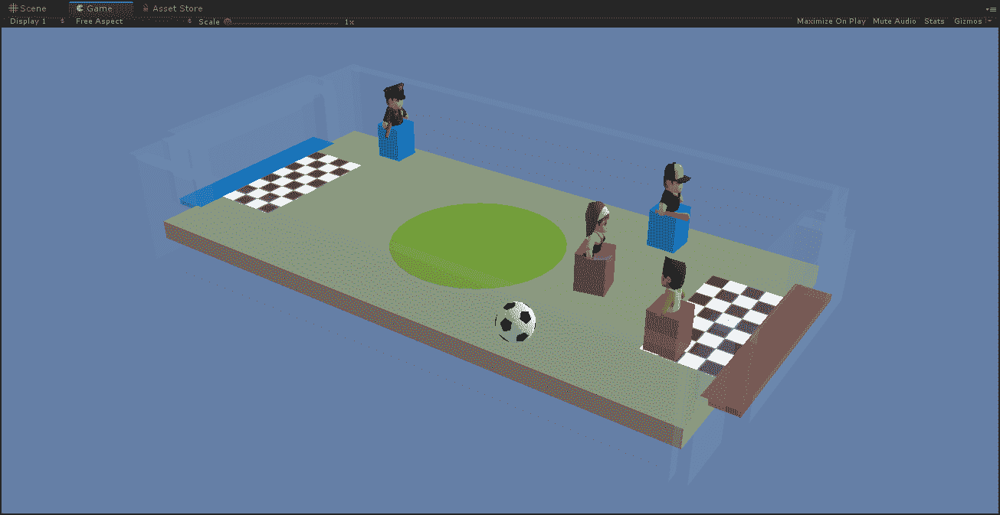

观看个人踢足球

7.  请注意，我们如何保持团队颜色立方体处于活动状态，以便显示每个代理属于哪个团队。

8.  让代理训练几千次迭代，然后打开控制台；请注意这些代理现在看起来不那么共生了。在我们的例子中，它们仍然是成对的，因为我们只对奖励进行了简单的线性变换。当然，你可以应用更复杂的非线性函数，这些函数描述你的代理人的其他动机或个性。
9.  最后，让我们打开 TensorBoard，看看我们的多智能体训练的更好的对比。打开另一个 Python/Anaconda 控制台，打开您当前所在的`ML-Agents/ml-agents`文件夹，并运行以下命令:

```
tensorboard --logdir=summaries
```

10.  使用浏览器打开 TensorBoard 界面并检查结果。确保禁用任何额外的结果，只关注我们当前训练中的四个大脑。我们要关注的三个主要图在此图中合并在一起显示:

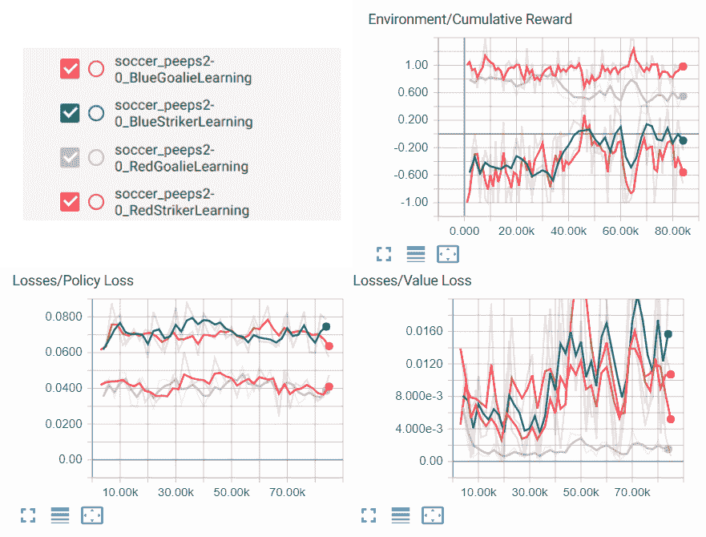

显示四个大脑训练结果的张量图

从 TensorBoard 的结果可以看出，代理人的训练不是很好。当然，我们可以通过增加额外的培训领域和提供更多的观察来加强这一点，以便培训策略。然而，如果你看一下**策略损失**图，结果显示代理商的竞争导致最小的策略变化，这在培训的早期是一件坏事。如果有什么不同的话，僵尸代理似乎是从这些结果中学习最好的代理。

当然，还有很多其他方法可以修改你的外在奖励函数，以鼓励多主体训练场景中的一些行为方面。这些技术有些效果很好，有些则不太好。我们仍然处于开发这项技术的早期阶段，最佳实践仍然需要出现。

在下一节中，我们期待你能继续做进一步的练习，以巩固你对本章所有内容的了解。


# 练习

和往常一样，为了你自己的享受和学习，你可以尝试至少一两个下面的练习:

1.  打开 BananaCollectors 示例香蕉场景，并在训练模式下运行它。
2.  修改 BananaCollectors | Banana 场景，使其使用五个独立的学习大脑，然后在训练模式下运行。
3.  修改上次 SoccerTwos 练习中的奖励函数，使用指数或对数函数。
4.  修改上次 SoccerTwos 练习中的奖励函数，以使用非逆相关和非线性函数。这样，对每个人来说，改变积极和消极奖励的方法是不同的。
5.  用不同的角色和个性修改 SoccerTwos 场景。建立新的奖励函数模型，然后培训代理。
6.  修改 BananaCollectors 示例香蕉场景，使用与 SoccerTwos 示例相同的个性和自定义奖励函数。
7.  以 BananaCollectors 为例做练习 3。
8.  以 BananaCollectors 为例做练习 4。
9.  以 BananaCollectors 为例做练习 5。
10.  使用当前示例之一作为模板构建一个新的多代理环境，或者创建您自己的环境。这最后一个练习很可能会变成你自己的游戏。

你可能已经注意到，随着我们阅读这本书，练习变得更加耗时和困难。为了你自己的利益，请至少完成几个练习。


# 摘要

在这一章中，我们探索了多智能体训练环境的可能性。我们首先研究了如何利用自我游戏建立环境，在自我游戏中，一个大脑可以控制多个大脑，这些大脑既相互竞争又相互合作。然后，我们研究了如何使用 ML-Agents 好奇心学习系统，以好奇心的形式增加内在奖励的个性。接下来，我们研究了外在奖励如何被用来塑造一个代理人的个性和影响培训。为此，我们添加了一个免费的风格资产，然后通过奖励函数链应用自定义的外部奖励。最后，我们训练了环境，并被男孩代理人扎实地击败僵尸的结果所娱乐；如果您观看培训直到结束，您将会看到这一点。

在下一章，我们将看看 DRL 的另一个新颖的应用程序，用于调试和测试已经构建好的游戏。