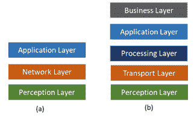
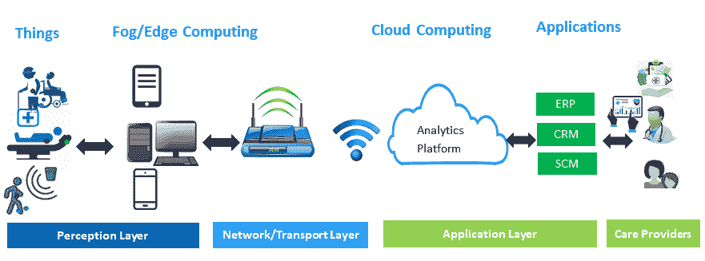
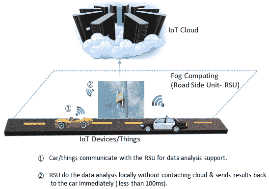
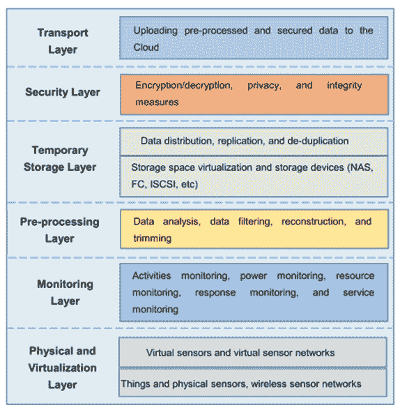
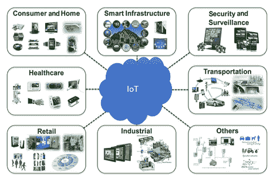
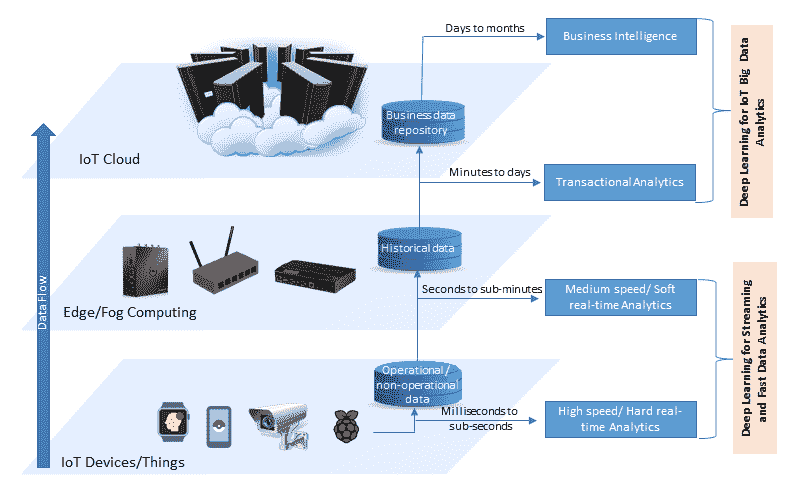
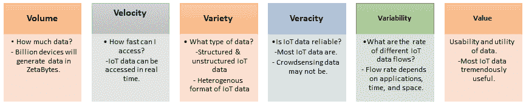
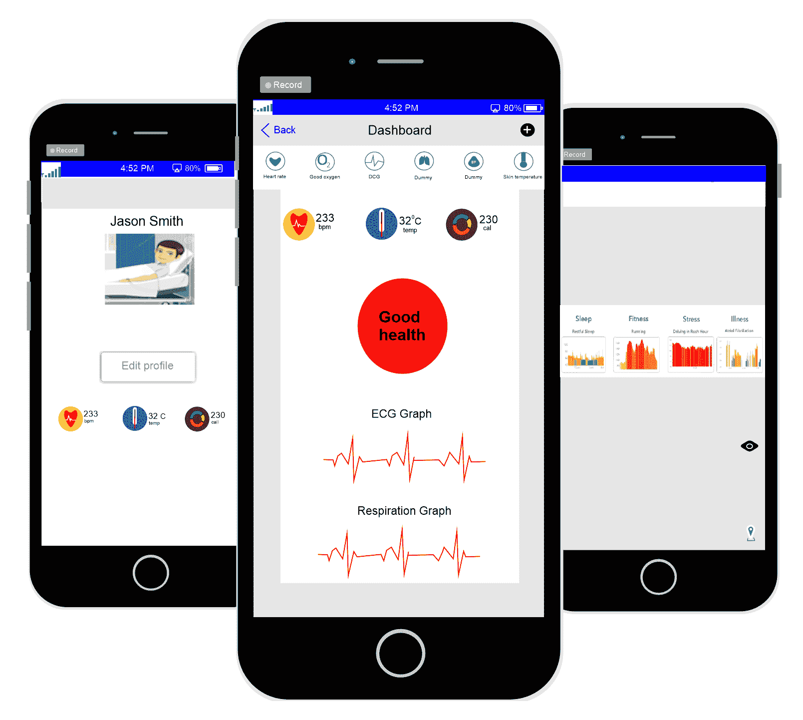
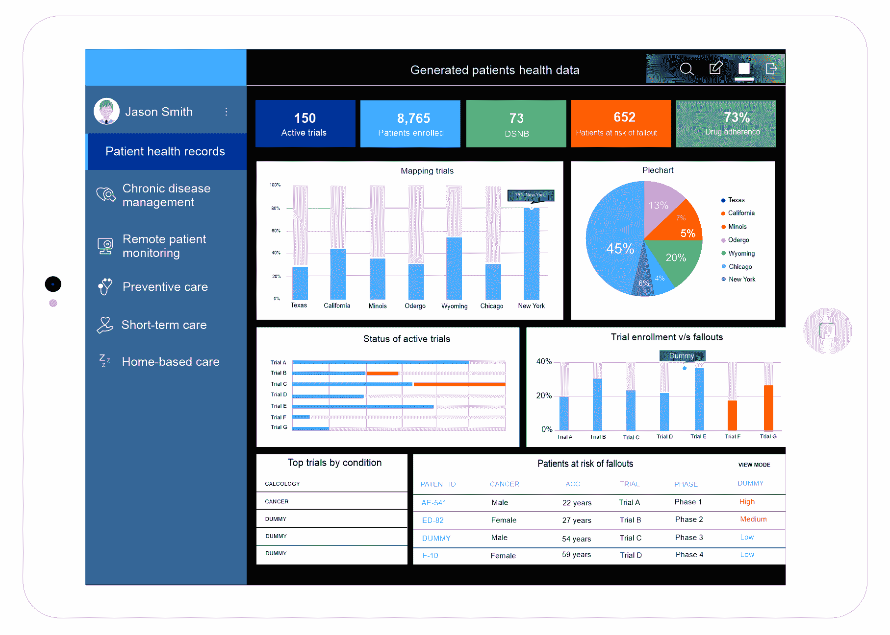

# 一、物联网的端到端生命周期

通过实现对各种物理设备及其环境的轻松访问和交互，**物联网** ( **物联网**)将促进各种领域的各种应用的发展，如健康和医疗保健、智能能源管理和智能电网、运输、交通管理等。这些应用会产生大的实时/流数据，这就需要大数据分析工具，包括先进的机器学习，即**深度学习** ( **DL** )，提取有用的信息，做出明智的决策。我们需要了解物联网及其不同组件的**端到端** ( **E2E** )生命周期，以便对物联网应用程序生成的数据应用先进的机器学习技术。

在本章中，我们将讨论物联网的 E2E 生命周期及其相关概念和组件。我们将探讨其关键特征以及需要在物联网中使用 DL 的物联网数据问题。我们将讨论以下主题:

*   物联网的 E2E 生命周期:
    *   物联网应用领域:
        *   分析在物联网中的重要性
        *   在物联网数据分析中使用 DL 的动机
*   物联网数据的关键特征和要求

# 物联网的 E2E 生命周期

不同的组织和行业对物联网的描述是不同的。一种简单而明确的定义方式是智能物体网络，它将物理世界和数字世界连接在一起。检查物联网解决方案的 E2E 生命周期，或者更一般地说，物联网生态系统的生命周期，将有助于我们进一步理解它，并向我们展示它如何适用于机器学习和 DL。

与物联网的定义类似，对于 E2E 生命周期或物联网架构，并没有一致公认的单一共识。different 的研究人员已经提出了不同的架构或层。最常提出的选项是三层和五层生命周期或体系结构，如下图所示:

在上图中， **(a)** 表示三层物联网生命周期或架构， **(b)** 表示五层物联网生命周期或架构。

# 三层 E2E 物联网生命周期

这是物联网解决方案最基本、应用最广泛的物联网生命周期。它由三层组成:感知层、网络层和应用层。这些可以描述如下:

*   **感知层**:这是物理层或感知层，包括拥有传感器来收集其环境信息的事物或设备。如下图所示，医疗行业物联网解决方案的 E2E 生命周期的感知层由部署了传感器的患者、病床和轮椅组成。
*   **网络层**:网络负责连接其他智能物、网络设备、服务器。它还负责传输和处理传感器数据。
*   **应用层**:该层负责根据来自传感器的数据，向用户提供特定于应用的服务。它定义了可以部署物联网的各种应用，例如智能家居、智能城市和互联健康。

下图展示了医疗保健行业的三层 e2e IOT 生命周期:

三层 E2E 物联网生命周期或架构定义了物联网的关键思想，但对于研发来说可能还不够，因为这些往往涉及物联网的更精细的方面。这就是为什么提出了其他生命周期或体系结构，如五层生命周期。

# 五层物联网 E2E 生命周期

五层物联网生命周期由感知、传输、处理、应用和业务层组成。感知层和应用层的角色与三层架构中的角色相同。我们将其余三层的功能概述如下:

*   **传输层**:这类似于三层生命周期的网络层。它通过无线、3G、LAN、蓝牙、RFID 和 NFC 等网络将感知层收集的数据传输到处理层，反之亦然。
*   **处理层**:也称为**中间件层**。它存储、分析和处理来自传输层的大量数据。它可以管理并向较低层提供一组不同的服务。它采用了许多技术，如数据库、云计算和大数据处理模块。
*   **业务层**:该层管理整个物联网系统，包括应用、业务和盈利模式、用户隐私。

# 物联网系统架构

了解物联网系统的架构对于开发应用程序非常重要。考虑我们在不同计算平台级别的数据处理需求也很重要，包括雾级别和云级别。考虑到许多物联网应用的重要性和延迟敏感性(如医疗保健领域的物联网解决方案，如上图所示)，雾计算对于这些应用至关重要。下图简要介绍了雾计算的工作原理:

正如我们在前面的图表中所看到的，在雾计算中，一个事物(比如一辆汽车)的数据不会移动到云中进行处理。通过这种方式，雾计算解决了云在物联网中面临的许多挑战(如高延迟、停机时间、安全性、隐私和信任)，并提供了许多好处，如位置感知、低延迟、支持移动性、实时交互、可扩展性和业务敏捷性。下图展示了雾计算的协议分层架构:

如上图所示，雾计算或物联网雾计算的架构由六层组成:物理和虚拟化、监控、预处理、临时存储、安全和传输。值得注意的是，预处理层主要通过分析、过滤和整理从物理或虚拟传感器收集的数据来执行数据管理任务。

# 物联网应用领域

通过实现对各种物理设备或事物(如车辆、机器、医疗传感器等)的轻松访问和交互，物联网促进了许多不同领域的应用程序开发。下图突出了物联网的关键应用领域:

这些领域包括医疗保健、工业自动化(即工业 4.0)、能源管理和智能电网、交通、智能基础设施(如智能家居和智能城市)、零售以及其他许多将改善我们生活和社会的领域。到 2025 年，这些应用将产生每年 4 到 11 万亿美元的全球经济影响。这笔资金的主要贡献者(按其预测贡献顺序)包括:

*   工厂或行业，包括运营管理和预测性维护
*   城市，包括公共安全、健康、交通控制和资源管理
*   医疗保健，包括监控和管理疾病以及改善健康状况
*   零售，包括自助结账和库存管理
*   能源，包括智能电网

对这些应用的巨大需求意味着物联网服务及其产生的大数据的惊人和急剧增长。

# 分析在物联网中的重要性

只有当这些应用程序能够从物联网设备生成和收集的数据中提取一些商业价值时，物联网在各种应用领域的使用才会有效。在这种情况下，物联网数据分析在物联网解决方案中至关重要。Gartner 将物联网分析确定为物联网中使用的两大顶级技术之一。

物联网分析是数据分析工具和程序的应用，用于从物联网设备以不同方式生成的海量数据中释放洞察力。物联网分析对于从物联网设备或事物生成的数据中提取洞察力至关重要。更具体地说，物联网商业模式以多种方式分析事物产生和收集的信息——例如，了解客户行为，提供服务，改进产品和服务，以及识别和拦截商业时刻。当谈到理解他们的数据时，大多数这些物联网商业模式或应用的主要元素是用于预测、数据挖掘和模式识别的智能学习或机器学习机制。传统的机器学习机制或技术可以很好地处理结构化数据，但它们很难处理非结构化数据。

这方面的一个例子是谷歌的 Nest learning 恒温器，它以结构化的方式记录温度数据，然后应用机器学习算法来理解其用户的温度偏好和时间表的模式。然而，它不理解非结构化数据，例如多媒体数据，即音频信号和视觉图像。此外，传统机器学习算法的训练依赖于手工制作和工程化的特征集，由于应用中涉及的异构性和动态性，这在许多物联网应用中可能并不容易。例如，在工厂中，故障可能是随机的，特征集可能无法对它们进行分类。因此，物联网需要新的分析方法，包括数据挖掘。

# 在物联网数据分析中使用 DL 的动机

近年来，许多物联网应用都在积极开发复杂的 DL 技术，这些技术使用神经网络来捕捉和理解它们的环境。例如，亚马逊 Echo 被认为是一种物联网应用，因为它将物理和人类世界与数字世界连接起来；它可以理解使用 DL 的人类语音命令。

此外，微软的 Windows 面部识别安全系统(一种物联网应用程序)使用 DL 技术来执行任务，例如当它识别用户的面部时开门。DL 和 IoT 是 2017 年三大战略技术趋势之一，并在 Gartner Symposium/ITxpo 2016 上公布。围绕 DL 的密集宣传是因为传统的机器学习算法无法解决物联网系统新兴的分析需求。相反，一般来说，DL 算法或模型比传统的机器学习方法带来了两个重要的改进。首先，它们减少了对用于模型训练的手工和工程特征集的需求。因此，物联网应用中的一些对人类来说可能不明显的特征可以通过 DL 模型轻松提取。此外，DL 模型提高了预测的准确性。

然而，在物联网应用中实现 DL 非常困难，尤其是在边缘计算设备、雾计算设备和终端设备中，因为它们具有资源受限的特性。而且物联网数据不同于一般的大数据。我们需要探索物联网数据的属性，以及它们与一般大数据的属性有何不同，以便更好地了解物联网数据分析的要求。

# 物联网数据的关键特征和要求

来自物联网应用的数据表现出两个特征，需要从分析方法中进行不同的处理。许多物联网应用，如远程患者监护或自动驾驶汽车，会不断产生数据流，这导致了大量的连续数据。许多其他应用程序，如用于营销的消费品分析或森林或水下的居民监控，都会产生作为大数据源积累的数据。流数据是在很短的时间间隔内生成或捕获的，需要快速分析以提取即时有用的见解并快速做出决策。

相反，术语大数据是指常用硬件和软件平台无法存储、管理、处理和分析的巨大数据集。这两种类型的数据需要区别对待，因为它们对分析响应的要求不同。

大数据分析的结果，如商业智能和交易分析，可以在几天的数据生成后交付，但流数据分析结果应该在几百毫秒到几秒钟内准备好。例如，在无人驾驶汽车中，紧急制动情况下的响应时间需要在 100 毫秒左右。下图强调了物联网数据的主要特征及其分析要求:

许多物联网应用程序，如监控实时平均温度的应用程序，依赖于多个数据源。数据融合、聚合和共享在这些应用中扮演着重要角色。这对于时间敏感的物联网应用来说更加重要，例如远程患者监护或无人驾驶汽车，在这些应用中，需要及时聚合数据，以便将所有数据汇集在一起进行分析，并随后提供可靠、准确的可操作见解。

一般来说，流数据的分析是具有挑战性的，即使在高性能计算系统或云平台中。流数据分析的一个潜在解决方案是基于数据并行和增量处理的框架。虽然这些技术可以减少时间延迟，并从流数据分析框架返回响应，但它们不是实时物联网应用的最佳解决方案。在这种背景下，最好通过物联网设备或边缘设备，在雾或边缘计算的支持下，使流数据分析更接近数据的来源。然而，向物联网设备或事物添加数据分析会带来新的挑战，例如数据源处计算、存储和电力资源的限制。

物联网负责通过将数十亿台智能设备连接在一起生成大数据，并频繁收集有关设备及其环境状态的数据。从来自原始传感器的大量数据中识别和挖掘有意义的模式是物联网应用中大数据分析的核心效用，因为它可以为决策和趋势预测提供进一步的见解。通过提取这些见解，物联网大数据对许多企业来说极其重要，因为它使企业能够获得超越竞争对手的优势。下图用**六 Vs** ( **6Vs** )突出了物联网大数据的特点:

# 快速和流式物联网数据的真实例子

远程患者监控是物联网在医疗保健领域最明显和最受欢迎的应用之一。通过这种有时被称为**远程医疗**的应用程序，患者将连接到他们的护理提供者，并在必要时获得实时反馈。该应用程序生成的数据(如心率或血压的变化)是流数据，需要快速处理，以便医护人员能够及时响应患者的情况。

下图显示了商用远程患者监护系统的快照:

# 物联网大数据的真实例子

智能电网是物联网大数据的重要来源。智能电表通过生成和收集用户能耗的精确测量值，在智能电网系统中发挥着重要作用。目前，许多国家的能源提供商都有兴趣了解当地的能源消耗模式，预测客户的需求，并根据实时分析做出适当的决策。

物联网大数据的另一个例子是智能设备产生的数据。下图展示了使用物联网数据进行消费产品营销分析的流程:

如上图所示，支持物联网的远程患者监护系统可以产生大量数据进行处理、存储和分析。然而，智能设备，如智能咖啡机、智能冰箱和智能自动售货机，也可以产生大数据，用于消费产品分析。

# 摘要

在本章中，我们展示了物联网 E2E 生命周期的两个不同的分层视图。我们还了解了物联网系统架构和物联网的关键应用领域。在此之后，我们定义了物联网分析的含义及其在物联网应用中的重要性，并特别强调了 DL。我们讨论了物联网的关键特征及其在分析方面的相应要求。最后，我们展示了几个真实的物联网示例，它们可以生成快速的流数据以及大数据。在下一章中，将向您介绍几种常见的 DL 模型和近年来推出的最前沿的架构，并了解它们如何在分析物联网流和大数据方面发挥作用。

为了在不同的物联网应用中使用它们，了解不同 DL 模型及其不同实现框架的基础知识是至关重要的。在下一章中，我们将介绍一系列流行的 DL 模型，包括卷积神经网络、长短期记忆和自编码器。除此之外，我们讨论一系列流行的 DL 开发框架，包括 TensorFlow 和 Keras。

# 参考

*   Pallavi Sethi 和 Smruti R. Sarangi，*物联网:架构、协议和应用*，电气和计算机工程杂志，2017 卷，文章 ID 9324035，25 页，2017 年。
*   阿特拉姆，H.F。沃尔特，R.J。威尔斯，G.B. *雾计算和物联网:综述*。大数据 Cogn。计算机。2018, 2, 10.
*   James Manyika、Michael Chui、Peter Bisson、Jonathan Woetzel、Richard Dobbs、Jacques Bughin 和 Dan Aharon，*释放物联网的潜力*，可从[https://www . McKinsey . com/business-functions/digital-McKinsey/our-insights/the-Internet-of-Things-the-value-of-digitaling-the-the-physical-world](https://www.mckinsey.com/business-functions/digital-mckinsey/our-insights/the-internet-of-things-the-value-of-digitizing-the-physical-world)获得。
*   康涅狄格州斯坦福 *Gartner 确定了 2017 年和 2018 年*十大物联网技术，可在[https://www.gartner.com/newsroom/id/3221818](https://www.gartner.com/newsroom/id/3221818)在线获得。
*   J.Tang，D. Sun，S. Liu 和 J. Gaudiot，*在物联网设备上实现深度学习*，载于《计算机》，第 50 卷第 10 期，第 92-96 页，2017 年。
*   米（meter 的缩写））Mohammadi，A. Al-Fuqaha，S. Sorour 和 M. Guizani，*物联网大数据和流分析的深度学习:一项调查*，载于 IEEE 通信调查和教程，可在(DOI) 10.1109/COMST.2018 获得。48461.88868666616
*   K.Panetta (2016)，*Gartner 2017 年十大战略技术趋势*，可在[http://www:Gartner:com/smarterwithgartner/Gartner-top-10-technology-trends-2017/](http://www:gartner:com/smarterwithgartner/gartners-top-10-technology-trends-2017/)查阅。
*   [https://www . napier health care . com/LP/remote-patient-tele health-monitoring？gclid = cjwkcajwxildbwrqeiwahl 2r 865 AEP 4 mkgfknocrtldok 3 vtsnqwirdtfyrr-e2es-yaz _ e 6 DP 6 nhocmv 4 qavd _ BwE](https://www.napierhealthcare.com/lp/remote-patient-telehealth-monitoring?gclid=CjwKCAjwxILdBRBqEiwAHL2R865Aep4MKgFknoctRLDOk3VtSNQWiRdTFyRR-e2es-yaz_e6Dp6hNhoCmV4QAvD_BwE)。
*   [https://www . software advice . com/resources/IOT-data-analytics-use-cases/](https://www.softwareadvice.com/resources/iot-data-analytics-use-cases/)。