<title>Deep Learning Architectures for IoT</title>  

# 物联网深度学习架构

在**物联网** ( **物联网**)时代，从众多传感设备中产生并收集了大量的传感数据，这些数据适用于广泛的领域和应用。对这些数据流进行分析以发现新信息、预测未来洞察力并做出可控决策是一项具有挑战性的任务，这使得物联网成为商业智能和生活质量改善技术的重要范例。然而，在支持物联网的设备上进行分析需要一个由**机器学习** ( **ML** )和**深度学习** ( **DL** )框架、软件堆栈和硬件(例如，**图形处理单元** ( **GPU** )和**张量处理单元** ( **TPU** ))组成的平台。

在这一章中，我们将讨论 DL 架构和平台的一些基本概念，这些概念将在后面的章节中用到。我们将从简单介绍 ML 开始。然后，我们将转向 DL，它是 ML 的一个分支，基于一组算法，试图对数据中的高级抽象进行建模。我们将简要讨论一些最著名和最广泛使用的神经网络架构。然后，我们将了解可用于在物联网设备上开发 DL 应用的 DL 框架和库的各种特性。简而言之，将涵盖以下主题:

*   ML 的软介绍
*   人工神经网络
*   深度神经网络架构
*   DL 框架

<title>A soft introduction to ML</title>  

# ML 的软介绍

ML 方法基于一组统计和数学算法来执行任务，例如分类、回归分析、概念学习、预测建模、聚类和有用模式的挖掘。使用 ML，我们的目标是自动改进整个学习过程，这样我们可能不需要完全的人类交互，或者这样我们至少可以尽可能地减少这种交互的水平。

<title>Working principle of a learning algorithm</title>  

# 学习算法的工作原理

Tom M. Mitchell 从计算机科学的角度解释了学习的真正含义:

如果一个计算机程序在某类任务 T 和性能测量 P 上的性能(由 P 测量)随着经验 E 而提高，则称它从经验 E 中学习。

基于这个定义，我们可以得出结论，计算机程序或机器可以做到以下几点:

*   从数据和历史中学习
*   随着经验而提高
*   迭代增强可用于预测问题结果的模型

由于上述几点是预测分析的核心，我们使用的几乎每一个 ML 算法都可以被视为一个优化问题。这是关于寻找最小化目标函数的参数；例如，诸如成本函数和正则化的两个项的加权和。通常，目标函数有两个组成部分:

*   控制模型复杂性的正则化子
*   度量模型在训练数据上的误差的损失

另一方面，正则化参数定义了最小化训练误差和模型复杂性之间的权衡，以避免过度拟合问题。现在，如果这两个分量都是凸的，那么它们的和也是凸的。因此，当使用最大似然算法时，目标是获得在进行预测时返回最小误差的函数的最佳超参数。因此，通过使用凸优化技术，我们可以最小化该函数，直到它向最小误差收敛。

给定一个问题是凸的，通常更容易分析算法的渐近行为，这表明随着模型观察到越来越多的训练数据，它收敛得有多快。ML 的任务是训练一个模型，使它能够从给定的输入数据中识别复杂的模式，并以自动化的方式做出决策。因此，进行预测就是根据新的(即未观察到的)数据测试模型，并评估模型本身的性能。然而，在整个过程中，为了使预测模型成功，数据在所有 ML 任务中充当一等公民。事实上，我们提供给 ML 系统的数据必须由数学对象组成，比如向量，这样它们才能使用这些数据。

根据可用数据和要素类型的不同，预测模型的性能可能会大幅波动。因此，在进行模型评估之前，选择正确的特征是最重要的步骤之一。这被称为**特征工程**，其中与数据相关的领域知识被用于仅创建选择性的或有用的特征，这些特征有助于准备要使用的特征向量，以便 ML 算法工作。

例如，比较酒店是相当困难的，除非我们已经有住在多家酒店的亲身经历。然而，在一个 ML 模型的帮助下，它已经从成千上万的评论和特征中训练出质量特征(例如，一家酒店有多少星级，房间的大小，位置和客房服务，等等)，现在它是非常可行的。我们将在整个章节中看到几个例子。然而，在开发这样一个 ML 模型之前，了解一些 ML 概念也是很重要的。

<title>General ML rule of thumb</title>  

# 一般 ML 经验法则

一般的 ML 经验法则是数据越多，预测模型越好。但是，拥有更多要素通常会造成混乱，甚至会导致性能大幅下降，尤其是在数据集是多维数据集的情况下。整个学习过程需要输入数据集，这些数据集可以分为三种类型(或者已经这样提供了):

*   **训练集**是来自历史或实时数据的知识库，用于拟合 ML 算法的参数。在训练阶段，ML 模型利用训练集来寻找网络的最佳权重，并通过最小化训练误差来达到目标函数。这里，反向传播规则或优化算法用于训练模型，但是需要在学习过程开始之前设置所有的超参数。
*   **验证集**是用于调整 ML 模型参数的一组示例。它确保模型得到良好的训练，并朝着避免过度拟合的方向推广。一些 ML 从业者称之为开发集，或者 dev set。
*   **测试集**用于评估已训练模型在未知数据上的性能。这个步骤也被称为**模型推理**。在对测试集上的最终模型进行评估之后(也就是说，当我们对模型的性能完全满意时)，我们不必对模型进行任何进一步的调整，但是经过训练的模型可以部署到生产就绪环境中。

一种常见的做法是将输入数据(在必要的预处理和特性工程之后)分成 60%用于训练，10%用于验证，20%用于测试，但这实际上取决于用例。有时，我们还需要根据数据集的可用性和质量对数据进行上采样或下采样。这种在不同类型的训练集上学习的经验法则在不同的 ML 任务中会有所不同，我们将在下一节中介绍。不过，在此之前，我们先来快速了解一下 ML 中的几个常见现象。

<title>General issues in ML models</title>  

# ML 模型中的一般问题

当我们使用这些输入数据进行训练、验证和测试时，通常，学习算法不能 100%准确地学习，这涉及训练、验证和测试错误(或损失)。在 ML 模型中，您可能会遇到两种类型的错误:

*   不可约误差
*   可减少的误差

即使使用最稳健、最复杂的模型，也无法减少不可约误差。然而，可减少的误差，它有两个组成部分，称为偏差和方差，可以减少。因此，为了理解模型(即预测误差)，我们只需要关注偏差和方差。偏差是指预测值与实际值的差距。通常，如果平均预测值与实际值(标签)相差很大，则偏差较高。

一个 ML 模型会有很高的偏差，因为它不能对输入和输出变量之间的关系建模(不能很好地捕捉数据的复杂性)，变得非常简单。因此，具有高方差的过于简单的模型会导致数据拟合不足。下图给出了一些高层次的见解，也显示了恰到好处的模型应该是什么样子:

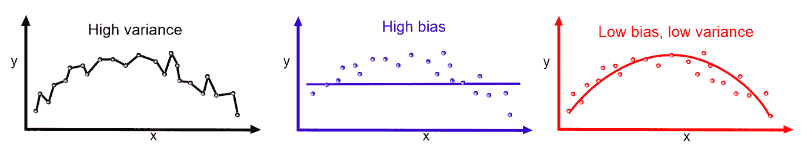

方差表示预测值和实际值之间的可变性(它们有多分散)。如果模型具有高训练误差，并且验证误差或测试误差与训练误差相同，则该模型具有高偏差。另一方面，如果模型具有低训练误差，但是具有高验证或高测试误差，则模型具有高方差。ML 模型通常在训练集上表现很好，但在测试集上表现不佳(因为高错误率)。最终，它导致了一个欠拟合模型。我们可以再次回顾一下过度拟合和欠拟合:

*   **欠拟合**:如果你的训练和验证误差相对相等并且非常高，那么你的模型很可能欠拟合你的训练数据。
*   **过度拟合**:如果你的训练误差低，而你的验证误差高，那么你的模型很可能过度拟合你的训练数据。恰到好处的模型学习得非常好，在看不见的数据上也表现得更好。

偏差-方差权衡:高偏差和高方差问题通常被称为偏差-方差权衡，因为一个模型不能同时太复杂或太简单。理想情况下，我们努力寻找既有低偏差又有低方差的最佳模型。

现在我们知道了 ML 算法的基本工作原理。然而，基于问题类型和解决问题的方法，ML 任务可能是不同的；比如监督学习，无监督学习，强化学习。我们将在下一节更详细地讨论这些学习任务。

<title>ML tasks</title>  

# ML 任务

虽然每一个 ML 问题或多或少都是一个优化问题，但是解决它们的方式可以不同。事实上，学习任务可以分为三种类型:监督学习、非监督学习和强化学习。

<title>Supervised learning</title>  

# 监督学习

监督学习是最简单和最著名的自动学习任务。它基于许多预定义的示例，其中每个输入所属的类别都是已知的，如下图所示:

上图显示了监督学习的典型工作流程。一个参与者(例如，一个数据科学家或数据工程师)执行**提取**、**转换**、**和加载** ( **ETL** )以及必要的特征工程(包括特征提取、选择等等)来获得带有特征和标签的适当数据，以便将它们输入到模型中。然后，他们将数据分成训练集、开发集和测试集。训练集用于训练 ML 模型，验证集用于针对过拟合问题和正则化来验证训练，然后参与者将在测试集(即，看不见的数据)上评估模型的性能。

但是，如果性能不令人满意，参与者可以执行额外的调优，以获得基于超参数优化的最佳模型。最后，他们将在生产就绪环境中部署最佳模型。在整个生命周期中，可能会涉及许多参与者(例如，数据工程师、数据科学家或 ML 工程师)，独立或协作地执行每个步骤。监督学习环境包括分类和回归任务；分类用于预测数据点属于哪个类(离散值)。它还用于预测类属性的标签。下图概括了这些步骤:

另一方面，回归用于预测连续值，并对类属性进行数值预测。在监督学习的背景下，输入数据集所需的学习过程被随机分成三组；例如，60%用于定型集，10%用于验证集，剩下的 30%用于测试集。

<title>Unsupervised learning</title>  

# 无监督学习

如果没有给定标签，您将如何对数据集进行汇总和分组？您可能会尝试通过找到数据集的底层结构并测量统计属性(如频率分布、平均值和标准差)来回答这个问题。如果问题是你如何有效地以压缩格式表示数据，你可能会回答说你将使用一些软件来进行压缩，尽管你可能不知道该软件将如何做。下图显示了无监督学习任务的典型工作流程:

这正是无监督学习的两个主要目标，无监督学习在很大程度上是一个数据驱动的过程。我们称这种类型的学习为无监督学习，因为你将不得不处理未标记的数据。以下引文来自人工智能研究主任 Yann LeCun(来源:*预测学习*，NIPS 2016，Yann LeCun，脸书研究):

"Most human and animal learning is unsupervised learning. If intelligence was a cake, unsupervised learning would be the cake, supervised learning would be the icing on the cake, and reinforcement learning would be the cherry on the cake. We know how to make the icing and the cherry, but we don't know how to make the cake. We need to solve the unsupervised learning problem before we can even think of getting to true AI."

一些最广泛使用的无监督学习任务包括:

*   **聚类**:根据相似性(或统计属性)对数据点进行分组，例如，像 Airbnb 这样的公司经常将其公寓和房屋分组到社区中，以便客户可以更容易地浏览列出的那些
*   **降维**:压缩数据，尽可能保留数据的结构和统计特性，例如，为了建模和可视化，往往需要降低数据集的维数
*   **异常检测**:适用于多种应用，如识别信用卡欺诈检测、识别工业工程过程中的硬件故障，以及识别大规模数据集中的异常值
*   **关联规则挖掘**:常用于购物篮分析，例如询问哪些物品是经常一起购买的

<title>Reinforcement learning</title>  

# 强化学习

强化学习是一种人工智能方法，专注于通过系统与环境的交互来学习系统。在强化学习中，系统的参数根据从环境中获得的反馈进行调整，反过来，环境又对系统做出的决策提供反馈。下图显示了一个人为了到达目的地而做出的决定。让我们以你从家到工作的路线为例:

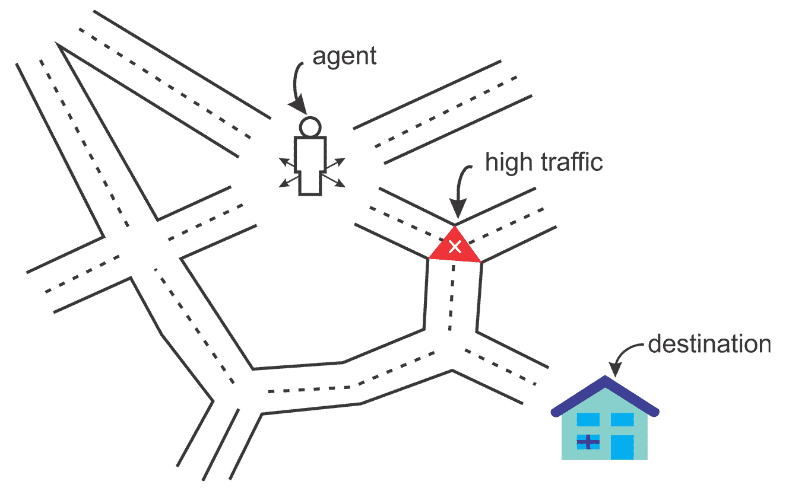

我们可以再看一个例子，用一个系统来模拟一个棋手。为了提高其性能，系统利用其先前移动的结果；这样的系统被称为强化学习系统。在这种情况下，你每天走同样的路线上班。然而，突然有一天，你感到好奇，决定尝试不同的路线，以期找到最短的路径。同样，根据你的经验和不同路线所花费的时间，你会决定你是否应该更经常地走那条特定的路线。我们可以再看一个例子，用一个系统来模拟一个棋手。

到目前为止，我们已经学习了 ML 的基本工作原理和不同的学习任务。在下一节中，我们来看一看每个学习任务以及一些示例用例。

<title>Learning types with applications</title>  

# 学习类型与应用

我们已经看到了 ML 算法的基本工作原理，并且我们已经看到了什么是基本的 ML 任务，以及它们如何制定特定领域的问题。然而，这些学习任务中的每一个都可以使用不同的算法来解决。下图对此进行了简要介绍:

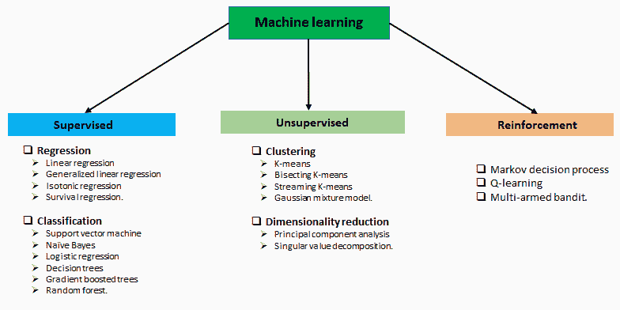

然而，上图仅列出了一些使用不同 ML 任务的用例及应用。在实践中，ML 被用在许多用例及应用中。我们将在本书中尝试涵盖其中的一些。

<title>Delving into DL</title>  

# 钻研数字图书馆

用于正常大小数据分析的简单 ML 方法不再有效，应被更稳健的 ML 方法所取代。尽管经典的 ML 技术允许研究人员识别相关变量的组或簇，但是这些方法的准确性和有效性随着大量和多维数据而降低。

<title>How did DL take ML to the next level?</title>  

# DL 是如何让 ML 更上一层楼的？

在小规模数据分析中使用的简单 ML 方法在处理大型和高维数据集时并不有效。然而，深度学习(DL)是 ML 的一个分支，它基于一组试图对数据中的高级抽象进行建模的算法，可以处理这个问题。Ian Goodfellow 在他的书《*深度学习*，麻省理工出版社，2016》中对 DL 的定义如下:

“深度学习是一种特殊的机器学习，它通过学习将世界表示为嵌套的概念层次结构，每个概念都是相对于更简单的概念定义的，而更抽象的表示是根据更抽象的概念计算的，从而实现了强大的功能和灵活性。”

与 ML 模型类似，DL 模型也接受输入`X`，并从中学习高级抽象或模式来预测输出`Y`。例如，基于过去一周的股票价格，DL 模型可以预测第二天的股票价格。当对这样的历史股票数据执行训练时，DL 模型试图最小化预测值和实际值之间的差异。通过这种方式，DL 模型试图对以前没有见过的输入进行归纳，并对测试数据进行预测。
现在，你可能想知道，如果一个 ML 模型可以做同样的任务，为什么我们需要 DL 来做这个？嗯，DL 模型往往在处理大量数据时表现良好，而旧的 ML 模型在某个点之后就停止了改进。DL 的核心概念，灵感来自大脑的结构和功能，叫做**人工神经网络** ( **ANNs** )。

作为数字逻辑的核心，人工神经网络帮助你学习输入和输出之间的联系，以便做出更可靠和准确的预测。但是，DL 不仅仅局限于 ANNs 有许多理论上的进步、软件栈和硬件改进将 DL 带给了大众。让我们看一个例子，在这个例子中，我们想要开发一个预测分析模型，例如动物识别器，我们的系统必须解决两个问题:

*   若要对图像表示猫还是狗进行分类
*   把狗和猫的图像聚集在一起。

如果我们使用典型的 ML 方法来解决第一个问题，我们必须定义面部特征(耳朵、眼睛、胡须等)并编写一个方法来确定在对特定动物进行分类时哪些特征(通常是非线性的)更重要。然而，与此同时，我们不能解决第二个问题，因为用于聚类图像的经典 ML 算法(例如 k-means)不能处理非线性特征。请看下图，它显示了一个工作流，如果给定的图像是一只猫，我们将按照该工作流进行分类:

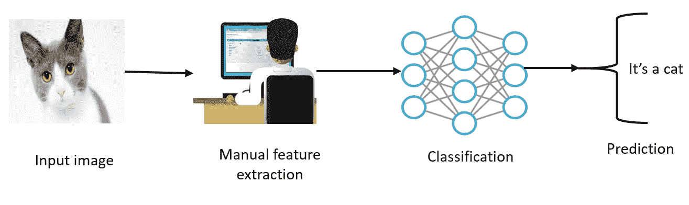

DL 算法将这两个问题更进一步，在确定哪些特征对分类或聚类最重要后，将自动提取最重要的特征。相反，当使用经典的 ML 算法时，我们必须手动提供这些特征。DL 算法需要更复杂的步骤。例如，首先，它识别在聚类猫或狗时最相关的边。然后，它会尝试分层查找形状和边缘的各种组合，这被称为 ETL。

然后，经过几次迭代，它进行复杂概念和特征的分层识别。接下来，基于所识别的特征，DL 算法将决定哪些特征对于动物分类是最重要的。这一步被称为特征提取。最后，它取出标签列，并使用**自动编码器** ( **AEs** )进行无监督训练，以提取要重新分配给 k-means 进行聚类的潜在特征。然后，**聚类分配硬化损失** ( **CAH 损失**)和重建损失被联合优化为最优聚类分配。

然而，在实践中，DL 算法被提供了原始图像表示，它看不到我们所看到的图像，因为它只知道每个像素的位置及其颜色。图像被分成不同的分析层。例如，在较低的层次上，有软件分析——由几个像素组成的网格，其任务是检测一种颜色或各种细微差别。如果它发现了什么，它就通知下一级，下一级在这一点上检查给定的颜色是否属于一个更大的形式，比如一条线。该过程继续到更高的级别，直到算法理解下图所示的内容:

虽然狗和猫是一个非常简单的分类器的例子，但能够做这些类型事情的软件现在已经很普遍，可以在识别人脸的系统中找到，或者在谷歌上搜索图像的系统中找到。这种软件是基于 DL 算法的。相比之下，如果我们使用线性 ML 算法，我们就不能构建这样的应用程序，因为这些算法不能处理非线性图像特征。

此外，使用 ML 方法，我们通常只处理几个超参数。然而，当神经网络被纳入其中时，事情就变得太复杂了。在每一层中，都有数百万甚至数十亿个超参数需要调整——数量如此之多，以至于成本函数变得非凸。另一个原因是隐藏层中使用的激活函数是非线性的，因此成本是非凸的。我们将在后面的章节中更详细地讨论这种现象，但是让我们快速地看一下 ann。

<title>Artificial neural networks</title>  

# 人工神经网络

人工神经网络受人类大脑工作方式的启发，构成了 DL 及其真正实现的核心。没有人工神经网络，今天围绕数字图书馆的变革是不可能的。因此，为了理解 DL，我们需要理解神经网络是如何工作的。

<title>ANN and the human brain</title>  

# 安和人类大脑

ann 代表了人类神经系统的一个方面，以及神经系统是如何由许多使用轴突相互通信的神经元组成的。感受器接收来自内部或外部世界的刺激。然后，它们将这些信息传递给生物神经元进行进一步处理。除了称为轴突的另一个长延伸外，还有许多树突。在轴突的末端，有称为突触末端的微小结构，用于将一个神经元连接到其他神经元的树突。生物神经元从其他神经元接收被称为信号的短电脉冲，作为响应，它们触发自己的信号。

因此，我们可以总结出，神经元包括一个细胞体(也称为**细胞体**)、一个或多个用于接收来自其他神经元的信号的树突，以及一个用于执行神经元产生的信号的轴突。当一个神经元向其他神经元发送信号时，它就处于活跃状态。然而，当它从其他神经元接收信号时，它处于非活动状态。在空闲状态下，神经元在达到某个激活阈值之前积累所有接收到的信号。这整个过程促使研究人员测试人工神经网络。

<title>A brief history of ANNs</title>  

# 人工神经网络简史

受生物神经元工作原理的启发，沃伦麦卡洛克和沃尔特皮茨在 1943 年根据神经活动的计算模型提出了第一个人工神经元模型。这个简单的生物神经元模型，也被称为**人工神经元** ( **安**)，只有一个或多个二进制(开/关)输入和一个输出。当超过一定数量的输入有效时，An 仅激活其输出。

这个例子听起来太琐碎了，但是即使有这样一个简化的模型，也有可能建立一个 ANs 网络。然而，这些网络也可以组合起来计算复杂的逻辑表达式。这个简化的模型启发了约翰·冯·诺依曼、马文·明斯基、弗兰克·罗森布拉特和其他许多人，他们在 1957 年提出了另一个叫做**感知器的模型。感知器是我们在过去 60 年中见过的最简单的人工神经网络架构之一。它基于一个稍微不同的 AN，称为**线性阈值单元** ( **LTU** )。唯一的区别是输入和输出现在是数字，而不是二进制开/关值。每个输入连接都与一个权重相关联。LTU 计算其输入的加权和，然后将阶跃函数(类似于激活函数的作用)应用于该和，并输出结果。**

感知器的一个缺点是它的决策边界是线性的。因此，他们无法学习复杂的模式。他们也无力解决一些简单的问题，比如**异或** ( **异或**)。然而，后来，通过堆叠多个感知机，称为 **MLP** ，感知机的局限性在某种程度上被消除了。因此，在人工神经网络和 DL 中最重要的进展可以用下面的时间表来描述。我们已经分别在 1943 年和 1958 年讨论了人工神经元和感知器是如何提供基础的。1969 年，Marvin *Minsky* 和 Seymour *Papert* 将 XOR 公式化为线性不可分问题，后来在 1974 年，Paul *Werbos* 演示了用于训练感知器的反向传播算法。

然而，最重大的进步发生在 1982 年，当时约翰·霍普菲尔德提出了霍普菲尔德网络。然后，神经网络和 DL 的教父之一——辛顿和他的团队——在 1985 年提出了玻尔兹曼机器。然而，1986 年 Geoffrey Hinton 成功地训练了 MLP 和约旦提出的 RNNs。同年，保罗·斯摩棱斯基也提出了玻尔兹曼机的改进版本，称为**受限玻尔兹曼机** ( **RBM** )。然后在 1990 年，Lecun 等人提出了 LeNet，这是一种深度神经网络架构。如需简要了解，请参考下图:

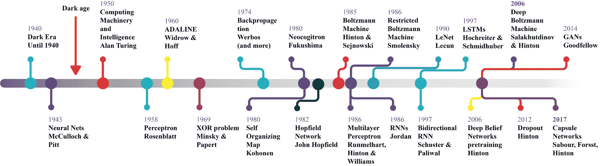

90 年代最重要的一年是 1997 年，乔丹等人提出了一个**递归神经网络** ( **RNN** )。同年，舒斯特等人提出了**长短时记忆** ( **LSTM** )的改进版本和被称为双向 RNN 的原 RNN 的改进版本。

尽管从 1997 年到 2005 年，计算机技术取得了重大进步，但我们并没有经历太多的进步。然后，在 2006 年，辛顿再次出击，他和他的团队提出了一个通过堆叠多个 RBM 的**深度信念网络**(**)。然后在 2012 年，Hinton 发明了显著改善深度神经网络中正则化和过拟合的 dropout。之后，Ian Goodfellow 等人推出了 GANs，这是图像识别领域的一个重要里程碑。2017 年，Hinton 提出了 CapsNet，以克服常规 CNN 的限制，这是迄今为止最显著的里程碑之一。我们将在本章后面讨论这些体系结构。**

**<title>How does an ANN learn?</title>  

# 安是怎么学习的？

基于生物神经元的概念，出现了人工神经网络的概念。类似于生物神经元，人工神经元由以下部分组成:

*   聚集来自神经元的信号的一个或多个传入连接
*   一个或多个输出连接，用于将信号传送到其他神经元
*   确定输出信号数值的激活函数

除了神经元的状态，突触权重也被考虑，它影响网络内的连接。每个权重都有一个数值，用*W[ij]表示，这是连接神经元 *i* 到神经元 *j* 的突触权重。现在，对于每个神经元 *i* ，一个输入
向量可以由 *x [i] = (x [1] ，x [2] 定义，...x [n] )* ，可以用 *w [i] = (w [i1] ，x [i2] ，... )* 中的 x [。现在，根据神经元的位置，权重和输出函数决定了单个神经元的行为。然后，在前向传播期间，隐藏层中的每个单元得到以下信号:]*

然而，在这些砝码中，还有一种特殊类型的砝码，称为偏置单元， *b* 。从技术上讲，偏置单元没有连接到任何先前的层，所以它们没有真正的活动。但是，bias *b* 值允许神经网络将激活函数向左或向右移动。考虑到偏置单元，修改后的网络输出公式如下:

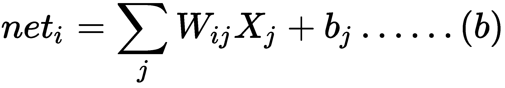

前面的等式表示每个隐藏单元得到输入的总和，乘以相应的权重——这被称为**求和点**。然后，**求和点**的合成输出通过激活函数，该函数抑制输出，如下图所示:

然而，实际的神经网络体系结构由输入层、隐藏层和输出层组成，这些层由构成网络结构的节点组成。它仍然遵循人工神经元模型的工作原理，如上图所示。输入图层仅接受数字数据，例如实数形式的要素和具有像素值的图像。下图显示了基于具有 784 个要素的数据来解决多类分类(即 10 个类)问题的神经网络体系结构:

具有一个输入层、三个隐藏层和一个输出层的神经网络

在这里，隐藏层执行大部分计算来学习模式，网络使用一种称为损失函数的特殊数学函数来评估其预测与实际输出相比的准确性。它可以是复杂的误差，也可以是非常简单的均方误差，定义如下:

在上式中，是网络做出的预测，而 *Y* 代表实际或预期输出。最后，当误差不再减小时，神经网络收敛并通过输出层进行预测。

<title>Training a neural network</title>  

# 训练神经网络

神经网络的学习过程被配置为权重优化的迭代过程。权重在每个时期被更新。一旦训练开始，目标是通过最小化损失函数来生成预测。然后在测试集上评估网络的性能。我们已经知道了人工神经元的简单概念。然而，仅仅产生一些人工信号不足以学习一项复杂的任务。因此，一种常用的监督学习算法是反向传播算法，它经常用于训练复杂的人工神经网络。

最终，训练这样的神经网络也是一个优化问题，其中我们试图通过迭代调整网络权重和偏差来最小化误差，通过**梯度下降** ( **GD** )使用反向传播。这种方法迫使网络回溯其所有层，以在损失函数的相反方向上更新节点间的权重和偏差。

然而，这个使用 GD 的过程并不能保证达到全局最小值。隐藏单元的存在和输出函数的非线性意味着误差的行为非常复杂并且具有许多局部最小值。该反向传播步骤通常使用许多训练批次执行数千次或数百万次，直到模型参数收敛到最小化成本函数的值。当验证集上的误差开始增加时，训练过程结束，因为这可能标志着过度拟合阶段的开始:

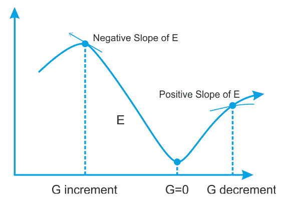

寻找误差函数 E 的最小值，我们沿着 E 的梯度 G 最小的方向移动

使用 GD 的缺点是收敛时间太长，无法满足处理大规模训练数据的需求。因此，提出了一种更快的 GD，称为**随机梯度下降** ( **SGD** )，这也是 DNN 训练中广泛使用的优化器。在 SGD 中，我们每次迭代只使用来自训练集的一个训练样本来更新网络参数，这是真实成本梯度的随机近似。

There are other advanced optimizers nowadays such as Adam, RMSProp, ADAGrad, and Momentum. Each of them is either a direct or indirect optimized version of SGD.<title>Weight and bias initialization</title>  

# 权重和偏差初始化

现在，这里有一个棘手的问题:我们如何初始化权重？好吧，如果我们将所有的权重初始化为相同的值(例如 0 或 1)，那么每个隐藏的神经元都会得到相同的信号。让我们试着分解一下:

*   如果所有权重都初始化为 1，则每个单元得到的信号等于输入之和。
*   如果所有的权重都是 0，这就更糟糕了，那么隐藏层中的每个神经元都会得到零信号。

对于网络权值初始化，Xavier 初始化被广泛使用。它类似于随机初始化，但通常效果更好，因为它可以根据默认输入和输出神经元的总数来确定初始化的速率。你可能想知道在训练一个常规的 DNN 时是否能摆脱随机初始化。

嗯，最近，一些研究人员一直在谈论随机正交矩阵初始化，它比任何用于训练 DNNs 的随机初始化都表现得更好。当初始化偏差时，我们可以将它们初始化为零。但是将偏置设置为小的恒定值，例如对于所有偏置为 0.01，确保所有的**整流线性单元** ( **ReLU** )可以传播梯度。然而，它既不表现良好，也没有显示出持续的改善。所以建议坚持用零。

<title>Activation functions</title>  

# 激活功能

为了允许神经网络学习复杂的决策边界，我们对它的一些层应用非线性激活函数。常用的函数包括 Tanh、ReLU、softmax 及其变体。更专业地说，每个神经元接收突触权重的加权和信号以及作为输入连接的神经元的激活值。为此目的最广泛使用的函数之一是所谓的 sigmoid 逻辑函数，其定义如下:

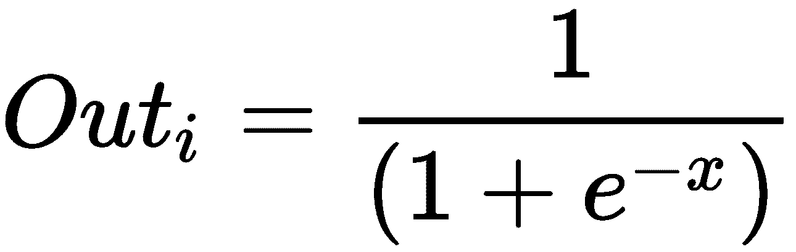

该函数的定义域包括所有实数，共定义域为(0，1)。这意味着从神经元输出的任何值(根据其激活状态的计算)将总是在 0 和 1 之间。如下图所示的【The Sigmoid 函数提供了对神经元饱和率的解释，从不活动(等于 0)到完全饱和，这发生在预定的最大值(等于 1)处:

乙状结肠与双曲正切活化函数

另一方面，双曲正切，或 **Tanh** ，是激活函数的另一种形式。 **Tanh** 拉平 **-1** 和 **1** 之间的一个实数值。上图显示了 **Tanh** 和 **Sigmoid** 激活功能之间的差异。具体来说，从数学上讲，tanh 激活函数可以表示如下:

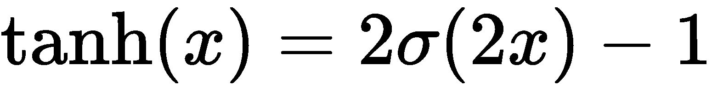

通常，在**前馈神经网络** ( **FFNN** )的最后一级中，softmax 函数被用作判定边界。这是一种常见的情况，尤其是在解决分类问题时。softmax 函数用于多类别分类问题中可能类别的概率分布。总之，选择合适的激活函数和网络权重初始化是使网络发挥最佳性能并帮助获得良好训练的两个问题。现在我们知道了神经网络的简史，让我们在下一节深入研究不同的架构，这将让我们对它们的用法有一个概念。

神经网络架构

到目前为止，已经提出了许多神经网络结构并且正在使用中。然而，它们或多或少都是基于一些核心神经网络架构。我们可以将 DL 架构分为四类:

<title>Neural network architectures</title>  

# 深度神经网络

卷积神经网络

*   递归神经网络
*   新兴建筑
*   然而，DNNs、CNN 和 RNNs 有许多改进的变体。虽然大多数变体是为解决特定领域的研究问题而提出或开发的，但基本工作原理仍然遵循最初的 DNN、CNN 和 RNN 架构。以下小节将向您简要介绍这些架构。
*   深度神经网络

dnn 是一种神经网络，具有复杂和更深层次的架构，每层都有大量的神经元，神经元之间有许多连接。虽然 DNN 提到了非常深的网络，但为了简单起见，我们将 MLP、**堆栈自动编码器** ( **SAE** )和**深度信念网络** ( **DBNs** )视为 DNN 架构。这些架构大多作为 FFNN 工作，意味着信息从输入层传播到输出层。

<title>Deep neural networks</title>  

# 多个感知器堆叠在一起成为多层感知器，其中各层连接成一个有向图。基本上，MLP 是最简单的 FFNNs 之一，因为它有三层:输入层、隐藏层和输出层。这样，信号以一种方式传播，从输入层到隐藏层，再到输出层，如下图所示:

自动编码器和 RBM 分别是 SAE 和 dbn 的基本构件。与 MLP 不同，它是一个以监督方式训练的 FFNN，SAE 和 DBNs 都是分两个阶段训练的:无监督的预训练和有监督的微调。在无监督的预训练中，层按顺序堆叠，并使用未标记的数据以逐层的方式进行训练。

在监督微调中，输出分类器层被堆叠，并且通过用标记数据进行再训练来优化完整的神经网络。MLP 的一个问题是它经常过度拟合数据，所以它不能很好地概括。为了克服这个问题，Hinton 等人提出了 DBN，它使用一种贪婪的逐层预训练算法。DBNs 由一个可见层和多个隐藏单元层组成。DBN 的构造块是 RBM，如下图所示，其中几个 RBM 一个接一个地堆叠在一起:

最上面的两层之间有无向对称连接，但是下面的两层有来自前一层的有向连接。尽管取得了许多成功，dbn 现在正被 AEs 所取代。

自动编码器

AEs 也是从输入数据中自动学习的特殊类型的神经网络。AEs 由两部分组成:编码器和解码器。编码器将输入压缩成潜在空间表示。然后，解码器部分尝试从该表示中重建原始输入数据:

<title>Autoencoders</title>  

# **编码器**:使用函数 *h = f(x)* 将输入编码或压缩成潜在空间表示

**解码器**:使用被称为 *r = g(h)* 的函数从潜在空间表示中解码或重建输入

*   因此，AE 可以通过函数 *g(f(x)) = 0* 来描述，其中我们希望 0 接近于 *x* 的原始输入。下图显示了 AE 的典型工作方式:
*   

AEs 对于数据去噪和数据可视化的降维非常有用，因为它们可以比 PCA 更有效地学习称为表示的数据投影。

卷积神经网络

CNN 已经取得了很大的成就，并在计算机视觉(例如，图像识别)中被广泛采用。在 CNN 网络中，与 MLP 或 DBN 相比，连接方案有很大不同。一些卷积层以级联方式连接。每层都由一个 ReLU 层、一个池层、附加卷积层(+ReLU)和另一个池层支持，池层之后是一个全连接层和一个 softmax 层。下图是用于面部识别的 CNN 架构示意图，它将面部图像作为输入，并预测愤怒、厌恶、恐惧、快乐和悲伤等情绪:

<title>Convolutional neural networks</title>  

# 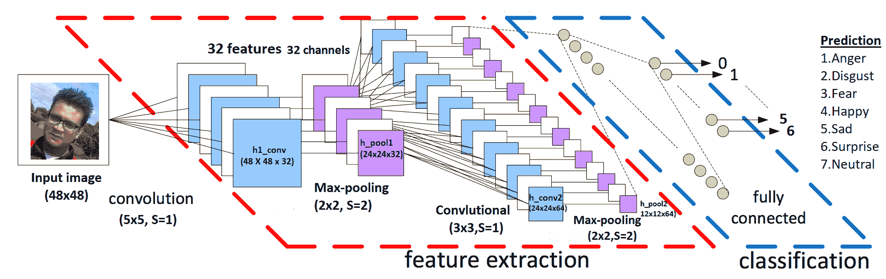

用于面部识别的 CNN 的示意性架构

重要的是，dnn 不知道像素是如何组织的，因为它们不知道附近的像素是接近的。CNN 通过在图像的小区域中使用特征地图，使用较低层来嵌入这种先验知识，而较高层将较低层的特征组合成较大的特征。

这个设置可以很好地处理大多数自然图像，给 CNN 一个决定性的领先优势。每个卷积层的输出是一组对象，称为特征图，由单个内核过滤器生成。然后，特征图可用于定义下一层的新输入。CNN 网络中的每个神经元都会产生一个输出，后面跟着一个激活阈值，这个阈值与输入成正比，不受限制。

递归神经网络

在 RNNs 中，单元之间的连接形成一个有向循环。RNN 建筑最初是由 Hochreiter 和 Schmidhuber 在 1997 年构思的。RNN 架构有标准的 MLP，加上附加的环路，因此它们可以利用 MLP 强大的非线性映射能力。它们也有某种形式的记忆。下图显示了一个非常基本的 RNN，它具有一个输入图层、两个递归图层和一个输出图层:

<title>Recurrent neural networks</title>  

# 

然而，这种基本的 RNN 受到梯度消失和爆炸问题的困扰，并且不能对长期依赖性进行建模。这些架构包括 LSTM、**门控循环单元** ( **GRUs** )、双向 LSTM 以及其他变体。因此，LSTM 和 GRU 可以克服常规递归神经网络的缺点:梯度消失/爆炸问题和长短期依赖性。

新兴建筑

还有很多其他涌现的 DL 架构被提出，比如**深度时空神经网络**(**DST-NNs**)**多维递归神经网络**(**MD-RNNs**)**卷积自动编码器** ( **CAEs** )。然而，还有一些新兴的网络，如 **CapsNets** (这是 CNN 的改进版本，旨在消除常规 CNN 的缺点)，用于图像识别的 RNN，以及用于简单图像生成的**生成对抗网络** ( **GANs** )。除此之外，用于个性化和深度强化学习的因子分解机器也在广泛使用。

<title>Emergent architectures</title>  

# 残差神经网络

由于有时会有数以百万计的超参数和其他实际方面，所以训练更深层次的神经网络真的很难。为了克服这一限制，https://arxiv.org/abs/1512.03385v1 等人提出了一个剩余学习框架，以简化比以前使用的网络更深的网络的训练。

<title>Residual neural networks</title>  

# 他们还明确地将各层重构为参考层输入的学习剩余函数，而不是学习非参考函数。这样，这些残差网络更容易优化，并且可以从显著增加的深度中获得精度。不足之处在于，简单地通过堆叠剩余块来构建网络，不可避免地限制了优化能力。为了克服这一限制，张可等人还提出使用多级残差网络([https://arxiv.org/abs/1608.02908](https://arxiv.org/abs/1608.02908))。

生成对抗网络

gan 是深度神经网络架构，由两个相互对抗的网络组成(因此得名*对抗性*)。伊恩·古德费勒等人在一篇论文中介绍了甘斯(详见 https://arxiv.org/abs/1406.2661v1)。在 GANs 中，两个主要部件是**发生器和鉴别器**:

<title>Generative adversarial networks</title>  

# 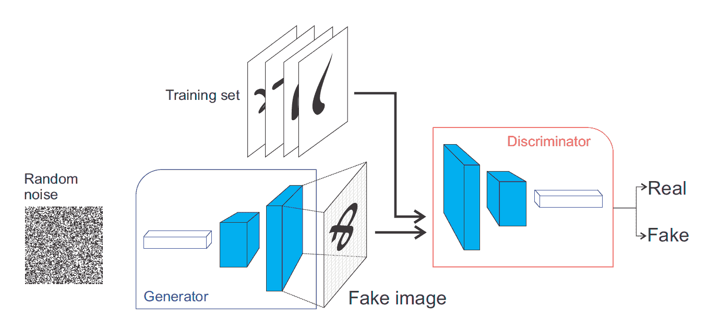

生成性对抗网络的工作原理

在 GAN 架构中，发生器和鉴别器相互对立，因此得名对立:

生成器试图从特定的概率分布中生成数据样本，并且与实际对象非常相似。

鉴别器将判断其输入是来自原始训练集还是来自生成器部分。

*   许多 DL 实践者认为 GANs 是最重要的进步之一，因为 GANs 可以用来模拟任何数据分布，并且，基于数据分布，可以教会它们创建机器人艺术家图像、超分辨率图像、文本到图像合成、音乐、语音等等。例如，由于对抗性训练的概念，脸书的人工智能研究主任 Yann LeCun 提出，在 ML 的最后 10 年中，GANs 是最有趣的想法。
*   The discriminator will judge whether its input is coming from the original training set or from the generator part.

Many DL practitioners think that GANs were one of the most important advancements because GANs can be used to mimic any distribution of data, and, based on the data distribution, they can be taught to create robot artist images, super-resolution images, text-to-image synthesis, music, speech, and more. For example, because of the concept of adversarial training, Facebook's AI research director, Yann LeCun, suggested that GANs are the most interesting idea in the last 10 years of ML.

胶囊网络

在 CNN 中，每一层通过慢感受野或最大池操作在更细粒度的水平上理解图像。如果图像有旋转、倾斜或非常不同的形状或方向，CNN 无法提取这样的空间信息，并且在图像处理任务中表现非常差。即使是 CNN 中的池操作也不能对这种位置不变性有多大帮助。通过 Geoffrey Hinton 等人题为*胶囊之间的动态路由*(详见[https://arxiv.org/abs/1710.09829](https://arxiv.org/abs/1710.09829))的论文，CNN 的这一期让我们看到了 CapsNet 的最新进展:

<title>Capsule networks</title>  

# 胶囊是一组神经元，其活动向量代表特定类型实体(如对象或对象部分)的实例化参数

与常规的 DNN 不同，在 CapsNet 中，我们不断添加层，我们的想法是在一个层中添加更多的层。这样，顶网就是一组嵌套的神经层。在 CapsNet 中，胶囊的矢量输入和输出使用物理学中使用的路由算法进行计算，该算法迭代地传输信息并处理**自洽场** ( **SCF** )过程:

上图显示了一个简单的三层顶网的示意图。DigiCaps 层中每个胶囊的活动向量的长度指示每个类的实例的存在，用于计算损失。既然我们已经了解了神经网络的工作原理和不同的神经网络架构，那么动手实现一些东西将会很棒。然而，在此之前，我们先来看看一些流行的 DL 库和框架，它们是这些网络架构的实现所附带的。

用于聚类分析的神经网络

已经提出了 k-means 的几个变体来解决高维输入空间的问题。然而，它们基本上限于线性嵌入。因此，我们不能对非线性关系建模。然而，这些方法中的微调仅基于集群分配强化损失(请参见本节后面的内容)。因此，无法实现细粒度的聚类准确性。因为聚类结果的质量取决于数据分布，所以深度架构可以帮助模型学习从数据空间到低维特征空间的映射，在该低维特征空间中，它迭代地优化聚类目标。在过去的几年中，已经提出了几种方法，试图使用深度神经网络的表示能力来预处理聚类输入。

<title>Neural networks for clustering analysis</title>  

# 一些值得注意的方法包括深度嵌入聚类、深度聚类网络、区别性增强聚类、聚类 CNN、深度嵌入网络、卷积深度嵌入聚类和图像深度表示的联合无监督学习。其他方法包括具有非参数聚类的 DL、具有特征漂移补偿的基于 CNN 的联合聚类和表示学习、学习用于聚类的神经网络中的潜在表示、使用卷积神经网络的聚类以及具有卷积自动编码器嵌入的深度聚类。

这些方法中的大多数或多或少遵循相同的原则:即，表示学习使用深度架构将输入转换为潜在表示，并将这些表示用作特定聚类方法的输入。这样的深度架构包括 MLP、CNN、DBN、GAN 和变分自动编码器。下图显示了如何使用卷积自动编码器并联合优化重建和 CAH 损耗来提高 DEC 网络的聚类性能的示例。编码器层之外的潜在空间被馈送给 K-means 用于软聚类分配。模糊的遗传变异意味着重建错误的存在:

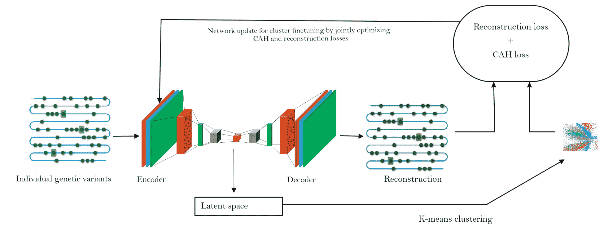

基于 DL 的聚类(来源:Karim 等人，用于基因型聚类和种族预测的递归深度嵌入网络，arXiv:1805.12218)

总之，在这些方法中，涉及三个重要步骤——使用深度架构提取集群友好的深度特征，组合集群和非集群损失，以及最后，网络更新以联合优化集群和非集群损失。

面向物联网的 DL 框架和云平台

有几种流行的 DL 框架。它们中的每一个都有一些优点和缺点。有些是基于桌面的，有些是基于云的平台，您可以在那里部署/运行您的 DL 应用程序。然而，大多数在开放许可下发布的库在人们使用图形处理器时会有所帮助，这最终会有助于加快学习过程。这样的框架和库包括 TensorFlow、PyTorch、Keras、Deeplearning4j、H2O 以及**微软认知工具包** ( **CNTK** )。甚至在几年前，包括 Theano、Caffee 和 Neon 在内的其他实现也被广泛使用。然而，这些现在都过时了。

In summary, in these approaches, there are three important steps involved—extracting cluster-friendly deep features using deep architectures, combining clustering and non-clustering losses, and, finally, network updates to optimize clustering and non-clustering losses jointly.

<title>DL frameworks and cloud platforms for IoT</title>  

# Deeplearning4j ( **DL4J** )是第一个为 Java 和 Scala 构建的商业级、开源、分布式 DL 库之一。这也为 Hadoop 和 Spark 提供了集成支持。DL4J 是为在分布式 GPU 和 CPU 上的业务环境中使用而构建的。DL4J 的目标是尖端和*即插即用*，更多的是约定而不是配置，这允许非研究人员快速原型制作。它的众多库可以与 DL4J 集成，并且将使您的 JVM 体验更容易，无论您是用 Java 还是 Scala 开发 ML 应用程序。与 JVM 的 NumPy 类似，ND4J 提供了线性代数的基本操作(矩阵创建、加法和乘法)。但是，ND4S 是一个用于
线性代数和矩阵操作的科学计算库。它还为基于 JVM 的语言提供了 n 维数组。下图显示了去年的谷歌趋势，说明了 TensorFlow 有多受欢迎:

除了这些框架，Chainer 还是一个强大、灵活、直观的 DL 框架，它支持 CUDA 计算。它只需要几行代码就可以利用 GPU。它还可以毫不费力地运行在多个 GPU 上。最重要的是，Chainer 支持各种网络架构，包括前馈网络、convnets、递归网络和递归网络。它还支持每批架构。Chainer 中一个更有趣的特性是它支持正向计算，通过它可以包含 Python 的任何控制流语句，而不缺乏反向传播的能力。它使代码直观且易于调试。

DL 框架 power scores 2018 还显示 TensorFlow、Keras、PyTorch 遥遥领先于其他框架(见[https://towardsdatascience . com/deep-learning-framework-power-scores-2018-23607 ddf 297 a](https://towardsdatascience.com/deep-learning-framework-power-scores-2018-23607ddf297a))。分数是根据 DL 框架的使用、受欢迎程度和兴趣通过以下来源计算的。除了前面提到的库之外，最近还有一些关于云中 DL 的计划。这个想法是将 DL 能力带到具有数十亿个数据点和高维数据的大数据中。例如，**亚马逊 Web 服务** ( **AWS** )、微软 Azure、谷歌云平台、**英伟达 GPU 云** ( **NGC** )都提供了原生于其公共云的机器和 DL 服务。

As well as these frameworks, Chainer is a powerful, flexible, and intuitive DL framework, which supports CUDA computation. It only requires a few lines of code to leverage a GPU. It also runs on multiple GPUs with little effort. Most importantly, Chainer supports various network architectures, including feed-forward nets, convnets, recurrent nets, and recursive nets. It also supports per-batch architectures. One more interesting feature in Chainer is that it supports forward computation, by which any control flow statements of Python can be included without lacking the ability of backpropagation. It makes code intuitive and easy to debug.

2017 年 10 月，AWS 发布了针对**亚马逊弹性计算云** ( **亚马逊 EC2** ) P3 实例的**深度学习 AMIs** ( **DLAMIs** )。这些 ami 预装了 DL 框架，如 TensorFlow、Gluon 和 Apache MXNet，这些框架针对亚马逊 EC2 P3 实例中的 NVIDIA Volta V100 GPUs 进行了优化。DL 服务目前提供三种类型的 AMI:Conda AMI、Base AMI 和带源代码的 AMI。CNTK 是 Azure 的开源 DL 服务。与 AWS 产品类似，它专注于可以帮助开发人员构建和部署 DL 应用程序的工具。Azure 还提供了一个模型库，其中包括代码样本等资源，以帮助企业开始使用该服务。

另一方面，NGC 为人工智能科学家和研究人员提供了 GPU 加速的容器(见 [https://www。英伟达。com/en-us/data-center/GPU-云计算/](https://www.nvidia.com/en-us/data-center/gpu-cloud-computing/) 。NGC 采用了容器化的 DL 框架，如 TensorFlow、PyTorch、MXNet 等，这些框架经过英伟达的调整、测试和认证，可以在参与云服务提供商的最新英伟达 GPU 上运行。然而，也有第三方服务可以通过他们各自的市场获得。

**谈到基于云的物联网系统开发市场，目前它分为三条明显的路线:**现成的平台(例如，AWS 物联网核心、Azure 物联网套件和谷歌云物联网核心)，这些平台在供应商锁定和高端批量定价与经济高效的可扩展性和更短的交付周期之间进行权衡；Linux 栈上相当完善的 MQTT 配置(例如:Eclipse Mosquitto)；以及更奇特的新兴协议和产品(例如，Nabto 的 P2P 协议),这些协议和产品正在发展足够的吸收、兴趣和社区投资，以在未来赢得强大的市场份额。

作为一个 DL 框架，Chainer 神经网络是所有基于英特尔凌动、英伟达 Jetson TX2 和 Raspberry Pi 的设备的绝佳选择。因此，使用 Chainer，我们不需要从头开始为我们的设备构建和配置 ML 框架。它为三个流行的 ML 框架提供了预构建的包，包括 TensorFlow、Apache MXNet 和 Chainer。Chainer 以类似的方式工作，它依赖于 Greengrass 上的一个库和一组使用 Amazon SageMaker 生成和/或直接存储在 Amazon S3 桶中的模型文件。从亚马逊 SageMaker 或亚马逊 S3，ML 模型可以部署到 AWS Greengrass，用作 ML 推理的本地资源。从概念上来说，AWS 物联网核心充当将 ML 推理部署到边缘的管理平面。

On the other hand, NGC empowers AI scientists and researchers with GPU-accelerated containers (see [https://www. nvidia. com/en-us/data-center/gpu-cloud-computing/](https://www.nvidia.com/en-us/data-center/gpu-cloud-computing/)). The NGC features containerized DL frameworks, such as TensorFlow, PyTorch, MXNet, and more that are tuned, tested, and certified by NVIDIA to run on the latest NVIDIA GPUs on participating cloud-service providers. Nevertheless, there are also third-party services available through their respective marketplaces.

**When it comes to cloud-based IoT system-development markets, currently it forks into three obvious routes:** off-the-shelf platforms (for example, AWS IoT Core, Azure IoT Suite, and Google Cloud IoT Core), which trade off vendor lock-in and higher-end volume pricing against cost-effective scalability and shorter lead times; reasonably well-established MQTT configurations over the Linux stack (example: Eclipse Mosquitto); and the more exotic emerging protocols and products (for example, Nabto's P2P protocol) that are developing enough uptake, interest, and community investment to stake a claim for strong market presence in the future.

As a DL framework, Chainer Neural Network is a great choice for all devices powered by Intel Atom, NVIDIA Jetson TX2, and Raspberry Pi. Therefore, using Chainer, we don't need to build and configure the ML framework for our devices from scratch. It provides prebuilt packages for three popular ML frameworks, including TensorFlow, Apache MXNet, and Chainer. Chainer works in a similar fashion, which depends on a library on the Greengrass and a set of model files generated using Amazon SageMaker and/or stored directly in an Amazon S3 bucket. From Amazon SageMaker or Amazon S3, the ML models can be deployed to AWS Greengrass to be used as a local resource for ML inference. Conceptually, AWS IoT Core functions as the managing plane for deploying ML inference to the edge.

摘要

在本章中，我们介绍了一些基本的 DL 主题。我们从对 ML 的基本但全面的介绍开始了我们的旅程。然后，我们逐渐转向 DL 和不同的神经架构。然后，我们简要概述了最重要的 DL 框架，这些框架可用于为支持物联网的设备开发基于 DL 的应用。

智能家居、智能城市和智能医疗等物联网应用严重依赖视频或图像数据处理进行决策。在下一章中，我们将讨论面向物联网应用的基于 DL 的图像处理，包括图像识别、分类和对象检测。此外，我们还将讨论物联网应用中的动手视频数据处理。

<title>Summary</title>  

# Summary

In this chapter, we introduced a number of fundamental DL themes. We started our journey with a basic, but comprehensive, introduction to ML. Then, we gradually moved on to DL and different neural architectures. We then had a brief overview of the most important DL frameworks that can be utilized to develop DL-based applications for IoT-enabled devices.

IoT applications, such as smart home, smart city, and smart healthcare, heavily rely on video or image data processing for decision making. In the next chapter, we will cover DL-based image processing for IoT applications, including image recognition, classification, and object detection. Additionally, we will cover hands-on video data processing in IoT applications.**