# 物联网图像识别

许多物联网应用，包括智能家居、智能城市和智能医疗，未来将广泛使用基于图像识别的决策(如智能门或锁的面部识别)。**机器学习** ( **ML** )和**深度学习** ( **DL** )算法对图像识别和决策有用。因此，它们在物联网应用中非常有前途。本章将介绍物联网应用中基于 DL 的图像数据处理实践。

本章的第一部分将简要描述不同的物联网应用及其基于图像检测的决策。此外，它还将简要讨论一个物联网应用及其在真实场景中基于图像检测的实现。在本章的第二部分，我们将介绍一个使用 DL 算法的应用程序的实际图像检测实现。在本章中，我们将讨论以下主题:

*   物联网应用和图像识别
*   用例一:基于图像的道路故障检测
*   用例二:基于图像的智能固体废物分离
*   实现用例
*   物联网中图像识别的迁移学习
*   细胞神经网络在物联网图像识别中的应用
*   收集数据
*   数据预处理
*   模特培训
*   评估模型


# 物联网应用和图像识别

物联网应用中的图像识别前景正在快速变化。移动处理能力、边缘计算和机器学习的显著进步为图像识别在许多物联网应用中的广泛使用铺平了道路。例如，无处不在的移动设备(这是许多物联网应用的关键组件)配备了高分辨率摄像头，便于任何人在任何地方生成图像和视频。

此外，智能摄像机，如 IP 摄像机和带摄像头的 Raspberry Pis，用于许多地方，如智能家居、校园和工厂，用于不同的应用。许多物联网应用——包括智能城市、智能家庭、智能健康、智能教育、智能工厂和智能农业——使用图像识别/分类做出决策。如下图所示，这些应用程序使用以下一种或多种图像识别服务:

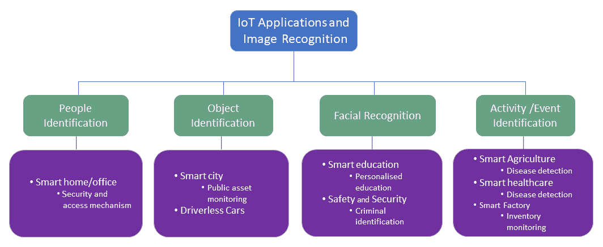

让我们详细讨论一下前面的图像:

*   **人员识别**:一般来说，安全友好地进入家庭、办公室和任何其他场所都是一项具有挑战性的任务。使用智能设备，包括物联网解决方案，可以安全友好地访问许多场所。让我们考虑一下办公室或家庭访问的例子。我们使用一把或多把钥匙进入我们的家或办公室。如果我们丢失了这些钥匙，这不仅会给我们带来不便，而且如果别人发现了它们，还会危及我们的安全。在这种情况下，基于图像识别的人员识别可以用作智能家居或办公室的无钥匙访问方法。
*   **物体识别**:基于物联网的自动化物体识别在许多领域都非常受欢迎，包括无人驾驶汽车、智能城市和智能工厂。例如，智能城市应用，如智能车辆牌照识别和车辆检测，以及城市范围内的公共资产监控，可以使用基于图像识别的对象检测服务。同样，智能工厂可以使用对象检测服务进行库存管理。
*   **面部识别**:基于图像处理的面部检测和识别领域变化如此之快，它很快就会成为一种商品。届时，具有生物识别功能的智能手机将成为常态。智能手机和基于物联网的面部识别可用于许多应用，如安全和安保以及智能教育。例如，在智能课堂(教育)中，可以使用人脸识别系统来识别对讲座的响应。
*   **事件检测**:很多人类疾病(如手足口)、动物疾病(如口蹄疫、家禽疾病)、植物疾病的症状都是显而易见的。这些疾病可以使用集成了基于 DL 的图像分类的物联网解决方案进行数字化检测。


# 用例一——基于图像的自动化故障检测

城市中的公共资产(如道路、公共建筑和旅游场所)是异构的，分布在城市内部。世界上大多数城市都面临着监控、故障检测和报告这些资产的挑战。例如，在许多英国城市，市民经常报告故障，但在许多情况下，报告的准确性和效率是一个问题。在智能城市中，可以监控这些资产，并通过物联网应用程序检测和报告它们的故障。例如，附着有一个或多个传感器(例如照相机或麦克风)的车辆(例如市政车辆)可以用于道路故障监控和检测。

道路是一个城市的重要资产，它有许多缺点。坑洞、颠簸和道路不平是通勤者和车辆经历的最令人沮丧的危险和异常情况。重要的是，车辆可能经常面临悬挂问题、转向不准和爆胎，这也可能导致事故。与道路故障相关的损失是巨大的。例如，仅与路面坑洼相关的损失就让英国司机每年损失 17 亿英镑。支持适当 DL 算法的物联网应用可用于自动检测这些故障，并适当报告它们。这以经济高效的方式减少了与道路故障相关的损坏数量。

实现用例一


# 如下图所示，用例的实现由三个主要元素组成:

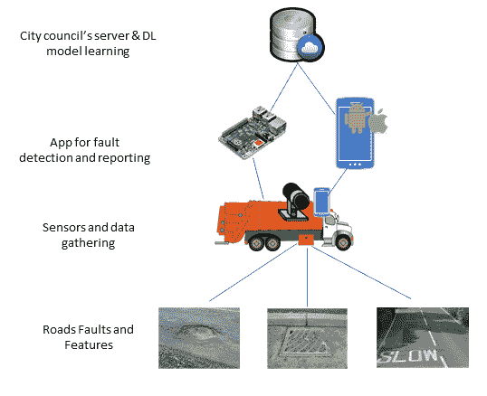

让我们详细了解一下组件:

**传感器和数据采集** : 数据采集传感器的选择取决于资产和故障类型。如果我们使用智能手机作为边缘计算设备，它的摄像头可以用于感知和收集道路故障的数据。相反，如果我们使用 Raspberry Pi 作为边缘计算设备，我们需要使用外部摄像头，因为 Raspberry Pi 中没有内置摄像头。上图显示了用于用例实现的 Raspberry Pi 和 camera。我们使用了一个带有 1 GB RAM 的 Raspberry Pi 3 型号 B+和一个带有 Omnivision OV5647 传感器的 500 万像素传感器，该传感器位于固定焦距镜头中。相机的采样或拍摄速率将取决于车辆的速度和道路故障的可用性。例如，如果智能手机摄像头或安装在车辆上的摄像头可以每秒捕捉一张照片，那么如果车辆的速度为 40 公里/小时或更低，手机或 Raspberry Pi 将能够在两秒内检测到故障。一旦图像被感测和捕获，它将被发送到检测方法。

*   **故障检测和报告** : 在此阶段，边缘计算设备将安装一个 app。智能手机或 Raspberry Pi 中安装的应用程序将加载预先训练的故障检测和分类模型。一旦车辆的智能手机或 Raspberry Pi 摄像头拍摄到照片(按照采样率)，这些模型将检测和分类潜在的故障，并向应用服务器(地方议会)报告。
*   **委员会的服务器和故障检测模型** : 委员会的服务器负责以下内容:
*   使用参考数据集学习故障检测和分类模型
    *   传播和更新边缘计算设备的模型
    *   接收并存储故障数据
    *   基于图像的模型学习和道路故障检测的验证是实现的核心。本章的第二部分(在从*开始的节中讨论)将描述先前用例的基于 DL 的异常检测的实现。所有必要的代码都可以在本章的代码文件夹中找到。*

用例二——基于图像的智能固体废物分离


# 固体废物是一个全球性的挑战。固体废物的管理成本高昂，不当的废物管理也严重影响着全球经济、公共卫生和环境。一般来说，塑料、玻璃瓶和纸张等固体废物是可回收的，它们需要一种有效的回收方法来实现经济和环境效益。然而，在大多数国家，现有的回收过程是手工完成的。此外，市民或消费者经常对回收方法感到困惑。

在这种背景下，物联网在机器学习和深度学习，特别是基于图像的物体识别的支持下，可以识别废物的类型，并帮助进行相应的分类，而无需任何人工干预。

实现用例二


# 基于图像的智能固体废物分类的实现包括两个关键部分:

带有独立腔室的垃圾箱，每个腔室带有可控制的盖子，用于存放各种类型的固体废物

*   具有用于图像识别的 DL 模型的物联网基础设施
*   该实现的第一个组件不在本书的讨论范围内，我们认为该组件可用于该实现。如下图所示，该用例的物联网实现包括两个主要元素:

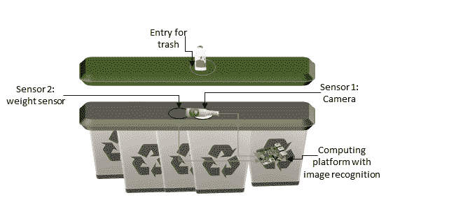

**传感器和数据采集**:数据采集传感器的选择取决于固体废物的种类及其特性。例如，许多玻璃和塑料瓶在颜色和外观上非常相似。然而，它们的重量通常明显不同。对于用例，我们考虑两个传感器:

*   一个或多个摄像机，用于在垃圾通过入口点进入垃圾箱时捕捉垃圾的图像
    *   获取垃圾重量的重量传感器
    *   我们使用 Raspberry Pi 作为计算平台。该用例使用具有 1 GB RAM 的 Raspberry Pi 3 型号 B+和具有 Omnivision OV5647 传感器的 500 万像素传感器在定焦镜头中进行测试。一旦图像和重量被感测和捕获，它们就被发送到分拣方法。

**垃圾检测和分类**:这是实现的关键要素。Raspberry Pi 将使用 DL 加载一个预训练的垃圾检测和分类模型。一旦检测算法检测到垃圾并对其进行分类，它将启动控制系统打开适当的盖子并将其移入垃圾箱。

*   用例场景关注城市公共区域的废物管理，包括公园、旅游景点、景观和其他娱乐区域。通常，这些地区的市民和/或游客会自行处理他们的垃圾。重要的是，他们处理的物品数量很少，从一件到几件都有。

以下所有部分将描述上述用例所需的基于 DL 的图像识别的实现。所有必要的代码都可以在本章的代码文件夹中找到。

物联网中图像识别的迁移学习


# 一般来说，迁移学习是指将预先训练好的机器学习模型表示转移到另一个问题上。近年来，这正在成为将 DL 模型应用于问题的流行手段，特别是在图像处理和识别中，因为它能够用相对较少的数据训练 DL 模型。

下图显示了两种模型:

标准 DL 模型的体系结构(a)

*   迁移学习 DL 模型的体系结构(b):
*   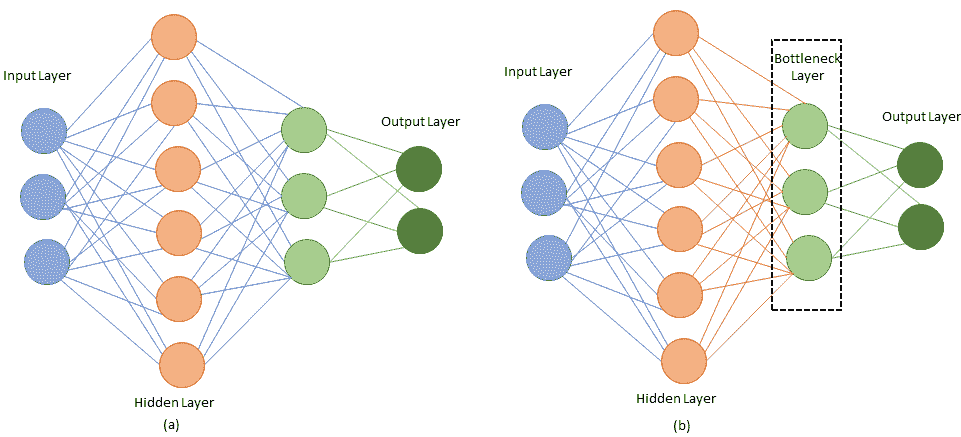

如标准 DL 模型的架构图所示，一个经过充分训练的神经网络在初始层获取输入值，然后通过必要的转换将该信息顺序向前馈送，直到倒数第二层(也称为**瓶颈层**)构建了一个更容易转换为最终输出的输入的高级表示。模型的完整训练包括在每个连接中使用的权重和偏差项的优化(用蓝色标记)。在大型异构数据集中，这些权重和偏差项的数量可能高达数百万。

在迁移学习中，我们可以使用早期和中间层，只对后面的层进行重新训练。一种流行的转移学习方法是对除最后一层之外的整个网络重新使用预训练的权重，并通过使用新数据集重新训练网络来重新学习最后一层或分类部分的权重。如迁移学习 DL 模型的架构图所示，我们重新使用橙色连接，并使用新数据集重新训练网络，以学习最后一层的绿色连接。

In transfer learning, we can use the early and middle layers and only re-train the latter layers. One popular approach to transfer learning is to reuse the pre-trained weights for the whole network other than the last layer and relearn the weights of the last layer or classification part by retraining the network using the new dataset. As shown in the diagram of an architecture for a transfer-learning DL model, we reused the orange connections and retrained the network using the new dataset to learn the last layer’s green connections.

许多预先训练的 DL 模型，包括 Inception-v3 和 MobileNets 模型，可用于迁移学习。为 ImageNet *大型视觉识别挑战赛*训练的 Inception-v3 模型将图像分为 1000 类，如*斑马*、*大麦町*和*洗碗机*。Inception-v3 由两部分组成:

具有卷积神经网络的特征提取部分，其从输入中提取特征

*   具有全连接图层和 softmax 图层的分类部分，根据第一部分中确定的要素对输入数据进行分类
*   如果我们想要使用 Inception-v3，我们可以重用特征提取部分，并用我们的数据集重新训练分类部分。

迁移学习有两个好处:

对新数据的训练更快。

*   用较少的训练数据解决问题的能力，而不是从零开始学习。
*   迁移学习的这些特征对于在物联网的资源受限的边缘设备中实现 DL 模型特别有用，因为我们不需要训练资源饥渴的特征提取部分。因此，可以使用较少的计算资源和时间来训练该模型。

细胞神经网络在物联网图像识别中的应用


# 一个**卷积神经网络** ( **CNN** )有不同的实现。 **AlexNet** 就是这样一个实现，它赢得了 ImageNet 挑战赛:ILSVRC 2012。从那以后，CNN 在计算机视觉和图像检测和分类中变得无处不在。直到 2017 年 4 月，总的趋势是制作更深更复杂的网络，以实现更高的精度。然而，这些更深更复杂的网络提高了准确性，但并不总是使网络更有效，特别是在规模和速度方面。在许多现实世界的应用中，特别是在物联网应用中，例如自动驾驶汽车和病人监护，识别任务需要在资源受限(处理、存储)的平台上及时完成。

A **Convolutional Neural Network** (**CNN**) has different implementations. **AlexNet** is one such implementation, and it won the ImageNet Challenge: ILSVRC 2012\. Since then, CNNs have become omnipresent in computer vision and image detection and classification. Until April 2017, the general trend was to make deeper and more complicated networks to achieve higher accuracy. However, these deeper and complex networks offered improved accuracy but did not always make the networks more efficient, particularly in terms of size and speed. In many real-world applications, especially in IoT applications, such as a self-driving car and patient monitoring, recognition tasks need to be accomplished in a timely fashion on a resource-constrained (processing, memory) platform.

在此背景下，2017 年 4 月推出了 MobileNet V1。这个版本的 Mobilenet 是对其 2018 年 4 月的第二个版本(MobileNetV2)的改进。 **Mobilenets** 及其变种是高效的 CNN DL 模型的物联网应用，尤其是基于图像识别的物联网应用。在下面的段落中，我们将简要介绍 MobileNets。

MobileNets 是最流行和最广泛使用的 DL 模型的实现，即 CNN。它们是专门为资源受限的移动设备设计的，以支持分类、检测和预测。安装了 DL 机型的个人移动设备(包括智能手机、可穿戴设备和智能手表)改善了用户体验，提供了随时随地的访问，以及安全性、隐私和能耗方面的额外优势。重要的是，移动设备中新出现的应用将需要更高效的神经网络来与现实世界实时交互。

下图显示了标准卷积滤波器(图 a)如何被 Mobilenet V1 中的两层所取代。它使用深度方向卷积(图 b)和点方向卷积(图 c)来构建深度方向可分离滤波器:

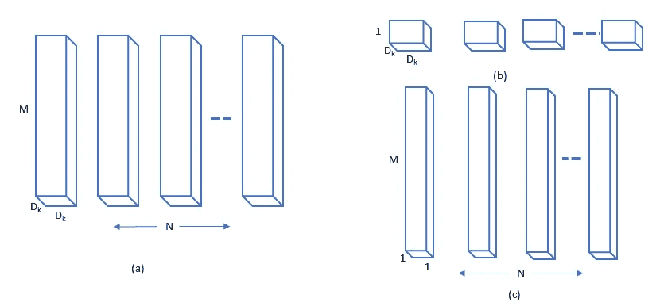

MobileNet V1 的主要动机是卷积层的计算成本很高，它们可以被所谓的**深度方向可分离卷积**所取代。在 MobileNet V1 中，深度方向卷积过程对每个输入通道使用单个滤波器，然后点方向卷积对早期深度方向卷积的输出使用 1 x 1 卷积过程。如标准卷积滤波器图所示，标准卷积在一个步骤中将输入滤波并组合成一组新的输出。与标准 CNN 不同，MobileNets 中的深度方向可分离卷积(因式分解)将其分为两层(如 Mobilenet V1 图所示):一层用于过滤，另一层用于合并。

下图显示了 V1 Mobilenet 的分解架构。这种因子分解大大减少了计算量和模型大小，因为模型需要计算的参数数量要少得多。例如，V1 移动网络需要计算 420 万个参数，而全卷积网络需要计算 2930 万个参数:

V2 移动网是 V1 移动网的更新和显著改进版本。它极大地改进和推动了现有的移动视觉识别，包括分类、检测和语义分割。像 MobileNet V1 一样，MobileNet V2 是作为 TensorFlow-Slim 图像分类库的一部分发布的。如果需要的话，你可以在谷歌的合作实验室中探索这一点。此外，移动网络 V2 在 TF-Hub 上作为模块提供，预训练的检查点或保存的模型可以在[https://github . com/tensor flow/models/tree/master/research/slim/nets/MobileNet](https://github.com/tensorflow/models/tree/master/research/slim/nets/mobilenet)[找到，可以作为迁移学习使用。](https://github.com/tensorflow/models/tree/master/research/slim/nets/mobilenet)

下图显示了 MobileNet V2 的简单架构。V2 移动网络是 V1 移动网络的延伸。它使用深度方向可分离卷积作为有效的构建模块。此外，MobileNet V2 在架构中包括两个新功能。一个是各层之间的线性瓶颈，另一个是瓶颈之间的快捷连接:

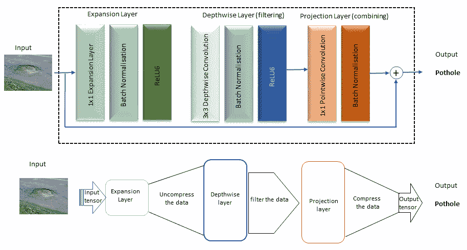

为用例一收集数据

我们可以使用智能手机摄像头或 Raspberry Pi 摄像头收集数据，并自己准备数据集，或者从互联网上下载现有图像(即通过 Google、Bing 等)并准备数据集。或者，我们可以使用现有的开源数据集。对于用例一，我们使用了两者的组合。我们已经从下载了一个关于坑洞图像(最常见的道路故障之一)的现有数据集，并用来自 Google images 的更多图像更新了该数据集。用于坑洞识别的开源数据集(`PotDataset`)由英国克兰菲尔德大学发布。数据集包括坑洞对象和非坑洞对象的图像，包括检修孔、人行道、道路标记和阴影。这些图像被手动注释并组织到以下文件夹中:

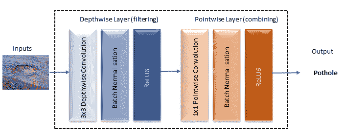

人孔

人行道

坑洞

道路标记

阴影


# 探索用例一中的数据集

在对数据应用 DL 算法之前，研究数据集是非常重要的。为了进行探索，我们可以对数据集运行`image_explorer.py`,如下所示:

*   下图显示了数据浏览过程的快照:
*   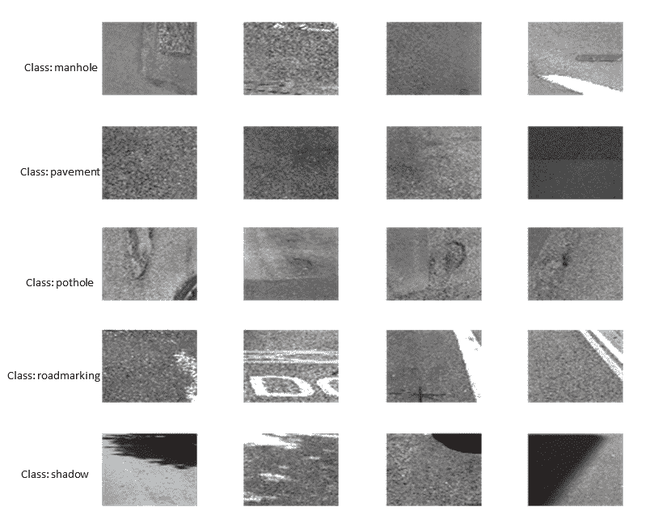
*   如数据探索图所示，如果我们只使用智能手机摄像头，坑洞和非坑洞物体之间的差异并不总是很明显。红外和智能手机摄像头的结合可以改善这种情况。此外，我们发现我们在此使用的坑洞图像可能不足以覆盖大范围的坑洞，例如:
*   所用数据集中的许多图像显示坑洼已经得到维护/修复。
*   在使用的数据集中有一些大型坑洞的图像。


# 在这种情况下，我们决定通过从互联网上收集更多的图像来更新坑洞图像数据集。接下来，我们简要讨论一下数据收集过程:

**搜索** : 使用任意浏览器(我们用的是 Chrome)，上谷歌，在谷歌图片中搜索*坑爹图片*。您的搜索窗口将如下图所示:

```
python image_explorer.py datset_original
```

您可以通过点击*工具*选择无版权图像，并将使用权更改为*，标记为修改后重复使用。*

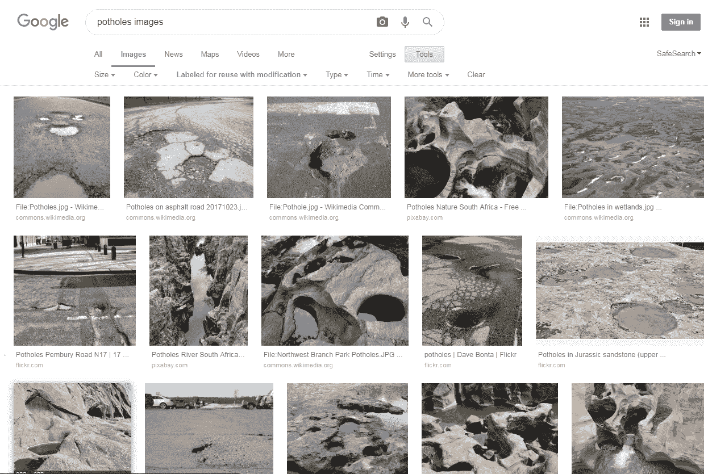

**收集图片 URL**:这一步使用几行 JavaScript 代码来收集图片 URL。可以在 Python 中使用收集的 URL 来下载图像。如以下截图所示，通过点击**查看** | **开发者** | **JavaScript 控制台**(在 macOS 中)选择 JavaScript 控制台(假设你使用 Chrome web 浏览器，但也可以使用 Firefox)，并自定义和控制 **Google Chrome** | **更多工具** | **开发者工具**(在 Windows OS 中):

*   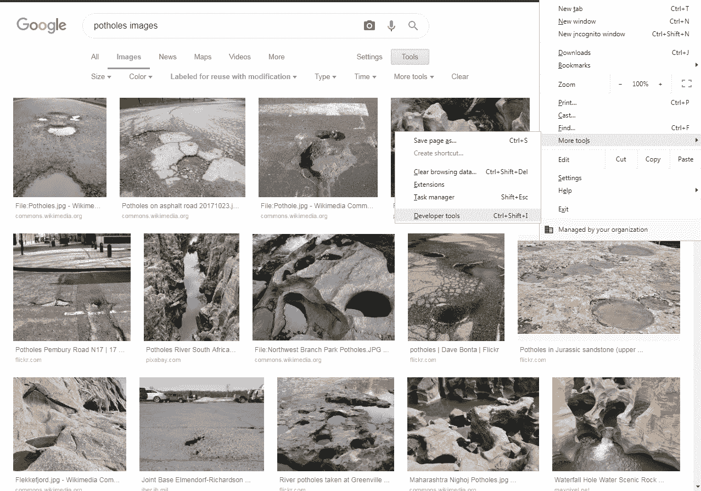
*   There are a few images of a large-sized pothole in the used dataset.

In this context, we decided to update the pothole images dataset by collecting more images from the internet. Next, we briefly discuss the data collection process:

1.  选择 JavaScript 控制台后，您将看到一个浏览器窗口，如下图所示，这将使您能够以类似 REPL 的方式执行 JavaScript:

现在按顺序执行以下操作:

向下滚动页面，直到找到所有对数据集有用的图像(注意:请使用不受版权保护的图像)。之后，您需要收集所选图像的 URL。

2.  现在转到 JavaScript 控制台，然后将以下 JavaScript 代码复制并粘贴到控制台中:


前面的代码行将提取 jQuery JavaScript 库。现在，您可以使用 CSS 选择器通过以下代码行收集 URL 列表:

最后，使用以下代码行将 URL 写入文件(每行一个):

一旦执行了前面几行代码，在默认下载目录中就会有一个名为`imageurls.txt`的文件。如果你想把它们下载到一个特定的文件夹中，那么在前面的代码中写下`hiddenComponents.download = 'your fooler/imageurls.txt`而不是`hiddenComponents.download = 'imageurls.txt'`。

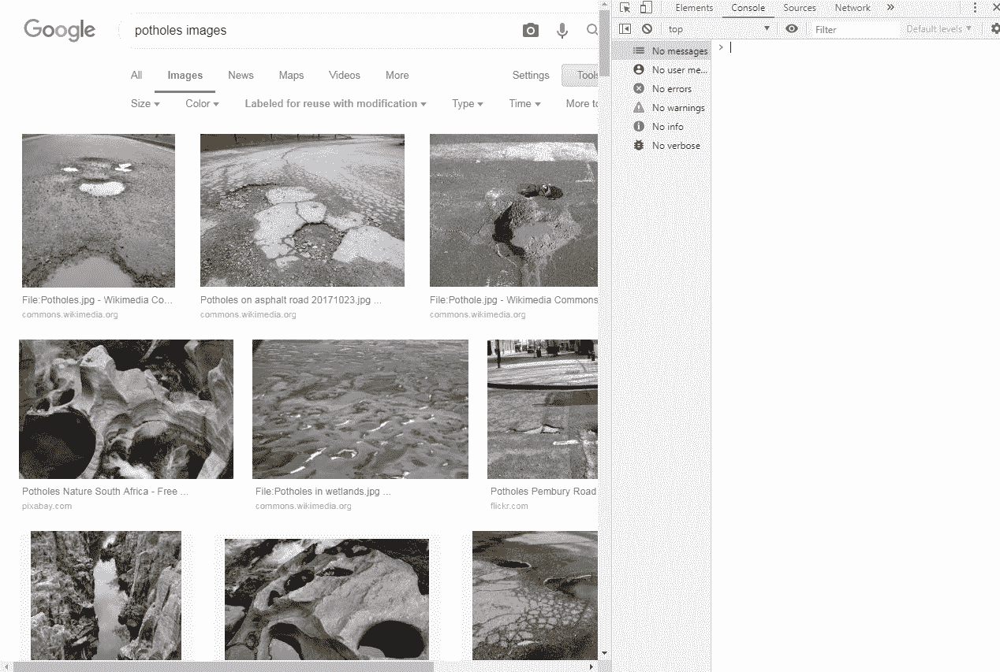

3.  **下载图片**:现在你已经可以下载之前下载的`imageurls.txt`中的运行图片`download_images.py`(在本章的代码文件夹中)；
    *   **浏览**:一旦我们下载了图片，我们需要浏览它们以便删除不相关的图片。我们可以通过一些手工检查来做到这一点。之后，我们需要调整它们的大小并将其转换为灰度图像，以匹配之前下载的数据集:
    *   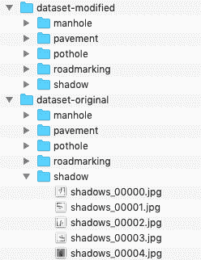

```
// Get the jquery into the JavaScript console
var scriptJs = document.createElement('scriptJs');
scriptJs.src = "https://ajax.googleapis.com/ajax/libs/jquery/2.2.0/jquery.min.js";
document.getElementsByTagName('head')[0].appendChild(scriptJs)
```

4.  前面的屏幕截图显示了坑洞和非坑洞图像数据集的文件夹结构。
    *   The preceding line of code will pull the jQuery JavaScript library.  Now you can use a CSS selector to collect a list of URLs using the following lines of code:

```
// Collect the selected URLs
var urls_images = $('.rg_di .rg_meta').map(function() { return JSON.parse($(this).text()).ou; });
```

4.  为用例二收集数据

```
// write the URls to a file 
var text_url_Save = urls_images.toArray().join('\n');
var hiddenComponents = document.createElement('a');
hiddenComponents.href = 'data:attachment/text,' + encodeURI(text_url_Save);
hiddenComponents.target = '_blank';
hiddenComponents.download = 'imageurls.txt';
hiddenComponents.click();
```

与用例一的情况一样，我们可以通过数码相机或使用现有的开源软件或两者的结合来收集数据。我们使用现有的开源数据集来实现排序算法。数据集是从美国的城市环境中收集的。由于固体废物类型可能因国家而异，因此最好根据用例将用于的国家来更新数据集。数据集由六种固体废物组成:玻璃、纸张、纸板、塑料、金属和垃圾。该数据集由 2，527 幅图像组成，它们被注释并组织到以下文件夹中，如以下屏幕截图所示:

5.  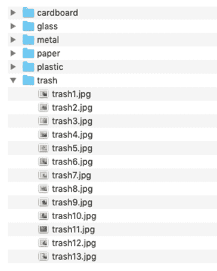

```
python download_images.py  imageurls.txt
```

6.  用例二的数据探索

下面展示了用例二的数据探索的快照。正如我们所见，玻璃和塑料图像可能会使分类算法变得混乱。在这种情况下，重量传感器数据有助于解决这一问题:

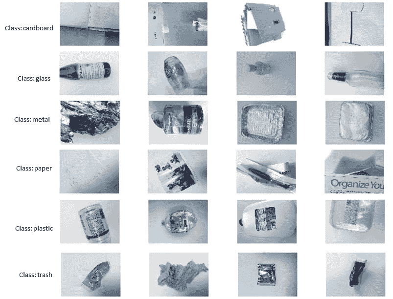


# Collecting data for use case two 

As is the case with use case one, we can collect data through digital cameras or use an existing open source or a combination of both. We are using an existing and open source dataset for the implementation of the sorting algorithm. The dataset was collected from urban environments of the USA . As solid waste types may vary by country, it is better to update the dataset based on the country the use case will be used for. The dataset consists of six types of solid wastes: glass, paper, cardboard, plastic, metal, and trash. The dataset consists of 2,527 images, and they were annotated and organized into the following folders, as shown in the  following screenshot:


# 数据预处理

这是 DL 管道的一个重要步骤。用例中使用的坑洞图像和固体废物图像的现有数据集经过预处理，可用于训练、验证和测试。如下图所示，原始图像和修改后的图像(为 pothole 类下载的附加图像)都被组织为子文件夹，每个子文件夹都以五个类别中的一个命名，并且只包含该类别中的图像。在准备训练图像集期间，有几个问题需要注意:

**数据量** : 我们需要为每个类收集至少一百张图像来训练一个工作良好的模型。我们收集的信息越多，训练模型的准确性就可能越高。所用数据集中的五个类别都有超过 1，000 个样本图像。我们还确保这些图像很好地代表了我们的应用程序在实际实现中实际面临的情况。

**数据异构** : 为训练收集的数据应该是异构的。例如，关于坑洞的图像需要在尽可能多的情况下，在不同的时间，用不同的设备拍摄。

模特培训

正如我们前面提到的，我们正在使用迁移学习，它不需要从头开始训练；在许多情况下，用新的数据集重新训练模型就足够了。我们在一台复制市议会服务器的台式电脑上重新训练了 CNN 的两个流行架构或模型，即 Incentive V3 和 Mobilenet V1。在这两个模型中，重新训练模型花费的时间不到一个小时，这是迁移学习方法的一个优势。在运行`retrain.py`文件之前，我们需要理解关键参数的列表，该文件在 code 文件夹中。如果我们输入我们的终端(在 Linux 或 macOS 中)或命令提示符(Windows) `python retrain.py -h`，我们将会看到一个如下截图所示的窗口，其中包含额外的信息(即每个参数的概述)。必选参数是图像目录，它是数据集文件夹视图上前面的图中显示的数据集目录之一:


# 在下文中，我们将给出两个命令示例:一个用于重新训练激励模型 V3，另一个用于在修改后的数据集(数据集修改)上保留 Mobilenet V1。为了重新培训激励 V3，我们没有传递架构参数值，因为它是`retrain.py`中包含的默认架构。对于其余的参数，包括训练、验证和测试之间的数据分割比率，我们使用默认值。在这个用例中，我们使用数据分割规则，将 80%的图像放入主训练集中，保留 10%单独用于训练期间的验证，最后 10%的数据作为测试集。测试集用于测试分类器的真实分类性能:

要运行 Mobilenet V1 模型的培训和验证，请使用以下命令:

*   一旦我们运行了前面的命令，它将在给定的目录中生成重新训练模型(`retrained_graph.pb`)、标签文本(`retrained_labels.txt`)以及由模型的训练和验证摘要信息组成的摘要目录。TensorBoard 可以使用具有默认值`retrain_logs`的摘要信息`(--summaries_dir`参数来可视化模型的不同方面，包括网络及其性能图。如果我们在终端或命令提示符下键入以下命令，它将运行 TensorBoard:
*   TensorBoard 运行后，将您的网络浏览器导航至`localhost:6006`查看 TensorBoard 并查看相应型号的网络。下图 **(a)** 和 **(b)** 分别显示了激励 V3 和 Mobilenet V1 的网络。该图展示了与 V1 移动网络相比，激励 V3 的复杂性:


# 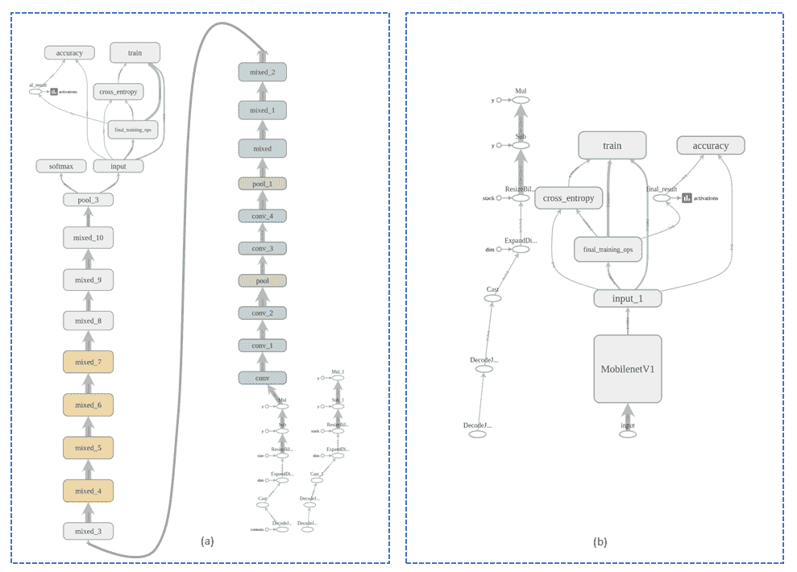

在第二个用例中，我们只在固体废物数据集上重新训练了 Mobilenet V1。如前所述，您可以通过仅提供图像或数据集目录来重新训练模型，如下所示:

评估模型

首先，我们确定了再培训模型的规模。如下面的截图所示，Mobilenet V1 仅需要 17.1 MB(对于两种用例)，这是 Incentive V3 (92.3 MB)的五分之一，并且该模型可以轻松部署在资源受限的物联网设备中，包括 Raspberry Pi 或智能手机。其次，我们评估了模型的性能。对用例进行了两个级别的性能评估:(I)在桌面 PC 平台/服务器上的再训练阶段进行了数据集范围的评估或测试，以及(ii)在 Raspberry Pi 3 环境中测试或评估了单个图像或样本(真实图像):

```
python retrain.py \
--output_graph=trained_model_incentive-modified-dataset/retrained_graph.pb \
--output_labels=trained_model_incentive-modified-dataset/retrained_labels.txt \
--image_dir=dataset-modified
```


```
python retrain.py \
--output_graph=trained_model_mobilenetv1-modified-dataset/retrained_graph.pb \
--output_labels=trained_model_mobilenetv1-modified-dataset/retrained_labels.txt \
--architecture mobilenet_1.0_224 \
--image_dir=dataset-modified
```

模型性能(用例一)

```
tensorboard --logdir retrain_logs

```

用例一的所有评估性能都呈现在下面的截图中。以下六个截图展示了激励 V3 和 Mobilenet V1 模型在两组数据上的训练、验证和测试性能。前三个截图呈现的是重新训练模型后在终端生成的结果，后三个截图是从 TensorBoard 生成的。

下面的截图展示了在原始数据集上对激励 V3 的评估结果:

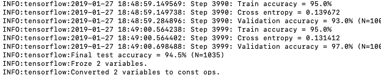

```
--image_dir=dataset-solidwaste
```


# 下面的屏幕截图显示了在修改后的数据集上对激励 V3 的评估结果:

以下截图显示了 Mobilenet V1 在原始数据集上的评估结果:

以下截图显示了 Mobilenet V1 在修改后的数据集上的评估结果:


# 

下面的截图展示了在 TensorBoard 生成的原始数据集上对 Incentive V3 的评估结果:

以下截图展示了 Mobilenet V1 在 TensorBoard 生成的原始数据集上的评估结果:

从之前所有的模型性能截图来看，很明显，训练和验证准确率都远高于 90%，这对于故障检测来说已经足够了。

下图显示了单个样本的分类或对象检测性能。对于这些，我们使用了两套不同的分类代码(可在本章的代码文件夹中找到)。

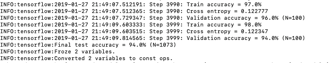

第一个屏幕截图显示了在两个样本上运行 Mobilenet V1 分类器的快照。正如我们从所有结果中可以看到的，测试或评估精度远高于 94%，并且在这样的精度下，DL 模型(CNN)具有检测物体的潜力，包括坑洞、检修孔和道路上的其他物体。然而，Pi 3 上的物体检测时间在三到五秒的范围内，如果我们想在实时检测和驱动中使用它们，需要改进这一时间。此外，结果表明，在修改后的数据集上训练的模型有很好的机会在真实环境中提供高检测或测试准确性(如前面的屏幕截图所示)，特别是在检测坑洞方面，因为这类数据通过添加来自谷歌图像的不同图像而得到了改善:

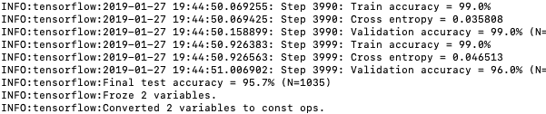

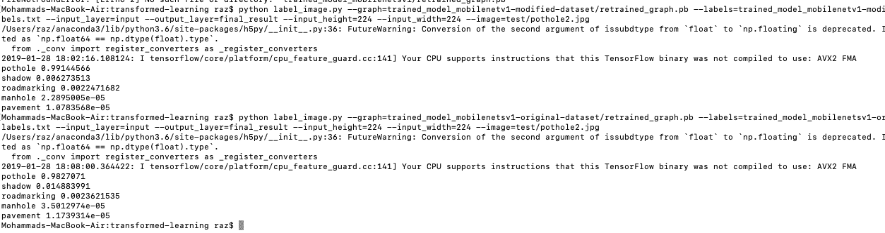

下面的截图展示了在原始数据集(Pi 3 B+)上训练的激励 V3 模型的坑洞检测的评估结果:

下图显示了在原始数据集(Pi 3 B+)上训练的激励 V3 模型的检查井检测的评估结果:

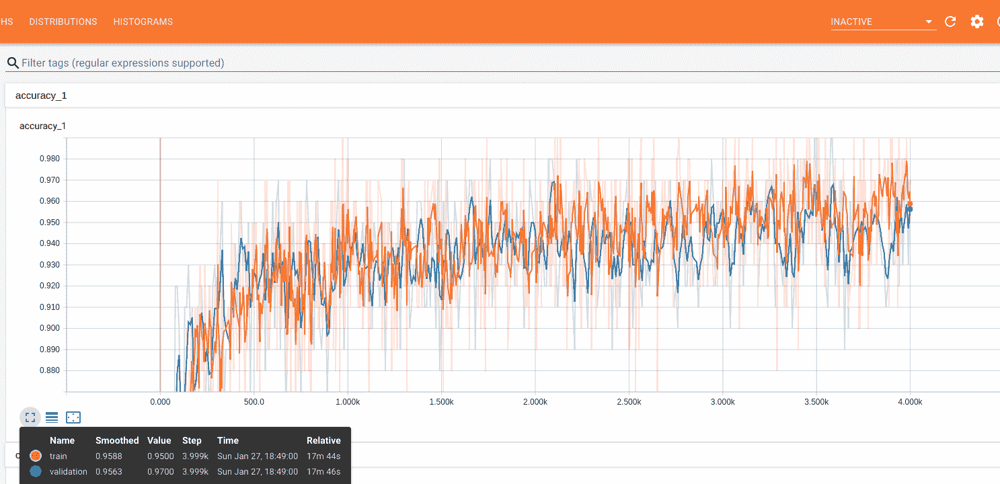

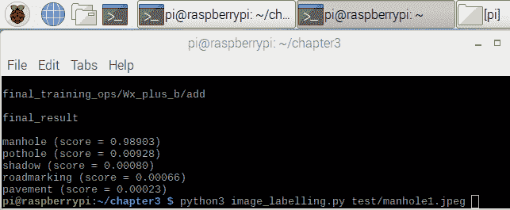

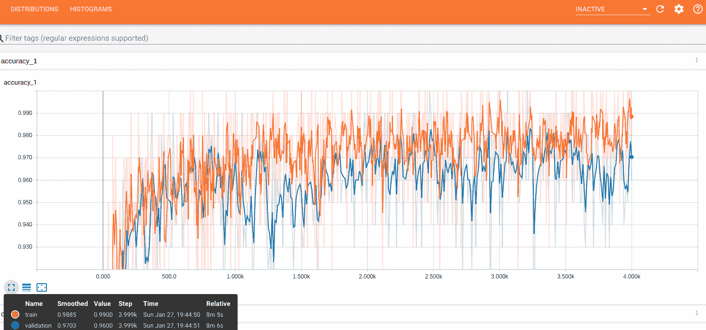

下图显示了使用在原始数据集(Pi 3 B+)上训练的 Mobilenet V1 模型进行坑洞检测的评估结果:

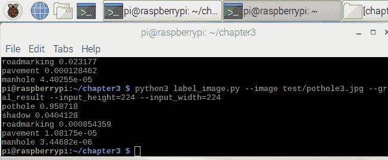

下图显示了使用在原始数据集(Pi 3 B+)上训练的 Mobilenet V1 模型进行检查井检测的评估结果:

模型性能(用例二)

用例二的所有评估性能都显示在下面的截图中。对于这个用例，我们只展示 Mobilenet V1 的结果。下图展示了 Mobilenet V1 模型在两个数据集上的训练、验证和测试性能。从下面的截图中我们可以看到，测试精度并不高(77.5%)，但对于固体废物检测和分类来说已经足够好了:


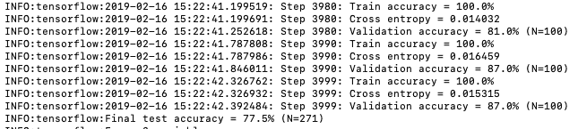

以下截图展示了 Mobilenet V1 在 TensorBoard 生成的数据集上的评测结果:

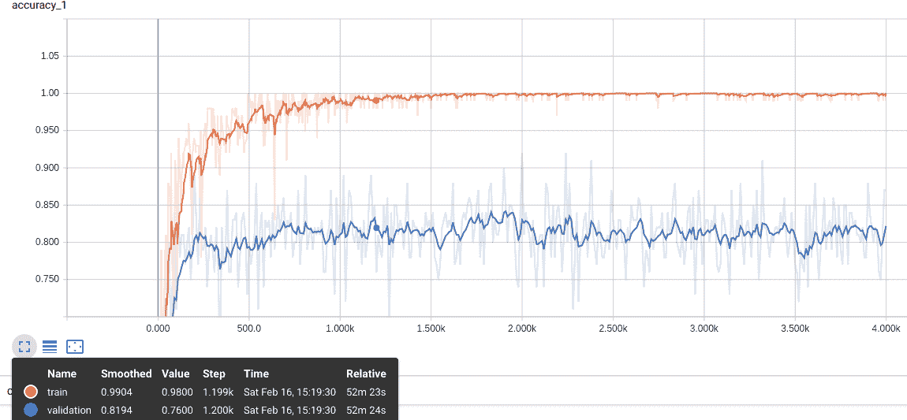

以下三个截图显示了单个样品的分类或物体(固体废物)检测性能。第一张截图呈现了玻璃检测的评测结果:

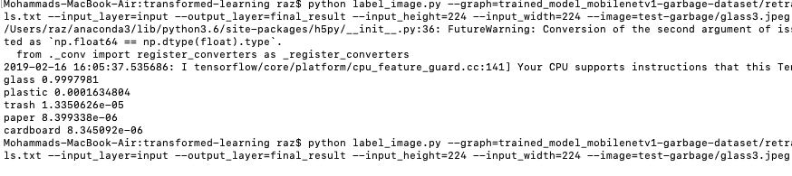

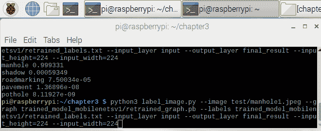

# 以下截图呈现了塑料检测的评价结果:

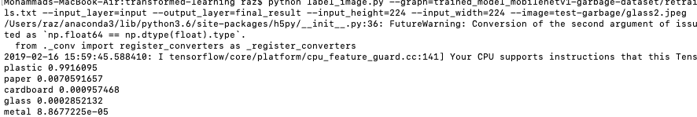

以下屏幕截图显示了使用 Mobilenet V1 进行金属检测的评估结果:

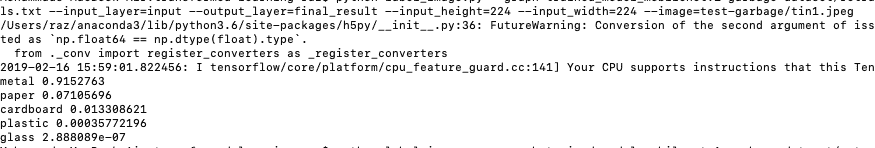

摘要

在本章的第一部分，我们简要描述了不同的物联网应用及其基于图像检测的决策。此外，我们简要讨论了两个用例:基于图像检测的道路故障检测和基于图像检测的固体废物分类。第一个应用程序可以使用智能手机摄像头或 Raspberry Pi 摄像头检测道路上的坑洼。第二个应用程序检测不同类型的固体废物，并根据智能回收进行分类。


The following screenshot presents the evaluation results of plastic detection:

在本章的第二部分，我们通过几个示例网络简要讨论了迁移学习，并检验了它在资源受限的物联网应用中的有用性。此外，我们讨论了选择 CNN 背后的基本原理，包括两个流行的实现，即 Inception V3 和 Mobilenet V1。本章的其余部分描述了 Inception V3 和 Mobilenet V1 模型的 DL 管道的所有必要组件。

在许多物联网应用中，图像识别本身可能不足以检测物体和/或主体。在这种情况下，有时，音频/语音/声音识别会很有用。[第 3 章](ff7fc37c-f5d6-4e2f-8d3b-3f64c47c4c2e.xhtml)，物联网中的音频/语音/声音识别，将介绍物联网应用中基于 DL 的语音/声音数据分析和识别。

参考


# *智能巡逻:使用智能手机传感器和众包的高效路面监控*，Gurdit Singh，Divya Bansal，Sanjeev Sofat，Naveen Aggarwal，*普及和移动计算*，2017 年第 40 卷，第 71-88 页

*使用深度神经网络通过智能手机捕获图像进行道路损坏检测*，Hiroya Maeda，Yoshihide Sekimoto，Toshikazu Seto，Takehiro Kashiyama，Hiroshi Omata，arXiv:1801.09454

*坑洞每年给英国司机造成 17 亿英镑的损失:如果你的车被损坏，如何索赔*，卢克·约翰·史密斯:[https://www . express . co . UK/life-style/cars/938333/pothole-damage-cost-how-to-claim-UK](https://www.express.co.uk/life-style/cars/938333/pothole-damage-cost-how-to-claim-UK)

*多浪费:固体废物管理全球回顾*，D Hoornweg 和 P Bhada-Tata，世界银行，美国 DC 华盛顿州，2012 年

*用于移动视觉应用的高效卷积神经网络**，Andrew G Howard，朱梦龙，，Dmitry Kalenichenko，，Tobias Weyand，Marco Andreetto，Hartwig Adam，*MobileNets:*arXiv:1704.04861*

 **深度卷积神经网络的 Imagenet 分类*，A . Krizhevsky，I . Sutskever，G . E . hint on，载于*神经信息处理系统的进展*，第 1097-1105 页，2012 年。1, 6.


# *MobileNetV2:反向残差和线性瓶颈*，Mark Sandler，，Menglong Zhu，Andrey Zhmoginov，Liang-Jie Chen，arXiv:1801.04381。

*   坑洞数据集:[https://cord.cranfield.ac.uk/articles/PotDataset/5999699](https://cord.cranfield.ac.uk/articles/PotDataset/5999699)
*   垃圾网:[https://github.com/garythung/trashnet](https://github.com/garythung/trashnet)
*   *Potholes cost UK drivers £1.7 billion a year: Here's how to claim if you car is damaged*, Luke John Smith: [https://www.express.co.uk/life-style/cars/938333/pothole-damage-cost-how-to-claim-UK](https://www.express.co.uk/life-style/cars/938333/pothole-damage-cost-how-to-claim-UK)
*   *What a Waste: A Global Review of Solid Waste Management*, D Hoornweg and P Bhada-Tata, World Bank, Washington, DC, USA, 2012 
*   *Efficient Convolutional Neural Networks for Mobile Vision Applica**tions*, Andrew G Howard, Menglong Zhu, Bo Chen, Dmitry Kalenichenko, Weijun Wang, Tobias Weyand, Marco Andreetto, Hartwig Adam, *MobileNets: *arXiv:1704.04861
*   *Imagenet classification with deep convolutional neural networks*, A Krizhevsky, I Sutskever, G E Hinton, in *Advances in Neural Information Processing Systems*, pages 1,097–1,105, 2012\. 1, 6.
*   *MobileNetV2: Inverted Residuals and Linear Bottlenecks*, Mark Sandler, Andrew Howard, Menglong Zhu, Andrey Zhmoginov, Liang-Chieh Chen, arXiv:1801.04381.
*   Pothole dataset: [https://cord.cranfield.ac.uk/articles/PotDataset/5999699 ](https://cord.cranfield.ac.uk/articles/PotDataset/5999699)
*   Trashnet: [https://github.com/garythung/trashnet](https://github.com/garythung/trashnet)*