# 四、物联网中的音频/语音/声音识别

自动音频/语音/声音识别正在成为人们与其设备(包括智能手机、可穿戴设备和其他智能设备)进行交互的一种常见、便捷的方式。机器学习和 DL 算法对于音频/语音/声音识别和决策制定是有用的。因此，它们非常适合物联网应用，这些应用依赖音频/语音/声音识别来进行活动和决策。本章将介绍物联网应用中基于 DL 的语音数据分析和识别。

本章的第一部分将简要描述不同的物联网应用及其基于语音/声音识别的决策。此外，它还将简要讨论两种物联网应用及其在真实场景中基于语音/声音识别的实现。在本章的第二部分，我们将介绍使用 DL 算法的应用程序的实际语音/声音检测实现。我们将讨论以下主题:

*   物联网应用和音频/语音识别
*   用例一——声控智能灯
*   实现声控智能灯
*   用例二——语音控制的家庭访问
*   实现语音控制的家庭访问
*   物联网中音频/语音识别的 DL
*   物联网应用中音频/语音识别的 DL 算法
*   物联网中基于 DL 的音频/语音识别的不同部署方案
*   数据收集和预处理
*   模特培训
*   评估模型


# 面向物联网的语音识别

像图像识别一样，物联网应用中的语音/声音识别前景也在快速变化。近年来，消费者越来越依赖语音命令功能，这是由亚马逊、谷歌、Xiomi 和其他公司的语音搜索和/或设备推动的。这项技术正成为对用户极其有用的技术。统计数据显示，美国约有 50%的家庭([https://TechCrunch . com/2017/11/08/voice-enabled-smart-speakers-to-reach-55-of-u-s-households-by-2022-says-report/](https://techcrunch.com/2017/11/08/voice-enabled-smart-speakers-to-reach-55-of-u-s-households-by-2022-says-report/))使用语音激活的命令来访问在线内容。因此，物联网、机器学习和 DL 支持的语音/声音识别彻底改变了企业和消费者期望的焦点。包括家庭自动化、医疗保健、汽车和娱乐在内的许多行业都在采用支持语音的物联网应用。如下图所示，这些应用程序使用以下一种或多种语音识别服务:

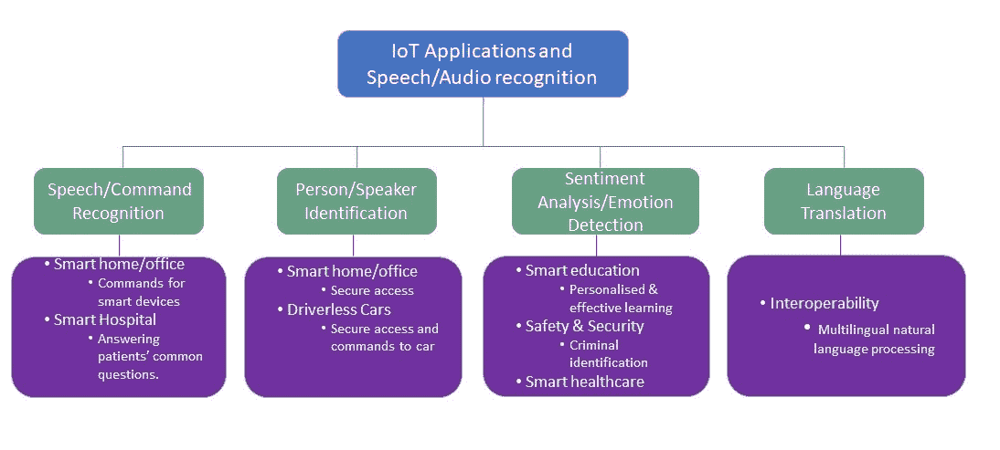

*   **语音/命令识别:**由于其便利性，语音控制的物联网应用在许多应用领域越来越受欢迎，如智能家庭/办公室、智能医院和智能汽车。例如，行动不便的人可能会发现打开电视或灯有困难。语音控制/命令的电视/灯可以通过简单地听声音来打开电视/灯来缓解这一困难。这将为许多残疾人和/或有特殊需求的人提供独立生活的机会。声控智能微波炉可以彻底改变烹饪。此外，支持语音的智能扬声器可以帮助和回答许多公共服务领域的许多常见问题，如医院、机场和火车站。例如，智能语音扬声器可以回答病人在医院的常见问题，如探视时间是什么时候，病房医生是谁。
*   **人/说话人识别:**说话人/说话人识别是近年来备受关注的物联网应用提供的第二项重要服务。利用基于 DL/机器学习的说话人识别服务的主要应用包括个性化语音控制助理、智能家电、安全服务中的生物认证、刑事调查和智能汽车[1，2]。语音控制的家庭/办公室访问是生物认证的一个例子。
*   **情感分析/情感检测:**用户情感检测或情感分析可用于向用户提供个性化的有效服务。物联网应用，如智能医疗保健[3]、智能教育和安全，可以通过基于 DL 的情感检测或情感分析来改善服务。例如，在智能教室中，教师可以实时或准实时分析学生的情绪，以提供个性化和/或分组教学。这将改善他们的学习体验。
*   **语言翻译:**全球有 6500 种([https://www.infoplease.com/askeds/how-many-spoken-languages](https://www.infoplease.com/askeds/how-many-spoken-languages))活跃的口语，这是对有效沟通和互操作性的挑战。许多公共服务，如移民局，可以使用翻译，而不是付费翻译。游客可以使用智能设备，如**https://iamili.com/us/**([ILI](https://iamili.com/us/))，有效地与他人交流。


# 用例一——声控智能灯

根据世界卫生组织的数据，世界上有超过 10 亿人患有某种形式的残疾。其中近 20%的人在功能和独立生活方面遇到了相当大的困难。未来，残疾将成为一个更大的问题，因为它越来越普遍。物联网应用，如智能家居，在机器学习/DL 的支持下，可以为这个社区提供支持，并通过独立改善他们的生活质量。这些应用之一是语音激活的智能灯/风扇控制。

面临行动障碍等残疾的个人在日常生活中面临各种困难。这些困难之一是打开/关闭家庭或办公室的灯/风扇/其他设备。家庭/办公室灯/风扇/其他设备的语音激活智能控制是一种物联网应用。然而，语音识别和正确检测给定的命令并不是一件容易的事情。一个人的口音、发音和环境噪声会使其语音识别变得困难。在非常大的语音数据集上训练的适当的 DL 算法可以有助于解决这些问题，并且可以形成有效的语音控制智能照明应用。


# 实现用例一

下图展示了实现声控灯(在房间内)所需的关键组件:

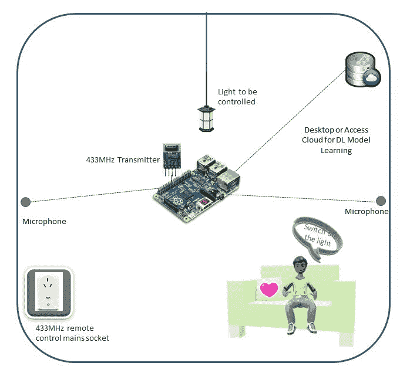

如上图所示，用例的实现将需要以下组件:

*   **传感器和计算平台**:在这个用例中，我们考虑安装在房间墙壁上的两个全向麦克风。这些麦克风无线连接到计算平台。在这个用例中，我们使用一个 Raspberry Pi 3 作为计算平台，它可以作为智能家居的边缘计算设备来控制家庭中部署的物联网设备。我们还需要两个设备:一个 433 MHz 无线发射器，连接到 Raspberry Pi，将处理后的命令传输到开关，一个 433 MHz 遥控器或无线控制的电源插座，用于控制灯光或目标设备。
*   **声控命令检测控制**:在此阶段，边缘计算设备将安装一个 app。树莓派上安装的应用程序将加载预先训练好的语音命令检测和分类模型。一旦其中一个麦克风接收到“关灯”命令或类似命令，它就会将接收到的命令发送到 Raspberry Pi，以便使用 DL 模型进行处理和检测。最后，Raspberry Pi 将检测到的命令传输到无线控制的电源插座，以便对灯采取必要的行动。
*   **用于模型学习的台式机或服务器**:我们还需要台式机/服务器或访问云计算平台，以便使用参考数据集学习语音检测和分类的模型。这个学习过的模型将被预装在树莓 Pi 中。

本章的第二部分(从 *DL 开始的部分，用于物联网*中的声音/音频识别)将描述前述用例的基于 DL 的异常检测的实现。所有必要的代码都可以在本章的代码文件夹中找到。


# 用例二——语音控制的家庭访问

创建对家庭、办公室和任何其他场所的安全和友好的访问是一项具有挑战性的任务，因为它可能需要用户可能不总是记得随身携带的钥匙或访问卡(例如酒店房间访问卡)。使用智能设备，包括物联网解决方案，可以安全友好地访问许多场所。智能和安全进入家庭/办公室的一种潜在方法是基于图像识别的人员识别，并相应地打开门/大门。然而，这种方法的一个问题是，任何入侵者都可以收集一个或多个被允许的人的照片，并将该照片呈现给安装的照相机以进入办公室/家庭。这个问题的一个解决方案是使用图像识别和语音识别的组合或者仅使用语音识别来允许进入家庭/办公室。

声音生物特征(或声纹)对每个人来说都是独一无二的，模仿这一点是一项具有挑战性的任务。然而，检测这种独特的属性并不是一件容易的工作。基于 DL 的语音识别可以识别唯一的属性和相应的人，并且只允许该人访问。


# 实现用例二

如下图所示，声控灯(房间内)用例的实现包括三个主要元素:

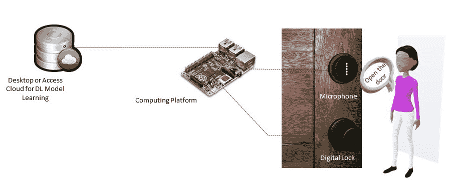

*   **传感器和计算平台**:在这个用例中，我们考虑在住宅入口处安装一个全向麦克风，通过无线方式或隐藏在墙壁中的方式连接到计算平台。对于计算平台，我们使用的是 Raspberry Pi，它将作为智能家居的边缘计算设备来控制家庭中部署的物联网设备。此外，门上还安装了一个可以通过电脑控制的数字锁系统。
*   **V** **声控命令检测控制**:该阶段边缘计算设备安装一个 app。树莓 Pi 上安装的应用程序将加载预训练的说话者或人检测和分类模型。一旦一个真实的用户对着门口的麦克风说话，它就收集音频信号，并将接收到的语音信号发送到 Raspberry Pi 进行处理，并使用 DL 模型进行人员检测。如果被检测的人在智能家居控制器(此处为树莓派)的**白名单**(家中居住者名单)上，控制器会命令解锁房门，否则不会。
*   **用于模型学习的台式机或服务器:**我们还需要台式机/服务器或访问云计算平台，以便使用参考数据集学习用于语音检测和分类的模型。这个学习过的模型将被预装在树莓 Pi 中。

以下所有部分描述了上述用例所需的基于 DL 的命令/说话人识别的实现。所有必要的代码都可以在本章的代码文件夹中找到。


# 物联网中声音/音频识别的 DL

在讨论有用的 DL 模型之前，理解自动语音识别系统的工作原理是很重要的。


# ASR 系统模型

一个自动语音识别系统需要三个主要的知识来源。这些来源被称为**声学模型**、语音词典**和**语言模型**【4】。通常，声学模型处理语言的声音，包括音素和额外的声音(如停顿、呼吸、背景噪声等)。另一方面，语音词典模型或字典包括系统可以理解的单词及其可能的发音。最后，语言模型包括关于语言的潜在单词序列的知识。近年来，DL 方法已经被广泛应用于语音识别的声学和语言模型中。**

下图给出了**自动语音识别** ( **ASR** )的系统模型。该模型包括三个主要阶段:

*   数据采集
*   信号分析和特征提取(又称**预处理**
*   解码/识别/分类。如下图所示，DL 将用于识别阶段:

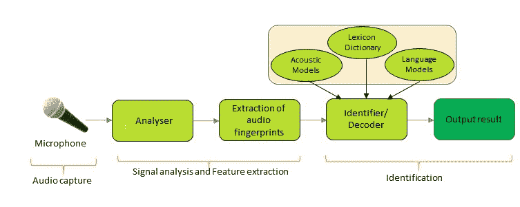


# 自动语音识别中的特征提取

**特征提取**是 ASR 的 DL 流水线中一个重要的预处理阶段。这个阶段包括分析器和音频指纹或特征的提取。这个阶段还主要计算特征向量序列，该序列提供了收集的语音信号的紧凑表示。通常，这项任务可以通过三个关键步骤来完成。第一步被称为语音分析。该步骤执行语音信号的频谱-时间分析，并产生描述短语音间隔的功率谱包络的原始特征。第二步提取由静态和动态特征组成的扩展特征向量。最后一步是将这些扩展的特征向量转换成更加紧凑和健壮的向量。重要的是，这些向量是基于 DL 的命令/说话者/语言识别器的输入。

ASR 的特征提取方法有多种，其中广泛使用的有**线性预测码** ( **LPC** )、**感知线性预测** ( **PLP** )、**梅尔频率倒谱系数** ( **MFCC** )。MFCC 是最广泛使用的特征提取方法。下图显示了 MFCC 的主要组成部分:

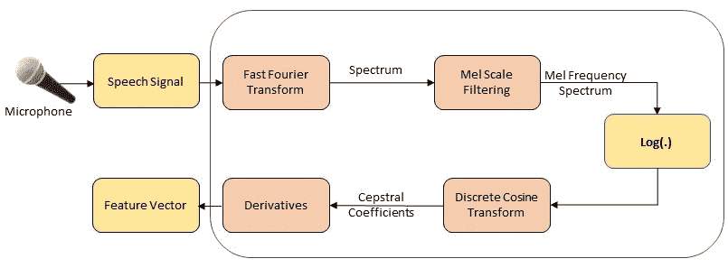

MFCC 的主要步骤如下:

1.  输入声音文件并将它们转换成原始声音数据(时域信号)。
2.  通过短时傅立叶变换、加窗和成帧将时域信号转换成频域信号。
3.  通过 Mel 频谱变换将频率变成人类可以感知的线性关系。

4.  通过 Mel 倒谱分析采用 DCT 变换分离 DC 分量和正弦分量。
5.  提取声谱特征向量并将其转换成图像。


# ASR 的 DL 模型

许多 DL 算法或模型已经在 ASR 中使用。一个**深度信念网络** ( **DBN** )是 DL 在 ASR 中的早期实现之一。一般被用作一个**深度神经网络** ( **DNN** )的单监督层的预训练层。**长短期记忆** ( **LSTM** )已经用于大规模声学建模。**时延神经网络** ( **TDNN** )架构已经用于音频信号处理。已经普及了 DL 的 CNN 也作为 ASR 的 DL 架构。DL 架构的使用显著提高了 ASR 的语音识别准确度。然而，并非所有 DL 架构都有所改进，尤其是在不同类型的音频信号和环境中，如嘈杂和混响环境。CNN 可用于减少频谱变化，并对语音信号中存在的频谱相关性进行建模。

**循环神经网络** ( **RNNs** )和 LSTM 广泛用于连续和/或自然语言处理，因为它们能够在进化过程中结合输入的时间特征。相反，由于其平移不变性，如发现结构模式的技能，无论位置如何，CNN 都适用于短且非连续的音频信号。此外，CNN 在噪声和混响环境中表现出最佳的语音识别性能，而 LSTMs 在干净的条件下更好。原因可能是 CNN 强调局部相关性，而不是全局相关性。在这种情况下，我们将使用 CNN 来实现用例，因为用于灯光控制的语音和用于门禁的语音都很短且不连续。此外，他们的环境可能会很吵，而且会反光。


# CNN 和迁移学习在物联网语音识别中的应用

CNN 是用于图像识别的非常广泛使用的 DL 算法。最近，这在音频/语音/说话人识别中变得流行，因为这些信号可以被转换成图像。CNN 有不同的实现，包括两个版本的 Mobilenets 和 Incentive V3。在[第 3 章](b28129e7-3bd1-4f83-acf7-4567e5198efb.xhtml)、*物联网中的图像识别*中介绍了 Mobilenets 和激励 V3 的概述。


# 收集数据

出于多种原因，包括隐私，为 ASR 收集数据是一项具有挑战性的任务。因此，开源数据集的数量有限。重要的是，这些数据集可能不容易访问，可能没有足够的数据/说话人，或者可能有噪音。在这种情况下，我们决定为两个用例使用两个不同的数据集。对于语音驱动控制的智能灯，我们使用谷歌的语音命令数据集，对于用例二，我们可以从三个流行的开放数据源中的一个废弃数据，LibriVox，LibriSpeech ASR，corpus，voxceleb 和 YouTube。

谷歌的语音命令数据集包括 65，000 个由 30 个短词组成的一秒钟长的话语，由数千名不同的公众成员通过 AIY 网站贡献。该数据集提供了关于常见单词的基本音频数据，如`On`、`Off`、`Yes`、数字和方向，但这在测试第一个用例时会很有用。例如，`switch on the light`命令可以用`On`来表示，而`switch off the light`可以用数据集中的`Off`数据来表示。类似地，通过报废收集的个人语音数据可以代表一个家庭的居住者。第二个用例将考虑一个有三到五个住户的典型家庭。这些居住者将被列入该住宅的白名单，如果他们被识别，将被授予访问权。除了上面列出的人之外，任何人都不能自动进入住宅。我们在谷歌的语音命令数据集和一个较小的版本上测试了 CNN。以下屏幕截图显示了用于用例一的较小数据集的分层视图:

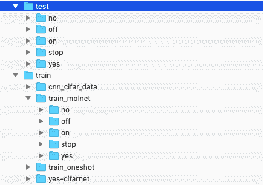

对于用例二，我们丢弃了来自 LibriVox 的数据，还从 LibriSpeech ASR 语料库下载了音频文件。我们使用 BeautifulSoup 和 Selenium 编写了一个 web scrapper 用于报废。您可以使用其他 Python 模块甚至其他语言(如 Node.js、C、C++和 PHP)编写类似的 scrapper。剪贴簿将解析 LibriVox 网站或任何其他给定的链接，并下载我们想要的列出的有声书籍/文件。在下面的代码中，我们简要介绍了 scrapper 的脚本，它由三个主要部分组成:

**Part 1** :导入音频文件报废所需的 Python 模块:

```
# Import the required modules
import urllib
from bs4 import BeautifulSoup
from selenium import webdriver
import os, os.path
import simplejson
from selenium.webdriver.common.by import By
from selenium.webdriver.support.ui import WebDriverWait
from selenium.webdriver.support import expected_conditions as EC
```

**第二部分**:准备要下载的有声读物的链接。请注意，链接可能包含重复的读者，这些读者将被清理以生成非重复的读者/发言者/家庭成员数据集:

```
# Create links book for the audio data to be downloaded: this may include repeated readers
book_links = []
browser = webdriver.PhantomJS(executable_path = '/usr/local/bin/phantomjs')

for i in range(1): ## testing first 0-1 (2) pages of the site : to minimise the time require to downloads   
    url = ("https://librivox.org/search?title=&author=&reader=&keywords=&genre_id=0&status=all&project_type=solo&recorded_language=&sort_order=catalog_date&search_page={}&search_form=advanced").format(i)
    print(url)
    browser.get(url)
    element = WebDriverWait(browser, 100).until(
    EC.presence_of_element_located((By.CLASS_NAME , "catalog-result")))
    html = browser.page_source
    soup = BeautifulSoup(html, 'html.parser')
    ul_tag = soup.find('ul', {'class': 'browse-list'})   
    for li_tag in ul_tag.find_all('li', {'class': 'catalog-result'}):
        result_data = li_tag.find('div', {'class': 'result-data'})
        book_meta = result_data.find('p', {'class': 'book-meta'})
        link = result_data.a["href"]
        print(link)
        if str(book_meta).find("Complete") and link not in book_links:
            book_links.append(link)      
    print(len(book_links)) # links per page could be different from regular browsers
browser.quit()
```

**第 3 部分**:从所列书籍中下载音频文件，并形成不可重复的阅读器/扬声器数据集；

```
#  List of Links or pages for the audio books to be downloaded
f = open('audiodownload_links.txt', 'w')
simplejson.dump(download_links, f)
f.close()

# Record the file size of each reader's file
f = open('audiodownload_sizes.txt', 'w')
simplejson.dump(download_sizes, f)
f.close()

# Download the audio files and save them in local directory
 def count_files():
    dir = 'audio_files_downloaded'
    list = [file for file in os.listdir(dir) if file.endswith('.zip')] # dir is your directory path
    number_files = len(list)
    return number_files
counter = 100 # this is for naming each downloaded file
for link, size in zip(download_links, download_sizes):
    if size >= 50 and size <= 100:
        localDestination = 'audio_files_downloaded/audio{}.zip'.format(counter)
        resultFilePath, responseHeaders = urllib.request.urlretrieve(link, localDestination)
        counter += 1
cnt2 =  0
num = count_files()
if num < 200:
    for link, size in zip(download_links, download_sizes):
        if size > 100 and size <= 150:
            localDestination = 'audio_files_downloaded/audio{}.zip'.format(counter)
            resultFilePath, responseHeaders = urllib.request.urlretrieve(link, localDestination)
            counter += 1
        cnt2 += 1
num = count_files()
if num < 200:
    for link, size in zip(download_links, download_sizes):        if size > 150 and size <= 200:
            localDestination = 'audio_files_downloaded/audio{}.zip'.format(counter)
            resultFilePath, responseHeaders = urllib.request.urlretrieve(link, localDestination)
            counter += 1
num = count_files()
if num < 200:
    for link, size in zip(download_links, download_sizes):
        if size > 200 and size <= 250:
            localDestination = 'audio_files_downloaded/audio{}.zip'.format(counter)
            resultFilePath, responseHeaders = urllib.request.urlretrieve(link, localDestination)
            counter += 1
num = count_files()
if num < 200:
    for link, size in zip(download_links, download_sizes):
        if size > 250 and size <= 300:
            localDestination = 'audio_files_downloaded/audio{}.zip'.format(counter)
            resultFilePath, responseHeaders = urllib.request.urlretrieve(link, localDestination)
            counter += 1
num = count_files()
if num < 200:
    for link, size in zip(download_links, download_sizes):
        if size > 300 and size <= 350:
            localDestination = 
audio_files_downloaded/audio{}.zip'.format(counter)
            resultFilePath, responseHeaders = urllib.request.urlretrieve(link, localDestination)
            counter += 1
num = count_files()
if num < 200:
    for link, size in zip(download_links, download_sizes):
        if size > 350 and size <= 400:
            localDestination = 'audio_files_downloaded/audio{}.zip'.format(counter)
            resultFilePath, responseHeaders = urllib.request.urlretrieve(link, localDestination)
            counter += 1
```

在下载了所需数量的读者/说话者的音频文件或`.mp3`文件(例如五个说话者或家庭居住者)后，我们处理`.mp3`文件，并将其转换为固定大小的五秒音频文件(`.wav`)。我们可以使用 ffmpeg、sox 和 mp3splt 等工具通过一个 shell 脚本来实现这一点，也可以手动实现(如果没有太多的读取器/占用者和文件)。

由于实现是基于 CNN 的，我们需要将 WAV 音频文件转换成图像。将音频文件转换为图像的过程因输入数据格式而异。我们可以使用`convert_wav2spect.sh`(在物联网代码文件夹中的[第四章](ff7fc37c-f5d6-4e2f-8d3b-3f64c47c4c2e.xhtml)、*音频/语音/声音识别中可用)将 WAV 文件转换成固定大小(503 x 800)的声谱图彩色图像:*

```
#!/bin/bash
#for file in test/*/*.wav
for file in train/*/*.wav
do
    outfile=${file%.*}
          sox "$file" -n spectrogram -r -o ${outfile}.png
done
```

通常，前面脚本中的工具 sox 支持`.png`格式，如果我们需要转换图像，我们可以通过从 Windows 或命令提示符批量重命名文件来完成。以下屏幕截图显示了用于用例 2 的数据集的分层视图:

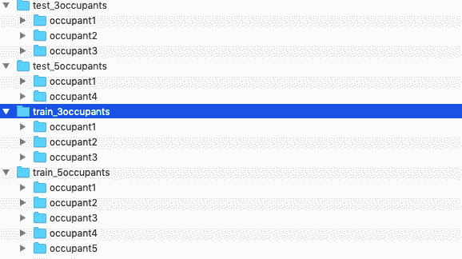


# 探索数据

在对数据应用 DL 算法之前，研究数据集是非常重要的。为了探究，首先，我们可以将音频信号(`.wav`)运行到图像转换器、`wav2image.py`(可在[第 4 章](ff7fc37c-f5d6-4e2f-8d3b-3f64c47c4c2e.xhtml)、*音频/语音/声音识别的 IoT* 代码目录中找到)，看看频谱图像是什么样子。这将产生图像，如图所示。下面的截图显示了一个`on`命令的转换图像:

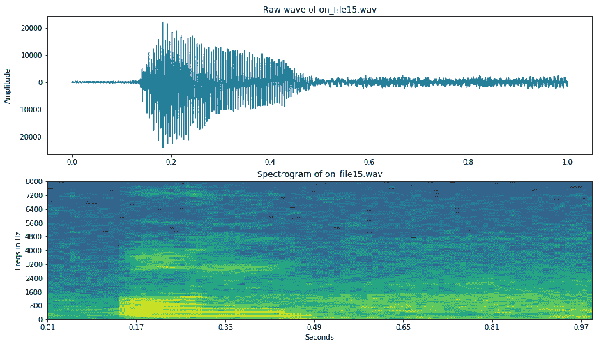

下面的截图显示了一个`off`命令的转换图像。正如我们从截图中看到的，它们的颜色分布是不同的，DL 算法将利用这一点来识别它们:

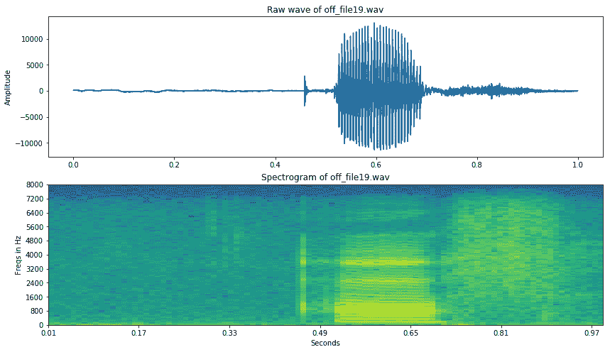

我们还可以对数据进行分组探索，为此，我们可以对我们想要探索的数据集运行`image_explorer.py`,如下所示:

```
python image_explorer.py
```

以下屏幕截图展示了语音命令数据集中频谱图像数据的数据探索过程的快照。有趣的是，这些图像的颜色与之前展示的单个图像不同。这可能是因为我们使用的工具。对于集团，我们使用 sox 工具；我们使用`ffmpegf`来表示单个的:

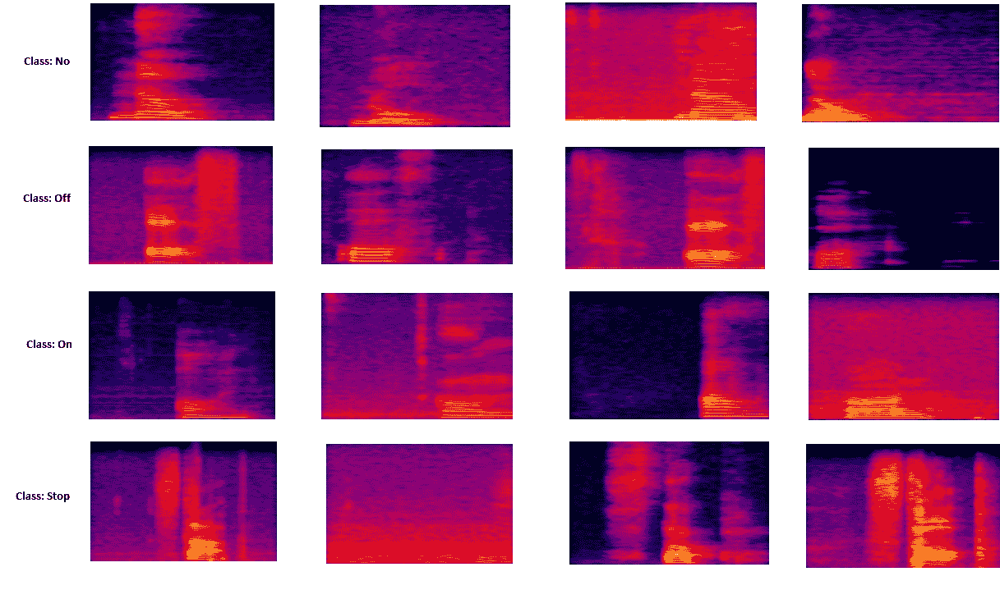

如前面的 data exploration 屏幕截图所示，频谱图像中四种不同语音命令之间的差异可能并不总是显著的。这是音频信号识别中的一个挑战。

以下屏幕截图展示了基于说话者/乘客的语音(5 秒)数据集的频谱图像数据的数据探索过程的快照:


如前面的屏幕截图所示，每个乘客的简短语音频谱图像呈现的模式将有助于对乘客进行分类，并相应地授予访问权限。


# 数据预处理

**数据预处理**是 DL 流水线的必要步骤。语音命令数据集由每个短语音命令的 1 秒`.wav`文件组成，这些文件只需要转换成频谱图像。然而，为第二用例下载的音频文件在长度上不一致；因此，它们需要两步预处理:

*   `.mp3`对统一长度(如 5 秒长度)的 WAV 文件进行转换
*   `.wav`文件到光谱图像的转换。

数据集的预处理在数据收集部分讨论。在训练图像集准备期间要注意的几个问题如下:

*   **数据量**:我们需要为每个类收集至少一百张图像，以便训练一个工作良好的模型。我们收集的信息越多，训练模型的准确性就可能越高。用例一数据集中的每个类别都有超过 3，000 个样本图像。然而，一次性学习(用较少的样本学习)在少于 100 个训练样本的情况下效果很好。我们还确保这些图像很好地代表了我们的应用程序在实际实现中实际面临的情况。
*   **数据异构**:为训练收集的数据应该是异构的。例如，关于说话者的音频或语音信号需要在尽可能广泛的各种情况下，在他们的声音的不同条件下，用不同的设备来获取。


# 模特培训

如前所述，我们对两种用例都使用迁移学习，这不需要从头开始培训；在许多情况下，用新的数据集重新训练模型就足够了。另外，在[第三章](b28129e7-3bd1-4f83-acf7-4567e5198efb.xhtml)，*物联网*中的图像识别中，我们发现 Mobilenet V1 是一个轻量级(低内存占用和更低训练时间)的 CNN 架构。因此，我们正在使用 Mobilenet V1 网络实现这两种用途。重要的是，我们将使用 TensorFlow 的`retrain.py`模块，因为它是专门为基于 CNN(如 Mobilenet V1)的迁移学习而设计的。

在数据集上重新训练 Mobilenet V1 之前，我们需要理解`retrain.py`的关键参数列表。对于再培训，如果我们键入我们的终端(在 Linux 或 macOS 中)或命令提示符(Windows) `python retrain.py -h`，我们将看到一个类似下面的屏幕截图的窗口，其中有附加信息(例如每个参数的概述):


如前面的截图所示，强制参数是`-–image directory`，它需要是一个数据集目录，我们希望在其中训练或重新训练模型。在 Mobilenet V1 的情况下，我们必须明确提到 CNN 架构，如`--architecture mobilenet_1.0_224`。对于其余的参数，包括训练、验证和测试之间的数据分割比率，我们使用默认值。默认的数据分割是将 80%的图像放入主训练集中，保留 10%在训练期间作为验证频繁运行，最后 10%的数据用于测试分类器的真实性能。

以下是运行 Mobilenet v1 模型的再训练模型的命令:

```
python retrain.py \
--output_graph=trained_model_mobilenetv1/retrained_graph.pb \
--output_labels=trained_model_mobilenetv1/retrained_labels.txt   \
--architecture mobilenet_1.0_224 \
--image_dir= your dataset directory
```

一旦我们运行前面的命令，它们将在给定的目录中生成重新训练模型(`retrained_graph.pb`)和标签文本(`retrained_labels.txt`),摘要目录包含模型的训练和验证摘要信息。TensorBoard 可以使用摘要信息(`--summaries_dir argument with default value retrain_logs)`)来可视化模型的不同方面，包括网络及其性能图。如果我们在终端或命令提示符下键入以下命令，它将运行`tensorboard`:

```
tensorboard --logdir retrain_logs
```

一旦 TensorBoard 运行，将您的网络浏览器导航至`localhost:6006`以查看 TensorBoard 并查看相应型号的网络。下图显示了 V1 使用的 Mobilnet 网络:

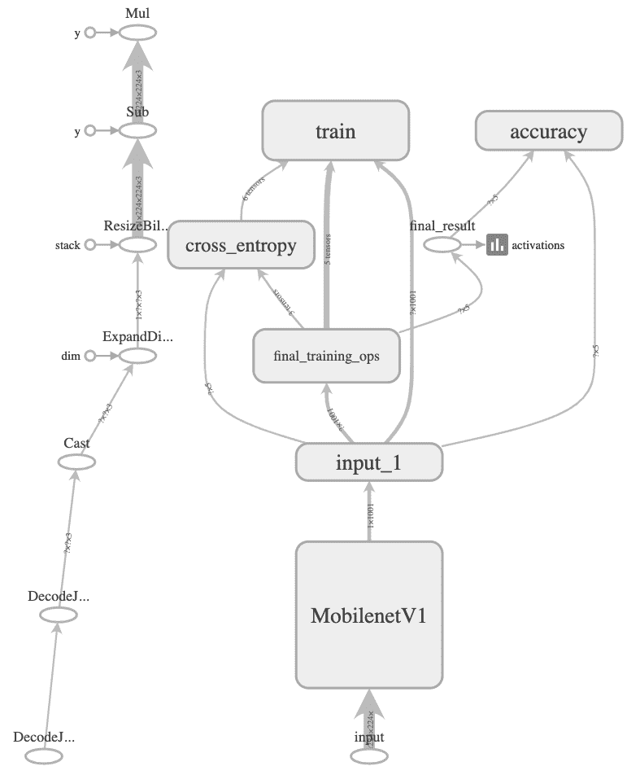


# 评估模型

我们可以从三个不同的方面评估这些模型:

*   学习/(再)培训时间
*   存储要求
*   性能(准确性)

在有 GPU 支持的台式机(英特尔 Xenon CPU E5-1650 v3@3.5GHz 和 32 GB RAM)上，使用`retrain.py`模块对 V1 移动网络进行再培训和验证的过程不到一个小时。

模型的存储/内存要求是资源受限的物联网设备的基本考虑因素。为了评估 Mobilenet V1 的存储/内存空间，我们将其存储要求与另外两个类似网络(激励 V3 和 CIFAR-10 CNN)的存储要求进行了比较。下面的屏幕截图显示了三种型号的存储要求。如图所示，Mobilenet V1 仅需要 17.1 MB，不到激励 V3 (87.5 MB)和 CIFAR-10 CNN (91.1 MB)的五分之一。就存储需求而言，对于许多资源受限的物联网设备，包括 Raspberry Pi 和智能手机，Mobilenet V1 是更好的选择:


最后，我们对模型的性能进行了评估。已经为用例执行了两个级别的性能评估:

*   在桌面 PC 平台/服务器端的再训练阶段，已经完成了数据集范围的评估或测试
*   在 Raspberry Pi 3 环境中测试或评估了个人音频和一组家庭成员的样本。下图显示了所有评估性能。


# 模型性能(用例 1)

以下截图展示了 Mobilenet V1 在语音命令数据集上的评估结果(仅定制了五个命令，包括`on`、`no`、`off`、`yes`和`stop`)。请注意，由于缺少真实数据集，用例一的`on`被认为是*开灯*:

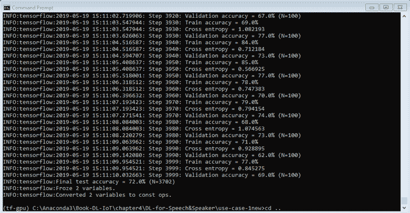

以下截图是从 TensorBoard 日志文件中生成的。橙色线表示训练，蓝色线表示 Mobilenet V1 在命令数据集上的验证准确性:

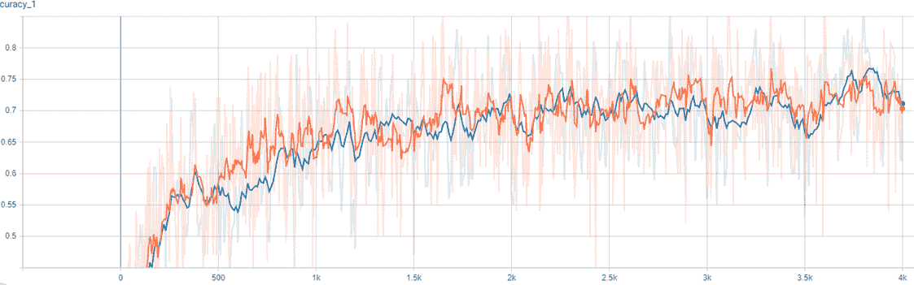

正如我们从前面两张截图中看到的，Mobilenet V1 的性能并不是很好，但通过向命令添加更多信息，例如*打开主灯*而不是仅打开*，它将足以检测命令。此外，我们可以使用更好的音频文件到图像转换器来提高图像质量和识别精度。*


# 模型性能(用例 2)

以下截图显示了 Mobilenet V1 在`three occupants`数据集上的评估结果。正如我们所见，数据集的性能相当不错。它可以在 90%以上的时间内成功检测到居住者:

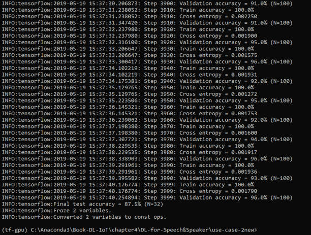

以下截图是从 TensorBoard 日志文件中生成的。橙色线代表训练，蓝色线代表 Mobilenet V1 在`three occupants`数据集上的验证准确性:

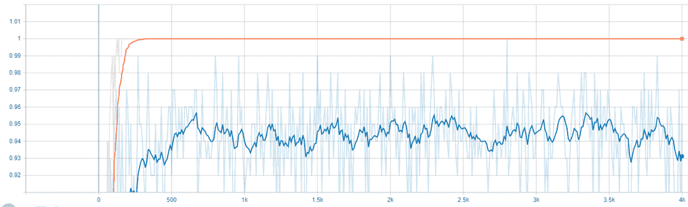

我们还在`five occupants`数据集上测试了 Mobilenet V1，结果一直显示准确率在 85-94%之间。最后，我们可以将训练好的模型细节(如`retrained_mobilenet_graph.pb`和`retrained_labels.txt`)导出到物联网设备，包括智能手机或 Raspberry Pi，我们可以使用提供的`label_image.py`代码或类似的东西，在来自两个用例的新数据上测试模型。


# 摘要

自动音频/语音/声音识别正在成为人们与其设备(包括智能手机、可穿戴设备和其他智能设备)进行交互的一种流行方式。机器学习和 DL 算法在基于音频/语音/话音的决策中是必不可少的。

在本章的第一部分，我们简要描述了不同的物联网应用及其基于音频/语音/声音检测的决策。我们还简要讨论了物联网的两个潜在使用案例，其中 DL 算法在基于语音/命令的决策中非常有用。第一个用例考虑了一个物联网应用，使用语音控制照明来实现智能家居。第二个用例也使家庭或办公室变得智能，其中基于 DL 的物联网解决方案为智能家庭或办公室提供自动访问控制。在本章的第二部分，我们简要讨论了用例的数据收集过程，并讨论了选择 CNN 背后的基本原理，特别是 Mobilenet V1。本章的其余部分描述了这些模型及其结果的 DL 管道的所有必要组件。

许多物联网设备和/或用户都是移动的。设备和用户的本地化对于在移动中为他们提供服务是至关重要的。GPS 可以支持室外定位，但在室内环境下不起作用。因此，室内定位需要替代技术。包括 WiFi 指纹识别在内的不同室内技术都是可用的，通常它们基于设备的通信信号分析来工作。在下一章([第 5 章](3426d6f2-8913-4585-b04b-f0b3a8bd235d.xhtml)、*物联网中的室内定位*)中，我们将讨论并演示如何将 DL 模型用于物联网应用中的室内定位。


# 参考

*   辅助技术:[http://www . who . int/en/news-room/fact-sheets/detail/assistive-technology](http://www.who.int/en/news-room/fact-sheets/detail/assistive-technology)
*   *用于环境感知车载应用的智能和鲁棒的说话人识别*，I Bisio，C Garibotto，A Grattarola，F Lavagetto 和 A Sciarrone，载于 IEEE 车辆技术汇刊，第 67 卷，第 9 期，第 8，808-8，821 页，2018 年 9 月。
*   *面向 5G 的情感感知互联医疗大数据*，M . S . hoss ain 和 G Muhammad，载于 IEEE 物联网杂志，第 5 卷，第 4 期，第 2，399-2，406 页，2018 年 8 月。
*   *语音识别的机器学习范式*，L 邓，X 李(2013)。IEEE 音频、语音和语言处理汇刊，第 2 卷，第 5 号。
*   *关于用于远程语音识别的深度学习架构的比较*，R Sustika，A R Yuliani，E Zaenudin，H F Pardede， *2017 年第二届信息技术、信息系统和电气工程国际会议(ICITISEE)* ，日惹，2017 年，第 17-21 页。
*   *用于语音识别声学建模的深度神经网络*，G Hinton，L Deng，D Yu，G E Dahl，A R Mohamed，N Jaitly，A Senior，V Vanhoucke，P Nguyen，T N Sainath，B Kingsbury，IEEE 信号处理杂志，第 29 卷第 6 期，第 82–97 页，2012 年。
*   *用于大规模声学建模的长短期记忆循环神经网络架构*，H Sak，高级，F Beaufays，2014 年国际语音通信协会第十五届年会。
*   *使用时间延迟神经网络的音素识别*，IEEE 声学、语音和信号处理汇刊，G. H. K. S. K. J. L. Alexander Waibel，Toshiyuki Hanazawa，第 37 卷第 3 期，1989 年。
*   *用于长时间背景有效建模的时间延迟神经网络架构*，V . Peddinti，D . Povey 和 S Khudanpur，发表在《Interspeech 学报》上。ISCA，2005 年。
*   *LV CSR 的深度卷积神经网络*，B. K. B. R. Tara N Sainath 和 Abdel Rahman Mohamed，国际声学、语音和信号处理会议。IEEE，2013 年，第 8614–8618 页。
*   音乐建模的梅尔频率倒谱系数，洛根，贝丝和其他人，ISMIR，第 270 卷，2000 年。
*   *启动语音命令数据集*，皮特·沃登:[https://ai . Google blog . com/2017/08/Launching-Speech-Commands-Dataset . html](https://ai.googleblog.com/2017/08/launching-speech-commands-dataset.html)。