# 强化学习和深度强化学习

本章简要解释了强化学习的基本术语和概念。它将使您很好地理解开发人工智能代理的基本强化学习框架。本章还将介绍深度强化学习，并向您展示算法能够解决的高级问题类型。你会在这一章的很多地方找到数学表达式和方程式。虽然强化学习和深度强化学习背后的理论足以写满一整本书，但本章讨论了对实际实现有用的关键概念，以便当我们实际实现 Python 中的算法来训练我们的代理时，您可以清楚地理解它们背后的逻辑。如果你不能在第一遍就掌握所有的知识，这是完全没问题的。当你需要更好的理解时，你可以随时回到这一章来修改。

我们将在本章中讨论以下主题:

*   什么是强化学习？
*   马尔可夫决策过程
*   强化学习框架
*   什么是深度强化学习？
*   深度强化学习代理在实践中是如何工作的？

# 什么是强化学习？

如果你是**人工智能** ( **AI** )或机器学习领域的新手，你可能会想知道强化学习是怎么回事。简单来说，就是通过强化学习。*强化*，正如你从普通英语或心理学中所知，是增加或加强选择采取特定行动以回应某事的行为，因为采取该行动会获得更高回报的感知利益。我们人类从很小的时候就擅长通过强化来学习。那些有孩子的人可能会更多地利用这一事实来教导他们养成良好的习惯。然而，我们都将能够涉及到这一点，因为不久前我们都经历了人生的那个阶段！比方说，如果孩子每天放学后按时完成作业，父母会奖励孩子巧克力。孩子*知道*如果他/她每天完成作业，他/她会得到巧克力(*a*奖励)。因此，这坚定了他们每天完成作业来领取巧克力的决心。这种学习强化特定行为选择的过程被称为强化学习或强化学习。

你可能会想，“*哦，是的。我觉得人类心理学听起来很熟悉。但这与机器学习或人工智能有什么关系？”*好想法。强化学习的概念实际上是受行为心理学的启发。它是几个研究领域的结合点，最重要的是计算机科学、数学、神经科学和心理学，如下图所示:

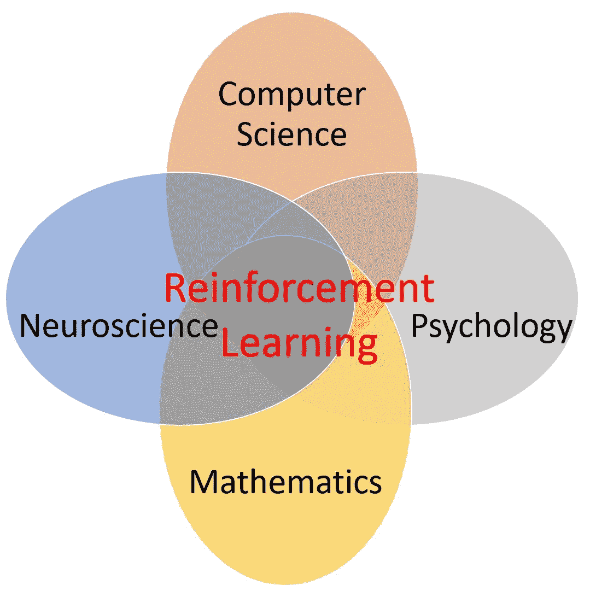

正如我们将很快意识到的，强化学习是机器学习中通向人工智能的最有前途的方法之一。如果所有这些术语对你来说都是新的，不要担心！从下一段开始，我们将复习这些术语，并了解它们之间的关系，让你感到舒服。如果你已经知道这些术语，这将是一个不同视角的耳目一新的阅读。

# 以直观的方式理解人工智能的含义及其内容

人类和动物表现出来的智能叫做*自然智能*，但是机器表现出来的智能叫做 AI，原因很明显。我们人类开发算法和技术，为机器提供智能。这方面的一些最大发展是在机器学习、人工神经网络和深度学习领域。这些领域共同推动了人工智能的发展。到目前为止，有三种主要类型的机器学习范例已经发展到某种合理的成熟水平，它们是:

*   监督学习
*   无监督学习
*   强化学习

在下图中，你可以直观的了解到 AI 的领域。你可以看到，这些学习范式是机器学习领域的子集，机器学习本身是人工智能的子集/分支:

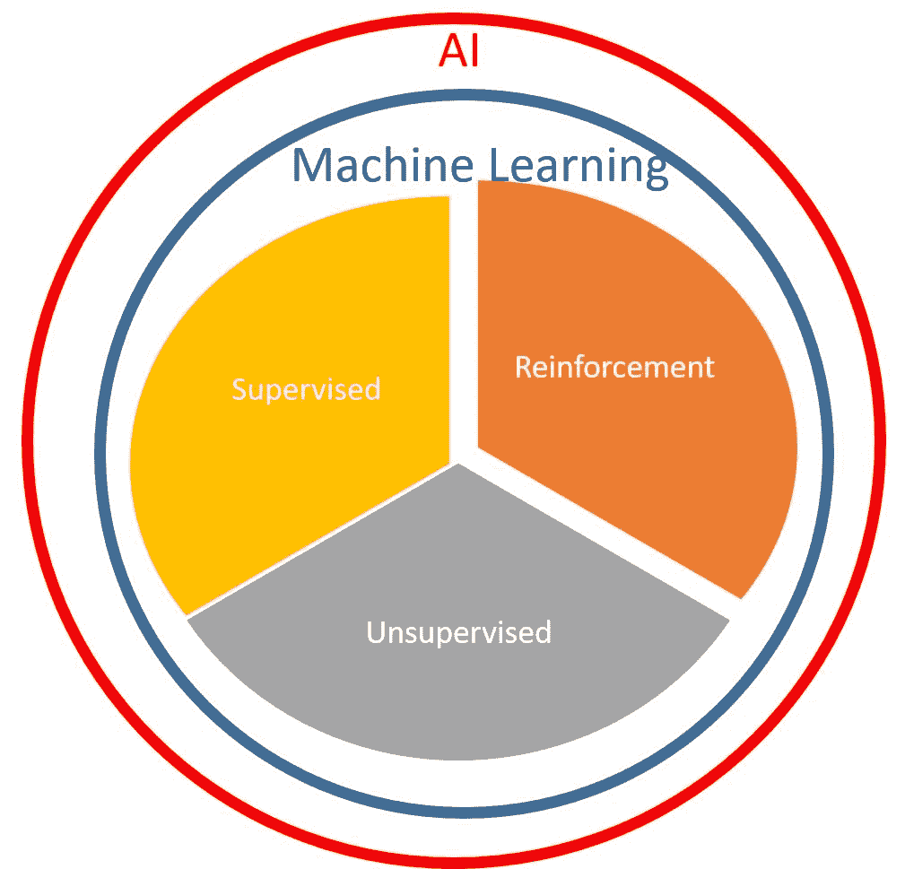

# 监督学习

监督学习类似于我们教孩子通过名字来识别某人或某物。我们提供一个输入和与该输入相关联的名称/类别标签(简称为*标签*，并期望机器学习输入到标签的映射。如果我们只是希望机器学习一些对象(如对象识别类型的任务)或人员(如面部/声音/人员识别任务)的输入到标签映射，这听起来可能很简单，但如果我们希望机器学习几千个类别，其中每个类别的输入可能有几种不同的变化，那该怎么办？例如，如果任务是从图像输入中识别一个人的面部，而有一千个其他的输入图像具有面部来区分它，即使对于一个成年人来说，任务也可能是复杂的。对于同一个人的面部，输入图像中可能有几种变化。这个人可能在一个输入图像中戴着眼镜，或者在另一个输入图像中戴着帽子，或者表现出完全不同的面部表情。对于一台机器来说，能够看到输入的图像、识别人脸并认出它是一件更困难的任务。随着深度学习领域的最新进展，像这样的监督分类任务对机器来说不再困难。机器可以以前所未有的准确度识别人脸和其他一些东西。例如，由脸书人工智能研究实验室开发的 DeepFace 系统([https://research . FB . com/WP-content/uploads/2016/11/deep face-closing-the gap-to-human-level-performance-in-face-verification . pdf](https://research.fb.com/wp-content/uploads/2016/11/deepface-closing-the-gap-to-human-level-performance-in-face-verification.pdf))在野生数据集中的标记人脸上实现了 97.45%的人脸识别准确率。

# 无监督学习

无监督学习是一种学习形式，与监督学习范式不同，在这种学习形式中，没有标签与输入一起提供给学习算法。这类学习算法通常用于找出输入数据中的模式，并将相似的数据聚集在一起。深度学习领域最近的一项进展引入了一种新的学习形式，称为生成性对抗网络，在本书写作期间，这种网络已经获得了广泛的流行。如果你有兴趣，你可以从这个视频中了解更多关于生成性对抗网络的信息:[https://www . packtpub . com/big-data-and-business-intelligence/learning-Generative-Adversarial-Networks-video](https://www.packtpub.com/big-data-and-business-intelligence/learning-generative-adversarial-networks-video)。

# 强化学习

与监督和非监督学习相比，强化学习是一种混合的学习方式。正如我们在本节开始时了解到的，强化学习是由奖励信号驱动的。在有作业问题的*孩子的案例中，奖励信号是他们父母送的巧克力。在机器学习的世界里，巧克力对计算机来说可能并不诱人(好吧，我们可以编程让计算机想要巧克力，但是我们为什么要这样做呢？孩子还不够吗？！)，但是仅仅一个标量值(一个数字)就足够了！奖励信号仍然是人类以某种方式指定的，表示任务的预期目标。例如，使用强化学习来训练代理玩 Atari 游戏，来自游戏的分数可以是奖励信号。这使得强化学习变得更加容易(对人类而不是机器！)因为我们不用在游戏中的每个点都标注要按的按钮来教机器怎么玩游戏。相反，我们只是要求机器自己学习，以最大化它们的得分。我们可以让一台机器知道如何玩游戏，如何控制汽车，或者如何自己做作业，而我们所要做的只是说它如何得分，这听起来是不是很有趣？这就是为什么我们在本章中学习它。在接下来的章节中，你将自己开发一些很酷的机器。*

# 实用强化学习

现在你已经对人工智能的真正含义和推动其发展的各种算法有了直观的理解，我们现在将专注于构建强化学习机器的实际方面。

以下是开发强化学习系统时需要了解的核心概念:

*   代理人
*   奖励
*   环境
*   状态
*   价值函数
*   政策

# 代理人

在强化学习的世界里，机器是由一个(软件)代理运行或指导的。代理是机器的一部分，拥有智能并决定下一步做什么。当我们深入研究强化学习时，你会多次碰到“代理”这个术语。强化学习基于奖励假设，该假设认为任何目标都可以通过期望累积奖励的最大化来描述。那么，这个奖励到底是什么？这就是我们接下来要讨论的。

# 奖励

由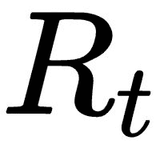表示的奖励通常是一个标量，作为反馈提供给代理以驱动其学习。代理的目标是最大化奖励的总和，这个信号表明代理在时间步做得有多好。以下针对不同任务的奖励信号示例可能有助于您获得更直观的理解:

*   对于我们之前讨论的 Atari 游戏，或者任何一般的计算机游戏，奖励信号可以是分数每次增加的`+1`和分数每次减少的`-1`。
*   对于股票交易，回报信号可以是代理人每赚一美元得到的`+1`和每亏一美元得到的`-1`。
*   对于模拟驾驶汽车，奖励信号可以是每行驶一英里的`+1`和每次碰撞的`-100`。
*   有时候，奖励信号可能很稀疏。例如，对于国际象棋或围棋游戏，如果代理赢了游戏，奖励信号可以是`+1`，如果代理输了游戏，奖励信号可以是`-1`。奖励很少，因为代理人只有在完成一局游戏后才收到奖励信号，不知道它的每一步棋有多好。

# 环境

在第一章中，我们研究了 OpenAI Gym toolkit 提供的不同环境。你可能想知道为什么它们被称为环境，而不是问题、任务或其他东西。现在你已经读到这一章了，你是否想起了什么？

环境是代表我们感兴趣的问题或任务的平台，代理与它进行交互。下图显示了最高抽象级别的一般强化学习范例:

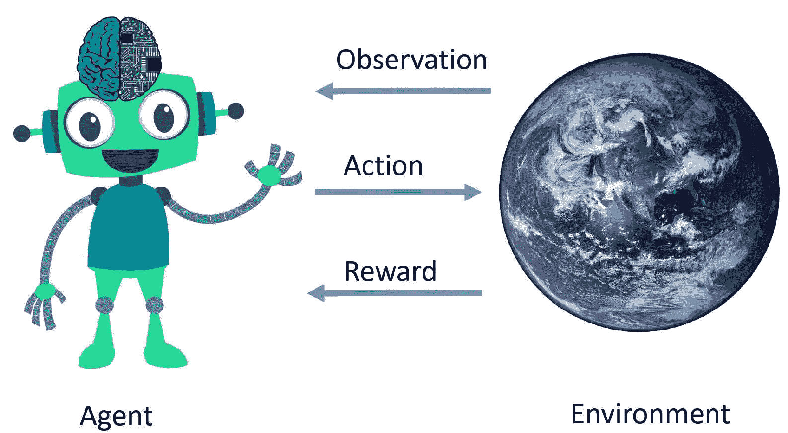

在由表示的每个时间步，代理从环境接收一个观察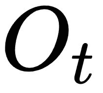，然后执行一个动作，为此它从环境接收一个标量奖励，以及下一个观察，然后这个过程重复，直到达到一个终止状态。什么是观察，什么是状态？接下来让我们来研究一下。

# 状态

如前所述，当代理与环境交互时，该过程产生一系列观察(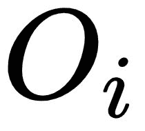)、行动()和奖励()。在某个时间步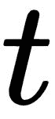，代理目前所知道的是它在时间步之前观察到的、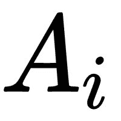和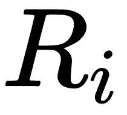的顺序。直观地说，称之为历史是有道理的:

在时间步接下来会发生什么取决于历史记录。形式上，用于确定接下来发生什么的信息被称为*状态**。*** 因为它依赖于到那个时间步为止的历史，所以可以表示如下:

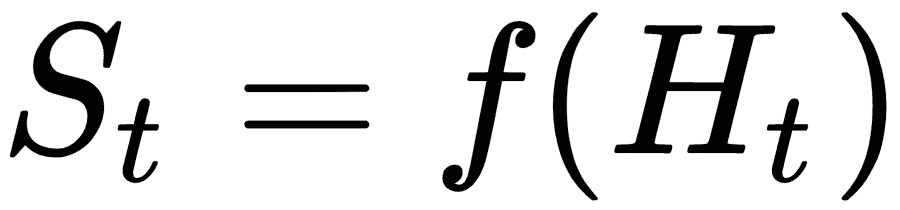,

这里，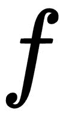表示某种功能。

在我们继续之前，有一个微妙的信息对您很重要。让我们再来看看强化学习系统的一般表示:

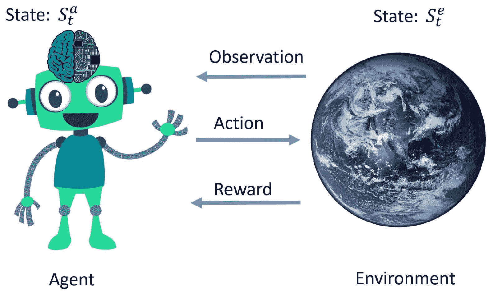

现在，您会注意到系统中的两个主要实体，代理和环境，都有自己的状态表示。*环境状态*，有时用表示，是环境自己的(私有)表示，环境用它来选择下一个观察和奖励。该状态通常对代理不可见/不可用。同样，代理有自己的内部状态表示，有时用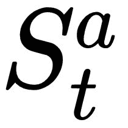表示，这是代理用来作为其动作基础的信息。因为这种表示是代理内部的，所以由代理使用任何函数来表示它。通常，它是基于代理到目前为止已经观察到的历史*T5 的某个函数。与此相关的是，*马尔可夫状态* 是使用历史中所有有用信息的状态表示。根据定义，使用马尔可夫性质，当且仅当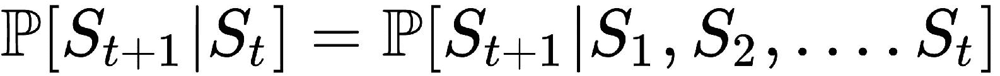时，状态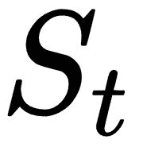是马尔可夫或马尔可夫的，这意味着*给定现在*，未来独立于过去。换句话说，这样的状态是对未来的充分统计。一旦知道了状态，就可以把历史扔掉了。通常，环境状态和历史满足马尔可夫性。*

在某些情况下，环境可以使其内部环境状态对代理直接可见。这样的环境被称为*完全可观测环境。*在智能体不能直接观察环境状态的情况下，智能体必须根据其观察到的情况构建自己的状态表示。这样的环境被称为*部分可观测环境。*例如，玩扑克的代理只能观察公共牌，而不能观察其他玩家拥有的牌。因此，它是一个部分被观察的环境。同样，只有一个摄像头的自动驾驶汽车不知道它在环境中的绝对位置，这使得环境只能部分可见。

在接下来的部分中，我们将了解代理的一些关键组件。

# 模型

模型是代理对环境的表示。它类似于我们对周围的人和事的心理模型。代理使用其环境模型来预测接下来会发生什么。它有两个关键部分:

*   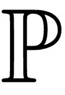:状态转移模型/概率
*   :奖励模式

状态转移模型是一种概率分布或函数，其预测在给定时间步的状态和动作的情况下，在下一时间步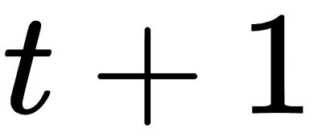中结束于状态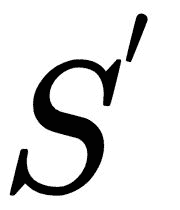的概率。数学上，它表示如下:

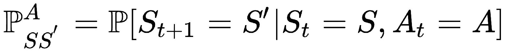

代理使用奖励模型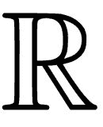来预测如果它在时间步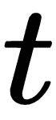处于状态时采取行动将获得的下一个奖励。在下一个时间步的奖励的预期可以数学地表达如下:

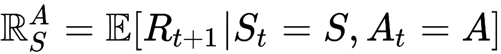

# 价值函数

价值函数代表代理人对未来回报的预测。价值函数有两种类型:状态价值函数和行为价值函数。

# 状态值函数

状态值函数是代表代理对在时间步 *t* 处于状态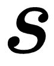有多好的估计的函数。它由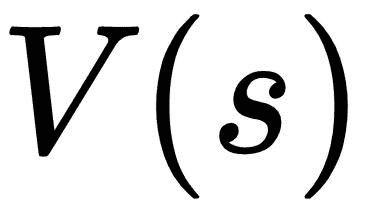表示，通常被称为*值函数*。它表示代理人对其在时间步 *t* 结束于状态时将获得的未来回报的预测。在数学上，它可以表示如下:

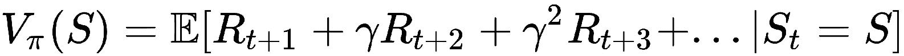

这个表达式的意思是，策略下的状态的值是贴现的未来奖励的期望和，其中是贴现因子，并且是范围[0，1]内的实数。实际上，折扣因子通常设置在[0.95，0.99]的范围内。另一个新名词是，是代理商的政策。

# 动作值函数

动作值函数是表示代理对在状态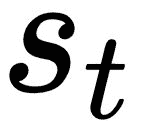中采取动作有多好的估计的函数。用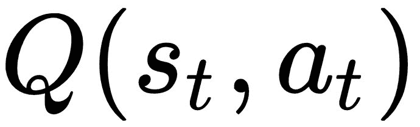表示。它通过以下等式与状态值函数相关:

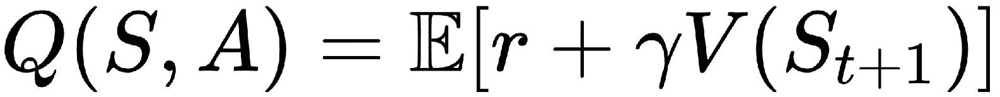

# 政策

由表示的策略规定了在给定状态下将采取什么行动。它可以被视为将状态映射到动作的功能。有两种主要类型的策略:确定性策略和随机策略。

确定性策略为给定状态规定了一个动作，也就是说，给定 *s* ，只有一个动作。数学上的意思是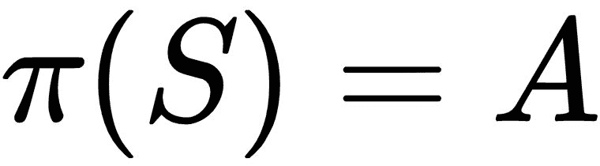。

随机策略规定了在时间步长给定状态的动作分布，即，存在多个动作，每个动作具有一个概率值。数学上，它的意思是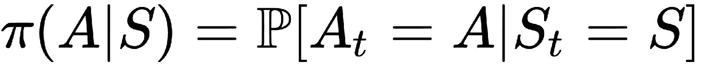。

遵循不同策略的代理在同一环境中可能会表现出不同的行为。

# 马尔可夫决策过程

一个**马尔可夫决策过程** ( **MDP** )为强化学习提供了一个正式的框架。它用于描述一个完全可观察的环境，其中结果部分是随机的，部分取决于代理人或决策者采取的行动。下图是通过马尔可夫奖励过程将马尔可夫过程转化为马尔可夫决策过程的过程:

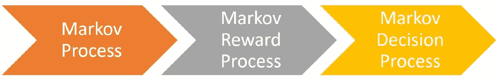

这些阶段可以描述如下:

*   **马尔可夫过程**(或*马尔可夫链)*是随机状态 s1、s2、...遵守*马尔可夫性质。*简单来说，就是一个对其历史没有任何记忆的随机过程。
*   一个**马尔可夫奖励过程** ( **MRP** )是一个*马尔可夫过程(*也叫一个 M *阿可夫链)*有值。

*   一个**马氏决策过程**是一个*马氏决策奖励过程*。

# 使用动态规划进行规划

动态规划是一种非常通用的方法，可以有效地解决可以分解为重叠子问题的问题。如果您在代码中使用过任何类型的递归函数，您可能已经对动态编程有了一些初步的了解。动态编程，简单来说，就是试图缓存或存储子问题的结果，以便以后需要时可以使用，而不是重新计算结果。

你可能会问，这有什么关系。嗯，它们对于解决完全定义的 MDP 非常有用，这意味着如果代理完全了解 MDP，它可以使用动态规划找到在一个环境中采取行动的最佳方式，以实现最高的回报！在下表中，当我们对顺序预测或控制感兴趣时，您会发现输入和输出的简明摘要:

| 任务/目标 | 投入 | 输出 |
| 预言；预测；预告 | MDP 或 MRP 和政策 | 价值函数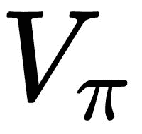 |
| 控制 | MDP | 最优价值函数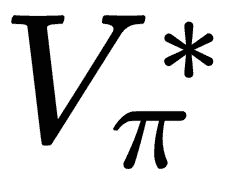和最优策略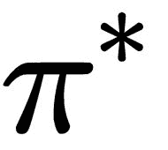 |

# 蒙特卡罗学习和时间差分学习

在这一点上，我们理解，对于代理来说，学习状态值函数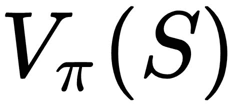是非常有用的，它通知代理关于处于状态的长期值，以便代理可以决定是否处于良好状态。**蒙特卡洛** ( **MC** )和**时差** ( **TD** )学习方法使代理能够学习到这一点！

MC 和 TD 学习的目标是当代理遵循其政策时，从代理的经验中学习价值函数。

下表总结了 MC 和 TD 学习方法的价值评估更新公式:

| **学习方法** | **状态值函数** |
| 蒙特卡洛 | 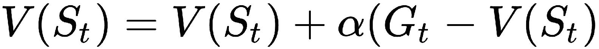 |
| 时间差异 | 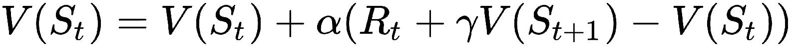 |

MC 学习向**实际回报** 更新该值，该值是从时间步长 *t* 开始的总贴现回报。这意味着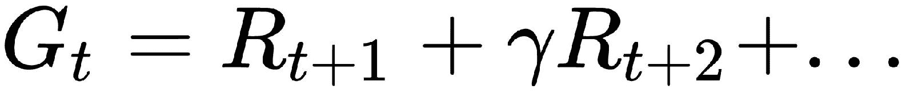直到结束。值得注意的是，我们只能在序列结束后计算该值，而 TD 学习(准确地说是 TD(0))会将该值更新为由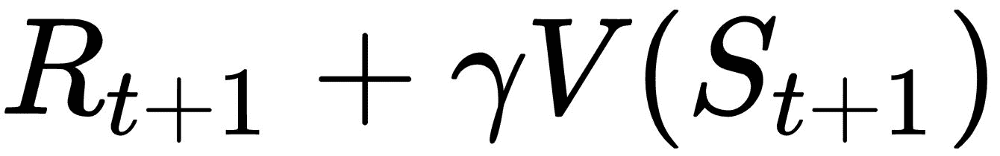给出的*估计回报*，这可以在每一步后计算。

SARSA 和 Q-learning

# 对于代理来说，学习行动价值函数也是非常有用的，它通知代理在状态中采取行动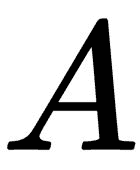的长期价值，以便代理可以采取那些将最大化其预期的贴现未来报酬的行动。SARSA 和 Q-learning 算法使代理能够了解这一点！下表总结了 SARSA 算法和 Q-learning 算法的更新公式:

**学习方法**

| **动作值功能** | 萨尔萨 |
| 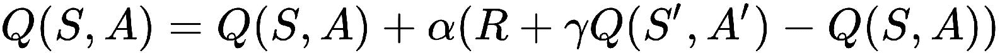 | q 学习 |
| 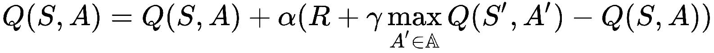 | SARSA 之所以这样命名是因为算法的更新步骤所依赖的顺序状态->动作->奖励->状态'->动作'。对该序列的描述是这样的:代理在状态 *S* 采取一个动作 A 并得到一个奖励 R，并在下一个状态 S’结束，之后代理决定在新的状态采取一个动作 A’。基于这个经验，代理可以更新它对 Q(S，A)的估计。 |

Q-learning 是一种流行的非策略学习算法，它类似于 SARSA，除了一点。代替使用新状态的 Q 值估计和代理在该新状态采取的动作，它使用对应于导致从新状态 S’可获得最大*T21 Q 值的动作的 Q 值估计。*

深度强化学习

# 对强化学习有了基本的了解，你现在处于一个更好的状态(希望你不是处于一个严格的马尔可夫状态，在这种状态下你已经忘记了迄今为止你所学的历史/事情)来理解最近一直在动摇人工智能领域的酷的新算法套件的基础知识。

当人们在深度学习领域取得进展并将其应用于强化学习时，深度强化学习就自然而然地出现了。我们学习了国家价值函数、行动价值函数和政策。让我们简单看一下它们是如何用数学表示的，或者是如何通过计算机代码实现的。状态值函数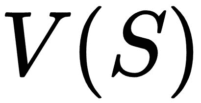是以当前状态为输入，输出一个实数值(如 4.57)的实值函数。这个数字是代理对处于状态有多好的预测，代理根据它获得的新经验不断更新价值函数。同样，动作值函数也是一个实值函数，除了状态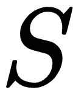之外，它还将动作作为输入，并输出一个实数。表示这些函数的一种方式是使用神经网络，因为神经网络是通用函数逼近器，能够表示复杂的非线性函数。对于试图通过观看屏幕上的图像来玩 Atari 游戏的代理(就像我们一样)，状态可以是屏幕上图像的像素值。在这种情况下，我们可以使用具有卷积层的深度神经网络来从状态/图像中提取视觉特征，然后使用几个完全连接的层来最终输出或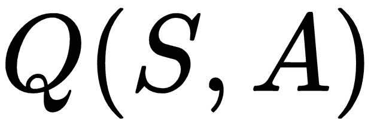，这取决于我们想要近似哪个函数。

回想一下本章前面的章节，是状态值函数，提供了对处于状态的值的估计，是动作值函数，提供了对给定状态下每个动作的值的估计。

如果我们这样做了，那么我们就是在做深度强化学习！够容易理解吗？我希望如此。让我们看看在强化学习中使用深度学习的其他一些方法。

回想一下，在确定性策略的情况下，策略被表示为，而在随机策略的情况下，策略被表示为，其中动作可以是离散的(例如“向左移动”、“向右移动”或“向前直行”)，也可以是连续的值(例如“0.05”表示加速度，“0.67”表示转向，等等)，它们可以是一维的，也可以是多维的。因此，策略有时可能是一个复杂的函数！它可能必须接受一个多维状态(比如一个图像)作为输入，输出一个多维概率向量作为输出(在随机策略的情况下)。所以，这看起来确实像是一个怪物函数，不是吗？是的，它是。这就是深度神经网络的救援之处！我们可以使用深度神经网络来近似代理的策略，并直接学习更新策略(通过更新深度神经网络的参数)。这被称为基于策略优化的深度强化学习，它已被证明在解决几个具有挑战性的控制问题方面非常有效，特别是在机器人领域。

总之，深度强化学习是深度学习在强化学习中的应用，到目前为止，研究人员已经通过两种方式成功地将深度学习应用于强化学习。一种方法是使用深度神经网络来逼近值函数，另一种方法是使用深度神经网络来表示策略。

早在 2005 年，当研究人员试图使用神经网络作为价值函数逼近器时，这些想法就已经为人所知。但它最近才成为明星，因为尽管神经网络或其他非线性价值函数逼近器可以更好地表示环境状态和行为的复杂值，但它们容易不稳定，并经常导致次优函数。直到最近，像 Volodymyr Mnih 和他在 DeepMind(现在是谷歌的一部分)的同事这样的研究人员才找到了用深度非线性函数逼近器稳定学习和训练代理的技巧，这些函数逼近器收敛到接近最优的值函数。在本书后面的章节中，我们将会重现他们的一些突破性的成果，这些成果超越了人类玩雅达利游戏的能力！

强化和深度强化学习算法的实际应用

# 直到最近，由于样本的复杂性和不稳定性，强化学习和深度强化学习的实际应用受到限制。但是，这些算法在解决一些非常困难的实际问题时被证明是非常强大的。这里列出了其中的一些，以便让您有所了解:

**学着比人类更好地玩电子游戏**:这个消息可能你现在已经知道了。DeepMind 和其他公司的研究人员开发了一系列算法，从 DeepMind 的 Deep-Q-Network(简称 DQN)开始，在玩雅达利游戏时达到了人类水平的性能。我们将在本书后面的章节中实现这个算法！本质上，它是我们在本章中简要看到的 Q-learning 算法的一个深度变体，做了一些改变，提高了学习的速度和稳定性。在几场比赛后，它能够在游戏分数方面达到人类水平的表现。更令人印象深刻的是，同样的算法实现了这种水平的发挥，而没有任何游戏特定的微调或更改！

*   **精通围棋游戏**:围棋是一款挑战 AI 几十年的中国游戏。它在一个全尺寸 19 x 19 的棋盘上进行，比国际象棋复杂几个数量级，因为棋盘上可能有大量()位置。直到最近，没有人工智能算法或软件能够在这个游戏中接近人类的水平。alpha go——来自 DeepMind 的人工智能代理，使用深度强化学习和蒙特卡洛树搜索——改变了这一切，并击败了人类世界冠军李·塞多尔(4-1)和范辉(5-0)。DeepMind 发布了他们的 AI 智能体的更高级版本，命名为 AlphaGO Zero(它使用零人类知识，学会了自己玩所有的游戏！)和 AlphaZero(可以玩围棋、国际象棋和日本象棋！)，都使用了深度强化学习作为核心算法。

*   **帮助 AI 赢得 Jeopardy！** : IBM 的沃森——由 IBM 开发的人工智能系统，因在《危险边缘》中击败人类而成名！—使用 TD learning 的扩展来创建其*每日双倍下注*策略，帮助它战胜人类冠军。
*   **机器人运动和操纵:**强化学习和深度强化学习都实现了对复杂机器人的控制，包括运动和导航。加州大学伯克利分校研究人员最近的几项工作表明，他们如何使用深度强化来训练策略，为机器人操纵任务提供视觉和控制，并产生关节驱动，以实现复杂的两足人形行走和奔跑。
*   摘要

# 在这一章中，我们讨论了一个主体如何通过基于它从环境中接收到的观察采取行动来与环境进行交互，而环境用一个(可选的)奖励和下一个观察来响应主体的行动。

对强化学习的基础有了简明的理解，我们更深入地理解了什么是深度强化学习，并发现了我们可以使用深度神经网络来表示价值函数和政策的事实。虽然这一章在符号和定义上有点沉重，但希望它为我们在接下来的章节中开发一些很酷的代理奠定了坚实的基础。在下一章中，我们将巩固我们在前两章中所学的知识，并通过打下基础来训练一个代理解决一些有趣的问题。

With a concise understanding of the foundations of reinforcement learning, we went deeper to understand what deep reinforcement learning is, and uncovered the fact that we could use deep neural networks to represent value functions and policies. Although this chapter was a little heavy on notation and definitions, hopefully it laid a strong foundation for us to develop some cool agents in the upcoming chapters. In the next chapter, we will consolidate our learning in the first two chapters and put it to use by laying out the groundwork to train an agent to solve some interesting problems.