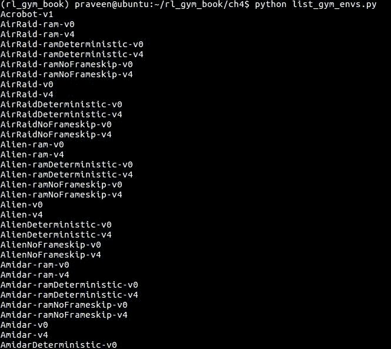
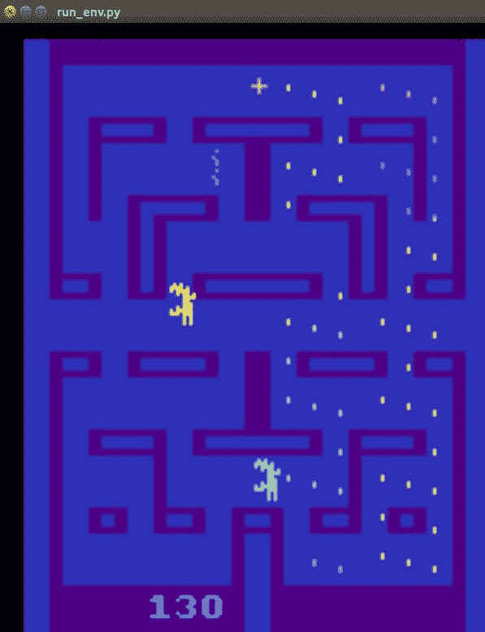
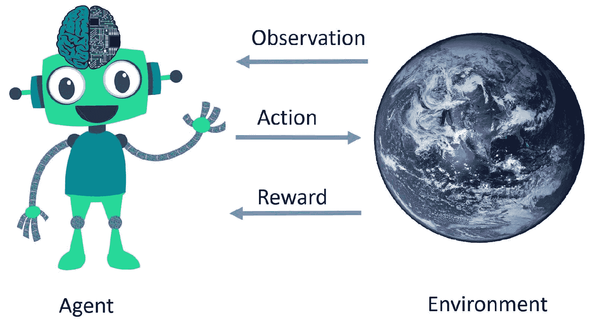
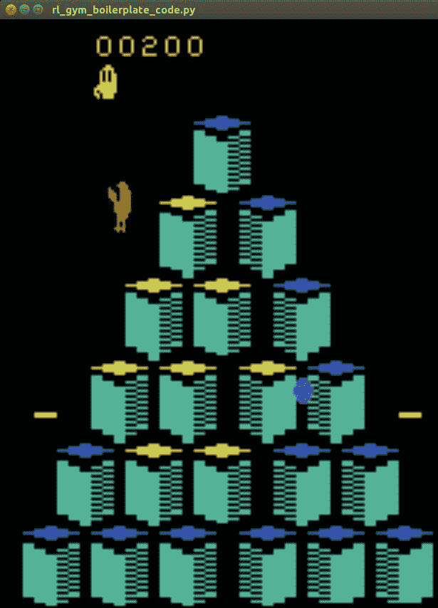
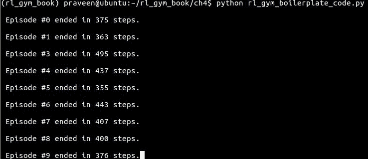
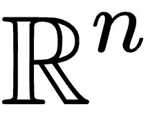
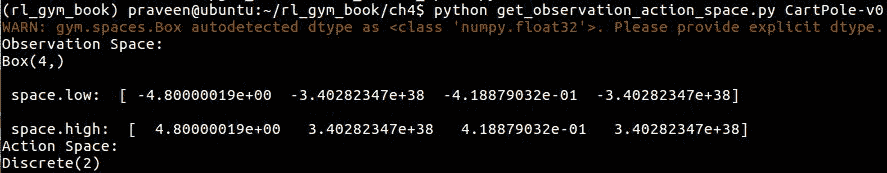
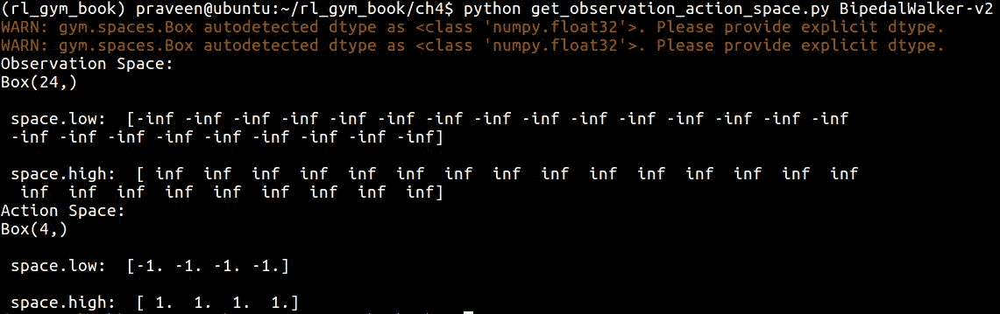

# 四、探索Gym及其特点

现在您已经有了一个工作设置，我们将开始探索 Gym toolkit 提供的各种功能和选项。本章将带您了解一些常用的环境、它们解决的任务，以及您的智能体如何掌握一项任务。

在本章中，我们将探讨以下主题:

*   探索各种类型的Gym环境
*   理解强化学习循环的结构
*   理解不同的观察和行动空间


# 浏览环境和术语列表

先挑个环境，了解Gym界面。您可能已经熟悉了前几章中创建体育馆环境的基本函数调用，在这些章节中，我们使用它们来测试我们的安装。在这里，我们将正式通过它们。

让我们激活`rl_gym_book` conda 环境，打开一个 Python 提示符。第一步是使用以下代码行导入 Gym Python 模块:

```
import gym
```

我们现在可以使用`gym.make`方法从可用的环境列表中创建一个环境。您可能会问如何在您的系统中找到可用的Gym环境列表。我们将创建一个小的实用程序脚本来生成环境列表，以便您以后需要时可以引用它。让我们在`~/rl_gym_book/ch4`目录下创建一个名为`list_gym_envs.py`的脚本，内容如下:

```
#!/usr/bin/env python
from gym import envs
env_names = [spec.id for spec in envs.registry.all()]
for name in sorted(env_names):
 print(name)
```

这个脚本将打印您的Gym安装中所有可用环境的名称，按字母顺序排序。您可以使用以下命令运行此脚本，以查看您的系统中已安装和可用的环境的名称:

```
(rl_gym_book) praveen@ubntu:~/rl_gym_book/ch4$python list_gym_envs.py
```

您将得到这样的输出。请注意，其中只显示了前几个环境名称。根据我们在[第 3 章](part0056.html#1LCVG0-22c7fc7f93b64d07be225c00ead6ce12)、*open ai Gym 和深度强化学习入门*中讨论的内容，它们可能会有所不同，具体取决于您系统上安装的环境:



从环境名称列表中，您可能会注意到有一些相似的名称，只是有些不同。例如，外星环境有八种不同的变化。在我们选择一个术语并开始使用它之前，让我们试着去理解它。


# 术语

在环境名称中出现单词 *ram* 意味着环境返回的观察结果是游戏设计运行的 Atari 控制台的**随机存取存储器** ( **RAM** )的内容。

环境名称中出现单词*确定性*意味着智能体发送给环境的动作在四帧的*确定性/固定*持续时间内重复执行，然后返回结果状态。

单词 *NoFrameskip* 的出现意味着智能体发送到环境的动作被执行一次，并且结果状态被立即返回，中间没有跳过任何帧。

默认情况下，如果*确定性*和*无帧跳过*没有包含在环境名称中，那么发送到环境的动作会重复执行 *n* 帧的持续时间，其中 *n* 是从{2，3，4}中均匀采样的。

环境名称中的字母 *v* 后跟一个数字代表环境的版本。这是为了确保对环境实现的任何改变都反映在其名称中，以便环境中的算法/智能体所获得的结果与另一个算法/智能体所获得的结果是可比较的，没有任何差异。

让我们通过查看 Atari 外星环境来理解这个术语。列出了各种可用选项，并有如下描述:

| **版本名称** | **描述** |
| `Alien-ram-v0` | 观察的是 Atari 机器的 RAM 内容，总大小为 128 字节，发送到环境的动作在 *n* 帧的持续时间内重复执行，其中 *n* 从{2，3，4}均匀采样。 |
| `Alien-ram-v4` | 观察的是 Atari 机器的 RAM 内容，总大小为 128 字节，发送到环境中的动作在 *n* 帧的持续时间内重复执行，其中 *n* 是从{2，3，4}中均匀采样的。与 v0 相比，环境有所改变。 |
| `Alien-ramDeterministic-v0` | 观察的是 Atari 机器的 RAM 内容，总大小为 128 字节，发送到环境的动作在四帧的持续时间内重复执行。 |
| `Alien-ramDeterministic-v4` | 观察的是 Atari 机器的 RAM 内容，总大小为 128 字节，发送到环境的动作在四帧的持续时间内重复执行。与 v0 相比，环境有所改变。 |
| `Alien-ramNoFrameskip-v0` | 观察的是 Atari 机器的 RAM 内容，总大小为 128 字节，应用发送到环境的动作，结果状态立即返回，不跳过任何帧。 |
| `Alien-v0` | 观察是表示为形状(210，160，3)的阵列的屏幕的 RGB 图像，并且发送到环境的动作被重复执行 *n* 帧的持续时间，其中 *n* 是从{2，3，4}均匀采样的。 |
| `Alien-v4` | 观察是表示为形状(210，160，3)的阵列的屏幕的 RGB 图像，并且发送到环境的动作在 *n* 帧的持续时间内重复执行，其中 *n* 是从{2，3，4}均匀采样的。与 v0 相比，环境有所改变。 |
| `AlienDeterministic-v0` | 观察是屏幕的 RGB 图像，表示为形状(210，160，3)的阵列，并且发送到环境的动作在四帧的持续时间内重复执行。 |
| `AlienDeterministic-v4` | 观察是屏幕的 RGB 图像，表示为形状(210，160，3)的阵列，并且发送到环境的动作在四帧的持续时间内重复执行。与 v0 相比，环境有所改变。 |
| `AlienNoFrameskip-v0` | 观察是屏幕的 RGB 图像，表示为形状(210，160，3)的数组，并且应用发送到环境的动作，并且立即返回结果状态，而不跳过任何帧。 |
| `AlienNoFrameskip-v4` | 观察是屏幕的 RGB 图像，表示为形状(210，160，3)的数组，并且应用发送到环境的动作，并且立即返回结果状态，而不跳过任何帧。任何框架。与 v0 相比，环境有所改变。 |

这个总结应该有助于您理解环境的术语，它通常适用于所有环境。RAM 可能是特定于 Atari 环境的，但是当您看到几个相关的环境名称时，您现在已经知道会发生什么了。


# 探索Gym环境

为了让我们更容易想象一个环境是什么样子，或者它的任务是什么，我们将使用一个简单的脚本，它可以启动任何环境，并通过一些随机采样的操作逐步完成它。你可以在`ch4`下从本书的代码库中下载脚本，或者在`~/rl_gym_book/ch4`下创建一个名为`run_gym_env.py`的文件，内容如下:

```
#!/usr/bin/env python

import gym
import sys

def run_gym_env(argv):
    env = gym.make(argv[1]) # Name of the environment supplied as 1st argument
    env.reset()
    for _ in range(int(argv[2])):
        env.render()
        env.step(env.action_space.sample())
    env.close()

if __name__ == "__main__":
    run_gym_env(sys.argv)
```

该脚本将环境的名称作为第一个命令行参数，并接受要运行的步骤数。例如，我们可以这样运行脚本:

```
(rl_gym_book) praveen@ubntu:~/rl_gym_book/ch4$python run_gym_env.py Alien-ram-v0 2000
```

该命令将启动`Alien-ram-v0`环境，并使用从环境的动作空间采样的随机动作遍历 2000 次。

您将看到弹出一个带有`Alien-ram-v0`环境的窗口，如下所示:



# 了解Gym界面

让我们通过理解Gym环境和我们将要开发的智能体之间的接口来继续我们的Gym探索。为了帮助我们理解这一点，让我们再来看看我们在[第 2 章](part0033.html#VF2I0-22c7fc7f93b64d07be225c00ead6ce12)、*强化学习和深度强化学习*中看到的图片，当时我们正在讨论强化学习的基础知识:



这张图片是否让您了解了智能体与环境之间的界面？我们将通过查看接口的描述来确保您的理解。

在我们`import gym`之后，我们`make`使用下面的代码行创建一个环境:

```
 env = gym.make("ENVIRONMENT_NAME") 
```

这里，`ENVIRONMENT_NAME`是我们需要的环境的名称，从我们发现安装在我们系统上的环境列表中选择。从前面的图中，我们可以看到第一个箭头从环境到智能体，并被命名为观察。从[第二章](part0033.html#VF2I0-22c7fc7f93b64d07be225c00ead6ce12)、*强化学习和深度强化学习*中，我们了解了部分可观测环境和完全可观测环境的区别，以及每种情况下状态和观测的区别。我们通过调用`env.reset()`从环境中获得第一个观察结果。让我们使用下面一行代码将观察结果存储在一个名为`obs`的变量中:

```
obs = env.reset()
```

现在，智能体已经收到了观察结果(第一个箭头的末端)。智能体应该采取行动，并将行动发送到环境中，看看会发生什么。本质上，这就是我们为智能体开发的算法应该解决的问题！我们将在下一章和后续章节中开发各种先进的算法来开发智能体。让我们继续了解Gym界面的旅程。

一旦决定了要采取的行动，我们使用`env.step()`方法将它发送到环境(图中的第二个箭头)，该方法将按顺序返回四个值:`next_state`、`reward`、`done`和`info`:

1.  `next_state`是在前一状态中采取行动后环境的结果状态。

在返回`next_state`之前，一些环境可能会使用相同的动作在内部运行一个或多个步骤。我们在上一节讨论了*确定性*和*无帧跳过*类型，它们是这种环境的例子。

2.  环境返回`reward`(图中第三个箭头)。
3.  `done`变量是一个布尔值(真或假)，如果剧集已经终止/结束(因此，是时候重置环境了)，则该变量的值为真，否则为假。这对于智能体知道一个情节何时结束或者环境何时将被重置到某个初始状态是有用的。

4.  返回的`info`变量是可选变量，某些环境可能会返回一些附加信息。通常，智能体不使用它来决定采取什么操作。

下面是Gym环境的`step()`方法返回的四个值的汇总，以及它们的类型和简要描述:

| **返回值** | **类型** | **描述** |
| `next_state`(或观察) | `Object` | 环境反馈的观察。该对象可以是来自屏幕/摄像机的 RGB 像素数据、RAM 内容、机器人的连接角度和连接速度等等，这取决于环境。 |
| `reward` | `Float` | 对之前发送到环境中的操作的奖励。`Float`值的范围因环境而异，但不管环境如何，高回报总是更好，智能体的目标应该是最大化总回报。 |
| `done` | `Boolean` | 指示在下一步中是否要重置环境。当布尔值为真时，很可能意味着该剧集已经结束(由于智能体死亡、超时或某些其他剧集终止标准)。 |
| `info` | `Dict` | 一些附加信息，可以由环境作为任意键-值对的字典选择性地发送出去。我们开发的智能体不应该依赖字典中的任何信息来采取行动。它可用于(如果可用)调试目的。 |

请注意，下面的代码是为了显示一般的结构而提供的，由于`ENVIRONMENT_NAME`和`agent.choose_action()`没有在这个代码片段中定义，所以还不能执行。

让我们把所有的碎片放在一起，在一个地方看:

我希望你很好地理解了环境和智能体之间的相互作用的一个周期。这个过程将会重复，直到我们决定在经过一定数量的事件或步骤后终止循环。现在让我们看一个完整的例子，在`Qbert-v0`环境中，内循环为`MAX_STEPS_PER_EPISODE`运行，外循环为`MAX_NUM_EPISODES`运行:

```
import gym
env = gym.make("ENVIRONMENT_NAME")
obs = env.reset() # The first arrow in the picture
# Inner loop (roll out)
action = agent.choose_action(obs) # The second arrow in the picture
next_state, reward, done, info = env.step(action) # The third arrow (and more)
obs = next_state
# Repeat Inner loop (roll out)
```

当您运行这个脚本时，您会注意到一个 Qbert 屏幕弹出，Qbert 采取随机行动并得到一个分数，如下所示:

```
#!/usr/bin/env python
import gym
env = gym.make("Qbert-v0")
MAX_NUM_EPISODES = 10
MAX_STEPS_PER_EPISODE = 500
for episode in range(MAX_NUM_EPISODES):
    obs = env.reset()
    for step in range(MAX_STEPS_PER_EPISODE):
        env.render()
        action = env.action_space.sample()# Sample random action. This will be replaced by our agent's action when we start developing the agent algorithms
        next_state, reward, done, info = env.step(action) # Send the action to the environment and receive the next_state, reward and whether done or not
        obs = next_state

        if done is True:
            print("\n Episode #{} ended in {} steps.".format(episode, step+1))
            break
```

根据剧集结束的时间，您还会在控制台上看到如下打印语句。请注意，您获得的步骤编号可能会有所不同，因为操作是随机的:



样板代码可以在本书的代码库中的`ch4`文件夹下找到，命名为`rl_gym_boilerplate_code.py`。这确实是样板代码，因为程序的整体结构将保持不变。当我们在后续章节中构建智能体时，我们将扩展这个样板代码。值得花些时间一行一行地浏览脚本，以确保您很好地理解了它。



您可能已经注意到，在本章和[第 3 章](part0056.html#1LCVG0-22c7fc7f93b64d07be225c00ead6ce12)、*open ai Gym 和深度强化学习*中提供的示例代码片段中，我们使用了`env.action_space.sample()`来代替前面代码中的`action`。`env.action_space`返回动作空间的类型(例如，`Discrete(18)`，在 Alien-v0 的情况下)，`sample()`方法从那个`action_space`中随机抽取一个值。就这意思！

我们现在将仔细观察体育馆中的空间，以了解环境的状态空间和动作空间。

Gym的空间


# 我们可以看到Gym的每个环境都不一样。雅达利类别下的每个游戏环境也与其他不同。例如，在`VideoPinball-v0`环境的情况下，目标是用两个球拍不断弹跳一个球，以根据球击中的位置收集分数，并确保球永远不会落到球拍下方，而在另一个雅达利游戏环境`Alien-v0` ***、*** 的情况下，目标是通过迷宫(船上的房间)收集*点*，这相当于摧毁外星人的蛋。收集一个脉冲星点可以杀死外星人，当这种情况发生时，奖励/分数会增加。你看到游戏/环境的变化了吗？我们如何知道什么类型的行为在游戏中是有效的？

在视频弹球环境中，动作自然是向上或向下移动球拍，而在陌生环境中，动作是命令玩家向左、向右、向上或向下移动。请注意，在 VideoPinball 中没有“向左移动”或“向右移动”动作。当我们看其他类别的环境时，差异甚至更大。例如，在连续控制环境的情况下，例如最近发布的具有取物机器人臂的机器人环境，动作是改变连续值的连接位置和连接速度以完成任务。对于来自环境的观测值也可以进行同样的讨论。我们已经看到了 Atari 的不同观察对象类型(RAM 与 RGB 图像)。

In the VideoPinball environment, naturally, the actions are to move the paddles up or down, whereas in the Alien environment, the actions are to command the player to move left, right, up, or down. Note that there is no "move left" or "move right" action in the case of VideoPinball. When we look at other categories of environment, the variations are even greater. For example, in the case of continuous control environments such as recently release robotics environments with the fetch robot arms, the action is to vary the continuous valued join positions and joint velocities to achieve the task. The same discussion can be had with respect to the values of the observations from the environment. We already saw the different observation object types in the case of Atari (RAM versus RGB images).

这就是为什么为每个环境定义观察和行动的*空间*(如在数学中)的动机。在写这本书的时候，OpenAI Gym 支持 6 个空间(加上另外一个叫做`prng`的随机种子)。下表列出了它们，并对它们进行了简要描述:

**空间类型**

| **描述** | **使用示例** | `Box` |
| 在空间中的一个框(一个 *n* 维框)，其中每个坐标被限制在由【低，高】定义的区间内。值将是一个由 n 个数字组成的数组。该形状定义了空间的 *n* 。 | `gym.spaces.Box(low=-100, high=100, shape=(2,))` | `Discrete` |
| 区间[0，n-1]中的离散整数值空间。`Discrete()`的自变量定义了 *n.* | `gym.spaces.Discrete(4)` | `Dict` |
| 一个样本空间的字典来创建任意复杂的空间。在本例中，创建了一个 Dict 空间，它由三维位置和速度的两个离散空间组成。 | `gym.spaces.Dict({"position": gym.spaces.Discrete(3), "velocity": gym.spaces.Discrete(3)})` | `MultiBinary` |
| *n* 维二元空间。`MultiBinary()`的自变量定义了 *n.* | `gym.spaces.MultiBinary(5)` | `MultiDiscrete` |
| 多维离散空间。 | `gym.spaces.MultiDiscrete([-10,10], [0,1])` | `Tuple` |
| 简单空间的产物。 | `gym.spaces.Tuple((gym.spaces.Discrete(2), spaces.Discrete(2)))` | `gym.spaces.Tuple((gym.spaces.Discrete(2), spaces.Discrete(2)))` |

`Box`和`Discrete`是最常用的动作空间。我们现在对Gym中的各种空间类型有了基本的了解。让我们看看如何找到一个环境使用哪些观察和行动空间。

下面的脚本将打印给定环境的观察和动作空间，并且还可以选择打印`Box Space`情况下的值的下限和上限。此外，它还将打印环境中可能操作的描述/含义(如果环境提供了该描述/含义):

The following script will print the observation and the action space of a given environment, and also optionally print the lower bound and upper bound of the values in the case of a `Box Space`. Additionally, it will also print a description/meaning of the possible action in the environment if it is provided by the environment:

这个脚本也可以在本书的代码库中下载，在`ch4`下，名为`get_observation_action_space.py`。您可以使用以下命令运行脚本，其中我们提供环境的名称作为脚本的第一个参数:

```
#!/usr/bin/env python
import gym
from gym.spaces import *
import sys

def print_spaces(space):
    print(space)
    if isinstance(space, Box): # Print lower and upper bound if it's a Box space
        print("\n space.low: ", space.low)
        print("\n space.high: ", space.high)

if __name__ == "__main__":
    env = gym.make(sys.argv[1])
    print("Observation Space:")
    print_spaces(env.observation_space)
    print("Action Space:")
    print_spaces(env.action_space)
    try:
        print("Action description/meaning:",env.unwrapped.get_action_meanings())
    except AttributeError:
        pass
```

该脚本将打印如下输出:

```
(rl_gym_book) praveen@ubuntu:~/rl_gym_book/ch4$ python get_observation_action_space.py CartPole-v0
```

在本例中，脚本打印出`CartPole-v0`环境的观察空间是`Box(4,)` *，*，分别对应于四个框值顶端的`cart position`、`cart velocity`、`pole angle`和`pole velocity`。



In this example, the script prints that the observation space for the `CartPole-v0` environment is `Box(4,)`*, *which corresponds to `cart position`, `cart velocity`, `pole angle`, and `pole velocity` at the tip for the four box values. 

动作空间打印为`Discrete(2)`，分别对应离散值`0`和`1`的*向左推小车*和*向右推小车*。

让我们看看另一个例子，它有几个更复杂的空间。这一次，让我们使用`BipedalWalker-v2` 环境运行脚本:

会产生这样的输出:

```
(rl_gym_book) praveen@ubuntu:~/rl_gym_book/ch4$ python get_observation_action_space.py BipedalWalker-v2
```

两足步行器(v2)环境的状态空间的详细描述在此列表，供您快速方便地参考:



**索引**

| **名称/描述** | **最小值** | **最大** | 0 |
| 船体 _ 角度 | 0 | 2 *圆周率 | 一 |
| 赫尔角速率 | -inf | +inf | 2 |
| vel_x | -1 | +1 | 3 |
| 韦尔 _y | -1 | +1 | 四 |
| 髋关节 _ 1 _ 角度 | -inf | +inf | 5 |
| 髋关节 _ 1 _ 速度 | -inf | +inf | 6 |
| 膝关节 1 度角 | -inf | +inf | 七 |
| 膝关节 1 速度 | -inf | +inf | 8 |
| leg _ 1 _ 接地 _ 接触 _ 标志 | 0 | 一 | 9 |
| 髋关节 _ 2 _ 角度 | -inf | +inf | 10 |
| 髋关节 _ 2 _ 速度 | -inf | +inf | 11 |
| 膝关节 _ 2 _ 角度 | -inf | +inf | 12 |
| 膝关节 _ 2 _ 速度 | -inf | +inf | 13 |
| leg _ 2 _ 接地 _ 接触 _ 标志 | 0 | 一 | 14-23 |
| 10 次激光雷达读数 | -inf | +inf | +inf |

如你所见，状态空间相当复杂，这对于一个复杂的两足行走机器人来说是合理的。它或多或少类似于我们在现实世界中可以找到的实际双足机器人系统和传感器配置，例如波士顿动力公司(Boston Dynamics)(Alphabet 的一部分)的 Atlas 双足机器人，它在 2015 年的 DARPA 机器人挑战赛中抢尽了风头。

接下来，我们将研究并理解动作空间。两足步行器(v2)环境的动作空间的详细描述在此列表，供您快速、轻松地参考:

索引

| 名称/描述 | 福建话 | 最大 | 0 |
| Hip_1(扭矩/速度) | -1 | +1 | 一 |
| Knee_1(扭矩/速度) | -1 | +1 | 2 |
| Hip_2(扭矩/速度) | -1 | +1 | 3 |
| 膝盖 _2(扭矩/速度) | -1 | +1 | 行动 |

扭矩控制是默认的控制方法，它控制关节处应用的扭矩量。

摘要


# 在这一章中，我们探索了您的系统中可用的Gym环境列表，您在上一章中安装了这些环境，然后了解了这些环境的命名约定或术语。然后，我们重新回顾了智能体-环境交互(RL 循环)图，并了解了Gym环境如何提供与我们在图像中看到的每个箭头相对应的界面。然后，我们查看了Gym环境的`step()`方法返回的四个值的汇总，以表格形式，易于理解，以*加强*您对它们的理解！

我们还详细探索了体育馆中用于观察和行动空间的各种类型的空间，我们使用脚本打印出环境使用的空间，以更好地理解体育馆环境界面。在我们的下一章中，我们将巩固我们到目前为止所学的知识来开发我们的第一个人工智能体！激动吗？！现在就翻到下一章吧！

We also explored in detail the various types of spaces used in the Gym for the observation and action spaces, and we used a script to print out what spaces are used by an environment to understand the Gym environment interfaces better. In our next chapter, we will consolidate all our learning so far to develop our first artificially intelligent agent! Excited?! Flip the page to the next chapter now!