# 利用深度演员-评论家算法实现智能自主汽车驾驶智能体

在第 6 章的[中，我们使用深度 Q 学习实现了用于最优控制的智能代理，我们使用深度 Q 学习实现了代理来解决离散控制任务，这些任务涉及到要做出的离散动作或决策。我们看到了如何训练他们玩视频游戏，如 Atari，就像我们一样:通过看着游戏屏幕，按下游戏手柄/操纵杆上的按钮。我们可以使用这样的智能体在给定的有限选择集合中挑选最佳选择，做出决策，或者在可能的决策或行动的数量有限并且通常很少的情况下执行行动。有许多现实世界中的问题可以通过一个能够学习采取最优的离散行动的代理来解决。我们在](part0094.html#2PKKS0-22c7fc7f93b64d07be225c00ead6ce12)[第 6 章](part0094.html#2PKKS0-22c7fc7f93b64d07be225c00ead6ce12)、*中看到了一些例子，使用深度 Q 学习*实现了一个智能代理用于 *最优离散控制。*

在现实世界中，还有其他类型的问题和任务需要执行较低级别的操作，这些操作是连续的值，而不是离散的。例如，智能温度控制系统或恒温器需要能够对内部控制电路进行微调，以将房间保持在指定的温度。控制动作信号可以包括连续值实数(例如 *1.456* )来控制**加热、通风和空调** ( **HVAC** )系统。考虑另一个例子，我们想开发一个智能代理来自动驾驶汽车。人类通过换挡、踩油门或刹车踏板以及驾驶汽车来驾驶汽车。虽然当前档位将是五到六个值中的一个，这取决于汽车的传动系统，但如果智能软件代理必须执行所有这些动作，它必须能够为油门(加速器)、刹车(制动器)和转向产生连续的实数值。

在类似这些例子的情况下，我们需要代理采取连续的有值动作，我们可以使用基于策略梯度的演员-评论家方法来直接学习和更新代理在策略空间中的策略，而不是通过状态和/或动作值函数，就像我们在[第 6 章](part0094.html#2PKKS0-22c7fc7f93b64d07be225c00ead6ce12)、*中看到的深度 Q 学习代理一样，使用深度 Q 学习*实现智能代理以实现最佳离散控制。在这一章中，我们将从演员-评论家算法的基础开始，逐步构建我们的代理，同时训练它使用 OpenAI Gym 环境解决各种经典的控制问题。我们将使用我们在前一章中实现的自定义 Gym 接口，构建我们的代理，直到能够在 CARLA 驾驶模拟环境中驾驶汽车。


# 深度 n 步优势演员-评论家算法

在我们基于深度 Q 学习器的智能代理实现中，我们使用深度神经网络作为函数逼近器来表示动作值函数。然后，代理使用动作-值函数来提出基于值函数的策略。特别是，我们在实现中使用了-贪婪算法。因此，我们知道，代理最终必须知道在给定观察/状态的情况下采取什么行动是好的。我们能不能不直接参数化策略，而不是参数化或近似状态/动作动作函数，然后基于该函数导出策略？是的，我们可以！这正是策略梯度方法背后的理念。

在下面的小节中，我们将简要介绍基于策略梯度的学习方法，然后过渡到结合并利用基于价值和基于策略的学习的演员-评论家方法。然后，我们将看看演员-评论家方法的一些扩展，已被证明可以提高学习成绩。


# 策略梯度

在基于策略梯度的方法中，例如，通过使用具有参数的神经网络来表示策略，并且目标是找到参数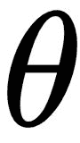的最佳集合。这可以直观地看作是一个优化问题，我们试图优化策略的目标，以找到性能最佳的策略。代理人策略的目标是什么？我们知道，代理人应该在长期内获得最大的回报，以完成任务或实现目标。如果我们可以用数学的方式来表达这个目标，我们就可以使用最优化技术来为代理人找到最佳的策略来完成给定的任务。

我们知道状态价值函数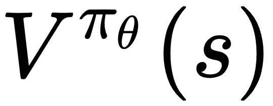告诉我们从状态开始并遵循策略直到剧集结束的预期收益。它告诉我们处于状态有多好。因此，理想情况下，一个好的策略对于环境中的起始状态将具有更高的值，因为它代表了处于该状态并根据策略采取行动直到事件结束的预期/均值/平均值。初始状态下的值越高，遵循策略的代理可以获得的总长期回报越高。因此，在一个情节环境中——环境是一个情节；也就是说，它有一个终止状态——我们可以根据起始状态的值来衡量策略的好坏。数学上，这样的目标函数可以写成如下:

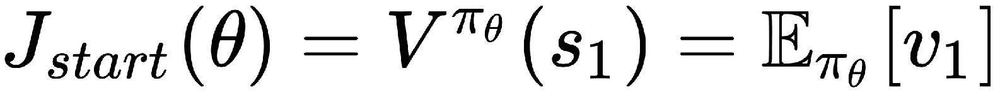

但是如果环境不是情节性的呢？这意味着它没有终止状态，而是继续运行。在这样的环境中，我们可以使用在遵循当前策略时被访问的状态的平均值。数学上，平均值目标函数可以写成如下形式:

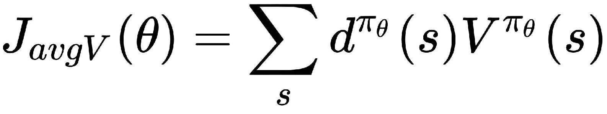

这里，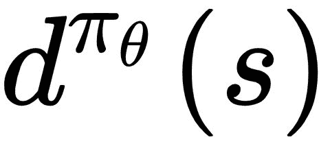是的马尔可夫链的平稳分布，它给出了遵循策略时访问状态的概率。

我们还可以使用在这种环境中每个时间步长获得的平均回报，这可以使用以下等式进行数学表达:

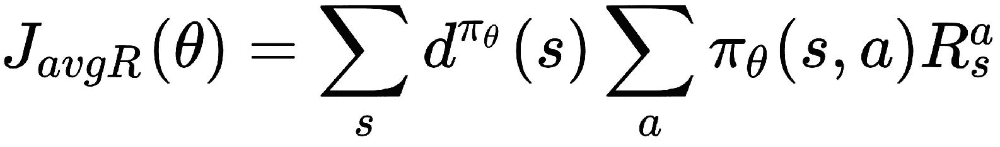

这实质上是当代理人根据策略采取行动时可以获得的预期回报值，可以写成这样的简写形式:

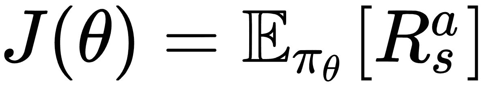

为了使用梯度下降来优化该策略目标函数，我们将对方程求关于的导数，找到梯度，反向传播，并执行梯度下降步骤。根据前面的等式，我们可以写出以下内容:

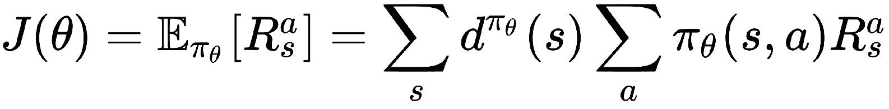

让我们通过扩展项并进一步简化来区分前面关于的等式。按照下列等式从左到右理解得出结果所涉及的一系列步骤:

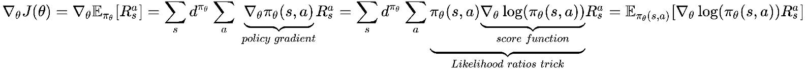

为了理解这些等式以及策略梯度如何等于可能性比率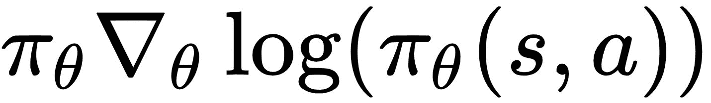，让我们后退一步，重新审视我们的目标是什么。我们的目标是为策略找到一组最优的参数，这样遵循策略的代理人将在期望中获得最大的回报(即平均)。为了实现这一目标，我们从一组参数开始，然后不断更新参数，直到达到最佳参数集。为了计算出策略参数必须在参数空间中的哪个方向被更新，我们利用由策略相对于参数的梯度所指示的方向。让我们从上一个等式中的第二项(根据定义，它是第一项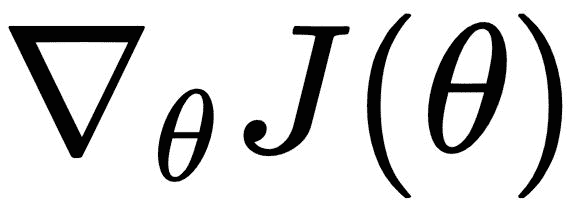的结果)开始:

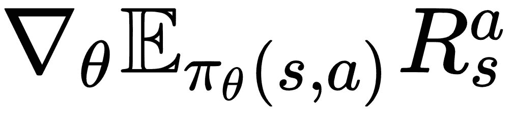是在策略下，因在状态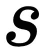中采取行动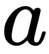而产生的阶梯奖励的期望值的梯度。根据期望值的定义，这可以写成下面的和:

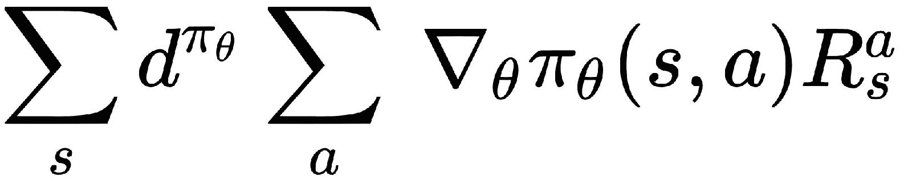

我们将看看似然比技巧，它在这种情况下用于将这个方程转换成使计算可行的形式。


# 似然比技巧

由表示的策略被假定为一个可微分函数，只要它不为零，但是计算策略相对于θ的梯度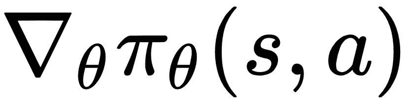可能并不简单。我们可以通过两边的策略进行乘法和除法运算，得到以下结果:

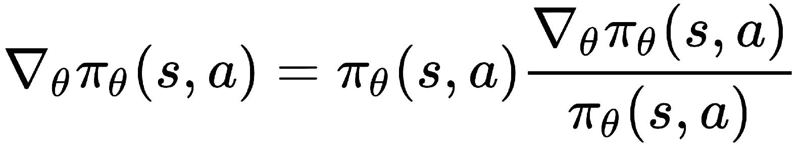

从微积分中，我们知道函数对数的梯度是函数对函数本身的梯度，数学上由下式给出:

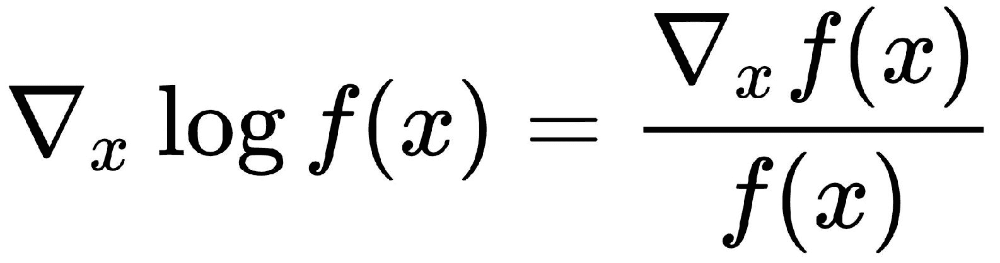

因此，我们可以将策略的梯度相对于其参数写成如下形式:

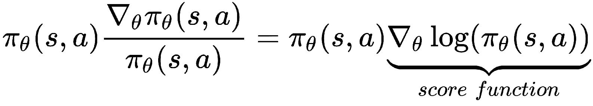

在机器学习中，这被称为似然比技巧，或对数导数技巧。


# 策略梯度定理

因为根据定义，策略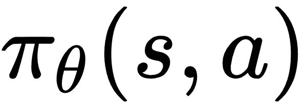是描述给定状态和参数的动作的概率分布的概率分布函数，所以状态和动作的双重求和项可以被表示为由奖励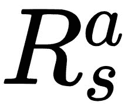对分布进行缩放的得分函数的期望。这在数学上等同于以下内容:

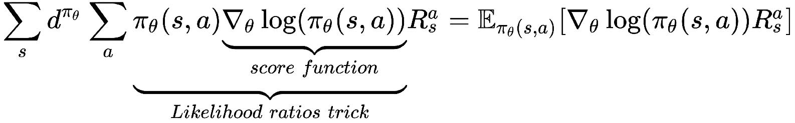

注意，在前面的等式中，是从状态开始采取行动的步进奖励。

策略梯度定理通过用长期行动值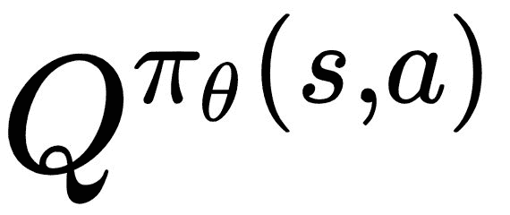代替瞬时步骤回报概括了这种方法，可以写成如下形式:

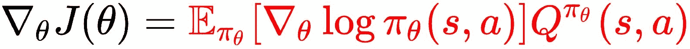

这是一个非常有用的结果，并形成了策略梯度方法的几个变种的基础。

有了对策略梯度的理解，我们将在接下来的几节中深入研究演员-评论家算法及其变体。


# 演员-评论家算法

让我们从演员-评论家架构的图示开始，如下图所示:

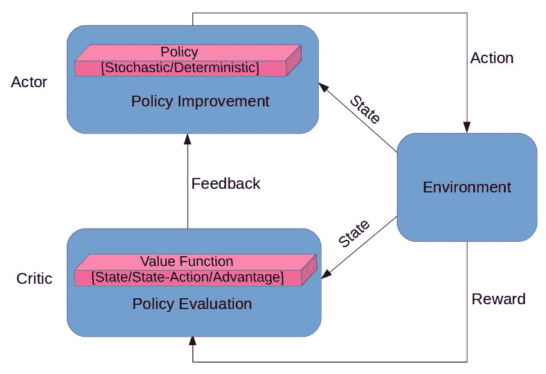

actor-critic 算法中有两个组件，从名称和上图中可以明显看出。演员负责在环境中行动，包括根据对环境的观察和基于代理的策略采取行动。参与者可以被认为是策略的持有者/制定者。另一方面，评论家负责估计状态-值、或状态-动作-值、或优势-值函数(取决于所使用的演员-评论家算法的变体)。让我们考虑一个案例，评论家试图估算行动价值函数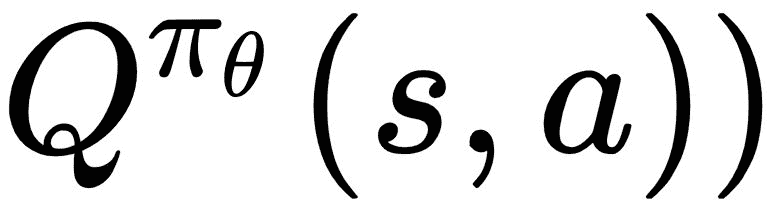。如果我们使用一组参数 *w* 来表示评论家的参数，评论家的估计基本上可以写成:

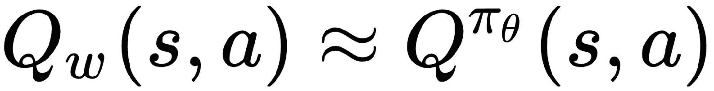

在上一节的策略梯度定理的结果中，将真实的行动值函数替换为行动值函数的评论家近似(策略梯度定理一节中的最后一个方程),使我们得出由下式给出的近似策略梯度:

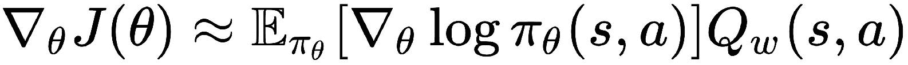

在实践中，我们使用随机梯度上升(或带-ve 符号的下降)来进一步逼近期望值。


# 优势演员-评论家算法

行动-价值演员-评论家算法仍然有很高的方差。我们可以通过从策略梯度中减去基线函数 *B(s)* 来减小方差。一个好的基线是状态值函数。以状态值函数为基线，我们可以将策略梯度定理的结果改写如下:

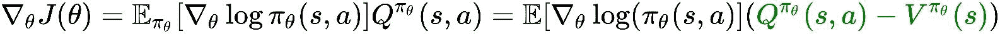

我们可以将优势函数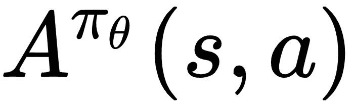定义如下:

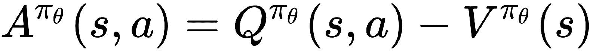

当在之前的策略梯度方程中使用基线时，这为我们提供了演员-批评者策略梯度的优势:

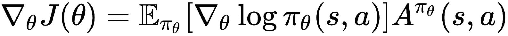

回想一下前面的章节，值函数的 1 步时差(TD)误差由下式给出:

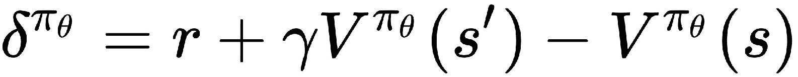

如果我们计算这个 TD 误差的期望值，我们将得到一个类似于我们在[第 2 章](part0033.html#VF2I0-22c7fc7f93b64d07be225c00ead6ce12)、*强化学习和深度强化学习*中看到的动作值函数定义的方程。从该结果中，我们可以观察到 TD 误差实际上是优势函数的无偏估计，如在该等式中从左到右导出的:

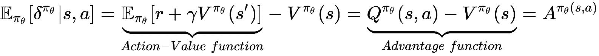

有了这个结果和本章前面的方程组，我们就有足够的理论背景来开始实现我们的代理了！在我们进入代码之前，让我们理解算法的流程，以便在我们的脑海中有一个好的图像。

最简单(一般/普通)形式的优势演员-评论家算法包括以下步骤:

1.  初始化(随机)策略和价值函数估计。
2.  对于给定的观察/状态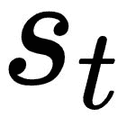，执行由当前策略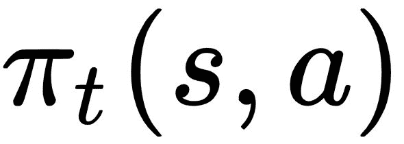规定的动作。
3.  使用一步 TD 学习方程: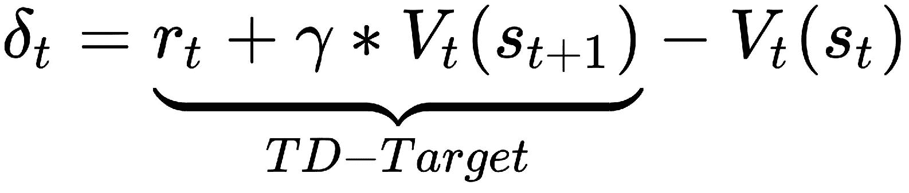根据得到的状态和奖励计算 TD 误差
4.  通过基于 TD 误差调整状态的动作概率来更新参与者:
    *   如果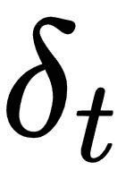 >为 0，增加采取行动的可能性，因为是一个好的决定，而且效果非常好
    *   如果 <为 0，降低采取行动的概率，因为导致代理表现不佳
5.  通过使用 TD 误差调整的估计值来更新 critic:
    *   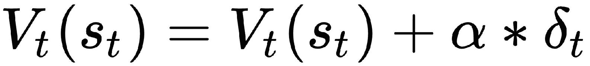，其中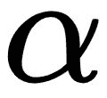为评论家的学习率
6.  将下一个状态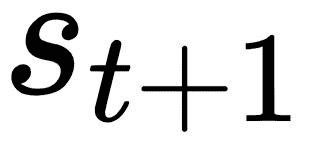设置为当前状态并重复步骤 2。


# n 步优势演员-评论家算法

在优势演员-评论家算法部分，我们看了实现算法所涉及的步骤。在第 3 步中，我们注意到我们必须根据 1 步回报(TD 目标)计算 TD 误差。这就像让代理人在环境中采取一个步骤，然后根据结果，计算评论家估计的误差，并更新代理人的策略。这听起来简单明了，对吗？但是，有没有更好的方法来学习和更新策略呢？正如您可能已经从本节的标题中猜到的那样，其思想是使用 n 步回归，与基于 1 步回归的 TD 学习相比，它使用更多的信息来学习和更新策略。n 步 TD 学习可以被视为一般化的版本，并且如前一部分所讨论的，在 actor-critic 算法中使用的 1 步 TD 学习是 n=1 的 n 步 TD 学习算法的特例。让我们看一个简单的例子来理解 n 步回报的计算，然后实现一个 Python 方法来计算 n 步回报，我们将在代理实现中使用这个方法。


# n 步返回

n 步返回是一个简单但非常有用的概念，已知它可以为几种强化学习算法产生更好的性能，而不仅仅是基于 advantage actor-critic 的算法。例如，在 Atari 套件的 57 款游戏中，迄今为止表现最好的算法使用了 n 步回报，其表现明显优于第二好的算法。我们将在[第 10 章](part0173.html#54VHA0-22c7fc7f93b64d07be225c00ead6ce12)、*探索学习环境景观:Roboschool、Gym-Retro、StarCraft-II、DMLab* 中实际讨论那个名为 Rainbow 的代理算法。

我们先来直观的了解一下 n 步退货流程。让我们用下图来说明环境中的一个步骤。假设代理在时间 t=1 时处于状态，并决定采取行动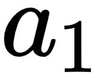，这导致环境在时间 t=t+1= 1+1 = 2 时转换到状态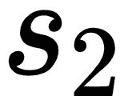，代理接收到奖励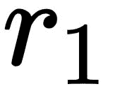:

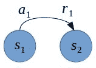

我们可以使用以下公式计算 1 步 TD 回报:

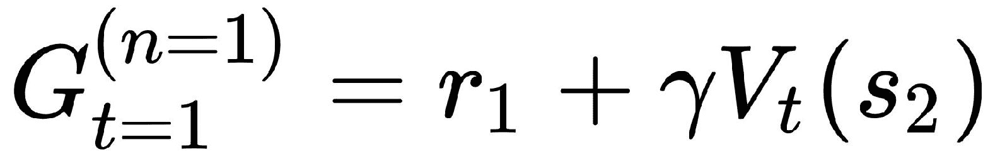

这里，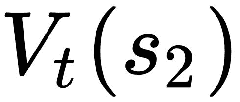是根据价值函数(critic)对状态的价值估计。实质上，代理采取一个步骤，并使用收到的回报和代理对下一个/结果状态的估计值的贴现值来计算回报。

如果我们让智能体继续与环境进行多几步的交互，智能体的轨迹可以用下图简单地表示出来:

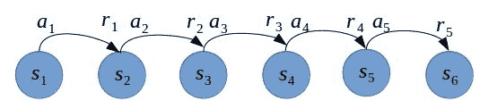

该图显示了代理和环境之间的 5 步交互。按照上一段中计算 1 步回报的类似方法，我们可以使用以下公式计算 5 步回报:

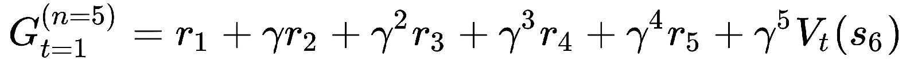

然后，我们可以在优势演员-评论家算法的步骤 3 中将其用作 TD 目标，以提高代理的性能。

通过在任何健身房环境中运行`parameters.json`文件中的`learning_step_thresh`参数设置为 1(对于 1 步返回)和 5 或 10(对于 n 步返回)的`ch8/a2c_agent.py`脚本，您可以看到具有 1 步返回的 advantage 演员-评论家代理的性能与具有 n 步返回的性能相比如何。
例如，您可以使用`learning_step_thresh=1`运行
`(rl_gym_book) praveen@ubuntu:~/HOIAWOG/ch8$python a2c_agent.py --env Pendulum-v0`，使用命令
`(rl_gym_book) praveen@ubuntu:~/HOIAWOG/ch8/logs$tensorboard --logdir=.`使用 Tensorboard 监控其性能，然后在大约一百万步之后，您可以比较使用`learning_step_thresh=10`训练的代理的性能。请注意，经过训练的代理模型将在`~/HOIAWOG/ch8/trained_models/A2_Pendulum-v0.ptm`保存。您可以在开始第二次运行之前将其重命名或移动到不同的目录，以便从头开始培训！

为了使这个概念更加明确，让我们讨论一下我们将如何在步骤 3 和 advantage actor-critic 算法中使用它。我们将首先使用 n 步回报作为 TD 目标，并使用以下公式计算 TD 误差(算法的第 3 步):

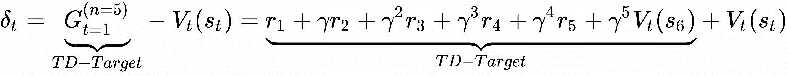

然后，我们将遵循上一小节中讨论的算法的步骤 4，并更新 critic。然后，在步骤 5 中，我们将使用以下更新规则更新评论家:


然后，我们将移动到算法的步骤 6，继续下一个状态，使用从到的 5 步转换，并计算 5 步返回，然后重复更新的过程。


# 实现 n 步回报计算

如果我们暂停片刻，分析正在发生的事情，你可能会发现我们可能没有充分利用 5 步长轨迹。通过访问从状态开始的代理的 5 步长轨迹的信息，我们最终只学到了一条新的信息，这是关于更新演员和评论家()。我们实际上可以通过使用相同的 5 步轨迹来计算轨迹中存在的每个状态值的更新，使学习过程更有效，其中它们各自的 *n* 值基于轨迹的终点。例如，在简化的轨迹表示中，如果我们考虑状态，轨迹的前视图包含在气泡内，如下图所示:


我们可以使用气泡内的信息来提取状态的 TD 学习目标。在这种情况下，由于从只能获得一步信息，我们将计算一步回报，如下式所示:


正如我们之前讨论的，我们可以使用这个值作为等式中的 TD 目标来获得另一个 TD 误差值，并使用第二个值来更新 actor 和，此外还有以前的更新()。现在，我们又多了一条供代理学习的信息！

如果我们应用同样的直觉并考虑状态，轨迹的前视被包含在气泡中，如下图所示:


我们可以使用气泡内的信息来提取的 TD 学习目标。在这种情况下，有两种类型的信息可以从获得；因此，我们将使用以下等式计算两步回报率:


如果我们看看这个等式和前面的等式，我们可以观察到和之间有一个关系，由下面的等式给出:


这为代理提供了另一个可以学习的信息。同样，我们可以从这个代理的轨迹中提取更多的信息。将相同的概念延伸到和，我们可以得出以下关系:


同样，简而言之，我们可以观察到以下情况:

 

最后，我们还可以观察到以下情况:


简单来说，我们可以从轨迹中的最后一步开始，计算 n 步收益，直到轨迹的终点，然后移回到上一步，使用之前计算的值来计算收益。

实现简单明了，建议您自己尝试实现。现提供如下，供您参考:

```
def calculate_n_step_return(self, n_step_rewards, final_state, done, gamma):
        """
        Calculates the n-step return for each state in the input-trajectory/n_step_transitions
        :param n_step_rewards: List of rewards for each step
        :param final_state: Final state in this n_step_transition/trajectory
        :param done: True rf the final state is a terminal state if not, False
        :return: The n-step return for each state in the n_step_transitions
        """
        g_t_n_s = list()
        with torch.no_grad():
            g_t_n = torch.tensor([[0]]).float() if done else self.critic(self.preproc_obs(final_state)).cpu()
            for r_t in n_step_rewards[::-1]: # Reverse order; From r_tpn to r_t
                g_t_n = torch.tensor(r_t).float() + self.gamma * g_t_n
                g_t_n_s.insert(0, g_t_n) # n-step returns inserted to the left to maintain correct index order
            return g_t_n_s
```


# 深度 n 步优势演员-评论家算法

我们观察到 actor-critic 算法结合了基于价值的方法和基于策略的方法。评论家估计价值函数，参与者遵循策略，我们研究了如何更新参与者和评论家。从我们之前在[第 6 章](part0094.html#2PKKS0-22c7fc7f93b64d07be225c00ead6ce12)、*中使用深度 Q 学习*实现最优离散控制的智能代理的经验中，我们很自然地想到了使用神经网络来逼近价值函数，从而逼近评论家。我们还可以使用神经网络来表示策略，在这种情况下，参数是神经网络的权重。使用深度神经网络来逼近演员和评论家正是深度演员-评论家算法背后的想法。


# 实现深度 n 步优势演员评论家代理

我们已经准备好了实现深度 n 步优势演员-评论家(A2C)代理所需的所有背景信息。让我们看一下代理实现过程的概述，然后直接进入动手实现。

以下是我们 A2C 代理的高层流程:

1.  初始化演员和评论家的网络。
2.  使用参与者的当前策略从环境中收集 n 步经验，并计算 n 步回报。

3.  计算演员和评论家的损失。
4.  执行随机梯度下降优化步骤来更新演员和评论家参数。
5.  从步骤 2 开始重复。

我们将在名为`DeepActorCriticAgent`的 Python 类中实现代理。你会在本书第八章的代码库中找到完整的实现:`ch8/a2c_agent.py`。我们将使这个实现更加灵活，这样我们就可以轻松地为批量版本进一步扩展它，并制作 n 步 advantage actor-critic agent 的异步版本。


# 初始化演员和评论家网络

`DeepActorCriticAgent`类的初始化很简单。我们将快速浏览一下，然后看看我们实际上是如何定义和初始化演员和评论家网络的。

代理的初始化功能如下所示:

```
class DeepActorCriticAgent(mp.Process):
    def __init__(self, id, env_name, agent_params):
        """
        An Advantage Actor-Critic Agent that uses a Deep Neural Network to represent it's Policy and the Value function
        :param id: An integer ID to identify the agent in case there are multiple agent instances
        :param env_name: Name/ID of the environment
        :param agent_params: Parameters to be used by the agent
        """
        super(DeepActorCriticAgent, self).__init__()
        self.id = id
        self.actor_name = "actor" + str(self.id)
        self.env_name = env_name
        self.params = agent_params
        self.policy = self.multi_variate_gaussian_policy
        self.gamma = self.params['gamma']
        self.trajectory = [] # Contains the trajectory of the agent as a sequence of Transitions
        self.rewards = [] # Contains the rewards obtained from the env at every step
        self.global_step_num = 0
        self.best_mean_reward = - float("inf") # Agent's personal best mean episode reward
        self.best_reward = - float("inf")
        self.saved_params = False # Whether or not the params have been saved along with the model to model_dir
        self.continuous_action_space = True #Assumption by default unless env.action_space is Discrete
```

你可能想知道为什么`agent`类继承了`multiprocessing.Process`类。虽然对于我们的第一个代理实现，我们将在一个过程中运行一个代理，但是我们可以使用这个灵活的界面来并行运行多个代理，以加快学习过程。

让我们继续使用用 PyTorch 操作定义的神经网络来实现演员和评论家。遵循与我们在[第 6 章](part0094.html#2PKKS0-22c7fc7f93b64d07be225c00ead6ce12)、*中使用的 deep Q-learning agent 类似的代码结构，使用 Deep Q Learning* 实现用于最优离散控制的智能 agent，在代码库中，您将看到我们正在使用名为`function_approximator`的模块来包含我们基于神经网络的函数逼近器实现。你可以在这本书的代码库中的`ch8/function_approximator`文件夹下找到完整的实现。

由于一些环境具有小且离散的状态空间，例如`Pendulum-v0`、`MountainCar-v0`或`CartPole-v0`环境，我们也将实现神经网络的浅版本以及深版本，以便我们可以根据代理被训练/测试的环境动态地选择合适的神经网络。当您查看演员的神经网络的示例实现时，您会注意到在`shallow`和`deep`函数逼近器模块中，都有一个名为`Actor`的类和一个名为`DiscreteActor`的不同类。这也是出于一般性的目的，以便我们可以让代理根据环境的动作空间是连续的还是离散的，动态地挑选和使用最适合代表演员的神经网络。对于我们的代理实现的完整性和通用性，还有一个变化需要注意:我们实现中的`shallow`和`deep`函数逼近器模块都有一个`ActorCritic`类，它是一个单一的神经网络架构，代表参与者和评论家。这样，特征提取层在演员和评论家之间共享，同一神经网络中的不同头部(最终层)用于表示演员和评论家。

有时，实现的不同部分可能会令人困惑。为了避免混淆，以下是我们基于神经网络的演员-评论家实现中各种选项的总结:

| **模块/类别** | **描述** | **目的/使用案例** |  |
| 1.`function_approximator.shallow` | 演员-评论家表达的浅层神经网络实现。 | 具有低维状态/观察空间的环境。 |  |
| 1.1 `function_approximator.shallow.Actor` | 前馈神经网络实现，它为基于高斯分布的策略表示生成两个连续值:mu(平均值)和 sigma。 | 低维状态/观察空间和连续动作空间。 |  |
| 1.2 `function_approximator.shallow.DiscreteActor` | 前馈神经网络，为动作空间中的每个动作生成一个 logit。 | 低维状态/观察空间和离散动作空间。 |  |
| 1.3 `function_approximator.shallow.Critic` | 产生连续值的前馈神经网络。 | 用于表示具有低维状态/观察空间的环境的批判/价值函数 |  |
| 1.4 `function_approximator.shallow.ActorCritic` | 产生μ(平均值)、高斯分布的 sigma 和连续值的前馈神经网络。 | 对于具有低维状态/观察空间的环境，用于在同一网络中表示演员和评论家。可以将其修改为一个离散的演员-评论家网络。 |  |
| 2.`function_approximator.deep` | 演员、评论家表现的深度神经网络实现。 | 具有高维状态/观察空间的环境。 |  |
| 2.1 `function_approximator.deep.Actor` | 深度卷积神经网络，为基于高斯分布的策略表示生成 mu(均值)和 sigma。 | 高维状态/观察空间和连续动作空间。 |  |
| 2.2 `function_approximator.deep.DiscreteActor` | 深度卷积神经网络，为动作空间中的每个动作生成一个 logit。 | 高维状态/观察空间和离散动作空间。 |  |
| 2.3 `function_approximator.deep.Critic` | 产生连续值的深度卷积神经网络。 | 用于表示具有高维状态/观察空间的环境的评论家/价值函数。 |  |
| 2.4 `function_approximator.deep.ActorCritic` | 深度卷积神经网络，产生高斯分布的μ(均值)、sigma 以及连续值。 | 用于在具有高维状态/观察空间的环境中，在同一网络中表示演员和评论家。可以将其修改为一个离散的演员-评论家网络。 | 现在让我们看一下`run()`方法的第一部分，其中我们根据环境的状态和动作空间的类型，以及根据状态空间是低维还是高维(基于上表)来初始化 actor 和 critic 网络: |

使用当前策略收集 n 步经验

下一步是使用代理的当前策略执行所谓的*推出*，以收集`n`个转换。这个过程基本上是让代理与环境交互，并根据状态转换生成新的体验，通常表示为一个包含状态、动作、获得的奖励和下一个状态的元组，或简称为`(, , , )`，如下图所示:

```
from function_approximator.shallow import Actor as ShallowActor
from function_approximator.shallow import DiscreteActor as ShallowDiscreteActor
from function_approximator.shallow import Critic as ShallowCritic
from function_approximator.deep import Actor as DeepActor
from function_approximator.deep import DiscreteActor as DeepDiscreteActor
from function_approximator.deep import Critic as DeepCritic

def run(self):
        self.env = gym.make(self.env_name)
        self.state_shape = self.env.observation_space.shape
        if isinstance(self.env.action_space.sample(), int): # Discrete action space
            self.action_shape = self.env.action_space.n
            self.policy = self.discrete_policy
            self.continuous_action_space = False

        else: # Continuous action space
            self.action_shape = self.env.action_space.shape[0]
            self.policy = self.multi_variate_gaussian_policy
        self.critic_shape = 1
        if len(self.state_shape) == 3: # Screen image is the input to the agent
            if self.continuous_action_space:
                self.actor= DeepActor(self.state_shape, self.action_shape, device).to(device)
            else: # Discrete action space
                self.actor = DeepDiscreteActor(self.state_shape, self.action_shape, device).to(device)
            self.critic = DeepCritic(self.state_shape, self.critic_shape, device).to(device)
        else: # Input is a (single dimensional) vector
            if self.continuous_action_space:
                #self.actor_critic = ShallowActorCritic(self.state_shape, self.action_shape, 1, self.params).to(device)
                self.actor = ShallowActor(self.state_shape, self.action_shape, device).to(device)
            else: # Discrete action space
                self.actor = ShallowDiscreteActor(self.state_shape, self.action_shape, device).to(device)
            self.critic = ShallowCritic(self.state_shape, self.critic_shape, device).to(device)
        self.actor_optimizer = torch.optim.Adam(self.actor.parameters(), lr=self.params["learning_rate"])
        self.critic_optimizer = torch.optim.Adam(self.critic.parameters(), lr=self.params["learning_rate"])
```


# 

在上图所示的例子中，代理将在它的`self.trajectory`中填充五个转换的列表，如下所示:`[T1, T2, T3, T4, T5]`。

在我们的实现中，我们将使用稍微修改的转换表示来减少冗余计算。我们将使用以下定义来表示转换:

`Transition = namedtuple("Transition", ["s", "value_s", "a", "log_prob_a"])`
这里，`s`是状态，`value_s`是评论家对状态`s`的值的预测，`a`是采取的行动，`log_prob_a`是根据演员/代理人当前策略采取行动的概率的对数`a`。

我们将使用之前实现的`calculate_n_step_return(self, n_step_rewards, final_state, done, gamma)`方法，根据包含轨迹中每一步获得的标量奖励值的`n_step_rewards`列表和用于计算轨迹中最后/最后状态的评论家估计值的`final_state`来计算 n 步回报，正如我们之前在 n 步回报计算一节中讨论的。

计算演员和评论家的损失

根据我们之前对 n 步深度演员-评论家算法的描述，您可能记得用神经网络表示的评论家，正试图解决一个类似于我们在[第 6 章](part0094.html#2PKKS0-22c7fc7f93b64d07be225c00ead6ce12)、*中看到的问题，该问题使用深度 Q 学习*实现一个用于最佳离散控制的智能代理，它表示价值函数(类似于我们在本章中使用的动作-价值函数，但更简单一点)。我们可以使用标准的**均方误差** ( **MSE** )损失或更平滑的 L1 损失/休伯损失，根据评论家的预测值和上一步计算的 n 步回报(TD 目标)进行计算。


# 对于演员，我们将使用通过策略梯度定理获得的结果，特别是优势演员-评论家版本，其中优势值函数用于指导演员策略的梯度更新。我们将使用 TD_error，它是优势值函数的无偏估计。

综上，影评人和演员的损失如下:

*critic_loss = MSE( ，critic_prediction)*

*actor _ loss = log()* TD _ error*

*   捕捉到主要的损失计算公式后，我们可以使用`calculate_loss(self, trajectory, td_targets)`方法在代码中实现它们，如下面的代码片段所示:
*   更新演员-评论家模型

计算出演员和评论家的损失后，学习过程的下一步也是最后一步是根据他们的损失更新演员和评论家的参数。由于我们使用 awesome PyTorch 库，该库自动处理偏导数、误差反向传播和梯度计算，因此使用前面步骤的结果实现起来简单明了，如以下代码示例所示:

```
def calculate_loss(self, trajectory, td_targets):
        """
        Calculates the critic and actor losses using the td_targets and self.trajectory
        :param td_targets:
        :return:
        """
        n_step_trajectory = Transition(*zip(*trajectory))
        v_s_batch = n_step_trajectory.value_s
        log_prob_a_batch = n_step_trajectory.log_prob_a
        actor_losses, critic_losses = [], []
        for td_target, critic_prediction, log_p_a in zip(td_targets, v_s_batch, log_prob_a_batch):
            td_err = td_target - critic_prediction
            actor_losses.append(- log_p_a * td_err) # td_err is an unbiased estimated of Advantage
            critic_losses.append(F.smooth_l1_loss(critic_prediction, td_target))
            #critic_loss.append(F.mse_loss(critic_pred, td_target))
        if self.params["use_entropy_bonus"]:
            actor_loss = torch.stack(actor_losses).mean() - self.action_distribution.entropy().mean()
        else:
            actor_loss = torch.stack(actor_losses).mean()
        critic_loss = torch.stack(critic_losses).mean()

        writer.add_scalar(self.actor_name + "/critic_loss", critic_loss, self.global_step_num)
        writer.add_scalar(self.actor_name + "/actor_loss", actor_loss, self.global_step_num)

        return actor_loss, critic_loss
```


# 用于保存/加载、记录、可视化和监控的工具

在前面的章节中，我们介绍了代理学习算法实现的核心部分。除了这些核心部分之外，还有一些实用函数，我们将使用它们在不同的学习环境中训练和测试代理。我们将重用我们已经在[第 6 章](part0094.html#2PKKS0-22c7fc7f93b64d07be225c00ead6ce12)、*中开发的组件，使用深度 Q 学习*实现智能代理进行最优离散控制，例如`utils.params_manager`，以及`save()`和`load()`方法，它们分别保存和加载代理的训练过的大脑或模型。我们还将利用日志记录实用程序，以 Tensorboard 可使用的格式记录代理的进度，以实现美观、快速的可视化，并进行调试和监控，以查看代理的培训过程是否有问题。

```
def learn(self, n_th_observation, done):
        td_targets = self.calculate_n_step_return(self.rewards, n_th_observation, done, self.gamma)
        actor_loss, critic_loss = self.calculate_loss(self.trajectory, td_targets)

        self.actor_optimizer.zero_grad()
        actor_loss.backward(retain_graph=True)
        self.actor_optimizer.step()

        self.critic_optimizer.zero_grad()
        critic_loss.backward()
        self.critic_optimizer.step()

        self.trajectory.clear()
        self.rewards.clear()
```


# 这样，我们就可以完成 n 步优势演员-评论家代理的实现了！您可以在`ch8/a2c_agent.py`文件中找到完整的实现。在我们了解如何训练代理之前，在下一节中，我们将快速了解我们可以应用于 deep n-step advantage 代理的一个扩展，以使它在多核计算机上的性能更好。

一个扩展异步深度 n 步优势演员-评论家

我们可以对我们的代理实现进行的一个简单的扩展是启动我们的代理的几个实例，每个实例都有自己的学习环境实例，并以异步的方式发送回他们所学习的内容的更新，也就是说，只要它们可用，就不需要任何时间同步。这种算法通常被称为 A3C 算法，是异步优势演员-评论家的缩写。


# 这一扩展背后的动机之一源于我们在第 6 章[、](part0094.html#2PKKS0-22c7fc7f93b64d07be225c00ead6ce12)、*中了解到的，通过使用深度 Q 学习*和经验回放记忆，实现一个智能代理以实现最佳离散控制。我们的深度 Q 学习代理能够通过添加经验重放记忆来学习得更好，这实质上有助于解除顺序决策问题中的相关性，并让代理从其过去的经验中提取更多的果汁/信息。类似地，使用并行运行的多个演员-学习者实例背后的思想被发现有助于打破转换之间的相关性，并且也有助于探索环境中状态空间的不同部分，因为每个演员-学习者过程有其自己的一组策略参数和环境实例要探索。一旦并行运行的代理实例有一些更新要发回，它们就将这些更新发送到一个共享的全局代理实例，然后该实例充当其他代理实例要同步的新参数源。

我们可以使用 Python 的 PyTorch 多处理库来实现这个扩展。是啊！你猜对了。这就是我们实现中的`DeepActorCritic`代理从一开始就子类化`torch.multiprocessing.Process`的原因，这样我们就可以向它添加这个扩展，而不需要任何重大的代码重构。如果你感兴趣的话，你可以查看本书代码库中的`ch8/README.md`文件，获得更多关于探索这种架构的资源。

我们可以很容易地扩展我们在`a2c_agent.py`中的 n 步优势演员-评论家代理实现，以实现同步深度 n 步优势演员-评论家代理。你可以在`ch8/async_a2c_agent.py`中找到异步实现。

训练智能和自动驾驶智能体

我们现在已经拥有了完成本章目标所需的所有部件，即组装一个智能的自动驾驶智能体，然后训练它在照片般逼真的卡拉驾驶环境中自动驾驶汽车，这是我们在前一章中使用健身房界面开发的学习环境。代理培训过程可能需要一段时间。根据您要培训代理的机器的硬件，这可能需要几个小时的时间(对于较简单的环境，如`Pendulum-v0`、`CartPole-v0`和一些 Atari 游戏)到几天的时间(对于复杂的环境，如 CARLA 驾驶环境)。为了首先很好地理解培训过程以及如何在代理人培训时监控进度，我们将从几个简单的示例开始，来浏览培训和测试代理人的整个过程。然后，我们将看看如何轻松地将它转移到 CARLA 驾驶环境中，以进一步训练它。


# 训练和测试深层 n 步优势演员-评论家代理

因为我们的代理的实现是通用的(如前一节步骤 1 中使用的表格所讨论的)，我们可以使用任何具有健身房兼容界面的学习环境来训练/测试代理。您可以在本书前几章讨论的各种环境中试验和训练代理，我们还将在下一章讨论一些更有趣的学习环境。别忘了我们定制的卡拉汽车驾驶环境！


# 我们将挑选一些环境作为示例，并介绍如何启动培训和测试流程，让您开始自己进行试验。首先，更新你的书的代码库和`cd`到`ch8`文件夹，这一章的代码驻留在那里。像往常一样，确保激活我们为这本书创建的 conda 环境。之后，您可以使用`a2c_agent.py`脚本启动 n 步优势演员评论家代理的培训流程，如下所示:

您可以将`Pendulum-v0`替换为您机器上设置的任何与健身房兼容的学习环境名称。

这将启动代理的训练脚本，该脚本将使用在`~/HOIAWOG/ch8/parameters.json`文件中指定的默认参数(您可以更改该参数进行实验)。它还将从`~/HOIAWOG/ch8/trained_models`目录中为指定的环境加载经过训练的代理的大脑/模型，如果可用的话，并继续训练。对于高维状态空间环境，如 Atari 游戏，或其他状态/观察是场景图像或屏幕像素的环境，将使用我们在前面一节中讨论的深度卷积神经网络，它将利用您机器上的 GPU(如果可用)来加速计算(如果需要，您可以通过在`parameters.json`文件中设置`use_cuda = False`来禁用它)。如果您的机器上有多个 GPU，并且想要在不同的 GPU 上训练不同的代理，您可以使用`--gpu-id`标志将 GPU 设备 ID 指定为`a2c_agent.py`脚本的命令行参数，以要求脚本使用特定的 GPU 进行训练/测试。

```
(rl_gym_book) praveen@ubuntu:~/HOIAWOG/ch8$ python a2c_agent --env Pendulum-v0
```

一旦训练过程开始，您可以通过从`logs`目录中使用以下命令启动`tensorboard`来监控代理的过程:

在使用前面的命令启动`tensorboard`之后，您可以访问位于`http://localhost:6006`的网页来监控代理的进度。此处提供示例截图供您参考；这些来自 n 步优势演员-评论家代理的两次训练运行，使用`parameters.json`文件中的`learning_step_threshold`参数，对 *n* 步使用不同的值:

演员-评论家(使用单独的演员和评论家网络):

```
(rl_gym_book) praveen@ubuntu:~/HOIAWOG/ch8/logs$ tensorboard --logdir .
```

-`Pendulum-v0`；n 步(学习步骤阈值= 100)


1.  2.-`Pendulum-v0`；n 步(学习步骤阈值= 5)


比较 1(绿色 100 步交流)和 2(灰色 5 步交流)在`Pendulum-v0`上的 1000 万步:


*   训练脚本还会将训练过程的摘要输出到控制台。如果您想要可视化环境，以查看代理正在做什么或者它是如何学习的，您可以在启动训练脚本时将`--render`标志添加到命令中，如下行所示:

如您所见，我们已经到了这样一个地步，您只需一个命令就可以训练、记录和可视化代理的性能！到目前为止，我们已经取得了很大的进展。

您可以在相同的环境或不同的环境中，使用不同的代理参数集运行几个实验。选择前面的例子是为了在一个更简单的环境中演示它的性能，以便您可以轻松地运行完整长度的实验并再现和比较结果，而不管您可能拥有的硬件资源如何。作为本书代码库的一部分，为一些环境提供了训练有素的代理大脑/模型，以便您可以在测试模式下快速启动和运行脚本，以查看训练有素的代理如何执行任务。它们可以在你的书的存储库的 fork 中的`ch8/trianed_models`文件夹中获得，或者在这里的上游源:[https://github . com/packt publishing/Hands-On-Intelligent-Agents-with-open ai-Gym/tree/master/ch8/trained _ models](https://github.com/PacktPublishing/Hands-On-Intelligent-Agents-with-OpenAI-Gym/tree/master/ch8/trained_models)。您还可以在本书的代码库中找到其他资源，如其他环境中学习曲线的插图和代理在各种环境中执行的视频剪辑，供您参考。

```
(rl_gym_book) praveen@ubuntu:~/HOIAWOG/ch8$ python a2c_agent --env CartPole-v0 --render
```

一旦您准备好测试代理，无论是使用您自己训练过的代理大脑模型还是使用预先训练过的代理大脑，您都可以使用`--test`标志来表示您想要禁用学习并在测试模式下运行代理。例如，要在打开学习环境渲染的情况下在`LunarLander-v2`环境中测试代理，您可以使用以下命令:

我们可以互换使用我们讨论过的异步代理作为基本代理的扩展。由于两个代理实现遵循相同的结构和配置，我们可以通过使用`async_a2c_agent.py`脚本代替`a2c_agent.py`轻松切换到异步代理训练脚本。他们甚至支持相同的命令行参数来简化我们的工作。当使用`asyn_a2c_agent.py`脚本时，您应该确保在`parameters.json`文件中设置`num_agents`参数，基于您希望代理用于训练的进程或并行实例的数量。例如，我们可以使用以下命令在`BipedalWalker-v2`环境中训练代理的异步版本:

您可能已经意识到，我们的代理实现能够在各种不同的环境中学习行动，每个环境都有自己要完成的一组任务，以及自己的状态、观察和行动空间。正是这种多功能性使得基于深度强化学习的代理受到欢迎，并适用于解决各种问题。现在我们已经熟悉了培训过程，我们终于可以继续培训代理驾驶汽车，并按照 CARLA 驾驶模拟器中的车道行驶。

```
(rl_gym_book) praveen@ubuntu:~/HOIAWOG/ch8$ python a2c_agent --env LunarLander-v2 --test --render
```

在卡拉驾驶模拟器中训练代理驾驶汽车

```
(rl_gym_book) praveen@ubuntu:~/HOIAWOG/ch8$ python async_a2c_agent --env BipedalWalker-v2 
```

让我们开始在卡拉驾驶环境中训练一个代理人吧！首先，确保你的 GitHub fork 与上游的 master 保持一致，这样你就可以从书的库中获得最新的代码。由于我们在上一章中创建的 CARLA 环境与 OpenAI 健身房接口兼容，因此使用 CARLA 环境进行训练实际上很容易，就像任何其他健身房环境一样。您可以使用以下命令训练 n 步优势演员-评论家代理:


# 这将启动代理的培训过程，就像我们之前看到的那样，进度摘要将被打印到控制台窗口，同时日志被写入`logs`文件夹，可以使用`tensorboard`查看。

在培训过程的初始阶段，您会注意到代理正在疯狂地驾驶汽车！

```
(rl_gym_book) praveen@ubuntu:~/HOIAWOG/ch8$ python a2c_agent --env Carla-v0
```

经过几个小时的训练，你会看到代理人学会控制汽车，并成功地沿着道路行驶，同时保持在车道上，避免撞上其他车辆。在`ch8/trained_models`文件夹中有一个经过培训的自动驾驶代理模型，您可以快速地对代理进行测试！您还可以在本书的代码库中找到更多的资源和实验结果，以帮助您的学习和实验。快乐实验！

摘要

在这一章中，我们从基础开始，实际操作了一个基于演员-评论家架构的深度强化学习代理。我们从介绍基于策略梯度的方法开始，逐步介绍了表示策略梯度优化的目标函数、理解似然比技巧以及最终推导策略梯度定理的过程。然后，我们看了 actor-critic 体系结构如何利用策略梯度定理，并根据体系结构的实现，使用 actor 组件来表示代理的策略，使用 critic 组件来表示状态/动作/优势值函数。有了对演员-评论家体系结构的直观理解，我们继续讨论 A2C 算法，并讨论了其中涉及的六个步骤。然后，我们使用图表讨论了 n 步回报计算，并看到了在 Python 中实现 n 步回报计算方法是多么容易。然后，我们继续深入 n 步优势演员-评论家代理的一步一步的实现。


# 我们还讨论了如何使实现灵活和通用，以适应各种环境，这些环境可能具有不同的状态、观察和操作空间维度，也可能是连续的或离散的。然后，我们研究了如何在不同的进程上并行运行代理的多个实例，以提高学习性能。在上一节中，我们介绍了培训代理过程中涉及的步骤，以及一旦他们接受了培训，我们如何使用`--test`和`--render`标志来测试代理的表现。我们从更简单的环境开始，以适应训练和监控过程，然后最终继续完成本章的目标，即在 CARLA 驾驶模拟器中训练智能代理自动驾驶汽车！我希望你通过这相对较长的一章学到了很多东西。至此，您已经从本章和[第 6 章](part0094.html#2PKKS0-22c7fc7f93b64d07be225c00ead6ce12)、*中了解并实现了两大类高性能学习代理算法，使用深度 Q 学习*实现了一个智能代理用于 *最优离散控制。在下一章中，我们将探索新的和有前途的学习环境，在那里你可以训练你的自定义代理，并开始向下一个级别前进。*

In this chapter, we got hands-on with an actor-critic architecture-based deep reinforcement learning agent, starting from the basics. We started with the introduction to policy gradient-based methods and walked through the step-by-step process of representing the objective function for the policy gradient optimization, understanding the likelihood ratio trick, and finally deriving the policy gradient theorem. We then looked at how the actor-critic architecture makes use of the policy gradient theorem and uses an actor component to represent the policy of the agent, and a critic component to represent the state/action/advantage value function, depending on the implementation of the architecture. With an intuitive understanding of the actor-critic architecture, we moved on to the A2C algorithm and discussed the six steps involved in it. We then discussed the n-step return calculation using a diagram, and saw how easy it is to implement the n-step return calculation method in Python. We then moved on to the step-by-step implementation of the deep n-step advantage actor-critic agent.

We also discussed how we could make the implementation flexible and generic to accommodate a variety of environments, which may have different state, observation and action space dimensions, and also may be continuous or discrete. We then looked at how we can run multiple instances of the agent in parallel on separate processes to improve the learning performance. In the last section, we walked through the steps involved in the process of training the agents, and once they are trained, how we can use the `--test` and `--render` flags to test the agent's performance. We started with simpler environments to get accustomed to the training and monitoring process, and then finally moved on to accomplishing the goal of this chapter, which was to train an intelligent agent to drive a car autonomously in the CARLA driving simulator! I hope you learned a lot going through this relatively long chapter. At this point, you have experience understanding and implementing two broad classes of high-performance learning agent algorithms from this chapter and [Chapter 6](part0094.html#2PKKS0-22c7fc7f93b64d07be225c00ead6ce12), *Implementing an Intelligent Agent for* *Optimal Discrete Control using Deep Q-Learning*. In the next chapter, we will explore the landscape of new and promising learning environments, where you can train your custom agents and start making progress towards the next level.