<title>Exploring the Learning Environment Landscape - Roboschool, Gym-Retro, StarCraft-II, DeepMindLab</title> 

# 探索学习环境景观-机器人学校，健身房-复古，星际争霸-II，DeepMindLab

在构建智能代理来解决各种具有挑战性的问题的过程中，您已经取得了很大的进步。在前几章中，我们研究了 OpenAI Gym 中可用的几种环境。在这一章中，我们将把目光投向体育馆之外，看看其他一些可以用来训练智能代理或进行实验的发展良好的环境。

在我们查看其他为开发智能代理提供良好学习环境的开源库之前，我们先来看看最近添加到 OpenAI Gym 库中的一类环境。如果你像我一样对机器人感兴趣，你会非常喜欢这个。是啊！它是机器人类的环境，为机器人操作任务提供了非常有用的环境，比如用机械臂抓取、滑动、推动等等。这些机器人环境基于 MuJoCo 引擎，您可能还记得[第 3 章](part0056.html#1LCVG0-22c7fc7f93b64d07be225c00ead6ce12) [，](part0056.html#1LCVG0-22c7fc7f93b64d07be225c00ead6ce12)*open ai Gym 和深度强化学习入门*，MuJoCo 引擎需要付费许可，除非您是学生，并将 MuJoCo 用于个人或课堂用途。这些机器人环境的摘要显示在下面的屏幕截图中，带有环境名称和每个环境的简要描述，因此如果您有兴趣探索此类问题，可以查看它们:

<title>Gym interface-compatible environments</title> 

# 健身房界面兼容环境

在本节中，我们将深入了解与健身房界面兼容的环境。您应该能够在这些环境中使用我们在前面章节中开发的任何代理。让我们开始，看看几个非常有用和有前途的学习环境。

<title>Roboschool</title> 

# 机器人学校

roboschool[(https://github.com/openai/roboschool)](https://github.com/openai/roboschool)在模拟中提供了几种控制机器人的环境。它是由 OpenAI 发布的，该环境与我们在本书中使用的 OpenAI Gym 环境具有相同的界面。健身房基于 MuJoCo 的环境提供了丰富多样的机器人任务，但 MuJoCo 在免费试用后需要许可证才能使用。Roboschool 提供了八个与 MuJoCo 非常接近的环境，这是一个好消息，因为它提供了一个免费的选择。除了这八个环境，Roboschool 还提供了几个新的和具有挑战性的环境。

下表显示了 MuJoCo 体育馆环境和机器人学校环境之间的快速比较:

| **简要说明** | **MuJoCo 环境** | **机器人学校环境** |
| 让一个独腿 2D 机器人尽可能快地向前跳跃 | 漏斗-v2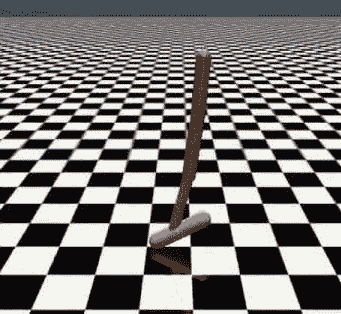 | 机器人学校-v1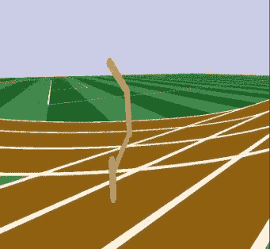 |
| 让 2D 机器人走路 | Walker2d-v2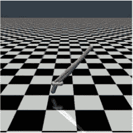 | RoboschoolWalker2d-v1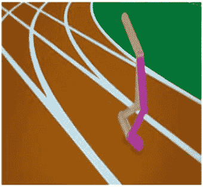 |
| Make a four-legged 3D robot walk
 | 蚂蚁 v2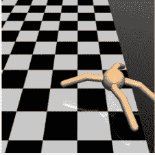 | 机器人学校-v1 |
| 让一个两足 3D 机器人在不摔倒的情况下尽可能快地向前走 | 人形机器人-v2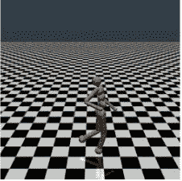 | RoboschoolHumanoid-v1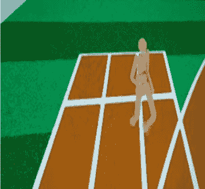 |

下表提供了作为 Roboschool 库一部分的完整环境列表，以及它们的状态和操作空间，供您快速参考:

| 

环境 ID

 | 

机器人学校环境

 | 

obs 空间

 | 

行为空间

 |
| --- | --- | --- | --- |
| roboschollinvertedpendulum-v1 | 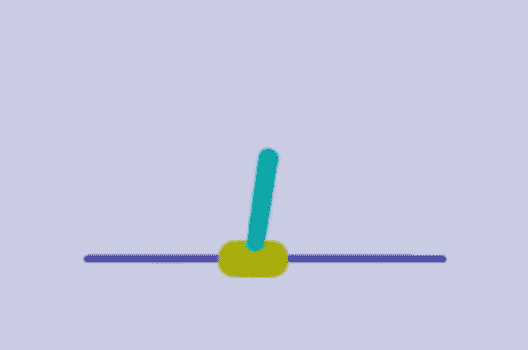 | 方框(5) | 方框(1) |
| RoboschoolInvertedPendulumSwingup-v1 | 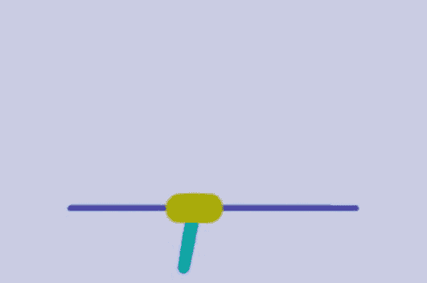 | 方框(5) | 方框(1) |
| RoboschoolInvertedDoublePendulum-v1 | 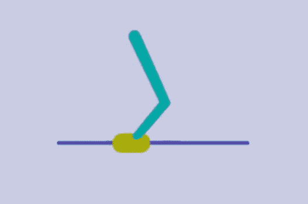 | 方框 9 | 方框(1) |
| RoboschoolReacher-v1 |  | 方框 9 | 方框(2) |
| 机器人学校-v1 |  | 方框 15 | 方框(3) |
| RoboschoolWalker2d-v1 | 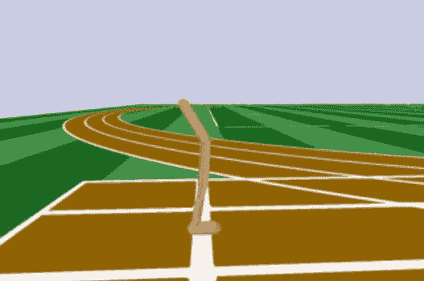 | 方框(22，) | 方框(6) |
| RoboschoolHalfCheetah-v1 | 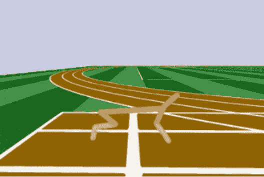 | 方框 26 | 方框(6) |
| 机器人学校-v1 | 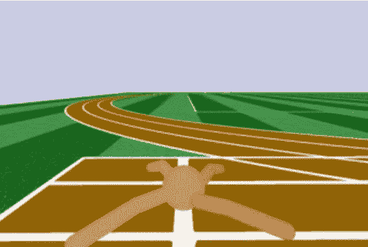 | 方框(28，) | 方框(8) |
| RoboschoolHumanoid-v1 | 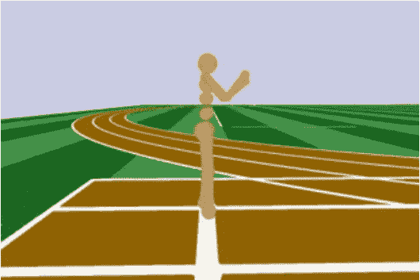 | 方框(44，) | 方框 17 |
| roboschoolhumanodflagrun-v1 | 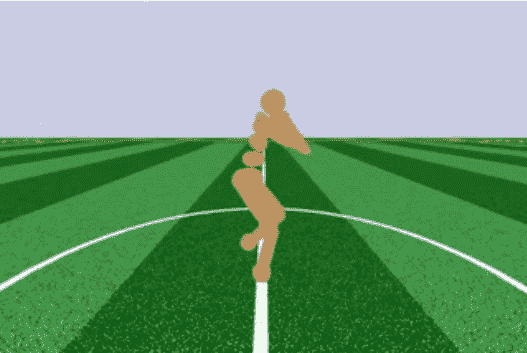 | 方框(44，) | 方框 17 |
| RoboschoolHumanoidFlagrunHarder-v1 | 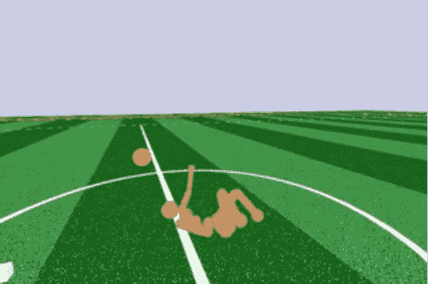 | 方框(44，) | 方框 17 |
| RoboschoolPong-v1 | 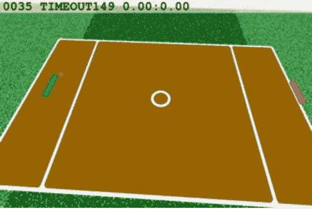 | 方框 13 | 方框(2) |

<title>Quickstart guide to setting up and running Roboschool environments</title> 

# 设置和运行机器人学校环境的快速入门指南

机器人学校环境使用开源的 Bulletphysics 引擎，而不是专有的 MuJoCo 引擎。让我们快速地看一下 Roboschool 环境，这样你就知道如何使用 Roboschool 库中的任何环境，如果你碰巧发现它对你的工作有用的话。首先，我们必须在我们的`rl_gym_book` conda 环境中安装 Roboschool Python 库。因为这个库依赖于几个组件，包括 Bulletphysics 引擎，所以涉及到几个安装步骤，在这里的 Roboschool GitHub 官方资源库中列出:[https://github.com/openai/roboschool](https://github.com/openai/roboschool)。为了使事情更简单，您可以在`ch9/setup_roboschool.sh `使用本书代码库中的脚本来自动编译和安装`Roboschool`库。按照以下步骤运行脚本:

1.  使用`source activate rl_gym_book`激活`rl_gym_book` conda 环境。
2.  用`cd ch9`导航到`ch9`文件夹。
3.  确保脚本的执行位设置为`chmod a+x setup_roboschool.sh`。
4.  用`sudo` : `./setup_roboschool.sh`运行脚本。

这将安装所需的系统依赖项，获取并编译 bullet3 物理引擎的兼容源代码；将 Roboschool 源代码拉到您的主目录下的`software`文件夹中；最后在`rl_gym_book` conda 环境中编译、构建和安装 Roboschool 库。如果安装成功完成，您将在控制台上看到以下消息:

```
Setup completed successfully. You can now import roboschool and use it. If you would like to \test the installation, you can run: python ~/roboschool/agent_zoo/demo_race2.py"
```

您可以使用以下命令运行快速入门演示脚本:

```
`(rl_gym_book) praveen@ubuntu:~$ python ~/roboschool/agent_zoo/demo_race2.py`
```

这将会启动一场有趣的机器人比赛，你会看到一只跳跃者、半猎豹和人形机器人在赛跑！有趣的方面是，每个机器人都由基于强化学习的训练策略控制。这场比赛将类似于这张快照:


一旦安装完毕，您就可以创建一个 Roboschool 环境，并使用我们在前面章节中开发的一个代理在这些环境中进行训练和运行。

您可以使用本章代码库中的`run_roboschool_env.py`脚本，在[https://github . com/packt publishing/Hands-On-Intelligent-Agents-with-open ai-Gym/tree/master/ch9](https://github.com/PacktPublishing/Hands-On-Intelligent-Agents-with-OpenAI-Gym/tree/master/ch9)查看任何 Roboschool 环境。例如，要检查`RoboschoolInvertedDoublePendulum-v1`环境，您可以运行以下脚本:

```
(rl_gym_book) praveen@ubuntu:~/HOIAWOG/ch9$python run_roboschool_env.py --env RoboschoolInvertedDoublePendulum-v1
```

您可以使用上表中的任何其他 Roboschool 环境名称，也可以使用新的可用的 Roboschool 环境。

<title>Gym retro</title> 

# 健身房复古

gym Retro([https://github.com/openai/retro](https://github.com/openai/retro))是 open ai([https://blog.openai.com/gym-retro/](https://blog.openai.com/gym-retro/))发布的一个比较新的(2018 年 5 月 25 日发布的)Python 库，作为开发游戏玩的强化学习算法的研究平台。虽然在 OpenAI Gym 中提供了 60+游戏的 Atari 套件，但可用的游戏总数有限。Gym Retro 支持使用为多个主机/复古游戏平台开发的游戏，例如任天堂的 NES、s NES、Game Boy 主机、世嘉 Genesis 和世嘉主系统等。这可以通过使用 Libretro API 的模拟器来实现:

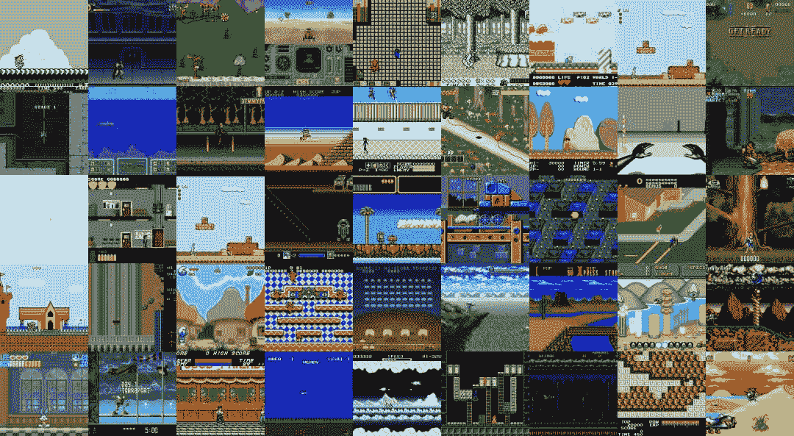

Gym Retro 提供了方便的包装器，将 1000 多种这样的视频游戏转变为 Gym 界面兼容的学习环境！是不是很棒！几个新的学习环境，但具有相同的界面，这样我们就可以轻松地训练和测试我们迄今为止开发的代理，而无需对代码进行任何必要的更改...

为了感受一下使用 Gym Retro 中的环境有多简单，让我们暂时将安装步骤放在一边，快速查看一下代码，以便在安装后创建一个新的 Gym Retro 环境:

```
import retro
env = retro.make(game='Airstriker-Genesis', state='Level1')
```

截取的这段代码将创建一个`env`对象，它具有与我们之前见过的所有健身房环境相同的接口和方法，例如`step(...)`、`reset()`和`render()`。

<title>Quickstart guide to setup and run Gym Retro</title> 

# 设置和运行健身复古的快速入门指南

让我们通过使用 pip 和以下命令安装预构建的二进制文件来快速尝试一下 Gym Retro 库:

```
(rl_gym_book) praveen@ubuntu:~/rl_gym_book/ch9$ pip install gym-retro
```

安装成功后，我们可以使用以下脚本先睹为快:

```
#!/usr/bin/env python
import retro

if __name__ == '__main__':
   env = retro.make(game='Airstriker-Genesis', state='Level1')
    obs = env.reset()
    while True:
        obs, rew, done, info = env.step(env.action_space.sample())
        env.render()
        if done:
            obs = env.reset()
```

运行这个脚本会弹出一个空袭游戏的窗口，显示飞船采取随机行动。游戏窗口看起来会像这样:

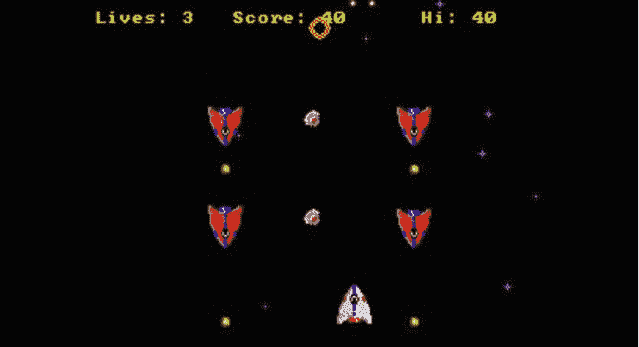

在我们继续之前，有一点要注意，包含整个游戏数据的 **ROM** ( **只读存储器**)文件并不是对所有游戏免费开放的。一些非商业主机游戏的 rom，如 Airstriker(在前面的脚本中使用)、Fire、Dekadrive、Automaton、Fire、Lost Marbles 等，都包含在 Gym Retro library 中，可以免费使用。其他游戏，如索尼克系列(索尼克刺猬，索尼克刺猬 2，索尼克 3 &指关节)需要从 [Steam](https://store.steampowered.com/app/71113/Sonic_The_Hedgehog/) 等地方购买 rom 才能合法使用。这对于希望使用这种环境开发算法的爱好者、学生和其他爱好者来说是一个障碍。但至少这个障碍相对较小，因为《刺猬索尼克》的 Steam 售价约为 1.69 美元。一旦你有了游戏的 ROM 文件，健身房复古库提供了一个脚本将它们导入到库中，如下所示:

```
(rl_gym_book) praveen@ubuntu:~/rl_gym_book/ch9$ python -m retro.import /PATH/TO/YOUR/ROMs/DIRECTORY
OpenAI Universe 
```

请注意，当创建一个新的健身房复古环境时，我们需要游戏的名称以及游戏的状态`retro.make(game='NAME_OF_GAME', state='NAME_OF_STATE')`

要获得可用的 Gym Retro 环境列表，可以运行以下命令:

```
(rl_gym_book) praveen@ubuntu:~/rl_gym_book/ch9$ python -c "import retro; retro.list_games()"

```

要获得可用游戏状态的列表，您可以运行以下 Python 脚本:

```
#!/usr/bin/evn python
import retro
for game in retro.list_games():
    print(game, retro.list_states(game))
```

到目前为止，我们已经熟悉了健身房复古图书馆。我们来分析一下，除了我们已经看到和使用过的，这个库还为我们提供了哪些优势或新功能。首先，健身房复古图书馆利用比雅达利游戏机更新的游戏机(如 SEGA 创世纪)。相比之下，SEGA Genesis 游戏机的内存是雅达利游戏机的 500 倍，具有更好的视觉效果和更大的控制范围。这为我们提供了相对复杂的学习环境，以及一些更复杂的任务和挑战，供我们的智能代理学习和解决。第二，这些主机游戏中的一些在本质上是渐进的，其中游戏的复杂性通常随着每个级别而增加，并且级别在某些方面(如目标、对象外观、物理等)具有若干相似性，同时还在其他方面提供多样性(如布局、新对象等)。这种难度逐渐增加的训练环境有助于开发智能代理，这些智能代理可以学习解决一般的任务，而不是非常特定于任务/环境(例如监督学习中的过拟合)。代理可以学习将他们的技能和学习从一个级别转移到另一个级别，然后转移到另一个游戏。这一领域正处于积极的研究中，通常被称为课程学习、阶段学习或增量进化。毕竟，最终我们感兴趣的是开发能够学习解决一般任务的智能代理，而不仅仅是代理被训练完成的特定任务。Gym Retro library 提供了一些有用的，虽然只是游戏的环境来促进这样的实验和研究。

<title>Other open source Python-based learning environments</title> 

# 其他基于 Python 的开源学习环境

在本节中，我们将讨论最近的基于 Python 的学习环境，这些环境为智能代理开发提供了一个良好的平台，但不一定具有与 Gym 兼容的环境界面。尽管它们不提供与健身房兼容的接口，我们将在这一部分讨论的环境是经过仔细选择的，以确保要么有一个健身房包装器(使其与健身房接口兼容)，要么它们易于实现，以便使用和试验我们通过本书开发的代理。正如您所猜测的，这个用于开发智能代理的基于 Python 的学习环境的列表在未来将会增长，因为这个领域目前正在被非常积极地研究。这本书的代码存储库将包含未来新环境的信息和快速入门指南。在该书的 GitHub 资源库注册更新通知，以获得这些更新。在接下来的几个小节中，我们将讨论一些最有前途的学习环境，这些环境随时可供使用。

<title>StarCraft II - PySC2</title> 

# 星际争霸 2-pysc 2

星际争霸 2 非常受欢迎，事实上是有史以来最成功的即时战略游戏之一，全世界有数百万人在玩。它甚至还有世界冠军联赛([https://wcs.starcraft2.com/en-us/](https://wcs.starcraft2.com/en-us/))！环境相当复杂，主要目标是建立一个军事基地，管理经济，保卫基地，摧毁敌人。玩家从场景的第三人称视角控制大本营和军队。如果你不熟悉 StarCarft，你应该在网上看几个游戏，感受一下这个游戏有多复杂和快节奏。

对于人类来说，玩好这个即时战略游戏，需要大量的练习(甚至几个月；其实职业选手训练几年)，计划性，反应快。尽管软件代理可以每帧按几个软件按钮来快速移动，但行动速度并不是决定胜利的唯一因素。代理必须多任务和微观管理军队单位，并最大化他们的分数，这比雅达利游戏复杂几个数量级。

暴雪，制作星际争霸 2 的公司，发布了星际争霸 2 API，它提供了必要的钩子来与星际争霸 2 游戏接口，并无限制地控制它。这使得一些新的可能性成为可能，例如我们所追求的智能代理的发展。他们甚至有一个单独的**最终用户许可协议** ( **EULA** )在人工智能和机器学习许可下开放使用环境！对于像暴雪这样从事游戏制作和销售的公司来说，这是一个非常受欢迎的举措。开源了 **StarCraft2** ( **SC2** )客户端协议实现，并提供了 Linux 安装包，以及一些附件，如地图包，可以从他们位于[https://github.com/Blizzard/s2client-proto](https://github.com/Blizzard/s2client-proto)的 GitHub 页面免费下载。最重要的是，谷歌 DeepMind 已经开源了他们的 PySC2 库，该库通过 Python 公开了 SC2 客户端接口，并提供了一个包装器，使其成为一个 RL 环境。

下面的屏幕截图显示了 PySC2 UI，右侧显示了代理可观察到的要素层，左侧显示了游戏场景的简化概述:

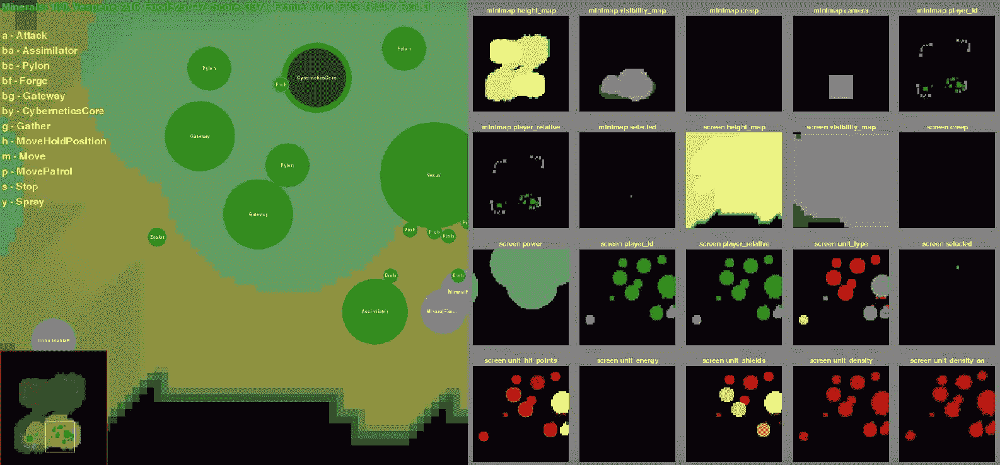

如果您对这些类型的环境感兴趣，尤其是如果您是一名游戏开发人员，您可能也会对 Dota 2 环境感兴趣。Dota 2 是一款即时战略游戏，像星际争霸 2 一样，在两队五名玩家之间进行，每个玩家控制一个英雄角色。您可以了解更多有关 OpenAI 如何开发一个由五个基于神经网络的代理组成的团队的信息，这些代理学会了在团队中工作，在一天内玩 180 年的游戏，学会了克服几个挑战(包括高维度和连续的状态和动作空间，以及长期视野)，同时使用 self-play 与自己对抗！你可以在 https://blog.openai.com/openai-five/.阅读更多关于五个代理团队的内容

<title>Quick start guide to setup and run StarCraft II PySC2 environment</title> 

# 设置和运行星际争霸 2 pysc 2 环境的快速入门指南

我们将看看你如何快速设置并开始使用星际争霸 2 的环境。像往常一样，使用代码库中的自述文件获取最新的说明，因为链接和版本可能会发生变化。如果您还没有这样做，请启动并查看该书的代码库，以获得有关更改和更新的通知。

<title>Downloading the StarCraft II Linux packages</title> 

# 下载星际争霸 2 Linux 包

在`~/StarCraftII`从 https://github.com/Blizzard/s2client-proto#downloads 下载星际争霸游戏的最新 Linux 包并解压到你的硬盘上。例如，要将 4.1.2 版下载到您的`~/StarCraftII/`文件夹，您可以使用以下命令:

```
wget http://blzdistsc2-a.akamaihd.net/Linux/SC2.4.1.2.60604_2018_05_16.zip -O ~/StarCraftII/SC2.4.1.2.zip
```

让我们将文件解压缩到`~/StarCraftII/`目录:

```
unzip ~/StarCraftII/SC2.4.1.2.zip -d ~/StarCraftII/
```

注意，正如下载页面上提到的，这些文件使用密码`'iagreetotheeula`进行密码保护。

通过输入这些，暴雪确保我们同意受他们的人工智能和机器学习许可条款的约束，这些条款可以在下载页面上找到。

<title>Downloading the SC2 maps</title> 

# 下载 SC2 地图

我们需要星际争霸 2 地图包和迷你游戏包来开始。

从 https://github.com/Blizzard/s2client-proto#map-packs[下载地图包](https://github.com/Blizzard/s2client-proto#map-packs)

将它们解压到你的`~/StarCraftII/Maps`目录中。

例如，让我们使用以下命令下载 2018 年第二季发布的阶梯地图:

```
wget http://blzdistsc2-a.akamaihd.net/MapPacks/Ladder2018Season2_Updated.zip -O ~/StarCraftII/Maps/Ladder2018S2.zip
```

让我们将地图解压到`~/StarCraftII/Maps`目录:

```
unzip ~/StarCraftII/Maps/Ladder2018S2.zip -d ~/StarCraftII/Maps/
```

接下来，我们将下载并解压缩迷你游戏地图文件:

```
wget https://github.com/deepmind/pysc2/releases/download/v1.2/mini_games.zip -O ~/StarCraftII/Maps/mini_games1.2.zip

unzip ~/StarCraftII/Maps/mini_games1.2.zip -d ~/StarCraftII/Maps
```

<title>Installing PySC2</title> 

# 安装 PySC2

让我们为 RL 环境接口安装 PySC2 库，以及所需的依赖项。这一步很简单，因为 PySC2 库有一个 PyPi Python 包:

```
(rl_gym_book) praveen@ubuntu:~/HOIAWOG/ch9$ pip install pysc2
```

<title>Playing StarCraftII yourself or running sample agents</title> 

# 自己玩星际争霸 1 还是运行样本代理

要测试安装是否顺利，并查看 StarCarftII 学习环境是什么样子，您可以使用以下命令在 Simple64 map 或 CollectMineralShards map 上快速启动一个随机代理:

```
(rl_gym_book) praveen@ubuntu:~/HOIAWOG/ch9$ python -m pysc2.bin.agent --map Simple64
```

您也可以为环境加载另一个可用的贴图。例如，以下命令加载 CollectMineralShards 地图:

```
(rl_gym_book) praveen@ubuntu:~/HOIAWOG/ch9$ python -m pysc2.bin.agent --map CollectMineralShards
```

这将弹出一个 UI，显示随机代理采取的操作，让您了解什么是有效的操作，并帮助您直观地看到代理操作时环境中正在发生的事情。

为了自己玩游戏，PySC2 提供了一个人类代理界面，这对于调试非常有用(如果你有兴趣，可以玩！)目的。下面是自己运行和玩游戏的命令:

```
(rl_gym_book) praveen@ubuntu:~/HOIAWOG/ch9$ python -m pysc2.bin.play --map Simple64
```

您还可以使用以下命令运行一个示例代理，该代理被编写为收集矿物碎片，这是游戏中的任务之一:

```
(rl_gym_book) praveen@ubuntu:~/HOIAWOG/ch9$ python -m pysc2.bin.agent --map CollectMineralShards --agent pysc2.agents.scripted_agent.CollectMineralShards
```

观看本书的代码库，获取新代理源代码和指导，以培训和测试具有高级技能的新代理。你也可以自定义我们上一章开发的代理来学习玩 StarCraftII。如果你这样做了，给书的代码库发送一个 pull 请求，给作者发一封电子邮件，或者大声喊出来，这样每个人都知道你做了什么酷的事情！

<title>DeepMind lab</title> 

# DeepMind 实验室

deep mind Lab([https://github.com/deepmind/lab](https://github.com/deepmind/lab))是一个 3D 学习环境，它提供了一套具有挑战性任务的环境，例如通过迷宫的 3D 导航和解谜。它是基于一些开源软件构建的，包括著名的雷神之锤 3 竞技场。

环境界面非常类似于我们在本书中广泛使用的健身房界面。要了解环境界面的实际情况，请查看下面的代码片段:

```
import deepmind_lab
num_steps = 1000
config = {  
    'width': 640,
    'height': 480,
    'fps': 30
}
...
env = deepmind_lab.Lab(level, ['RGB_INTERLEAVED'], config=config, renderer='software')

for step in range(num_steps) 
if done:
    env.reset()
obs = env.observations()
action = agent.get_action(...)
reward = env.step(action, num_steps=1)
done = not env.is_running()
```

这段代码虽然不能与 OpenAI Gym 接口一一兼容，但提供了一个非常相似的接口。

<title>DeepMind Lab learning environment interface</title> 

# DeepMind 实验室学习环境界面

我们将简单讨论一下 **DeepMind Lab (DM Lab)** 的环境接口，以便您熟悉它，可以看到与 OpenAI Gym 接口的相似之处，并可以在 DM Lab 环境中开始尝试代理！

<title>reset(episode=-1, seed=None)</title> 

# 重置(剧集=-1，种子=无)

这类似于我们在健身房界面看到的`reset()`方法，但与健身房环境不同，DM Lab 的`reset`方法调用并不返回观察结果。我们将在后面看到如何获得观察结果，所以现在，我们将讨论 DM 实验室的`reset(episode=-1, seed=None)`方法。它将环境重置为初始状态，并需要在每集结束时调用，以便创建新的一集。可选的`episode`参数采用一个整数值来指定特定剧集中的级别。如果未设置`episode`值，或设置为`-1`，则按数字顺序加载等级。`seed`参数也是可选的，用于播种环境的随机数生成器，以实现可再现性。

<title>step(action, num_steps=1)</title> 

# 步骤(操作，步骤数=1)

这类似于 Gym 接口的`step(action)`方法，但是与`reset(...)`方法一样，对该方法的调用不返回下一个观察结果(或者奖励、完成和信息)。调用此方法使环境前进`num_steps`帧数，在每一帧中执行由`action`定义的动作。这种动作重复行为在我们希望相同的动作应用于四个左右连续帧的情况下很有用，实际上几名研究人员发现这有助于学习。有一些健身房环境包装器可以完成这种动作重复行为。

<title>observations()</title> 

# 观察()

这是我们在调用`reset(...)`或`step(action)`从 DM 实验室环境接收观察结果后使用的方法。该方法返回一个 Python dictionary 对象，其中包含我们从环境的可用类型列表中指定的每种观察类型。例如，如果我们想要关于环境的 **RGBD** ( **红绿蓝深度**)信息作为观察类型，我们可以指定当我们使用`'RGBD'`键初始化环境时，我们可以使用相同的`'RGBD'`键从返回的观察字典中检索该信息。这里显示了一个简单的示例来说明这一点:

```
env = deepmind_lab.Lab('tests/empty_room_test', ['RGBD'])
env.reset()
obs = env.observations()['RGBD']
```

DM 实验室环境还支持其他观察类型。我们可以使用`observation_spec()`来获得一个受支持的观察类型的列表，我们将很快对此进行讨论。

<title>is_running()</title> 

# 正在运行()

这个方法类似于(在相反的意义上)Gym 接口的`step(action)`方法返回的`done`布尔值。

当环境完成一集或停止运行时，该方法将返回`False`。只要环境在运行，它就会返回`True`。

<title>observation_spec()</title> 

# 观察 _ 规格()

这种方法类似于我们在健身房环境中使用的`env.observation_space()`。该方法返回一个列表，指定 DM 实验室环境支持的所有可用观察。它还包括关于依赖于级别的自定义观察的规范。

规范包含张量或字符串的名称、类型和形状，如果在观察列表中指定了规范名称(如前面的`'RGBD'`示例)，将返回该规范。例如，下面的代码片段列出了列表中的两个项目，将返回这两个项目以让您了解规范包含的内容:

```
{
    'dtype': <type 'numpy.uint8'>, ## Array data type
    'name': 'RGBD',                ## Name of observation.
    'shape': (4, 180, 320)         ## shape of the array. (Heights, Width, Colors)
}

{    
    'name': 'RGB_INTERLEAVED', ## Name of observation.
    'dtype': <type 'numpy.uint8'>, ## Data type array.     
    'shape': (180, 320, 3) ## Shape of array. (Height, Width, Colors)
}
```

为了快速理解如何使用这个方法，让我们来看看下面几行代码和输出:

```
import deepmind_lab
import pprint
env = deepmind_lab.Lab('tests/empty_room_test', [])
observation_spec = env.observation_spec()
pprint.pprint(observation_spec)
# Outputs:
[{'dtype': <type 'numpy.uint8'>, 'name': 'RGB_INTERLEAVED', 'shape': (180, 320, 3)},
 {'dtype': <type 'numpy.uint8'>, 'name': 'RGBD_INTERLEAVED', 'shape': (180, 320, 4)},
 {'dtype': <type 'numpy.uint8'>, 'name': 'RGB', 'shape': (3, 180, 320)},
 {'dtype': <type 'numpy.uint8'>, 'name': 'RGBD', 'shape': (4, 180, 320)},
 {'dtype': <type 'numpy.uint8'>, 'name': 'BGR_INTERLEAVED', 'shape': (180, 320, 3)},
 {'dtype': <type 'numpy.uint8'>, 'name': 'BGRD_INTERLEAVED', 'shape': (180, 320, 4)},
 {'dtype': <type 'numpy.float64'>, 'name': 'MAP_FRAME_NUMBER', 'shape': (1,)},
 {'dtype': <type 'numpy.float64'>, 'name': 'VEL.TRANS', 'shape': (3,)},
 {'dtype': <type 'numpy.float64'>, 'name': 'VEL.ROT', 'shape': (3,)},
 {'dtype': <type 'str'>, 'name': 'INSTR', 'shape': ()},
 {'dtype': <type 'numpy.float64'>, 'name': 'DEBUG.POS.TRANS', 'shape': (3,)},
 {'dtype': <type 'numpy.float64'>, 'name': 'DEBUG.POS.ROT', 'shape': (3,)},
 {'dtype': <type 'numpy.float64'>, 'name': 'DEBUG.PLAYER_ID', 'shape': (1,)},
# etc...
```

<title>action_spec()</title> 

# action_spec()

类似于`observation_spec()`,`action_spec()`方法返回一个列表，其中包含最小值、最大值和空间中每个元素的名称。`min`和`max`值分别代表动作空间中相应元素可以设置的最小值和最大值。该列表的长度将等于动作空间的尺寸/形状。这类似于`env.action_space`，我们一直在健身房环境中使用。

下面的代码片段让我们快速了解了调用此方法的返回值是什么样的:

```
import deepmind_lab
import pprint

env = deepmind_lab.Lab('tests/empty_room_test', [])
action_spec = env.action_spec()
pprint.pprint(action_spec)
# Outputs:
```

```
# [{'max': 512, 'min': -512, 'name': 'LOOK_LEFT_RIGHT_PIXELS_PER_FRAME'},
#  {'max': 512, 'min': -512, 'name': 'LOOK_DOWN_UP_PIXELS_PER_FRAME'},
#  {'max': 1, 'min': -1, 'name': 'STRAFE_LEFT_RIGHT'},
#  {'max': 1, 'min': -1, 'name': 'MOVE_BACK_FORWARD'},
#  {'max': 1, 'min': 0, 'name': 'FIRE'},
#  {'max': 1, 'min': 0, 'name': 'JUMP'},
#  {'max': 1, 'min': 0, 'name': 'CROUCH'}]
```

<title>num_steps()</title> 

# 步骤数()

这个实用方法就像一个计数器，它计算自上次`reset()`调用以来环境执行的帧数。

<title>fps()</title> 

# fps()

这个实用程序方法返回每秒实际执行的帧数(或环境步数)。这对于跟踪环境执行速度以及代理从环境中采样的速度非常有用。

<title>events()</title> 

# 事件()

这个实用程序方法对于调试非常有用，因为它返回了自上次调用`reset()`或`step(...)`以来发生的事件列表。返回的元组包含一个名称和一个观察列表。

<title>close()</title> 

# 关闭()

与健身房环境中可用的`close()`方法一样，该方法也关闭环境实例并释放底层资源，例如 Quake III Arena 实例。

<title>Quick start guide to setup and run DeepMind Lab</title> 

# 设置和运行 DeepMind 实验室的快速入门指南

随着我们在上一节中对 DeepMind 实验室环境界面的简短讨论后所熟悉的内容，我们已经准备好获得关于这种学习环境的一些实践经验。在下面的小节中，我们将详细介绍设置 DeepMind Lab 和运行示例代理的步骤。

<title>Setting up and installing DeepMind Lab and its dependencies</title> 

# 设置和安装 DeepMind Lab 及其依赖项

DeepMind 实验室库使用 Bazel 作为构建工具，这反过来需要 Java。这本书的代码库中有一个脚本，您可以运行它来轻松设置 DeepMind 实验室。您可以在[https://github . com/packt publishing/Hands-On-Intelligent-Agents-with-open ai-Gym/tree/master/ch9](https://github.com/PacktPublishing/Hands-On-Intelligent-Agents-with-OpenAI-Gym/tree/master/ch9)的 chapter9 文件夹下找到该脚本。您可以使用以下命令运行该脚本:

```
(rl_gym_book) praveen@ubuntu:~/HOIAWOG/ch9$./setup_deepmindlab.sh
```

这个脚本需要一些时间来完成，但是会自动安装所有必需的包和库，包括 Bazel 及其依赖项，并为您设置好一切。

<title>Playing the game, testing a randomly acting agent, or training your own!</title> 

# 玩游戏，测试随机代理，或训练你自己的！

安装完成后，您可以通过运行以下命令，使用键盘输入来测试游戏:

```
(rl_gym_book) praveen@ubuntu:~/HOIAWOG/ch9$ cd deepmindlab

(rl_gym_book) praveen@ubuntu:~/HOIAWOG/ch9/deepmindlab$ bazel run :game -- --level_script=tests/empty_room_test
```

您还可以使用以下命令，在随机代理的帮助下测试它:

```
(rl_gym_book) praveen@ubuntu:~/HOIAWOG/ch9/deepmindlab$ bazel run :python_random_agent --define graphics=sdl -- --length=5000
```

要开始开发您自己的代理，您可以使用已经配置为与 DeepMind 实验室环境交互的示例代理脚本。可以在`~/HOIAWOG/ch9/deepmindlab/python/random_agent.py`找到剧本。要开始训练该代理，可以使用以下命令:

```
(rl_gym_book) praveen@ubuntu:~/HOIAWOG/ch9/deepmindlab$ bazel run :python_random_agent
```

<title>Summary</title> 

# 摘要

在这一章中，我们看了几个有趣且有价值的学习环境，了解了它们的界面是如何设置的，甚至还使用每种环境的快速入门指南和书中代码库中可用的设置脚本实际操作了这些环境。我们首先查看了具有与我们现在非常熟悉的 OpenAI Gym 接口兼容的接口的环境。特别是在这个类别中，我们探索了机器人学校和健身房的复古环境。

我们还研究了其他有用的学习环境，它们不一定具有与健身房兼容的环境接口，但具有非常相似的 API，因此很容易修改我们的代理代码或实现学习环境的包装器，使其与健身房 API 兼容。具体来说，我们探索了著名的基于即时战略游戏的星际争霸 2 环境和 DeepMind 实验室环境。我们还非常简要地提到了 DOTA2 环境，该环境用于训练单个代理和由 OpenAI 训练的代理团队，open ai 在 DOTA 2 比赛中成功击败了业余人类玩家，甚至一些职业游戏团队。

我们看到了每个学习环境库中可用的不同任务和环境集，并尝试了一些示例来了解环境，以及如何使用我们在前面章节中开发的代理来训练和解决这些相对较新的学习环境中的挑战性任务。