# 探索学习算法的前景- DDPG(演员-评论家)，PPO(策略-梯度)，彩虹(基于价值)

在前一章中，我们看了几种有前途的学习环境，你可以用它们来训练代理人解决各种不同的任务。在[第 7 章](part0131.html#3STPM0-22c7fc7f93b64d07be225c00ead6ce12)、*创建定制的 OpenAI 健身房环境——卡拉驾驶模拟器*中，我们还看到了如何使用智能和自主软件代理来创建自己的环境，以解决您可能有兴趣开发解决方案的任务或问题。这为你提供了完成后的方向，以便探索和处理我们在本书中讨论的所有环境、任务和问题。同样，在这一章中，我们将讨论几个有前途的学习算法，作为未来智能代理开发工作的参考。

到目前为止，在本书中，我们已经一步一步地介绍了实现智能代理的过程，这些智能代理可以学习改进和解决离散决策/控制问题([第 6 章](part0094.html#2PKKS0-22c7fc7f93b64d07be225c00ead6ce12)、*实现智能代理，使用深度 Q 学习*进行最优离散控制)和连续动作/控制问题([第 8 章](part0151.html#4G04U0-22c7fc7f93b64d07be225c00ead6ce12)、*实现智能自动驾驶汽车代理，使用深度演员-评论家算法*)。它们是开发这种学习代理的良好起点。希望前面的章节给了你一个自治的智能软件代理/系统的整体图景，它可以学习改进手头的任务或问题。我们还研究了具有有用的实用程序和例程(比如日志记录、可视化、参数管理等等)的整个管道，这些实用程序和例程在开发、培训和测试这样复杂的系统时会有所帮助。我们看到了两类主要的算法:深度 Q 学习(及其扩展)和基于深度演员-评论家(及其扩展)的深度强化学习算法。它们是很好的基线算法，事实上在这一领域的最新研究论文中仍然被引用。这一领域的研究近年来一直在积极发展，并提出了一些新的算法。有些具有更好的样本复杂度，即代理在达到某个性能级别之前从环境中收集的样本数。一些其他算法具有稳定的学习特性，并且在给定足够时间的情况下，对于大多数问题，很少或没有调整就能找到最优策略。一些新的架构，如 IMPALA 和 Ape-X，也已经推出，并支持高度可扩展的学习算法实现。

我们将快速浏览这些有前途的算法，它们的优点，以及它们潜在的应用类型。我们还将看看这些算法添加到我们已经知道的关键组件的代码示例。这些算法的示例实现可以在本书的代码库中找到，位于[https://github . com/packt publishing/Hands-On-Intelligent-Agents-with-open ai-Gym](https://github.com/PacktPublishing/Hands-On-Intelligent-Agents-with-OpenAI-Gym)的`ch10`文件夹下。

# 深度确定性策略梯度

**深度确定性策略梯度**([proceedings.mlr.press/v32/silver14.pdf](http://proceedings.mlr.press/v32/silver14.pdf))是一种非策略、无模型、演员-评论家算法，基于**确定性策略梯度** ( **DPG** )定理。与基于深度 Q 学习的方法不同，基于演员-批评者策略梯度的方法除了适用于具有离散行动空间的问题/任务之外，还容易适用于连续行动空间。

# 核心概念

在[第 8 章](part0151.html#4G04U0-22c7fc7f93b64d07be225c00ead6ce12)、*使用深度演员-评论家算法*实现智能自动汽车驾驶代理中，我们向您展示了策略梯度定理的推导过程，并复制了以下内容以供参考:

您可能还记得，我们考虑的策略是一个随机函数，在给定**状态** ( **s** )和参数()的情况下，为每个动作分配一个概率。在确定性策略梯度中，随机策略被确定性策略所取代，确定性策略为给定状态和参数集规定了固定策略。简而言之，DPG 可以用下面两个等式来表示:

这是策略目标函数:

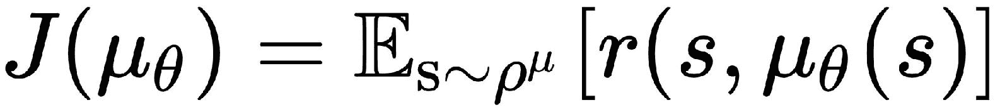

这里，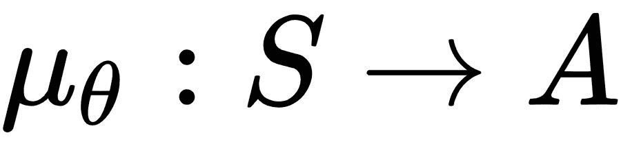是由参数化的确定性策略，r(s，a)是在状态 s 采取行动 *a* 的奖励函数，是该策略下的贴现状态分布。

确定性策略目标函数的梯度被证明(在之前链接的论文中)为:

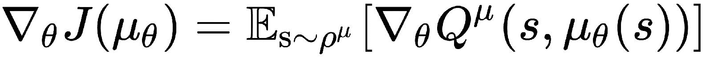

我们现在看到熟悉的行动价值函数项，我们通常称之为评论家。DDPG 以这个结果为基础，使用深度神经网络来表示动作值函数，就像我们在[第 6 章](part0094.html#2PKKS0-22c7fc7f93b64d07be225c00ead6ce12)、*中所做的那样，使用深度 Q 学习*来实现优化离散控制的智能代理，以及一些其他的修改来稳定训练。具体来说，使用了一个 Q 目标网络(就像我们在[第 6 章](part0094.html#2PKKS0-22c7fc7f93b64d07be225c00ead6ce12)、*中讨论的，使用深度 Q 学习*实现优化离散控制的智能代理)，但是现在这个目标网络在缓慢更新，而不是保持固定几个更新步骤然后更新它。DDPG 还使用经验重放缓冲区，并使用一个嘈杂版本的，用等式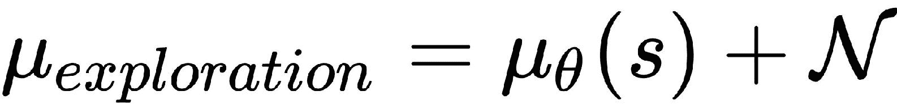表示，以鼓励探索作为策略。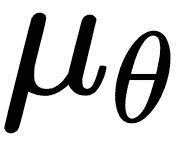是确定性的。

DDPG 有一个扩展叫做 D4PG，是分布式分布式 DDPG 的缩写。我能猜到你可能在想:DPG-> DDPG-> {失踪？}--> DDDDPG。是啊！缺少的项目由您来实现。

D4PG 算法对 DDPG 算法进行了四项主要改进，如果您感兴趣，这里简单列出如下:

*   分布评论家(评论家现在估计 Q 值的分布，而不是给定状态和动作的单个 Q 值)

*   n 步返回(类似于我们在[第 8 章](part0151.html#4G04U0-22c7fc7f93b64d07be225c00ead6ce12)、*中使用的，使用深度演员-评论家算法*实现智能自动驾驶汽车代理，使用 n 步 TD 返回代替通常的 1 步返回)

*   优先体验回放(用于从体验回放记忆中取样体验)

*   分布式并行参与者(利用 K 个独立参与者，并行收集经验并填充经验重放存储器)

# 最近策略优化

**近似策略优化** ( **PPO** )是一种基于策略梯度的方法，是已被证明稳定且可扩展的算法之一。事实上，PPO 是 OpenAI Five 代理团队使用的算法，该团队与几名人类 DOTA II 玩家进行了比赛(并取得了胜利)，我们在上一章中讨论了这一点。

# 核心概念

在策略梯度方法中，该算法执行展开以收集转换和(潜在的)奖励的样本，并使用梯度下降来更新策略的参数，以最小化目标函数。想法是不断更新参数以改进策略，直到获得好的策略。为了提高训练的稳定性，**信赖域策略优化** ( **TRPO** )算法对策略更新实现了**kull back-Liebler**(**KL**)发散约束，使得与旧策略相比，策略不会在一步中更新太多。TRPO 是 PPO 算法的前身。让我们简单讨论一下 TRPO 算法中使用的目标函数，以便更好地理解 PPO。

# 策略外学习

正如我们所知，在偏离策略学习的情况下，主体遵循的行为策略不同于主体试图优化的策略。提醒你一下，Q-learning，我们在第 6 章、*中讨论过，使用深度 Q-Learning* 实现一个智能代理用于最优离散控制，以及几个扩展，也是一个非策略算法。让我们用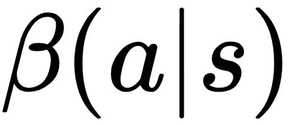来表示行为策略。然后，我们可以将代理的目标函数写成相对于状态访问分布和动作的总优势，如下所示:

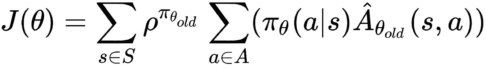

这里，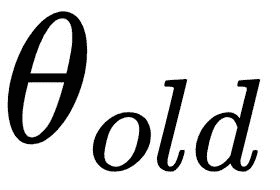是更新前的策略参数，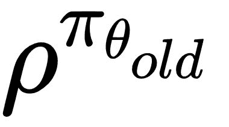是旧策略参数下的状态访问概率分布。我们可以通过行为策略将内部求和中的项相乘并相除，其思想是使用重要性采样来说明使用行为策略对转换进行采样的事实:

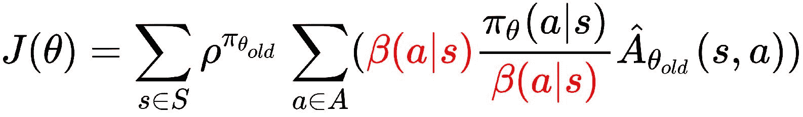

与上一个公式相比，上一个公式中的变化项以红色显示。

我们可以把之前对一个分布的求和写成一个期望，就像这样:

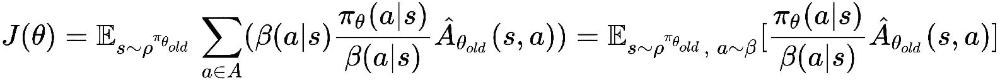

# 策略上的

在策略学习的情况下，代理的行为策略和目标策略是同一个策略。因此，代理用来收集样本的当前策略(在更新之前)自然会是，这是行为策略，因此目标函数变成这样:

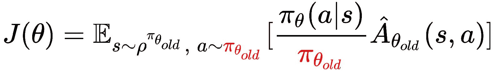

与上一个公式相比，上一个公式中的变化项以红色显示。

TRPO 用*信赖域*约束来优化先前的目标函数，其使用由以下等式给出的 KL 散度度量:

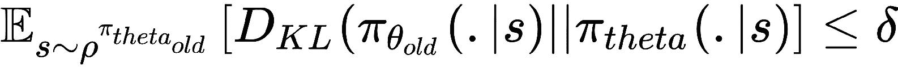

这是确保对策略的新更新不会偏离当前策略太多的约束。尽管 TRPO 背后的想法简洁明了，直观简单，但实现和梯度更新却很复杂。PPO 简化了方法，使用了一个简单有效的替代目标。让我们利用算法背后的数学来更深入地理解 PPO 背后的核心概念。让新策略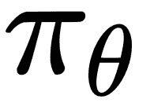和旧策略之间采取动作 *a* 给定状态 *s* 的概率比定义如下:

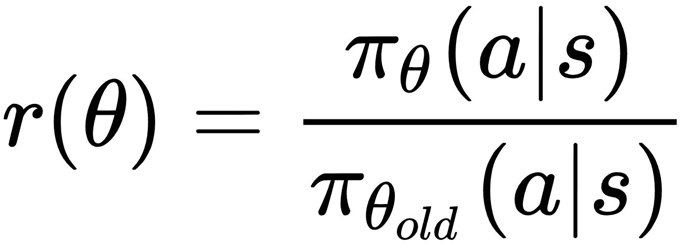

将此代入我们之前讨论的 TRPO 的策略目标函数方程，得到目标函数:

由于可能导致大量的参数更新，简单地去除 KL 发散约束将导致不稳定。PPO 通过强制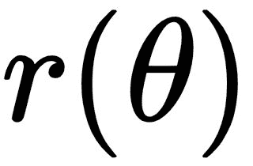位于区间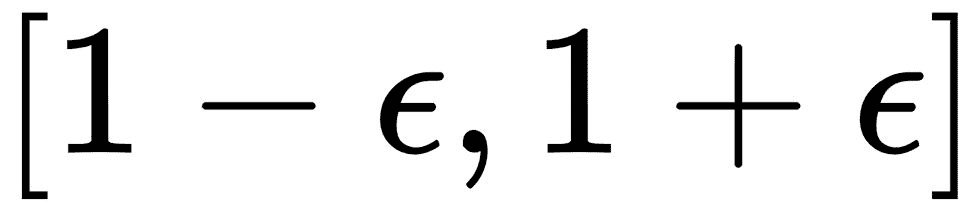内来施加约束，其中是可调的超参数。实际上，PPO 中使用的目标函数取原始参数值和削波版本之间的最小值，其数学描述如下:

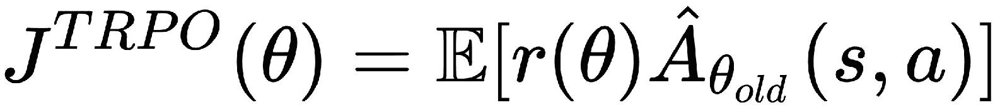

这导致具有单调改进策略的稳定学习目标。

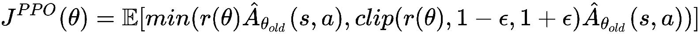

彩虹

# 彩虹([https://arxiv.org/pdf/1710.02298.pdf](https://arxiv.org/abs/1710.02298))是一种基于 DQN 的非策略深度强化学习算法。我们在第 6 章[的](part0094.html#2PKKS0-22c7fc7f93b64d07be225c00ead6ce12)、*中研究并实现了深度 Q 学习(DQN)和 DQN 的一些扩展，使用深度 Q 学习*实现了一个智能代理用于最佳离散控制。DQN 算法又有了几个扩展和改进。Rainbow 结合了这些扩展中的六个，并显示这种结合效果更好。彩虹是一种最先进的算法，目前保持着所有雅达利游戏的最高分记录。如果您想知道为什么该算法被命名为 *Rainbow* ，这很可能是因为它结合了 Q-learning 算法的七个(彩虹中颜色的数量)扩展，即:

DQN

*   双 Q 学习
*   优先体验重放
*   决斗网络
*   多步学习/n 步学习
*   分布式 RL
*   嘈杂的网
*   核心概念

# Rainbow 将 DQN 与六个选定的扩展结合起来，这些扩展被证明可以解决原始 DQN 算法的局限性。我们将简要地看一下这六个扩展，以了解它们是如何对整体性能提升做出贡献并使 Rainbow 在 Atari 基准测试中名列前茅的，以及它们是如何在 OpenAI Retro 竞赛中获得成功的。

DQN

# 到目前为止，您应该非常熟悉 DQN，因为我们在第 6 章、*中一步一步地实现了深度 Q 学习代理，实现了使用深度 Q 学习进行最优离散控制的智能代理*，其中我们详细讨论了 DQN，以及它如何使用深度神经网络函数近似、重放记忆和目标网络来扩展标准 Q 学习。让我们回忆一下在[第 6 章](part0094.html#2PKKS0-22c7fc7f93b64d07be225c00ead6ce12)、*中我们在深度 Q 学习代理中使用的 Q 学习损失，使用深度 Q 学习*实现一个智能代理用于最佳离散控制:

By now, you should be very familiar with DQN, as we went through the step-by-step implementation of a deep Q-learning agent in [Chapter 6](part0094.html#2PKKS0-22c7fc7f93b64d07be225c00ead6ce12), *Implementing an Intelligent Agent for Optimal Discrete Control Using Deep Q-Learning*, where we discussed DQN in detail and how it extends standard Q-learning with a deep neural network function approximation, replay memory, and a target network. Let's recall the Q-learning loss that we used in the deep Q-learning agent in [Chapter 6](part0094.html#2PKKS0-22c7fc7f93b64d07be225c00ead6ce12), *Implementing an Intelligent Agent for Optimal Discrete Control Using Deep Q-Learning*:

这基本上是 TD 目标和 DQN Q 估计值之间的均方误差，正如我们在[第 6 章](part0094.html#2PKKS0-22c7fc7f93b64d07be225c00ead6ce12)、*中提到的，使用深度 Q 学习实现用于最佳离散控制的智能代理*，其中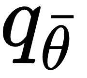是缓慢移动的目标网络，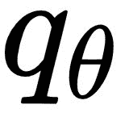是主 Q 网络。

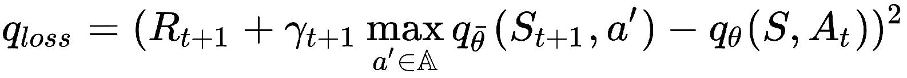

双 Q 学习

# 在双 Q 学习中，有两个动作值/Q 函数。让我们称他们为 Q1 和 Q2。双 Q 学习的想法是*将动作选择与值估计*分离。也就是说，当我们想要更新 Q1 时，我们根据 Q1 选择最佳行动，但是使用 Q2 来找到所选行动的值。类似地，当 Q2 被更新时，我们选择基于 Q2 的动作，但是使用 Q1 来确定所选动作的值。在实践中，我们可以将主 Q 网络作为 Q1，将慢速移动的目标网络作为 Q2，这样我们就得到下面的双 Q-学习损失方程(与 DQN 方程的区别用红色表示):

损失函数的这种变化背后的动机是，Q-学习受到高估偏差的影响，这可能会损害学习。高估是由于最大值的期望值大于或等于期望值的最大值(通常不等式成立)，这是由于 Q 学习算法和 DQN 中的最大化步骤引起的。由双 Q 学习引入的改变被证明减少了对学习过程有害的高估，从而提高了 DQN 的性能。

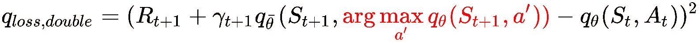

优先体验重放

# 当我们在[第 6 章](part0094.html#2PKKS0-22c7fc7f93b64d07be225c00ead6ce12)、*中实现深度 Q 学习，使用深度 Q 学习实现智能代理进行最优离散控制*时，我们使用经验重放存储器来存储和检索采样的过渡经验。在我们的实现中，以及在 DQN 算法中，来自重放存储器缓冲区的经验被均匀采样。直觉上，我们希望更频繁地体验这些经历，因为有很多东西需要学习。相对于最后遇到的绝对 TD 误差，优先化的经验重放样本以概率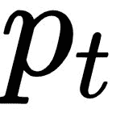转换，由以下等式给出:

这里，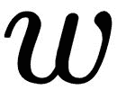是决定分布形状的超参数。这确保了我们对那些 Q 值的预测与正确值相差较大的转换进行采样。在实践中，新的过渡以最高优先级被插入重放存储器，以表示最近过渡经历的重要性。

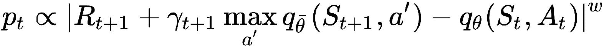

决斗网络

# Dueling networks 是一个为基于值的强化学习而设计的神经网络架构。名称*due ing*源于这种架构的主要特征，即有两个计算流，一个用于价值函数，另一个用于优势。下面的图表来自一篇研究论文([https://arxiv.org/pdf/1511.06581.pdf](https://arxiv.org/pdf/1511.06581.pdf))，显示了决斗网络架构(显示在图表底部的网络)与典型的 DQN 架构(显示在图表顶部)的比较:

对要素进行编码的卷积层由价值流和优势流共享，并通过一个特殊的聚合函数进行合并，如本文中所述，该函数对应于动作值的以下分解:

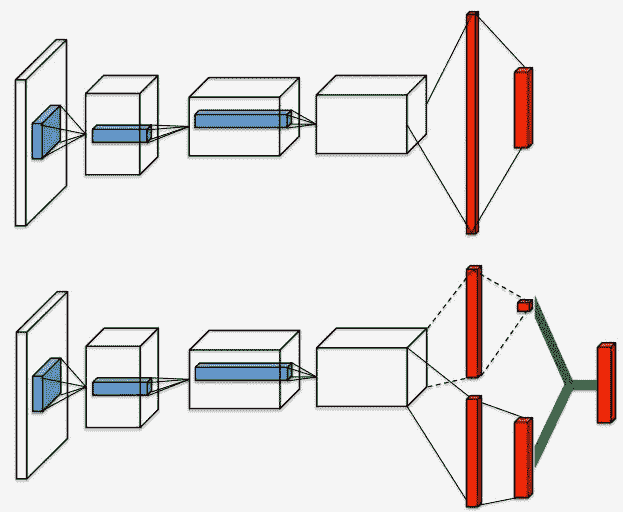

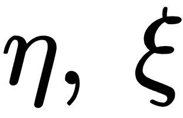和分别是价值流、共享卷积编码器和优势流的参数，是它们的级联。

多步学习/n 步学习

# 在[第 8 章](part0151.html#4G04U0-22c7fc7f93b64d07be225c00ead6ce12)、*使用深度演员-评论家算法*实现智能自动汽车驾驶代理中，我们实现了 n 步返回 TD 返回方法，并讨论了如何使用前视多步目标来代替单/单步 TD 目标。我们可以对 DQN 使用 n 步返回，这基本上是这个扩展背后思想。回想一下，从状态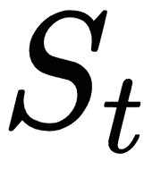返回的截断 n 步如下所示:

使用该方程，可以定义 DQN 的多步变量，以最小化以下损失(与 DQN 方程的差异以红色显示):

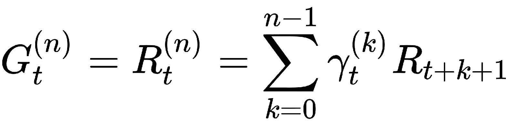

这个等式显示了引入 DQN 的变化。

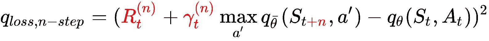

分布式 RL

# 分布 RL 方法([https://arxiv.org/abs/1707.06887](https://arxiv.org/abs/1707.06887))是关于学习接近收益的分布，而不是预期(平均)收益。分布式 RL 方法建议使用置于离散支持上的概率质量来模拟这种分布。实质上，这意味着不是试图模拟给定状态的一个动作值，而是寻求给定状态的每个动作的动作值的分布。在不涉及太多细节的情况下(因为这需要大量的背景信息)，我们将从总体上来看这种方法对 RL 的一个关键贡献，即分布式贝尔曼方程的公式。您可能还记得本书前面的章节，动作值函数，使用一步贝尔曼备份，可以返回如下:

在分布贝尔曼方程的情况下，标量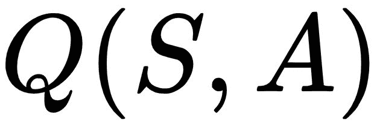被随机变量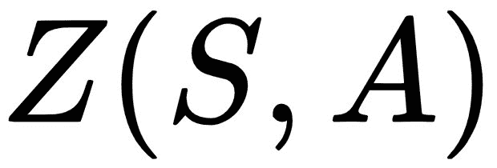代替，这给出了下面的方程:

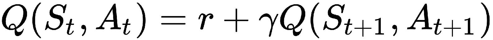

因为数量不再是标量，更新方程需要处理更多的 car，而不仅仅是将下一个状态-动作-值的贴现值加到阶跃响应上。借助下图(从左到右的阶段)，可以很容易地理解分布贝尔曼方程的更新步骤:

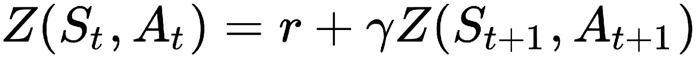

在前面的图示中，下一个状态动作值的分布在左边用红色表示，然后通过折扣因子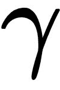(中间)进行缩放，最后分布移动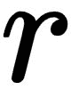以产生分布贝尔曼更新。在更新之后，通过最小化和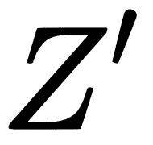之间的交叉熵损失，从先前更新操作得到的目标分布被投影到当前分布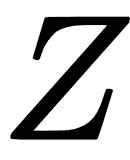的支持上。

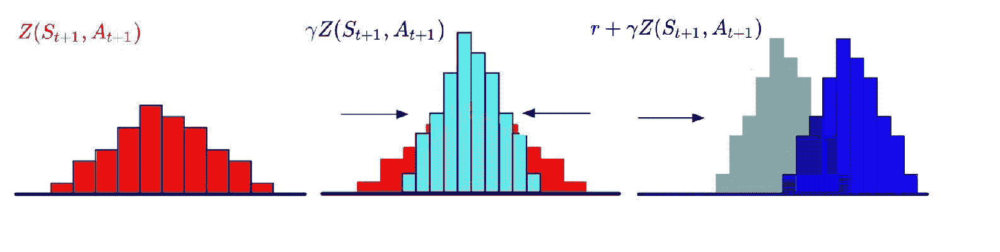

在此背景下，您可以浏览一下分布式 RL 论文中 C51 算法的伪代码，该代码集成到 Rainbow 代理中:

嘈杂的网

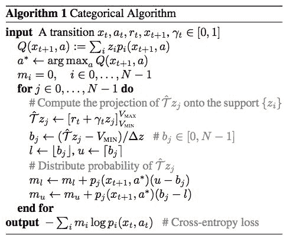

# 如果您还记得，我们在[第 6 章](part0094.html#2PKKS0-22c7fc7f93b64d07be225c00ead6ce12)、*使用深度 Q 学习*实现用于最佳离散控制的智能代理中，为深度 Q 学习代理使用了-贪婪策略，根据深度 Q 网络学习的动作值采取动作，这基本上意味着在大多数时间内对给定状态采取具有最高动作值的动作，除了在极小一部分时间内(即，以非常小的概率)代理选择随机动作。这可能会阻止代理探索更多的奖励状态，特别是当它已经收敛到的行动值不是最优行动值时。使用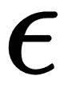-贪婪策略进行探索的局限性从 DQN 变种的表现和雅达利游戏《蒙特祖马的复仇》中基于价值的学习方法中显而易见，在该游戏中，必须以正确的方式执行一长串动作才能获得第一笔奖励。为了克服这种探索限制，Rainbow 使用了噪音网的想法——这是 2017 年提出的一种简单但有效的方法。

噪声网络背后的主要思想是线性神经网络层的噪声版本，其结合了确定性流和噪声流，如以下等式中针对线性神经网络层的示例:

这里，和是噪声层的参数，使用梯度下降与 DQN 的其他参数一起学习。代表元素级乘积运算，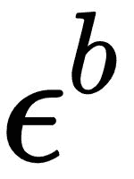和为零均值随机噪声。在我们的 DQN 实现中，我们可以使用噪声线性层来代替通常的线性层，这将具有更好地探索的额外优势。因为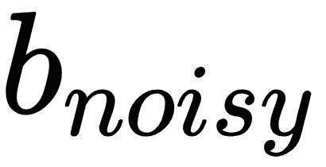和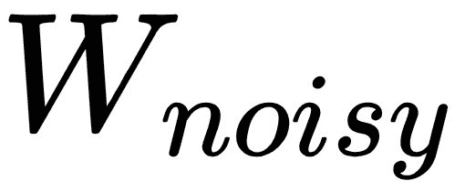是可学习的参数，网络可以学习忽略噪声流。因为每个神经元都会随着时间的推移而发生这种情况，所以噪声流在状态空间的不同部分以不同的速率衰减，从而允许以一种自我退火的形式进行更好的探索。

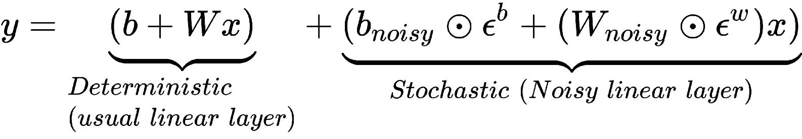

Rainbow agent 实现结合了所有这些方法，在 Atari 的 57 个游戏套件上实现了最先进的结果，性能优于任何其他方法。总的来说，彩虹代理相对于先前在 Atari games 的综合基准测试中表现最好的代理算法的性能总结在彩虹论文的以下图表中:

从图中可以清楚地看出，彩虹代理中包含的方法极大地提高了 57 款不同 Atari 游戏的性能。

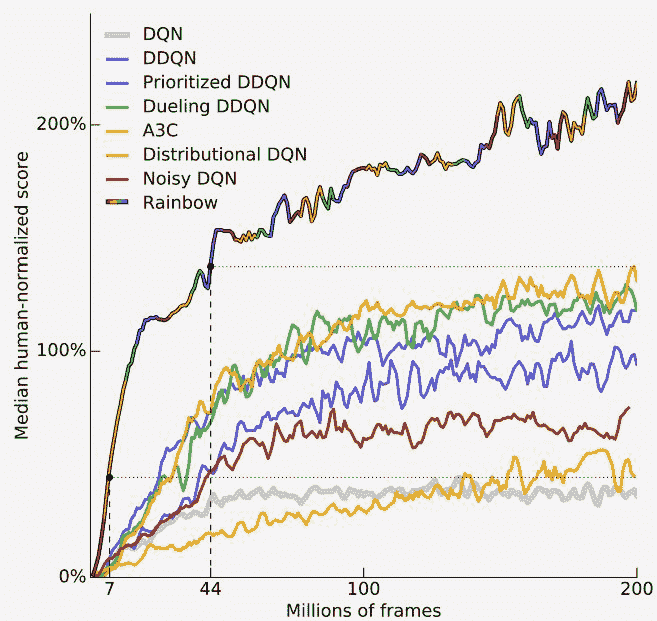

优势和应用的快速总结

# Rainbow 代理的一些主要优势总结如下，供您快速参考:

结合了 Q-learning 在过去几年中发展起来的几个值得注意的扩展

*   在 Atari 基准测试中取得了一流的成绩
*   具有适当调整的 *n* 值的 n 步目标通常会导致更快的学习
*   与其他 DQN 变体不同，Rainbow 代理可以从经验重放存储器中收集的少 40%的帧开始学习
*   在单个 GPU 机器上，在不到 10 小时的时间内(700 万帧)达到了 DQN 的最佳性能
*   彩虹算法已经成为离散控制问题中最受欢迎的代理，其中动作空间小且离散。它在其他游戏环境中非常成功，例如 Gym-Retro，特别是彩虹代理的调整版本在 2018 年举行的 OpenAI Retro 比赛中获得了第二名，这是一场转移学习比赛，任务是学习在某些级别上玩复古 Genesis 主机游戏 Sonic The Hedgehog、Sonic The Hedgehog II 和 Sonic & Knuckles，然后能够在代理没有接受培训的其他级别上玩得很好。考虑到在典型的强化学习设置中，代理在相同的环境中接受培训和测试，retro contest 测量了学习算法从以前的经验中归纳其学习的能力。一般来说，Rainbow agent 是在离散动作空间中尝试任何 RL 问题/任务的最佳首选。

摘要

# 作为这本书的最后一章，这一章提供了在这一领域当前最先进的关键学习算法的概要。我们研究了三种不同的先进算法背后的核心概念，每种算法都有自己独特的元素和自己的类别(基于演员-评论家/基于策略/基于价值-功能)。

具体来说，我们讨论了深度确定性策略梯度算法，这是一种演员-评论家架构方法，它使用确定性策略而不是通常的随机策略，并在几个连续的控制任务上取得了良好的性能。

然后我们研究了 PPO 算法，这是一种基于策略梯度的方法，它使用 TRPO 目标的裁剪版本，并学习单调更好和稳定的策略，并已成功用于 DOTA II 等非常高维的环境中。

最后，我们研究了彩虹算法，这是一种基于值的方法，结合了非常流行的 Q 学习算法的几个扩展，即 DQN、双 Q 学习、优先体验重放、决斗网络、多步学习/n 步学习、分布式强化学习和噪声网络层。彩虹代理在 Atari benchmark suite 的 57 场比赛中取得了明显更好的表现，在 OpenAI Retro 大赛的迁移学习任务中也表现非常出色。

说完，我们进入了本书的最后一段！我希望您在阅读本书的过程中感到愉快，学到了很多东西，并获得了许多实践技能来实现智能代理算法，以及在您选择的学习环境/问题上培训和测试代理所必需的构件。您可以使用本书的代码库中的问题跟踪系统来报告代码的问题，或者如果您想进一步讨论某个主题，或者需要任何其他参考/指导来进入下一个级别。

With that, we are into the last paragraph of this book! I hope you enjoyed your journey through the book, learned a lot, and acquired a lot of hands-on skills to implement intelligent agent algorithms and the necessary building blocks to train and test the agents on the learning environment/problem of your choice. You can use the issue-tracking system in the book's code repository to report issues with the code, or if you would like to discuss a topic further, or need any additional references/pointers to move to the next level.