# 向量演算

你们中的大多数人可能在过去接触过微积分，无论是在高中，大学还是大学，并且可能希望永远不要再处理它。然而，微积分不仅是数学中最深刻的发现之一；它在深度学习中也起着至关重要的作用。

在本章中，我们将首先使用单变量微积分介绍微积分的核心概念，然后我们将继续学习多变量微积分，并扩展我们在多变量微积分中学习的所有内容，以了解向量微积分及其与深度学习的关系。

本章将涵盖以下主题:

*   单变量微积分
*   多元微积分
*   向量演算

# 单变量微积分

从本质上讲，微积分只不过是对关系和变化的研究。对微积分有敏锐的把握会帮助你更好地理解深度学习算法是如何工作的，以及如何让它们更好地为你这个从业者服务。

让我们继续理解是什么使微积分成为如此强大的工具。我们从单变量微积分开始，它是关于接受单个输入并产生单个输出的函数。

# 派生物

首先，让我们用下面的等式想象一条直线:

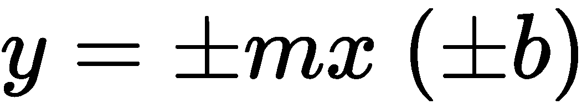

在等式中，以下方面适用:

*   *y* 是 *x* 的函数，通常简单地写成 *f(x)* (这是我们将在本书剩余部分主要使用的符号)。在上式中，输出值 *y* 取决于输入值 *x* 。
*   *m* 值是梯度，它告诉我们直线有多陡，或者它的变化率是多少(即 *x* 值的变化对 *y* 值的影响有多大)。
*   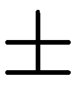值告诉我们这条线是向上移动还是向下移动。
*   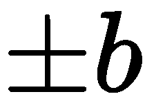值告诉我们直线高于或低于原点多少。
*   直线上的 *m* 和 *b* 值始终不变。

现在你知道了直线的方程是什么样子，你可能想知道如何找到任意直线的方程。

我们首先选取位于直线上的两个点，( *x [1] ，y [1]* )和( *x [2] ，y [2]* )，并将它们的值插入公式 [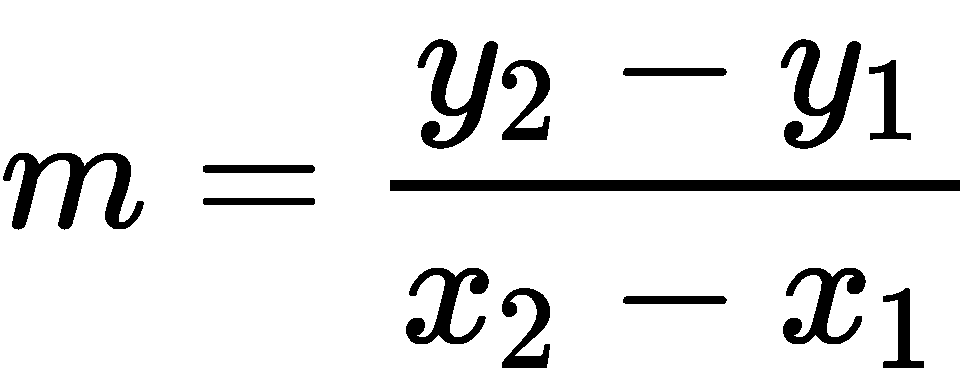] 。在找到 *m* 的值后，我们通过使用线方程找到 *b* 的值，并将 *m* 和线上一个( *x，y* )点的值代入其中，并求解 *b* 。

这非常简单明了。然而，还有更复杂的方程没有这么简单，这些方程与曲线(非线性函数)相关，如下图所示:

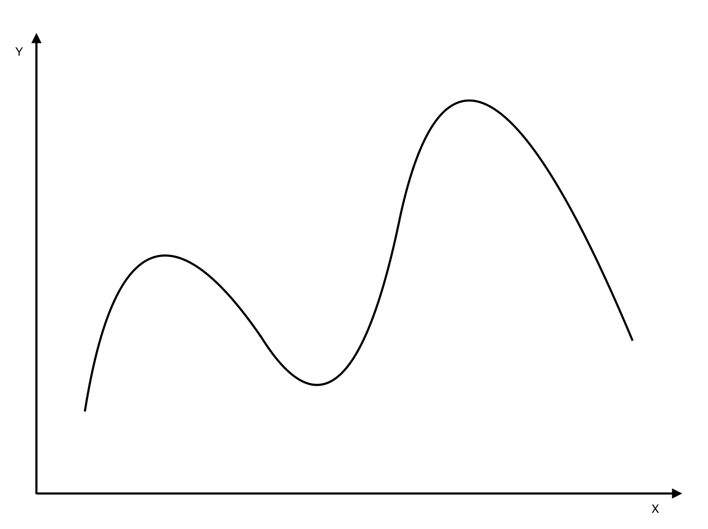

想象一幅两座小山或驼峰的图片。如果你追踪它们的表面，你会看到一条曲线，你可能已经注意到了，它们上升，然后下降，然后又上升，这个过程不断重复。

从前面的曲线图像中，您可以很容易地看出梯度不是常数，就像在前面的直线示例中一样。我们可以沿着曲线画出直线，并计算它们的斜率来理解曲线是如何移动的。然而，有一种比这种繁琐的方法更简单的方法。

微积分的核心是两个概念，如下所示:

*   **微分**帮助我们理解一个函数的输出相对于变化的输入有多大的变化。
*   **整合**帮助我们理解某些点之间输入变化的影响。

我们将从深入了解差异化开始。求函数导数的基本方程如下所示:

我知道这里有一些新的符号，看起来很复杂，但实际上非常简单。这个方程所做的是找到函数 *f* 相对于分母 *x* 中变量的导数。这与我们之前看到的方程(我们用来计算直线的梯度)没有太大的不同。我们减去两个值， *f(x+h)* 和*f(x)*，然后除以它的差， *h* 。但是 [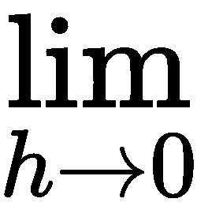] 跟这个有什么关系呢？这告诉我们，我们希望曲线上的两个点尽可能靠近，这样当我们在曲线上绘制梯度时，它在曲线上的一点看起来像一条直线。这使我们能够更好地可视化和理解更改的效果，如下面的屏幕截图所示:

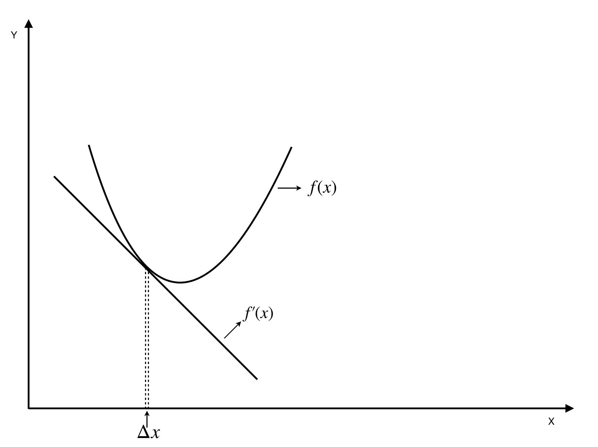

请参见以下示例:

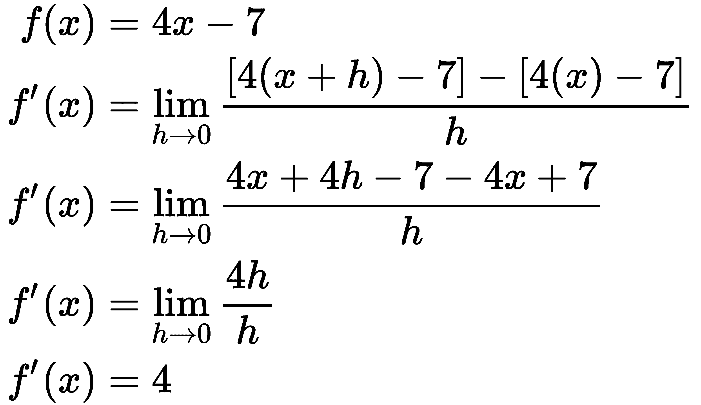

既然我们已经了解了什么是导数，以及如何对任何函数求导数，那么让我们继续学习一些重要的微分规则。

# 求和规则

求和规则规定，两个函数之和的导数与两个函数的单个导数之和相同，如下式所示:

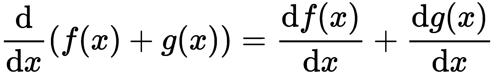

假设我们有 [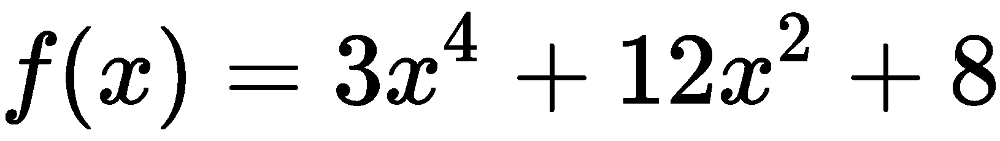] 和 [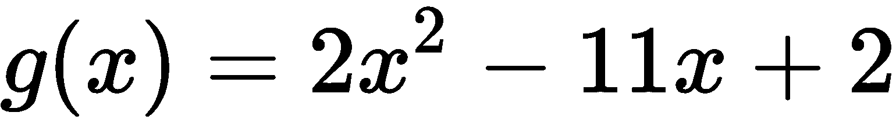] 。

由此我们可以看出，下面这个等式， [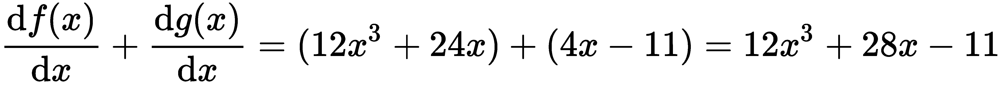] ，和这个是一样的: [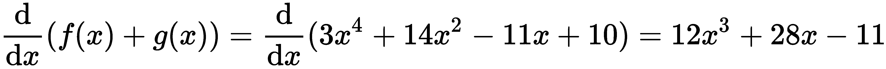] 。

# 权力规则

幂法则有助于找到变量有指数的函数的导数。简单来说，你把乘方乘以变量前面的常数，乘方减 1。让我们使用幂法则 [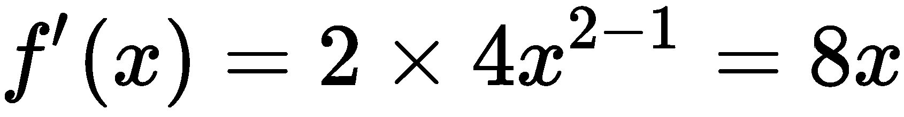] 来看看这个例子是什么样子的，如下所示:

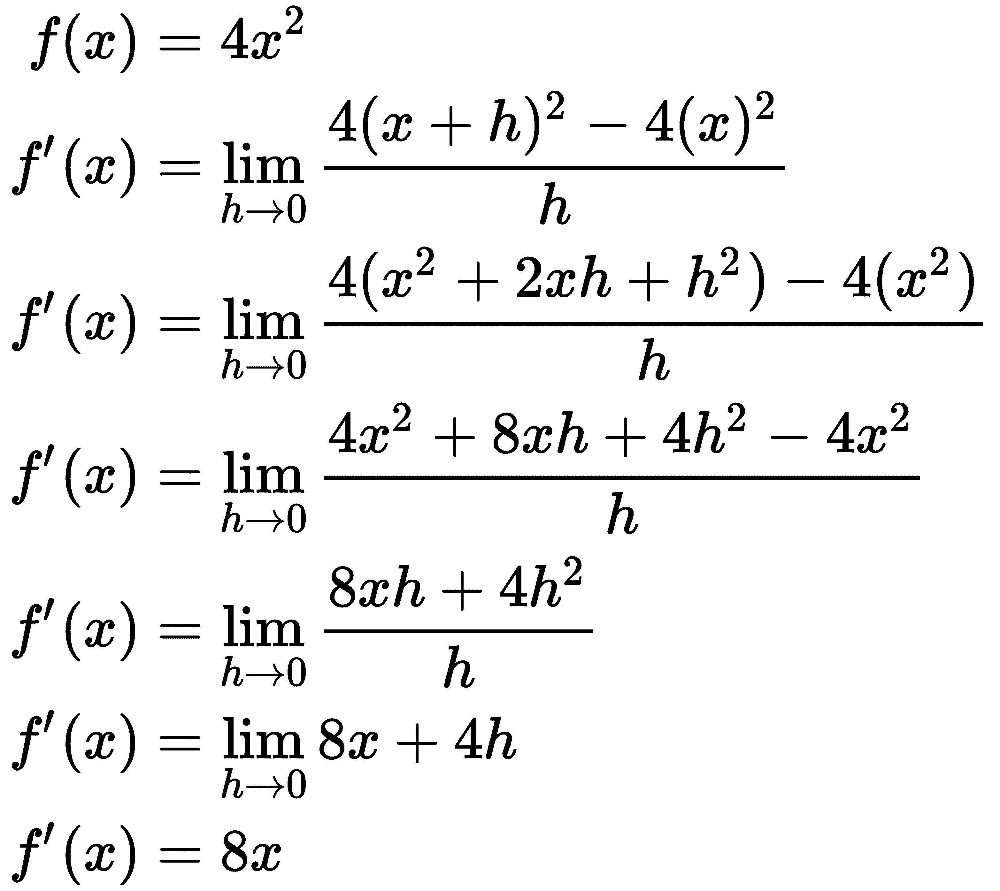

注意，不是每个函数都有导数，至少在函数的定义域中没有。

有些函数——比如 [] 或者[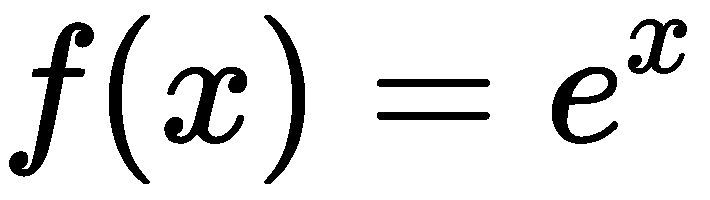]——并不像我们之前看到的那样简单。函数 [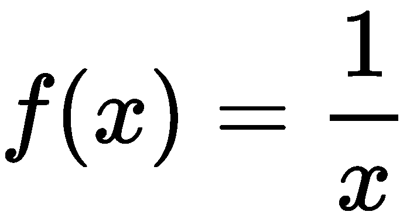] 在 *x = 0* 处不可微，因为其值未定义。这被称为**不连续性**。

同样适用于[]；然而， *e* (被称为**欧拉数**)有一个非常有趣的性质，即函数等于它的导数——也就是 [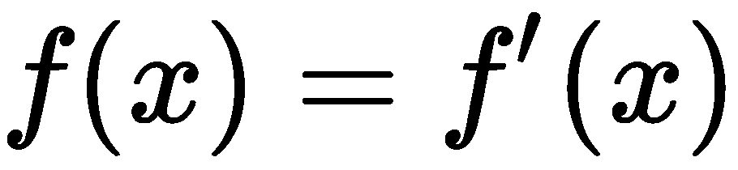] 。

# 三角函数

在高中或大学，你可能学过三角学，遇到过正弦、余弦和正切函数。对我们来说更重要的是正弦和余弦函数，你们会经常遇到，我们将在这里讨论。这些功能可以在下图中看到:

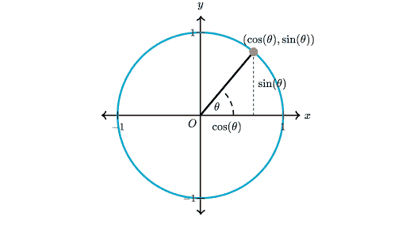

这里正弦是 [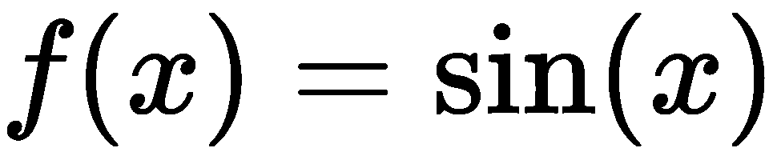] ，余弦是 [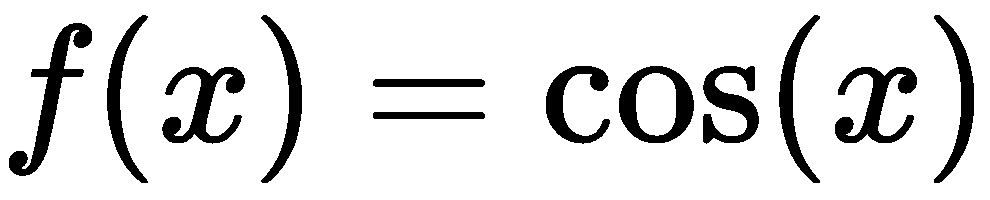。]

正弦和余弦函数是相关的，导数将告诉我们如何相关。

如果 [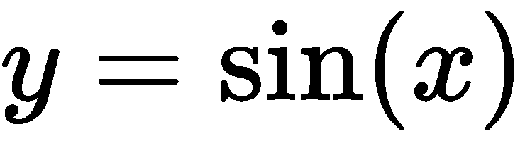] ，那么 [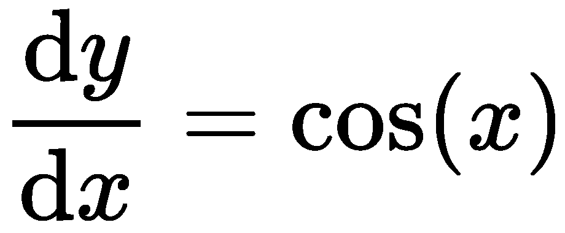] 。但是，如果 [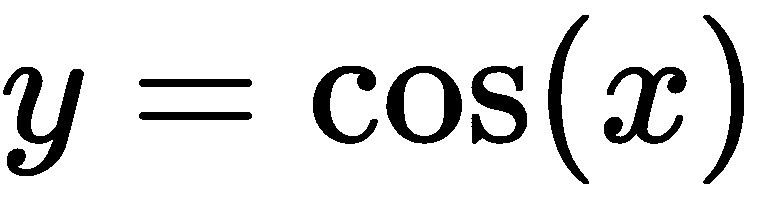] ，那么 [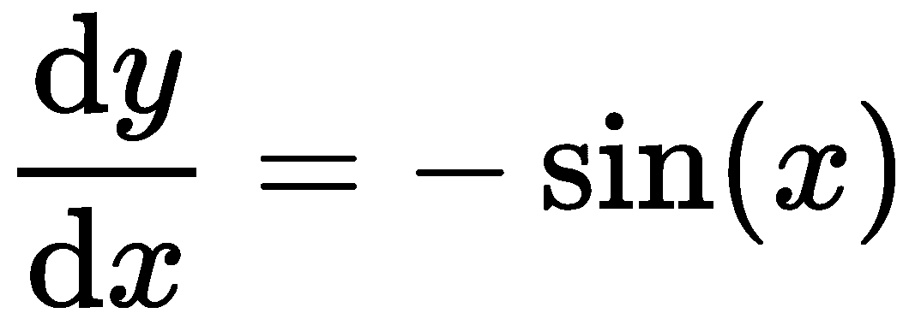] 。

导数产生一个循环，我们可以看到如下:

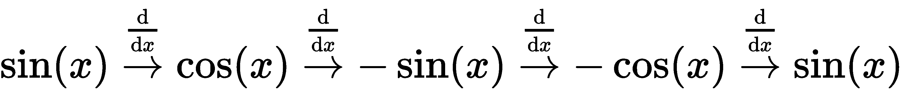

# 一阶和二阶导数

现在我们知道了如何求函数的导数，重要的是要知道我们可以多次求导。

我们知道，一阶导数给出了曲线上任意给定点( *x* )处函数的梯度(切线的斜率)——换句话说，曲线的高度(即 *y* 或 *f(x)* )是增加还是减少。正斜率告诉我们 *f(x)* 随着 *x* 的增加而增加，负斜率告诉我们 *f(x)* 随着 *x* 的增加而减少，斜率为 0 告诉我们关于曲线方向的任何事情，除了它可能在转折点(局部最小值或局部最大值)。这可以这样写:

*   如果 [] ，那么 *f(x)* 在 *x = t* 处递增。
*   如果 [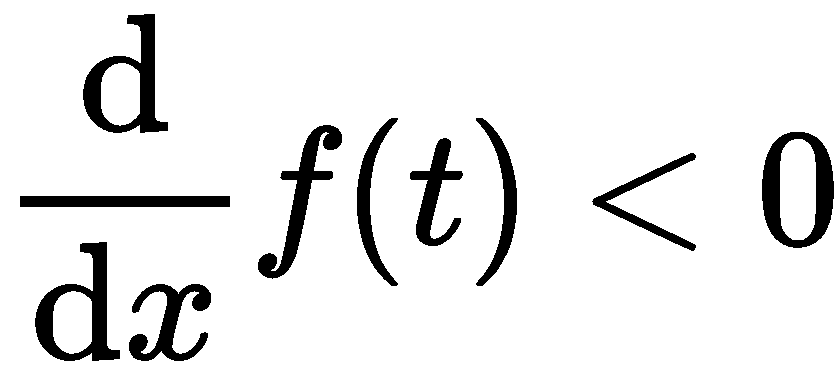] ，那么 *f(x)* 在 *x = t* 处递减。
*   如果 [] ，那么 *x=t* 就是 *f(x)* 的一个临界点。

比如让 [] 。此函数的导数如下所示:

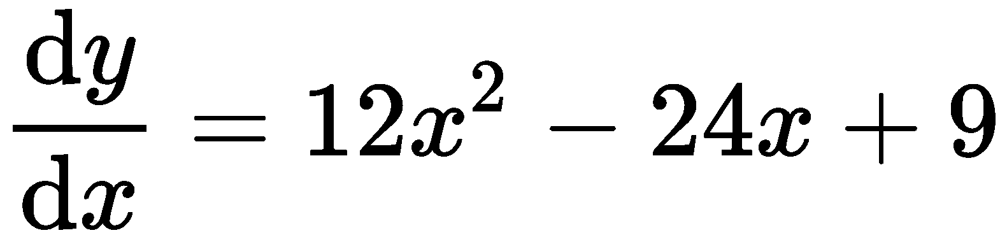

在 *x = 0* ，导数是 9，这告诉我们函数在这一点上是递增的。但是在 *x = 1* 处，导数是-3，告诉我们函数在这一点上是递减的。

二阶导数是函数导数的导数。我们把这个写成 [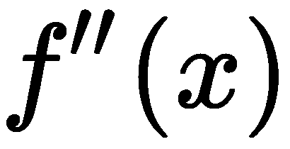] 或者 [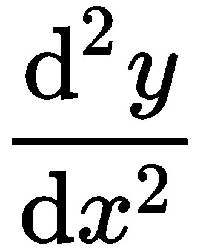] 。像以前一样，一阶导数告诉我们函数是增加还是减少，二阶导数给我们关于一阶导数的相同信息——是增加还是减少。

如果二阶导数为正，那么随着 *x* 的增加，一阶导数也在增加；如果二阶导数为负，那么随着 *x* 增加，一阶导数减少。

为了帮助我们形象化这一点，当二阶导数为正时，曲线在一点处向上凹(抛物线向上开口)，而当二阶导数为负时，曲线向下凹(抛物线向下开口)。和以前一样，当二阶导数等于零时，我们学不到什么新东西。该点可以是局部最大值、局部最小值或拐点。这是这样写的:

*   如果 [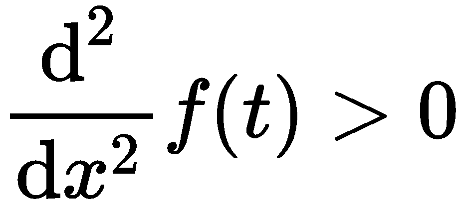] ，那么 *f(x)* 在 *x=t* 处向上凹。
*   如果 [] ，那么 *f(x)* 在 *x=t* 处向下凹。
*   如果 [] ，那么在 *x=t* 我们没有获得关于 *f(x)* 的新信息。

例如，让我们对我们使用的同一个函数进行二阶导数，如下所示:

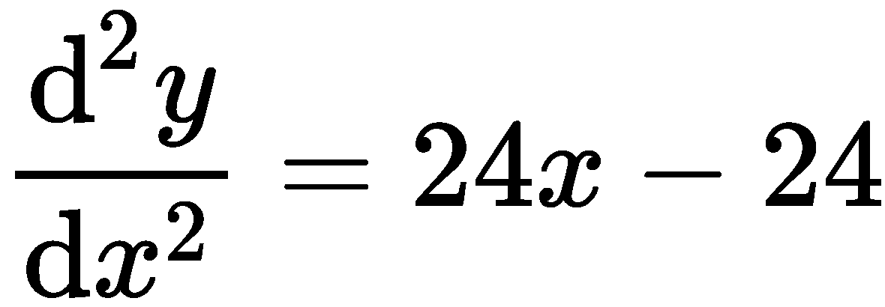

在 *x = 0* ，二阶导数是-24，这告诉我们函数在这里是下凹的。但是在 *x = 2* ，等于 24，告诉我们函数是上凹的。

前面，我们了解到当 *x* 是一个函数的临界点时，我们对该点的函数没有什么新的了解，但是我们可以用它来找出它是局部最大值还是局部最小值。这些规则可以写成如下形式:

*   如果[][]，那么 *f(x)* 在 *x=t* 处有一个局部最小值。
*   如果[][]，那么 *f(x)* 在 *x=t* 处有一个局部极大值。
*   如果[][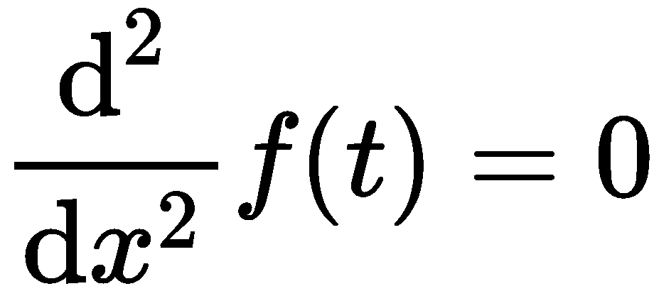]，那么在 *x=t* 我们对 *f(x)* 没有什么新的了解。

# 乘积规则

乘积法则给了我们一种直接的方法来求两个函数乘积的导数。我们取任意两个函数， *f(x)* 和*g(x)*相乘。所以， [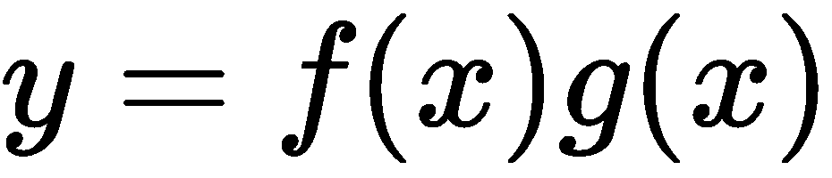] 。导数是 [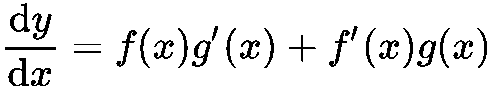] 。

让我们更详细地探讨一下，以理解它是如何工作的。看看下面的等式:

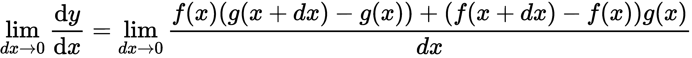

我们可以重写导数，如下所示:

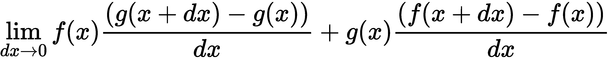

这个可以进一步简化为 [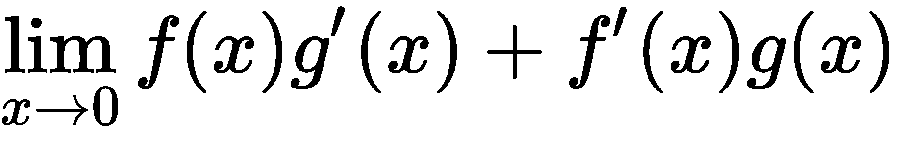] ，和前面一样。

# 商数法则

商法则允许我们找到一个函数被另一个函数除的导数。这可以从乘积法则中推导出来。和以前一样，我们取两个函数 *f(x)* 和 *g(x)* ，但是现在，我们将它们分开。所以， [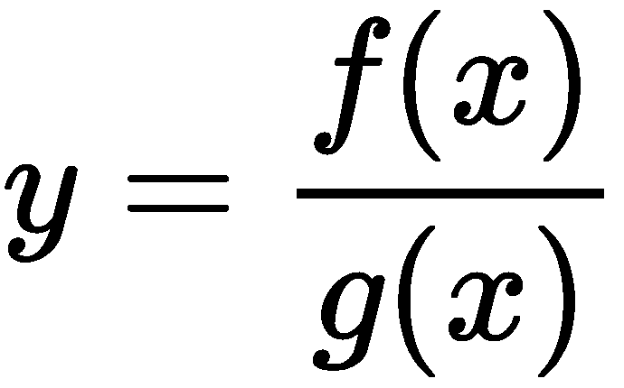] 。衍生出来的是 [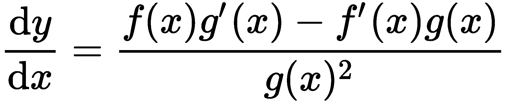] 。

假设我们有 [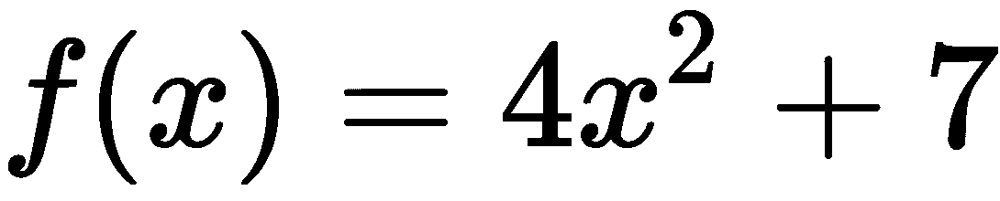] 和 [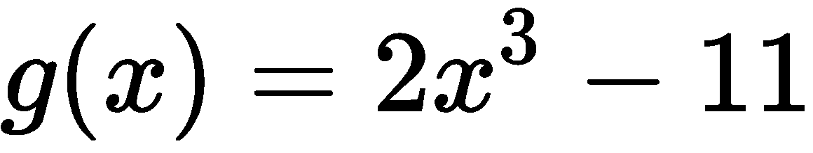] 。然后，我们有以下内容:

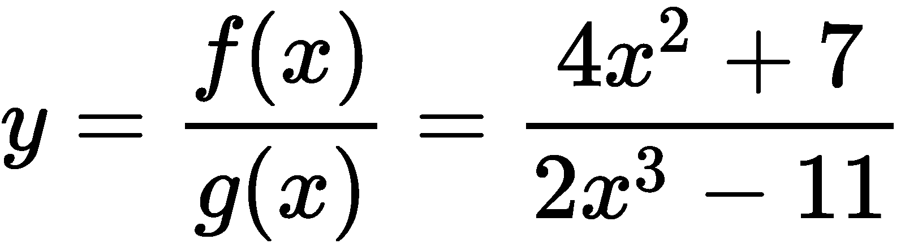

通过找到 *f(x)* 和 *g(x)* 的导数，并将它们代入前面的等式，我们得到以下结果:

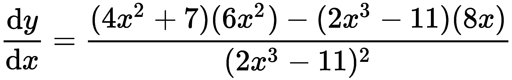

如果我们展开它，我们会找到导数。

# 链式法则

链式法则适用于接受另一个函数作为输入的函数。我们来考虑一下 [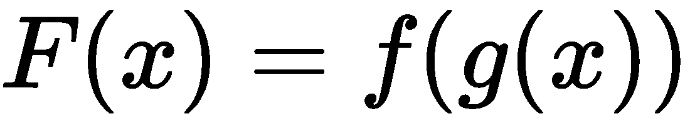] ，经常写成 [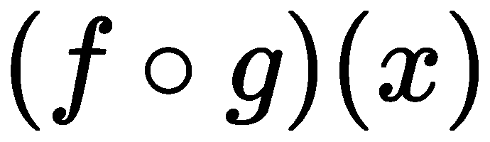] ，读作*的*f*g*的 *x* 。这意味着 *g(x)* 的输出将成为函数 *f* 的输入。

它的导数将被写成如下:

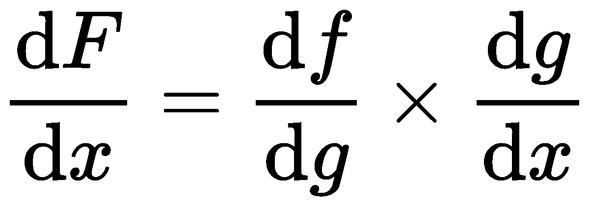

这个和 [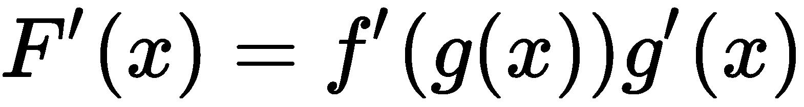] 一样。

例如，假设我们有 [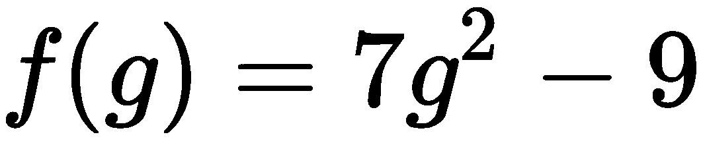] 和 [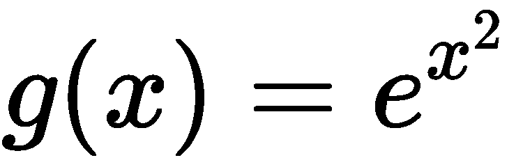] 。我们接着区分这两个函数，得到 [] 和 [] 。

将这个代入前面的公式，我们得到 [] 。

# 反导数

我们现在知道什么是导数，以及如何找到它们，但是现在，假设我们知道总体的变化率(*F*)(*F*)，我们想要找到在某个时间点总体的变化率。我们要做的是找到一个函数 *F* ，它的导数是 *f* 。这就是所谓的**反导数**，我们将其正式定义为函数 *F* 被称为 *f* 对 [] 的反导数 if [  ] for all 。

假设我们有一个函数 [] ，那么 [] (其中 *c* 是某个常数)，从中我们可以确认 [] 。

下表显示了一些我们会经常遇到的重要函数及其反导数:

| **功能** | **反导数** |
|  |  |
|  |  |
|  |  |
|  |  |
|  |  |
|  |  |
|  |  |
|  |  |
|  |  |

假设我们有以下函数:


我们想找到它的反导数。我知道这可能看起来像一个困难的等式，但是通过使用前面的表格，我们可以使它变得非常简单。让我们看看怎么做。

首先，我们重写函数，使其变成如下形式:


因此，反导数如下:

为了使事情变得简单，我们重写了它，如下所示:

。

现在你知道了。

你现在可能想知道我们是否能找到 c*的值是多少，如果能，怎么找到。让我们再看一个例子，看看是如何做到的。*

假设我们有一个函数是二阶导数，我们想找到反导数的反导数——也就是原函数。我们有以下内容:

和和

那么，第一个反导数如下:


所以，第二个反导数如下:


这里我们要求 *c* 和 *d* 的值。我们可以简单地通过插入前面的值并求解未知量来做到这一点，如下所示:

；因此，

我们也可以这样做:

；因此，

因此，我们的函数看起来像这样:


# 积分

到目前为止，我们已经学习了导数，这是一种提取函数变化率信息的方法。但是您可能已经意识到，集成是前面问题的逆过程。

在积分中，我们找到曲线下的面积。例如，如果我们有一辆车，我们的函数给出了它的速度，曲线下的面积将给出它在两点之间行驶的距离。

假设我们有曲线 [] ，曲线下 *x = a* (下限)和 *x = b* (上限，也写作[ * a，b * ])之间的面积为 s，那么，我们有:


曲线的图示如下:


这也可以这样写:


在前面的函数中，以下适用: [] ，在子区间 [] 。

该函数如下所示:


积分为我们提供了曲线下面积的近似值，对于某些ε > 0 的情况(假设ε是一个小值)，以下公式适用:


现在，让我们假设我们的函数位于 *x* 轴的上方和下方，因此呈现正值和负值，如下所示:


从前面的截图中我们可以看到， *x* 轴( *A [1]* )上方的部分面积为正，而 *x* 轴( *A [2]* )下方的部分面积为负。因此，以下公式适用:


求和是计算积分的一个重要部分，理解这一点需要一些新的求和规则。看看下面的例子:

*   []
*   []
*   []
*   []

*   []
*   []
*   []

现在，让我们探讨积分的一些重要性质，这将有助于我们更深入地学习这一章。看看下面的例子:

*   []
*   ，当 []
*   [] ，其中 *c* 是常数
*   []
*   [T51]
*   [T54]

现在，假设我们有函数 [] ，它看起来像这样:


然后，我们得到以下性质:


该属性仅适用于连续且具有相邻区间的函数。

# 微积分的基本定理

微积分基本定理是微积分中最重要的定理，它的命名非常恰当，因为它建立了微分学和积分学之间的关系。让我们看看怎么做。

假设 *f(x)* 在 *a，b* 上连续，在( *a，b* 上可微， *F(x)* 是 *f(x)* 的反导数。然后，我们有以下内容:


让我们稍微改写一下前面的等式，使它变成这个等式:


我们在这里所做的就是用 *t* 替换 *x* ，用 *x* 替换 *b* 。而我们知道 *F(x)-F(a)* 也是一个函数。由此，我们可以导出以下性质:


我们可以导出前面的性质，因为 *F(a)* 是常数，因此导数为零。

通过将我们的观点移动一点，我们得到下面的函数:


因此，我们得到。

综上所述，如果我们把我们的函数 *f* 积分，然后微分，最后得到的是原函数 *f* 。

# 替代规则

显然，能够找到函数的反导数是很重要的，但反微分公式并没有告诉我们如何计算每种类型的积分，例如，当我们有如下函数时该怎么办:


这不像我们之前看到的例子那样简单。在这种情况下，我们需要引入一个新的变量来帮助我们，使问题更容易管理。

让我们用新变量 *u* ，和，然后 *u* 的微分就是。这将问题变成如下:


这显然要简单得多。这一点的反导数变成如下:


通过插入原始值，我们得到如下结果:


现在我们有了。

这种方法非常有用，当我们遇到可以写成以下形式的问题时，这种方法非常有效:


如果 [] ，则以下适用:


这个等式可能看起来有点像你。这是应该的。这是微分的链式法则。

# 曲线之间的区域

我们知道积分给了我们找到两点间曲线下面积的能力。但是现在，假设我们想要找到位于两个图形之间的区域，如下面的屏幕截图所示:


我们可以看到，我们的区域 *S* 位于两条垂直线 *x = a* 和 *x = b* 之间的曲线 *f(x)* 和 *g(x)* 之间。因此，我们可以将曲线之间的面积近似为:


我们可以把它改写成一个积分，形式如下:


为了更好地形象化这一点，并对正在发生的事情产生一种直觉，我们有下面的图像:


# 零件集成

到目前为止，我们知道对于微分中的每一个规则，在积分中都有一个相应的规则，因为它们有一个相反的关系。

在前面关于差异化的部分，我们遇到了乘积法则。在集成中，相应的规则称为按部件集成。

概括地说，乘积法则规定，如果 *f* 和 *g* 是可微的，则以下适用:


因此，在集成中，这变成如下:


我们可以这样重写:


我们可以将这个公式与微积分的基本定理结合起来，得到下面的方程:


我们可以用这个来求区间[ *a，b* 之间的积分。

**Note**: The term [ ]merely states that we plug in the value *b* in place of *x* and evaluate it, and then subtract it from the evaluation at *a*.

我们也可以用前面的换元法进行分部积分，让我们在计算积分的时候更加轻松。我们制造 [] 和[]；那么，差速器是 [] 和 [] 。因此，公式变成了这样:


# 多元微积分

现在我们已经学习了单变量微积分，了解了微积分是什么，是时候更深入地学习多变量微积分了。多变量微积分与单变量微积分有很多相似之处，除了——顾名思义——在这里，我们将处理接受两个或更多变量作为输入的函数。

多元微积分在现实世界中无处不在，在每个领域和行业都有应用，从医疗保健到经济，到金融，到机器人，到航空航天，等等。这方面的一个例子可能是试图模拟飞机周围的空气如何弯曲，以了解它的空气动力学如何，以及飞机机身的设计可以改进的地方。这是我们用单变量微积分无法做到的。

# 偏导数

偏导数是我们用来寻找一个函数的导数的方法，这个函数依赖于一个以上的变量，相对于它的一个变量，同时保持其他变量不变。这使我们能够理解一个函数是如何受到单个变量而不是所有变量的影响的。假设我们正在为一个股票项目的价格建模，而价格取决于许多不同的因素。我们可以一次改变一个变量，以确定这种变化对库存商品价格的影响程度。这不同于求全导数，因为所有的变量都是变化的。

多元函数可以有任意多的变量，但为了简单起见，我们将研究一个有两个变量的函数，如下所示:


这个函数看起来比我们之前处理过的要复杂得多。我们来分解一下。当我们对一个函数相对于 *x* 求偏导数时，我们会发现 *z* 随着 *x* 变化的变化率，同时保持 *y* 不变。当我们对其他变量求导时，情况也是如此。

让我们形象地把 *xy* 平面(一个平面)想象成一组可接受的点，这些点可以作为我们函数的输入。输出值， *z* ，可以认为是我们从 *xy* 平面提升了多少(或高度)。

让我们首先对的功能进行微分，如下所示:


这为我们提供了以下信息:


现在，我们将对 *y* 进行区分，如下所示:


这为我们提供了以下信息:


如前所述，在单变量微分中，我们可以对函数求二阶导数(当然，在合理的范围内)，但在多变量微积分中，我们也可以求混合偏导数，如下所示:


你可能已经注意到，当我们求混合偏导数时，变量的顺序并不重要，无论我们先对 *x* 求导，然后对 *y* 求导，我们都会得到相同的结果，反之亦然。

我们也可以用另一种更方便的形式来写，这就是我们将在本书中用到的。该功能如下所示:


# 链式法则

让我们取一个任意函数 *f* ，它以变量 *x* 和 *y* 为输入，并且任一变量都有一些变化，使得 [] 。利用这一点，我们可以通过以下方式找到 *f* 的变化:


这使我们得出以下等式:


然后以函数的极限为 [] ，就可以推导出偏导数的链式法则。

我们对此表述如下:


我们现在将这个等式除以一个附加的小数量( *t* ),其中 *x* 和 *y* 是相关的，以找到沿着 [] 的梯度。前面的等式变成了这个等式:


我们早先遇到的微分规则在这里仍然适用，并且可以扩展到多变量的情况。

# 积分

和单变量的情况一样，对于依赖于多个变量的函数，我们也有反导数和积分。之前，我们了解到积分给出了区间[ *a，b* ]之间的曲线 [] 下的面积。现在，我们将在图形 [] 下寻找一个区域的体积，而不是寻找一个区间上的面积。等式看起来像这样:


在上式中， *R* 是 *xy* 平面中的一个区域。将 *R* 想象成被切割成多个小的矩形区域，记为δ*a .*然后，我们可以近似计算体积如下:


另外，[；]由此， [] 。

**Note**: A double integral is not the same as taking an integral twice.

现在，让我们将区域分成固定宽度δ*x*的长薄片，而不是在小矩形区域上计算。听起来熟悉吗？应该是，因为这与我们之前在单变量积分中所做的非常相似。

让我们指定 [] ，现在，我们的积分采用如下形式:


然后，我们将结果乘以δ*x*。

我们现在可以重写积分，如下所示:


在这里， [] 和 [] 。

假设我们有函数 [] ，区域的边界定义在 [] 和 [] 上。然后，积分如下:


通过计算内部积分，我们得到如下结果:


通过计算外部积分，我们得到如下结果:


现在你知道了。这就是我们如何找到多变量函数的积分。

现在假设我们有一个函数 [] ，我们对 [] 和 [] 所在的区域进行积分计算。然后，我们有以下内容:


这是分配法则的直接结果。

到目前为止，我们一直在积分的区域是矩形的，但情况很可能并不总是如此。如果该区域是不规则的形状，那么积分的极限将在每个切片上变化。

处理这个问题的最好方法是，把它写成一个我们不积分的变量的函数。

假设我们有 [] ，它所在的点集是 [] ，它告诉我们[][]。我们现在可以用下面的形式来写它:


这里我们可以看到， *x* 定义在区间[ *a，b* ]上， *y* 存在于 *x—* *g(x)* 和 *h(x)* 两个函数之间。

我们从三角学，特别是勾股定理中知道， *y* 的最小值将是 [] ，最大值将是 [] 。

我们现在可以重写前面的一组点，如下所示:


改变它，并以这种方式写入，将单位圆盘切割成以固定宽度间隔的垂直线。

然后，我们的积分变成了这个:


又因为 [] ，我们可以重写前面的积分，就像这样:


然后我们继续计算内部积分，然后是外部积分，就像这样:


从圆的面积我们知道这是真的: []

二重积分的一些重要性质如下表所示:

*   []
*   [] ，其中 *c* 是某个常数
*   [] 如果把 *R* 分成两个区域，*R[1]和*R[2]**
*   [] 当 [] 为全 []

现在让我们假设有一个顶部为球形的圆柱体，如下图所示，我们想求出它的体积。球体下面的区域是 [] 和圆柱体里面的 [] 和*上面的 z = 0* ，如下图:


我们知道，我们找到一个区域的体积如下:


为了计算这个积分，我们首先将球面的方程改写成 [] ，定义 *x* 和 *y* 的点集为 [] 。

我们重写我们的点，并根据极坐标 *θ* 和半径 *r* 来定义区域的界限，因此方程看起来像这样:

和

我们现在可以重写 *z* ，如下所示:


所以，体积如下:


通过计算内外积分，我们得到如下结果:


我们现在知道如何在中整合我们的区域，并找到图表下的体积。但是当我们在中有区域时呢？早先，我们对二维区域使用二重积分；因此，自然地，对于一个三维区域，我们将使用三个积分。我们这样写:


假设我们积分的区域由 [] 、 [] 和 [] 定义。三重积分变成如下:


早些时候，我们遇到了一个叫做替换的东西，我们让函数等于一个变量，这样我们更容易找到导数。我们也可以在集成中做同样的事情。

假设我们有以下积分:


我们可以使 [] ，积分于是变成这样:


现在，让我们继续二重积分，看看如何变换区域，使它们更容易处理。为此，我们需要求助于我们的老朋友雅可比矩阵。

作为复习，假设我们有 [] 和 [。]那么，雅可比矩阵如下:


此外，回想一下，雅可比矩阵也可以被认为是行列式。因此，我们可以将前面的等式改写如下:


假设现在我们要积分 [] 超过 *R* 。现在，让我们制作 [] 和 [] ，并将我们的区域重命名为 *S* 。积分现在看起来像这样:


由此，我们很容易观察到 [] 。

现在让我们继续讨论三重积分。假设我们有一个函数 [] ，我们想在 *R* 上对它积分。我们从制作[][][]开始，和之前一样，我们将新区域重命名为 *S* 。雅可比矩阵如下所示:


三重积分现在看起来像这样:


我们现在对多变量微积分有了足够好的理解，并准备好进入向量微积分的奇妙世界。

# 向量演算

当我们找到函数对向量的导数时，我们需要更加努力。正如我们将在[第 2 章](6a34798f-db83-4a32-9222-06ba717fc809.xhtml)、*线性代数*中看到的，向量和矩阵是不可交换的，其行为与标量完全不同，因此我们需要找到一种不同的方法来区分它们。

# 派生物

前面，我们看到函数是通过使用商中变量的极限来微分的。但是正如我们所知，向量不同于标量，因为我们不能用向量来除，这就产生了对向量值函数的新定义的需求。

我们可以将向量函数定义为函数——也就是说，它接受一个标量值作为输入，输出一个向量。因此， *F* 的导数定义如下:


在上式中，δ *x* 是对 *x* 的小扰动。此外， *F* 仅在以下情况下可微:


我们也可以将前面的微分写成如下形式:


通常，我们按分量对向量进行微分，因此，前面的微分变为:


这里*e[I]是一个正交基向量。*

矢量微分的一些规则如下表所示:

*   []
*   []
*   []
*   []
*   []
*   []

从前面我们知道，我们用极限的概念来求函数的导数。那么，让我们看看如何找到一个向量的极限。我们在这里使用规范的概念。我们说 [] ，如此，若 [] ，则为[]。

一般来说，导数是在所有可能的方向上计算的。但是如果我们只想在一个特定的方向上找到它呢 *n* (单位向量)？然后，假设 *δr = hn* ，我们有如下公式:


由此，我们可以导出方向导数如下:


这给了我们这个方向上 f 的变化率。

假设现在我们有了*n = e[I]。然后，我们的方向导数变成如下:*


因此，我们有以下内容:


因此，可微性的条件现在变成如下:


我们可以用差分符号来表示，如下所示:


这看起来与我们之前遇到的情况非常相似。这是偏导数的链式法则。

现在让我们来看一个函数 [] ，它接受一个向量输入，这样 [] 。这个函数的偏导数写如下:

然后，我们可以将它统一写成一个向量，如下所示:


让我们更进一步，想象一个由 *m 个*不同标量函数组成的向量函数，它以向量 *x* 作为输入。我们会把这个写成 *y = f(x)* 。

展开 *y = f(x)* ，我们得到如下:


让我们简单回顾一下雅可比矩阵。如你所见，它只是一个( *m×n* )矩阵，包含了之前向量函数的所有偏导数。我们可以在这里看到这个样子:


让我们更进一步，将这个定义扩展到多个函数。这里，我们有 *y* ，它是两个函数 *f* 和 *g* 的和，每个函数接受不同的矢量输入，这为我们提供了以下内容:

并且为了简单起见， *f* 、 *g* 、 *a* 、 *b* 都是 *n* 维的，这就产生了一个 *n×n* 矩阵，如下:


我们可以对这个矩阵相对于 *a* 或 *b* 进行微分，并找到每个矩阵的雅可比矩阵。

通过对 *a* 进行微分，我们得到以下结果:


通过对 *b* 求导，我们得到以下结果:


我们可以对这两个函数进行任何类型的元素操作。

在单变量和多变量微积分中，我们也有向量微分的链式法则。

让我们来看看两个向量函数的合成，它们接受一个向量输入 [] ，因此其梯度将是 [] ，看起来与我们之前遇到的类似。让我们进一步展开，如下所示:


在大多数情况下，对于雅可比矩阵中的自变量，其中 *i ≠ j* ，自变量趋向于零，这导致我们得出以下定义:


因此，以下情况适用:


正如我们所见，这是一个对角矩阵。

# 向量场

我们将一个向量场定义为一个函数，它只有在下列情况下才能被微分:


这里，是 *F* 的导数。

我们可以把 *M* 看作是一个把一个向量映射到另一个向量的矩阵，我们现在可以把 *F* 表示如下:


在这里， [] 为所有的 [] ，因此， *F* 的导数是这样的:


在前面的单变量和多变量微积分中，我们学习了链式法则的重要性，所以在向量微积分中也有链式法则就不足为奇了。它是这样的。

假设我们有 [] 和 [] ，坐标是 [] 、 [] 、 [] 。然后，链式法则给出了如下结果:


我们可以将其改写为矩阵形式，如下所示:

# 反函数

反函数是一类非常有趣的函数，因为如果我们有两个函数，并且我们将它们相互应用，我们会得到相同的结果。从数学上来说，我们定义如下:

假设我们有 [] 。那么，它们只是反函数如果 [] 。例如，我们可以有 [] 和 [] 。因此， [] ，也就是告诉我们 [] 。

这是另一个很酷的特性:


# 摘要

就这样，我们结束了微积分这一章。到目前为止，我们已经了解了单变量、多变量和向量微积分的基本概念，以及是什么使它们如此有用。

在下一章，我们将继续学习概率和统计，看看我们在线性代数和微积分中学到的知识是如何应用到这些领域的。