# 概率与统计

在这一章中，我们将讨论数学中最重要的两个领域——概率和统计。这是两个你在日常生活中可能会多次遇到的术语。人们用它来证明几乎所有发生的事情，或者当他们试图证明一个观点时。一旦你读完了这一章，你就会对它们有一个牢固的掌握，并且会理解它们之间的联系和区别。

本章将涵盖以下主题:

*   理解概率中的概念
*   统计学中的基本概念

# 理解概率中的概念

概率论是最重要的数学领域之一，对于理解和创建深度神经网络至关重要。我们将在接下来的章节中探讨这个声明的细节。然而，现在我们将集中精力对这一领域有一个复杂的了解。

我们使用概率论来理解某一事件发生的可能性。一般来说，概率论是关于理解和处理不确定性的。

# 经典概率

假设我们有一个随机变量，它将随机实验的结果映射到我们感兴趣的属性。上述随机变量衡量一组或多组结果发生的可能性(概率)。我们称之为**概率分布**。将概率分布视为我们将在本章学习的概念的基础。

概率论中有三个非常重要的概念——概率空间、随机变量和概率分布。让我们从定义一些更基本但重要的概念开始。

样本空间是所有可能结果的集合。我们用ω表示。假设我们有 *n* 个可能的结果——那么，我们有 [] ，其中 *w [ i ]* 是一个可能的结果。样本空间(ω)的子集被称为**事件**。

概率与集合有很大的关系，所以让我们看一下一些符号，这样我们可以更好地理解后面的概念和例子。

假设我们有两个事件， *A* 和 *B* ，⊆ω。我们有以下公理:

*   *A* 的补码是*A^C，所以 [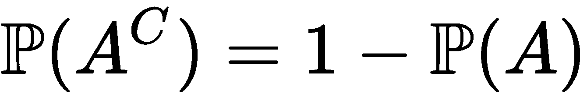] 。*
*   如果出现 *A* 或 *B* 中的任何一个，则写为*A*∨*B*(读作 *A* 联管节 *B* )。
*   如果 *A* 和 *B* 都出现，则写成 *A* ∩ *B* (读作 *A* 相交 *B* )。
*   如果 *A* 和 *B* 互斥(或不相交)，那么我们写[T5。]
*   如果 *A* 的发生暗示了 *B* 的发生，这就写成 *A* ⊆ *B* (所以， [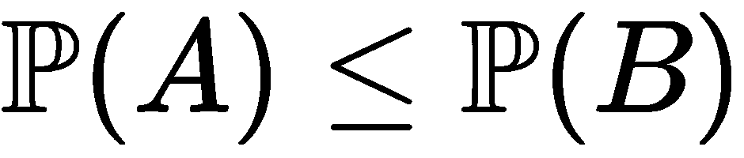] )。

比方说我们有一个事件，*一个*∈ω， [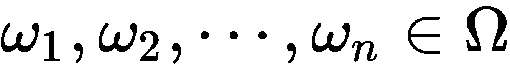] 。在这种情况下，发生 *A* 的概率定义如下:

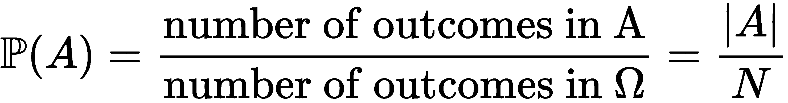

这是一个可能出现的次数除以样本空间中可能结果的总数。

让我们来看一个简单的抛硬币的例子。在这里，样本空间由抛硬币的所有可能结果组成。假设我们正在处理两次抛硬币，而不是一次，h 表示正面，t 表示反面。所以，样本空间为ω= {*hh*， *ht* ， *th* ， *tt* }。

所有可能的实验结果构成了事件空间， [] 。完成实验后，我们观察结果ω∈ω是否在 *A* 中。

由于在每个事件 [] 中，我们将 *P(A)* 表示为事件发生的概率，将 *P(A)* 表示为 *A* 发生的概率。

继续前面的公理，必须满足以下条件:

*   [] 为 [的所有情况。]
*   [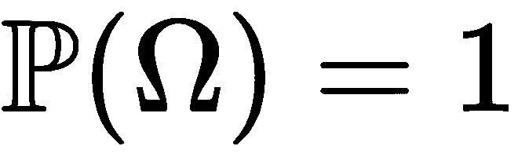。]
*   如果事件 *A [1] ，A [2] ，…* 是不相交且可数相加的——即 [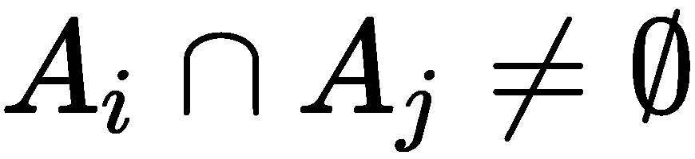] 对于 *i，j—* 的所有情况，我们则有 [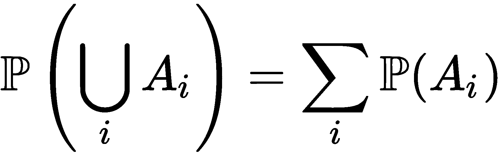] 。

这三个 [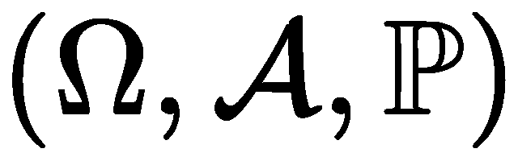] 项被称为**概率空间**。

根据经验，当 [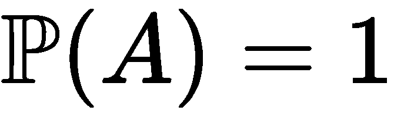] 时，那么事件 *A* 几乎肯定会发生，而当 [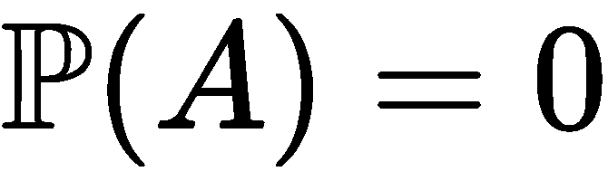] 时，那么事件 *A* 几乎不会发生。

使用前面的公理，我们可以得出以下结论:

所以， [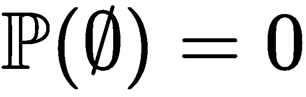] 。

此外，如果我们有两个事件， *A* 和 *B* ，那么我们可以推导如下:

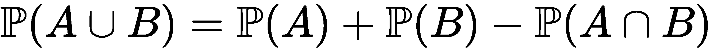。

继续前面的公理，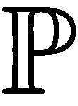必须满足以下条件:

[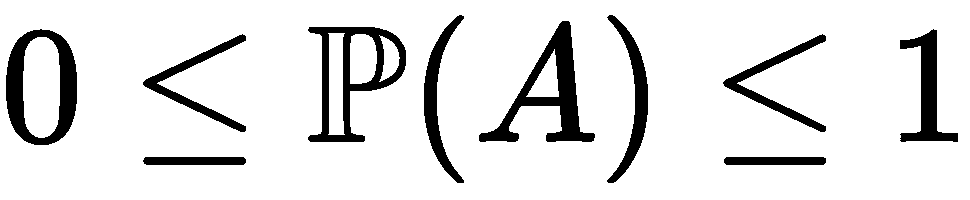] 为所有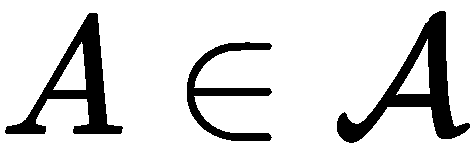

为了找到任何事情的概率，我们通常要计数。假设我们有一个装满网球的桶，我们从桶中选择一个球 *r* 次；因此，第一次挑选有*n[1]种可能性，下一次挑选有*n[2]种可能性，依此类推。选择的总数最终是*n[1]*×*n[2]*×…×*n[r]*。**

# 替换或不替换的采样

现在让我们假设桶中总共有 *n* 件物品，我们必须从中挑选 *r* 件。然后，设 *R* = {1，2，…， *r* }为选取的物品列表，设 *N* = {1，2，…， *n* }为物品总数。这可以写成一个函数，如下所示:

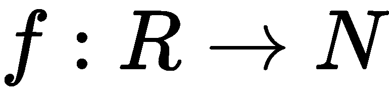

这里， *f(i)* 是第 *i ^(th)* 项。

替换抽样是指我们随机选取一个项目，然后将它放回原处，以便可以再次选取该项目。

但是，无替换抽样是指当我们选择了一个项目，没有把它放回去，所以我们不能再次挑选它。让我们看一个两者都有的例子。

假设我们需要打开办公室的门，我们有一个装有 n 把钥匙的包；它们看起来都一样，所以无法区分它们。

我们第一次试着挑选一把钥匙，在试了一次之后，我们替换了每一把，并且我们设法在第*次^次次*次试验中找到了正确的钥匙，这意味着我们错了*次 r-1 次*。那么概率如下:

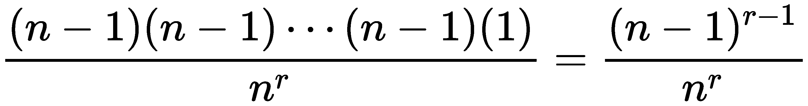

现在，我们知道我们早期的策略不是最聪明的，所以这次我们再试一次，但没有替换，并消除每个不起作用的键。现在，概率如下:

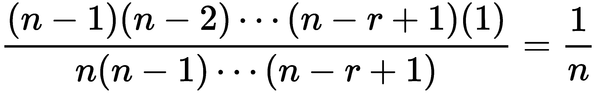

# 多项式系数

我们从二项式定理(你可能在高中学过)中知道以下是正确的:

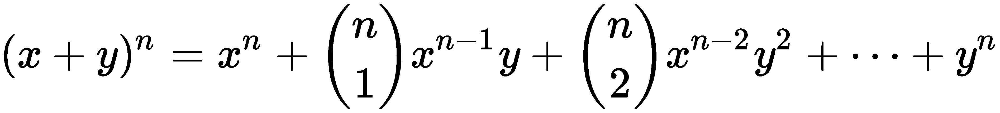

那么，三项式如下:

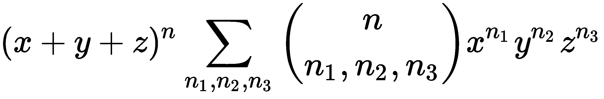

假设我们有 n 块糖果，有蓝色和红色的糖果。我们挑选糖果的不同方式定义为 [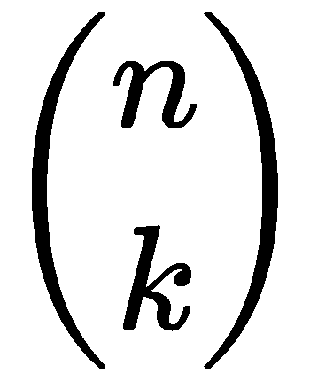] ，读作 *n* choose *k* 。

多项式系数如下:

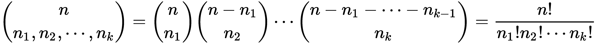

这样，我们将 *n* 物品分散到 *k* 位置，其中*I^(th)位置有*n[I]物品。**

例如，假设我们在玩牌，我们有四个玩家。一副牌有 52 张牌，我们给每位玩家发 13 张牌。因此，我们分发卡片的可能方式如下:

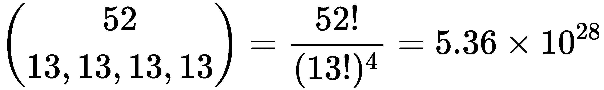

这绝对是巨大的！

这就是斯特灵公式的用处。它让我们可以近似地得到答案。

# 斯特灵公式

为便于论证，姑且说 [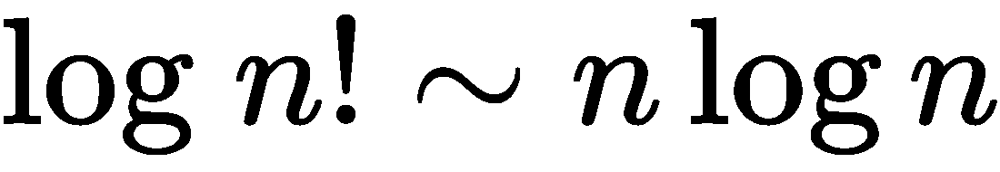] 。

我们知道以下是真实的:

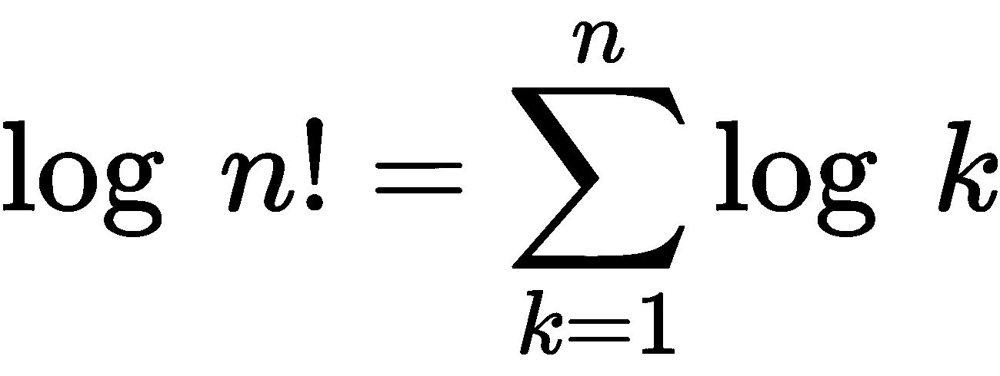

然而，我们现在声明如下:

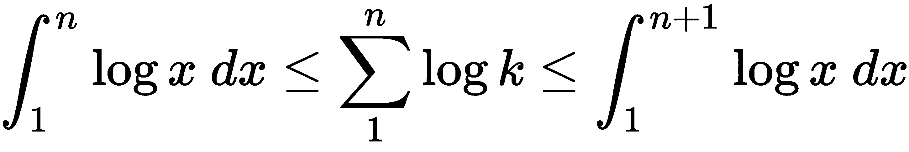

这可以用下面的例子来说明:

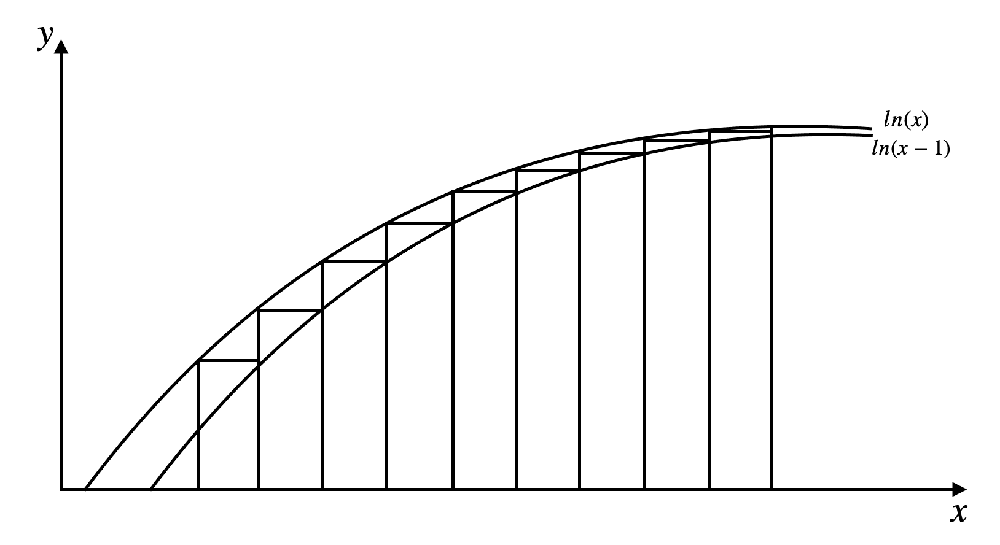

现在，通过计算积分，我们得到如下结果:

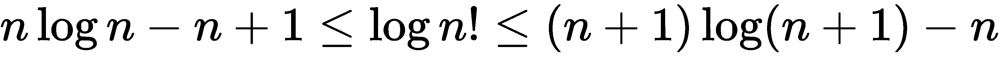

我们现在将两边除以 [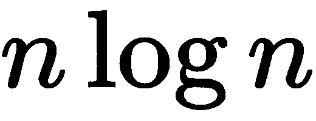] ，取极限为 *n* →∞。我们观察到双方都倾向于 1。因此，我们有以下内容:

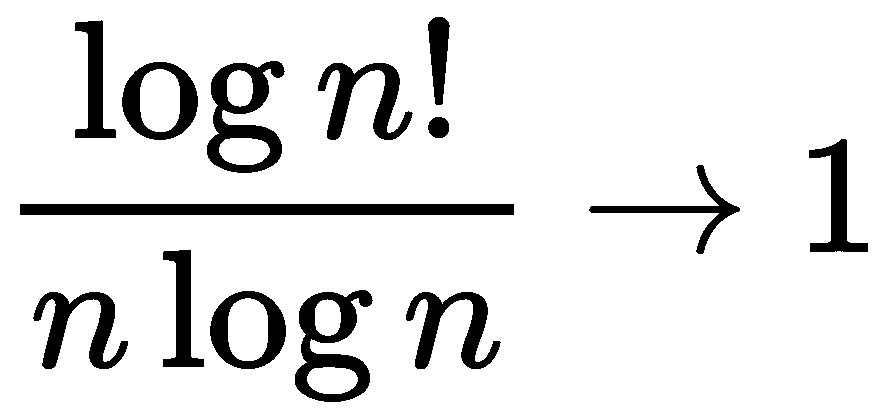

斯特灵公式指出，当 *n* →∞时，以下为真:

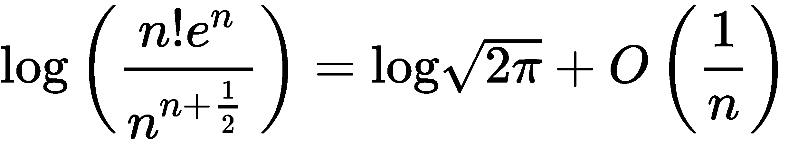

此外，我们还有以下内容:

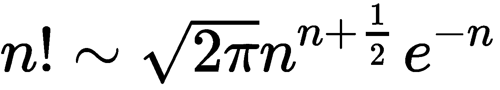

我们将避免研究斯特林公式的证明，但如果你有兴趣了解更多，那么我强烈建议你去查一下。

# 独立性ˌ自立性

当事件彼此不相关时，它们是独立的；也就是说，一方的结果对另一方的结果没有影响。

假设我们有两个独立的事件， *A* 和 *B* 。然后，我们可以测试以下内容:

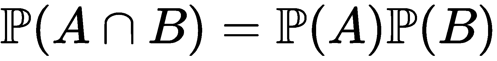

如果这不是真的，那么事件是相关的。

想象你在一个赌场，你在玩骰子。你掷出两个骰子——它们的结果彼此独立。

独立性的一个有趣性质是，如果 *A* 和 *B* 是独立事件，那么 *A* 和*B^C也是独立事件。*

让我们来看看这是如何工作的:

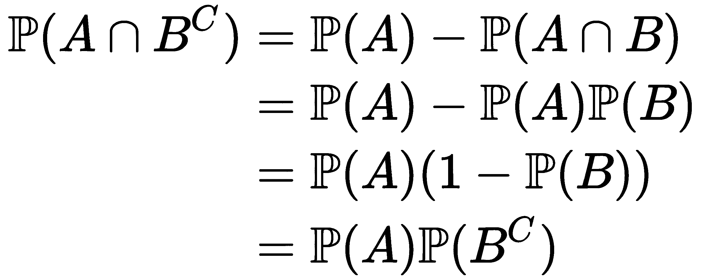

当我们有多个事件， *A [1] ，A [2] ，…，A [n]* 时，我们称它们相互独立当 [] 对于所有 n ≥ 2 的情况。

让我们假设我们在一个实验室里进行两个实验；我们将它们分别建模为 [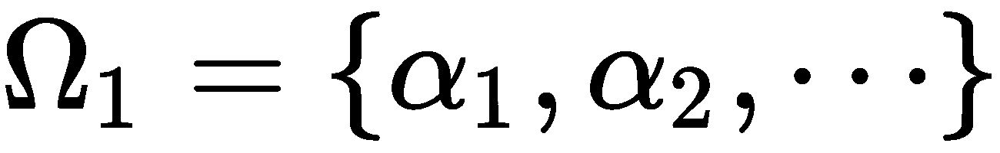] 和 [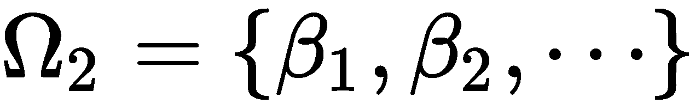] ，并且每个的概率分别为 [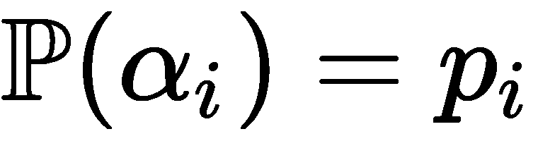] 和 [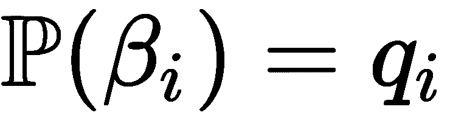] 。如果这两者是独立的，那么我们有以下内容:

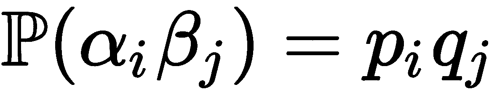

这是针对 *i* 和 *j* 的所有情况，我们新的样本空间是ω=ω[1]×ω[2]。

现在，假设 *A* 和 *B* 分别是ω[1]和ω[2]实验中的事件。通过计算*A*×ω[2]和*B*×ω[1]，我们可以将它们视为新样本空间ω的子空间，这导致如下结果:

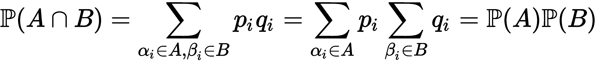

尽管我们通常将独立性定义为同一实验中不同的(不相关的)结果，但我们也可以将其扩展到任意数量的独立实验。

# 离散分布

离散指的是我们的样本空间是可数的，比如掷硬币或掷骰子。

在离散概率分布中，样本空间是 [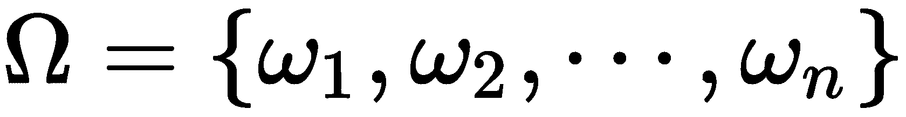] 和 [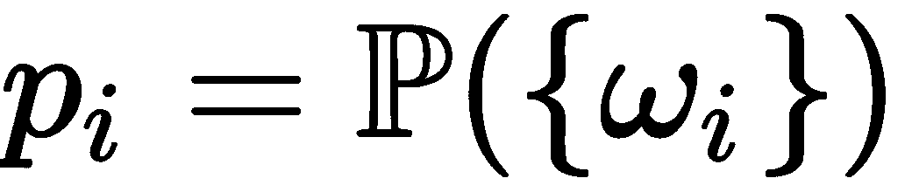] 。

下面是我们在概率论中经常遇到的六种不同的离散分布:

*   伯努利分布
*   二项分布
*   几何分布
*   超几何分布
*   泊松分布

让我们按顺序定义它们。

对于伯努利分布，我们以抛硬币为例，我们的样本空间为ω= {*H*， *T* }(其中 *H* 是正面， *T* 是反面，*p*∈【0，1】)(即 0 ≤ *p* ≤ 1)。我们将分布表示为 *B(1* ， *p)* ，因此适用以下情况:

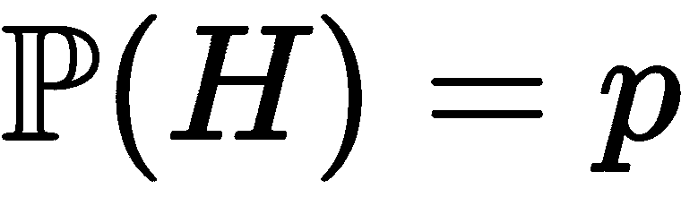和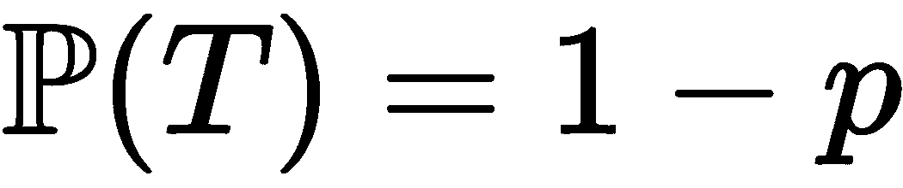

但是现在，让我们假设硬币被抛 *n* 次，每次都有前面提到的概率 *p* 结果是正面。然后，表示为 *B(n，p)* 的二项式分布陈述如下:

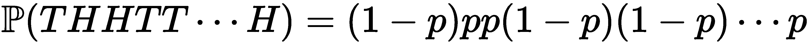

因此，我们有以下内容:

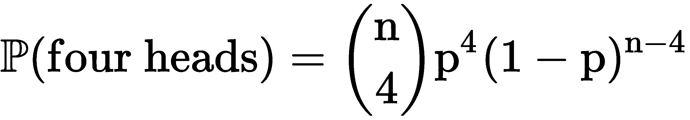

一般来说，二项分布的写法如下:

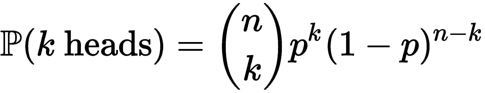

几何分布不保留对过去事件的任何记忆，因此是无记忆的。假设我们再掷一次硬币。这种分布并没有给我们任何迹象表明什么时候我们可以期待一个正面的结果，或者需要多长时间。所以，我们把得到反面后得到正面的概率写为 k 次:

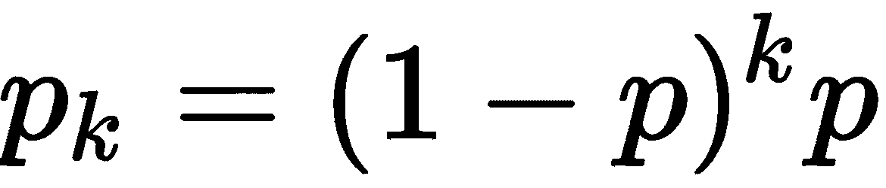

假设我们有一个装满两种颜色的球的桶——红色和黑色(我们将分别表示为 *r* 和 *b* )。从桶中，我们挑出了 *n* 个球，我们想计算出这些球中 *k* 是黑色的概率。为此，我们使用超几何分布，如下所示:

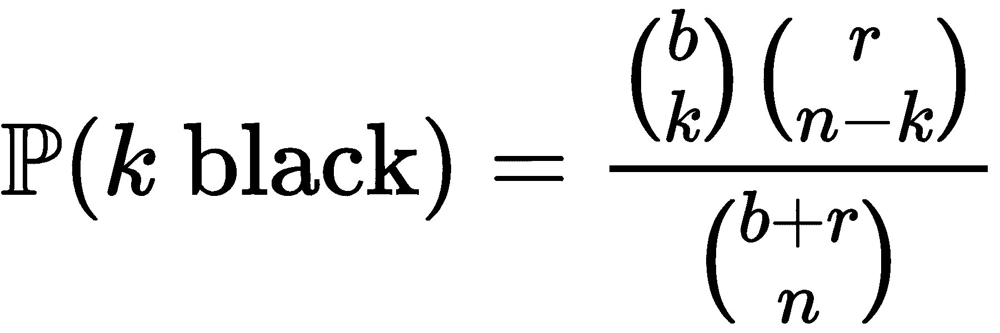

泊松分布与其他分布略有不同。它用于模拟发生率为λ的罕见事件。它表示为 *P* (λ),写为:

对于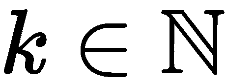的所有情况都是如此。

# 条件概率

当一个事件的发生导致另一个事件的发生时，条件概率是有用的。如果我们有两个事件， *A* 和 *B* ，其中 *B* 已经发生，我们想要找出 *A* 发生的概率，我们写如下:

这里， [] 。

然而，如果两个事件 *A* 和 *B* 是独立的，那么我们得到如下结果:

另外，如果 [] ，那么就说 *B* 吸引 *A* 。但是，如果 *A* 吸引*B^C，那么它排斥 *B* 。*

*A* 与 *B* 之间的吸引力是双向的，即 *A* 只有在 *B* 也吸引 *A* 的情况下，才能吸引 *B* 。

以下是条件概率的一些公理:

*   [T59。]
*   [。]
*   [。]
*   [] 是一个概率函数，只对 *B* 的子集有效。
*   [T1。]
*   如果 [] ，那么 [。]

下面的等式被称为**贝叶斯法则**:

这也可以这样写:

在这里，我们有以下内容:

*   [] 被称为先验。
*   [] 是后路。

*   [] 是可能性。
*   [] 充当归一化常数。

符号读作**与**成比例。

通常，我们最终不得不处理复杂的事件，为了有效地导航它们，我们需要将它们分解成更简单的事件。

这就引出了分区的概念。划分被定义为一起构成样本空间的事件的集合，使得对于 *B [i]* 、 [] 的所有情况。

在抛硬币的例子中，样本空间被分成两个可能的事件——正面和反面。

如果 *A* 是一个事件，而*B[I]是ω的一个分区，那么我们有如下:*

我们也可以用分区重写贝叶斯公式，这样我们就有了:

在这里， [] 。

# 随机变量

随机变量是具有概率分布的变量，概率分布决定了每个变量的值。我们把随机变量看成一个函数，*X*:ω→ω[X]，其中 [] 。 *X* 功能的范围由 [] 表示。

离散随机变量是可以取有限或可数无限值的随机变量。

假设我们有*S*∈ω[x]:

这是 *S* 是包含结果的集合的概率。

在随机变量的情况下，我们看的是随机变量有某个值的概率，而不是获得某个事件的概率。

如果我们的样本空间是可数的，那么我们有:

假设我们有一个骰子， *X* 是掷骰子后的结果。那么，我们对于 *X* 的样本空间为ω[X]= { 1，2，3，4，5，6}。假设这个骰子是公平的(无偏的)，那么我们有如下结果:

当我们有有限数量的可能结果，并且每个结果都有一个相等的概率，这样每个结果都和其他结果一样可能，我们称之为离散均匀分布。

就说*X∞B(n，p)* 吧。那么， *X* 取值为 *r* 的概率如下:

概率文献中有时会将 [] 写成 [] 。

很多时候，我们可能需要找到一个随机变量的期望值(平均值)。我们使用以下公式来实现这一点:

我们也可以将前面的等式写成以下形式:

前面两个方程只在我们的样本空间是离散的(可数的)时才有效。

以下是 [] 的一些公理:

*   如果说 [] ，那么 [。]
*   如果 [] 和 [] ，那么 [。]
*   [。]
*   [] ，给定α和β为常数且 *X [ i ]* 不独立。
*   [] ，当 *X [ i ]* 独立时成立。
*   [] 最小化 [] 超过 *c.*

假设我们有 n 个随机变量。那么，它们的期望值如下:

现在我们已经很好地理解了实值随机变量的期望，是时候继续定义两个重要的概念了——方差和标准变量。

# 差异

我们将 *X* 的方差定义如下:

*X* 的标准偏差是方差的平方根:

我们可以认为这是期望值(平均值)的展开或接近程度。如果它们高度分散，那么它们具有高方差，但是如果它们被组合在一起，那么它们具有低方差。

下面是一些需要记住的方差属性:

*   [。]
*   如果 [] ，那么 [。]
*   [T1。]
*   [。]
*   [] ，鉴于所有的 *X [ i ]* 值都是独立的。

让我们假设我们现在有个离散随机变量。那么，它们是独立的，如果我们采取以下方式:

现在，让我们的 *n 个*随机变量相互独立并且**同分布** ( **iid** )。我们现在有以下内容:

这个概念非常重要，尤其是在统计学中。这意味着，如果我们想减少实验结果的方差，那么我们可以多次重复实验，样本平均值将有一个小的方差。

例如，让我们想象两根长度未知的绳子——分别是 *a* 和 *b* 。因为物体是绳子——因此是非刚性的——我们可以测量绳子的长度，但我们的测量可能不准确。设 *A* 为绳索 *a* 的测量值， *B* 为绳索 *b* 的测量值，则得到:

我们可以通过测量 *X = A + B* 和*Y = A–B*来提高测量的准确度。现在，我们可以使用以下公式估算出 *a* 和 *b* :

现在，[][]，这两个都是不偏不倚的。此外，我们可以看到，通过使用以下方法，我们的测量中方差已经减小:

由此，我们可以清楚地看到，一起测量绳索而不是分别测量，极大地提高了我们的准确度。

# 多维随机变量

很多时候，我们最终会处理不止一个随机变量。当我们有两个或更多的变量时，我们可以检查随机变量之间的线性关系。我们称之为协方差。

如果我们有两个随机变量， *X* 和 *Y* ，那么协方差定义如下:

以下是协方差的一些公理:

*   如果 *c* 是常数，那么 [。]
*   [。]
*   [。]
*   [。]
*   [。]
*   [。]

*   [] ，鉴于 *X* 和 *Y* 是独立的(但并不暗示两者是独立的)。
*   []

然而，有时，协方差不能给我们两个变量之间相关性的全貌。这可能是 *X* 和 *Y* 变化的结果。为此，我们将协方差归一化如下，并得到相关性:

结果值将始终位于[-1，1]区间内。

这就引出了条件分布的概念，这里我们有两个随机变量， *X* 和 *Y* ，它们不是独立的，我们有联合分布， [] ，从中我们可以得到概率， [] 和 [] 。然后，我们的分布定义如下:

从这个定义中，我们可以发现给定 *Y* 的 *X* 的条件分布如下:

我们可能还想找到给定 *Y* 的 *X* 的条件期望，如下所示:

现在，如果我们的随机变量是独立的，那么， [] ，我们知道这是真的，因为 *Y* 对 *X* 没有影响。

# 连续随机变量

到目前为止，我们已经研究了样本空间中的离散结果，我们可以找到某个结果的概率。但是现在，在连续空间中，我们会发现我们的结果的概率在一个特定的区间或范围内。

现在，为了求 *X* 的分布，我们需要定义一个函数， *f* ，使得 *X* 的概率一定位于区间 []

形式上，一个随机变量，，是连续的，如果，在一个函数中， [] 这样我们就有如下:

我们称函数为 *f* 、**概率密度函数** ( **PDF** )，它必须满足以下条件:

*   [T38]
*   []

还有一个分布函数对我们来说很重要，叫做**累积分布函数**。如果我们有一个随机变量， *X* ，它可以是连续的，也可以是离散的，那么， [] ，其中 *F(x)* 增加，因此 x→∞，而 *F(x)→1* 。

当处理如下的连续随机变量时，我们知道 *F* 既是连续的又是可微的:

所以，当 *F* 可微时，那么*F’(x)= F(x)*。

需要注意的一个重要事实是 [] 。

这就引出了均匀分布的概念，一般来说，其 PDF 如下:

因此，我们有以下内容:

就是这种情况。

我们写 [] 如果 *X* 在[ *a* ， *b* 区间上遵循均匀分布。

现在，假设我们的随机变量是一个指数随机变量，并且增加了λ参数。那么，它的 PDF 为 [] 和 [] 为所有。

我们把这个写成 [] ，于是我们有了下面的:

还有很重要的一点要注意，指数随机变量，比如几何随机变量，是无记忆的；也就是说，过去没有给我们任何关于未来的信息。

正如在离散的情况下，我们可以定义连续随机变量情况下的期望和方差。

连续随机变量的期望定义如下:

但是，说 [] 。然后，我们有以下内容:

在连续随机变量的情况下，方差定义如下:

这为我们提供了以下信息:

现在举个例子，我们就拿 [] 来说吧。我们可以找到 *X* 的期望值如下:

它的方差如下所示:

现在，我们很好地处理了连续分布中的期望和方差。让我们熟悉两个适用于 pdf 的附加术语— **模式**和**中值**。

PDF 中的模式是出现最多的值；然而，该模式也可能出现不止一次。例如，在均匀分布中，所有的 *x* 值都可以被认为是众数。

假设我们有一个 PDF， *f(x)* 。然后，我们将模式表示为，因此 [] 适用于 *x* 的所有情况。

我们将中位数定义如下:

然而，在离散情况下，中位数如下:

很多时候，在概率上，我们取样本均值而不是均值。假设我们有一个分布，它包含了 *X* 可以取的所有值。从中，我们随机抽取 *n* 个值，并对其进行平均，从而得到以下结果:

# 联合分布

到目前为止，我们已经处理和学习了与一个随机变量相关的分布；但是现在，假设我们有两个随机变量， *X* 和 *Y* 。然后，将它们的联合分布定义为 [] ，这样 [] 。

在联合分布中，我们通常倾向于知道一组变量的分布，但有时，我们可能只想知道一个子集的分布。我们称之为边际分布。我们将 *X* 的边际分布定义如下:

假设我们的 *n* 连续随机变量在 *A* 中是联合分布的，并且有 *f* PDF。然后，我们有以下内容:

在这里， [] 和 [] 。

让我们回顾一下之前的例子，这里有两个变量， *X* 和 *Y* 。如果变量是连续的，那么它们的联合分布是 [] 和 [] 。

如果随机变量是联合连续的，那么它们是单独连续的。

现在，假设我们的 *n 个*连续随机变量是独立的。于是， [] 为一切 [] 的事例。

如果 [] 是累积分布函数 [] 是 PDF，那么[][]。

# 更多概率分布

在本章前面，我们在*随机变量*部分介绍了几种不同类型的分布。我敢肯定，在某些时候，你会想，连续随机变量肯定也有概率分布。

# 正态分布

下面的分布是相当重要的一个，被称为**正态分布**。它看起来如下:

正态分布，写成 [] ，对于的所有情况都有 [] PDF。

此外，我们还有以下内容:

当正态分布有 [] 和 [] 时，称为**标准正态**，我们将 [] 表示为其 PDF，将 [] 表示为其累积分布函数。

正态分布有一些相当有趣的性质，如下所示:

*   []
*   []

假设我们有两个独立的随机变量， [] 和 [] ，那么我们有如下:

*   []
*   [] ，其中*一*为常数

这个概率分布如此重要的原因是因为它与中心极限定理的关系，该定理指出，如果我们有大量独立且同分布的随机变量，那么它们的分布与正态分布大致相同。

# 多元正态分布

正态分布也可以扩展到多个随机变量，这就给出了多元正态分布。

假设我们有从 *N(0，1)* 采样的 *n* iid 个随机变量。然后，我们将它们的联合密度函数定义如下:

在这里， [] 。

让我们更进一步。现在，假设我们有一个可逆的 *n×n* 矩阵， *A* ，对 [] 感兴趣。然后， [] 和 [] 。因此，我们有以下内容:

这里， [] 。因此， *Z* 是多元正态，表示如下:

你可能想知道这个新矩阵代表什么。就是 *i ^第个*和 *j ^第个*条目为 [] 的协方差矩阵。

在协方差为 0 的情况下，这意味着变量是独立的，那么 [] 。

# 二元正态分布

当多元正态分布中的 *n = 2* 时，这是一种特殊情况，称为**二元正态**。它的协方差矩阵写如下:

与此相反的情况如下:

在这种情况下，两个变量之间的相关性如下:

为简单起见，我们将假设平均值为 0，因此二元正态的联合 PDF 如下:

# 伽马分布

伽马分布是一种广泛使用的分布，用于模拟具有偏斜分布的正连续变量。

伽马分布由 [] 表示，其 PDF 如下:

至此，我们结束了概率部分。我们现在将开始探索统计学。

# 统计学中的基本概念

虽然概率允许我们测量和计算事件或结果发生的几率，但统计学允许我们根据一些未知的概率模型生成的数据做出判断和决策。我们使用数据来学习潜在概率模型的属性。我们称这个过程为参数推断。

# 估计

在估计中，我们的目标是给定与 *X* (概率模型)具有相同分布的 *n* iid 个样本。如果 PDF 和**概率质量函数** ( **PMF** )是 [] ，我们需要求θ。

形式上，我们将统计量定义为θ的估计值。

一个统计量是数据 [] 的一个函数 *T* ，这样我们的估计就是 [] 。因此， *T(x)* 是统计量的抽样分布，也是θ的一个估计量。

接下来， *X* 将表示随机变量， *x* 将表示观察值。

假设我们有 [] ，分别是 iid [] 。那么，μ的可能估计值如下:

然而，我们对特定观察样本的估计如下:

我们用来确定我们的估计量是否好的一个方法是偏差。偏差定义为真实值和期望值之间的差值，记为 [] 。如果 [] ，估计量是无偏的。

# 均方误差

**均方误差** ( **MSE** )是衡量一个估计量有多好的指标，是比偏差更好的指标。我们这样写:

然而，有时，我们使用根 MSE，它是 MSE 的平方根。

我们也可以用偏差和方差来表示 MSE，如下所示:

有时，当我们试图得到一个低的 MSE 时，最好是有一个低方差的有偏估计量。我们称之为**偏差-方差权衡**。

# 自满

很多时候，我们进行实验的目的是找到θ的值，并找到更大的图景。一个充分的统计量是能给出我们想要的关于θ的所有信息的统计量。

幸运的是，因式分解定理使我们有能力找到足够的统计数据。它指出，如果我们有以下等式，T 对于θ就足够了:

这里， *g* 和 *h* 是任意函数。

一般来说，如果 *T* 是一个充分的统计量，那么它不会丢失关于θ的任何信息，并且最佳统计量是给我们最大缩减的统计量。我们称之为最小充分统计量；在其定义中， *T(X)* 是极小的，当且仅当它是其他统计量的函数。所以，如果 *T'(X)* 足够，那么*T '(X)= T '(Y)T(X)= T(Y)*。

假设 *T = T(X)* 是满足 [] 的统计量，不依赖于如果(且仅如果) [] 。那么， *T* 对于θ是最小充分的。

再往下，假设我们有 [] ，分别是 iid [] 。然后，我们可以推断如下:

这是一个常量函数，告诉我们[][]。因此， [] 是最低限度的充足。

最小充分统计的优点是，它们使我们能够以最有效的方式存储我们的实验结果，并且我们可以使用它们来改进我们的估计量。

这就引出了 Rao-Blackwell 定理，该定理指出，如果是 *θ* 的充分统计量，如果[是θ的估计量——其中对于所有θ， [] 。设[]—那么，对于θ的所有情况，我们有 [] 。]

# 可能性

通常，在实践中，当我们想要确定我们的估计量是否良好时，我们通常使用**最大似然估计量** ( **MLE** )。

给定 *n 个*随机变量(其中 [] 为联合 PDF)，那么如果 *X* = *x* ，则θ的可能性定义为 [] 。所以θ的 MLE 是最大化 [] 的θ值的估计。

然而，在实践中，我们最大化对数似然，而不是简单的似然。

回到具有 [] PDF 的 *n* iid 随机变量的例子，似然性和对数似然性如下:

假设我们的 *n* 变量是伯努利 *(p)* 。然后， [] 。因此， [] 当 [] 等于 0，是无偏 MLE。

到目前为止，您可能想知道 MLE 与充足性到底有什么关系。如果 *T* 对于θ是充分的，那么它的可能性是 [] 并且为了最大化我们的估计，我们必须最大化 *g* 。因此，最大似然估计是充分统计量的函数——瞧！

# 置信区间

置信区间使我们能够确定某些区间包含θ的概率。我们将其正式定义如下。

θ的 [] 置信区间是一个随机区间 [] ，这样 [] ，与θ的真实值无关。

假设我们对多个样本计算 [] ， *x* 。那么，其中的 100γ%就覆盖了我们的θ真值。

假设我们有 [] ，分别是 iid [] ，我们想为θ找到一个 95%的置信区间。我们知道 [] 所以说 [] 。然后，我们选择 *z [1] ，z [ 2 ]* ，这样 [] ，其中*φ*为正态分布。所以，，从中我们得到如下置信区间:

下面是一个常用于寻找置信区间的三步法:

1.  找到 [] ，使得 [] 的 [] 不依赖于θ。我们称之为**支点**。
2.  在 [] 上方，将概率语句写在 [] 表格中。
3.  重新排列不等式，找出区间。

通常， *c [1]* 和 *c [2]* 是来自已知分布的百分点；例如，对于 95%的置信区间，我们将有 2.5%和 97.5%的点。

# 贝叶斯估计

在关于统计的这一节中，我们讨论了所谓的频率主义方法。然而，现在我们将看看所谓的贝叶斯方法，其中我们将θ视为随机变量，我们倾向于具有关于分布的先验知识，并且在收集一些额外数据后，我们找到后验分布。

在形式上，我们在收集任何额外数据之前，将先验分布定义为θ的概率分布；我们将其表示为π(θ)。后验分布是θ的概率分布，取决于我们进行的实验的结果；我们将此表示为π(θ| **x** )。

先验分布和后验分布之间的关系如下:

通常，我们避免计算 [] ，我们只观察关系:

我们可以把这个读成 [] 。

在进行实验并得出后验概率后，我们需要确定一个估计量，但要找到最佳估计量，我们需要一个损失函数，如二次损失或绝对误差损失，以了解θ的真实值与参数的估计值相差多远。

假设我们正在估计的参数是 *b* 。然后，贝叶斯估计器 [] 使期望后验损失最小化，如下所示:

如果我们选择损失函数为二次损失，那么我们有如下结果:

然而，如果我们选择绝对误差损失，则我们得到:

由于后验分布是我们的真实分布，我们知道通过对其积分，我们的结果如下:

如果你想知道这两个统计学派是如何比较的，可以把频率主义者和贝叶斯分别看作是绝对和相对的。

# 假设检验

在统计学中，我们通常需要检验假设，而且最有可能的是，我们会比较两种不同的假设——零假设和替代假设。零假设告诉我们，我们的实验包含统计意义；也就是说，变量之间没有关系。另一个假设告诉我们，变量之间有关系。

一般来说，我们从假设零假设为真开始，为了拒绝这个假设，我们需要通过我们的实验找到与之相反的证据。

# 简单的假设

简单假设 *H* 是其中分布的参数被完全指定的假设，否则它被称为复合假设。

当针对替代假设( *H [1]* )测试零假设( *H [0]* )时，我们使用我们的测试将分成两个区域 *C* 和 [] 。如果 [] ，那么我们拒绝零假设，但是如果 [] 那么我们不拒绝零假设。我们称 C 为临界区域。

当我们执行测试时，我们希望得到正确的结论，但是我们可能会犯以下两个错误中的任何一个:

*   **错误 1** :当*H[0]为真时拒绝*H[0]**
*   **错误 2** :当*H[0]为假时不剔除*H[0]**

如果*H[0]和*H[1]都是简单假设，那么我们有如下:**

这里，α是我们测试的大小，1-β是测试寻找*H[1]的能力。*

如果我们有一个简单的假设，，那么我们也想找出给定的 *x* 的可能性。我们的做法如下:

我们还可以求出 *H [0]* 和 *H [1]* 给定 *x* 的似然比如下:

给定 *k* ，似然比测试的关键区域如下:

让我们看一个例子，并对此有一点直觉。说我们有 [] ，分别是 iid [] ， [] 是已知量。现在，我们要找出零假设 [] 与备选假设 [] 的最佳检验大小。让我们假设和对我们来说也是已知的，比如。因此，我们有以下内容:

我们知道这个函数是递增的，所以 [] 对于任意情况下的 *k* ，这告诉我们对于任意值的 *c* ，。

我们选择的值，使得 [] ，如果，我们拒绝零假设。

在零假设下，[]；所以， [] 。现在，从开始，如果我们有以下情况，测试规模拒绝零假设:

这就是所谓的*z*-测试，我们用它来测试一个假设，而 z 得分告诉我们数据点距离平均值有多少标准差。

这里，如果 *z > k* ，似然比拒绝零假设。测试尺寸为 [] ，随着 *k* 的增大而减小。如果 [] ，则 *z* 的值在拒绝区域。

在上式中， *p ^** ，称为*p*-数据的值，*x*；换句话说，就是观测数据(证据)反对零假设的概率。

# 复合假设

现在，如果我们有一个复合假设，比如 [] ，错误概率不是单值的。

因此，我们定义幂函数如下:

。

理想情况下，我们希望 *W* ( *θ* )在零假设下较小，在替代假设下较大。

测试的尺寸是 [] ，这不是一个理想的尺寸。鉴于 [] ， [] 。

之前，我们看到了由以下临界区域给出的*H[0]对*H[1]的测试的最佳尺寸:**

这个取决于 [] 和 [] ，而不是 [] 的值。

我们称之为测试，它由 [] 测试对 [] 测试的最有效尺寸的 *C* 指定，但前提是以下条件成立:

*   []
*   [] 为所有情况下的 [] 如果 []

现在，和以前一样，我们要找出一个复合假设的可能性， [] ，给定一些数据， *x* 。我们的做法如下:

# 多元常态理论

在这一节中，我们已经讨论了随机变量或 iid 随机变量的向量。现在，让我们假设我们有一个随机向量， [] ，其中的 *X [ i ]* 值都是相关的。

现在，如果我们想找到 *X* 的平均值，我们可以这样做:

如果存在，协方差矩阵如下:

另外，如果我们有 [] ，那么就有 [] 和 [] 。

如果我们在处理两个随机向量，那么我们有如下结果:

*   []
*   []

现在，让我们定义什么是多元正态分布。

假设我们有一个随机向量， *X* 。它具有多元正态分布如果对于 [] ， [] 具有正态分布。

如果[][]，那么 [] ，其中 [] 是对称正半定矩阵，因为 [] 。

你们中的一些人可能想知道多元正态分布的 PDF 是什么样子的。我们很快就会到达那里。

现在，假设 [] 和我们把分成两个更小的随机向量，比如 [] ，其中 [] 和 [] 。

同理，[][]。

现在，我们有以下内容:

*   []
*   **X** [1] 和 **X** [2] 如果 [] 是独立的

当 [] 为半正定时，则 *X* 有如下 PDF:

这里， *n* 是 *x* 的尺寸。

假设我们有 [] ，分别是 iid [ 、]和 [] 和 [] 。然后，我们有以下内容:

*   []
*   []
*   *X* 和 *S [xx] 和*是独立的

# 线性模型

在统计学中，我们使用线性模型来模拟因变量和一个或多个预测变量之间的关系。

举个例子，假设我们有 *n* 个观测值*Y[I]和 *p* 个预测值*x[j]，其中 *n > p* 。我们可以将每个观察值写成如下:**

对于 [] 的所有情况，我们可以假设如下:

*   [] 是我们想要弄清楚的未知的、固定的参数
*   [] 是 *p 的值*预测值为 *i ^( th )* 响应
*   [] 是均值为 0、方差为σ ² 的独立随机变量

我们一般认为 [] 为*x[ij]**ε[I]*为随机误差项。所以[][][]都是独立的。

给定所有数据，我们可能希望在数据上绘制一条直线，因此可能的模型如下:

这里， *a* 和 *b* 为常数。

我们可以将前面的模型重写如下:

这里，展开的形式如下:

还有，[][]。

[] 的最小二乘估计器 [] 通过最小化直线和点之间的垂直距离的平方来最小化我们的线性模型，如下所示:

为了使其最小化，我们对所有情况下的 *k* 应用以下公式:

所以，我们有 [] 所以， [] 为 *k* 的所有情况。

通过把前面的函数放入矩阵形式，就像我们之前做的那样，我们得到 [] 。

我们知道 [] 是正的，半定的，有逆的。因此， [] 。

在正常假设下，我们的最小二乘估计与最大似然估计相同。

我们现在有以下内容:

这告诉我们，我们的估计量是无偏的 [] 。

我知道你在想什么——太激烈了！干得好，走到了这一步；我们很快就要完成这一章了，所以坚持下去。

# 假设检验

在假设检验中，我们的目标是确定某些变量是否会影响结果。

让我们检验一个一般线性模型的假设。假设我们有 [] 和 [] 。我们愿考 [] 对阵[][]，自*下 H[0]*[]消失。

在零假设下， *β [0]* 和 *σ ²* 的最大似然分别是 [] 和 [，]这两个我们前面知道的，是相互独立的。

原假设的估计者戴着两顶帽子，而不是一顶，另一个假设只有一顶。

恭喜你！你已经正式完成了这一章，现在你已经对概率和统计有了一个坚实的直觉。

# 摘要

在这一章中，我们学习了许多概念。如果需要的话，我建议再看一遍这一章，因为这一章的主题对于深入理解深度学习非常重要。你们中的许多人可能想知道到目前为止你们所学的章节与神经网络有什么关系；我们将在接下来的几章中把它们联系起来。

下一章着重于凸和非凸优化方法，并为理解用于训练神经网络的优化算法打下基础。