# 四、最优化

最优化是应用数学的一个分支，在许多领域都有应用，如物理、工程、经济等，并且在深度神经网络的开发和训练中至关重要。在这一章中，我们在前面章节中涉及到的很多内容都非常相关，尤其是线性代数和微积分。

正如我们所知，深度神经网络是在计算机上开发的，因此可以用数学来表达。通常情况下，训练深度学习模型归结为找到正确的(或接近正确的)参数集。随着本书的深入，我们将会了解更多。

在本章中，我们将主要学习两种类型的连续优化——约束优化和无约束优化。然而，我们也将简要地触及其他形式的优化，如遗传算法，粒子群优化，模拟退火。在这个过程中，我们还将学习何时以及如何使用这些技术。

本章将涵盖以下主题:

*   了解优化及其不同类型
*   探索各种优化方法
*   探索人口方法

# 了解优化及其不同类型

在最优化中，我们的目标是最小化或最大化一个函数。例如，一个企业希望在最大化其利润的同时最小化其成本，或者一个购物者可能希望在花费尽可能少的同时获得尽可能多的东西。因此，优化的目标是找到满足一定准则的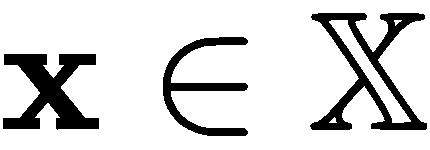的最佳情况，用 *x ^( * )* 表示(其中 *x* 是一组点)。出于我们的目的，这些标准是被称为**目标函数**的数学函数。

例如，假设我们有 [] 等式。如果我们绘制它，我们会得到下面的图表:

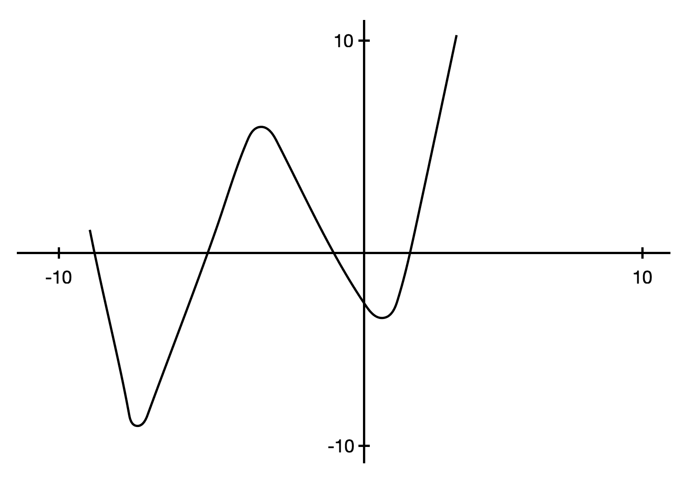

你会从[第一章](3ce71171-c5fc-46c8-8124-4cb71c9dd92e.xhtml)、*向量微积分*中回忆起，我们可以通过对函数求导，使其等于 0，并求解 *x* 来找到函数的梯度。我们可以找到函数有最小值或最大值的点，如下所示:

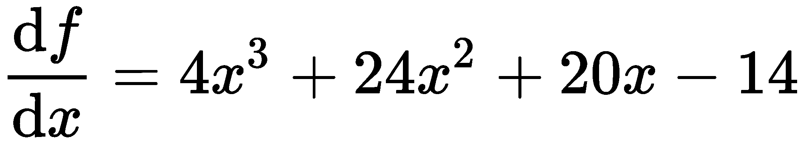

解完这个方程后，我们发现它有三个截然不同的解(即最小值和最大值出现的三个点)。

为了找到这三个解中的哪一个是最小值和最大值，我们找到二阶导数， [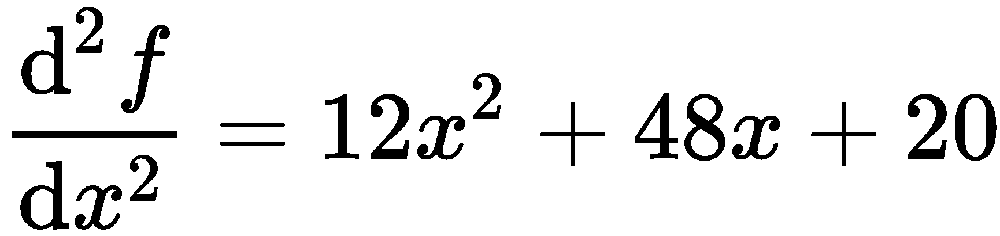] ，并检查我们的驻点是正还是负。

视觉上，当我们看到图形时，我们可以识别局部和全局最小值，但当我们通过计算来计算时，就没有这么简单了。因此，相反，我们从一个值开始，沿着梯度，直到我们到达最小值(希望是全局最小值)。

假设我们从右侧的 *x* = *2* 开始。梯度是负的，这意味着我们逐渐向左移动(这些增量被称为**步长**，我们到达局部最小值，这不是我们想要找到的。然而，如果我们从 *x* = - *2* 开始，那么我们会在全局最小值处结束。

# 约束优化

一般来说，约束优化有一些必须遵守的附加规则或约束。一般来说，问题定义如下:

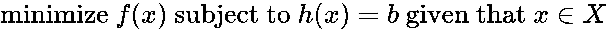

在上式中，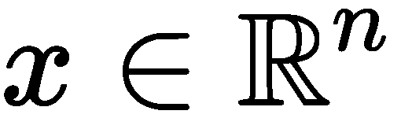包含决策变量， [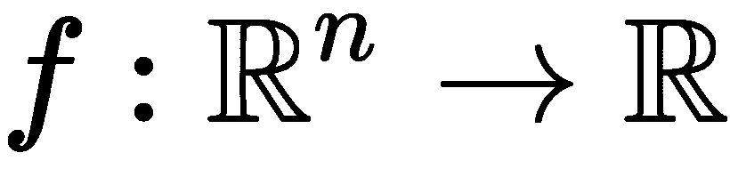] 是我们的目标函数，[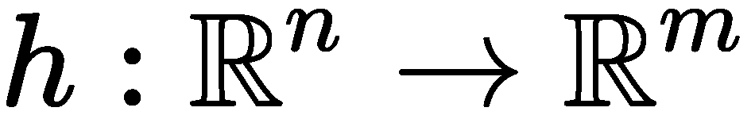]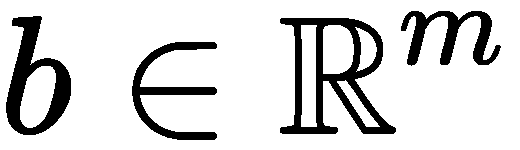是功能约束， [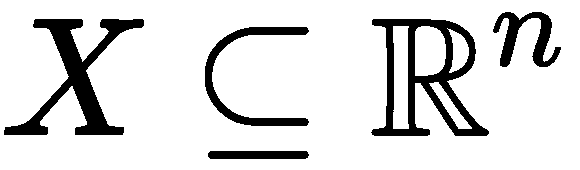] 是区域约束。

所有这些变量都是矢量。事实上，这一章中的所有变量都是向量，所以为了简化，我们不会像以前一样用粗体字书写它们，在第一章、*向量演算*和[第二章](6a34798f-db83-4a32-9222-06ba717fc809.xhtml)、*线性代数*中。

有时，我们的约束可以是一个不等式的形式，例如 [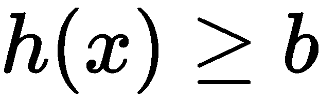] ，我们可以添加一个松弛变量 *z* ，这使得我们的函数约束 [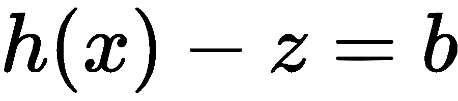] 和区域约束 *z ≥ 0* 。

我们可以简单地显式写出所有的约束，但这太混乱了。我们一般这样写:

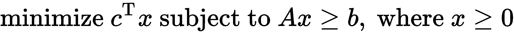

这是线性程序的一般形式。然而，标准格式是这样写的:

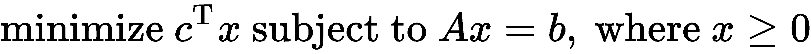

我知道这一切现在可能看起来很不清楚，但是不要害怕——我们很快就会明白这一切。

# 无约束最优化

最优化问题的目标是最小化 *f(x)* ，我们将主要处理两次可微的函数，其中 [] 。需要注意的一个相当重要的性质是，因为 *f* 是可微且凸的，所以我们有以下等式:

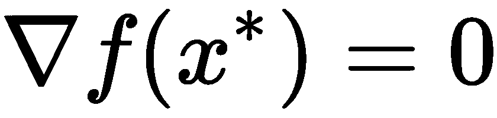

如果你记得我们在第一章、*向量微积分*中学到的东西，这应该是显而易见的。

正如你可能知道的，无约束优化是这样的情况，我们没有任何约束，任何点都可能是最小值，最大值，或鞍点，这使问题变得不容易。

假设我们有一个关于 *n* 个方程和 *n* 个变量的问题。解决这个问题并找到最优解并不简单，我们通常迭代地解决这个问题。把这想象成在 *f* 的定义域中计算一组点的序列，这逐渐把我们带到最优解。

现在，说我们有一个函数， [] ，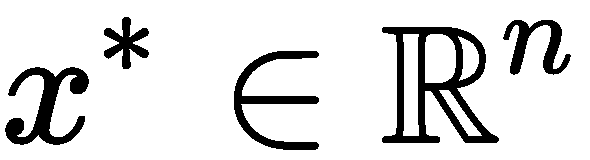，这样， [] 。问题现在看起来如下:

这里我们有 [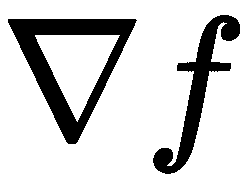] ，从前面几章我们知道是 *f* 的梯度。

自然地，要开始计算这些点，我们需要一个起点，我们称之为初始点，它必须位于 *f* 的定义域内。然后，我们迭代，从那里找到更好的点，直到我们找到最优的一个。

# 凸优化

凸优化涉及在凸集上最小化凸函数。一般来说，它采取以下形式:

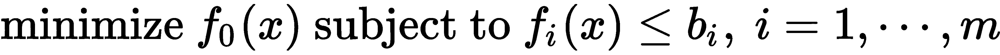

这里， [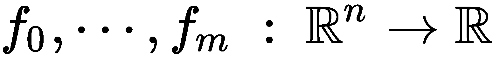] 都是凸函数，因此它们满足下列条件:

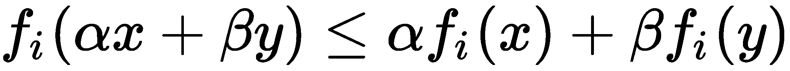

[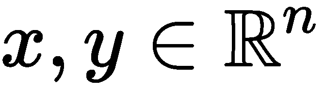][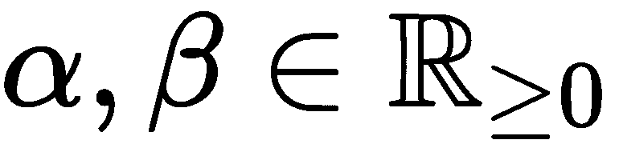]非负、 [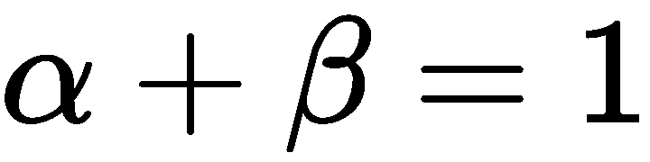] 时就是这种情况。

# 凸集

在最优化中，我们经常会遇到凸和非凸这两个术语。

我们将凸集定义为这样一个集合，如果我们随机选取任意两个点并画一条线将它们连接起来，这条线将完全位于集合的边界内。

我们给我们的凸集贴上 [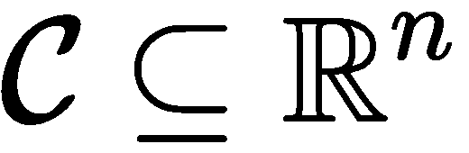] 的标签，如果我们有两个点， [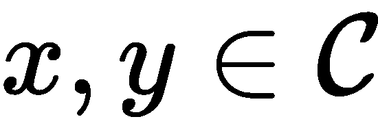] 和一些标量 [] 值，那么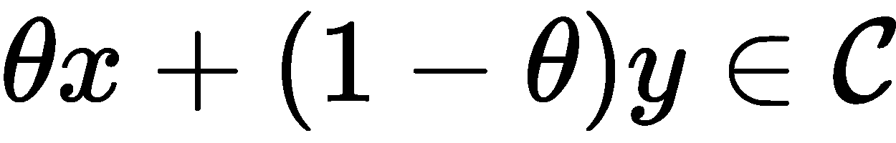。

现在，让我们假设我们有 [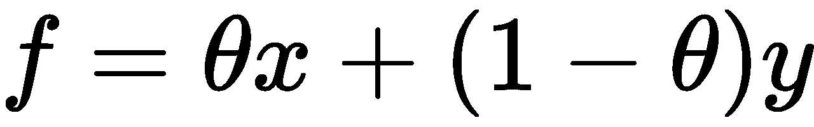] 函数。那么，如果 *θ* = *0* ，*f*=*y*；但是如果 *θ* = *1* ，那么 *f* = *x* 。由此可知，随着 *θ* 的增加， *f* 逐渐从 *y* 移动到 *x* 。

一个函数 [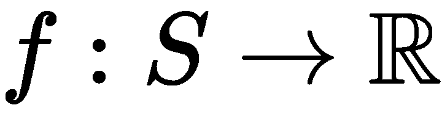] 是凸的，如果 *S* 对于 [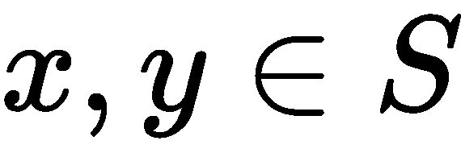] 和 [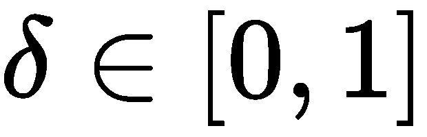] 的所有情况都是凸的。我们于是有了 [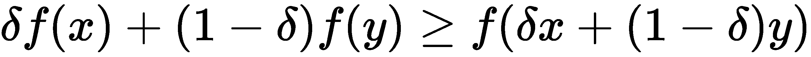] 。

另外，如果我们有 [] ，其中函数的定义域是所有情况下 [] 的凸集，那么 [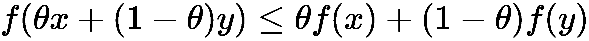] 。

为了帮助我们可视化凸函数，我们有下面的图表，其中我们可以看到它看起来几乎像一个碗，碗内的所有点都是凸集中的点:

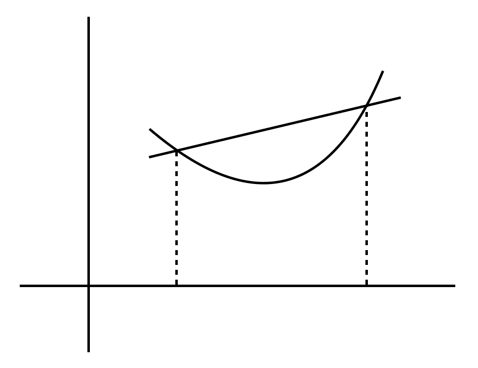

现在，让我们假设我们的函数可以微分两次。然后， *f* 在凸区域上是凸的，我们可以定义我们的 Hessian 矩阵如下:

这对于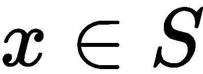的所有情况都是半正定的。

# 仿射集

如果我们有一个集合，如果连接我们在中的两点的直线位于中，则它是仿射的；也就是说，这个空间包含了中的点的线性组合，但是只有当系数之和等于 1 时，使得 [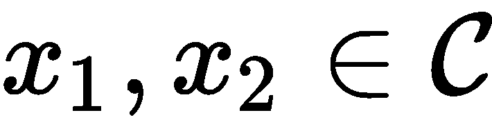] 、 [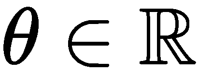] 和 [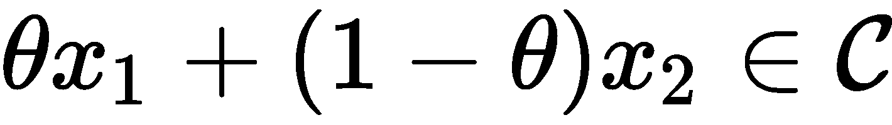] 。

另外，如果我们有两个以上的点，那么 [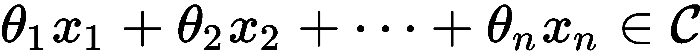] 是 *n* 个点的仿射组合，给定如下:

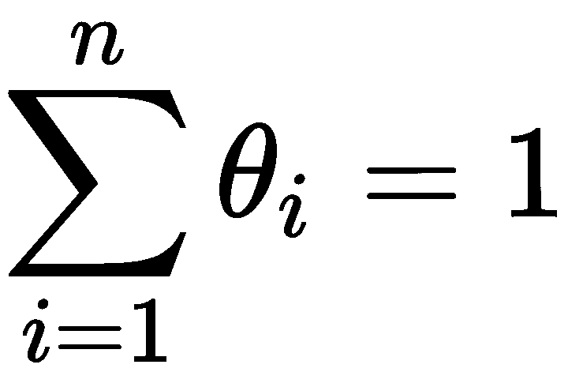

同样，如果是一个仿射集合，并且我们有一个 [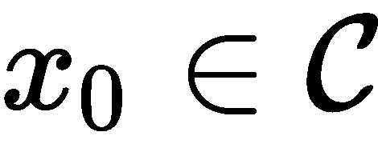] 点，那么我们有如下:

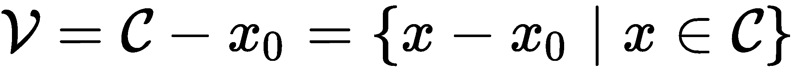

这是的一个子空间。

现在，假设我们有一些 [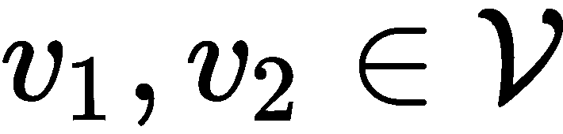] 和 [] 点。从前面我们知道 [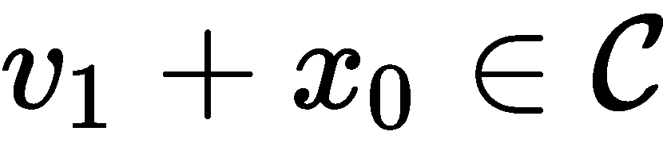] 和 [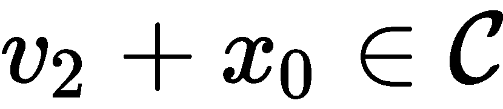] 。因此，我们可以将表达如下:

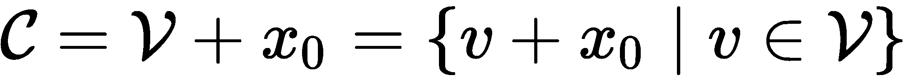

一般来说，我们称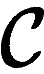中所有点组合的集合为的仿射壳。

现在假设我们在中有一个单位球，其中 *x* 是它的中心， *r* 是半径， [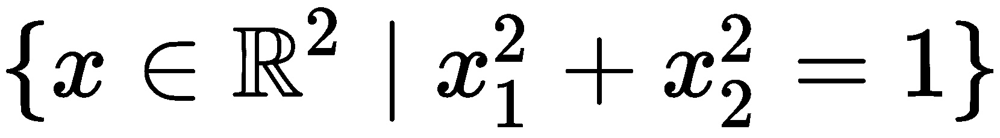] 。的相对内部，其中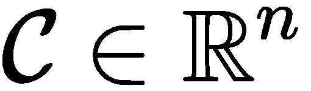的尺寸小于 *n* ，定义为 [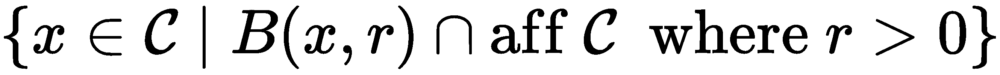] 集合，其中 [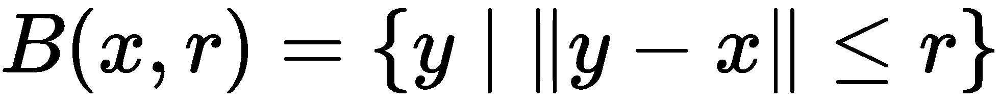] 。

然后，的相对边界定义为的闭合与的相对内部之差。

# 凸函数

凸函数定义为 [] 函数，如果它的定义域是一个凸集，并且如果对于 *x* 、 [] 和 [] ，它给出如下:

让我们用下图来形象化这个不等式:

连接两点的线在函数的上面，这告诉我们它是凸的。但是，函数在- *f* 时是凹的，否则是凸的。

另一方面，仿射函数具有等式，因此是凹凸的。

# 最优化问题

我们可以回忆一下本章前面的内容，最优化问题可以定义如下:

我们问题的最优值定义如下:

如果 [] ，我们称 *x ^( * )* 为一个最优点(或我们问题的解)。因此，包含所有最佳点的最佳集合如下:

在凸优化中，有一个相当重要的性质，即任何局部最优的点也是全局最优的。

# 非凸优化

在凸优化中，我们必须找到一个局部最优值，它也恰好是全局最小值。然而，在非凸优化中，我们必须找到全局最小值，而不是局部最小值；事实上，可能存在不止一个局部最小值以及鞍点。

这使得非凸优化远比凸优化更具挑战性。

# 探索各种优化方法

既然您已经知道了什么是优化，那么是时候探索一些在实践中使用的方法了。我们不会涵盖整个优化领域，因为这需要一整本书来涵盖。我们将只涵盖适用于深度学习的基本优化方法。

# 最小平方

最小二乘是凸优化的一个子类。它被归类为没有约束，并采用以下形式:

这里， [] ， [] 是 *A* 的行，是我们的优化变量。

我们也可以将此表示为一组 [] 形式的线性方程组。因此， [] 。

最小二乘问题与最大似然估计问题非常相似。

# 拉格朗日乘数

在解决约束优化问题时，最好将约束包含在目标函数中。这样，没有包含在约束中的任何内容都不会被视为最小值。

让我们重温一下我们之前的问题:

我们将把我们的约束称为 *C* 。

因此，我们将 *C* 的拉格朗日量定义如下:

在这里，和**被称为拉格朗日乘数**。

当我们的约束满足时，那么 [] 和 [] 。通过在 *x* 和λ上最小化 *L* ，我们找到关于约束的解。

假设我们有和，这样我们就有了:

然后，*x^×*是 *C* 的最佳选择；也就是说，它最小化了 *f* 。这被称为**拉格朗日充分性**。

要找到λ^××*x^××*，必须解决以下问题:

、。

比如说我们要尽量减少 [] 受制于 [] 和 [] 。

因此，拉格朗日充分性方程如下:

我们可以改写如下:

我们还需要选择一个λ ^* 、 *x ^* 、*的值，使 *L* ( *x ^* 、λ ^* 、*)最小。因此，对于λ ^* ， *L* ( *x，λ ^** )必须有一个有限的最小值。

由上式可知 [] 在 [] 处有一个有限的最小值，而 *x [1] 和*以及 *x [ 2 ]* 术语在 [和]处只有一个有限的最小值。

现在，为了找到最小值，我们取一阶导数，使它们等于 0，如下所示:

由于一阶导数必须等于 0，我们有以下公式:

、

为了确认这些是最小值，我们找到了赫斯矩阵:

正如我们所料，这是正半定时的 [] 。

我们想要的λ值在 [] 集合中，这告诉我们 [] 的唯一最小值如下:

我们现在要做的就是找到满足约束的 *x* (λ)的 *λ* 和 *x* 的值。

# 牛顿方法

牛顿法是一种二阶优化方法，它使用 Hessian 的相应特征值的倒数来重新调整所有方向上的梯度。

我们知道，我们在努力寻找使 *f(x)* 最小且满足 [] 的 *x ^( * )* 的值。假设我们目前在一个点， *x [ k ]* ，我们移动到 *x [ k+1 ]* ，更接近 *x ^( * )* 。我们可以把这个步骤写成 [] (或者 [] )。

牛顿台阶之所以工作良好，是因为当 *x* 靠近 *x ^** 时，它表现良好，因为它在 *x* 处采取最陡的下降方向。然而，当我们在 *x [0]* 时，它的性能很慢，因为在 *x [0]* 处的二阶导数不能给我们提供可靠的信息，告诉我们需要向哪个方向移动才能到达 *x ^** 。

现在，让我们假设 [] 。然后，我们有以下内容:

在这里， [] 。

我们可以这样重写:

这被称为牛顿步。因此，在*x[k]T74，*x[k+1]最小化以下二次函数:**

我们也知道 *Hf(x)* 是正定的，它告诉我们 [] ，除非 [] 。

当我们收到我们的新值， *x [k+1]* 时，我们可以预期其中有一个错误。该误差与*x[k]中误差的平方成正比。我们可以这样看:*

这导致该方法二次收敛(快速收敛，但仅当 *x [k]* 接近最佳值时)。

# 割线法

在牛顿的方法中，我们计算了一阶和二阶导数，但是在大题中计算海森并不理想。

假设我们有一个函数， [] ， *n = 50* 。如果我们对 *f* 取一阶导数，对于*x[I]的每种情况，我们得到 50 个方程。现在，如果我们计算二阶导数，我们有 2500 个方程，关于矩阵中的*x[I]和*x[j]。然而，因为 Hessians 是对称的，我们只需要计算 1275 次二阶导数。这仍然是一个相当大的数额。***

割线法使用牛顿法，但它不是计算二阶导数，而是使用一阶导数来估计它们，这使它更适合于实践。

它近似二阶导数如下:

我们将这个近似值代入牛顿法，得到如下结果:

虽然这确实降低了计算复杂性，但它遭受了与牛顿方法相同的命运，因为它需要额外的迭代来收敛。

# 拟牛顿法

割线法近似二阶导数，但拟牛顿法近似 Hessian 的逆。步骤计算如下:

这里， *Q [k]* 是 Hessian 在*x[k]的近似逆。*

我们首先让 *Q [1]* = 1，并使用两个术语α和β在每次迭代中更新矩阵，以帮助改进我们的估计。它们的定义如下:

和

为了在每次迭代中更新矩阵，我们使用了**布罗伊登-弗莱彻-戈德法布-山诺** ( **BFGS** )方法，其工作原理如下:

为了使最小化生效， *Q* 必须是正定的。

# 博弈论

让我们暂时转向博弈论。由三个或更多玩家组成的游戏往往很难解决，但是双人游戏要简单得多，这也是我们在这里要关注的。

假设我们有两个分别用 [] 表示的玩家，他们在玩石头剪刀布。正如我们所知，在这个游戏中，我们倾向于在不知道对方会选择什么的情况下做出决定。每个玩家自然都想赢，所以每个玩家都有以下收益矩阵:

就我个人而言，我不太喜欢用这种方式显示收益，因为你必须写两个矩阵，每次都要查找单个的收益。我更喜欢这样写:

|  | **R** | **P** | **S** |
| **R** | (0, 0) | (-1, 1) | (1, -1) |
| **P** | (1, -1) | (0, 0) | (-1, 1) |
| **S** | (-1, 1) | (1, -1) | (0, 0) |

在上表中，玩家 1 选择了一行， [] ，玩家 2 选择了一列， [] 。所以，如果我们看前面的表，(-1，1)告诉我们，参与人 1 输了，参与人 2 赢了。

在博弈论中，玩家拥有决定他们如何行动或者可以采取什么行动的策略。

在我们的例子中，玩家 *X* 有以下策略:

玩家 *Y* 有以下策略:

这里，每个向量代表选择每一列或每一行的概率。

[] 的每种情况都代表一个策略配置文件，我们计算参与人 *X* 的期望收益为 [] 。如果，对于某些情况下的 *i* ， *x [ i ]* = 1，那么我们总是选择 *i* ，称 *x* 为**纯策略**。

让我们继续看另一个众所周知的例子——囚徒困境。在这里，我们有两个人犯罪并被抓住。他们每个人都有两个选择——作证( *T* )或者保持沉默( *Q* )。

以下是他们可以做出的选择的结果:

*   如果他们都保持沉默，他们都将在监狱服刑两年。
*   如果一个人作证而另一个人保持沉默，那么保持沉默的那个人会被判 3 年徒刑，而作证的人会因为与警方合作而被释放。
*   如果他们都出庭作证，那么他们都要服刑 5 年。

我们的收益表如下:

|  | **S** | **T** |
| **S** | (2, 2) | (0, 3) |
| **T** | (3, 0) | (1, 1) |

自然，每个人都想最大化自己的收益；请注意，两者都没有机会知道或讨论对方要做什么，因此合谋不是一个选项。因此，每个人都更愿意作证，因为这种选择绝对更好。我们称 *T* 为优势策略并且(1，1)是帕累托，由(2，2)支配。

假设我们有一个博弈和一个策略配置文件( *x，y* )，这样它们就处于均衡状态(其中 *x* 是对 *y* 的最佳反应，反之亦然)。然后，我们将定义为对 [] 有最佳反应，如果对于的所有情况，我们有如下:

你们中的许多人可能听说过零和这个术语，但对于你们中的一些人来说，这是一个总收益为 0 的特殊游戏，比如 [] 。早先的石头剪子布的例子很好地证明了这一点。

两人矩阵博弈的一个非常重要的解就是极大极小定理。假设我们有一个 [] 的收益矩阵。然后，我们有以下内容:

这说明如果两个参与人都使用极小极大策略，那么他们就处于均衡状态，因为这会导致参与人 1 和参与人 2 都得到最差的收益，这满足了标准。这非常类似于在线性规划中寻找受约束的 [] 的最优值。

# 下降法

通常，下降法采取以下形式:

这里有 [] ，还有 [] 。在前面的算法中， *k* 是一系列的步骤，*x[k]是最优点，是一个步骤。标量值 *c [ k ]* 是第 *k ^次次*次迭代的步长。*

下降法中， [] ，除了 *x [ k ]* 为最优值的情况，这告诉我们 [] 对于 *k* 的所有情况。

# 梯度下降

梯度下降是一种广泛使用的一阶优化问题，它从当前点开始向函数梯度的负值方向前进，直到最终终止于最优解。

想象你在一个滑板公园，手里拿着一个网球。你弯下腰，把球放在一个斜坡的表面上，然后放开它；重力发挥它的作用，球沿着斜坡的曲率，找到它的底部。这就是梯度下降背后的概念。

在这种情况下，台阶的自然选择是负梯度；也就是 [] 。这被称为**梯度下降**，其形式如下:

在优化中，我们通常将停止标准定义为一个条件，当满足该条件时，应该停止我们的算法继续优化。它通常采取以下形式:

这里，η是一个小正数。

我们应该记得，从上一章开始，如果我们有一个函数， *f* ( *x，y* )，那么它的梯度就是 [] 。因此，我们可以计算函数在( *x，y* )处的幅度(或陡度)，如下所示:

这作为一个向导，告诉我们每一步应该移动的方向(因为曲率随着我们向下移动而改变)以达到最小值。

然而，梯度下降并不完美。如果步长 *c ^((k))* 太小，可能会非常慢，如果步长太大，我们可能会由于过冲而达不到最佳点，这将导致我们的算法无法收敛，从而发散。

为了更好地理解这一点，我们来看看下面的两张图。第一张图的步长很小，如下所示:

第二张图显示了较大的步长:

正如你所看到的，一个好的步长是很重要的，选择它并不总是一件容易的事情。幸运的是，有一种叫做**自适应步长**的方法可以在每次迭代后调整步长。它遵循两条规则:

*   如果函数值在一个步骤后增加—这意味着步长太大—那么撤消该步骤并减小步长。
*   如果函数值减少了步长，则增加步长。

尽管如此，这也不是完美的。从图中可以看出，优化有些不稳定，当我们遇到更多平坦的表面时，我们的算法往往会变慢。

# 随机梯度下降

到目前为止，您应该能够看出计算梯度和达到最优并不容易，而且非常耗时。

这就是为什么计算一个近似值，把我们指向相同的大致方向是有用的。我们把这种方法叫做**随机梯度下降** ( **SGD** )，是理论上保证收敛的非常重要的算法。随机这个词来源于这样一个事实，即我们不知道梯度的精确值，只知道它的近似值。

假设我们有 *M* 分 [] ，其中 *M* 很大。这就变成了一个很大的优化问题。所以，我们取一个目标函数， *L* ( *x* )，它是点上损失的总和。我们这样写:

这里，我们的目标是尽可能地减少损失，使我们的模型最好地拟合真实函数， *y* ，就像在回归中一样。通过最小化损失，我们减少了模型的计算点和真实点之间的距离。

我们使用这种方法的原因是，当我们有很多点或一个大的优化问题时，计算每个点的梯度在计算上是非常不可行的，如果我们要计算 Hessian 则更是如此。另一方面，这种方法在计算上更加可行。

# 损失函数

我们知道我们在试图逼近一个函数，我们在试图尽可能接近真实的函数。为此，我们需要定义一个损失函数——我们有很多选择。以下是实践中使用的主要方法:

*   [] ，称为**均方误差**
*   [] ，俗称**平均绝对误差**
*   [] ，俗称**方损**
*   [] ，称为**铰链损耗**
*   [] ，称为**交叉熵损失**
*   [] ，被称为**胡贝尔损失**

我们将在以后重新审视它们，并理解何时最好地使用它们。

# 动量梯度下降

正如我们所看到的，梯度下降需要一些时间才能到达相对平坦的表面。对前面示例的一个改进是带动量的梯度下降，它平滑梯度更新，使其不那么不稳定。假设一个网球和一块巨石都从山上滚下。网球会反弹得更厉害，很可能会被卡住，但巨石会随着移动获得动量，并保持相对笔直的路径向底部移动。这是这一改进背后的关键思想。它通过记住先前的更新来做到这一点，并且每个更新是先前和当前梯度的组合，如下所示:

在这里， [] 和 [] 。

在这个方法中，你会注意到，我们不仅要选择步长， *c [k]* ，还要选择动量系数， *α* 。

# 内斯特罗夫的加速梯度

虽然动量阻尼了梯度下降的振荡，但内斯特罗夫的方法允许球沿着斜坡向下移动，以向前看并计算相对于未来位置的梯度。

本质上，我们不是计算 *x [k]* 处的梯度，而是使用 [] (其中 [] )，这与我们在下一步之后的位置很接近。因此，我们有以下内容:

我们也可以通过使 *γ* = *α* 将动量更新与内斯特罗夫的加速梯度结合起来，这将给我们 [] 和 [] 。

这里，你会注意到，我们现在有三个参数( *c* 、 *α* 和 *γ* )，而不是动量中的两个参数。

# 自适应梯度下降

我们在前面简要地谈到了自适应步长。这些方法通常使用前面步骤的梯度来引导搜索方向和步长，以使我们更快地收敛。我们要看的两个主要的是**自适应梯度** ( **Adagrad** )和**自适应矩估计** ( **Adam** )。

和之前一样，我们的目标是找到 *x ^** ，使得损失函数最小化。

这些梯度下降方法采用 [] 的形式，其中 *G [ k ]* 是第*k*步的梯度。

在 Adagrad 的情况下，我们有 [] 和 [] ，如果我们代入前面的等式，我们得到如下结果:

如您所见，我们使用损耗平方和的平方根来更新每一步的步长，这样就不需要我们自己来做了。

Adam 还保存了以前梯度的历史记录，但它与 Adagrad 的不同之处在于，它存储了平方梯度和梯度的指数移动平均值。

我们把这个写成 [] 和 [] 。

# 模拟退火

模拟退火受到冶金领域的启发，在冶金领域，我们使用热量来改变材料的属性。所施加的热量增加了离子的能量，并且移动更加自由。随着材料开始冷却，它在达到平衡状态时会呈现不同的形状。热量需要慢慢地逐渐减少，以避免材料陷入亚稳态，这代表了局部最小值。

在我们的例子中，为了优化一个问题，我们用温度来控制随机性。当温度较高时，这意味着该过程自由且随机地探索空间，希望它遇到具有更有利最小值的良好凸区域。通过降低温度，减少了随机性，使算法收敛到最小值。

模拟退火是一种非凸优化算法，并且由于其能够逃脱局部最小值而有效。

在每次迭代中，我们从转移分布 *T* 中抽取一个可能的步骤，该步骤根据以下概率被接受:

这里，[]是温度。这种概率被称为**大都会标准**，这也是模拟退火能够在高温下逃离局部极小值的原因。

为了逐渐降低温度，我们使用衰减因子 [] ，如下所示:

该过程继续，直到它满足停止标准；也就是温度下降到从*n[k]到*n[k+1]我们看不到任何改善的点。**

# 自然进化

自然进化是一种利用梯度下降的方法，我们的目标是最小化 [] 。我们根据样本估计梯度，如下所示:

早先，在看梯度下降时，我们需要计算目标函数的梯度；但是在这里，我们使用对数似然， [] ，并且我们可以在我们之前讨论的任何梯度下降方法中使用这种梯度估计来改进 *θ* 。

# 探索人口方法

到目前为止，我们已经处理了优化问题，其中我们有一个*球*或*粒子*，我们沿着弯曲空间逐渐移动，并使用梯度下降或牛顿法向最小值移动。然而，现在我们将看看另一类优化，其中我们使用个体群体。

我们将这些个体分布在优化空间中，这可以防止优化算法陷入局部最小值或鞍点。这些人可以互相分享他们所在地区的信息，并利用这些信息找到一个最佳解决方案，使我们的功能最小化。

有了这些算法，我们就有了一个初始种群，我们希望对它们进行分布，这样我们就能覆盖尽可能多的区域，给我们找到全局最优区域的最佳机会。

我们可以从我们感兴趣的区域的多元正态分布中对我们的总体进行采样，或者在某些约束条件下对总体进行均匀分布；但是，只有当您想要限制人口覆盖的空间时，才建议使用这两种分布。或者，我们可以使用**柯西分布**，它允许我们覆盖更大的空间。

# 遗传算法

遗传算法受到达尔文主义的启发，即更适合的个体将某些可遗传的特征传递给下一代。在这种情况下，目标函数与个体的适应性或繁殖能力成反比。每一代中较健康个体的染色体经过交叉和变异后传递给下一代。

对我们来说，表示染色体最简单的方法是使用二进制字符串，类似于 DNA 的编码方式。然而，一个更好的方法是将每个染色体写成一个向量，在中表示优化空间中的一个点。这使我们能够更容易地表达交叉和变异。

我们从随机群体开始，从中选择一组染色体作为下一代的父母。如果我们有一群 *n* 染色体，那么我们将选择 *n* 对父母，在下一代中产生 *n* 个孩子。

我们的目标是最小化目标函数。因此，我们从总体中随机抽取 k 个个体，从每个样本中挑选出表现最好的个体，或者根据他们相对于总体的表现概率来挑选。于是，每个个体的适应度与 [] 成反比，我们可以用 [] 来计算。

另一方面，杂交是双亲染色体的结合，从而产生子代。这种结合有多种方式，例如单点交叉、两点交叉或均匀交叉，或者我们可以使用自己制作的一种。

在适应度和交叉中，能从初始种群传递给后代的性状就那么多。然而，如果只有最好的特征被传递，我们最终会有一个饱和的人口，这不是我们想要的。这就是突变有用的地方。它们允许新的特征被创建和传递，这使得个体能够探索更多的优化空间。在每次交叉后，群体中的每个孩子都会经历一定概率的突变。

# 粒子群优化

这个算法使用群体智能的概念，你有一群鱼或者一群鸟。让我们假设他们正试图寻找一些食物。它们到达一个地方，分散开一点，开始各自寻找食物。当其中一只找到食物时，它会让其他的知道，这样它们就可以加入进来。

群体中的每个个体都知道它的当前位置和速度，并且只跟踪它已经访问过的以前的最佳位置。速度向量决定了搜索的方向，如果一个人的速度很快，那么他就更具探索性，反之，如果速度很慢，他就更具开发性。

在每次迭代开始时，整个种群被加速到迄今为止任何个体遇到的最佳位置。更新计算如下:

这里， *x [最佳]* 是群体整体找到的最佳位置， [] 是个体找到的最佳位置， *w* ， *α [ 1 ]* ， *α [ 2 ]* 是参数， [] 是参数。

*c[1]和*c[2]的值严重影响它们收敛的速度。**

# 摘要

在这一章中，我们讨论了许多不同种类的优化，例如凸优化和非凸优化，以及是什么使优化成为如此具有挑战性的问题。我们还了解了如何定义优化问题，并探索了各种方法，包括群体方法、模拟退火和基于梯度下降的方法。在后面的章节中，我们将了解优化如何用于深度学习，以及为什么它对我们来说是一个如此重要的领域。

在下一章，我们将学习图论及其在解决各种问题中的应用。