# 循环神经网络

在本章中，我们将深入了解**循环神经网络** ( **RNNs** )。在前一章中，我们看了**卷积神经网络**(**CNN**)，这是一类用于计算机视觉任务的强大神经网络，因为它们能够捕捉空间关系。然而，我们将在本章中学习的神经网络对序列数据非常有效，并用于算法交易、图像字幕、情感分类、语言翻译、视频分类等应用中。

在常规神经网络中，所有的输入和输出都被假设为独立的，但在 RNNs 中，每个输出都依赖于前一个输出，这使得它们可以捕捉序列中的依赖关系，例如在语言中，下一个词依赖于前一个词和前一个词。

我们首先来看看普通的 RNN，然后是双向 RNN、深度 RNNs、**长短期记忆** ( **LSTM** )、和**门控循环单元** ( **GRUs** )，以及当今工业中使用的一些最先进的架构。

在本章中，我们将讨论以下主题:

*   对无线网络的需求
*   RNNs 中使用的数据类型
*   了解 RNNs
*   长短期记忆
*   门控循环单位
*   深层 RNNs
*   培训和优化
*   流行建筑

# 对无线网络的需求

在前一章中，我们学习了细胞神经网络及其在图像和时间序列相关任务中的有效性，这些任务的数据具有网格状结构。我们也看到了 CNN 是如何受到人类视觉皮层处理视觉输入的启发的。类似地，我们将在本章学习的 rnn 也是受生物学启发的。

需要这种形式的神经网络是因为**模糊神经网络** ( **FNNs** )无法捕捉数据中基于时间的相关性。

约翰·霍普菲尔德在 1982 年创造了第一个 RNN 模型，试图了解我们大脑中的联想记忆是如何工作的。这就是所谓的**霍普菲尔德网络**。这是一个完全连接的单层循环网络，它存储和访问信息的方式类似于我们认为我们的大脑所做的。

# RNNs 中使用的数据类型

正如在本章介绍中提到的，rnn 经常被用于——并且已经在——诸如自然语言处理、机器翻译和算法交易等任务中带来了巨大的成果。对于这些任务，我们需要顺序或时间序列数据，也就是说，数据有固定的顺序。例如，语言和音乐有固定的顺序。当我们说或写句子时，它们遵循一个框架，这使我们能够理解它们。如果我们打破规则，把不相关的单词混在一起，那么这个句子就不再有意义了。

假设我们有一个句子`The greatest glory in living lies not in never falling, but in rising every time we fall`,我们把它通过一个句子随机化器。我们得到的输出是`fall. falling, in every in not time but in greatest lies The we living glory rising never`，这显然没有意义。另一个例子是按日期排序股票价格，以及按固定时间间隔(可能每小时)排序开盘和收盘价格或每日价格。

顺序数据的其他例子有连续几天的降雨量、DNA 链中的核苷酸碱基对或股票的每日分笔成交点值。

我们将以类似于一维卷积的方式构造这种数据。然而，RNN(我们将很快熟悉它)将接受相同的输入，而不是有一个对数据进行卷积的内核，其中节点对应于数据的时间步长(这将很快变得更清楚)。

# 了解 RNNs

这个神经网络名称中的单词 **recurrent** 来源于这样一个事实，即它具有循环连接，并且对序列的每个元素执行相同的计算。这使得它能够学习(或记忆)部分数据，从而对未来做出预测。RNN 的优势在于它可以扩展到比非基于序列的模型更长的序列。

# 香草 RNNs

事不宜迟，让我们来看看最基本版本的 RNN，被称为香草 RNN。它看起来如下:

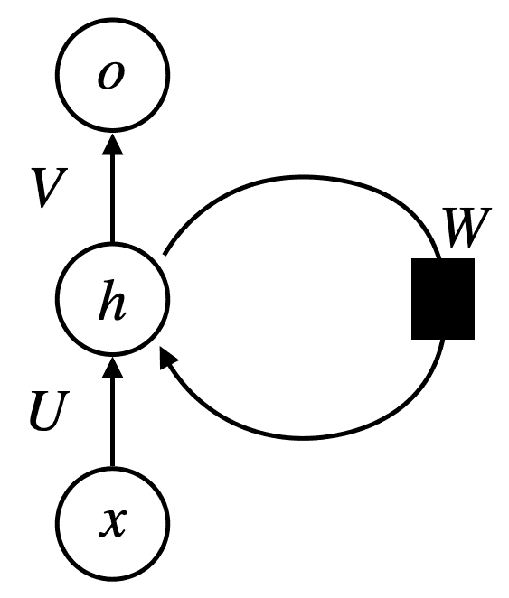

这看起来有些熟悉，不是吗？应该的。如果我们去掉循环，这将和传统的神经网络一样，但是有一个隐藏层，我们已经遇到过了。现在，如果我们展开环路，查看完整的网络，它看起来如下:

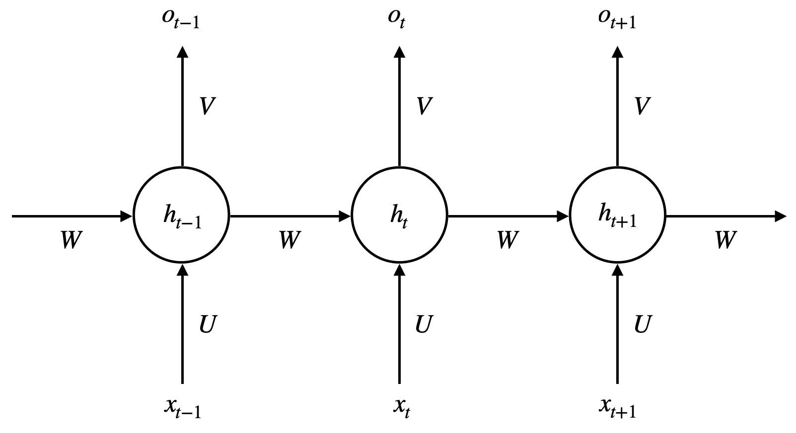

这里，我们有以下参数:

*   *x[t]是时间步长 *t* 的输入*
*   *h[t]是时间步 *t* 的隐藏状态*
*   *o[t]是时间步长 *t* 的输出*

从上图中，我们可以观察到，在每个时间步对输入执行相同的计算，这是它与我们之前遇到的模糊神经网络的区别。FNN 的每一层的参数(权重和偏差)是不同的，但是在这个架构中，参数( *U* 、 *V* 和 *W* )在每个时间步长保持不变。因此，与 CNN 相比，rnn 需要更多的内存，并且需要训练更长的时间。同样重要的是，你要注意在 RNNs 中，时间步长不一定与现实世界中的时间一致；这仅仅意味着输入序列的长度为 *t* 。

但是为什么这些权重在所有的时间步骤中都保持不变呢？为什么不能有不同时间步需要学习的单独参数？这是因为单独的参数不能推广到在训练过程中没有遇到的序列长度。让相同的三个权重在不同的时间步长上在整个序列中共享，使网络能够处理可能出现在多个位置的信息，就像在语言中一样。例如，`the`可以出现在给定句子中的多个位置，RNN 应该能够识别和提取它，而不管它在什么位置。与 FNN 相比，这种共享的统计强度属性是有利的，因为 FNN 需要在每个位置学习语言的规则，正如你可以想象的那样，训练起来非常具有挑战性。

直观上，我们可以认为这是一个序列 [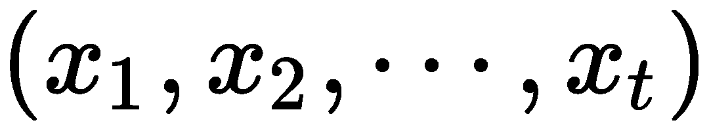] 在这里我们试图找到 [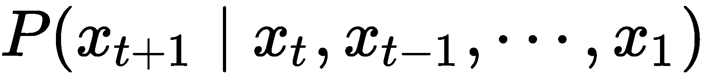] ，我们已经从[第三章](719fc119-9e7a-4fce-be04-eb1e49bed753.xhtml)*概率与统计*中熟悉了。这不完全是正在发生的事情；我们对其进行了简化，以帮助您理解 RNN 正在尝试学习做什么。

利用我们现在获得的知识，我们可以为各种任务创建一些非常复杂的 rnn，例如语言翻译或将音频转换为文本。根据我们想要构建模型的任务类型，我们可以从以下 rnn 类型中选择一种:

*   一对一(一个输入和一个输出)
*   一对多(一个输入和多个输出)
*   多对一(多个输入和一个输出)

*   多对多(多个输入和输出，其中输入和输出的数量相等)
*   多对多(多个输入和输出，其中输入和输出的数量不相等)

让我们更深入地研究 RNNs，看看通过所有隐藏层从输入到输出的每个时间步发生了什么。

在数学上，我们可以使用以下等式计算每个时间步长的隐藏状态:

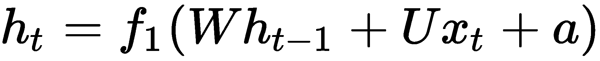

这里， *f [1]* 是非线性的，比如 ReLU，tanh，或者 sigmoid。输出计算如下:

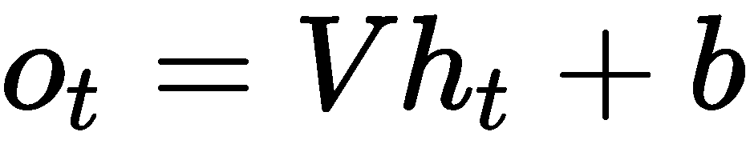。

我们可以使用非线性函数 *f [2]* (如 softmax)计算输出的概率向量，如下所示:

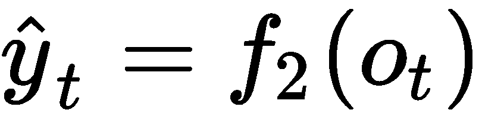

通过使用这些方程并重复应用它们，我们可以计算每个时间步的隐藏状态和输出。

所以，RNN 看起来如下:

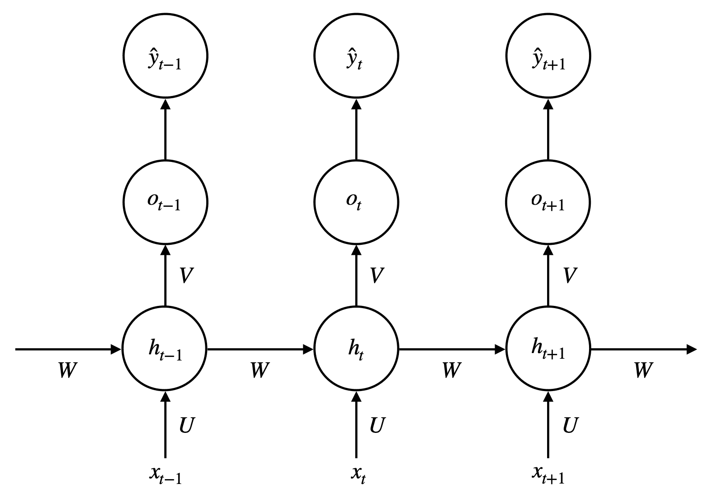

通过查看前面的图表和等式，您应该能够大胆猜测我们的权重矩阵和偏置向量的形状— [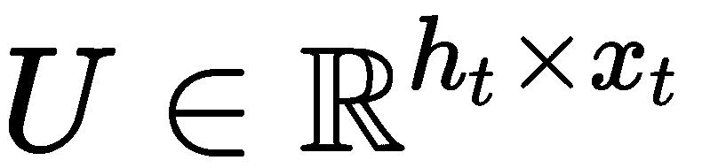] (将输入连接到隐藏层)、 [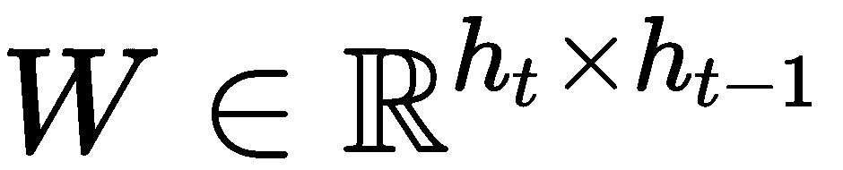] (将先前的隐藏层连接到当前的隐藏层)、 [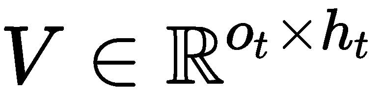] (连接隐藏层和输出)、 [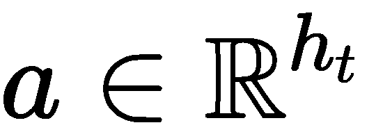] (隐藏层的偏置向量)，以及 [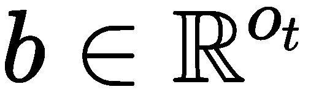] (隐藏层的偏置向量)

从前面的等式中，我们可以清楚地知道，时间步长 *t* 处的隐藏状态取决于当前输入和先前的隐藏状态。然而，初始隐藏状态*h[0]必须以类似于我们在 FNN 和 CNN 中初始化权重和核的方式进行初始化。另一方面，每个时间步长的输出取决于当前的隐藏状态。此外， *a* 和 *b* 是偏差，因此它们是可训练参数。*

在 RNNs 中， *h [t] 这允许 RNN 利用序列之间的关系，并使用它来预测最可能的输出，这与 CNN 使用一维卷积捕获序列数据中的空间关系并不完全不同。*

然而，这不是构造 rnn 的唯一方法。不像上图那样将输出从隐藏层传递到隐藏层( [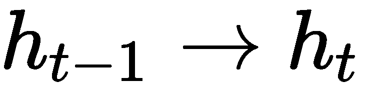] )，我们可以将前一个输出的输出传递到下一个隐藏状态( [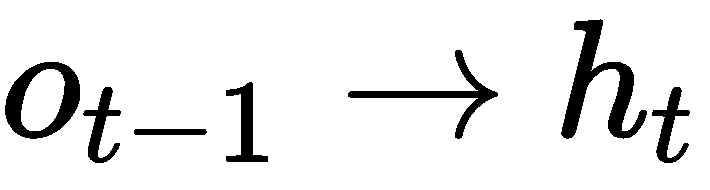] )，改变我们计算隐藏状态的方式。现在变成如下:

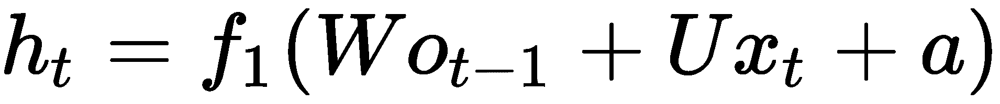

在下图中，我们可以看到在时间步长 *t* 隐藏状态单元格中发生的各种操作:

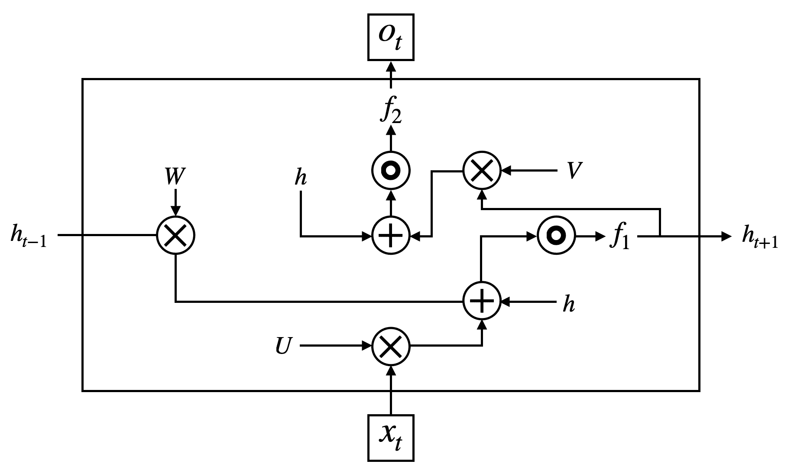

当使用模糊神经网络时，我们计算通过网络的每次正向传递结束时的损耗，然后反向传递误差以更新权重。然而，在 RNNs 中，我们计算每个时间步的损失，如下所示:

这里， *L* 是交叉熵损失函数(我们已经很熟悉了)， *y [t]* 是目标， [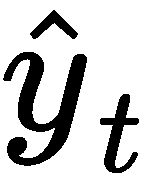] 是概率向量， *n* 是输出/目标数。

虽然有效，这些香草 rnn 并不完美。他们确实有一些我们通常在训练中遇到的问题，尤其是消失梯度问题。当权重变得非常小时，就会发生这种情况，从而阻止神经元触发，这就阻止了后面时间步长的隐藏神经元触发，因为每个神经元都依赖于最后一个神经元，以及上一个神经元，以此类推。

为了更好地理解这一点，让我们考虑下面的例子。假设我们有一个非常简单的香草 RNN，没有任何非线性激活和或输入。我们可以将这个网络表达为 [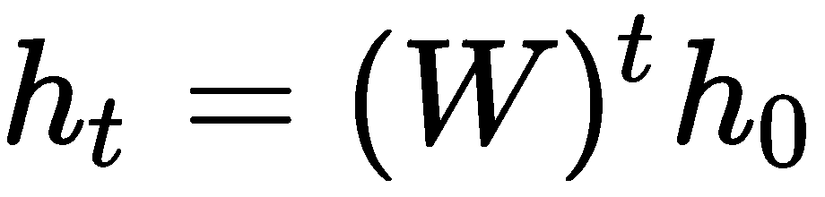] 。正如你所看到的，我们在每个单元上一次又一次地施加相同的权重。然而，让我们把注意力集中在重量上。

为了理解消失和爆炸梯度问题，让我们假设我们的权重矩阵具有 2 × 2 的形状并且是可对角化的。你应该还记得《T4》第二章，*线性代数*，如果我们的矩阵是可对角化的，那么它可以分解成 [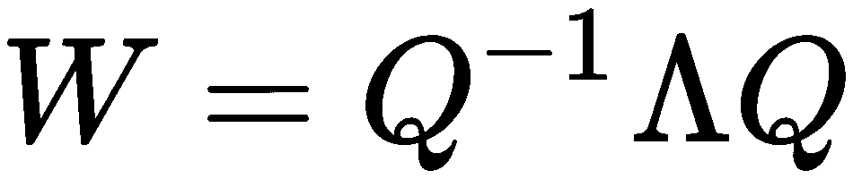] 的形式，其中 *Q* 是包含特征向量的矩阵，λ是包含沿对角线的特征值的方阵。如前所述，如果我们有八个隐藏层，那么我们的权重将是 [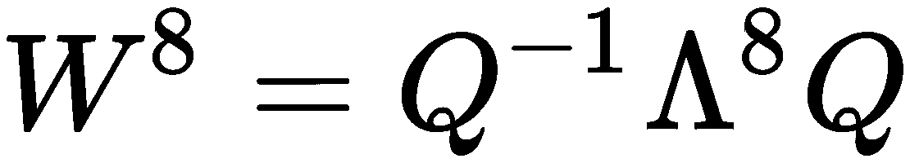] 。我们可以这样看:

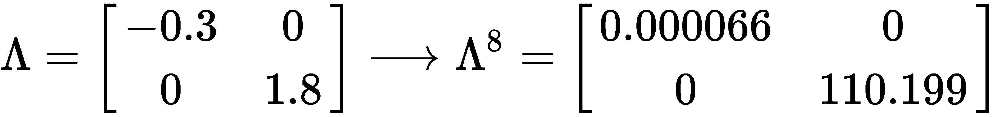

在前面的等式中，我们很好地了解了消失和爆炸梯度问题。我们假设我们有八个隐藏单元，通过一次又一次地将它们相乘，我们可以看到这些值要么变得非常小，要么变得非常大，由于它们的不稳定性，这使得训练 rnn 相当具有挑战性。小重量使我们的 RNN 很难学习长期依赖性，这也是为什么细胞中的创新，如**长短期模型** ( **LSTMs** )和**门控循环单位** ( **GRUs** )被创造出来(我们将很快了解这两种 RNN 细胞变体)。

现在，如果我们有一个具有 20 个或更多时间步长的 RNN，我们希望我们的网络记住第一个、第二个或第三个输入，它很可能无法记住它们，但它会记住最近的输入。例如，我们可以有句子`I remember when I visited Naples a few years ago...I had the best pizza of my life`。在这种情况下，我们需要从更远的地方了解那不勒斯的背景，以了解这个宏伟的披萨来自哪里，但对 RNNs 来说，追溯到这么远是一个挑战。

类似地，如果我们的权重大于 1，它可以变得更大，这导致爆炸梯度。然而，我们可以通过使用梯度裁剪来解决这个问题，我们重新调整权重，使范数最大为η。为此，我们使用以下公式:

# 双向 RNNs

现在我们知道了 RNN 在最基本的层面上是如何工作的，让我们来看看它们的一种变体——双向 RNN。前面的 RNN 是前馈；也就是说，数据从左(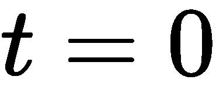)到右(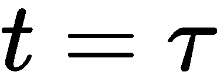)通过网络，这就产生了对过去的依赖。然而，对于我们可能想要解决的一些问题，它也有助于展望未来。

这允许我们将网络训练数据向前和向后分别馈送到两个独立的递归层。请务必注意，这两个图层共享同一个输出图层。这种方法允许我们将输入数据与过去和未来联系起来，这比以前的单向 RNN 在语音和翻译任务中产生更好的结果。然而，自然地，双向 rnn 并不是每个时间序列任务的答案，例如预测股票价格，因为我们不知道未来会发生什么。

在下图中，我们可以看到双向 RNN 的样子:

正如你所看到的，网络现在包含两个平行的层在相反的方向上运行，现在有六个不同的权重集应用于每个时间步；即输入到隐藏( *U* 和 *C* )、隐藏到隐藏( *A* 和 *W* )和隐藏到输出( *V* 和 *B* )。重要的是，我们注意到前向层和后向层之间没有共享信息。

现在，在时间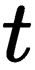在每个隐藏状态发生的操作如下:

*   []
*   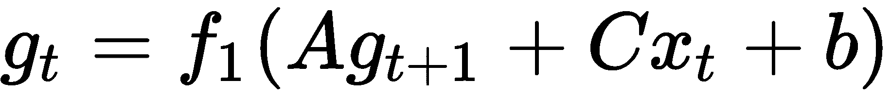

这里，*f[1]为非线性， *a* 和 *b* 为偏差。输出单位可计算如下:*

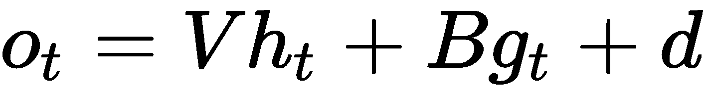

这里， *d* 是偏置。然后，我们可以使用下面的等式找到概率向量:

前面的等式告诉我们，前向层中的隐藏状态从先前的隐藏状态接收信息，后向层中的隐藏状态从未来的状态接收信息。

# 长短期记忆

正如我们前面看到的，标准 RNN 确实有一些局限性；特别是，他们遭受消失梯度问题。尤尔根·施密德胡伯([ftp://ftp.idsia.ch/pub/juergen/lstm.pdf](ftp://ftp.idsia.ch/pub/juergen/lstm.pdf))提出了 LSTM 架构，作为 rnn 面临的长期依赖问题的解决方案。

LSTM 细胞在几个方面不同于普通的 RNN 细胞。首先，它们包含我们所说的内存块，内存块基本上是一组循环连接的子网。其次，每个存储块不仅包含自连接的存储单元，还包含三个乘法单元，分别代表输入、输出和遗忘门。

让我们看看单个 LSTM 细胞是什么样子的，然后我们将深入它的本质，以获得更好的理解。在下图中，您可以看到 LSTM 块的样子以及其中发生的操作:

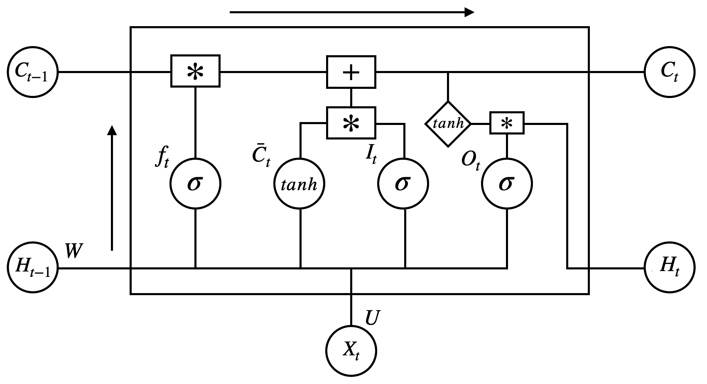

正如您在前面的 LSTM 单元中所看到的，在每个时间步都会发生一系列操作，它有以下组件:

*   *f* :遗忘之门(带 s 形的 NN)
*   [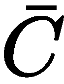] :候选层(带 tanh 的 NN)
*   *I* :输入门(带 sigmoid 的神经网络)
*   *O* :输出门(带 sigmoid 的神经网络)
*   *H* :隐藏状态(一个向量)
*   *C* :内存状态(一个向量)
*   *W* 和 *U* :遗忘门、候选门、输入门和输出门的权重

在每个时间步，存储单元将当前输入( *X [t]* )、先前隐藏状态( *H [t-1]* )和先前存储状态( *C [t-1]* )作为输入，并输出当前隐藏状态( *H [t]* )和当前存储状态( *C [t]*

正如你在前面的图表中看到的，这里发生的操作比香草 RNN 的隐藏单元中发生的要多得多。这样做的意义在于，它保留了整个网络中的梯度，并允许更长期的依赖性，以及提供了梯度消失问题的解决方案。

但是 LSTMs 到底是怎么做到的呢？让我们找出答案。存储器状态存储信息并继续这样做，直到旧信息被新信息覆盖。每个单元可以决定是否要输出或存储该信息。在我们深入解释之前，让我们先来看看发生在每个 LSTM 晶胞中的数学运算。它们如下:

*   [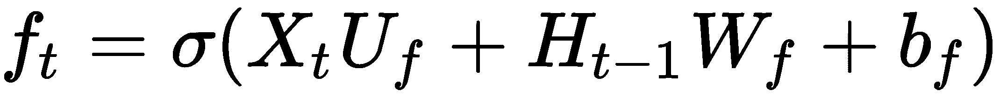]
*   [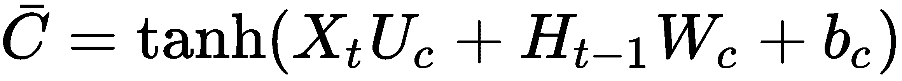]
*   [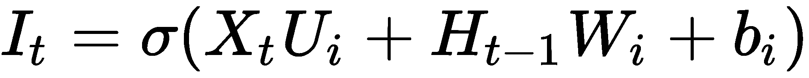]
*   [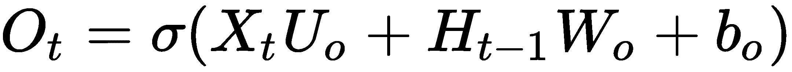]
*   [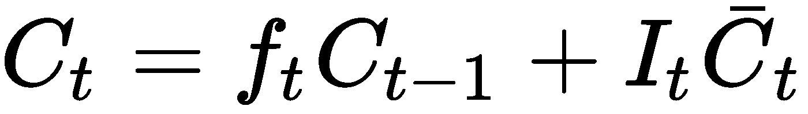]
*   [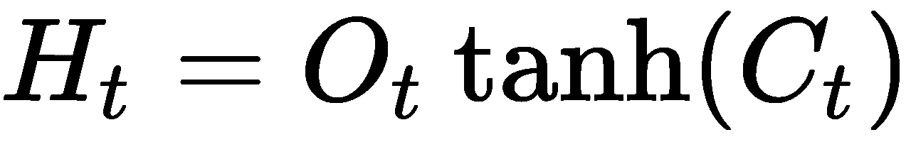]

现在我们知道了每个细胞中发生的不同操作，让我们真正理解前面的每个方程代表什么。它们如下:

*   候选层( [] )将单词( *X [ t ]* )和来自先前隐藏状态 *H [ t-1 ]* 的输出作为输入，并创建包括新单词的新记忆。
*   输入门( *I* )执行非常重要的功能。它基于前一个隐藏状态的输出来确定新的输入单词是否值得保留。
*   尽管遗忘门( *f* )看起来与输入门非常相似，但它执行不同的功能。当计算当前存储单元时，它确定前一个存储单元的相关性(或有用性)。

*   记忆状态(有时称为最终记忆)是在取遗忘门和输入门作为输入后产生的，然后选通新的记忆并将输出求和为乘积*C[t]。*
*   输出门区分存储器和隐藏状态，并确定存储器中存在的多少信息应该以隐藏状态存在。这产生了 *O [t]* ，然后我们用它来选通 tanh ( *C [t]* )。

# 门控循环单位

与 LSTM 类似，gru 也是对普通 RNNs 中隐藏细胞的改进。gru 也是通过存储过去的记忆来帮助未来做出更好的决策，从而解决渐变消失的问题。GRU 的动机源于质疑 LSTM 中存在的所有成分是否都是控制单位的遗忘和时间尺度所必需的。

这里的主要区别是，这种架构使用一个门控单元来决定要忘记什么以及何时更新状态，这使它具有更持久的内存。

在下图中，您可以看到 GRU 建筑的样子:

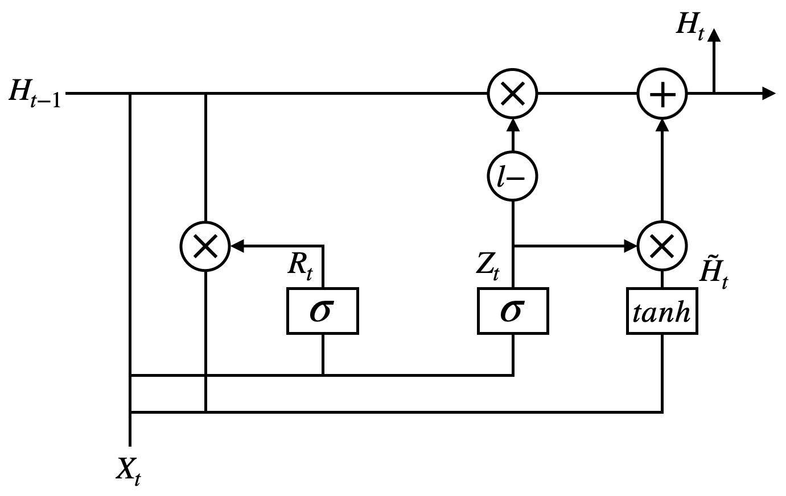

正如您在前面的图中看到的，它接受当前输入( *X [t]* )和先前的隐藏状态( *H [t-1]* )，与前面的 LSTM 相比，这里发生的操作要少得多。它有以下组件:

*   *Z[t]:更新门*
*   *R[t]:复位门*

*   [] :新记忆
*   *H [t]* :隐藏状态

为了产生当前隐藏状态，GRU 使用以下操作:

*   [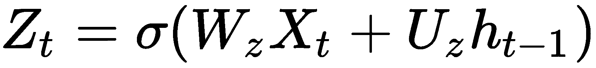]
*   [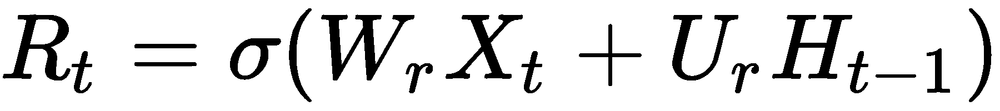]
*   [T31]
*   [T34]

现在，让我们分解前面的等式，以更好地了解 GRU 对其两个输入的影响。它们如下:

*   GRU 接受当前输入( *X [t]* )和先前的隐藏状态( *H [t-1]* )，并基于它所拥有的关于先前单词的信息将单词上下文化，以产生[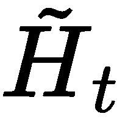]—新的记忆。
*   reset gate(*R[t]*)决定前一隐藏状态在计算当前隐藏状态中的重要性；也就是说，它是否与获得新的记忆有关，这有助于捕捉短期依赖性。
*   更新门( *Z [t] 一言以蔽之，如果 *Z [t] ≈1* ，那么之前的大部分隐藏状态都并入了当前的隐藏状态；但是如果 *Z [t] ≈0* ，那么大部分的新内存都是向前传递的。*
*   最后，根据更新门的结果，使用新的存储器和先前的隐藏状态来计算当前的隐藏状态(*H[t])。*

# 深层 RNNs

在前几章中，我们看到了增加神经网络的深度有助于获得更好的结果；RNNs 也是如此，增加更多层可以让我们了解更复杂的信息。

现在，我们已经了解了什么是 rnn，并了解了它们的工作原理，让我们更深入地了解一下深层 rnn 是什么样的，以及添加额外的层会给我们带来什么样的好处。深入研究 RNNs 并不像我们在处理 FNNs 和 CNN 时那么简单；这里我们必须考虑几种不同的情况，特别是如何以及在哪里增加层间的非线性。

如果我们想更深入，我们可以将更多隐藏的递归层堆叠在彼此之上，这允许我们的架构在多个时间尺度上捕获和学习复杂的信息，并且在信息从一层传递到另一层之前，我们可以添加非线性或门。

让我们从两个隐藏层的双向 RNN 开始，如下图所示:

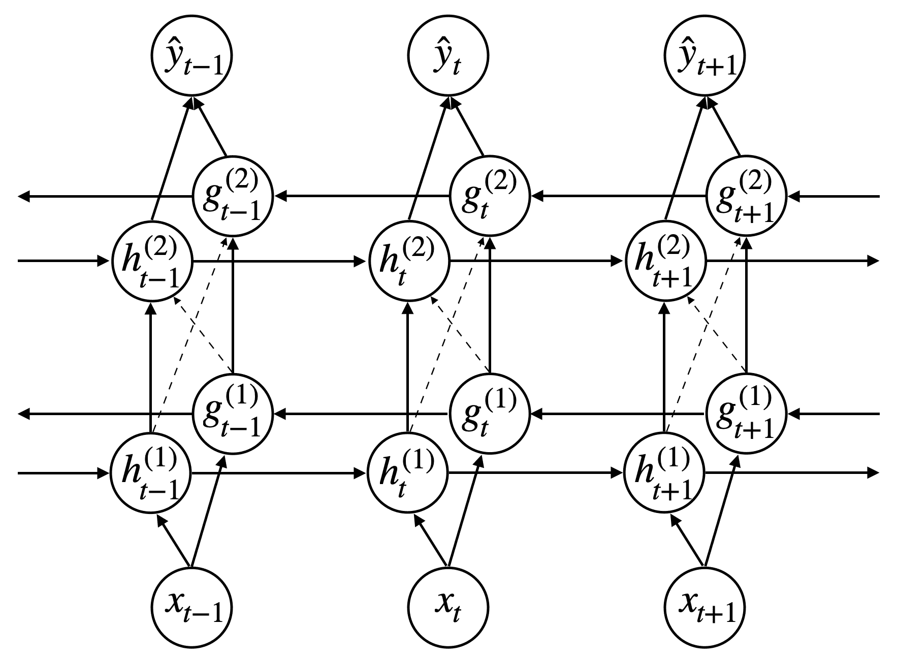

你可以看到，它看起来就像三个**多层感知器** ( **MLPs** )并排堆叠在一起，隐藏的层连接在一起，像以前一样，形成一个格子。同一层中的前向和后向隐藏单元之间也没有连接。每个隐藏节点在同一时间步直接进入其上面的节点，并且每个隐藏节点从前一层的相关隐藏节点中获取两个参数作为输入，一个来自前一层，另一个来自后一层。

我们可以将深度双向 RNN 的方程概括并写成如下:

*   在前向层中，我们有以下内容:

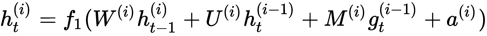

*   在向后层中，我们有以下内容:

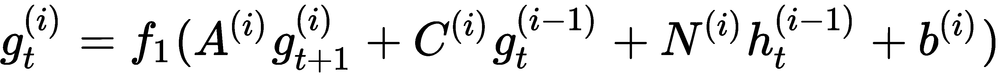

*   在输出层，我们有以下内容:

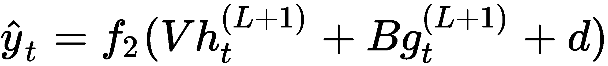

以此为指导，我们可以对 LSTMs 或 gru 做同样的事情，并将它们添加进来。

# 培训和优化

如同我们已经遇到的神经网络一样，rnn 也使用反向传播通过找到误差(损失)相对于权重的梯度来更新它们的参数。然而，在这里，它被称为通过时间 ( **BPTT** )的**反向传播，因为 RNN 中的每个节点都有一个时间步长。我知道这个名字听起来很酷，但它与时间旅行无关——它仍然只是一个很好的老式反向传播，带有梯度下降，用于参数更新。**

这里，使用 BPTT，我们想要找出隐藏单元和输出对总误差的影响，以及改变权重( *U，V，W* )对输出的影响。 *W* ，正如我们所知，在整个网络中是恒定的，所以我们需要一路遍历回到初始时间步长来对其进行更新。

当在 RNNs 中反向传播时，我们再次应用链式法则。使训练 RNNs 变得棘手的是，损失函数不仅依赖于输出层的激活，还依赖于当前隐藏层的激活及其在下一时间步对隐藏层的影响。在下面的等式中，我们可以看到反向传播在 RNNs 中是如何工作的。

如您所见，我们首先找到交叉熵损失(在*普通 RNNs* 部分中定义)；我们的总误差如下:

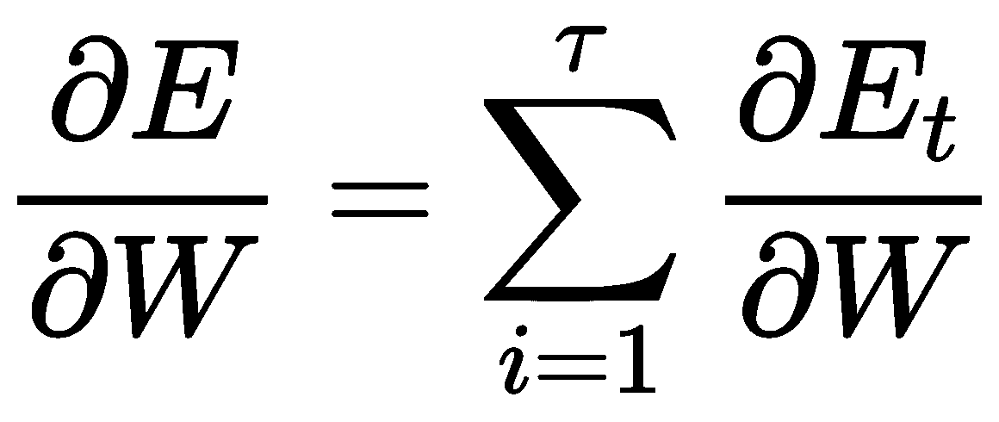

我们可以使用关于损失和隐藏层的链式法则来扩展前面的等式，如下所示:

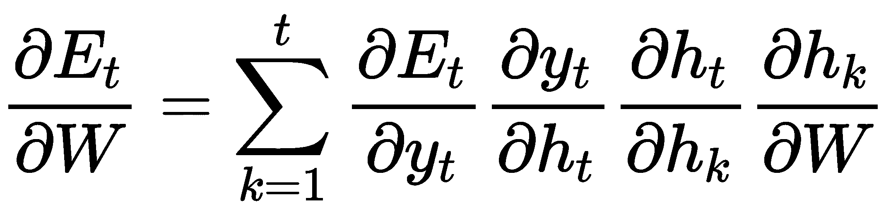

让我们重点关注右侧的第三项，并对其进行扩展:

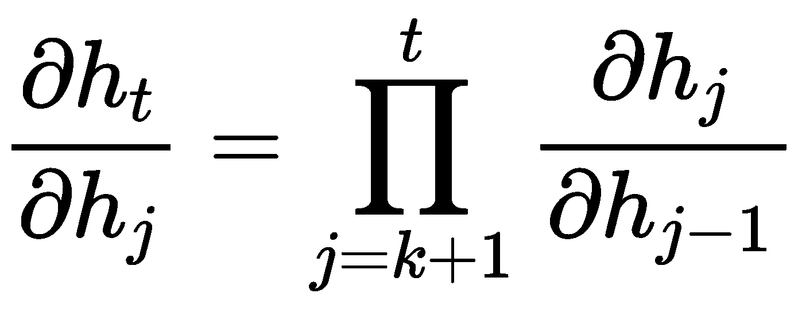

你应该注意到这里的每个部分都是一个雅可比矩阵。

现在，我们可以将上述等式结合起来，全面了解如何计算误差，如下所示:

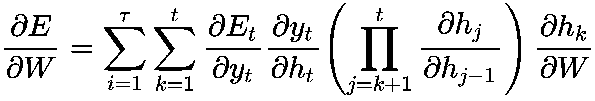

从本章前面的内容中我们知道， *h [t]* 是使用以下公式计算的:

所以，我们可以计算出*h[t]的梯度，如图所示:*

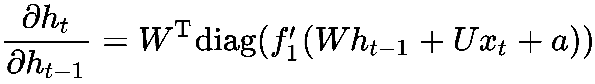

由于隐藏神经元也将*x[t]作为输入，我们也需要对 *U* 求导。我们可以这样做:*

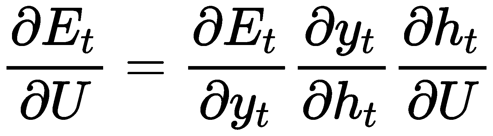

但是等等——正如我们所看到的，隐藏单元接受两个输入。因此，让我们使用刚才看到的内容反向传播一个时间步长，看看它是如何工作的:

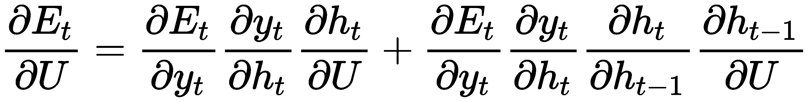

利用这一点，我们现在可以对所有先前的梯度求和，直到当前的梯度，如下所示:

在 LSTM 或 GRU 的向后传球与我们在常规 rnn 中所做的非常相似，但是由于门的原因，这里有一些额外的复杂性(我们在这里将不讨论 lstm 或 GRUs 中向后传球之间的差异)。

# 流行建筑

现在我们已经了解了用于对比 RNN 的所有组件，让我们来探索一种由该领域研究人员开发的流行架构——T2 发条 RNN T3(**CW-RNN T5)。**

# 发条 RNNs

正如我们所了解的，发现 rnn 中的长期依赖性是非常具有挑战性的，而 LSTMs 和 GRUs 就是为了克服这种限制而设计的。CW-RNN 是由 IDSIA 的 Jürgen Schmidhuber 领导的一个小组创建的，它修改了 vanilla RNN 模块，以便将隐藏层划分为单独的模块，每个模块以不同的时间粒度处理其输入。这意味着隐藏层以它们预设的时钟速率执行计算(这就是这个名字的由来)。与常规的 rnn 和 LSTMs 相比，这样做的效果是减少了可训练参数的数量并提高了精确度。

正如我们早期的 RNN 具有输入到隐藏和隐藏到输出的连接，CW-RNN 也具有相同的连接，只是隐藏层中的神经元被划分为大小为 *k* 的 *g* 模块，每个模块都有一个指定的时钟周期 [] 。

这些模块完全连接在一起，但是从模块 *j* 到 *i* 的循环连接不是 if 周期 [] 。这些模块按递增周期排序，因此，连接从慢到快(从右到左)。

在下图中，我们可以看到 CW-RNN 的架构:

模块 *i* 的时钟周期可计算如下:

输入和隐藏权重矩阵被分成 *g* 个块行，如下所示:

和

在上式中， *W* 是上三角矩阵，每个 *W [i]* 值被分割成块列:

在正向传递期间，只有隐藏权重矩阵和输入权重矩阵的块行对应于所执行的模块，其中以下为真:

具有较低时钟速率的模块从输入中学习并保持长期信息，而具有较高时钟速率的模块学习本地信息。

我们在前面的等式中提到，每个隐藏层被划分为大小为 *k* 的 *g* 个模块，这意味着总共有 *n = kg* 个神经元。由于神经元仅连接到具有相似或更大周期的神经元，隐藏到隐藏矩阵中的参数数量如下:

让我们将其与我们的普通 rnn 进行比较，后者有 *n ²* 个参数。让我们看看这是怎么回事:

CW-RNN 大约有一半的参数。

# 摘要

在这一章中，我们介绍了一种非常强大的神经网络——RNNs。我们还了解了 RNN 细胞的几种变体，如 LSTM 细胞和格鲁什细胞。像前面章节中的神经网络一样，这些也可以扩展到深度神经网络，它有几个优点。特别是，他们可以学习更多关于顺序数据的复杂信息，例如，用语言。

在下一章，我们将学习注意机制，以及它们在语言和视觉相关任务中的日益流行。