# 几何深度学习

通过这本书，我们了解了用于深度学习的各种类型的神经网络，如卷积神经网络和递归神经网络，它们在各种任务中取得了一些巨大的成果，如计算机视觉、图像重建、合成数据生成、语音识别、语言翻译等。到目前为止，我们看到的所有模型都是基于欧几里德数据训练的，即可以用网格(矩阵)格式表示的数据，如图像、文本、音频等。

然而，我们希望应用深度学习的许多任务都使用了非欧几里德数据(稍后将详细介绍)——这是我们迄今为止遇到的神经网络无法处理和处理的类型。这包括处理传感器网络、网格表面、点云、对象(计算机图形学中使用的那种)、社交网络等等。一般来说，几何深度学习旨在帮助深度神经网络推广到图和流形(我们在[第五章](758f1209-7a1d-474c-b494-bbf905a25afd.xhtml)、*图论*中学习了图，我们将在本章中很快学习流形)。

我们将在本章中讨论以下主题:

*   比较欧几里得和非欧几里得数据
*   图形神经网络
*   光谱图 CNN
*   混合模型网络
*   3D 人脸识别

我们开始吧！

# 比较欧几里得和非欧几里得数据

在我们了解几何深度学习技术之前，我们需要了解欧几里德和非欧几里德数据之间的差异，以及为什么我们需要单独的方法来处理它。

在过去的 8 年中，FNNs、CNN 和 RNNs 等深度学习架构已被证明在各种任务中取得了成功，如语音识别、机器翻译、图像重建、对象识别和分割以及运动跟踪。这是因为他们能够利用和使用数据中存在的本地统计属性。这些属性包括平稳性、局部性和组合性。在 CNN 的情况下，它们作为输入的数据可以用网格形式表示(比如图像，可以用矩阵和张量表示)。

在这种情况下(图像),稳定性来自于 CNN 具有以下特性:

*   移位不变性，由于使用了卷积。
*   局部性可归因于局部连通性，因为内核不仅观察单个像素，还观察相邻像素。
*   组合性来自于它由多个尺度(或层次)组成，其中简单的结构被组合来表示更抽象的结构。

然而，并非所有数据都可以用深度神经网络所需的格式来表达，如果它可以扭曲成网格形式，这意味着我们必须牺牲复杂数据中存在的大量关系，以支持我们的神经网络可以作为输入的更简单的表示。

这三个属性限制了神经网络可以学习的内容以及我们可以使用它们解决的问题的种类。

正如您可能已经猜到的，现实世界中存在的许多数据无法在网格中正确捕获。然而，这种数据可以用图形或流形来表示。可以用图形表示的数据示例包括社交网络、学术论文引用网络、通信网络、知识图、分子和路线图。另一方面，我们可以利用黎曼流形(下一节将详细介绍)来表示三维物体(体积的)，如动物、人体、脸、飞机、椅子等等。简而言之，两者都是捕捉节点之间可能存在的关系的方法。

这种类型的数据对于神经网络来说很难处理，因为它缺乏它们习惯于在训练期间被馈送的结构。例如，我们可能希望使用两个节点之间的权重(或强度)来表示社交网络中两个人的亲密程度。在这个场景中，我们这样做是为了给一个用户提出一个新朋友的建议，让他添加到他们现有的网络中。然而，没有直接的方法可以用来在特征向量中表示这些信息。

在学习几何深度学习中使用的方法之前，我们先来学习一下流形到底是什么。

# 多支管

一个**流形**是任何一个拓扑空间，其中，在任一点( *p* )的邻域内，它与一个 *k* 维欧氏空间拓扑等价(或同胚)。我们在本书的前面遇到了术语流形，但是我们没有正确地定义它，所以我们现在将这样做。前面的定义可能听起来有点令人生畏，但过一会儿它会变得更有意义。

假设我们有一个一维流形。为了简单起见，我们将使用存在于 [] 中的圆或圆盘(我们将其表示为 *S ^( 1 )* )(也有其他一维流形，如抛物线、双曲线和三次曲线，但这不是我们现在关心的)。

假设我们有以下流形:

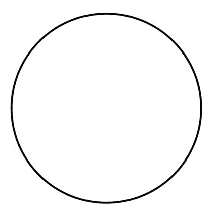

现在，如果我们放大左上方象限的圆的曲线很多次，最终，我们会达到一个放大倍数，曲线看起来像一条直线(有点像该点的切线):

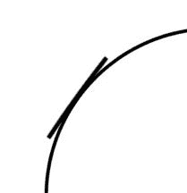

如上图所示，我们放大了左上方，并在一点处绘制了一条切线，在该点处，曲线几乎与切线平行。我们越放大，这条线看起来就越直。

类似地，如果我们有一个二维流形，比如一个存在于中的球体(我们将其表示为 *S ^( 2 )* ),我们放大它，那么在表面上的任何一点，它看起来都像一个扁平的圆盘。流形不一定是球面；它可以是任何具有流形特征的拓扑空间。为了形象化这一点，把地球想象成一个流形。无论你站在哪里看，地球看起来都是平的(或平面的)，尽管它是弯曲的。

我们可以分别写出单位圆和单位球，如下:

*   [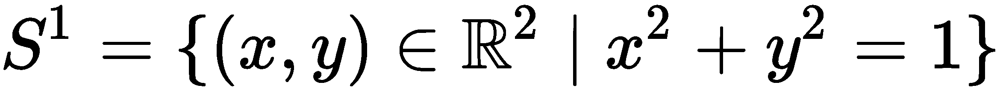]
*   [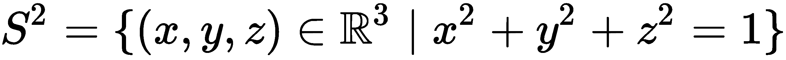]

类似地，我们也可以将高维流形写成如下形式:

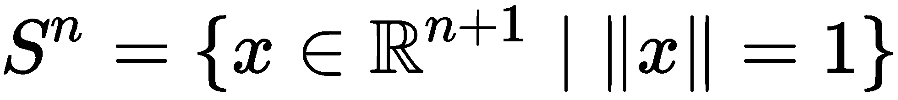

形式上，中的(可微) *k* 维流形 M 是中的点集，其中对于每个点， *p ∈ M* ，都有一个小的开邻域， *U， *p* 的*，一个向量值可微函数， [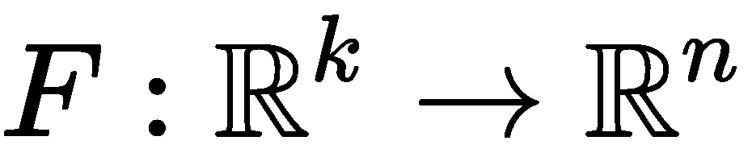] ，以及一个开集， [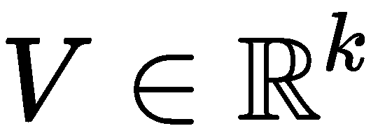，]如下:

*   [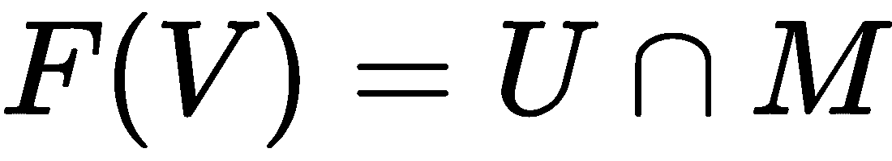]
*   *F* 的雅可比矩阵在 *V* 中的每个点都有秩 *k* ，其中 *F* 的雅可比矩阵是一个 *n* × *k* 矩阵，如下所示:

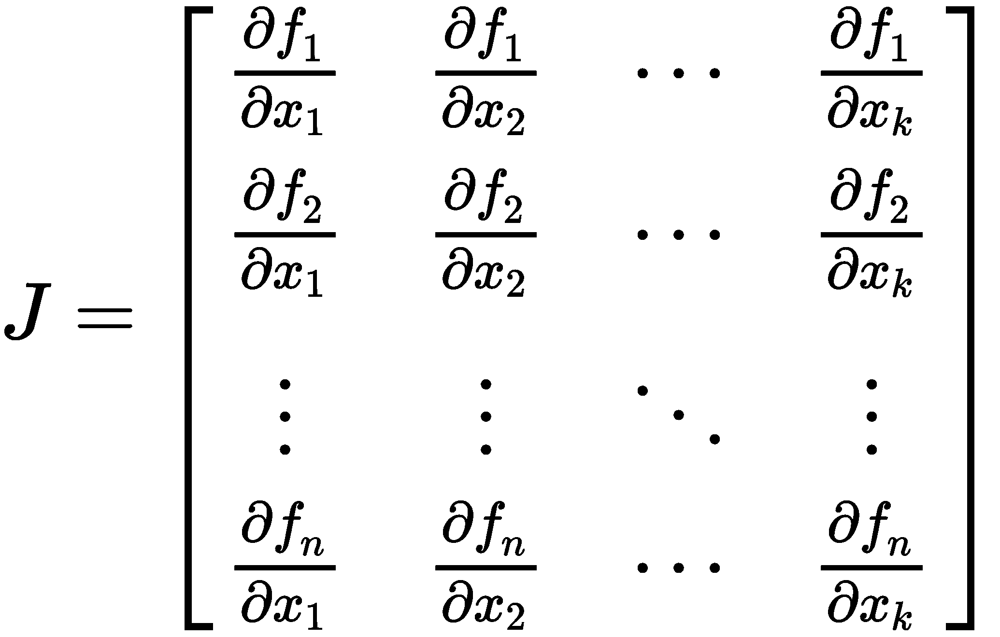

这里， *F* 是流形的局部参数化。

我们还可以使用现有的拓扑空间，通过笛卡尔积来创建新的拓扑空间。假设我们有两个拓扑空间， *X* 和 *Y* ，它们的笛卡尔积是 [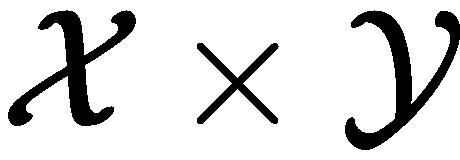] ，其中每个[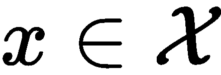][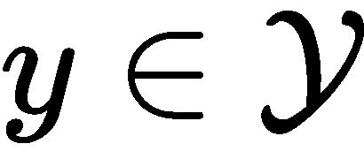]生成一个点， [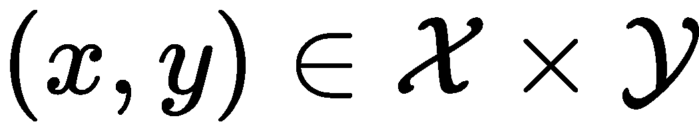] 。一个大家熟悉的笛卡尔积是三维欧氏空间，其中 [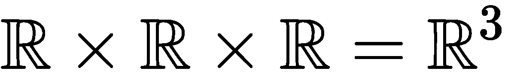] 。不过需要注意的是 [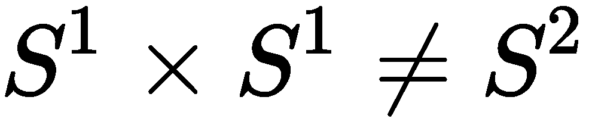] (它实际上等于 *T ^( 2 )* ，是一个圆环面，但我们会避免深入为什么，因为那超出了本书的范围)。

在计算机图形学中，我们使用嵌入在 [] 中的二维流形来表示三维物体的边界曲面。

因为这些参数流形是对象，它们将有一个方向，为了定义这个方向，我们需要流形的切空间。然而，在我们能够定义切空间之前，我们需要澄清一些概念。再次假设我们有一个*k*-维流形， *M* ，定义在 [] (其中 *k < n* )。这里，对于每个 *p ∈ M，*有一个开集， *U* ，包含 *p* 和( *n-k* )实值函数， [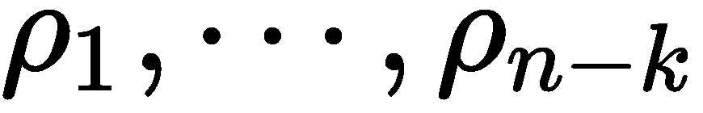，]定义在 *U* 上，使得 [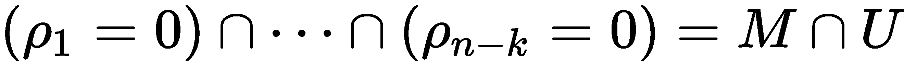] 和在每个点 [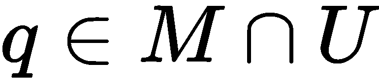] ，我们有以下线性无关的向量:

现在，在 *p* 处到 *M* 的法线空间被写成 *N [p] (M)* 并且由以下向量跨越:

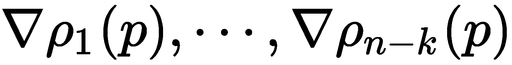

我们已经知道，切线垂直于法向量，因此在 *p* 处的流形的切线空间 *T [p] (M)* 由垂直于每个法向量 *N [p] (M)* 的所有向量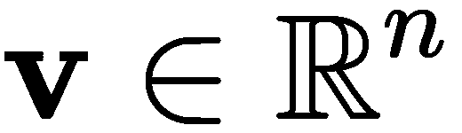组成。然而， [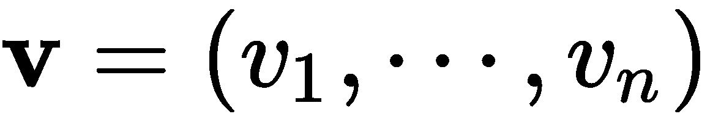] 只在 *T [ p ] (M)* 中存在——且仅当——对于所有的 [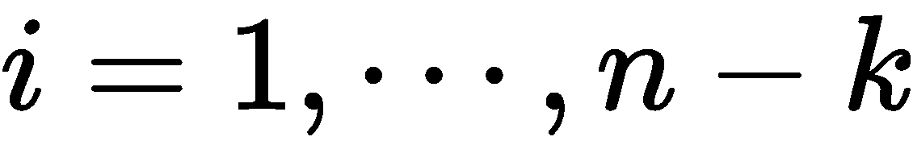] ，我们有如下:

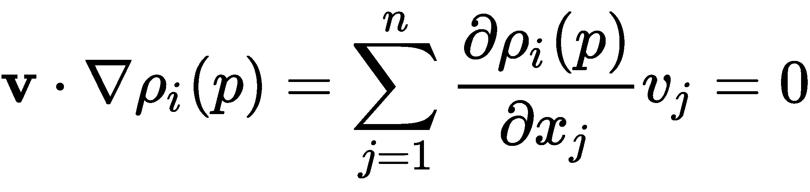

一旦我们有了切空间，我们就可以用它来定义一个黎曼度量，如下所示:

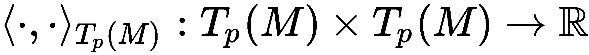

该度量允许我们执行角度、距离和体积的局部测量，以及定义该度量的任何流形。这被称为**黎曼流形**。

在我们继续之前，有两个术语非常重要，需要我们熟悉:

*   **等距图**:公制保形变形
*   **测地线**:在 *p* 和*p’*之间的 *M* 上的最短路径

有趣的是，我们可以用标量场和向量场来定义流形，这意味着我们可以将微积分扩展到流形。在这种情况下，我们需要引入三个新概念，如下:

*   **标量字段** : [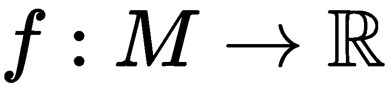]

*   **矢量场** : []

*   **具有内积的希尔伯特空间**:

希尔伯特空间是一个抽象的向量空间，它仅仅推广了欧几里得空间的概念。所以，我们所学的关于向量代数和微积分的方法可以从二维和三维欧几里得空间扩展到任意或无穷多个维度。

自然地，如果我们要定义流形上的微积分，我们希望能够求导，但这不像对曲线那样清楚。对于流形，我们利用切空间，使得 [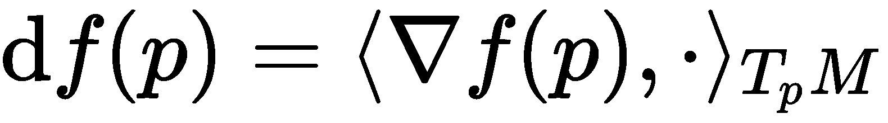] ，方向导数为 [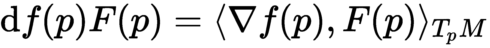] ，这告诉我们 *f* 在点 *p* 处沿方向 *F(p)* 变化多少。本征梯度算子告诉我们, *f* 的变化最陡的方向，它由下式计算:

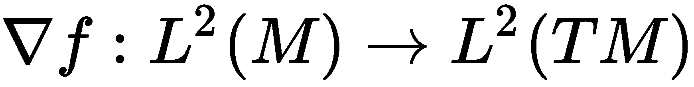

固有散度算子通过以下等式计算点 *p* 处的油田净流量 *F* :

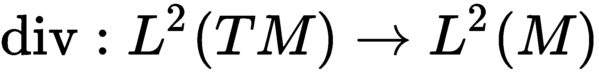

利用这一点，我们可以找到梯度的形式伴随，如下:

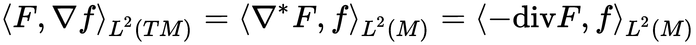

现在，我们可以找到拉普拉斯算子， [] ，它使用 [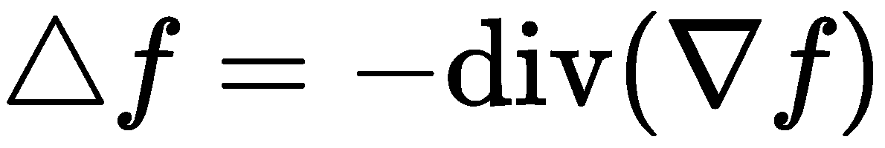] 计算 *f(x)* 和 *f* 在点 *p* 附近的平均值之差，这告诉我们拉普拉斯算子是等距不变的(等距是度量空间之间的距离保持变换。然而，在几何学中，我们有时希望用一种不随等距变化的方式来定义一个对象的形状。这意味着对象可以变形，使其弯曲但不拉伸，因此不影响固有距离)，正定和对称，如下所示:

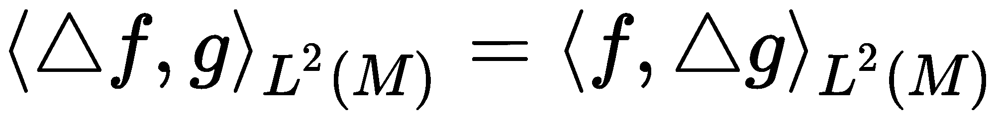

# 离散流形

暂且让我们回想一下[第五章](758f1209-7a1d-474c-b494-bbf905a25afd.xhtml)、*图论*，在这里我们学到了图论。作为快速复习，一个图， *G* ，是由顶点、 [、]和边、 [] 和无向边、[]IFF[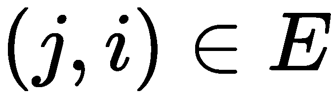]组成的。加权图的边有权重， [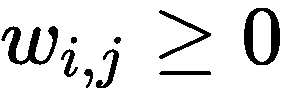，]为所有 [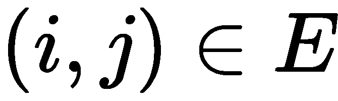] ，顶点也可以有权重。

我们在这里关心图的原因是因为我们也可以在图上做微积分。为此，我们将需要定义一个顶点字段、[、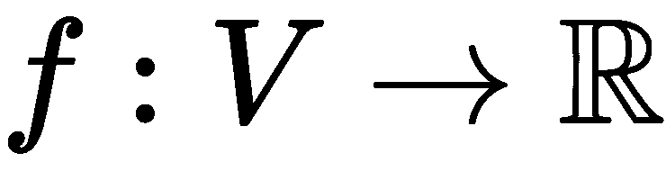、]和一个边字段、[、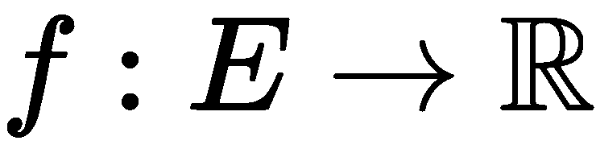、](我们也假设[、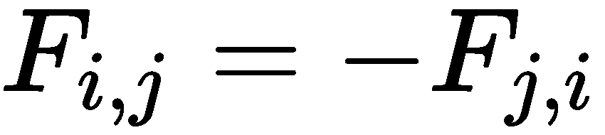、])。有内积的希尔伯特空间有 [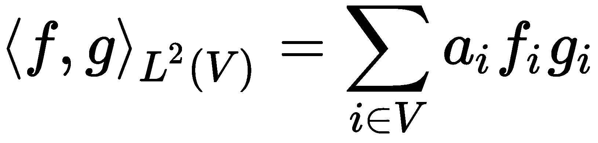] 和 [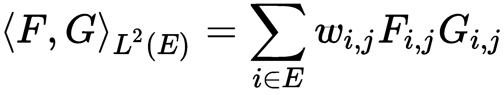] 。

现在我们无疑知道，在微积分中，我们非常喜欢梯度，自然地，我们可以为图定义一个梯度算子， [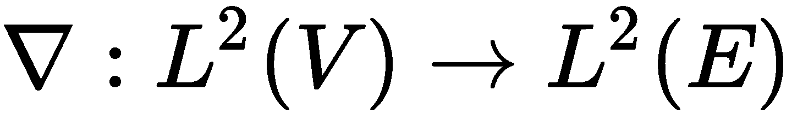，]给我们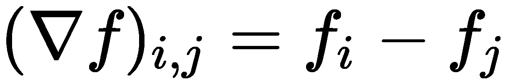和一个发散算子， [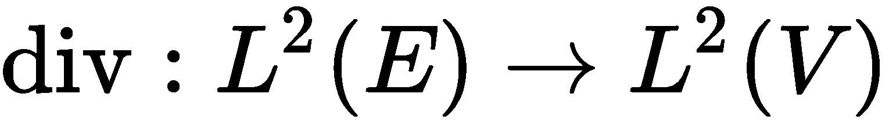，]产生 [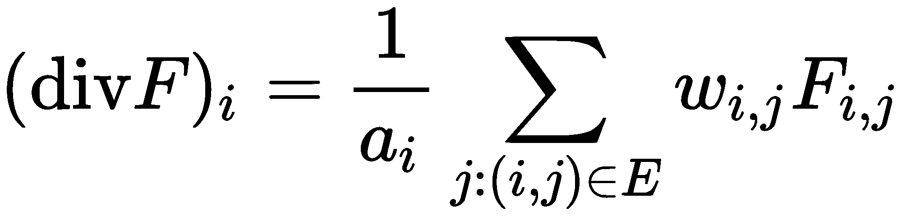] 并伴随着梯度算子， [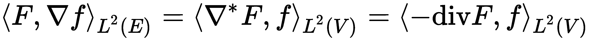] 。

将图的拉普拉斯算子，[、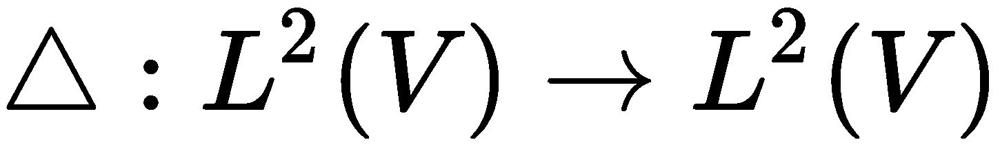、]定义为[、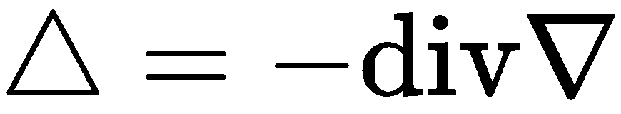。]通过结合前面的两个等式，我们可以得到以下等式:

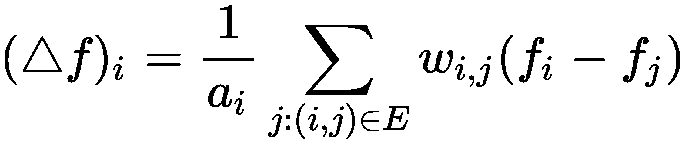

与流形的情况一样，这将计算 *f* 与其局部平均值(即相邻节点的平均值)之间的差值。我们可以将此改写为半正定方阵:

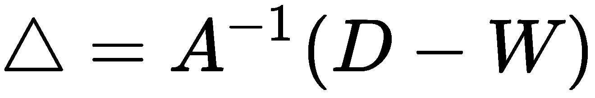

我们也可以把这个写成非规格化拉普拉斯算子，其中 *A = I* :

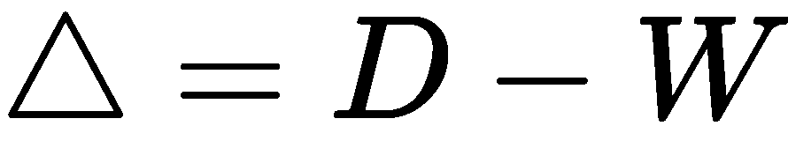

最后，我们可以把它写成随机游走拉普拉斯算子，其中 *A = D* :

这里有[][][]。

利用图，我们可以公式化离散流形，即利用顶点、 [] 、边、 [] 、面、 [] 来描述三维物体。这通常被称为三角形网格。在流形网格中，每个边由两个面共享，每个顶点有一个循环。

在我们继续之前，让我们使用余切公式重新定义三角形网格上的拉普拉斯算子，它可以为具有坐标 [] 的嵌入网格定义，并且根据边的长度。

嵌入网格的余切拉普拉斯算子如下:

这里， [] (因为我们在处理三角形)和余切拉普拉斯算子，就边长而言，如下:

这里， [] ， *s* 是半周长， [] 。

# 光谱分析

为了理解谱分析，我们必须首先定义紧致流形上的拉普拉斯算子， *M* ，它具有可数个特征函数:

这是给 [] 的。

由于对称性，本征函数将既是实的又是正交的，这给出了以下结果:

这里特征值是非负的，即 [] 。

对于二维流形，我们经常使用 Weyl 定律来描述特征值的渐近行为，它看起来如下:

使用本征函数和本征值，我们可以将图拉普拉斯本征分解成如下:

在这里， [] 和 [] 。

现在，如果我们将此作为一个广义特征问题，我们将从带有*A*-正交特征向量、 [] 的前述方程中获得以下内容:

如果我们通过代入 [] 来改变变量，我们会发现自己遇到了标准的特征值问题:

这里特征向量是正交的，即 [] 。

# 图形神经网络

图形神经网络是几何深度学习的典型神经网络，顾名思义，它们在基于图形的数据(如网格)上工作得特别好。

现在，让我们假设我们有一个图， *G* ，它有一个二元邻接矩阵， *A* 。然后，我们有另一个矩阵， *X* ，它包含所有的节点特征。这些特征可以是文本、图像或分类、节点度、聚类系数、指示向量等等。这里的目标是使用局部邻域生成节点嵌入。

正如我们所知，图上的节点有相邻节点，在这种情况下，每个节点都试图使用神经网络聚集来自其邻居的信息。我们可以把网络邻居想象成一个计算图。由于每个节点具有不同节点的边，每个节点具有唯一的计算图。

如果我们回想卷积神经网络，我们知道卷积是一种窗口，我们可以滑过输入并将数据总结为简化形式。聚合器操作与卷积操作的工作方式类似。

让我们深入研究一下，看看它们在数学上是如何工作的。

在每一层，节点都有嵌入，初始嵌入相当于节点特征:

*v* 的 *k ^第层*层嵌入如下:

对所有的 *k > 0* 都这样做，其中 [] 是 *v* 的前一层嵌入， [] 是邻居的前一层嵌入的平均值。在训练过程中，模型学习*W[K]和*B[K]，经过 *K* 层邻域聚合后每个节点的输出嵌入如下:**

为了生成高质量的嵌入，我们在*z[v]上定义了一个损失函数，并将嵌入内容馈入其中，之后我们执行梯度下降来训练聚集参数。*

在监督任务的情况下，我们可以将损失定义如下:

假设我们有以下无向图:

这样，我们想要计算实体节点的更新，如下所示:

为了计算更新，我们可以使用以下公式:

这里， *N ^((i))* 是节点 *i* 的邻居， *c [i，j]* 是归一化常数。

# 光谱图 CNN

光谱图 CNN，顾名思义，使用光谱卷积，我们定义如下:

在这里， [] 。我们可以用矩阵形式改写如下:

这不是移位不变的，因为 *G* 没有循环结构。

现在，在频谱域中，我们将卷积层定义如下:

这里， [] 、 [] 和 [] 是频谱滤波器系数的 n×n 对角矩阵(它们是基相关的，这意味着它们不会在不同的图形上推广，并且限于单个域)，ξ是应用于逐顶点函数值的非线性。

这意味着，如果我们在一个域上学习具有基φ的卷积滤波器，它将不能转移或适用于具有基ψ的另一个任务。这并不是说我们不能创建可用于不同领域的碱基——我们可以——然而，这需要使用联合可对角化的程序。但是这样做需要事先了解这两个领域以及它们之间的关系。

我们也可以在非欧几里得域中定义汇集函数。我们称之为图粗化，在这种情况下，图的顶点只剩下一小部分 *α < 1* 。如果我们具有不同分辨率的图拉普拉斯的特征向量，那么它们将通过以下等式相关:

这里，φ是一个 *n* × *n* 矩阵，是一个α * n * × α *n* 矩阵， *P* 是一个α * n * × *n* 二元矩阵，表示粗化后的图的第*I^(th)顶点在原图上的位置。*

图形神经网络，就像我们在前面章节中学习的神经网络一样，也可能会过度拟合，为了避免这种情况发生，我们调整了学习复杂性，以尝试减少模型中自由参数的总数。为此，我们在频域中使用滤波器的空间定位。在欧几里得域中，我们可以这样写:

这告诉我们，为了学习一个图层，其中的要素不仅仅局限于原始属性域，还可以在其他位置共享，我们必须学习平滑的光谱乘数。频谱乘数参数化如下:

这里的 [] ，是大小为 *k* × *q* 的固定插值矩阵，α是大小为 *q* 的插值系数的向量。

# 混合模型网络

现在，我们已经看到了 GNNs 如何工作的一些例子，让我们更进一步，看看我们如何将神经网络应用于网格。

首先，我们使用在 *d* 维伪坐标 [] 的局部系统中的每个点上定义的面片，围绕 *x* 。这被称为测地线极坐标。在这些坐标中的每一个上，我们应用一组参数核， [] ，产生局部权重。

这里的核的不同之处在于它们是高斯的而不是固定的，并且使用以下等式来产生:

这些参数( [] 和 [] )是可以训练和学习的。

具有滤波器的空间卷积 *g* 可定义如下:

这里， [] 是顶点 *i* 处的特征。

之前我们提到了测地极坐标，但是到底是什么呢？让我们定义它们并找出答案。我们可以这样写:

这里， [] 是 *i* 和*j*[]是从 *i* 到 *j* 的测地线方向。然而，在这里，定位有些模糊。

现在，我们可以定义角度最大池(旋转过滤器)，如下所示:

# 3D 人脸识别

让我们继续，看看这如何转化为现实世界的问题，如 3D 面部识别，这是用于电话，安全，等等。在 2D 图像中，这将在很大程度上取决于姿势和照明，并且我们无法获得深度信息。由于这一限制，我们改用 3D 人脸，这样我们就不必担心光照条件、头部方向和各种面部表情。对于这个任务，我们将使用的数据是网格。

在这种情况下，我们的网格组成了一个无向连通图， *G = (V，E，A)* ，其中| *V* | = *n* 是顶点， *E* 是一组边， [] 包含了*d*-维伪坐标， [] ，其中 [] 。节点特征矩阵表示为 [] ，其中每个节点包含 *d* 维特征。我们接着将特征图的*l^(th)通道定义为*f[l]，其中的*I^(th)节点记为 *f [ l ] (i)* 。***

伪坐标 *u(i，j)* 决定了网格中的特征是如何聚集的，并且正如我们所知，网格是由较小的三角形构成的，因此我们可以计算从所有节点 *i* 到节点 *j* 的伪坐标。这里，我们将使用全局标准化的笛卡尔坐标:

这使我们能够将空间关系映射到固定区域。

我们使用 [] 初始化权重，其中 中的 *l [是第 *k ^( th )* 层的输入特征的尺寸。]*

现在，我们可以计算从相邻节点 [] 到节点 *i* 的特征聚合，如下所示:

在这里， [] 。 [] 是 *B* 的基础——样条过度 *m* ， [] 是可以学习的参数。

这是一个分类任务，我们将使用交叉熵作为我们的损失函数。我们的做法如下:

这里， [] 和 *Y* 是标签矩阵。

就这样，我们可以结束关于几何深度学习的这一章。

# 摘要

在这一章中，我们学习了一些重要的数学主题，比如欧几里得和非欧几里得数据以及流形之间的区别。然后，我们继续学习深度学习领域中一些有趣的新兴主题，这些主题在传统深度学习算法被证明无效的众多领域中有着广泛的应用。这种新的神经网络类型，称为图形神经网络，通过扩展它来处理非欧几里得数据，大大扩展了深度学习的有用性。在本章的结尾，我们看到了图形神经网络的一个用例——3D 人脸识别。

这就把我们带到了这本书的结尾。祝贺您成功完成所提供的课程！